<!-- TOC --><a name="mysql-mariadb"></a>
# MySQL / MariaDB
***
- [MySQL / MariaDB](#mysql-mariadb)
   * [1. Tổng quan ](#1-tng-quan)
      + [1.1 MySQL](#11-mysql)
      + [1.2 MariaDB](#12-mariadb)
      + [1.3 So sánh ](#13-so-sánh)
   * [2. Cài đặt](#2-cài-t)
      + [2.1 Yêu cầu hệ thống  ](#21-yêu-cu-h-thng)
      + [2.2 Quy trình cài đặt ](#22-quy-trình-cài-t)
   * [3. Cấu hình tối ưu](#3-cu-hình-ti-u)
      + [3.1 Tối ưu hiệu năng  ](#31-ti-u-hiu-nng)
         - [3.1.1 Sử dụng InnoDB  ](#311-s-dng-innodb)
         - [3.1.2 Thread Cache ](#312-thread-cache)
      + [3.2 Cấu hình bảo mật cơ bản](#32-cu-hình-bo-mt-c-bn)
      + [3.3 Tối ưu truy vấn ](#33-ti-u-truy-vn)
         - [3.3.1 Index ](#331-index)
      + [3.3.2 Tối ưu với WHERE ](#332-ti-u-vi-where)
      + [3.3.2 Tối ưu với Select ](#332-ti-u-vi-select)
   * [4. Quản Trị Database Server](#4-qun-tr-database-server)
      + [4.1 User và quản lý quyền truy cập   ](#41-user-và-qun-lý-quyn-truy-cp)
      + [4.2 Sao lưu và phục hồi (Backup & Recovery)](#42-sao-lu-và-phc-hi-backup-recovery)
      + [4.3 Theo dõi hiệu năng (Monitoring)](#43-theo-dõi-hiu-nng-monitoring)
      + [4.4 Transaction và Lock ](#44-transaction-và-lock)
         - [4.4.1 Transaction](#441-transaction)
         - [4.4.2 Lock ](#442-lock)
   * [5. Bảo mật MySQL/MariaDB](#5-bo-mt-mysqlmariadb)
      + [6.2 MYSQL NDB Cluster  ](#62-mysql-ndb-cluster)
      + [6.3 InnoDB Cluster ](#63-innodb-cluster)
      + [6.4  MariaDB Galera and MariaDB MaxScale](#64-mariadb-galera-and-mariadb-maxscale)

<!-- TOC end -->


<!-- TOC --><a name="1-tng-quan"></a>
## 1. Tổng quan 
<!-- TOC --><a name="11-mysql"></a>
### 1.1 MySQL
- MySQL là một hệ quản trị cơ sở dữ liệu quan hệ (RDBMS) mã nguồn mở được sử dụng rộng rãi nhờ vào tốc độ cao, độ tin cậy, khả năng mở rộng, và tính dễ sử dụng. 
- Phù hợp với cả ứng dụng nhỏ và lớn, MySQL hoạt động trên đa nền tảng, tuân thủ tiêu chuẩn ANSI SQL, và được phát triển bởi Oracle Corporation. Ra mắt lần đầu vào năm 1995, MySQL đã trở thành một phần quan trọng trong nhiều hệ thống quản lý dữ liệu hiện đại. 
- MySQL sử dụng ngôn ngữ truy vấn cấu trúc (SQL) để quản lý và thao tác dữ liệu. MySQL tổ chức và lưu trữ dữ liệu dưới dạng các bảng, trong đó các bảng có thể liên kết với nhau thông qua các khóa (keys).
- Hoạt động của MYSQL
	- MySQL hoạt động theo mô hình client-server, nghĩa là có một máy chủ (server) lưu trữ phần mềm MySQL và các cơ sở dữ liệu, và có các máy khách (client) gửi yêu cầu đến máy chủ để thực hiện các thao tác với cơ sở dữ liệu.
	- MySQL sử dụng ngôn ngữ SQL để thực hiện các tác vụ. Các câu lệnh SQL là các lệnh được gửi đến máy chủ MySQL để đọc, thao tác hoặc kiểm soát dữ liệu được lưu trữ trong các cơ sở dữ liệu của nó. Ví dụ, lệnh SELECT được sử dụng để lấy dữ liệu từ cơ sở dữ liệu. Để thêm dữ liệu mới, lệnh INSERT được sử dụng. Tương tự, các lệnh DELETE và UPDATE được sử dụng để xóa hoặc cập nhật dữ liệu hiện có.
	- Trong mô hình client-server, máy khách thiết lập kết nối với máy chủ thông qua mạng. Kết nối này cho phép người dùng truy cập vào các cơ sở dữ liệu trên server và thực hiện các thao tác trên chúng bằng cách sử dụng các câu lệnh SQL. Khi một request từ giao diện người dùng (Graphical user interface – GUI), server sẽ phản hồi thông tin và trả về kết quả trên máy client. Quá trình này được minh họa qua sơ đồ sau:
- Ưu điểm của MySQL
	- MySQL là phần mềm mã nguồn mở, cho phép người dùng sử dụng và tùy chỉnh mà không cần phải trả phí.
	- Được thiết kế để xử lý dữ liệu nhanh chóng và hiệu quả, MySQL phù hợp với các ứng dụng web đòi hỏi tốc độ cao và khả năng phản hồi nhanh.
	- Có nhiều tài liệu, hướng dẫn về cú pháp SQL phù hợp với cả người mới bắt đầu.
	- Cung cấp nhiều tính năng bảo mật như xác thực người dùng, mã hóa dữ liệu và quản lý quyền truy cập chi tiết, giúp bảo vệ dữ liệu quan trọng.
	- MySQL có thể xử lý từ các cơ sở dữ liệu nhỏ đến các hệ thống lớn với hàng triệu bản ghi, dễ dàng mở rộng khi nhu cầu tăng lên mà không cần thay đổi cấu trúc hệ thống.
	- Hỗ trợ các tính năng transaction đảm bảo tính toàn vẹn và nhất quán của dữ liệu, giúp quản lý các thao tác dữ liệu phức tạp.
- Nhược điểm 
	- So với các hệ quản trị cơ sở dữ liệu như PostgreSQL, MySQL thiếu một số tính năng nâng cao như hỗ trợ đầy đủ cho các truy vấn phức tạp, hệ thống kiểu dữ liệu phong phú hơn, và các tính năng phân tích dữ liệu tiên tiến.
	- MySQL có thể gặp vấn đề về hiệu suất, thời gian phản hồi chậm khi xử lý lượng dữ liệu cực kỳ lớn hoặc các truy vấn rất phức tạp,
	- Một số tính năng không thể tùy chỉnh hoặc mở rộng theo nhu cầu cụ thể của doanh nghiệp, hạn chế khả năng thích ứng với các yêu cầu đặc thù.
	- Việc quản lý quyền truy cập chi tiết cho nhiều người dùng và vai trò khác nhau có thể trở nên phức tạp và khó khăn.
	- Mặc dù có cộng đồng lớn, nhưng việc không có hỗ trợ chính thức miễn phí từ nhà phát triển có thể gây khó khăn khi gặp các vấn đề phức tạp hoặc lỗi hệ thống nghiêm trọng.
	- MySQL có một số mở rộng và khác biệt so với chuẩn SQL, điều này có thể gây khó khăn khi chuyển đổi hoặc tích hợp với các hệ quản trị cơ sở dữ liệu khác.
<!-- TOC --><a name="12-mariadb"></a>
### 1.2 MariaDB
- MariaDB là một hệ quản trị cơ sở dữ liệu quan hệ mã nguồn mở, được phát triển từ MySQL. Được sáng lập bởi Michael Widenius, một trong những người đồng sáng lập MySQL, MariaDB ra đời nhằm cung cấp một giải pháp thay thế hoàn toàn miễn phí và cải tiến hơn so với MySQL.
- MariaDB có nhiều đặc điểm nổi bật giúp nó khác biệt so với MySQL và các hệ thống cơ sở dữ liệu mã nguồn mở khác.
- InnoDB là công cụ lưu trữ mặc định, đảm bảo hiệu suất cao và độ tin cậy, hỗ trợ giao dịch và khóa liên kết.
- XtraDB, từng được sử dụng trước phiên bản 10.1, nay đã được thay thế bởi InnoDB từ 10.2.
- MyRocks là công nghệ lưu trữ tối ưu hóa tốc độ và tiết kiệm không gian, giúp giảm hao mòn thiết bị.
- Galera Cluster là hệ thống phân cụm mạnh mẽ, đảm bảo sao lưu dữ liệu đồng bộ và tăng tính ổn định.
- Sequence Engine cho phép tạo dãy số theo thứ tự tăng hoặc giảm mà không cần lưu trữ trên ổ đĩa.
- MariaDB được tích hợp trong hầu hết các dịch vụ đám mây và là lựa chọn mặc định trong nhiều bản phân phối Linux. MariaDB nổi bật nhờ tốc độ nhanh, khả năng mở rộng tốt và độ ổn định cao, cùng với hệ sinh thái plugin và công cụ lưu trữ phong ph
- Ưu điểm:
	- MariaDB là một phiên bản miễn phí của MySQL với tốc độ nhanh hơn và cơ chế sao chép tốt hơn.
	- Mã nguồn mở, dễ cài đặt và đáng tin cậy cho các tác vụ quan trọng.
	- Xử lý truy vấn hiệu quả, đặc biệt phù hợp với dữ liệu lớn.
	- Chuyển đổi từ MySQL sang MariaDB dễ dàng, không cần thay đổi nhiều.
	- Hỗ trợ nhiều công cụ lưu trữ hơn so với MySQL.
- Nhược điểm:
	- Dù cố gắng duy trì tính tương thích với MySQL, các tính năng mới của MariaDB có thể gây ra sự khác biệt ảnh hưởng đến một số ứng dụng.
	- Cộng đồng nhỏ hơn so với MySQL, dẫn đến ít tài nguyên hỗ trợ hơn.
<!-- TOC --><a name="13-so-sánh"></a>
### 1.3 So sánh 

| Tiêu chí             | MariaDB                                | MySQL                                                                  |
| -------------------- | -------------------------------------- | ---------------------------------------------------------------------- |
| Quyền sở hữu         | Hoàn toàn mã nguồn mở                  | Thuộc sở hữu của Oracle, có phiên bản mã nguồn mở và phiên bản trả phí |
| Giấy phép            | GPL v2                                 | GPL hoặc giấy phép độc quyền                                           |
| Hiệu suất            | Tốc độ nhanh hơn, tối ưu hiệu suất     | Có thể chậm hơn MariaDB trên cơ sở dữ liệu lớn                         |
| Khả năng tương thích | Duy trì tính tương thích cao với MySQL | Hỗ trợ nhiều hệ thống khác nhau                                        |

<!-- TOC --><a name="2-cài-t"></a>
## 2. Cài đặt
<!-- TOC --><a name="21-yêu-cu-h-thng"></a>
### 2.1 Yêu cầu hệ thống  
- Hệ điều hành: Windows, Linux (Ubuntu, Debian, CentOS, RedHat, v.v.)
- CPU: Ít nhất 1 nhân, khuyến nghị 4+ nhân
- RAM: Tối thiểu 512MB, tốt nhất là 1GB+
- Ổ cứng: Tối thiểu 1GB, tùy vào dữ liệu

<!-- TOC --><a name="22-quy-trình-cài-t"></a>
### 2.2 Quy trình cài đặt 
- MySQL    
	- Windows 
		- Truy cập trang chủ để tải file cài đặt [MySQL Community Downloads](https://dev.mysql.com/downloads/installer/)
		- 
		- Chạy file cài đặt 
		- Chọn phần mềm cần cài: có thể chọn chỉ cài Server hoặc chọn Full để cài thêm phần mềm client 
		- 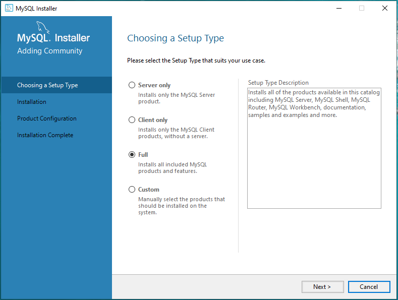
		- 
		- Quá trình cài đặt diễn ra 
		- 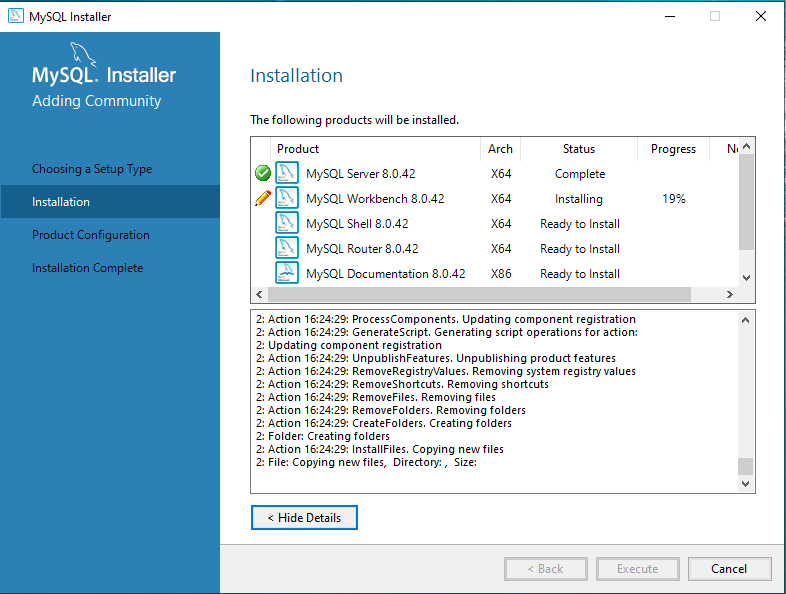
		- Cấu hình port 
		- 
		- Cấu hình mật khẩu root
		- 
		- 
		- Cấu hình Windows Service 
		- 
		- Apply 
		- 
		- Kiểm tra 
		- 
		- Hoàn tất cài đặt 
		- 

	- Linux (Ubuntu)
		- Chạy lệnh cập nhật 
		```
		apt update && apt upgrade -y 
		```
		- 
		- Chạy lệnh cài đặt 
		```
		sudo apt install mysql-server -y 
		```
		- 
		- Khởi động và Kiểm tra 
		```
		systemctl start mysql.service
		systemctl status mysql
		```
		- 
		- Tạo database, bảng, chèn dữ liệu test:
		```
		mysql 
		```
		```
		create database test_database;
		create table test_database.test_table (id int, name varchar(50), address varchar(50), primary key (id));
		insert into test_database.test_table(id, name, address) values("001", "Ubuntu", "For Testing");
		select * from test_database.test_table;
		```
		- 

- MariaDB
	- Windows 
		- Truy cập trang chủ để tải file cài đặt [MariaDB Downloads](https://mariadb.org/download/)
		- 
		- Chạy file cài đặt 
		- 
		- Chọn các thành phần cài đặt 
		- 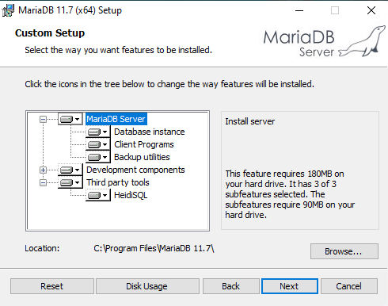
		- Cấu hình root password 
		- 
		- Cấu hình port 
		- 
		- Qúa trình cài đặt diễn ra 
		- 
		- 
		- Hoàn tất cài đặt 
		- 
		- Các phần mềm quản lý
		- 
		- Khởi chạy client kết nối với MariaDB server 

	- Linux (Ubuntu)
		- Chạy lệnh cập nhật 
		```
		apt update && apt upgrade -y 
		```
		- 
		- Chạy lệnh cài đặt 
		```
		apt -y install mariadb-server
		```
		- 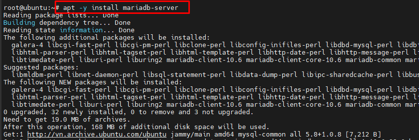
		- Khởi động và Kiểm tra 
		```
		systemctl start mariadb
		systemctl status mariadb
		```
		- 
		- Tạo database, bảng, chèn dữ liệu test:
		```
		mysql 
		```
		```
		create database test_database;
		create table test_database.test_table (id int, name varchar(50), address varchar(50), primary key (id));
		insert into test_database.test_table(id, name, address) values("001", "Ubuntu", "For Testing");
		select * from test_database.test_table;
		```
		- 

<!-- TOC --><a name="3-cu-hình-ti-u"></a>
## 3. Cấu hình tối ưu
<!-- TOC --><a name="31-ti-u-hiu-nng"></a>
### 3.1 Tối ưu hiệu năng  
<!-- TOC --><a name="311-s-dng-innodb"></a>
#### 3.1.1 Sử dụng InnoDB  
- Cấu hình sử dụng InnoDB thay vì MyISAM: MyISAM có ít tính năng nâng cao hơn InnoDB. Nhìn chung, MyISAM kém hiệu quả hơn, với ít cải tiến tối ưu hóa gốc hơn. Ví dụ, InnoDB có một chỉ mục theo nhóm, với dữ liệu trong các trang và các khối vật lý liên tiếp. Nếu một giá trị quá nhiều để vừa với một trang, InnoDB sẽ di chuyển nó đến một vị trí khác, lập chỉ mục giá trị của nó – dữ liệu thích hợp vẫn ở cùng một vị trí trên ổ cứng, rút ​​ngắn thời gian truy xuất nó.
- Sử dụng lệnh `show table info;` để kiểm tra. 
- 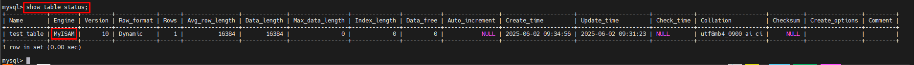
- Nếu chưa cấu hình ở InnoDB thì sử dụng lệnh `ALTER TABLE <table_name> ENGINE=InnoDB;` để cấu hình.
- 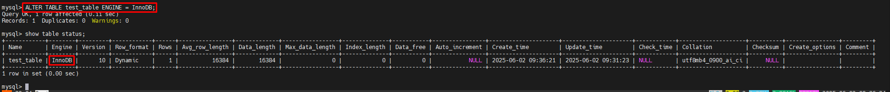
- Các options tuning trong cấu hình Mysql 
	- innodb_buffer_pool_size: Tham số này xác định lượng bộ nhớ được MySQL phân bổ cho bộ đệm InnoDB. Giá trị khuyến nghị cho tham số này là 70-80% tổng bộ nhớ khả dụng. Dữ liệu càng lớn thì giá trị này càng nên được tăng lên.  
	- max_connection: Tham số này xác định số lượng kết nối đồng thời tối đa được phép và có giá trị mặc định là 151. Để tránh lỗi “Too many connections”, giá trị này có thể được tăng lên. Tuy nhiên, cần lưu ý rằng quá nhiều kết nối mở có thể ảnh hưởng đến hiệu suất.  
	- innodb_io_capacity: Tham số này xác định số lượng thao tác I/O mỗi giây được phép cho các tác vụ chạy nền, với giá trị mặc định là 200. Thông thường, giá trị khoảng 100 phù hợp với các ổ cứng trung bình, trong khi đối với các thiết bị lưu trữ nhanh hơn, giá trị cao hơn sẽ có lợi.  
	- innodb_log_file_size: Tham số này xác định kích thước (tính bằng byte) của mỗi tệp nhật ký redo MySQL trong một nhóm nhật ký, với giá trị mặc định là 134,217,728 (khoảng 128MB). Tham số `innodb_log_files_in_group` xác định số lượng tệp nhật ký trong nhóm, có giá trị mặc định là 2. Nếu giá trị `innodb_log_file_size` quá nhỏ cho khối lượng công việc của bạn và ứng dụng của bạn thực hiện nhiều thao tác ghi, bạn nên tăng kích thước này. Tuy nhiên, nếu giá trị `innodb_log_file_size` quá lớn, thời gian khôi phục sau sự cố sẽ tăng lên, do đó cần xác định kích thước tối ưu phù hợp.
- Ví dụ cấu hình này tối ưu hóa MySQL bằng cách phân bổ 2GB cho bộ đệm InnoDB, giới hạn tối đa 200 kết nối, đặt khả năng xử lý I/O ở mức 400, và mở rộng kích thước tệp nhật ký lên 256MB.
```
nano /etc/mysql/mysql.conf.d/mysqld.cnf
```
```
innodb_buffer_pool_size = 2G
max_connections = 200
innodb_io_capacity = 400
innodb_log_file_size = 256M
```
- innodb_buffer_pool_size = 2G – Phân bổ 2GB RAM cho bộ đệm InnoDB, giúp cải thiện tốc độ truy xuất dữ liệu.
- max_connections = 200 – Giới hạn tối đa 200 kết nối đồng thời, tránh tình trạng quá tải hệ thống.
- innodb_io_capacity = 400 – Nâng giới hạn I/O lên 400, giúp tăng hiệu suất ghi/đọc trên ổ cứng hoặc SSD.
- innodb_log_file_size = 256M – Mở rộng kích thước tệp nhật ký lên 256MB, giúp tăng tốc độ ghi dữ liệu và cải thiện khả năng khôi phục sau sự cố.
```
systemctl restart mysql 
```
- 
- 
- Với Windows file cấu hình mysql nằm tại `C:\ProgramData\MySQL\MySQL Server 8.0\my.ini`
- 
<!-- TOC --><a name="312-thread-cache"></a>
#### 3.1.2 Thread Cache 
- Thread_cache_size: số lượng threads trên server sẽ được cache.
- Để tính được thông số ta thực hiện như sau :
```
mysql -e "show status like 'Threads_created';"
mysql -e "show status like 'Connections';"
```
– Sau khi có 2 thông số thì tính ra được giá trị cần cấu hình:`100 – ((Threads_created / Connections) * 100))`
- Reverse DNS lookups: Mặc định thì MySQL thực hiện DNS lookup những IP connect tới. Với mỗi Client connect thì địa chỉ IP sẽ được kiểm tra và phân giải. Sau đó Hostname sẽ được phân giải và trả về IP. Điều này sẽ làm cho quá trình bị chậm trê khi DNS có vấn đề .Tắt chức năng này để tăng khả năng phản hồi.
- Slow query logs: Logging query chậm có thể giúp xác định các cơ sỡ dữ liệu và và debug.
- Ví dụ cấu hình 
```
nano /etc/mysql/mysql.conf.d/mysqld.cnf
```
```
thread_cache_size = 10 
skip-name-resolve
slow-query-log=1
slow-query-log-file=/var/lib/mysql/mysql-slow.log
long_query_time = 1
```
- 
- thread_cache_size = 10 – Giới hạn tối đa 10 luồng có thể được lưu trữ trong bộ nhớ đệm để tái sử dụng, giúp giảm chi phí tạo luồng mới và cải thiện hiệu suất.
- skip-name-resolve – Bỏ qua quá trình tra cứu DNS của máy khách, giúp tăng tốc độ kết nối bằng cách chỉ sử dụng địa chỉ IP thay vì tên miền.
- slow-query-log = 1 – Bật nhật ký truy vấn chậm, giúp theo dõi các truy vấn có thời gian thực thi dài để tối ưu hóa.
- slow-query-log-file = /var/lib/mysql/mysql-slow.log – Xác định vị trí tệp nhật ký chứa thông tin về các truy vấn chậm, hỗ trợ phân tích và tối ưu hệ thống.
- long_query_time = 1 – Định nghĩa thời gian tối thiểu (1 giây) để một truy vấn được coi là chậm và được ghi vào nhật ký, giúp phát hiện các truy vấn cần tối ưu hóa.
```
systemctl restart mysql 
```
- MariaDB 
	- Các cấu hình tối ưu giống với MySQL 
	- File cấu hình MariaDB nằm tại 
	- Linux 
	```
	/etc/mysql/mariadb.conf.d/50-server.cnf
	```
	- Windows 
	```
	C:\Program Files\MariaDB 11.7\data\my.ini 
	```
	- Các cấu hình tối ưu giống với MySQL 
	- File cấu hình MariaDB nằm tại 
	- Linux 
	```
	/etc/mysql/mariadb.conf.d/50-server.cnf
	```
	- Windows 
	```
	C:\Program Files\MariaDB 11.7\data\my.ini 
	```
<!-- TOC --><a name="32-cu-hình-bo-mt-c-bn"></a>
### 3.2 Cấu hình bảo mật cơ bản
- Cấu hình MySQL, MariaDB giống nhau. 
- Chạy lệnh dưới đây để cấu hình bảo mật cho MySQL
```
sudo mysql_secure_installation
```
- 
- Thực hiện 
- Bật kiểm tra mật khẩu với mức STRONG, yêu cầu mật khẩu ít nhất 8 ký tự, bao gồm chữ số, chữ hoa/thường, ký tự đặc biệt và kiểm tra từ điển.
- Giữ xác thực root mặc định bằng auth_socket, thay vì đặt mật khẩu. Nếu cần, bạn có thể thay đổi bằng lệnh ALTER_USER.
- Xóa người dùng ẩn danh, đảm bảo không ai có thể truy cập MySQL mà không có tài khoản.
- Chặn đăng nhập từ xa cho root, tăng cường bảo mật bằng cách chỉ cho phép đăng nhập nội bộ.
- Xóa cơ sở dữ liệu test và các quyền liên quan, ngăn truy cập trái phép vào dữ liệu thử nghiệm.
- Tải lại bảng quyền, đảm bảo các thay đổi trên có hiệu lực ngay lập tức.
- Đổi Bind Port 
- Chỉnh sửa file cấu hình 
```
nano /etc/mysql/mysql.conf.d/mysqld.cnf
```
hoặc file này đối với MariaDB
```
/etc/mysql/mariadb.conf.d/50-server.cnf
```
- Cấu hình thông số port khác mặc định 3306 
```
port = 3306
```
- 
- Restart Mysql để apply 
```
systemctl restart mysql
```
- Chú ý cần điều chỉnh mở port firewall tương ứng 
```
ufw allow <new-port>
```
<!-- TOC --><a name="33-ti-u-truy-vn"></a>
### 3.3 Tối ưu truy vấn 
<!-- TOC --><a name="331-index"></a>
#### 3.3.1 Index 
- Sử dụng Indexes: Các chỉ mục đóng vai trò quan trọng trong việc tăng tốc truy xuất dữ liệu bằng cách cho phép hệ quản trị cơ sở dữ liệu nhanh chóng xác định các dòng dựa trên các cột được lập chỉ mục. 
- Ví dụ sử dụng Indexes
- Có bảng `products` với các dữ liệu 
```
 CREATE TABLE products (
product_id INT PRIMARY KEY,
product_name VARCHAR(255),
price DECIMAL(10,2)
);

INSERT INTO products (product_id, product_name, price) VALUES
(1001, 'Laptop', 999.99),
(1002, 'Smartphone', 599.99),
(1003, 'Tablet', 299.99),
(1004, 'Smartwatch', 199.99),
(1005, 'Headphones', 149.99);
```
- Chạy lệnh tạo index 
```
CREATE INDEX idx_product_id ON products (product_id);
```
- Chạy lệnh truy vấn 
```
SELECT * FROM products WHERE product_id = 1001;
```

- So sánh trc sau index 
- 
- 
- 

<!-- TOC --><a name="332-ti-u-vi-where"></a>
### 3.3.2 Tối ưu với WHERE 
- Tối ưu truy vấn với WHERE 
- Giới hạn số lượng dòng được kiểm tra bởi mệnh đề WHERE là rất quan trọng để tối ưu hóa truy vấn. 
- Ví dụ: Với bảng mẫu orders và các data sau 
```
CREATE TABLE orders (
order_id INT PRIMARY KEY,
customer_name VARCHAR(255),
order_date DATE,
total_amount DECIMAL(10,2)
);

INSERT INTO orders (order_id, customer_name, order_date, total_amount) VALUES
(1, 'Nguyen Van A', '2023-01-15', 200.00),
(2, 'Tran Thi B', '2023-03-10', 350.00),
(3, 'Le Van C', '2023-07-25', 150.00),
(4, 'Pham Minh D', '2023-10-05', 500.00),
(5, 'Hoang Thi E', '2024-02-12', 450.00);
```
- Câu truy vấn tối ưu 
```
SELECT * FROM orders WHERE order_date BETWEEN '2023-01-01' AND '2023-12-31';
```
- 
<!-- TOC --><a name="332-ti-u-vi-select"></a>
### 3.3.2 Tối ưu với Select 
- Cải thiện với mệnh đề SELECT
- Thay vì chọn tất cả các cột bằng **SELECT ** , hãy chỉ định các cột cần thiết để giảm tải việc truy xuất dữ liệu
- Ví dụ: Câu truy vấn tối ưu
```
SELECT name, email FROM customers WHERE customer_id = 123;
```
- 

- Sử dụng `LIMIT`
- Sử dụng mệnh đề **LIMIT** để giới hạn số lượng dòng được trả về, đặc biệt đối với các truy vấn lấy dữ liệu lớn, có thể cải thiện hiệu suất truy vấn và giảm mức tiêu thụ tài nguyên.
- Ví dụ:
```
SELECT * FROM products LIMIT 10;
```
- 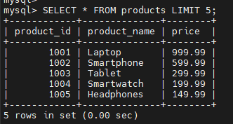

- Tránh sử dụng truy vấn lồng nhau. 
- Viết lại truy vấn lồng nhau dưới dạng các thao tác **JOIN** để cải thiện khả năng đọc và hiệu suất truy vấn. Truy vấn lồng nhau thường có thể không hiệu quả, đặc biệt khi xử lý các tập dữ liệu lớn.
- Ví dụ: 
- Câu truy vấn không tối ưu
```
SELECT * FROM employees WHERE department_id IN (
SELECT department_id FROM departments WHERE department_name = 'Sales'
);
```
- Truy vấn tối ưu sử dụng JOIN 
```
SELECT employees.*, departments.department_name 
FROM employees 
JOIN departments ON employees.department_id = departments.department_id
WHERE departments.department_name = 'Sales';
```
- 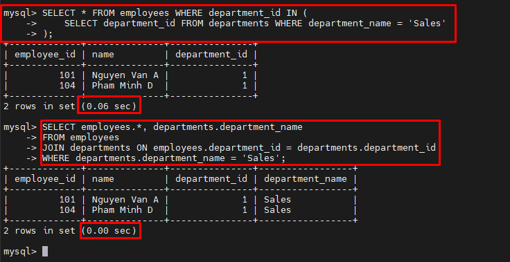
<!-- TOC --><a name="4-qun-tr-database-server"></a>
## 4. Quản Trị Database Server
<!-- TOC --><a name="41-user-và-qun-lý-quyn-truy-cp"></a>
### 4.1 User và quản lý quyền truy cập   
- Quản lý người dùng và quyền truy cập trong các hệ quản trị cơ sở dữ liệu là một phần quan trọng để đảm bảo bảo mật và hiệu suất hệ thống.
- Người dùng MySQL được lưu trữ trong bảng mysql.user, nơi chứa thông tin như tên người dùng, host, mật khẩu (đã mã hóa) và plugin xác thực.
- Để tạo một user mới sử dụng lệnh:
```
CREATE USER 'username'@'host' IDENTIFIED BY 'password';
```
-   
- Nếu trường hợp cần một người dùng chỉ có quyền truy cập vào cơ sở dữ liệu từ một địa chỉ IP cụ thể, hãy sử dụng lệnh sau:
```
CREATE USER 'username'@'10.0.0.3' IDENTIFIED BY 'password';
```
- Trong đó 10.0.0.3 là địa chỉ IP mà người dùng sẽ có quyền truy cập vào cơ sở dữ liệu.
- Xoá user
```
DROP USER 'username'@'localhost';
```
-   
- Cấp quyền 
- Full quyền 
```
GRANT ALL PRIVILEGES ON database_name.* TO 'username'@'localhost';
FLUSH PRIVILEGES;
```
-   
- Chỉ một số quyền 
```
GRANT SELECT, INSERT, UPDATE on *.* TO 'username'@'localhost' WITH GRANT OPTION;
```
-   
- Kiểm tra 
```
SHOW GRANTS FOR 'annt'@'localhost';
```
-   
- Thu hồi quyền 
- Từng quyền
```
REVOKE permission_1, permission_2 ON database_name.table_name FROM 'username'@'localhost';
```
- Tất cả 
```
REVOKE ALL PRIVILEGES ON *.* FROM 'username'@'localhost';
```
-   

<!-- TOC --><a name="42-sao-lu-và-phc-hi-backup-recovery"></a>
### 4.2 Sao lưu và phục hồi (Backup & Recovery)
- Sao lưu định kỳ giúp bảo vệ dữ liệu khỏi mất mát do lỗi hệ thống hoặc tấn công mạng.
- Các phương pháp sao lưu phổ biến bao gồm sao lưu toàn bộ, gia tăng và khác biệt.
- Backup 
- Sử dụng lệnh mysqldump
- Backup 1 database
```
sudo mysqldump -u username -p dbname > backup.sql
```
- Toàn bộ db 
```
mysqldump -u root -p --all-databases > all_backup.sql
```
- Sao lưu 1 bảng:
```
mysqldump -u username -p password dbname tablename > "path where you want to dump"
```
- Ví dụ 
```
sudo mysqldump -u annt -p test_database > backup.sql
```
-   
- Back up MySQL Database sử dụng bản ghi nhị phân : 
- MySQL ghi nhật ký nhị phân cho phép người dùng ghi lại các thay đổi trong cơ sở dữ liệu MySQL của họ. Nó cung cấp một cách để thực hiện nhiều tác vụ khác nhau, bao gồm khôi phục tại một thời điểm cụ thể, sao chép và sao lưu.
- Chỉnh sửa file cấu hình Enable
```
nano /etc/mysql/mysql.conf.d/mysqld.cnf
```
```
log_bin = /var/log/mysql/mysql-bin.log
```
-   
- Restart để apply
```
systemctl restart mysql 
```
- Kiểm tra trạng thái hiện tại của nhật ký nhị phân:
```
mysql 
SHOW VARIABLES LIKE 'log_bin%';
```
- 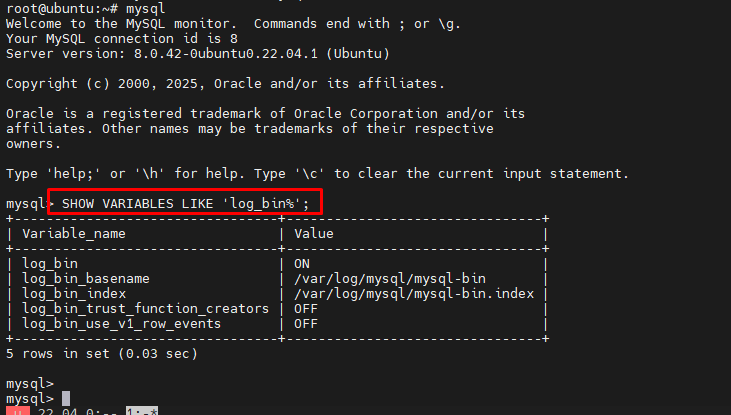  
- Thực hiện sao chép thủ công các tệp nhật ký nhị phân sang một vị trí khác để sao lưu. Hoặc, sử dụng công cụ như mysqlbinlog để trích xuất các câu lệnh SQL từ nhật ký nhị phân và lưu chúng vào một tệp.
```
mysqlbinlog /var/log/mysql/mysql-bin.xxxxxx > backup.sql
```
- 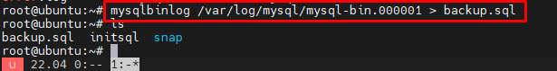  
- Sử dụng giao diện với workbench 
- Chọn DataExport cấu hình table, cấu trúc, nơi lưu
-   
- Export thành công 
-   
- Kiểm tra thư mục có file backup 
-   
- Restore 
- Sử dụng lệnh mysql 
- Toàn bộ db 
```
mysql -u username -p dbname < backup.sql
```
- Chỉ một bảng 
```
mysql -u username -p dbname --tables table_name < backup.sql
```
- Ví dụ 
```
mysql -u root -p test_database < backup.sql
```
-   
- Sử dụng giao diện workbench
- Chọn Data Import/Restore: Cấu hình thư mục chứa file backup, chọn bảng restore, cấu hình cấu trúc 
-   
- Restore thành công 
-   

<!-- TOC --><a name="43-theo-dõi-hiu-nng-monitoring"></a>
### 4.3 Theo dõi hiệu năng (Monitoring)
- Theo dõi hiệu năng (Monitoring) giúp thu thập dữ liệu về cách hệ thống hoạt động, từ đó phát hiện các vấn đề và tối ưu hóa hiệu suất. 
- Slow query logs: Logging query chậm có thể giúp xác định các cơ sỡ dữ liệu và và debug.
- Ví dụ cấu hình 
```
nano /etc/mysql/mysql.conf.d/mysqld.cnf
```
```
thread_cache_size = 10 
skip-name-resolve
slow-query-log=1
slow-query-log-file=/var/lib/mysql/mysql-slow.log
long_query_time = 1
```
- 
- thread_cache_size = 10 – Giới hạn tối đa 10 luồng có thể được lưu trữ trong bộ nhớ đệm để tái sử dụng, giúp giảm chi phí tạo luồng mới và cải thiện hiệu suất.
- skip-name-resolve – Bỏ qua quá trình tra cứu DNS của máy khách, giúp tăng tốc độ kết nối bằng cách chỉ sử dụng địa chỉ IP thay vì tên miền.
- slow-query-log = 1 – Bật nhật ký truy vấn chậm, giúp theo dõi các truy vấn có thời gian thực thi dài để tối ưu hóa.
- slow-query-log-file = /var/lib/mysql/mysql-slow.log – Xác định vị trí tệp nhật ký chứa thông tin về các truy vấn chậm, hỗ trợ phân tích và tối ưu hệ thống.
- long_query_time = 1 – Định nghĩa thời gian tối thiểu (1 giây) để một truy vấn được coi là chậm và được ghi vào nhật ký, giúp phát hiện các truy vấn cần tối ưu hóa.
```
systemctl restart mysql 
```
- Giám sát trạng thái MySQL
- Sử dụng `SHOW GLOBAL STATUS` để xem thông tin hệ thống:
```sql
SHOW GLOBAL STATUS;
```
```
SHOW GLOBAL STATUS WHERE Variable_name IN ('Threads_running', 'Connections', 'Slow_queries');
```
- Các thông số quan trọng:
- `Threads_running` → Số luồng đang chạy.
- `Connections` → Tổng số kết nối đến MySQL.
- `Slow_queries` → Số truy vấn chậm đã ghi nhận.
- 

- Sử dụng `performance_schema` để giám sát chi tiết
- Bật ghi nhận hoạt động truy vấn:
```sql
UPDATE performance_schema.setup_instruments SET ENABLED = 'YES' WHERE NAME LIKE '%statement%';
SELECT * FROM performance_schema.events_statements_summary_by_digest ORDER BY COUNT_STAR DESC LIMIT 10;
```
- Sử dụng giao diện workbench
- Tại giao diện chính panel admin -> Dashboard -> Show thông số monitor 
- 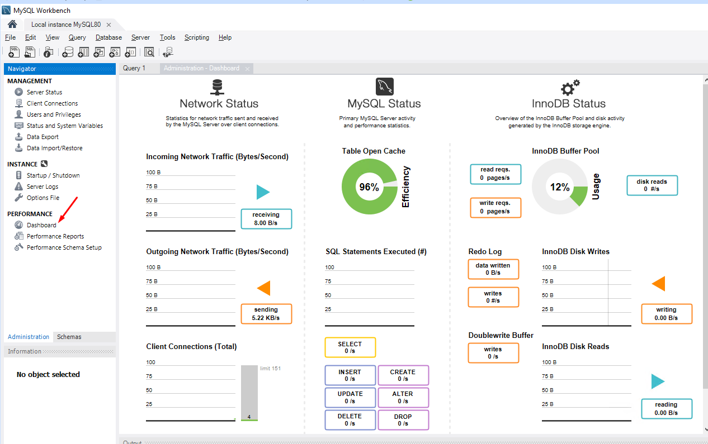
- Tại giao diện chính panel admin -> Performance Report -> Show báo cáo hiệu năng 
- 

<!-- TOC --><a name="44-transaction-và-lock"></a>
### 4.4 Transaction và Lock 
<!-- TOC --><a name="441-transaction"></a>
#### 4.4.1 Transaction
- Các lệnh quan trọng gồm:
- START TRANSACTION → Bắt đầu một giao dịch.
- COMMIT → Xác nhận và lưu thay đổi vào database.
- ROLLBACK → Hoàn tác nếu có lỗi, trả dữ liệu về trạng thái ban đầu.
- SAVEPOINT → Tạo điểm checkpoint để rollback một phần giao dịch
- Ví dụ: Sử dụng các lệnh trên 
```
-- Bắt đầu một giao dịch mới để nhóm nhiều thao tác lại
START TRANSACTION;
-- Trừ 1000 vào số dư tài khoản của Nguyễn Văn A
UPDATE BankAccount SET balance = balance - 1000 WHERE id = 1;
-- Tạo một điểm khôi phục (savepoint) sau khi cập nhật tài khoản A, đề phòng rollback
SAVEPOINT after_update_A;
-- Cộng 1000 vào số dư tài khoản của Trần Thị B
UPDATE BankAccount SET balance = balance + 1000 WHERE id = 2;
-- Tạo điểm khôi phục sau khi cập nhật tài khoản B
SAVEPOINT after_update_B;
-- Thử trừ 500 vào số dư tài khoản của Lê Văn C
UPDATE BankAccount SET balance = balance - 500 WHERE id = 3;
-- Nếu có vấn đề xảy ra (ví dụ: số dư không đủ), chỉ hoàn tác (rollback) lần cập nhật cuối cùng
ROLLBACK TO SAVEPOINT after_update_B;
-- Kiểm tra số dư hiện tại sau khi rollback một phần của giao dịch
SELECT * FROM BankAccount;
-- Xác nhận giao dịch để lưu lại các thao tác thành công
COMMIT;
-- Kiểm tra trạng thái tài khoản cuối cùng sau khi commit
SELECT * FROM BankAccount;
```
- 
<!-- TOC --><a name="442-lock"></a>
#### 4.4.2 Lock 
- Khóa bảng (Locking Tables) đóng vai trò quan trọng trong việc đảm bảo tính toàn vẹn dữ liệu, đặc biệt trong môi trường có nhiều người dùng truy cập cùng lúc.
- Khóa bảng được sử dụng để kiểm soát truy cập đồng thời vào dữ liệu. Nó giúp ngăn chặn nhiều người dùng hoặc tiến trình sửa đổi cùng một dữ liệu một lúc, tránh xảy ra xung đột hoặc hỏng dữ liệu.
- Ví dụ: Nếu có hai quản trị viên cùng cố gắng cập nhật điểm GPA của một sinh viên trong cùng một cơ sở dữ liệu vào cùng thời điểm, nếu không có cơ chế khóa phù hợp, có thể xảy ra mất dữ liệu hoặc cập nhật sai.
- Các loại khóa: MySQL hỗ trợ hai loại khóa chính:
- Khóa chia sẻ (Shared Locks): Còn được gọi là khóa đọc (Read Locks), cho phép nhiều giao dịch cùng đọc dữ liệu mà không sửa đổi nó. Khi một giao dịch có khóa chia sẻ trên dữ liệu, nó có thể đọc dữ liệu đó mà không chặn các giao dịch khác cũng muốn đọc cùng dữ liệu. Tuy nhiên, nếu một giao dịch muốn có khóa độc quyền trên dữ liệu đó, nó sẽ bị chặn cho đến khi tất cả các khóa chia sẻ được giải phóng.
- Khóa độc quyền (Exclusive Locks): Ngăn các giao dịch khác đọc hoặc sửa đổi dữ liệu bị khóa. Khóa này được sử dụng cho các thao tác ghi, nhằm đảm bảo tính nhất quán của dữ liệu. Khi một khóa độc quyền được giữ trên một bảng, không có giao dịch nào khác có thể đọc hoặc ghi dữ liệu trên bảng đó cho đến khi khóa được giải phóng.
- Ví dụ 
- Shared Lock :Cho phép các truy vấn SELECT, nhưng chặn UPDATE cho đến khi khóa được giải phóng.
```
-- Khóa bảng BankAccount chỉ cho phép đọc
LOCK TABLES BankAccount READ;

-- Truy vấn số dư của một tài khoản (được phép)
SELECT * FROM BankAccount WHERE id = 1;

-- Thử cập nhật số dư (bị chặn)
UPDATE BankAccount SET balance = 6000 WHERE id = 1;

-- Giải phóng khóa, cho phép cập nhật
UNLOCK TABLES;
```
- 
- Exclusive lock: Chặn tất cả các giao dịch khác, chỉ cho phép ghi dữ liệu khi khóa còn hiệu lực
```
LOCK TABLES Student WRITE;
UPDATE Student SET gpa = 4.0 WHERE id = 1001;
INSERT INTO Student (id, name, gpa)
VALUES (1002, 'Jane Doe', 3.8);
UNLOCK TABLES;
```
- 

<!-- TOC --><a name="5-bo-mt-mysqlmariadb"></a>
## 5. Bảo mật MySQL/MariaDB
- MySQL cung cấp nhiều kỹ thuật mã hóa để bảo vệ dữ liệu khi lưu trữ và dữ liệu khi truyền tải, bao gồm mã hóa AES, mã hóa cấp cột, và Mã hóa dữ liệu trong suốt (TDE - Transparent Data Encryption).
- Mã hóa dữ liệu khi lưu trữ (Data at Rest Encryption)
- Mã hóa tablespace InnoDB – Mã hóa các tablespace riêng lẻ bằng AES 128-bit, 192-bit hoặc 256-bit.
- Mã hóa redo log – Bảo vệ redo log phục vụ khôi phục sau sự cố.
- Mã hóa tệp doublewrite – Tự động mã hóa nếu tablespace liên quan đã được mã hóa.
- Mã hóa hệ thống tablespace – Bảo vệ bảng chứa metadata.
- TDE (Transparent Data Encryption) – Mã hóa tệp cơ sở dữ liệu để ngăn truy cập trái phép.
- Thuật toán và khóa mã hóa
- AES (Advanced Encryption Standard): Thuật toán mã hóa đối xứng mặc định trong MySQL & MariaDB.
- Độ dài khóa:  Hỗ trợ 128-bit, 192-bit và 256-bit.
- Keyring Plugins: Quản lý khóa mã hóa với keyring_file, keyring_encrypted_file, keyring_okv và keyring_aws.
- Mã hóa bất đối xứng (Asymmetric Encryption): Hỗ trợ RSA, DSA, DH trong Enterprise Edition.
- Mã hóa cấp cột (Column-Level Encryption)
- Hàm AES tích hợp của MySQL: AES_ENCRYPT() & AES_DECRYPT() để mã hóa và giải mã dữ liệu ở cấp cột.
- Hàm dẫn xuất khóa (KDFs): Dùng HKDF & PBKDF2 để tăng cường bảo mật.
- Mã hóa dữ liệu khi truyền tải (In-Transit Encryption - SSL/TLS)
- Cấu hình SSL/TLS – MySQL hỗ trợ mã hóa SSL/TLS để đảm bảo giao tiếp an toàn giữa các hệ thống.
- Ví dụ 
- Transparent Data Encryption (TDE): MySQL Enterprise Transparent Data Encryption (TDE) cung cấp tính năng mã hóa dữ liệu khi lưu trữ bằng cách mã hóa các tệp vật lý của cơ sở dữ liệu. Dữ liệu được tự động mã hóa theo thời gian thực trước khi ghi vào bộ nhớ và sẽ được giải mã khi truy xuất từ bộ nhớ. Điều này giúp ngăn chặn hacker và người dùng độc hại đọc trực tiếp dữ liệu nhạy cảm từ các tệp cơ sở dữ liệu. MySQL Enterprise TDE sử dụng thuật toán AES tiêu chuẩn công nghiệp để đảm bảo an toàn dữ liệu.
- AES Encryption: Advanced Encryption Standard (AES) là thuật toán mã hóa mặc định của MySQL và MariaDB, được sử dụng để bảo vệ dữ liệu. Đây là thuật toán mã hóa đối xứng, sử dụng cùng một khóa (password) để thực hiện cả mã hóa và giải mã dữ liệu. Độ dài khóa mặc định là 128-bit, nhưng có thể sử dụng 192-bit hoặc 256-bit.
- AES được sử dụng trong cả mã hóa và giải mã, với các hàm sau để xử lý dữ liệu trong MySQL:
- Mã hóa:
`AES_ENCRYPT('chuỗi cần mã hóa', 'khóa')`
- Giải mã:
`AES_DECRYPT('chuỗi đã mã hóa', 'khóa')`
- Ví dụ cấu hình tạo bảng sử dụng mã hoá 
```
-- Create table
CREATE TABLE users (
  id INT PRIMARY KEY AUTO_INCREMENT,
  name VARCHAR(50),
  email VARCHAR(100),
  encrypted_data VARBINARY(200)
);
```
-- Insert encrypted data
```
INSERT INTO users (name, email, encrypted_data)
VALUES ('John Doe', 'john@example.com', AES_ENCRYPT('Sensitive Data', 'encryption_key'));
```
-- Retrieve decrypted data
```
SELECT id, name, email, CAST(AES_DECRYPT(encrypted_data, 'encryption_key') as char) AS decrypted_data FROM users;
```
- 
- SSL/TLS
- Tạo khóa riêng, yêu cầu chứng chỉ, và ký chứng chỉ 
```
openssl genrsa -out server-key.pem 2048
openssl req -new -key server-key.pem -out server-csr.pem
openssl x509 -req -in server-csr.pem -signkey server-key.pem -out server-cert.pem
```
- 
- Di chuyển key và cấp quyền , owner 
```
mv server-key.pem /etc/mysql/mysql-server-key.pem
mv server-cert.pem /etc/mysql/mysql-server-cert.pem
mv server-csr.pem /etc/mysql/mysql-server-csr.pem
sudo chown mysql:mysql /etc/mysql/*.pem
sudo chmod 600 /etc/mysql/*.pem
```
- Chỉnh sửa cấu hình mysql 
```
sudo nano /etc/mysql/mysql.conf.d/mysqld.cnf
```
- Thêm phần cấu hình SSL 
```
##SSL 
ssl-ca=/etc/mysql/mysql-server-cert.pem
ssl-cert=/etc/mysql/mysql-server-cert.pem
ssl-key=/etc/mysql/mysql-server-key.pem
require_secure_transport=ON
```
- 

- Restart để apply dịch vụ 
````
service mysql restart
```
- Login test 
```
mysql
SHOW VARIABLES LIKE 'have_ssl'; 
SHOW VARIABLES LIKE 'ssl%'; 
```
- 
- Tạo user login ssl
```
CREATE USER 'remoteuser'@'192.168.50.131' IDENTIFIED BY 'password' REQUIRE SSL;
```
- `192.168.50.131` là ip client 

- Kết nối từ client với ssl REQUIRE
```
mysql -h 192.168.50.130 -u remoteuser -p --ssl-mode REQUIRED
\s
```
- 
- MySQL
- General Query Log
- Chỉnh sửa file cấu hình `/etc/mysql/mysql.conf.d/mysqld.cnf`
```
general_log=1
general_log_file=/var/log/mysql/general.log
```
- 
- Restart để apply 
```
systemctl restart mysql
```
- Kiểm tra log audit lại các lệnh được sử dụng 
```
tail -f /var/log/mysql/query.log
```
- 
- Ngoài ra với bản Enterprise MYSQL còn hỗ trợ plugin Audit Log ghi lại nhiều hoạt động trong cơ sở dữ liệu, như các truy vấn SQL, đăng nhập người dùng và thay đổi dữ liệu. 
## 6. Các giải pháp Replication, HA, Cluster 
### 6.1 MYSQL Replication
- MySQL Replication là một quá trình cho phép bạn dễ dàng duy trì nhiều bản sao của dữ liệu MySQL bằng cách cho họ sao chép tự động từ một master tạo ra một cơ sở dữ liệu slave. Điều này rất hữu ích vì nhiều lý do bao gồm việc tạo điều kiện cho sao lưu cho dữ liệu, một cách để phân tích nó mà không sử dụng các cơ sở dữ liệu chính, hoặc chỉ đơn giản là một phương tiện để mở rộng ra.
- Replication mặc định là không đồng bộ, slave không cần phải kết nối vĩnh viễn để nhận được cập nhật từ master. 
- Server master lưu trữ phiên bản cơ sở dữ liệu phục vụ ứng dụng. Server slave lưu trữ phiên bản cơ sở dữ liệu “nhân bản”. Quá trình nhân bản từ master sang slave gọi là replication.
- Gồm 2 mô hình 
- Master - Master
- master-master làm bản sao chủ động – thụ động. Nếu đã biết chỉ có một nodes đang thực hiện sửa đổi dữ liệu, bạn có thể tránh được nhiều vấn đề có thể xảy ra. Trong trường hợp dữ liệu chuyển đổi dự phòng, “slave” có thể dễ dàng được đưa lên làm dữ liệu chính(master). Sửa đổi dữ liệu được tự động sao chép sang nodes không thành công khi nó sao lưu. 
- Cấu hình 
- 2 Node đã cài MYSQL 
- 192.168.50.128
- 192.168.50.129
- Chỉnh sửa cấu hình 
```
nano /etc/mysql/mysql.conf.d/mysqld.cnf
```
- Chỉnh sửa với từng Node 
- MASTER 1
```
bind-address           = 0.0.0.0
server-id = 200
report_host = master1
log_bin = /var/log/mysql/mariadb-bin
log_bin_index = /var/log/mysql/mariadb-bin.index
relay_log = /var/log/mysql/relay-bin
relay_log_index = /var/log/mysql/relay-bin.index
auto_increment_increment = 5
auto_increment_offset = 1 
```
- MASTER 2
```
bind-address           = 0.0.0.0
server-id = 201
report_host = master2
log_bin = /var/log/mysql/mariadb-bin
log_bin_index = /var/log/mysql/mariadb-bin.index
relay_log = /var/log/mysql/relay-bin
relay_log_index = /var/log/mysql/relay-bin.index
auto_increment_increment = 5
auto_increment_offset = 1 
```
- 

- Restart để apply 
```
sudo systemctl start mysql.service  
```
- Cấu hình user trên 2 máy 
```
mysql 
```
- Tạo user 
```
CREATE USER 'repl_user'@'%' IDENTIFIED WITH mysql_native_password BY 'Qaz@123!@';
GRANT REPLICATION SLAVE ON *.* TO 'repl_user'@'%';
FLUSH PRIVILEGES;
```
- 
- Trên master 1 kiểm tra thông tin trạng thái tệp binary log cần sử dụng thông tin này để bắt đầu sao chép(replication) trên một máy chủ(node) khác.
```
show master status;
```
- 

- Bắt đầu sao chép 1-2 
Trên máy master 2
```
STOP SLAVE;
CHANGE MASTER TO MASTER_HOST='master1', MASTER_USER='repl_user', MASTER_PASSWORD='Qaz@123!@', MASTER_LOG_FILE='mariadb-bin.000005', MASTER_LOG_POS=157;
START SLAVE; 
```
- 

- Kiểm tra thông tin trạng thái của Slave
```
SHOW SLAVE STATUS \G ;
```
- 

- Kiểm tra thông tin trạng thái về tệp binary logs của máy chủ MASTER2 sử dụng thông tin này để bắt đầu sao chép trên máy chủ MASTER1.
```
show master status;
```
- 

- Bắt đầu sao chép 2-1 : Trên master 1 thực hiện chạy lệnh 
```
STOP SLAVE;
CHANGE MASTER TO MASTER_HOST='master2', MASTER_USER='repl_user', MASTER_PASSWORD='Qaz@123!@', MASTER_LOG_FILE='mariadb-bin.000005', MASTER_LOG_POS=748;
START SLAVE; 
SHOW SLAVE STATUS\G
```
- 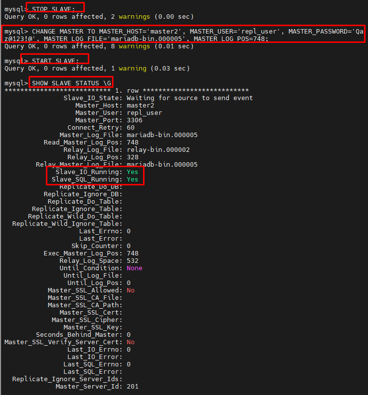
- Test 
- Trên master 1 tạo bảng và thêm dữ liệu 
```
CREATE DATABASE TEST;
USE TEST;
CREATE TABLE USERS (ID INT PRIMARY KEY, NAME VARCHAR(50));
INSERT INTO USERS VALUES (1, 'ALICE');
````
- Trên master 2 query thấy dữ liệu được đồng bộ.
```
USE TEST;
SELECT * FROM USERS;
```
- 

- Master - Slave 
	- Đối với mô hình 1 master 1 slave cách cấu hình tương tự master - master nhưng bỏ đi bước sao chép 2-1 từ máy master2 (khi này đóng vai trò slave) về máy master1 

<!-- TOC --><a name="62-mysql-ndb-cluster"></a>
### 6.2 MYSQL NDB Cluster  
- NDB Cluster là một công nghệ giúp phân cụm cơ sở dữ liệu trong bộ nhớ theo mô hình shared-nothing, đảm bảo khả năng mở rộng tuyến tính và tính sẵn sàng cao.
- Cấu trúc của NDB Cluster" Một NDB Cluster bao gồm nhiều nút (nodes), mỗi nút có một vai trò cụ thể:
- Nút quản lý (Management Node - ndb_mgmd): Lưu trữ cấu hình và điều phối hoạt động của cụm.
- Nút dữ liệu (Data Node - ndbd): Lưu trữ dữ liệu và thực hiện đồng bộ hóa giữa các nút.
- Nút SQL (SQL Node - mysqld): Máy chủ MySQL truy cập dữ liệu từ các nút dữ liệu.
- Triển khai trên 4 máy 
- 1 node management 192.168.50.128
- 2 node data 192.168.50.129/192.168.50.130
- 1 note SQL 192.168.50.131
- Cài đặt và cấu hình Cluster Manager
- Tải file cài đặt 
```
wget https://dev.mysql.com/get/Downloads/MySQL-Cluster-8.4/mysql-cluster-community-management-server_8.4.5-1ubuntu22.04_amd64.deb
```
- Cài đặt 
```
dpkg -i mysql-cluster-community-management-server_8.4.5-1ubuntu22.04_amd64.deb
```
- 
- Tạo thư mục chứa dữ liệu 
```
mkdir /var/lib/mysql-cluster/        
```
- Tạo file cấu hình chính 
```
nano  /var/lib/mysql-cluster/config.ini 
```
- Cấu hình các nội dung 
```
[ndbd default]
NoOfReplicas=2

[ndb_mgmd]
hostname=192.168.50.128
datadir=/var/lib/mysql-cluster

[ndbd]
hostname=192.168.50.129
NodeId=2
datadir=/usr/local/mysql/data

[ndbd]
hostname=192.168.50.130
NodeId=3      
datadir=/usr/local/mysql/data

[mysqld]
hostname=192.168.50.131  
```
- Khởi động test management
```
sudo ndb_mgmd -f /var/lib/mysql-cluster/config.ini        
```
- 
- Tạo service 
```
sudo pkill -f ndb_mgmd
sudo nano /etc/systemd/system/ndb_mgmd.service        
```
- Thêm nội dung sau 
```
[Unit]
Description=MySQL NDB Cluster Management Server
After=network.target auditd.service

[Service]
Type=forking
ExecStart=/usr/sbin/ndb_mgmd -f /var/lib/mysql-cluster/config.ini
ExecReload=/bin/kill -HUP $MAINPID
KillMode=process
Restart=on-failure

[Install]
WantedBy=multi-user.target   
```     
- Reload daemon
```
systemctl daemon-reload        
```
- Enable, start service 
```
systemctl enable ndb_mgmd        
```
```
systemctl start ndb_mgmd        
```
- Kiểm tra 
```
systemctl status ndb_mgmd   
```
- 
 
- Cấu hình node Data 
- Tải file cài đặt 
```
wget https://dev.mysql.com/get/Downloads/MySQL-Cluster-8.0/mysql-cluster-community-data-node_8.0.42-1ubuntu22.04_amd64.deb
```
- Cài các phần phụ trợ và cài đặt 
```
sudo apt-get install libclass-methodmaker-perl -y
sudo dpkg -i mysql-cluster-community-data-node_8.0.42-1ubuntu22.04_amd64.deb
```
- 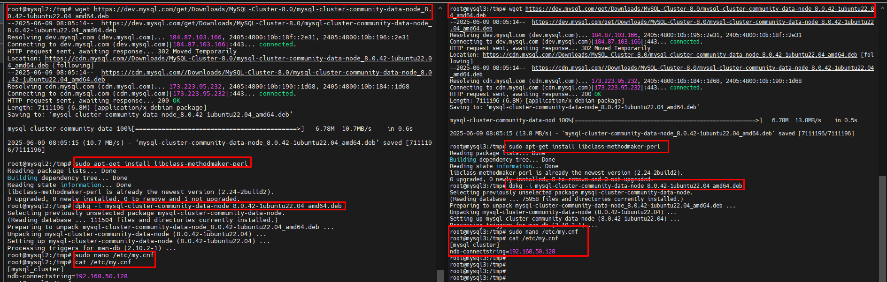
- Chỉnh sửa file cấu hình 
```
sudo nano /etc/my.cnf        
```
```
[mysql_cluster]
ndb-connectstring=192.168.50.128       
```
- Tạo thư mục chứa data 
```
mkdir -p /var/lib/mysql    
```
- Khởi động test node 
```
ndbd        
```
- 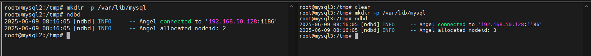
- Stop và tạo service
```
sudo pkill -f ndbd  
sudo nano /etc/systemd/system/ndbd.service   
```
```
[Unit]
Description=MySQL NDB Data Node Daemon
After=network.target auditd.service

[Service]
Type=forking
ExecStart=/usr/sbin/ndbd
ExecReload=/bin/kill -HUP $MAINPID
KillMode=process
Restart=on-failure

[Install]
WantedBy=multi-user.target 
```
- Reload daemon, enable và khởi động service 
```
sudo systemctl daemon-reload     
sudo systemctl enable ndbd  
sudo systemctl start ndbd  
sudo systemctl status ndbd  
```
- 

- Cấu hình SQL Node 
- Cài đặt các gói bổ trợ 
```
apt install libaio1 libmecab2  -y
```
- Tải file cài đặt 
```
cd /tmp
wget https://dev.mysql.com/get/Downloads/MySQL-Cluster-8.4/mysql-cluster_8.4.5-1ubuntu22.04_amd64.deb-bundle.tar
```
- Giải nén
```
mkdir install    
tar -xvf mysql-cluster_8.4.5-1ubuntu22.04_amd64.deb-bundle.tar -C install/   
```
- 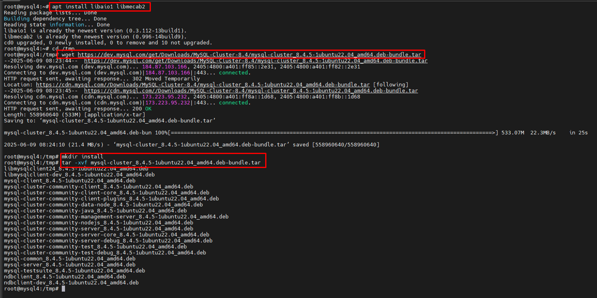
- Cài đặt 
```
cd install
dpkg -i mysql-common_8.4.5-1ubuntu22.04_amd64.deb
dpkg -i mysql-cluster-community-client-plugins_8.4.5-1ubuntu22.04_amd64.deb
dpkg -i mysql-cluster-community-client-core_8.4.5-1ubuntu22.04_amd64.deb
dpkg -i mysql-cluster-community-client_8.4.5-1ubuntu22.04_amd64.deb
dpkg -i mysql-client_8.4.5-1ubuntu22.04_amd64.deb
dpkg -i mysql-cluster-community-server-core_8.4.5-1ubuntu22.04_amd64.deb
dpkg -i mysql-cluster-community-server_8.4.5-1ubuntu22.04_amd64.deb
```

- 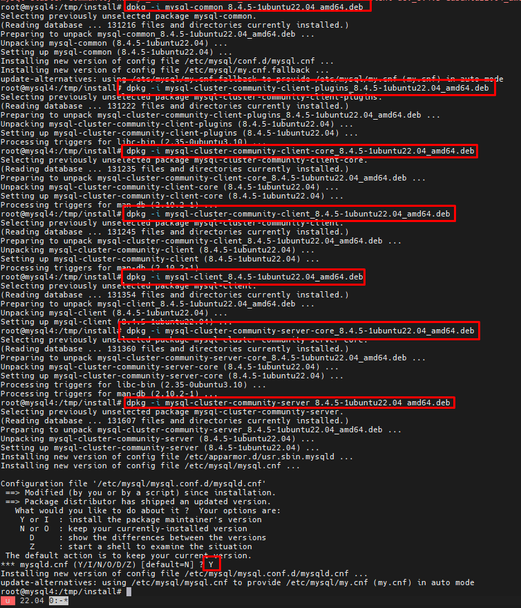
- 
- Chỉnh sửa file cấu hình 
```
nano /etc/mysql/my.cnf 
```
```
[mysqld]
ndbcluster
[mysql_cluster]
ndb-connectstring=192.168.50.128
```
- Restart để apply
```
sudo systemctl restart mysql
```

<!-- TOC --><a name="63-innodb-cluster"></a>
### 6.3 InnoDB Cluster 
- MySQL InnoDB Cluster là một giải pháp có tính sẵn sàng cao dành cho MySQL, giúp quản lý nhiều máy chủ MySQL theo mô hình Group Replication. Nó cung cấp khả năng tự động chuyển đổi dự phòng, quản lý lỗi, và tối ưu hóa hiệu suất.
- Cấu trúc của InnoDB Cluster: Một cụm InnoDB Cluster bao gồm các thành phần chính:
- MySQL Server: Chạy trên nhiều máy chủ để đảm bảo tính sẵn sàng cao.
- Group Replication: Đồng bộ hóa dữ liệu giữa các máy chủ, đảm bảo tính nhất quán.
- MySQL Shell: Công cụ quản lý cụm, hỗ trợ triển khai và giám sát.
- MySQL Router: Định tuyến kết nối giữa ứng dụng và cụm MySQL, đảm bảo truy cập ổn định.
- Triển khai trên 3 máy đã cài mysql 
```
192.168.50.128db1
192.168.50.129db2
192.168.50.130db3
```
- Chỉnh sửa file host 
```
nano /etc/hosts
```
```
192.168.50.128db1
192.168.50.129db2
192.168.50.130db3
```
- 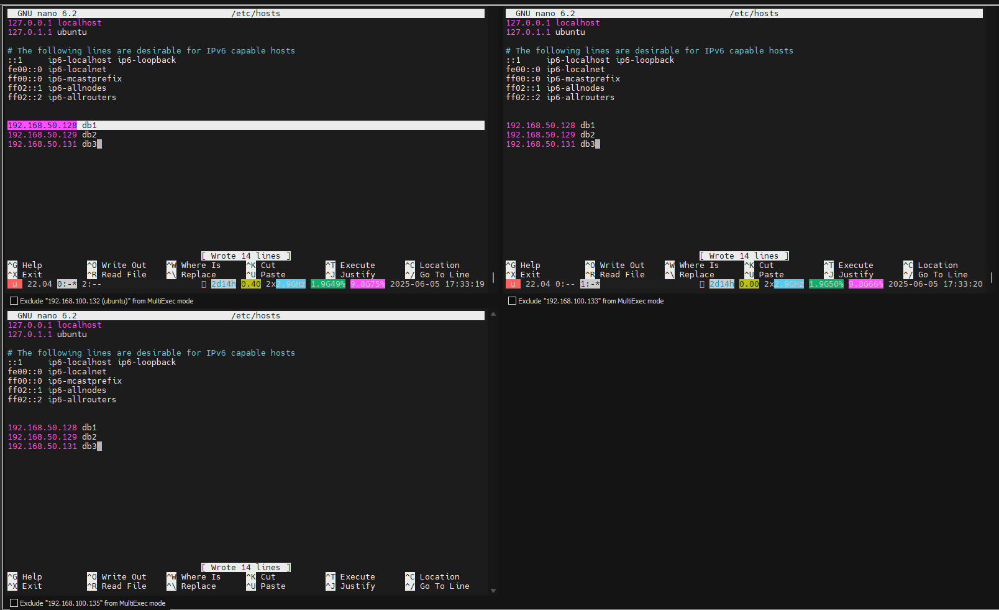

- Chỉnh sửa cấu hình 
```
nano /etc/mysql/mysql.conf.d/mysqld.cnf 
```
```
bind-address = 0.0.0.0
default_authentication_plugin=mysql_native_password
```
- 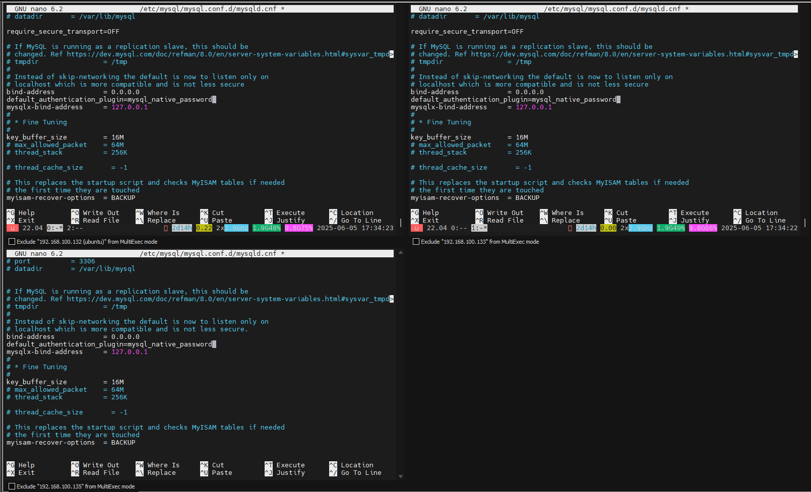

- Restart để apply 
```
systemctl restart mysql
```
- Tạo 1 user để sử dụng cho cluster:
```
CREATE USER 'clusteradmin'@'%' IDENTIFIED BY 'Qaz@123!@';
GRANT ALL PRIVILEGES ON *.* TO 'clusteradmin' WITH GRANT OPTION;
reset master;
flush privileges;
```
- 

- Trên node master 1 cài mysql-shell 
- Tải file cài 
```
wget https://dev.mysql.com/get/Downloads/MySQL-Shell/mysql-shell_8.0.42-1ubuntu22.04_amd64.deb
```
- Cài đặt 
```
dpkg -i mysql-shell_8.0.42-1ubuntu22.04_amd64.deb
```
- 
- Kiểm tra và chỉnh sửa cấu hình trước khi tạo cluster 
```
mysqlsh
dba.checkInstanceConfiguration('clusteradmin@db3');
```
- Chỉnh sửa cấu hình 
```
dba.configure_instance('clusteradmin@db1');
```
- 

- Thực hiện tương tự với các instance còn lại db2 và db3 
- Tạo cluster Innodb: tại cửa sổ shell kết nối, thêm cluster  
```
shell.connect('clusteradmin@db1');
```
- 
```
cluster=dba.createCluster('mysql_innodb_cluster');
cluster.addInstance('clusteradmin@db2');
cluster.addInstance('clusteradmin@db3');
```
- 
- 
- 
- 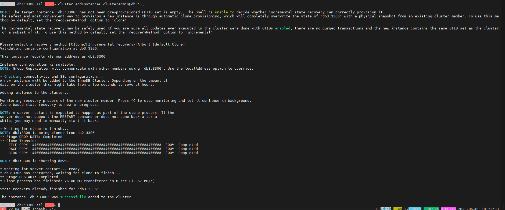

- Kiểm tra trạng thái 
```
cluster.status();
``` 
- 
- Kiểm tra: Thực hiện tạo bảng trên master để test
```
 CREATE TABLE employees (
id INT PRIMARY KEY AUTO_INCREMENT,
name VARCHAR(100) NOT NULL,
position VARCHAR(50) NOT NULL,
salary DECIMAL(10,2) NOT NULL,
hire_date DATE
);

INSERT INTO employees (name, position, salary, hire_date) VALUES
('Nguyễn Văn A', 'Software Engineer', 2000.00, '2023-06-01'),
('Trần Thị B', 'Data Analyst', 2500.00, '2022-09-15'),
('Lê Quốc C', 'Project Manager', 3500.00, '2021-03-20'),
('Phạm D', 'System Administrator', 1800.00, '2024-01-10'),
('Hoàng E', 'Database Administrator', 2800.00, '2020-07-08');
```
- 

- Nhận thấy trên các node còn lại có đồng bộ dữ liệu 
```
SELECT * FROM employees;
```
- 
<!-- TOC --><a name="64-mariadb-galera-and-mariadb-maxscale"></a>
### 6.4  MariaDB Galera and MariaDB MaxScale
- MariaDB Galera Cluster
	- Galera Cluster là một cụm MariaDB đồng bộ gần như hoàn toàn, chỉ hoạt động trên Linux và hỗ trợ InnoDB (có thử nghiệm với MyISAM và Aria).
	- Nhân bản gần như đồng bộ → Tất cả các node cập nhật dữ liệu gần như tức thời.
	- Multi-primary (Active-Active) → Mọi node đều có thể xử lý đọc & ghi.
	- Tự động kiểm soát thành viên → Loại bỏ node bị lỗi khỏi cluster.
	- True parallel replication → Nhân bản song song trên cấp độ row, giảm độ trễ.
	- Tích hợp native MariaDB → Giữ nguyên trải nghiệm mà không cần thay đổi ứng dụng.
- MariaDB MaxScale
	- MaxScale hoạt động như một proxy cơ sở dữ liệu, giúp nâng cao sẵn sàng cao, mở rộng hệ thống và bảo mật, đồng thời giúp ứng dụng không phụ thuộc vào hạ tầng database.
	- Cân bằng tải thông minh → Tự động phân chia đọc/ghi với Read-Write-Service.
	- Tường lửa cơ sở dữ liệu → Có thể dùng plugin để bảo vệ hệ thống.
	- Quản lý quyền truy cập → Kiểm soát user, lọc truy vấn để bảo vệ dữ liệu.
	- Tích hợp nhiều module → Ví dụ như readwritesplit để tối ưu hóa hiệu suất đọc/ghi.
	- Hỗ trợ quản lý REST API → Dễ dàng kiểm soát hệ thống bằng lệnh maxctrl.
	- Sử dụng Galera Cluster với MaxScale:
	- Đảm bảo sẵn sàng cao mà không cần failover thủ công.
	- Tối ưu hiệu suất đọc ghi, tận dụng tối đa các node của cluster.
	- Bảo vệ dữ liệu bằng firewall và kiểm soát truy vấn thông minh.
- Mô hình 
- Thực hiện trên 4 Node 

| IP Address       | Node Type                      |
|------------------|--------------------------------|
| 192.168.50.128  | MariaDB MaxScale node          |
| 192.168.50.129  | MariaDB Galera Cluster node 1  |
| 192.168.50.130  | MariaDB Galera Cluster node 2  |
| 192.168.50.131  | MariaDB Galera Cluster node 3  |

```
flowchart TD

    %% Tầng ứng dụng
    App["Application Server<br/>(Client/Frontend App)"]
    Max["MaxScale<br/>192.168.50.128"]
    App --> Max

    %% MariaDB cluster - nằm ngang
    subgraph Cluster["MariaDB Galera Cluster"]
        direction LR
        DB1["MariaDB Node 1<br/>192.168.50.129"]
        DB2["MariaDB Node 2<br/>192.168.50.130"]
        DB3["MariaDB Node 3<br/>192.168.50.131"]
    end

    Max --> DB1
    Max --> DB2
    Max --> DB3

    %% Gán lớp màu
    class App,Max appLayer;
    class DB1,DB2,DB3 dbLayer;

    %% Định nghĩa màu theo lớp
    classDef appLayer fill:#e0f7fa,stroke:#006064,stroke-width:2px,color:#004d40;
    classDef dbLayer fill:#e3f2fd,stroke:#0d47a1,stroke-width:2px,color:#0d47a1;

```
- Cài đặt 
- Trên cả 4 node thực hiện cài MariaDB repository 
```
curl -LsS https://r.mariadb.com/downloads/mariadb_repo_setup | sudo bash
```
- 
- Trên các node Galera cài MariaDB-server, Galera 
```
apt -y install mariadb-server galera-4 galera-arbitrator-4
``` 
-  
- Trên Node MaxScale cài maxscale và client mariadb 
```
apt -y install mariadb-client maxscale
```
-  
- Cấu hình 
- Cấu hình MariaDB Galera Cluster
- Trên các node Galera chỉnh sửa cấu hình 
```
nano /etc/mysql/mariadb.conf.d/50-server.cnf
```
- Sửa `bind-address` -> '0.0.0.0'
-  
- Thêm phần 
```
[galera]
# Mandatory settings
wsrep_on=ON
wsrep_provider=/usr/lib/galera/libgalera_smm.so
wsrep_cluster_address=gcomm://192.168.50.129,192.168.50.130,192.168.50.131
binlog_format=row
default_storage_engine=InnoDB
innodb_autoinc_lock_mode=2
```
- wsrep_on: Xác định liệu thao tác có được nhân bản (mặc định ON).
- wsrep_provider: Đường dẫn thư viện Galera cần khai báo.
- wsrep_cluster_address: Xác định danh sách node trong cluster.
- binlog_format: Phải đặt thành ROW để Galera hoạt động đúng.
- default_storage_engine: Chỉ dùng InnoDB, vì Galera không hỗ trợ engine khác.
- innodb_autoinc_lock_mode: Dùng chế độ 2 để tránh deadlock.
-  

- Khởi tạo Galera Cluster: Trên node Galera Cluster 1 (192.168.50.129) chạy lệnh 
```
sudo galera_new_cluster
```
-  
- Kiểm tra 
```
ps -f -u mysql | more
```
-  
- Cấu hình đã nhận 3 node 
```
mariabd
show global status like 'wsrep_cluster_size';
```
-  

- Cấu hình MariaDB cho MariaDB MaxScale
- Tạo một user để MariaDB MaxScale có thể kết nối với cluster và lấy dữ liệu xác thực. Trên node Galera Cluster 1 (192.168.50.129) chạy lệnh 
```
mariadb
CREATE USER 'myuser'@'192.168.50.128' IDENTIFIED BY 'Qaz@123';
GRANT SELECT ON mysql.user TO 'myuser'@'192.168.50.128';
GRANT SELECT ON mysql.db TO 'myuser'@'192.168.50.128';
GRANT SELECT ON mysql.tables_priv TO 'myuser'@'192.168.50.128';
GRANT SHOW DATABASES ON *.* TO 'myuser'@'192.168.50.128';
FLUSH PRIVILEGES;
```
-  
-  
- Cấu hình MariaDB MaxScale: Trên node Maxscale (192.168.50.128) 
- Chỉnh sửa file /etc/maxscale.cnf
```
mv /etc/maxscale.cnf /etc/maxscale.cnf.bak
nano /etc/maxscale.cnf 
```
- Cấu hình như sau 
```
[maxscale]
threads=auto
admin_host            = 0.0.0.0
admin_port            = 8989
admin_secure_gui=false

[server1]
type=server
address=192.168.50.129 
port=3306
protocol=MariaDBBackend 

[server2]
type=server
address=192.168.50.130
port=3306
protocol=MariaDBBackend

[server3]
type=server
address=192.168.50.131
port=3306
protocol=MariaDBBackend

# Monitor configuration to monitor the Galera Cluster nodes
[Galera-Monitor]
type=monitor
module=galeramon
servers=server1,server2,server3
user=myuser
password=Qaz@123
monitor_interval=2000ms

# Service to handle read/write splitting
[Read-Write-Service]
type=service
router=readwritesplit
servers=server1,server2
user=myuser
password=Qaz@123

# Listener for client connections (reads and writes)
[Read-Write-Listener]
type=listener
service=Read-Write-Service
protocol=MariaDBClient
port=3306

# Service to handle read-only queries (optional)
[Read-Only-Service]
type=service
router=readconnroute
router_options=slave
servers=server3
user=myuser
password=Qaz@123

# Listener for client connections (reads only)
[Read-Only-Listener]
type=listener
service=Read-Only-Service
protocol=MariaDBClient
port=3307
```
- Cấu hình MaxScale
- threads=auto – Số luồng xử lý sự kiện được tự động tối ưu hóa.
- admin_host=0.0.0.0 – MaxScale sẽ lắng nghe các kết nối quản trị từ mọi địa chỉ IP.
- admin_port=8989 – Cổng quản trị của MaxScale.
- admin_secure_gui=false – Tắt chế độ bảo mật cho giao diện quản trị GUI.
- Cấu hình các node MariaDB
- [server1], [server2], [server3]: Định nghĩa các node database trong hệ thống Galera Cluster.
- protocol=MariaDBBackend: Sử dụng giao thức MariaDB để giao tiếp với các node.
- Giám sát Cluster Galera
- [Galera-Monitor] – Theo dõi trạng thái các node Galera.
- module=galeramon – Sử dụng Galera Monitor để giám sát cluster.
- monitor_interval=2000ms – Kiểm tra trạng thái các node mỗi 2 giây.
- Dịch vụ Read/Write Splitting
- [Read-Write-Service] – Chia tách truy vấn đọc và ghi.
- router=readwritesplit – Chuyển truy vấn ghi đến Primary node và đọc từ các Replica node.
- servers=server1,server2 – Chỉ sử dụng 2 node để xử lý đọc/ghi.
- Cấu hình kết nối Read/Write
- [Read-Write-Listener] – Cổng 3306 cho kết nối đọc & ghi.
- Dịch vụ Read-Only (Tùy chọn)
- [Read-Only-Service] – Chỉ xử lý truy vấn đọc.
- router=readconnroute – Định tuyến các truy vấn đọc đến Replica node.
- router_options=slave – Chỉ chọn node phụ để đọc dữ liệu.
- servers=server3 – Chỉ dùng server3 để phục vụ truy vấn đọc.
- Cấu hình kết nối Read-Only
- [Read-Only-Listener] – Cổng 3307 dành cho truy vấn chỉ đọc.
-  
-  

- Khởi động Maxscale
```
systemctl start maxscale 
```

- MaxScale WEB GUI:
- MaxScale hỗ trợ giao diện web tại port 8989 http://192.168.50.128:8989 
- Truy cập http://192.168.50.128:8989 sử dụng thông tin đăng nhập mặc định admin/mariadb 
-  
- Giao diện Tổng quan, Mô hình, Log của Web GUI 
-  
-  
-  

- Lệnh quản trị `maxctrl`
- Lệnh cơ bản
```bash
maxctrl list servers         # Danh sách server
maxctrl list services        # Danh sách dịch vụ
maxctrl list listeners       # Danh sách listener
maxctrl list monitors        # Danh sách monitor
maxctrl show server server1  # Xem chi tiết server1
```
- Quản lý dịch vụ
```bash
maxctrl start service Read-Write-Service  # Bắt đầu dịch vụ
maxctrl stop service Read-Write-Service   # Dừng dịch vụ
maxctrl enable log-priority info          # Bật log info
maxctrl disable log-priority debug        # Tắt log debug
```
- Cấu hình & Thay đổi
```bash
maxctrl create server newserver 192.168.50.132 3306
maxctrl create monitor NewMonitor mariadbmon --servers newserver --user myuser --password Qaz@123
maxctrl destroy server newserver
maxctrl alter server server1 address=192.168.50.129
```
- Kiểm tra & Debug
```bash
maxctrl --config-check  # Kiểm tra cấu hình
sudo journalctl -u maxscale --no-pager | tail -n 20  # Xem log lỗi
```

- Kiểm tra 
- Test đăng nhập kiểm tra hoạt động 
- Từ client login thông quan IP của maxscale 
```
mariadb -u myuser -h 192.168.50.128 -p --disable-ssl
```
```
show variables like 'hostname';
```
-  
- Nhận thấy đang là server có hostname db2 (192.168.50.129) xử lý. 
- Test failover 
- Trên node 192.168.50.129 tắt mariadb để test
```
sudo systemctl stop mariadb.service
```
- Trên node Maxscale kiểm tra 
```
maxctrl list servers
```
-  
- Trên client 
```
show variables like 'hostname';
```
-  
- Nhận thấy đã chuyển sang cho node khác xử lý (db3-192.168.50.130)
- Trên giao diện Web thể hiện trạng thái 
-  

