# Direct Admin (DA) - Admin
## Tổng quan  
- DirectAdmin là một hệ thống quản trị hosting mạnh mẽ, được thiết kế với giao diện trực quan và phân cấp rõ ràng theo từng vai trò người dùng. Trong đó, Admin View là chế độ dành riêng cho quản trị viên hệ thống, người có toàn quyền kiểm soát và cấu hình toàn bộ máy chủ.
- Giao diện quản trị viên cung cấp đầy đủ các công cụ cần thiết để:
	- Quản lý tài khoản người dùng và đại lý (reseller).
	- Giám sát tài nguyên hệ thống như dung lượng, băng thông, dịch vụ đang hoạt động.
	- Cấu hình máy chủ, bảo mật, sao lưu và khôi phục dữ liệu.
	- Theo dõi thống kê tổng thể và xử lý các tác vụ kỹ thuật nâng cao.
- Trong các phần tiếp theo, tài liệu sẽ trình bày chi tiết từng nhóm chức năng trong Admin View, giúp người dùng nắm bắt nhanh cách sử dụng và khai thác hiệu quả các công cụ quản trị trong DirectAdmin.
- Giao diện quản trị viên (Admin View) trong DirectAdmin được thiết kế để cung cấp đầy đủ công cụ và thông tin cần thiết cho việc quản lý toàn bộ hệ thống hosting. Giao diện này bao gồm các khu vực chức năng chính sau:
	- Dashboard – Giao diện thông tin tổng quát: Đây là màn hình chính khi đăng nhập vào chế độ quản trị viên. Tại đây, người dùng có thể:
		- Xem nhanh các thống kê hệ thống như dung lượng, băng thông, số lượng tài khoản, tên miền, dịch vụ đang hoạt động.
		- Truy cập nhanh các chức năng quản trị thông qua các widget và bảng điều khiển.
	- Bảng điều hướng – Nhóm chức năng dành cho quản trị viên
		- Phần Admin trong bảng điều hướng bên trái được chia thành các cụm chức năng chính:
		- Account Manager
			- Quản lý tài khoản người dùng, đại lý (reseller), và các dịch vụ liên quan như email, FTP, tên miền.
			- Cho phép tạo, sửa, xóa và phân quyền tài khoản.
		- Server Manager
			- Cấu hình và giám sát các dịch vụ máy chủ như DNS, web server, email server, cron jobs.
			- Quản lý trạng thái hoạt động và tài nguyên hệ thống.
		- Admin Tools
			- Cung cấp các công cụ nâng cao như sao lưu dữ liệu, khôi phục, bảo mật, cập nhật hệ thống.
			- Hỗ trợ xử lý sự cố và tối ưu hóa hiệu suất máy chủ.
		- System Info & Files
			- Hiển thị thông tin chi tiết về hệ thống như phiên bản phần mềm, trạng thái dịch vụ, nhật ký hệ thống.
			- Quản lý tệp tin hệ thống và cấu hình.
		- Extra Features
			- Các tính năng bổ sung như API, cấu hình giao diện, tùy chọn người dùng nâng cao.
			- Hỗ trợ mở rộng khả năng tùy biến và tích hợp.
		- Support & Help
			- Truy cập tài liệu hướng dẫn, liên hệ hỗ trợ kỹ thuật, và các công cụ trợ giúp khác.
			- Hữu ích khi cần tra cứu thông tin hoặc xử lý lỗi.


## Dashboard
- Giao diện này cung cấp cái nhìn tổng quan về tình trạng sử dụng tài nguyên, số lượng dịch vụ đang hoạt động, và thông tin tài khoản. Đây là khu vực quan trọng giúp quản trị viên theo dõi hiệu suất hệ thống và xử lý các vấn đề kịp thời.
- Gồm các tab
	- Widget 
		- Khu vực hiển thị các khối thông tin nhanh (widget) về tài nguyên và dịch vụ
		- Các liên kết bên phải giao diện click để hiển thị thông tin nhanh, click `View More` để tới phần cấu hình chi tiết tương ứng 
			- Reseller Stats: Xem thống kê tài khoản đại lý.
			- 
			- List Users: Danh sách người dùng do quản trị viên quản lý.
			- 
			- Admin Stats: Thống kê tài khoản quản trị viên.
			- 
			- All Users: Danh sách toàn bộ tài khoản trên máy chủ.
			- 
			- Mail Queue: Kiểm tra các email đang chờ gửi.
			- 
			- Services: Theo dõi trạng thái hoạt động của các dịch vụ hệ thống.
			- 
	- Menu: 
		- Hiển thị toàn bộ các nhóm chức năng cấu hình trong hệ thống.
		- Cho phép truy cập nhanh đến các khu vực như: Account Manager, Server Manager, Admin Tools, System Info & Files, v.v.
			- 

## Account Manager
- Account Manager là nhóm chức năng trung tâm trong giao diện quản trị viên, cho phép quản lý toàn bộ tài khoản người dùng, đại lý (reseller), và quản trị viên trên hệ thống. Tại đây, quản trị viên có thể thực hiện các thao tác tạo mới, chỉnh sửa, phân quyền, chuyển đổi và kiểm soát thông tin tài khoản.
- Nhóm chức năng quản lý tài khoản gồm 
	- Quản lý người dùng (User Management)
		- Add New User: Tạo tài khoản người dùng mới với các thông tin cơ bản như tên đăng nhập, mật khẩu, gói dịch vụ.
		- Show All Users: Hiển thị danh sách toàn bộ người dùng trên hệ thống.
		- My Users : Danh sách các tài khoản người dùng thuộc quyền quản lý của quản trị viên hiện tại.
		- Manage User Packages: Quản lý các gói dịch vụ dành cho người dùng: tạo, sửa, xóa gói.
		- Move Users between Resellers: Chuyển tài khoản người dùng từ đại lý này sang đại lý khác.
		- Edit User Message: Chỉnh sửa nội dung thông báo hiển thị cho người dùng khi đăng nhập.
		- Change Passwords: Thay đổi mật khẩu cho một hoặc nhiều tài khoản người dùng.
	- Quản lý đại lý (Reseller Management)
		- Create Reseller: Tạo tài khoản đại lý mới, có quyền tạo và quản lý người dùng cấp dưới.
		- List Resellers: Hiển thị danh sách tất cả các tài khoản đại lý trên hệ thống.
		- Manage Reseller Packages: Quản lý các gói dịch vụ dành cho đại lý: tạo, sửa, xóa gói.
	- Quản lý quản trị viên (Administrator Management)
		- Create Administrator: Tạo tài khoản quản trị viên mới với toàn quyền truy cập hệ thống.
		- List Administrators: Hiển thị danh sách các tài khoản quản trị viên hiện có.
		- Suspension Message: Thiết lập nội dung thông báo hiển thị cho người dùng khi tài khoản bị khóa hoặc tạm ngưng.

### User Management
- Nhóm các chức năng quản lý người dùng 
#### Add New User
- Admin -> Account Manager -> Add New User
- Giao diện khởi tạo tài khoản người dùng mới. 
- 
- Các thông số cấu hình 
	- Username: Tài khoản đăng nhập DA 
	- E-mail: Địa chỉ email của người dùng.
	- Password: Mật khẩu đăng nhập có thể tạo ngẫu nhiên bằng click chọn icon `Xúc xắc` hoặc xem mật khẩu bằng icon `con mắt` 
	- Domain:  Cấu hình tên miền liên kết với người dùng.
	- User Packages: Cấu hình gói dịch vụ gán cho người dùng 
		- 
		- Có thể chọn từ list có sẵn 
		- Hoặc click `Customize` để tự thiết lập cấu hình tất cả các thông số. 
			- Các thông số trình bày chi tiết trong phần tạo gói cho user. 
			- 
	- IP: Gán địa chỉ IP cho user. 	
	- Tuỳ chọn Send E-mail Notification: Đánh dấu chọn để gửi email thông báo cho người dùng mới.
		- Có thể chỉnh sửa cấu trúc email tại nút `EDIT USER MESSAGE` click chuyển tới phần cấu hình `Edit User Message`
	
- Ví dụ Tạo user mới: User tạo từ admin sẽ thuộc reseller admin 
	- Admin -> Account Manager -> Add New User
		- Username: user1
		- Password: u1_test@annth.io.vn
		- Password: Random 
		- Domain: user1.com.vn
		- User Package: plan_A
		- IP: Shared 
	- Click submit để tạo 
	- 
	- Khởi tạo thành công 
	- 
	- Đăng nhập 
	- 
	- 

#### Show All Users
- Hiển thị danh sách các tài khoản người dùng hiện có trong hệ thống và cho phép quản lý chúng.
- 
- Các nút chức năng 
	- `Add New User`: Click chuyển tới giao diện tạo người dùng mới. 
	- Send a Message: Gửi tin nhắn đến người dùng đã chọn.
		- 
		- 
			- Cấu hình tiêu đề, nội dung tin nhắn, tuỳ chọn chỉ gửi email. 
	- Suspend: Tạm ngưng hoạt động của tài khoản người dùng đã chọn.
		- 
		- 	
			- Cấu hình lý do, thông tin chi tiết.
	- Unsuspend: Kích hoạt lại tài khoản người dùng đã bị tạm ngưng.
		- 	
	- Delete: Xóa tài khoản người dùng đã chọn.	 
		- 	
		- 	
	
- Danh sách các tài khoản người dùng trong hệ thống 
	- Username: Tên đăng nhập của người dùng.
		- Click chuyển tới giao diện chi tiết thông tin của người dùng - phần My Users
	- Creator: Người đã tạo tài khoản này 
		- Click chuyển tới giao diện chi tiết thông tin của người cấp - phần List Resellers 
	- Bandwidth: Lượng băng thông đã sử dụng / tổng băng thông được cấp 
	- Disk Usage: Dung lượng đĩa đã sử dụng / tổng dung lượng được cấp.
	- `# of domains`: Số lượng tên miền hiện có / số lượng tên miền tối đa được phép.
	- Domain(s): Liệt kê các tên miền được liên kết với tài khoản này.
	- IP(s): Địa chỉ IP mà tài khoản người dùng được gán.
	- Sent E-mails: Số lượng email đã gửi từ tài khoản này.
	- ... (biểu tượng ba chấm): Nút tùy chọn cho phép thực hiện các hành động cụ thể cho từng người dùng 
		- 
		- Send a Message: Gửi tin nhắn đến người dùng.
		- Suspend: Tạm ngưng tài khoản.
		- Login as [Username]: Đăng nhập vào tài khoản của người dùng đó (để hỗ trợ).
		- Change user's password: Đổi mật khẩu của người dùng.
		- Remove: Xóa vĩnh viễn tài khoản.
	
#### My Users 
- Hiển thị danh sách các tài khoản người dùng mà người dùng đăng nhập hiện tại có quyền quản lý và tạo ra.
- 
- Các nút chức năng
	- ADD NEW USER: Nút để chuyển đến giao diện thêm người dùng mới.
	- MODIFY YOUR OWN USER DATA: Nút này có thể dùng để chỉnh sửa thông tin hoặc cấu hình của chính tài khoản người dùng hiện tại đang đăng nhập.
	- 
	- 
	- Tại đây có thể cấu hình 
		- Change Package: Thay đổi gói được cấu hình cho user hiện tại 
		- Change IP: Thay đổi địa chỉ IP được gán 
		- Manual Change Settings: Cấu hình các thông số khác 
			- 
			- 
			- Các giới hạn tài nguyên:
				- Bandwidth (MB): Dung lượng băng thông (dữ liệu truyền tải) được cấp cho tài khoản. Có thể nhập số cụ thể hoặc chọn "Unlimited" (Không giới hạn).
				- Disk Space (MB): Dung lượng ổ đĩa được cấp cho tài khoản. Có thể nhập số cụ thể hoặc chọn "Unlimited".
				- Inode: Số lượng tệp tin và thư mục tối đa mà tài khoản có thể tạo. Có thể nhập số cụ thể hoặc chọn "Unlimited".
			- Các giới hạn số lượng khác:
				- Domains: Số lượng tên miền chính tối đa mà tài khoản có thể thêm.
				- Sub-Domains: Số lượng tên miền con tối đa.
				- E-mail Accounts: Số lượng tài khoản email tối đa.
				- E-mail Forwarders: Số lượng chuyển tiếp email tối đa.
				- Mailing Lists: Số lượng danh sách gửi thư tối đa.
				- Autoresponders: Số lượng trả lời tự động email tối đa.
				- MySQL Databases: Số lượng cơ sở dữ liệu MySQL tối đa.
				- Domain Pointers: Số lượng con trỏ tên miền (domain alias/parked domain) tối đa.
				- FTP Accounts: Số lượng tài khoản FTP tối đa.
				- Anonymous FTP Accounts: Số lượng tài khoản FTP ẩn danh tối đa.
			- Các quyền truy cập tính năng: Các hộp kiểm (checkbox) này cho phép bật/tắt các tính năng cụ thể cho tài khoản:
				- CGI Access: Quyền truy cập và thực thi các tập lệnh CGI.
				- PHP Access: Quyền truy cập và thực thi các tập lệnh PHP .
				- SpamAssassin: Kích hoạt bộ lọc thư rác SpamAssassin .
				- Catch-All E-mail: Kích hoạt chức năng email Catch-All (nhận tất cả email gửi đến các địa chỉ không tồn tại trong tên miền).
				- SSL Access: Quyền truy cập và sử dụng chứng chỉ SSL.
				- SSH Access: Quyền truy cập SSH vào máy chủ.
				- Cron Jobs: Quyền tạo và quản lý các tác vụ định kỳ (cron jobs). 
				- System Info: Quyền xem thông tin hệ thống. 
				- Login Keys: Quyền tạo và quản lý khóa đăng nhập. 
				- DNS Control: Quyền quản lý các bản ghi DNS cho tên miền của tài khoản. 
				- Suspend at Limit: Tự động tạm ngưng tài khoản nếu đạt đến giới hạn tài nguyên được cấp. 
				- Automatic security.txt (RFC9116): Tự động tạo tệp security.txt theo tiêu chuẩn RFC9116. 
				- Jailed: Kích hoạt môi trường "giam giữ" (jailed shell) cho SSH, tăng cường bảo mật bằng cách hạn chế truy cập của người dùng vào các phần khác của hệ thống. 
				- Skin: Một menu thả xuống cho phép bạn chọn giao diện (theme) mà tài khoản người dùng sẽ thấy khi họ đăng nhập vào bảng điều khiển của mình.
			- Chính sách Plugin (Plugins Allow/Deny): Mục này xác định cách các plugin được cài đặt trên hệ thống sẽ được áp dụng hoặc hạn chế đối với tài khoản này.
				- Allow All: Cho phép tài khoản sử dụng tất cả các plugin có sẵn. 
				- Deny Selected: Không cho phép tài khoản sử dụng các plugin được chọn cụ thể (tức là cho phép tất cả trừ những cái bị từ chối).
				- Allow Selected: Chỉ cho phép tài khoản sử dụng các plugin được chọn cụ thể (tức là từ chối tất cả trừ những cái được phép).
			- Máy chủ tên miền (NS - Name Servers):
				- Phần này cho phép bạn định nghĩa các máy chủ tên miền chính (Name Servers) mà tài khoản sẽ sử dụng hoặc được gán.
				- NS1: Máy chủ tên miền thứ nhất.
				- NS2: Máy chủ tên miền thứ hai. 
	- Send a Message: Gửi tin nhắn đến người dùng đã chọn.
	- Suspend: Tạm ngưng hoạt động của tài khoản người dùng đã chọn.
	- Unsuspend: Kích hoạt lại tài khoản người dùng đã bị tạm ngưng.
	- Change Package: Thay đổi gói dịch vụ (User Package) cho người dùng đã chọn.
		- 
		- 
	- Change IP: Thay đổi địa chỉ IP cho người dùng đã chọn.
		- 
		- 
	- Delete: Xóa tài khoản người dùng đã chọn.
- Danh sách người dùng và thông tin chi tiết: Mỗi hàng trong bảng đại diện cho một tài khoản người dùng do bạn quản lý với các thông tin sau (lưu ý cột "Creator" đã không còn ở đây vì tất cả đều do bạn tạo/quản lý):
	- Username: Tên đăng nhập của người dùng.
		- Click chuyển tới giao diện chỉnh sửa cấu hình chi tiết người dùng. 
	- Bandwidth: Lượng băng thông đã sử dụng / tổng băng thông được cấp.
	- Disk Usage: Dung lượng đĩa đã sử dụng / tổng dung lượng được cấp.
	- `# of domains`: Số lượng tên miền hiện có / số lượng tên miền tối đa được phép.
	- Domains: Liệt kê các tên miền được liên kết với tài khoản này.
	- IP(s): Địa chỉ IP mà tài khoản người dùng được gán.
	- Package: Gói dịch vụ (User Package) mà người dùng đang sử dụng.
		- Click chuyển tới giao diện chỉnh sửa cấu hình gói - Phần Manage User Packages
	- ... (biểu tượng ba chấm): Nút tùy chọn cho phép thực hiện các hành động cụ thể cho từng người dùng.
		- Send a Message: Gửi tin nhắn đến người dùng.
		- Suspend: Tạm ngưng tài khoản.
		- Login as [Username]: Đăng nhập vào tài khoản của người dùng đó (để hỗ trợ).
		- Change user's password: Đổi mật khẩu của người dùng.
		- Remove: Xóa vĩnh viễn tài khoản.

- Giao diện thông tin chi tiết người dùng
- 
- Giao diện "View User: [username]" cung cấp cái nhìn tổng quan và các tùy chọn quản lý chi tiết cho một tài khoản người dùng cụ thể.
- Thông tin chung và tác vụ chính:
	- 
	- User History: Nút để xem lịch sử hoạt động của người dùng.
	- Change Password: Nút để thay đổi mật khẩu của người dùng này.
		- Click để đổi mật khẩu, có thể tạo ngẫu nhiên bằng click chọn icon `Xúc xắc` hoặc xem mật khẩu bằng icon `con mắt`.
		- Click `Save` để thay đổi. 
		- 
	- Bandwidth: Hiển thị băng thông đã sử dụng / tổng băng thông được cấp cho người dùng (ví dụ: 0 B / 1000 MB).
	- Disk Usage: Hiển thị dung lượng đĩa đã sử dụng / tổng dung lượng được cấp (ví dụ: 0 B / 100 MB).
	- Các nút hành động nhanh:
		- LOGIN AS [USERNAME]: Đăng nhập vào tài khoản của người dùng (dành cho quản trị viên/reseller hỗ trợ).
		- RESEND WELCOME EMAIL: Gửi lại email chào mừng có thông tin tài khoản cho người dùng.
		- SUSPEND: Tạm ngưng hoạt động của tài khoản người dùng này.
		- DELETE: Xóa vĩnh viễn tài khoản người dùng này.
- Các tab thông tin chi tiết:
	- Giao diện được tổ chức thành các tab để hiển thị các loại thông tin khác nhau:
		- Domains : Hiển thị danh sách các tên miền liên kết với tài khoản này cùng với thông tin chi tiết về từng tên miền.
		- Usage Statistics: Thống kê chi tiết việc sử dụng tài nguyên của người dùng.
		- Account Info: Thông tin chi tiết về tài khoản người dùng.
		- Comments: Ghi chú hoặc bình luận về tài khoản.
		- Modify: Tab để chỉnh sửa các cài đặt của người dùng
	- Domains: Hiển thị danh sách các tên miền mà người dùng quản lý
		- 
		- Domain: Tên miền 
		- Bandwidth: Băng thông đã sử dụng cho tên miền đó.
		- Disk Usage: Dung lượng đĩa đã sử dụng cho tên miền đó.
		- Log Usage: Dung lượng tệp nhật ký (logs) đã sử dụng.
		- Subdomains: Số lượng tên miền con.
		- Pointers: Số lượng con trỏ tên miền (domain alias/parked domain).
		- Settings: Trạng thái các tính năng chính của tên miền (CGI, PHP, SSL).
			- CGI: Quyền thực thi CGI.
			- PHP: Quyền thực thi PHP.
			- SSL: Quyền sử dụng SSL.
	- Usage Statistics: Chi tiết về việc sử dụng tài nguyên hiện tại của một tài khoản người dùng và các giới hạn tài nguyên đã được thiết lập cho tài khoản đó
		- 
		- Các thông số tài nguyên chính: 
			- Bandwidth:
				- Usage: Lượng băng thông đã sử dụng bởi tài khoản (ví dụ: 0 B).
				- Limit: Giới hạn băng thông tối đa được cấp cho tài khoản (ví dụ: 1000 MB).
				- (Additional Bandwidth: 0 B): Có thể hiển thị băng thông bổ sung nếu có.
					- Click chọn icon `Edit` để chỉnh sửa tăng thêm băng thông tạm thời 
					- 
					- Cấu hình thông số cần thêm: theo MB/GB/TB. Click chọn Increase Bandwidth để xác nhận 
					- 
					- Ví dụ cấu hình thêm 1 GB bandwidth 
					- 
			- Disk Usage:
				- Usage: Dung lượng ổ đĩa đã sử dụng bởi tài khoản (ví dụ: 0 B).
				- Limit: Giới hạn dung lượng ổ đĩa tối đa được cấp cho tài khoản (ví dụ: 100 MB).
			- E-mail Disk Usage: Dung lượng ổ đĩa dành riêng cho email đã sử dụng.
			- Database Disk Usage: Dung lượng ổ đĩa dành riêng cho cơ sở dữ liệu đã sử dụng.
			- Inodes:
				- Usage: Số lượng Inode (tệp tin/thư mục) đã sử dụng.
				- Limit: Giới hạn số lượng Inode tối đa (ví dụ: Unlimited).
		- Các giới hạn số lượng mục:
			- `# of Domains`:
				- Usage: Số lượng tên miền chính hiện có.
				- Limit: Giới hạn số lượng tên miền chính tối đa (ví dụ: 1).
			- `# of Subdomains`: Số lượng tên miền con hiện có / giới hạn tối đa.
			- E-mail Accounts: Số lượng tài khoản email hiện có / giới hạn tối đa.
			- E-mail Forwarders: Số lượng chuyển tiếp email hiện có / giới hạn tối đa.
			- Mailing Lists: Số lượng danh sách gửi thư hiện có / giới hạn tối đa.
			- Autoresponders: Số lượng trả lời tự động email hiện có / giới hạn tối đa.
			- Sent E-mails: Số lượng email đã gửi / giới hạn gửi email mỗi ngày (ví dụ: 1000 / Day).
					- Click chọn icon `Edit` để chỉnh sửa giới hạn 
					- 
					- Cấu hình số lượng mail giới hạn gửi trong ngày. 
					- 
					- Nút chức năng: 	
						- Save: Lưu thông số đã cấu hình 
						- Reset to Defaults: Đặt lại giới hạn mặc định.
			- Received E-mails: Số lượng email đã nhận.
			- `# of MySQL DBs`: Số lượng cơ sở dữ liệu MySQL hiện có / giới hạn tối đa.
			- Domain Pointers: Số lượng con trỏ tên miền hiện có / giới hạn tối đa.
			- FTP Accounts: Số lượng tài khoản FTP hiện có / giới hạn tối đa.
	- Account Info: Cung cấp thông tin tổng quan và các chỉnh sửa các thông tin cơ bản và cài đặt của một tài khoản người dùng.
		- 
		- 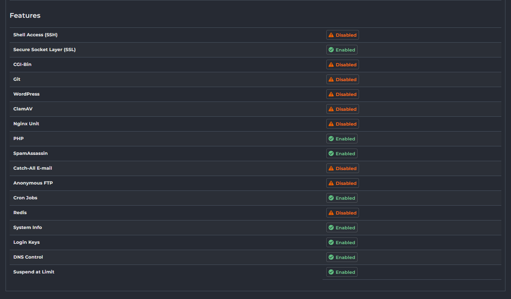
		- Thông tin liên hệ và cơ bản:
			- Contact E-mail: Địa chỉ email liên hệ chính của tài khoản. Có nút "Save E-mail" để lưu thay đổi.
			- Name: Tên hiển thị của tài khoản người dùng. Có nút "Save Name" để lưu thay đổi.
			- Language: Ngôn ngữ giao diện bảng điều khiển của tài khoản.
		- Cấu hình máy chủ tên miền và giao diện:
			- Name Server 1 / Name Server 2: Các máy chủ tên miền được gán cho tài khoản này. Có nút "Save Name Servers" để lưu thay đổi.
			- Skin: Giao diện (theme) bảng điều khiển mà tài khoản đang sử dụng. 
			- IP: Địa chỉ IP mà tài khoản được gán. 
		- Thông tin hệ thống và phân loại:
			- Date Created: Ngày và thời gian tài khoản được tạo
			- Package: Gói dịch vụ (User Package) mà tài khoản này đang sử dụng
			- User Type: Loại người dùng của tài khoản này 
			- Creator: Người hoặc tài khoản đã tạo ra tài khoản này 
		- Mục "Features" liệt kê các tính năng cụ thể cho tài khoản người dùng đang được cấu hình. 
			- Shell Access (SSH): Quyền truy cập vào máy chủ thông qua SSH. 
			- Secure Socket Layer (SSL): Quyền sử dụng và quản lý chứng chỉ SSL cho tên miền. 
			- CGI-Bin: Quyền thực thi các tập lệnh CGI. 
			- Git: Quyền sử dụng hệ thống kiểm soát phiên bản Git. 
			- WordPress: Quyền cài đặt hoặc quản lý WordPress (thông qua công cụ tự động). 
			- ClamAV: Kích hoạt trình quét virus ClamAV cho email hoặc tệp. 
			- Nginx Unit: Kích hoạt Nginx Unit (máy chủ ứng dụng đa ngôn ngữ). 
			- PHP: Quyền thực thi các tập lệnh PHP. 
			- SpamAssassin: Kích hoạt bộ lọc thư rác SpamAssassin. 
			- Catch-All E-mail: Quyền sử dụng chức năng email Catch-All. 
			- Anonymous FTP: Quyền tạo và quản lý tài khoản FTP ẩn danh. 
			- Cron Jobs: Quyền tạo và quản lý các tác vụ định kỳ (cron jobs). 
			- Redis: Quyền sử dụng bộ nhớ đệm Redis. 
			- System Info: Quyền xem thông tin hệ thống. 
			- Login Keys: Quyền tạo và quản lý khóa đăng nhập. 
			- DNS Control: Quyền quản lý các bản ghi DNS cho tên miền. 
			- Suspend at Limit: Tự động tạm ngưng tài khoản nếu đạt đến giới hạn tài nguyên được cấp. 		
	- Comments: Ghi chú hoặc bình luận về tài khoản.
		- 
	- Modify: Chỉnh sửa thông tin hoặc cấu hình của tài khoản người dùng
		- 
		- 
		- Thay đổi Gói Dịch Vụ (Change Package for User):
			- Set Package to: Một menu thả xuống cho phép chọn một gói dịch vụ (User Package) khác cho tài khoản này.
			- Save: Nút để áp dụng thay đổi gói dịch vụ.
		- Thay đổi Địa chỉ IP của Người Dùng (Change the User's IP):
			- Set IP To: Một menu thả xuống để chọn địa chỉ IP mới cho tài khoản.
			- Current IPs: Liệt kê các địa chỉ IP hiện tại của tài khoản. Có hộp kiểm để chọn và nút "Delete" để xóa IP (nếu có nhiều IP).
			- Save: Nút để áp dụng thay đổi địa chỉ IP.
		- Thay đổi Cài đặt Thủ công (Manually Change Settings):
			- Phần này cung cấp các tùy chọn để ghi đè các cài đặt từ gói dịch vụ (Package) đã chọn, cho phép tùy chỉnh riêng biệt cho tài khoản này.
			- Giới hạn tài nguyên:
				- Bandwidth (MB): Giới hạn băng thông (ví dụ: 1000). Có thể chọn "Unlimited".
				- Disk Space (MB): Giới hạn dung lượng đĩa (ví dụ: 100). Có thể chọn "Unlimited".
				- Inode: Giới hạn số lượng tệp/thư mục. Có thể chọn "Unlimited".
				- Các giới hạn số lượng mục khác: Domains, Sub-Domains, E-mail Accounts, E-mail Forwarders, Mailing Lists, Autoresponders, MySQL Databases, Domain Pointers, FTP Accounts. Tất cả đều có thể được đặt số cụ thể hoặc "Unlimited".
			- Quyền truy cập tính năng:
			- Anonymous FTP Accounts: Quyền cho phép các tài khoản FTP Anonymous
			- CGI Access: Quyền sử dụng CGI
			- PHP Access: Quyền thực thi PHP. 
			- SpamAssassin: Kích hoạt bộ lọc thư rác. 
			- Catch-All E-mail: Kích hoạt email Catch-All. 
			- SSL Access: Quyền sử dụng SSL. 
			- SSH Access: Quyền truy cập SSH. 
			- Cron Jobs: Quyền tạo tác vụ định kỳ. 
			- System Info: Quyền xem thông tin hệ thống. 
			- Login Keys: Quyền tạo khóa đăng nhập. 
			- DNS Control: Quyền quản lý DNS. 
			- Suspend at Limit: Tự động tạm ngưng khi đạt giới hạn. 
			- Automatic security.txt (RFC9116): Tự động tạo security.txt. 
			- Jailed: Kích hoạt môi trường "giam giữ" (jailed shell). 
			- Giao diện và Name Servers:
				- Skin: Chọn giao diện bảng điều khiển cho người dùng. (Hiện Evolution)
				- NS1 / NS2: Cấu hình máy chủ tên miền chính. (Đã điền địa chỉ)
				- Max limit user can set per email: Giới hạn tối đa mà người dùng có thể đặt cho mỗi email.
					- Global Limit: Hộp kiểm này có thể cho phép sử dụng giới hạn toàn cục của hệ thống thay vì giới hạn tùy chỉnh.
					- Click để chỉnh sửa limit 
					- 
					- 
						- Global Limit: 200
						- Unlimited: Không giới hạn 
						- Custom: Tuỳ chỉnh thông số giới hạn cụ thể. 
						- CLick `Set Limit` để áp dụng. 
		- Bộ tính năng (Feature Sets):
			- Allow All Commands: Cho phép tất cả các lệnh/tính năng.
			- Allow Selected Features: Chỉ cho phép các tính năng được chọn.
				- Khi chọn Allow Selected Features, một giao diện tùy chọn sẽ xuất hiện, cho phép bạn chọn từ các bộ tính năng hoặc nhóm tính năng được định nghĩa trước:
				- 
				- Core Functions: Bao gồm các chức năng cốt lõi và cơ bản nhất để quản lý hosting (ví dụ: quản lý tệp, cơ sở dữ liệu cơ bản, v.v.).
				- DNS Only: Giới hạn tài khoản chỉ có thể quản lý các cài đặt DNS.
				- E-mail only: Giới hạn tài khoản chỉ có thể quản lý các chức năng liên quan đến email (tạo tài khoản email, chuyển tiếp, v.v.).
		- Chính sách Plugin (Plugins Allow/Deny):
			- Allow All: Cho phép tất cả các plugin.
			- Deny Selected: Từ chối các plugin được chọn.
			- Allow Selected: Chỉ cho phép các plugin được chọn.
			- Khi bạn chọn chính sách Deny Selected hoặc Allow Selected, một khung lựa chọn các plugin sẽ tự động hiển thị bên dưới, cho phép bạn chỉ định cụ thể các plugin cần áp dụng chính sách:
				- 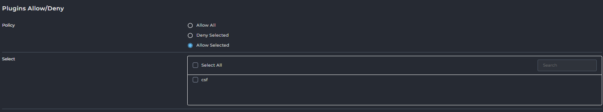
				- Select All: Một hộp kiểm cho phép bạn nhanh chóng chọn hoặc bỏ chọn tất cả các plugin trong danh sách chỉ với một cú nhấp chuột.
				- Search: Một ô tìm kiếm tiện lợi giúp bạn lọc nhanh danh sách các plugin, đặc biệt hữu ích khi hệ thống của bạn có nhiều plugin được cài đặt.
				- Danh sách các Plugin: Dưới đây là danh sách các plugin hiện có trên hệ thống của bạn. Bạn sẽ đánh dấu vào hộp kiểm bên cạnh tên plugin (ví dụ: csf) để chọn hoặc bỏ chọn nó theo chính sách "Deny Selected" hoặc "Allow Selected" mà bạn đã thiết lập.		
			
			

#### Manage User Packages
- Giao diện "Manage User Packages" cho phép bạn tạo, chỉnh sửa, nhập và quản lý các gói dịch vụ mà bạn cung cấp cho các tài khoản người dùng của mình. Mỗi gói định nghĩa các giới hạn tài nguyên và tính năng mà một tài khoản người dùng sẽ nhận được khi được gán gói đó.
- 
- Các nút chức năng 
	- 
	- ADD PACKAGE: Nút để tạo một gói dịch vụ mới.
		- Chi tiết các thông số cấu hình trình bày bên dưới.
	- IMPORT PACKAGES: Nút để nhập các gói dịch vụ.
		- Click chọn để import 
		- 
		- Paste nội dung gói đã export và click Import
		- 
		- Import thành công 
		- 
	- Delete: Xóa các gói dịch vụ đã chọn.
		- 
		- 
	- Export: Xuất cấu hình của các gói dịch vụ đã chọn.
		- 
		- 
- Danh sách Gói dịch vụ: Bảng này hiển thị tất cả các gói dịch vụ đã được tạo trong hệ thống của bạn, với các thông tin cơ bản:
	- 
	- Package: Tên của gói dịch vụ . Đây là tên mà bạn sẽ thấy khi gán gói cho người dùng mới hoặc thay đổi gói của người dùng hiện tại.
		- Click tên gói để mở giao diện chỉnh sửa gói. 
			- 
	- Bandwidth: Giới hạn băng thông (dữ liệu truyền tải) được cấp cho các tài khoản sử dụng gói này. 
	- Disk Usage: Giới hạn dung lượng ổ đĩa được cấp cho các tài khoản sử dụng gói này.
	- ... (biểu tượng ba chấm): Nút tùy chọn cho phép thực hiện các hành động cụ thể cho từng gói.
		- Rename: Đổi tên gói. 
			- 
			- 
		- Copy: Sao chép gói. 
			- 
			- 

- Tạo gói dịch vụ mới 
	- Click chọn Add Package
		- 
	- Chi tiết các cấu hình 
		- Giới hạn tài nguyên:
			- 
			- Bandwidth (MB): Giới hạn băng thông (ví dụ: 1000). Có thể chọn "Unlimited".
			- Disk Space (MB): Giới hạn dung lượng đĩa (ví dụ: 100). Có thể chọn "Unlimited".
			- Inode: Giới hạn số lượng tệp/thư mục. Có thể chọn "Unlimited".
			- Các giới hạn số lượng mục khác: Domains, Sub-Domains, E-mail Accounts, E-mail Forwarders, Mailing Lists, Autoresponders, MySQL Databases, Domain Pointers, FTP Accounts, E-mail Daily Limit. Tất cả đều có thể được đặt số cụ thể hoặc "Unlimited".
		- Quyền truy cập tính năng:
			- 
			- Anonymous FTP Accounts: Quyền cho phép các tài khoản FTP Anonymous
			- CGI Access: Quyền sử dụng CGI
			- PHP Access: Quyền thực thi PHP. 
			- SpamAssassin: Kích hoạt bộ lọc thư rác. 
			- Catch-All E-mail: Kích hoạt email Catch-All. 
			- SSL Access: Quyền sử dụng SSL. 
			- SSH Access: Quyền truy cập SSH. 
			- Cron Jobs: Quyền tạo tác vụ định kỳ. 
			- System Info: Quyền xem thông tin hệ thống. 
			- Login Keys: Quyền tạo khóa đăng nhập. 
			- DNS Control: Quyền quản lý DNS. 
			- Suspend at Limit: Tự động tạm ngưng khi đạt giới hạn. 
			- Automatic security.txt (RFC9116): Tự động tạo security.txt. 
			- Jailed: Kích hoạt môi trường "giam giữ" (jailed shell). 
			- Skin: Chọn giao diện bảng điều khiển cho người dùng. 
			- Language: Ngôn ngữ giao diện bảng điều khiển của tài khoản.
		- Bộ tính năng (Feature Sets):
			- 
			- Allow All Commands: Cho phép tất cả các lệnh/tính năng.
			- Allow Selected Features: Chỉ cho phép các tính năng được chọn.
				- Khi chọn Allow Selected Features, một giao diện tùy chọn sẽ xuất hiện, cho phép bạn chọn từ các bộ tính năng hoặc nhóm tính năng được định nghĩa trước:
				- Core Functions: Bao gồm các chức năng cốt lõi và cơ bản nhất để quản lý hosting (ví dụ: quản lý tệp, cơ sở dữ liệu cơ bản, v.v.).
				- DNS Only: Giới hạn tài khoản chỉ có thể quản lý các cài đặt DNS.
				- E-mail only: Giới hạn tài khoản chỉ có thể quản lý các chức năng liên quan đến email (tạo tài khoản email, chuyển tiếp, v.v.).
		- Chính sách Plugin (Plugins Allow/Deny):
			- 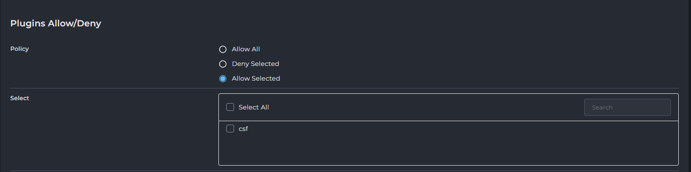
			- Allow All: Cho phép tất cả các plugin.
			- Deny Selected: Từ chối các plugin được chọn.
			- Allow Selected: Chỉ cho phép các plugin được chọn.
			- Khi bạn chọn chính sách Deny Selected hoặc Allow Selected, một khung lựa chọn các plugin sẽ tự động hiển thị bên dưới, cho phép bạn chỉ định cụ thể các plugin cần áp dụng chính sách:
				- Select All: Một hộp kiểm cho phép bạn nhanh chóng chọn hoặc bỏ chọn tất cả các plugin trong danh sách chỉ với một cú nhấp chuột.
				- Search: Một ô tìm kiếm tiện lợi giúp bạn lọc nhanh danh sách các plugin, đặc biệt hữu ích khi hệ thống của bạn có nhiều plugin được cài đặt.
				- Danh sách các Plugin: Dưới đây là danh sách các plugin hiện có trên hệ thống của bạn. Bạn sẽ đánh dấu vào hộp kiểm bên cạnh tên plugin (ví dụ: csf) để chọn hoặc bỏ chọn nó theo chính sách "Deny Selected" hoặc "Allow Selected" mà bạn đã thiết lập.
		- Cấu hình tên cho gói (Package Name): Nhập tên định danh cho gói dịch vụ mới 
			- 
		- Nút chức năng `Save`: Lưu cấu hình tạo gói dịch vụ mới.
#### Move Users between Resellers
- Giao diện "Move Users Between Resellers" cho phép quản trị viên di chuyển các tài khoản người dùng từ một đại lý (reseller) này sang một đại lý khác trong cùng hệ thống DirectAdmin. Chức năng này hữu ích trong các trường hợp tái cấu trúc tài khoản, chuyển nhượng khách hàng giữa các reseller, hoặc khi một reseller ngừng hoạt động.
- Mục đích:
	- Quản lý cấu trúc tài khoản: Cho phép quản trị viên tổ chức lại tài khoản người dùng dưới các reseller khác nhau.
	- Chuyển giao khách hàng: Hỗ trợ việc chuyển giao khách hàng giữa các reseller một cách hiệu quả và an toàn.
	- Đơn giản hóa quy trình: Tự động hóa quá trình di chuyển tài khoản, tránh việc phải tạo lại tài khoản thủ công dưới reseller mới.
- Giao diện tổng quan 
- 
	- Chọn Người Dùng (Select Users):
		- 
		- Phần này hiển thị danh sách tất cả các tài khoản người dùng và tài khoản đại lý (reseller) hiện có trong hệ thống.
		- Select All: Hộp kiểm cho phép bạn chọn tất cả người dùng và reseller trong danh sách.
		- Search: Ô tìm kiếm để lọc nhanh danh sách người dùng/reseller.
		- Danh sách tài khoản:
			- Các mục có định dạng "Reseller: [Tên Reseller]" (ví dụ: Reseller: admin, Reseller: reseller) đại diện cho các tài khoản đại lý (reseller) có trong hệ thống.
			- Các mục có định dạng [Tên Người dùng] (ví dụ: lampk, user1, user, user2) đại diện cho các tài khoản người dùng cuối (client accounts) được quản lý bởi các reseller.
			- Bạn sẽ đánh dấu vào hộp kiểm bên cạnh tên người dùng mà bạn muốn di chuyển.
	- Chọn Đại lý Đích (Select Reseller):
		- 
		- Select: Một menu thả xuống cho phép bạn chọn tài khoản đại lý (reseller) mà bạn muốn chuyển các người dùng đã chọn đến. Danh sách này sẽ bao gồm các tài khoản reseller hiện có trong hệ thống.
	- Thực hiện di chuyển:
		- MOVE USERS: Nút hành động. Sau khi bạn đã chọn người dùng cần di chuyển và đại lý đích, nhấn nút này để thực hiện quá trình chuyển đổi.
- Ví Dụ Thực Hiện: Di Chuyển Người Dùng Giữa Các Đại lý
	- Trong ví dụ này, chúng ta sẽ thực hiện di chuyển tài khoản người dùng user2 hiện đang thuộc quyền quản lý của đại lý reseller sang quyền quản lý của đại lý reseller1.
	- Các bước thực hiện:
		- Bước 1: Chọn người dùng cần di chuyển.
			- Truy cập giao diện "Move Users Between Resellers".
			- Trong phần Select Users, tìm và đánh dấu vào hộp kiểm bên cạnh tên người dùng mà bạn muốn di chuyển.
			- Ví dụ minh họa: Chọn user2 dưới mục Reseller: reseller.
			- 
		- Bước 2: Chọn đại lý đích để chuyển đến.
			- Trong phần Select Reseller ở phía dưới, nhấp vào menu thả xuống.
			- Chọn tên của đại lý mà bạn muốn chuyển người dùng đã chọn sang.
			- Ví dụ minh họa: Chọn reseller1.
			- 
		- Bước 3: Xác nhận di chuyển.
			- Sau khi đã chọn người dùng và đại lý đích, nhấp vào nút MOVE USERS.
			- Ví dụ minh họa: Nút "MOVE USERS" sẽ được kích hoạt.
			- 
		- Bước 4: Kiểm tra kết quả.
			- Sau khi quá trình di chuyển hoàn tất, bạn có thể kiểm tra lại trong giao diện quản lý người dùng (ví dụ: "Users" hoặc "My Users" của reseller đích) để xác nhận rằng tài khoản người dùng đã được chuyển giao thành công.
			- Ví dụ minh họa: Kiểm tra trong danh sách người dùng, user2 giờ đây sẽ xuất hiện dưới quyền quản lý của reseller1.
			- 

#### Edit User Message
- Giao diện "Edit User Message" cho phép quản trị viên hoặc reseller tùy chỉnh nội dung của email chào mừng được gửi tự động đến người dùng mới khi tài khoản của họ được tạo ra trên hệ thống DirectAdmin.
- Mục đích:
	- Cho phép quản trị viên/reseller tùy chỉnh thông điệp chào mừng, cung cấp thông tin cần thiết và hướng dẫn rõ ràng cho người dùng mới ngay sau khi tài khoản của họ được kích hoạt.
	- Đảm bảo tính chuyên nghiệp và đồng nhất trong giao tiếp với khách hàng.
- Tổng quan giao diện 
	- Tiêu đề Email (Subject):
		- Subject: Trường này chứa tiêu đề của email chào mừng.
			- Ví dụ mặc định: `Your account for |DOMAIN| is now ready for use.`
			- Bạn có thể sử dụng các biến (ví dụ `|DOMAIN|`) để tự động điền thông tin cụ thể của người dùng.
	- Nội dung Email (Message):
		- Message: Đây là khu vực nơi bạn có thể soạn thảo nội dung chính của email chào mừng.
		- Nội dung mẫu thường bao gồm lời cảm ơn, thông tin chi tiết tài khoản, và hướng dẫn đăng nhập.
		- Bạn có thể sử dụng các biến (placeholder) để hệ thống tự động điền thông tin tài khoản của người dùng mới:
			- `|USERNAME|`: Tên đăng nhập của người dùng.
			- `|PASSWORD|`: Mật khẩu của người dùng.
			- `|DOMAIN|`: Tên miền chính của tài khoản.
			- `|IP|`: Địa chỉ IP của máy chủ.
			- `|PORT|`: Cổng đăng nhập.
			- `|BANDWIDTH|`: Giới hạn băng thông của gói dịch vụ.
			- `|DISKSPACE|`: Giới hạn dung lượng đĩa của gói dịch vụ.
		- Các biến này giúp cá nhân hóa email cho từng người dùng mà không cần chỉnh sửa thủ công.
	- Các nút hành động:
		- RESET TO DEFAULT: Nút này sẽ khôi phục tiêu đề và nội dung email về trạng thái mặc định ban đầu của hệ thống.
		- SAVE: Nút này để lưu lại các thay đổi bạn đã thực hiện trong tiêu đề và nội dung email.

#### Change Passwords
- Giao diện trong DirectAdmin cho phép người dùng hoặc quản trị viên thay đổi mật khẩu cho một tài khoản cụ thể.
- 
	- "Username" (Tên người dùng): Trường nhập liệu này dùng để nhập tên người dùng của tài khoản mà bạn muốn thay đổi mật khẩu.
	- "Enter Password" (Nhập Mật khẩu): Trường nhập liệu này dùng để nhập mật khẩu mới mà bạn muốn đặt cho tài khoản đã chọn.
		- Bên cạnh trường mật khẩu, có một icon `con mắt` cho phép bạn hiển thị hoặc ẩn mật khẩu đã nhập để dễ dàng kiểm tra.
		- Cũng có một icon `xúc xắc` kích hoạt tính năng tạo mật khẩu ngẫu nhiên.
	- Nút "SUBMIT" (Gửi): Sau khi nhập tên người dùng và mật khẩu mới, nhấp vào nút này để lưu thay đổi và áp dụng mật khẩu mới cho tài khoản.
- Ví dụ đổi password user `user` 
- 
- 
- 

### Reseller Management
- Nhóm các chức năng quản lý reseller - đại lý 	
#### Create Reseller 
- Giao diện này trong DirectAdmin được sử dụng để tạo một tài khoản reseller mới, cho phép họ quản lý và bán các gói hosting của riêng mình cho người dùng cuối.
	- 
- Các nút chức năng 
	- EDIT RESELLER MESSAGE: Cho phép chỉnh sửa mẫu email chào mừng sẽ gửi cho reseller mới được tạo.
	- 
	- 
		- Tương tự như phần `Edit User Message` có thể cấu hình subject, nội dung mail gửi tới khi tạo tài khoản hoàn tất. 
	- MANAGE RESELLER PACKAGES: Click chuyển tới đến giao diện quản lý các gói reseller hiện có.
	- CUSTOMIZE: Cho phép tùy chỉnh sâu hơn các cài đặt của reseller không sử dụng các plan đã tạo trước khi tạo.
		- Click sẽ mở giao diện cấu hình chi tiết các thông số. Các thông số này sẽ được trình bày chi tiết tại phần tại plan Reseller
		- 
	- CREATE: Dùng để hoàn tất việc tạo tài khoản reseller với các thông tin đã nhập.
- Các trường cấu hình 
	- "Username" (Tên người dùng): Trường nhập liệu để đặt tên đăng nhập cho tài khoản reseller mới.
	- "E-mail" (Email): Trường nhập liệu để nhập địa chỉ email liên hệ cho tài khoản reseller.
	- "Enter Password" (Nhập Mật khẩu): Trường nhập liệu để đặt mật khẩu cho tài khoản reseller mới. Có biểu tượng mắt để hiện/ẩn mật khẩu và một biểu tượng `xúc xắc` tạo mật khẩu ngẫu nhiên. 
	- "Domain" (Tên miền): Trường nhập liệu để đặt tên miền chính cho tài khoản reseller.
	- "Package" (Gói): Menu thả xuống để chọn gói reseller (Reseller Package) sẽ được gán cho tài khoản này . Bên cạnh đó hiển thị số lượng IP miễn phí còn lại.
	- "IP": Menu thả xuống để chọn loại IP sẽ được gán cho reseller.
		- Shared - Server (IP Chia sẻ - Máy chủ): Reseller và các tài khoản người dùng của họ sẽ sử dụng địa chỉ IP chính của máy chủ. Đây là IP được chia sẻ với nhiều tài khoản khác trên cùng server.
		- Shared - Reseller IP (IP Chia sẻ - IP của Reseller): Nếu reseller có IP riêng được gán, tùy chọn này cho phép các tài khoản người dùng của họ chia sẻ IP đó của reseller, thay vì IP chính của máy chủ.
		- Assigned (IP Đã được gán): Gán một địa chỉ IP riêng biệt, độc lập trực tiếp cho reseller đó. Thường dùng khi reseller cần IP riêng cho mục đích đặc biệt (ví dụ: SSL riêng).
	- "Send E-mail Notification" (Gửi Thông báo Email): Tuỳ chọn khi được bật sẽ tự động gửi email thông báo tạo tài khoản reseller đến địa chỉ email đã cung cấp.

- Ví dụ: Tạo reseller sử dụng gói được thiết lập sẵn
	- Bước 1: Truy cập Giao diện Tạo Reseller
		- Đăng nhập vào bảng điều khiển DirectAdmin của bạn với quyền quản trị viên (Admin).
		- Tìm và nhấp vào mục "Create Reseller" (Tạo Reseller) trong menu điều hướng.
	- Bước 2: Nhập Thông tin Tài khoản Reseller
		- Trong giao diện "Create Reseller", bạn sẽ điền các thông tin cơ bản cho reseller mới:
		- Username (Tên người dùng): Nhập một tên đăng nhập duy nhất cho reseller này (ví dụ: `reseller3`).
		- E-mail (Email): Nhập địa chỉ email liên hệ của reseller (ví dụ: `reseller@example.com`).
		- Enter Password (Nhập Mật khẩu): Đặt mật khẩu an toàn cho tài khoản reseller. Bạn có thể nhập thủ công hoặc sử dụng công cụ tạo mật khẩu ngẫu nhiên nếu có.
		- Domain (Tên miền): Nhập tên miền chính cho tài khoản reseller (ví dụ: `resellerdomain.com`).
	- Bước 3: Gán Gói Reseller Có Sẵn
		- Tại phần "Package" trong cùng giao diện "Create Reseller":
		- Package (Gói): Sử dụng menu thả xuống để chọn một gói reseller đã được định nghĩa sẵn trong hệ thống của bạn (ví dụ: `re_plan_full`).
	- Bước 4: Cấu hình IP và Thông báo (Tùy chọn)
		- IP: Chọn loại IP mà reseller này sẽ sử dụng. Tùy chọn phổ biến là "Shared - Server" (IP chia sẻ của máy chủ).
		- Send E-mail Notification (Gửi Thông báo Email): Đánh dấu vào ô kiểm này nếu bạn muốn hệ thống tự động gửi email chào mừng với thông tin tài khoản đến địa chỉ email của reseller.
	- 
	- Bước 5: Hoàn tất Tạo Reseller
		- Nhấp vào nút "CREATE" ở cuối trang để tạo tài khoản reseller với các cài đặt đã chọn.
		- 	
		- Sau khi nhấn "CREATE", tài khoản reseller sẽ được thiết lập với gói dịch vụ đã chọn, và họ có thể đăng nhập để bắt đầu quản lý các tài khoản người dùng của riêng họ.
		- 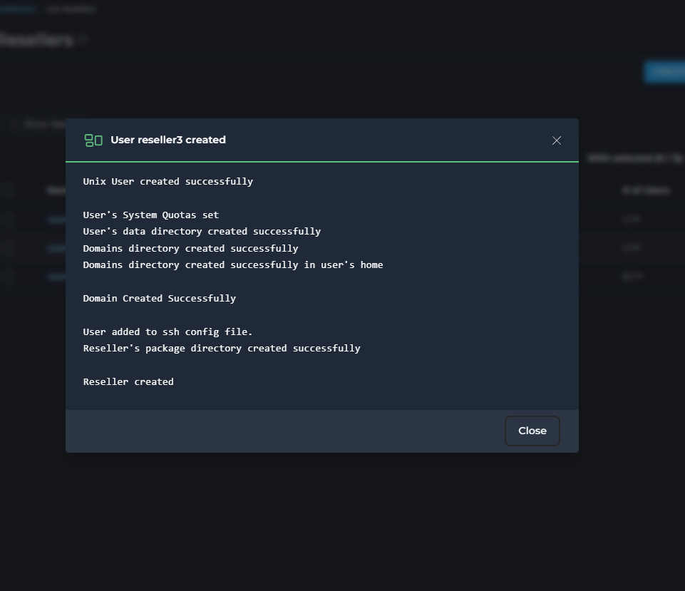	
		- 	
		
- Ví dụ: Tạo reseller customize 
	- Bước 1: Truy cập Giao diện Tạo Reseller
		- Đăng nhập vào bảng điều khiển DirectAdmin của bạn với quyền quản trị viên (Admin).
		- Tìm và nhấp vào mục "Create Reseller" (Tạo Reseller) trong menu điều hướng.
	- Bước 2: Nhập Thông tin Cơ bản của Tài khoản Reseller
		- Trong giao diện "Create Reseller", bạn sẽ điền các thông tin bắt buộc cho reseller mới:
		- Username (Tên người dùng): Nhập một tên đăng nhập duy nhất cho reseller này (ví dụ: reseller4).
		- E-mail (Email): Nhập địa chỉ email liên hệ của reseller (ví dụ: reseller4@example.com).
		- Enter Password (Nhập Mật khẩu): Đặt mật khẩu an toàn cho tài khoản reseller.
		- Domain (Tên miền): Nhập tên miền chính cho tài khoản reseller (ví dụ: reseller4.com).
		- IP: Chọn loại IP sẽ được gán cho reseller (ví dụ: "Shared - Server").
		- Send E-mail Notification (Gửi Thông báo Email): Đánh dấu vào ô kiểm này nếu bạn muốn gửi email chào mừng tự động.
		- 	
	- Bước 3: Bỏ qua lựa chọn gói và Chọn "CUSTOMIZE"
		- Tại phần "Package", bạn có thể thấy một gói mặc định được chọn (ví dụ: re_plan_A). Không cần thay đổi lựa chọn này, vì chúng ta sẽ ghi đè lên nó bằng các cài đặt tùy chỉnh.
		- Nhấp vào nút "CUSTOMIZE" ở cuối giao diện (bên cạnh nút "CREATE").
		- 	
	- Bước 4: Tùy chỉnh Cài đặt Gói (Giao diện mới xuất hiện)
		- Giao diện xuất hiện sau khi nhấn "CUSTOMIZE" cho phép bạn thiết lập mọi khía cạnh của gói reseller:
		- Giới hạn Tài nguyên:
			- Bandwidth (Băng thông): Đặt giới hạn băng thông tối đa (ví dụ: 5000 MB), hoặc chọn "Unlimited" nếu không giới hạn.
			- Disk Space (Dung lượng đĩa): Đặt giới hạn dung lượng lưu trữ tối đa (ví dụ: 1000 MB), hoặc "Unlimited".
			- Inode: Đặt giới hạn về số lượng tệp và thư mục (thường là "Unlimited" hoặc một số lượng lớn).
			- Domains (Số tên miền): Đặt số lượng tên miền tối đa mà reseller này có thể thêm (ví dụ: 10 tên miền).
			- Sub-Domains (Số tên miền con): Đặt số lượng tên miền con tối đa mà reseller có thể tạo (ví dụ: 10 tên miền con).
			- E-mail Accounts (Tài khoản Email): Đặt số lượng tài khoản email tối đa (ví dụ: 100 tài khoản).
			- E-mail Forwarders (Chuyển tiếp Email): Đặt số lượng bộ chuyển tiếp email tối đa (ví dụ: 100).
			- Mailing Lists (Danh sách gửi thư): Đặt số lượng danh sách gửi thư tối đa (ví dụ: 10).
			- Autoresponders (Trả lời tự động): Đặt số lượng bộ trả lời tự động tối đa (ví dụ: 100).
			- MySQL Databases (Cơ sở dữ liệu MySQL): Đặt số lượng cơ sở dữ liệu tối đa (ví dụ: 20).
			- Domain Pointers (Con trỏ tên miền): Đặt số lượng con trỏ tên miền tối đa (ví dụ: 20).
			- FTP Accounts (Tài khoản FTP): Đặt số lượng tài khoản FTP tối đa (ví dụ: 20).
			- User Accounts (Tài khoản người dùng): Đặt số lượng tài khoản người dùng reseler được tạo (ví dụ: 200)
			- IPs: Cấu hình số lượng IP reseller sở hữu (ví dụ: 0) 
			- 	
		- Quyền truy cập Tính năng:
			- Anonymous FTP Accounts (Tài khoản FTP ẩn danh): Chọn ô kiểm để kích hoạt tính năng này.
			- CGI Access (Truy cập CGI): Chọn ô kiểm để cho phép thực thi các tập lệnh CGI.
			- PHP Access (Truy cập PHP): Chọn ô kiểm để cho phép thực thi các tập lệnh PHP.
			- SpamAssassin: Chọn ô kiểm để kích hoạt tính năng lọc spam SpamAssassin.
			- Catch-All E-mail (Email bắt tất cả): Chọn ô kiểm để cho phép thiết lập địa chỉ email bắt tất cả.
			- SSL Access (Truy cập SSL): Chọn ô kiểm để cho phép sử dụng chứng chỉ SSL.
			- SSH Access (Truy cập SSH): Chọn ô kiểm để cấp quyền truy cập SSH Shell.
			- SSH Access for Users: (Truy cập SSH cho người dùng): Chọn ô kiểm để cấp quyền truy cập SSH Shell cho người dùng cuối.
			- Allow Overselling: (Cho phép bán quá tài nguyên được cấp): Chọn ô kiểm để cấp quyền 
			- Cron Jobs: Chọn ô kiểm để cho phép tạo và quản lý các tác vụ định kỳ (cron jobs).
			- System Info (Thông tin hệ thống): Chọn ô kiểm để cho phép xem thông tin hệ thống.
			- Login Keys (Khóa đăng nhập): Chọn ô kiểm để cho phép quản lý khóa đăng nhập.
			- DNS Control (Kiểm soát DNS): Chọn ô kiểm để cho phép quản lý các bản ghi DNS.
			- Personal DNS's: Cấu hình số lượng địa chỉ IP gán cho reseller sử dụng cho NS và Domain. 
				- `None` (Không có): 
					- Reseller sẽ không có Nameservers riêng. Họ sẽ phải sử dụng Nameservers của nhà cung cấp dịch vụ hoặc Nameservers mặc định của hệ thống.
					- Thích hợp cho reseller nhỏ, không muốn quản lý IP hoặc khi nhà cung cấp muốn hạn chế số lượng IP cấp cho reseller.
				- `Uses 2 IPs, domain uses one of them` (Sử dụng 2 IP, tên miền sử dụng một trong số đó):
					- Hệ thống sẽ cấp 2 địa chỉ IP riêng biệt cho reseller. Reseller có thể tạo Nameservers cá nhân (ví dụ: `ns1.yourresellerdomain.com` trỏ đến IP1, `ns2.yourresellerdomain.com` trỏ đến IP2). Đồng thời, tên miền chính của reseller (`yourresellerdomain.com`) sẽ được gán cho 1 trong 2 IP này.
					- Cung cấp tính chuyên nghiệp và dự phòng (DNS redundancy) cho reseller. Đây là lựa chọn phổ biến.
				- `Uses 3 IPs, domain gets own IP` (Sử dụng 3 IP, tên miền có IP riêng):
					- Hệ thống cấp 3 địa chỉ IP riêng biệt. Reseller có thể tạo 3 Nameservers (ví dụ: `ns1`, `ns2`, `ns3` trỏ đến 3 IP khác nhau). Đặc biệt, tên miền chính của reseller (`yourresellerdomain.com`) sẽ được gán một địa chỉ IP thứ 4 riêng biệt, không trùng với 3 IP của Nameservers.
					- Cung cấp mức độ tách biệt và dự phòng cao nhất, thường dành cho các reseller lớn, đòi hỏi tối ưu hiệu suất và độ tin cậy cho cả Nameservers và website chính của reseller.
			- Share Server IP : Tuỳ chọn `Allow Reseller to create sites with server IP` cho phép reseller tạo website với địa chỉ IP máy chủ. 
			- 	
	- Bước 5: Hoàn tất Tạo Reseller với Cài đặt Tùy chỉnh
		- Sau khi đã cấu hình tất cả các cài đặt tùy chỉnh, hãy cuộn xuống cuối trang và nhấp vào nút "SAVE" (hoặc "CREATE" tùy theo giao diện cụ thể sau khi customize) để tạo tài khoản reseller với các thiết lập riêng này.
			- 	
			- 	
			- 	
		
#### List Resellers 
- Quản lý danh sách các tài khoản người bán lại (Reseller)
- 	
- Các nút chức năng :
	- CREATE RESELLER: Click chuyển tới giao diện tạo một tài khoản reseller mới.
	- CREATE ADMINISTRATOR: Click chuyển tới giao diện tạo tài khoản quản trị viên mới.
	- ADD NEW USER: Click chuyển tới giao diện thêm một tài khoản người dùng cuối (customer) mới.
	- Send a Message: Gửi tin nhắn cho reseller đã chọn.
		- 
		- 	
		-	 Cấu hình tiêu đề, nội dung tin nhắn, tuỳ chọn chỉ gửi email. 
	- Suspend: Tạm đình chỉ tài khoản reseller đã chọn (ngừng hoạt động).
		- 	
		- 	
	- Cấu hình lý do, thông tin chi tiết.
		- Unsuspend: Khôi phục tài khoản reseller đã đình chỉ.
		- 	
	- Delete: Xóa vĩnh viễn tài khoản reseller đã chọn.
		- 	
		- 	
- Bảng danh sách Resellers:
	- Bảng này hiển thị thông tin chi tiết về từng tài khoản người bán lại hiện có:
	- Name (Tên): Tên đăng nhập hoặc tên hiển thị của tài khoản reseller.
	- Click để mở giao diện thông tin chi tiết reseller
	- Bandwidth (Băng thông): Lượng băng thông đã sử dụng trên tổng số băng thông được cấp phát cho reseller đó.
	- Disk Usage (Dung lượng đĩa): Lượng dung lượng lưu trữ đã sử dụng trên tổng số dung lượng được cấp phát cho reseller đó.
	- `# of Users` (Số lượng Người dùng): Số lượng tài khoản người dùng cuối (khách hàng) mà reseller đó đang quản lý trên tổng số lượng người dùng tối đa được phép.
	- `# of domains` (Số lượng tên miền): Số lượng tên miền (website) mà reseller đó đang quản lý trên tổng số lượng tên miền tối đa được phép.
	- ... (biểu tượng ba chấm): Nút tùy chọn cho phép thực hiện các hành động cụ thể cho từng reseller
		- Send a Message: Gửi tin nhắn riêng cho [username].
		- Suspend: Tạm đình chỉ tài khoản [username].
		- Login as [username]: Đăng nhập vào tài khoản của [username] với tư cách quản trị viên (rất hữu ích để hỗ trợ hoặc kiểm tra).
		- Change [username]'s password: Thay đổi mật khẩu của tài khoản [username].
		- Remove: Xóa vĩnh viễn tài khoản [username].

- Giao diện thông tin, cấu hình chi tiết reseller 
	- 	
	- Giao diện "View Reseller: [username]" cung cấp cái nhìn tổng quan và các tùy chọn quản lý chi tiết cho một tài khoản reseller cụ thể.
	- Thông tin chung và tác vụ chính:
		- 
		- Change Password: Nút để thay đổi mật khẩu của reseller này.
			- Click để đổi mật khẩu, có thể tạo ngẫu nhiên bằng click chọn icon `Xúc xắc` hoặc xem mật khẩu bằng icon `con mắt`.
			- Click `Save` để thay đổi. 
			- 
		- Các nút chức năng:
			- LOGIN AS [USERNAME]: Đăng nhập vào tài khoản của reseller (dành cho quản trị viên hỗ trợ).
			- DELETE: Xóa vĩnh viễn tài khoản reseller này.
	- Các tab thông tin chi tiết:
		- Giao diện được tổ chức thành các tab để hiển thị các loại thông tin khác nhau:
			- Users : Hiển thị danh sách các tài khoản reseller quản lý bởi reseller này cùng với thông tin chi tiết về từng tài khoản.
			- Usage Statistics: Thống kê chi tiết việc sử dụng tài nguyên của reseller.
			- Info: Thông tin chi tiết về tài khoản reseller.
			- Comments: Ghi chú hoặc bình luận về tài khoản.
			- Modify: Tab để chỉnh sửa các cài đặt của reseller
		- Users : Hiển thị danh sách các tài khoản reseller quản lý bởi reseller.
			- 
			- Username: Tên người dùng 
			- Bandwidth: Băng thông đã sử dụng của user.
			- Disk Usage: Dung lượng đĩa đã sử dụng của user.
			- `# of domains`: Số lượng tên miền mà user đó đang quản lý trên tổng số lượng tên miền tối đa được phép.

		- Usage Statistics: Chi tiết về việc sử dụng tài nguyên hiện tại của một tài khoản reseller và các giới hạn tài nguyên đã được thiết lập cho tài khoản đó
			- Bandwidth (Băng thông):
				- Usage: Băng thông chính reseller đã dùng.
				- Allocated: Tổng băng thông mà reseller này được phép phân bổ cho tất cả các gói hosting của khách hàng mà họ tạo ra.
				- Limit: Tổng băng thông mà reseller này được phép sử dụng cho chính tài khoản reseller của họ và cộng dồn từ tất cả các khách hàng của họ. 
				- Dòng "Additional Bandwidth" thể hiện băng thông được cấp thêm. 
					- Click chọn icon `Edit` để chỉnh sửa tăng thêm băng thông tạm thời 
					- 
					- Cấu hình thông số cần thêm: theo MB/GB/TB. Click chọn Increase Bandwidth để xác nhận 
					- 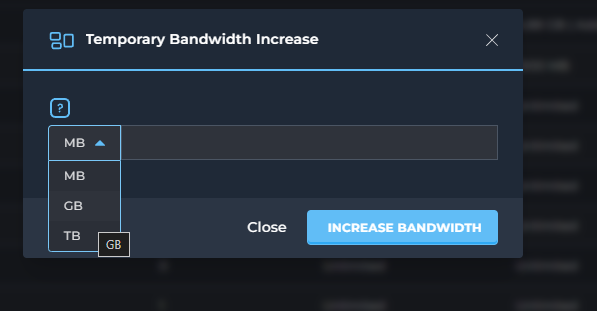
					- Ví dụ cấu hình thêm 1 GB bandwidth 
					- 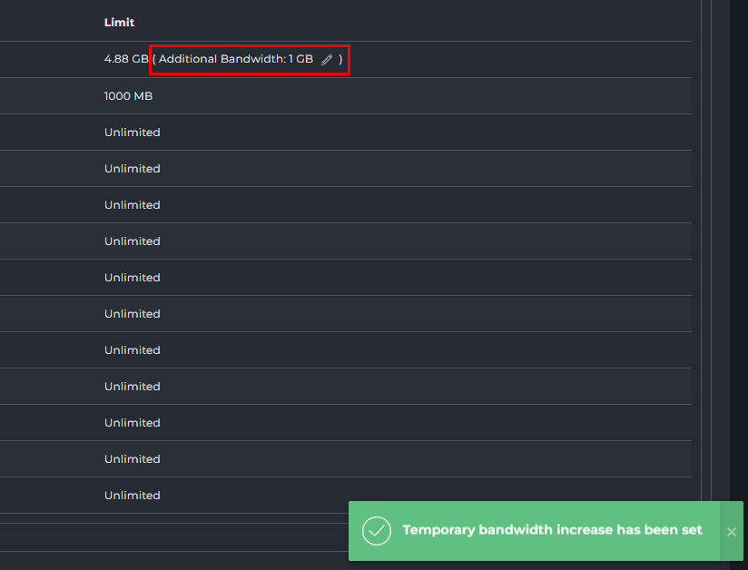
			- Disk Usage (Dung lượng đĩa):
				- Usage: Dung lượng đĩa chính reseller đã dùng.
				- Allocated: Tổng dung lượng đĩa mà reseller này được phép phân bổ cho tất cả các gói hosting của khách hàng mà họ tạo ra.
				- Limit: Tổng dung lượng đĩa mà reseller này được phép sử dụng cho chính tài khoản reseller của họ và cộng dồn từ tất cả các khách hàng của họ.
			- Inode:
				- Usage: Số lượng file/folder chính reseller đang có.
				- Allocated (Unlimited): Reseller có thể cấp phát không giới hạn số lượng inode cho các gói khách hàng.
				- Limit (Unlimited): Tài khoản reseller và tất cả khách hàng dưới quyền không bị giới hạn về tổng số inode.
			- `# of Domains` (Số lượng tên miền):
				- Usage: Số lượng tên miền chính reseller đang host.
				- Allocated (Unlimited): Reseller có thể cấp phát không giới hạn số lượng tên miền cho các gói khách hàng.
				- Limit (Unlimited): Reseller và các khách hàng dưới quyền không bị giới hạn về tổng số tên miền.
			- `# of Subdomains` (Số lượng tên miền phụ): Tương tự như tên miền chính, không giới hạn.
			- E-mail Accounts (Tài khoản Email): Tương tự, không giới hạn số lượng tài khoản email mà reseller có thể tạo cho khách hàng của mình.
			- E-mail Forwarders (Chuyển tiếp Email): Không giới hạn.
			- Mailing Lists (Danh sách gửi thư): Không giới hạn.
			- Autoresponders (Tự động trả lời Email): Không giới hạn.
			- `# of DBs` (Số lượng Cơ sở dữ liệu): Không giới hạn số lượng cơ sở dữ liệu mà reseller có thể tạo cho khách hàng.
			- Domain Pointers (Trỏ tên miền): Không giới hạn.
			- FTP Accounts (Tài khoản FTP): Không giới hạn số lượng tài khoản FTP mà reseller có thể tạo cho khách hàng.
			- User Accounts (Tài khoản Người dùng):
				- Usage: Số lượng tài khoản người dùng (khách hàng) reseller đã tạo.
				- Allocated (Unlimited): Reseller có thể tạo không giới hạn số lượng tài khoản người dùng cuối.
				- Limit (Unlimited): Không có giới hạn tổng số tài khoản người dùng mà reseller có thể quản lý.
		- Info: Hiển thị các tính năng và giới hạn được áp dụng cho reseller
			- 
			- Các thông số chính:
				- `# of IPs`: Số lượng địa chỉ IP được cấp.
				- Nameserver 1 & 2: Các Nameserver Reseller đang sử dụng làm máy chủ tên miền.
				- Package: Gói hiện tại là "custom" (tùy chỉnh), dựa trên gói gốc "Test".		
			- Các tính năng:
				- Enabled (Bật):
					- SSH: Cho phép truy cập dòng lệnh vào server.
					- SSL: Cho phép cài đặt chứng chỉ bảo mật HTTPS.
					- CGI: Cho phép chạy script CGI.
					- PHP: Cho phép sử dụng ngôn ngữ lập trình PHP.
					- SpamAssassin: Bật bộ lọc thư rác.
					- Cron Jobs: Cho phép tạo tác vụ tự động.
					- System Info: Cho phép xem thông tin hệ thống.
					- Login Keys: Bật tính năng khóa đăng nhập.
					- DNS Control: Cho phép quản lý bản ghi DNS.
					- Oversell: Cho phép reseller bán quá mức tài nguyên 
					- Can use Server IP: Cho phép sử dụng IP chung của máy chủ.
				- Disabled (Tắt):
					- User SSH: Người dùng con (của reseller) không được phép dùng SSH.
					- GIT: Tính năng cài đặt/hỗ trợ GIT tự động bị tắt.
					- WordPress: Tính năng cài đặt/hỗ trợ WordPress tự động bị tắt.
					- ClamAV: Phần mềm quét virus ClamAV bị tắt.
					- Nginx Unit: Nền tảng ứng dụng Nginx Unit bị tắt.
					- Catch-All E-mail: Tính năng nhận tất cả email không xác định bị tắt.
					- Anonymous FTP: FTP ẩn danh bị tắt.
		- Comments: Ghi chú hoặc bình luận về tài khoản.
			- 
		- Modify: Chỉnh sửa thông tin hoặc cấu hình của tài khoản reseller
			- 
			- 
			- Thay đổi Gói Dịch Vụ (Change Package for Reseller):
				- Set Package to: Một menu thả xuống cho phép chọn một gói dịch vụ (Package) khác cho tài khoản này.
				- Save: Nút để áp dụng thay đổi gói dịch vụ.
			- Thay đổi Cài đặt Thủ công (Manually Change Settings):
				- Phần này cung cấp các tùy chọn để ghi đè các cài đặt từ gói dịch vụ (Package) đã chọn, cho phép tùy chỉnh riêng biệt cho tài khoản này.
				- Giới hạn tài nguyên:
					- Bandwidth (MB): Giới hạn băng thông (ví dụ: 1000). Có thể chọn "Unlimited".
					- Disk Space (MB): Giới hạn dung lượng đĩa (ví dụ: 100). Có thể chọn "Unlimited".
					- Inode: Giới hạn số lượng tệp/thư mục. Có thể chọn "Unlimited".
					- Các giới hạn số lượng mục khác: Domains, Sub-Domains, E-mail Accounts, E-mail Forwarders, Mailing Lists, Autoresponders, MySQL Databases, Domain Pointers, FTP Accounts, User Accounts. Tất cả đều có thể được đặt số cụ thể hoặc "Unlimited".
				- Quyền truy cập tính năng:
					- Anonymous FTP Accounts: Quyền cho phép các tài khoản FTP Anonymous
					- CGI Access: Quyền sử dụng CGI
					- PHP Access: Quyền thực thi PHP. 
					- SpamAssassin: Kích hoạt bộ lọc thư rác. 
					- Catch-All E-mail: Kích hoạt email Catch-All. 
					- SSL Access: Quyền sử dụng SSL. 
					- SSH Access: Quyền truy cập SSH. 
					- SSH Access for Users: Quyền truy cập SSH của người dùng cuối. 
					- Allow Overselling: Cho phép reseller bán quá mức tài nguyên được cấp. 
					- Cron Jobs: Quyền tạo tác vụ định kỳ. 
					- System Info: Quyền xem thông tin hệ thống. 
					- Login Keys: Quyền tạo khóa đăng nhập. 
					- DNS Control: Quyền quản lý DNS. 

#### Manage Reseller Packages
- Giao diện "Manage Reseller Packages" cho phép bạn tạo, chỉnh sửa, import và quản lý các gói dịch vụ mà bạn cung cấp cho các tài khoản reseller của mình. Mỗi gói định nghĩa các giới hạn tài nguyên và tính năng mà một tài khoản reseller sẽ nhận được khi được gán gói đó.
- 
- Các nút chức năng 
	- 
	- CREATE PACKAGE: Nút để tạo một gói dịch vụ mới.
		- Chi tiết các thông số cấu hình trình bày bên dưới.
	- IMPORT PACKAGES: Nút để nhập các gói dịch vụ.
		- Click chọn để import 
		- 
		- Paste nội dung gói đã export và click Import
		- 
		- Import thành công 
		- 
	- Delete: Xóa các gói dịch vụ đã chọn.
		- 
		- 
	- Export: Xuất cấu hình của các gói dịch vụ đã chọn.
		- 
		- 
- Danh sách Gói dịch vụ: Bảng này hiển thị tất cả các gói dịch vụ đã được tạo trong hệ thống của bạn, với các thông tin cơ bản:
	- 
	- Package: Tên của gói dịch vụ . Đây là tên mà bạn sẽ thấy khi gán gói cho reseller mới hoặc thay đổi gói của reseller hiện tại.
		- Click tên gói để mở giao diện chỉnh sửa gói. 
			- 
	- Bandwidth: Giới hạn băng thông (dữ liệu truyền tải) được cấp cho các tài khoản sử dụng gói này. 
	- Disk Usage: Giới hạn dung lượng ổ đĩa được cấp cho các tài khoản sử dụng gói này.
	- IP(s): Số lượng địa chỉ IP được cấp. 
	- ... (biểu tượng ba chấm): Nút tùy chọn cho phép thực hiện các hành động cụ thể cho từng gói.
		- Rename: Đổi tên gói. 
			- 
			- 
		- Copy: Sao chép gói. 
			- 
			- 

- Tạo gói dịch vụ mới 
	- Click chọn Create Package
		- 
	- Chi tiết các cấu hình 
		- Giới hạn tài nguyên:
			- 
			- Bandwidth (MB): Giới hạn băng thông (ví dụ: 5000). Có thể chọn "Unlimited".
			- Disk Space (MB): Giới hạn dung lượng đĩa (ví dụ: 1000). Có thể chọn "Unlimited".
			- Inode: Giới hạn số lượng tệp/thư mục. Có thể chọn "Unlimited".
			- IP: Cấu hình số lượng IP được gán cho gói.
			- Các giới hạn số lượng mục khác: Domains, Sub-Domains, E-mail Accounts, E-mail Forwarders, Mailing Lists, Autoresponders, MySQL Databases, Domain Pointers, FTP Accounts, User Accounts. Tất cả đều có thể được đặt số cụ thể hoặc "Unlimited".
		- Quyền truy cập tính năng:
			- 
			- Anonymous FTP Accounts: Quyền cho phép các tài khoản FTP Anonymous
			- CGI Access: Quyền sử dụng CGI
			- PHP Access: Quyền thực thi PHP. 
			- SpamAssassin: Kích hoạt bộ lọc thư rác. 
			- Catch-All E-mail: Kích hoạt email Catch-All. 
			- SSL Access: Quyền sử dụng SSL. 
			- SSH Access: Quyền truy cập SSH. 
			- SSH Access for Users: Quyền truy cập SSH của người dùng cuối. 
			- Allow Overselling: Cho phép reseller bán quá mức tài nguyên được cấp. 
			- Cron Jobs: Quyền tạo tác vụ định kỳ. 
			- System Info: Quyền xem thông tin hệ thống. 
			- Login Keys: Quyền tạo khóa đăng nhập. 
			- DNS Control: Quyền quản lý DNS. 
		- 
		- Personal DNS's: Cấu hình số lượng địa chỉ IP gán cho reseller sử dụng cho NS và Domain. 
			- `None` (Không có): 
				- Reseller sẽ không có Nameservers riêng. Họ sẽ phải sử dụng Nameservers của nhà cung cấp dịch vụ hoặc Nameservers mặc định của hệ thống.
				- Thích hợp cho reseller nhỏ, không muốn quản lý IP hoặc khi nhà cung cấp muốn hạn chế số lượng IP cấp cho reseller.
			- `Uses 2 IPs, domain uses one of them` (Sử dụng 2 IP, tên miền sử dụng một trong số đó):
				- Hệ thống sẽ cấp 2 địa chỉ IP riêng biệt cho reseller. Reseller có thể tạo Nameservers cá nhân (ví dụ: `ns1.yourresellerdomain.com` trỏ đến IP1, `ns2.yourresellerdomain.com` trỏ đến IP2). Đồng thời, tên miền chính của reseller (`yourresellerdomain.com`) sẽ được gán cho 1 trong 2 IP này.
				- Cung cấp tính chuyên nghiệp và dự phòng (DNS redundancy) cho reseller. Đây là lựa chọn phổ biến.
			- `Uses 3 IPs, domain gets own IP` (Sử dụng 3 IP, tên miền có IP riêng):
				- Hệ thống cấp 3 địa chỉ IP riêng biệt. Reseller có thể tạo 3 Nameservers (ví dụ: `ns1`, `ns2`, `ns3` trỏ đến 3 IP khác nhau). Đặc biệt, tên miền chính của reseller (`yourresellerdomain.com`) sẽ được gán một địa chỉ IP thứ 4 riêng biệt, không trùng với 3 IP của Nameservers.
				- Cung cấp mức độ tách biệt và dự phòng cao nhất, thường dành cho các reseller lớn, đòi hỏi tối ưu hiệu suất và độ tin cậy cho cả Nameservers và website chính của reseller.
		- Share Server IP : Tuỳ chọn `Allow Reseller to create sites with server IP` cho phép reseller tạo website với địa chỉ IP máy chủ. 
		- Cấu hình tên cho gói (Package Name): Nhập tên định danh cho gói dịch vụ mới 
	- Nút chức năng `Save`: Lưu cấu hình tạo gói dịch vụ mới.
### Administrator Management
- Nhóm các chức năng quản lý quản trị viên 
#### Create Administrator 
- Giao diện khởi tạo tài khoản quản trị mới. 
- 
- Nút chức năng 
	- `Edit Admin Message` 
		- Cho phép chỉnh sửa mẫu email chào mừng sẽ gửi cho reseller mới được tạo.
		- 
		- 
			- Tương tự như phần `Edit User Message` có thể cấu hình subject, nội dung mail gửi tới khi tạo tài khoản hoàn tất. 
	- `Create`: Tạo tài khoản mới. 
- Các thông số cấu hình 
	- Username: Tài khoản đăng nhập DA 
	- E-mail: Địa chỉ email của người dùng.
	- Password: Mật khẩu đăng nhập có thể tạo ngẫu nhiên bằng click chọn icon `Xúc xắc` hoặc xem mật khẩu bằng icon `con mắt` 
	- Tuỳ chọn Send E-mail Notification: Đánh dấu chọn để gửi email thông báo cho người dùng mới.
		- Có thể chỉnh sửa cấu trúc email tại nút `Edit Admin Message`.
- Ví dụ:
	- Giả sử bạn muốn tạo một tài khoản Admin với thông tin sau:
		- Username: adminnew
		- E-mail: admin.new@example.com
		- Password: <random>
		- Bạn không muốn gửi thông báo email về tài khoản này.
	- Các bước thực hiện trên giao diện:
		- Username: Nhập adminnew vào ô nhập liệu.
		- E-mail: Nhập admin.new@example.com vào ô nhập liệu.
		- Enter Password: Nhấp vào biểu tượng `xúc xắc` để tạo mật khẩu ngẫu nhiên. Nhấp biểu tượng con mắt để hiển thị mật khẩu.
		- Send E-mail Notification: Bỏ chọn ô này (vì bạn không muốn gửi thông báo email).
		- Nhấp vào nút CREATE ở góc dưới bên phải để hoàn tất việc tạo tài khoản Admin.
		- 
	- Khởi tạo thành công
		- 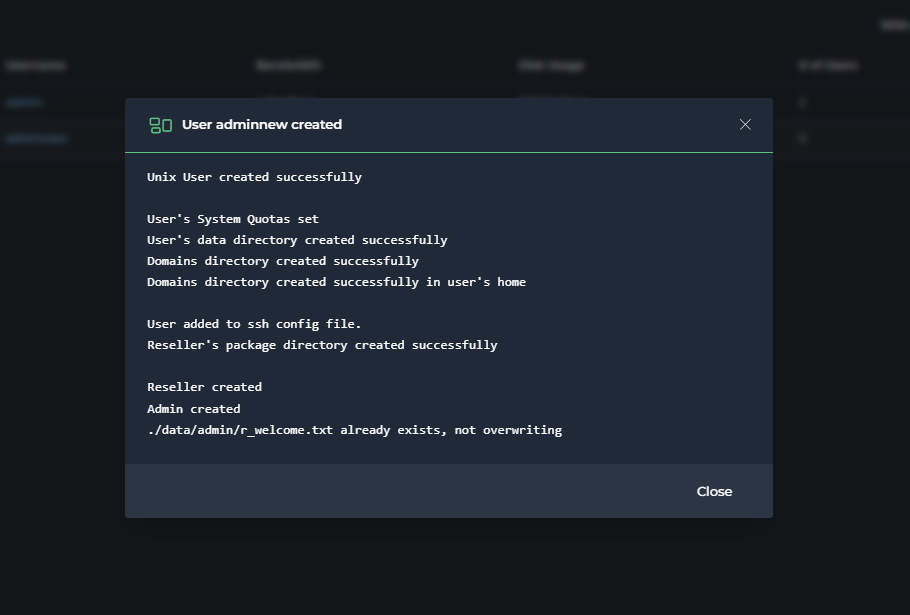
		- 
		
#### List Administrators 
- Quản lý danh sách các tài khoản quản trị. 
- 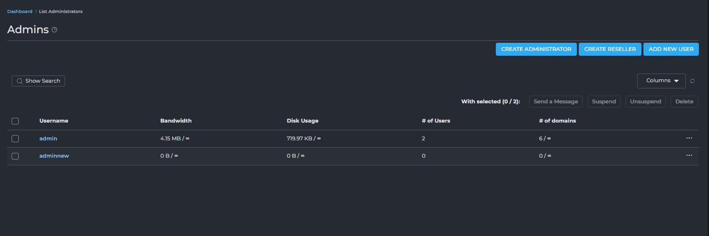	
- Các nút chức năng :
	- CREATE ADMINISTRATOR: Click chuyển tới giao diện tạo tài khoản quản trị viên mới.
	- CREATE RESELLER: Click chuyển tới giao diện tạo một tài khoản reseller mới.
	- ADD NEW USER: Click chuyển tới giao diện thêm một tài khoản người dùng cuối (customer) mới.
	- Send a Message: Gửi tin nhắn cho admin đã chọn.
		- 
		- 	
			- Cấu hình tiêu đề, nội dung tin nhắn, tuỳ chọn chỉ gửi email. 
	- Suspend: Tạm đình chỉ tài khoản admin đã chọn (ngừng hoạt động).
		- 	
		- 	
			- Cấu hình lý do, thông tin chi tiết.
	- Unsuspend: Khôi phục tài khoản admin đã đình chỉ.
		- 	
	- Delete: Xóa vĩnh viễn tài khoản admin đã chọn.
		- 	
		- 	
- Bảng danh sách Admin:
	- Bảng này hiển thị thông tin chi tiết về từng tài khoản quản trị hiện có:
	- Name (Tên): Tên đăng nhập hoặc tên hiển thị của tài khoản admin.
		- Click để mở giao diện thông tin chi tiết admin với 2 vai trò Reseller, User.
	- Bandwidth (Băng thông): Lượng băng thông đã sử dụng trên tổng số băng thông được cấp phát cho admin đó.
	- Disk Usage (Dung lượng đĩa): Lượng dung lượng lưu trữ đã sử dụng trên tổng số dung lượng được cấp phát cho admin đó.
	- `# of Users` (Số lượng Người dùng): Số lượng tài khoản người dùng cuối (khách hàng) mà admin đó đang quản lý trên tổng số lượng người dùng tối đa được phép.
	- `# of domains` (Số lượng tên miền): Số lượng tên miền (website) mà admin đó đang quản lý trên tổng số lượng tên miền tối đa được phép.
	- ... (biểu tượng ba chấm): Nút tùy chọn cho phép thực hiện các hành động cụ thể cho từng admin
		- Send a Message: Gửi tin nhắn riêng cho [username].
		- Suspend: Tạm đình chỉ tài khoản [username].
		- Login as [username]: Đăng nhập vào tài khoản của [username] 
		- Change [username]'s password: Thay đổi mật khẩu của tài khoản [username].
		- Remove: Xóa vĩnh viễn tài khoản [username].
		

		
#### Suspension Message
- Tùy chỉnh nội dung email thông báo sẽ được gửi tự động khi một tài khoản (User, Reseller hoặc Admin) bị đình chỉ.
- 
- Các tùy chọn cấu hình:
	- User Level (Cấp độ người dùng):
		- 
		- Bạn có thể chọn loại tài khoản nào mà tin nhắn này sẽ áp dụng. Các tùy chọn thường bao gồm:
			- User: Tin nhắn này sẽ được gửi khi một tài khoản người dùng cuối (customer) bị đình chỉ.
			- Reseller: Tin nhắn này sẽ được gửi khi một tài khoản reseller bị đình chỉ.
			- Admin: Tin nhắn này sẽ được gửi khi một tài khoản admin bị đình chỉ (ít phổ biến hơn).
			- Bạn cần phải cấu hình tin nhắn riêng cho từng cấp độ người dùng để phù hợp với đối tượng.
	- Subject (Tiêu đề): Đây là dòng tiêu đề của email thông báo.
		- `[USERNAME]`: Đây là một biến tự động thay thế bằng tên đăng nhập của tài khoản bị đình chỉ.
		- `[REASON]`: Đây là một biến tự động thay thế bằng lý do đình chỉ mà bạn nhập khi thực hiện đình chỉ tài khoản.
	- Message (Nội dung tin nhắn): Đây là phần nội dung chính của email thông báo.
		- Cũng sử dụng các biến `[USERNAME]` và `[REASON]` để cá nhân hóa nội dung.
		- `[MSG_FOOTER]`: Đây là một biến khác, thường được tự động thay thế bằng thông tin chân trang của email (ví dụ: tên công ty, thông tin liên hệ, logo), được cấu hình ở một nơi khác trong DirectAdmin.
	- Notify (Thông báo): Khi ô này được chọn, hệ thống sẽ tự động gửi email thông báo đình chỉ theo mẫu này đến tài khoản bị đình chỉ khi bạn thực hiện hành động "Suspend" (Đình chỉ). Nếu không chọn, tài khoản vẫn bị đình chỉ nhưng không nhận được email thông báo.
- Các nút chức năng:
	- RESET (góc trên bên phải): Nút này sẽ đặt lại tiêu đề và nội dung tin nhắn về giá trị mặc định của hệ thống.
	- SAVE (góc dưới bên phải): Nút này sẽ lưu các thay đổi của bạn đối với tin nhắn đình chỉ.


## Server Manager
- "Server Manager" (Quản lý Máy chủ) là một trong những khu vực quan trọng nhất trong bảng điều khiển DirectAdmin dành cho quản trị viên (Admin). Nó tập trung các công cụ và cài đặt cấp độ máy chủ, cho phép người dùng có quyền quản trị viên kiểm soát sâu sắc các khía cạnh hoạt động, hiệu suất và bảo mật của toàn bộ máy chủ hosting.
- Không giống như các phần quản lý người dùng, reseller hay gói hosting, Server Manager quản lý trực tiếp các dịch vụ cốt lõi chạy trên máy chủ (như web server, DNS server, PHP, v.v.), cấu hình mạng, và các thiết lập chung ảnh hưởng đến tất cả các tài khoản trên server. Đây là nơi bạn thực hiện các tác vụ như quản lý IP, cấu hình DNS, thiết lập chứng chỉ SSL cho server, hoặc điều chỉnh các thông số PHP.
- 
- Server Manager trong DirectAdmin là nơi quản trị viên quản lý các cài đặt và dịch vụ cốt lõi của toàn bộ máy chủ hosting. Các mục chính:
	- Administrator Settings: Cấu hình chung của DirectAdmin và giới hạn server.
	- Custom HTTPD Configurations: Tùy chỉnh máy chủ web (Apache/Nginx).
	- DNS Administration: Quản lý các bản ghi DNS cho tên miền.
	- IP Management: Thêm, xóa, quản lý địa chỉ IP của server.
	- Name Servers: Thiết lập các máy chủ tên miền chính (ns1, ns2...).
	- Multi Server Setup: Cấu hình cho nhiều máy chủ DirectAdmin hoạt động cùng nhau.
	- PHP Configuration: Quản lý phiên bản và cài đặt PHP.
	- Server TLS Certificate: Cài đặt chứng chỉ SSL cho bảng điều khiển và dịch vụ server.
	- CustomBuild: Công cụ để cài đặt, cập nhật, biên dịch lại các phần mềm quan trọng của máy chủ (Apache, PHP, MySQL...).

### Administrator Settings
- Administrator Settings là nơi quản trị viên cấp cao nhất cấu hình các thiết lập chung cho toàn bộ hệ thống, ảnh hưởng đến hoạt động của server, tài khoản người dùng, đại lý, cũng như các dịch vụ cốt lõi. Đây là một phần quan trọng để tối ưu hóa hiệu suất, bảo mật và quản lý tự động DirectAdmin.
- 
- Khi bạn truy cập vào mục "Cài đặt Quản trị viên", bạn sẽ được điều hướng đến một giao diện với các tab riêng biệt, mỗi tab phụ trách một nhóm cài đặt cụ thể:
	- Chung (General)
	- Máy chủ (Server)
	- Bảo mật (Security)
	- Email (E-Mail)
	- Dịch vụ Cơ sở dữ liệu (Database Service)
#### Tab "General" (Cài đặt Chung)
- 
- Đây là nơi bạn có thể cấu hình các tùy chọn tổng quát ảnh hưởng đến hoạt động chung của DirectAdmin và các chính sách quản lý tài khoản.
- Notify downtime (Thông báo ngừng hoạt động):
	- Khi được bật, hệ thống sẽ gửi thông báo đến tất cả các quản trị viên thông qua hệ thống tin nhắn/ticket mỗi khi một dịch vụ trên máy chủ bị ngừng hoạt động (ví dụ: Apache, MySQL, Mail server). Điều này giúp quản trị viên nắm bắt sự cố kịp thời để xử lý.
- Overselling (Bán quá mức):
	- Khi được bật, tùy chọn này cho phép các đại lý (reseller) bán các gói tài nguyên (ví dụ: dung lượng đĩa, băng thông) vượt quá tổng số tài nguyên mà họ được cấp. Ví dụ, một đại lý được cấp 100GB dung lượng nhưng có thể tạo ra các gói dịch vụ với tổng dung lượng lên tới 150GB, với giả định rằng không phải tất cả người dùng sẽ sử dụng hết tài nguyên được cấp cùng một lúc.
	- Lưu ý quan trọng: Việc Overselling cần được cân nhắc kỹ lưỡng vì nếu tất cả người dùng sử dụng hết tài nguyên, server có thể quá tải.
- Auto-suspend resellers (Tự động đình chỉ đại lý):
	- Khi được bật, DirectAdmin sẽ tự động đình chỉ tài khoản của một đại lý và tất cả các tài khoản người dùng dưới quyền của đại lý đó nếu đại lý vượt quá giới hạn băng thông được cấp. Đây là một cơ chế kiểm soát tài nguyên tự động.
- User Backup (Sao lưu Người dùng):
	- Khi được bật, tùy chọn này cho phép đại lý tự sao lưu hoặc khôi phục dữ liệu của người dùng của họ. Tùy chọn này hoạt động độc lập với tính năng sao lưu/khôi phục của người dùng thông thường. Điều này hữu ích cho các đại lý muốn chủ động quản lý dữ liệu của khách hàng.
- Auto-update DirectAdmin (Tự động cập nhật DirectAdmin):
	- Khi được bật, DirectAdmin sẽ tự động cập nhật lên phiên bản mới nhất khi có bản phát hành. Điều này giúp hệ thống luôn được vá lỗi bảo mật và có các tính năng mới nhất mà không cần can thiệp thủ công.
- Auto-patch DirectAdmin (Tự động vá lỗi DirectAdmin):
	- Khi được bật, hệ thống sẽ tự động cài đặt các bản vá lỗi khẩn cấp (hot-fix releases) của DirectAdmin ngay khi chúng được phát hành. Điều này đặc biệt quan trọng để duy trì bảo mật và ổn định cho máy chủ.
- Backup Threshold (Ngưỡng Sao lưu):
	- Phần này cho phép bạn kiểm soát khi nào người dùng được phép tạo bản sao lưu tài khoản của họ, nhằm tránh tình trạng sao lưu làm quá tải hệ thống hoặc chiếm dụng quá nhiều tài nguyên đĩa.
	- Bạn có thể chọn một trong các tùy chọn sau:
		- Use Default: Sử dụng cài đặt mặc định của hệ thống.
		- Always Off: Vô hiệu hóa hoàn toàn chức năng tạo bản sao lưu cho người dùng.
		- Always On: Luôn cho phép người dùng tạo bản sao lưu.
		- Based on disk usage (Dựa trên mức sử dụng đĩa):
			- Cho phép người dùng tạo bản sao lưu chỉ khi mức sử dụng dung lượng đĩa của họ thấp hơn một ngưỡng tùy chỉnh. 
			- Bạn sẽ nhập một giá trị phần trăm (%) vào ô bên dưới.
			- Ví dụ, nếu đặt là 90%, người dùng chỉ có thể sao lưu khi mức sử dụng đĩa của họ dưới 90% tổng dung lượng được cấp. 
			-> Điều này giúp ngăn chặn việc tạo bản sao lưu khi dung lượng đĩa gần đầy, gây ra lỗi hoặc làm chậm server.
	
#### Tab `Server` (Cài đặt Máy chủ)
- 
- Tab "Server" trong Administrator Settings cho phép quản trị viên cấu hình các thông tin cơ bản và quan trọng nhất của máy chủ, bao gồm tên máy chủ, máy chủ tên miền (Name Server) và các thiết lập về thời gian chờ (timeout) cho các yêu cầu.
- Hostname (Tên máy chủ)
	- 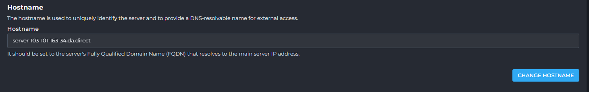
	- Hostname được sử dụng để nhận dạng duy nhất máy chủ và cung cấp một tên có thể phân giải DNS để truy cập từ bên ngoài.
	- Lưu ý: Hostname nên được đặt thành Tên miền đầy đủ đủ điều kiện (Fully Qualified Domain Name - FQDN) của máy chủ, và FQDN này phải phân giải được tới địa chỉ IP chính của máy chủ.
	- Bạn có thể thay đổi hostname của máy chủ tại đây bằng cách nhấp vào nút "CHANGE HOSTNAME".
- 
- Name Server 1 và Name Server 2 (Máy chủ tên miền chính và phụ)
	- Name Server 1 (Máy chủ tên miền chính): Đây là máy chủ định danh chính (tên miền). Nó chỉ được sử dụng khi tạo tài khoản quản trị viên ban đầu hoặc khôi phục tài khoản quản trị viên/đại lý mà chưa có máy chủ định danh được cấu hình.
	- Name Server 2 (Máy chủ tên miền phụ): Đây là máy chủ định danh phụ (tên miền). Nó cũng chỉ được sử dụng khi tạo tài khoản quản trị viên ban đầu hoặc khôi phục tài khoản quản trị viên/đại lý mà chưa có máy chủ định danh được cấu hình.
- Session (Phiên làm việc)
	- Single Request Timeout (Thời gian chờ tối đa cho một yêu cầu):
		- Giá trị mặc định ví dụ: 60 giây.
		- Đây là lượng thời gian tối đa cho phép một yêu cầu duy nhất tới dịch vụ DirectAdmin được chạy. Nếu yêu cầu không hoàn thành trong khoảng thời gian này, nó sẽ bị chấm dứt.
	- Session Timeout (Thời gian chờ phiên làm việc):
		- Giá trị mặc định ví dụ: 10 phút.
		- Đây là khoảng thời gian người dùng sẽ duy trì trạng thái đăng nhập nếu không có yêu cầu nào được gửi đến máy chủ. Sau khoảng thời gian này, người dùng sẽ tự động bị đăng xuất.
- Number of Web Server Logs (Số lượng tệp nhật ký máy chủ web): Đây là số lượng tệp nhật ký (log) đã được xoay vòng sẽ được giữ lại trong thư mục chính của người dùng.
- Partition Usage Threshold (Ngưỡng sử dụng phân vùng): Nếu mức sử dụng của phân vùng dữ liệu vượt quá giá trị ngưỡng này, một email sẽ được gửi đến tất cả các tài khoản quản trị viên. Email thông báo chỉ được gửi một lần mỗi ngày nếu mức sử dụng không giảm hoặc cài đặt không thay đổi.
- Max Request/Upload Size (Kích thước yêu cầu/tải lên tối đa): Kích thước yêu cầu POST tối đa. Không áp dụng cho các điểm cuối API mới.
- Check usage interval (Khoảng thời gian kiểm tra sử dụng)
	- Đơn vị: Ngày.
	- Mức sử dụng phân vùng sẽ được kiểm tra với khoảng thời gian đã chỉ định.
- Max Username Length (Độ dài tên người dùng tối đa): Độ dài tên người dùng tối đa cho phép không được lớn hơn 30 ký tự.
- Time Zone (Múi giờ)
	- Múi giờ của máy chủ là một cài đặt toàn cầu (toàn server) cho tất cả các ứng dụng. Nó mô tả các quy tắc về cách biểu diễn các giá trị thời gian cho người dùng. Cấu hình phổ biến nhất cho các máy chủ là không thực hiện chuyển đổi thời gian và luôn sử dụng UTC (Giờ phối hợp quốc tế) để biểu diễn thời gian.
	- Giá trị hiện tại ví dụ: Asia/Ho Chi Minh.
	- Bạn có thể thay đổi múi giờ của máy chủ bằng cách nhấp vào nút "CHANGE TIMEZONE".
- Sau khi thực hiện bất kỳ thay đổi nào trong tab "Server", click chọn nút 
	- "SAVE SETTINGS" (Lưu Cài đặt) ở cuối trang để áp dụng các thay đổi

#### Tab "Security" (Cài đặt Bảo mật)
- 
- Phần này cho phép quản trị viên cấu hình các tính năng bảo mật chủ chốt, bao gồm giám sát tấn công vét cạn (Brute Force Monitor), quản lý mật khẩu và các tùy chọn bảo mật liên quan đến tên miền.
- 
- Lost password recovery (Khôi phục mật khẩu đã mất): Khi tùy chọn này được bật, người dùng có thể sử dụng chức năng "Quên mật khẩu" để khôi phục quyền truy cập vào tài khoản của họ thông qua email hoặc các phương thức khác. Điều này giúp giảm tải cho quản trị viên nhưng cũng cần cân nhắc về bảo mật nếu email của người dùng bị lộ.
- Difficult password enforcement (Buộc sử dụng mật khẩu mạnh): Khi được bật, hệ thống sẽ yêu cầu người dùng và đại lý đặt mật khẩu có độ khó cao hơn (ví dụ: yêu cầu sử dụng cả chữ cái viết hoa, chữ thường, số và ký tự đặc biệt, cùng với độ dài tối thiểu). Điều này tăng cường bảo mật cho các tài khoản người dùng và giảm thiểu rủi ro bị đoán mật khẩu.
- Check domain owner for subdomain creation (Kiểm tra chủ sở hữu tên miền khi tạo tên miền phụ): Khi tùy chọn này được bật, DirectAdmin sẽ kiểm tra xem người dùng có sở hữu tên miền chính trước khi cho phép họ tạo tên miền phụ (subdomain) cho tên miền đó. Điều này ngăn chặn việc tạo tên miền phụ trái phép cho các tên miền không thuộc sở hữu của người dùng.
- Brute Force Monitor (Giám sát tấn công vét cạn) 
	- 
	- Giám sát tấn công vét cạn ngăn chặn các nỗ lực đoán mật khẩu người dùng bằng cách thử các kết hợp mật khẩu khác nhau. Nó bảo vệ quyền truy cập vào giao diện web DirectAdmin bằng cách chặn địa chỉ IP của máy khách sau nhiều lần đăng nhập không thành công.
	- Enable Brute Force Monitor (Kích hoạt Giám sát tấn công vét cạn): Đánh dấu vào ô này để bật tính năng bảo mật quan trọng này.
		- Login attempts threshold (Ngưỡng số lần thử đăng nhập):
		- Đây là số lần thử đăng nhập không thành công tối đa trước khi một địa chỉ IP bị đưa vào danh sách đen (blacklist). Ví dụ: "Blacklists after 20 failed login attempts".
		- Giá trị khuyến nghị cho các cuộc tấn công đăng nhập xâm nhập là khoảng 10-20.
		- Cài đặt này áp dụng cho các lần thử đăng nhập không thành công, ví dụ như sai tên người dùng hoặc mật khẩu.
	- Unauthorized request threshold (Ngưỡng yêu cầu trái phép):
		- Mặc định: 100.
		- Cài đặt này dành cho các yêu cầu trái phép đến trang đăng nhập DirectAdmin. Nói cách khác, nếu trang đăng nhập nhận quá nhiều yêu cầu, IP đó sẽ bị đưa vào danh sách đen.
		- Exempt local block (Miễn trừ chặn cục bộ): Khi được bật, các yêu cầu từ cùng một máy chủ (local host) sẽ không bị chặn bởi Brute Force Monitor. Điều này hữu ích cho các tác vụ nội bộ của máy chủ.
	- Failed login reset timeout (Thời gian chờ đặt lại số lần đăng nhập thất bại):
		- Mặc định: 3600 giây.
		- Sau lần đăng nhập không thành công cuối cùng, nếu khoảng thời gian này trôi qua, số lần đăng nhập không thành công sẽ được đặt lại về 0.
	- Blacklist removal timeout (Thời gian chờ gỡ bỏ khỏi danh sách đen):
		- Mặc định: 86400 phút.
		- Địa chỉ IP sẽ được gỡ khỏi danh sách đen sau khoảng thời gian đã chỉ định.
- Brute force log scanner (Máy quét nhật ký tấn công vét cạn) 
	- 
	- Máy quét nhật ký tấn công vét cạn kiểm tra nhật ký truy cập của các dịch vụ khác nhau để tìm các lần xác thực thất bại lặp đi lặp lại.
	- Enable brute force log scanner (Kích hoạt máy quét nhật ký tấn công vét cạn): Đánh dấu vào ô này để bật tính năng này.
		- IP login threshold (Ngưỡng đăng nhập IP):
		- Mặc định: 100.
		- Thông báo sẽ được gửi đến quản trị viên sau khi có 100 lần đăng nhập thất bại từ bất kỳ IP nào trên bất kỳ tài khoản nào.
	- User login threshold (Ngưỡng đăng nhập người dùng):
		- Mặc định: 100.
		- Thông báo sẽ được gửi đến quản trị viên sau khi một người dùng có 100 lần đăng nhập thất bại từ bất kỳ IP nào.
	- Blacklist removal timeout (Thời gian chờ gỡ bỏ khỏi danh sách đen): Gỡ bỏ khỏi danh sách đen sau khoảng thời gian đã chỉ định.
	- Reset timeout (Thời gian chờ đặt lại): Đặt lại số lần thử đã theo dõi sau khoảng thời gian đã chỉ định.
	- Clear log timeout (Thời gian chờ xóa nhật ký): Xóa các lần đăng nhập thất bại khỏi nhật ký sau khoảng thời gian đã chỉ định.
	- Scan for WordPress attacks (Quét tìm các cuộc tấn công WordPress): Khi được bật, Brute Force Monitor có thể quét nhật ký tên miền Apache để tìm các cuộc tấn công vào tệp `wp-login.php` của WordPress.
		- All logs: Tùy chọn này cho phép Brute Force Monitor quét tất cả các tên miền để tìm các cuộc tấn công wp-login.php.
		- Manual: Với tùy chọn này, Brute Force Monitor chỉ quét các tên miền được thêm thủ công vào tệp brute.conf để tìm các cuộc tấn công wp-login.php.
		- No: Tùy chọn này có nghĩa là Brute Force Monitor sẽ không quét các cuộc tấn công wp-login.php.
- Sau khi thực hiện bất kỳ thay đổi nào trong tab "Security", click vào nút "SAVE SETTINGS"(Lưu Cài đặt) ở cuối trang để áp dụng các thay đổi.

####  Tab "E-Mail" (Cài đặt Email)
- 
- Phần này cho phép quản trị viên thiết lập các chính sách liên quan đến việc gửi và nhận email, giúp kiểm soát việc sử dụng tài nguyên và chống spam.
- Email Settings (Cài đặt Email)
	- 
	- Allow user to set limits for its own e-mail accounts (Cho phép người dùng tự đặt giới hạn cho tài khoản email của họ):
		- Khi được bật, tùy chọn này cho phép người dùng tự cấu hình giới hạn gửi email hàng ngày cho các tài khoản email riêng của họ.
		- Lưu ý:Người dùng sẽ không được phép vượt quá giới hạn email tổng thể trên toàn cầu của tài khoản chính của họ.
	- Daily email limit per mailbox (Giới hạn email hàng ngày cho mỗi hộp thư):
		- Mặc định: 200 email.
		- Đây là số lượng email tối đa mà một người dùng có thể cấu hình cho một hộp thư cụ thể.
		- Các tài khoản người dùng cá nhân có thể có các giới hạn hộp thư khác nhau được cấu hình trong cài đặt người dùng hoặc gói dịch vụ của họ.
		- Lưu ý:Giới hạn này không được phép vượt quá giới hạn email tổng thể của người dùng hoặc giới hạn gói dịch vụ của họ.
		- Bạn có thể chọn "Use Default"để sử dụng giá trị mặc định của hệ thống hoặc đặt "Unlimited"(Không giới hạn) cho hộp thư.
	- Purge Old Spam and Trash Emails (Xóa email Spam và Thùng rác cũ):
		- Mặc định: 0 ngày.
		- Cài đặt này xác định số ngày mà các email trong thư mục Spam hoặc Trash (Thùng rác) sẽ được giữ lại trước khi bị xóa vĩnh viễn.
		- Nếu được bật, hệ thống sẽ kiểm tra hàng ngày và xóa các email trong thư mục Spam hoặc Trash cũ hơn số ngày đã cho.
		- Bạn có thể chọn "Use Default" hoặc đánh dấu "Disabled" để tắt tính năng này.
	- Daily E-mail limit per DirectAdmin User (Giới hạn email hàng ngày cho mỗi Người dùng DirectAdmin):
		- Mặc định: 1000 email.
		- Đây là giới hạn số lượng email mà một người dùng DirectAdmin có thể gửi mỗi ngày.
		- Lưu ý:Đây chỉ là cài đặt toàn cục và có thể bị ghi đè bởi giới hạn cụ thể của từng người dùng.
		- Bạn có thể đặt giá trị 0 cho không giới hạn (Unlimited).
	- RBL Blocking in Exim (Chặn RBL trong Exim):
		- RBL (Realtime Blackhole List) là một phương pháp xác định các máy chủ có liên quan đến việc gửi thư rác.
		- Cài đặt này dùng để bật tính năng chặn RBL trong Exim (Mail Transfer Agent của DirectAdmin).
		- Lưu ý :Việc bật RBL có thể quá nghiêm ngặt đối với RBL gốc trong SpamAssassin và không nên bật tùy chọn này.
- Blocked Users (Người dùng bị chặn)
	- 
	- Phần này là danh sách các tài khoản người dùng không được phép gửi email đi.
	- Khối chặn email có thể được áp dụng cho toàn bộ email gửi qua SMTP (đối với tất cả các hộp thư thuộc tài khoản người dùng đó), hoặc email được gửi từ các script PHP, hoặc cả hai.
	- Bạn có thể nhập tên người dùng và chọn loại chặn mong muốn, sau đó nhấp vào nút "Block"để thêm vào danh sách.
	- Các tùy chọn loại chặn (Block Type) bao gồm:
		- SMTP Access & CLI/Scripts: Chặn cả email gửi qua SMTP và email gửi từ các script PHP/CLI (Command Line Interface).
		- CLI/Scripts: Chỉ chặn email được gửi thông qua các script CLI/PHP.
		- SMTP Access: Chỉ chặn email gửi qua SMTP, chặn tất cả các hộp thư thuộc người dùng đó.
- Blocked Mailboxes (Hộp thư bị chặn)
	- 
	- Đây là danh sách các hộp thư cụ thể không được phép gửi email đi.
	- Điều này cho phép kiểm soát chi tiết hơn, chỉ chặn một hộp thư bị xâm nhập thay vì toàn bộ tài khoản người dùng.
	- Bạn có thể nhập địa chỉ email của hộp thư và nhấp vào nút "Block"để thêm vào danh sách.

#### Tab "Database Service" (Cài đặt Dịch vụ Cơ sở dữ liệu)
- 
- Phần này cho phép quản trị viên quản lý và cấu hình các khía cạnh khác nhau của dịch vụ cơ sở dữ liệu, bao gồm khả năng sẵn sàng của tính năng, cài đặt kết nối và các tùy chọn bổ sung khác.
- General feature availability
	- 
	- Phần này cho phép quản trị viên bật hoặc tắt hoàn toàn tất cả các tính năng quản lý dịch vụ cơ sở dữ liệu trong DirectAdmin.
	- Điều này có thể hữu ích trong các môi trường cụ thể nơi dịch vụ cơ sở dữ liệu không cần thiết hoặc được quản lý bởi một hệ thống khác.
	- Bạn có thể đánh dấu vào ô "Database management features are entirely enabled"để bật hoặc bỏ chọn để vô hiệu hóa tất cả các tính năng quản lý cơ sở dữ liệu.
- Connection configuration (Cấu hình kết nối)
	- 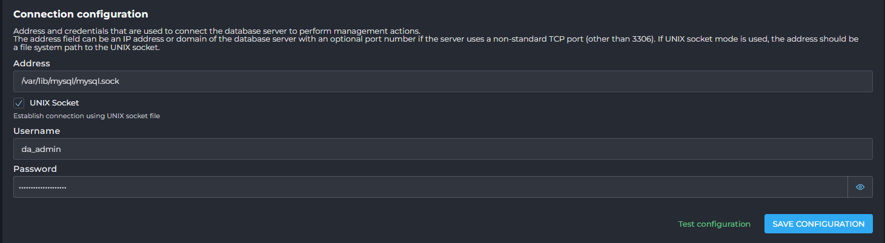
	- Phần này thiết lập địa chỉ và thông tin đăng nhập được sử dụng để DirectAdmin kết nối với máy chủ cơ sở dữ liệu để thực hiện các hành động quản lý.
	- Address (Địa chỉ):
		- Trường địa chỉ có thể là địa chỉ IP hoặc tên miền của máy chủ cơ sở dữ liệu, cùng với số cổng tùy chọn nếu máy chủ sử dụng cổng TCP không tiêu chuẩn (khác 3306).
		- Nếu chế độ UNIX socket được sử dụng, địa chỉ phải là đường dẫn hệ thống tệp đến socket UNIX.
		- Giá trị ví dụ:`/var/lib/mysql/mysql.sock`.
	- UNIX Socket : Khi tùy chọn này được đánh dấu, kết nối sẽ được thiết lập bằng cách sử dụng socket.
	- Username (Tên người dùng): Tên người dùng được sử dụng để kết nối với máy chủ cơ sở dữ liệu.
	- Password (Mật khẩu): Mật khẩu cho tên người dùng cơ sở dữ liệu.
	- Test configuration (Kiểm tra cấu hình): Nút này cho phép bạn kiểm tra xem DirectAdmin có thể kết nối thành công với máy chủ cơ sở dữ liệu bằng các cài đặt đã cung cấp hay không.
	- Sau khi thay đổi cài đặt kết nối, nhấp vào "SAVE CONFIGURATION".
- Additional settings (Cài đặt bổ sung)
	- 
	- Phần này chứa các cài đặt khác liên quan đến quản lý cơ sở dữ liệu.
	- Default access hosts (Máy chủ truy cập mặc định):
	- Đây là danh sách các máy chủ truy cập (địa chỉ mà các ứng dụng khách cơ sở dữ liệu được phép kết nối từ đó) cho các tài khoản người dùng cơ sở dữ liệu mới.
	- Access Hosts Limit (Giới hạn máy chủ truy cập): Số lượng máy chủ truy cập tối đa mà mỗi tài khoản người dùng cơ sở dữ liệu có thể có.
	- Extra database export arguments (Tham số bổ sung khi xuất cơ sở dữ liệu): Các tham số bổ sung được truyền cho công cụ `mysqldump` hoặc `mariadbdump` khi xuất dữ liệu cơ sở dữ liệu.
	- Database export timeout (Thời gian chờ xuất cơ sở dữ liệu): Thời gian tối đa (tính bằng giây) cho một thao tác xuất cơ sở dữ liệu đơn lẻ hoàn thành trước khi bị buộc chấm dứt. Đặt giá trị này thành 0 sẽ tắt giới hạn thời gian.

### Custom HTTPD Configurations
- 
- 
- Mục này cung cấp một giao diện để bạn xem và chỉnh sửa các tệp cấu hình của máy chủ web HTTPD cho từng tên miền hoặc người dùng trên hệ thống. 
- Mục "Custom HTTPD Configurations" là công cụ mạnh mẽ dành cho quản trị viên muốn tùy chỉnh sâu hơn môi trường web cho từng tên miền cụ thể, đáp ứng các yêu cầu đặc biệt của ứng dụng hoặc tối ưu hóa hiệu suất.
- Việc tùy chỉnh này cho phép bạn áp dụng các cài đặt nâng cao hoặc đặc thù mà không làm ảnh hưởng đến cấu hình mặc định của toàn bộ máy chủ.
- Khi truy cập vào "Custom HTTPD Configurations", bạn sẽ thấy một bảng hiển thị danh sách các tên miền và các tệp cấu hình liên quan của chúng:
- Show Domains that... (Hiển thị tên miền theo...):  Phần này cung cấp các tùy chọn để lọc danh sách tên miền. Bạn có thể tìm kiếm theo tên miền bắt đầu bằng một ký tự hoặc chuỗi nhất định ("Starts With") hoặc chứa một chuỗi cụ thể.
- Danh sách gồm các cột: 
	- Domain (Tên miền): Cột này hiển thị tên miền của trang web.
	- User (Người dùng): Cột này hiển thị tên người dùng DirectAdmin sở hữu tên miền đó.
	- Conf. Files (Tệp cấu hình): Cột này liệt kê các tệp cấu hình chính liên quan đến HTTPD cho tên miền đó. Các tệp phổ biến bao gồm:
		- `httpd.conf`  : Đây là tệp cấu hình chính của máy chủ web (Apache hoặc Nginx). Bạn có thể chỉnh sửa tệp này để thêm các chỉ thị tùy chỉnh cho tên miền, ví dụ như rewrite rules, caching headers, hoặc các thiết lập bảo mật riêng.
		- `php-fpm.conf` (ví dụ: `php-fpm.conf 8.3` hoặc `php-fpm.conf 5.6`): Tệp này chứa cấu hình cho PHP-FPM (FastCGI Process Manager) được sử dụng để xử lý các tập lệnh PHP. Việc chỉnh sửa tệp này cho phép bạn thay đổi các cài đặt PHP cấp độ tên miền, như `memory_limit`, `upload_max_filesize`, hoặc các module PHP được tải.
- Các chức năng chính:  
	- Chỉnh sửa cấu hình: Bằng cách nhấp vào tên của tệp cấu hình trong cột "Conf. Files", bạn có thể mở một trình soạn thảo văn bản để chỉnh sửa nội dung của tệp đó.
	- DA BUILD REWRITE_CONFS: Sử dụn để xây dựng lại các tệp cấu hình HTTPD. Sau khi bạn thực hiện các thay đổi thủ công và lưu lại, việc chạy lệnh này sẽ đảm bảo rằng các thay đổi của bạn được áp dụng và cấu hình của máy chủ web được cập nhật. Đây là bước cần thiết để kích hoạt các thay đổi bạn đã thực hiện.

#### Giao diện "HTTPD Configuration" (Cấu hình HTTPD)
- Các thành phần của giao diện:
- Các nút chức năng:
	- View All Available Tokens:  Hiển thị danh sách tất cả các "token" hoặc biến mà bạn có thể sử dụng trong các tệp cấu hình.
		- 
		- 
		- Cung cấp một danh sách chi tiết các biến (token) và giá trị tương ứng của chúng, được sử dụng trong quá trình cấu hình tên miền hoặc máy chủ. 
		- Việc hiểu các token này giúp quản trị viên nắm rõ hơn về các thông số được áp dụng và cách chúng ảnh hưởng đến cấu hình.
			- Thanh tìm kiếm và tùy chọn lọc:
				- "Filter Tokens": Một ô nhập liệu cho phép bạn lọc nhanh danh sách các token bằng cách gõ từ khóa. Khi bạn nhập, danh sách bên dưới sẽ tự động hiển thị các token có chứa từ khóa đó trong tên hoặc giá trị của chúng.
				- "Hide Empty": Một hộp kiểm (checkbox) mà khi được chọn, sẽ ẩn đi các token không có giá trị (trống). Điều này giúp tập trung vào các token đang có giá trị được định nghĩa.
		- Bảng hiển thị Token và Giá trị: Giao diện hiển thị một bảng gồm hai cột chính:
			- "Token": Cột này liệt kê tên của các biến cấu hình. Mỗi tên token đại diện cho một thuộc tính hoặc cài đặt cụ thể.
			- "Value": Cột này hiển thị giá trị hiện tại được gán cho từng token tương ứng.
	- Customize: Nút này dùng để chuyển đổi chế độ cấu hình. 
		- 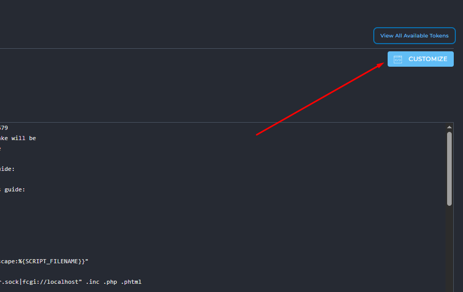
		- 
		- Giao diện này cho phép bạn tùy chỉnh cấu hình httpd.conf cho tên miền bằng cách thêm các đoạn mã tùy chỉnh vào các vị trí được định sẵn trong tệp cấu hình.
		- Các thành phần chính của giao diện bao gồm:
			- View All Available Tokens: Nút này tương tự như ở giao diện trước, cho phép bạn xem lại tất cả các token có sẵn để sử dụng trong các tùy chỉnh của mình.
			- VIEW: Nút này có thể dùng để xem trước kết quả cấu hình sau khi áp dụng các tùy chỉnh, trước khi lưu.
		- "httpd.conf customization for domain":
			- Đây là một vùng văn bản, nơi bạn có thể nhập các đoạn mã cấu hình Apache tùy chỉnh mà bạn muốn thêm vào tệp httpd.conf cho tên miền .
			- Các đoạn mã này sẽ được chèn vào một vị trí cụ thể trong tệp cấu hình chính, thường là ở một vị trí chung hoặc mặc định.
		- "Additional CUSTOM tokens":
			- Phần này cung cấp các vùng nhập liệu cho các "token" tùy chỉnh bổ sung (CUSTOM1, CUSTOM2, CUSTOM3, CUSTOM4), cho phép bạn chèn mã vào các vị trí rất cụ thể trong tệp cấu hình.
			- Mỗi "token" tùy chỉnh này có một mô tả rõ ràng về vị trí mà đoạn mã bạn nhập vào sẽ xuất hiện trong tệp cấu hình:
			- CUSTOM1: "Appears at the very top of the template, before setting the variables." (Xuất hiện ở đầu tiên của template, trước khi thiết lập các biến).
			- CUSTOM2: "Appears just before the <Directory> section." (Xuất hiện ngay trước phần <Directory>).
			- CUSTOM3: "Appears just before the webapps include." (Xuất hiện ngay trước phần bao gồm các webapps).
			- CUSTOM4: "The very last entry." (Mục cuối cùng).
		- Bạn có thể sử dụng các vùng văn bản này để thêm các chỉ thị Apache tùy chỉnh, các quy tắc Rewrite, hoặc bất kỳ cấu hình nào bạn cần chèn vào các vị trí cụ thể trong httpd.conf.
- Contents of the httpd.conf file for<domain>: Đây là một vùng văn bản hiển thị toàn bộ nội dung của tệp httpd.conf dành riêng cho miền.
	- 
- Templates: 
	- 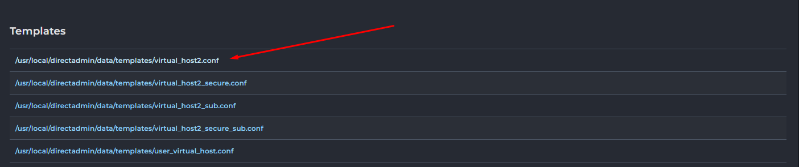
	- 
	- Phần này hiển thị danh sách các tệp mẫu cấu hình (templates).
	- Việc click vào các tệp mẫu này có thể sẽ hiển thị nội dung của chúng, giúp quản trị viên có thể xem hoặc sử dụng chúng để tạo cấu hình mới

#### Giao diện "PHP-FPM Configuration" (Cấu hình PHP-FPM)
- Giao diện này cho phép bạn tùy chỉnh cấu hình của PHP-FPM (FastCGI Process Manager) cho người dùng.
- Giao diện này cung cấp một công cụ mạnh mẽ để tùy chỉnh cấu hình PHP-FPM cho người dùng và từng phiên bản PHP cụ thể, cho phép quản trị viên điều chỉnh hiệu suất và hành vi của PHP trên máy chủ.  
- Các thành phần chính của giao diện bao gồm:
	- "Available Tokens": Một nút ở góc trên bên phải, khi click vào có thể hiển thị danh sách các token (biến) có sẵn để sử dụng trong các tùy chỉnh cấu hình PHP-FPM.
		- 
		- 
		- Cung cấp một danh sách chi tiết các biến (token) và giá trị tương ứng của chúng, được sử dụng trong quá trình cấu hình tên miền hoặc máy chủ. 
		- Việc hiểu các token này giúp quản trị viên nắm rõ hơn về các thông số được áp dụng và cách chúng ảnh hưởng đến cấu hình.
		- Thanh tìm kiếm và tùy chọn lọc:
			- "Filter Tokens": Một ô nhập liệu cho phép bạn lọc nhanh danh sách các token bằng cách gõ từ khóa. Khi bạn nhập, danh sách bên dưới sẽ tự động hiển thị các token có chứa từ khóa đó trong tên hoặc giá trị của chúng.
			- "Hide Empty": Một hộp kiểm (checkbox) mà khi được chọn, sẽ ẩn đi các token không có giá trị (trống). Điều này giúp tập trung vào các token đang có giá trị được định nghĩa.
		- Bảng hiển thị Token và Giá trị: Giao diện hiển thị một bảng gồm hai cột chính:
			- "Token": Cột này liệt kê tên của các biến cấu hình. Mỗi tên token đại diện cho một thuộc tính hoặc cài đặt cụ thể.
			- "Value": Cột này hiển thị giá trị hiện tại được gán cho từng token tương ứng.
	- "PHP-FPM config customization for user php-fpm":
		- Đây là phần chính để thêm mã tùy chỉnh vào cấu hình PHP-FPM.
		- Nó cung cấp các tab hoặc vùng nhập liệu cho các tùy chỉnh, được chia thành hai loại chính:
			- php-fpm Global [CUSTOM1] và php-fpm Global [CUSTOM2]: Các tùy chỉnh này áp dụng cho tất cả các phiên bản PHP và được thêm vào trước các token tùy chỉnh riêng cho từng phiên bản PHP.
			- php-fpm 8.3 [CUSTOM1] và php-fpm 8.3 [CUSTOM2]: Các tùy chỉnh này dành riêng cho phiên bản PHP-FPM 8.3.
		- Bạn có thể nhập các chỉ thị cấu hình PHP-FPM vào các vùng văn bản này.
		- "Global custom tokens apply to all php version, but only for this User. Global is added before per-php tokens.": Dòng mô tả này làm rõ rằng các tùy chỉnh "Global custom tokens" sẽ được áp dụng cho tất cả các phiên bản PHP được sử dụng bởi người dùng hiện tại, và chúng sẽ được chèn vào trước các tùy chỉnh dành riêng cho từng phiên bản PHP.
		- "Save for all PHP versions": Một hộp kiểm (checkbox) mà khi được chọn, có thể sẽ áp dụng các tùy chỉnh đã nhập cho tất cả các phiên bản PHP mà người dùng đang sử dụng (không chỉ PHP 8.3).
		- "SAVE": Nút này dùng để lưu các thay đổi cấu hình PHP-FPM của bạn.
	- "/usr/local/directadmin/data/templates/php-fpm.conf":
		- Đây là một vùng hiển thị nội dung của tệp mẫu cấu hình `php-fpm.conf`.
		- Tương tự như các tệp mẫu HTTPD, nó sử dụng các placeholder (ví dụ: `|PHP_VER-54|`, `|OPEN_BASEDIR_PATH|`, `|PHP1_RELEASE|`, `|PHP_VER|`, `|ACTIVE_USR_LOCAL_PHP_LIB|`, `|EMAIL|`, `|USER|`, `|DOMAIN|`, `|MAX_CHILDREN|`, `|MAX_REQUESTS|`, `|CUSTOM1|`) sẽ được thay thế bằng các giá trị thực khi cấu hình được tạo.
		- Ví dụ các dòng trong template:
		```
		`listen = /usr/local/php83/sockets/$pool.sock`: Cấu hình đường dẫn socket để lắng nghe kết nối.  
		`user = $pool`, `group = $pool`: Chỉ định user và group mà các tiến trình PHP-FPM sẽ chạy.  
		`pm = ondemand`: Chế độ quản lý tiến trình (process manager) là "ondemand" (theo yêu cầu).  
		`pm.max_children = 10`, `pm.process_idle_timeout = 20`, `pm.max_requests = 500`: Các cài đặt chi tiết cho quản lý tiến trình, như số lượng tiến trình con tối đa, thời gian chờ rảnh rỗi của tiến trình, và số lượng yêu cầu tối đa mà một tiến trình con sẽ xử lý trước khi khởi động lại.  
		`|CUSTOM1|`: Placeholder cho tùy chỉnh số 1.
		```
	- "/data/users/user/php/php-fpm83.conf":  
		- Đây là phần hiển thị nội dung của tệp cấu hình PHP-FPM thực tế cho người dùng và phiên bản PHP 8.3 sau khi đã được tạo ra từ template và áp dụng các giá trị.  
		- Nó cho thấy các giá trị cụ thể đã được thay thế cho các token trong template.  
		- Ví dụ các dòng trong tệp cấu hình đã được tạo:
		```
		`[user]`: Tên của pool PHP-FPM.  
		`user = $pool`, `group = $pool`: User và group cho pool, giá trị `$pool` sẽ được thay thế bằng tên người dùng thực tế.  
		`listen = /usr/local/php83/sockets/$pool.sock`: Đường dẫn socket cụ thể cho PHP 8.3.  
		`listen.owner = $pool`, `listen.group = apache`, `listen.mode = 660`: Cấu hình quyền sở hữu và chế độ cho socket.  
		`pm = ondemand`, `pm.max_children = 10`, `pm.process_idle_timeout = 20`, `pm.max_requests = 500`: Các giá trị đã được thiết lập cho quản lý tiến trình.  
		```
### DNS Administration
- 
- Giao diện quản trị DNS, tại đây người dùng có thể xem, thêm, chỉnh sửa hoặc xóa các DNS zone cho tất cả các tên miền được quản lý trên máy chủ.
- Nút chức năng `Add DNS Zone`
	- 
	- 
	- Giao diện tạo một DNS Zone hoàn toàn mới cho một tên miền trong hệ thống DirectAdmin. 
	- Việc tạo DNS Zone là bước nền tảng để DirectAdmin có thể quản lý tất cả các bản ghi DNS (như A, CNAME, MX, TXT,...) cho tên miền đó.
	- Các trường cần điền:
		- Domain Name: Tên miền mà bạn muốn quản lý DNS. Nhập tên miền của bạn mà không có www. hay dấu chấm cuối cùng.
		- IP Address: Địa chỉ IP chính mà tên miền này sẽ trỏ tới. Thường là địa chỉ IP của máy chủ hosting hoặc máy chủ VPS/Dedicated của bạn.
		- Name Server 1:Tên của máy chủ DNS chính (primary nameserver) sẽ chịu trách nhiệm phân giải tên miền của bạn.
		- Name Server 2: Tên của máy chủ DNS phụ (secondary nameserver) để dự phòng.
		- Create Reverse IP Lookup: Tùy chọn để tạo bản ghi PTR (Pointer Record) cho địa chỉ IP, dùng cho Reverse DNS. Điều này hữu ích cho việc gửi email để chống spam.
	- Sau khi điền đủ thông tin: Nhấn nút CREATE để tạo DNS Zone.
	- Ví dụ 
		- Tạo DNS zone `demo5678.com` 
		- 
		- Sau khi cấu hình click `Create` để tạo. 
- Nút chức năng `Delete` xoá `Zone DNS` đang chọn 
	- 
	- 

- Bộ lọc và tìm kiếm
	- 
	- Enter your search criteria...: Ô tìm kiếm để lọc các DNS zone theo tên miền.
	- Show domains that: Starts With: Lọc các tên miền bắt đầu bằng một ký tự hoặc chuỗi ký tự cụ thể.
	- Local Data: Lọc các zone có dữ liệu DNS được quản lý cục bộ trên server này. Both / Enabled / Disabled: Hiển thị tất cả, chỉ các zone đang hoạt động hoặc chỉ các zone bị vô hiệu hóa.
	- Local Mail: Lọc các zone có dịch vụ mail được quản lý cục bộ trên server này. Both / Enabled / Disabled: Tương tự như Local Data.
- Bảng danh sách các DNS Zone
	- 
	- Đây là phần chính hiển thị tất cả các DNS zone đang được quản lý bởi DirectAdmin trên server của bạn.
	- Domain: Tên miền của DNS zone.
		- Click vào tên để mở giao diện quản lý chi tiết các bản ghi của tên miền. 
		- 
	- Local Data: Trạng thái quản lý dữ liệu DNS cục bộ.
		- Yes (Yes): DNS zone này đang được quản lý và lưu trữ dữ liệu DNS trên máy chủ DirectAdmin hiện tại. Điều này có nghĩa là các bản ghi A, CNAME, MX, v.v., của tên miền này được DirectAdmin kiểm soát.
		- No (No): Có thể tên miền này đang sử dụng nameserver bên ngoài, hoặc DNS zone chưa được cấu hình đầy đủ trên DirectAdmin. Biểu tượng cảnh báo màu vàng cho biết có vấn đề hoặc cấu hình chưa hoàn chỉnh.
	- Local Mail: Trạng thái quản lý dịch vụ email cục bộ.
		- Yes (Yes): Dịch vụ email cho tên miền này được quản lý bởi máy chủ DirectAdmin hiện tại. Điều này có nghĩa là máy chủ này sẽ nhận và gửi email cho tên miền đó.
		- No (No): Dịch vụ email cho tên miền này không được quản lý bởi máy chủ DirectAdmin hiện tại. Có thể nó đang trỏ đến một dịch vụ email bên ngoài (như Google Workspace, Outlook 365, v.v.). Biểu tượng cảnh báo màu vàng tương tự như Local Data.
	
- Giao diện quản trị bản ghi chi tiết của tên miền 
	- 
- Các nút chức năng: 
	- DNSSEC: Click chuyển tới giao diện cấu hình DNSSEC. DNSSEC giúp bảo vệ các tên miền khỏi các cuộc tấn công giả mạo dữ liệu DNS. Bạn có thể nhấp vào đây để quản lý cấu hình DNSSEC cho tên miền này.
		- 
		- Giao diện quản trị DNSSEC 
		- Trường hợp chưa có key DNS click chọn sinh key
		- 
		- 
		- Zone Keys đã được khởi tạo 
		- 
		- Click Sign your zone để ký 
		- 
			- Signing Status (Trạng thái ký): Phần này cung cấp thông tin về trạng thái ký DNSSEC của zone:
				- Zone Last Updated: Cho biết thời điểm gần nhất zone DNSSEC này được cập nhật (ví dụ: khi bạn ký lại zone hoặc tạo khóa mới).
				- Expiry: Cho biết thời điểm chữ ký DNSSEC hiện tại của zone sẽ hết hạn. DNSSEC yêu cầu chữ ký được làm mới định kỳ (ký lại zone) để duy trì tính bảo mật. Bạn sẽ cần ký lại zone trước ngày này.
			- Parent Zone Configuration (Cấu hình Zone Parent): Đây là phần cực kỳ quan trọng cho việc kích hoạt DNSSEC. Nó giải thích rằng để thiết lập chuỗi tin cậy, một bản ghi DS (hoặc nhiều bản ghi) phải được thêm vào zone parent (tại nhà đăng ký tên miền của bạn).
			- Zone Keys (Các khóa Zone): Phần này hiển thị thông tin về các cặp khóa DNSSEC của bạn (ZSK và KSK).
		- Để hoàn tất cấu hình DNSSEC bản ghi tại phần `Parent Zone Configuration` cần được thêm vào Zone Parent của nhà cung cấp tên miền. 
		- Có thể kiểm tra trạng thái DNSSEC tại [DNSSEC Debugger](https://dnssec-debugger.verisignlabs.com/)
	- RESET DEFAULTS: Sử dụng nhằm đưa tất cả các bản ghi DNS của zone về trạng thái mặc định ban đầu. Nó sẽ xóa tất cả các tùy chỉnh bạn đã thực hiện.
		- 
		- 
	- OVERRIDE TTL: Nút này cho phép bạn thay đổi giá trị TTL (Time To Live) mặc định cho tất cả các bản ghi trong zone này. TTL thấp hơn sẽ giúp các thay đổi DNS được cập nhật nhanh hơn trên toàn cầu, nhưng cũng có thể làm tăng tải trên máy chủ DNS.
		- 
		- 
	- ADD RECORD: Sử dụng để thêm một bản ghi DNS mới vào zone.
		- 
		- 
		- Record Type (Loại bản ghi): Đây là một menu thả xuống (dropdown) nơi bạn chọn loại bản ghi DNS mà bạn muốn thêm.
			- 
			- Các loại bản ghi phổ biến khác mà bạn có thể chọn từ danh sách này bao gồm:
				- A: Ánh xạ tên miền/subdomain tới địa chỉ IPv4.
				- AAAA: Ánh xạ tên miền/subdomain tới địa chỉ IPv6.
				- CNAME: Tạo một bí danh cho một tên miền khác.
				- MX: Chỉ định máy chủ mail cho tên miền.
				- TXT: Chứa văn bản tùy ý, thường dùng cho xác minh hoặc SPF/DKIM.
				- SRV: Xác định dịch vụ cụ thể được cung cấp bởi một máy chủ (ví dụ: SIP, XMPP).
				- NS: Chỉ định nameserver có thẩm quyền cho một subdomain.
				- PTR: (Thường là Reverse DNS, ít khi được thêm thủ công ở đây).
		- Name: Xác định tên máy chủ hoặc subdomain cho bản ghi này.
		- TTL (Time To Live): Xác định thời gian (bằng giây) mà các máy chủ DNS khác nên lưu trữ bản ghi này trong bộ nhớ cache của họ trước khi yêu cầu một bản sao mới.
		- Value (Giá trị): Đây là dữ liệu chính của bản ghi, nội dung của nó phụ thuộc vào loại bản ghi đã chọn.
		- Nút chức năng 
			 - CLose: huỷ thao tác 
			 - Add: Thêm bản ghi.
- Bảng danh sách các bản ghi DNS
	- Đây là phần chính hiển thị tất cả các bản ghi DNS hiện có cho tên miền annth.io.vn. Mỗi bản ghi được hiển thị với các thông tin:
	- 
	- Checkbox: Để chọn nhiều bản ghi cùng lúc cho các hành động hàng loạt (như xóa nhiều bản ghi).
	- Name: Tên của bản ghi hoặc subdomain.
	- TTL (Time To Live): Thời gian mà các máy chủ DNS khác nên lưu trữ thông tin bản ghi này trong bộ nhớ cache của họ (tính bằng giây).
	- Type: Loại bản ghi DNS (ví dụ: A, NS, MX, TXT).
	- Value: Giá trị của bản ghi, tùy thuộc vào loại bản ghi.
	- Nút chức năng Edit: Dùng để chỉnh sửa bản ghi 
		- Click mở giao diện chỉnh sửa bản ghi. Save để lưu chỉnh sửa. 
		- 
		- 
		
### IP Management
- 
- Giao diện xem, thêm, và quản lý các địa chỉ IP được sử dụng trên máy chủ.
- Nút chức năng `Add IP`
	- Dùng để thêm một địa chỉ IP mới vào máy chủ. Khi nhấp vào, bạn sẽ được yêu cầu nhập địa chỉ IP, netmask.
	- 
	- 
	- IP Address (Địa chỉ IP): Nhập địa chỉ IP mà bạn muốn thêm vào máy chủ. Địa chỉ IP này phải là một IP hợp lệ và chưa được sử dụng bởi bất kỳ thiết bị nào khác trên mạng của bạn.
	- Netmask (Mặt nạ mạng): Xác định phạm vi của mạng con mà địa chỉ IP này thuộc về. Netmask được sử dụng để phân biệt phần mạng và phần host của địa chỉ IP.
	- Add to device (Thêm vào thiết bị): Tích chọn ô này để DirectAdmin tự động cấu hình địa chỉ IP này lên một giao diện mạng (network interface) của máy chủ.
- Bảng danh sách các địa chỉ IP
	- IPs 
		- 
		- Đây là phần chính hiển thị tất cả các địa chỉ IP đang được DirectAdmin quản lý trên máy chủ của bạn.
			- Checkbox: Để chọn một hoặc nhiều địa chỉ IP để thực hiện các hành động hàng loạt.
			- IP: Địa chỉ IP.
			- Status: Trạng thái của địa chỉ IP.
			- Device: Tên của giao diện mạng (network interface) mà địa chỉ IP này được gán.
			- Reseller(s): Số lượng hoặc danh sách các tài khoản Reseller đang sử dụng địa chỉ IP này. 
			- Users: Số lượng tài khoản người dùng (User) đang được gán hoặc sử dụng địa chỉ IP này.
			- Name Server: Tên Nameserver được liên kết với IP này. 
			- Netmask: Netmask của địa chỉ IP, cho biết kích thước của mạng con. /24: Tương đương với netmask 255.255.255.0.
		- Các nút hành động hàng loạt 
			- Assign: Gán địa chỉ IP đã chọn cho một Reseller hoặc người dùng cụ thể.
			- Remove from reseller: Gỡ bỏ địa chỉ IP khỏi một Reseller.
			- Clear NS: Xóa cấu hình Nameserver liên quan đến IP (nếu có).
			- Un-Set Global: Bỏ trạng thái IP "Global" (nếu có), có thể liên quan đến việc nó được dùng chung hay riêng.
			- Share: Đặt IP ở chế độ chia sẻ (cho phép nhiều tài khoản sử dụng).
			- Free: Giải phóng IP, làm cho nó có sẵn để gán lại.
			- Delete: Xóa địa chỉ IP khỏi hệ thống. Cực kỳ cẩn thận khi sử dụng chức năng này, vì việc xóa một IP đang sử dụng có thể làm ngừng hoạt động các dịch vụ liên quan.
	- Devices
		- 
		- Phần này hiển thị thông tin về các giao diện mạng vật lý hoặc ảo trên máy chủ của bạn và các địa chỉ IP được gán cho từng giao diện đó. 
			- Device: Tên của giao diện mạng trên máy chủ.
			- IP: Địa chỉ IP được gán cho giao diện mạng cụ thể đó.
			- Netmask: Netmask được cấu hình cho địa chỉ IP trên giao diện đó.
			- Active: Trạng thái hoạt động của địa chỉ IP trên giao diện đó.
			- Nút chức năng: Remove: Gỡ bỏ địa chỉ IP khỏi giao diện mạng cụ thể đó. Sử dụng cẩn thận, vì việc gỡ bỏ IP đang được sử dụng có thể làm ngừng hoạt động các dịch vụ phụ thuộc vào nó.

### Name Servers
- 
- Giao diện cấu hình các nameserver mặc định mà hệ thống sẽ gán cho các người dùng mới hoặc các tên miền mới được tạo trên máy chủ DirectAdmin của bạn.
- Nút chức năng CREATE NAME SERVERS: 
	- Được sử dụng để tạo các "glue records" (hay còn gọi là private nameserver hoặc child nameserver) trên máy chủ DirectAdmin. 
	- Điều này có nghĩa là bạn muốn ns1.yourdomain.com và ns2.yourdomain.com hoạt động như các nameserver, và bạn cần tạo các bản ghi A tương ứng cho chúng trên máy chủ này.
	- Click mở giao diện khởi tạo 
	- 
	- 
	- Domain: 
		- Chọn tên miền mà bạn muốn tạo Private Nameservers. 
		- Bạn sẽ chọn tên miền của mình từ danh sách các tên miền mà DirectAdmin đang quản lý.
		- Lưu ý: Tên miền này phải đã được thêm vào DirectAdmin và có DNS zone của riêng nó.
	- Checkbox "Virtual": Khi tích chọn: DirectAdmin sẽ tự động tạo các bản ghi A cho ns1.yourdomain.com và ns2.yourdomain.com trỏ về địa chỉ IP của server DirectAdmin hiện tại. Đồng thời, nó cũng sẽ thêm các bản ghi NS vào DNS zone của tên miền để khai báo các nameserver này.
		- Name Server 1: Tên của nameserver chính mà bạn muốn tạo.
		- Giá trị mặc định/Ví dụ: ns1 (DirectAdmin sẽ tự động thêm .abcdxyz.com vào cuối). Kết quả sẽ là ns1.abcdxyz.com.
	- Name Server 2:
		- Tên của nameserver phụ mà bạn muốn tạo.
		- Giá trị mặc định/Ví dụ: ns2 (DirectAdmin sẽ tự động thêm .abcdxyz.com vào cuối). Kết quả sẽ là ns2.abcdxyz.com.
	- Ví dụ tạo NS cho abcdxyz.com 
		- Cấu hình 
		- 
		- Khởi tạo thành công 
		- 
		- Kiểm tra 
		- 
- Bảng quản lý IP cho Nameserver
	- 
	- Phần này hiển thị danh sách các địa chỉ IP được liên kết với các Nameserver trên máy chủ. 
		- Checkbox : Để chọn IP.
		- IP: Địa chỉ IP.
		- Status: Trạng thái của IP.
		- User(s): Số lượng người dùng đang được gán cho IP này.
		- Name Server: Tên Nameserver được liên kết với IP này. 
		- Nút chức năng Delete: Xóa địa chỉ IP đã chọn khỏi danh sách này. Cẩn thận khi sử dụng.
- Set the Name servers that will be assigned to new users
	- 
	- Đây là phần quan trọng nhất của giao diện này. Nó cho phép bạn định nghĩa các nameserver mặc định mà DirectAdmin sẽ tự động điền vào khi một người dùng tạo một tài khoản hosting mới hoặc thêm một tên miền mới.
	- Name Server 1: Đây là nameserver chính mà bạn đã cấu hình cho máy chủ DirectAdmin của mình.
	- Name Server 2: Đây là nameserver phụ mà bạn đã cấu hình cho máy chủ DirectAdmin của mình.
	- SAVE: Sau khi bạn thay đổi các giá trị Name Server 1 và Name Server 2, nhấp vào nút này để lưu lại cấu hình.


### Multi Server Setup
- 
- Tính năng Multi Server Setup trong DirectAdmin cho phép người quản trị (Admin) quản lý và điều khiển nhiều máy chủ DirectAdmin khác nhau từ một giao diện duy nhất. Điều này đặc biệt hữu ích cho các nhà cung cấp dịch vụ hosting hoặc người dùng có nhu cầu quản lý nhiều máy chủ một cách tập trung, giúp tiết kiệm thời gian và tối ưu hóa quy trình quản lý.
- Thanh công cụ trên cùng: Chứa các nút thao tác chính 
	- `TURN On/Off`: Nút chức năng bật tắt tính năng multi server 
		- 
		- 
	- `ADD NEW SERVER`: Click mở giao diện thêm máy chủ vào hệ thống. 
		- 
		- 
		- IP/Domain: Địa chỉ IP công cộng/ Domain của máy chủ DirectAdmin bạn muốn thêm.
			- 
		- Port: Cổng mà DirectAdmin đang lắng nghe trên máy chủ đó (mặc định thường là 2222).
			- SSL Connection: Chọn nếu bạn muốn sử dụng kết nối SSL an toàn.
		- Username: Tên đăng nhập của tài khoản Admin trên máy chủ đó.
		- Password: Mật khẩu của tài khoản Admin. (Lưu ý: Bạn có thể chọn lưu mật khẩu hoặc nhập lại khi cần).
		- Nút chức năng `Add` để thêm máy chủ. 
- Bảng danh sách máy chủ: Hiển thị thông tin các máy chủ đã được cấu hình, bao gồm:
	- Checkbox: Để chọn/bỏ chọn các máy chủ.
	- IP: Địa chỉ IP của máy chủ.
	- Port: Cổng kết nối đến máy chủ.
	- Login: Tên đăng nhập để kết nối.
	- SSL Connection: Trạng thái kết nối SSL (có/không).
	- Khu vực thao tác với các máy chủ đã chọn ("With Selected"):
		- Set Password (optional): Đặt mật khẩu tùy chọn cho các máy chủ được chọn.
		- SAVE: Lưu các thay đổi.
		- TEST CONNECTION: Kiểm tra kết nối đến các máy chủ đã chọn.
		- DELETE: Xóa các máy chủ đã chọn khỏi danh sách.	

### PHP Settings
- 
- Giao diện "PHP Settings" trong DirectAdmin cho phép quản trị viên hoặc người dùng kiểm soát các cài đặt PHP quan trọng cho từng tên miền được host trên máy chủ. 
- Open BaseDir:
	- Là một chỉ thị bảo mật trong PHP (cụ thể là trong php.ini) giới hạn các thư mục mà PHP có thể truy cập. Khi open_basedir được bật và cấu hình, các tập lệnh PHP chỉ có thể tương tác (đọc, ghi, mở...) với các tệp trong thư mục được chỉ định hoặc thư mục con của nó.
	- Mục đích: Ngăn chặn các tập lệnh độc hại truy cập vào các tệp bên ngoài thư mục gốc của trang web (ví dụ: các tệp hệ thống quan trọng, tệp của người dùng khác), từ đó nâng cao bảo mật cho máy chủ shared hosting.
	- Trạng thái trong DirectAdmin:
		- "Open BaseDir" (với dấu tích màu xanh): Có nghĩa là tính năng open_basedir đang được bật cho tên miền đó. Điều này giúp tăng cường bảo mật.
		- Không có dấu tích: Có nghĩa là open_basedir đang tắt cho tên miền đó, cho phép tập lệnh PHP truy cập vào bất kỳ thư mục nào trên hệ thống (nếu không có các hạn chế bảo mật khác), điều này tiềm ẩn rủi ro bảo mật cao hơn.
- Các thành phần chính của giao diện
- Bộ lọc tên miền ("Show Domains that"):
	- 
	- Phần này cho phép bạn lọc danh sách tên miền hiển thị dựa trên các tiêu chí tìm kiếm.
	- Các tùy chọn:
		- Equals: Hiển thị tên miền có tên chính xác khớp với từ khóa bạn nhập.
		- Starts With: Hiển thị tên miền có tên bắt đầu bằng từ khóa bạn nhập.
		- Contains: Hiển thị tên miền có tên chứa từ khóa bạn nhập.
	- Bạn nhập từ khóa vào ô bên cạnh (hiện đang trống) để thực hiện lọc.
- Bảng danh sách tên miền:
	- 
	- Checkbox: Ô vuông nhỏ ở đầu mỗi hàng cho phép bạn chọn một hoặc nhiều tên miền để thực hiện thao tác hàng loạt.
	- Domain: Tên miền của trang web.
	- User: Tên người dùng DirectAdmin sở hữu tên miền đó.
	- Open BaseDir: Cột hiển thị trạng thái hiện tại của tính năng Open BaseDir cho từng tên miền (có dấu tích xanh nếu bật, hoặc không có gì nếu tắt).
	- Các nút thao tác hàng loạt ("With selected (0/x)"):
		- Enable Open BaseDir: Kích hoạt tính năng Open BaseDir cho tất cả các tên miền đã chọn.
		- Disable Open BaseDir: Vô hiệu hóa tính năng Open BaseDir cho tất cả các tên miền đã chọn.
- Cài đặt mặc định cho các tên miền mới ("Defaults for new domains"):
	- 
	- Safe Mode: Đây là một chỉ thị bảo mật PHP đã lỗi thời và không còn được khuyến nghị sử dụng. Trong các phiên bản PHP hiện đại, safe_mode đã bị loại bỏ. Việc tích vào đây có thể không có tác dụng hoặc chỉ mang tính kế thừa tùy thuộc vào phiên bản PHP của bạn.
	- Open BaseDir: Checkbox này cho phép bạn đặt cài đặt mặc định cho open_basedir khi một tên miền mới được tạo ra trên hệ thống. Nếu bạn tích vào đây, tất cả các tên miền mới sẽ tự động bật open_basedir ngay từ đầu. (Trong ảnh, tùy chọn này đang được tích, nghĩa là open_basedir sẽ được bật mặc định cho các tên miền mới).
	- SAVE (Lưu): Nút này ở góc dưới bên phải được sử dụng để lưu lại các thay đổi bạn đã thực hiện đối với các cài đặt mặc định hoặc khi bạn bật/tắt open_basedir cho từng tên miền riêng lẻ

### Server TLS Certificate
- 
- Giao diện này cung cấp thông tin chi tiết về chứng chỉ TLS/SSL được cài đặt trên máy chủ của bạn, bao gồm trạng thái, thông tin về chứng chỉ chính và các chứng chỉ chuỗi (chain certificates).
- Các nút thao tác 
	- ACME SETTINGS: Chuyển tới giao diện cài đặt ACME 
	- 	
	- 	
		- Basic Configuration 
			- 	
			- Mục này cho phép bạn kiểm soát các cài đặt cơ bản của ACME.
			- Enable ACME (Bật ACME): Bật hoặc tắt tính năng ACME. Khi được bật, DirectAdmin sẽ tự động gia hạn và thay thế chứng chỉ TLS/SSL của máy chủ.
			- ACME account e-mail address (Địa chỉ email tài khoản ACME) Địa chỉ email này được sử dụng để đăng ký tài khoản ACME và nhận thông báo liên quan đến chứng chỉ (ví dụ: thông báo gia hạn, lỗi).
				- Default e-mail (Email mặc định): Sử dụng địa chỉ email quản trị mặc định của máy chủ.
				- Custom e-mail (Email tùy chỉnh): Cho phép bạn nhập một địa chỉ email khác. Điều này hữu ích nếu bạn muốn các thông báo liên quan đến chứng chỉ được gửi đến một địa chỉ cụ thể khác với email quản trị chung.
			- Key Type (Kiểu khóa): Chọn loại khóa và kích thước được sử dụng bởi chứng chỉ TLS/SSL.
			- ACME Provider (Nhà cung cấp ACME): Chọn nhà cung cấp chứng chỉ ACME mà bạn muốn sử dụng để cấp phát chứng chỉ TLS/SSL.
				- Server default (Mặc định của máy chủ): Sử dụng nhà cung cấp chứng chỉ được cấu hình mặc định trên máy chủ DirectAdmin của bạn.
				- Let's Encrypt: Một nhà cung cấp chứng chỉ miễn phí, tự động và mở được sử dụng rộng rãi. Đây là lựa chọn phổ biến nhất cho hầu hết người dùng.
				- ZeroSSL: Một nhà cung cấp chứng chỉ miễn phí khác cung cấp chứng chỉ SSL.
				- Buypass: Một nhà cung cấp chứng chỉ miễn phí khác cung cấp chứng chỉ SSL.
				- Let's Encrypt (testing): Dành cho mục đích thử nghiệm. Chứng chỉ được cấp bởi nhà cung cấp này không được trình duyệt tin cậy. Chỉ nên sử dụng cho môi trường phát triển.
				- Bypass (testing): Tương tự như Bypass nhưng dành cho mục đích thử nghiệm
		- Additional Domains (Các tên miền bổ sung)
			- 	
			- Mục này cho phép bạn thêm các tên miền bổ sung vào yêu cầu chứng chỉ máy chủ chính.
			- Ngoài tên máy chủ của máy chủ luôn được bao gồm trong chứng chỉ được cấp tự động, phần này cho phép bạn thêm các tên miền bổ sung (bao gồm cả tên miền wildcard) vào yêu cầu chứng chỉ máy chủ chính.
			- Tất cả các tên miền được liệt kê ở đây nên trỏ đến địa chỉ IP của máy chủ.
			- Các tên miền wildcard (ví dụ: *.yourdomain.com) cần được quản lý bởi máy chủ này hoặc cần phải cấu hình tích hợp DNS bên ngoài.
			- Cách thêm tên miền:
				- Trong trường "Enter domain name", nhập tên miền bạn muốn thêm (ví dụ: yourdomain.com hoặc *.yourdomain.com).
				- Nhấp vào nút + ADD để thêm tên miền vào danh sách.
			- Lưu ý quan trọng: Đảm bảo rằng bản ghi DNS của các tên miền bổ sung (bao gồm cả tên miền wildcard nếu có) trỏ chính xác về địa chỉ IP của máy chủ DirectAdmin để quá trình xác thực ACME thành công.
		- External DNS Configuration (Cấu hình DNS bên ngoài)
			- 	
			- Phần này cần thiết khi bạn sử dụng tên miền wildcard hoặc các tên miền không được quản lý trực tiếp bởi máy chủ DirectAdmin.
			- Nếu chứng chỉ máy chủ của bạn có các tên miền bổ sung hoặc tên miền wildcard không được quản lý bởi máy chủ này, một tích hợp với nhà cung cấp DNS bên ngoài có thể được cấu hình tại đây. Nếu các tên miền wildcard được quản lý bởi máy chủ này, phần này nên được để trống.
			- DNS Provider (Nhà cung cấp DNS)
				- Chọn nhà cung cấp DNS bên ngoài mà bạn đang sử dụng để quản lý các bản ghi DNS cho tên miền của mình.
				- 	
				- Sau khi chọn nhà cung cấp, bạn có thể cần nhập các thông tin xác thực hoặc khóa API để DirectAdmin có thể tương tác với nhà cung cấp DNS đó.
			- DNS Environment Variables (Biến môi trường DNS)
				- Sau khi chọn nhà cung cấp DNS, bạn sẽ cần thêm các biến môi trường cần thiết để xác thực với nhà cung cấp DNS đó. Các biến này thường bao gồm khóa API, bí mật API, hoặc các thông tin xác thực khác.
				- Nhập tên biến (Key) vào trường "Enter variable key" (ví dụ: CLOUDFLARE_API_KEY).
				- Nhập giá trị của biến (Value) vào trường "Enter variable value" (ví dụ: khóa API của bạn).
				- Nhấp vào nút + ADD để thêm biến môi trường.
				- Lưu ý: Các biến môi trường này rất quan trọng để DirectAdmin có thể tự động xác thực quyền sở hữu tên miền với nhà cung cấp DNS bên ngoài, đặc biệt khi yêu cầu chứng chỉ wildcard. Hãy tham khảo tài liệu của nhà cung cấp DNS và tài liệu của DirectAdmin để biết chính xác các biến cần thiết.
	- CHANGE CERTIFICATE: Nút này cho phép bạn thay đổi chứng chỉ TLS hiện tại của máy chủ. 
		- 
		- Giao diện này cho phép bạn quản lý và cập nhật khóa riêng tư (Private Key) và các chứng chỉ (Certificates) cho máy chủ.
		- Có thể thêm bằng file hoặc dán giá trị vào textbox.
		- Allow Invalid TLS Certificate (Cho phép chứng chỉ TLS không hợp lệ): Cho phép bạn tải lên một chứng chỉ TLS không hợp lệ hoặc tự ký (self-signed).
- Khu vực "Status" (Trạng thái)
	- Phần này báo cáo tình trạng tổng thể của chứng chỉ TLS của máy chủ. Nó sẽ chỉ ra nếu có bất kỳ tệp bị thiếu, không khớp chứng chỉ/khóa, hoặc các vấn đề về hiệu lực của chứng chỉ.
	- Key File: Hiển thị trạng thái của tệp khóa riêng (private key) của chứng chỉ.
	- Certificate File: Hiển thị trạng thái của tệp chứng chỉ (certificate file).
	- DirectAdmin Panel Over HTTPS: Cho biết liệu giao diện DirectAdmin có đang được truy cập qua HTTPS (kết nối bảo mật) hay không.
	- Automatic Certificates: - Cho biết tính năng tự động gia hạn chứng chỉ có được bật hay không. Tính năng này thường được sử dụng với các chứng chỉ miễn phí như Let's Encrypt.
		- RENEW NOW: Nút này cho phép bạn chủ động thực hiện việc gia hạn chứng chỉ ngay lập tức, thường dùng khi chứng chỉ sắp hết hạn hoặc bạn muốn kiểm tra tính năng gia hạn tự động.
- Khu vực "Main TLS certificate" (Chứng chỉ TLS chính)
	- Phần này hiển thị thông tin chi tiết về chứng chỉ TLS chính được cài đặt cho máy chủ. Đây là chứng chỉ mà trình duyệt sẽ kiểm tra khi bạn kết nối đến máy chủ qua HTTPS.
	- Subject: CN (Common Name): Tên miền chính mà chứng chỉ được cấp cho. Đây thường là hostname của máy chủ.
	- Domain Names and IP Addresses: Liệt kê tất cả các tên miền và địa chỉ IP mà chứng chỉ này được cấp cho (còn gọi là Subject Alternative Names - SANs). Trong trường hợp này, nó là hostname và địa chỉ IP của máy chủ.
	- Issuer: Tổ chức phát hành chứng chỉ.
	- Key Type: Loại thuật toán khóa được sử dụng.
	- Created On: Ngày và giờ chứng chỉ được tạo.
	- Expires in: Thời gian còn lại cho đến khi chứng chỉ hết hạn.
	- Serial Number: Số sê-ri duy nhất của chứng chỉ.
- Khu vực "Chain Certificates" (Chứng chỉ chuỗi)
	- Phần này liệt kê các chứng chỉ chuỗi (intermediate certificates) cần thiết để trình duyệt có thể xác minh tính hợp lệ của chứng chỉ chính. Các chứng chỉ này tạo thành một "chuỗi tin cậy" từ chứng chỉ của bạn đến một Chứng chỉ gốc (Root Certificate) đáng tin cậy đã được cài đặt sẵn trong trình duyệt của người dùng.
	- Subject: CN: Tên của chứng chỉ trong chuỗi 
	- Issuer: Tổ chức phát hành chứng chỉ chuỗi.
	- CN: Tên của tổ chức phát hành
	- Serial Number: Số sê-ri duy nhất của chứng chỉ chuỗi.


### CustomBuild
- 	
- Một công cụ mạnh mẽ cho phép bạn quản lý, cập nhật, biên dịch và tùy chỉnh các thành phần phần mềm quan trọng của máy chủ như Apache, Nginx, PHP, MySQL, v.v. Nó giúp bạn dễ dàng duy trì một môi trường máy chủ tối ưu và bảo mật.
- SOFTWARE (Phần mềm)
	- Phần này tập trung vào các hành động liên quan đến quản lý các thành phần phần mềm chính.
	- Updates (Cập nhật): 
		- 		
		- Kiểm tra và cập nhật các thành phần phần mềm hiện có.
		- Bảng các thành phần có cập nhật 
			- Name: Tên phần mềm 
			- Current Version: Phiên bản hiện tại 
			- Available Version: Phiên bản mới nhất 
		- Nút chức năng `Update` dùng cập nhập phần mềm lên bản mới nhất.
	- Build (Biên dịch/Cài đặt)
		- 		
		- Cài đặt hoặc biên dịch lại các thành phần phần mềm mới.
		- Main (Các thành phần chính)
			- Phần này liệt kê các dịch vụ và phần mềm cốt lõi của máy chủ mà CustomBuild có thể quản lý (cài đặt/cập nhật). Đối với mỗi mục, bạn sẽ thấy các thông tin sau:
			- Name (Tên): Tên của phần mềm hoặc dịch vụ.
			- Version (Phiên bản): Phiên bản hiện tại của phần mềm được hiển thị.
			- Description (Mô tả): Mô tả ngắn gọn về chức năng của phần mềm hoặc hành động mà nút "Build" sẽ thực hiện.
			- Nút "Build": Khi bạn nhấp vào nút này, CustomBuild sẽ tiến hành cài đặt hoặc cập nhật phần mềm tương ứng lên phiên bản mới nhất (hoặc phiên bản bạn đã chỉ định trong phần "Versions" của CustomBuild nếu có).
		- PHP Extensions (Tiện ích mở rộng PHP)
			- Phần này liệt kê các tiện ích mở rộng PHP phổ biến mà bạn có thể cài đặt hoặc cập nhật. Các tiện ích mở rộng này bổ sung chức năng cho PHP.
			- Name (Tên): Tên của tiện ích mở rộng PHP.
			- Version (Phiên bản): Phiên bản hiện tại của tiện ích mở rộng.
			- Description (Mô tả): Mô tả ngắn gọn về chức năng của tiện ích mở rộng.
			- Nút "Build": Khi nhấp vào, CustomBuild sẽ biên dịch và cài đặt/cập nhật tiện ích mở rộng này cho các phiên bản PHP được cấu hình.
	- Remove (Gỡ bỏ)
		- 		
		- Gỡ bỏ các thành phần phần mềm không còn được sử dụng.
		- Name: Tên phần mềm 
		- Status: Mô tả trạng thái 
		- Nút chức năng 
			- Remove: Gỡ bỏ từng phần mềm cụ thể 
			- Remove All: Gỡ bỏ tất cả 
- SETTINGS (Cài đặt)
	- Phần này cung cấp các tùy chọn để tinh chỉnh cách CustomBuild hoạt động và cấu hình các thành phần phần mềm.
	- Options (Tùy chọn)
		- Nó cho phép bạn cấu hình các tùy chọn mặc định của CustomBuild, các thành phần phần mềm:
		- PHP Settings: Các tùy chọn cấu hình PHP
			- 		
			- php1_release - Default version of PHP: Chọn phiên bản PHP mặc định cho toàn bộ máy chủ.
			- php1_mode: Chọn chế độ hoạt động của PHP với máy chủ web php-fpm/fastcgi/lsphp.
			- phpX_release: Kích hoạt hoặc chọn phiên bản của các PHP bổ sung để cài đặt song song (ví dụ: `php2_release` -> `php9_release`, v.v.).
			- 		
			- secure_php: Bật/tắt việc vô hiệu hóa các hàm PHP nguy hiểm để tăng cường bảo mật.
			- php_ini: Cho phép CustomBuild tự động cập nhật tệp `php.ini` (có thể ghi đè tùy chỉnh của bạn).
			- php_timezone: Cấu hình cài đặt timezone trong PHP 
			- php_ini_type: Cấu hình kiểu php.ini. production/development
			- mail_header: Bật/tắt việc thêm tiêu đề `X-Mailer` vào email được gửi bằng PHP
		- MySQL Settings: Cấu hình phiên bản và các tùy chọn liên quan đến cơ sở dữ liệu MySQL/MariaDB.
			- 		
			- mysql: Chọn phiên bản MySQL để cài đặt/cập nhật.
			- mariadb: Chọn phiên bản MariaDB để cài đặt/cập nhật.
			- mysql_inst: Cấu hình CustomBuild sẽ quản lý MySQL hay MariaDB (mariadb được khuyến nghị).
			- mysql_backup: Tự động sao lưu cơ sở dữ liệu trước khi cài đặt/cập nhật MySQL/MariaDB (Yes được khuyến nghị).
			- mysql_backup_gzip: Nén các bản sao lưu cơ sở dữ liệu (Yes được khuyến nghị).
			- mysql_backup_dir: Đặt thư mục lưu trữ các bản sao lưu MySQL.
			- mysql_force_compile: Buộc biên dịch MySQL/MariaDB từ mã nguồn thay vì dùng gói hệ thống (No là mặc định).
		- Web Server Settings: Quản lý và cấu hình máy chủ web chính (Apache, Nginx, LiteSpeed).
			- 		
			- unit (Nginx Unit): Bật/tắt máy chủ ứng dụng Nginx Unit.
			- webserver: Chọn phần mềm máy chủ web chính (Apache, Nginx, nginx_apache, litespeed, openlitespeed).
			- litespeed_serialno: Nhập số sê-ri LiteSpeed (nếu có).
			- modsecurity: Bật/tắt tường lửa ứng dụng web ModSecurity.
			- modsecurity_ruleset: Chọn bộ quy tắc cho ModSecurity (OWASP, Comodo, no).
			- apache_mpm: Chọn Module đa tiến trình (MPM) cho Apache (thường là "auto") (prefolk, event, worker)
			- mod_ruid2 / userdir_access: Các tùy chọn cũ, thường không còn được hỗ trợ.
			- harden_symlinks_patch: Áp dụng bản vá bảo mật cho symlink trong Apache.
			- use_hostname_for_alias: Sử dụng tên máy chủ làm bí danh (alias).
			- redirect_host: Tên máy chủ được dùng để chuyển hướng (nếu bật use_hostname_for_alias).
			- redirect_host_https: Bật chuyển hướng HTTPS cho redirect_host.
		- Web Applications Settings: Các tùy chọn liên quan đến các ứng dụng web phổ biến.
			- Phần này cho phép bạn quản lý việc cài đặt và cấu hình các ứng dụng web phổ biến.
			- 		
			- phpmyadmin: Bật/tắt quản lý phpMyAdmin (ứng dụng quản lý cơ sở dữ liệu MySQL) thông qua CustomBuild.
			- phpmyadmin_public: Cho phép phpMyAdmin truy cập công khai qua /phpmyadmin. Nếu chọn "No", chỉ có thể truy cập qua DirectAdmin (đăng nhập một lần).
			- squirrelmail: Bật/tắt quản lý SquirrelMail (ứng dụng webmail) thông qua CustomBuild.
			- roundcube: Bật/tắt quản lý RoundCube (ứng dụng webmail) thông qua CustomBuild.
			- webapps_inbox_prefix: Thêm tiền tố "INBOX." vào tất cả các thư mục hộp thư trong SquirrelMail/RoundCube (ví dụ: INBOX.Sent thay vì chỉ Sent).
		- ClamAV-related Settings: Quản lý phần mềm chống virus ClamAV.
			- 		
			- Phần này cho phép bạn quản lý và cấu hình phần mềm chống virus ClamAV, tích hợp nó vào các dịch vụ khác nhau trên máy chủ.
			- clamav: Bật/tắt quản lý công cụ chống virus ClamAV bằng CustomBuild. Nếu bật, ClamAV sẽ tự động được kích hoạt trong cấu hình Exim (máy chủ mail).
			- clamav_exim: Bật/tắt tích hợp tự động ClamAV vào cấu hình Exim cùng với việc cài đặt ClamAV.
			- modsecurity_uploadscan: Bật/tắt quét các tệp tải lên qua HTTP bằng ClamAV khi ModSecurity được bật. (Yêu cầu ClamAV phải được cài đặt).
			- proftpd_uploadscan: Bật/tắt quét các tệp tải lên qua FTP bằng ProFTPD sử dụng ClamAV. (Yêu cầu ClamAV phải được cài đặt).
			- pureftpd_uploadscan: Bật/tắt quét các tệp tải lên qua FTP bằng Pure-FTPd sử dụng ClamAV. (Yêu cầu ClamAV phải được cài đặt).
			- suhosin_php_uploadscan: Bật/tắt quét các script PHP được tải lên bằng script xác minh tải lên của Suhosin và ClamAV. (Yêu cầu ClamAV và tùy chọn Suhosin phải được bật).
		- Mail Settings: Cấu hình máy chủ thư (Exim, Dovecot).
			- 		
			- Phần này cho phép bạn quản lý và cấu hình các thành phần liên quan đến máy chủ thư điện tử (email server) trên hệ thống của bạn.
			- exim: Bật/tắt quản lý Exim MTA (Mail Transfer Agent - Tác nhân truyền thư) bằng CustomBuild.
			- eximconf: Bật/tắt khả năng cập nhật các tệp cấu hình exim.conf và exim.pl của Exim (sẽ ghi đè các tùy chỉnh hiện có).
			- blockcracking: Bật/tắt tính năng BlockCracking trong Exim để giảm thiểu thư rác gửi đi. (Yêu cầu Exim phiên bản 4.3 trở lên).
			- easy_spam_fighter: Bật/tắt tính năng Easy Spam Fighter trong Exim để chống thư rác đến. (Yêu cầu Exim phiên bản 4.3 trở lên).
			- spam_d: Bật/tắt quản lý bộ lọc thư rác RspamD hoặc SpamAssassin bằng CustomBuild, tự động kích hoạt chúng trong cấu hình Exim.
			- sa_update: Cài đặt một cronjob để cập nhật các quy tắc SpamAssassin hàng ngày, hàng tuần hoặc hàng tháng bằng CustomBuild. (Chỉ có tác dụng nếu SpamAssassin được bật).
			- dovecot: Bật/tắt quản lý Dovecot IMAP và POP3 email server bằng CustomBuild.
			- dovecot_conf: Bật/tắt quản lý các tệp cấu hình Dovecot bằng CustomBuild.
			- dovecot_fts: Bật/tắt cài đặt plugin tìm kiếm toàn văn bản cho Dovecot bằng CustomBuild.
			- mail_compress: Bật/tắt nén gzip cho email mới (sử dụng zlib trong dovecot). Email nén sẽ chiếm ít dung lượng hơn.
			- pigeonhole: Bật/tắt quản lý Pigeonhole (giao thức Sieve Language và Managesieve) cho phép người dùng cấu hình lọc email cho Dovecot IMAP và POP3 email server bằng CustomBuild
		- FTP Settings: Cấu hình máy chủ FTP (Pure-FTPd, ProFTPD).
			- 		
			- Cấu hình phần mềm máy chủ FTP sử dụng 
		- Statistics Settings: Quản lý các công cụ phân tích thống kê truy cập web (Webalizer, AWStats).
			- 		
			- Cấu hình công cụ phân tích sẽ sử dụng 
		- PHP Extension Settings: Quản lý các tiện ích mở rộng bổ sung cho PHP.
			- 		
		- CustomBuild Settings: Các tùy chọn cấu hình cho chính công cụ CustomBuild.
			- 		
			- Phần này cho phép bạn cấu hình các tùy chọn liên quan đến hoạt động của CustomBuild, chủ yếu tập trung vào việc làm sạch và định dạng đầu ra.
			- bold: Bật/tắt hiệu ứng in đậm cho các thông báo quan trọng trong terminal, giúp dễ dàng nhận biết.
			- clean: Bật/tắt việc xóa các thư mục không cần thiết trong thư mục CustomBuild. Điều này giúp loại bỏ các tệp còn sót lại từ các cài đặt gói trước đó, giữ cho thư mục gọn gàng.
			- clean_old_tarballs: Bật/tắt việc xóa các gói tarball cũ (không còn sử dụng). Điều này giúp giải phóng không gian đĩa.
			- clean_old_webapps: Bật/tắt việc xóa các thư mục ứng dụng web cũ từ /var/www/html/. Tùy chọn này có hiệu lực khi bất kỳ ứng dụng web mới nào được cài đặt hoặc cập nhật.
		- Cronjob Settings: Cấu hình các tác vụ tự động định kỳ cho CustomBuild.
			- 		
			- Phần này cho phép bạn cấu hình các tác vụ được lên lịch (cronjobs) cho CustomBuild, bao gồm tần suất cập nhật và thông báo.
			- cron: Bật/tắt tính năng Cronjob cho các tác vụ được CustomBuild lên lịch.
			- cron_frequency: Đặt tần suất chạy của Cronjob (hàng ngày, hàng tuần, hàng tháng). Chỉ có hiệu lực khi tùy chọn "cron" được bật.
			- email: Đặt địa chỉ email để nhận thông báo về các bản cập nhật có sẵn. Chỉ có hiệu lực khi tùy chọn "cron" và "notifications" được bật.
			- notifications: Bật/tắt việc nhận thông báo qua email về các bản cập nhật có sẵn. Chỉ có hiệu lực khi tùy chọn "cron" được bật.
			- updates: Bật/tắt tự động cập nhật tất cả các gói có sẵn được quản lý bởi CustomBuild. CẢNH BÁO: Không khuyến nghị sử dụng trong môi trường sản xuất! Chỉ có hiệu lực khi tùy chọn "cron" được bật.
			- webapps_updates: Bật/tắt tự động cập nhật tất cả các ứng dụng web đã bật. Chỉ có hiệu lực khi tùy chọn "cron" được bật
		- CloudLinux Settings: Các tùy chọn cấu hình nếu máy chủ sử dụng CloudLinux.
			- 		
			- Phần này cho phép bạn cấu hình các tùy chọn liên quan đến hệ điều hành CloudLinux. Để các tùy chọn này hoạt động, CloudLinux phải được cài đặt trên hệ thống của bạn.
			- cloudlinux: Bật/tắt hỗ trợ CloudLinux trong script CustomBuild (bao gồm vá lỗi tự động bằng các bản vá CloudLinux cho các thành phần cụ thể).
			- cagefs: Bật/tắt hỗ trợ thành phần CageFS của CloudLinux trong script CustomBuild (tự động cập nhật các tệp trong CageFS bằng cagefsctl --force-update).
		- Advanced Settings: Các tùy chọn cấu hình nâng cao khác
			- 		
			- Phần này chứa các tùy chọn cấu hình nâng cao cho các dịch vụ và bảo mật hệ thống.
			- csf: Bật/tắt việc quản lý ConfigServer Security & Firewall (CSF), một tường lửa bảo mật mạnh mẽ.
			- ssl_configuration: intermediate: Tự động tạo danh sách mã hóa (ciphers) và giao thức SSL được sử dụng trong cấu hình, dựa trên khuyến nghị từ https://ssl-config.mozilla.org/.
			- redis: Bật/tắt Redis, một cơ sở dữ liệu key-value (cơ sở dữ liệu giá trị khóa) thường được dùng để tăng tốc ứng dụng.
	- Versions (Phiên bản)
		- 		
		- Cho phép bạn quản lý các phiên bản của các ứng dụng và dịch vụ khác nhau chạy trên máy chủ của bạn.
		- Bảng liệt kê các ứng dụng và phiên bản:
			- Application (Ứng dụng): Cột này hiển thị tên của các ứng dụng hoặc dịch vụ được quản lý bởi CustomBuild, ví dụ như apache2.4, mariadb10.11, php.
			- Version (Phiên bản): Cột này hiển thị phiên bản hiện tại của từng ứng dụng được cài đặt trên máy chủ của bạn.
			- Edit (Chỉnh sửa): Nút "Edit" bên cạnh mỗi ứng dụng cho phép bạn thay đổi phiên bản của ứng dụng đó. Khi nhấp vào, bạn thường có thể chọn một phiên bản khác có sẵn hoặc cập nhật lên phiên bản mới hơn.
	- Compilation (Biên dịch)
		- Cho phép bạn tùy chỉnh các tập lệnh biên dịch (compilation scripts) cho các phần mềm khác nhau.
		- 		
		- Customize Compilation Scripts (Tùy chỉnh tập lệnh biên dịch): Phần này hiển thị danh sách các phần mềm mà bạn có thể tùy chỉnh quá trình biên dịch của chúng
		- Thẻ phần mềm: Mỗi ô (thẻ) đại diện cho một phần mềm cụ thể.
			- Dấu tích màu xanh lá cây cho biết phần mềm đó đã sẵn sàng để được tùy chỉnh.
			- Customize (Tùy chỉnh): Nút này cho phép bạn truy cập và chỉnh sửa tập lệnh biên dịch của phần mềm tương ứng.
				- Ví dụ customize với pureftpd
				- 		
				- Bạn có thể thêm, bớt hoặc chỉnh sửa các tùy chọn này để thay đổi hành vi hoặc tích hợp các tính năng cụ thể vào phần mềm khi nó được biên dịch lại.

- OTHER (Khác)
	- Phần này chứa các hành động và công cụ tiện ích khác của CustomBuild.
	- Actions (Hành động)
		- 	
		- Giao diện thực hiện các tác vụ bảo trì và cấu hình nhanh chóng cho các dịch vụ trên máy chủ của mình. Mỗi "hành động" tương ứng với một lệnh da build cụ thể.
	- Logs (Nhật ký)
		- 	
		- Đây là phần Nhật ký (Logs) của CustomBuild trong DirectAdmin, nơi bạn có thể theo dõi lịch sử các lệnh CustomBuild đã được thực thi trên máy chủ của mình. Nó cung cấp cái nhìn tổng quan về các hoạt động đã diễn ra và kết quả của chúng.
		- PID (Process ID): PID tiến trình (process) đã thực thi lệnh CustomBuild. Mỗi khi một lệnh chạy, nó sẽ có một PID riêng.
		- Command (Lệnh): Hiển thị chính xác lệnh da build đã được chạy. Ví dụ: da build cron_execute (thường là lệnh chạy định kỳ qua cron), da build rewrite_confs (ghi lại cấu hình máy chủ web), da build sync_server_cert (đồng bộ chứng chỉ máy chủ), da build install (cài đặt).
		- Date (Ngày): Ngày và thời gian mà lệnh CustomBuild được thực thi.
		- File Size (Kích thước tệp): Kích thước của tệp nhật ký được tạo ra bởi quá trình thực thi lệnh đó.
		- Biểu tượng "Log": Khi nhấp vào, bạn có thể xem nội dung chi tiết của tệp nhật ký cho lệnh cụ thể đó. Điều này rất hữu ích để kiểm tra thông báo lỗi, cảnh báo hoặc đầu ra đầy đủ của lệnh.
		- 	
		- 	
		- Biểu tượng Thùng rác (Delete): Cho phép bạn xóa mục nhật ký này khỏi danh sách.
		- 	
		- 	

## Admin Tools 
- Phần "Admin Tools" (Công cụ Quản trị) của DirectAdmin cung cấp một bộ sưu tập các công cụ mạnh mẽ dành cho quản trị viên máy chủ để thực hiện các tác vụ quản lý, giám sát, bảo trì và di chuyển dữ liệu. Các công cụ này giúp bạn duy trì hoạt động ổn định, an toàn và hiệu quả của máy chủ.
- 	
- Gồm các công cụ 
	- Admin Backup/Transfer: Sao lưu toàn bộ/một phần máy chủ hoặc di chuyển tài khoản giữa các máy chủ DirectAdmin.
	- Brute Force Monitor: Giám sát và chặn các cuộc tấn công brute-force.
	- Process Monitor: Xem các tiến trình đang chạy và mức độ sử dụng tài nguyên của chúng.
	- Mail Queue Administration: Quản lý các email đang chờ gửi trong hàng đợi thư.
	- Service Monitor: Kiểm tra trạng thái và khởi động lại các dịch vụ máy chủ quan trọng.
	- System Backup: Tạo bản sao lưu hệ thống hoặc cấu hình quan trọng.
	- cPanel Import: Chuyển các tài khoản và dữ liệu từ máy chủ cPanel sang DirectAdmin.
	- Message All Users: Gửi thông báo đến tất cả người dùng trên máy chủ.
	- Skin Manager: Quản lý và thay đổi giao diện người dùng DirectAdmin.
	- Customize Evolution Skin: Tùy chỉnh giao diện Evolution mặc định (màu sắc, logo, v.v.).
	- Maintenance: Thực hiện các tác vụ bảo trì hệ thống định kỳ.
### Admin Backup/Transfer
- 	
- Phần này cho phép bạn lên lịch, thực hiện và quản lý các bản sao lưu toàn bộ hoặc các phần của máy chủ.
- Các nút chức năng 
	- Site Backup (Sao lưu Trang web): Lối tắt đưa bạn đến giao diện sao lưu dành cho người dùng cuối.
	- Backup/Restore Settings (Cài đặt Sao lưu/Khôi phục):
		- 	
		- 	
		- Send a message when a backup has finished. (Gửi thông báo khi sao lưu hoàn tất.) Nếu được chọn, hệ thống sẽ gửi một thông báo (thường qua email) đến quản trị viên hoặc người dùng khi một tác vụ sao lưu hoàn thành, dù thành công hay có lỗi.
		- Restore with local NameServers. (Khôi phục với NameServer cục bộ.). Khi khôi phục một tài khoản, NameServer (NS) của domain sẽ được đặt thành NS của máy chủ hiện tại (local). Hữu ích khi bạn di chuyển tài khoản sang một máy chủ mới hoặc muốn đảm bảo rằng domain sử dụng NS của máy chủ hiện tại.
		- Use NS values from backup. (Sử dụng giá trị NS từ bản sao lưu.): Khi khôi phục một tài khoản, NameServer (NS) của domain sẽ được đặt theo giá trị NS đã có trong bản sao lưu. Hữu ích nếu bạn muốn giữ nguyên cấu hình NS như trước khi sao lưu hoặc khi di chuyển tài khoản quay lại máy chủ ban đầu.
		- Restore with SPF values from backup. (Khôi phục với giá trị SPF từ bản sao lưu.): Khi khôi phục, bản ghi SPF (Sender Policy Framework) của domain sẽ được đặt theo giá trị đã có trong bản sao lưu. Đảm bảo các thiết lập chống spam của domain được giữ nguyên sau khi khôi phục.
		- Use local SPF values. (Sử dụng giá trị SPF cục bộ.): Khi khôi phục, bản ghi SPF của domain sẽ được đặt theo giá trị SPF mặc định hoặc cấu hình cục bộ của máy chủ hiện tại. Hữu ích khi bạn muốn áp dụng chính sách SPF mới của máy chủ hoặc đơn giản hóa việc khôi phục.
		- On restore, check for domain conflict in domainowners file, rather than the named.conf, or remote named.conf files. (Khi khôi phục, kiểm tra xung đột domain trong tệp domainowners, thay vì named.conf hoặc tệp named.conf từ xa.)
			- Thay đổi cách DirectAdmin kiểm tra xem một domain đã tồn tại trên máy chủ hay chưa trong quá trình khôi phục. Thay vì chỉ kiểm tra tệp cấu hình DNS (named.conf), nó sẽ kiểm tra tệp domainowners (chứa danh sách các domain và chủ sở hữu của chúng).
			- Có thể giúp xử lý các trường hợp xung đột domain chính xác hơn, đặc biệt trong các môi trường phức tạp hoặc khi có sự cố về cấu hình DNS.
		- Giá trị directadmin.conf (Các thiết lập cấu hình nâng cao): Các tùy chọn này liên quan đến các cài đặt nằm trong tệp cấu hình chính của DirectAdmin (directadmin.conf), và chúng kiểm soát hành vi nâng cao của chức năng sao lưu/khôi phục.
			- backup_ftp_pre_test: Kiểm tra kết nối FTP trước khi sao lưu lên FTP.
			- backup_ftp_md5: Kiểm tra tính toàn vẹn tệp sao lưu FTP bằng MD5.
			- allow_backup_encryption: Cho phép mã hóa các bản sao lưu.
			- restore_database_as_admin: Khôi phục cơ sở dữ liệu dưới quyền quản trị viên.
			- tally_after_restore: Cập nhật thống kê tài nguyên sau khi khôi phục.
			- backup_hard_link_check: Kiểm tra hard link trong quá trình sao lưu.
			- webmail_backup_is_email_data: Xác định dữ liệu webmail có được coi là dữ liệu email khi sao lưu

	- Nút `+ SCHEDULE`:
		- 	
		- Chức năng "Schedule Backup" trong DirectAdmin cho phép bạn tự động hóa quá trình sao lưu dữ liệu của các tài khoản người dùng hoặc toàn bộ hệ thống. 
		- Quá trình này được chia thành bốn bước chính: Xác định Đối tượng (Who), Thời điểm (When), Vị trí lưu trữ (Where) và Nội dung (What) cần sao lưu.
		- Bước 1: Đối tượng sao lưu (Step 1: Who)
			- 
			- Bước này cho phép bạn chọn tài khoản người dùng nào sẽ được đưa vào bản sao lưu.
				- All Users: Sao lưu tất cả người dùng trên hệ thống.
				- All Users Except Selected: Sao lưu tất cả người dùng trừ những người bạn chọn.
				- Selected Users: Chỉ sao lưu những người dùng cụ thể mà bạn chọn từ danh sách.
				- Select All: Chọn tất cả người dùng trong danh sách.
				- Selected Creators and their Users: Sao lưu các người dùng đã chọn và tất cả các tài khoản được tạo bởi những người dùng đó.
					- Bạn có thể tìm kiếm người dùng cụ thể bằng cách sử dụng ô "Search".
					- Bạn có thể chọn từng người dùng bằng cách đánh dấu vào ô kiểm bên cạnh tên của họ 
			- Skip Suspended: Đánh dấu vào tùy chọn này nếu bạn muốn bỏ qua việc sao lưu các tài khoản đã bị tạm ngừng (suspended).
			- Sau khi lựa chọn đối tượng sao lưu, nhấn "Next Step" để tiếp tục.
		- Bước 2: Thời điểm sao lưu (Step 2: When)
			- 
			- Bước này quy định thời gian mà quá trình sao lưu sẽ diễn ra.
			- Now: Thực hiện sao lưu ngay lập tức khi bạn nhấn nút "Schedule".
			- Cron Schedule: Lên lịch sao lưu tự động dựa trên cấu hình Cron Job. Bạn sẽ cần điền các thông số sau:
				- Minute (Phút): `0-59` (ví dụ: `0` = đầu giờ, `30` = nửa giờ, `*/5` = mỗi 5 phút)
				- Hour (Giờ): `0-23` (ví dụ: `5` = 5 giờ sáng, `17` = 5 giờ chiều, `*/2` = mỗi 2 giờ)
				- Day of Month (Ngày trong tháng): `1-31` (ví dụ: `1` = ngày 1, `15` = ngày 15)
				- Month (Tháng): `1-12` (hoặc tên viết tắt: `JAN`, `FEB`, v.v.)
				- Day of Week (Ngày trong tuần): `0-7` (`0` hoặc `7` = Chủ Nhật, `1` = Thứ Hai, ..., `6` = Thứ Bảy)
				- Ký hiệu chung:
					- `*`: Mọi giá trị (mỗi phút, mỗi giờ, v.v.)
					- `,`: Liệt kê nhiều giá trị (ví dụ: `1,15` = ngày 1 và ngày 15)
					- `-`: Phạm vi giá trị (ví dụ: `1-5` = Thứ Hai đến Thứ Sáu)
					- `/`: Bước nhảy (ví dụ: `*/5` = mỗi 5 đơn vị)
				- Ví dụ: Sao lưu vào 10:45 tối, ngày 1 và ngày 15 của mỗi tháng, nhưng CHỈ nếu ngày đó là Thứ Ba hoặc Thứ Sáu.
				- Cấu hình Cron Schedule:
					- Minute: 45
					- Hour: 22 (10 tối)
					- Day of Month: 1,15
					- Month: *
					- Day of Week: 2,5 (2 = Thứ Ba, 5 = Thứ Sáu)
				- 
			- Sau khi cấu hình thời điểm sao lưu, nhấn "Next Step" để tiếp tục.
		- Bước 3: Vị trí lưu trữ sao lưu (Step 3: Where)
			- 
			- Bước này xác định nơi bản sao lưu sẽ được lưu trữ.
				- Local: Lưu trữ bản sao lưu trên máy chủ DirectAdmin.
				- FTP: Gửi bản sao lưu đến một máy chủ FTP từ xa. Khi chọn FTP, bạn cần cung cấp các thông tin sau:
					- 
					- IP: Địa chỉ IP hoặc tên máy chủ của máy chủ FTP.
					- Username: Tên người dùng để đăng nhập vào máy chủ FTP.
					- Password: Mật khẩu của tài khoản FTP.
					- Remote Path: Đường dẫn trên máy chủ FTP nơi bản sao lưu sẽ được lưu (ví dụ: `/` cho thư mục gốc, hoặc `/backups/` cho một thư mục cụ thể).
					- Port: Cổng FTP (mặc định là 21).
					- Secure FTP: Đánh dấu vào ô này nếu bạn muốn sử dụng SFTP (FTP bảo mật) để truyền dữ liệu.
			- Append: Tùy chọn để thêm ngày hoặc thời gian vào tên tệp sao lưu, giúp bạn dễ dàng quản lý các bản sao lưu khác nhau. Các tùy chọn bao gồm: "Nothing", "Day of Week", "Day of Month", "Week of Month", "Month", "Full Date". Ví dụ, "Full Date: /2025-07-17" sẽ thêm ngày đầy đủ vào tên tệp.
			- Sau khi cấu hình vị trí lưu trữ, nhấn "Next Step" để tiếp tục.
		- Bước 4: Nội dung sao lưu (Step 4: What)
			-  
			- Bước cuối cùng cho phép bạn chọn loại dữ liệu nào sẽ được bao gồm trong bản sao lưu.
				- All Data: Sao lưu tất cả dữ liệu có sẵn cho các tài khoản đã chọn.
				- Selected Data: Chọn các loại dữ liệu cụ thể để sao lưu. Bạn có thể đánh dấu hoặc bỏ đánh dấu các mục sau:
					- Domains Directory
					- Subdomain Lists
					- FTP Accounts
					- FTP Settings
					- Database Settings
					- Database Data
					- Forwarders
					- E-mail Accounts
					- E-mail Data
					- E-mail Settings
					- Vacation Messages
					- Autoresponders
					- Mailing Lists
					- Deleted Trash Data
			- Bạn có thể sử dụng các liên kết "All" hoặc "None" để chọn hoặc bỏ chọn tất cả các mục cùng lúc.
			- Sau khi chọn nội dung sao lưu, nhấn nút "Schedule" để hoàn tất và lên lịch sao lưu.
	- Nút `Restore` 
		- 	
		- Chức năng "Restore Backup" trong DirectAdmin cho phép bạn khôi phục dữ liệu từ các bản sao lưu đã có.
		- Quá trình này được chia thành ba bước chính: Chọn nguồn bản sao lưu (From Where), Chọn địa chỉ IP (Select IP) và Chọn tệp sao lưu (Select File(s)) để khôi phục.
		- Bước 1: Chọn nguồn bản sao lưu (Step 1: From Where)
			- Bước này cho phép bạn chỉ định nơi bản sao lưu mà bạn muốn khôi phục được lưu trữ.
				- Local (Cục bộ):
					- 		
					- Chọn tùy chọn này nếu tệp sao lưu được lưu trữ trực tiếp trên máy chủ DirectAdmin.
					- Bạn sẽ cần cung cấp Path (Đường dẫn) đến thư mục chứa các tệp sao lưu. Đường dẫn mặc định thường là /home/admin/admin_backups 
				- FTP:
					- 		
					- Chọn tùy chọn này nếu tệp sao lưu được lưu trữ trên một máy chủ FTP từ xa.
					- Bạn cần cung cấp các thông tin cấu hình FTP:
					- IP: Địa chỉ IP hoặc tên máy chủ của máy chủ FTP.
					- Username: Tên người dùng để đăng nhập vào máy chủ FTP.
					- Password: Mật khẩu của tài khoản FTP.
					- Remote Path: Đường dẫn trên máy chủ FTP nơi tệp sao lưu được đặt (ví dụ: / cho thư mục gốc, hoặc /backups/ cho một thư mục cụ thể).
					- Port: Cổng FTP (mặc định là 21).
					- Secure FTP: Đánh dấu vào ô này nếu bạn muốn sử dụng SFTP (FTP bảo mật) để truyền dữ liệu.
			- Sau khi đã chọn nguồn và cung cấp thông tin cần thiết, nhấn nút "RELOAD FILES" để DirectAdmin tải danh sách các tệp sao lưu có sẵn từ nguồn đã chỉ định. Sau đó, nhấn "NEXT STEP" để tiếp tục.
		- Bước 2: Chọn địa chỉ IP (Step 2: Select IP)
			- Bước này cho phép bạn xác định địa chỉ IP sẽ được gán cho tài khoản sau khi khôi phục.
			- Stored in the backup (được lưu trong bản sao lưu):
				- 		
				- Chọn tùy chọn này nếu bạn muốn sử dụng địa chỉ IP đã được ghi lại trong bản sao lưu. Đây là lựa chọn phổ biến nếu bạn khôi phục tài khoản về cùng một môi trường hoặc nếu IP đó vẫn khả dụng và phù hợp.
			- From the list (từ danh sách):
				- 		
				- Chọn tùy chọn này nếu bạn muốn gán một địa chỉ IP khác từ danh sách các IP có sẵn trên máy chủ của bạn. Một danh sách thả xuống sẽ xuất hiện để bạn chọn IP mong muốn (ví dụ: 103.101.163.34 - Shared - Server như trong hình a-303.png).
			- Lưu ý quan trọng:
				- Để khôi phục nhiều người dùng vào một IP, IP đó phải được cấu hình là "shared" (chia sẻ). Nếu bạn chọn một IP không phải là IP chia sẻ, bạn chỉ có thể khôi phục 1 người dùng vào IP đó.
				- Nếu người dùng đã tồn tại, cài đặt này sẽ không có hiệu lực (nghĩa là IP hiện tại của người dùng sẽ không thay đổi nếu IP trong bản sao lưu khác).
				- Nếu các IP được sử dụng trong bản sao lưu không tồn tại trên hệ thống này, chúng sẽ không được bao gồm. Nếu không có IP nào được sử dụng, người bán lại (Reseller) hoặc quản trị viên (Admin) sẽ được khôi phục về IP máy chủ.
			- Sau khi chọn tùy chọn IP mong muốn và đọc kỹ các lưu ý, nhấn "NEXT STEP" để tiếp tục.
		- Bước 3: Chọn tệp sao lưu (Step 3: Select File(s))
			- 		
			- Bước cuối cùng này cho phép bạn chọn (các) tệp sao lưu cụ thể mà bạn muốn khôi phục.
			- Location: Hiển thị đường dẫn nơi các tệp sao lưu được tìm thấy (ví dụ: /home/admin/admin_backups).
			- Files (Các tệp):
				- Danh sách các tệp sao lưu sẽ được hiển thị (ví dụ: user.admin.user1.tar.zst).
				- Bạn có thể đánh dấu vào ô "Select All" để chọn tất cả các tệp trong danh sách.
				- Các tùy chọn "Show Dangerous" và "Show Safe" có thể được sử dụng để lọc hiển thị các tệp dựa trên trạng thái bảo mật của chúng (thường ít được sử dụng trong khôi phục thông thường).
				- Ô "Search" cho phép bạn tìm kiếm các tệp sao lưu theo tên.
				- Đánh dấu vào ô kiểm bên cạnh tên tệp sao lưu mà bạn muốn khôi phục.
			- Assign to Reseller (Gán cho người bán lại):
				- 		
				- Nếu bạn đang khôi phục một tài khoản người dùng và muốn gán nó cho một Reseller cụ thể trên hệ thống, bạn có thể chọn Reseller đó từ danh sách thả xuống.
				- Danh sách này sẽ hiển thị tất cả các tài khoản Reseller hiện có (ví dụ: admin, adminnew, reseller, v.v).
			- Sau khi bạn đã chọn tệp sao lưu và các tùy chọn liên quan, nhấn nút "RESTORE" để bắt đầu quá trình khôi phục.
- Các lịch trình sao lưu đã được cấu hình 
	- 		
	- Hiển thị thông tin về lịch sao lưu 
		- Thời gian và Tần suất
		- What (Nội dung sao lưu)
		- Where (Vị trí lưu trữ)
		- Who (Đối tượng sao lưu)
		- Users (Người dùng cụ thể)
	- Các thao tác 
		- 		
		- Modify (Sửa đổi): 
			- Nhấp vào tùy chọn này sẽ đưa bạn trở lại giao diện cấu hình "Schedule Backup" 
			- Bạn có thể thay đổi bất kỳ cài đặt nào của lịch trình sao lưu hiện tại, bao gồm thời gian chạy, đối tượng sao lưu, vị trí lưu trữ và nội dung sao lưu.
			- Đây là cách để điều chỉnh một lịch trình sao lưu đã được thiết lập.
		- Run Now (Chạy ngay):
			- Tùy chọn này cho phép bạn kích hoạt bản sao lưu thủ công ngay lập tức, bỏ qua lịch trình đã định.
			- Lệnh sao lưu sẽ được thực thi ngay lập tức với tất cả các cài đặt (What, Where, Who) đã được cấu hình cho lịch trình này.
			- Rất hữu ích khi bạn cần một bản sao lưu khẩn cấp hoặc muốn kiểm tra xem lịch trình có hoạt động đúng không.
		- Duplicate (Nhân đôi):
			- Tùy chọn này tạo ra một bản sao chính xác của lịch trình sao lưu hiện tại.
			- Khi bạn nhấp vào đây, một lịch trình mới sẽ được tạo với tất cả các cài đặt giống hệt lịch trình ban đầu.
			- Bạn có thể sử dụng tùy chọn này để tạo các lịch trình tương tự mà không cần phải thiết lập lại từ đầu, sau đó chỉ cần sửa đổi một vài thông số nhỏ cho bản sao.
		- Delete (Xóa):
			- Nhấp vào tùy chọn này sẽ xóa vĩnh viễn lịch trình sao lưu khỏi danh sách.
			- Bạn sẽ được yêu cầu xác nhận trước khi xóa để tránh việc xóa nhầm.
			- Khi một lịch trình bị xóa, nó sẽ không còn chạy tự động theo lịch trình đã đặt nữa

- Các ví dụ về cách thực hiện sao lưu tức thì, tạo lịch trình sao lưu định kỳ, và khôi phục dữ liệu từ bản sao lưu đã tạo.
	- Ví dụ 1: Sao lưu ngay lập tức (Backup Now)
		- Mục tiêu: Tạo một bản sao lưu toàn bộ dữ liệu của tất cả người dùng và lưu trữ cục bộ trên máy chủ ngay lập tức.
		- Các bước thực hiện:
		- Đi tới Dashboard > Admin Backup/Transfer > Schedule Backup.
		- 
		- Bước 1: Who (Đối tượng sao lưu)
			- 
			- Chọn "All Users".
			- Nhấn "NEXT STEP".
		- Bước 2: When (Thời điểm sao lưu)
			- 	
			- Chọn "Now".
			- Nhấn "NEXT STEP".
		- Bước 3: Where (Vị trí lưu trữ)
			- 		
			- Chọn "Local".
			- Đảm bảo Path là /home/admin/admin_backups (hoặc đường dẫn mong muốn khác).
			- (Tùy chọn) Chọn một tùy chọn Append nếu bạn muốn có thêm thông tin trong tên tệp sao lưu (ví dụ: Full Date).
			- Nhấn "NEXT STEP".
		- Bước 4: What (Nội dung sao lưu)
			- 		
			- Chọn "All Data".
			- Nhấn "SCHEDULE".
			- Kết quả: DirectAdmin sẽ bắt đầu quá trình sao lưu toàn bộ dữ liệu của tất cả người dùng và lưu tệp sao lưu vào thư mục /home/admin/admin_backups trên máy chủ. Bạn sẽ thấy thông báo về quá trình sao lưu đang chạy.
		- Kiểm tra 
			- Backup đang tạo 
			- 		
			- Backup tạo xong nhận thông báo:
			- 		
			- 		
			
	- Ví dụ 2: Tạo lịch trình sao lưu định kỳ (Schedule Backup)
		- Mục tiêu: Tạo lịch trình sao lưu dữ liệu của một người dùng cụ thể vào 2 giờ sáng Chủ Nhật hàng tuần, lưu trữ cục bộ và chỉ bao gồm dữ liệu miền và email.
		- Các bước thực hiện:
		- Đi tới Dashboard > Admin Backup/Transfer > Schedule Backup.
		- 
		- Bước 1: Who (Đối tượng sao lưu)
			- 
			- Chọn "Selected Users".
			- Trong danh sách Users, tìm và đánh dấu vào ô kiểm của người dùng bạn muốn sao lưu (ví dụ: user1).
			- Nhấn "NEXT STEP".
		- Bước 2: When (Thời điểm sao lưu)
			- 
			- Chọn "Cron Schedule".
				- Điền các thông số Cron:
				- Minute: 0
				- Hour: 2
				- Day of Month: *
				- Month: *
				- Day of Week: 0 (hoặc 7 cho Chủ Nhật)
			- Nhấn "NEXT STEP".
		- Bước 3: Where (Vị trí lưu trữ)
			- 
			- Chọn "Local".
			- Đảm bảo Path là /home/admin/admin_backups.
			- (Tùy chọn) Chọn Append: Day of Week để thêm ngày trong tuần vào tên tệp sao lưu (ví dụ: user.user1.2025-07-20.Sunday.tar.zst).
			- Nhấn "NEXT STEP".
		- Bước 4: What (Nội dung sao lưu)
			- 
			- Chọn "Selected Data".
			- Chỉ đánh dấu vào ô:
				- Domains Directory
				- E-mail Accounts
				- E-mail Data
				- E-mail Settings
			- Bỏ đánh dấu tất cả các mục khác.
		- Nhấn "SCHEDULE".
		- Kết quả: Một lịch trình sao lưu mới sẽ được tạo và hiển thị trong giao diện "Admin Backups". Bản sao lưu cho người dùng user1 (chỉ bao gồm dữ liệu miền và email) sẽ tự động chạy vào 2 giờ sáng mỗi Chủ Nhật hàng tuần và được lưu vào thư mục đã chỉ định.
			- 

	- Ví dụ 3: Khôi phục từ bản sao lưu đã tạo (Restore from Backup 1)
		- Mục tiêu: Khôi phục dữ liệu từ bản sao lưu toàn bộ hệ thống đã tạo trong Ví dụ 1.
		- Các bước thực hiện:
		- Đi tới Dashboard > Admin Backup/Transfer > Restore Backup.
		- 
		- Bước 1: From Where (Nguồn bản sao lưu)
			- 
			- Chọn "Local".
			- Đảm bảo Path là /home/admin/admin_backups/2025-07-17 (đây là nơi bạn đã lưu bản sao lưu từ Ví dụ 1).
			- Nhấn "RELOAD FILES".
			- Nhấn "NEXT STEP".
		- Bước 2: Select IP (Chọn địa chỉ IP)
			- 
			- Chọn "stored in the backup" để sử dụng IP mà tài khoản đã có khi sao lưu.
			- Nhấn "NEXT STEP".
		- Bước 3: Select File(s) (Chọn tệp sao lưu)
			- 
			- Trong phần Files, tìm và đánh dấu vào ô kiểm bên cạnh tệp sao lưu bạn muốn khôi phục. 
			- Nhấn "RESTORE".
		- Kết quả: DirectAdmin sẽ bắt đầu quá trình giải nén và khôi phục dữ liệu từ tệp sao lưu đã chọn. Quá trình này có thể mất một thời gian tùy thuộc vào kích thước bản sao lưu. Sau khi hoàn tất, dữ liệu của các tài khoản (hoặc toàn bộ hệ thống) sẽ được khôi phục về trạng thái tại thời điểm bản sao lưu được tạo
			- 
			- 
			- 
		
### Brute Force Monitor
- Brute Force Monitor là một tính năng quan trọng trong DirectAdmin giúp bảo vệ máy chủ của bạn khỏi các cuộc tấn công Brute Force (tấn công vét cạn) nhằm đoán mật khẩu. Nó theo dõi các lần đăng nhập thất bại và tự động chặn các địa chỉ IP hoặc người dùng đáng ngờ, giúp tăng cường bảo mật cho hệ thống.
- Giao diện Brute Force Monitor được tổ chức thành nhiều tab, mỗi tab cung cấp một cái nhìn và chức năng khác nhau để quản lý các nỗ lực đăng nhập thất bại.
#### Failed Logins (Đăng nhập thất bại)
- 
- Đây là trang mặc định khi bạn truy cập Brute Force Monitor. Nó hiển thị nhật ký chi tiết về tất cả các nỗ lực đăng nhập thất bại.
- Log display option (Tùy chọn hiển thị nhật ký):
	- 
	- Show whole file (Hiển thị toàn bộ tệp): Hiển thị toàn bộ nhật ký đăng nhập thất bại.
	- Custom number of bytes from the end of the file (Số byte tùy chỉnh từ cuối tệp): Cho phép bạn chỉ định số lượng byte từ cuối tệp nhật ký để hiển thị, giúp xem các sự kiện gần đây nhất nhanh chóng. Mặc định là 500000 byte.
	
- Bảng nhật ký:
	- 
	- ID: Mã định danh duy nhất cho mỗi sự kiện.
	- Timestamp: Thời gian xảy ra sự kiện đăng nhập thất bại.
	- IP: Địa chỉ IP của kẻ tấn công.
	- User: Tên người dùng mà kẻ tấn công cố gắng đăng nhập.
	- Attempts: Số lần cố gắng đăng nhập thất bại từ IP và người dùng cụ thể này trong một khoảng thời gian nhất định.
	- Log Entry: Chi tiết nhật ký về sự kiện, thường bao gồm loại dịch vụ (ví dụ: sshd) và thông báo lỗi (ví dụ: "Failed password for root").
	- Tùy chọn thao tác khi click chọn IP:
		- Filter IP: Lọc nhật ký để chỉ hiển thị các sự kiện từ địa chỉ IP này.
			- 
			- 
		- IP Info: Cung cấp thông tin chi tiết về địa chỉ IP (thường là liên kết đến các dịch vụ tra cứu IP).
			- 
			- 
		- Block IP: Chặn ngay lập tức địa chỉ IP này. IP sẽ được thêm vào Block List.
			- 
			- 
		- Skip IP: Thêm địa chỉ IP này vào Skip List, nghĩa là các lần đăng nhập thất bại từ IP này sẽ bị bỏ qua và không bị chặn tự động.
			- 
			- 
	
#### Failed Logins: IP list (Danh sách IP đăng nhập thất bại)
- 
- Mục này hiển thị danh sách tổng hợp các địa chỉ IP đã có nỗ lực đăng nhập thất bại, cùng với số lần thất bại của mỗi IP.
	- IP: Địa chỉ IP đã cố gắng đăng nhập thất bại.
	- Login Failures: Tổng số lần đăng nhập thất bại từ IP này.
	- First: Thời gian lần đăng nhập thất bại đầu tiên được ghi nhận từ IP này.
	- Last: Thời gian lần đăng nhập thất bại gần đây nhất được ghi nhận từ IP này.
	- Notified: Cho biết liệu quản trị viên đã được thông báo về IP này chưa (Yes/No).
	- Blocked: Cho biết liệu IP này có đang bị chặn hay không (Yes/No).
	- IP Info: Cung cấp thông tin chi tiết về địa chỉ IP.
- Hành động với IP:
	- Bạn có thể chọn một hoặc nhiều IP bằng cách đánh dấu vào ô kiểm (checkbox) bên cạnh IP đó.
	- Skip: Thêm các IP đã chọn vào Skip List.
	- Block: Chặn các IP đã chọn

#### Failed Logins: Usernames List (Danh sách tên người dùng đăng nhập thất bại)
- 
- Phần này hiển thị danh sách các tên người dùng đã bị thử đoán mật khẩu, cùng với số lần thất bại cho mỗi người dùng.
	- User: Tên người dùng đã bị tấn công.
	- Login Failures: Tổng số lần đăng nhập thất bại cho tên người dùng này.
	- First: Thời gian lần đăng nhập thất bại đầu tiên cho người dùng này.
	- Last: Thời gian lần đăng nhập thất bại gần đây nhất cho người dùng này.
	- Notified: Cho biết liệu quản trị viên đã được thông báo về người dùng này chưa (Yes/No).
- Hành động với người dùng:
	- Bạn có thể chọn một hoặc nhiều người dùng.
	- Skip: Thêm các người dùng đã chọn vào Skip List. Điều này hữu ích nếu bạn có các script hoặc ứng dụng có thể tạo ra lỗi đăng nhập hợp lệ nhưng bạn không muốn chúng bị khóa.
#### Skip List (Danh sách bỏ qua)
- 
- Skip List chứa các địa chỉ IP hoặc tên người dùng mà Brute Force Monitor sẽ bỏ qua, không áp dụng các quy tắc chặn tự động cho chúng. Điều này hữu ích cho các trường hợp ngoại lệ như địa chỉ IP của chính bạn, các ứng dụng nội bộ, hoặc các dịch vụ cần được miễn trừ.
	- IP / User: Địa chỉ IP hoặc tên người dùng trong danh sách bỏ qua.
	- Date Added: Ngày IP/Người dùng này được thêm vào Skip List.
	- Comments: Ghi chú tùy chỉnh về lý do thêm vào danh sách này.
	- Quản lý Skip List:
		- ADD TO SKIP LIST: Sử dụng nút này để thêm một IP hoặc người dùng mới vào danh sách.
		- 
		- 
		- Remove: Chọn một mục và nhấn Remove để xóa nó khỏi Skip List.
		- 
		
#### Block List (Danh sách chặn)
- 
- Block List chứa các địa chỉ IP đã bị Brute Force Monitor chặn tự động hoặc do bạn chặn thủ công. Các IP trong danh sách này sẽ không thể truy cập vào máy chủ.
	- IP: Địa chỉ IP bị chặn.
	- Date Blocked: Thời gian IP này bị chặn.
	- Info: Thông tin chi tiết về lý do chặn (ví dụ: loại hình tấn công SSH, số lần thất bại và thời gian bị chặn).
	- Quản lý Block List:
		- Block IP: Bạn có thể nhập một địa chỉ IP vào ô và nhấn nút Block để chặn thủ công IP đó.
			- 
			- 
		- Unblock: Dùng để bỏ chặn các IP đã chọn.
			- 
		- IP Info: Cung cấp thông tin chi tiết về địa chỉ IP
			- 
			- 
	
### Process Monitor
- 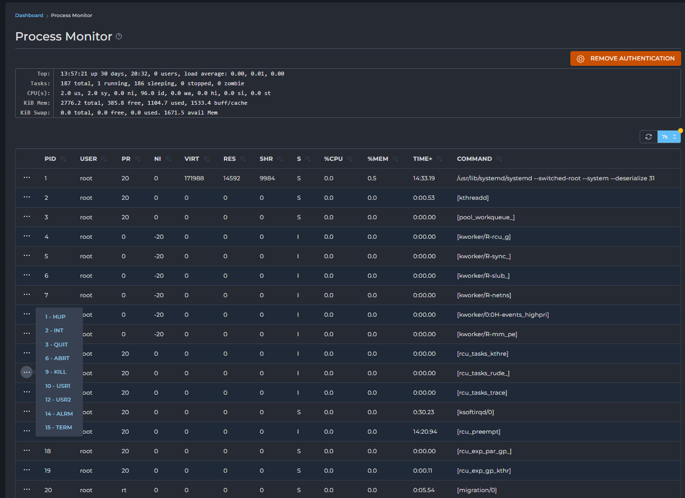
- Giao diện Process Monitor hiển thị thông tin chi tiết về các tiến trình đang hoạt động, bao gồm thông tin tổng quan về hệ thống và một bảng danh sách các tiến trình riêng lẻ.
- Thông tin tổng quan hệ thống (System Summary)
- Phía trên cùng của giao diện, bạn sẽ thấy một bản tóm tắt về trạng thái hiện tại của hệ thống, tương tự như đầu ra của lệnh top trong Linux:
	- 
	- Top:
		- Thời gian hiện tại và thời gian hệ thống đã hoạt động liên tục (uptime). 
		- [x] users: Số lượng người dùng hiện đang đăng nhập vào hệ thống.
		- load average: x.xx, x.xx, x.xx: Tải trung bình của hệ thống trong 1 phút, 5 phút và 15 phút gần đây nhất. Các giá trị này càng thấp càng tốt; giá trị cao có thể cho thấy hệ thống đang quá tải.
	- Tasks (Số lượng tác vụ/tiến trình):
		- xxx total: Tổng số tiến trình đang chạy trên hệ thống.
		- x running: Số tiến trình đang ở trạng thái chạy (running).
		- xxx sleeping: Số tiến trình đang ở trạng thái ngủ (sleeping), chờ đợi tài nguyên hoặc sự kiện.
		- x stopped: Số tiến trình đã bị dừng.
		- x zombie: Số tiến trình (zombie), là các tiến trình con đã kết thúc nhưng tiến trình cha chưa thu hồi tài nguyên của chúng. Số lượng zombie khác 0 thường là dấu hiệu của vấn đề.
	- %Cpu(s) (Sử dụng CPU theo phần trăm): Phân tích mức sử dụng CPU.
		- x.x us: Phần trăm CPU được sử dụng bởi các tiến trình người dùng (user space).
		- x.x sy: Phần trăm CPU được sử dụng bởi kernel (system space).
		- x.x ni: Phần trăm CPU được sử dụng bởi các tiến trình có mức ưu tiên thay đổi (nice).
		- x.x id: Phần trăm CPU rảnh rỗi (idle). Giá trị này càng cao càng tốt.
		- x.x wa: Phần trăm CPU chờ đợi I/O (input/output).
		- x.x hi: Phần trăm CPU xử lý các ngắt phần cứng (hardware interrupts).
		- x.x si: Phần trăm CPU xử lý các ngắt phần mềm (software interrupts).
		- x.x st: Phần trăm CPU bị chiếm dụng bởi máy ảo (steal time), nếu bạn đang chạy trên máy ảo.
	- KiB Mem (Thông tin bộ nhớ RAM):
		- xxxx total: Tổng dung lượng RAM vật lý của hệ thống (trong Kilobyte).
		- xxxx free: Dung lượng RAM còn trống (trong Kilobyte).
		- xxxx used: Dung lượng RAM đang được sử dụng (trong Kilobyte).
		- xxxx buff/cache: Dung lượng RAM đang được sử dụng làm bộ đệm và bộ nhớ cache (trong Kilobyte).
	- KiB Swap (Thông tin bộ nhớ Swap):
		- x.x total: Tổng dung lượng swap (bộ nhớ ảo) của hệ thống (trong Kilobyte).
		- x.x free: Dung lượng swap còn trống (trong Kilobyte).
		- x.x used: Dung lượng swap đang được sử dụng (trong Kilobyte).
		- xxxx avail Mem: Dung lượng bộ nhớ khả dụng (có thể được cấp phát ngay lập tức cho các tiến trình mới) (trong Kilobyte).
- Bảng danh sách tiến trình (Process List Table)
	- Đây là phần chính hiển thị danh sách tất cả các tiến trình đang chạy trên hệ thống, được sắp xếp theo các cột thông tin quan trọng:
		- 
		- PID: Process ID (Mã định danh tiến trình). Mỗi tiến trình có một PID duy nhất. Đây là cột quan trọng nhất để xác định một tiến trình cụ thể.
		- USER: Tên người dùng sở hữu tiến trình.
		- PR: Priority (Mức ưu tiên). Mức ưu tiên của tiến trình (thấp hơn có nghĩa là ưu tiên cao hơn).
		- NI: Nice value (Giá trị Nice). Giá trị nice ảnh hưởng đến mức ưu tiên của tiến trình. Giá trị dương có nghĩa là ít ưu tiên hơn, giá trị âm có nghĩa là ưu tiên cao hơn.
		- VIRT: Virtual Memory (Bộ nhớ ảo). Tổng lượng bộ nhớ ảo mà tiến trình đang sử dụng (bao gồm RAM, swap và các tệp ánh xạ).
		- RES: Resident Memory (Bộ nhớ thực tế/vật lý). Lượng RAM vật lý thực tế mà tiến trình đang sử dụng (không bao gồm swap).
		- SHR: Shared Memory (Bộ nhớ chia sẻ). Lượng bộ nhớ chia sẻ được sử dụng bởi tiến trình.
		- S: Status (Trạng thái). Trạng thái hiện tại của tiến trình (ví dụ: S - Sleeping, R - Running, T - Stopped, Z - Zombie).
		- %CPU: Percentage of CPU Usage (Phần trăm sử dụng CPU). Phần trăm tài nguyên CPU mà tiến trình đang tiêu thụ.
		- %MEM: Percentage of Memory Usage (Phần trăm sử dụng bộ nhớ). Phần trăm tổng RAM vật lý mà tiến trình đang tiêu thụ.
		- TIME+: CPU Time (Thời gian CPU). Tổng thời gian CPU mà tiến trình đã sử dụng kể từ khi khởi động, được hiển thị dưới dạng HH:MM:SS.
		- COMMAND: Command (Lệnh). Lệnh hoặc đường dẫn đầy đủ của chương trình đã khởi chạy tiến trình.
- Các nút chức năng
	- AUTHENTICATE TO SEND SIGNALS / REMOVE AUTHENTICATION: Dùng bật / tắt chế độ gửi signals tới PID từ giao diện. Để bật cần password của user quản trị. 
		- 
		- 
	- Gửi signal tới các tiến trình. 
		- 
		- SIGHUP (1): "Reload" (tải lại cấu hình) hoặc kết nối bị ngắt. Dùng để yêu cầu các dịch vụ tải lại cấu hình mà không khởi động lại.
		- SIGINT (2): Ngắt. Tương đương Ctrl+C. Yêu cầu tiến trình kết thúc duyên dáng, thường là do người dùng.
		- SIGQUIT (3): Thoát. Tương đương Ctrl+\. Yêu cầu tiến trình thoát và tạo "core dump" (để gỡ lỗi).
		- SIGABRT (6): Hủy bỏ. Tiến trình tự báo hiệu lỗi nghiêm trọng, tạo core dump và thoát.
		- SIGKILL (9): Kết thúc. Buộc tiến trình dừng ngay lập tức, không thể bị bỏ qua hoặc bắt. Dùng khi tiến trình bị treo.
		- SIGUSR1 (10): Tùy chỉnh 1. Lập trình viên định nghĩa mục đích riêng cho ứng dụng.
		- SIGUSR2 (12): Tùy chỉnh 2. Lập trình viên định nghĩa mục đích riêng cho ứng dụng.
		- SIGALRM (14): Báo động. Hệ thống gửi khi bộ đếm thời gian hết hạn.
		- SIGTERM (15): Kết thúc (khuyến nghị). Yêu cầu tiến trình dừng một cách duyên dáng, cho phép dọn dẹp trước khi thoát.

### Mail Queue Administration 
- 
- Giao diện Mail Queue Administration trong DirectAdmin là nơi bạn có thể giám sát và quản lý các email đang chờ xử lý trong hàng đợi của máy chủ thư. 
- Hàng đợi thư (mail queue) là nơi các email được lưu trữ tạm thời khi chúng đang chờ được gửi đi, hoặc khi có sự cố tạm thời khiến chúng không thể gửi đi ngay lập tức (ví dụ: máy chủ nhận không khả dụng, hộp thư đầy tạm thời, v.v.).
- Các nút chức năng:
	- Thaw (Bỏ đóng băng): Nếu một email đã bị "đóng băng" (tức là tạm dừng việc gửi lại), nút này sẽ cho phép nó được đưa trở lại trạng thái chờ gửi bình thường, và hệ thống sẽ tiếp tục cố gắng gửi lại nó.
	- Freeze (Đóng băng): Đặt trạng thái của các email đã chọn thành "đóng băng". Email sẽ ở lại trong hàng đợi nhưng sẽ không được gửi lại cho đến khi bạn bỏ đóng băng nó. Điều này hữu ích khi bạn muốn tạm dừng việc gửi một số email cụ thể để điều tra hoặc ngăn chặn spam.
	- Retry (Thử lại): Buộc máy chủ ngay lập tức thử gửi lại các email đã chọn. Điều này hữu ích khi bạn tin rằng vấn đề tạm thời gây ra lỗi đã được khắc phục.
	- Bounce (Trả lại): Trả email về cho người gửi với một thông báo lỗi, cho biết email không thể gửi được đến người nhận. Email sẽ bị xóa khỏi hàng đợi sau khi được trả lại.
	- Delete (Xóa): Xóa vĩnh viễn các email đã chọn khỏi hàng đợi mà không gửi thông báo lỗi cho người gửi. Hãy cẩn thận khi sử dụng chức năng này.
- Bảng hiển thị hàng đợi thư
	- Đây là khu vực chính hiển thị danh sách các email trong hàng đợi.
	- Checkbox: Ô kiểm ở đầu mỗi hàng email, cho phép bạn chọn từng email riêng lẻ để thực hiện các hành động hàng loạt.
	- ID: Mã định danh duy nhất của email trong hàng đợi.
	- Time: Thời gian email đã ở trong hàng đợi (cho biết nó đã bị kẹt trong bao lâu).
	- Size: Kích thước của email (tính bằng byte hoặc kilobytes).
	- Sender: Địa chỉ email của người gửi.
	- Recipient(s): Một hoặc nhiều địa chỉ email của người nhận.

### Service Monitor 
- 
- Service Monitor là một công cụ thiết yếu trong DirectAdmin, cho phép quản trị viên xem trạng thái hiện tại của các dịch vụ quan trọng đang chạy trên máy chủ.
- Nó cung cấp khả năng khởi động lại hoặc dừng các dịch vụ này, cũng như khởi động lại toàn bộ máy chủ khi cần thiết.
- Việc giám sát các dịch vụ đảm bảo rằng các thành phần cốt lõi của máy chủ hoạt động ổn định và sẵn sàng phục vụ.
- Các nút chức năng 
	- REBOOT (Khởi động lại): 
		- Sử dụng để khởi động lại toàn bộ máy chủ. 
		- Hãy sử dụng chức năng này một cách thận trọng, vì nó sẽ làm gián đoạn tất cả các dịch vụ và kết nối trên máy chủ. Bạn sẽ được yêu cầu xác nhận trước khi máy chủ khởi động lại.
	- Update Services List: 
		- Nút này dùng để làm mới danh sách và trạng thái của các dịch vụ. 
		- Nếu bạn nghi ngờ thông tin hiển thị không còn chính xác, hãy nhấp vào đây
- Bảng danh sách dịch vụ (Service List Table)
	- Đây là phần trung tâm của Service Monitor, hiển thị danh sách các dịch vụ quan trọng cùng với thông tin chi tiết về chúng.
	- Service: Tên của dịch vụ. Đây là các dịch vụ cốt lõi mà DirectAdmin quản lý và sử dụng.
		- dovecot: Dịch vụ IMAP/POP3, xử lý việc nhận và truy cập email cho người dùng cuối.
		- exim: Dịch vụ SMTP (Mail Transfer Agent), xử lý việc gửi và nhận email.
		- httpd: Dịch vụ máy chủ web (thường là Apache hoặc Nginx), phục vụ các trang web.
		- lfd: Login Failure Daemon, một phần của CSF (ConfigServer Firewall), giám sát các nỗ lực đăng nhập thất bại và thực hiện hành động chặn.
		- mysqld: Dịch vụ máy chủ cơ sở dữ liệu MySQL/MariaDB, lưu trữ dữ liệu cho các trang web và ứng dụng.
		- named: Dịch vụ máy chủ tên miền (DNS - Domain Name System), xử lý việc phân giải tên miền thành địa chỉ IP.
		- php-fpm56, php-fpm83: Các phiên bản PHP-FPM (FastCGI Process Manager), quản lý việc thực thi các script PHP cho các trang web. Bạn có thể thấy nhiều phiên bản nếu máy chủ hỗ trợ đa phiên bản PHP.
		- pure-ftpd: Dịch vụ máy chủ FTP, cho phép người dùng tải lên và tải xuống tệp qua FTP.
		- sshd: Dịch vụ SSH (Secure Shell), cho phép truy cập dòng lệnh bảo mật từ xa vào máy chủ.
	- Status: Trạng thái hiện tại của dịch vụ.
		- Running (Màu xanh): Dịch vụ đang hoạt động bình thường. Đây là trạng thái mong muốn.
		- Stopped (Màu đỏ hoặc khác): Dịch vụ không hoạt động. Điều này có thể gây ra sự cố cho các chức năng liên quan (ví dụ: nếu httpd bị dừng, các trang web sẽ không hoạt động).
	- PID(s): Process ID(s) (Mã định danh tiến trình). Đây là (các) ID của tiến trình đang chạy cho dịch vụ đó. Một số dịch vụ có thể có nhiều PID.
	- Memory Usage: Lượng bộ nhớ RAM mà dịch vụ đang sử dụng. Điều này giúp bạn theo dõi tài nguyên tiêu thụ của từng dịch vụ.
	- Các nút chức năng cho từng dịch vụ
		- Ở cuối mỗi hàng dịch vụ, bạn sẽ thấy ba dấu chấm (...). Nhấp vào đây sẽ mở ra một menu thả xuống với các tùy chọn hành động cho dịch vụ cụ thể đó:
		- Stop (Dừng): Dừng dịch vụ đã chọn. Sau khi dừng, dịch vụ sẽ không hoạt động cho đến khi bạn khởi động lại nó.
		- Restart (Khởi động lại): Dừng dịch vụ và sau đó khởi động lại nó. Đây là hành động được sử dụng phổ biến nhất khi bạn thay đổi cấu hình của một dịch vụ hoặc khi dịch vụ bị trục trặc và cần được làm mới.

### System Backup
- 
- System Backup là một tính năng quan trọng trong DirectAdmin, cho phép bạn tạo bản sao lưu toàn bộ hoặc một phần các file cấu hình và dữ liệu quan trọng của hệ thống. 
- Việc sao lưu định kỳ là cần thiết để bảo vệ máy chủ của bạn khỏi mất dữ liệu do lỗi phần cứng, tấn công mạng, hoặc các sự cố không mong muốn khác.
- Giao diện System Backup được chia thành bốn tab chính, mỗi tab cho phép bạn cấu hình một phần khác nhau của quá trình sao lưu hệ thống.

#### Basic Configuration (Cấu hình cơ bản) 
- 
- Đây là tab mặc định nơi bạn thiết lập các tùy chọn cơ bản cho bản sao lưu.
- Backup Path (Đường dẫn sao lưu):
	- Chỉ định nơi các bản sao lưu sẽ được lưu trữ trên máy chủ.
	- Mặc định thường là $MOUNT_POINT/backup hoặc /home/admin/backup. Đảm bảo rằng đường dẫn này có đủ dung lượng đĩa và có thể truy cập được.
- Minimum disk space required for backup (MB) (Dung lượng đĩa tối thiểu cần thiết cho sao lưu (MB)):
	- Bạn có thể đặt một ngưỡng dung lượng đĩa trống tối thiểu (tính bằng MB) cho phân vùng được chọn. Nếu dung lượng trống ít hơn ngưỡng này, DirectAdmin sẽ không tiến hành sao lưu.
	- on partition: Chọn phân vùng mà bạn muốn kiểm tra dung lượng trống (thường là /).
	- Ví dụ: Nếu bạn đặt 4096 MB (4GB) và phân vùng / của bạn chỉ còn 3GB trống, bản sao lưu sẽ không chạy.
- Backup (Các loại dữ liệu cần sao lưu):
	- HTTPD data: Sao lưu dữ liệu liên quan đến máy chủ web (ví dụ: các file cấu hình Apache/Nginx, virtual hosts).
	- DNS data: Sao lưu các bản ghi DNS của các miền trên máy chủ.
	- MySQL Databases: Sao lưu tất cả các cơ sở dữ liệu MySQL/MariaDB.
	- Custom Directories & Files: Cho phép bạn bao gồm các thư mục và tệp tùy chỉnh vào bản sao lưu. Bạn sẽ cấu hình chi tiết hơn trong tab "Directories" và "Files".
- Add user home directories to directory list: Khi được chọn, tất cả các thư mục Home của người dùng trên máy chủ (thường là /home/user) sẽ được thêm vào danh sách các thư mục cần sao lưu. Điều này rất quan trọng nếu bạn muốn sao lưu toàn bộ dữ liệu của tất cả các tài khoản người dùng.
- SAVE: Nhấn nút này để lưu các thay đổi cấu hình cơ bản.

#### Remote Transfer (Chuyển sao lưu từ xa) 
- 
- Tab này cho phép bạn cấu hình việc chuyển các bản sao lưu lên một máy chủ từ xa, giúp tăng cường an toàn dữ liệu (tránh trường hợp máy chủ chính bị hỏng).
- Use Remote Transfer: Đánh dấu vào ô này để kích hoạt tính năng chuyển sao lưu từ xa.
- Remote transfer method (Phương thức chuyển từ xa): Chọn giao thức bạn muốn sử dụng để chuyển dữ liệu. FTP/SCP
- Delete the local backup after remote transfer: Nếu được chọn, bản sao lưu cục bộ trên máy chủ DirectAdmin sẽ bị xóa sau khi nó được chuyển thành công lên máy chủ từ xa. Điều này giúp tiết kiệm dung lượng đĩa trên máy chủ chính. Hãy thận trọng khi sử dụng tùy chọn này và đảm bảo rằng bản sao lưu từ xa đã được xác minh thành công.
- Incremental file-by-file backup: Tính năng sao lưu gia tăng từng tệp. Thay vì sao lưu toàn bộ các tệp mỗi lần, nó chỉ sao lưu những tệp đã thay đổi hoặc được thêm vào kể từ lần sao lưu gần nhất. Điều này giúp tiết kiệm thời gian và dung lượng. Có biểu tượng (?) hiển thị chú giải công cụ cho tùy chọn này.
- Remote Host: Địa chỉ IP hoặc tên miền của máy chủ từ xa nơi bạn muốn gửi bản sao lưu.
- Remote User: Tên người dùng để đăng nhập vào máy chủ từ xa.
- Remote Password: Mật khẩu của người dùng từ xa. Bạn có thể nhấp vào biểu tượng `con mắt` để hiển thị/ẩn mật khẩu.
- Remote Path: Đường dẫn thư mục trên máy chủ từ xa nơi bản sao lưu sẽ được lưu trữ (ví dụ: /backups).
- SAVE: Nhấn nút này để lưu các thay đổi cấu hình chuyển từ xa.

#### Directories (Thư mục) 
- 
- Tab này cho phép bạn chọn các thư mục cụ thể để bao gồm vào bản sao lưu hệ thống.
- Danh sách các thư mục mặc định: DirectAdmin cung cấp một danh sách các thư mục hệ thống quan trọng thường được sao lưu. Bạn có thể chọn các thư mục này bằng cách đánh dấu vào checkbox bên cạnh.
	- /etc/httpd, /etc/mail, /etc/virtual: Cấu hình máy chủ web và email.
	- /home/admin: Thư mục home của tài khoản admin.
	- /usr/local/directadmin/data: Dữ liệu cấu hình của DirectAdmin.
	- /var/log: Các tệp nhật ký.
	- /var/www: Dữ liệu trang web.
	- Và nhiều thư mục quan trọng khác.
- Delete (Xóa): Xóa các thư mục đã chọn khỏi danh sách này (chỉ xóa khỏi danh sách cấu hình, không xóa thư mục thật trên máy chủ).
- Add (Thêm): Bạn có thể nhập đường dẫn đầy đủ của một thư mục tùy chỉnh vào ô trống và nhấn "Add" để thêm nó vào danh sách các thư mục cần sao lưu.
- Lưu ý: Việc chọn các thư mục quan trọng như /etc, /var, /home là rất cần thiết để đảm bảo khôi phục đầy đủ hệ thống.

#### Files (Tệp) 
- 
- Tab này cho phép bạn chọn các tệp cụ thể để bao gồm vào bản sao lưu hệ thống. Tương tự như tab "Directories" nhưng ở cấp độ tệp.
- Danh sách các tệp mặc định: DirectAdmin cung cấp một danh sách các tệp cấu hình quan trọng thường được sao lưu.
	- /etc/exim.conf, /etc/exim.cert, /etc/exim.key: Cấu hình và khóa/chứng chỉ của Exim.
	- /etc/passwd, /etc/shadow, /etc/group: Thông tin người dùng và nhóm.
	- /etc/named.conf: Cấu hình DNS.
	- /usr/local/directadmin/conf/mysql.conf: Cấu hình MySQL của DirectAdmin.
	- Và nhiều tệp cấu hình quan trọng khác.
- Delete (Xóa): Xóa các tệp đã chọn khỏi danh sách này (chỉ xóa khỏi danh sách cấu hình, không xóa tệp thật trên máy chủ).
- Add (Thêm): Bạn có thể nhập đường dẫn đầy đủ của một tệp tùy chỉnh vào ô trống và nhấn "Add" để thêm nó vào danh sách các tệp cần sao lưu.
- Lưu ý: Sao lưu các tệp cấu hình này là rất quan trọng để có thể khôi phục lại cấu hình hoạt động của các dịch vụ sau này.

#### Nút chức năng
- Cron Schedule (Lịch trình Cron) 
	- 
	- 
	- Click mở giao diện cho phép cấu hình tự động hóa quá trình sao lưu theo lịch trình.
		- Use Cron for Backup: Đánh dấu vào ô này để kích hoạt việc sao lưu tự động theo lịch trình Cron.
		- Minute: Phút (0-59) mà bản sao lưu sẽ chạy.
		- Hour: Giờ (0-23) mà bản sao lưu sẽ chạy.
		- Day of Month: Ngày trong tháng (1-31) mà bản sao lưu sẽ chạy. Dấu * có nghĩa là mỗi ngày.
		- Month: Tháng (1-12) mà bản sao lưu sẽ chạy. Dấu * có nghĩa là mỗi tháng.
		- Day of Week: Ngày trong tuần (0-7, với 0 hoặc 7 là Chủ Nhật) mà bản sao lưu sẽ chạy.
	- Ví dụ trong hình: Minute: 0, Hour: 5, Day of Month: *, Month: *, Day of Week: 0 sẽ tạo ra một cron job chạy vào 05:00, chỉ vào Chủ Nhật.
	- Cron job will run at: Hiển thị tóm tắt lịch trình cron mà bạn đã cấu hình.
	- SAVE: Lưu cấu hình lịch trình Cron.
	- Close: Đóng cửa sổ pop-up.
- RUN SYSTEM BACKUP (Chạy sao lưu hệ thống)
	- Click để bắt đầu quá trình sao lưu ngay lập tức dựa trên tất cả các cấu hình bạn đã thiết lập trong các tab.
	- 
- View Last Backup Log: 
	- Click để xem bản ghi quá trình sao lưu. 
	- 
	- 

### cPanel Import
- 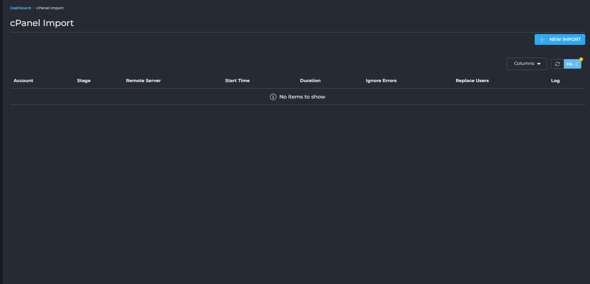
- cPanel Import là một công cụ tiện ích trong DirectAdmin được thiết kế để giúp bạn dễ dàng di chuyển các tài khoản người dùng và dữ liệu của họ từ một máy chủ cPanel sang máy chủ DirectAdmin của bạn.
- Tính năng này tự động hóa quá trình di chuyển, bao gồm cơ sở dữ liệu, file, email và các cấu hình liên quan, giúp giảm thiểu thời gian và công sức cần thiết cho việc di chuyển máy chủ.
- Giao diện cPanel Import cung cấp một danh sách các tác vụ nhập đã được thực hiện hoặc đang chờ xử lý, cùng với khả năng tạo tác vụ nhập mới.
- Nút chức năng NEW IMPORT:
	- 
	- 
	- Nút này cho phép bạn bắt đầu một quá trình nhập tài khoản mới từ máy chủ cPanel. 
	- Khi bạn nhấp vào nút NEW IMPORT, một cửa sổ hoặc trang mới sẽ xuất hiện để bạn cung cấp thông tin đăng nhập của máy chủ cPanel nguồn.
		- Remote cPanel server credentials (Thông tin đăng nhập máy chủ cPanel từ xa):
		- Host: Địa chỉ IP hoặc tên miền của máy chủ cPanel mà bạn muốn nhập dữ liệu từ đó.
		- Port: Cổng SSH của máy chủ cPanel. Mặc định thường là 22. Đảm bảo cổng này được mở trên tường lửa của máy chủ cPanel.
		- User: Tên người dùng để đăng nhập vào máy chủ cPanel nguồn qua SSH. Mặc định là root vì quyền root thường cần thiết để truy cập tất cả dữ liệu tài khoản cPanel.
		- Password: Mật khẩu của người dùng SSH (ví dụ: root) trên máy chủ cPanel nguồn.
	- LOAD ACCOUNTS: Sau khi nhập đầy đủ thông tin, nhấn nút này. DirectAdmin sẽ cố gắng kết nối đến máy chủ cPanel nguồn, xác thực thông tin đăng nhập và tải về danh sách các tài khoản cPanel có sẵn trên máy chủ đó.

- Bảng danh sách các tác vụ nhập (Import Tasks Table)
	- Phần này hiển thị danh sách các lần nhập cPanel đã được thực hiện hoặc đang được tiến hành.
		- Account: Tên tài khoản người dùng trên DirectAdmin được tạo hoặc cập nhật từ quá trình nhập cPanel.
		- Stage: Trạng thái hiện tại của quá trình nhập (ví dụ: Connecting, Transferring, Importing, Completed, Failed).
		- Remote Server: Địa chỉ IP hoặc tên miền của máy chủ cPanel nguồn.
		- Start Time: Thời điểm bắt đầu của tác vụ nhập.
		- Duration: Thời gian mà tác vụ nhập đã hoặc đang diễn ra.
		- Ignore Errors: Cho biết liệu quá trình nhập có được cấu hình để bỏ qua một số lỗi nhất định hay không.
		- Replace Users: Cho biết liệu các tài khoản người dùng hiện có có bị ghi đè/thay thế nếu đã tồn tại trên DirectAdmin hay không.
		- Log: Liên kết đến nhật ký chi tiết của tác vụ nhập, giúp bạn kiểm tra các lỗi hoặc thông tin quan trọng trong quá trình.

### Message All Users
- 
- Tính năng Message All Users trong DirectAdmin cho phép quản trị viên gửi thông báo hoặc tin nhắn đến tất cả các tài khoản người dùng và đại lý (resellers) trên máy chủ. 
- Đây là một công cụ thiết yếu để thông báo về các vấn đề bảo trì, cập nhật hệ thống, thay đổi chính sách, hoặc bất kỳ thông tin quan trọng nào khác mà bạn muốn tất cả người dùng biết.
- Giao diện Message All Users khá đơn giản và trực quan, tập trung vào việc tạo và gửi tin nhắn.
- Các trường cấu hình tin nhắn
	- To (Gửi đến): Mặc định là All of Your Users (Tất cả người dùng của bạn). Điều này có nghĩa là tin nhắn sẽ được gửi đến tất cả các tài khoản người dùng và đại lý tồn tại trên máy chủ DirectAdmin của bạn.
		- E-mail Only: Đây là một tùy chọn bên cạnh trường "To". Nếu bạn chọn nó, tin nhắn sẽ chỉ được gửi qua email đến địa chỉ email liên hệ của mỗi người dùng, mà không hiển thị dưới dạng tin nhắn trong giao diện DirectAdmin khi họ đăng nhập.
	- Priority (Mức độ ưu tiên):
		- 
		- Đây là một menu thả xuống (dropdown) cho phép bạn đặt mức độ khẩn cấp của tin nhắn. Các tùy chọn thường là:
		- Low (Thấp): Dùng cho các thông báo không khẩn cấp.
		- Medium (Trung bình): Dùng cho các thông báo quan trọng hơn.
		- High (Cao): Dùng cho các thông báo khẩn cấp, yêu cầu sự chú ý ngay lập tức.
	- Subject (Tiêu đề): Đây là trường văn bản để bạn nhập tiêu đề của tin nhắn. Tiêu đề này sẽ hiển thị rõ ràng khi người dùng nhận được thông báo qua email hoặc trong giao diện DirectAdmin. Hãy đặt một tiêu đề rõ ràng, súc tích để người dùng dễ dàng nhận biết nội dung.
	- Message (Nội dung tin nhắn): Đây là một ô văn bản lớn để bạn nhập nội dung chi tiết của tin nhắn. Bạn nên cung cấp đầy đủ thông tin cần thiết một cách rõ ràng và dễ hiểu.
	- Nút gửi tin nhắn SEND (Gửi): Sau khi bạn đã hoàn tất việc soạn thảo tin nhắn và cấu hình các tùy chọn, nhấn nút này để gửi tin nhắn đến tất cả người dùng đã chọn.

### Skin Manager
- 
- Là một công cụ trong DirectAdmin cho phép quản trị viên xem, quản lý và thay đổi giao diện (skin) của bảng điều khiển DirectAdmin. Giao diện người dùng có vai trò quan trọng trong trải nghiệm sử dụng, và việc tùy chỉnh skin có thể giúp cá nhân hóa bảng điều khiển hoặc cung cấp một giao diện thân thiện hơn cho người dùng.
- Giao diện Skin Manager hiển thị danh sách các skin hiện có trên máy chủ, cùng với các tùy chọn để quản lý và áp dụng chúng.
- Nút chức năng UPLOAD SKIN (Tải lên Skin): Nút này cho phép bạn tải lên một skin mới vào máy chủ DirectAdmin. 
	- Click mở giao diện thực hiện việc tải lên.
	- 
	- Drag file here or click to upload: Bạn có thể kéo và thả tệp skin vào khu vực này hoặc nhấp vào để mở trình duyệt tệp và chọn tệp skin.
	- Accepted type: .tar.gz: Định dạng tệp nén được chấp nhận cho skin là .tar.gz. Đảm bảo tệp skin của bạn ở định dạng này.
	- Max File Size: 500 MB: Kích thước tệp skin tối đa mà bạn có thể tải lên là 500 MB.
	- Name: Trường để bạn nhập tên cho skin mà bạn đang tải lên. Tên này sẽ xuất hiện trong danh sách skin sau khi tải lên thành công.
	- Close: Đóng cửa sổ pop-up mà không tải lên.
	- UPLOAD: Nhấn nút này để bắt đầu quá trình tải lên và cài đặt skin.
- Bảng danh sách Skin (Skins Table)
	- Đây là phần chính hiển thị các skin có sẵn trên máy chủ của bạn.
	- Skin Name: Tên của skin.
		- Enhanced: Đây là một skin phổ biến, thường là skin mặc định hoặc skin truyền thống của DirectAdmin.
		- Evolution: Đây là skin hiện đại hơn, thường là skin mặc định trong các phiên bản DirectAdmin gần đây, cung cấp giao diện người dùng thân thiện và responsive hơn.
	- Path: Đường dẫn thư mục nơi các tệp skin được lưu trữ trên máy chủ.
		- /data/skins/enhanced
		- /data/skins/evolution
	- Owner: Cho biết ai là chủ sở hữu của skin.
	- Actions (Hành động): Một menu thả xuống hoặc các nút cho phép bạn thực hiện hành động với skin đã chọn.
		- Apply to me: Áp dụng skin này cho tài khoản quản trị viên hiện tại của bạn.
		- Apply to all users: Áp dụng skin này làm skin mặc định cho tất cả người dùng (bao gồm cả đại lý và người dùng cuối) trên máy chủ.

### Customize Evolution Skin
- 
- Customize Evolution Skin là một tính năng trong DirectAdmin, cho phép quản trị viên tùy chỉnh giao diện của skin Evolution để phù hợp với thương hiệu cá nhân, công ty, hoặc để cải thiện trải nghiệm người dùng. Với các tùy chọn đa dạng, bạn có thể thay đổi bố cục, màu sắc, phông chữ, biểu tượng và thậm chí cả nội dung liên kết trợ giúp.
- Giao diện chính của Customize Evolution Skin được chia thành hai phần lớn: OPTIONS (Tùy chọn) và BRANDING (Thương hiệu), mỗi phần chứa nhiều liên kết dẫn đến các trang cấu hình chi tiết hơn.
####  OPTIONS (Các tùy chọn chung)
- Phần này chứa các cài đặt ảnh hưởng đến hành vi và hiển thị chung của skin.
- Layout (Bố cục) 
	- 
	- Cho phép bạn thiết lập bố cục mặc định cho các cấp độ người dùng khác nhau (User, Reseller, Admin).
	- User Layout / Power-User Layout: Chọn bố cục mặc định cho người dùng thông thường và người dùng Power. 
		- Standard
		- Sidebar 
		- Icons Grid 
		- Refreshed 
	- Force Layout: Nếu được chọn, nó sẽ cấm người dùng thay đổi bố cục của họ trong tùy chọn skin.
	- External CSS URL: Cho phép bạn liên kết đến một tệp CSS tùy chỉnh bên ngoài để áp dụng các kiểu dáng bổ sung.
	- Standard layout default menu type: Chọn kiểu menu mặc định cho bố cục Standard "Display as grid"/"Display as list"
	- Refreshed layout default dashboard mode: Chọn chế độ bảng điều khiển mặc định cho bố cục Refreshed Widgets/Menu 
	- SAVE: Lưu các thay đổi về bố cục.
- Date Formats (Định dạng ngày tháng) 
	- 
	- Cho phép bạn cấu hình định dạng hiển thị ngày và giờ trong bảng điều khiển.
	- Date Format: Chọn định dạng cho ngày (ví dụ: dd/MM/yyyy sẽ hiển thị 17/07/2025). Bạn có thể chọn các định dạng có sẵn hoặc chọn "Custom" và nhập định dạng mong muốn.
	- Date & Time Format: Tương tự, chọn định dạng cho cả ngày và giờ (ví dụ: dd/MM/yyyy, HH:mm sẽ hiển thị 17/07/2025, 15:23).
	- Week Start: Chọn ngày bắt đầu của tuần (ví dụ: Monday hoặc Sunday).
	- SAVE: Lưu các thay đổi về định dạng ngày tháng.
- Widgets (Tiện ích/Khối thông tin) 
	- 
	- Cho phép bạn ẩn hoặc sắp xếp lại các widget (khối thông tin) hiển thị trên bảng điều khiển cho từng cấp độ người dùng (User, Reseller, Admin).
	- Mỗi cấp độ có một danh sách các widget riêng. Bạn có thể:
		- Tích chọn/Bỏ tích chọn: Để hiển thị hoặc ẩn một widget.
		- Kéo và thả (Drag and drop): Sử dụng biểu tượng dấu chấm để kéo các widget lên/xuống, thay đổi thứ tự hiển thị của chúng trên dashboard.
		- Biểu tượng con mắt: Nhấp vào để xem trước nội dung của widget.
	- SAVE: Lưu các thay đổi về widget.
- Help Links (Liên kết trợ giúp) 
	- 
	- 
	- 
	- Cho phép bạn tùy chỉnh các liên kết trợ giúp xuất hiện trên các trang khác nhau của DirectAdmin cho từng cấp độ người dùng.
	- Có ba tab: USER, RESELLER, ADMIN. Chọn tab tương ứng để tùy chỉnh liên kết trợ giúp cho cấp độ đó.
		- Route: Tên nội bộ của trang DirectAdmin.
		- Help link: URL của liên kết trợ giúp tùy chỉnh mà bạn muốn hiển thị cho trang đó.
		- Edit: Nhấp vào đây để chỉnh sửa liên kết trợ giúp cho một "Route" cụ thể.
	- Filter Routes: Nhập từ khóa để lọc danh sách các Route.
	- Show Empty: Chỉ hiển thị các Route chưa có liên kết trợ giúp tùy chỉnh.
	- CLEAR DEFAULTS: Xóa tất cả các liên kết trợ giúp tùy chỉnh và khôi phục về mặc định của DirectAdmin.
	- SAVE: Lưu các thay đổi về liên kết trợ giúp.
#### BRANDING (Thương hiệu)
- Phần này tập trung vào việc tùy chỉnh giao diện để phản ánh thương hiệu của bạn.
- Colors (Màu sắc) 
	- 
	- Cho phép bạn điều chỉnh bảng màu của skin.
	- Components: Thiết lập màu sắc cho các thành phần chính:
		- Primary: Màu chính (ví dụ: màu của các nút chính, tiêu đề).
		- Safe: Màu cho các trạng thái an toàn/thành công (thường là xanh lá).
		- Danger: Màu cho các trạng thái nguy hiểm/lỗi (thường là đỏ).
		- Warning: Màu cho các cảnh báo (thường là cam/vàng).
	- Layouts: Thiết lập màu sắc cho các thành phần điều hướng và bố cục khác nhau.
		- Có các trường màu cho Standard, Sidebar, Grid, Refreshed layout.
	- Power Mode Override: Nếu được bật, nó sẽ ghi đè màu sắc của các yếu tố bố cục cho chế độ người dùng Đại lý và Quản trị viên (để chúng có thể có màu sắc khác với người dùng cuối).
	- SAVE CHANGES: Lưu các thay đổi về màu sắc.
	- RESET TO DEFAULTS: Đặt lại tất cả màu sắc về mặc định của skin Evolution.
- CSS Styles (Kiểu CSS) 
	- 
	- Cho phép bạn thêm các quy tắc CSS tùy chỉnh để thay đổi kiểu dáng của skin.
	- Bạn có thể thêm CSS chung (Shared CSS) hoặc CSS riêng cho từng loại bố cục (Standard Layout, Icons Grid Layout, Sidebar Layout, Refreshed Layout) bằng cách chọn tab tương ứng.
	- Mode: css: Chọn chế độ chỉnh sửa là CSS.
	- SAVE CHANGES: Lưu các thay đổi CSS.
	- RESET TO DEFAULTS: Xóa tất cả CSS tùy chỉnh.
- Icons (Biểu tượng) 
	- 
	- Mục này cho phép bạn tùy chỉnh các biểu tượng được sử dụng trong bảng điều khiển DirectAdmin. Bạn có thể thay thế các biểu tượng mặc định bằng các biểu tượng của riêng mình.
	- Bảng hiển thị biểu tượng:
		- Hiển thị một lưới các biểu tượng hiện có với tên của chúng (ví dụ: account-manager, add-new-user, admin-backup-transfer).
		- Filter icons: Ô tìm kiếm cho phép bạn lọc các biểu tượng theo tên.
	- UPLOAD ICON (Tải lên Biểu tượng): Nút này mở một cửa sổ pop-up để bạn tải lên biểu tượng mới.
		- 
		- Icon ID: Tên định danh của biểu tượng bạn muốn thay thế hoặc thêm mới (ví dụ: account-manager). Bạn phải nhập đúng ID của biểu tượng bạn muốn thay thế.
		- Kéo và thả tệp biểu tượng vào đây hoặc nhấp để chọn tệp.
		- Accepted type: image/svg+xml: Định dạng được chấp nhận là tệp SVG (Scalable Vector Graphics). SVG là định dạng lý tưởng cho biểu tượng vì chúng có thể điều chỉnh kích thước mà không bị mất chất lượng.
		- Max File Size: 500 MB: Kích thước tệp tối đa cho phép.
		- UPLOAD ICON: Nhấn nút này để tải lên và áp dụng biểu tượng.
		- Close: Đóng cửa sổ pop-up.
- Logo (Biểu trưng)
	- 
	- Mục này cho phép bạn thay đổi logo và biểu tượng (favicon) hiển thị trong DirectAdmin.
	- Logos: Tùy chỉnh logo chính của bảng điều khiển.
		- Logo Light / Logo Dark: Cho phép bạn tải lên các phiên bản logo khác nhau phù hợp với chế độ giao diện sáng hoặc tối.
		- Reset: Đặt lại logo về mặc định.
		- UPLOAD: Tải lên logo mới (thường là tệp hình ảnh như PNG, JPG).
	- Symbols: Tùy chỉnh biểu tượng nhỏ hơn thường xuất hiện cùng với logo hoặc trong các thành phần UI khác. Tương tự như Logos, bạn có thể tải lên các phiên bản Light/Dark.
	- Favicon: Tùy chỉnh biểu tượng Favicon (biểu tượng nhỏ xuất hiện trên tab trình duyệt). UPLOAD: Tải lên Favicon mới (thường là tệp .ico hoặc .png kích thước nhỏ).
- Menu (Tùy chỉnh Menu) 
	- 
	- Mục này cung cấp khả năng tùy chỉnh cấu trúc và nội dung của menu điều hướng cho các cấp độ người dùng khác nhau.
	- Tab người dùng: USER, RESELLER, ADMIN: Chọn tab tương ứng để xem và chỉnh sửa menu cho cấp độ người dùng đó.
	- Các danh mục (Categories): Menu được tổ chức thành các danh mục (ví dụ: ACCOUNT MANAGER, E-MAIL MANAGER, ADVANCED FEATURES).
		- Biểu tượng menu (dấu gạch ngang): Cho phép bạn kéo và thả để sắp xếp lại thứ tự các mục trong danh mục hoặc kéo cả danh mục để sắp xếp lại thứ tự các danh mục.
		- Biểu tượng bánh răng: Cài đặt cho từng danh mục (ví dụ: đổi tên, ẩn/hiện).
	- Các mục trong menu (Menu Items): Mỗi ô trong lưới là một mục menu.
		- Biểu tượng (ví dụ: Account-manager, SQL Database): Đại diện cho chức năng.
		- Tên mục (ví dụ: Domain Setup, Databases): Tên hiển thị của mục menu.
		- URL (ví dụ: /CMD_DOMAINS, /CMD_DB): Đường dẫn nội bộ mà mục menu này trỏ tới.
		- New Entry: Thêm một mục mới vào danh mục.
	- Plugins: Tab này hiển thị các mục menu liên quan đến plugin đã cài đặt.
	- New Link: Thêm một liên kết tùy chỉnh vào menu (ví dụ: liên kết đến trang hỗ trợ bên ngoài).
	- New Category: Thêm một danh mục mới vào menu.
- Login Page (Trang đăng nhập)
	- Mục này cho phép bạn thay đổi giao diện và thương hiệu của trang đăng nhập DirectAdmin.
	- Tab Images:
		- 
		- Logo Light / Logo Dark: Tải lên logo cho trang đăng nhập (phiên bản sáng/tối).
		- Favicon: Tải lên favicon riêng cho trang đăng nhập.
		- Background Light / Background Dark: Tải lên hình nền cho trang đăng nhập (phiên bản sáng/tối).
		- UPLOAD: Tải lên tệp hình ảnh.
		- Reset: Đặt lại về mặc định.
	- Tab Styles:
		- 
		- Embedded Styles: Cung cấp một trường văn bản để bạn viết mã CSS nhúng (inline CSS) trực tiếp vào trang đăng nhập để tùy chỉnh kiểu dáng chi tiết.
		- External Styles URL: Cho phép bạn liên kết đến một tệp CSS tùy chỉnh bên ngoài để áp dụng kiểu dáng cho trang đăng nhập.
		- Fixed Light/Dark Mode: Tùy chọn để thiết lập chế độ sáng/tối cố định cho trang đăng nhập.
		- User selected: Người dùng có thể chọn chế độ sáng/tối.
		- Light/Dark: Buộc trang đăng nhập hiển thị ở chế độ sáng hoặc tối.
		- UNDO CHANGES / SAVE CHANGES: Các nút để hoàn tác hoặc lưu các thay đổi cấu hình.


### Maintenance Tasks 
- Maintenance Tasks là một tính năng quan trọng trong DirectAdmin, cung cấp cho quản trị viên một bộ công cụ để kiểm tra và khắc phục các vấn đề phổ biến của hệ thống, tối ưu hóa cơ sở dữ liệu, và đảm bảo tính toàn vẹn của các cấu hình. 
- Việc chạy các tác vụ bảo trì này định kỳ giúp duy trì hiệu suất ổn định và ngăn ngừa các sự cố tiềm ẩn.
- 
- Giao diện Maintenance Tasks hiển thị danh sách các tác vụ bảo trì có sẵn, mỗi tác vụ được trình bày với mô tả, mức độ nghiêm trọng và các nút hành động.
- Nút chức năng CHECK ALL: Nút này cho phép bạn chạy tất cả các tác vụ kiểm tra (Check server for issues) cùng một lúc. Điều này hữu ích để thực hiện kiểm tra toàn diện định kỳ.
- Danh sách các tác vụ bảo trì (Maintenance Tasks List)
	- Mỗi tác vụ bảo trì được trình bày dưới dạng một khối riêng biệt với các thông tin và tùy chọn sau:
	- Tên tác vụ: Tiêu đề mô tả chức năng của tác vụ.
	- Description (Mô tả): Một mô tả ngắn gọn về những gì tác vụ này thực hiện và tại sao nó quan trọng.
	- Severity (Mức độ nghiêm trọng): Cho biết mức độ quan trọng hoặc tác động của vấn đề mà tác vụ này giải quyết.
		- MEDIUM SEVERITY: Vấn đề có mức độ ảnh hưởng trung bình, nên được xem xét và xử lý.
		- LOW SEVERITY: Vấn đề có mức độ ảnh hưởng thấp, ít gây ra sự cố ngay lập tức nhưng vẫn nên được khắc phục để duy trì tính ổn định.
	- Check server for issues: Nút này được sử dụng để chạy kiểm tra cho tác vụ cụ thể đó, để xem liệu có bất kỳ vấn đề nào cần được giải quyết hay không.
	
	
	
## System Info & Files 
- Phần System Info & Files trong DirectAdmin tập hợp các công cụ quan trọng cho phép quản trị viên xem thông tin chi tiết về hệ thống, quản lý các tệp, và theo dõi các tác vụ và thống kê sử dụng tài nguyên. Đây là nơi bạn có thể tìm thấy dữ liệu và công cụ để duy trì và gỡ lỗi máy chủ của mình.
- Các công cụ 
	- All User Cron Jobs: Xem và quản lý các tác vụ tự động của người dùng.
	- File Editor: Chỉnh sửa tệp trực tiếp trên máy chủ.
	- System Information: Hiển thị thông tin chi tiết về phần cứng và hệ điều hành.
	- Log Viewer: Xem các tệp nhật ký của hệ thống và dịch vụ.
	- Complete Usage Statistics: Thống kê chi tiết việc sử dụng tài nguyên của các tài khoản.

### All User Cron Jobs
a-394
### File Editor
a-395
click edit 1 file 
a-396
### System Information
a-397
### Log Viewer
a-398
phần chọn log 
a-399
chọn log -> Load log 
a-400
### Complete Usage Statistics
a-401
a-402 
