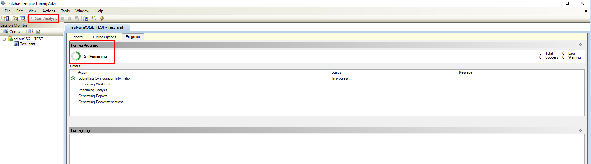

# Database Engine Tuning Advisor
## 1. Tổng quan 
- Database Engine Tuning Advisor phân tích cách các truy vấn được xử lý trong những cơ sở dữ liệu, sau đó đề xuất cách có thể thực hiện để cải thiện hiệu suất xử lý truy vấn bằng cách điều chỉnh các cấu trúc của cơ sở dữ liệu như chỉ mục, các view có chỉ mục và phân vùng dữ liệu.
- Database Engine Tuning Advisor cung cấp hai giao diện người dùng: một giao diện đồ họa (GUI) và một tiện ích dòng lệnh dta. Giao diện đồ họa giúp dễ dàng xem nhanh kết quả của các phiên tối ưu hóa, trong khi tiện ích dta giúp tích hợp dễ dàng chức năng của Database Engine Tuning Advisor vào các tập lệnh để tự động hóa quá trình tối ưu. 
- Ngoài ra, công cụ này cũng hỗ trợ đầu vào dưới dạng XML, giúp kiểm soát tốt hơn quá trình tối ưu hóa.

## 2. Khởi chạy 
- Khởi chạy Database Tuning Advisor (DTA)
	- Khởi động SQL Server Management Studio (SSMS)
	- Khi SSMS được mở, chọn menu Tools, sau đó chọn Database Tuning Advisor.
	- 
	- DTA sẽ được khởi chạy và hộp thoại Connect to Server xuất hiện. Kiểm tra các thiết lập mặc định, sau đó nhấn Connect để kết nối đến máy chủ SQL.
	- 
	- 
	- Giao diện Database Engine Tuning Advisor gồm 2 phần chính:
		- Khung trái – Session Monitor: Hiển thị danh sách các phiên tối ưu hóa:
			- Đặt tên phiên, xem chi tiết, sắp xếp và chỉnh sửa phiên
			- Tạo phiên mới từ phiên cũ
			- Xem đề xuất tối ưu hóa chỉ mục, view, phân vùng, v.v.
		- Khung phải – General & Tuning Options
			- Tab General: Đặt tên phiên, chọn file workload, chọn database và bảng cần tối ưu.
			- Tab Tuning Options: Chọn kiểu tối ưu hóa (chỉ mục, view có chỉ mục, phân vùng) và thời gian tối đa thực hiện (mặc định 1 giờ).

## 3. Sử dụng Database Engine Tuning Advisor
- Công cụ này giúp tối ưu hóa cơ sở dữ liệu bằng cách:
	- Quản lý các phiên tối ưu (tuning sessions)
	- Đưa ra đề xuất điều chỉnh như chỉ mục, view có chỉ mục, phân vùng 
- Tối ưu hóa workload
	- Database Engine Tuning Advisor giúp tìm ra thiết kế vật lý tối ưu nhất (như chỉ mục, view có chỉ mục, phân vùng) để cải thiện hiệu suất truy vấn trên các cơ sở dữ liệu và bảng được chọn.
	- Ví dụ sử dụng 
	- Sao chép một câu lệnh SELECT mẫu, dán vào Query Editor trong SQL Server Management Studio, rồi lưu lại với tên MyScript.sql ở nơi dễ tìm. Ví dụ truy vấn dành cho cơ sở dữ liệu AdventureWorks2022 được cung cấp bên dưới.
	```
	Use [AdventureWorks2022];
	GO
	SELECT DISTINCT pp.LastName, pp.FirstName 
	FROM Person.Person pp JOIN HumanResources.Employee e
	ON e.BusinessEntityID = pp.BusinessEntityID WHERE pp.BusinessEntityID IN 
	(SELECT SalesPersonID 
	FROM Sales.SalesOrderHeader
	WHERE SalesOrderID IN 
	(SELECT SalesOrderID 
	FROM Sales.SalesOrderDetail
	WHERE ProductID IN 
	(SELECT ProductID 
	FROM Production.Product p 
	WHERE ProductNumber = 'BK-M68B-42')));
	GO
	```
	- 
	- Tại tab General ở ngăn bên phải của giao diện DTA, nhập tên phiên vào ô Session name.
	- Chọn tùy chọn File cho mục Workload, sau đó nhấn vào biểu tượng ống nhòm để duyệt đến tệp workload.
	- Tìm và chọn tệp MyScript.sql đã lưu.
	- 
	- Chọn AdventureWorks2022 trong danh sách Database for workload analysis, chọn lại AdventureWorks2022 trong Select databases and tables to tune, và chọn Save tuning log.
	- 
	- Tại tab Tuning gồm các thông số của Database Engine Tuning Advisor (SQL Server):
		- Thời gian giới hạn phiên tối ưu hóa
		- Limit tuning time: Bật tùy chọn này để giới hạn thời gian chạy của phiên tối ưu. Ví dụ: dừng lúc 5:51 PM, ngày 18/06/2025.
		- Cấu trúc thiết kế vật lý để đề xuất
			- Indexes and indexed views: Cho phép đề xuất cả chỉ mục và view có chỉ mục.
			- Indexes: Chỉ đề xuất các loại chỉ mục thông thường.
			- Indexed views: Chỉ tối ưu bằng view có chỉ mục.
			- Nonclustered indexes: Chỉ tạo chỉ mục không phân cụm.
			- Include filtered indexes: Cho phép đề xuất filtered index (chỉ mục có điều kiện).
			- Recommend columnstore indexes: Cho phép hệ thống đề xuất columnstore index – phù hợp với truy vấn phân tích dữ liệu lớn.
			- Evaluate utilization of existing PDS only: Không tạo chỉ mục mới, chỉ đánh giá mức độ sử dụng của chỉ mục hiện có.
		- Chiến lược phân vùng dữ liệu
			- No partitioning: Không phân vùng dữ liệu.
			- Aligned partitioning: Phân vùng đồng bộ giữa nhiều bảng.
			- Full partitioning: Tự do phân vùng toàn bộ cấu trúc.
		- Giữ lại cấu trúc thiết kế nào sau phiên tối ưu
			- Do not keep any existing PDS: Bỏ qua toàn bộ chỉ mục/view cũ, thay bằng đề xuất mới.
			- Keep all existing PDS: Giữ nguyên toàn bộ chỉ mục/view đang có.
			- Keep aligned partitioning: Giữ lại cấu trúc phân vùng đồng bộ.
			- Keep indexes only: Chỉ giữ lại chỉ mục (không giữ view có chỉ mục).
			- Keep clustered indexes only: Chỉ giữ chỉ mục phân cụm hiện có.
	- 
	- Bắt đầu phân tích bằng việc click chọn "Start Analysis" trên thanh công cụ.
	- Trong khi Database Engine Tuning Advisor đang phân tích workload, có thể theo dõi tiến trình tại tab Progress. Khi hoàn tất, tab Recommendations sẽ hiển thị các đề xuất tối ưu hóa.
	- 
	- Sau khi quá trình phân tích hoàn tất, có thể lưu các đề xuất tối ưu dưới dạng tập lệnh Transact-SQL bằng cách:
		- Nhấp vào Save Recommendations trong menu Actions.
		- Trong hộp thoại Save As, chọn thư mục muốn lưu.
		- Đặt tên file và nhấn Save
	- 
- Xem đề xuất tối ưu hóa
	- Trong tab Recommendations, dùng thanh cuộn ngang để xem đầy đủ các cột đề xuất chỉ mục.
	- Mỗi dòng là một đối tượng cơ sở dữ liệu (chỉ mục hoặc view có chỉ mục) được đề xuất tạo hoặc xóa.
	- Nhấp vào cột Definition ở cuối để xem trước mã T-SQL tạo hoặc xóa đối tượng đó.
	- Nhấn Close để đóng cửa sổ xem trước.
	- 
	- 
- Lưu và đánh giá các đề xuất tối ưu hóa
	- Vào menu Actions → chọn Save Recommendations để lưu tất cả đề xuất thành file T-SQL.
	- Có thể áp dụng đề xuất bằng cách chọn Apply Recommendations trong menu Actions.
	- Vào Actions → chọn Evaluate Recommendations để tạo một phiên mới nhằm đánh giá các đề xuất đã chọn.
	- Đặt tên phiên mới sau đó nhấn Start Analysis để bắt đầu phân tích lại.
	-  
- Xem báo cáo tối ưu hóa
	- Ngoài việc xem script T-SQL, có thể xem các báo cáo chi tiết trong tab Reports của Database Engine Tuning Advisor. Các báo cáo này cung cấp thông tin về:
	- Cấu trúc thiết kế vật lý hiện có
	- Các đề xuất tối ưu hóa mới
	- Cách thực hiện:
		- Chọn tab Reports.
		- Trong phần Tuning Summary, xem:
		- Expected percentage improvement: Mức cải thiện hiệu suất dự kiến
		- Space used by recommendation: Dung lượng cần thiết cho các đề xuất
	- 
- Xem báo cáo chi phí truy vấn (Statement Cost Report)
	- Trong tab Reports, chọn Statement cost report từ danh sách báo cáo.
	- Ý nghĩa báo cáo:
		- Mỗi câu lệnh T-SQL đều có chi phí thực thi (performance cost).
		- Báo cáo này hiển thị tỷ lệ cải thiện hiệu suất ước tính nếu bạn áp dụng các đề xuất tối ưu hóa (ví dụ: tạo chỉ mục).
		- Mức độ chi tiết của báo cáo phụ thuộc vào độ dài và độ phức tạp của workload.
	- 
- Xuất và xem báo cáo chi phí truy vấn
	- Nhấp chuột phải vào bảng Statement cost report, chọn Export to File.
	- Đặt tên file là MyReport → hệ thống sẽ tự thêm đuôi .xml.
	- Mở file MyReport.xml bằng trình chỉnh sửa XML hoặc trong SQL Server Management Studio để xem nội dung.
	- 
	- 


