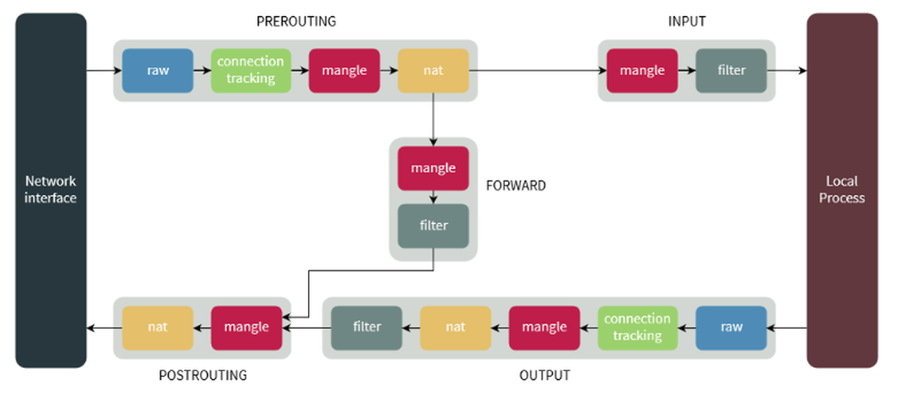

# Firewall
- [Firewall](#firewall)
   * [1. Firewall trên Linux](#1-firewall-trên-linux)
      + [1.1. Tổng quan](#11-tng-quan)
      + [1.2. Yêu cầu cơ bản: ](#12-yêu-cu-c-bn)
         - [1.2.1 iptables](#121-iptables)
         - [1.2.2 firewalld](#122-firewalld)
         - [1.2.3 ufw ](#123-ufw)
         - [1.2.4 csf ](#124-csf)
         - [1.2.5 apf ](#125-apf)
      + [1.3. Tìm hiểu: Cấu hình, sử dụng](#13-tìm-hiu-cu-hình-s-dng)
         - [1.3.1 iptables ](#131-iptables)
         - [1.3.2 firewalld ](#132-firewalld)
         - [1.3.3 ufw ](#133-ufw)
         - [1.3.4 csf](#134-csf)
         - [1.3.5 apf ](#135-apf)
   * [2. Firewall trên Windows](#2-firewall-trên-windows)
      + [2.1. Tổng quan](#21-tng-quan)
      + [2.2. Yêu cầu cơ bản: ](#22-yêu-cu-c-bn)
      + [2.3. Tìm hiểu: Cấu hình, sử dụng](#23-tìm-hiu-cu-hình-s-dng)
   * [3. So sánh](#3-so-sánh)
   * [References ](#references)

<!-- TOC --><a name="firewall"></a>
# Firewall
<!-- TOC --><a name="1-firewall-trên-linux"></a>
## 1. Firewall trên Linux
<!-- TOC --><a name="11-tng-quan"></a>
### 1.1. Tổng quan
- Chức năng tường lửa Linux được cung cấp bởi Netfilter. Netfilter là một mô-đun kernel có trong tất cả các bản phân phối Linux.
- Một số loại cơ bản: iptables, firewalld, ufw, csf, apf …
<!-- TOC --><a name="12-yêu-cu-c-bn"></a>
### 1.2. Yêu cầu cơ bản: 
- Giao thức: Quản trị tường lửa đề cập đến giao thức mạng (như TCP hoặc UDP) được sử dụng để giao tiếp. Tường lửa sử dụng thông tin giao thức này để xác định lưu lượng nào được phép hoặc chặn. Các quy tắc tường lửa thường được xác định dựa trên giao thức, cổng và địa chỉ IP.
	- Các giao thức phổ biến:
		- TCP: Truyền dữ liệu ổn định (HTTP, HTTPS, SSH).
		- UDP: Truyền nhanh, không đảm bảo (DNS, VoIP).
	- Cổng (Port) phổ biến: HTTP: 80, HTTPS: 443, SSH: 22, FTP: 21, MySQL: 3306…
- Quyền quản trị: Cần quyền root để thực hiện cài đặt, cấu hình tường lửa.
- OS tương ứng: Các bản distro của Linux, mỗi bản đều sẽ có các công cụ mặc định 
	- Debian/Ubuntu: ufw, iptables 
	- CentOS/Fedora: firewalld, iptables
- Kiến thức tìm hiểu về các loại firewall:
<!-- TOC --><a name="121-iptables"></a>
#### 1.2.1 iptables
- là một ứng dụng dùng để quản lý filtering gói tin và NAT rules hoạt động trên console của linux rất nhỏ và tiện dụng. Được cung cấp miễn phí nhằm nâng cao tính bảo mật trên hệ thống Linux.
- iptables bao gồm 2 phần là netfilter nằm bên trong nhân Linux và iptables nằm ở vùng ngoài nhân. iptables chịu trách nhiệm giao tiếp với người dùng và sau đó đẩy rules của người dùng vào cho netfilter xử lý. netfilter thực hiện công việc lọc các gói tin ở mức IP. netfilter làm việc trực tiếp ở trong nhân của Linux nhanh và không làm giảm tốc độ của hệ thống
- Về cơ bản, IPtables chỉ là giao diện dòng lệnh để tương tác với packet filtering của netfilter framework.
- iptables cung cấp các tính năng sau:
    * Có khả năng phân tích gói tin hiệu quả.
    * Filtering gói tin dựa vào MAC và một số cờ hiệu (flags) trong TCP Header.
    * Cung cấp kỹ thuật NAT, chi tiết cho các tùy chọn để ghi nhận sự kiện hệ thống.
    * Có khả năng ngăn chặn một số cơ chế tấn công theo kiểu DoS.
    * Xây dựng một hệ thống tường lửa (firewall).
    * Cung cấp, xây dựng và quản lý các rule để xử lý các gói tin.
- Cơ chế packet filtering của IPtables hoạt động gồm 3 thành phần là Tables, Chains và Targets. Cụ thể hoạt động tương quan 3 thành phần như sau:
	- Table là một xử lý các gói tin theo những cách cụ thể. Nếu không chỉ định cụ thể thì mặc định là chúng ta sẽ làm việc với filter table, ngoài ra còn có các bảng khác.
	- Mỗi bảng sẽ được gắn thêm các chain. Việc gắn thêm chain vào table cho phép xử lý gói tin ở những giai đoạn khác nhau, ví dụ có thể xử lý gói tin ngay khi gói tin vừa đến interface hay xử lý các gói tin trước khi các gói này được đẩy ra interface.
	- Có thể tạo ra rule rất cụ thể, ví dụ gói tin đó đến từ port nào, đến từ IP nào sau đó chỉ định hành động (TARGET) sẽ áp dụng với gói tin này.
- Một vài khái niệm cần biết khi tìm hiểu iptables:
	- NAT  (Network address translation) : Mỗi một kết nối trước khi được xử lý đều có địa chỉ nguồn (source ip address) và địa chỉ đích (destination ip address) được chứa trong thông tin của các gói tin. NAT trong netfilter đơn giản là việc thực hiện thay đổi địa chỉ đích và port theo một cách mong muốn.
	- filtering: là quá trình chặn bắt gói tin theo một số tiêu chí đã đề ra 
	- mangle: Là quá trình bóc tách gói tin và chịu trách nhiệm thay đổi bits của QoS (Quality of Services) trong IP Header bởi vì mangle làm việc với các gói tin IP.
	- chain: là một quy tắc xử lý các gói tin bao gồm nhiều rules có liên quan tới nhau. Mỗi table sẽ được tạo với một hoặc nhiều chain. chain cho phép lọc gói tin tại các điểm khác nhau. iptable có thể được thiết lập đối với các loại chain như sau:
		- PREROUTING: Các rule thuộc chain này sẽ được áp dụng ngay sau khi gói tin vừa đi vào đến dải mạng (Network Interface). chain này chỉ có thể có ở table NAT, RAW và MANGLE.
		- INPUT: Các rule thuộc chain này sẽ áp dụng cho các gói tin ngay trước khi gói tin đi vào hệ thống. chain này có trong table MANGLE và FILTER.
		- OUTPUT: Các rule thuộc chain này áp dụng ngay cho các gói tin đi ra từ hệ thống. chain có trong table MANGLE, RAW và FILTER.
		- FORWARD: Các rule thuộc chain này áp dụng các gói tin được chuyển tiếp qua hệ thống. chain có trong table MANGLE.
		- POSTROUTING: Các rule thuộc chain này áp dụng cho các gói tin tới dải mạng (Network Interface). chain này có trong table MANGLE và NAT.
	- 
	- rule: là là một luật, hành động cụ thể xử lý gói tin ứng với mỗi trường hợp, tiêu chí được đề ra.
	- port: là một vị trí nào đó mà gói tin TCP/UDP vào và ra trong thiết bị. Một địa chỉ IP có rất nhiều port. Ví dụ: http port 80, dns port 53, ...
	- target: mỗi một chain là một danh sách các luật có thể được thiết lập cho các gói tin. Mỗi một luật sẽ cần phải khai báo những gì cần phải làm với gói tin được gọi là target.
		- Các hành động áp dụng cho các gói tin được gọi là target. Đối với những gói tin đúng theo rule mà chúng ta đặt ra thì các hành động (target) có thể thực hiện được đó là:
			* ACCEPT: chấp nhận gói tin, cho phép gói tin đi qua hay đi vào hệ thống.
			* DROP: loại bỏ gói tin, không phản hồi lại gói tin giống như việc gói tin đó được gửi đến một hệ thống không tồn tại.
			* RETURN: Dừng thực thi xử áp dụng rules tiếp theo trong chain hiện tại đối với gói tin. Việc kiểm soát sẽ được trả về đối với chain đang gọi.
			* REJECT: Thực hiện loại bỏ gói tin và gửi lại gói tin phản hồi thông báo lỗi. 
			* LOG: Chấp nhận gói tin và có ghi lại log.
- Cấu trúc iptables :
	- 
	- FILTER Table: Đây là table được sử dụng mặc định bởi iptables khi bạn tạo các chain mà không khai báo cho chain` đó thuộc vào table nào. Table hoạt động với việc quy định việc quyết định có cho phép gói tin được chuyển đến địa chỉ đích hay không. Bao gồm 3 thành phần:
		- INPUT chain: Các gói tin đến firewall. Áp dụng đối với các gói tin đến máy chủ cục bộ.
		- OUTPUT chain: Các gói tin đi ra khỏi firewall. Áp dụng với các gói tin được tạo ra cục bộ và đi ra khỏi máy chủ.
		- FORWARD chain: Áp dụng đối với các gói tin được định tuyến đi qua máy chủ.
	- NAT Table: Cho phép route các gói tin đến các host khác nhau trong mạng bằng cách thay đổi IP nguồn và IP đích của gói tin. Table này quy định và cho phép các kết nối có thể truy cập tới các dịch vụ không được truy cập trực tiếp. Bao gồm 3 thành phần:
		- PREROUTING chain – Thay đổi gói tin trước khi định tuyến, điều này có nghĩa là việc dịch gói tin sẽ xảy ra ngay lập tức sau khi gói tin đến hệ thống. Điều này thực hiện thay đổi địa chỉ IP đích thành một địa chỉ nào đó sao cho phù hợp với việc định tuyến trên máy chủ cục bộ - DNAT.
		- POSTROUTING chain – Thay đổi gói tin sau khi định tuyến, điều này có nghĩa là dịch gói tin khi gói tin ra khỏi hệ thống. Điều này thực hiện thay đổi địa chỉ IP nguồn của gói tin thành một địa chỉ nào đó phù hợp với việc định tuyến trên máy chủ đích - SNAT.
		- OUTPUT chain – thực hiện NAT cho các gói tin được thực hiện cục bộ trên firewall.
	- MANGLE Table: Table này liên quan đến việc sửa header của gói tin, ví dụ chỉnh sửa giá trị các trường TTL, MTU, Type of Service. Bao gồm các thành phần sau:
		- PREROUTING chain
		- OUTPUT chain
		- FORWARD chain
		- INPUT chain
		- POSTROUTING chain
	- RAW Table: Bảng này được sử dụng chủ yếu dành cho việc cấu hình sử dụng chain có sẵn. Bao gồm:
		- PREROUTING chain
		- OUTPUT chain
	- Security Table: Đây là bảng được sử dụng cho Mandatory Access Control (MAC) - kiểm soát truy cập bắt buộc đối với các rule về network. MAC được triển khai bởi Linux Security Modules được biết đến như là SELinux. Gói tin được chuyển đến table này sau khi đi qua FILTER table và cho phép một vài Discretionary Access Control (DAC) - kiểm soát truy cập tùy ý trong FILTER table gây ảnh hưởng trước các MAC rule. Table này cung cấp các chain có sẵn là:
		- INPUT chain.
		- OUTPUT chain.
		- FORWARD chain.
<!-- TOC --><a name="122-firewalld"></a>
#### 1.2.2 firewalld
- firewallD là giải pháp tường lửa mạnh mẽ, toàn diện được cài đặt mặc định trên RHEL 7 và CentOS 7.
- FirewallD sử dụng các zone và dịch vụ (service) thay vì chuỗi (chains)  và quy tắc (rules) như iptables 
- FirewallD quản lý các quy tắc được thiết lập tự động, có tác dụng ngay lập tức mà không làm mất đi các kết nối và session hiện có.
- Một vài khái niệm cần biết khi tìm hiểu firewalld:
	- Zone: zone là một nhóm các quy tắc nhằm chỉ ra những luồng dữ liệu được cho phép, dựa trên mức độ tin tưởng của điểm xuất phát luồng dữ liệu đó trong hệ thống mạng. Theo mặc định, firewalld được cài đặt với một loạt các zones được cấu hình sẵn. Một vùng là một tập hợp các quy tắc được cấu hình sẵn có thể được áp dụng cho hệ thống bất kỳ lúc nào để nhanh chóng triển khai các cấu hình tường lửa cho các tình huống cụ thể.
		- Các zone được xác định trước theo mức độ tin cậy, theo thứ tự từ “ít-tin-cậy-nhất” đến “đáng-tin-cậy-nhất”:
			* drop: ít tin cậy nhất – toàn bộ các kết nối đến sẽ bị từ chối mà không phản hồi, chỉ cho phép duy nhất kết nối đi ra.
			* block: tương tự như drop nhưng các kết nối đến bị từ chối và phản hồi bằng tin nhắn từ icmp-host-prohibited (hoặc icmp6-adm-prohibited).
			* public: đại diện cho mạng công cộng, không đáng tin cậy. Các máy tính/services khác không được tin tưởng trong hệ thống nhưng vẫn cho phép các kết nối đến trên cơ sở chọn từng trường hợp cụ thể.
			* external: hệ thống mạng bên ngoài trong trường hợp bạn sử dụng tường lửa làm gateway, được cấu hình giả lập NAT để giữ bảo mật mạng nội bộ mà vẫn có thể truy cập.
			* internal: đối lập với external zone, sử dụng cho phần nội bộ của gateway. Các máy tính/services thuộc zone này thì khá đáng tin cậy.
			* dmz: sử dụng cho các máy tính/service trong khu vực DMZ(Demilitarized) – cách ly không cho phép truy cập vào phần còn lại của hệ thống mạng, chỉ cho phép một số kết nối đến nhất định.
			* work: sử dụng trong công việc, tin tưởng hầu hết các máy tính và một vài services được cho phép hoạt động.
			* home: môi trường gia đình – tin tưởng hầu hết các máy tính khác và thêm một vài services được cho phép hoạt động.
			* trusted: đáng tin cậy nhất – tin tưởng toàn bộ thiết bị trong hệ thống.
	- Quy tắc Runtime/Permanent: các quy tắc được cấu hình thời gian hiệu lực Runtime hoặc Permanent
		- Runtime(mặc định): có tác dụng ngay lập tức, mất hiệu lực khi reboot hệ thống.
		- Permanent: không áp dụng cho hệ thống đang chạy, cần reload mới có hiệu lực, tác dụng vĩnh viễn cả khi reboot hệ thống.
		- Việc Restart/Reload sẽ hủy bộ các thiết lập Runtime đồng thời áp dụng thiết lập Permanent mà không hề phá vỡ các kết nối và session hiện tại. Điều này giúp kiểm tra hoạt động của các quy tắc trên tường lửa và dễ dàng khởi động lại nếu có vấn đề xảy ra.
- 

<!-- TOC --><a name="123-ufw"></a>
#### 1.2.3 ufw 
- UFW (uncomplicated firewall) là một công cụ cấu hình tường lửa chạy trên iptables, được bao gồm theo mặc định trong các bản phân phối Ubuntu. Nó cung cấp một giao diện hợp lý để cấu hình các trường hợp sử dụng tường lửa phổ biến thông qua dòng lệnh.
- UFW được phát triển nhằm cung cấp một giao diện thân thiện hơn cho iptables – một công cụ quản lý tường lửa phức tạp. Với UFW, ngay cả những người dùng không chuyên về bảo mật cũng có thể dễ dàng thiết lập và quản lý các quy tắc tường lửa chỉ với một vài lệnh đơn giản.
- UFW giúp: 
	* Kiểm soát lưu lượng mạng dễ dàng – UFW giúp quản trị viên thiết lập các quy tắc cho phép hoặc chặn kết nối chỉ với vài lệnh đơn giản.
	* Bảo vệ các cổng quan trọng – Ngăn chặn truy cập trái phép vào các dịch vụ quan trọng như SSH, HTTP, MySQL, giảm nguy cơ tấn công.
	* Ngăn chặn tấn công DDoS cơ bản – Hạn chế số lượng kết nối từ một IP để giảm nguy cơ quá tải hệ thống.
	* Giao diện đơn giản, dễ sử dụng – So với iptables, UFW giúp ngay cả những người không chuyên về bảo mật cũng có thể thiết lập tường lửa hiệu quả.
	* Tăng cường bảo mật cho hệ thống – Khi kết hợp với các công cụ bảo mật khác như Fail2Ban, UFW giúp bảo vệ server trước các cuộc tấn công phổ biến.
<!-- TOC --><a name="124-csf"></a>
#### 1.2.4 csf 
- CSF (ConfigServer Security & Firewall) là tường lửa miễn phí và nâng cao dành cho hầu hết các bản phân phối Linux và VPS chạy trên nền tảng Linux. 
- Ngoài chức năng cơ bản của tường lửa – lọc gói tin – CSF còn bao gồm các tính năng bảo mật khác, chẳng hạn như phát hiện đăng nhập/xâm nhập/flood. 
- CSF bao gồm tích hợp giao diện người dùng cho cPanel, DirectAdmin và Webmin, nhưng hướng dẫn này chỉ đề cập đến cách sử dụng dòng lệnh. 
- CSF có thể nhận dạng nhiều cuộc tấn công, chẳng hạn như quét cổng, lũ lụt SYN và tấn công brute force đăng nhập vào nhiều dịch vụ. Nó được cấu hình để tạm thời chặn các máy khách bị phát hiện đang tấn công máy chủ đám mây.
- Tường lửa của Config Server cung cấp nhiều biện pháp bảo vệ cho VPS.
	* Xác thực lỗi đăng nhập: CSF sẽ thực hiện kiểm tra nhật ký để xem xét những trường hợp đăng nhập thất bại.. Có thể cấu hình các hành động mong muốn mà CSF thực hiện và sau bao nhiêu lần cố gắng trong tệp cấu hình.
		- Tính năng này hỗ trợ các ứng dụng 
			* Courier imap, Dovecot, uw-imap, Kerio
			* openSSH
			* cPanel, WHM, Webmail (cPanel servers only)
			* Pure-ftpd, vsftpd, Proftpd
			* Password protected web pages (htpasswd)
			* Mod_security failures (v1 and v2)
			* Suhosin failures
			* Exim SMTP AUTH
		- Theo dõi tiến trình : CSF có thể được cấu hình để theo dõi các tiến trình nhằm phát hiện các tiến trình đáng ngờ hoặc các cổng mạng mở và gửi email cho quản trị viên hệ thống nếu phát hiện thấy bất kỳ tiến trình nào.
		- Theo dõi thư mục: Theo dõi thư mục sẽ theo dõi /temp và các thư mục liên quan khác để tìm các tập lệnh độc hại và gửi email đến quản trị viên hệ thống khi phát hiện ra một tập lệnh.
		- Bảo vệ chống Port flood: Cài đặt này cung cấp khả năng bảo vệ chống lại các cuộc tấn công Port flood, chẳng hạn như các cuộc tấn công từ chối dịch vụ (DoS). 
		- Port knocking: Port knocking cho phép máy khách thiết lập kết nối với máy chủ mà không cần mở cổng. Máy chủ cho phép máy khách kết nối với các cổng chính chỉ sau chuỗi port knock thành công. 
		- Bảo vệ giới hạn kết nối: Tính năng này có thể được sử dụng để giới hạn số lượng kết nối đồng thời đang hoạt động từ một địa chỉ IP đến mỗi cổng. Khi được cấu hình đúng, tính năng này có thể ngăn chặn các hành vi lạm dụng trên máy chủ, chẳng hạn như các cuộc tấn công DoS.
		- Chuyển hướng địa chỉ cổng/IP: CSF có thể được cấu hình để chuyển hướng kết nối đến một IP/cổng sang một IP/cổng khác. Lưu ý: Sau khi chuyển hướng, địa chỉ nguồn của máy khách sẽ là địa chỉ IP của máy chủ. Đây không phải là tương đương với dịch địa chỉ mạng (NAT).
		- Danh sách chặn IP: Tính năng này cho phép CSF tự động tải xuống danh sách các địa chỉ IP bị chặn từ các nguồn xác định.
		- Tích hợp giao diện người dùng: Ngoài giao diện dòng lệnh, CSF còn cung cấp tích hợp giao diện người dùng cho cPanel và Webmin. 

<!-- TOC --><a name="125-apf"></a>
#### 1.2.5 apf 
- Advanced Policy Firewall (APF) là hệ thống tường lửa dựa trên iptables(netfilter) được thiết kế xung quanh các nhu cầu thiết yếu của các máy chủ triển khai Internet ngày nay và các nhu cầu riêng biệt của các cài đặt Linux được triển khai tùy chỉnh. 
- Cấu hình của APF được thiết kế để cung cấp nhiều thông tin và cung cấp cho người dùng một quy trình dễ thực hiện, từ đầu đến cuối của tệp cấu hình. 
- Việc quản lý APF hàng ngày được thực hiện từ dòng lệnh với lệnh 'apf', bao gồm thông tin sử dụng chi tiết và tất cả các tính năng khả dụng.
- Mặt kỹ thuật của APF là nó bao gồm các tính năng ổn định mới nhất được đưa ra bởi dự án iptables(netfilter) để cung cấp một tường lửa rất mạnh mẽ và mạnh mẽ. Bộ lọc được thực hiện bởi APF có ba phần:
	- Static rule based policies: Chính sách dựa trên quy tắc tĩnh là phương pháp truyền thống nhất của tường lửa, khi tường lửa có một bộ hướng dẫn không thay đổi (quy tắc) về cách xử lý lưu lượng truy cập trong các điều kiện nhất định. 
	- Connection based stateful policies: Chính sách dựa trên trạng thái kết nối là phương tiện để phân biệt các gói tin hợp lệ cho các loại kết nối khác nhau. Chỉ các gói tin khớp với một kết nối đã biết mới được tường lửa cho phép; các gói tin khác sẽ bị từ chối.
	- Sanity based policies : là khả năng của tường lửa để khớp nhiều mẫu lưu lượng truy cập khác nhau với các phương pháp tấn công đã biết hoặc kiểm tra lưu lượng truy cập để tuân thủ các tiêu chuẩn Internet.
- Ba phương pháp lọc chính trên được APF sử dụng chỉ đơn giản là khái quát về cách tường lửa được xây dựng ở cấp độ thiết kế kỹ thuật, còn rất nhiều tính năng khác trong APF có thể được sử dụng.
- APF Firewall là một tường lửa có khả năng chặn khá tốt (ở mức cơ bản) những kết nối không mong muốn.
<!-- TOC --><a name="13-tìm-hiu-cu-hình-s-dng"></a>
### 1.3. Tìm hiểu: Cấu hình, sử dụng 
<!-- TOC --><a name="131-iptables"></a>
#### 1.3.1 iptables 
- iptables được cài đặt theo mặc định trên hầu hết các hệ thống Linux. Có thể kiểm tra xác nhận bằng lệnh cài đặt
```
sudo apt-get install iptables
```
- 
- Sau khi cài đặt xong, thư mục iptables sẽ chứa hai tệp cho các quy tắc IPV4 và IPV6:
	* `/etc/iptables/rules.v4`
	* `/etc/iptables/rules.v6`
	* 
- Cú pháp cơ bản của IPTables như sau:
```iptables -t {type of table} -options {chain points} {condition or matching component} {action} ```
	- Phần đầu tiên là `-`t, tại đây có thể chọn từ `5` tùy chọn bảng có sẵn và nếu xóa phần `-t` khỏi lệnh, lệnh sẽ sử dụng bảng FILTER vì đây là loại bảng mặc định.
	- Phần thứ hai dành cho chuỗi (Chain). Ở đây có thể chọn từ các tùy chọn khác nhau như:
		* `-A` – APPEND: Thêm một quy tắc mới vào chuỗi ở cuối chuỗi.
		* `-D` – DELELTE: Cho phép người dùng xóa một quy tắc hiện có khỏi chuỗi.
		* `-F` – FLUSH: Thao tác này sẽ xóa từng quy tắc do người dùng xác định.
		* `-I` – INSERT: Cho phép người dùng thêm một quy tắc mới tại vị trí đã chỉ định.
		* `-N` – NEW CHAIN: Tạo một chuỗi hoàn toàn mới.
		* `-X` – DELETE CHAIN: Xóa chuỗi.
		* `-L` - LIST: Liệt kê tất cả các quy tắc trong chuỗi đã chọn. Nếu không có chuỗi nào được chọn, tất cả các chuỗi sẽ được liệt kê.
		* `-v` - VERBOSE: Hiển thị thêm thông tin khi sử dụng tùy chọn danh sách.
	- Phần thứ ba là các tùy chọn khớp (matching component) là điều kiện để kiểm tra yêu cầu của chuỗi. Có nhiều tùy chọn khác nhau:
		* `-p` Protocols 
		* `-s` Source IP 
		* `-d` Destination IP 
		* `-i IN interface 
		* `-o` OUT interface 
		* Với TCP options này là :
			* `-sport`
			* `-dport`
			* `--tcp-flags`
	- Phần cuối là phần hành động, các tùy chọn khả dụng phụ thuộc vào loại bảng như NAT và bảng mangle có nhiều tùy chọn hơn so với các bảng khác. Hành động được sử dụng nhiều nhất là Jump (-j) sẽ cung cấp cho chúng ta một số tùy chọn phổ biến như sau:
		* `ACCEPT` – Được sử dụng để chấp nhận các gói tin và kết thúc việc truyền tải.
		* `DROP` – Được sử dụng để loại bỏ các gói tin và kết thúc việc truyền tải.
		* `REJECT` – Khá giống với DROP nhưng nó gửi các gói tin bị từ chối đến nguồn.
		* `RETURN` – Điều này sẽ dừng việc truyền tải gói tin trong chuỗi con và sẽ gửi gói tin cụ thể đến chuỗi cấp trên mà không có tác dụng gì.

	- Ví dụ: Lệnh cấu hình rule: Cho phép tất cả kết nối đến cổng 80 (web server HTTP) từ mọi địa chỉ IP bên ngoài.
	```
	sudo iptables -A INPUT -p tcp --dport 80 -j ACCEPT
	```
- Bảng các lệnh và tuỳ chọn của iptables 
| **Lệnh**         | **Ví dụ**                                             | **Giải thích** |
|------------------|-------------------------------------------------------|----------------|
| `-A`, `--append` | `iptables -A INPUT ...`                               | Thêm quy tắc vào cuối chuỗi. Luôn được kiểm tra sau cùng (trừ khi có quy tắc khác thêm vào sau). |
| `-D`, `--delete` | `iptables -D INPUT --dport 80 -j DROP`<br>`iptables -D INPUT 1` | Xóa quy tắc khỏi chuỗi. Có thể xóa bằng cách ghi đầy đủ quy tắc hoặc chỉ định số thứ tự của quy tắc trong chuỗi. |
| `-R`, `--replace`| `iptables -R INPUT 1 -s 192.168.0.1 -j DROP`          | Thay thế quy tắc tại dòng chỉ định. Giống `--delete` nhưng thay vì xóa thì thay bằng quy tắc mới. |
| `-I`, `--insert` | `iptables -I INPUT 1 --dport 80 -j ACCEPT`           | Chèn quy tắc vào vị trí cụ thể trong chuỗi. Ví dụ trên chèn vào vị trí đầu tiên (rule 1). |
| `-L`, `--list`   | `iptables -L INPUT`                                   | Liệt kê tất cả các quy tắc trong chuỗi chỉ định. Nếu không chỉ định, sẽ liệt kê toàn bộ chuỗi trong bảng mặc định. |
| `-F`, `--flush`  | `iptables -F INPUT`                                   | Xóa toàn bộ quy tắc trong chuỗi chỉ định. Có thể dùng không tham số để xóa mọi quy tắc trong bảng. |
| `-Z`, `--zero`   | `iptables -Z INPUT`                                   | Đặt lại bộ đếm gói tin và byte của chuỗi hoặc toàn bộ bảng về 0. Dùng cùng `-L` để vừa hiển thị vừa reset. |
| `-N`, `--new-chain` | `iptables -N allowed`                             | Tạo chuỗi mới có tên xác định trong bảng. Tên chuỗi không được trùng với chuỗi hoặc target đã tồn tại. |
| `-X`, `--delete-chain` | `iptables -X allowed`                         | Xóa chuỗi xác định. Chỉ có thể xóa chuỗi nếu không còn quy tắc nào liên quan đến chuỗi đó. |
| `-P`, `--policy` | `iptables -P INPUT DROP`                              | Thiết lập chính sách mặc định cho chuỗi. Những gói không khớp với bất kỳ quy tắc nào sẽ dùng chính sách này. |
| `-E`, `--rename-chain` | `iptables -E allowed disallowed`              | Đổi tên chuỗi. Chỉ thay đổi tên hiển thị, không thay đổi cách hoạt động của chuỗi. |

| **Tùy chọn**         | **Dùng với lệnh**                            | **Giải thích** |
|----------------------|----------------------------------------------|----------------|
| `-v`, `--verbose`     | `--list`, `--append`, `--insert`, `--delete`, `--replace` | Hiển thị chi tiết. Với `--list`, hiển thị địa chỉ giao diện, tùy chọn, byte và gói. Với các lệnh khác, in thông tin chi tiết khi thêm/xóa/thay quy tắc. |
| `-x`, `--exact`       | `--list`                                    | Hiển thị chính xác số lượng byte/gói mà không dùng đơn vị K/M/G. |
| `-n`, `--numeric`     | `--list`                                    | Hiển thị địa chỉ IP và cổng dạng số, không phân giải tên miền/ứng dụng. |
| `--line-numbers`      | `--list`                                    | Hiển thị số dòng của từng quy tắc – rất hữu ích khi cần chèn hoặc xóa quy tắc cụ thể. |
| `-c`, `--set-counters`| `--insert`, `--append`, `--replace`         | Thiết lập giá trị ban đầu cho bộ đếm gói và byte (ví dụ: `--set-counters 20 4000`). |
| `--modprobe`          | Tất cả                                       | Xác định lệnh `modprobe` khi iptables cần nạp mô-đun vào kernel (trường hợp mặc định không tìm thấy modprobe). |
 
- Bảng các `matching component`
	- General Match 
| **Match**                | **Ví dụ**                                | **Giải thích** |
|--------------------------|------------------------------------------|----------------|
| `-p`, `--protocol`       | `iptables -A INPUT -p tcp`               | Kiểm tra giao thức (TCP, UDP, ICMP). Có thể sử dụng tên giao thức hoặc giá trị số (ví dụ: ICMP = 1, TCP = 6, UDP = 17). Dùng `ALL` để chỉ khớp TCP, UDP và ICMP. Có thể dùng danh sách phân cách bằng dấu phẩy (`udp,tcp`). Giá trị `0` tương đương với tất cả giao thức. Có thể đảo ngược điều kiện bằng `!` (ví dụ: `--protocol ! tcp`). |
| `-s`, `--src`, `--source`| `iptables -A INPUT -s 192.168.1.1`       | Khớp địa chỉ IP nguồn. Có thể là địa chỉ đơn, CIDR (`/24`) hoặc netmask đầy đủ (`/255.255.255.0`). Có thể phủ định với `!`, ví dụ: `--source ! 192.168.0.0/24`. Mặc định là khớp mọi IP nguồn. |
| `-d`, `--dst`, `--destination` | `iptables -A INPUT -d 192.168.1.1` | Khớp địa chỉ IP đích. Cách dùng giống như `--source`, cũng hỗ trợ CIDR, netmask và phủ định bằng `!`. |
| `-i`, `--in-interface`   | `iptables -A INPUT -i eth0`              | Khớp giao diện vào (giao diện nhận gói tin). Chỉ hợp lệ trong các chain: `INPUT`, `FORWARD`, `PREROUTING`. Có thể dùng `+` để khớp chuỗi ký tự, ví dụ: `eth+` (tất cả thiết bị Ethernet). Có thể phủ định bằng `!`, ví dụ: `-i ! eth0`. |
| `-o`, `--out-interface`  | `iptables -A FORWARD -o eth0`            | Khớp giao diện ra (giao diện gửi gói tin). Chỉ hợp lệ trong các chain: `OUTPUT`, `FORWARD`, `POSTROUTING`. Cách dùng giống `--in-interface`, có thể dùng `+`, hoặc phủ định bằng `!`. |
| `-f`, `--fragment`       | `iptables -A INPUT -f`                   | Khớp các phân mảnh thứ hai trở đi của một gói tin bị phân mảnh. Không thể dùng các match khác như port hoặc loại ICMP với fragment. Có thể phủ định bằng `! -f` để khớp các gói chưa bị phân mảnh hoặc fragment đầu tiên. Dành cho các trường hợp đặc biệt, thường sẽ được xử lý bởi chức năng connection tracking của kernel. |
	- TCP/UDP Match 
| **Match**                      | **Ví dụ**                                      | **Giải thích** |
|-------------------------------|------------------------------------------------|----------------|
| `--sport`, `--source-port` (TCP) | `iptables -A INPUT -p tcp --sport 22`         | Khớp gói tin dựa trên cổng nguồn TCP. Có thể dùng số cổng hoặc tên dịch vụ (từ `/etc/services`). Hỗ trợ dải cổng (`--sport 22:80`), tự động hoán đổi nếu dải ngược (`80:22`). Có thể phủ định bằng `!`, ví dụ: `--sport ! 22:80`. Không hỗ trợ nhiều cổng tách biệt – dùng `multiport` nếu cần. |
| `--dport`, `--destination-port` (TCP) | `iptables -A INPUT -p tcp --dport 22`     | Giống `--sport`, nhưng áp dụng cho cổng đích TCP. Cũng hỗ trợ tên dịch vụ, dải cổng, và phủ định bằng `!`. |
| `--tcp-flags`                 | `iptables -p tcp --tcp-flags SYN,FIN,ACK SYN` | So khớp gói tin theo cờ TCP (SYN, ACK, FIN, RST, URG, PSH). Cú pháp: danh sách cờ cần kiểm tra, sau đó là cờ phải bật. Hỗ trợ từ khóa `ALL`, `NONE`. Có thể phủ định bằng `!`. Không có dấu cách giữa các cờ. |
| `--syn`                       | `iptables -p tcp --syn`                        | Di sản từ ipchains, khớp gói có cờ SYN bật, và RST/ACK tắt. Tương đương: `--tcp-flags SYN,RST,ACK SYN`. Dùng để chặn yêu cầu kết nối mới. Có thể đảo bằng `! --syn`. |
| `--tcp-option`                | `iptables -p tcp --tcp-option 16`             | Khớp theo giá trị tùy chọn TCP (số thập phân). Có thể đảo bằng `!`. Dùng để xử lý các tùy chọn cụ thể trong header TCP. |
| `--sport`, `--source-port` (UDP) | `iptables -A INPUT -p udp --sport 53`         | Khớp gói UDP theo cổng nguồn. Cách dùng giống TCP: hỗ trợ dải, phủ định bằng `!`, tên dịch vụ từ `/etc/services`. Không hỗ trợ nhiều cổng tách biệt – dùng `multiport`. |
| `--dport`, `--destination-port` (UDP) | `iptables -A INPUT -p udp --dport 53`     | Khớp gói UDP theo cổng đích. Cách dùng tương tự `--sport`. Hỗ trợ dải, phủ định, tên dịch vụ. |
	-  Limit match
| **Match**               | **Ví dụ**                                      | **Giải thích** |
|-------------------------|------------------------------------------------|----------------|
| `--limit`               | `iptables -A INPUT -m limit --limit 3/hour`    | Thiết lập tốc độ trung bình tối đa để một rule được match. Đơn vị có thể là `/second`, `/minute`, `/hour`, `/day`. Mặc định là `3/hour`. Tức là chỉ cho phép rule khớp 3 lần mỗi giờ (tính trung bình). |
| `--limit-burst`         | `iptables -A INPUT -m limit --limit-burst 5`   | Thiết lập số lượng "bùng phát" tối đa các gói có thể match trong một khoảng thời gian. Khi không có gói nào match trong một chu kỳ, bộ đếm sẽ giảm dần xuống tối thiểu là 1. Khi có gói match, bộ đếm tăng trở lại tối đa là giá trị burst. Mặc định là 5. |
	- State match 
| **Match**     | **Ví dụ**                                                     | **Giải thích** |
|---------------|---------------------------------------------------------------|----------------|
| `--state`     | `iptables -A INPUT -m state --state RELATED,ESTABLISHED`      | So khớp gói tin dựa trên trạng thái của kết nối. Có 4 trạng thái: |
|               |                                                               | - `INVALID`: Gói không thuộc kết nối nào, có thể chứa dữ liệu sai hoặc header lỗi. |
|               |                                                               | - `ESTABLISHED`: Gói là một phần của kết nối đã thiết lập, có lưu lượng qua lại hai chiều. |
|               |                                                               | - `NEW`: Gói bắt đầu một kết nối mới, hoặc kết nối chưa thấy lưu lượng hai chiều. Không kiểm tra bit SYN trong TCP. |
|               |                                                               | - `RELATED`: Gói bắt đầu kết nối mới nhưng liên quan đến kết nối đã có (ví dụ: FTP data, ICMP error). |

- Targets / Jump 
	- DNAT target - Destination Network Address Translation được sử dụng để viết lại địa chỉ IP đích của packet. Nếu packet là phù hợp, target này của rule sẽ thay đổi địa chỉ IP đích và sau đó định tuyến đến đúng thiết bị, host hoặc mạng.
| **Option**            | **Ví dụ**                                                                                         | **Giải thích** |
|-----------------------|---------------------------------------------------------------------------------------------------|----------------|
| `--to-destination`    | `iptables -t nat -A PREROUTING -p tcp -d 15.45.23.67 --dport 80 -j DNAT --to-destination 192.168.1.1-192.168.1.10` | Dùng trong DNAT (Destination NAT) để chỉ định địa chỉ IP đích mới mà các gói tin sẽ được chuyển tiếp đến. Ví dụ trên sẽ chuyển tất cả các gói gửi đến IP công cộng `15.45.23.67` cổng `80` đến dải địa chỉ IP nội bộ từ `192.168.1.1` đến `192.168.1.10`. |
|                       |                                                                                                   | Nếu chỉ định một địa chỉ IP duy nhất (ví dụ `192.168.1.1`), tất cả gói tin sẽ được chuyển đến địa chỉ này. |
|                       |                                                                                                   | Có thể chỉ định thêm **cổng hoặc dải cổng** như `:80` hoặc `:80-100`, ví dụ: `--to-destination 192.168.1.1:80`. Điều này cho phép DNAT chuyển tiếp gói đến cổng cụ thể tại IP đích. |
|                       |                                                                                                   | Chỉ hợp lệ khi dùng với giao thức `TCP` hoặc `UDP`. |

	-  SNAT target - Source Network Address Translation, điều này có nghĩa là target sẽ viêt lại Source IP address trong IP header của packet.
| **Option**        | **Ví dụ**                                                                                                                                     | **Giải thích** |
|-------------------|------------------------------------------------------------------------------------------------------------------------------------------------|----------------|
| `--to-source`     | `iptables -t nat -A POSTROUTING -p tcp -o eth0 -j SNAT --to-source 194.236.50.155-194.236.50.160:1024-32000`                                   | Tùy chọn `--to-source` được dùng trong target `SNAT` (Source NAT) để chỉ định địa chỉ IP nguồn mới. Trong ví dụ, các gói rời khỏi interface `eth0` sẽ được thay địa chỉ nguồn thành ngẫu nhiên một IP từ dải `194.236.50.155` đến `194.236.50.160`. |
|                   |                                                                                                                                                | Bạn cũng có thể chỉ định **dải cổng nguồn** với cú pháp `:port1-port2`, ví dụ `:1024-32000` để giới hạn các cổng nguồn có thể dùng. Điều này chỉ áp dụng nếu đã khai báo `-p tcp` hoặc `-p udp`. |
|                   |                                                                                                                                                | Một stream sẽ luôn sử dụng **cùng một địa chỉ IP** trong suốt thời gian kết nối, giúp giữ ổn định NAT mapping. |
|                   |                                                                                                                                                | Nếu không chỉ định dải cổng, iptables sẽ ánh xạ lại cổng theo một logic mặc định: cổng <512 được ánh xạ đến <512, từ 512–1023 đến <1024, còn cổng >1023 sẽ ánh xạ sang ≥1024 nếu cần. |

	- MASQUERADE target  được sử dụng gần tương tự như SNAT target, nhưng không yêu cầu tùy chọn --to-source. MASQUERADE được sử dụng với dynamic IP, bạn không thể biết được địa chỉ IP thực sự tại tất cả các thời điểm. Nếu bạn có kết nối static IP, bạn nên sử dụng SNAT target.
| **Option**     | **Ví dụ**                                                                                                        | **Giải thích** |
|----------------|------------------------------------------------------------------------------------------------------------------|----------------|
| `--to-ports`   | `iptables -t nat -A POSTROUTING -p TCP -j MASQUERADE --to-ports 1024-31000`                                      | Tùy chọn `--to-ports` được dùng để chỉ định **cổng nguồn** (source port) hoặc **dải cổng nguồn** trên các gói tin đi ra ngoài. Chỉ áp dụng với target `SNAT` hoặc `MASQUERADE`. |
|                |                                                                                                                  | Có thể chỉ định một cổng đơn (`--to-ports 1025`) hoặc một dải cổng (`--to-ports 1024-3000`). Điều này thay đổi hành vi mặc định chọn cổng SNAT của iptables. |
|                |                                                                                                                  | Tùy chọn này **chỉ hợp lệ** nếu đã chỉ định `--protocol tcp` hoặc `--protocol udp` trong phần match của rule. |

- Sử dụng lệnh thực hiện một số tác vụ với iptables 
	- Liệt kê cấu hình hiện tại:
	```
	iptables -L -n -v --line-numbers
	```
	- Chặn mọi packet input hoặc output khỏi hệ thống một cách mặc định
	```
	iptables -P INPUT DROP
	iptables -P OUTPUT DROP
	iptables -P FORWARD DROP
	```
	- Cho phép các packet bên trong local interface khi di chuyển mà không bị chặn
	```
	iptables -A INPUT -i lo -j ACCEPT
	iptables -A OUTPUT -o lo -j ACCEPT
	```
	- Cho phép các gói DNS và DHCP input và output 
	```
	iptables -A INPUT -p udp --dport 67 -j ACCEPT
	iptables -A INPUT -p tcp --dport 67 -j ACCEPT
	iptables -A OUTPUT -p udp --dport 53 -j ACCEPT
	iptables -A OUTPUT -p tcp --dport 53 -j ACCEPT
	iptables -A OUTPUT -p udp --dport 68 -j ACCEPT
	iptables -A OUTPUT -p tcp --dport 68 -j ACCEPT
	```
	- Cho phép ping tới máy khác và máy khác ping tới
	```
	iptables -A INPUT -p icmp -j ACCEPT
	iptables -A OUTPUT -p icmp -j ACCEPT
	```
	- Cấu hình NAT Ví dụ cấu hình mọi lưu lượng đi từ máy tính của bạn đến địa chỉ IP 192.168.40.40 port 22 sẽ được gửi đến địa chỉ IP 123.123.123.123 port 4040
	```
	iptables -t nat -A OUTPUT -p tcp --dport 22 --destination 192.168.40.40 -j DNAT --to-destination 123.123.123.123:4040
	```
	- Cấu hình đổi địa chỉ nguồn của packet: mọi packet cho bất kỳ destination IP cùng với cổng 80 sẽ thay đổi địa chỉ nguồn thành 10.0.0.56:8000-8010, là một dải cổng được chỉ định bằng dấu gạch ngang. Điều này giúp NAT bên trong mạng nội bộ của bạn có thể truy cập được từ thế giới bên ngoài (internet)
	```
	iptables -t nat -A POSTROUTING -p tcp --dport 80 -j SNAT --to-source 10.0.0.56:8000-8010
	```
	- Cấu hình forward mọi traffic từ một interface cụ thể để được định tuyến qua máy tính của bạn mà không cần thay đổi bất kỳ thứ gì bên trong packet. 
		```
		iptables -t nat -A POSTROUTING -o eth0 -j MASQUERADE
		```
		* Cần thiết lập `sysctl net.ipv4.ip_forward=1` trước khi cấu hình 


<!-- TOC --><a name="132-firewalld"></a>
#### 1.3.2 firewalld 
- FirewallD được cài đặt mặc định trên CentOS 7
- Lệnh cài đặt và khởi động
```
yum install firewalld
systemctl start firewalld
```
- Cấu hình FirewallD
	- Thiết lập các Zone
		– Liệt kê tất cả các zone trong hệ thống
		```
		firewall-cmd --get-zones
		```
		- Kiểm tra zone mặc định
		```
		firewall-cmd --get-default-zone
		```
		- Kiểm tra zone active (được sử dụng bởi giao diện mạng)
		```
		firewall-cmd --get-active-zones
		```
		- Thay đổi zone mặc định, ví dụ thành home
		```
		firewall-cmd --set-default-zone=home
		```
	- Thiết lập các quy tắc
		- Liệt kê toàn bộ các quy tắc của các zones
		```
		firewall-cmd --list-all-zones
		```
		- Liệt kê toàn bộ các quy tắc trong zone mặc định và zone active
		```
		firewall-cmd --list-all
		```
		- Liệt kê toàn bộ các quy tắc trong một zone cụ thể, ví dụ home
		```
		firewall-cmd --zone=home --list-all
		```
	- Thiết lập cho Service: Đây chính là điểm khác biệt của FirewallD so với Iptables – quản lý thông qua các services. Việc thiết lập tường lửa đã trở nên dễ dàng hơn bao giờ hết – chỉ việc thêm các services vào zone đang sử dụng
		* Xác định các services trên hệ thống:
		```
		firewall-cmd --get-services
		```	
		* Thiết lập cho phép services trên FirewallD, sử dụng --add-service:
		```
		firewall-cmd --zone=public --add-service=http
		```
		* Vô hiệu hóa services trên FirewallD, sử dụng --remove-service:
		```
		firewall-cmd --zone=public --remove-service=http
		```
	- Thiết lập cho Port
		* Mở Port với tham số --add-port
		```
		firewall-cmd --zone=public --add-port=9999/tcp --permanent
		```
		* Mở 1 dải port
		```
		firewall-cmd --zone=public --add-port=4990-5000/tcp --permanent
		```
		* Đóng Port với tham số --remove-port:
		```
		firewall-cmd --zone=public --remove-port=9999/tcp --permanent
		```
- Cấu hình nâng cao
	* Tạo Zone riêng
	```
	firewall-cmd --permanent --new-zone=publicweb
	```
	* Thiết lập mặc định, thêm quy tắc… vào zone
	```
	firewall-cmd --zone=publicweb --add-service=ssh --permanent
	firewall-cmd --zone=publicweb --add-service=http --permanent
	```
	* Định nghĩa services riêng trên FirewallD
		* Tạo file định nghĩa riêng từ file chuẩn ban đầu
		```
		cp /usr/lib/firewalld/services/ssh.xml /etc/firewalld/services/private_custom.xml
		```
		* Chỉnh sửa để định nghĩa servies trên FirewallD
		```
		nano /etc/firewalld/services/private_custom.xml
		```
		* Nội dung 
		```
		<?xml version="1.0" encoding="utf-8"?>
		<service>
		<short>Custom</short>
		<description>Custom FirewallD </description>
		<port protocol="tcp" port="5000"/>
		<port protocol="tcp" port="5001"/>
		</service>
		```
		*  Lưu lại và khởi động lại FirewallD
		```
		firewall-cmd --reload
		```

<!-- TOC --><a name="133-ufw"></a>
#### 1.3.3 ufw 
- Cài đặt 
```
sudo apt-get install ufw
```
- Enable ufw
```
sudo ufw enable
```
- Reset ufw về mặc định
```
sudo ufw reset
```
- Block IP: Ví dụ block `203.0.113.100`
```
sudo ufw deny from 203.0.113.100
```
- Block subnet:
```
sudo ufw deny from 203.0.113.0/24
```
- ufw có thể cấu hình thông qua các Application Profiles
	* List các profiles 
	```
	sudo ufw app list
	```
	* Enable Profiles: Ví dụ với OpenSSH, còn nhiều profile cho các application khác như apache, nginx, mysql ,... 
	```
	sudo ufw allow “OpenSSH”
	```
	* Disable Profiles 
	```
	sudo ufw delete allow "Nginx Full"
	```
- Block Outgoing: Ví dụ với port 25 smtp 
	```
	sudo ufw deny out 25
	```
<!-- TOC --><a name="134-csf"></a>
#### 1.3.4 csf
- Cài đặt 
	* Tải xuống 
	```
	wget http://download.configserver.com/csf.tgz
	```
	* Giải nén 
	```
	tar -xzf csf.tgz
	```
	* Execute script cài đặt 
	```
	cd csf
	./install.sh 
	```
-  Tất cả các tệp cấu hình của CSF nằm trong thư mục /etc/csf, bao gồm:
	* `csf.conf`: Tệp cấu hình chính, chứa các chú thích hữu ích giải thích chức năng của từng tùy chọn.
	* `csf.allow`: Danh sách các địa chỉ IP và CIDR luôn được phép đi qua tường lửa.
	* `csf.deny`: Danh sách các địa chỉ IP và CIDR không bao giờ được phép đi qua tường lửa.
	* `csf.ignore`: Danh sách các địa chỉ IP và CIDR mà LFD sẽ bỏ qua và không chặn nếu phát hiện.
	* `csf.\*ignore`: Các tệp bỏ qua khác nhau liệt kê tệp, người dùng, IP mà LFD sẽ bỏ qua. Xem từng tệp để biết mục đích và cú pháp cụ thể.
- Cấu hình 
	* CSF có thể được cấu hình bằng cách chỉnh sửa tệp cấu hình csf.conf trong /etc/csf:
	```
	nano /etc/csf/csf.conf
	```
	* Cấu hình Port
		- Mặc định các port sau được mở 
		`TCP_IN = "20,21,22,25,53,80,110,143,443,465,587,993,995" TCP_OUT = "20,21,22,25,53,80,110,113,443" UDP_IN = "20,21,53" UDP_OUT = "20,21,53,113,123"`
		- CSF (ConfigServer Security & Firewall) cung cấp nhiều tùy chọn bảo mật. Một số thiết lập thường dùng:
			* ICMP_IN: Cho phép (1) hoặc chặn (0) lệnh ping. Nên bật nếu server có dịch vụ công khai.
			* ICMP_IN_LIMIT: Giới hạn số ping từ mỗi IP (mặc định: 1/giây).
			* DENY_IP_LIMIT / DENY_TEMP_IP_LIMIT: Giới hạn số IP bị chặn vĩnh viễn hoặc tạm thời để tránh giảm hiệu suất server.
			* PACKET_FILTER: Lọc các gói tin không hợp lệ hoặc độc hại.
			* CONNLIMIT: Giới hạn kết nối đồng thời trên mỗi cổng.
				* Ví dụ: `22;5;443;20` → cổng 22 giới hạn 5 kết nối, 443 giới hạn 20 kết nối.
			* PORTFLOOD: Giới hạn số kết nối mới theo thời gian.
				* Ví dụ: `22;tcp;5;250` → nếu IP mở hơn 5 kết nối TCP vào cổng 22 trong 250 giây thì sẽ bị chặn.
			* `ICMP_IN_RATE = "1/s"`: Giới hạn tần suất ping đến 1 lần/giây.
			* `ETH_DEVICE = "eth0"`: Chỉ áp dụng iptables cho card mạng eth0.
			* `ETH_DEVICE_SKIP = "eth1, eth2"`: Bỏ qua lọc iptables cho các card eth1, eth2.
			* `DENY_IP_LIMIT = "200"`: Giới hạn tối đa 200 IP bị chặn vĩnh viễn.
			* `LF_DAEMON = "1"`: Bật phát hiện đăng nhập sai.
			* `LF_CSF = "1"`: Tự động khởi động lại CSF nếu bị dừng.
			* `PACKET_FILTER = "1"`: Lọc các gói TCP không hợp lệ.
			* `SYNFLOOD = "1"`: Bật chống tấn công SYN Flood.
			* `SYNFLOOD_RATE = "75/s"`: Giới hạn 75 gói SYN/giây từ 1 IP.
			* `SYNFLOOD_BURST = "25"`: Chặn IP nếu có hơn 25 kết nối SYN cùng lúc.
			* `LF_ALERT_TO = "email@domain"`: Gửi cảnh báo đến email tùy chọn.
			* `LF_SELECT = "1"`: Chỉ chặn dịch vụ bị vi phạm, không chặn toàn bộ IP.
			* `LF_SSHD = "5"`: IP bị khóa nếu đăng nhập SSH sai 5 lần.
			* `LF_SSHD_PERM = "1800"`: Khóa IP vi phạm SSH trong 1800 giây.
			* `LF_DISTATTACK = "0"`: Tắt phát hiện tấn công brute-force phân tán.
			* `LF_DISTATTACK_UNIQ = "2"`: Nhận diện tấn công phân tán nếu từ 2 IP trở lên.
			* `CT_LIMIT = "150"`: Chặn IP nếu có hơn 150 kết nối đồng thời.
			* `CT_INTERVAL = "30"`: Quét kiểm tra kết nối mỗi 30 giây.			
	* Apply cấu hình bằng lệnh 
	```
	csf -r
	```
- Block IP 
	* Mở file `csf.deny` để chỉnh sửa:
	```
	nano /etc/csf/csf.deny
	```
	* Địa chỉ IP bị chặn hoặc phạm vi IP đều dành riêng một dòng trong tệp csf.deny. Nếu bạn muốn chặn địa chỉ IP 1.2.3.4 cũng như phạm vi IP 2.3.*.*, bạn nên thêm các dòng sau vào tệp:
	```
	1.2.3.4 2.3.0.0/16
	```
- Allow IP
	* Nếu bạn muốn một địa chỉ IP hoặc dải IP được loại trừ khỏi tất cả các chặn và bộ lọc, bạn có thể thêm chúng vào file `csf.allow`. Lưu ý rằng các địa chỉ IP đã cho phép sẽ vẫn được cho phép ngay cả khi chúng bị chặn trong file `csf.deny`.
	* Mở file `csf.allow` để chỉnh sửa thêm địa chỉ ip hoặc dải IP:
	```
	nano /etc/csf/csf.allow
	```
- Ignoring IP tương tự AllowIP chỉ khác tệp chỉnh sửa là `nano /etc/csf/csf.ignore`
- Bảng các lệnh cơ bản 
| Command | Description | Example |
|---------|-------------|---------|
| `csf -e` | Enable CSF | `root@server[~]# csf -e` |
| `csf -x` | Disable CSF | `root@server[~]# csf -x` |
| `csf -s` | Start the firewall rules | `root@server[~]# csf -s` |
| `csf -f` | Flush/Stop firewall rules (note: lfd may restart csf) | `root@server[~]# csf -f` |
| `csf -r` | Restart the firewall rules | `root@server[~]# csf -r` |
| `csf -a [IP] [Optional comment]` | Allow an IP and add to `/etc/csf/csf.allow` | `root@server[~]# csf -a 187.33.3.3 Home IP Address` |
| `csf -td [IP] [Optional comment]` | Place an IP on the temporary deny list in `/var/lib/csf/csf.tempban` | `root@server[~]# csf -td 55.55.55.55 Odd traffic patterns` |
| `csf -tr [IP]` | Remove an IP from the temporary IP ban or allow list | `root@server[~]# csf -tr 66.192.23.1` |
| `csf -tf` | Flush all IPs from the temporary IP entries | `root@server[~]# csf -tf` |
| `csf -d [IP] [Optional comment]` | Deny an IP and add to `/etc/csf/csf.deny` | `root@server[~]# csf -d 66.192.23.1 Blocked This Guy` |
| `csf -dr [IP]` | Unblock an IP and remove from `/etc/csf/csf.deny` | `root@server[~]# csf -dr 66.192.23.1` |
| `csf -df` | Remove and unblock all entries in `/etc/csf/csf.deny` | `root@server[~]# csf -df` |
| `csf -g [IP]` | Search the iptables and ip6tables rules for a match (e.g. IP, CIDR, Port Number) | `root@server[~]# csf -g 66.192.23.1` |
| `csf -t` | Displays the current list of temporary allow and deny IP entries with their TTL and comments | `root@server[~]# csf -t` |
| Lệnh                                | Mô tả                                                                             | Ví dụ                                                            |
| ----------------------------------- | --------------------------------------------------------------------------------- | ---------------------------------------------------------------- |
| `csf -e`                            | Bật CSF                                                                           | `root@server[~]# csf -e`                                         |
| `csf -x`                            | Tắt CSF                                                                           | `root@server[~]# csf -x`                                         |
| `csf -s`                            | Khởi động các quy tắc tường lửa                                                   | `root@server[~]# csf -s`                                         |
| `csf -f`                            | Xóa/Ngừng các quy tắc tường lửa (lưu ý: lfd có thể khởi động lại csf)             | `root@server[~]# csf -f`                                         |
| `csf -r`                            | Khởi động lại các quy tắc tường lửa                                               | `root@server[~]# csf -r`                                         |
| `csf -a [IP] [Chú thích tùy chọn]`  | Cho phép một IP và thêm vào `/etc/csf/csf.allow`                                  | `root@server[~]# csf -a 187.33.3.3 Home`               |
| `csf -td [IP] [Chú thích tùy chọn]` | Đưa một IP vào danh sách cấm tạm thời trong `/var/lib/csf/csf.tempban`            | `root@server[~]# csf -td 55.55.55.55 Ban` |
| `csf -tr [IP]`                      | Loại bỏ một IP khỏi danh sách cấm tạm thời hoặc danh sách cho phép                | `root@server[~]# csf -tr 66.192.23.1`                            |
| `csf -tf`                           | Xóa tất cả các IP khỏi danh sách tạm thời                                         | `root@server[~]# csf -tf`                                        |
| `csf -d [IP] [Chú thích tùy chọn]`  | Cấm một IP và thêm vào `/etc/csf/csf.deny`                                        | `root@server[~]# csf -d 66.192.23.1 Blocked`              |
| `csf -dr [IP]`                      | Mở khóa một IP và xóa khỏi `/etc/csf/csf.deny`                                    | `root@server[~]# csf -dr 66.192.23.1`                            |
| `csf -df`                           | Xóa và mở khóa tất cả các mục trong `/etc/csf/csf.deny`                           | `root@server[~]# csf -df`                                        |
| `csf -g [IP]`                       | Tìm kiếm các quy tắc iptables và ip6tables để khớp với (ví dụ: IP, CIDR, số cổng) | `root@server[~]# csf -g 66.192.23.1`                             |
| `csf -t`                            | Hiển thị danh sách các IP tạm thời được phép và cấm với TTL và chú thích          | `root@server[~]# csf -t`                                         |

<!-- TOC --><a name="135-apf"></a>
#### 1.3.5 apf  
- Cài đặt 
	* Tải file cài 
	```
	wget http://www.rfxn.com/downloads/apf-current.tar.gz
	```
	* Giải nén, cài đặt 
	```
	tar xvzf apf-current.tar.gz
	cd apf-9.7-2
	./install.sh
	```
- Cấu hình
	* File cấu hình chính của apf là `/etc/apf/conf.apf`
	* Tệp `/etc/apf/allow_hosts.rules` chứa tất cả các địa chỉ IP được đưa vào danh sách white-list cho máy chủ.
	* Tệp `/etc/apf/deny_hosts.rules` chứa tất cả các IP đang bị tường lửa chặn.
- Trong tệp cấu hình chính gồm các phần 
	- Cấu hình cổng mạng (Ports)
		* Ingress (Inbound) TCP ports: Các cổng TCP cho phép kết nối từ bên ngoài vào máy chủ.
		* Ingress (Inbound) UDP ports: Các cổng UDP cho phép kết nối từ bên ngoài vào máy chủ.
		* Egress (Outbound) TCP ports: Các cổng TCP cho phép kết nối từ máy chủ ra ngoài.
		* Egress (Outbound) UDP ports: Các cổng UDP cho phép kết nối từ máy chủ ra ngoài.
	```
	IG_TCP_CPORTS="21,22,25,53,80,110,143,443,2082,2083,2086,2087,2095,2096,3000_3500"
	IG_UDP_CPORTS="53"
	EGF="1"
	EG_TCP_CPORTS="21,25,80,443,43,2089"
	EG_UDP_CPORTS="20,21,53"

	```
	- Cấu hình sử dụng DShield để chặn các địa chỉ IP xấu.
	`USE_DS="1"`
	- Cấu hình giao diện mạng
		* IFACE_IN: Giao diện mạng vào.
		* IFACE_OUT: Giao diện mạng ra.
	```
	IFACE_IN="eth0"
	IFACE_OUT="eth0"
	```
	- Cấu hình chế độ phát triển: DEVEL_MODE: Kích hoạt hoặc vô hiệu hóa chế độ phát triển, giúp tự động xóa các quy tắc firewall sau một khoảng thời gian.
	`DEVEL_MODE="1"`
- Các lệnh quản lý APF
	* apf -s: Khởi động firewall và áp dụng các chính sách cấu hình.
	* apf -r: Xóa và tải lại các chính sách firewall.
	* apf -f: Dừng firewall và xóa các quy tắc hiện tại.
	* apf -l: Liệt kê các quy tắc firewall.
	* apf -st: Kiểm tra trạng thái của firewall.
	* apf -a 192.168.1.100 "Allow trusted server": Thêm IP vào danh sách cho phép.
	* apf -d 192.168.1.200 "Deny malicious IP": Thêm IP vào danh sách chặn.	
- APF sẽ lưu các log vào thư mục /var/log/ trong `/var/log/apfados_log` 
- Chặn IP : Ví dụ chặn IP `185.14.157.12` với lý do `TESTING`
	```
	./apf -d 185.14.157.123 TESTING
	```
- Cho phép IP L: Ví dụ allow IP `185.14.157.12` với lý do `TESTING`
	```
	./apf -a 185.14.157.123 TESTING
	```
​
<!-- TOC --><a name="2-firewall-trên-windows"></a>
## 2. Firewall trên Windows
<!-- TOC --><a name="21-tng-quan"></a>
### 2.1. Tổng quan
- Tường lửa Windows là một tính năng bảo mật giúp bảo vệ thiết bị của bạn bằng cách lọc lưu lượng mạng đi vào và ra khỏi thiết bị của bạn. Lưu lượng này có thể được lọc dựa trên một số tiêu chí, bao gồm địa chỉ IP nguồn và đích, giao thức IP hoặc số cổng nguồn và đích. Tường lửa Windows có thể được cấu hình để chặn hoặc cho phép lưu lượng mạng dựa trên các dịch vụ và ứng dụng được cài đặt trên thiết bị của bạn. Điều này cho phép bạn hạn chế lưu lượng mạng chỉ đối với những ứng dụng và dịch vụ được phép giao tiếp rõ ràng trên mạng.
- Tường lửa Windows là tường lửa dựa trên máy chủ được tích hợp trong hệ điều hành và được bật theo mặc định trên tất cả các phiên bản Windows.
- Tường lửa Windows hỗ trợ bảo mật Giao thức Internet (IPsec), bạn có thể sử dụng để yêu cầu xác thực từ bất kỳ thiết bị nào đang cố gắng giao tiếp với thiết bị của bạn. Khi cần xác thực, các thiết bị không thể được xác thực là thiết bị đáng tin cậy sẽ không thể giao tiếp với thiết bị của bạn. Bạn có thể sử dụng IPsec để yêu cầu mã hóa một số lưu lượng mạng nhất định để ngăn không cho các trình phân tích gói tin mạng có thể được người dùng độc hại đính kèm vào mạng đọc được.
- Tường lửa Windows cung cấp một số lợi ích để giải quyết các thách thức về bảo mật mạng của tổ chức bạn:
    * Giảm nguy cơ đe dọa bảo mật mạng: Bằng cách giảm tấn công bề mặt của thiết bị, Tường lửa Windows cung cấp thêm một lớp phòng thủ cho mô hình phòng thủ chuyên sâu. Điều này làm tăng khả năng quản lý và giảm khả năng tấn công thành công
    * Bảo vệ dữ liệu nhạy cảm và sở hữu trí tuệ: Tường lửa Windows tích hợp với IPsec để cung cấp một cách đơn giản để thực thi giao tiếp mạng đầu cuối đã xác thực. Điều này cho phép truy cập theo từng cấp, có thể mở rộng vào các tài nguyên mạng đáng tin cậy, giúp thực thi tính toàn vẹn của dữ liệu và nếu cần, bảo vệ tính bảo mật của dữ liệu
    * Giá trị mở rộng của các khoản đầu tư hiện có: Tường lửa Windows là tường lửa dựa trên máy chủ được bao gồm trong hệ điều hành, do đó không cần phần cứng hoặc phần mềm bổ sung. Nó cũng được thiết kế để bổ sung cho các giải pháp bảo mật mạng hiện có không phải của Microsoft thông qua API được ghi chép
- Hành vi mặc định của Tường lửa Windows là:
    * chặn tất cả lưu lượng truy cập đến, trừ khi được yêu cầu hoặc khớp với một quy tắc
    * cho phép tất cả lưu lượng truy cập đi, trừ khi khớp với một quy tắc
- Quy tắc tường lửa: Quy tắc tường lửa xác định lưu lượng mạng được phép hoặc bị chặn và các điều kiện để điều này xảy ra. Các quy tắc cung cấp nhiều lựa chọn điều kiện để xác định lưu lượng, bao gồm:
    * Tên ứng dụng, dịch vụ hoặc chương trình
    * Địa chỉ IP nguồn và đích
    * Có thể sử dụng các giá trị động, như cổng mặc định, máy chủ DHCP, máy chủ DNS và mạng con cục bộ
    * Tên hoặc loại giao thức. Đối với các giao thức lớp truyền tải, TCP và UDP, bạn có thể chỉ định cổng hoặc phạm vi cổng. Đối với các giao thức tùy chỉnh, bạn có thể sử dụng số từ 0 đến 255 biểu thị giao thức IP
    * Loại giao diện
    * Loại và mã lưu lượng ICMP/ICMPv6
- Cấu hình mạng tường lửa: Tường lửa Windows cung cấp ba cấu hình mạng: miền, riêng tư và công khai. Các cấu hình mạng được sử dụng để chỉ định các quy tắc. Ví dụ: bạn có thể cho phép một ứng dụng cụ thể giao tiếp trên mạng riêng nhưng không phải trên mạng công cộng.
    * Domain Network: Mạng miền: Cấu hình mạng miền được tự động áp dụng cho thiết bị được tham gia vào miền Active Directory khi phát hiện thấy sự khả dụng của bộ điều khiển miền. Cấu hình mạng này không thể được thiết lập thủ công.
    * Private Network: Mạng riêng: Cấu hình mạng riêng được thiết kế cho các mạng riêng như mạng gia đình. Người quản trị có thể thiết lập thủ công trên giao diện mạng.
    * Public Network: Mạng công cộng: Cấu hình mạng công cộng được thiết kế với tính bảo mật cao hơn cho các mạng công cộng, như điểm truy cập Wi-Fi, quán cà phê, sân bay, khách sạn, v.v. Đây là cấu hình mặc định cho các mạng không xác định.

<!-- TOC --><a name="22-yêu-cu-c-bn"></a>
### 2.2. Yêu cầu cơ bản: 
#### 2.2.1 Giao thức (Protocols):
- Windows Firewall hoạt động ở tầng mạng và tầng giao vận của mô hình OSI/TCP-IP, do đó, nó chủ yếu quan tâm đến các giao thức sau:
	* TCP (Transmission Control Protocol):
		* Đây là giao thức hướng kết nối, đảm bảo độ tin cậy và thứ tự của dữ liệu được truyền.
		* Windows Firewall cho phép hoặc chặn các kết nối TCP dựa trên cổng nguồn, cổng đích và địa chỉ IP nguồn, địa chỉ IP đích.
		* Hầu hết các ứng dụng phổ biến như duyệt web (HTTP/HTTPS), email (SMTP/POP3/IMAP), truyền file (FTP/SFTP), và truy cập từ xa (RDP) đều sử dụng TCP.
	* UDP (User Datagram Protocol):
		* Đây là giao thức phi kết nối, nhanh hơn TCP nhưng không đảm bảo độ tin cậy và thứ tự.
		* Windows Firewall cũng có thể kiểm soát lưu lượng UDP dựa trên cổng và địa chỉ IP.
		* Các ứng dụng sử dụng UDP bao gồm DNS, DHCP, SNMP, streaming media và một số giao thức VPN (ví dụ: OpenVPN).
#### 2.2.2 Quyền quản trị (Administrative Privileges):
- Để cấu hình và quản lý Windows Firewall, bạn bắt buộc phải có quyền quản trị (Administrator privileges) trên hệ thống Windows. Điều này là do việc thay đổi cấu hình firewall ảnh hưởng đến bảo mật toàn hệ thống.
	* Giao diện đồ họa (GUI): Để truy cập giao diện Windows Firewall with Advanced Security (WF.msc), bạn cần đăng nhập bằng tài khoản có quyền Administrator hoặc chạy WF.msc với quyền Administrator.
	* Dòng lệnh (Command Line): Các công cụ dòng lệnh như netsh advfirewall và các cmdlets PowerShell cho Windows Firewall cũng yêu cầu bạn phải chạy Command Prompt hoặc PowerShell với quyền Administrator. Nếu không có quyền này, bạn sẽ nhận được thông báo lỗi "Access is denied".
<!-- TOC --><a name="23-tìm-hiu-cu-hình-s-dng"></a>
### 2.3. Tìm hiểu: Cấu hình, sử dụng
- Cấu hình qua GUI
	- Để khởi động Windows Firewall with Advanced Security, có thể thực hiện một số cách sau đây:
		* Cách 1: Nhấn vào nút Start, gõ "Windows Firewall with Advanced Security" vào ô tìm kiếm và nhấn Enter.
	- 
		* Cách 2: Nhấn tổ hợp phím Win + R, gõ `wf.msc` và nhấn Enter.
	- 
	- Tạo quy tắc cổng vào (Inbound): Loại quy tắc này cho phép bất kỳ chương trình nào lắng nghe trên một cổng TCP hoặc UDP được chỉ định để nhận lưu lượng mạng được gửi đến cổng đó. Để tạo quy tắc cổng vào:
		* Mở bảng điều khiển Windows Firewall with Advanced Security
		* Trong ngăn điều hướng, chọn Inbound Rules
	- 
		* Chọn Actions, sau đó chọn New rule
	- 
		* Trên trang Loại rule, chọn `Custom`, sau đó chọn `Next`
	- 
		* Trên trang `Program`, chọn `All programs,`, sau đó chọn `Next`
	- 
		* Trên trang ` Protocol and Ports`, hãy chọn loại giao thức mà bạn muốn cho phép. Để hạn chế quy tắc ở một số cổng đã chỉ định, bạn phải chọn TCP hoặc UDP. Vì đây là quy tắc đến, nên thông thường bạn chỉ định cấu hình số cổng cục bộ Nếu bạn chọn một giao thức khác, thì chỉ những gói có trường giao thức trong tiêu đề IP khớp với quy tắc này mới được phép đi qua tường lửa.
	* Để chọn giao thức theo số của giao thức đó, hãy chọn `Custom` từ danh sách, sau đó nhập số vào hộp `Protocol number`.
		* Khi bạn đã định cấu hình các giao thức và cổng, hãy chọn `Next`.
	- 
		* Trên trang `Scope`, có thể chỉ định rằng quy tắc chỉ áp dụng cho lưu lượng mạng đến hoặc đi từ các địa chỉ IP đã nhập trên trang này.
	- 
	   * Trên trang `Actions`, hãy chọn `Allow Connection`
	- 
		* Trên trang `Profile`, hãy chọn các loại vị trí mạng mà quy tắc này áp dụng
	- 
		* Trên trang `Name`, hãy nhập tên và mô tả cho quy tắc của bạn, sau đó chọn `Finish`
	- 
	- Tạo quy tắc cổng ra: Theo mặc định, Tường lửa Windows cho phép tất cả lưu lượng mạng ra, trừ khi nó khớp với quy tắc cấm lưu lượng. Loại quy tắc này chặn bất kỳ lưu lượng mạng ra nào khớp với số cổng TCP hoặc UDP đã chỉ định. Để tạo quy tắc cổng ra:
		* Mở bảng điều khiển Windows Firewall with Advanced Security
		* Trong ngăn điều hướng, chọn `Outbound Rules`
	- 
		* Chọn `Actions`, sau đó chọn New rule
	- 
		* Trên trang `Rule Type` chọn Custom
	 - 
		* Trên trang `Program`, hãy chọn All programs
	- 
		* Trên trang `Protocol and Ports`, hãy chọn loại giao thức mà bạn muốn chặn. Để giới hạn quy tắc ở một số cổng đã chỉ định, bạn phải chọn TCP hoặc UDP. Vì quy tắc này là quy tắc outbound, nên bạn thường chỉ định cấu hình số cổng từ xa. Nếu bạn chọn một giao thức khác, thì chỉ những gói có trường giao thức trong tiêu đề IP khớp với quy tắc này mới bị Windows Defender Firewall chặn. Lưu lượng mạng cho các giao thức được phép miễn là các quy tắc khác khớp với giao thức đó không chặn giao thức đó. Để chọn giao thức theo số của giao thức đó, hãy chọn Custom từ danh sách, rồi nhập số vào hộp Protocol number. Khi bạn đã cấu hình các giao thức và cổng, hãy chọn Tiếp theo
	- 
		* Trên trang `Scope`, bạn có thể chỉ định rằng quy tắc chỉ áp dụng cho lưu lượng mạng đến hoặc từ các địa chỉ IP đã nhập trên trang này. Cấu hình theo cách phù hợp với thiết kế của bạn, sau đó chọn Tiếp theo
	- 
		* Trên trang `Actions`, hãy chọn Chặn kết nối (Block the connection)
	- 
		* Trên trang `Profile`, hãy chọn các loại vị trí mạng mà quy tắc này áp dụng
	- 
		* Trên trang `Name`, hãy nhập tên và mô tả cho quy tắc của bạn, sau đó chọn `Finish`
	- 

- Cấu hình qua Powershell: Windows Firewall cũng có thể quản trị bằng lệnh: 
    * Tạo Rules: Sau đây là ví dụ về cách cho phép ứng dụng Telnet lắng nghe trên mạng. (Powershell)
	```
	New-NetFirewallRule -DisplayName "Allow Inbound Telnet" -Direction Inbound -Program %SystemRoot%\System32\tlntsvr.exe -RemoteAddress LocalSubnet -Action Allow
	```
- 
	
	```
	New-NetFirewallRule -DisplayName "Block Outbound Telnet" -Direction Outbound -Program %SystemRoot%\System32\tlntsvr.exe -RemoteAddress LocalSubnet -Action Allow -Group "Telnet Management"
	```
- 

    * Xoá rule 
	```
	Remove-NetFirewallRule -DisplayName "Allow Inbound Telnet"
	Remove-NetFirewallRule -DisplayName "Block Outbound Telnet"
	```
- 
​
<!-- TOC --><a name="3-so-sánh"></a>
## 3. So sánh
​| Tiêu chí so sánh         | Linux Server (Không GUI)                                                                                                                                                 | Windows Server (Thường có GUI)                                                                                                                           |
| ------------------------ | ------------------------------------------------------------------------------------------------------------------------------------------------------------------------ | -------------------------------------------------------------------------------------------------------------------------------------------------------- |
| **Tính ổn định**         | Rất ổn định, uptime cực cao, tối ưu hóa cho hoạt động liên tục, quản lý tài nguyên hiệu quả, cộng đồng kiểm thử lớn.                                                     | Ổn định tốt, nhưng GUI có thể tiêu thụ thêm tài nguyên, các bản cập nhật GUI đôi khi có thể yêu cầu khởi động lại.                                       |
| **Bảo mật**              | Mức độ bảo mật rất cao, loại bỏ GUI làm giảm bề mặt tấn công, kiến trúc dựa trên quyền, tính mở và khả năng kiểm tra mã nguồn, thường được cấu hình bảo mật nghiêm ngặt. | Bảo mật tốt, nhưng GUI có thể là mục tiêu tấn công, cần cấu hình bảo mật cẩn thận, Microsoft đã tích hợp nhiều tính năng bảo mật.                        |
| **Tính linh hoạt**       | Cực kỳ linh hoạt, tùy biến sâu, nhiều bản phân phối chuyên dụng cho server, cấu hình hoàn toàn qua dòng lệnh, khả năng scripting mạnh mẽ.                                | Linh hoạt nhưng kém hơn Linux Server, GUI giúp quản lý trực quan nhưng có thể hạn chế khả năng tùy biến sâu. PowerShell mạnh mẽ nhưng ít dùng hơn shell. |
| **Phần mềm**             | Tập trung vào các dịch vụ server, phần mềm mã nguồn mở chiếm ưu thế, quản lý gói phần mềm mạnh mẽ qua dòng lệnh.                                                         | Hỗ trợ nhiều ứng dụng server và cả ứng dụng desktop, tích hợp tốt với sản phẩm Microsoft, cài đặt qua giao diện hoặc dòng lệnh.                          |
| **Phần cứng**            | Yêu cầu phần cứng từ rất thấp đến rất cao tùy loại server, tối ưu hóa cho hiệu suất server.                                                                              | Yêu cầu phần cứng cao hơn nếu có GUI, tối ưu hóa cho cả hiệu suất và khả năng tương tác người dùng.                                                      |
| **Giao diện người dùng** | Chỉ dòng lệnh (CLI), yêu cầu kiến thức về các lệnh và cú pháp, quản lý từ xa qua SSH.                                                                                    | Thường có GUI để quản lý trực quan, cũng có dòng lệnh (PowerShell) cho tự động hóa.                                                                      |
| **Chi phí**              | Miễn phí (đa số các bản phân phối), chi phí chủ yếu cho hỗ trợ và dịch vụ thương mại.                                                                                    | Có chi phí bản quyền và license CAL, chi phí tổng thể có thể đáng kể.                                                                                    |
| **Tính cộng đồng**       | Cộng đồng lớn, chuyên sâu, nhiều tài liệu và diễn đàn hỗ trợ kỹ thuật.                                                                                                   | Cộng đồng lớn, hỗ trợ chính thức từ Microsoft, nhiều chuyên gia hệ thống.                                                                                |
| **Mục đích sử dụng**     | Chuyên dụng cho web hosting, database, ảo hóa, cloud, DNS, DHCP,...                                                                                                      | Phù hợp cho doanh nghiệp, tích hợp tốt hệ sinh thái Microsoft (AD, Exchange,...), cũng dùng được cho các dịch vụ như Linux.                              |

<!-- TOC --><a name="references"></a>
## References 
1.  [Linux Firewall](https://www.sciencedirect.com/topics/computer-science/linux-firewall)
2.  [Linux Firewall](https://cyberpanel.net/blog/linux-firewall)
3.  [A Beginner's Guide to Linux Firewall](https://safe.security/wp-content/uploads/a-beginners-guide-to-linux-firewall.pdf)
4.  [CSF vs APF Firewall: Which One Is Better?](https://forumweb.hosting/17375-csf-vs-apf-firewall-which-one-is-better.html)
5.  [Iptables Essentials: Common Firewall Rules and Commands](https://www.digitalocean.com/community/tutorials/iptables-essentials-common-firewall-rules-and-commands)
6.  [Linux IPTables Commands](https://www.tecmint.com/linux-iptables-commands/)
7.  [IPTables HOWTO](http://www.faqs.org/docs/iptables/)
8.  [Firewall Phần 2: Firewalld Service](https://news.cloud365.vn/firewall-phan-2-firewalld-service/)
9.  [UFW - Uncomplicated Firewall](https://help.ubuntu.com/community/UFW)
10. [UFW (Uncomplicated Firewall) Cheat Sheet](https://blog.rtsp.us/ufw-uncomplicated-firewall-cheat-sheet-a9fe61933330)
11. [APF Firewall](https://www.liquidweb.com/blog/apf-firewall/)
12. [How to install APF (Advanced Policy Firewall)](https://clients.hihosting.co.uk/knowledgebase/82/How-to-install-APF-Advanced-Policy-Firewall.html)
13. [rfxn/advanced-policy-firewall](https://github.com/rfxn/advanced-policy-firewall)
14. [Installing and Configuring Advanced Policy Firewall](https://kb.hosting.com/docs/installing-and-configuring-advanced-policy-firewall)
15. [ASO Advanced Policy Firewall and Brute Force Detection Overview](https://www.asmallorange.com/help/article/aso-advanced-policy-firewall-and-brute-force-detection-overview)
16. [How to Install APF (Advanced Policy Firewall)](https://networklessons.com/miscellaneous/how-to-install-apf-advanced-policy-firewall)
17. [Explain and Use CSF (ConfigServer Firewall)](https://azdigi.com/blog/en/linux-server-en/tools-en/explain-and-use-csf-configserver-firewall/)