<!-- TOC --><a name="thc-hành-các-tng-la-trên-linux"></a>
# Thực hành các tường lửa trên Linux 
<!-- TOC start -->

- [Thực hành các tường lửa trên Linux ](#thc-hành-các-tng-la-trên-linux)
   * [1. iptables ](#1-iptables)
      + [1.1 Cấu hình INPUT Chain: Allow Only SSH](#11-cu-hình-input-chain-allow-only-ssh)
      + [1.2 NAT: Masquerade for Internet Access ](#12-nat-masquerade-for-internet-access)
      + [1.3  Cho phép truy cập LAN từ Internet thông qua Port Forwarding với iptables](#13-cho-phép-truy-cp-lan-t-internet-thông-qua-port-forwarding-vi-iptables)
   * [2. firewalld](#2-firewalld)
      + [2.1 Cho phép máy trong LAN truy cập Internet thông qua NAT trên máy Linux ](#21-cho-phép-máy-trong-lan-truy-cp-internet-thông-qua-nat-trên-máy-linux)
      + [2.2 Cho phép truy cập Web Server LAN từ Internet  ](#22-cho-phép-truy-cp-web-server-lan-t-internet)
   * [3. ufw](#3-ufw)
      + [3.1 Cho phép máy trong LAN truy cập Internet thông qua NAT trên máy Linux ](#31-cho-phép-máy-trong-lan-truy-cp-internet-thông-qua-nat-trên-máy-linux)
      + [2.2 Cho phép truy cập Web Server LAN từ Internet  ](#22-cho-phép-truy-cp-web-server-lan-t-internet-1)
   * [4. csf](#4-csf)
      + [4.1 Thiết lập và Kiểm soát Truy Cập Cơ Bản với CSF](#41-thit-lp-và-kim-soát-truy-cp-c-bn-vi-csf)
      + [4.2 Bảo vệ Chống Tấn Công Flood và Giới Hạn Kết Nối](#42-bo-v-chng-tn-công-flood-và-gii-hn-kt-ni)
      + [4.3 Block nếu đăng nhập các dịch vụ thất bại](#43-block-nu-ng-nhp-các-dch-v-tht-bi)
   * [3. apf](#3-apf)
      + [3.1 Quản lý whitelist/blacklist của apf ](#31-qun-lý-whitelistblacklist-ca-apf)
      + [3.2 Quản lý Quy tắc Tường lửa Cơ bản ](#32-qun-lý-quy-tc-tng-la-c-bn)
   * [References](#references)

<!-- TOC end -->


<!-- TOC --><a name="1-iptables"></a>
## 1. iptables 
<!-- TOC --><a name="11-cu-hình-input-chain-allow-only-ssh"></a>
### 1.1 Cấu hình INPUT Chain: Allow Only SSH
- Mục tiêu: Chỉ cho phép kết nối SSH đến server, chặn tất cả dịch vụ khác.
- Cấu hình iptables :
* Từ chối các kết nối đi tới.
* Cho phép gói tin đi ra từ hệ thống.
* Cho phép thiết lập các kết nối đi vào hệ thống.
* Chấp nhận các kết nối loopback
* Chấp nhận kết nối SSH cho việc remote xuất phát từ mạng LAN.
- Mô hình 
- 
- Thực hiện trên CentOS7
- Mặc định CentOS7 sử dụng firewalld cần chạy lệnh disable firewalld để sử dụng iptables 
```
sudo systemctl mask firewalld
sudo systemctl stop firewalld
sudo systemctl status firewalld
``` 
- 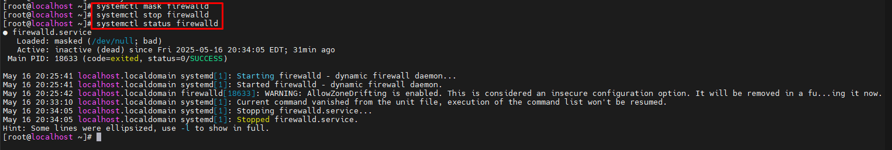
- Trước khi cấu hình iptables thực hiện xoá hết các rules cũ 
```
iptables -F
iptables -X
```
- 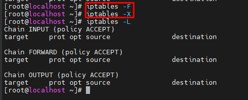
- Cấu hình 
	* Từ chối các kết nối đi tới.
		```
		iptables -P INPUT DROP
		```
		* `-P`: Đặt chính sách mặc định.
		* `INPUT`: Chuỗi xử lý gói tin đến.
		* `DROP`: Hành động: loại bỏ gói tin.
	* Cho phép gói tin đi ra từ hệ thống.
		```
		iptables -P OUTPUT ACCEPT
		```
		* `-P`: Đặt chính sách mặc định.
		* `OUTPUT`: Chuỗi xử lý gói đi ra.
		* `DROP`: Hành động: loại bỏ gói tin.
	* Cho phép thiết lập các kết nối đi vào hệ thống.
		```
		iptables -A INPUT -m state --state ESTABLISHED,RELATED -j ACCEPT
		```
		* -A INPUT: Thêm (append) một quy tắc vào cuối chuỗi INPUT (gói tin đến).
		* -m state: Sử dụng module mở rộng state để theo dõi trạng thái kết nối.
		* --state ESTABLISHED,RELATED: Lọc các gói tin thuộc về một kết nối đã được thiết lập (ESTABLISHED) hoặc liên quan đến một kết nối đã được thiết lập (ví dụ: FTP data connection - RELATED).
		* -j ACCEPT: Hành động: chấp nhận (cho phép) gói tin đi qua.
	* Chấp nhận các kết nối loopback
		```
		iptables -A INPUT -s 127.0.0.1 -d 127.0.0.1 -j ACCEPT
		```
		* -A INPUT: Thêm (append) một quy tắc vào cuối chuỗi INPUT (gói tin đến).
		* -s 127.0.0.1: Lọc các gói tin có địa chỉ nguồn là 127.0.0.1 (localhost/loopback).
		* -d 127.0.0.1: Lọc các gói tin có địa chỉ đích là 127.0.0.1 (localhost/loopback).
		* -j ACCEPT: Hành động: chấp nhận (cho phép) gói tin đi qua.
	* Chấp nhận kết nối SSH cho việc remote xuất phát từ mạng LAN.
		```
		iptables -A INPUT -p tcp -m state --state NEW -m tcp -s 192.168.100.0/24  -d 192.168.100.138 --dport 22 -j ACCEPT
		```
		* -A INPUT: Thêm (append) một quy tắc vào cuối chuỗi INPUT (gói tin đến).
		* -p tcp: Chỉ áp dụng cho giao thức TCP.
		* -m state: Sử dụng module state để theo dõi trạng thái kết nối.
		* --state NEW: Chỉ áp dụng cho các gói tin bắt đầu một kết nối mới.
		* -m tcp: Sử dụng module tcp (có thể không cần thiết ở đây vì đã có -p tcp).
		* -s 192.168.100.0/24: Lọc các gói tin có địa chỉ nguồn thuộc dải mạng 192.168.100.0/24.
		* -d 192.168.100.138: Lọc các gói tin có địa chỉ đích là 192.168.100.138.
		* --dport 22: Lọc các gói tin TCP có cổng đích là 22 (thường là SSH).
		* -j ACCEPT: Hành động: chấp nhận (cho phép) gói tin đi qua.
- 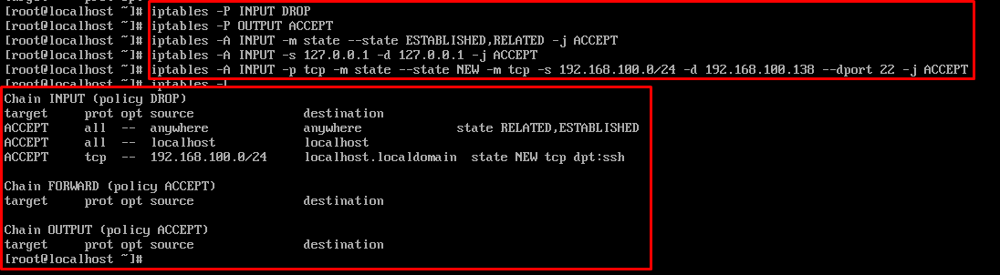
- Kiểm tra 
* Thêm card mạng vào máy CentOS7 có IP `172.16.10.128` và thực hiện ssh vào thu kết quả báo lỗi do rule đã set chỉ ssh được từ dải 192.168.100.0/24
- 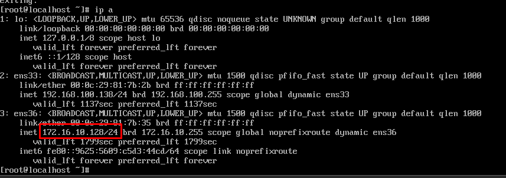
- 
* Từ máy client trong dải IP đã cho phép ssh thành công.
- 

<!-- TOC --><a name="12-nat-masquerade-for-internet-access"></a>
### 1.2 NAT: Masquerade for Internet Access 
- Mục tiêu: Cho phép máy trong LAN truy cập Internet thông qua NAT trên máy Linux.
- Cấu hình iptables: 
	* Từ chối các kết nối được chuyển hướng (FORWARD) theo mặc định.
	* Bật IP Forwarding trong kernel.
	* Thiết lập NAT (Masquerade)
	* Chấp nhận các gói tin đi qua Server từ mạng LAN.
- Mô hình 
- 
- Thực hiện trên CentOS7
- Mặc định CentOS7 sử dụng firewalld cần chạy lệnh disable firewalld để sử dụng iptables 
```
sudo systemctl mask firewalld
sudo systemctl stop firewalld
sudo systemctl status firewalld
``` 
- 
- Trước khi cấu hình iptables thực hiện xoá hết các rules cũ 
```
sudo iptables -F
sudo iptables -X
sudo iptables -t nat -F
sudo iptables -t nat -X
```
- 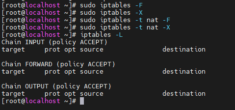
- Cấu hình 
	* Từ chối các kết nối được chuyển hướng (FORWARD) theo mặc định.
		```
		sudo iptables -P FORWARD DROP
		sudo iptables -P INPUT ACCEPT
		sudo iptables -P OUTPUT ACCEPT
		```
		* `-P`: Đặt chính sách mặc định.
		* `INPUT/FORWARD/OUTPUT`: Chuỗi xử lý gói tin.
		* `DROP`: Hành động: loại bỏ gói tin.
	* Bật IP Forwarding trong kernel.
		```
		sudo sysctl -w net.ipv4.ip_forward=1
		```
	* Chấp nhận các gói tin đi qua Server từ mạng LAN.
		```
		sudo iptables -A FORWARD -i ens36 -o ens33 -j ACCEPT
		```
		* -A FORWARD: Thêm (append) một quy tắc mới vào cuối chuỗi FORWARD. Chuỗi FORWARD xử lý các gói tin đi qua hệ thống (không phải đến hoặc đi từ chính hệ thống).
		* -i ens36: Chỉ định giao diện mạng đầu vào (input interface) là ens36. Quy tắc này chỉ áp dụng cho các gói tin đi vào hệ thống thông qua giao diện ens36.
		* -o ens33: Chỉ định giao diện mạng đầu ra (output interface) là ens33. Quy tắc này chỉ áp dụng cho các gói tin sau đó được định tuyến ra thông qua giao diện ens33.
		* -j ACCEPT: Hành động: chấp nhận (cho phép) gói tin đi qua.
		```
		sudo iptables -A FORWARD -i ens33 -o ens36 -m state --state RELATED,ESTABLISHED -j ACCEPT
		```
		* -A FORWARD: Thêm (append) một quy tắc mới vào cuối chuỗi FORWARD.
		* -i ens33: Chỉ định giao diện mạng đầu vào là ens33. Quy tắc này chỉ áp dụng cho các gói tin đi vào hệ thống thông qua giao diện ens33.
		* -o ens36: Chỉ định giao diện mạng đầu ra là ens36. Quy tắc này chỉ áp dụng cho các gói tin sau đó được định tuyến ra thông qua giao diện ens36.
		* -m state: Sử dụng module mở rộng state để theo dõi trạng thái kết nối.
		* --state RELATED,ESTABLISHED: Lọc các gói tin thuộc về một kết nối đã được thiết lập (ESTABLISHED) hoặc liên quan đến một kết nối đã được thiết lập (RELATED).
		* -j ACCEPT: Hành động: chấp nhận (cho phép) gói tin đi qua.
	* Thiết lập NAT (Masquerade)
		```
		sudo iptables -t nat -A POSTROUTING -o ens33 -j MASQUERADE
		```
		* -t nat: Chỉ định bảng NAT (Network Address Translation). Bảng này được sử dụng để thay đổi địa chỉ IP và cổng của các gói tin.
		* -A POSTROUTING: Thêm (append) một quy tắc vào cuối chuỗi POSTROUTING. Chuỗi này xử lý các gói tin ngay trước khi chúng rời khỏi hệ thống.
		* -o ens33: Chỉ định giao diện mạng ra (output interface) là ens33. Quy tắc này chỉ áp dụng cho các gói tin đi ra thông qua giao diện ens33.
		* -j MASQUERADE: Hành động: thực hiện MASQUERADE. MASQUERADE là một dạng của SNAT (Source Network Address Translation) động. Nó sẽ tự động thay đổi địa chỉ IP nguồn của các gói tin đi ra thông qua giao diện ens33 thành địa chỉ IP công cộng 
- 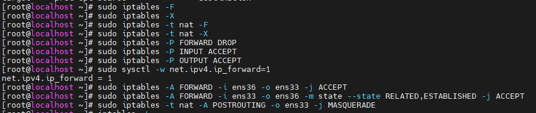
- Kiểm tra kết quả từ máy client truy cập được mạng Internet thông qua máy CentOS
- 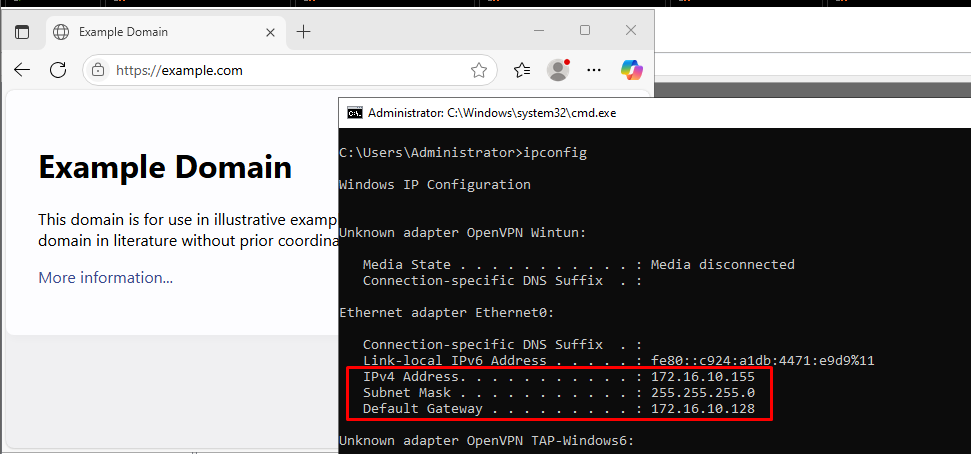

<!-- TOC --><a name="13-cho-phép-truy-cp-lan-t-internet-thông-qua-port-forwarding-vi-iptables"></a>
### 1.3  Cho phép truy cập LAN từ Internet thông qua Port Forwarding với iptables
- Mục tiêu: Từ internet qua iptables truy cập được vào IISWebserver trong LAN 
- Cấu hình iptables 
	* Mặc định từ chối các kết nối đến hệ thống.
	* Mặc định chấp nhận các kết nối đi ra khỏi hệ thống.
	* Mặc định từ chối các kết nối được chuyển hướng.
	* Cho phép các kết nối được thiết lập
	* Cho phép các kết nối từ loopback
	* Chuyển kết nối đến interface ens36 port 80 đến port 80 trên IISWebserver.
- Mô hình 
- 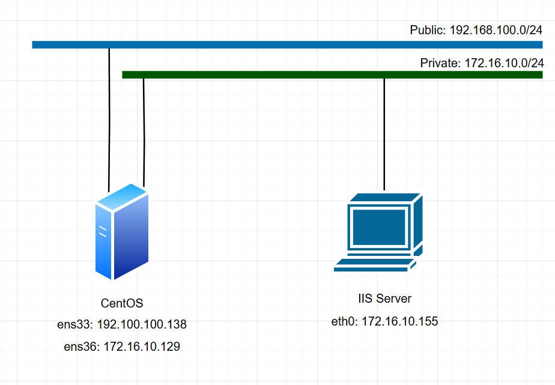
- Thực hiện trên CentOS7
- Mặc định CentOS7 sử dụng firewalld cần chạy lệnh disable firewalld để sử dụng iptables 
```
sudo systemctl mask firewalld
sudo systemctl stop firewalld
sudo systemctl status firewalld
``` 
- 
- Cấu hình 
	* Mặc định từ chối các kết nối đến hệ thống.
		```
		iptables -P INPUT DROP
		```
	* Mặc định chấp nhận các kết nối đi ra khỏi hệ thống.
		```
		iptables -P OUTPUT ACCEPT
		```
	* Mặc định từ chối các kết nối được chuyển hướng.
		```
		iptables -P FORWARD DROP
		```
	* Cho phép các kết nối được thiết lập
		```
		iptables -A FORWARD -i ens33 -o ens36 -s 172.16.10.0/24 -j ACCEPT
		```
		* -A FORWARD: Thêm (append) một quy tắc vào cuối chuỗi FORWARD (xử lý các gói tin đi qua hệ thống).
		* -i ens33: Chỉ định giao diện mạng đầu vào (input interface) là ens33. Quy tắc này chỉ áp dụng cho các gói tin đi vào hệ thống thông qua ens33.
		* -o ens36: Chỉ định giao diện mạng đầu ra (output interface) là ens36. Quy tắc này chỉ áp dụng cho các gói tin sau đó được định tuyến ra qua ens36.
		* -s 172.16.10.0/24: Lọc các gói tin có địa chỉ nguồn thuộc dải mạng 172.16.10.0/24.
		* -j ACCEPT: Hành động: chấp nhận (cho phép) gói tin đi qua.
		```
		iptables -A FORWARD -m state --state ESTABLISHED,RELATED -j ACCEPT
		```
		* -A FORWARD: Thêm (append) một quy tắc vào cuối chuỗi FORWARD (xử lý các gói tin đi qua hệ thống).
		* -m state: Sử dụng module mở rộng state để theo dõi trạng thái kết nối.
		* --state ESTABLISHED,RELATED: Lọc các gói tin thuộc về một kết nối đã được thiết lập (ESTABLISHED) hoặc liên quan đến một kết nối đã được thiết lập (RELATED).
		* -j ACCEPT: Hành động: chấp nhận (cho phép) gói tin đi qua.
	* Cho phép các kết nối từ loopback
		```
		iptables -A INPUT -s 127.0.0.1 -d 127.0.0.1 -j ACCEPT
		```
		* -A INPUT: Thêm (append) một quy tắc vào cuối chuỗi INPUT (gói tin đến hệ thống).
		* -s 127.0.0.1: Lọc các gói tin có địa chỉ nguồn là 127.0.0.1 (localhost/loopback).
		* -d 127.0.0.1: Lọc các gói tin có địa chỉ đích là 127.0.0.1 (localhost/loopback).
		* -j ACCEPT: Hành động: chấp nhận (cho phép) gói tin đi vào.
		```
		iptables -A INPUT -m state --state ESTABLISHED,RELATED -j ACCEPT
		```
		* -A INPUT: Thêm (append) một quy tắc vào cuối chuỗi INPUT (gói tin đến hệ thống).
		* -m state: Sử dụng module mở rộng state để theo dõi trạng thái kết nối.
		* --state ESTABLISHED,RELATED: Lọc các gói tin thuộc về một kết nối đã được thiết lập (ESTABLISHED) hoặc liên quan đến một kết nối đã được thiết lập (RELATED).
		* -j ACCEPT: Hành động: chấp nhận (cho phép) gói tin đi vào.
	* Chấp nhận kết nối chuyển hướng đến port 80 trên IISWebserver
		```
		iptables -A FORWARD -p tcp -d 172.16.10.155 --dport 80 -j ACCEPT
		```
		* -A FORWARD: Thêm (append) một quy tắc vào cuối chuỗi FORWARD (xử lý các gói tin đi qua hệ thống).
		* -p tcp: Chỉ áp dụng cho giao thức TCP.
		* -d 172.16.10.155: Lọc các gói tin có địa chỉ đích là 172.16.10.155.
		* --dport 80: Lọc các gói tin TCP có cổng đích là 80 (thường là HTTP).
		* -j ACCEPT: Hành động: chấp nhận (cho phép) gói tin đi qua.

	* Chuyển kết nối đến interface ens36 port 80 đến port 80 trên IISWebserver.
		```
		iptables -t nat -A PREROUTING -p tcp -d 192.168.100.138 --dport 80 -j DNAT --to-destination 172.16.10.155:80
		```
		* -t nat: Chỉ định bảng NAT (Network Address Translation).
		* -A PREROUTING: Thêm (append) một quy tắc vào cuối chuỗi PREROUTING. Chuỗi này xử lý các gói tin ngay khi chúng vừa đến hệ thống.
		* -p tcp: Chỉ áp dụng cho giao thức TCP.
		* -d 192.168.100.138: Lọc các gói tin có địa chỉ đích là 192.168.100.138.
		* --dport 80: Lọc các gói tin TCP có cổng đích là 80 (thường là HTTP).
		* -j DNAT: Hành động: thực hiện Destination Network Address Translation (DNAT). DNAT thay đổi địa chỉ đích của gói tin.
		* --to-destination 172.16.10.155:80: Chỉ định địa chỉ IP và cổng đích mới cho gói tin. Trong trường hợp này, địa chỉ đích sẽ được thay đổi thành 172.16.10.155 và cổng đích vẫn là 80.
		```
		iptables -t nat -A POSTROUTING -p tcp -d 172.16.10.155 --dport 80 -j SNAT --to-source 172.16.10.128
		```
		* -t nat: Chỉ định bảng NAT (Network Address Translation).
		* -A POSTROUTING: Thêm (append) một quy tắc vào cuối chuỗi POSTROUTING. Chuỗi này xử lý các gói tin ngay trước khi chúng rời khỏi hệ thống.
		* -p tcp: Chỉ áp dụng cho giao thức TCP.
		* -d 172.16.10.155: Lọc các gói tin có địa chỉ đích là 172.16.10.155.
		* --dport 80: Lọc các gói tin TCP có cổng đích là 80.
		* -j SNAT: Hành động: thực hiện Source Network Address Translation (SNAT). SNAT thay đổi địa chỉ nguồn của gói tin.
		* --to-source 172.16.10.129: Chỉ định địa chỉ IP nguồn mới cho gói tin. Trong trường hợp này, địa chỉ nguồn sẽ được thay đổi thành 172.16.10.128.
- 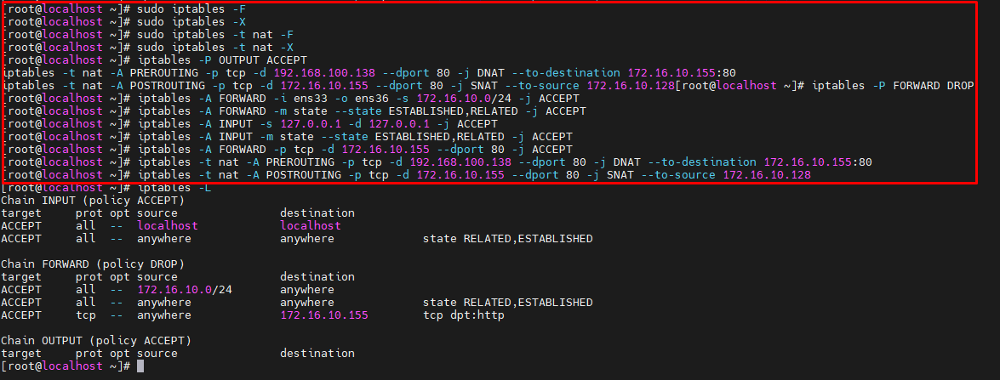
- Kiểm tra kết quả từ máy ngoài truy cập vào ip của máy iptables hiển thị webpage của IISServer trong LAN 
- 

<!-- TOC --><a name="2-firewalld"></a>
## 2. firewalld
<!-- TOC --><a name="21-cho-phép-máy-trong-lan-truy-cp-internet-thông-qua-nat-trên-máy-linux"></a>
### 2.1 Cho phép máy trong LAN truy cập Internet thông qua NAT trên máy Linux 
- Mục tiêu: Máy client trong LAN có thể truy cập internet thông qua NAT trên Linux 
- Thực hiện trên CentOS với firewalld có 2 interface ens33 (Internet) ens36 (Local)
- Cấu hình firewalld
	* Gán các zone tương ứng cho các interface
		```
		sudo firewall-cmd --permanent --change-interface=ens33 --zone=public
		sudo firewall-cmd --permanent --change-interface=ens36 --zone=internal
		```
		* --permanent: Tùy chọn này chỉ định rằng các thay đổi được thực hiện sẽ được lưu vào cấu hình vĩnh viễn của firewalld. Nếu bạn bỏ qua tùy chọn này, các thay đổi chỉ có hiệu lực cho phiên hiện tại và sẽ bị mất sau khi khởi động lại hoặc tải lại tường lửa.
		* --change-interface=ens33: Tùy chọn này chỉ định giao diện mạng mà bạn muốn thay đổi zone. Trong trường hợp này, đó là giao diện ens33/ens36.
		* --zone=public: Tùy chọn này chỉ định zone mà bạn muốn gán cho giao diện ens33/ens36. Ở đây, bạn đang gán nó vào zone public/internal.

	* Enable Masquerade cho zone public của interface kết nối với internet 
		```
		sudo firewall-cmd --permanent --zone=public --add-masquerade
		```
		* --permanent: Chỉ định rằng thay đổi này sẽ được lưu vào cấu hình vĩnh viễn của firewalld.
		* --zone=public: Chỉ định zone mà bạn muốn tác động, trong trường hợp này là zone public.
		* --add-masquerade: Tùy chọn này kích hoạt tính năng masquerade cho zone được chỉ định.
		* Ý nghĩa của lệnh:	Khi tính năng masquerade được bật cho một zone, bất kỳ lưu lượng truy cập nào đi ra từ một giao diện được gán cho zone đó sẽ có địa chỉ IP nguồn được thay đổi thành địa chỉ IP của chính giao diện đó. 
	* Reload và kiểm tra 
	```
	sudo firewall-cmd --reload
	sudo firewall-cmd --list-all --zone=public
	```
- 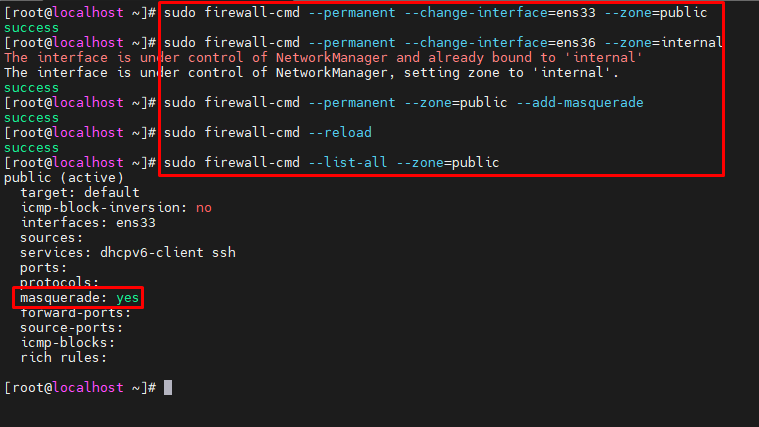
- Kiểm tra kết quả từ máy client truy cập được mạng Internet thông qua máy CentOS
- 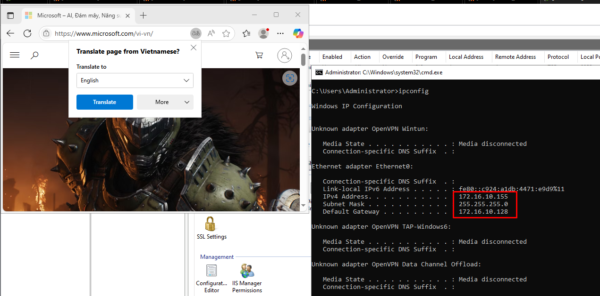

<!-- TOC --><a name="22-cho-phép-truy-cp-web-server-lan-t-internet"></a>
### 2.2 Cho phép truy cập Web Server LAN từ Internet  
- Mục tiêu: Từ internet qua firewalld truy cập được vào IISWebserver trong LAN 
- Thực hiện trên CentOS với firewalld có 2 interface ens33 (Internet) ens36 (Local)
- Cấu hình firewalld
	* Gán các zone tương ứng cho các interface
		```
		sudo firewall-cmd --permanent --change-interface=ens33 --zone=public
		sudo firewall-cmd --permanent --change-interface=ens36 --zone=internal
		```
		* --permanent: Tùy chọn này chỉ định rằng các thay đổi được thực hiện sẽ được lưu vào cấu hình vĩnh viễn của firewalld. Nếu bạn bỏ qua tùy chọn này, các thay đổi chỉ có hiệu lực cho phiên hiện tại và sẽ bị mất sau khi khởi động lại hoặc tải lại tường lửa.
		* --change-interface=ens33: Tùy chọn này chỉ định giao diện mạng mà bạn muốn thay đổi zone. Trong trường hợp này, đó là giao diện ens33/ens36.
		* --zone=public: Tùy chọn này chỉ định zone mà bạn muốn gán cho giao diện ens33/ens36. Ở đây, bạn đang gán nó vào zone public/internal.
	* Thực hiện Port Forwarding (Port Redirection) trên zone public
		```
		sudo firewall-cmd --permanent --zone=public --add-forward-port=port=80:proto=tcp:toport=80:toaddr=172.16.10.155
		```
		* --permanent: Chỉ định rằng thay đổi này sẽ được lưu vào cấu hình vĩnh viễn.
		* --zone=public: Chỉ định zone mà bạn muốn áp dụng quy tắc chuyển tiếp cổng, trong trường hợp này là public.
		* --add-forward-port=...: Tùy chọn này dùng để thêm một quy tắc chuyển tiếp cổng. Các tham số đi kèm bao gồm:
		* port=80: Cổng nguồn (cổng mà lưu lượng đến trên giao diện thuộc zone public).
		* proto=tcp: Giao thức áp dụng cho việc chuyển tiếp (ở đây là TCP).
		* toport=80: Cổng đích trên địa chỉ IP được chuyển tiếp đến (ở đây vẫn là cổng 80). Nếu bạn muốn chuyển tiếp đến một cổng khác, bạn có thể thay đổi giá trị này.
		* toaddr=172.16.10.155: Địa chỉ IP đích mà lưu lượng sẽ được chuyển tiếp đến.
	* Cho phép dịch vụ HTTP và/hoặc HTTPS trên zone public
		```
		sudo firewall-cmd --permanent --zone=public --add-service=http
		```
		* --permanent: Chỉ định rằng thay đổi này sẽ được lưu vào cấu hình vĩnh viễn.
		* --zone=public: Chỉ định zone mà bạn muốn áp dụng quy tắc, trong trường hợp này là public.
		* --add-service=http: Tùy chọn này cho phép lưu lượng truy cập cho dịch vụ được chỉ định. firewalld có các định nghĩa sẵn cho nhiều dịch vụ phổ biến, bao gồm http, https, ssh, ftp, v.v. Định nghĩa cho dịch vụ http thường bao gồm cổng TCP 80.
	* Reload và kiểm tra 
	```
	sudo firewall-cmd --reload
	sudo firewall-cmd --list-all --zone=public
	```
- 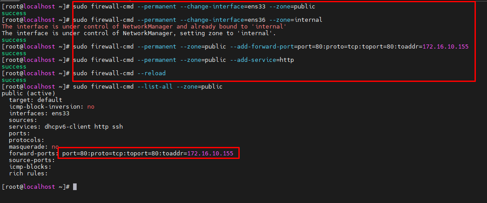
- Kiểm tra kết quả từ máy ngoài truy cập vào ip của máy firewalld hiển thị webpage của IISServer trong LAN 
- 

<!-- TOC --><a name="3-ufw"></a>
## 3. ufw
- Cài đặt 
```
sudo apt install ufw -y 
```
<!-- TOC --><a name="31-cho-phép-máy-trong-lan-truy-cp-internet-thông-qua-nat-trên-máy-linux"></a>
### 3.1 Cho phép máy trong LAN truy cập Internet thông qua NAT trên máy Linux 
- Mục tiêu: Máy client trong LAN có thể truy cập internet thông qua NAT trên Linux 
- 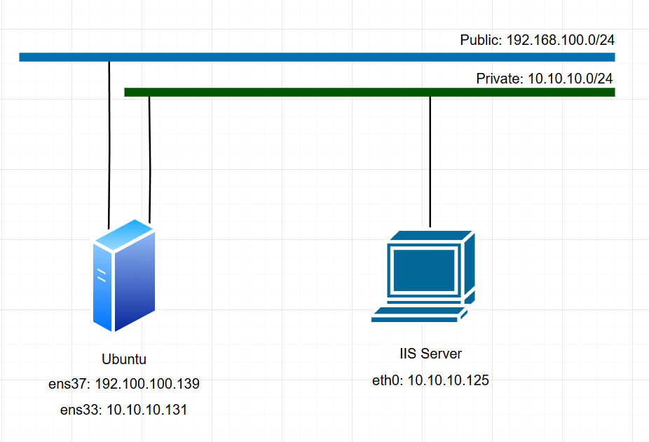
- Thực hiện trên Ubuntu với ufw có 2 interface ens37 (Internet) ens33 (Local)
- Cấu hình 
	* Enable Forward policy 
	
	* Bật IP Forwarding trong kernel.
		```
		sudo sysctl -w net.ipv4.ip_forward=1
		```
	* Sửa file rule cho phép máy client trong LAN có thể truy cập Internet qua máy Ubuntu 
		```
		nano /etc/ufw/before.rules
		````
	* Thêm những dòng sau vào cuối file
		```
		# add to the end
		# NAT
		*nat
		-F
		:POSTROUTING ACCEPT [0:0]
		-A POSTROUTING -s 10.10.10.0/24 -o ens37 -j MASQUERADE
		COMMIT
		```
		- *nat: Chọn bảng NAT để cấu hình.
		- -F: Xóa toàn bộ quy tắc hiện có trong bảng NAT.
		- :POSTROUTING ACCEPT [0:0]: Đặt chính sách mặc định cho chain POSTROUTING là ACCEPT.
		- -A POSTROUTING -s 10.10.10.0/24 -o ens37 -j MASQUERADE: Thêm quy tắc NAT nguồn (MASQUERADE) cho mạng 10.10.10.0/24 đi ra interface ens37.
		- COMMIT: Lưu các thay đổi (cho nftables backend).
	* Apply cấu hình 
	```
	ufw reload 
	```
- 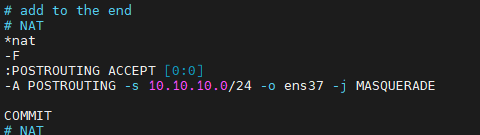
- Kiểm tra kết quả từ máy client truy cập được mạng Internet thông qua máy Ubuntu 
- 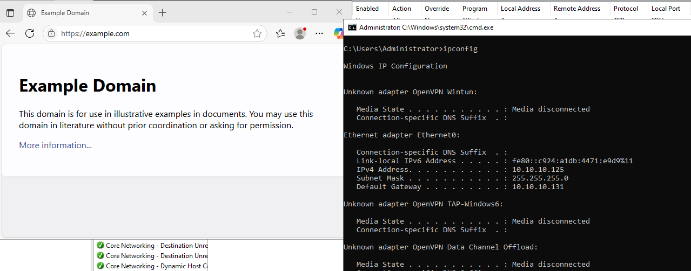

<!-- TOC --><a name="22-cho-phép-truy-cp-web-server-lan-t-internet-1"></a>
### 2.2 Cho phép truy cập Web Server LAN từ Internet  
- Mục tiêu: Từ internet qua ufw truy cập được vào IISWebserver trong LAN 
- Thực hiện trên Ubunt với firewalld có 2 interface ens37 (Internet) ens33 (Local)
- Cấu hình 
	* Cho phép dịch vụ 	`http`
		```
		ufw allow http
		```
	* Sửa file rule cho phép truy cập webserver trong LAN từ Internet
		```
		nano /etc/ufw/before.rules
		```
	* Thêm những dòng sau vào cuối file 
		```
		*nat
		-F
		:POSTROUTING ACCEPT [0:0]
		# add rules
		:PREROUTING ACCEPT [0:0]

		-A PREROUTING -p tcp --dst 192.168.100.139 -m multiport --dports 22,80 -j DNAT --to-destination 10.10.10.125
		-A POSTROUTING -p tcp --dst 10.10.10.125 -m multiport --dports 22,80 -j SNAT --to-source 10.10.10.131
		-A POSTROUTING -s 10.10.10.0/24 -o ens37 -j MASQUERADE

		COMMIT
		```
		- *nat: Chọn bảng NAT.
		- -F: Xóa hết quy tắc NAT.
		- :POSTROUTING ACCEPT [0:0]: Chấp nhận mặc định ở POSTROUTING (sau routing, trước khi ra ngoài).
		- :PREROUTING ACCEPT [0:0]: Chấp nhận mặc định ở PREROUTING (khi gói tin đến).
		- -A PREROUTING -p tcp --dst 192.168.100.139 -m multiport --dports 22,80 -j DNAT --to-destination 10.10.10.125: Chuyển hướng TCP port 22 và 80 đến 192.168.100.139 sang 10.10.10.125.
		- -A POSTROUTING -p tcp --dst 10.10.10.125 -m multiport --dports 22,80 -j SNAT --to-source 10.10.10.131: Đổi nguồn các gói tin TCP đến 10.10.10.125:22,80 thành 10.10.10.131 khi đi ra.
		- -A POSTROUTING -s 10.10.10.0/24 -o ens37 -j MASQUERADE: NAT các gói tin từ mạng 10.10.10.0/24 đi ra ens37 bằng IP của ens37.
		- COMMIT: Lưu thay đổi.
	* Apply cấu hình
	```
	ufw reload
	```
- 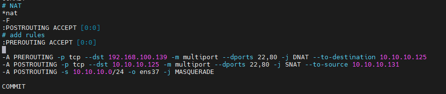
- Kiểm tra kết quả từ máy ngoài truy cập vào ip của máy ufw hiển thị webpage của IISServer trong LAN 
- 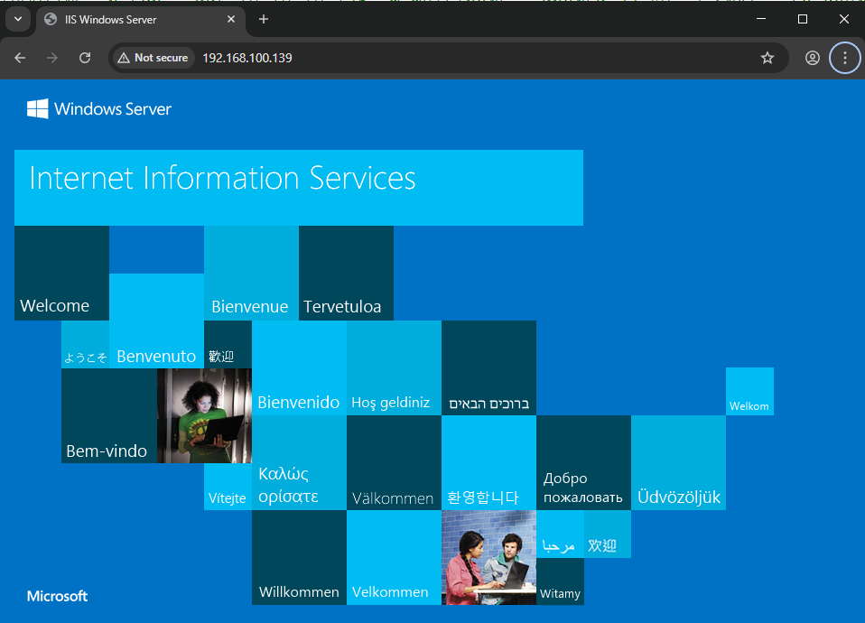
<!-- TOC --><a name="4-csf"></a>
## 4. csf
- Cài đặt 
```
wget https://download.configserver.com/csf.tgz && tar -xzf csf.tgz  && cd csf && sh install.sh
```
- 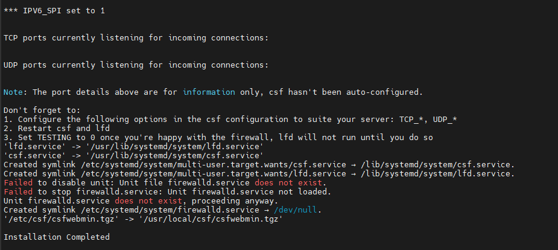

- Bỏ testing mode: mở file: csf.conf và chỉnh sửa 
- 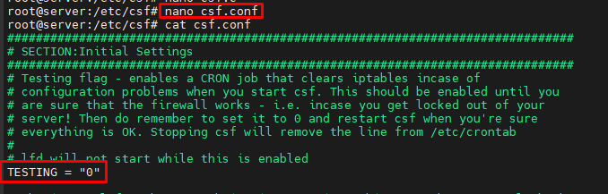
<!-- TOC --><a name="41-thit-lp-và-kim-soát-truy-cp-c-bn-vi-csf"></a>
### 4.1 Thiết lập và Kiểm soát Truy Cập Cơ Bản với CSF
- Mục tiêu:
	* Cài đặt và khởi động CSF Firewall trên máy chủ Linux ảo.
	* Mở và kiểm tra khả năng truy cập các cổng dịch vụ thiết yếu (SSH, HTTP, HTTPS).
	* Chặn và gỡ chặn một địa chỉ IP cụ thể để hiểu cơ chế hoạt động.
- Thực hiện trên máy Ubuntu cài CSF 
- Cấu hình 
	* Chỉnh sửa file csf.conf để mở các cổng 22, 80 trong TCP_IN và TCP_OUT. Khởi động lại CSF.
		```
		nano /etc/csf/csf.conf
		```
		- 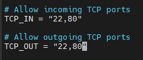
	* Apply cấu hình
	```
	csf -r
	```
	* Chặn IP: Sử dụng lệnh csf -d <IP_máy_khách> trên máy chủ ảo.
		```
		csf -d 192.168.100.215
		```
		- 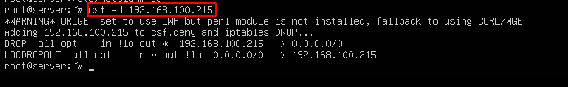
	* Kết quả không sử dụng được dịch vụ web, không ssh được từ client có IP bị chặn 
		- 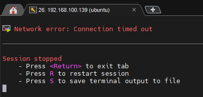
		- 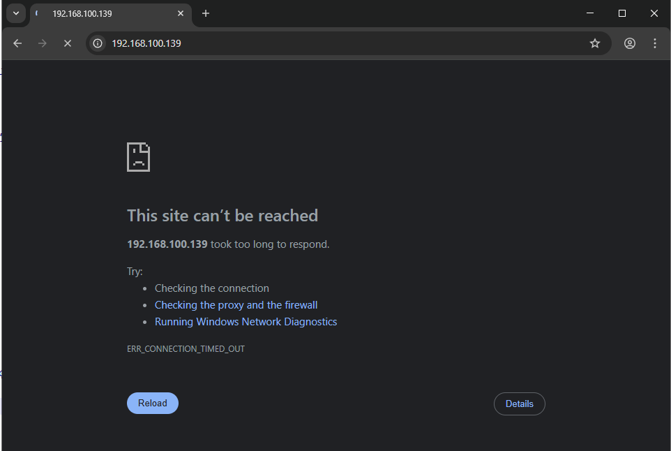
	* Bỏ chặn Sử dụng lệnh csf -dr <IP_máy_khách> trên máy chủ ảo.
		```
		csf -dr 192.168.100.215
		```
		- 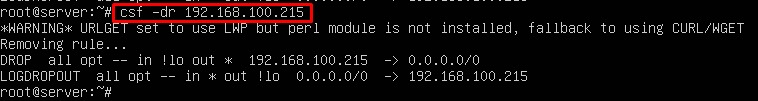
	* Kiểm tra đã ssh được và truy cập được dịch vụ web 
		- 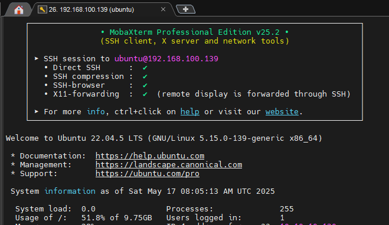
		- 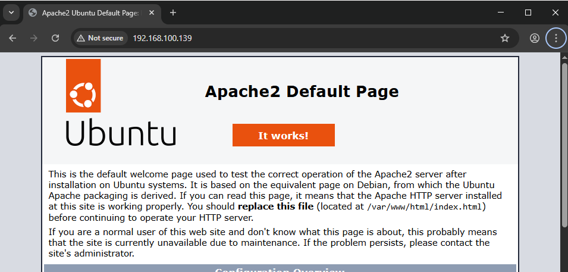
		
		
<!-- TOC --><a name="42-bo-v-chng-tn-công-flood-và-gii-hn-kt-ni"></a>
### 4.2 Bảo vệ Chống Tấn Công Flood và Giới Hạn Kết Nối
- Mục tiêu 
	* Cấu hình và kiểm tra khả năng bảo vệ chống lại các cuộc tấn công flood vào port 	`Portflood CSF`
- Thực hiện trên máy Ubuntu cài CSF 
- Cấu hình 
	* Cấu hình PORTFLOOD : Trong csf.conf, đặt giá trị cho PORTFLOOD  (ví dụ: PORTFLOOD = "80;tcp;20;5""). Khởi động lại CSF.
	```
	nano /etc/csf/csf.conf
	csf -r
	```
	- 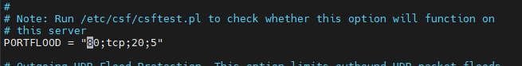
	
	* Kiểm tra: Từ máy client `192.168.100.133`, tạo nhiều kết nối đồng thời đến cổng 80 của máy chủ ảo bằng script và quan sát hành vi của CSF (kiểm tra log /var/log/lfd.log /var/log/syslog).
	* Nội dung script
	```
	import socket
	import time

	def test_tcp_flood(target_ip, target_port=80, num_connections=25, delay=0.1):
		sockets = []
		print(f"[+] Đang thử mở {num_connections} kết nối TCP đến {target_ip}:{target_port}...")

		for i in range(num_connections):
			try:
				s = socket.socket(socket.AF_INET, socket.SOCK_STREAM)
				s.settimeout(1)
				s.connect((target_ip, target_port))
				sockets.append(s)
				print(f"[{i+1}/{num_connections}] Kết nối thành công")
			except Exception as e:
				print(f"[{i+1}/{num_connections}] Lỗi: {e}")
			time.sleep(delay)  # Delay nhỏ giữa các kết nối

		print("[*] Đợi 5 giây giữ kết nối mở...")
		time.sleep(5)

		# Đóng tất cả kết nối
		for s in sockets:
			try:
				s.close()
			except:
				pass

		print("[+] Đã đóng tất cả kết nối.")

	# Ví dụ chạy tool
	if __name__ == "__main__":
		target_ip = "192.168.100.139"  # Thay bằng IP của máy chủ bạn cần test
		test_tcp_flood(target_ip)
	```
	- 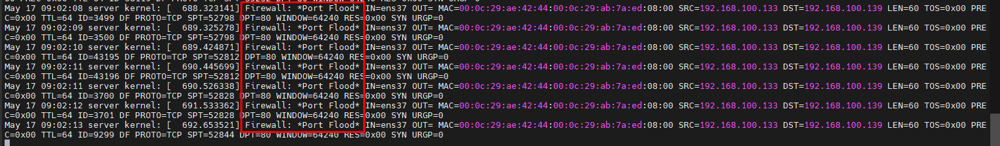
	- Kết quả csf kích hoạt tính năng từ chối kết nối. 
<!-- TOC --><a name="43-block-nu-ng-nhp-các-dch-v-tht-bi"></a>
### 4.3 Block nếu đăng nhập các dịch vụ thất bại
- Mục tiêu 
	* Cấu hình và kiểm tra khả năng giám sát bảo vệ đăng nhập thất bại quá nhiều
- Thực hiện trên máy Ubuntu cài CSF 
- Cấu hình 
	* Cấu hình LF_ : Trong csf.conf, đặt giá trị cho LF_TRIGGER, LF_SSHD, LF_SSHD_PERM Khởi động lại CSF.
	```
	nano /etc/csf/csf.conf
	```
	```
	#KÍCH HOẠT GIÁM SÁT LOGIN
	LF_TRIGGER = "1"

	#Block nếu đăng nhập ssh sai 3 lần
	LF_SSHD = "5"
	LF_SSHD_PERM = "1"
	```
	- 
	* Kiểm tra: từ máy client `192.168.100.133` thực hiện test ssh vào máy Ubuntu sai password và bị chặn 
	```
	tail -f /var/log/lfd.log
	```
	- 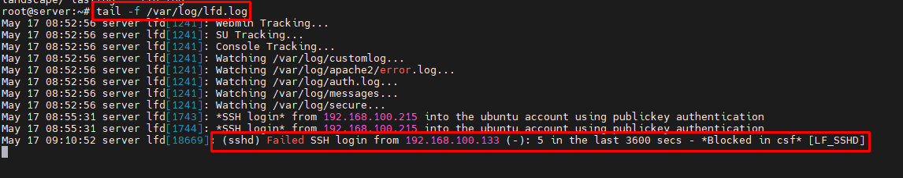

<!-- TOC --><a name="3-apf"></a>
## 3. apf
- Cài đặt trên CentOS
```
wget http://www.rfxnetworks.com/downloads/apf-current.tar.gz
tar -xzvf 
```
- 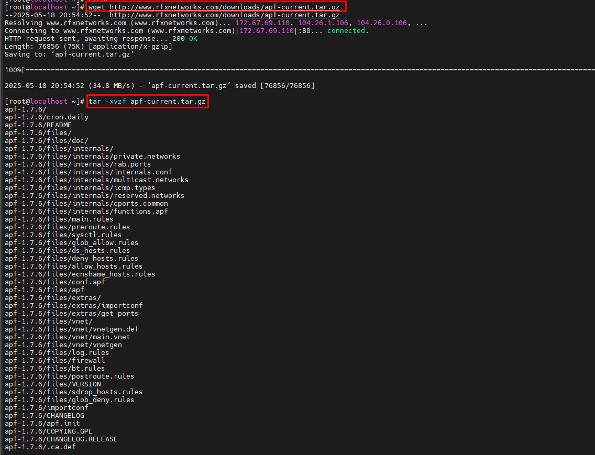
- Chạy script cài đặt 
```
cd apf-1.7.6/
./install.sh
```
- 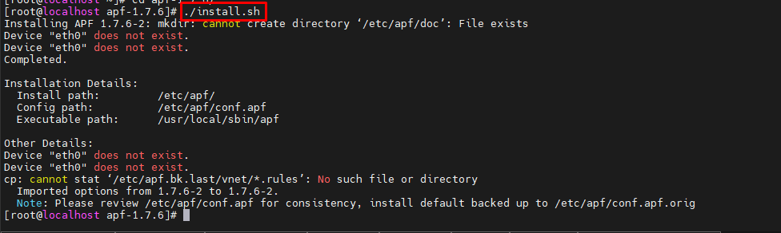
- Chỉnh sửa cấu hình fix lỗi `Device "eth0" does not exist.`
```
nano /etc/apf/conf.apf 
```
- Chỉnh sửa `DEVEL_MODE=”0″` để tắt chế độ dev, chỉnh sửa IFACE về dùng với iface của hệ thống, trong ví dụ này là ens33 
- 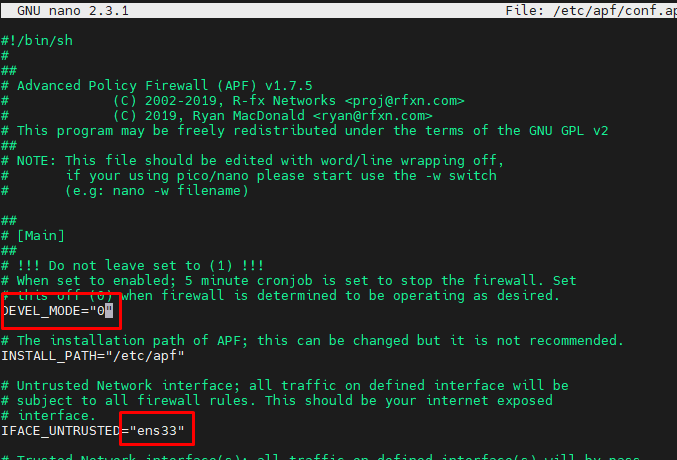
- Khởi động lại apf để apply
```
apf -r
```
- 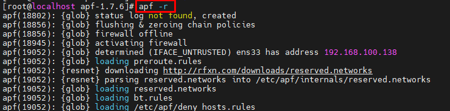
<!-- TOC --><a name="31-qun-lý-whitelistblacklist-ca-apf"></a>
### 3.1 Quản lý whitelist/blacklist của apf 
- Mục tiêu chặn/ bỏ chặn địa chỉ IP cụ thể tới máy cài apf, kiểm tra file allow_hosts,deny_hosts và log của apf
- Thực hiện trên máy CentOS đã cài `apf`
- Cấu hình 
	* Chặn IP: Để chặn IP sử dụng lệnh `apf -d [IP]`	
		```
		apf -d 192.168.100.139
		```
		- 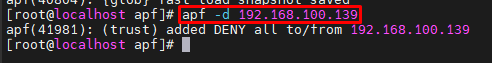
	* File `deny_hosts.rules`
		- 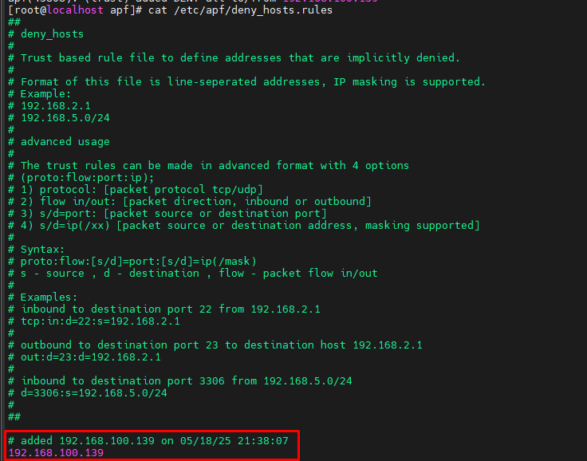
	* Kiểm tra trước và sau khi bị chặn client *139 không truy cập được
	- 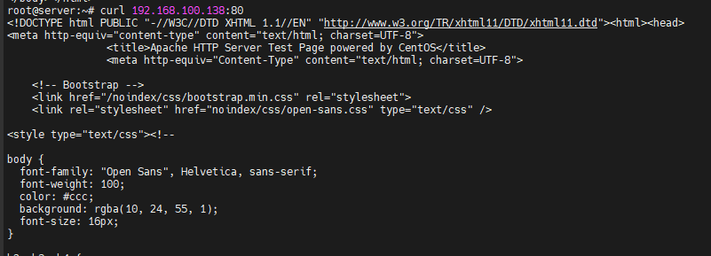
	- 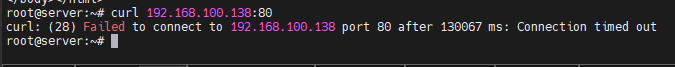
	* Bỏ chặn IP: Để bỏ chặn IP sử dụng lệnh `apf -a [IP]`	
		```
		apf -u 192.168.100.139
		```
		- 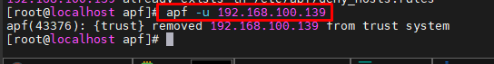
	* Kiểm tra trước và sau khi bị chặn client *139 không truy cập được
	- 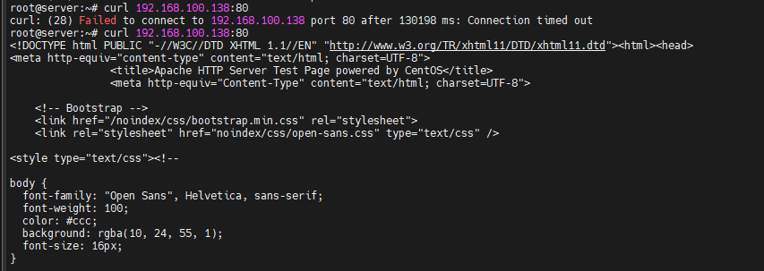
	* Allow Trust IP: Để thêm IP vào danh sách trust `apf -a [IP]`
		```
		apf -a 192.168.100.139
		```
		- 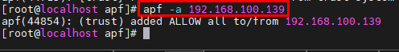	
	* File `allow_hosts.rules`
		- 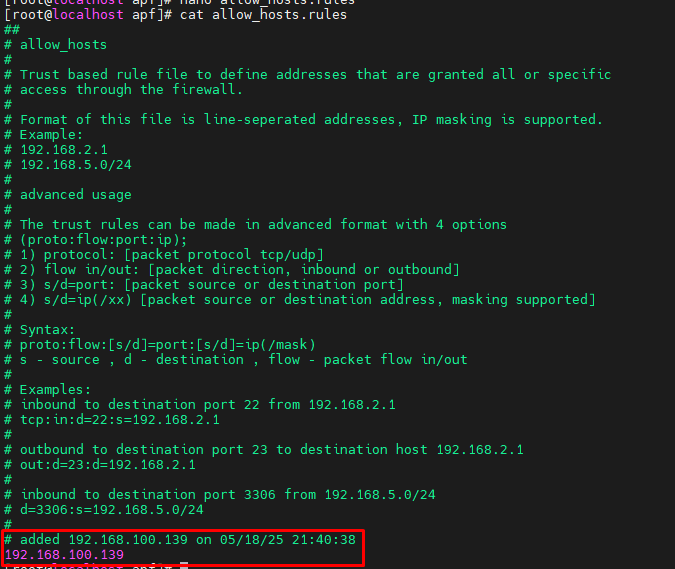
<!-- TOC --><a name="32-qun-lý-quy-tc-tng-la-c-bn"></a>
### 3.2 Quản lý Quy tắc Tường lửa Cơ bản 
- Mục tiêu : Chỉnh sửa conf.apf để chỉ cho phép truy cập SSH (cổng 22) và HTTP (cổng 80) đến máy chủ không cho phép ping tới máy chủ 
- Thực hiện trên máy CentOS đã cài `apf`
- Cấu hình 
	* Chỉnh sửa file cấu hình cho phép TCP 22,80, bật chế độ lọc OUTPUT, Không cho phép ping (icmp_
		```
		nano /etc/apf/conf.apf
		```
		- 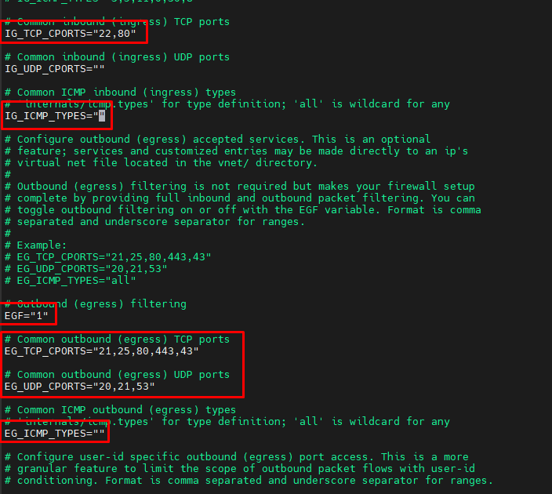
		* IG_TCP_CPORTS="22,80": Cho phép kết nối TCP đến ở cổng 22 (SSH) và 80 (HTTP).
		* IG_UDP_CPORTS="": Không cho phép kết nối UDP đến ở bất kỳ cổng nào theo cấu hình chung.
		* IG_ICMP_TYPES="": Không cho phép bất kỳ loại tin nhắn ICMP nào đến.
		* EGF="1": Bật lọc lưu lượng đi ra.
		* EG_TCP_CPORTS="21,25,80,443,43": Cho phép kết nối TCP đi ra đến các cổng 21 (FTP), 25 (SMTP), 80 (HTTP), 443 (HTTPS), và 43 (WHOIS).
		* EG_UDP_CPORTS="20,21,53": Cho phép kết nối UDP đi ra đến các cổng 20 (FTP data), 21 (FTP control), và 53 (DNS).
		* EG_ICMP_TYPES="": Không cho phép gửi bất kỳ loại tin nhắn ICMP nào đi ra.
	* Kiểm tra dịch vụ web có thể truy cập, không thể ping 
	- 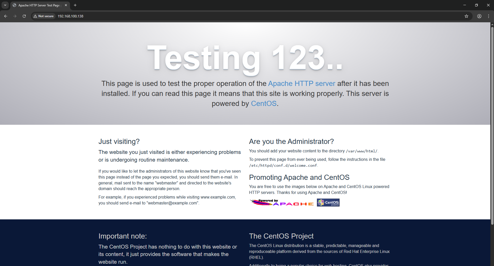
	- 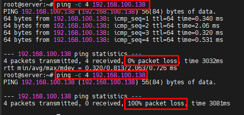
	
	
<!-- TOC --><a name="references"></a>
## References
1.  [Tổng quan về IPTables: Cơ chế hoạt động và ứng dụng](https://nhanhoa.com/tin-tuc/iptables-la-gi.html)
2.  [Prereq Firewalld Forwarding](https://docs.mulesoft.com/runtime-fabric/latest/prereq-firewalld-forwarding)
3.  [Firewall Phần 4: Xây dựng mô hình Firewall với Firewalld Service](https://news.cloud365.vn/firewall-phan-4-xay-dung-mo-hinh-firewall-voi-firewalld-service/)
4.  [UFW Uncomplicated Firewall Cheat Sheet](https://blog.rtsp.us/ufw-uncomplicated-firewall-cheat-sheet-a9fe61933330?gi=a07dc59aeb7a)
5.  [How to set up NAT with UFW on Ubuntu](https://medium.com/@nineties.style/how-to-set-up-nat-with-ufw-on-ubuntu-c2d566f5ad79)
6.  [Useful CSF Commands](https://support.cpanel.net/hc/en-us/articles/360058211754-Useful-CSF-Commands)
7.  [Chống DDoS với CSF Firewall](https://vietnetwork.vn/network/chong-ddos-voi-csf-firewall/?PHPSESSID=d24dav52r558iies55pjnjel1o)
8.  [How To Install and Configure Config Server Firewall (CSF) on Ubuntu](https://www.digitalocean.com/community/tutorials/how-to-install-and-configure-config-server-firewall-csf-on-ubuntu)
9.  [README.apf](https://www.rfxn.com/appdocs/README.apf)