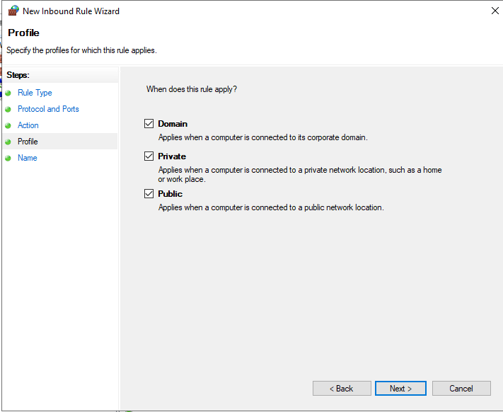
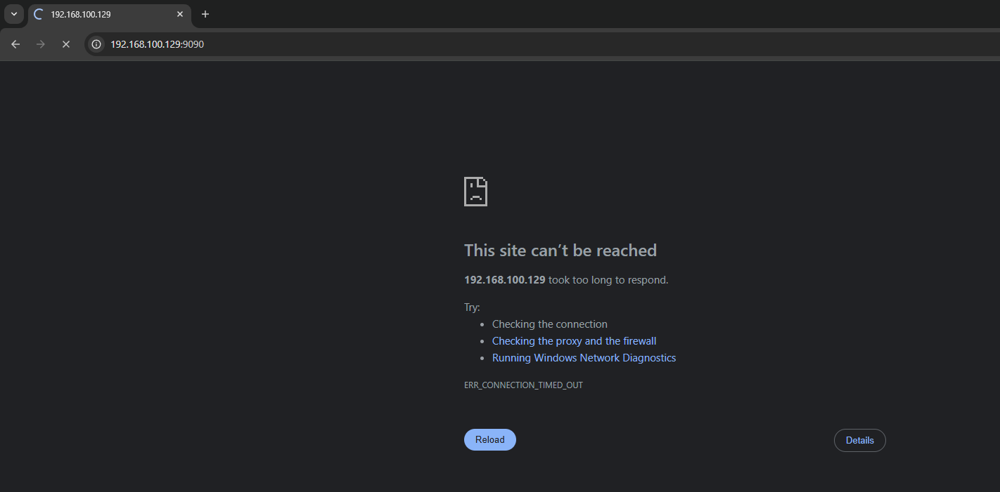

<!-- TOC start (generated with https://github.com/derlin/bitdowntoc) -->

- [Thực hành tường lửa Windows ](#thc-hành-tng-la-windows)
   * [1. Mở Cổng TCP 8081 cho Ứng Dụng Web ](#1-m-cng-tcp-8081-cho-ng-dng-web)
   * [2. Tạo Quy Tắc Firewall Theo Lịch Trình](#2-to-quy-tc-firewall-theo-lch-trình)
   * [3. Hạn Chế Truy Cập RDP và Thay Đổi Cổng](#3-hn-ch-truy-cp-rdp-và-thay-i-cng)

<!-- TOC end -->

<!-- TOC -->
# Thực hành tường lửa Windows 

<!-- TOC -->
## 1. Mở Cổng TCP 8081 cho Ứng Dụng Web 

* Tên Case: Mở Cổng Web Nội Bộ
* Mục tiêu: Cho phép các máy tính truy cập vào một ứng dụng web nội bộ đang chạy trên máy chủ Windows Server và lắng nghe trên cổng TCP 8081.
* Thực hiện trên: Máy chủ Windows Server.
* Các cấu hình sẽ thực hiện: Tạo một quy tắc Inbound Rule mới trong Windows Firewall để cho phép lưu lượng TCP đến trên cổng 8081.

* Các bước thực hiện:

    1.  Mở Windows Firewall with Advanced Security:
        * Nhấn phím Windows + R, gõ `wf.msc`, nhấn Enter.
		- 
		- 

    2.  Tạo Inbound Rule mới:
        * Chọn Inbound Rules ở panel trái.
        * Nhấp New Rule... ở panel phải (Actions).
		- 

    3.  Chọn Rule Type là Port:
        * Chọn Port, nhấp Next.
		- 

    4.  Chỉ định Protocol và Ports:
        * Chọn TCP.
        * Chọn Specific local ports: và nhập `8081`.
        * Nhấp Next.
		- 

    5.  Chọn Action là Allow the connection:
        * Chọn Allow the connection, nhấp Next.
		- 

    6.  Chọn Profile:
        * Chọn Domain Private và Public .
        * Nhấp Next.
		- 

    7.  Đặt Name và Description:
        * Name: `Allow Inbound TCP 8080 - Internal Web App`.
        * Description: `Cho phép truy cập vào ứng dụng web nội bộ trên cổng 8081`.
        * Nhấp Finish.
		- 

* Kiểm tra kết quả 
    1.  Từ máy client, mở trình duyệt web.
    2.  Truy cập `http://192.168.100.129:8081`.
    3.  Nếu ứng dụng web nội bộ hiển thị, cấu hình thành công.
		- 
	4.  Disable rule và kiểm tra web không truy cập được 
		- 

<!-- TOC -->
## 2. Tạo Quy Tắc Firewall Theo Lịch Trình

* Tên Case: Mở Cổng Theo Lịch
* Mục tiêu: Mở một cổng TCP tùy chỉnh (ví dụ: 9090) chỉ trong giờ làm việc (9:00 - 18:00 các ngày trong tuần) và tự động đóng lại ngoài giờ.
* Thực hiện trên: Máy chủ Windows Server.
* Các cấu hình sẽ thực hiện: Tạo hai quy tắc Inbound Rule (cho phép và chặn) và sử dụng Task Scheduler để bật/tắt chúng theo lịch.

* Các bước thực hiện:

    1.  Tạo Quy Tắc Cho Phép (vô hiệu hóa mặc định):
        * Mở Windows Firewall with Advanced Security.
        * Tạo New Inbound Rule -> Port -> TCP, cổng `9090` -> Allow the connection.
        * Đặt Name: `Allow Inbound TCP 9090 (Scheduled)`.
        * Sau khi tạo, tìm quy tắc này trong danh sách Inbound Rules, nhấp chuột phải và chọn Disable Rule.
		- 

    2.  Sử dụng Task Scheduler:
        * Mở Task Scheduler (gõ `taskschd.msc` trong Run).
        * Tạo Task bật quy tắc:
            * Create Basic Task... -> Name: `Enable Firewall Rule`.
            * Trigger: Weekly, lặp lại vào các ngày làm việc, lúc 9:00.
            * Action: Start a program. Program/script: `netsh`. Add arguments: `advfirewall firewall set rule name="Allow Inbound TCP 9090 (Scheduled)" new enable=yes`.
		- 
		- 
		- 
		- 
		- 
		- 
		- 

        * Tạo Task tắt quy tắc:
            * Create Basic Task... -> Name: `Disable Firewall Rule`.
            * Trigger: Weekly, lặp lại vào các ngày làm việc, lúc 18:00.
            * Action: Start a program. Program/script: `netsh`. Add arguments: `advfirewall firewall set rule name="Allow Inbound TCP 9090 (Scheduled)" new enable=no`
		- 
		- 
		- 
		- 
		- 
		- 
		

* Kiểm tra kết quả thành công:
    1.  Trong giờ làm việc (sau khi task bật chạy), thử kết nối đến cổng 9090 của máy chủ từ một máy khác. Kết nối sẽ thành công.
		- 	
    2.  Ngoài giờ làm việc (sau khi task tắt chạy), thử kết nối đến cổng 9090. Kết nối sẽ bị chặn.
		- 	

<!-- TOC -->
## 3. Hạn Chế Truy Cập RDP và Thay Đổi Cổng

* Tên Case: Bảo Mật RDP với IP và Cổng Tùy Chỉnh
* Mục tiêu: Cho phép truy cập RDP vào máy chủ Windows Server chỉ từ IP cụ thể (192.168.100.215) và trên cổng tùy chỉnh 5000, đồng thời chặn mọi truy cập RDP trên cổng mặc định 3389.
* Thực hiện trên: Máy chủ Windows Server.
* Các cấu hình sẽ thực hiện: Thay đổi cổng RDP trong Registry và cấu hình các Inbound Rule trong Windows Firewall.

* Các bước thực hiện:

    1.  Thay đổi Cổng RDP trong Registry:
        * Mở Registry Editor (gõ `regedit` trong Run).
        * Tìm đến khóa: `HKEY_LOCAL_MACHINE\System\CurrentControlSet\Control\Terminal Server\WinStations\RDP-Tcp`.
        * Tìm giá trị PortNumber, nhấp đúp chuột, chọn Decimal và thay đổi giá trị thành `5000`.
		- 	
		- 	
        * Khởi động lại máy chủ để áp dụng.

    2.  Cấu hình Windows Firewall:
        * Mở Windows Firewall with Advanced Security.
        * Tạo Inbound Rule cho cổng RDP mới (5000) và IP cần cấu hình: 
            * New Rule... -> Port -> TCP, cổng `5000` -> Allow the connection.
            * Đặt Name: `Allow RDP TCP 5000 - Static IP`.
		- 	
		- 	
		- 	
		- 	
		- 	
			* Trong phần Scope, chọn These IP addresses trong "Remote IP address" và thêm IP `192.168.100.215`.
		- 	
		- 	
		
        * Chặn Inbound Rule trên cổng RDP mặc định (3389) từ mọi IP:
            * Tìm tới rules mặc định RDP của Windows `Remote Desktop - User Mode (TCP-In)` sửa cấu hình -> Block the connection
		- 	
	
* Kiểm tra kết quả thành công:
    1.  Từ máy tính có IP 192.168.100.215, thử kết nối RDP đến máy chủ trên cổng `192.168.100.129:5000`. Kết nối sẽ thành công.
		- 	
    2.  Từ máy tính có IP `192.168.100.215`, thử kết nối RDP đến máy chủ trên cổng `[Địa chỉ IP máy chủ]:3389`. Kết nối sẽ chặn.
		- 	
    3.  Từ máy tính có IP khác, thử kết nối RDP đến máy chủ trên cổng `[Địa chỉ IP máy chủ]:5000`. Kết nối sẽ bị chặn.
		- 	
	