<!-- TOC --><a name="tìm-hiu-tcp-dump-wireshark"></a>
# Tìm hiểu TCP dump/ Wireshark  
<!-- TOC start -->

- [Tìm hiểu TCP dump/ Wireshark  ](#tìm-hiu-tcp-dump-wireshark)
   * [1. TCP dump ](#1-tcp-dump)
      + [1.1 Tổng quan ](#11-tng-quan)
      + [1.2 Cài đặt, cấu hình ](#12-cài-t-cu-hình)
      + [1.3 Thực hành ](#13-thc-hành)
   * [2. Wireshark](#2-wireshark)
      + [2.1 Tổng quan ](#21-tng-quan)
      + [2.2 Cài đặt cấu hình ](#22-cài-t-cu-hình)
      + [2.3 Thực hành ](#23-thc-hành)
   * [References ](#references)

<!-- TOC end -->


<!-- TOC --><a name="1-tcp-dump"></a>
## 1. TCP dump 
<!-- TOC --><a name="11-tng-quan"></a>
### 1.1 Tổng quan 
- Tcpdump là một công cụ phân tích giao thức và thu thập lưu lượng mạng (www.tcpdump.org).
- Chương trình này dựa trên giao diện libpcap, một giao diện độc lập với hệ thống và có tính di động để người dùng có thể thu thập các gói dữ liệu mạng ở cấp độ người dùng. 
- Mặc dù có tên là tcpdump, công cụ này cũng có thể được sử dụng để thu thập lưu lượng không phải TCP, bao gồm cả UDP và ICMP. 
- Chương trình tcpdump được tích hợp sẵn trong nhiều bản phân phối của BSD, Linux và Mac OS X, và có một phiên bản có thể được cài đặt trên các hệ thống Windows. 
- TCPDUMP sẽ xuất ra màn hình nội dung các gói tin chạy trên card nhà mạng mà máy chủ đang lắng nghe sao cho phù hợp với biểu thức logic chọn lọc mà khách hàng đã sử dụng và nhập vào máy tính. Khách hàng có thể xuất ra các mô tả về gói tin thành một file pcap để phân tích sau dựa trên từng loại tùy chọn khác nhau. Để đọc được nội dung của file pcap này, bạn chỉ cần sử dụng các phần mềm khác như Wireshark hay với option -r của lệnh TCPDUMP.
- Trong các trường hợp không có tùy chọn nào, TCPDUMP sẽ vẫn tiếp tục chạy cho đến khi nó nhận được tín hiệu ngắt từ phía khách hàng. Sau khi việc bắt các gói tin kết thúc, TCPDUMP sẽ đưa ra các báo cáo sau:
	* Packet capture: Số lượng các gói tin đã bắt được và tiến hành xử lý.
	* Packet received by filter: Số lượng các gói tin mà bộ lọc nhận được.
	* Packet dropped by kernel: số lượng packet bị dropped do cơ chế bắt gói tin.
- Lệnh sử dụng tcpdump cơ bản 
	```
	tcpdump [options] [expression]
	```
	- Options: Thay đổi hành vi của tcpdump, chẳng hạn như chỉ định giao diện mạng để thu thập dữ liệu hoặc định dạng đầu ra.
	- Expression: Xác định loại lưu lượng mạng nào cần thu thập. Đây là nơi bạn chỉ định tên máy chủ, địa chỉ IP, cổng, giao thức và các tiêu chí khác
- Định dạng chung của một dòng giao thức Tcpdump
`time-stamp src > dst:  flags  data-seqno  ack  window urgent options`
	- Time-stamp: hiển thị thời gian gói tin được capture.
	- Src và dst: hiển thị địa IP của người gửi và người nhận.
	- Cờ Flag thì bao gồm các giá trị sau:
		- S(SYN):  Được sử dụng trong quá trình bắt tay của giao thức TCP.
		- .(ACK):  Được sử dụng để thông báo cho bên gửi biết là gói tin đã nhận được dữ liệu thành công.
		- F(FIN): Được sử dụng để đóng kết nối TCP.
		- P(PUSH): Thường được đặt ở cuối để đánh dấu việc truyền dữ liệu.
		- R(RST): Được sử dụng khi muốn thiết lập lại đường truyền.
	- Data-sqeno: Số sequence number của gói dữ liệu hiện tại.
	- ACK: Mô tả số sequence number tiếp theo của gói tin do bên gởi truyền (số sequence number mong muốn nhận được).
	- Window: Vùng nhớ đệm có sẵn theo hướng khác trên kết nối này.
	- Urgent: Cho biết có dữ liệu khẩn cấp trong gói tin.
- Những tùy chọn thông dụng trong lệnh TCPDUMP : 
	* -i: Khi khách hàng muốn chụp các gói tin trên một interface được chỉ định thì các option này sẽ được sử dụng.
	* -D: Khi option này được sử dụng, TCPDUMP sẽ tiến hành liệt kê ra toàn bộ các interface đang hiện đang tồn tại trên máy tính mà nó có thể capture được.
	* -c N : Sau khi capture nhiều gói tin, TCPDUMP sẽ dừng hoạt động khi bạn sử dụng option này.
	* -n: Khi sử dụng option này, TCPDUMP sẽ không thực hiện việc phân giải từ địa chỉ IP sang hostname.
	* -nn: Tương tự như option –n, TCPDUMP sẽ không tiến hành phân giải từ địa chỉ IP sang hostname mà nó cũng không phân giải cả portname.
	* -v: Option này sẽ giúp người dùng gia tăng số lượng thông tin về gói tin thậm chí có thể tăng thêm với option –vv hoặc –vvv mà họ có thể nhận được.
	* -s: Với option này, các định nghĩa snap length (kích thước) gói tin sẽ lưu lại, để mặc định, người dùng phải sử dụng 0.
	* -q: Khi option này được sử dụng thì lệnh TCPDUMP sẽ hiển thị được ít thông tin hơn.
	* -w filename: TCPDUMP khi sử dụng option này sẽ capture các packet và lưu xuống file chỉ định.
	* -r filename: Option này được sử dụng đi kèm với option –w với mục đích sử dụng là đọc nội dung file đã lưu từ trước.
	* -x: Dữ liệu của gói tin capture sẽ được hiển thị dưới dạng mã Hex.
	* -A: Các packet được capture được hiển thị dưới dạng mã ACSII.
	* -S: Khi TCPDUMP capture packet, các số sequence number ACK sẽ được chuyển đổi thành các relative sequence number hay relative ACK. Nếu sử dụng option –S này thì TCPDUMP sẽ không tiến hành chuyển đổi nữa mà sẽ để mặc định.
	* -F filename: Các packet với các luật đã được định trước trong tập tin filename sẽ được Filter bởi TCPDUMP.
	* -e: Thay vì hiển thị địa chỉ IP của người gửi và người nhận, TCPDUMP khi sử dụng option này sẽ thay thế các địa chỉ IP nói trên bằng địa chỉ MAC.
	* -t: TCPDUMP khi sử dụng option này sẽ bỏ qua thời gian bắt được gói tin khi thực hiện việc hiển thị cho khách hàng.
	* -tt: Thời gian hiển thị trên mỗi dòng lệnh sẽ không được format theo dạng chuẩn khi TCPDUMP sử dụng option này.
	* -K: TCPDUMP sẽ bỏ qua việc checksum các gói tin.
	* -N: TCPDUMP với option này sẽ không tiến hành in các quality domain name ra màn hình.
	* -B size: TCPDUMP thường sử dụng option này để cài đặt buffer_size .
	* -L: Danh sách các data link type mà interface hỗ trợ sẽ được hiển thị với option này.
	* -y: Lựa chọn data link type khi bắt các gói tin.
- Một số bộ lọc cơ bản trong TCPDUMP
	* dst A: TCPDUMP khi sử dụng option này sẽ chỉ capture các gói tin có địa chỉ đích là "A". Để chỉ định một dãy mạng cụ thể, TCPDUMP có thể sử dụng kèm với từ khoá net.
	* src A: Thay vì capture các gói tin có địa chỉ đích cụ thể như option dst thì TCPDUMP sẽ capture các gói tin có địa chỉ nguồn theo quy định.
	* host A: Khi sử dụng option này, TCPDUMP sẽ chỉ capture các gói tin có địa chỉ đích hoặc địa chỉ nguồn là "A".
	* port / port range: TCPDUMP sẽ chỉ capture các gói tin có địa chỉ port được chỉ định rõ, hoặc nằm trong khoảng range định trước khi sử dụng option này. Ngoài ra, nó có thể sử dụng kèm với option dst hoặc src.
	* less: TCPDUMP khi sử dụng từ khoá này sẽ tiến hành việc lọc (filter) các gói tin có dung lượng nhỏ hơn giá trị chỉ định.
	* greater: TCPDUMP khi sử dụng từ khoá này sẽ tiến hành việc lọc (filter) các gói tin có dung lượng cao hơn giá trị chỉ định.
	* (ether | ip) broadcast: Các gói tin ip broadcast hoặc ethernet broadcast sẽ được capture.
	* (ether | ip | ip6) multicast: Các gói tin ethernet, ip , ipv6 multicast sẽ được capture.
- Một số kết hợp trong tcpdump:
	* AND: Sử dụng từ khóa and hoặc &&.
	* OR: Sử dụng từ khóa or hoặc ||.
	* EXCEPT: sử dụng từ khóa not hoặc !.
	* Ngoài ra để gom nhóm các điều kiện ta có thể dùng cặp từ khóa ‘’.  Ví dụ: tcpdump –i eth0 ‘dst host 192.168.1.1 or 192.168.1.10 or 192.168.1.11’
<!-- TOC --><a name="12-cài-t-cu-hình"></a>
### 1.2 Cài đặt, cấu hình 
- Cài đặt: Thông thường tcpdump sẽ được phân phối mặc định. Lệnh sau để cài đặt tcpdump nếu chưa có.
	* Ở Ubuntu/Debian 
	```
	sudo apt-get install tcpdump -y
	```
	* Với CentOS/Redhat :
	```
	yum install tcpdump -y
	```
<!-- TOC --><a name="13-thc-hành"></a>
### 1.3 Thực hành 
- Thực hành sử dụng các lệnh cơ bản của tcpdump 
- Xem tất cả lưu lượng trên một interface cụ thể: Ví dụ với interface ens37. Dừng tcpdump bằng cách nhấn Ctrl+C.
	```
	sudo tcpdump -i ens37
	```
- 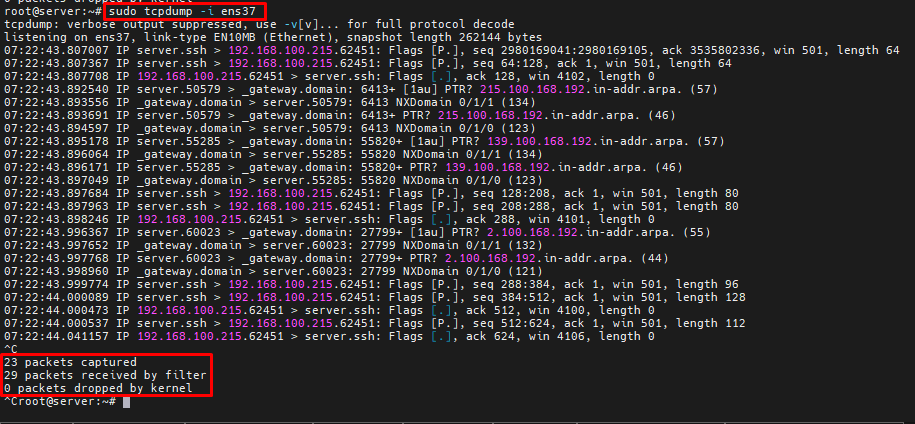
	- Sau khi dừng, sẽ hiện ra một bảng với các thông số:
		* Packet capture: số lượng gói tin bắt được và xử lý.
		* Packet received by filter: số lượng gói tin được nhận bởi bộ lọc.
		* Packet dropped by kernel: số lượng packet đã bị dropped bởi cơ chế bắt gói tin của hệ điều hành.
- Giới hạn số lượng gói tin: Chạy lệnh sau để chỉ thu thập 10 gói tin:
```
sudo tcpdump -i eth0 -c 10
```
- 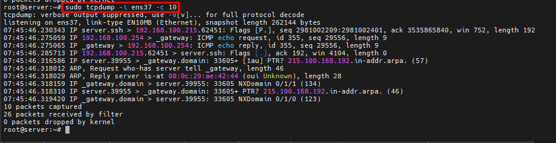
- Show thêm thông tin về yyyy-mm-dd
```
tcpdump –n –tttt –i eth0
```
- 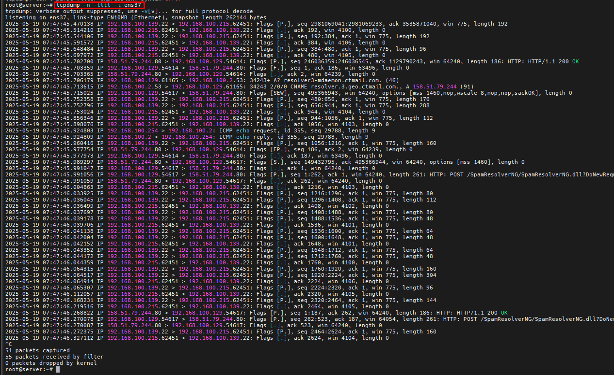

- Lọc theo host: Chạy lệnh sau, thay 192.168.1.100 bằng địa chỉ IP của một máy khác trong mạng hoặc một địa chỉ IP trên internet nhằm quan sát chỉ các gói tin đến hoặc đi từ host này:
	```
	sudo tcpdump host 192.168.1.100
	```
	- 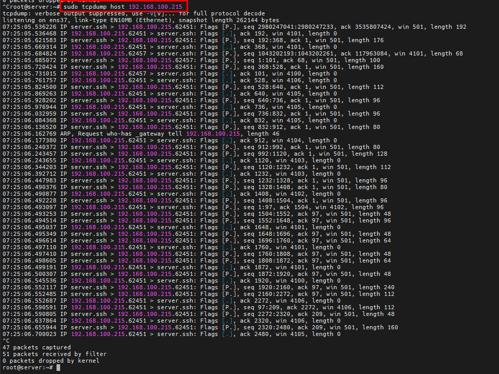

- Lọc theo port: Chạy lệnh để xem lưu lượng HTTP (port 80):
```
sudo tcpdump port 80
```
- 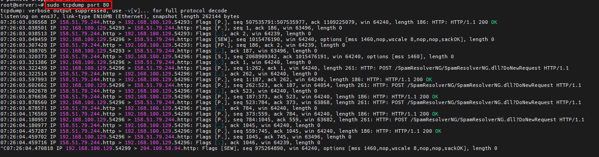
- Lọc theo giao thức: 
	* Chạy lệnh để chỉ xem các gói tin TCP:
	```
	sudo tcpdump tcp
	```
	- 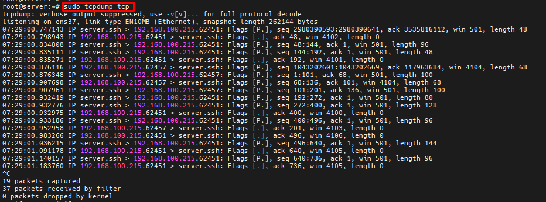

	* Chạy lệnh sau để chỉ xem các gói tin UDP:
	```
	sudo tcpdump udp
	```
	- 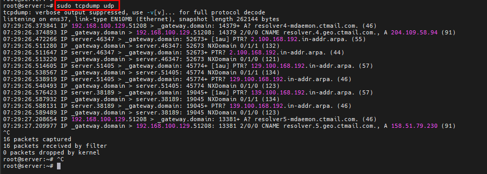

	* Chạy lệnh sau để chỉ xem các gói tin ICMP (ping):
	```
	sudo tcpdump icmp
	```
	- 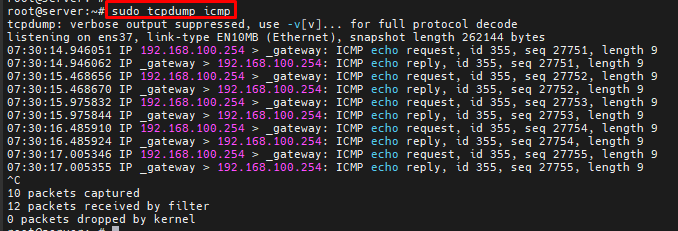

- Lọc theo source hoặc destination:
	* Lọc theo source 
	```
	sudo tcpdump src host <IP_nguồn>
	```
	- 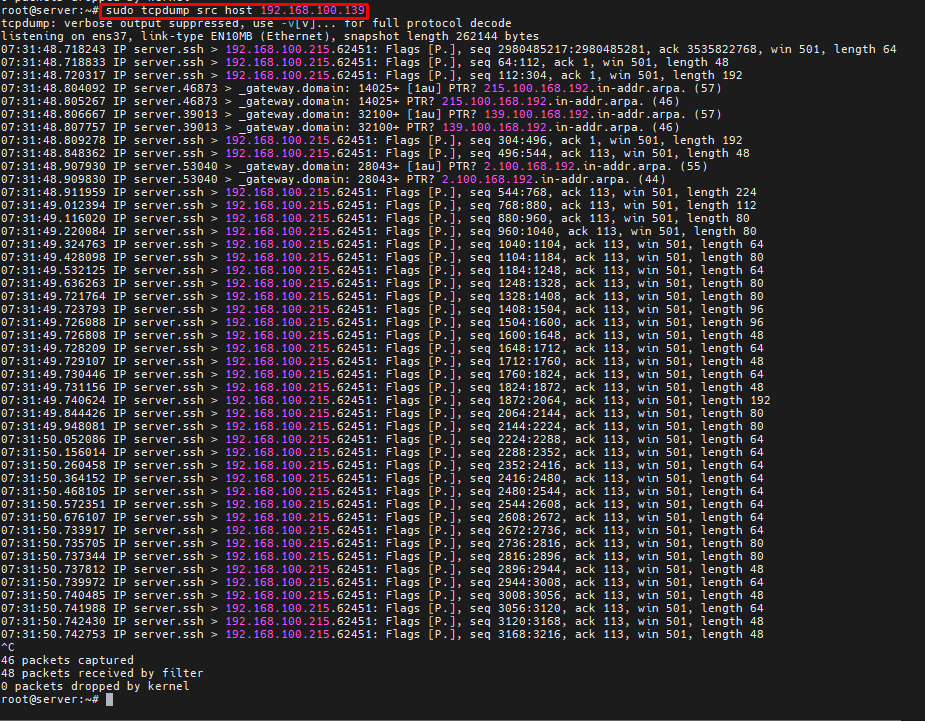

	* Chạy lệnh để xem các gói tin có destination là một host cụ thể:
	```
	sudo tcpdump dst host <IP_dich>
	```
	- 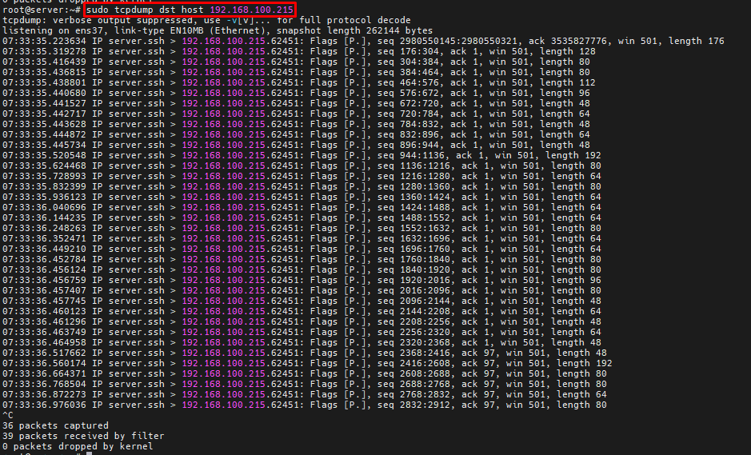

- Kết hợp các bộ lọc:
* Chạy lệnh sau để xem lưu lượng TCP đến port 80 của một host cụ thể:
```
sudo tcpdump tcp and dst port 80 and host <IP_dich>
```
- 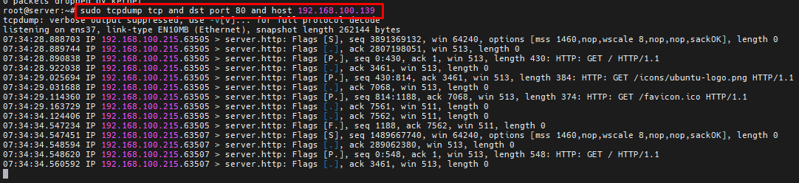

- Xem nội dung ASCII của gói tin:
```
sudo tcpdump -i eth0 -A port 80
```
- 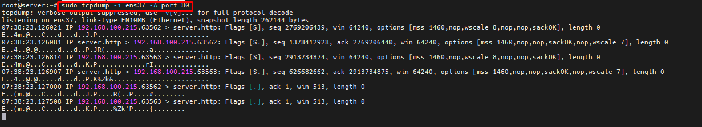

- Lọc theo flag TCP:
	* Xem các gói tin TCP có flag SYN được thiết lập (thường là gói tin bắt đầu kết nối TCP):
	```
	sudo tcpdump -i eth0 'tcp[tcpflags] & tcp-syn != 0'
	```
	- 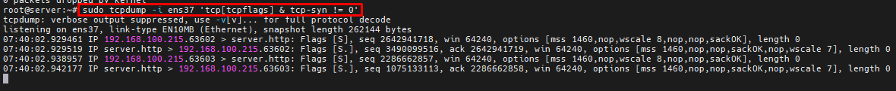
	* Xem các gói tin TCP có flag ACK được thiết lập:
	```
	sudo tcpdump -i eth0 'tcp[tcpflags] & tcp-ack != 0'
	```
	- 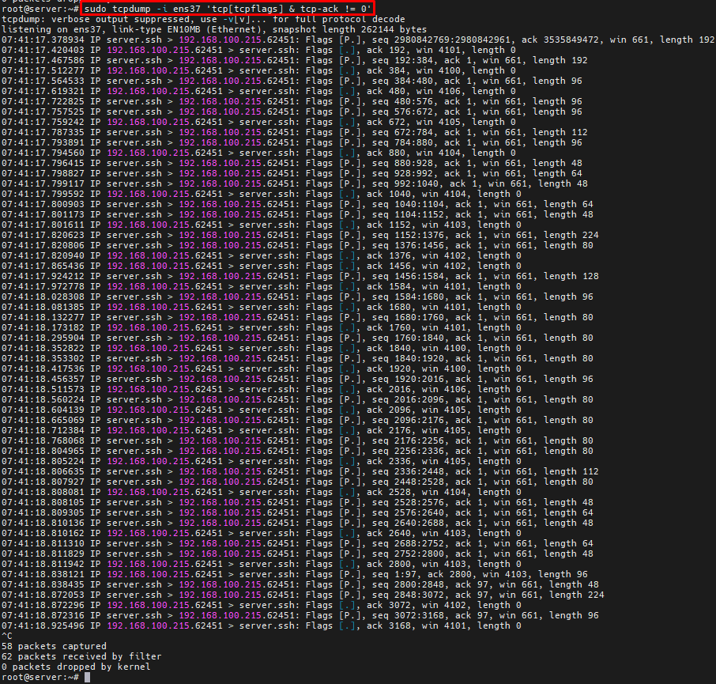
	* Xem các gói tin TCP có flag FIN được thiết lập (thường là gói tin kết thúc kết nối TCP):
	```
	sudo tcpdump -i eth0 'tcp[tcpflags] & tcp-fin != 0'
	```
	- 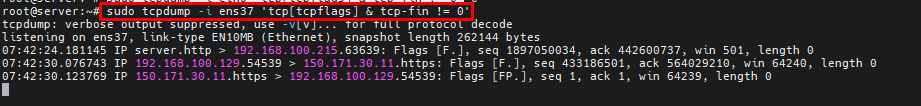
	* Kết hợp các flag
	```
	sudo tcpdump -i eth0 'tcp[tcpflags] & (tcp-syn|tcp-ack) == (tcp-syn|tcp-ack)'
	```
	- 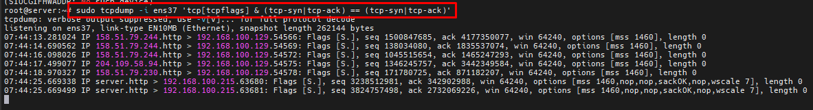
	
- Sử dụng điều kiện “and” , “or” và “not” để fliter packets : Lệnh thực hiện lắng nghe lưu lượng trên interface mạng eth0 và hiển thị tất cả các gói tin không phải là gói tin ARP và không phải là gói tin RARP.
```
tcpdump -i eth0 not arp and not rarp
```
- 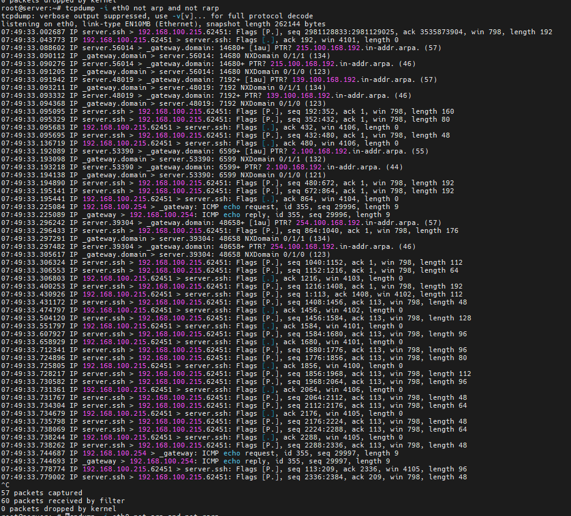

- Lưu kết quả vào file:
	* Chạy lệnh sau để lưu các gói tin vào một file (ví dụ: capture.pcap):
	```
	sudo tcpdump -i ens37 -w capture.pcap
	```
	* Sau khi thu thập một số gói tin, dừng tcpdump, có thể xem lại nội dung file này bằng lệnh:
	```
	tcpdump -r capture.pcap
	```
- 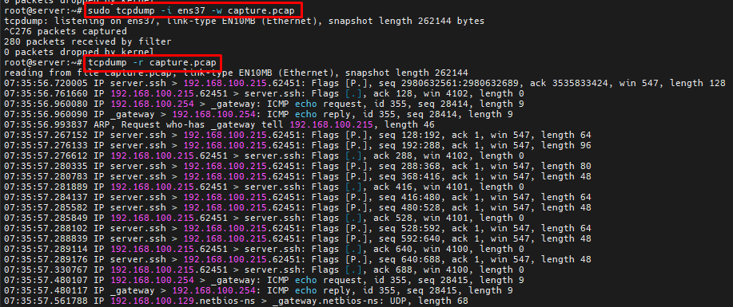

<!-- TOC --><a name="2-wireshark"></a>
## 2. Wireshark
<!-- TOC --><a name="21-tng-quan"></a>
### 2.1 Tổng quan 
- Wireshark là một ứng dụng dùng để bắt (capture), phân tích và xác định các vấn đề liên quan đến network như: rớt gói tin, kết nối chậm, hoặc các truy cập bất thường. Phần mềm này cho phép quản trị viên hiểu sâu hơn các Network Packets đang chạy trên hệ thống, qua đó dễ dàng xác định các nguyên nhân chính xác gây ra lỗi.
- Sử dụng WireShark có thể capture các packet trong thời gian thực (real time), lưu trữ chúng lại và phân tích chúng offline. Ngoài ra, nó cũng bao gồm các filter, color coding và nhiều tính năng khác, cho phép người dùng tìm hiểu sâu hơn về lưu lượng mạng cũng như inspect (kiểm tra) các packets.
- Ứng dụng được viết bằng ngôn ngữ C và hệ điều hành Cross-platform, ngoài ra còn bao gồm có các bản phân phối Linux, Windows, OS X, FreeBSD, NetBSD và OpenBSD. Đây là một phần mềm mã nguồn mở, được cấp phép GPL do đó được miễn phí sử dụng, tự do chia sẻ và sửa đổi.
- Các tính năng nổi bật của phần mềm bắt gói tin Wireshark:
	* Hỗ trợ phân tích sâu hàng trăm giao thức và liên tục được cập nhật.
	* Live capture và phân tích offline.
	* Hoạt động đa nền tảng: Windows, Linux, MacOS, Solaris, FreeBSD, OpenBSD…
	* Các gói tin đã capture có thể xem bằng giao diện hoặc sử dụng command line (tshark).
	* Display filter mạnh mẽ.
	* Hỗ trợ phân tích VoIP chuyên sâu.
	* Hỗ trợ read/write nhiều định dạng: tcpdump (libpcap), Pcap NG, Catapult DCT2000, Cisco Secure IDS iplog, Microsoft Network Monitor, Network General Sniffer® (compressed and uncompressed), Sniffer® Pro, and NetXray®, Network Instruments Observer, NetScreen snoop, Novell LANalyzer, RADCOM WAN/LAN Analyzer, Shomiti/Finisar Surveyor, Tektronix K12xx, Visual Networks Visual UpTime, WildPackets EtherPeek/TokenPeek/AiroPeek …
	* File capture được nén bằng gzip có thể được giải nén “on the fly”.
	* Capture dữ liệu từ Ethernet, IEEE 802.11, PPP/HDLC, ATM, Bluetooth, USB, Token Ring, Frame Relay, FDDI …
	* Hỗ trợ decryption của nhiều giao thức như: IPsec, ISAKMP, Kerberos, SNMPv3, SSL/TLS, WEP, and WPA/WPA2.
	* Coloring rules cho phép thiết lập màu sắc cho các packet giúp phân tích nhanh và hiệu quả hơn.
	* Output có thể export sang XML, PostScript®, CSV, hoặc plain text.

<!-- TOC --><a name="22-cài-t-cu-hình"></a>
### 2.2 Cài đặt cấu hình 
- Wireshark hỗ trợ các hầu hết các hệ điều hành 
	* Đối với Windows: Tải file cài đặt từ [Wireshark - Download](https://www.wireshark.org/download.html)
	* Đối với MacOS: Bản cài đặt chính thức cho macOS đã được hỗ trợ trên trang chủ, bạn chỉ việc download và mở file .dmg để bắt đầu cài đặt và kéo thả biểu tượng của Wireshark vào thư mục /Applications để hoàn tất.[Wireshark - Download](https://www.wireshark.org/download.html)
	* Đối với Ubuntu: Có thể cài đặt từ các lệnh sau:
	```
	sudo apt-get install wireshark
	sudo dpkg-reconfigure Wireshark-common
	sudo adduser $USER wireshark
	```
	* Đối với RedHat Fedora: Có thể cài đặt từ các lệnh sau:
	```
	sudo dnf install Wireshark-qt
	sudo usermod -a -G Wireshark username
	```
	* Đối với Kali Linux:  Hiện tại, Wireshark đã được cài đặt sẵn trong các bản phân phối Kali Linux. Hãy kiểm tra menu ở option “Sniffing & Spoofing” để sử dụng.
<!-- TOC --><a name="23-thc-hành"></a>
### 2.3 Thực hành 
- Thực hành sử dụng Wireshark trên Windows 
- Khởi chạy wireshark tại giao diện chính chọn interface cần theo dõi. Ở đây chọn Ethernet 1
- 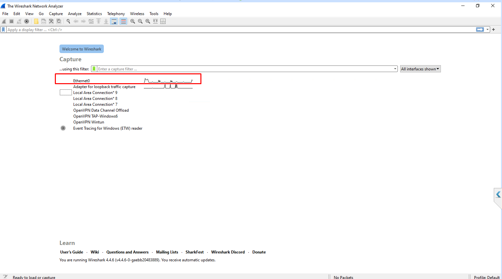

- Bắt và xem gói tin cơ bản: Dừng bắt gói tin, kiểm tra thông tin của 1 gói tin bất kỳ 
- 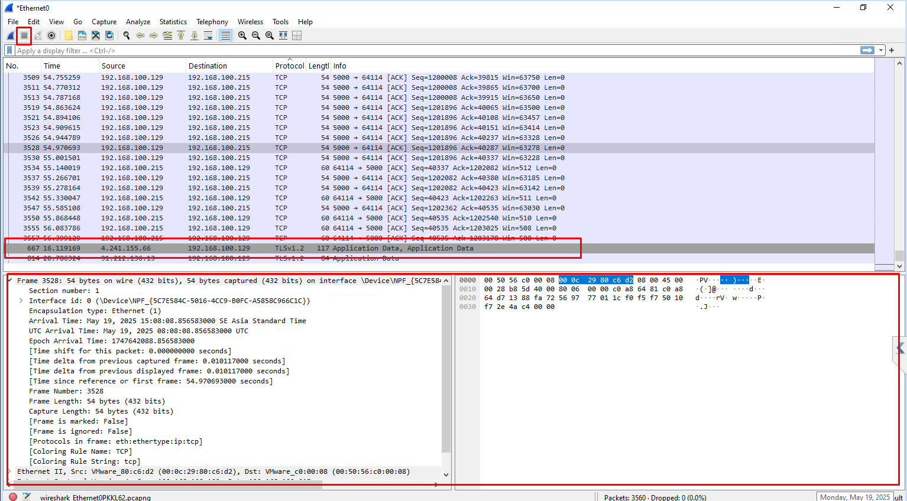
- Lọc bắt gói tin: Chỉ thu thập lưu lượng theo tiêu chí (ví dụ: port 80). Trên `Capture Filter` điền `tcp.port==80` để lọc gói tin TCP với port 80
- 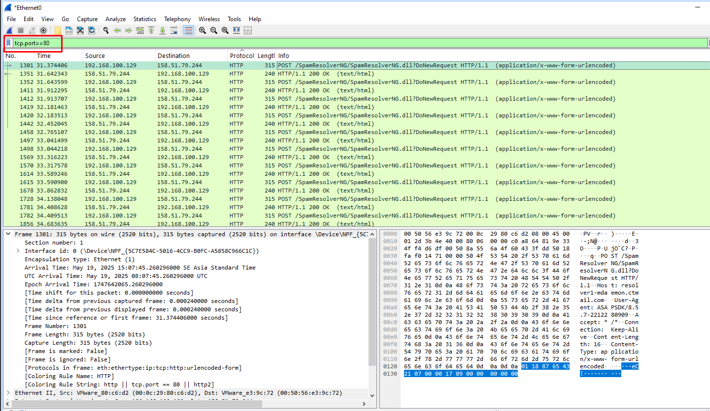
- Lọc hiển thị: Tìm các gói tin cụ thể sau khi bắt (ví dụ: theo IP, giao thức). Ví dụ filter chỉ các gói tin tcp, dns, gói tin có ip nguồn là 192.168.100.215 và port đích là 80 
- 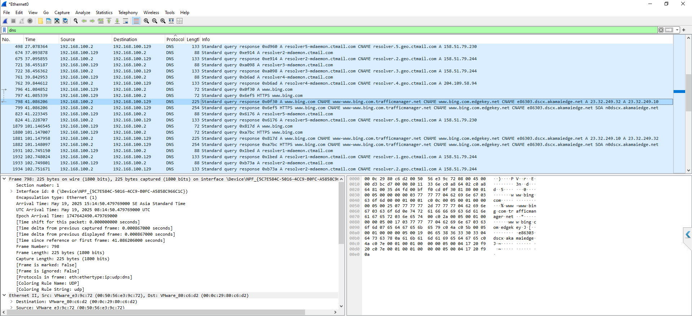
- 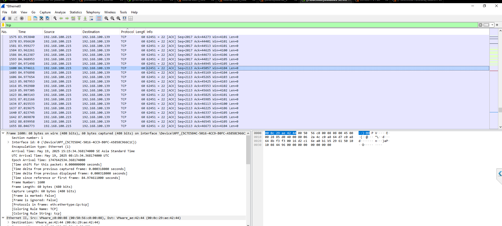
- 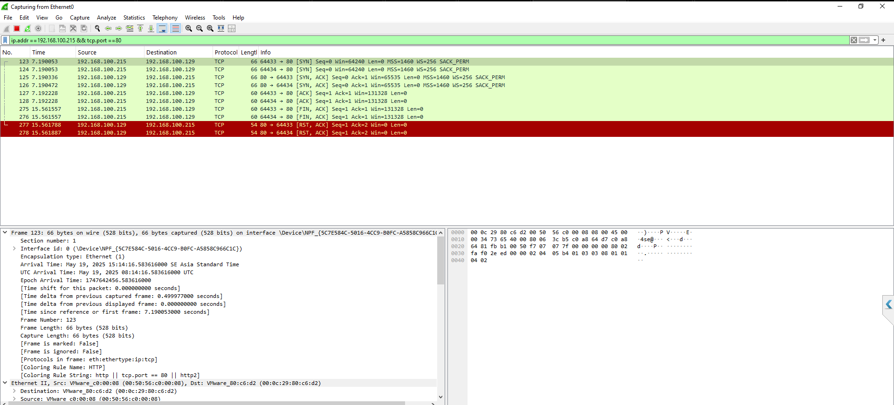
- Theo dõi luồng TCP:Xem toàn bộ giao tiếp của một phiên TCP liên tục.
	* Thực hiện:
		* Bắt gói tin khi bạn tương tác với một trang web (ví dụ: tải trang, gửi form).
		* Chọn một gói tin TCP bất kỳ liên quan đến phiên giao tiếp bạn muốn xem.
		* Click chuột phải vào gói tin và chọn Follow -> TCP Stream.
		* Một cửa sổ mới sẽ hiển thị toàn bộ luồng giao tiếp, giúp bạn dễ dàng theo dõi các yêu cầu và phản hồi liên tiếp.
- 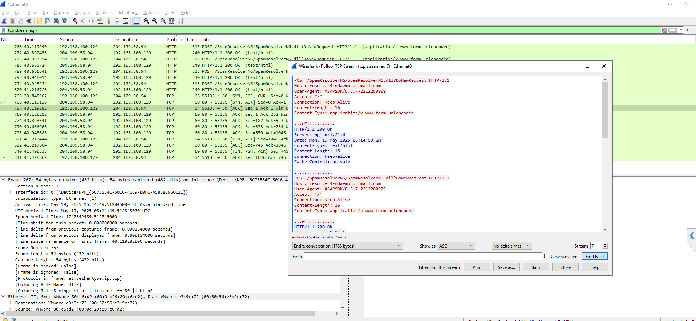
- Sử dụng Statistics:Nhận thông tin tổng quan về lưu lượng mạng đã thu thập.
	* Thực hiện:
		* Bắt một lượng lớn gói tin trong một khoảng thời gian.
		* Dừng việc bắt gói tin.
		* Vào menu Statistics: 
			* Protocol Hierarchy: Xem tỷ lệ phần trăm của các giao thức khác nhau.
			- 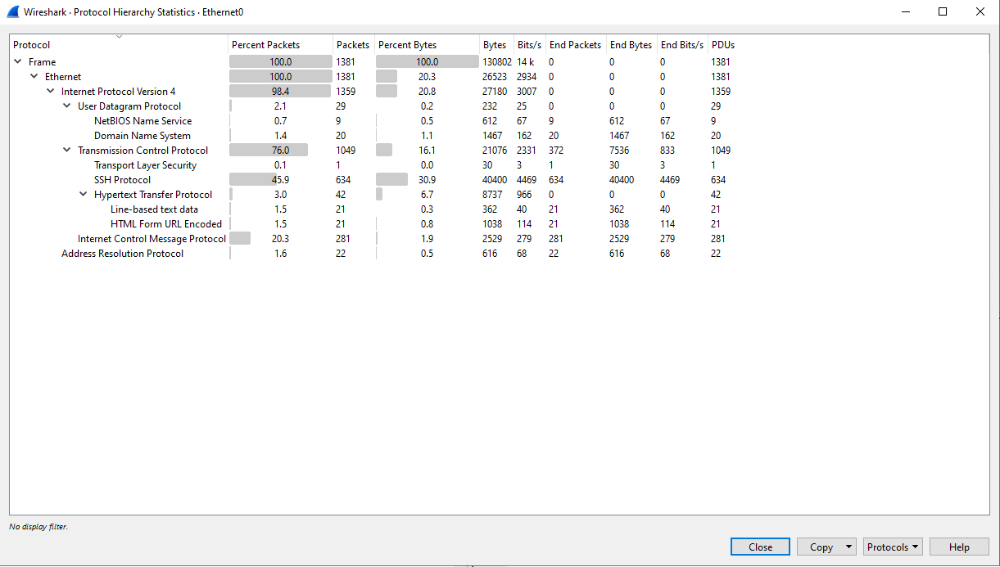	
			* Conversations: Xem danh sách các luồng giao tiếp (TCP, UDP, IP) và số lượng gói tin/byte trao đổi.
			- 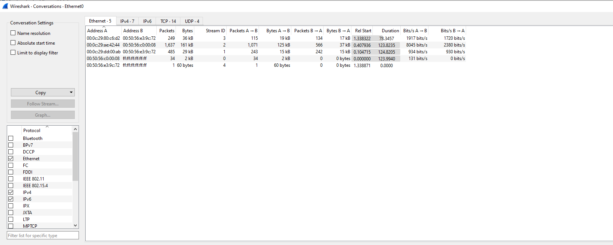	
			* Endpoints: Xem danh sách các địa chỉ MAC và IP tham gia vào giao tiếp.
			- 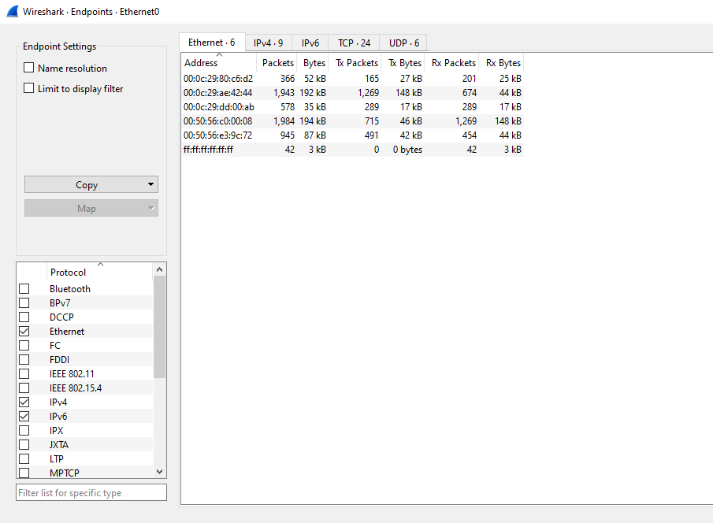	
			* IO Graphs: Thử tạo biểu đồ hiển thị tổng số gói tin theo thời gian hoặc lưu lượng của một giao thức cụ thể.
			- 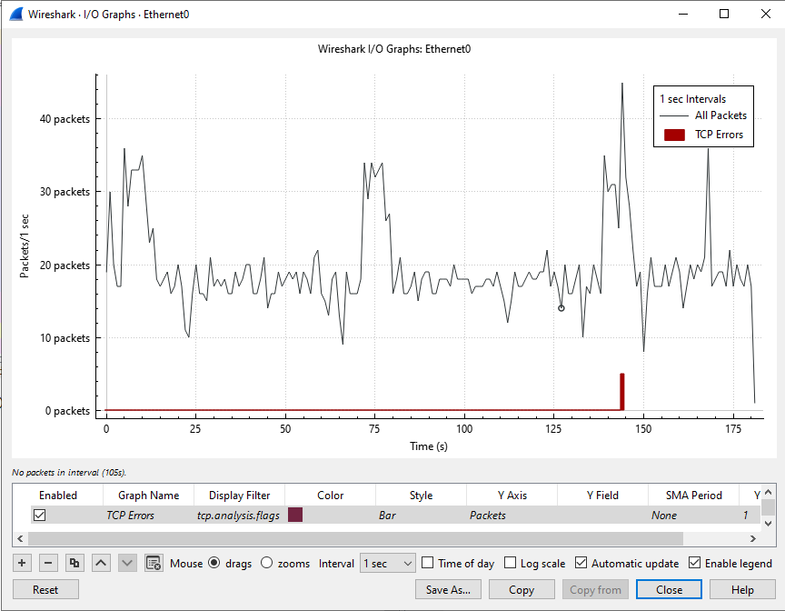	
			
<!-- TOC --><a name="references"></a>
## References 
1. [Introduction to using tcpdump: A Linux command-line tool](https://www.redhat.com/en/blog/introduction-using-tcpdump-linux-command-line)
2. [tcpdump - ScienceDirect Topics](https://www.sciencedirect.com/topics/computer-science/tcpdump)
3. [tcpdump!](https://wizardzines.com/zines/tcpdump/)
4. [tcpdump advanced filters](https://blog.wains.be/2007/2007-10-01-tcpdump-advanced-filters/)
5. [Tcpdump là gì? Tổng quan về công cụ Tcpdump](https://nhanhoa.com/tin-tuc/tcpdump-la-gi.html)
6. [About Wireshark](https://www.wireshark.org/about.html)
7. [Wireshark là gì? Hướng dẫn cài đặt & sử dụng Wireshark](https://vietnix.vn/wireshark-la-gi/)