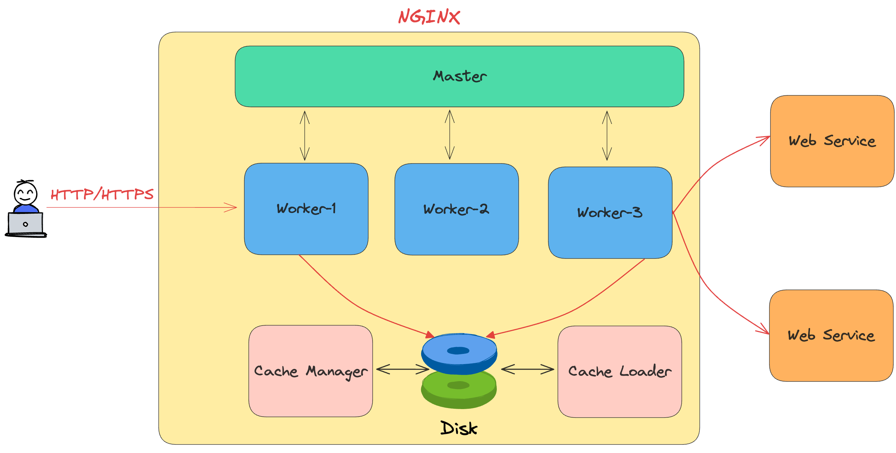

# Web Server

 
## 1 Khái niệm cơ bản về Web Server
### 1.1  Định nghĩa Web Server 
- Web Server (Máy chủ web) là phần mềm và phần cứng sử dụng HTTP và các giao thức khác để phản hồi các yêu cầu của khách hàng được thực hiện qua World Wide Web.
- Nhiệm vụ chính của nó là hiển thị nội dung trang web, chẳng hạn như văn bản, hình ảnh, video và ứng dụng, cho người dùng bằng cách lưu trữ, xử lý và phân phối các trang web.
- Máy chủ web cũng được sử dụng trong lưu trữ web, tức là lưu trữ dữ liệu cho các trang web và ứng dụng dựa trên web.
- Máy chủ web động so với máy chủ web tĩnh: Máy chủ web có thể được sử dụng để phục vụ nội dung tĩnh hoặc động. 
	* Tĩnh đề cập đến nội dung được hiển thị nguyên trạng, trong khi nội dung động có thể được cập nhật và thay đổi. Máy chủ web tĩnh bao gồm máy tính và phần mềm HTTP. Nó được coi là tĩnh vì máy chủ gửi các tệp được lưu trữ đã viết sẵn nguyên trạng đến trình duyệt. Ngoài ra, mọi người dùng đều thấy cùng một nội dung vì máy chủ chỉ phân phối các tệp đã lưu trữ. Không có xử lý phía máy chủ, tương tác cơ sở dữ liệu hoặc tạo nội dung động, dành riêng cho người dùng theo thời gian thực.
	* Trình duyệt web động bao gồm máy chủ web và phần mềm khác, chẳng hạn như máy chủ ứng dụng và cơ sở dữ liệu. Nó được coi là động vì máy chủ ứng dụng có thể được sử dụng để cập nhật bất kỳ tệp được lưu trữ nào trước khi chúng được gửi đến trình duyệt. Máy chủ web có thể tạo nội dung bằng cách yêu cầu nội dung đó theo thời gian thực từ cơ sở dữ liệu cơ bản. Ngoài ra, nội dung này được phân phối dựa trên thông tin đầu vào cụ thể của người dùng hoặc các biến khác.
	* Điều này giúp có thể phân phối các tính năng tương tác trên trang web, chẳng hạn như biểu mẫu đăng nhập và giỏ hàng. Các tính năng này được tạo động và tức thời, có thể nâng cao trải nghiệm của người dùng. Tuy nhiên, tính linh hoạt tăng lên của quy trình này cũng làm cho việc thiết kế và triển khai trở nên phức tạp hơn.
### 1.2  Vai trò của Web Server trong mô hình client-server.
- Web server đóng vai trò là một máy chủ (server) chuyên biệt trong mô hình client-server, chịu trách nhiệm chính trong việc:
* Lưu trữ các tệp tin của website: Web server là nơi lưu trữ tất cả các thành phần tạo nên một trang web, bao gồm các tệp HTML, CSS, JavaScript, hình ảnh, video và các tài liệu khác.
* Tiếp nhận yêu cầu từ client (trình duyệt web): Khi người dùng truy cập một trang web thông qua trình duyệt (client), trình duyệt sẽ gửi một yêu cầu (request) đến web server chứa trang web đó. Yêu cầu này thường là một yêu cầu HTTP (Hypertext Transfer Protocol).
* Xử lý yêu cầu: Web server nhận yêu cầu và xử lý nó. Quá trình xử lý có thể bao gồm việc tìm kiếm tệp tin được yêu cầu, xử lý các đoạn mã phía máy chủ (server-side scripting) nếu có, và chuẩn bị dữ liệu để gửi trả lại cho client.
* Gửi phản hồi (response) đến client: Sau khi xử lý yêu cầu, web server gửi một phản hồi (response) trở lại trình duyệt. Phản hồi này thường bao gồm các tệp tin của trang web (ví dụ: mã HTML) và các thông tin khác để trình duyệt có thể hiển thị trang web cho người dùng. Giao thức HTTP được sử dụng cho việc giao tiếp này.
* Đảm bảo khả năng truy cập: Web server hoạt động liên tục và được kết nối với mạng internet để đảm bảo rằng người dùng có thể truy cập vào các trang web mà nó lưu trữ bất kỳ lúc nào.
* Quản lý kết nối đồng thời: Một web server mạnh mẽ có khả năng xử lý đồng thời nhiều yêu cầu từ nhiều client khác nhau một cách hiệu quả.
* Cung cấp các dịch vụ khác: Ngoài việc phục vụ các tệp tĩnh, web server hiện đại còn có thể tích hợp với các application server và cơ sở dữ liệu để cung cấp các trang web và ứng dụng web động, phức tạp hơn.
### 1.3  Cách thức hoạt động (nhận request, xử lý, trả response).
- Cách thức hoạt động của web server (trong việc nhận request, xử lý và trả response) có thể được mô tả theo các bước sau:
1. Nhận Request (Receiving the Request):
	* Người dùng nhập URL: Quá trình bắt đầu khi người dùng nhập một địa chỉ web (URL - Uniform Resource Locator) vào thanh địa chỉ của trình duyệt web (client) hoặc nhấp vào một liên kết.
	* Trình duyệt phân tích URL: Trình duyệt phân tích URL để xác định giao thức (ví dụ: HTTP, HTTPS), tên miền (ví dụ: www.example.org), và đường dẫn tài nguyên cụ thể (ví dụ: /what-is-a-web-server-working-and-architecture/).
	* Trình duyệt tìm kiếm địa chỉ IP: Trình duyệt sử dụng Hệ thống Tên miền (DNS - Domain Name System) để dịch tên miền thành địa chỉ IP tương ứng của web server.
	* Trình duyệt thiết lập kết nối TCP/IP: Sau khi có địa chỉ IP, trình duyệt thiết lập một kết nối TCP/IP (Transmission Control Protocol/Internet Protocol) với web server trên cổng mặc định cho HTTP (thường là cổng 80) hoặc HTTPS (thường là cổng 443).
	* Trình duyệt gửi HTTP Request: Khi kết nối được thiết lập, trình duyệt gửi một yêu cầu HTTP (HTTP request) đến web server. Yêu cầu này bao gồm:
	* Phương thức HTTP: Xác định hành động mà client muốn thực hiện (ví dụ: GET để lấy dữ liệu, POST để gửi dữ liệu, PUT để cập nhật dữ liệu, DELETE để xóa dữ liệu).
	* Đường dẫn tài nguyên: Xác định tài nguyên cụ thể mà client yêu cầu (ví dụ: /index.html, /images/logo.png).
	* Phiên bản HTTP: Xác định phiên bản giao thức HTTP đang được sử dụng (ví dụ: HTTP/1.1, HTTP/2).
	* Tiêu đề (Headers): Cung cấp thông tin bổ sung về yêu cầu, chẳng hạn như loại trình duyệt, ngôn ngữ ưu tiên, cookie, v.v.
2. Xử lý Request (Processing the Request):
	* Web server nhận yêu cầu: Web server lắng nghe các yêu cầu đến trên các cổng được chỉ định. Khi nhận được một yêu cầu HTTP từ client, nó sẽ bắt đầu quá trình xử lý.
	* Web server phân tích yêu cầu: Web server phân tích yêu cầu HTTP để xác định tài nguyên được yêu cầu, phương thức HTTP và các tiêu đề khác.
	* Web server tìm kiếm tài nguyên: Web server tìm kiếm tài nguyên được yêu cầu trong hệ thống tệp tin của nó.
	* Xử lý phía máy chủ (nếu cần): Nếu yêu cầu liên quan đến một tài nguyên động (ví dụ: một trang PHP, Python, Node.js), web server có thể chuyển yêu cầu này đến một application server hoặc một trình thông dịch (interpreter) tương ứng để xử lý logic nghiệp vụ, truy vấn cơ sở dữ liệu, v.v. Application server sau đó sẽ tạo ra nội dung động.
	* Tạo HTTP Response: Sau khi tìm thấy tài nguyên (hoặc sau khi application server xử lý và trả về dữ liệu), web server tạo ra một phản hồi HTTP (HTTP response). Phản hồi này bao gồm:
	* Phiên bản HTTP: Phiên bản giao thức HTTP được sử dụng.
	* Mã trạng thái (Status Code): Một mã số ba chữ số cho biết kết quả của yêu cầu (ví dụ: 200 OK cho thành công, 404 Not Found cho không tìm thấy, 500 Internal Server Error cho lỗi máy chủ).
	* Thông báo trạng thái (Status Message): Một mô tả ngắn gọn về mã trạng thái (ví dụ: OK, Not Found, Internal Server Error).
	* Tiêu đề (Headers): Cung cấp thông tin bổ sung về phản hồi, chẳng hạn như loại nội dung (Content-Type), độ dài nội dung (Content-Length), thông tin về máy chủ, cookie, v.v.
	* Phần thân (Body): Chứa nội dung thực tế của tài nguyên được yêu cầu (ví dụ: mã HTML của trang web, hình ảnh, dữ liệu JSON). Đối với các yêu cầu thành công (ví dụ: GET), phần thân sẽ chứa dữ liệu được yêu cầu. Đối với một số phản hồi lỗi, phần thân có thể chứa thông báo lỗi.
3. Trả Response (Sending the Response):
	* Web server gửi HTTP Response: Web server gửi phản hồi HTTP trở lại trình duyệt (client) thông qua kết nối TCP/IP đã thiết lập.
	* Trình duyệt nhận Response: Trình duyệt nhận phản hồi HTTP từ web server.
	* Trình duyệt xử lý Response: Trình duyệt phân tích phản hồi, bao gồm mã trạng thái, tiêu đề và phần thân.
	* Trình duyệt hiển thị nội dung: Dựa trên nội dung trong phần thân (thường là mã HTML), trình duyệt sẽ hiển thị trang web cho người dùng. Nếu phản hồi bao gồm các tài nguyên khác (ví dụ: CSS, JavaScript, hình ảnh), trình duyệt sẽ gửi các yêu cầu riêng biệt cho các tài nguyên này và hiển thị trang web hoàn chỉnh.
	* Kết nối đóng (thường): Sau khi gửi và nhận hoàn tất phản hồi (đối với HTTP/1.1 trở về trước), kết nối TCP/IP thường sẽ bị đóng. HTTP/2 và các phiên bản mới hơn có thể duy trì kết nối để xử lý nhiều yêu cầu và phản hồi hiệu quả hơn.
## 2. Các loại Web Server phổ biến
### 2.1 Apache HTTP Server (đặc điểm, ưu nhược điểm).
- Apache HTTP Server là một máy chủ web mã nguồn mở và miễn phí được viết bởi Apache Software Foundation (ASF). Đây là một trong những máy chủ web được sử dụng rộng rãi nhất, phục vụ hàng triệu trang web trên nhiều nền tảng khác nhau như Linux, Windows và macOS, và là một phần không thể thiếu của ngăn xếp LAMP (Linux, Apache, MySQL, PHP), thường được sử dụng để lưu trữ và phát triển web.
- Apache sử dụng mô hình máy khách-máy chủ để xử lý các yêu cầu HTTP và HTTPS khi người dùng nhập địa chỉ trang web:
	* Người dùng nhập địa chỉ trang web vào trình duyệt web của họ.
	* Trình duyệt thực hiện yêu cầu HTTP đến máy chủ web.
	* Apache thực hiện yêu cầu và tìm nạp tài liệu được yêu cầu (HTML, CSS, hình ảnh, v.v.).
	* Apache trả về phản hồi cho trình duyệt web của người dùng.
	* Trình duyệt hiển thị trang web.
- Apache lắng nghe HTTP trên cổng 80 và HTTPS trên cổng 443.
- Các tính năng của máy chủ web Apache: Máy chủ web Apache cung cấp một số tính năng khiến nó trở thành lựa chọn tuyệt vời cho dịch vụ lưu trữ web và quản lý máy chủ.
	* Xử lý các tệp tĩnh
	* Các mô-đun động có thể tải
	* Lập chỉ mục tự động
	* .htaccess
	* Khả năng tương thích IPv6
	* Hỗ trợ hỗ trợ HTTP/2
	* Kết nối FTP
	* Nén và giải nén Gzip
	* Load Balancing 
	* Hỗ trợ các ngôn ngữ tập lệnh Perl, PHP, Lua
	* Bandwidth throttling
	* Theo dõi phiên
	* Rewrite URL
	* Định vị địa lý dựa trên địa chỉ IP
- Ưu điểm 
    * Miễn phí và mã nguồn mở: Apache là phần mềm mã nguồn mở
    * Phổ biến và ổn định: Web server này được sử dụng rộng rãi trên toàn thế giới và đã tồn tại trong nhiều năm.
    * Đa nền tảng: Apache có thể chạy trên nhiều hệ điều hành, bao gồm Linux, Windows, macOS và nhiều hệ điều hành khác.
    * Mở rộng và linh hoạt: Web server này hỗ trợ nhiều module mà bạn có thể bật hoặc tắt để tùy chỉnh chức năng của máy chủ web.
    * Bảo mật: Apache cung cấp nhiều tùy chọn bảo mật và có cộng đồng đông đảo hỗ trợ cho việc cập nhật bảo mật và vá lỗi một cách nhanh chóng.
    * Hỗ trợ cho nhiều ngôn ngữ lập trình: Web server này hỗ trợ nhiều ngôn ngữ lập trình, bao gồm PHP, Python, Ruby và nhiều ngôn ngữ khác, giúp bạn xây dựng ứng dụng web đa dạng.
    * Cộng đồng lớn: Apache có một cộng đồng người dùng và phát triển lớn. Điều này có nghĩa là bạn có thể tìm thấy nhiều tài liệu hướng dẫn, tài liệu tham khảo và hỗ trợ từ cộng đồng khi gặp vấn đề.
- Nhược điểm 
	* Tiêu tốn nhiều tài nguyên: Web server này có thể tiêu tốn nhiều tài nguyên hệ thống, đặc biệt là khi phải xử lý đồng thời nhiều yêu cầu. Điều này có thể dẫn đến tình trạng sử dụng bộ nhớ và CPU cao, đặc biệt trong các trường hợp tải đột ngột.
	* Khả năng mở rộng hạn chế: Web server này không luôn hoạt động tốt khi phải xử lý hàng ngàn yêu cầu đồng thời. Trong các trường hợp cần mở rộng quy mô, cấu hình và tinh chỉnh cần được thực hiện kỹ lưỡng.
	* Không hỗ trợ HTTP/2 mặc định: Trong phiên bản cơ bản, Web server này không hỗ trợ giao thức HTTP/2 mà thay vào đó sử dụng HTTP/1.1. Mặc dù bạn có thể cấu hình để sử dụng HTTP/2, nhưng điều này đòi hỏi thêm công việc cài đặt và cấu hình.
	* Cấu hình phức tạp: Cấu hình Apache có thể phức tạp, đặc biệt đối với người mới bắt đầu. Việc cài đặt và tinh chỉnh máy chủ Apache có thể đòi hỏi kiến thức kỹ thuật sâu và thời gian.
	* Sự cố và lỗi phát triển chậm: Một số lỗi và vấn đề bảo mật có thể phát triển và được vá chậm hơn so với các máy chủ web khác. Điều này đòi hỏi cẩn trọng khi cập nhật và duyệt các bản vá bảo mật.
	* Hiệu năng bị ảnh hưởng bởi mô-đun thứ ba: Web server này sử dụng nhiều mô-đun bên ngoài để cung cấp các tính năng bổ sung. Sự kết hợp của nhiều mô-đun này có thể ảnh hưởng đến hiệu năng và tính ổn định của máy chủ.
	* Yêu cầu kiến thức kỹ thuật: Để cấu hình và quản lý máy chủ Apache hiệu quả, bạn cần có kiến thức kỹ thuật về nền tảng hệ điều hành và mạng, cũng như về cấu hình máy chủ web.
### 2.2 Nginx (kiến trúc event-driven, hiệu suất cao).
- nginx ("engine x") là một máy chủ web HTTP, proxy đảo ngược, bộ đệm nội dung, bộ cân bằng tải, máy chủ proxy TCP/UDP và máy chủ proxy thư điện tử. 
- Được viết ban đầu bởi Igor Sysoev và phân phối theo giấy phép BSD 2 điều khoản.
- Nổi tiếng về tính linh hoạt và hiệu suất cao với mức sử dụng tài nguyên thấp, nginx là:
	* Máy chủ web phổ biến nhất trên thế giới
	* Một trong những image Docker phổ biến nhất
	* Là nền tảng cung cấp sức mạnh cho nhiều Ingress Controller cho Kubernetes.
- NGINX dẫn đầu về hiệu suất web và tất cả là nhờ cách phần mềm được thiết kế. Trong khi nhiều máy chủ web và máy chủ ứng dụng sử dụng kiến ​​trúc dựa trên luồng hoặc quy trình đơn giản, NGINX nổi bật với kiến ​​trúc điều khiển sự kiện tinh vi cho phép mở rộng quy mô lên hàng trăm nghìn kết nối đồng thời trên phần cứng hiện đại.
- Kiến trúc Nginx: 
* NGINX sử dụng một mô hình tiến trình có thể dự đoán và được điều chỉnh phù hợp với các tài nguyên phần cứng hiện có:
	* Master process - Hoạt động như bộ điều khiển trung tâm và chịu trách nhiệm khởi động, dừng và khởi chạy các Worker processes.
	* Worker processes - Các quy trình này chạy logic NGINX cốt lõi và chịu trách nhiệm xử lý kết nối, chuyển tiếp yêu cầu, cân bằng tải, v.v.
	* Cache loader - Quy trình này chịu trách nhiệm tải siêu dữ liệu được lưu trong bộ nhớ đệm vào bộ nhớ khi Nginx khởi động.
	* Cache manager - Định kỳ kiểm tra thư mục bộ đệm và giải phóng dung lượng bằng cách xóa các mục đã hết hạn.
	* Shared memory - Giao tiếp giữa các quy trình diễn ra thông qua bộ nhớ dùng chung. Nó cũng được sử dụng để lưu vào bộ đệm và quản lý trạng thái dùng chung như trạng thái cân bằng tải.
- 
- NGINX nổi bật với kiến ​​trúc event-driven cho phép mở rộng tới hàng trăm nghìn kết nối đồng thời trên phần cứng hiện đại.

### 2.3 Microsoft IIS (dành cho Windows Server).
### 2.4 Lighttpd, Caddy, LiteSpeed (các lựa chọn khác).
### 2.5 So sánh mã nguồn mở và thương mại
3. Giao thức và Công nghệ liên quan
•  HTTP/HTTPS (cơ chế request/response, status codes).
•  SSL/TLS (bảo mật, chứng chỉ số).
•  WebSocket, HTTP/2, QUIC (giao thức hiện đại).
•  CGI, FastCGI, WSGI (giao tiếp giữa server và ứng dụng).
•  Các mô hình xử lý yêu cầu: 
•  Prefork (Apache)
•  Worker (Apache)
•  Event-driven (Nginx)
•  Module/Plugin: Các module mở rộng (ví dụ: mod_rewrite, mod_ssl cho Apache; ngx_http_core_module cho Nginx).
4. Cấu hình và Triển khai Web Server
•  Cấu hình virtual host (host nhiều website trên một server).
•  Thiết lập reverse proxy, load balancing (ví dụ: Nginx làm proxy cho Apache).
•  Cấu hình caching (giảm tải server).
•  Tối ưu tốc độ (nén dữ liệu, CDN, HTTP/2).
•  Tuning thông số: Max connections, keep-alive, worker processes.

5. Bảo mật Web Server
•  Phòng chống DDoS, brute force.
•  Cấu hình firewall (iptables, Cloudflare).
•  Hardening server (tắt dịch vụ không cần thiết, cập nhật bảo mật).
•  Xử lý các lỗ hổng (SQL injection, XSS, CSRF).
6. Hiệu suất và Monitoring
•  Công cụ đo lường hiệu suất (Apache Benchmark, JMeter).
•  Giám sát log (access log, error log).
•  Công cụ phân tích (Prometheus, Grafana, ELK Stack).
________________________________________
7. So sánh Web Server vs Application Server
•  Khi nào dùng web server (phục vụ file tĩnh)?
•  Khi nào cần application server (xử lý logic như Node.js, Tomcat)?
________________________________________
8. Xu hướng hiện đại
•  Serverless (AWS Lambda, Cloud Functions).
•  Container hóa (Docker + Web Server).
•  Edge Computing (xử lý gần người dùng hơn).
9. Thực hành/Tutorials
•  Cài đặt Apache/Nginx trên Linux/Windows.
•  Host một website đơn giản (HTML, PHP).
•  Triển khai HTTPS với Let’s Encrypt.
•  ________________________________________
10. Các vấn đề thường gặp
•  Lỗi 403, 404, 500 và cách khắc phục.
•  Tối ưu database kết hợp web server.
•  Xử lý tải cao (scaling theo chiều ngang/dọc).
11. Công cụ hỗ trợ
•  Công cụ quản lý web server: 
o  cPanel, DA, Plesk
o  Một số panel free
•  Công cụ kiểm tra hiệu suất: 
o  ApacheBench (ab), JMeter, Siege.
•  Công cụ bảo mật: 
o  Nmap, OpenVAS để quét lỗ hổng.
o  ModSecurity cho tường lửa ứng dụng web.