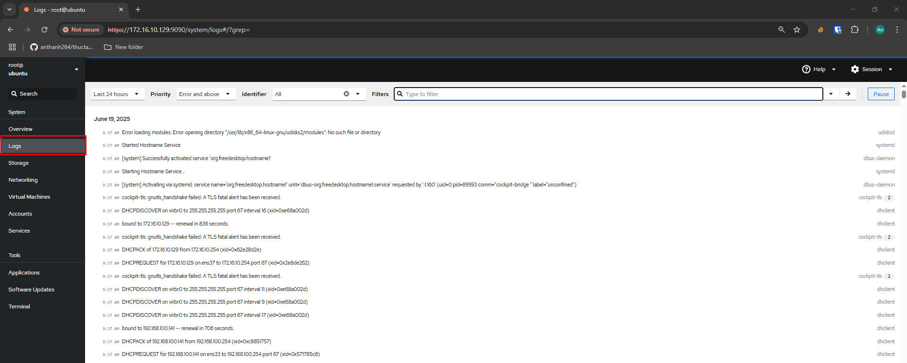
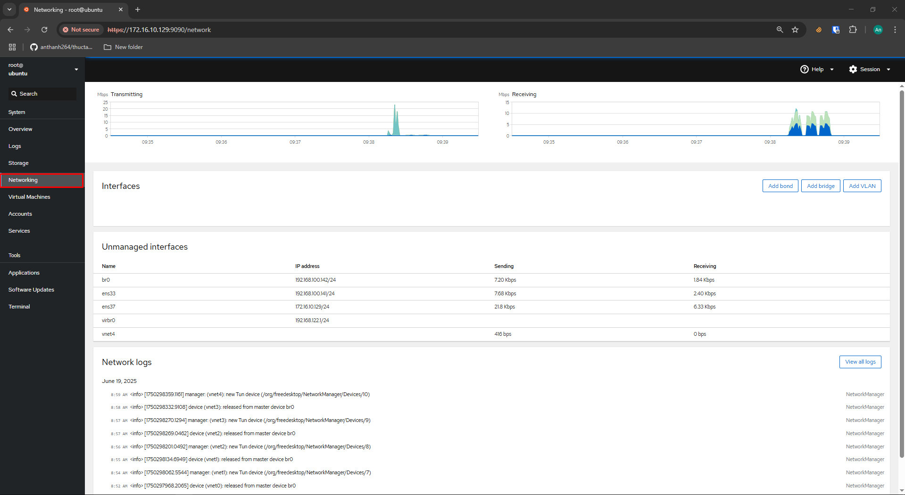

<!-- TOC start (generated with https://github.com/derlin/bitdowntoc) -->

- [KVM ](#kvm)
   * [Tổng quan](#tng-quan)
   * [Triển khai ](#trin-khai)
   * [References ](#references)

<!-- TOC end -->

<!-- TOC --><a name="kvm"></a>
# KVM 
<!-- TOC --><a name="tng-quan"></a>
## Tổng quan
- KVM (Kernel-based Virtual Machine hay Máy ảo dựa trên nhân Linux) là công nghệ ảo hóa mã nguồn mở hàng đầu dành cho hệ điều hành Linux. Nó được cài đặt sẵn trên tất cả các bản phân phối Linux và biến các máy chủ vật lý thành hypervisor (trình quản lý máy ảo), cho phép chạy nhiều máy ảo (VM) độc lập.
- KVM không yêu cầu giấy phép bản quyền, hoạt động như một hypervisor loại 1, và tích hợp nhiều tính năng mở rộng hiệu suất, khiến nó trở thành lựa chọn lý tưởng cho các hệ thống ảo hóa và triển khai hạ tầng điện toán đám mây.
- Tính năng chính và chức năng:
	- Mã nguồn mở: KVM được tích hợp sẵn trong nhân Linux và hoàn toàn miễn phí, thừa hưởng lợi ích từ cộng đồng phát triển và cập nhật bảo mật liên tục.
	- Chức năng Hypervisor: KVM biến nhân Linux thành một hypervisor loại 1, chạy trực tiếp trên phần cứng, mang lại hiệu suất cao hơn so với hypervisor loại 2 (chạy trên hệ điều hành).
	- Hỗ trợ ảo hóa phần cứng: KVM tận dụng các tính năng ảo hóa phần cứng như Intel VT và AMD-V để tăng hiệu suất và hiệu quả.
	- Quản lý máy ảo: KVM cung cấp hạ tầng để tạo, quản lý và vận hành các máy ảo, mỗi máy có phần cứng ảo riêng như card mạng, ổ đĩa, và card đồ họa.
	- Khả năng mở rộng và linh hoạt: Hỗ trợ triển khai nhiều máy ảo và có thể mở rộng quy mô dễ dàng, kể cả trong môi trường cụm máy chủ (cluster).
	- Bảo mật: Tích hợp các công nghệ như SELinux và sVirt để tăng cường cách ly và bảo vệ máy ảo.
-️ Cách hoạt động: KVM sử dụng kết hợp giữa mô-đun nhân Linux và các công cụ không gian người dùng như QEMU hoặc libvirt để quản lý và tương tác với máy ảo.
- Lợi ích khi sử dụng KVM:
	- Tối ưu tài nguyên: Cho phép hợp nhất nhiều khối lượng công việc trên một máy chủ vật lý.
	- Tiết kiệm chi phí: Là phần mềm mã nguồn mở, KVM không yêu cầu giấy phép thương mại.
	- Hiệu suất cao: Nhờ kiến trúc hypervisor loại 1 và hỗ trợ tăng tốc phần cứng, hiệu suất gần như tương đương máy thật.
	- Linh hoạt và mở rộng: Hỗ trợ nhiều hệ điều hành và dễ dàng mở rộng tài nguyên.
	- Bảo mật mạnh mẽ: Các tính năng bảo mật tích hợp giúp bảo vệ môi trường ảo hóa hiệu quả.
- KVM hypervisor cung cấp khả năng ảo hóa đầy đủ. Nó trang bị cho mỗi máy ảo (VM) tất cả các dịch vụ tiêu chuẩn của một hệ thống vật lý, bao gồm BIOS ảo và phần cứng ảo như bộ xử lý, bộ nhớ, ổ lưu trữ, card mạng, v.v. Nhờ đó, mỗi máy ảo mô phỏng hoàn toàn một máy tính vật lý thực thụ.
- KVM được triển khai dưới dạng mô-đun của nhân Linux, tích hợp trực tiếp vào mã nguồn của nhân và cho phép hệ điều hành hoạt động như một hypervisor. Mỗi máy ảo chạy như một tiến trình riêng biệt trong Linux (dưới quản lý của systemd), với các tài nguyên phần cứng ảo riêng biệt được gán.
- Tuy nhiên, KVM chỉ hoạt động trên các bộ xử lý có hỗ trợ ảo hóa phần cứng, chẳng hạn như Intel VT hoặc AMD-V.

<!-- TOC --><a name="trin-khai"></a>
## Triển khai 
- Thực hiện trên máy Ubuntu 22.04 với ít nhất 2 CPU, 2 GB RAM và 15 GB disk, gồm 2 interface mạng 1 mngt và 1 dành cho máy ảo kvm kết nối ra ngoài 
	- Đảm bảo phần cứng hỗ trợ ảo hoá Intel VT hoặc AMD-V, có thể kiểm tra bằng lệnh 
	```
	egrep -c "svm|vmx" /proc/cpuinfo
	```
	- 
	- Nếu kết quả trả về khác 0 là có hỗ trợ 
- Mô hình 
```
                  +---------------------------+
                  |       Web Interface       |
                  |     Cockpit (port 9090)   |
                  +---------------------------+
                              │
                              ▼
                  +===========================+
                  |     Ubuntu Server 22.04   |
                  |     (KVM Host Machine)    |
                  +---------------------------+
                  |   KVM + QEMU + libvirt    |
                  |   virt-manager, virsh     |
                  |   cockpit-machines        |
                  +---------------------------+
                  |                           |
                  |   Interface 1: ens37      |  → Quản lý (IP: 172.16.10.129)
                  |   Interface 2: ens33      |  → Gắn vào bridge (br0)
                  +---------------------------+
                              │
                    +---------+----------+
                    |                    |
            +---------------+    +---------------+
            |     VM #1     |    |     VM #2     |
            |   TinyCore    |    |  Ubuntu Server|
            +---------------+    +---------------+
                    │                    │
                    +---------+----------+
                              │
                        Bridge: br0
                              │
                        Mạng nội bộ / LAN
```
- Cài đặt và cấu hình KVM 
	- Cài đặt kvm và các gói liên quan 
	```
	apt -y install qemu-kvm libvirt-daemon-system libvirt-daemon virtinst bridge-utils libosinfo-bin networ- 

	- Kiểm tra để chắc chắn rằng KVM đã được cài đặt
	```
	lsmod | grep kvm
	```
	- 
	- Cấu hình Bridge networking.
		- Thực hiện tạo `br0` là bridge với interface `ens33`
		- Tạo `br0`
		```
		sudo nmcli connection add type bridge autoconnect yes con-name br0 ifname br0
		```
		- Thêm interface `ens33` vào bridge 
		```
		sudo brctl addif br0 ens33
		```
		- Xóa IP của card ens9
		```
		sudo ifconfig ens33 0
		```
		- Xin DHCP cấp IP cho bridge
		```
		sudo dhclient br0
		```
		- 
			- Lưu ý nếu gặp lỗi là do còn vướng cấu hình với netplan cần comment các cấu hình của netplan và apply 
			```
			nano /etc/netplan/*.yaml
			```
			- 
			```
			netplan apply 
			```
			- 
		- Kiểm tra nhận thấy `br0` đã nhận IP 
		```
		ip a
		```
		- 

- Cài đặt Cockpit 
	- Cockpit là một công cụ giao diện quản trị dựa trên web, mã nguồn mở, cho phép quản lý hệ thống Linux thông qua trình duyệt. Nó cung cấp khả năng giám sát, cấu hình và xử lý sự cố trên các máy chủ Linux theo thời gian thực mà không yêu cầu kiến thức sâu về dòng lệnh.
	- Tính năng chính
		- Giám sát hệ thống: Hiển thị thông tin về mức sử dụng CPU, bộ nhớ, dung lượng đĩa và trạng thái các dịch vụ đang chạy.
		- Trình xem nhật ký hệ thống: Cho phép truy cập và lọc log qua giao diện đồ họa.
		- Cấu hình mạng: Quản lý cấu hình giao diện mạng, bridge, bonding, và thiết lập firewall.
		- Quản lý người dùng: Tạo, xóa và sửa quyền người dùng.
		- Quản lý dịch vụ hệ thống: Theo dõi, khởi động hoặc dừng các dịch vụ thông qua systemd.
		- Khả năng mở rộng: Hỗ trợ các mô-đun bổ sung cho quản lý máy ảo KVM, cập nhật phần mềm, hoặc giám sát SELinux.
	- Cài đặt cockpit và cockpit-machines để quản lý máy ảo 
	```
	sudo apt install cockpit cockpit-machines -y 
	```
	- 
	- 
	- Khởi chạy và kiểm tra trạng thái 
	```
	systemctl start cockpit
	systemctl status cockpit
	```
	- 
	```
	sudo netstat -pnltu | grep 9090
	```
	- 
	- Truy cập trang quản trị `http://<server-ip>:9090`
	- 
	
- Tạo máy ảo
	- Đăng nhập vào trang quản trị 
	- 
	- Tại phần `Virtual Machines` -> `Create VM`
	- 
	- Cấu hình các thông số tên, cấu hình, file boot iso ,... ở đây thực hiện test cài TinyCore
	- 
	- VM được tạo, thực hiện các thao tác shutdown, reboot tại menu 
	- 
	- Click vào tên VM để vào giao diện quản lý 
	- 
	- Tại đây có thể thực hiện tương tác với VM thông qua giao diện console, cấu hình các thông số phần cứng, tạo snapshot,...
	- 
	- 
	
- Bên cạnh đó Cockpit còn gồm các phần 
	- Xem log trực quan tạo tab `Logs`
	- 
	- Cấu hình Storage, Network, Account tại các tab tương ứng 
	- 
	-  
	- 
	- Cấu hình các services , target, socket,...
	- 
	- Cockpit hỗ trợ giao diện dòng lệnh bên trong web console tại tab `Terminal`
	- 

 
<!-- TOC --><a name="references"></a>
## References 
- [KVM hypervisor: a beginners’ guide](https://ubuntu.com/blog/kvm-hyphervisor)
- [Hướng dẫn cài đặt KVM trên Ubuntu](https://blog.cloud365.vn/linux/huong-dan-cai-dat-kvm-tren-ubuntu/)
- [Managing KVM Virtual Machines with Cockpit Web Console in Linux](https://www.tecmint.com/manage-kvm-virtual-machines-using-cockpit-web-console/)
