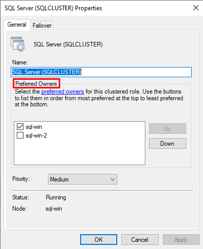
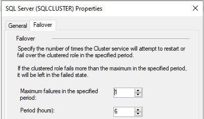
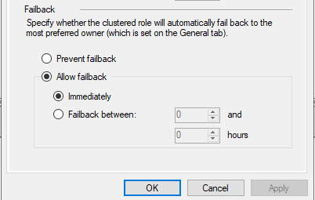
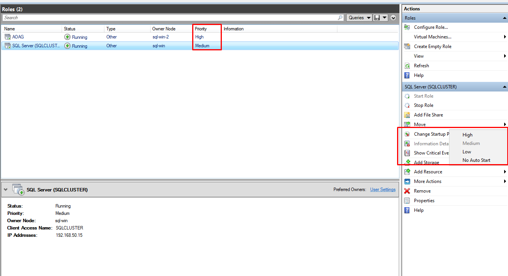

# Role, Quorum, Witness trong Windows Server Failover Clustering (WSFC)
## 1. Cấu hình Role trong Failover Cluster Manager
- Trong môi trường Windows Server Failover Clustering, "Role" đại diện cho một ứng dụng hoặc dịch vụ có thể chạy trên nhiều node để đảm bảo tính sẵn sàng cao (High Availability). Một Role có thể là SQL Server, File Server, DHCP, hoặc một máy ảo. 
- Các tùy chọn cấu hình chính cho một Role bao gồm:

- Preferred Owners  
	- Cho phép người quản trị xác định danh sách các node được ưu tiên để chạy Role. Thứ tự trong danh sách ảnh hưởng đến quá trình failover và failback. Nếu node không có trong danh sách Preferred Owners, cluster sẽ không chuyển Role sang node đó, kể cả khi node còn hoạt động.
	- Mục đích: Xác định các node được phép chạy Role này, và thứ tự ưu tiên khi failover/failback.
	- Ý nghĩa:
		- Node được chọn sẽ nằm trong danh sách ứng viên.
		- Thứ tự sắp xếp quyết định: khi nào failover xảy ra, cluster sẽ thử chuyển Role về các node theo thứ tự này.
		- Lưu ý: Nếu node không được chọn, nó sẽ không được phép chạy role này, dù các node còn lại đều đã mất.
- 

- Failover Settings  
	- Gồm hai thông số:
		- **Maximum Failures in the specified period**: Giới hạn số lần Role được phép failover trong một khoảng thời gian.
		- **Period (in hours)**: Khoảng thời gian tính toán để áp dụng giới hạn failover nêu trên.
	- Mục đích nhằm tránh vòng lặp failover liên tục, làm giảm ổn định hệ thống.
	- Ý nghĩa: Nếu Role failover vượt quá số lần này trong khoảng thời gian cấu hình → dịch vụ sẽ ngừng, không tiếp tục chuyển sang node khác để tránh “failover looping”.
- 

- Failback Settings  
	- Cho phép cấu hình Role có được tự động quay lại node ưu tiên hay không khi node đó hoạt động trở lại.  
		- **Allow failback**: Nếu bật, cluster sẽ tự động failback về node ưu tiên.
		- **Time range**: Khoảng thời gian cho phép failback (ví dụ: từ 1h đến 4h sau khi node hoạt động ổn định trở lại).
	- Không bật Allow failback: Dịch vụ sẽ tiếp tục chạy ở node hiện tại cho đến khi có hành động thủ công.
- 

- Priority  
	- Xác định mức độ ưu tiên khởi động của Role khi toàn bộ cluster được bật lại hoặc sau một sự kiện gián đoạn lớn. 
	- Gồm `4` cấp: High, Medium, Low, No AutoStart. Priority cao đảm bảo Role được kích hoạt sớm hơn và ưu tiên sử dụng tài nguyên nếu bị giới hạn.
	- Mục đích: Quy định độ quan trọng của role trong quá trình khởi động cluster hoặc phân bổ tài nguyên.
	- Role có Priority cao sẽ được khởi động trước.
	- Nếu cụm bị thiếu tài nguyên (RAM/CPU), các Role Low có thể bị trì hoãn hoặc bỏ qua.
	- Tình huống ứng dụng: SQL Server nên đặt Priority = High; dịch vụ phụ như Print Spooler có thể đặt Medium hoặc Low.
- 
- Tóm tắt 

| Tùy chọn          | Tác động chính                           | Cần chú ý                              |
| ----------------- | ---------------------------------------- | -------------------------------------- |
| Preferred Owners  | Điều khiển node nào được phép chạy Role  | Không chọn = không cho phép chạy       |
| Failover Settings | Hạn chế vòng lặp failover                | Cấu hình phù hợp tránh “ping-pong”     |
| Failback Settings | Tự động quay về node ưu tiên             | Cần xác định thứ tự và độ ổn định node |
| Priority          | Thứ tự khởi động Role khi cụm online     | Phân tầng dịch vụ rõ ràng              |
| Dependencies      | Đảm bảo tài nguyên khởi động đúng thứ tự | Tránh lỗi khởi động chéo               |

- Ví dụ 

| Thời gian     | Sự kiện                 | Trạng thái Cluster Role         | Ghi chú                     |
| ------------- | ----------------------- | ------------------------------- | --------------------------- |
| 08:00         | Node A đang chạy        | Primary trên Node A             | Preferred: A (1st), B (2nd) |
| 08:10         | Node A bị lỗi           | Cluster failover → Node B       | Node B trở thành chủ động   |
| 08:15         | Node A quay lại online  | Cluster phát hiện Node A có mặt | Kiểm tra điều kiện Failback |
| 09:15         | (sau 1h, min timeout)   | Cluster tự động failback → A    | Vì A là ưu tiên thứ 1       |
| TH Trường hợp | Không có Allow Failback | Cluster tiếp tục chạy trên B    | Không có chuyển ngược       |

- Cluster sẽ failover sang bất kỳ Preferred Owner khả dụng nào.
- Khi node đã fail trở lại online, cluster nhìn vào danh sách Preferred Owners theo thứ tự ưu tiên.
- Nếu bật Allow Failback: cluster chỉ chuyển ngược khi node cao hơn trong danh sách hoạt động ổn định, và sau khoảng thời gian chỉ định (ví dụ: 1–4h).

## 2. Cơ chế Quorum và Witness trong WSFC
- Quorum là cơ chế xác định “đủ điều kiện để cluster hoạt động” — đảm bảo rằng chỉ một phần của hệ thống có quyền kiểm soát tài nguyên, tránh tình trạng split-brain (nhiều node hoạt động độc lập và mâu thuẫn dữ liệu).
- Nếu cluster không đạt đủ “phiếu bầu” (votes), nó sẽ ngừng dịch vụ để bảo vệ tính toàn vẹn dữ liệu.
- Voting và tính đa số  
- Thông thường, mỗi node = 1 vote. Nếu có thêm witness, tổng số vote tăng lên. Cluster yêu cầu phải có trên 50% tổng số vote còn hoạt động để tiếp tục chạy.
- Ví dụ:
	- 2 node + 1 witness = 3 vote → cần tối thiểu 2 vote.
	- 4 node (không witness) = 4 vote → cần tối thiểu 3 vote.
	- 3 node (không witness) = 3 vote → cần tối thiểu 2 vote.
	- Witness là một thành phần trung lập tham gia voting nhưng không chạy dịch vụ. Witness giúp đạt đủ quorum trong các cụm có số node chẵn hoặc khi node gặp sự cố.
	- Witness là một thành phần tham gia voting như một "trọng tài trung lập", giúp đạt đa số phiếu trong cụm, đặc biệt là khi số node là chẵn (ví dụ: 2 hoặc 4).
	- Witness không chạy dịch vụ, cũng không lưu dữ liệu, chỉ có nhiệm vụ bỏ phiếu xác nhận ai xứng đáng duy trì điều khiển tài nguyên.
- Các loại witness gồm:

| **Loại Witness**       | **Mô tả**                              | **Ưu điểm**                  | **Áp dụng tốt khi**       |
| ---------------------- | -------------------------------------- | ---------------------------- | ------------------------- |
| **Disk Witness**       | Ổ đĩa chia sẻ giữa các node            | Tin cậy, dễ quản lý          | Hạ tầng on-prem có SAN    |
| **File Share Witness** | Thư mục chia sẻ trên một server thứ ba | Linh hoạt, không cần storage | Cụm 2 node, hoặc site DR  |
| **Cloud Witness**      | Azure Storage dùng làm trọng tài       | Dễ triển khai, phù hợp cloud | Hybrid cloud / Azure site |

- Witness đặc biệt quan trọng với cluster có số lượng node chẵn (ví dụ: 2 hoặc 4 node). Nếu không có witness, mất một node đồng nghĩa cluster sẽ mất quorum và ngừng hoạt động. Việc bổ sung witness sẽ giúp tăng tính sẵn sàng và ổn định hệ thống.

## 3. FCI và AOAG biết node còn sống bằng cách nào?
### 3.1. Heartbeat (nhịp kiểm tra sống)
- Mỗi node trong cluster sẽ gửi tín hiệu "I'm alive" đến node khác qua mạng cụm (cluster network).
- Tần suất mặc định: mỗi 1 giây.
- Nếu không nhận được heartbeat từ một node trong 5 giây liên tiếp, hệ thống sẽ coi node đó đã “mất”.
→ Đây là cách primary node biết replica hay secondary node còn sống, và cluster biết node nào có thể failover hoặc nhận lại vai trò.

### 3.2. Witness và Quorum Voting
- Khi mất heartbeat, quorum được dùng để bỏ phiếu xem cụm còn đủ vote để tiếp tục hoạt động hay không.
- Nếu node mất mà vẫn còn >50% vote, cluster vẫn hoạt động; nếu không thì dừng dịch vụ.
→ FCI/AOAG không chỉ cần node "sống", mà còn cần tối thiểu số phiếu sống để duy trì quyền kiểm soát (quorum).

### 3.3. Health Checks cụ thể với AOAG
- AOAG còn dùng thêm logic kiểm tra:
	- Availability Replica States: Synchronized / Synchronizing / Disconnected.
	- Endpoint health: Giao tiếp giữa các replica thông qua Database Mirroring Endpoint.
	- Availability Group Listener: Kiểm tra client có thể kết nối tới primary không.
→ Những thông tin này giúp AOAG xác định replica nào sẵn sàng failover, và replica nào chỉ đọc được thôi.

## References 
- [Failover behavior on clusters of three or more nodes](https://learn.microsoft.com/en-gb/troubleshoot/windows-server/high-availability/groups-fail-logic-three-more-cluster-node-members)
- [ClusteredInstance Properties: General Tab](https://learn.microsoft.com/en-us/previous-versions/windows/it-pro/windows-server-2008-r2-and-2008/cc754979(v=ws.11))
- [Preferred Owners in a Cluster](https://techcommunity.microsoft.com/blog/failoverclustering/preferred-owners-in-a-cluster/371290)
- [Recommended private heartbeat configuration on a cluster server](https://learn.microsoft.com/en-us/troubleshoot/windows-server/high-availability/private-heartbeat-configuration-on-cluster-server?source=recommendations)

