<!-- TOC start (generated with https://github.com/derlin/bitdowntoc) -->

- [Direct Admin (DA) - Reseller](#direct-admin-da-reseller)
   * [Tổng quan  ](#tng-quan)
   * [Dashboard](#dashboard)
   * [Account Manager](#account-manager)
      + [Add New User](#add-new-user)
      + [List Users ](#list-users)
         - [Manage User Packages](#manage-user-packages)
         - [Change Passwords](#change-passwords)
      + [Edit User Message](#edit-user-message)
      + [Suspension Message](#suspension-message)
   * [Server Manager](#server-manager)
      + [IP Management](#ip-management)
      + [Name Servers](#name-servers)
      + [DNS Administration](#dns-administration)
   * [Reseller Tools ](#reseller-tools)
      + [Manage User Backup](#manage-user-backup)
      + [cPanel Import](#cpanel-import)
      + [Message All Users](#message-all-users)
      + [Skin Manager](#skin-manager)
      + [Customize Evolution Skin](#customize-evolution-skin)
         - [Options](#options)
         - [Branding ](#branding)
   * [System Info & Files ](#system-info-files)
      + [System Information](#system-information)
      + [Reseller Statistics](#reseller-statistics)
   * [Extra Features ](#extra-features)
   * [Support & Help ](#support-help)

<!-- TOC end -->

<!-- TOC -->
# Direct Admin (DA) - Reseller
<!-- TOC -->
## Tổng quan  
- DirectAdmin là một hệ thống quản trị hosting mạnh mẽ, được thiết kế với giao diện trực quan và phân cấp rõ ràng theo từng vai trò người dùng. Trong đó, Reseller View là chế độ dành riêng cho các đại lý (reseller), những người có quyền quản lý một nhóm tài khoản người dùng (khách hàng) và các dịch vụ hosting của họ trong giới hạn tài nguyên được cấp bởi reseller hệ thống (Admin).
- Giao diện quản lý đại lý cung cấp các công cụ cần thiết để:
	- Quản lý tài khoản người dùng (User) và các gói hosting của họ.
	- Giám sát việc sử dụng tài nguyên (dung lượng, băng thông) của chính Reseller và của các User dưới quyền.
	- Cung cấp các dịch vụ hosting cơ bản như quản lý tên miền, email, cơ sở dữ liệu cho khách hàng.
	- Theo dõi thống kê sử dụng tài nguyên và duy trì hoạt động kinh doanh hosting của mình.
- Trong các phần tiếp theo, tài liệu sẽ trình bày chi tiết từng nhóm chức năng trong Reseller View, giúp người dùng nắm bắt nhanh cách sử dụng và khai thác hiệu quả các công cụ quản trị trong DirectAdmin ở cấp độ đại lý.
- Giao diện đại lý (Reseller View) trong DirectAdmin được thiết kế để cung cấp đầy đủ công cụ và thông tin cần thiết cho việc quản lý các tài khoản khách hàng của Reseller. Giao diện này bao gồm các khu vực chức năng chính sau:
	- Dashboard – Giao diện thông tin tổng quát: Đây là màn hình chính khi đăng nhập vào chế độ đại lý. Tại đây, người dùng có thể:
		- Xem nhanh các thống kê sử dụng tài nguyên của Reseller (dung lượng, băng thông đã dùng/còn lại).
		- Truy cập nhanh các chức năng quản lý tài khoản khách hàng thông qua các widget và bảng điều khiển.
	- Bảng điều hướng – Nhóm chức năng dành cho đại lý: Phần Reseller trong bảng điều hướng bên trái được chia thành các cụm chức năng chính:
		- Account Management: Quản lý User (tạo, sửa, xóa, tạm ngừng), gói User, thiết lập Name Server cá nhân, xem IP.
		- Server Manager: Giám sát trạng thái dịch vụ và thông tin hệ thống liên quan đến tài khoản Reseller và User của họ.
		- Reseller Tools: Công cụ chuyên biệt cho Reseller như cấu hình thương hiệu, quản lý IP.
		- Extra Features: Các công cụ bổ sung như Backup/Restore, cài đặt ứng dụng, quản lý DNS, Webmail, phpMyAdmin, CSF (nếu được cấp quyền).
		- Support & Help: Truy cập tài liệu hướng dẫn, quản lý và tạo ticket hỗ trợ lên Admin.

<!-- TOC -->
## Dashboard
- Giao diện này cung cấp cái nhìn tổng quan về tình trạng sử dụng tài nguyên, thông tin tài khoản reseller quản lý.
- Gồm các tab
	- Widget 
		- Khu vực hiển thị các khối thông tin nhanh (widget) về tài nguyên và dịch vụ
		- Các liên kết bên phải giao diện click để hiển thị thông tin nhanh, click `View More` để tới phần cấu hình chi tiết tương ứng 
			- Reseller Stats: Xem thống kê tài khoản đại lý.
			- 
			- List Users: Danh sách người dùng do reseller quản lý.
			- 
	- Menu: 
		- Hiển thị toàn bộ các nhóm chức năng cấu hình trong hệ thống.
		- Cho phép truy cập nhanh đến các khu vực như: Account Manager, Server Manager, Reseller Tools, System Info & Files, v.v.
			- 

<!-- TOC -->
## Account Manager
- Account Manager là nhóm chức năng trung tâm trong giao diện reseller, cho phép reseller quản lý toàn bộ tài khoản người dùng do mình tạo ra. Tại đây, reseller có thể thực hiện các thao tác tạo mới, chỉnh sửa, phân quyền, chuyển đổi và kiểm soát thông tin tài khoản.
- Nhóm chức năng quản lý tài khoản gồm 
	- Add New User: Tạo tài khoản người dùng mới với các thông tin cơ bản như tên đăng nhập, mật khẩu, gói dịch vụ.
	- List Users : Danh sách các tài khoản người dùng thuộc quyền quản lý của reseller hiện tại.
	- Manage User Packages: Quản lý các gói dịch vụ dành cho người dùng: tạo, sửa, xóa gói.
	- Change Passwords: Thay đổi mật khẩu cho một hoặc nhiều tài khoản người dùng.
	- Edit User Message: Chỉnh sửa nội dung thông báo hiển thị cho người dùng khi đăng nhập.
	- Suspension Message: Thiết lập nội dung thông báo hiển thị cho người dùng khi tài khoản bị khóa hoặc tạm ngưng.

<!-- TOC -->
### Add New User
- Reseller -> Account Manager -> Add New User
- Giao diện khởi tạo tài khoản người dùng mới. 
- 
- Các thông số cấu hình 
	- Username: Tài khoản đăng nhập DA 
	- E-mail: Địa chỉ email của người dùng.
	- Password: Mật khẩu đăng nhập có thể tạo ngẫu nhiên bằng click chọn icon `Xúc xắc` hoặc xem mật khẩu bằng icon `con mắt` 
	- Domain:  Cấu hình tên miền liên kết với người dùng.
	- User Packages: Cấu hình gói dịch vụ gán cho người dùng 
		- Có thể chọn từ list có sẵn 
		- Hoặc click `Customize` để tự thiết lập cấu hình tất cả các thông số. 
			- Các thông số trình bày chi tiết trong phần tạo gói cho user. 
			- 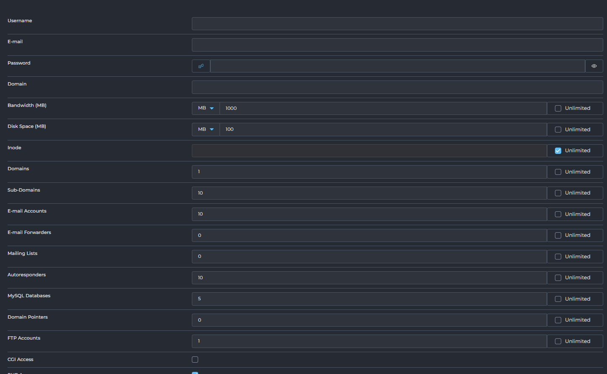
	- IP: Gán địa chỉ IP cho user. 	
	- Tuỳ chọn Send E-mail Notification: Đánh dấu chọn để gửi email thông báo cho người dùng mới.
		- Có thể chỉnh sửa cấu trúc email tại nút `EDIT USER MESSAGE` click chuyển tới phần cấu hình `Edit User Message`
		
- Ví dụ Tạo user mới:  
	- Reseller -> Account Manager -> Add New User
		- Username: demo123
		- Password: demo123@demo123.net
		- Password: Random 
		- Domain: demo123.net
		- User Package: newpackage
		- IP: Shared 
	- Click submit để tạo 
	- 
	- Khởi tạo thành công 
	- 
	- Đăng nhập 
	- 
	- 

<!-- TOC -->
### List Users 
- Hiển thị danh sách các tài khoản người dùng mà reseller tạo ra.
- 
- Các nút chức năng
	- ADD NEW USER: Nút để chuyển đến giao diện thêm người dùng mới.
	- MODIFY YOUR OWN USER DATA: Nút này có thể dùng để chỉnh sửa thông tin hoặc cấu hình của chính tài khoản người dùng hiện tại đang đăng nhập.
	- 
	- 
	- Tại đây có thể cấu hình 
		- Change Package: Thay đổi gói được cấu hình cho user hiện tại 
		- Change IP: Thay đổi địa chỉ IP được gán 
		- Manual Change Settings: Cấu hình các thông số khác 
			- 
			- 
			- Các giới hạn tài nguyên:
				- Bandwidth (MB): Dung lượng băng thông (dữ liệu truyền tải) được cấp cho tài khoản. Có thể nhập số cụ thể hoặc chọn "Unlimited" (Không giới hạn).
				- Disk Space (MB): Dung lượng ổ đĩa được cấp cho tài khoản. Có thể nhập số cụ thể hoặc chọn "Unlimited".
				- Inode: Số lượng tệp tin và thư mục tối đa mà tài khoản có thể tạo. Có thể nhập số cụ thể hoặc chọn "Unlimited".
			- Các giới hạn số lượng khác:
				- Domains: Số lượng tên miền chính tối đa mà tài khoản có thể thêm.
				- Sub-Domains: Số lượng tên miền con tối đa.
				- E-mail Accounts: Số lượng tài khoản email tối đa.
				- E-mail Forwarders: Số lượng chuyển tiếp email tối đa.
				- Mailing Lists: Số lượng danh sách gửi thư tối đa.
				- Autoresponders: Số lượng trả lời tự động email tối đa.
				- MySQL Databases: Số lượng cơ sở dữ liệu MySQL tối đa.
				- Domain Pointers: Số lượng con trỏ tên miền (domain alias/parked domain) tối đa.
				- FTP Accounts: Số lượng tài khoản FTP tối đa.
				- Anonymous FTP Accounts: Số lượng tài khoản FTP ẩn danh tối đa.
			- Các quyền truy cập tính năng: Các hộp kiểm (checkbox) này cho phép bật/tắt các tính năng cụ thể cho tài khoản:
				- CGI Access: Quyền truy cập và thực thi các tập lệnh CGI.
				- PHP Access: Quyền truy cập và thực thi các tập lệnh PHP .
				- SpamAssassin: Kích hoạt bộ lọc thư rác SpamAssassin .
				- Catch-All E-mail: Kích hoạt chức năng email Catch-All (nhận tất cả email gửi đến các địa chỉ không tồn tại trong tên miền).
				- SSL Access: Quyền truy cập và sử dụng chứng chỉ SSL.
				- SSH Access: Quyền truy cập SSH vào máy chủ.
				- Cron Jobs: Quyền tạo và quản lý các tác vụ định kỳ (cron jobs). 
				- System Info: Quyền xem thông tin hệ thống. 
				- Login Keys: Quyền tạo và quản lý khóa đăng nhập. 
				- DNS Control: Quyền quản lý các bản ghi DNS cho tên miền của tài khoản. 
				- Suspend at Limit: Tự động tạm ngưng tài khoản nếu đạt đến giới hạn tài nguyên được cấp. 
				- Automatic security.txt (RFC9116): Tự động tạo tệp security.txt theo tiêu chuẩn RFC9116. 
				- Jailed: Kích hoạt môi trường "giam giữ" (jailed shell) cho SSH, tăng cường bảo mật bằng cách hạn chế truy cập của người dùng vào các phần khác của hệ thống. 
				- Skin: Một menu thả xuống cho phép bạn chọn giao diện (theme) mà tài khoản người dùng sẽ thấy khi họ đăng nhập vào bảng điều khiển của mình.
			- Chính sách Plugin (Plugins Allow/Deny): Mục này xác định cách các plugin được cài đặt trên hệ thống sẽ được áp dụng hoặc hạn chế đối với tài khoản này.
				- Allow All: Cho phép tài khoản sử dụng tất cả các plugin có sẵn. 
				- Deny Selected: Không cho phép tài khoản sử dụng các plugin được chọn cụ thể (tức là cho phép tất cả trừ những cái bị từ chối).
				- Allow Selected: Chỉ cho phép tài khoản sử dụng các plugin được chọn cụ thể (tức là từ chối tất cả trừ những cái được phép).
			- Máy chủ tên miền (NS - Name Servers):
				- Phần này cho phép bạn định nghĩa các máy chủ tên miền chính (Name Servers) mà tài khoản sẽ sử dụng hoặc được gán.
				- NS1: Máy chủ tên miền thứ nhất.
				- NS2: Máy chủ tên miền thứ hai. 
	- Send a Message: Gửi tin nhắn đến người dùng đã chọn.
	- Suspend: Tạm ngưng hoạt động của tài khoản người dùng đã chọn.
	- Unsuspend: Kích hoạt lại tài khoản người dùng đã bị tạm ngưng.
	- Change Package: Thay đổi gói dịch vụ (User Package) cho người dùng đã chọn.
		- 
		- 
	- Change IP: Thay đổi địa chỉ IP cho người dùng đã chọn.
		- 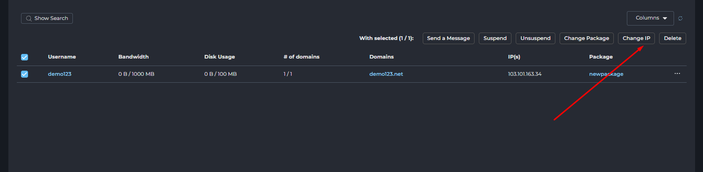
		- 
	- Delete: Xóa tài khoản người dùng đã chọn.
- Danh sách người dùng và thông tin chi tiết: Mỗi hàng trong bảng đại diện cho một tài khoản người dùng do bạn quản lý với các thông tin sau 
	- Username: Tên đăng nhập của người dùng.
		- Click chuyển tới giao diện chỉnh sửa cấu hình chi tiết người dùng. 
	- Bandwidth: Lượng băng thông đã sử dụng / tổng băng thông được cấp.
	- Disk Usage: Dung lượng đĩa đã sử dụng / tổng dung lượng được cấp.
	- `# of domains`: Số lượng tên miền hiện có / số lượng tên miền tối đa được phép.
	- Domains: Liệt kê các tên miền được liên kết với tài khoản này.
	- IP(s): Địa chỉ IP mà tài khoản người dùng được gán.
	- Package: Gói dịch vụ (User Package) mà người dùng đang sử dụng.
		- Click chuyển tới giao diện chỉnh sửa cấu hình gói - Phần Manage User Packages
	- ... (biểu tượng ba chấm): Nút tùy chọn cho phép thực hiện các hành động cụ thể cho từng người dùng.
		- Send a Message: Gửi tin nhắn đến người dùng.
		- Suspend: Tạm ngưng tài khoản.
		- Login as [Username]: Đăng nhập vào tài khoản của người dùng đó (để hỗ trợ).
		- Change user's password: Đổi mật khẩu của người dùng.
		- Remove: Xóa vĩnh viễn tài khoản.

- Giao diện thông tin chi tiết người dùng
- 
- Giao diện "View User: [username]" cung cấp cái nhìn tổng quan và các tùy chọn quản lý chi tiết cho một tài khoản người dùng cụ thể.
- Thông tin chung và tác vụ chính:
	- 
	- User History: Nút để xem lịch sử hoạt động của người dùng.
	- Change Password: Nút để thay đổi mật khẩu của người dùng này.
		- Click để đổi mật khẩu, có thể tạo ngẫu nhiên bằng click chọn icon `Xúc xắc` hoặc xem mật khẩu bằng icon `con mắt`.
		- Click `Save` để thay đổi. 
		- 
	- Bandwidth: Hiển thị băng thông đã sử dụng / tổng băng thông được cấp cho người dùng (ví dụ: 0 B / 1000 MB).
	- Disk Usage: Hiển thị dung lượng đĩa đã sử dụng / tổng dung lượng được cấp (ví dụ: 0 B / 100 MB).
	- Các nút hành động nhanh:
		- LOGIN AS [USERNAME]: Đăng nhập vào tài khoản của người dùng (dành cho reseller/reseller hỗ trợ).
		- RESEND WELCOME EMAIL: Gửi lại email chào mừng có thông tin tài khoản cho người dùng.
		- SUSPEND: Tạm ngưng hoạt động của tài khoản người dùng này.
		- DELETE: Xóa vĩnh viễn tài khoản người dùng này.
- Các tab thông tin chi tiết:
	- Giao diện được tổ chức thành các tab để hiển thị các loại thông tin khác nhau:
		- Domains : Hiển thị danh sách các tên miền liên kết với tài khoản này cùng với thông tin chi tiết về từng tên miền.
		- Usage Statistics: Thống kê chi tiết việc sử dụng tài nguyên của người dùng.
		- Account Info: Thông tin chi tiết về tài khoản người dùng.
		- Comments: Ghi chú hoặc bình luận về tài khoản.
		- Modify: Tab để chỉnh sửa các cài đặt của người dùng
	- Domains: Hiển thị danh sách các tên miền mà người dùng quản lý
		- 
		- Domain: Tên miền 
		- Bandwidth: Băng thông đã sử dụng cho tên miền đó.
		- Disk Usage: Dung lượng đĩa đã sử dụng cho tên miền đó.
		- Log Usage: Dung lượng tệp nhật ký (logs) đã sử dụng.
		- Subdomains: Số lượng tên miền con.
		- Pointers: Số lượng con trỏ tên miền (domain alias/parked domain).
		- Settings: Trạng thái các tính năng chính của tên miền (CGI, PHP, SSL).
			- CGI: Quyền thực thi CGI.
			- PHP: Quyền thực thi PHP.
			- SSL: Quyền sử dụng SSL.
	- Usage Statistics: Chi tiết về việc sử dụng tài nguyên hiện tại của một tài khoản người dùng và các giới hạn tài nguyên đã được thiết lập cho tài khoản đó
		- 
		- Các thông số tài nguyên chính: 
			- Bandwidth:
				- Usage: Lượng băng thông đã sử dụng bởi tài khoản (ví dụ: 0 B).
				- Limit: Giới hạn băng thông tối đa được cấp cho tài khoản (ví dụ: 1000 MB).
				- (Additional Bandwidth: 0 B): Có thể hiển thị băng thông bổ sung nếu có.
					- Click chọn icon `Edit` để chỉnh sửa tăng thêm băng thông tạm thời 
					- 
					- Cấu hình thông số cần thêm: theo MB/GB/TB. Click chọn Increase Bandwidth để xác nhận 
					- 
					- Ví dụ cấu hình thêm 1 GB bandwidth 
					- 
			- Disk Usage:
				- Usage: Dung lượng ổ đĩa đã sử dụng bởi tài khoản (ví dụ: 0 B).
				- Limit: Giới hạn dung lượng ổ đĩa tối đa được cấp cho tài khoản (ví dụ: 100 MB).
			- E-mail Disk Usage: Dung lượng ổ đĩa dành riêng cho email đã sử dụng.
			- Database Disk Usage: Dung lượng ổ đĩa dành riêng cho cơ sở dữ liệu đã sử dụng.
			- Inodes:
				- Usage: Số lượng Inode (tệp tin/thư mục) đã sử dụng.
				- Limit: Giới hạn số lượng Inode tối đa (ví dụ: Unlimited).
		- Các mục giới hạn số lượng :
			- `# of Domains`:
				- Usage: Số lượng tên miền chính hiện có.
				- Limit: Giới hạn số lượng tên miền chính tối đa (ví dụ: 1).
			- `# of Subdomains`: Số lượng tên miền con hiện có / giới hạn tối đa.
			- E-mail Accounts: Số lượng tài khoản email hiện có / giới hạn tối đa.
			- E-mail Forwarders: Số lượng chuyển tiếp email hiện có / giới hạn tối đa.
			- Mailing Lists: Số lượng danh sách gửi thư hiện có / giới hạn tối đa.
			- Autoresponders: Số lượng trả lời tự động email hiện có / giới hạn tối đa.
			- Sent E-mails: Số lượng email đã gửi / giới hạn gửi email mỗi ngày (ví dụ: 1000 / Day).
					- Click chọn icon `Edit` để chỉnh sửa giới hạn 
					- 
					- Cấu hình số lượng mail giới hạn gửi trong ngày. 
					- 
					- Nút chức năng: 	
						- Save: Lưu thông số đã cấu hình 
						- Reset to Defaults: Đặt lại giới hạn mặc định.
			- Received E-mails: Số lượng email đã nhận.
			- `# of MySQL DBs`: Số lượng cơ sở dữ liệu MySQL hiện có / giới hạn tối đa.
			- Domain Pointers: Số lượng con trỏ tên miền hiện có / giới hạn tối đa.
			- FTP Accounts: Số lượng tài khoản FTP hiện có / giới hạn tối đa.
	- Account Info: Cung cấp thông tin tổng quan và các chỉnh sửa các thông tin cơ bản và cài đặt của một tài khoản người dùng.
		- 
		- 
		- Thông tin liên hệ và cơ bản:
			- Contact E-mail: Địa chỉ email liên hệ chính của tài khoản. Có nút "Save E-mail" để lưu thay đổi.
			- Name: Tên hiển thị của tài khoản người dùng. Có nút "Save Name" để lưu thay đổi.
			- Language: Ngôn ngữ giao diện bảng điều khiển của tài khoản.
		- Cấu hình máy chủ tên miền và giao diện:
			- Name Server 1 / Name Server 2: Các máy chủ tên miền được gán cho tài khoản này. Có nút "Save Name Servers" để lưu thay đổi.
			- Skin: Giao diện (theme) bảng điều khiển mà tài khoản đang sử dụng. 
			- IP: Địa chỉ IP mà tài khoản được gán. 
		- Thông tin hệ thống và phân loại:
			- Date Created: Ngày và thời gian tài khoản được tạo
			- Package: Gói dịch vụ (User Package) mà tài khoản này đang sử dụng
			- User Type: Loại người dùng của tài khoản này 
			- Creator: Người hoặc tài khoản đã tạo ra tài khoản này 
		- Mục "Features" liệt kê các tính năng cụ thể cho tài khoản người dùng đang được cấu hình. 
			- Shell Access (SSH): Quyền truy cập vào máy chủ thông qua SSH. 
			- Secure Socket Layer (SSL): Quyền sử dụng và quản lý chứng chỉ SSL cho tên miền. 
			- CGI-Bin: Quyền thực thi các tập lệnh CGI. 
			- Git: Quyền sử dụng hệ thống kiểm soát phiên bản Git. 
			- WordPress: Quyền cài đặt hoặc quản lý WordPress (thông qua công cụ tự động). 
			- ClamAV: Kích hoạt trình quét virus ClamAV cho email hoặc tệp. 
			- Nginx Unit: Kích hoạt Nginx Unit (máy chủ ứng dụng đa ngôn ngữ). 
			- PHP: Quyền thực thi các tập lệnh PHP. 
			- SpamAssassin: Kích hoạt bộ lọc thư rác SpamAssassin. 
			- Catch-All E-mail: Quyền sử dụng chức năng email Catch-All. 
			- Anonymous FTP: Quyền tạo và quản lý tài khoản FTP ẩn danh. 
			- Cron Jobs: Quyền tạo và quản lý các tác vụ định kỳ (cron jobs). 
			- Redis: Quyền sử dụng bộ nhớ đệm Redis. 
			- System Info: Quyền xem thông tin hệ thống. 
			- Login Keys: Quyền tạo và quản lý khóa đăng nhập. 
			- DNS Control: Quyền quản lý các bản ghi DNS cho tên miền. 
			- Suspend at Limit: Tự động tạm ngưng tài khoản nếu đạt đến giới hạn tài nguyên được cấp. 		
	- Comments: Ghi chú hoặc bình luận về tài khoản.
		- 
	- Modify: Chỉnh sửa thông tin hoặc cấu hình của tài khoản người dùng
		- 
		- 
		- 
		- Thay đổi Gói Dịch Vụ (Change Package for User):
			- Set Package to: Một menu thả xuống cho phép chọn một gói dịch vụ (User Package) khác cho tài khoản này.
			- Save: Nút để áp dụng thay đổi gói dịch vụ.
		- Thay đổi Địa chỉ IP của Người Dùng (Change the User's IP):
			- Set IP To: Một menu thả xuống để chọn địa chỉ IP mới cho tài khoản.
			- Current IPs: Liệt kê các địa chỉ IP hiện tại của tài khoản. Có hộp kiểm để chọn và nút "Delete" để xóa IP (nếu có nhiều IP).
			- Save: Nút để áp dụng thay đổi địa chỉ IP.
		- Thay đổi Cài đặt Thủ công (Manually Change Settings):
			- Phần này cung cấp các tùy chọn để ghi đè các cài đặt từ gói dịch vụ (Package) đã chọn, cho phép tùy chỉnh riêng biệt cho tài khoản này.
			- Giới hạn tài nguyên:
				- Bandwidth (MB): Giới hạn băng thông (ví dụ: 1000). Có thể chọn "Unlimited".
				- Disk Space (MB): Giới hạn dung lượng đĩa (ví dụ: 100). Có thể chọn "Unlimited".
				- Inode: Giới hạn số lượng tệp/thư mục. Có thể chọn "Unlimited".
				- Các giới hạn số lượng mục khác: Domains, Sub-Domains, E-mail Accounts, E-mail Forwarders, Mailing Lists, Autoresponders, MySQL Databases, Domain Pointers, FTP Accounts. Tất cả đều có thể được đặt số cụ thể hoặc "Unlimited".
			- Quyền truy cập tính năng:
			- Anonymous FTP Accounts: Quyền cho phép các tài khoản FTP Anonymous
			- CGI Access: Quyền sử dụng CGI
			- PHP Access: Quyền thực thi PHP. 
			- SpamAssassin: Kích hoạt bộ lọc thư rác. 
			- Catch-All E-mail: Kích hoạt email Catch-All. 
			- SSL Access: Quyền sử dụng SSL. 
			- SSH Access: Quyền truy cập SSH. 
			- Cron Jobs: Quyền tạo tác vụ định kỳ. 
			- System Info: Quyền xem thông tin hệ thống. 
			- Login Keys: Quyền tạo khóa đăng nhập. 
			- DNS Control: Quyền quản lý DNS. 
			- Suspend at Limit: Tự động tạm ngưng khi đạt giới hạn. 
			- Automatic security.txt (RFC9116): Tự động tạo security.txt. 
			- Jailed: Kích hoạt môi trường "giam giữ" (jailed shell). 
			- Giao diện và Name Servers:
				- Skin: Chọn giao diện bảng điều khiển cho người dùng. (Hiện Evolution)
				- NS1 / NS2: Cấu hình máy chủ tên miền chính. (Đã điền địa chỉ)
				- Max limit user can set per email: Giới hạn tối đa mà người dùng có thể đặt cho mỗi email.
					- Global Limit: Cấu hình cho phép sử dụng giới hạn toàn cục của hệ thống thay vì giới hạn tùy chỉnh.
					- Click để chỉnh sửa limit 
					- 
						- Global Limit: 200
						- Unlimited: Không giới hạn 
						- Custom: Tuỳ chỉnh thông số giới hạn cụ thể. 
						- CLick `Set Limit` để áp dụng. 
		- Bộ tính năng (Feature Sets):
			- Allow All Commands: Cho phép tất cả các lệnh/tính năng.
			- Allow Selected Features: Chỉ cho phép các tính năng được chọn.
				- Khi chọn Allow Selected Features, một giao diện tùy chọn sẽ xuất hiện, cho phép bạn chọn từ các bộ tính năng hoặc nhóm tính năng được định nghĩa trước:
				- 
				- Core Functions: Bao gồm các chức năng cốt lõi và cơ bản nhất để quản lý hosting (ví dụ: quản lý tệp, cơ sở dữ liệu cơ bản, v.v.).
				- DNS Only: Giới hạn tài khoản chỉ có thể quản lý các cài đặt DNS.
				- E-mail only: Giới hạn tài khoản chỉ có thể quản lý các chức năng liên quan đến email (tạo tài khoản email, chuyển tiếp, v.v.).
		- Chính sách Plugin (Plugins Allow/Deny):
			- Allow All: Cho phép tất cả các plugin.
			- Deny Selected: Từ chối các plugin được chọn.
			- Allow Selected: Chỉ cho phép các plugin được chọn.
			- Khi bạn chọn chính sách Deny Selected hoặc Allow Selected, một khung lựa chọn các plugin sẽ tự động hiển thị bên dưới, cho phép bạn chỉ định cụ thể các plugin cần áp dụng chính sách:
				- 
				- Select All: Một hộp kiểm cho phép bạn nhanh chóng chọn hoặc bỏ chọn tất cả các plugin trong danh sách chỉ với một cú nhấp chuột.
				- Search: Một ô tìm kiếm tiện lợi giúp bạn lọc nhanh danh sách các plugin, đặc biệt hữu ích khi hệ thống của bạn có nhiều plugin được cài đặt.
				- Danh sách các Plugin: Dưới đây là danh sách các plugin hiện có trên hệ thống của bạn. Bạn sẽ đánh dấu vào hộp kiểm bên cạnh tên plugin (ví dụ: csf) để chọn hoặc bỏ chọn nó theo chính sách "Deny Selected" hoặc "Allow Selected" mà bạn đã thiết lập.		
			
			

<!-- TOC -->
#### Manage User Packages
- Giao diện "Manage User Packages" cho phép bạn tạo, chỉnh sửa, nhập và quản lý các gói dịch vụ mà bạn cung cấp cho các tài khoản người dùng của mình. Mỗi gói định nghĩa các giới hạn tài nguyên và tính năng mà một tài khoản người dùng sẽ nhận được khi được gán gói đó.
- 
- Các nút chức năng 
	- ADD PACKAGE: Nút để tạo một gói dịch vụ mới.
		- Chi tiết các thông số cấu hình trình bày bên dưới.
	- IMPORT PACKAGES: Nút để nhập các gói dịch vụ.
		- Click chọn để import 
		- 
		- Paste nội dung gói đã export và click Import
		- 
	- Delete: Xóa các gói dịch vụ đã chọn.
		- 
		- 
	- Export: Xuất cấu hình của các gói dịch vụ đã chọn.
		- 
		- 
- Danh sách Gói dịch vụ: Bảng này hiển thị tất cả các gói dịch vụ đã được tạo trong hệ thống của bạn, với các thông tin cơ bản:
	- 
	- Package: Tên của gói dịch vụ . Đây là tên mà bạn sẽ thấy khi gán gói cho người dùng mới hoặc thay đổi gói của người dùng hiện tại.
		- Click tên gói để mở giao diện chỉnh sửa gói. 
			- 
	- Bandwidth: Giới hạn băng thông (dữ liệu truyền tải) được cấp cho các tài khoản sử dụng gói này. 
	- Disk Usage: Giới hạn dung lượng ổ đĩa được cấp cho các tài khoản sử dụng gói này.
	- ... (biểu tượng ba chấm): Nút tùy chọn cho phép thực hiện các hành động cụ thể cho từng gói.
		- Rename: Đổi tên gói. 
			- 
			- 
		- Copy: Sao chép gói. 
			- 
			- 

- Tạo gói dịch vụ mới 
	- Click chọn Add Package
		- 
	- Chi tiết các cấu hình 
		- Giới hạn tài nguyên:
			- 
			- Bandwidth (MB): Giới hạn băng thông (ví dụ: 1000). Có thể chọn "Unlimited".
			- Disk Space (MB): Giới hạn dung lượng đĩa (ví dụ: 100). Có thể chọn "Unlimited".
			- Inode: Giới hạn số lượng tệp/thư mục. Có thể chọn "Unlimited".
			- Các giới hạn số lượng mục khác: Domains, Sub-Domains, E-mail Accounts, E-mail Forwarders, Mailing Lists, Autoresponders, MySQL Databases, Domain Pointers, FTP Accounts, E-mail Daily Limit. Tất cả đều có thể được đặt số cụ thể hoặc "Unlimited".
		- Quyền truy cập tính năng:
			- 
			- Anonymous FTP Accounts: Quyền cho phép các tài khoản FTP Anonymous
			- CGI Access: Quyền sử dụng CGI
			- PHP Access: Quyền thực thi PHP. 
			- SpamAssassin: Kích hoạt bộ lọc thư rác. 
			- Catch-All E-mail: Kích hoạt email Catch-All. 
			- SSL Access: Quyền sử dụng SSL. 
			- SSH Access: Quyền truy cập SSH. 
			- Cron Jobs: Quyền tạo tác vụ định kỳ. 
			- System Info: Quyền xem thông tin hệ thống. 
			- Login Keys: Quyền tạo khóa đăng nhập. 
			- DNS Control: Quyền quản lý DNS. 
			- Suspend at Limit: Tự động tạm ngưng khi đạt giới hạn. 
			- Automatic security.txt (RFC9116): Tự động tạo security.txt. 
			- Jailed: Kích hoạt môi trường "giam giữ" (jailed shell). 
			- Skin: Chọn giao diện bảng điều khiển cho người dùng. 
			- Language: Ngôn ngữ giao diện bảng điều khiển của tài khoản.
		- Bộ tính năng (Feature Sets):
			- 
			- Allow All Commands: Cho phép tất cả các lệnh/tính năng.
			- Allow Selected Features: Chỉ cho phép các tính năng được chọn.
				- Khi chọn Allow Selected Features, một giao diện tùy chọn sẽ xuất hiện, cho phép bạn chọn từ các bộ tính năng hoặc nhóm tính năng được định nghĩa trước:
				- Core Functions: Bao gồm các chức năng cốt lõi và cơ bản nhất để quản lý hosting (ví dụ: quản lý tệp, cơ sở dữ liệu cơ bản, v.v.).
				- DNS Only: Giới hạn tài khoản chỉ có thể quản lý các cài đặt DNS.
				- E-mail only: Giới hạn tài khoản chỉ có thể quản lý các chức năng liên quan đến email (tạo tài khoản email, chuyển tiếp, v.v.).
		- Chính sách Plugin (Plugins Allow/Deny):
			- 
			- Allow All: Cho phép tất cả các plugin.
			- Deny Selected: Từ chối các plugin được chọn.
			- Allow Selected: Chỉ cho phép các plugin được chọn.
			- Khi bạn chọn chính sách Deny Selected hoặc Allow Selected, một khung lựa chọn các plugin sẽ tự động hiển thị bên dưới, cho phép bạn chỉ định cụ thể các plugin cần áp dụng chính sách:
				- Select All: Một hộp kiểm cho phép bạn nhanh chóng chọn hoặc bỏ chọn tất cả các plugin trong danh sách chỉ với một cú nhấp chuột.
				- Search: Một ô tìm kiếm tiện lợi giúp bạn lọc nhanh danh sách các plugin, đặc biệt hữu ích khi hệ thống của bạn có nhiều plugin được cài đặt.
				- Danh sách các Plugin: Dưới đây là danh sách các plugin hiện có trên hệ thống của bạn. Bạn sẽ đánh dấu vào hộp kiểm bên cạnh tên plugin (ví dụ: csf) để chọn hoặc bỏ chọn nó theo chính sách "Deny Selected" hoặc "Allow Selected" mà bạn đã thiết lập.
		- Cấu hình tên cho gói (Package Name): Nhập tên định danh cho gói dịch vụ mới 
			- 
		- Nút chức năng `Save`: Lưu cấu hình tạo gói dịch vụ mới.
			- 
		
<!-- TOC -->
#### Change Passwords
- Giao diện trong DirectAdmin cho phép reseller thay đổi mật khẩu cho một tài khoản cụ thể.
- 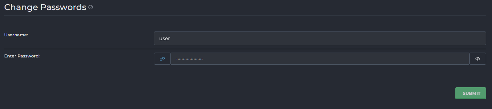
	- "Username" (Tên người dùng): Trường nhập liệu này dùng để nhập tên người dùng của tài khoản mà bạn muốn thay đổi mật khẩu.
	- "Enter Password" (Nhập Mật khẩu): Trường nhập liệu này dùng để nhập mật khẩu mới mà bạn muốn đặt cho tài khoản đã chọn.
		- Bên cạnh trường mật khẩu, có một icon `con mắt` cho phép bạn hiển thị hoặc ẩn mật khẩu đã nhập để dễ dàng kiểm tra.
		- Cũng có một icon `xúc xắc` kích hoạt tính năng tạo mật khẩu ngẫu nhiên.
	- Nút "SUBMIT" (Gửi): Sau khi nhập tên người dùng và mật khẩu mới, nhấp vào nút này để lưu thay đổi và áp dụng mật khẩu mới cho tài khoản.
- Ví dụ đổi password user `user` 
- 
- 
- 

<!-- TOC -->
### Edit User Message
- Giao diện "Edit User Message" cho phép reseller tùy chỉnh nội dung của email chào mừng được gửi tự động đến người dùng mới khi tài khoản của họ được tạo ra trên hệ thống DirectAdmin.
- 
- Mục đích:
	- Cho phép reseller tùy chỉnh thông điệp chào mừng, cung cấp thông tin cần thiết và hướng dẫn rõ ràng cho người dùng mới ngay sau khi tài khoản của họ được kích hoạt.
	- Đảm bảo tính chuyên nghiệp và đồng nhất trong giao tiếp với khách hàng.
- Tổng quan giao diện 
	- Tiêu đề Email (Subject):
		- Subject: Trường này chứa tiêu đề của email chào mừng.
			- Ví dụ mặc định: `Your account for |DOMAIN| is now ready for use.`
			- Bạn có thể sử dụng các biến (ví dụ `|DOMAIN|`) để tự động điền thông tin cụ thể của người dùng.
	- Nội dung Email (Message):
		- Message: Đây là khu vực nơi bạn có thể soạn thảo nội dung chính của email chào mừng.
		- Nội dung mẫu thường bao gồm lời cảm ơn, thông tin chi tiết tài khoản, và hướng dẫn đăng nhập.
		- Bạn có thể sử dụng các biến (placeholder) để hệ thống tự động điền thông tin tài khoản của người dùng mới:
			- `|USERNAME|`: Tên đăng nhập của người dùng.
			- `|PASSWORD|`: Mật khẩu của người dùng.
			- `|DOMAIN|`: Tên miền chính của tài khoản.
			- `|IP|`: Địa chỉ IP của máy chủ.
			- `|PORT|`: Cổng đăng nhập.
			- `|BANDWIDTH|`: Giới hạn băng thông của gói dịch vụ.
			- `|DISKSPACE|`: Giới hạn dung lượng đĩa của gói dịch vụ.
		- Các biến này giúp cá nhân hóa email cho từng người dùng mà không cần chỉnh sửa thủ công.
	- Các nút hành động:
		- RESET TO DEFAULT: Nút này sẽ khôi phục tiêu đề và nội dung email về trạng thái mặc định ban đầu của hệ thống.
		- SAVE: Nút này để lưu lại các thay đổi bạn đã thực hiện trong tiêu đề và nội dung email.
		
<!-- TOC -->
### Suspension Message
- Tùy chỉnh nội dung email thông báo sẽ được gửi tự động khi một tài khoản người dùng bị đình chỉ.
- 
- Các tùy chọn cấu hình:
	- Subject (Tiêu đề): Đây là dòng tiêu đề của email thông báo.
		- `[USERNAME]`: Đây là một biến tự động thay thế bằng tên đăng nhập của tài khoản bị đình chỉ.
		- `[REASON]`: Đây là một biến tự động thay thế bằng lý do đình chỉ mà bạn nhập khi thực hiện đình chỉ tài khoản.
	- Message (Nội dung tin nhắn): Đây là phần nội dung chính của email thông báo.
		- Cũng sử dụng các biến `[USERNAME]` và `[REASON]` để cá nhân hóa nội dung.
		- `[MSG_FOOTER]`: Đây là một biến khác, thường được tự động thay thế bằng thông tin chân trang của email (ví dụ: tên công ty, thông tin liên hệ, logo), được cấu hình ở một nơi khác trong DirectAdmin.
	- Notify (Thông báo): Khi ô này được chọn, hệ thống sẽ tự động gửi email thông báo đình chỉ theo mẫu này đến tài khoản bị đình chỉ khi bạn thực hiện hành động "Suspend" (Đình chỉ). Nếu không chọn, tài khoản vẫn bị đình chỉ nhưng không nhận được email thông báo.
- Các nút chức năng:
	- RESET (góc trên bên phải): Nút này sẽ đặt lại tiêu đề và nội dung tin nhắn về giá trị mặc định của hệ thống.
	- SAVE (góc dưới bên phải): Nút này sẽ lưu các thay đổi của bạn đối với tin nhắn đình chỉ.

<!-- TOC -->
## Server Manager
- "Server Manager" (Quản lý Máy chủ) là một trong những khu vực quan trọng nhất trong bảng điều khiển DirectAdmin dành cho reseller. Nó tập trung các công cụ và cài đặt cấp độ máy chủ, cho phép người dùng có quyền reseller kiểm soát các hoạt động, hiệu suất và bảo mật của các tính năng hosting được cấp. 
- Đây là nơi bạn thực hiện các tác vụ như quản lý IP, cấu hình NameServer, DNS.
- 
- Server Manager trong DirectAdmin là nơi reseller quản lý các cài đặt 
	- IP Management :Quản lý địa chỉ IP được cấp.
	- Name Servers: Thiết lập các máy chủ tên miền chính (ns1, ns2...).
	- DNS Administration: Quản lý các bản ghi DNS cho tên miền.

	
<!-- TOC -->
### IP Management
- Giao diện xem, thêm, và quản lý các địa chỉ IP được sử dụng trên máy chủ.
- Bảng danh sách các địa chỉ IP
	- 
	- Đây là phần chính hiển thị tất cả các địa chỉ IP đang được DirectAdmin quản lý trên máy chủ của bạn.
		- Checkbox: Để chọn một hoặc nhiều địa chỉ IP để thực hiện các hành động hàng loạt.
		- IP: Địa chỉ IP.
		- Status: Trạng thái của địa chỉ IP.
		- Users: Số lượng tài khoản người dùng (User) đang được gán hoặc sử dụng địa chỉ IP này.
		- Name Server: Tên Nameserver được liên kết với IP này. 
	- Các nút hành động hàng loạt 
		- Share: Đặt IP ở chế độ chia sẻ (cho phép nhiều tài khoản sử dụng).
		- Free: Giải phóng IP, làm cho nó có sẵn để gán lại.

<!-- TOC -->
### Name Servers
- 
- Giao diện cấu hình các nameserver mặc định mà hệ thống sẽ gán cho các người dùng mới hoặc các tên miền mới được tạo trên máy chủ DirectAdmin của bạn.
- Nút chức năng `CREATE NAME SERVERS`: 
	- Được sử dụng để tạo các "glue records" (hay còn gọi là private nameserver hoặc child nameserver) trên máy chủ DirectAdmin. 
	- Điều này có nghĩa là bạn muốn ns1.yourdomain.com và ns2.yourdomain.com hoạt động như các nameserver, và bạn cần tạo các bản ghi A tương ứng cho chúng trên máy chủ này.
	- Click mở giao diện khởi tạo 
		- 
		- 
		- Domain: 
			- Chọn tên miền mà bạn muốn tạo Private Nameservers. 
			- Bạn sẽ chọn tên miền của mình từ danh sách các tên miền mà DirectAdmin đang quản lý.
			- Lưu ý: Tên miền này phải đã được thêm vào DirectAdmin và có DNS zone của riêng nó.
		- Checkbox "Virtual": Khi tích chọn: DirectAdmin sẽ tự động tạo các bản ghi A cho ns1.yourdomain.com và ns2.yourdomain.com trỏ về địa chỉ IP của server DirectAdmin hiện tại. Đồng thời, nó cũng sẽ thêm các bản ghi NS vào DNS zone của tên miền để khai báo các nameserver này.
			- Name Server 1: Tên của nameserver chính mà bạn muốn tạo.
			- Giá trị mặc định/Ví dụ: ns1 (DirectAdmin sẽ tự động thêm .abcdxyz.com vào cuối). Kết quả sẽ là ns1.abcdxyz.com.
		- Name Server 2:
			- Tên của nameserver phụ mà bạn muốn tạo.
			- Giá trị mặc định/Ví dụ: ns2 (DirectAdmin sẽ tự động thêm .abcdxyz.com vào cuối). Kết quả sẽ là ns2.abcdxyz.com.
	- Ví dụ tạo NS cho demo123.net 
		- Cấu hình 
			- 
		- Khởi tạo thành công 
			- 
		- Kiểm tra 
			- 
- Bảng quản lý IP cho Nameserver
	- 
	- Phần này hiển thị danh sách các địa chỉ IP được liên kết với các Nameserver trên máy chủ. 
		- Checkbox : Để chọn IP.
		- IP: Địa chỉ IP.
		- Status: Trạng thái của IP.
		- User(s): Số lượng người dùng đang được gán cho IP này.
		- Name Server: Tên Nameserver được liên kết với IP này. 
		- Nút chức năng Delete: Xóa địa chỉ IP đã chọn khỏi danh sách này. Cẩn thận khi sử dụng.
- Set the Name servers that will be assigned to new users
	- 
	- Đây là phần quan trọng nhất của giao diện này. Nó cho phép bạn định nghĩa các nameserver mặc định mà DirectAdmin sẽ tự động điền vào khi một người dùng tạo một tài khoản hosting mới hoặc thêm một tên miền mới.
	- Name Server 1: Đây là nameserver chính mà bạn đã cấu hình cho máy chủ DirectAdmin của mình.
	- Name Server 2: Đây là nameserver phụ mà bạn đã cấu hình cho máy chủ DirectAdmin của mình.
	- SAVE: Sau khi bạn thay đổi các giá trị Name Server 1 và Name Server 2, nhấp vào nút này để lưu lại cấu hình.

<!-- TOC -->
### DNS Administration
- 
- Giao diện quản trị DNS, tại đây reseller có thể xem, chỉnh sửa các DNS zone cho tất cả các tên miền do mình quản lý trên máy chủ.
- Bộ lọc và tìm kiếm
	- 
	- Enter your search criteria...: Ô tìm kiếm để lọc các DNS zone theo tên miền.
	- Show domains that: Starts With: Lọc các tên miền bắt đầu bằng một ký tự hoặc chuỗi ký tự cụ thể.
	- Local Data: Lọc các zone có dữ liệu DNS được quản lý cục bộ trên server này. Both / Enabled / Disabled: Hiển thị tất cả, chỉ các zone đang hoạt động hoặc chỉ các zone bị vô hiệu hóa.
	- Local Mail: Lọc các zone có dịch vụ mail được quản lý cục bộ trên server này. Both / Enabled / Disabled: Tương tự như Local Data.
- Bảng danh sách các DNS Zone
	- 
	- Đây là phần chính hiển thị tất cả các DNS zone đang được quản lý bởi DirectAdmin trên server của bạn.
	- Domain: Tên miền của DNS zone.
		- Click vào tên để mở giao diện quản lý chi tiết các bản ghi của tên miền. 
		- 
		- 
	- Local Data: Trạng thái quản lý dữ liệu DNS cục bộ.
		- Yes (Yes): DNS zone này đang được quản lý và lưu trữ dữ liệu DNS trên máy chủ DirectAdmin hiện tại. Điều này có nghĩa là các bản ghi A, CNAME, MX, v.v., của tên miền này được DirectAdmin kiểm soát.
		- No (No): Có thể tên miền này đang sử dụng nameserver bên ngoài, hoặc DNS zone chưa được cấu hình đầy đủ trên DirectAdmin. Biểu tượng cảnh báo màu vàng cho biết có vấn đề hoặc cấu hình chưa hoàn chỉnh.
	- Local Mail: Trạng thái quản lý dịch vụ email cục bộ.
		- Yes (Yes): Dịch vụ email cho tên miền này được quản lý bởi máy chủ DirectAdmin hiện tại. Điều này có nghĩa là máy chủ này sẽ nhận và gửi email cho tên miền đó.
		- No (No): Dịch vụ email cho tên miền này không được quản lý bởi máy chủ DirectAdmin hiện tại. Có thể nó đang trỏ đến một dịch vụ email bên ngoài (như Google Workspace, Outlook 365, v.v.). Biểu tượng cảnh báo màu vàng tương tự như Local Data.
	
- Giao diện quản trị bản ghi chi tiết của tên miền 
	- 
- Các nút chức năng: 
	- DNSSEC: Click chuyển tới giao diện cấu hình DNSSEC. DNSSEC giúp bảo vệ các tên miền khỏi các cuộc tấn công giả mạo dữ liệu DNS. Bạn có thể nhấp vào đây để quản lý cấu hình DNSSEC cho tên miền này.
		- 
		- Giao diện quản trị DNSSEC 
		- Trường hợp chưa có key DNS click chọn sinh key
		- 
		- 
		- Zone Keys đã được khởi tạo 
		- 
		- Click Sign your zone để ký 
		- 
		- 
			- Signing Status (Trạng thái ký): Phần này cung cấp thông tin về trạng thái ký DNSSEC của zone:
				- Zone Last Updated: Cho biết thời điểm gần nhất zone DNSSEC này được cập nhật (ví dụ: khi bạn ký lại zone hoặc tạo khóa mới).
				- Expiry: Cho biết thời điểm chữ ký DNSSEC hiện tại của zone sẽ hết hạn. DNSSEC yêu cầu chữ ký được làm mới định kỳ (ký lại zone) để duy trì tính bảo mật. Bạn sẽ cần ký lại zone trước ngày này.
			- Parent Zone Configuration (Cấu hình Zone Parent): Đây là phần cực kỳ quan trọng cho việc kích hoạt DNSSEC. Nó giải thích rằng để thiết lập chuỗi tin cậy, một bản ghi DS (hoặc nhiều bản ghi) phải được thêm vào zone parent (tại nhà đăng ký tên miền của bạn).
			- Zone Keys (Các khóa Zone): Phần này hiển thị thông tin về các cặp khóa DNSSEC của bạn (ZSK và KSK).
		- Để hoàn tất cấu hình DNSSEC bản ghi tại phần `Parent Zone Configuration` cần được thêm vào Zone Parent của nhà cung cấp tên miền. 
		- Có thể kiểm tra trạng thái DNSSEC tại [DNSSEC Debugger](https://dnssec-debugger.verisignlabs.com/)
	- RESET DEFAULTS: Sử dụng nhằm đưa tất cả các bản ghi DNS của zone về trạng thái mặc định ban đầu. Nó sẽ xóa tất cả các tùy chỉnh bạn đã thực hiện.
		- 
		- 
	- OVERRIDE TTL: Nút này cho phép bạn thay đổi giá trị TTL (Time To Live) mặc định cho tất cả các bản ghi trong zone này. TTL thấp hơn sẽ giúp các thay đổi DNS được cập nhật nhanh hơn trên toàn cầu, nhưng cũng có thể làm tăng tải trên máy chủ DNS.
		- 
		- 
	- ADD RECORD: Sử dụng để thêm một bản ghi DNS mới vào zone.
		- 
		- 
		- Record Type (Loại bản ghi): Đây là một menu thả xuống (dropdown) nơi bạn chọn loại bản ghi DNS mà bạn muốn thêm.
			- 
			- Các loại bản ghi phổ biến khác mà bạn có thể chọn từ danh sách này bao gồm:
				- A: Ánh xạ tên miền/subdomain tới địa chỉ IPv4.
				- AAAA: Ánh xạ tên miền/subdomain tới địa chỉ IPv6.
				- CNAME: Tạo một bí danh cho một tên miền khác.
				- MX: Chỉ định máy chủ mail cho tên miền.
				- TXT: Chứa văn bản tùy ý, thường dùng cho xác minh hoặc SPF/DKIM.
				- SRV: Xác định dịch vụ cụ thể được cung cấp bởi một máy chủ (ví dụ: SIP, XMPP).
				- NS: Chỉ định nameserver có thẩm quyền cho một subdomain.
				- PTR: (Thường là Reverse DNS, ít khi được thêm thủ công ở đây).
		- Name: Xác định tên máy chủ hoặc subdomain cho bản ghi này.
		- TTL (Time To Live): Xác định thời gian (bằng giây) mà các máy chủ DNS khác nên lưu trữ bản ghi này trong bộ nhớ cache của họ trước khi yêu cầu một bản sao mới.
		- Value (Giá trị): Đây là dữ liệu chính của bản ghi, nội dung của nó phụ thuộc vào loại bản ghi đã chọn.
		- Nút chức năng 
			 - Close: huỷ thao tác 
			 - Add: Thêm bản ghi.
- Bảng danh sách các bản ghi DNS
	- Đây là phần chính hiển thị tất cả các bản ghi DNS hiện có cho tên miền . Mỗi bản ghi được hiển thị với các thông tin:
	- 
	- Checkbox: Để chọn nhiều bản ghi cùng lúc cho các hành động hàng loạt (như xóa nhiều bản ghi).
	- Name: Tên của bản ghi hoặc subdomain.
	- TTL (Time To Live): Thời gian mà các máy chủ DNS khác nên lưu trữ thông tin bản ghi này trong bộ nhớ cache của họ (tính bằng giây).
	- Type: Loại bản ghi DNS (ví dụ: A, NS, MX, TXT).
	- Value: Giá trị của bản ghi, tùy thuộc vào loại bản ghi.
	- Nút chức năng Edit: Dùng để chỉnh sửa bản ghi 
		- Click mở giao diện chỉnh sửa bản ghi. Save để lưu chỉnh sửa. 
		- 
		- 
	
<!-- TOC -->
## Reseller Tools 
- Phần "Reseller Tools" (Công cụ Reseller) của DirectAdmin cung cấp một bộ sưu tập các công cụ mạnh mẽ dành cho Reseller để thực hiện các tác vụ quản lý, giám sát, bảo trì và di chuyển dữ liệu. Các công cụ này giúp bạn duy trì hoạt động ổn định, an toàn và hiệu quả của máy chủ.
- 	
- Gồm các công cụ 
	- Manage User Backup: Quản lý các bản sao lưu của người dùng 
	- cPanel Import: Chuyển các tài khoản và dữ liệu từ máy chủ cPanel sang DirectAdmin.
	- Message All Users: Gửi thông báo đến tất cả người dùng trên máy chủ.
	- Skin Manager: Quản lý và thay đổi giao diện người dùng DirectAdmin.
	- Customize Evolution Skin: Tùy chỉnh giao diện Evolution mặc định (màu sắc, logo, v.v.).
<!-- TOC -->
### Manage User Backup
- 	
- Phần này cho phép bạn lên lịch, thực hiện và quản lý các bản sao lưu người dùng.
- Các nút chức năng 
	- Backup/Restore Settings (Cài đặt Sao lưu/Khôi phục):
		- 	
		- 	
		- Send a message when a backup has finished. (Gửi thông báo khi sao lưu hoàn tất.) Nếu được chọn, hệ thống sẽ gửi một thông báo (thường qua email) đến reseller hoặc người dùng khi một tác vụ sao lưu hoàn thành, dù thành công hay có lỗi.
		- Restore with local NameServers. (Khôi phục với NameServer cục bộ.). Khi khôi phục một tài khoản, NameServer (NS) của domain sẽ được đặt thành NS của máy chủ hiện tại (local). Hữu ích khi bạn di chuyển tài khoản sang một máy chủ mới hoặc muốn đảm bảo rằng domain sử dụng NS của máy chủ hiện tại.
		- Use NS values from backup. (Sử dụng giá trị NS từ bản sao lưu.): Khi khôi phục một tài khoản, NameServer (NS) của domain sẽ được đặt theo giá trị NS đã có trong bản sao lưu. Hữu ích nếu bạn muốn giữ nguyên cấu hình NS như trước khi sao lưu hoặc khi di chuyển tài khoản quay lại máy chủ ban đầu.
		- Restore with SPF values from backup. (Khôi phục với giá trị SPF từ bản sao lưu.): Khi khôi phục, bản ghi SPF (Sender Policy Framework) của domain sẽ được đặt theo giá trị đã có trong bản sao lưu. Đảm bảo các thiết lập chống spam của domain được giữ nguyên sau khi khôi phục.
		- Use local SPF values. (Sử dụng giá trị SPF cục bộ.): Khi khôi phục, bản ghi SPF của domain sẽ được đặt theo giá trị SPF mặc định hoặc cấu hình cục bộ của máy chủ hiện tại. Hữu ích khi bạn muốn áp dụng chính sách SPF mới của máy chủ hoặc đơn giản hóa việc khôi phục.
	- Nút `+ SCHEDULE`:
		- 	
		- Chức năng "Schedule Backup" trong DirectAdmin cho phép bạn tự động hóa quá trình sao lưu dữ liệu của các tài khoản người dùng. 
		- Quá trình này được chia thành ba bước chính: Xác định Đối tượng (Who), Thời điểm (When), Vị trí lưu trữ (Where) cần sao lưu.
		- Bước 1: Đối tượng sao lưu (Step 1: Who)
			- 
			- Bước này cho phép bạn chọn tài khoản người dùng nào sẽ được đưa vào bản sao lưu.
				- All Users: Sao lưu tất cả người dùng trên hệ thống.
				- All Users Except Selected: Sao lưu tất cả người dùng trừ những người bạn chọn.
				- Selected Users: Chỉ sao lưu những người dùng cụ thể mà bạn chọn từ danh sách.
					- Bạn có thể tìm kiếm người dùng cụ thể bằng cách sử dụng ô "Search".
					- Bạn có thể chọn từng người dùng bằng cách đánh dấu vào ô checkbox bên cạnh tên của họ 
			- Skip Suspended: Đánh dấu vào tùy chọn này nếu bạn muốn bỏ qua việc sao lưu các tài khoản đã bị tạm ngừng (suspended).
			- Sau khi lựa chọn đối tượng sao lưu, nhấn "Next Step" để tiếp tục.
		- Bước 2: Thời điểm sao lưu (Step 2: When)
			- 
			- Bước này quy định thời gian mà quá trình sao lưu sẽ diễn ra.
			- Now: Thực hiện sao lưu ngay lập tức khi bạn nhấn nút "Schedule".
			- Cron Schedule: Lên lịch sao lưu tự động dựa trên cấu hình Cron Job. Bạn sẽ cần điền các thông số sau:
				- Minute (Phút): `0-59` (ví dụ: `0` = đầu giờ, `30` = nửa giờ, `*/5` = mỗi 5 phút)
				- Hour (Giờ): `0-23` (ví dụ: `5` = 5 giờ sáng, `17` = 5 giờ chiều, `*/2` = mỗi 2 giờ)
				- Day of Month (Ngày trong tháng): `1-31` (ví dụ: `1` = ngày 1, `15` = ngày 15)
				- Month (Tháng): `1-12` (hoặc tên viết tắt: `JAN`, `FEB`, v.v.)
				- Day of Week (Ngày trong tuần): `0-7` (`0` hoặc `7` = Chủ Nhật, `1` = Thứ Hai, ..., `6` = Thứ Bảy)
				- Ký hiệu chung:
					- `*`: Mọi giá trị (mỗi phút, mỗi giờ, v.v.)
					- `,`: Liệt kê nhiều giá trị (ví dụ: `1,15` = ngày 1 và ngày 15)
					- `-`: Phạm vi giá trị (ví dụ: `1-5` = Thứ Hai đến Thứ Sáu)
					- `/`: Bước nhảy (ví dụ: `*/5` = mỗi 5 đơn vị)
				- Ví dụ: Sao lưu vào 10:45 tối, ngày 1 và ngày 15 của mỗi tháng, nhưng CHỈ nếu ngày đó là Thứ Ba hoặc Thứ Sáu.
					- Cấu hình Cron Schedule:
						- Minute: 45
						- Hour: 22 (10 tối)
						- Day of Month: 1,15
						- Month: *
						- Day of Week: 2,5 (2 = Thứ Ba, 5 = Thứ Sáu)
					- 
			- Sau khi cấu hình thời điểm sao lưu, nhấn "Next Step" để tiếp tục.
		- Bước 3: Vị trí lưu trữ sao lưu (Step 3: Where)
			- 
			- Bước này xác định nơi bản sao lưu sẽ được lưu trữ.
				- Local: Lưu trữ bản sao lưu trên máy chủ DirectAdmin.
				- FTP: Gửi bản sao lưu đến một máy chủ FTP từ xa. Khi chọn FTP, bạn cần cung cấp các thông tin sau:
					- IP: Địa chỉ IP hoặc tên máy chủ của máy chủ FTP.
					- Username: Tên người dùng để đăng nhập vào máy chủ FTP.
					- Password: Mật khẩu của tài khoản FTP.
					- Remote Path: Đường dẫn trên máy chủ FTP nơi bản sao lưu sẽ được lưu (ví dụ: `/` cho thư mục gốc, hoặc `/backups/` cho một thư mục cụ thể).
					- Port: Cổng FTP (mặc định là 21).
					- Secure FTP: Đánh dấu vào ô này nếu bạn muốn sử dụng SFTP (FTP bảo mật) để truyền dữ liệu.
			- Append: Tùy chọn để thêm ngày hoặc thời gian vào tên tệp sao lưu, giúp bạn dễ dàng quản lý các bản sao lưu khác nhau. Các tùy chọn bao gồm: "Nothing", "Day of Week", "Day of Month", "Week of Month", "Month", "Full Date". Ví dụ, "Full Date: /2025-07-17" sẽ thêm ngày đầy đủ vào tên tệp.
		- Sau khi cấu hình, nhấn nút "Schedule" để hoàn tất và lên lịch sao lưu.
	- Nút `Restore` 
		- 	
		- Chức năng "Restore Backup" trong DirectAdmin cho phép bạn khôi phục dữ liệu từ các bản sao lưu đã có.
		- Quá trình này được chia thành ba bước chính: Chọn nguồn bản sao lưu (From Where), Chọn địa chỉ IP (Select IP) và Chọn tệp sao lưu (Select File(s)) để khôi phục.
		- Bước 1: Chọn nguồn bản sao lưu (Step 1: From Where)
			- Bước này cho phép bạn chỉ định nơi bản sao lưu mà bạn muốn khôi phục được lưu trữ.
				- Local (Cục bộ):
					- 		
					- Chọn tùy chọn này nếu tệp sao lưu được lưu trữ trực tiếp trên máy chủ DirectAdmin.
					- Bạn sẽ cần cung cấp Path (Đường dẫn) đến thư mục chứa các tệp sao lưu. Đường dẫn mặc định thường là /home/admin/admin_backups 
				- FTP:
					- 		
					- Chọn tùy chọn này nếu tệp sao lưu được lưu trữ trên một máy chủ FTP từ xa.
					- Bạn cần cung cấp các thông tin cấu hình FTP:
					- IP: Địa chỉ IP hoặc tên máy chủ của máy chủ FTP.
					- Username: Tên người dùng để đăng nhập vào máy chủ FTP.
					- Password: Mật khẩu của tài khoản FTP.
					- Remote Path: Đường dẫn trên máy chủ FTP nơi tệp sao lưu được đặt (ví dụ: / cho thư mục gốc, hoặc /backups/ cho một thư mục cụ thể).
					- Port: Cổng FTP (mặc định là 21).
					- Secure FTP: Đánh dấu vào ô này nếu bạn muốn sử dụng SFTP (FTP bảo mật) để truyền dữ liệu.
			- Sau khi đã chọn nguồn và cung cấp thông tin cần thiết, nhấn nút "RELOAD FILES" để DirectAdmin tải danh sách các tệp sao lưu có sẵn từ nguồn đã chỉ định. Sau đó, nhấn "NEXT STEP" để tiếp tục.
		- Bước 2: Chọn địa chỉ IP (Step 2: Select IP)
			- Bước này cho phép bạn xác định địa chỉ IP sẽ được gán cho tài khoản sau khi khôi phục.
			- Stored in the backup (được lưu trong bản sao lưu):
				- 		
				- Chọn tùy chọn này nếu bạn muốn sử dụng địa chỉ IP đã được ghi lại trong bản sao lưu. Đây là lựa chọn phổ biến nếu bạn khôi phục tài khoản về cùng một môi trường hoặc nếu IP đó vẫn khả dụng và phù hợp.
			- From the list (từ danh sách):
				- 		
				- Chọn tùy chọn này nếu bạn muốn gán một địa chỉ IP khác từ danh sách các IP có sẵn trên máy chủ của bạn. Một danh sách thả xuống sẽ xuất hiện để bạn chọn IP mong muốn (ví dụ: 103.101.163.34 - Shared - Server như trong hình s-303.png).
			- Lưu ý quan trọng:
				- Để khôi phục nhiều người dùng vào một IP, IP đó phải được cấu hình là "shared" (chia sẻ). Nếu bạn chọn một IP không phải là IP chia sẻ, bạn chỉ có thể khôi phục 1 người dùng vào IP đó.
				- Nếu người dùng đã tồn tại, cài đặt này sẽ không có hiệu lực (nghĩa là IP hiện tại của người dùng sẽ không thay đổi nếu IP trong bản sao lưu khác).
				- Nếu các IP được sử dụng trong bản sao lưu không tồn tại trên hệ thống này, chúng sẽ không được bao gồm. Nếu không có IP nào được sử dụng, người bán lại (Reseller) hoặc reseller (Admin) sẽ được khôi phục về IP máy chủ.
			- Sau khi chọn tùy chọn IP mong muốn và đọc kỹ các lưu ý, nhấn "NEXT STEP" để tiếp tục.
		- Bước 3: Chọn tệp sao lưu (Step 3: Select File(s))
			- 		
			- Bước cuối cùng này cho phép bạn chọn (các) tệp sao lưu cụ thể mà bạn muốn khôi phục.
			- Location: Hiển thị đường dẫn nơi các tệp sao lưu được tìm thấy 
			- Files (Các tệp):
				- Danh sách các tệp sao lưu sẽ được hiển thị 
				- Bạn có thể đánh dấu vào ô "Select All" để chọn tất cả các tệp trong danh sách.
				- Ô "Search" cho phép bạn tìm kiếm các tệp sao lưu theo tên.
				- Đánh dấu vào ô kiểm bên cạnh tên tệp sao lưu mà bạn muốn khôi phục.
			- Sau khi bạn đã chọn tệp sao lưu và các tùy chọn liên quan, nhấn nút "RESTORE" để bắt đầu quá trình khôi phục.
- Các lịch trình sao lưu đã được cấu hình 
	- 		
	- Hiển thị thông tin về lịch sao lưu 
		- Thời gian và Tần suất
		- What (Nội dung sao lưu)
		- Where (Vị trí lưu trữ)
		- Who (Đối tượng sao lưu)
		- Users (Người dùng cụ thể)
	- Các thao tác 
		- 		
		- Modify (Sửa đổi): 
			- Nhấp vào tùy chọn này sẽ đưa bạn trở lại giao diện cấu hình "Schedule Backup" 
			- Bạn có thể thay đổi bất kỳ cài đặt nào của lịch trình sao lưu hiện tại, bao gồm thời gian chạy, đối tượng sao lưu, vị trí lưu trữ và nội dung sao lưu.
			- Đây là cách để điều chỉnh một lịch trình sao lưu đã được thiết lập.
		- Duplicate (Nhân đôi):
			- Tùy chọn này tạo ra một bản sao chính xác của lịch trình sao lưu hiện tại.
			- Khi bạn nhấp vào đây, một lịch trình mới sẽ được tạo với tất cả các cài đặt giống hệt lịch trình ban đầu.
			- Bạn có thể sử dụng tùy chọn này để tạo các lịch trình tương tự mà không cần phải thiết lập lại từ đầu, sau đó chỉ cần sửa đổi một vài thông số nhỏ cho bản sao.
		- Delete (Xóa):
			- Nhấp vào tùy chọn này sẽ xóa vĩnh viễn lịch trình sao lưu khỏi danh sách.
			- Bạn sẽ được yêu cầu xác nhận trước khi xóa để tránh việc xóa nhầm.
			- Khi một lịch trình bị xóa, nó sẽ không còn chạy tự động theo lịch trình đã đặt nữa

- Các ví dụ về cách thực hiện sao lưu tức thì, tạo lịch trình sao lưu định kỳ, và khôi phục dữ liệu từ bản sao lưu đã tạo.
	- Ví dụ 1: Sao lưu ngay lập tức (Backup Now)
		- Mục tiêu: Tạo một bản sao lưu toàn bộ dữ liệu của tất cả người dùng và lưu trữ cục bộ trên máy chủ ngay lập tức.
		- Các bước thực hiện:
		- Đi tới Dashboard > Manage User Backup > Schedule Backup.
		- 
		- Bước 1: Who (Đối tượng sao lưu)
			- 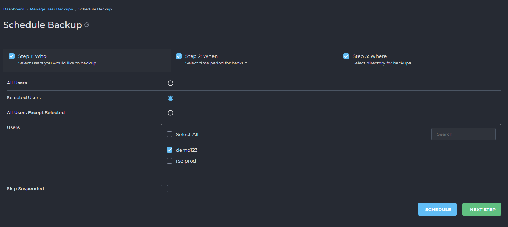
			- Chọn user `demo123`
			- Nhấn "NEXT STEP".
		- Bước 2: When (Thời điểm sao lưu)
			- 	
			- Chọn "Now".
			- Nhấn "NEXT STEP".
		- Bước 3: Where (Vị trí lưu trữ)
			- 		
			- Chọn "Local".
			- (Tùy chọn) Chọn một tùy chọn Append nếu bạn muốn có thêm thông tin trong tên tệp sao lưu (ví dụ: Full Date).
			- Nhấn "SCHEDULE".
			- Kết quả: DirectAdmin sẽ bắt đầu quá trình sao lưu toàn bộ dữ liệu của tất cả người dùng và lưu tệp sao lưu vào thư mục /home/rselprod/user_backups trên máy chủ. Bạn sẽ thấy thông báo về quá trình sao lưu đang chạy.
		- Kiểm tra 
			- Backup đang tạo 
			- 		
			- Backup tạo xong nhận thông báo:
			- 		
			
	- Ví dụ 2: Tạo lịch trình sao lưu định kỳ (Schedule Backup)
		- Mục tiêu: Tạo lịch trình sao lưu dữ liệu của một người dùng cụ thể vào 2 giờ sáng Chủ Nhật hàng tuần
		- Các bước thực hiện:
		- Đi tới Dashboard > Manage User Backup > Schedule Backup.
		- 
		- Bước 1: Who (Đối tượng sao lưu)
			- 
			- Chọn "Selected Users".
			- Trong danh sách Users, tìm và đánh dấu vào ô kiểm của người dùng bạn muốn sao lưu.
			- Nhấn "NEXT STEP".
		- Bước 2: When (Thời điểm sao lưu)
			- 
			- Chọn "Cron Schedule".
				- Điền các thông số Cron:
				- Minute: 0
				- Hour: 2
				- Day of Month: *
				- Month: *
				- Day of Week: 0 (hoặc 7 cho Chủ Nhật)
			- Nhấn "NEXT STEP".
		- Bước 3: Where (Vị trí lưu trữ)
			- 
			- Chọn "Local".
			- (Tùy chọn) Chọn Append: Day of Week để thêm ngày trong tuần vào tên tệp sao lưu (ví dụ: user.user1.2025-07-20.Sunday.tar.zst).
			- Nhấn "SCHEDULE".
		- Kết quả: Một lịch trình sao lưu mới sẽ được tạo và hiển thị trong giao diện. 
			- 
		
<!-- TOC -->
### cPanel Import
- 
- cPanel Import là một công cụ tiện ích trong DirectAdmin được thiết kế để giúp bạn dễ dàng di chuyển các tài khoản người dùng và dữ liệu của họ từ một máy chủ cPanel sang máy chủ DirectAdmin của bạn.
- Tính năng này tự động hóa quá trình di chuyển, bao gồm cơ sở dữ liệu, file, email và các cấu hình liên quan, giúp giảm thiểu thời gian và công sức cần thiết cho việc di chuyển máy chủ.
- Giao diện cPanel Import cung cấp một danh sách các tác vụ nhập đã được thực hiện hoặc đang chờ xử lý, cùng với khả năng tạo tác vụ nhập mới.
- Nút chức năng NEW IMPORT:
	- 
	- 
	- Nút này cho phép bạn bắt đầu một quá trình nhập tài khoản mới từ máy chủ cPanel. 
	- Khi bạn nhấp vào nút NEW IMPORT, một cửa sổ hoặc trang mới sẽ xuất hiện để bạn cung cấp thông tin đăng nhập của máy chủ cPanel nguồn.
		- Remote cPanel server credentials (Thông tin đăng nhập máy chủ cPanel từ xa):
		- Host: Địa chỉ IP hoặc tên miền của máy chủ cPanel mà bạn muốn nhập dữ liệu từ đó.
		- Port: Cổng SSH của máy chủ cPanel. Mặc định thường là 22. Đảm bảo cổng này được mở trên tường lửa của máy chủ cPanel.
		- User: Tên người dùng để đăng nhập vào máy chủ cPanel nguồn qua SSH. Mặc định là root vì quyền root thường cần thiết để truy cập tất cả dữ liệu tài khoản cPanel.
		- Password: Mật khẩu của người dùng SSH (ví dụ: root) trên máy chủ cPanel nguồn.
	- LOAD ACCOUNTS: Sau khi nhập đầy đủ thông tin, nhấn nút này. DirectAdmin sẽ cố gắng kết nối đến máy chủ cPanel nguồn, xác thực thông tin đăng nhập và tải về danh sách các tài khoản cPanel có sẵn trên máy chủ đó.

- Bảng danh sách các tác vụ nhập (Import Tasks Table)
	- Phần này hiển thị danh sách các lần nhập cPanel đã được thực hiện hoặc đang được tiến hành.
		- Account: Tên tài khoản người dùng trên DirectAdmin được tạo hoặc cập nhật từ quá trình nhập cPanel.
		- Stage: Trạng thái hiện tại của quá trình nhập (ví dụ: Connecting, Transferring, Importing, Completed, Failed).
		- Remote Server: Địa chỉ IP hoặc tên miền của máy chủ cPanel nguồn.
		- Start Time: Thời điểm bắt đầu của tác vụ nhập.
		- Duration: Thời gian mà tác vụ nhập đã hoặc đang diễn ra.
		- Ignore Errors: Cho biết liệu quá trình nhập có được cấu hình để bỏ qua một số lỗi nhất định hay không.
		- Replace Users: Cho biết liệu các tài khoản người dùng hiện có có bị ghi đè/thay thế nếu đã tồn tại trên DirectAdmin hay không.
		- Log: Liên kết đến nhật ký chi tiết của tác vụ nhập, giúp bạn kiểm tra các lỗi hoặc thông tin quan trọng trong quá trình.

<!-- TOC -->
### Message All Users
- 
- Tính năng Message All Users trong DirectAdmin cho phép reseller gửi thông báo hoặc tin nhắn đến tất cả các tài khoản người dùng mà mình quản lý trên máy chủ. 
- Đây là một công cụ thiết yếu để thông báo về các vấn đề bảo trì, cập nhật hệ thống, thay đổi chính sách, hoặc bất kỳ thông tin quan trọng nào khác mà bạn muốn tất cả người dùng biết.
- Giao diện Message All Users khá đơn giản và trực quan, tập trung vào việc tạo và gửi tin nhắn.
- Các trường cấu hình tin nhắn
	- To (Gửi đến): Mặc định là All of Your Users (Tất cả người dùng của bạn). 
		- E-mail Only: Đây là một tùy chọn bên cạnh trường "To". Nếu bạn chọn nó, tin nhắn sẽ chỉ được gửi qua email đến địa chỉ email liên hệ của mỗi người dùng, mà không hiển thị dưới dạng tin nhắn trong giao diện DirectAdmin khi họ đăng nhập.
	- Priority (Mức độ ưu tiên):
		- 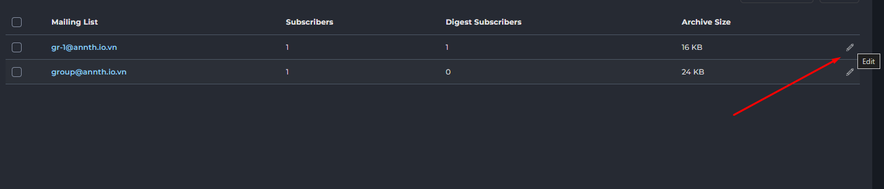
		- Đây là một menu thả xuống (dropdown) cho phép bạn đặt mức độ khẩn cấp của tin nhắn. Các tùy chọn thường là:
		- Low (Thấp): Dùng cho các thông báo không khẩn cấp.
		- Medium (Trung bình): Dùng cho các thông báo quan trọng hơn.
		- High (Cao): Dùng cho các thông báo khẩn cấp, yêu cầu sự chú ý ngay lập tức.
	- Subject (Tiêu đề): Đây là trường văn bản để bạn nhập tiêu đề của tin nhắn. Tiêu đề này sẽ hiển thị rõ ràng khi người dùng nhận được thông báo qua email hoặc trong giao diện DirectAdmin. Hãy đặt một tiêu đề rõ ràng, súc tích để người dùng dễ dàng nhận biết nội dung.
	- Message (Nội dung tin nhắn): Đây là một ô văn bản lớn để bạn nhập nội dung chi tiết của tin nhắn. Bạn nên cung cấp đầy đủ thông tin cần thiết một cách rõ ràng và dễ hiểu.
	- Nút gửi tin nhắn SEND (Gửi): Sau khi bạn đã hoàn tất việc soạn thảo tin nhắn và cấu hình các tùy chọn, nhấn nút này để gửi tin nhắn đến tất cả người dùng đã chọn.

<!-- TOC -->
### Skin Manager
- 
- Là một công cụ trong DirectAdmin cho phép reseller xem, quản lý và thay đổi giao diện (skin) của bảng điều khiển DirectAdmin. Giao diện người dùng có vai trò quan trọng trong trải nghiệm sử dụng, và việc tùy chỉnh skin có thể giúp cá nhân hóa bảng điều khiển hoặc cung cấp một giao diện thân thiện hơn cho người dùng.
- Giao diện Skin Manager hiển thị danh sách các skin hiện có trên máy chủ, cùng với các tùy chọn để quản lý và áp dụng chúng.
- Bảng danh sách Skin (Skins Table)
	- Đây là phần chính hiển thị các skin có sẵn trên máy chủ của bạn.
	- Skin Name: Tên của skin.
		- Enhanced: Đây là một skin phổ biến, thường là skin mặc định hoặc skin truyền thống của DirectAdmin.
		- Evolution: Đây là skin hiện đại hơn, thường là skin mặc định trong các phiên bản DirectAdmin gần đây, cung cấp giao diện người dùng thân thiện và responsive hơn.
	- Path: Đường dẫn thư mục nơi các tệp skin được lưu trữ trên máy chủ.
		- /data/skins/enhanced
		- /data/skins/evolution
	- Owner: Cho biết ai là chủ sở hữu của skin.
	- Actions (Hành động): Một menu thả xuống hoặc các nút cho phép bạn thực hiện hành động với skin đã chọn.
		- Apply to me: Áp dụng skin này cho tài khoản reseller hiện tại của bạn.
		- Apply to all users: Áp dụng skin này làm skin mặc định cho tất cả người dùng mà reseller quản lý trên máy chủ.

<!-- TOC -->
### Customize Evolution Skin
- 
- Customize Evolution Skin là một tính năng trong DirectAdmin, cho phép reseller tùy chỉnh giao diện của skin Evolution để phù hợp với thương hiệu cá nhân, công ty, hoặc để cải thiện trải nghiệm người dùng. 
- Với các tùy chọn đa dạng, bạn có thể thay đổi bố cục, màu sắc, phông chữ, biểu tượng và thậm chí cả nội dung liên kết trợ giúp.
- Giao diện chính của Customize Evolution Skin được chia thành hai phần lớn: OPTIONS (Tùy chọn) và BRANDING (Thương hiệu), mỗi phần chứa nhiều liên kết dẫn đến các trang cấu hình chi tiết hơn.
<!-- TOC -->
#### Options
- Phần này chứa các cài đặt ảnh hưởng đến hành vi và hiển thị chung của skin.
- Layout (Bố cục) 
	- 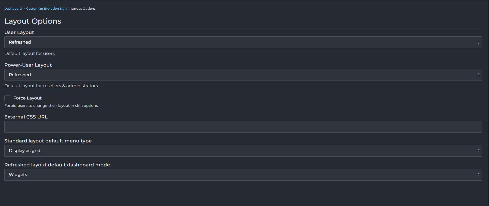
	- Cho phép bạn thiết lập bố cục mặc định cho các cấp độ người dùng khác nhau (User, Reseller, Admin).
	- User Layout / Power-User Layout: Chọn bố cục mặc định cho người dùng thông thường và người dùng Power. 
		- Standard
		- Sidebar 
		- Icons Grid 
		- Refreshed 
	- Force Layout: Nếu được chọn, nó sẽ cấm người dùng thay đổi bố cục của họ trong tùy chọn skin.
	- External CSS URL: Cho phép bạn liên kết đến một tệp CSS tùy chỉnh bên ngoài để áp dụng các kiểu dáng bổ sung.
	- Standard layout default menu type: Chọn kiểu menu mặc định cho bố cục Standard "Display as grid"/"Display as list"
	- Refreshed layout default dashboard mode: Chọn chế độ bảng điều khiển mặc định cho bố cục Refreshed Widgets/Menu 
	- SAVE: Lưu các thay đổi về bố cục.
- Date Formats (Định dạng ngày tháng) 
	- 
	- Cho phép bạn cấu hình định dạng hiển thị ngày và giờ trong bảng điều khiển.
	- Date Format: Chọn định dạng cho ngày (ví dụ: dd/MM/yyyy sẽ hiển thị 17/07/2025). Bạn có thể chọn các định dạng có sẵn hoặc chọn "Custom" và nhập định dạng mong muốn.
	- Date & Time Format: Tương tự, chọn định dạng cho cả ngày và giờ (ví dụ: dd/MM/yyyy, HH:mm sẽ hiển thị 17/07/2025, 15:23).
	- Week Start: Chọn ngày bắt đầu của tuần (ví dụ: Monday hoặc Sunday).
	- SAVE: Lưu các thay đổi về định dạng ngày tháng.
- Widgets (Tiện ích/Khối thông tin) 
	- 
	- Cho phép bạn ẩn hoặc sắp xếp lại các widget (khối thông tin) hiển thị trên bảng điều khiển cho từng cấp độ người dùng (User, Reseller).
	- Mỗi cấp độ có một danh sách các widget riêng. Bạn có thể:
		- Tích chọn/Bỏ tích chọn: Để hiển thị hoặc ẩn một widget.
		- Kéo và thả (Drag and drop): Sử dụng biểu tượng dấu chấm để kéo các widget lên/xuống, thay đổi thứ tự hiển thị của chúng trên dashboard.
		- Biểu tượng con mắt: Nhấp vào để xem trước nội dung của widget.
	- SAVE: Lưu các thay đổi về widget.
- Help Links (Liên kết trợ giúp) 
	- 
	- 
	- Cho phép bạn tùy chỉnh các liên kết trợ giúp xuất hiện trên các trang khác nhau của DirectAdmin cho từng cấp độ người dùng.
	- Có các tab: USER, RESELLER. Chọn tab tương ứng để tùy chỉnh liên kết trợ giúp cho cấp độ đó.
		- Route: Tên nội bộ của trang DirectAdmin.
		- Help link: URL của liên kết trợ giúp tùy chỉnh mà bạn muốn hiển thị cho trang đó.
		- Edit: Nhấp vào đây để chỉnh sửa liên kết trợ giúp cho một "Route" cụ thể.
	- Filter Routes: Nhập từ khóa để lọc danh sách các Route.
	- Show Empty: Chỉ hiển thị các Route chưa có liên kết trợ giúp tùy chỉnh.
	- CLEAR DEFAULTS: Xóa tất cả các liên kết trợ giúp tùy chỉnh và khôi phục về mặc định của DirectAdmin.
	- SAVE: Lưu các thay đổi về liên kết trợ giúp.
<!-- TOC -->
#### Branding 
- Phần này tập trung vào việc tùy chỉnh giao diện để phản ánh thương hiệu của bạn.
- Colors (Màu sắc) 
	- 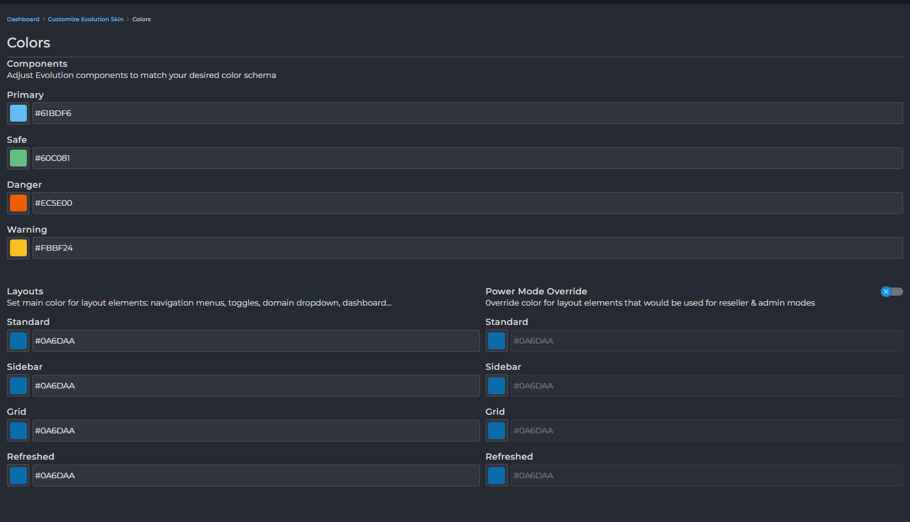
	- Cho phép bạn điều chỉnh bảng màu của skin.
	- Components: Thiết lập màu sắc cho các thành phần chính:
		- Primary: Màu chính (ví dụ: màu của các nút chính, tiêu đề).
		- Safe: Màu cho các trạng thái an toàn/thành công (thường là xanh lá).
		- Danger: Màu cho các trạng thái nguy hiểm/lỗi (thường là đỏ).
		- Warning: Màu cho các cảnh báo (thường là cam/vàng).
	- Layouts: Thiết lập màu sắc cho các thành phần điều hướng và bố cục khác nhau.
		- Có các trường màu cho Standard, Sidebar, Grid, Refreshed layout.
	- Power Mode Override: Nếu được bật, nó sẽ ghi đè màu sắc của các yếu tố bố cục cho chế độ người dùng Đại lý và reseller (để chúng có thể có màu sắc khác với người dùng cuối).
	- SAVE CHANGES: Lưu các thay đổi về màu sắc.
	- RESET TO DEFAULTS: Đặt lại tất cả màu sắc về mặc định của skin Evolution.
- CSS Styles (Kiểu CSS) 
	- 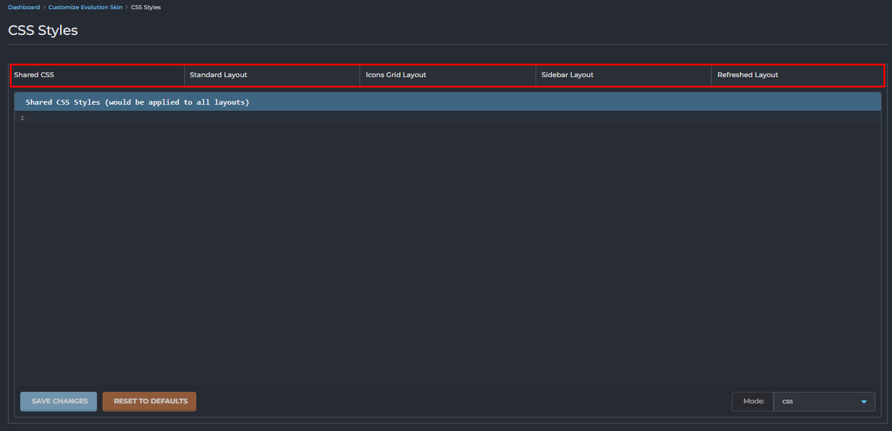
	- Cho phép bạn thêm các quy tắc CSS tùy chỉnh để thay đổi kiểu dáng của skin.
	- Bạn có thể thêm CSS chung (Shared CSS) hoặc CSS riêng cho từng loại bố cục (Standard Layout, Icons Grid Layout, Sidebar Layout, Refreshed Layout) bằng cách chọn tab tương ứng.
	- Mode: css: Chọn chế độ chỉnh sửa là CSS.
	- SAVE CHANGES: Lưu các thay đổi CSS.
	- RESET TO DEFAULTS: Xóa tất cả CSS tùy chỉnh.
- Icons (Biểu tượng) 
	- 
	- Mục này cho phép bạn tùy chỉnh các biểu tượng được sử dụng trong bảng điều khiển DirectAdmin. Bạn có thể thay thế các biểu tượng mặc định bằng các biểu tượng của riêng mình.
	- Bảng hiển thị biểu tượng:
		- Hiển thị một lưới các biểu tượng hiện có với tên của chúng (ví dụ: account-manager, add-new-user, admin-backup-transfer).
		- Filter icons: Ô tìm kiếm cho phép bạn lọc các biểu tượng theo tên.
	- UPLOAD ICON (Tải lên Biểu tượng): Nút này mở một cửa sổ pop-up để bạn tải lên biểu tượng mới.
		- 
		- Icon ID: Tên định danh của biểu tượng bạn muốn thay thế hoặc thêm mới (ví dụ: account-manager). Bạn phải nhập đúng ID của biểu tượng bạn muốn thay thế.
		- Kéo và thả tệp biểu tượng vào đây hoặc nhấp để chọn tệp.
		- Accepted type: image/svg+xml: Định dạng được chấp nhận là tệp SVG (Scalable Vector Graphics). SVG là định dạng lý tưởng cho biểu tượng vì chúng có thể điều chỉnh kích thước mà không bị mất chất lượng.
		- Max File Size: 500 MB: Kích thước tệp tối đa cho phép.
		- UPLOAD ICON: Nhấn nút này để tải lên và áp dụng biểu tượng.
		- Close: Đóng cửa sổ pop-up.
- Logo (Biểu trưng)
	- 
	- Mục này cho phép bạn thay đổi logo và biểu tượng (favicon) hiển thị trong DirectAdmin.
	- Logos: Tùy chỉnh logo chính của bảng điều khiển.
		- Logo Light / Logo Dark: Cho phép bạn tải lên các phiên bản logo khác nhau phù hợp với chế độ giao diện sáng hoặc tối.
		- Reset: Đặt lại logo về mặc định.
		- UPLOAD: Tải lên logo mới (thường là tệp hình ảnh như PNG, JPG).
	- Symbols: Tùy chỉnh biểu tượng nhỏ hơn thường xuất hiện cùng với logo hoặc trong các thành phần UI khác. Tương tự như Logos, bạn có thể tải lên các phiên bản Light/Dark.
	- Favicon: Tùy chỉnh biểu tượng Favicon (biểu tượng nhỏ xuất hiện trên tab trình duyệt). UPLOAD: Tải lên Favicon mới (thường là tệp .ico hoặc .png kích thước nhỏ).
- Menu (Tùy chỉnh Menu) 
	- 
	- Mục này cung cấp khả năng tùy chỉnh cấu trúc và nội dung của menu điều hướng cho các cấp độ người dùng khác nhau.
	- Tab người dùng: USER, RESELLER: Chọn tab tương ứng để xem và chỉnh sửa menu cho cấp độ người dùng đó.
	- Các danh mục (Categories): Menu được tổ chức thành các danh mục (ví dụ: ACCOUNT MANAGER, E-MAIL MANAGER, ADVANCED FEATURES).
		- Biểu tượng menu (dấu gạch ngang): Cho phép bạn kéo và thả để sắp xếp lại thứ tự các mục trong danh mục hoặc kéo cả danh mục để sắp xếp lại thứ tự các danh mục.
		- Biểu tượng bánh răng: Cài đặt cho từng danh mục (ví dụ: đổi tên, ẩn/hiện).
	- Các mục trong menu (Menu Items): Mỗi ô trong lưới là một mục menu.
		- Biểu tượng (ví dụ: Account-manager, SQL Database): Đại diện cho chức năng.
		- Tên mục (ví dụ: Domain Setup, Databases): Tên hiển thị của mục menu.
		- URL (ví dụ: /CMD_DOMAINS, /CMD_DB): Đường dẫn nội bộ mà mục menu này trỏ tới.
		- New Entry: Thêm một mục mới vào danh mục.
	- Plugins: Tab này hiển thị các mục menu liên quan đến plugin đã cài đặt.
	- New Link: Thêm một liên kết tùy chỉnh vào menu (ví dụ: liên kết đến trang hỗ trợ bên ngoài).
	- New Category: Thêm một danh mục mới vào menu.

	
	
<!-- TOC -->
## System Info & Files 
- Phần System Info & Files trong DirectAdmin tập hợp các công cụ quan trọng cho phép reseller xem thông tin chi tiết về hệ thống thống kê sử dụng tài nguyên. 
- Các công cụ 
	- System Information: Hiển thị thông tin chi tiết về phần cứng và hệ điều hành.
	- Reseller Statistics: Thống kê chi tiết việc sử dụng tài nguyên của các tài khoản.

<!-- TOC -->
### System Information
- 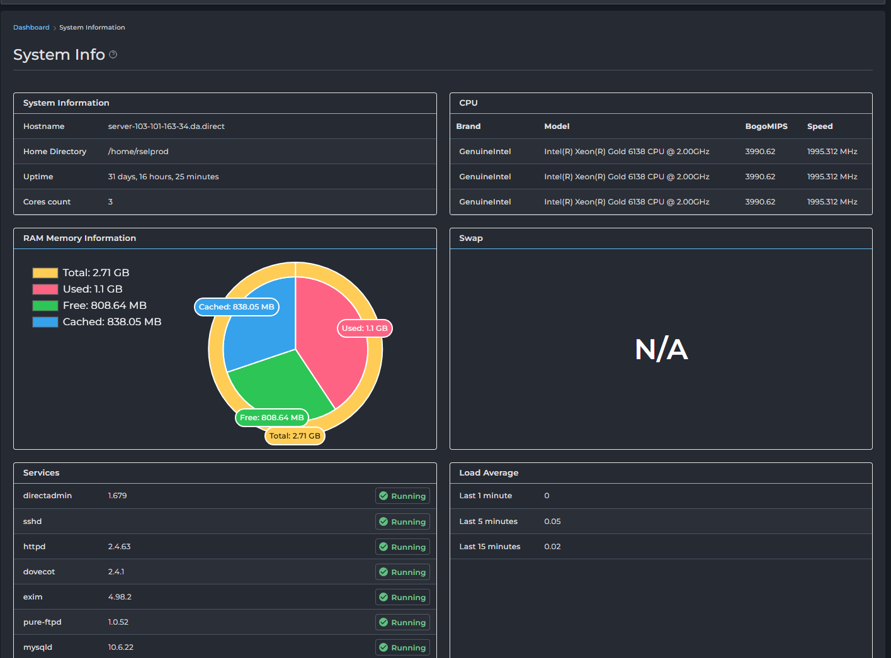
- Phần này cung cấp tổng quan về các tài nguyên hệ thống chính của máy chủ và trạng thái hiện tại, bao gồm thông số kỹ thuật phần cứng, thời gian hoạt động, các dịch vụ đang chạy và mức tải trung bình.
- Thông Tin Hệ Thống (System Information):
	- Hostname (Tên máy chủ): Hiển thị tên mạng của máy chủ của bạn.
	- Home Directory (Thư mục chính): Hiển thị đường dẫn thư mục chính mặc định cho các tài khoản người dùng.
	- Uptime (Thời gian hoạt động): Cho biết máy chủ đã chạy liên tục bao lâu kể từ lần khởi động lại gần nhất.
	- Cores count (Số lõi): Hiển thị số lõi CPU có sẵn.
- CPU:
	- Brand (Thương hiệu): Nhà sản xuất CPU của bạn.
	- Model (Mẫu): Tên mẫu cụ thể của CPU của bạn.
	- BogoMIPS: Một thước đo gần đúng về tốc độ CPU.
	- Speed (Tốc độ): Tốc độ xung nhịp của CPU của bạn tính bằng MHz.
- Thông Tin Bộ Nhớ RAM (RAM Memory Information):
	- Total (Tổng cộng): Tổng dung lượng RAM vật lý được cài đặt trên máy chủ.
	- Used (Đã sử dụng): Dung lượng RAM hiện đang được sử dụng bởi các tiến trình và ứng dụng.
	- Free (Còn trống): Dung lượng RAM hiện không được sử dụng.
	- Cached (Đã lưu vào bộ nhớ cache): Dung lượng RAM được sử dụng để lưu vào bộ nhớ cache dữ liệu truy cập thường xuyên, có thể nhanh chóng được giải phóng nếu cần.
	- Biểu diễn trực quan: Biểu đồ tròn đầy màu sắc cung cấp một bản tóm tắt trực quan nhanh chóng về việc sử dụng RAM.
- Swap: Không gian swap là không gian đĩa được sử dụng làm bộ nhớ ảo khi RAM đầy.
- Dịch Vụ (Services):
	- Phần này liệt kê các dịch vụ quan trọng đang chạy trên máy chủ của bạn (ví dụ: directadmin, sshd, httpd, dovecot, exim, pure-ftpd, mysqld).
	- Trạng thái (Running/Stopped): Dấu kiểm màu xanh lá cây và chữ "Running" (Đang chạy) cho biết dịch vụ đang hoạt động và vận hành chính xác.
- Mức Tải Trung Bình (Load Average):
	- Các giá trị này thể hiện số lượng trung bình các tiến trình đang chờ thời gian CPU trong các khoảng thời gian khác nhau.
	- Last 1 minute (1 phút trước): Mức tải trung bình trong phút vừa qua.
	- Last 5 minutes (5 phút trước): Mức tải trung bình trong năm phút vừa qua.
	- Last 15 minutes (15 phút trước): Mức tải trung bình trong mười lăm phút vừa qua.

<!-- TOC -->
### Reseller Statistics
- 
- Phần này cung cấp tổng quan toàn diện về việc sử dụng tài nguyên trên máy chủ của bạn, bao gồm băng thông, dung lượng đĩa, sử dụng email và các tài nguyên được cấp phát khác. Điều này rất quan trọng để giám sát hiệu suất máy chủ và đảm bảo bạn duy trì trong giới hạn đã cấp phát.
- Thống Kê Sử dụng (Usage Statistics) 
	- 
	- Hiển thị tổng quan về tài nguyên đã sử dụng và còn lại: Nó giúp người dùng (reseller) nắm bắt được tình hình sử dụng các tài nguyên được cấp phát.
	- Quản lý giới hạn tài nguyên: Cho biết các giới hạn (Limit) đã được thiết lập cho từng loại tài nguyên, giúp reseller kiểm soát việc phân bổ tài nguyên cho khách hàng của họ.
	- Theo dõi việc phân bổ tài nguyên: Cột "Allocated" (Đã phân bổ) cho biết số lượng tài nguyên mà reseller đã cấp phát cho các tài khoản con của họ.
	- Theo dõi hiệu suất: Mặc dù không có biểu đồ cụ thể, nhưng các số liệu về "Sent E-mails" và "Received E-mails" có thể giúp theo dõi mức độ hoạt động.
	- Cấu trúc của tài liệu này bao gồm các phần chính:
	- Thông tin chung: Nút "Reseller History" (Lịch sử đại lý) ở góc trên bên phải, cho phép xem lại các hoạt động trước đó.
	- Bảng "Usage Statistics" (Thống kê sử dụng): Đây là phần quan trọng nhất, hiển thị chi tiết các thông số:
		- Setting (Thiết lập): Tên của loại tài nguyên (ví dụ: Bandwidth, Disk Usage, # of Domains, E-mail Accounts, v.v.).
		- Usage (Đã sử dụng): Lượng tài nguyên đã được sử dụng thực tế.
		- Limit (Giới hạn): Giới hạn tối đa của tài nguyên được cấp cho tài khoản reseller này.
		- Allocated (Đã phân bổ): Lượng tài nguyên mà reseller đã phân bổ cho các tài khoản khách hàng của họ.
	- Các thông số cụ thể trong bảng này bao gồm:
		- Bandwidth (Băng thông): Lượng dữ liệu truyền tải.
		- Disk Usage (Dung lượng đĩa): Dung lượng lưu trữ đã sử dụng.
		- Inodes: Số lượng tệp và thư mục.
		- `# of Domains` (Số lượng tên miền): Số lượng tên miền chính.
		- `# of Subdomains (Số lượng tên miền phụ): Số lượng tên miền phụ.
		- E-mail Accounts (Tài khoản email): Số lượng tài khoản email.
		- E-mail Forwarders (Chuyển tiếp email): Số lượng thiết lập chuyển tiếp email.
		- Mailing Lists (Danh sách gửi thư): Số lượng danh sách email.
		- Autoresponders (Tự động trả lời): Số lượng email tự động trả lời.
		- Sent E-mails (Email đã gửi): Số lượng email đã được gửi.
		- Received E-mails (Email đã nhận): Số lượng email đã được nhận.
		- `# of MySQL DBs` (Số lượng cơ sở dữ liệu MySQL): Số lượng cơ sở dữ liệu.
		- Domain Pointers (Trỏ tên miền): Số lượng tên miền trỏ về.
		- FTP Accounts (Tài khoản FTP): Số lượng tài khoản FTP.
		- `# of IPs` (Số lượng IP): Số lượng địa chỉ IP.
		- `# of free IPs` (Số lượng IP trống): Số lượng địa chỉ IP chưa được sử dụng.
	
- Thông tin tài khoản (Account Info)
	- 
	- Thông tin về tài khoản reseller đang sử dụng 
		- Cung cấp thông tin cơ bản về tài khoản: Như tên máy chủ (Name Server), địa chỉ IP, và gói dịch vụ đang sử dụng.
		- Hiển thị trạng thái kích hoạt/vô hiệu hóa của các tính năng: Cho biết tính năng nào đang được phép sử dụng (Enabled) và tính năng nào bị vô hiệu hóa (Disabled). Điều này rất quan trọng để người dùng biết được họ có thể sử dụng những gì trên tài khoản của mình.
<!-- TOC -->
## Extra Features 
- Mục "Extra Features" trong giao diện quản trị DirectAdmin cung cấp quyền truy cập nhanh chóng và tiện lợi đến một số công cụ và ứng dụng quan trọng, giúp quản lý máy chủ và các dịch vụ đi kèm hiệu quả hơn.
- 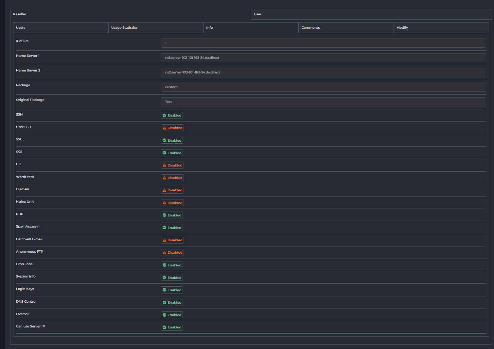
- Webmail: Roundcube: 
	- Roundcube là một ứng dụng webmail mã nguồn mở, cung cấp một giao diện thân thiện với người dùng để gửi, nhận và quản lý email thông qua trình duyệt web.
	- Click truy cập vào giao diện webmail Roundcube. 
- phpMyAdmin:
	- phpMyAdmin là một công cụ quản lý cơ sở dữ liệu MySQL/MariaDB dựa trên web phổ biến. Nó cho phép người dùng thực hiện nhiều tác vụ quản lý cơ sở dữ liệu như tạo, xóa, chỉnh sửa cơ sở dữ liệu, bảng, và quản lý các bản ghi dữ liệu một cách dễ dàng thông qua giao diện đồ họa.
	- Click truy cập đến giao diện phpMyAdmin
- ConfigServer Security & Firewall (CSF)
	- CSF là một script tường lửa mạnh mẽ, toàn diện, được thiết kế để tăng cường bảo mật cho máy chủ Linux. Nó cung cấp nhiều tính năng như phát hiện xâm nhập, chặn địa chỉ IP đáng ngờ, cấu hình cổng, ....
	- Click để mở giao diện quản lý CSF (Nếu reseller được admin cấp quyền)

<!-- TOC -->
## Support & Help 
- 
- Mục "Support & Help" trong giao diện quản trị DirectAdmin là nơi cung cấp các tài nguyên và công cụ để reseller nhận hỗ trợ, quản lý các yêu cầu hỗ trợ, và cập nhật thông tin về bản quyền cũng như phiên bản DirectAdmin hiện tại.
- Help (Trợ Giúp):  Liên kết này cung cấp quyền truy cập nhanh đến tài liệu và hướng dẫn chính thức của DirectAdmin.
- Manage Tickets (Quản Lý Yêu Cầu Hỗ Trợ)
	- 
	- Đây là nơi bạn có thể xem, quản lý và theo dõi trạng thái của tất cả các yêu cầu hỗ trợ (ticket) đã được tạo.
	- Giao diện này hiển thị danh sách các ticket với các thông tin như số hiệu ticket, chủ đề, số lượng phản hồi, trạng thái và người dùng liên quan. Bạn có thể sử dụng các tùy chọn bộ lọc và quản lý để đóng, mở hoặc đánh dấu đã đọc các ticket đã chọn.
	- Các nút chức năng: 
	- Ticket System Settings :
		- 
		- Sử dụng để cấu hình các tùy chọn cho hệ thống ticket:
		- Ticket System Enabled: Đánh dấu chọn để bật hoặc bỏ chọn để tắt hệ thống ticket.
		- E-mail a copy of all messages: Cho phép bạn nhập một địa chỉ email để nhận bản sao của tất cả các tin nhắn trong hệ thống ticket, đảm bảo bạn không bỏ lỡ bất kỳ thông tin quan trọng nào.
	- Send a message: 
		- Chuyển tới giao diện "Create Ticket" để gửi một tin nhắn hoặc tạo một yêu cầu hỗ trợ mới.
- Create Ticket (Tạo Yêu Cầu Hỗ Trợ)
	- 
	- Giao diện cho phép bạn tạo một yêu cầu hỗ trợ mới hoặc gửi tin nhắn cho các Reseller/Users của bạn.
	- Các trường thông tin:
		- To (Đến): Chọn người nhận tin nhắn hoặc yêu cầu hỗ trợ. Bạn có thể chọn gửi đến "Admin", User cụ thể hoặc "All Users" (Tất cả người dùng của bạn).
			- 
		- Priority (Mức độ ưu tiên): Đặt mức độ ưu tiên cho ticket của bạn: "Low" (Thấp), "Medium" (Trung bình), hoặc "High" (Cao).
			- 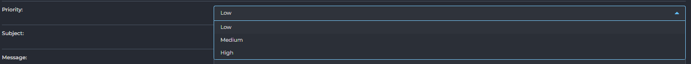
		- Subject (Chủ đề): Nhập tiêu đề tóm tắt nội dung của yêu cầu hỗ trợ.
		- Message (Tin nhắn): Viết nội dung chi tiết của vấn đề hoặc yêu cầu của bạn.
		- E-mail Only: Đánh dấu chọn tùy chọn này nếu bạn chỉ muốn gửi tin nhắn qua email mà không tạo một ticket trong hệ thống.
