# Mail Server basic with Postfix Dovecot
- Trong bài lab này thực hiện 
- Cài đặt postfix, login gửi nhận mail cơ bản 
- Cài đặt tích hợp thêm dovecot, ssl/tls
- Cấu hình virtual user với postfixadmin 
- Triển khai trên VPS 35.240.141.156
hostname mail.annth.io.vn
- 
- 
- 
- 
- 
- 
- 
- 
- 
- 
- 
- 
- 
- 
- 
- 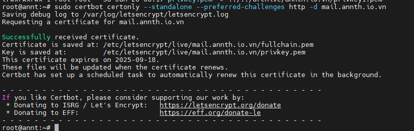
- 
- 
- 
- 
- 
- 
- 
- 
- 
- 
- 
- 
- 
- 
- 
- 
- 
- 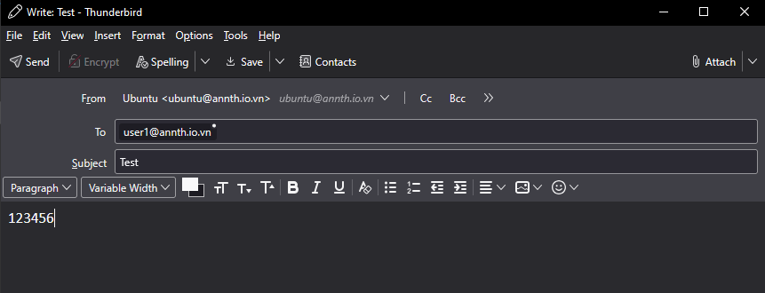
- 
- 
- 
- 
- 
- 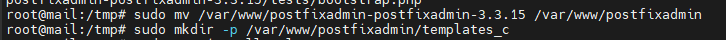
- 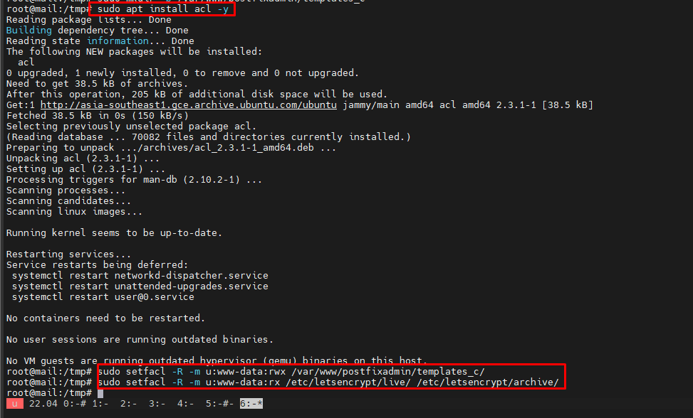
- 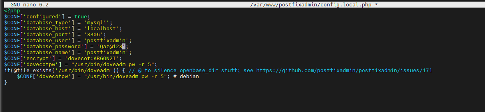
- 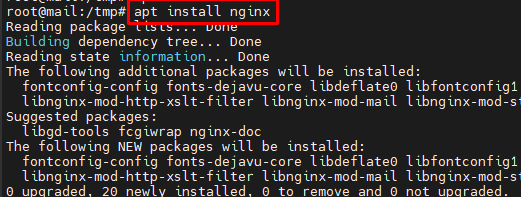
- 
- 
- 
- 
- 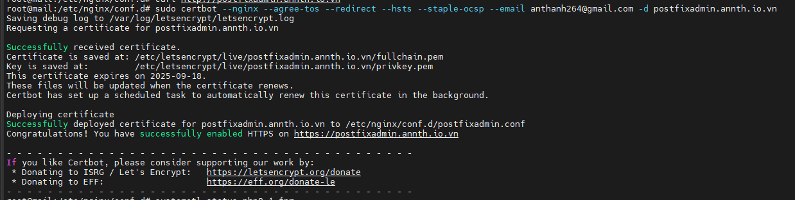
- 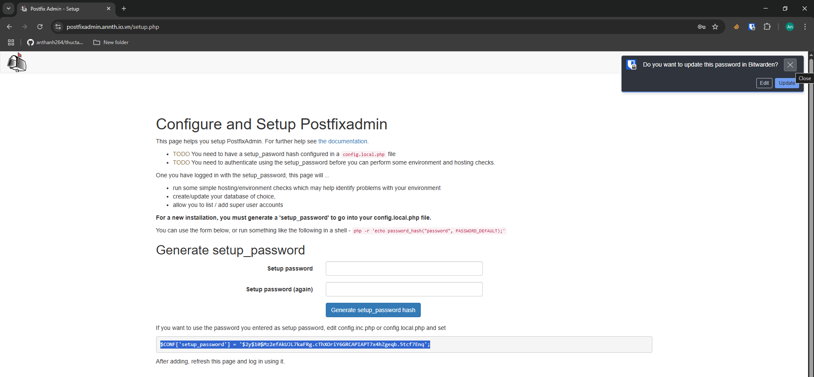
- 
- 
- 
- 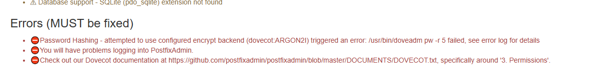
- 
- 
- 
- 
- 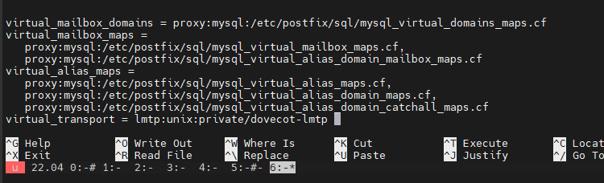
- 
- 
- 
- 
- 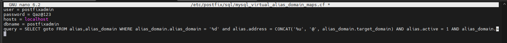
- 
- 
- 
- 
- 
- 
- 
- 
- 
- 
- 
- 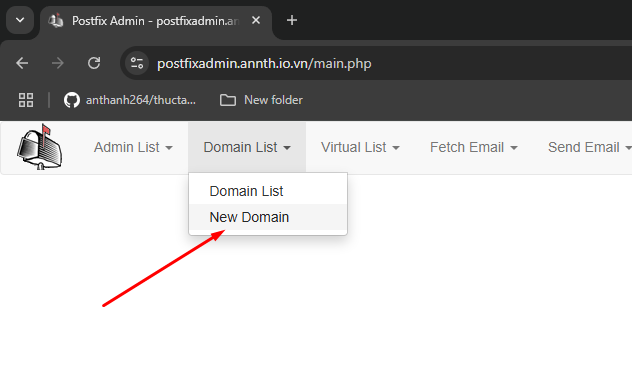
- 
- 
- 
- 
- 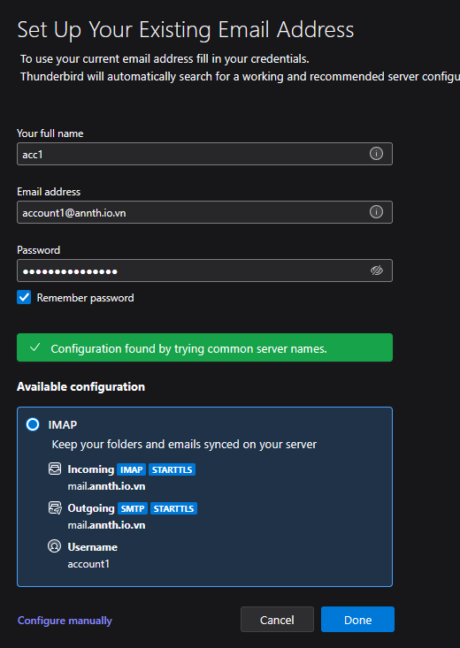

- Postfix 
```
apt -y install postfix 
```
Server SMTP cơ bản gửi nhận với user system
Gửi mail với utils 
```
apt install mail-utils
```
```
echo "Test message" | mail -s "Hello" user1@annt.cloud 
```
su user1 
mail 

- Check thấy đã có mail. 

- Lấy ssl 
sudo add-apt-repository ppa:certbot/certbot
sudo apt-get install certbot
sudo certbot certonly --standalone --preferred-challenges http -d annth.io.vn
sudo ll /etc/letsencrypt/live/annth.io.vn


- Cấu hình SSL 
sudo nano /etc/postfix/main.cf
```
#Enable TLS Encryption when Postfix receives incoming emails
smtpd_tls_cert_file=/etc/letsencrypt/live/mail.annth.io.vn/fullchain.pem
smtpd_tls_key_file=/etc/letsencrypt/live/mail.annth.io.vn/privkey.pem
smtpd_tls_security_level=may 
smtpd_tls_loglevel = 1
smtpd_tls_session_cache_database = btree:${data_directory}/smtpd_scache

#Enable TLS Encryption when Postfix sends outgoing emails
smtp_tls_security_level = may
smtp_tls_loglevel = 1
smtp_tls_session_cache_database = btree:${data_directory}/smtp_scache

#Enforce TLSv1.3 or TLSv1.2
smtpd_tls_mandatory_protocols = !SSLv2, !SSLv3, !TLSv1, !TLSv1.1
smtpd_tls_protocols = !SSLv2, !SSLv3, !TLSv1, !TLSv1.1
smtp_tls_mandatory_protocols = !SSLv2, !SSLv3, !TLSv1, !TLSv1.1
smtp_tls_protocols = !SSLv2, !SSLv3, !TLSv1, !TLSv1.1
```
Enable Submission Service in Postfix
To send emails from a desktop email client, we need to enable the submission service of Postfix so that the email client can submit emails to Postfix SMTP server. Edit the master.cf file.
sudo nano /etc/postfix/master.cf
```
submission     inet     n    -    y    -    -    smtpd
  -o syslog_name=postfix/submission
  -o smtpd_tls_security_level=encrypt
  -o smtpd_tls_wrappermode=no
  -o smtpd_sasl_auth_enable=yes
  -o smtpd_relay_restrictions=permit_sasl_authenticated,reject
  -o smtpd_recipient_restrictions=permit_mynetworks,permit_sasl_authenticated,reject
  -o smtpd_sasl_type=dovecot
  -o smtpd_sasl_path=private/auth
```
```
sudo systemctl restart postfix
```
```
netstat -tlnp 
````
Postfix is now listening on port 587 

- Dovecot 
```
apt -y install dovecot-core dovecot-pop3d dovecot-imapd
```
Enabling IMAP/POP3 Protocol
Edit the main config file.

sudo nano /etc/dovecot/dovecot.conf
Add the following line to enable IMAP protocol.
```
protocols = imap
```
Using Dovecot to Deliver Email to Message Store

Although we configured Dovecot to store emails in Maildir format, by default, Postfix uses its built-in local delivery agent (LDA) to move inbound emails to the message store (inbox, sent, trash, Junk, etc), and it will be saved in mbox format.

We need to configure Postfix to pass incoming emails to Dovecot, via the LMTP protocol, which is a simplified version of SMTP, so incoming emails will saved in Maildir format by Dovecot. LMTP allows for a highly scalable and reliable mail system. It also allows us to use the sieve plugin to filter inbound messages to different folders.

Install the Dovecot LMTP Server.

sudo apt install dovecot-lmtpd

Edit the Dovecot main configuration file.

sudo nano /etc/dovecot/dovecot.conf
Add lmtp to the supported protocols.

protocols = imap lmtp
Save and close the file. Then edit the Dovecot 10-master.conf file.

sudo nano /etc/dovecot/conf.d/10-master.conf
Change the lmtp service definition to the following.
service lmtp {
 unix_listener /var/spool/postfix/private/dovecot-lmtp {
   mode = 0600
   user = postfix
   group = postfix
  }
}

Next, edit the Postfix main configuration file.

sudo nano /etc/postfix/main.cf
Add the following lines at the end of the file. The first line tells Postfix to deliver incoming emails to local message store via the Dovecot LMTP server.  The second line disables SMTPUTF8 in Postfix, because Dovecot-LMTP doesn’t support this email extension.

mailbox_transport = lmtp:unix:private/dovecot-lmtp
smtputf8_enable = no
Save and close the file.

Configuring Authentication Mechanism
Setup sử dụng user nội bộ linux nên cần cấu hình auth bỏ phần đuôi domain 
sudo nano /etc/dovecot/conf.d/10-auth.conf
#auth_username_format = %Lu
Uncomment it and change its value to %n.

auth_username_format = %n

Configuring SSL/TLS Encryption
Next, edit SSL/TLS config file.

sudo nano /etc/dovecot/conf.d/10-ssl.conf
Change ssl = yes to ssl = required to enforce encryption.

ssl = required
Then find the following lines.

ssl_cert = </etc/dovecot/private/dovecot.pem
ssl_key = </etc/dovecot/private/dovecot.key
By default, Dovecot uses a self-signed TLS certificate. Replace them with the following values, which specify the location of your Let’s Encrypt TLS certificate and private key. Don’t leave out the < character. It’s necessary.

ssl_cert = </etc/letsencrypt/live/mail.your-domain.com/fullchain.pem
ssl_key = </etc/letsencrypt/live/mail.your-domain.com/privkey.pem

Configuring SASL Authentication
Edit the following file.

sudo nano /etc/dovecot/conf.d/10-master.conf
Change service auth section to the following so that Postfix can find the Dovecot authentication server. Please be careful about the syntax. Every opening bracket should be terminated by a closing bracket.

service auth {
    unix_listener /var/spool/postfix/private/auth {
      mode = 0660
      user = postfix
      group = postfix
    }
}

Auto-create Sent and Trash Folder
Edit the below config file.

sudo nano /etc/dovecot/conf.d/15-mailboxes.conf
To auto-create a folder, simply add the following line in the mailbox section.

auto = create
Example:

 mailbox Trash {
    auto = create
    special_use = \Trash
 }
Some common folders you will want to create includes: Drafts, Junk, Trash and Sent. The Sent folder will be created under the user’s home directory when the user send the first email. The Trash folder will be created when the user deletes an email for the first time, etc. After you save and close all above config files, restart Postfix and Dovecot.

sudo systemctl restart postfix dovecot

sudo ss -lnpt | grep dovecot

port 143 (IMAP) and 993 (IMAPS), as can be seen 


thunderbird
lgin 
sent
tesst
log


 Postfix SMTP server and Dovecot IMAP server, but so far we can only have email addresses for users with local Unix accounts. This tutorial is going to show you how to create virtual mailboxes on Ubuntu mail server with PostfixAdmin, which is an open-source web-based interface to configure and manage a Postfix-based email server for many domains and users.
 
 
 With virtual mailboxes, we don’t need to create a local Unix account for each email address. If you are going to set up a mail server for a company or organization, it’s always better to have an easy way to create virtual mailboxes in a web-based interface, which also allows users to change their passwords. That’s where PostfixAdmin comes in.

PostfixAdmin Features
manage mailboxes, virtual domains, and aliases
vacation/out-of-office messages (Personally I think it’s better done in Roundcube webmail)
alias domains (forwarding one domain to another with recipient validation)
users can manage their own mailbox (change alias, password and vacation message)
quota support for single mailboxes and total quota of a domain
fetchmail integration: You can fetch emails from your original email address to your new email address.
command-line client postfixadmin-cli for those who don’t want to click around in a web interface
Note
This tutorial works on Ubuntu 22.04, Ubuntu 20.04, and Ubuntu 24.04.
This tutorial uses MariaDB/MySQL database server. If you prefer to use PostgreSQL database server, please follow this PostfixAdmin/PostgreSQL tutorial.
Once you finish part 3, you can no longer use local Unix accounts as email addresses. You must create email addresses from the PostfixAdmin web interface.
Install MariaDB/MySQL Database Server
sudo apt install mariadb-server mariadb-client
sudo mariadb -u root
create database postfixadmin;

create user 'postfixadmin'@'localhost' identified by 'Qaz@123';

grant all privileges on postfixadmin.* to 'postfixadmin'@'localhost';

flush privileges;

exit;
38
- Down postfixadmin 


wget https://github.com/postfixadmin/postfixadmin/archive/postfixadmin-3.3.15.tar.gz

sudo mkdir -p /var/www/

sudo tar xvf postfixadmin-3.3.11.tar.gz -C /var/www/

sudo mv /var/www/postfixadmin-postfixadmin-3.3.11 /var/www/postfixadmin

sudo mkdir -p /var/www/postfixadmin/templates_c

sudo apt install acl

sudo setfacl -R -m u:www-data:rwx /var/www/postfixadmin/templates_c/
sudo setfacl -R -m u:www-data:rx /etc/letsencrypt/live/ /etc/letsencrypt/archive/


Configure PostfixAdmin
The default PostfixAdmin configuration file is config.inc.php. We need to create a config.local.php file and add custom configurations.

sudo nano /var/www/postfixadmin/config.inc.php

```
<?php
$CONF['configured'] = true;
$CONF['database_type'] = 'mysqli';
$CONF['database_host'] = 'localhost';
$CONF['database_port'] = '3306';
$CONF['database_user'] = 'postfixadmin';
$CONF['database_password'] = 'postfixadmin_password';
$CONF['database_name'] = 'postfixadmin';
$CONF['encrypt'] = 'dovecot:ARGON2I';
$CONF['dovecotpw'] = "/usr/bin/doveadm pw -r 5";
if(@file_exists('/usr/bin/doveadm')) { // @ to silence openbase_dir stuff; see https://github.com/postfixadmin/postfixadmin/issues/171
    $CONF['dovecotpw'] = "/usr/bin/doveadm pw -r 5"; # debian
}
```

Create Nginx Config File for PostfixAdmin
apt install nginx 
sudo nano /etc/nginx/conf.d/postfixadmin.conf

server {
   listen 80;
   listen [::]:80;
   server_name postfixadmin.annth.io.vn;

   root /var/www/postfixadmin/public/;
   index index.php index.html;

   access_log /var/log/nginx/postfixadmin_access.log;
   error_log /var/log/nginx/postfixadmin_error.log;

   location / {
       try_files $uri $uri/ /index.php;
   }

   location ~ ^/(.+\.php)$ {
        try_files $uri =404;
        fastcgi_pass unix:/run/php/php8.1-fpm.sock;
        fastcgi_index index.php;
        fastcgi_param SCRIPT_FILENAME $document_root$fastcgi_script_name;
        include /etc/nginx/fastcgi_params;
   }
}
sudo nginx -t

php 
sudo apt install php8.1-fpm php8.1-imap php8.1-mbstring php8.1-mysql php8.1-curl php8.1-zip php8.1-xml php8.1-bz2 php8.1-intl php8.1-gmp php8.1-redis
sudo apt install python3-certbot-nginx
sudo certbot --nginx --agree-tos --redirect --hsts --staple-ocsp --email anthanh264@gmail.com -d postfixadmin.annth.io.vn

Step 10: Finish the Installation in Web Browser
Go to postfixadmin.example.com/setup.php to run the web-based setup wizard. First, you need to create a setup password for PostfixAdmin.

https://postfixadmin.annth.io.vn/setup.php

sudo nano /var/www/postfixadmin/config.local.php


Configure Postfix to Use MySQL/MariaDB Database
sudo apt install postfix-mysql
Then edit the Postfix main configuration file.

sudo nano /etc/postfix/main.cf
Add the following lines at the end of this file.

virtual_mailbox_domains = proxy:mysql:/etc/postfix/sql/mysql_virtual_domains_maps.cf
virtual_mailbox_maps =
   proxy:mysql:/etc/postfix/sql/mysql_virtual_mailbox_maps.cf,
   proxy:mysql:/etc/postfix/sql/mysql_virtual_alias_domain_mailbox_maps.cf
virtual_alias_maps =
   proxy:mysql:/etc/postfix/sql/mysql_virtual_alias_maps.cf,
   proxy:mysql:/etc/postfix/sql/mysql_virtual_alias_domain_maps.cf,
   proxy:mysql:/etc/postfix/sql/mysql_virtual_alias_domain_catchall_maps.cf
virtual_transport = lmtp:unix:private/dovecot-lmtp   


virtual_mailbox_domains points to a file that will tell Postfix how to look up domain information from the database.
virtual_mailbox_maps points to files that will tell Postfix how to look up email addresses from the database.
virtual_alias_maps points to files that will tell Postfix how to look up aliases from the database.

   
sudo mkdir /etc/postfix/sql/
reate the mysql_virtual_domains_maps.cf file.

sudo nano /etc/postfix/sql/mysql_virtual_domains_maps.cf
Add the following content. Replace password with the postfixadmin password 

user = postfixadmin
password = Qaz@123
hosts = localhost
dbname = postfixadmin
query = SELECT domain FROM domain WHERE domain='%s' AND active = '1'
#query = SELECT domain FROM domain WHERE domain='%s'
#optional query to use when relaying for backup MX
#query = SELECT domain FROM domain WHERE domain='%s' AND backupmx = '0' AND active = '1'
#expansion_limit = 100

Create the mysql_virtual_mailbox_maps.cf file.

sudo nano /etc/postfix/sql/mysql_virtual_mailbox_maps.cf
Add the following content.

user = postfixadmin
password = Qaz@123
hosts = localhost
dbname = postfixadmin
query = SELECT maildir FROM mailbox WHERE username='%s' AND active = '1'
#expansion_limit = 100
Create the mysql_virtual_alias_domain_mailbox_maps.cf file.

sudo nano /etc/postfix/sql/mysql_virtual_alias_domain_mailbox_maps.cf
Add the following content.

user = postfixadmin
password = Qaz@123
hosts = localhost
dbname = postfixadmin
query = SELECT maildir FROM mailbox,alias_domain WHERE alias_domain.alias_domain = '%d' and mailbox.username = CONCAT('%u', '@', alias_domain.target_domain) AND mailbox.active = 1 AND alias_domain.active='1'

Create the mysql_virtual_alias_maps.cf file.

sudo nano /etc/postfix/sql/mysql_virtual_alias_maps.cf
Add the following content.

user = postfixadmin
password = Qaz@123
hosts = localhost
dbname = postfixadmin
query = SELECT goto FROM alias WHERE address='%s' AND active = '1'
#expansion_limit = 100
Create the mysql_virtual_alias_domain_maps.cf file.

sudo nano /etc/postfix/sql/mysql_virtual_alias_domain_maps.cf
Add the following content.

user = postfixadmin
password = Qaz@123
hosts = localhost
dbname = postfixadmin
query = SELECT goto FROM alias,alias_domain WHERE alias_domain.alias_domain = '%d' and alias.address = CONCAT('%u', '@', alias_domain.target_domain) AND alias.active = 1 AND alias_domain.active='1'

Create the mysql_virtual_alias_domain_catchall_maps file.

sudo nano /etc/postfix/sql/mysql_virtual_alias_domain_catchall_maps.cf
Add the following content.

# handles catch-all settings of target-domain
user = postfixadmin
password = Qaz@123
hosts = localhost
dbname = postfixadmin
query = SELECT goto FROM alias,alias_domain WHERE alias_domain.alias_domain = '%d' and alias.address = CONCAT('@', alias_domain.target_domain) AND alias.active = 1 AND alias_domain.active='1'

Since the database passwords are stored in plain text so they should be readable only by user postfix and root, which is done by executing the following two commands.

sudo chmod 0640 /etc/postfix/sql/*
sudo setfacl -R -m u:postfix:rx /etc/postfix/sql/


change the value of the mydestination parameter in Postfix. 
current value 
postconf mydestination
Sample output:

mydestination = $myhostname, linuxbabe.com, localhost.$mydomain, localhost
The mydestination parameter contains a list of domain names that will receive emails delivered to local Unix accounts. In part 1, we added the apex domain name (like linuxbabe.com) to mydestination. Since we are going to use virtual mailbox, we need to remove the apex domain name from the list by issuing the following command.

sudo postconf -e "mydestination = \$myhostname, localhost.\$mydomain, localhost"

sudo nano /etc/postfix/main.cf
Add the following lines at the end of this file.

virtual_mailbox_base = /var/vmail
virtual_minimum_uid = 2000
virtual_uid_maps = static:2000
virtual_gid_maps = static:2000

Restart Postfix for the changes to take effect.

sudo systemctl restart postfix
Next, we need to create a user named vmail with ID 2000 and a group with ID 2000.

sudo adduser vmail --system --group --uid 2000 --disabled-login --no-create-home
Create the mail base location.

sudo mkdir /var/vmail/
Make vmail as the owner.

sudo chown vmail:vmail /var/vmail/ -R


Configure Dovecot to Use MySQL/MariaDB Database
We also need to configure the Dovecot IMAP server to query user information from the database. First, run the following command to add MySQL support for Dovecot.

sudo apt install dovecot-mysql
Then edit the 10-mail.conf file.

sudo nano /etc/dovecot/conf.d/10-mail.conf
In part 2, we used the following mail_location. Email messages are stored under the Maildir directory under each user’s home directory.

mail_location = maildir:~/Maildir
Since we are using virtual mailbox domain now, we need to enable mail_home for the virtual users by adding the following line in the file, because virtual users don’t have home directories by default.

mail_home = /var/vmail/%d/%n/
Save and close the file. Then edit the 10-auth.conf file.

sudo nano /etc/dovecot/conf.d/10-auth.conf
In part 2, we used the following value for auth_username_format.

auth_username_format = %n
The %n would drop the domain if it was given. Because in part 2 we were using local Unix account for the username of every email address, we must use %n to drop the domain, so users were able to login with the full email address.

Now we are using virtual mailbox domains, which means the username of every email address includes the domain part, so we need to change the auth_username_format as follows. %u won’t drop away the domain. This allows users to login with the full email address.

auth_username_format = %u
Then find the following line.

#auth_default_realm =
Change it to

auth_default_realm = example.com
This is to ensure users who didn’t enter the @example.com part in the username field can still log in. Dovecot will append the @example.com part if it’s not given by users.

Next, uncomment the following line at the end of this file, so Dovecot can query user information from MySQL/MariaDB database.

!include auth-sql.conf.ext
Now you probably don’t want local Unix users to send emails without registering email addresses in PostfixAdmin, then comment out the following line by adding the # character at the beginning, so Dovecot won’t query the local /etc/passwd or /etc/shadow file.

#!include auth-system.conf.ext
It can be helpful to add the following two lines in this file to debug login issues. The login errors would be logged into /var/log/mail.log file. (Once users can login without problems, you can comment out the following two lines.)

auth_debug = yes
auth_debug_passwords = yes

Edit the dovecot-sql.conf.ext file.

sudo nano /etc/dovecot/dovecot-sql.conf.ext
Here is the content that you should have in this file. By default, all lines in this file are commented out, so you can simply copy and paste them at the bottom. Replace password with the postfixadmin password you set in Step 2.

driver = mysql
connect = host=localhost dbname=postfixadmin user=postfixadmin password=Qaz@123
default_pass_scheme = ARGON2I
password_query = SELECT username AS user,password FROM mailbox WHERE username = '%u' AND active='1'
user_query = SELECT maildir, 2000 AS uid, 2000 AS gid FROM mailbox WHERE username = '%u' AND active='1'
iterate_query = SELECT username AS user FROM mailbox

Restart Dovecot.

sudo systemctl restart dovecot
When a user tries to log in, Dovecot would use the Argon2 algorithm to generate a password hash from the password entered by the user, then compare it with the password hash stored in the database.

Add Domain and Mailboxes in PostfixAdmin
Log in to PostfixAdmin web interface as the admin
Click the Domain List tab and select New Domain to add a domain. You can choose how many aliases and mailboxes are allowed for this domain.

Then click Virtual List tab and select Add Mailbox to add a new email address for your domain.


