<!-- TOC --><a name="tìm-hiu-v-email-mailserver-và-trin-khai"></a>
# Tìm hiểu về Email, Mailserver và Triển khai 

***
- [Tìm hiểu về Email, Mailserver và Triển khai ](#tìm-hiu-v-email-mailserver-và-trin-khai)
   * [1. Tổng quan ](#1-tng-quan)
      + [1.1 Email, Mail Server  ](#11-email-mail-server)
      + [1.2 Các thành phần của Mail Server System ](#12-các-thành-phn-ca-mail-server-system)
         - [1.2.1 Message User Agent (MUA)](#121-message-user-agent-mua)
         - [1.2.2 Message Submission Agent (MSA)](#122-message-submission-agent-msa)
         - [1.2.3 Message Transfer Agent (MTA)](#123-message-transfer-agent-mta)
         - [1.2.4 Message Delivery Agent (MDA)](#124-message-delivery-agent-mda)
         - [1.2.5 Mail Retrieval Agent (MRA)](#125-mail-retrieval-agent-mra)
         - [1.2.6 Luồng xử lý Email ](#126-lung-x-lý-email)
      + [1.3 Các giao thức ](#13-các-giao-thc)
         - [1.3.1 SMTP (Simple Mail Transfer Protocol)](#131-smtp-simple-mail-transfer-protocol)
         - [1.3.2 POP(Post Office Protocol)](#132-poppost-office-protocol)
         - [1.3.3 IMAP(Internet Message Access Protocol)](#133-imapinternet-message-access-protocol)
         - [1.3.4 MIME (Multipurpose Internet Mail Extensions)](#134-mime-multipurpose-internet-mail-extensions)
         - [1.3.5 Các giao thức khác ](#135-các-giao-thc-khác)
         - [1.3.6 So sánh SMTP,IMAP,POP3](#136-so-sánh-smtpimappop3)
      + [1.4 Kiến trúc ](#14-kin-trúc)
      + [1.5 Các phần mềm MailServer ](#15-các-phn-mm-mailserver)
      + [1.6 Các bản ghi DNS ](#16-các-bn-ghi-dns)
   * [2. Triển khai hệ thống Mail Server ](#2-trin-khai-h-thng-mail-server)
      + [2.1 Tổng quan hệ thống  ](#21-tng-quan-h-thng)
      + [2.2 Cài đặt Postfix ](#22-cài-t-postfix)
      + [2.3 Cài đặt và cấu hình Dovecot](#23-cài-t-và-cu-hình-dovecot)
      + [2.4 PostfixAdmin – Quản lý Virtual Mailbox](#24-postfixadmin-qun-lý-virtual-mailbox)
      + [2.5. Cài RainLoop Webmail](#25-cài-rainloop-webmail)
   * [References ](#references)

<!-- TOC end -->


<!-- TOC --><a name="1-tng-quan"></a>
## 1. Tổng quan 
<!-- TOC --><a name="11-email-mail-server"></a>
### 1.1 Email, Mail Server  
- Email (Electronic Mail) là một phương tiện giao tiếp trực tuyến, cho phép người dùng gửi và nhận thư điện tử thông qua mạng internet. 
- Cấu trúc cơ bản của Email :
	- Địa chỉ email: Mỗi người dùng email có một địa chỉ email duy nhất, thường bao gồm tên người dùng và tên miền của nhà cung cấp dịch vụ (ví dụ: example@gmail.com). 
	- Mail Server: Là hệ thống máy chủ đảm nhiệm vai trò gửi, nhận và lưu trữ email. 
	- Giao thức: Các giao thức như SMTP, POP3, và IMAP được sử dụng để truyền tải và truy cập email. 
- Quy trình hoạt động:
	- Người gửi soạn email và gửi đi từ thiết bị của họ. 
	- Email được chuyển đến mail server của người gửi. 
	- Mail server của người gửi định tuyến email đến mail server của người nhận. 
	- Mail server của người nhận lưu trữ email cho đến khi người nhận truy cập. 
	- Người nhận truy cập email của họ thông qua ứng dụng hoặc trình duyệt web. 
- Lợi ích của email:
	- Tốc độ: Email cho phép gửi và nhận thư nhanh chóng, gần như ngay lập tức. 
	- Tiện lợi: Người dùng có thể truy cập email từ bất kỳ thiết bị nào có kết nối internet. 
	- Lưu trữ: Email có thể được lưu trữ trên máy chủ hoặc thiết bị cá nhân, giúp người dùng dễ dàng quản lý. 
	- Tính phổ biến: Email là một phương tiện giao tiếp phổ biến và được sử dụng rộng rãi trên toàn cầu. 
	- Tính bảo mật: Mail server có thể được cấu hình để tăng cường bảo mật và bảo vệ thông tin. 
- Mail Server (hay còn gọi là Email Server hay máy chủ thư điện tử) là một hệ thống máy tính hoặc máy chủ được thiết lập để quản lý và xử lý các dịch vụ liên quan đến thư điện tử email. Chức năng chính của Server Mail là quản lý và lưu trữ email số lượng lớn, cho nhân viên dùng gửi và nhận thư điện tử thông qua mạng.
- Các loại mail server:
	- Mail server cá nhân: Dành cho cá nhân hoặc doanh nghiệp nhỏ, thường được cung cấp bởi các nhà cung cấp dịch vụ email miễn phí hoặc trả phí. 
	- Mail server doanh nghiệp: Dành cho các tổ chức, doanh nghiệp lớn, có thể được quản lý nội bộ hoặc thuê ngoài. 
	- Mail server của nhà cung cấp dịch vụ: Các dịch vụ email phổ biến như Gmail, Outlook, Yahoo Mail đều sử dụng hệ thống mail server riêng. 
- Các dịch vụ email phổ biến: Gmail, Outlook, Yahoo Mail, Zoho Mail, iCloud Mail. 
- Cơ chế hoạt động của Mail Server 
	- Outgoing Mail Server và Incoming Mail Server cùng hoạt động để đảm bảo việc gửi và nhận thư điện tử được thực hiện một cách hiệu quả và an toàn.
	- Outgoing Mail Server (SMTP Server) 
		- Là thành phần quan trọng trong cơ chế hoạt động của Server Mail. Nhiệm vụ chính của Outgoing Mail Server là xử lý và gửi đi các email từ người gửi tới người nhận. Quá trình hoạt động của Outgoing Mail Server như sau:
		- Gửi Email: Người gửi viết email thông qua ứng dụng email của họ (MUA – Mail User Agent) và gửi nó tới Outgoing Mail Server thông qua giao thức SMTP (Simple Mail Transfer Protocol).
		- Kiểm Tra Địa Chỉ Người Nhận: Outgoing Mail Server kiểm tra địa chỉ email của người nhận để xác định máy chủ thư điện tử của họ.
		- Chuyển Tiếp Email: Outgoing Mail Server sử dụng giao thức SMTP để chuyển tiếp email tới máy chủ thư điện tử của người nhận thông qua mạng.
	- Incoming Mail Server (IMAP,POP3)
		- Là thành phần quản lý thư điện tử đến của Server Mail. Nhiệm vụ của Incoming Mail Server là lưu trữ và quản lý các email đến và cho phép người nhận truy cập vào chúng. Quá trình hoạt động của Incoming Mail Server như sau:
		- Nhận và Lưu Trữ Email: Khi email được gửi từ Outgoing Server Mail của người gửi, Incoming Mail Server nhận và lưu trữ chúng trong hộp thư đến của người nhận.
		- Truyền Thư tới Máy Khách: Đối với giao thức IMAP, Incoming Mail Server cho phép người nhận truy cập thư điện tử trực tiếp trên máy chủ thông qua giao thức IMAP. Thư điện tử được lưu trữ trên máy chủ và chỉ truyền tới máy khách khi cần.
		- Tải Thư về Máy Khách: Đối với giao thức POP3, Incoming Server Mail cho phép máy khách tải toàn bộ email từ hộp thư đến về máy tính của người nhận. Email sau khi tải về có thể bị xóa khỏi máy chủ server.
<!-- TOC --><a name="12-các-thành-phn-ca-mail-server-system"></a>
### 1.2 Các thành phần của Mail Server System 
- Hệ thống email hiện đại được xây dựng dựa trên một chuỗi các thành phần phần mềm chuyên biệt, mỗi thành phần đảm nhận một vai trò cụ thể trong quá trình gửi, truyền, lưu trữ và truy xuất thư điện tử. Các thành phần chính bao gồm:
<!-- TOC --><a name="121-message-user-agent-mua"></a>
#### 1.2.1 Message User Agent (MUA)
- MUA là phần mềm mà người dùng cuối sử dụng để soạn, gửi, nhận và quản lý email. Đây là giao diện tương tác trực tiếp giữa người dùng và hệ thống email.
- Ví dụ: Microsoft Outlook, Mozilla Thunderbird, Apple Mail, Gmail (trình duyệt).
- Chức năng chính:
	- Soạn và gửi email đến MSA thông qua SMTP.
	- Nhận email từ MRA thông qua POP3 hoặc IMAP.
	- Quản lý hộp thư, thư mục, gắn nhãn, tìm kiếm, lọc thư.
	- Giao thức sử dụng: SMTP (gửi), POP3/IMAP (nhận).
<!-- TOC --><a name="122-message-submission-agent-msa"></a>
#### 1.2.2 Message Submission Agent (MSA)
- MSA là thành phần trung gian giữa MUA và MTA, chịu trách nhiệm tiếp nhận email từ MUA và chuẩn hóa định dạng trước khi chuyển đến MTA để truyền đi.
- Vai trò:
	- Xác thực người gửi (authentication).
	- Kiểm tra định dạng và tiêu chuẩn RFC của email.
	- Ghi log và áp dụng chính sách gửi thư (rate limit, kiểm tra SPF...).
	- Cổng mặc định: SMTP qua cổng 587 (hoặc 465 với SMTPS).
- Ví dụ: Postfix khi cấu hình chế độ submission, Sendmail, Ex

<!-- TOC --><a name="123-message-transfer-agent-mta"></a>
#### 1.2.3 Message Transfer Agent (MTA)
- MTA là thành phần cốt lõi trong hệ thống email, chịu trách nhiệm truyền tải email giữa các máy chủ thông qua giao thức SMTP.
- Chức năng:
	- Nhận email từ MSA hoặc MTA khác.
	- Tra cứu bản ghi MX của tên miền người nhận thông qua DNS.
	- Truyền tiếp email đến MTA đích hoặc MDA nếu nội bộ.
	- Quản lý hàng đợi thư (mail queue) và retry nếu gửi thất bại.
	- Giao thức: SMTP (port 25 giữa các MTA).
- Ví dụ: Postfix, Sendmail, Exim, Qmail.
- Lưu ý: MTA thường hoạt động ở chế độ nền (daemon) và không tương tác trực tiếp với người dùng.

<!-- TOC --><a name="124-message-delivery-agent-mda"></a>
#### 1.2.4 Message Delivery Agent (MDA)
- MDA là thành phần phân phối email đến hộp thư người nhận sau khi được MTA chuyển đến.
- Chức năng:
	- Lưu trữ email vào định dạng cụ thể như Maildir hoặc mbox.
	- Áp dụng bộ lọc thư (mail filtering), chuyển tiếp, hoặc phân loại thư.
	- Có thể tích hợp với phần mềm chống spam/virus.
- Ví dụ: Dovecot (LDA), Procmail, maildrop.
- Giao thức nội bộ: Không sử dụng SMTP mà thường là giao tiếp nội bộ giữa MTA và MDA.

<!-- TOC --><a name="125-mail-retrieval-agent-mra"></a>
#### 1.2.5 Mail Retrieval Agent (MRA)
- MRA là thành phần truy xuất email từ máy chủ và chuyển đến MUA. Đây là cầu nối giữa hộp thư lưu trữ và ứng dụng người dùng.
- Chức năng:
	- Kết nối đến máy chủ lưu trữ thư (thường là Dovecot hoặc Courier).
	- Tải thư về máy người dùng (POP3) hoặc đồng bộ thư (IMAP).
	- Hỗ trợ xác thực và mã hóa kết nối (SSL/TLS).
	- Ví dụ: fetchmail, getmail.
- Giao thức: POP3 (port 110), IMAP (port 143), hoặc phiên bản bảo mật (995/993).

<!-- TOC --><a name="126-lung-x-lý-email"></a>
#### 1.2.6 Luồng xử lý Email 
- Trong kiến trúc hệ thống email, các tác nhân phần mềm (agents) được phân chia theo vai trò chức năng trong quá trình gửi và nhận thư. Truyền thống, hệ thống được chia thành hai phía:
	- Client-side: MUA (Message User Agent)
	- Server-side: MTA (Message Transfer Agent)
- Theo một các đơn giản luồng xử lý gồm: 
`MUA → MTA → … → MTA → MUA`
	- MUA bên gửi đẩy thư đến máy chủ SMTP (MTA).
	- MTA gửi thư qua Internet đến MTA của bên nhận (có thể qua nhiều MTA trung gian).
	- MUA của bên nhận sẽ lấy thư từ hộp thư.

- Luồng xử lý mail hiện đại với các thành phần trung gian cụ thể: 
```
Người dùng
   │
   ▼
[MUA] ──► [MSA] ──► [MTA] ──► … ──► [MTA] ──► [MDA] ──▶▶ [MRA] ──▶▶ [MUA]
 Gửi       Nộp       Chuyển        Trung        Phân phối   Truy xuất
 thư        thư       tiếp         gian           thư         thư
```
	- ──►: bước đẩy (push) – dữ liệu được gửi chủ động từ một tác nhân đến tác nhân kế tiếp.
	- ──▶▶: bước kéo (pull) – dữ liệu được truy xuất chủ động bởi tác nhân tiếp theo.
	- Trong đó:
		- MUA (Message User Agent):	Người dùng soạn và gửi thư qua ứng dụng email (Outlook, Thunderbird...). MUA gửi thư đến MSA.
		- MSA (Message Submission Agent): Tiếp nhận thư từ MUA, xác thực người gửi, chuẩn hóa định dạng và chuyển tiếp đến MTA. Giao tiếp thường qua SMTP cổng 587.
		- MTA (Message Transfer Agent):	Truyền thư giữa các máy chủ email. Có thể có nhiều MTA trung gian. Giao tiếp qua SMTP cổng 25.
		- MDA (Message Delivery Agent):	Nhận thư từ MTA và lưu trữ vào hộp thư người nhận. Có thể áp dụng lọc thư rác, phân loại thư, v.v.
		- MRA (Mail Retrieval Agent): Truy xuất thư từ hộp thư và chuyển đến MUA. Ví dụ: fetchmail, getmail. Một số MUA hiện đại tích hợp luôn chức năng MRA.


<!-- TOC --><a name="13-các-giao-thc"></a>
### 1.3 Các giao thức 
- Các giao thức email là tập hợp các quy tắc điều khiển cách thư điện tử được gửi đi, nhận về và lưu trữ. Ba giao thức chính bao gồm:
	- SMTP (Simple Mail Transfer Protocol): Giao thức dùng để gửi email giữa các máy chủ.
	- POP3 (Post Office Protocol version 3): Giao thức nhận email bằng cách tải thư về thiết bị người dùng và thường xóa khỏi máy chủ.
	- IMAP (Internet Message Access Protocol): Giao thức nhận email bằng cách đồng bộ thư giữa nhiều thiết bị với máy chủ — người dùng có thể truy cập thư từ mọi nơi mà không mất dữ liệu.
<!-- TOC --><a name="131-smtp-simple-mail-transfer-protocol"></a>
#### 1.3.1 SMTP (Simple Mail Transfer Protocol)
- Giao thức Truyền thư Đơn giản (SMTP - Simple Mail Transfer Protocol) được sử dụng để gửi thư điện tử qua Internet. Đây là một giao thức thuộc tầng ứng dụng và có tính kết nối (connection-oriented), hoạt động dựa trên giao thức tầng vận chuyển TCP.
- SMTP đảm bảo tính hiệu quả và độ tin cậy cao trong việc gửi email. Nó xử lý quá trình gửi và nhận thông điệp giữa các máy chủ thư trên mạng TCP/IP. Ngoài chức năng gửi thư, SMTP còn hỗ trợ tính năng thông báo khi có thư đến.
- Khi người gửi gửi email, ứng dụng thư của họ sẽ chuyển tiếp email đến máy chủ thư gửi, sau đó máy chủ này dùng SMTP để gửi thư đến máy chủ thư của người nhận.
- Nếu quá trình gửi không thành công, SMTP sẽ trả về thông báo lỗi, đảm bảo tính tin cậy của giao thức trong việc vận hành hệ thống email.
- Các loại mô hình hoạt động của giao thức SMTP: Giao thức SMTP hỗ trợ hai phương thức chuyển thư chính:
	- End-to-End Delivery
		- Được sử dụng giữa các tổ chức.
		- Thư được gửi trực tiếp từ ứng dụng SMTP của người gửi đến máy chủ SMTP của người nhận, không qua máy chủ trung gian.
		- SMTP client sẽ chờ đến khi thư được sao chép thành công vào máy chủ SMTP của người nhận mới hoàn tất quá trình gửi.
	- Store-and-Forward
		- Áp dụng trong nội bộ tổ chức sử dụng mạng TCP/IP và hệ thống thư dựa trên SMTP.
		- Thư có thể đi qua nhiều máy chủ trung gian (Message Transfer Agents – MTAs) trước khi đến đích.
		- Trong mô hình này, người gửi sẽ nhận thông báo khi thư đến được máy chủ đầu tiên, chứ không cần đợi tới máy chủ đích cuối cùng.
- Mô hình của hệ thống SMTP 

- Các thành phần trong hệ thống SMTP: SMTP không hoạt động đơn lẻ mà phối hợp với nhiều thành phần khác nhau để đảm bảo quá trình gửi thư diễn ra trơn tru. Dưới đây là các thành phần chính:
1. Mail User Agent (MUA):
	- Là ứng dụng người dùng sử dụng để soạn, gửi và nhận email.
	- Ví dụ: Outlook, Thunderbird, Gmail (trình duyệt).
	- MUA tạo nội dung thư và gửi đến MSA để xử lý tiếp.
2. Mail Submission Agent (MSA):
	- Tiếp nhận thư từ MUA và kiểm tra, xác thực, chuẩn hóa định dạng.
	- Sau đó chuyển tiếp thư đến MTA.
	- Giao tiếp qua SMTP cổng 587 hoặc 465 (bảo mật).
3. Mail Transfer Agent (MTA):
	- Là phần mềm chuyển tiếp thư giữa các máy chủ.
	- MTA gửi thư đến MTA đích hoặc qua các relay trung gian.
	- Ví dụ: Postfix, Sendmail, Exim.
4. Mail Delivery Agent (MDA):
	- Nhận thư từ MTA và lưu vào hộp thư người nhận.
	- Có thể áp dụng lọc thư, phân loại, chuyển tiếp nội bộ.
	- Ví dụ: Dovecot, Procmail.
- Cơ chế hoạt động của SMTP
	- Bước 1: Gửi thư
		- Người dùng sử dụng MUA để soạn thư.
		- Thư được gửi đến MSA, sau đó chuyển đến MTA gửi.
	- Bước 2: Giao tiếp giữa SMTP Client và Server
		- Sender-SMTP (Client): MTA của người gửi khởi tạo kết nối đến MTA của người nhận.
		- Receiver-SMTP (Server): MTA đích lắng nghe kết nối đến và nhận thư.
		- Giao tiếp diễn ra qua TCP port 25.
	- Bước 3: Relay và Gateway
		- Relay: Thư có thể đi qua nhiều MTA trung gian trước khi đến đích.
		- Gateway: Nếu hệ thống đích không dùng SMTP, gateway sẽ chuyển đổi định dạng phù hợp.
	- Bước 4: Phân phối thư
		- MTA đích chuyển thư đến MDA.
		- MDA lưu thư vào hộp thư người nhận.
		- MUA của người nhận (qua IMAP/POP3) sẽ truy xuất thư từ máy chủ.
- Các lệnh SMTP: 

| STT | Từ khóa | Cú pháp lệnh               | Chức năng                                                  | Mức độ sử dụng            |
| ---:| ------- | -------------------------- | ---------------------------------------------------------- | ------------------------- |
|   1 | HELO    | `HELO <domain>`            | Xác định tên máy gửi (hostname) với server.                | Bắt buộc                  |
|   2 | MAIL    | `MAIL FROM:<reverse-path>` | Khai báo địa chỉ người gửi.                                | Bắt buộc                  |
|   3 | RCPT    | `RCPT TO:<forward-path>`   | Khai báo địa chỉ người nhận.                               | Bắt buộc                  |
|   4 | DATA    | `DATA`                     | Bắt đầu phần nội dung thư (headers + body).                | Bắt buộc                  |
|   5 | QUIT    | `QUIT`                     | Kết thúc phiên làm việc và đóng kết nối TCP.               | Bắt buộc                  |
|   6 | RSET    | `RSET`                     | Hủy giao dịch thư hiện tại, giữ kết nối TCP.               | Rất nên dùng              |
|   7 | VRFY    | `VRFY <user>`              | Xác minh tên người dùng trên server.                       | Rất nên dùng (nếu hỗ trợ) |
|   8 | NOOP    | `NOOP`                     | Không thực hiện gì, chỉ kiểm tra phản hồi server.          | Rất nên dùng              |
|   9 | TURN    | `TURN`                     | Đảo vai trò client/server (hiếm dùng, không còn phổ biến). | Ít dùng                   |
|  10 | EXPN    | `EXPN <list>`              | Mở rộng danh sách gửi thư (mailing list).                  | Ít dùng                   |
|  11 | HELP    | `HELP [<command>]`         | Yêu cầu server gửi hướng dẫn về lệnh cụ thể.               | Ít dùng                   |
|  12 | SEND    | `SEND FROM:<reverse-path>` | Gửi thư đến terminal (hiếm dùng).                          | Ít dùng                   |
|  13 | SOML    | `SOML FROM:<reverse-path>` | Gửi thư đến terminal nếu có, nếu không thì đến hộp thư.    | Ít dùng                   |
|  14 | SAML    | `SAML FROM:<reverse-path>` | Gửi thư đến cả terminal và hộp thư.                        | Ít dùng                   |

	- Lưu ý:
		- Các lệnh như `HELO`, `MAIL`, `RCPT`, `DATA`, `QUIT` là bắt buộc trong mọi phiên SMTP.
		- Một số lệnh như `VRFY`, `EXPN`, `TURN` có thể bị vô hiệu hóa trên nhiều server vì lý do bảo mật.
		- `EHLO` là phiên bản mở rộng của `HELO` trong ESMTP (Extended SMTP), thường được dùng thay thế.

- Các port mà giao thức SMTP sử dụng 

| Cổng | Mục đích sử dụng                                           | Trạng thái & Ghi chú                                                                      |
| ---- | ---------------------------------------------------------- | ----------------------------------------------------------------------------------------- |
| 587  | Gửi thư từ client đến server (SMTP Submission) qua TLS     | Khuyến nghị sử dụng. Là tiêu chuẩn hiện tại cho giao tiếp bảo mật giữa MUA và MSA.        |
| 465  | SMTPS (SMTP over SSL) – từng được dùng cho gửi thư bảo mật | Không còn là tiêu chuẩn chính thức. Một số nhà cung cấp vẫn hỗ trợ, nhưng nên tránh dùng. |
| 25   | Truyền thư giữa các máy chủ (MTA to MTA)                   | Không dùng cho gửi từ client. Thường bị ISP chặn do bị lạm dụng để gửi spam.              |
| 2525 | Cổng thay thế cho gửi thư khi 587 hoặc 465 bị chặn         | Không chính thức nhưng được nhiều nhà cung cấp hỗ trợ như một lựa chọn linh hoạt.         |

<!-- TOC --><a name="132-poppost-office-protocol"></a>
#### 1.3.2 POP(Post Office Protocol)
- Giao thức POP (Post Office Protocol) được sử dụng để truy xuất email dành cho một người dùng duy nhất. Phiên bản hiện hành là POP3. Đây là một giao thức tầng ứng dụng.
- POP3 cho phép truy cập email khi không có kết nối Internet, vì thư được tải về thiết bị. Do đó, thời gian trực tuyến cần thiết là tối thiểu. Tuy nhiên, để đọc thư, người dùng bắt buộc phải tải xuống nội dung từ máy chủ.
- POP chỉ cho phép tạo một hộp thư duy nhất trên máy chủ email và không hỗ trợ chức năng tìm kiếm thư từ xa.
- Cách thức hoạt động của POP
	- Cho đến khi người dùng đăng nhập bằng ứng dụng email (email client) và tải thư về máy tính, tất cả thư đến sẽ được lưu trữ trên máy chủ POP. Sau khi thư được tải xuống, nó sẽ bị xóa khỏi máy chủ.
	- Vì SMTP là giao thức dùng để chuyển tiếp email giữa các máy chủ, nên POP chủ yếu đóng vai trò là giao thức truy xuất email từ máy chủ về máy khách — nó không hỗ trợ gửi thư.
	- Khi người dùng kiểm tra email, một kết nối POP3 sẽ được thiết lập từ phía máy chủ. Người dùng gửi tên đăng nhập và mật khẩu để xác thực. Sau khi kết nối thành công, người dùng có thể nhận và lưu trữ toàn bộ email dạng văn bản về thiết bị cục bộ. Sau đó, họ có thể xóa bản sao trên máy chủ và ngắt kết nối.
- Hệ thống POP hoạt động dựa trên 5 thành phần thiết bị chính:
	- Trạm gốc (Base stations): Điểm truy cập trung tâm, quản lý băng thông và đảm bảo phân phối tốc độ kết nối đồng đều cho người dùng.
	- Thiết bị đầu cuối (Client equipment): Thiết bị của người dùng dùng để kết nối đến trạm gốc.
	- Bộ chuyển mạch mạng (Network switches): Phân phối dữ liệu đến đúng thiết bị trong mạng.
	- Bộ định tuyến (Routers): Cung cấp nhiều tuyến đường để dữ liệu được truyền tải trong mạng.
	- Tường lửa (Firewall): Bảo vệ hệ thống khỏi các mối đe dọa từ bên trong và bên ngoài.
- Các lệnh cơ bản trong giao thức POP (Post Office Protocol): Giao thức POP3 sử dụng một tập hợp các lệnh văn bản đơn giản để giao tiếp giữa máy khách và máy chủ email. Một số lệnh phổ biến bao gồm:
    - LOGIN: Dùng để thiết lập kết nối với máy chủ (thường được thực hiện qua cặp lệnh USER và PASS trong POP3).
    - STAT: Hiển thị số lượng thư và tổng dung lượng trong hộp thư.
    - DELE: Xóa một thư cụ thể khỏi máy chủ.
    - RSET: Đặt lại phiên làm việc về trạng thái ban đầu, hủy các lệnh xóa đã thực hiện nhưng chưa xác nhận.
    - QUIT: Kết thúc phiên làm việc hiện tại và áp dụng các thay đổi (như xóa thư).
    - LIST: Hiển thị danh sách các thư trong hộp thư cùng với kích thước của từng thư.
    - RETR: Tải nội dung của một thư cụ thể từ máy chủ về máy khách.
- Các port được giao thức này sử dụng 
	- Cổng 110: Là cổng mặc định của POP3, không mã hóa, thường dùng trong các kết nối nội bộ hoặc không yêu cầu bảo mật cao.
	- Cổng 995: Là cổng POP3 có mã hóa, sử dụng TLS/SSL để bảo vệ dữ liệu trong quá trình truyền tải. Đây là lựa chọn khuyến nghị khi cấu hình email an toàn.
- POP3 là một giao thức truy xuất email đã được sử dụng trong nhiều năm, cho phép tải thư từ máy chủ về máy tính. Tuy nhiên, nó không hỗ trợ đồng bộ đa thiết bị và thường xóa thư khỏi máy chủ sau khi tải, khiến nó ngày càng lỗi thời.
- Giao thức IMAP ra đời để khắc phục các hạn chế đó, cho phép người dùng truy cập email từ nhiều thiết bị và giữ thư trên máy chủ. Dù vậy, POP3 vẫn có ích trong môi trường cần truy cập thư ngoại tuyến đơn giản và nhẹ.

<!-- TOC --><a name="133-imapinternet-message-access-protocol"></a>
#### 1.3.3 IMAP(Internet Message Access Protocol)
- IMAP (Internet Message Access Protocol) là một phần quan trọng trong cách hệ thống email hiện đại hoạt động. Nó cho phép người dùng kiểm tra và quản lý email từ nhiều thiết bị khác nhau như điện thoại, máy tính bảng và máy tính mà không làm mất đồng bộ.
- Không giống như giao thức cũ hơn là POP, vốn chỉ tải thư về một thiết bị duy nhất, IMAP giữ cho hộp thư được đồng bộ hóa trên tất cả thiết bị. Điều này có nghĩa là nếu bạn đọc, xóa hoặc di chuyển một email trên một thiết bị, thay đổi đó sẽ được phản ánh ở mọi nơi.
- IMAP là một giao thức tầng ứng dụng, được thiết kế bởi Mark Crispin vào năm 1986, với phiên bản hiện tại là IMAP4. Nó cho phép truy xuất thư từ máy chủ email đến ứng dụng email của người dùng mà không xóa thư khỏi máy chủ, trừ khi người dùng thực hiện thao tác xóa.
- Nhờ khả năng đồng bộ hóa này, IMAP giúp việc quản lý email trở nên hiện đại, linh hoạt và tiện lợi hơn, đặc biệt khi người dùng truy cập từ nhiều thiết bị khác nhau.
- Kiến trúc của IMAP: IMAP (Internet Message Access Protocol) hoạt động theo mô hình client-server, cho phép người dùng truy cập và xem email được lưu trữ trên máy chủ từ xa.
	- IMAP Client: Là ứng dụng email mà người dùng sử dụng để kết nối với tài khoản email của mình. Ví dụ: Microsoft Outlook, Mozilla Thunderbird, Apple Mail, hoặc ứng dụng email trên điện thoại. Client gửi yêu cầu đến máy chủ để nhận, quản lý và gửi thư.
	- IMAP Server: Quản lý hộp thư và lưu trữ email. Máy chủ phản hồi các yêu cầu từ client, cung cấp quyền truy cập vào các thư mục và nội dung thư. Các phần mềm máy chủ IMAP phổ biến gồm: Dovecot, Courier IMAP, Cyrus IMAP, Microsoft Exchange Server.
	- Giao thức mạng: IMAP hoạt động dựa trên giao thức TCP/IP, cho phép client kết nối với server qua Internet hoặc mạng nội bộ (LAN).
- Các bước hoạt động của IMAP
	- Ứng dụng email (như Microsoft Outlook) kết nối đến máy chủ qua giao thức IMAP khi người dùng đăng nhập.
	- Kết nối sử dụng các cổng mạng cụ thể:
	- Cổng 143: không mã hóa (mặc định).
	- Cổng 993: kết nối bảo mật qua SSL/TLS.
	- Ứng dụng email hiển thị tiêu đề (header) của tất cả thư trong hộp thư.
	- Nội dung và tệp đính kèm không được tải tự động — chỉ được tải khi người dùng nhấn vào thư.
	- So với POP3, IMAP cho phép kiểm tra thư nhanh hơn và linh hoạt hơn.
	- Email vẫn được lưu trên máy chủ cho đến khi người dùng chủ động xóa.
- 
- Các port giao thức này sử dụng
	- Cổng 143: Là cổng mặc định của IMAP, không mã hóa, thường dùng trong môi trường nội bộ hoặc khi sử dụng STARTTLS để nâng cấp kết nối.
	- Cổng 993: Là cổng IMAP bảo mật, sử dụng TLS/SSL để mã hóa toàn bộ phiên làm việc. Đây là lựa chọn khuyến nghị cho kết nối an toàn.

<!-- TOC --><a name="134-mime-multipurpose-internet-mail-extensions"></a>
#### 1.3.4 MIME (Multipurpose Internet Mail Extensions)
- MIME là một tiêu chuẩn mở rộng định dạng của email, cho phép gửi nhiều loại nội dung hơn ngoài văn bản thuần túy. Nhờ đó, người dùng có thể đính kèm hình ảnh, âm thanh, video, tệp tin và các loại dữ liệu khác trong email.
- MIME được thiết kế để làm cho email linh hoạt hơn, vượt qua giới hạn chỉ hỗ trợ ký tự ASCII của các hệ thống email truyền thống. Nó hoạt động bằng cách mã hóa nội dung thư thành định dạng an toàn để truyền qua các giao thức như SMTP, đồng thời thêm thông tin mô tả (metadata) để giúp máy nhận hiểu loại nội dung đang được gửi.
- Cấu trúc của MIME: Một email sử dụng MIME thường bao gồm các phần tiêu đề sau:
	- MIME-Version: Xác định phiên bản MIME đang được sử dụng (thường là 1.0).
	- Content-Type: Mô tả loại nội dung (ví dụ: text/plain, image/jpeg, audio/mpeg...).
	- Content-Transfer-Encoding: Chỉ định cách mã hóa nội dung để truyền qua SMTP (ví dụ: base64, quoted-printable).
	- Content-Disposition: Xác định nội dung được hiển thị trực tiếp (inline) hay là tệp đính kèm (attachment).
<!-- TOC --><a name="135-các-giao-thc-khác"></a>
#### 1.3.5 Các giao thức khác 
- SMTP Submission (Gửi thư từ client đến server)
	- SMTP Submission là một biến thể của giao thức SMTP, được chuẩn hóa để gửi email từ người dùng (client) đến máy chủ gửi thư (MSA) một cách an toàn và xác thực.
	- Cổng sử dụng: 587 (chuẩn), hỗ trợ mã hóa TLS.
	- Chuẩn hóa bởi: RFC 6409
	- Cơ chế bảo mật: Bắt buộc xác thực người dùng (AUTH) và khuyến nghị sử dụng STARTTLS để mã hóa kết nối.
	- Vai trò: Thay thế việc gửi thư qua cổng 25 (SMTP truyền thống), vốn dễ bị chặn bởi firewall và không yêu cầu xác thực.

- LMTP (Local Mail Transfer Protocol)
	- LMTP là giao thức thay thế cho SMTP trong bước phân phối thư từ MTA đến MDA, thường dùng trong nội bộ hệ thống mail server.
	- Chuẩn hóa bởi: RFC 2033
	- Cổng sử dụng: Không cố định, thường là 24 hoặc UNIX socket.
	- Khác biệt chính với SMTP:
	- Không cần hàng đợi thư (mail queue) ở phía nhận.
	- Phản hồi riêng cho từng người nhận (SMTP chỉ phản hồi một lần cho toàn bộ danh sách).
	- Sử dụng lệnh LHLO thay vì EHLO.

- MAPI (Messaging Application Programming Interface)
	- MAPI là một giao thức độc quyền của Microsoft, cung cấp giao tiếp toàn diện giữa ứng dụng email (như Outlook) và máy chủ Exchange.
	- Phát triển bởi: Microsoft.
	- Ứng dụng: Outlook ↔ Exchange Server.
	- Tính năng nổi bật:
	- Đồng bộ email, lịch, danh bạ, tác vụ.
	- Hỗ trợ truy vấn nâng cao, quản lý thư mục, trạng thái thư.
	- Giao tiếp qua MAPI over HTTP hoặc RPC over HTTP (Outlook Anywhere).

<!-- TOC --><a name="136-so-sánh-smtpimappop3"></a>
#### 1.3.6 So sánh SMTP,IMAP,POP3

| Tiêu chí                  | SMTP (Simple Mail Transfer Protocol) | POP3 (Post Office Protocol v3) | IMAP (Internet Message Access Protocol) |
| ------------------------- | ------------------------------------ | ------------------------------ | --------------------------------------- |
| Chức năng chính           | Gửi email                            | Nhận email                     | Nhận và đồng bộ email                   |
| Loại giao thức            | Push                                 | Pull                           | Pull                                    |
| Vai trò trong hệ thống    | Từ MUA đến MTA / giữa các MTA        | Từ MDA đến MUA                 | Từ MDA đến MUA                          |
| Lưu trữ trên máy chủ      | Không lưu                            | Tải về và thường xóa           | Lưu trên máy chủ                        |
| Đồng bộ nhiều thiết bị    | Không                                | Không                          | Có                                      |
| Cổng mặc định             | 25 / 587 / 465                       | 110 / 995                      | 143 / 993                               |
| Kết nối TCP               | Có                                   | Có                             | Có                                      |
| Trạng thái kết nối        | Stateless                            | Stateful                       | Stateful                                |
| Sử dụng ở phía người nhận | Không                                | Có                             | Có                                      |
 
	- SMTP chỉ dùng để gửi thư.
	- POP3 phù hợp khi chỉ dùng một thiết bị và muốn lưu thư cục bộ.
	- IMAP là lựa chọn hiện đại, hỗ trợ đồng bộ thư trên nhiều thiết bị và giữ thư trên máy chủ.
<!-- TOC --><a name="14-kin-trúc"></a>
### 1.4 Kiến trúc 
- Hệ thống mail server hoạt động theo nguyên tắc client-server, bao gồm các bước cơ bản:
	- Gửi thư (sending):
		- Người dùng (client) gửi thư qua ứng dụng email (MUA).
		- Thư được chuyển đến máy chủ gửi thư (Mail Submission Agent – MSA) thông qua giao thức SMTP Submission (port 587).
		- Thư tiếp tục chuyển qua Mail Transfer Agent (MTA) để đến đích.
	- Nhận thư (receiving):
		- MTA nhận thư đến, chuyển qua Mail Delivery Agent (MDA) (thường qua LMTP) để đưa vào hộp thư người dùng.
		- Người nhận dùng ứng dụng email (IMAP/POP3) để truy xuất thư từ Mailbox.
	- Lưu trữ và truy xuất:
		- Email được lưu trữ theo từng user trong cấu trúc hộp thư.
		- Các MUA (Outlook, Thunderbird...) truy cập nội dung hộp thư qua giao thức IMAP (đồng bộ) hoặc POP3 (tải về).
- Hệ thống Mail Queue, Relay và MTA → MDA
	- Mail Queue (Hàng đợi thư):
		- MTA như Postfix duy trì một hàng đợi khi thư không gửi được ngay (ví dụ: host đích không phản hồi).
		- Các lệnh như mailq, postqueue -p được dùng để kiểm tra queue.
		- Các lệnh quản lý hàng đợi email (Mail Queue) cho hai MTA phổ biến nhất: Postfix và Exim.
		
			| Tác vụ                             | Postfix                     | Exim                                |
			| ---------------------------------- | --------------------------- | ----------------------------------- |
			| Liệt kê thư trong hàng đợi         | `postqueue -p`              | `exim -bp`                          |
			| Gửi lại toàn bộ thư trong hàng đợi | `postqueue -f`              | `exim -q -v`                        |
			| Xóa toàn bộ thư trong hàng đợi     | `postsuper -d ALL`          | `exiqgrep -z -i \| xargs exim -Mrm` |
			| Xóa một thư cụ thể theo ID         | `postsuper -d <message-id>` | `exim -Mrm <message-id>`            |

	- Relay Server:
		- Là MTA trung gian, đóng vai trò gửi thư thay mặt domain khác.
		- Thường dùng trong môi trường multi-site hoặc khi dùng SMTP của ISP để relay.
	- MTA → MDA (Mail Transfer → Delivery):
		- MTA chuyển thư sang MDA bằng SMTP hoặc LMTP.
		- MDA (ví dụ: Dovecot) phân phối thư đúng hộp thư tương ứng.
		- Giai đoạn này không còn gửi qua mạng nữa, chỉ lưu nội bộ.

<!-- TOC --><a name="15-các-phn-mm-mailserver"></a>
### 1.5 Các phần mềm MailServer 
- Postfix
    - Là Mail Transfer Agent (MTA) mã nguồn mở, được thiết kế để thay thế Sendmail.
    - Đặc điểm:
      - Dễ cấu hình, tài liệu phong phú.
      - Bảo mật cao, hiệu suất tốt.
      - Tích hợp tốt với Dovecot, SpamAssassin, ClamAV...
    - Phù hợp cho cả hệ thống nhỏ và lớn (doanh nghiệp, ISP...).

- Exim
    - Là MTA mặc định trên nhiều bản phân phối Linux (như Debian).
    - Đặc điểm:
      - Cấu hình linh hoạt, nhiều khả năng tùy biến nâng cao.
      - Hỗ trợ tốt cho việc định tuyến, lọc mail phức tạp.
    - Phù hợp với hệ thống cần quy tắc xử lý thư phức tạp, tuy nhiên yêu cầu cấu hình kỹ hơn Postfix.

- Sendmail
    - Là MTA truyền thống lâu đời nhất trong thế giới Unix/Linux.
    - Đặc điểm:
      - Khả năng xử lý thư mạnh mẽ.
      - Nhưng cấu hình phức tạp (cấu hình qua macro `.mc`, `.cf`).
    - Hiện nay thường được thay thế bởi Postfix hoặc Exim trong môi trường hiện đại.

- Dovecot
    - Mail Delivery Agent (MDA) và IMAP/POP3 server cực kỳ phổ biến.
    - Đặc điểm:
      - Tốc độ truy xuất nhanh, an toàn, bảo mật tốt.
      - Hỗ trợ lưu trữ mailbox định dạng Maildir, mbox...
      - Là backend phổ biến khi dùng kết hợp với Postfix để lưu và truy xuất thư.

- GNU Mailutils
    - Bộ công cụ dòng lệnh cho xử lý và kiểm tra thư.
    - Gồm: `mail`, `frm`, `readmsg`, `imap4d`, `pop3d`...
    - Thường dùng trong script, quản trị hệ thống hoặc môi trường server tối giản.

- OpenSMTPD
    - SMTP daemon hiện đại, được phát triển bởi nhóm OpenBSD.
    - Đặc điểm:
      - Cấu hình đơn giản, tập trung bảo mật.
      - Dùng khi bạn cần một MTA đơn giản, gọn nhẹ, dễ bảo trì.

<!-- TOC --><a name="16-các-bn-ghi-dns"></a>
### 1.6 Các bản ghi DNS 
- Các loại bản ghi DNS phổ biến trong hệ thống email và tên miền:

| Loại bản ghi | Tên (Host)                  | Giá trị (Value)                                                            | Ghi chú                                   |
| ------------ | --------------------------- | -------------------------------------------------------------------------- | ----------------------------------------- |
| A            | `mail.example.com`          | `192.0.2.10`                                                               | Trỏ subdomain mail đến địa chỉ IPv4       |
| AAAA         | `mail.example.com`          | `2001:db8::10`                                                             | Trỏ tới địa chỉ IPv6                      |
| MX           | `example.com`               | `10 mail.example.com.`                                                     | Xác định máy chủ nhận email (ưu tiên 10)  |
| TXT (SPF)    | `example.com`               | `"v=spf1 include:_spf.mailersend.net ~all"`                                | Máy chủ được phép gửi thư                 |
| TXT (DKIM)   | `ms._domainkey.example.com` | `"v=DKIM1; k=rsa; p=MIGfMA0GCSqG...IDAQAB"`                                | Khóa công khai xác thực chữ ký DKIM       |
| TXT (DMARC)  | `_dmarc.example.com`        | `"v=DMARC1; p=quarantine; rua=mailto:dmarc-report@example.com"`            | Chính sách xử lý khi SPF/DKIM thất bại    |
| TXT (BIMI)   | `default._bimi.example.com` | `"v=BIMI1; l=https://example.com/logo.svg; a=https://example.com/vmc.pem"` | Hiển thị logo thương hiệu                 |
| CNAME        | `track.example.com`         | `track.mailersend.net`                                                     | Cấu hình tracking hoặc Return-Path        |
| PTR          | `10.2.0.192.in-addr.arpa`   | `mail.example.com.`                                                        | Reverse DNS – ánh xạ IP về domain         |

	- SPF, DKIM, DMARC, BIMI đều là bản ghi TXT nhưng có cú pháp và tên host khác nhau.
	- Bản ghi PTR cần được cấu hình bởi nhà cung cấp IP (ISP), không phải trên DNS thông thường.
	- BIMI yêu cầu domain đã có SPF, DKIM, và DMARC hợp lệ mới có hiệu lực.

<!-- TOC --><a name="2-trin-khai-h-thng-mail-server"></a>
## 2. Triển khai hệ thống Mail Server 
<!-- TOC --><a name="21-tng-quan-h-thng"></a>
### 2.1 Tổng quan hệ thống  
- Cài đặt hệ thống mail server trên VPS: `35.240.141.156`
- Hostname: `mail.annth.io.vn`
- Thành phần triển khai:
  - Postfix (SMTP Server)
  - Dovecot (IMAP/LMTP)
  - TLS/SSL với Let’s Encrypt
  - PostfixAdmin (quản lý virtual mailbox với MariaDB)
  - RainLoop (Webmail)
<!-- TOC --><a name="22-cài-t-postfix"></a>
### 2.2 Cài đặt Postfix 
- Postfix là phần mềm Mail Transfer Agent (MTA) mã nguồn mở dùng để gửi và nhận email qua giao thức SMTP trên hệ điều hành Unix/Linux.
- Thiết kế theo mô-đun, dễ mở rộng, bảo mật cao và hiệu suất tốt.
- Có thể sử dụng với local user hoặc hệ thống hộp thư ảo (virtual mailbox).
- Cấu hình chính nằm trong hai tệp:
	- main.cf: cấu hình toàn cục, domain, relay, bảo mật, v.v.
	- master.cf: cấu hình các dịch vụ như SMTP, Submission, LMTP.
- Hỗ trợ các tính năng:
	- Xác thực SMTP (SASL).
	- Mã hóa kết nối (TLS/SSL).
	- Chống spam và relay trái phép.
	- Tương thích với Maildir, mbox.
	- Dễ tích hợp với Dovecot (POP3/IMAP) để lưu trữ và truy xuất thư.
	- Quản lý hệ thống email đa người dùng qua công cụ PostfixAdmin
- Cài đặt Postfix và mailutils để test gửi mail cơ bản
```bash
apt update
apt -y install postfix
apt install mailutils
```
- 
- 
- Cấu hình mail system name:
- 
- Tạo user: `useradd -m user1`
- Gửi thư test:
	```bash
	echo "Test message" | mail -s "Hello" user1@annt.cloud
	su user1
	mail
	```
	- 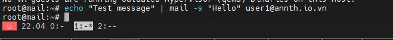
	- Kiểm tra mail tại user 
	- 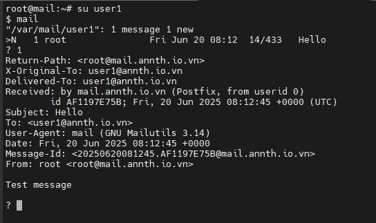
	- Kiểm tra log `/var/log/mail.log 
	- 

- Cấu hình TLS/SSL cho Postfix
	- Cài Certbot:
	```bash
	sudo add-apt-repository ppa:certbot/certbot
	sudo apt-get install certbot
	```
	- 
	- 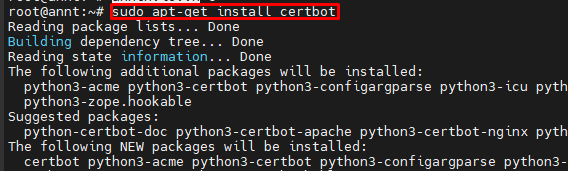

	- Lấy chứng chỉ:
	```bash
	sudo certbot certonly --standalone -d annth.io.vn
	sudo certbot certonly --standalone -d mail.annth.io.vn
	```
	- 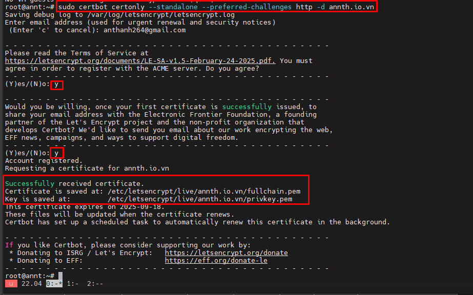
	- 
	- 

	- Cấu hình `main.cf` enable SSL/TLS
	```
	nano /etc/postfix/main.cf
	```
	```bash
	#Enable TLS Encryption when Postfix receives incoming emails
	smtpd_tls_cert_file=/etc/letsencrypt/live/mail.annth.io.vn/fullchain.pem
	smtpd_tls_key_file=/etc/letsencrypt/live/mail.annth.io.vn/privkey.pem
	smtpd_tls_security_level=may 
	smtpd_tls_loglevel = 1
	smtpd_tls_session_cache_database = btree:${data_directory}/smtpd_scache

	#Enable TLS Encryption when Postfix sends outgoing emails
	smtp_tls_security_level = may
	smtp_tls_loglevel = 1
	smtp_tls_session_cache_database = btree:${data_directory}/smtp_scache

	#Enforce TLSv1.3 or TLSv1.2
	smtpd_tls_mandatory_protocols = !SSLv2, !SSLv3, !TLSv1, !TLSv1.1
	smtpd_tls_protocols = !SSLv2, !SSLv3, !TLSv1, !TLSv1.1
	smtp_tls_mandatory_protocols = !SSLv2, !SSLv3, !TLSv1, !TLSv1.1
	smtp_tls_protocols = !SSLv2, !SSLv3, !TLSv1, !TLSv1.1
	```
	- 
		- Trong đó 
			- Cấu hình TLS khi nhận email (các biến `smtpd_`)
				- `smtpd_tls_cert_file=/etc/letsencrypt/live/mail.annth.io.vn/fullchain.pem`: 
					- Chỉ định đường dẫn đến chứng chỉ TLS được cấp bởi Let's Encrypt. Đây là chứng chỉ dùng khi Postfix đóng vai trò máy chủ nhận thư.
				- `smtpd_tls_key_file=/etc/letsencrypt/live/mail.annth.io.vn/privkey.pem`  
					- Chỉ định khóa riêng (private key) tương ứng với chứng chỉ ở trên.
				- `smtpd_tls_security_level = may`  
					- Cho phép hỗ trợ TLS nếu client đề xuất, nhưng không bắt buộc phải sử dụng. Nếu muốn bắt buộc, dùng `encrypt`.
				- `smtpd_tls_loglevel = 1`  
					- Kích hoạt ghi log mức cơ bản cho TLS (hiển thị thông tin cơ bản về trạng thái TLS trong log).
				- `smtpd_tls_session_cache_database = btree:${data_directory}/smtpd_scache`  
					- Bật cơ chế lưu trữ thông tin phiên TLS để tối ưu hóa kết nối lặp lại từ client (tăng hiệu suất).
			-  Cấu hình TLS khi gửi email (các biến `smtp_`)
				- `smtp_tls_security_level = may`  
					- Postfix sẽ cố gắng sử dụng TLS khi giao tiếp với máy chủ đích, nếu máy chủ đó hỗ trợ. Không bắt buộc phải mã hóa.
				- `smtp_tls_loglevel = 1`  
					- Ghi log mức cơ bản cho các phiên TLS khi Postfix là client gửi thư.
				- `smtp_tls_session_cache_database = btree:${data_directory}/smtp_scache`  
					- Bật cache phiên TLS cho chiều gửi, giúp tái sử dụng thông tin phiên và tăng tốc kết nối với máy chủ SMTP bên ngoài.
			- Hạn chế các giao thức TLS/SSL lỗi thời
				- `smtpd_tls_mandatory_protocols = !SSLv2, !SSLv3, !TLSv1, !TLSv1.1`  
					- Loại bỏ các giao thức cũ không còn an toàn khi Postfix nhận email (ví dụ: SSLv2, SSLv3).
				- `smtpd_tls_protocols = !SSLv2, !SSLv3, !TLSv1, !TLSv1.1`  
					- Tương tự như trên, áp dụng với cả client không bắt buộc TLS.
				- `smtp_tls_mandatory_protocols = !SSLv2, !SSLv3, !TLSv1, !TLSv1.1`  
					- Vô hiệu hóa các giao thức lỗi thời khi gửi email ra ngoài.
				- `smtp_tls_protocols = !SSLv2, !SSLv3, !TLSv1, !TLSv1.1`  
					- Bảo đảm chỉ sử dụng TLS 1.2 hoặc TLS 1.3 trong mọi phiên gửi thư, kể cả không bắt buộc.

	- Enable dịch vụ `submission` trong Postfix: Cấu hình này sẽ bật dịch vụ submission trong Postfix và yêu cầu mọi kết nối đều phải được mã hóa TLS. Nhờ đó, ứng dụng email trên máy tính có thể kết nối an toàn đến cổng 587 để gửi thư, sử dụng giao thức STARTTLS 
	```
	nano /etc/postfix/master.cf
	```
	```bash
	submission     inet     n    -    y    -    -    smtpd
	  -o syslog_name=postfix/submission
	  -o smtpd_tls_security_level=encrypt
	  -o smtpd_tls_wrappermode=no
	  -o smtpd_sasl_auth_enable=yes
	  -o smtpd_relay_restrictions=permit_sasl_authenticated,reject
	  -o smtpd_recipient_restrictions=permit_mynetworks,permit_sasl_authenticated,reject
	  -o smtpd_sasl_type=dovecot
	  -o smtpd_sasl_path=private/auth
	```
	- 

		- Trong đó 
			- `submission     inet     n    -    y    -    -    smtpd`  
				- Khai báo một dịch vụ `submission` chạy ở chế độ `inet` (TCP), dùng tiến trình `smtpd`. Cổng 587 thường được các ứng dụng email (Outlook, Thunderbird...) sử dụng để gửi mail có xác thực.
			- `-o syslog_name=postfix/submission`  
				- Tùy chỉnh tên hiển thị trong log để phân biệt với SMTP thường.
			- `-o smtpd_tls_security_level=encrypt`  
				- Yêu cầu bắt buộc kết nối phải qua TLS (STARTTLS) — đảm bảo gửi mail qua kênh bảo mật.
			- `-o smtpd_tls_wrappermode=no`  
				- Không sử dụng TLS bọc toàn bộ (chế độ smtps như cổng 465); sử dụng STARTTLS trên cổng 587.
			- `-o smtpd_sasl_auth_enable=yes`  
				- Bật xác thực SMTP AUTH, cho phép client đăng nhập để gửi mail.
			- `-o smtpd_relay_restrictions=permit_sasl_authenticated,reject`  
				- Chỉ cho phép gửi mail ra ngoài (relay) nếu client đã xác thực. Ngăn chặn open relay.
			- `-o smtpd_recipient_restrictions=permit_mynetworks,permit_sasl_authenticated,reject`  
				- Cho phép gửi thư đến người nhận nếu:
					- client thuộc mạng nội bộ (`mynetworks`)
					- hoặc đã xác thực thành công qua SASL
					- các trường hợp khác sẽ bị từ chối
			- `-o smtpd_sasl_type=dovecot`  
				- Sử dụng Dovecot làm backend xác thực cho Postfix.
			- `-o smtpd_sasl_path=private/auth`  
				- Chỉ định socket Unix mà Postfix dùng để kết nối đến dịch vụ xác thực của Dovecot (`/var/spool/postfix/private/auth`).

	- Retart Postfix để apply 
	```
	systemctl restart postfix
	```
	- Kiểm tra nhận thấy postfix đang chạy trên port 587  
	```
	netstat -tlnp 
	```
	- 

<!-- TOC --><a name="23-cài-t-và-cu-hình-dovecot"></a>
### 2.3 Cài đặt và cấu hình Dovecot
- Dovecot là phần mềm mã nguồn mở dùng để cung cấp dịch vụ truy cập thư qua giao thức IMAP và POP3.
- Được thiết kế ưu tiên bảo mật, hiệu suất cao và dễ cấu hình.
- Có thể dùng để lưu trữ thư cho cả người dùng hệ thống (Unix users) lẫn hộp thư ảo (virtual mailboxes).
- Hỗ trợ định dạng lưu trữ Maildir, mbox hoặc định nghĩa cấu trúc tùy chỉnh.
- Hệ thống xác thực linh hoạt, hỗ trợ:
- Xác thực người dùng qua passwd, shadow, MySQL, PostgreSQL, LDAP…
- Tích hợp SASL để dùng chung xác thực với Postfix (SMTP AUTH).
- Hỗ trợ giao thức LMTP để nhận thư từ Postfix và lưu vào mailbox.
- Có thể kết hợp với plugin như quota, sieve (lọc thư), full-text search…
- Cấu hình qua các tệp chính trong /etc/dovecot/conf.d/, điển hình:
	- 10-auth.conf: cấu hình xác thực
	- 10-mail.conf: cấu hình lưu trữ thư
	- 10-master.conf: cấu hình dịch vụ và socket
	- dovecot-sql.conf.ext: cấu hình truy vấn DB nếu dùng mailbox ảo
- Dovecot thường được triển khai cùng Postfix: Postfix xử lý gửi/nhận thư còn Dovecot đảm nhiệm lưu trữ và truy xuất thư cho người dùng. Nếu bạn muốn mình so sánh hai thành phần này hoặc minh họa kiến trúc hoạt động, mình có thể làm tiếp ngay.
- Cài đặt dovecot và các module bổ trợ 
```bash
apt -y install dovecot-core dovecot-pop3d dovecot-imapd dovecot-lmtpd
```
- 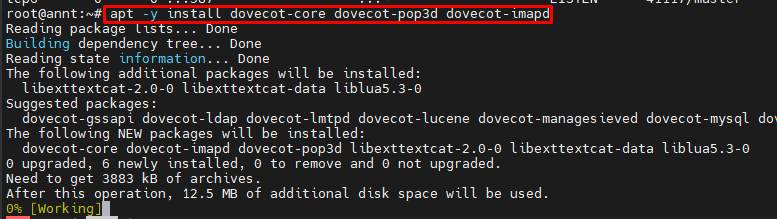
- 
- Cấu hình enable protocol:
```
nano /etc/dovecot/dovecot.conf
```
```conf
protocols = imap lmtp
```
- 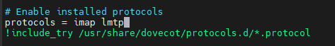

- Enable LMTP trong Dovecot và Postfix: LMTP (Local Mail Transfer Protocol) cho phép Postfix chuyển tiếp thư đến Dovecot để xử lý và lưu trữ, thay vì sử dụng LDA nội bộ của Postfix. Điều này giúp thư được lưu đúng định dạng Maildir và hỗ trợ các plugin như Sieve.
	- Dovecot 
		```
		sudo nano /etc/dovecot/conf.d/10-master.conf
		```
		```conf
		service lmtp {
		  unix_listener /var/spool/postfix/private/dovecot-lmtp {
			mode = 0600
			user = postfix
			group = postfix
		  }
		}
		```
			- Đường dẫn `private/dovecot-lmtp` phải nằm trong chroot của Postfix (/var/spool/postfix/).
			- `mode = 0600`: chỉ user postfix có quyền truy cập.
		- 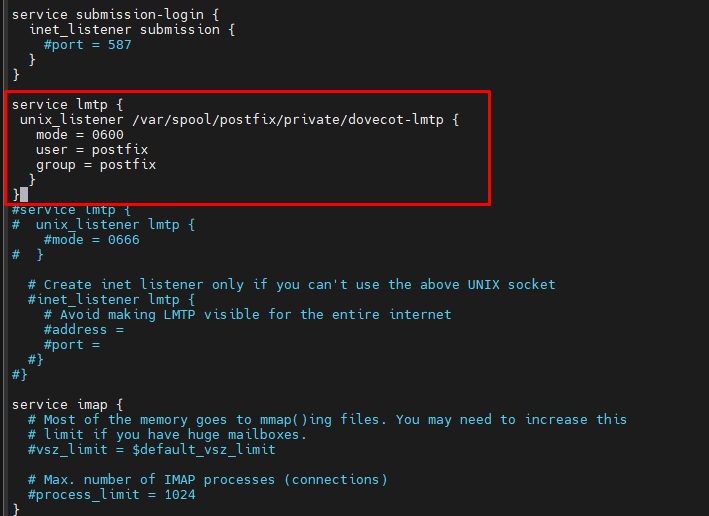
	- Postfix 
		```
		sudo nano /etc/postfix/main.cf
		```
		```conf
		mailbox_transport = lmtp:unix:private/dovecot-lmtp
		smtputf8_enable = no
		```
			- `mailbox_transport`: chỉ định Postfix sẽ chuyển thư nội bộ qua LMTP đến socket Dovecot.
			- `smtputf8_enable = no`: tắt hỗ trợ định dạng UTF-8 trong địa chỉ email, vì LMTP của Dovecot không hỗ trợ SMTPUTF8.
		- 

- Cấu hình Authentication Mechanism: 
	- Mặc định, khi Dovecot tìm kiếm hoặc phân phối email cho người dùng, nó sử dụng địa chỉ email đầy đủ (ví dụ: user@your-domain.com). Tuy nhiên, trong phần này, ta chỉ thiết lập hộp thư cho người dùng hệ thống (tức là tài khoản Unix thông thường), nên Dovecot sẽ không tìm thấy user theo định dạng đầy đủ có domain.
	- Dòng này yêu cầu Dovecot bỏ phần tên miền và chỉ giữ lại tên người dùng (username). Nhờ đó, Dovecot có thể ánh xạ địa chỉ email đến đúng tài khoản hệ thống. Đồng thời, vẫn cho phép người dùng đăng nhập bằng địa chỉ đầy đủ như user@your-domain.com.
	```
	nano /etc/dovecot/conf.d/10-auth.conf
	```
	```
	#auth_username_format = %Lu
	Uncomment it and change its value to %n.
	auth_username_format = %n
	```
	- 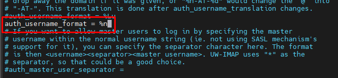
	- Các thông số cấu hình với `auth_username_format`
	
	| Giá trị      | Ý nghĩa                                      | Kết quả xử lý (với `User@Mail.Com`) |
	| ------------ | -------------------------------------------- | ----------------------------------- |
	| `%u`         | Giữ nguyên username đầy đủ                   | `User@Mail.Com`                     |
	| `%Lu`        | Viết thường toàn bộ username                 | `user@mail.com`                     |
	| `%n`         | Chỉ lấy phần tên người dùng (trước @)        | `User`                              |
	| `%Ln`        | Tên người dùng viết thường                   | `user`                              |
	| `%d`         | Chỉ lấy phần domain (sau @)                  | `Mail.Com`                          |
	| `%Ld`        | Domain viết thường                           | `mail.com`                          |
	| `%n-AT-%d`   | Thay ký tự @ bằng chuỗi `-AT-`               | `User-AT-Mail.Com`                  |
	| `%Ln-AT-%Ld` | Chuyển toàn bộ username sang thường và đổi @ | `user-AT-mail.com`                  |
	| `%d/%n`      | Tạo cấu trúc thư mục dạng domain/username    | `Mail.Com/User`                     |

- Cấu hình TLS cho Dovecot:
```
nano /etc/dovecot/conf.d/10-ssl.conf
```
```conf
ssl = required
ssl_cert = </etc/letsencrypt/live/mail.annth.io.vn/fullchain.pem
ssl_key = </etc/letsencrypt/live/mail.annth.io.vn/privkey.pem
```
- 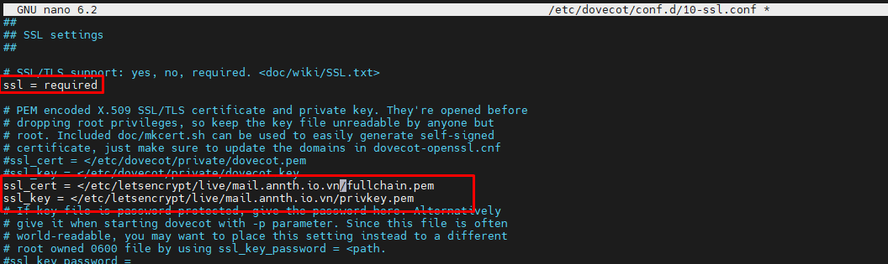

- Cấu hình SASL Authentication
```
sudo nano /etc/dovecot/conf.d/10-master.conf
```
```
service auth {
    unix_listener /var/spool/postfix/private/auth {
      mode = 0660
      user = postfix
      group = postfix
    }
}
```
- 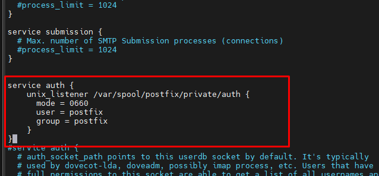

- Restart để apply dịch vụ 
```
sudo systemctl restart postfix dovecot
```
- Kiểm tra: 
	- Trên server nhận thấy Dovecot đã chạy trên imap 143 993 
	```
	sudo ss -lnpt | grep dovecot
	```
	- 
- Kiểm tra đăng nhập từ client Thunderbird
	- Đăng nhập
	- 
	- 
	- Gửi - nhận mail 
	- 
	- 
	- Kiểm tra log trên server 
	- 

<!-- TOC --><a name="24-postfixadmin-qun-lý-virtual-mailbox"></a>
### 2.4 PostfixAdmin – Quản lý Virtual Mailbox
- Máy chủ Postfix (SMTP) và Dovecot (IMAP) đã được cài đặt, tuy nhiên hiện tại hệ thống chỉ cho phép sử dụng địa chỉ email của các tài khoản Unix cục bộ. 
- Thực hiện tạo hộp thư ảo (virtual mailboxes) trên máy chủ Ubuntu bằng PostfixAdmin — một giao diện web mã nguồn mở để cấu hình và quản lý hệ thống email sử dụng Postfix, hỗ trợ nhiều domain và người dùng.
- Với virtual mailbox, không cần tạo tài khoản Unix tương ứng cho từng địa chỉ email. Điều này rất hữu ích nếu thiết lập hệ thống mail cho tổ chức hoặc doanh nghiệp — khi đó cần một giao diện web để dễ dàng tạo, quản lý tài khoản và thay đổi mật khẩu. Đó chính là vai trò của PostfixAdmin.
- Một số tính năng của PostfixAdmin:
	- Quản lý mailbox, domain ảo, alias
	- Hỗ trợ thiết lập tự động trả lời khi vắng mặt (có thể kết hợp với Roundcube)
	- Hỗ trợ alias domain (chuyển tiếp toàn bộ sang domain khác)
	- Người dùng có thể tự đổi mật khẩu, alias và cấu hình trả lời tự động
	- Hỗ trợ quota từng hộp thư và tổng dung lượng theo domain
	- Tích hợp với Fetchmail (lấy thư từ địa chỉ gốc về địa chỉ mới)
	- Hỗ trợ dòng lệnh với postfixadmin-cli (không cần thao tác qua giao diện web)

- Cài đặt, cấu hình MariaDB:
	```bash
	sudo apt install mariadb-server mariadb-client
	```
	- 
	- Tạo DB, user, gán quyền
	```sql
	CREATE DATABASE postfixadmin;
	CREATE USER 'postfixadmin'@'localhost' IDENTIFIED BY 'Qaz@123';
	GRANT ALL PRIVILEGES ON postfixadmin.* TO 'postfixadmin'@'localhost';
	```
	- 

- Tải PostfixAdmin:
	- Tải source, giải nén, di chuyển tới thư mục phù hợp 
	```bash
	wget https://github.com/postfixadmin/postfixadmin/archive/postfixadmin-3.3.15.tar.gz
	sudo mkdir -p /var/www/
	sudo tar xvf postfixadmin-3.3.11.tar.gz -C /var/www/
	sudo mv /var/www/postfixadmin-postfixadmin-3.3.11 /var/www/postfixadmin
	sudo mkdir -p /var/www/postfixadmin/templates_c
	```
	- 
	- 
	- Cấp quyền: 
		- PostfixAdmin yêu cầu một thư mục templates_c, và máy chủ web cần có quyền đọc/ghi vào thư mục
		- Dovecot cũng yêu cầu mgười dùng chạy web server cần có quyền đọc chứng chỉ TLS được cấp bởi Let's Encrypt để thực hiện việc băm mật khẩu
		```
		sudo apt install acl
		sudo setfacl -R -m u:www-data:rwx /var/www/postfixadmin/templates_c/
		sudo setfacl -R -m u:www-data:rx /etc/letsencrypt/live/ /etc/letsencrypt/archive/
		```
		- 

- Cấu hình PostfixAdmin
	```
	sudo nano /var/www/postfixadmin/config.inc.php
	```
	```
	<?php
	$CONF['configured'] = true;
	$CONF['database_type'] = 'mysqli';
	$CONF['database_host'] = 'localhost';
	$CONF['database_port'] = '3306';
	$CONF['database_user'] = 'postfixadmin';
	$CONF['database_password'] = 'Qaz@123';
	$CONF['database_name'] = 'postfixadmin';
	$CONF['encrypt'] = 'dovecot:ARGON2I';
	$CONF['dovecotpw'] = "/usr/bin/doveadm pw -r 5";
	if(@file_exists('/usr/bin/doveadm')) { // @ to silence openbase_dir stuff; see https://github.com/postfixadmin/postfixadmin/issues/171
		$CONF['dovecotpw'] = "/usr/bin/doveadm pw -r 5"; # debian
	}
	```
	- 

	- Tạo virtual host với Nginx cho PostfixAdmin
		```
		apt install nginx 
		sudo nano /etc/nginx/conf.d/postfixadmin.conf
		```
		```
		server {
		   listen 80;
		   listen [::]:80;
		   server_name postfixadmin.annth.io.vn;

		   root /var/www/postfixadmin/public/;
		   index index.php index.html;

		   access_log /var/log/nginx/postfixadmin_access.log;
		   error_log /var/log/nginx/postfixadmin_error.log;

		   location / {
			   try_files $uri $uri/ /index.php;
		   }

		   location ~ ^/(.+\.php)$ {
				try_files $uri =404;
				fastcgi_pass unix:/run/php/php8.1-fpm.sock;
				fastcgi_index index.php;
				fastcgi_param SCRIPT_FILENAME $document_root$fastcgi_script_name;
				include /etc/nginx/fastcgi_params;
		   }
		}
		```
		- 
		- 
		- Kiểm tra cấu hình Nginx
		```
		nginx -t
		```
		- 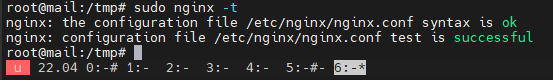

	- Cài đặt PHP 
	```
	sudo apt install php8.1-fpm php8.1-imap php8.1-mbstring php8.1-mysql php8.1-curl php8.1-zip php8.1-xml php8.1-bz2 php8.1-intl php8.1-gmp php8.1-redis
	```
	- 

	- Cấu hình SSL cho web:
		- Cài certbot 
		```
		sudo apt install python3-certbot-nginx
		```
		- 
		- Lấy cert 
		```bash
		sudo certbot --nginx --agree-tos --redirect --hsts --staple-ocsp --email anthanh264@gmail.com -d postfixadmin.annth.io.vn
		```
		- 

	- Truy cập PostfixAdmin và cấu hình tại `https://postfixadmin.annth.io.vn/setup.php`
		- 
		- Thêm cấu hình vào file 
		```
		nano /var/www/postfixadmin/config.local.php
		```
		- 
		- Login `setup_password` và tạo account admin 
		- 
		- 
		- Lưu ý: 
			- Nếu gặp lỗi 
			- 
			- Chạy lệnh sau để fix 
			```
			sudo setfacl -R -m u:www-data:rwx /var/run/dovecot/stats-reader /var/run/dovecot/stats-writer
			```
			- 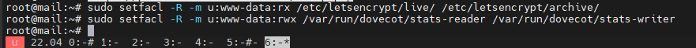
		- Tạo thành công account admin và đăng nhập.
		- 
		- 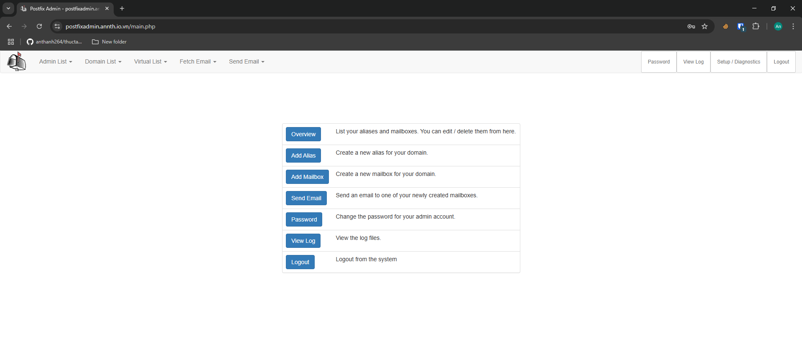
	
- Cấu hình Postfix hoạt động với virtualmailbox 
	- Cài đặt gói bổ sung 
	```
	sudo apt install postfix-mysql
	```
	- 
	- Sửa file cấu hình `main.cf`
	```
	sudo nano /etc/postfix/main.cf
	```
	```
	virtual_mailbox_domains = proxy:mysql:/etc/postfix/sql/mysql_virtual_domains_maps.cf
	virtual_mailbox_maps =
	   proxy:mysql:/etc/postfix/sql/mysql_virtual_mailbox_maps.cf,
	   proxy:mysql:/etc/postfix/sql/mysql_virtual_alias_domain_mailbox_maps.cf
	virtual_alias_maps =
	   proxy:mysql:/etc/postfix/sql/mysql_virtual_alias_maps.cf,
	   proxy:mysql:/etc/postfix/sql/mysql_virtual_alias_domain_maps.cf,
	   proxy:mysql:/etc/postfix/sql/mysql_virtual_alias_domain_catchall_maps.cf
	virtual_transport = lmtp:unix:private/dovecot-lmtp   
	```
	- 
		- virtual_mailbox_domains: xác định domain nào là hợp lệ, tra trong cơ sở dữ liệu.
		- virtual_mailbox_maps: kiểm tra xem địa chỉ email có tồn tại hay không (cả mailbox chính và alias dạng domain).
		- virtual_alias_maps: xử lý alias – chuyển tiếp địa chỉ này sang địa chỉ khác, bao gồm alias đơn, alias domain, và catch-all.
		- virtual_transport = lmtp:unix:private/dovecot-lmtp: chuyển thư đến Dovecot qua LMTP để lưu trữ vào mailbox.

	- Tạo các file đã cấu hình phục vụ cho việc đọc, truy vấn data virtual mailbox 
	```
	sudo mkdir /etc/postfix/sql/
	```
		- virtual_mailbox_domains
		```
		sudo nano /etc/postfix/sql/mysql_virtual_domains_maps.cf
		```
		```
		user = postfixadmin
		password = Qaz@123
		hosts = localhost
		dbname = postfixadmin
		query = SELECT domain FROM domain WHERE domain='%s' AND active = '1'
		```
		- 
		- virtual_mailbox_maps
		```
		sudo nano /etc/postfix/sql/mysql_virtual_mailbox_maps.cf
		```
		```
		user = postfixadmin
		password = Qaz@123
		hosts = localhost
		dbname = postfixadmin
		query = SELECT maildir FROM mailbox WHERE username='%s' AND active = '1'
		```
		- 
		- virtual_alias_maps
		```
		sudo nano /etc/postfix/sql/mysql_virtual_alias_domain_mailbox_maps.cf
		```
		```
		user = postfixadmin
		password = Qaz@123
		hosts = localhost
		dbname = postfixadmin
		query = SELECT maildir FROM mailbox,alias_domain WHERE alias_domain.alias_domain = '%d' and mailbox.username = CONCAT('%u', '@', alias_domain.target_domain) AND mailbox.active = 1 AND alias_domain.active='1'
		```
		- 
		- mysql_virtual_alias_maps
		```
		sudo nano /etc/postfix/sql/mysql_virtual_alias_maps.cf
		```
		```
		user = postfixadmin
		password = Qaz@123
		hosts = localhost
		dbname = postfixadmin
		query = SELECT goto FROM alias WHERE address='%s' AND active = '1'
		```
		- 		
		- mysql_virtual_alias_domain_maps
		```
		sudo nano /etc/postfix/sql/mysql_virtual_alias_domain_maps.cf
		```
		```
		user = postfixadmin
		password = Qaz@123
		hosts = localhost
		dbname = postfixadmin
		query = SELECT goto FROM alias,alias_domain WHERE alias_domain.alias_domain = '%d' and alias.address = CONCAT('%u', '@', alias_domain.target_domain) AND alias.active = 1 AND alias_domain.active='1'
		```
		- 
		- mysql_virtual_alias_domain_catchall_maps
		```
		sudo nano /etc/postfix/sql/mysql_virtual_alias_domain_catchall_maps.cf
		```
		```
		user = postfixadmin
		password = Qaz@123
		hosts = localhost
		dbname = postfixadmin
		query = SELECT goto FROM alias,alias_domain WHERE alias_domain.alias_domain = '%d' and alias.address = CONCAT('@', alias_domain.target_domain) AND alias.active = 1 AND alias_domain.active='1'
		```
		- 

	- Cấu hình quyền 
		```
		sudo chmod 0640 /etc/postfix/sql/*
		sudo setfacl -R -m u:postfix:rx /etc/postfix/sql/
		```
		- 
	- Cấu hình giá trị `mydestination`
		- Giá trị hiện tại 
		```
		postconf mydestination
		```
		- Thay đổi 
		```
		sudo postconf -e "mydestination = \$myhostname, localhost.\$mydomain, localhost"
		```
		- 
	- Cấu hình virtual_mailbox_box location 
	```
	sudo nano /etc/postfix/main.cf
	```
	```
	virtual_mailbox_base = /var/vmail
	virtual_minimum_uid = 2000
	virtual_uid_maps = static:2000
	virtual_gid_maps = static:2000
	```
	- 
	
	- Thêm user `vmail`, cấu hình quyền thư mục 
	```
	sudo adduser vmail --system --group --uid 2000 --disabled-login --no-create-home
	sudo mkdir /var/vmail/
	sudo chown vmail:vmail /var/vmail/ -R
	```
	- 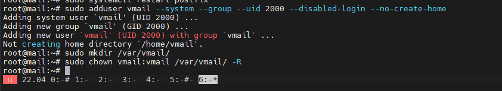

- Cấu hình Dovecot hoạt động với virtualmailbox 
	- Cài plugin MySQL:
	```bash
	apt install dovecot-mysql
	```
	- 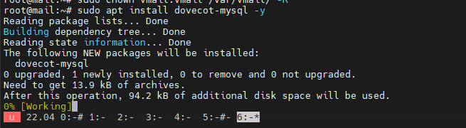
	- Cấu hình thư mục lưu mail `10-mail.conf`:
	```
	sudo nano /etc/dovecot/conf.d/10-mail.conf

	```
	```conf
	mail_home = /var/vmail/%d/%n/
	mail_location = maildir:/var/vmail/%d/%n/
	```
	- 
	- Cấu hình format account, cho phép auth từ data sql `10-auth.conf`:
	```
	sudo nano /etc/dovecot/conf.d/10-auth.conf
	```
	```conf
	auth_username_format = %u
	auth_default_realm = annth.io.vn
	!include auth-sql.conf.ext
	```
	- 
	- 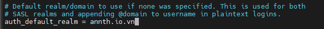
	- 
	- Cấu hình truy vấn dovecot tới sql 
	```
	sudo nano /etc/dovecot/dovecot-sql.conf.ext
	```
	```conf
	driver = mysql
	connect = host=localhost dbname=postfixadmin user=postfixadmin password=Qaz@123
	default_pass_scheme = ARGON2I
	password_query = SELECT username AS user,password FROM mailbox WHERE username = '%u' AND active='1'
	user_query = SELECT maildir, 2000 AS uid, 2000 AS gid FROM mailbox WHERE username = '%u' AND active='1'
	iterate_query = SELECT username AS user FROM mailbox
	```
	- 
	- Restart để apply cấu hình  
	```
	systemctl restart postfix dovecot 
	```
- Sử dụng PostfixAdmin 
	- Tạo Domain trong PostfixAdmin : Đăng nhập vào giao diện web của PostfixAdmin với quyền quản trị viên. Nhấp vào tab Domain List (Danh sách tên miền) và chọn New Domain (Thêm tên miền mới) để tạo một domain. Tại đây, có thể cấu hình số lượng alias (bí danh) và mailbox (hộp thư) tối đa được phép sử dụng cho tên miền đó.
		- 
		- 
		- 
	- Sau đó, nhấp vào tab Virtual List và chọn Add Mailbox để thêm địa chỉ email mới cho tên miền mới tạo.
		- 
		- 
	- Test login bằng Thunderbird
		- 

<!-- TOC --><a name="25-cài-rainloop-webmail"></a>
### 2.5. Cài RainLoop Webmail
- RainLoop là một ứng dụng webmail hiện đại, mã nguồn mở, nổi bật nhờ tốc độ xử lý nhanh, giao diện thân thiện và khả năng tích hợp dễ dàng. Đây là lựa chọn phổ biến nếu bạn muốn cung cấp dịch vụ email qua trình duyệt mà không cần đến hệ thống nặng nề hoặc phức tạp.
- Đặc điểm tổng quan:
	- Hiệu suất cao và nhẹ: Tải nhanh, phản hồi mượt ngay cả trên hệ thống có tài nguyên hạn chế.
	- Không cần cơ sở dữ liệu: Hoạt động trực tiếp với máy chủ IMAP/SMTP — không phụ thuộc vào MySQL hoặc PostgreSQL.
	- Hỗ trợ nhiều tài khoản: Người dùng có thể đăng nhập cùng lúc nhiều địa chỉ email từ các domain khác nhau.
	- Xác thực hai lớp (2FA): Tăng cường độ bảo mật khi truy cập.
	- Tùy biến dễ dàng: Hỗ trợ giao diện tùy chỉnh và plugin.
	- Tích hợp dịch vụ thứ ba: Có thể kết nối với Google Drive, Dropbox, Facebook, v.v.
	- Cài đặt đơn giản: Triển khai nhanh chóng chỉ với một vài bước, có công cụ nâng cấp tự động qua trình quản trị.
- Cài đặt 
	- Tải source, di chuyển tới thu mục phù hợp, gán quyền 
		```bash
		mkdir rainloop
		cd rainloop
		curl -sL https://repository.rainloop.net/installer.php | php
		mv rainloop /var/www/
		sudo chown www-data:www-data /var/www/rainloop/ -R
		```
		- 
	- Cấu hình virtual host nginx cho `mail.annth.io.vn`
		```
		sudo nano /etc/nginx/conf.d/rainloop.conf
		```
		```
		server {
		   listen 80;
		   listen [::]:80;
		   server_name mail.annth.io.vn;

		   root /var/www/rainloop;
		   index index.php index.html;
			
		   access_log /var/log/nginx/rainloop_access.log;
		   error_log /var/log/nginx/rainloop_error.log;
		   
		   location / {
			   try_files $uri $uri/ /index.php?$query_string;
		   }

		   location ~ ^/(.+\.php)$ {
				try_files $uri =404;
				fastcgi_pass unix:/run/php/php8.1-fpm.sock;
				fastcgi_index index.php;
				fastcgi_param SCRIPT_FILENAME $document_root$fastcgi_script_name;
				include /etc/nginx/fastcgi_params;
		   }
		 
		   location ^~ /data {
			   deny all;
		   }
		}
		```
		```
		sudo systemctl reload nginx
		```
		- 

	- SSL với Certbot:
		```bash
		sudo certbot --nginx --agree-tos --redirect --hsts --staple-ocsp --email anthanh264@gmail.com -d mail.annth.io.vn
		```
		- 

- Truy cập: `https://mail.annth.io.vn/?admin` (admin / 12345) thực hiện thêm domain.
	- 
	- 
	- 
- Test đăng nhập `https://mail.annth.io.vn`
	- 
	- 

<!-- TOC --><a name="references"></a>
## References 
* 1. [What are Email Protocols (POP3, SMTP and IMAP) and their default ports?](https://world.siteground.com/tutorials/email/protocols-pop3-smtp-imap/)
* 2. [Simple Mail Transfer Protocol (SMTP) - GeeksforGeeks](https://www.geeksforgeeks.org/computer-networks/simple-mail-transfer-protocol-smtp/)
* 3. [How email works (MTA, MDA, MUA) ](https://www.idc-online.com/technical_references/pdfs/data_communications/How_email_works_Mta_Mda_Mua.pdf)
* 4. [Email Protocols: What they are & their different types | Zoho Mail](https://www.zoho.com/mail/glossary/email-protocols.html)
* 5. [Essential email DNS records and how to set them up](https://www.mailersend.com/blog/dns-records)
* 6. [Brittle Things: Email Architecture](https://forprograms.blogspot.com/2013/01/email-architecture.html)
* 7. [How does email work: MUA, MSA, MTA, MDA, MRA](https://oxilor.com/blog/how-does-email-work)
* 8. [Email agent (infrastructure) - Wikipedia](https://en.wikipedia.org/wiki/Email_agent_(infrastructure))
* 9. [Build Your Own Email Server on Ubuntu: Basic Postfix Setup - LinuxBabe](https://www.linuxbabe.com/mail-server/setup-basic-postfix-mail-sever-ubuntu)