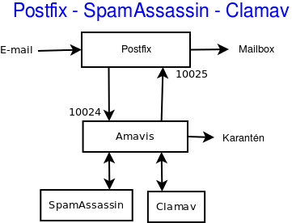

# Email 
## 1.Vận hành & Quản trị
### 1.1 Cấu trúc & thành phần của một email server
#### 1.1.1 Tổng quan 
- Email (Electronic Mail) là một phương tiện giao tiếp trực tuyến, cho phép người dùng gửi và nhận thư điện tử thông qua mạng internet. 
- Cấu trúc cơ bản của Email :
	- Địa chỉ email: Mỗi người dùng email có một địa chỉ email duy nhất, thường bao gồm tên người dùng và tên miền của nhà cung cấp dịch vụ (ví dụ: example@gmail.com). 
	- Mail Server: Là hệ thống máy chủ đảm nhiệm vai trò gửi, nhận và lưu trữ email. 
	- Giao thức: Các giao thức như SMTP, POP3, và IMAP được sử dụng để truyền tải và truy cập email. 
- Quy trình hoạt động:
	- Người gửi soạn email và gửi đi từ thiết bị của họ. 
	- Email được chuyển đến mail server của người gửi. 
	- Mail server của người gửi định tuyến email đến mail server của người nhận. 
	- Mail server của người nhận lưu trữ email cho đến khi người nhận truy cập. 
	- Người nhận truy cập email của họ thông qua ứng dụng hoặc trình duyệt web. 
- Lợi ích của email:
	- Tốc độ: Email cho phép gửi và nhận thư nhanh chóng, gần như ngay lập tức. 
	- Tiện lợi: Người dùng có thể truy cập email từ bất kỳ thiết bị nào có kết nối internet. 
	- Lưu trữ: Email có thể được lưu trữ trên máy chủ hoặc thiết bị cá nhân, giúp người dùng dễ dàng quản lý. 
	- Tính phổ biến: Email là một phương tiện giao tiếp phổ biến và được sử dụng rộng rãi trên toàn cầu. 
	- Tính bảo mật: Mail server có thể được cấu hình để tăng cường bảo mật và bảo vệ thông tin. 
- Mail Server (hay còn gọi là Email Server hay máy chủ thư điện tử) là một hệ thống máy tính hoặc máy chủ được thiết lập để quản lý và xử lý các dịch vụ liên quan đến thư điện tử email. Chức năng chính của Server Mail là quản lý và lưu trữ email số lượng lớn, cho nhân viên dùng gửi và nhận thư điện tử thông qua mạng.
- Các loại mail server:
	- Mail server cá nhân: Dành cho cá nhân hoặc doanh nghiệp nhỏ, thường được cung cấp bởi các nhà cung cấp dịch vụ email miễn phí hoặc trả phí. 
	- Mail server doanh nghiệp: Dành cho các tổ chức, doanh nghiệp lớn, có thể được quản lý nội bộ hoặc thuê ngoài. 
	- Mail server của nhà cung cấp dịch vụ: Các dịch vụ email phổ biến như Gmail, Outlook, Yahoo Mail đều sử dụng hệ thống mail server riêng. 
- Các dịch vụ email phổ biến: Gmail, Outlook, Yahoo Mail, Zoho Mail, iCloud Mail. 
- Cơ chế hoạt động của Mail Server 
	- Outgoing Mail Server và Incoming Mail Server cùng hoạt động để đảm bảo việc gửi và nhận thư điện tử được thực hiện một cách hiệu quả và an toàn.
	- Outgoing Mail Server (SMTP Server) 
		- Là thành phần quan trọng trong cơ chế hoạt động của Server Mail. Nhiệm vụ chính của Outgoing Mail Server là xử lý và gửi đi các email từ người gửi tới người nhận. Quá trình hoạt động của Outgoing Mail Server như sau:
		- Gửi Email: Người gửi viết email thông qua ứng dụng email của họ (MUA – Mail User Agent) và gửi nó tới Outgoing Mail Server thông qua giao thức SMTP (Simple Mail Transfer Protocol).
		- Kiểm Tra Địa Chỉ Người Nhận: Outgoing Mail Server kiểm tra địa chỉ email của người nhận để xác định máy chủ thư điện tử của họ.
		- Chuyển Tiếp Email: Outgoing Mail Server sử dụng giao thức SMTP để chuyển tiếp email tới máy chủ thư điện tử của người nhận thông qua mạng.
	- Incoming Mail Server (IMAP,POP3)
		- Là thành phần quản lý thư điện tử đến của Server Mail. Nhiệm vụ của Incoming Mail Server là lưu trữ và quản lý các email đến và cho phép người nhận truy cập vào chúng. Quá trình hoạt động của Incoming Mail Server như sau:
		- Nhận và Lưu Trữ Email: Khi email được gửi từ Outgoing Server Mail của người gửi, Incoming Mail Server nhận và lưu trữ chúng trong hộp thư đến của người nhận.
		- Truyền Thư tới Máy Khách: Đối với giao thức IMAP, Incoming Mail Server cho phép người nhận truy cập thư điện tử trực tiếp trên máy chủ thông qua giao thức IMAP. Thư điện tử được lưu trữ trên máy chủ và chỉ truyền tới máy khách khi cần.
		- Tải Thư về Máy Khách: Đối với giao thức POP3, Incoming Server Mail cho phép máy khách tải toàn bộ email từ hộp thư đến về máy tính của người nhận. Email sau khi tải về có thể bị xóa khỏi máy chủ server.
#### 1.1.2 Các thành phần của Mail Server System 
- Hệ thống email hiện đại được xây dựng dựa trên một chuỗi các thành phần phần mềm chuyên biệt, mỗi thành phần đảm nhận một vai trò cụ thể trong quá trình gửi, truyền, lưu trữ và truy xuất thư điện tử. Các thành phần chính bao gồm:
##### 1.1.2.1 Message User Agent (MUA)
- MUA là phần mềm mà người dùng cuối sử dụng để soạn, gửi, nhận và quản lý email. Đây là giao diện tương tác trực tiếp giữa người dùng và hệ thống email.
- Ví dụ: Microsoft Outlook, Mozilla Thunderbird, Apple Mail, Gmail (trình duyệt).
- Chức năng chính:
	- Soạn và gửi email đến MSA thông qua SMTP.
	- Nhận email từ MRA thông qua POP3 hoặc IMAP.
	- Quản lý hộp thư, thư mục, gắn nhãn, tìm kiếm, lọc thư.
	- Giao thức sử dụng: SMTP (gửi), POP3/IMAP (nhận).
##### 1.1.2.2 Message Submission Agent (MSA)
- MSA là thành phần trung gian giữa MUA và MTA, chịu trách nhiệm tiếp nhận email từ MUA và chuẩn hóa định dạng trước khi chuyển đến MTA để truyền đi.
- Vai trò:
	- Xác thực người gửi (authentication).
	- Kiểm tra định dạng và tiêu chuẩn RFC của email.
	- Ghi log và áp dụng chính sách gửi thư (rate limit, kiểm tra SPF...).
	- Cổng mặc định: SMTP qua cổng 587 (hoặc 465 với SMTPS).
- Ví dụ: Postfix khi cấu hình chế độ submission, Sendmail, Ex

##### 1.1.2.3 Message Transfer Agent (MTA)
- MTA là thành phần cốt lõi trong hệ thống email, chịu trách nhiệm truyền tải email giữa các máy chủ thông qua giao thức SMTP.
- Chức năng:
	- Nhận email từ MSA hoặc MTA khác.
	- Tra cứu bản ghi MX của tên miền người nhận thông qua DNS.
	- Truyền tiếp email đến MTA đích hoặc MDA nếu nội bộ.
	- Quản lý hàng đợi thư (mail queue) và retry nếu gửi thất bại.
	- Giao thức: SMTP (port 25 giữa các MTA).
- Ví dụ: Postfix, Sendmail, Exim, Qmail.
- Lưu ý: MTA thường hoạt động ở chế độ nền (daemon) và không tương tác trực tiếp với người dùng.

##### 1.1.2.4 Message Delivery Agent (MDA)
- MDA là thành phần phân phối email đến hộp thư người nhận sau khi được MTA chuyển đến.
- Chức năng:
	- Lưu trữ email vào định dạng cụ thể như Maildir hoặc mbox.
	- Áp dụng bộ lọc thư (mail filtering), chuyển tiếp, hoặc phân loại thư.
	- Có thể tích hợp với phần mềm chống spam/virus.
- Ví dụ: Dovecot (LDA), Procmail, maildrop.
- Giao thức nội bộ: Không sử dụng SMTP mà thường là giao tiếp nội bộ giữa MTA và MDA.

##### 1.1.2.5 Mail Retrieval Agent (MRA)
- MRA là thành phần truy xuất email từ máy chủ và chuyển đến MUA. Đây là cầu nối giữa hộp thư lưu trữ và ứng dụng người dùng.
- Chức năng:
	- Kết nối đến máy chủ lưu trữ thư (thường là Dovecot hoặc Courier).
	- Tải thư về máy người dùng (POP3) hoặc đồng bộ thư (IMAP).
	- Hỗ trợ xác thực và mã hóa kết nối (SSL/TLS).
	- Ví dụ: fetchmail, getmail.
- Giao thức: POP3 (port 110), IMAP (port 143), hoặc phiên bản bảo mật (995/993).

##### 1.1.2.6 Luồng xử lý Email 
- Trong kiến trúc hệ thống email, các tác nhân phần mềm (agents) được phân chia theo vai trò chức năng trong quá trình gửi và nhận thư. Truyền thống, hệ thống được chia thành hai phía:
	- Client-side: MUA (Message User Agent)
	- Server-side: MTA (Message Transfer Agent)
- Theo một các đơn giản luồng xử lý gồm: 
`MUA → MTA → … → MTA → MUA`
	- MUA bên gửi đẩy thư đến máy chủ SMTP (MTA).
	- MTA gửi thư qua Internet đến MTA của bên nhận (có thể qua nhiều MTA trung gian).
	- MUA của bên nhận sẽ lấy thư từ hộp thư.

- Luồng xử lý mail hiện đại với các thành phần trung gian cụ thể: 
```
Người dùng
   │
   ▼
[MUA] ──► [MSA] ──► [MTA] ──► … ──► [MTA] ──► [MDA] ──▶▶ [MRA] ──▶▶ [MUA]
 Gửi       Nộp       Chuyển        Trung        Phân phối   Truy xuất
 thư        thư       tiếp         gian           thư         thư
```
	- ──►: bước đẩy (push) – dữ liệu được gửi chủ động từ một tác nhân đến tác nhân kế tiếp.
	- ──▶▶: bước kéo (pull) – dữ liệu được truy xuất chủ động bởi tác nhân tiếp theo.
	- Trong đó:
		- MUA (Message User Agent):	Người dùng soạn và gửi thư qua ứng dụng email (Outlook, Thunderbird...). MUA gửi thư đến MSA.
		- MSA (Message Submission Agent): Tiếp nhận thư từ MUA, xác thực người gửi, chuẩn hóa định dạng và chuyển tiếp đến MTA. Giao tiếp thường qua SMTP cổng 587.
		- MTA (Message Transfer Agent):	Truyền thư giữa các máy chủ email. Có thể có nhiều MTA trung gian. Giao tiếp qua SMTP cổng 25.
		- MDA (Message Delivery Agent):	Nhận thư từ MTA và lưu trữ vào hộp thư người nhận. Có thể áp dụng lọc thư rác, phân loại thư, v.v.
		- MRA (Mail Retrieval Agent): Truy xuất thư từ hộp thư và chuyển đến MUA. Ví dụ: fetchmail, getmail. Một số MUA hiện đại tích hợp luôn chức năng MRA.


#### 1.1.3 Các giao thức 
- Các giao thức email là tập hợp các quy tắc điều khiển cách thư điện tử được gửi đi, nhận về và lưu trữ. Ba giao thức chính bao gồm:
	- SMTP (Simple Mail Transfer Protocol): Giao thức dùng để gửi email giữa các máy chủ.
	- POP3 (Post Office Protocol version 3): Giao thức nhận email bằng cách tải thư về thiết bị người dùng và thường xóa khỏi máy chủ.
	- IMAP (Internet Message Access Protocol): Giao thức nhận email bằng cách đồng bộ thư giữa nhiều thiết bị với máy chủ — người dùng có thể truy cập thư từ mọi nơi mà không mất dữ liệu.
##### 1.1.3.1 SMTP (Simple Mail Transfer Protocol)
- Giao thức Truyền thư Đơn giản (SMTP - Simple Mail Transfer Protocol) được sử dụng để gửi thư điện tử qua Internet. Đây là một giao thức thuộc tầng ứng dụng và có tính kết nối (connection-oriented), hoạt động dựa trên giao thức tầng vận chuyển TCP.
- SMTP đảm bảo tính hiệu quả và độ tin cậy cao trong việc gửi email. Nó xử lý quá trình gửi và nhận thông điệp giữa các máy chủ thư trên mạng TCP/IP. Ngoài chức năng gửi thư, SMTP còn hỗ trợ tính năng thông báo khi có thư đến.
- Khi người gửi gửi email, ứng dụng thư của họ sẽ chuyển tiếp email đến máy chủ thư gửi, sau đó máy chủ này dùng SMTP để gửi thư đến máy chủ thư của người nhận.
- Nếu quá trình gửi không thành công, SMTP sẽ trả về thông báo lỗi, đảm bảo tính tin cậy của giao thức trong việc vận hành hệ thống email.
- Các loại mô hình hoạt động của giao thức SMTP: Giao thức SMTP hỗ trợ hai phương thức chuyển thư chính:
	- End-to-End Delivery
		- Được sử dụng giữa các tổ chức.
		- Thư được gửi trực tiếp từ ứng dụng SMTP của người gửi đến máy chủ SMTP của người nhận, không qua máy chủ trung gian.
		- SMTP client sẽ chờ đến khi thư được sao chép thành công vào máy chủ SMTP của người nhận mới hoàn tất quá trình gửi.
	- Store-and-Forward
		- Áp dụng trong nội bộ tổ chức sử dụng mạng TCP/IP và hệ thống thư dựa trên SMTP.
		- Thư có thể đi qua nhiều máy chủ trung gian (Message Transfer Agents – MTAs) trước khi đến đích.
		- Trong mô hình này, người gửi sẽ nhận thông báo khi thư đến được máy chủ đầu tiên, chứ không cần đợi tới máy chủ đích cuối cùng.
- Mô hình của hệ thống SMTP 

- Các thành phần trong hệ thống SMTP: SMTP không hoạt động đơn lẻ mà phối hợp với nhiều thành phần khác nhau để đảm bảo quá trình gửi thư diễn ra trơn tru. Dưới đây là các thành phần chính:
1. Mail User Agent (MUA):
	- Là ứng dụng người dùng sử dụng để soạn, gửi và nhận email.
	- Ví dụ: Outlook, Thunderbird, Gmail (trình duyệt).
	- MUA tạo nội dung thư và gửi đến MSA để xử lý tiếp.
2. Mail Submission Agent (MSA):
	- Tiếp nhận thư từ MUA và kiểm tra, xác thực, chuẩn hóa định dạng.
	- Sau đó chuyển tiếp thư đến MTA.
	- Giao tiếp qua SMTP cổng 587 hoặc 465 (bảo mật).
3. Mail Transfer Agent (MTA):
	- Là phần mềm chuyển tiếp thư giữa các máy chủ.
	- MTA gửi thư đến MTA đích hoặc qua các relay trung gian.
	- Ví dụ: Postfix, Sendmail, Exim.
4. Mail Delivery Agent (MDA):
	- Nhận thư từ MTA và lưu vào hộp thư người nhận.
	- Có thể áp dụng lọc thư, phân loại, chuyển tiếp nội bộ.
	- Ví dụ: Dovecot, Procmail.
- Cơ chế hoạt động của SMTP
	- Bước 1: Gửi thư
		- Người dùng sử dụng MUA để soạn thư.
		- Thư được gửi đến MSA, sau đó chuyển đến MTA gửi.
	- Bước 2: Giao tiếp giữa SMTP Client và Server
		- Sender-SMTP (Client): MTA của người gửi khởi tạo kết nối đến MTA của người nhận.
		- Receiver-SMTP (Server): MTA đích lắng nghe kết nối đến và nhận thư.
		- Giao tiếp diễn ra qua TCP port 25.
	- Bước 3: Relay và Gateway
		- Relay: Thư có thể đi qua nhiều MTA trung gian trước khi đến đích.
		- Gateway: Nếu hệ thống đích không dùng SMTP, gateway sẽ chuyển đổi định dạng phù hợp.
	- Bước 4: Phân phối thư
		- MTA đích chuyển thư đến MDA.
		- MDA lưu thư vào hộp thư người nhận.
		- MUA của người nhận (qua IMAP/POP3) sẽ truy xuất thư từ máy chủ.
- Các lệnh SMTP: 

| STT | Từ khóa | Cú pháp lệnh               | Chức năng                                                  | Mức độ sử dụng            |
| ---:| ------- | -------------------------- | ---------------------------------------------------------- | ------------------------- |
|   1 | HELO    | `HELO <domain>`            | Xác định tên máy gửi (hostname) với server.                | Bắt buộc                  |
|   2 | MAIL    | `MAIL FROM:<reverse-path>` | Khai báo địa chỉ người gửi.                                | Bắt buộc                  |
|   3 | RCPT    | `RCPT TO:<forward-path>`   | Khai báo địa chỉ người nhận.                               | Bắt buộc                  |
|   4 | DATA    | `DATA`                     | Bắt đầu phần nội dung thư (headers + body).                | Bắt buộc                  |
|   5 | QUIT    | `QUIT`                     | Kết thúc phiên làm việc và đóng kết nối TCP.               | Bắt buộc                  |
|   6 | RSET    | `RSET`                     | Hủy giao dịch thư hiện tại, giữ kết nối TCP.               | Rất nên dùng              |
|   7 | VRFY    | `VRFY <user>`              | Xác minh tên người dùng trên server.                       | Rất nên dùng (nếu hỗ trợ) |
|   8 | NOOP    | `NOOP`                     | Không thực hiện gì, chỉ kiểm tra phản hồi server.          | Rất nên dùng              |
|   9 | TURN    | `TURN`                     | Đảo vai trò client/server (hiếm dùng, không còn phổ biến). | Ít dùng                   |
|  10 | EXPN    | `EXPN <list>`              | Mở rộng danh sách gửi thư (mailing list).                  | Ít dùng                   |
|  11 | HELP    | `HELP [<command>]`         | Yêu cầu server gửi hướng dẫn về lệnh cụ thể.               | Ít dùng                   |
|  12 | SEND    | `SEND FROM:<reverse-path>` | Gửi thư đến terminal (hiếm dùng).                          | Ít dùng                   |
|  13 | SOML    | `SOML FROM:<reverse-path>` | Gửi thư đến terminal nếu có, nếu không thì đến hộp thư.    | Ít dùng                   |
|  14 | SAML    | `SAML FROM:<reverse-path>` | Gửi thư đến cả terminal và hộp thư.                        | Ít dùng                   |

	- Lưu ý:
		- Các lệnh như `HELO`, `MAIL`, `RCPT`, `DATA`, `QUIT` là bắt buộc trong mọi phiên SMTP.
		- Một số lệnh như `VRFY`, `EXPN`, `TURN` có thể bị vô hiệu hóa trên nhiều server vì lý do bảo mật.
		- `EHLO` là phiên bản mở rộng của `HELO` trong ESMTP (Extended SMTP), thường được dùng thay thế.

- Các port mà giao thức SMTP sử dụng 

| Cổng | Mục đích sử dụng                                           | Trạng thái & Ghi chú                                                                      |
| ---- | ---------------------------------------------------------- | ----------------------------------------------------------------------------------------- |
| 587  | Gửi thư từ client đến server (SMTP Submission) qua TLS     | Khuyến nghị sử dụng. Là tiêu chuẩn hiện tại cho giao tiếp bảo mật giữa MUA và MSA.        |
| 465  | SMTPS (SMTP over SSL) – từng được dùng cho gửi thư bảo mật | Không còn là tiêu chuẩn chính thức. Một số nhà cung cấp vẫn hỗ trợ, nhưng nên tránh dùng. |
| 25   | Truyền thư giữa các máy chủ (MTA to MTA)                   | Không dùng cho gửi từ client. Thường bị ISP chặn do bị lạm dụng để gửi spam.              |
| 2525 | Cổng thay thế cho gửi thư khi 587 hoặc 465 bị chặn         | Không chính thức nhưng được nhiều nhà cung cấp hỗ trợ như một lựa chọn linh hoạt.         |

##### 1.1.3.2 POP(Post Office Protocol)
- Giao thức POP (Post Office Protocol) được sử dụng để truy xuất email dành cho một người dùng duy nhất. Phiên bản hiện hành là POP3. Đây là một giao thức tầng ứng dụng.
- POP3 cho phép truy cập email khi không có kết nối Internet, vì thư được tải về thiết bị. Do đó, thời gian trực tuyến cần thiết là tối thiểu. Tuy nhiên, để đọc thư, người dùng bắt buộc phải tải xuống nội dung từ máy chủ.
- POP chỉ cho phép tạo một hộp thư duy nhất trên máy chủ email và không hỗ trợ chức năng tìm kiếm thư từ xa.
- Cách thức hoạt động của POP
	- Cho đến khi người dùng đăng nhập bằng ứng dụng email (email client) và tải thư về máy tính, tất cả thư đến sẽ được lưu trữ trên máy chủ POP. Sau khi thư được tải xuống, nó sẽ bị xóa khỏi máy chủ.
	- Vì SMTP là giao thức dùng để chuyển tiếp email giữa các máy chủ, nên POP chủ yếu đóng vai trò là giao thức truy xuất email từ máy chủ về máy khách — nó không hỗ trợ gửi thư.
	- Khi người dùng kiểm tra email, một kết nối POP3 sẽ được thiết lập từ phía máy chủ. Người dùng gửi tên đăng nhập và mật khẩu để xác thực. Sau khi kết nối thành công, người dùng có thể nhận và lưu trữ toàn bộ email dạng văn bản về thiết bị cục bộ. Sau đó, họ có thể xóa bản sao trên máy chủ và ngắt kết nối.
- Hệ thống POP hoạt động dựa trên 5 thành phần thiết bị chính:
	- Trạm gốc (Base stations): Điểm truy cập trung tâm, quản lý băng thông và đảm bảo phân phối tốc độ kết nối đồng đều cho người dùng.
	- Thiết bị đầu cuối (Client equipment): Thiết bị của người dùng dùng để kết nối đến trạm gốc.
	- Bộ chuyển mạch mạng (Network switches): Phân phối dữ liệu đến đúng thiết bị trong mạng.
	- Bộ định tuyến (Routers): Cung cấp nhiều tuyến đường để dữ liệu được truyền tải trong mạng.
	- Tường lửa (Firewall): Bảo vệ hệ thống khỏi các mối đe dọa từ bên trong và bên ngoài.
- Các lệnh cơ bản trong giao thức POP (Post Office Protocol): Giao thức POP3 sử dụng một tập hợp các lệnh văn bản đơn giản để giao tiếp giữa máy khách và máy chủ email. Một số lệnh phổ biến bao gồm:
    - LOGIN: Dùng để thiết lập kết nối với máy chủ (thường được thực hiện qua cặp lệnh USER và PASS trong POP3).
    - STAT: Hiển thị số lượng thư và tổng dung lượng trong hộp thư.
    - DELE: Xóa một thư cụ thể khỏi máy chủ.
    - RSET: Đặt lại phiên làm việc về trạng thái ban đầu, hủy các lệnh xóa đã thực hiện nhưng chưa xác nhận.
    - QUIT: Kết thúc phiên làm việc hiện tại và áp dụng các thay đổi (như xóa thư).
    - LIST: Hiển thị danh sách các thư trong hộp thư cùng với kích thước của từng thư.
    - RETR: Tải nội dung của một thư cụ thể từ máy chủ về máy khách.
- Các port được giao thức này sử dụng 
	- Cổng 110: Là cổng mặc định của POP3, không mã hóa, thường dùng trong các kết nối nội bộ hoặc không yêu cầu bảo mật cao.
	- Cổng 995: Là cổng POP3 có mã hóa, sử dụng TLS/SSL để bảo vệ dữ liệu trong quá trình truyền tải. Đây là lựa chọn khuyến nghị khi cấu hình email an toàn.
- POP3 là một giao thức truy xuất email đã được sử dụng trong nhiều năm, cho phép tải thư từ máy chủ về máy tính. Tuy nhiên, nó không hỗ trợ đồng bộ đa thiết bị và thường xóa thư khỏi máy chủ sau khi tải, khiến nó ngày càng lỗi thời.
- Giao thức IMAP ra đời để khắc phục các hạn chế đó, cho phép người dùng truy cập email từ nhiều thiết bị và giữ thư trên máy chủ. Dù vậy, POP3 vẫn có ích trong môi trường cần truy cập thư ngoại tuyến đơn giản và nhẹ.

##### 1.1.3.3 IMAP(Internet Message Access Protocol)
- IMAP (Internet Message Access Protocol) là một phần quan trọng trong cách hệ thống email hiện đại hoạt động. Nó cho phép người dùng kiểm tra và quản lý email từ nhiều thiết bị khác nhau như điện thoại, máy tính bảng và máy tính mà không làm mất đồng bộ.
- Không giống như giao thức cũ hơn là POP, vốn chỉ tải thư về một thiết bị duy nhất, IMAP giữ cho hộp thư được đồng bộ hóa trên tất cả thiết bị. Điều này có nghĩa là nếu bạn đọc, xóa hoặc di chuyển một email trên một thiết bị, thay đổi đó sẽ được phản ánh ở mọi nơi.
- IMAP là một giao thức tầng ứng dụng, được thiết kế bởi Mark Crispin vào năm 1986, với phiên bản hiện tại là IMAP4. Nó cho phép truy xuất thư từ máy chủ email đến ứng dụng email của người dùng mà không xóa thư khỏi máy chủ, trừ khi người dùng thực hiện thao tác xóa.
- Nhờ khả năng đồng bộ hóa này, IMAP giúp việc quản lý email trở nên hiện đại, linh hoạt và tiện lợi hơn, đặc biệt khi người dùng truy cập từ nhiều thiết bị khác nhau.
- Kiến trúc của IMAP: IMAP (Internet Message Access Protocol) hoạt động theo mô hình client-server, cho phép người dùng truy cập và xem email được lưu trữ trên máy chủ từ xa.
	- IMAP Client: Là ứng dụng email mà người dùng sử dụng để kết nối với tài khoản email của mình. Ví dụ: Microsoft Outlook, Mozilla Thunderbird, Apple Mail, hoặc ứng dụng email trên điện thoại. Client gửi yêu cầu đến máy chủ để nhận, quản lý và gửi thư.
	- IMAP Server: Quản lý hộp thư và lưu trữ email. Máy chủ phản hồi các yêu cầu từ client, cung cấp quyền truy cập vào các thư mục và nội dung thư. Các phần mềm máy chủ IMAP phổ biến gồm: Dovecot, Courier IMAP, Cyrus IMAP, Microsoft Exchange Server.
	- Giao thức mạng: IMAP hoạt động dựa trên giao thức TCP/IP, cho phép client kết nối với server qua Internet hoặc mạng nội bộ (LAN).
- Các bước hoạt động của IMAP
	- Ứng dụng email (như Microsoft Outlook) kết nối đến máy chủ qua giao thức IMAP khi người dùng đăng nhập.
	- Kết nối sử dụng các cổng mạng cụ thể:
	- Cổng 143: không mã hóa (mặc định).
	- Cổng 993: kết nối bảo mật qua SSL/TLS.
	- Ứng dụng email hiển thị tiêu đề (header) của tất cả thư trong hộp thư.
	- Nội dung và tệp đính kèm không được tải tự động — chỉ được tải khi người dùng nhấn vào thư.
	- So với POP3, IMAP cho phép kiểm tra thư nhanh hơn và linh hoạt hơn.
	- Email vẫn được lưu trên máy chủ cho đến khi người dùng chủ động xóa.
- 
- Các port giao thức này sử dụng
	- Cổng 143: Là cổng mặc định của IMAP, không mã hóa, thường dùng trong môi trường nội bộ hoặc khi sử dụng STARTTLS để nâng cấp kết nối.
	- Cổng 993: Là cổng IMAP bảo mật, sử dụng TLS/SSL để mã hóa toàn bộ phiên làm việc. Đây là lựa chọn khuyến nghị cho kết nối an toàn.

##### 1.1.3.4 MIME (Multipurpose Internet Mail Extensions)
- MIME là một tiêu chuẩn mở rộng định dạng của email, cho phép gửi nhiều loại nội dung hơn ngoài văn bản thuần túy. Nhờ đó, người dùng có thể đính kèm hình ảnh, âm thanh, video, tệp tin và các loại dữ liệu khác trong email.
- MIME được thiết kế để làm cho email linh hoạt hơn, vượt qua giới hạn chỉ hỗ trợ ký tự ASCII của các hệ thống email truyền thống. Nó hoạt động bằng cách mã hóa nội dung thư thành định dạng an toàn để truyền qua các giao thức như SMTP, đồng thời thêm thông tin mô tả (metadata) để giúp máy nhận hiểu loại nội dung đang được gửi.
- Cấu trúc của MIME: Một email sử dụng MIME thường bao gồm các phần tiêu đề sau:
	- MIME-Version: Xác định phiên bản MIME đang được sử dụng (thường là 1.0).
	- Content-Type: Mô tả loại nội dung (ví dụ: text/plain, image/jpeg, audio/mpeg...).
	- Content-Transfer-Encoding: Chỉ định cách mã hóa nội dung để truyền qua SMTP (ví dụ: base64, quoted-printable).
	- Content-Disposition: Xác định nội dung được hiển thị trực tiếp (inline) hay là tệp đính kèm (attachment).
##### 1.1.3.5 Các giao thức khác 
- SMTP Submission (Gửi thư từ client đến server)
	- SMTP Submission là một biến thể của giao thức SMTP, được chuẩn hóa để gửi email từ người dùng (client) đến máy chủ gửi thư (MSA) một cách an toàn và xác thực.
	- Cổng sử dụng: 587 (chuẩn), hỗ trợ mã hóa TLS.
	- Chuẩn hóa bởi: RFC 6409
	- Cơ chế bảo mật: Bắt buộc xác thực người dùng (AUTH) và khuyến nghị sử dụng STARTTLS để mã hóa kết nối.
	- Vai trò: Thay thế việc gửi thư qua cổng 25 (SMTP truyền thống), vốn dễ bị chặn bởi firewall và không yêu cầu xác thực.

- LMTP (Local Mail Transfer Protocol)
	- LMTP là giao thức thay thế cho SMTP trong bước phân phối thư từ MTA đến MDA, thường dùng trong nội bộ hệ thống mail server.
	- Chuẩn hóa bởi: RFC 2033
	- Cổng sử dụng: Không cố định, thường là 24 hoặc UNIX socket.
	- Khác biệt chính với SMTP:
	- Không cần hàng đợi thư (mail queue) ở phía nhận.
	- Phản hồi riêng cho từng người nhận (SMTP chỉ phản hồi một lần cho toàn bộ danh sách).
	- Sử dụng lệnh LHLO thay vì EHLO.

- MAPI (Messaging Application Programming Interface)
	- MAPI là một giao thức độc quyền của Microsoft, cung cấp giao tiếp toàn diện giữa ứng dụng email (như Outlook) và máy chủ Exchange.
	- Phát triển bởi: Microsoft.
	- Ứng dụng: Outlook ↔ Exchange Server.
	- Tính năng nổi bật:
	- Đồng bộ email, lịch, danh bạ, tác vụ.
	- Hỗ trợ truy vấn nâng cao, quản lý thư mục, trạng thái thư.
	- Giao tiếp qua MAPI over HTTP hoặc RPC over HTTP (Outlook Anywhere).

##### 1.1.3.6 So sánh SMTP,IMAP,POP3

| Tiêu chí                  | SMTP (Simple Mail Transfer Protocol) | POP3 (Post Office Protocol v3) | IMAP (Internet Message Access Protocol) |
| ------------------------- | ------------------------------------ | ------------------------------ | --------------------------------------- |
| Chức năng chính           | Gửi email                            | Nhận email                     | Nhận và đồng bộ email                   |
| Loại giao thức            | Push                                 | Pull                           | Pull                                    |
| Vai trò trong hệ thống    | Từ MUA đến MTA / giữa các MTA        | Từ MDA đến MUA                 | Từ MDA đến MUA                          |
| Lưu trữ trên máy chủ      | Không lưu                            | Tải về và thường xóa           | Lưu trên máy chủ                        |
| Đồng bộ nhiều thiết bị    | Không                                | Không                          | Có                                      |
| Cổng mặc định             | 25 / 587 / 465                       | 110 / 995                      | 143 / 993                               |
| Kết nối TCP               | Có                                   | Có                             | Có                                      |
| Trạng thái kết nối        | Stateless                            | Stateful                       | Stateful                                |
| Sử dụng ở phía người nhận | Không                                | Có                             | Có                                      |
 
	- SMTP chỉ dùng để gửi thư.
	- POP3 phù hợp khi chỉ dùng một thiết bị và muốn lưu thư cục bộ.
	- IMAP là lựa chọn hiện đại, hỗ trợ đồng bộ thư trên nhiều thiết bị và giữ thư trên máy chủ.
#### 1.1.4 Kiến trúc 
- Hệ thống mail server hoạt động theo nguyên tắc client-server, bao gồm các bước cơ bản:
	- Gửi thư (sending):
		- Người dùng (client) gửi thư qua ứng dụng email (MUA).
		- Thư được chuyển đến máy chủ gửi thư (Mail Submission Agent – MSA) thông qua giao thức SMTP Submission (port 587).
		- Thư tiếp tục chuyển qua Mail Transfer Agent (MTA) để đến đích.
	- Nhận thư (receiving):
		- MTA nhận thư đến, chuyển qua Mail Delivery Agent (MDA) (thường qua LMTP) để đưa vào hộp thư người dùng.
		- Người nhận dùng ứng dụng email (IMAP/POP3) để truy xuất thư từ Mailbox.
	- Lưu trữ và truy xuất:
		- Email được lưu trữ theo từng user trong cấu trúc hộp thư.
		- Các MUA (Outlook, Thunderbird...) truy cập nội dung hộp thư qua giao thức IMAP (đồng bộ) hoặc POP3 (tải về).
- Hệ thống Mail Queue, Relay và MTA → MDA
	- Mail Queue (Hàng đợi thư):
		- MTA như Postfix duy trì một hàng đợi khi thư không gửi được ngay (ví dụ: host đích không phản hồi).
		- Các lệnh như mailq, postqueue -p được dùng để kiểm tra queue.
		- Các lệnh quản lý hàng đợi email (Mail Queue) cho hai MTA phổ biến nhất: Postfix và Exim.
		
			| Tác vụ                             | Postfix                     | Exim                                |
			| ---------------------------------- | --------------------------- | ----------------------------------- |
			| Liệt kê thư trong hàng đợi         | `postqueue -p`              | `exim -bp`                          |
			| Gửi lại toàn bộ thư trong hàng đợi | `postqueue -f`              | `exim -q -v`                        |
			| Xóa toàn bộ thư trong hàng đợi     | `postsuper -d ALL`          | `exiqgrep -z -i \| xargs exim -Mrm` |
			| Xóa một thư cụ thể theo ID         | `postsuper -d <message-id>` | `exim -Mrm <message-id>`            |

	- Relay Server:
		- Là MTA trung gian, đóng vai trò gửi thư thay mặt domain khác.
		- Thường dùng trong môi trường multi-site hoặc khi dùng SMTP của ISP để relay.
	- MTA → MDA (Mail Transfer → Delivery):
		- MTA chuyển thư sang MDA bằng SMTP hoặc LMTP.
		- MDA (ví dụ: Dovecot) phân phối thư đúng hộp thư tương ứng.
		- Giai đoạn này không còn gửi qua mạng nữa, chỉ lưu nội bộ.

#### 1.1.5 Các phần mềm MailServer 

- Sendmail
    - Là MTA truyền thống lâu đời nhất trong thế giới Unix/Linux.
    - Đặc điểm:
      - Khả năng xử lý thư mạnh mẽ.
      - Nhưng cấu hình phức tạp (cấu hình qua macro `.mc`, `.cf`).
    - Hiện nay thường được thay thế bởi Postfix hoặc Exim trong môi trường hiện đại.

- qmail 
	- Qmail là một hệ thống máy chủ thư điện tử (MTA) do Daniel J. Bernstein phát triển, nổi tiếng về bảo mật và độ tin cậy vượt trội. Mục tiêu chính của nó là khắc phục các lỗ hổng của các MTA khác cùng thời.
	- Đặc điểm chính
		- Thiết kế mô-đun: Chia nhỏ thành các chương trình nhỏ, độc lập để tăng cường bảo mật và cô lập lỗi.
		- Bảo mật hàng đầu: Các thành phần chạy với quyền hạn tối thiểu, thiết kế chống tràn bộ đệm.
		- Độ tin cậy cao: Đảm bảo không làm mất thư ngay cả khi có sự cố hệ thống.
		- Hiệu suất tốt: Xử lý hiệu quả lượng thư lớn.
		- Sử dụng định dạng Maildir: Mỗi email là một tệp riêng biệt, tăng độ tin cậy và hiệu suất truy cập.
	- Hiện không còn được phát triển chính thức từ 2007, dẫn đến thiếu tính năng hiện đại (IPv6, SMTP-AUTH, SSL/TLS tích hợp) và cần các bản vá từ cộng đồng.
	- Mặc dù là di sản quan trọng, Postfix và Exim hiện phổ biến và được phát triển tích cực hơn. Qmail vẫn được đánh giá cao về triết lý bảo mật cốt lõi.
	
- Postfix
    - Là Mail Transfer Agent (MTA) mã nguồn mở, được thiết kế để thay thế Sendmail.
    - Đặc điểm:
      - Dễ cấu hình, tài liệu phong phú.
      - Bảo mật cao, hiệu suất tốt.
      - Tích hợp tốt với Dovecot, SpamAssassin, ClamAV...
    - Phù hợp cho cả hệ thống nhỏ và lớn (doanh nghiệp, ISP...).

- Exim
    - Là MTA mặc định trên nhiều bản phân phối Linux (như Debian).
    - Đặc điểm:
      - Cấu hình linh hoạt, nhiều khả năng tùy biến nâng cao.
      - Hỗ trợ tốt cho việc định tuyến, lọc mail phức tạp.
    - Phù hợp với hệ thống cần quy tắc xử lý thư phức tạp, tuy nhiên yêu cầu cấu hình kỹ hơn Postfix.

- Cyrus IMAP server (Cyrus) 
	- Là một máy chủ hộp thư (Mailbox Server), được phát triển bởi Đại học Carnegie Mellon. Nó chuyên trách lưu trữ và cho phép người dùng truy xuất email qua các giao thức như IMAP và POP3. Cyrus được thiết kế đặc biệt cho các môi trường quy mô lớn với hàng ngàn hộp thư.
	- Đặc điểm chính
		- Kiến trúc "Cyrus Unique Store": Cyrus lưu trữ tất cả email trong một cấu trúc chung tập trung, khác biệt với việc mỗi người dùng có thư mục riêng. Điều này giúp tăng cường bảo mật (người dùng không truy cập trực tiếp tệp thư) và hiệu quả lưu trữ (có thể lưu trữ duy nhất các email trùng lặp).
		- Hỗ trợ IMAP, POP3, JMAP: Cho phép người dùng quản lý và truy cập thư linh hoạt.
		- Khả năng mở rộng cao: Được xây dựng để xử lý số lượng lớn người dùng và email một cách hiệu quả.
		- Bảo mật mạnh mẽ: Do kiến trúc lưu trữ tập trung và kiểm soát chặt chẽ quyền truy cập.
		- Tích hợp với MTA: Cyrus hoạt động như kho lưu trữ và cần một MTA (như Postfix, Exim) để xử lý việc gửi/nhận thư.
		- Hỗ trợ Lọc Sieve: Cho phép người dùng tạo quy tắc lọc thư tự động trên máy chủ.
	- Cyrus vẫn đang được phát triển và duy trì tích cực, là lựa chọn ưa thích cho các tổ chức lớn, trường học và ISP cần một giải pháp lưu trữ thư an toàn, hiệu suất cao và có khả năng mở rộng.
	
- Dovecot
    - Mail Delivery Agent (MDA) và IMAP/POP3 server cực kỳ phổ biến.
    - Đặc điểm:
      - Tốc độ truy xuất nhanh, an toàn, bảo mật tốt.
      - Hỗ trợ lưu trữ mailbox định dạng Maildir, mbox...
      - Là backend phổ biến khi dùng kết hợp với Postfix để lưu và truy xuất thư.

- GNU Mailutils
    - Bộ công cụ dòng lệnh cho xử lý và kiểm tra thư.
    - Gồm: `mail`, `frm`, `readmsg`, `imap4d`, `pop3d`...
    - Thường dùng trong script, quản trị hệ thống hoặc môi trường server tối giản.

- OpenSMTPD
    - SMTP daemon hiện đại, được phát triển bởi nhóm OpenBSD.
    - Đặc điểm:
      - Cấu hình đơn giản, tập trung bảo mật.
      - Dùng khi bạn cần một MTA đơn giản, gọn nhẹ, dễ bảo trì.

#### 1.1.6. Webmail 
##### 1.1.6.1 Tổng quan 
- Webmail là một giao diện dựa trên nền tảng web (web-based interface) cho phép người dùng truy cập, đọc, gửi và quản lý email trực tiếp thông qua một trình duyệt web, mà không cần cài đặt bất kỳ phần mềm email chuyên dụng nào (như Outlook, Thunderbird) trên máy tính của họ.
- Về cơ bản, thay vì sử dụng một ứng dụng độc lập trên máy tính, bạn chỉ cần mở trình duyệt web (Chrome, Firefox, Edge, Safari...) và truy cập vào một địa chỉ URL (ví dụ: mail.google.com, outlook.live.com) để đăng nhập vào hộp thư của mình.
- Đặc điểm 
	- Webmail có thể truy cập được từ bất kỳ thiết bị nào có kết nối internet và trình duyệt web, giúp người dùng di chuyển tiện lợi.
	- Giao diện webmail khác nhau tùy thuộc vào nhà cung cấp nhưng nhìn chung bao gồm các tính năng như hộp thư đến, thư đã gửi, thư nháp và khả năng soạn tin nhắn mới.
	- Các tính năng webmail phổ biến bao gồm khả năng gửi, nhận và quản lý email, sắp xếp email vào các thư mục, tìm kiếm email và quản lý danh bạ.
	- Dữ liệu email thường được lưu trữ trên máy chủ của nhà cung cấp, điều này có nghĩa là người dùng không cần lo lắng về việc sao lưu email của họ.
	- Các nhà cung cấp webmail triển khai các biện pháp bảo mật để bảo vệ dữ liệu người dùng và ngăn chặn truy cập trái phép.
	- Nhiều dịch vụ webmail cho phép người dùng tùy chỉnh trải nghiệm email của họ, chẳng hạn như thay đổi chủ đề, thiết lập chữ ký và tổ chức các thư mục.
	- Webmail thường có thể được tích hợp với các dịch vụ khác, chẳng hạn như lịch, danh bạ và lưu trữ đám mây.
- Lợi ích khi sử dụng webmail:
	- Tiện lợi: Truy cập email từ bất cứ đâu có kết nối internet.
	- Không cần cài đặt phần mềm: Không cần cài đặt và cấu hình phần mềm ứng dụng email.
	- Truy cập tập trung: Quản lý tất cả các tài khoản email của bạn ở một nơi thông qua trình duyệt web.
	- Bảo mật: Dựa vào các biện pháp bảo mật của nhà cung cấp để bảo vệ dữ liệu email của bạn.
- Nhược điểm khi sử dụng webmail:
	- Phụ thuộc vào internet: Yêu cầu kết nối internet để truy cập email.
	- Phụ thuộc vào nhà cung cấp: Email của bạn phụ thuộc vào dịch vụ và tính sẵn có của nhà cung cấp.
	- Truy cập ngoại tuyến hạn chế: Khả năng truy cập ngoại tuyến có thể bị hạn chế so với các ứng dụng email chuyên dụng.
##### 1.1.6.2 Một số Webmail 
- Roundcube 
	- Roundcube là một ứng dụng webmail mã nguồn mở, miễn phí, cho phép người dùng truy cập và quản lý email của họ thông qua trình duyệt web. Nó nổi bật với giao diện thân thiện, giống như một ứng dụng thông thường, cùng các tính năng như kéo và thả, quản lý sổ địa chỉ và hỗ trợ nhiều giao thức email.
	- Các tính năng chính:
		- Giao diện nền web: Truy cập email của bạn từ bất kỳ thiết bị nào có kết nối internet và trình duyệt web.
		- Thân thiện với người dùng: Giao diện giống một ứng dụng email trên máy tính, giúp dễ dàng điều hướng và sử dụng.
		- Chức năng kéo và thả: Di chuyển email và quản lý thư mục chỉ bằng thao tác kéo và thả đơn giản.
		- Sổ địa chỉ: Sắp xếp danh bạ và quản lý nhóm.
		- Quản lý thư mục: Tạo, sắp xếp và quản lý các thư mục email.
		- Chức năng tìm kiếm: Dễ dàng tìm kiếm email và tệp đính kèm.
		- Hỗ trợ MIME và HTML: Hỗ trợ đầy đủ việc xử lý các loại nội dung email khác nhau.
		- Kiểm tra chính tả: Tích hợp kiểm tra chính tả khi soạn email.
		- Hỗ trợ plugin: Mở rộng chức năng với các plugin cho nhiều tính năng khác nhau.
		- Bảo mật: Hỗ trợ kết nối bảo mật (SSL/TLS) để truy cập email an toàn.
		- Đa ngôn ngữ: Có sẵn trong nhiều ngôn ngữ.
	- Các khía cạnh kỹ thuật:
		- Nền tảng PHP: Roundcube được xây dựng bằng ngôn ngữ lập trình PHP.
		- Yêu cầu Máy chủ web: Nó hoạt động với các máy chủ web phổ biến như Apache, Lighttpd, Nginx, v.v.
		- Hỗ trợ cơ sở dữ liệu: Hỗ trợ các cơ sở dữ liệu như MySQL, PostgreSQL và SQLite.
		- Hỗ trợ IMAP và SMTP: Sử dụng IMAP để truy cập email và SMTP để gửi email.
		- Về cơ bản, Roundcube cung cấp một cách mạnh mẽ và tiện lợi để quản lý email của bạn thông qua trình duyệt web, tập trung vào trải nghiệm người dùng và khả năng mở rộng.
- Rainloop 
	- Rainloop là một webmail hiện đại được thiết kế để mang lại trải nghiệm người dùng tốt và hiệu quả về tài nguyên.
	- Các tính năng chính bao gồm:
		- Hỗ trợ giao thức mạnh mẽ: Tương thích hoàn toàn với các giao thức IMAP và SMTP, bao gồm cả SSL và STARTTLS để đảm bảo bảo mật.
		- Không lưu trữ cục bộ: Email được truy cập trực tiếp từ máy chủ thư, không lưu trữ trên máy chủ web, giúp giảm thiểu yêu cầu tài nguyên và tăng cường bảo mật.
		- Quản lý nhiều tài khoản: Cho phép người dùng thêm và quản lý nhiều tài khoản email cùng lúc.
		- Tính năng nâng cao: Hỗ trợ Sieve scripts (cho bộ lọc và thư trả lời tự động), quản lý thư mục, và danh tính bổ sung.
		- Giao diện thân thiện: Có giao diện người dùng hiện đại, hỗ trợ kéo thả, phím tắt và khả năng tùy chỉnh giao diện.
		- Dễ cài đặt và quản trị: Quá trình cài đặt đơn giản và có bảng điều khiển quản trị để cấu hình các tùy chọn chính.
		- Tích hợp đa dạng: Kết nối được với các dịch vụ phổ biến như Facebook, Google, Twitter và Dropbox.
		- Khả năng mở rộng: Cho phép mở rộng chức năng thông qua plugin được cài đặt từ bảng quản trị.
		- Hiệu suất tối ưu: Yêu cầu tài nguyên tối thiểu và hiển thị tốt các email HTML phức tạp.
- Horde 
	- Là một bộ ứng dụng giao tiếp dựa trên nền tảng web, miễn phí và sẵn sàng cho môi trường doanh nghiệp. Nó không chỉ là một ứng dụng webmail đơn thuần mà còn là một bộ công cụ groupware toàn diện.
	- Người dùng có thể thực hiện nhiều tác vụ như:
		- Đọc, gửi và sắp xếp tin nhắn email.
		- Quản lý và chia sẻ lịch, danh bạ, nhiệm vụ, ghi chú, tệp và dấu trang.
	- Horde Groupware Webmail Edition tích hợp các thành phần tiêu chuẩn tuân thủ từ Horde Project, bao gồm các ứng dụng riêng biệt như IMP (webmail), Ingo (lọc thư), Kronolith (lịch), Turba (danh bạ), Nag (nhiệm vụ), Mnemo (ghi chú), Gollem (quản lý tệp), và Trean (quản lý dấu trang).
	- Các tính năng bổ sung của Horde Groupware Webmail Edition:
		- Hỗ trợ đa giao thức: Là một ứng dụng webmail hỗ trợ cả giao thức IMAP và POP3.
		- Tùy chọn bố cục: Cung cấp các bố cục 3 khung và 3 cột linh hoạt.
		- Lọc và tìm kiếm thư: Hỗ trợ lọc tin nhắn và tìm kiếm tin nhắn hiệu quả.
		- Soạn thảo email HTML: Cho phép soạn email HTML với trình soạn thảo WYSIWYG (What You See Is What You Get).
		- Kiểm tra chính tả: Tích hợp tính năng kiểm tra chính tả.
		- Xem tệp đính kèm: Có trình xem tệp đính kèm tích hợp.
		- Mã hóa và ký thư: Hỗ trợ mã hóa và ký tin nhắn bằng S/MIME và PGP.
		- Hỗ trợ hạn ngạch: Quản lý quota cho người dùng.
		- Điều hướng bằng bàn phím: Cung cấp khả năng điều hướng bằng bàn phím.
		- Hỗ trợ bộ ký tự đầy đủ: Hỗ trợ đầy đủ bộ ký tự cho tên thư mục và tin nhắn email.
		- Chế độ xem hội thoại: Hiển thị chế độ xem hội thoại của tất cả các tin nhắn trong một chủ đề.
		- Tải xuống tệp đính kèm: Cho phép tải xuống các tệp đính kèm trong một tệp ZIP.
		- Địa chỉ bí danh linh hoạt: Cung cấp các địa chỉ bí danh cá nhân linh hoạt.
		- Đăng ký và chia sẻ thư mục IMAP: Hỗ trợ đăng ký thư mục IMAP và chia sẻ thư mục IMAP.
		- Biểu tượng cảm xúc đồ họa: Tích hợp các biểu tượng cảm xúc đồ họa.
		- Hỗ trợ tiêu đề danh sách gửi thư: Hỗ trợ xử lý tiêu đề danh sách gửi thư.
		- Chuyển tiếp nhiều tin nhắn: Khả năng chuyển tiếp nhiều tin nhắn cùng lúc.
		- Gửi tệp đính kèm dưới dạng liên kết: Cho phép gửi tệp đính kèm dưới dạng liên kết thay vì tệp trực tiếp.
#### 1.1.7 Anti-Spam
##### 1.1.7.1 Tổng quan 
- Anti-spam
	- Chống thư rác (Anti-spam) là phần mềm nhằm mục đích phát hiện và chặn các email có khả năng gây nguy hiểm khỏi hộp thư đến của người dùng. 
	- Các giao thức chống thư rác xác định đâu là tin nhắn không mong muốn và không được yêu cầu (thư rác); trong nhiều trường hợp, thư rác quảng cáo một sản phẩm, có thể hợp pháp (mặc dù vẫn không mong muốn) hoặc độc hại.
	- Phần mềm chống thư rác sử dụng các bộ lọc chỉ cho phép các địa chỉ email đã biết và được phê duyệt truy cập hộp thư đến của người dùng. Phần mềm chống thư rác thường cho phép xem lại các email được phân loại là thư rác trong trường hợp nó nhận diện sai một email hợp pháp.
	- Các hệ thống chống thư rác sử dụng nhiều kỹ thuật khác nhau để xác định thư rác, bao gồm:
		- Phân tích nội dung: Kiểm tra nội dung email để tìm các mẫu, từ khóa và cụm từ thường thấy trong tin nhắn rác.
		- Danh tiếng người gửi: Kiểm tra danh tiếng của người gửi dựa trên các yếu tố như địa chỉ IP, tên miền và hành vi gửi email trước đây.
		- Danh sách đen và danh sách trắng: So sánh email với danh sách những người gửi thư rác đã biết (danh sách đen) hoặc những người gửi đáng tin cậy (danh sách trắng).
		- Học máy (Machine Learning): Sử dụng các thuật toán để học và thích nghi với các chiến thuật và mẫu thư rác mới.
		- Nhận dạng mẫu: Xác định các đợt bùng phát thư rác dựa trên các mẫu phân phối và các đặc điểm khác.
	- Lợi ích của chống thư rác:
		- Giảm băng thông và tài nguyên: Bằng cách lọc bỏ thư rác, các giải pháp chống thư rác giảm lượng email rác cần được xử lý, tiết kiệm băng thông và tài nguyên.
		- Cải thiện bảo mật: Chống thư rác giúp bảo vệ người dùng khỏi các cuộc tấn công lừa đảo, phần mềm độc hại và các mối đe dọa dựa trên email khác, giảm nguy cơ vi phạm dữ liệu và sự cố bảo mật.
		- Nâng cao năng suất: Bằng cách giảm thời gian người dùng dành cho việc xử lý thư rác, các giải pháp chống thư rác có thể cải thiện năng suất tổng thể.
		- Trải nghiệm người dùng tốt hơn: Ít tin nhắn rác hơn trong hộp thư đến có nghĩa là trải nghiệm email sạch sẽ và hiệu quả hơn cho người dùng.
- Anti-virus 
	- Là một loại phần mềm hoặc tính năng được tích hợp trong các phần mềm diệt virus hoặc hệ thống bảo mật email. Nó có nhiệm vụ quét và bảo vệ email khỏi các mối đe dọa như virus, malware, phishing, và các loại phần mềm độc hại khác. 
	- Chức năng chính của phần mềm diệt virus email:
		- Quét email đến và đi: Kiểm tra các email đến và đi để phát hiện các tệp đính kèm, liên kết và nội dung độc hại. 
		- Phát hiện và loại bỏ malware: Xác định và loại bỏ các loại virus, trojan, ransomware, spyware, và các phần mềm độc hại khác có thể lây nhiễm qua email. 
		- Bảo vệ khỏi phishing: Ngăn chặn các email lừa đảo (phishing) có chứa các liên kết hoặc tệp đính kèm độc hại, giúp người dùng tránh bị đánh cắp thông tin cá nhân. 
	- Phần mềm diệt virus email cần được cập nhật thường xuyên để có thể nhận diện và bảo vệ khỏi các loại phần mềm độc hại mới nhất. 
##### 1.1.7.2 Các anti-spam/anti-virus phổ biến 
- SpamAssassin
	- SpamAssassin là một hệ thống lọc email mã nguồn mở giúp xác định và gắn cờ các tin nhắn rác, sử dụng nhiều kỹ thuật khác nhau để phân tích nội dung và tiêu đề email. Đây là một công cụ được sử dụng rộng rãi, được tích hợp vào nhiều hệ thống email, giúp người dùng quản lý và giảm thiểu email không mong muốn.
	- Chức năng cốt lõi:
		- Phát hiện thư rác: SpamAssassin phân tích nội dung và tiêu đề email để xác định thư rác. Nó sử dụng kết hợp các phương pháp bao gồm:
		- Lọc dựa trên quy tắc: Kiểm tra các mẫu, từ khóa và đặc điểm cụ thể liên quan đến thư rác.
		- Lọc Bayesian: Học hỏi từ các email rác và email hợp lệ trước đây để cải thiện độ chính xác..
		- Danh sách đen dựa trên DNS: Kiểm tra danh sách các nguồn thư rác đã biết.
		- Các chương trình và cơ sở dữ liệu bên ngoài: Sử dụng nhiều tài nguyên khác nhau để xác định thư rác.
	- Hệ thống tính điểm: SpamAssassin gán điểm cho mỗi email, với điểm cao hơn cho thấy khả năng cao là thư rác.
	- Gắn thẻ và lọc: Nó có thể gắn thẻ các tin nhắn rác bằng các tiêu đề cụ thể hoặc chuyển chúng vào các thư mục thư rác được chỉ định, cho phép người dùng quản lý chúng riêng biệt.
	- Các tính năng chính:
		- Kiến trúc mở rộng: Thiết kế mô-đun của SpamAssassin cho phép dễ dàng tích hợp các công nghệ phát hiện thư rác mới và tùy chỉnh.
		- Mã nguồn mở và miễn phí: Nó có sẵn miễn phí và có thể được tích hợp vào các hệ thống email khác nhau.
		- Tùy chỉnh: Người dùng có thể điều chỉnh ngưỡng điểm, thêm các quy tắc tùy chỉnh và quản lý danh sách trắng và danh sách đen để điều chỉnh bộ lọc theo nhu cầu cụ thể của họ theo cPanel.
	- Cách thức hoạt động:
		- Phân tích email: Khi một email đến, SpamAssassin phân tích nội dung, tiêu đề và các đặc điểm khác của nó.
		- Tính toán điểm: Nó áp dụng các thử nghiệm và quy tắc khác nhau để tạo ra điểm thư rác.
		- Hành động: Dựa trên điểm số, SpamAssassin có thể gắn thẻ email, chuyển nó vào thư mục thư rác hoặc thực hiện các hành động được cấu hình khác.
- Amavis 
	- Amavis, thường được gọi là Amavisd-new, là một bộ lọc nội dung mã nguồn mở cho email. 
	- Nó hoạt động như một trung gian giữa máy chủ email (MTA) và các trình kiểm tra nội dung bên ngoài như trình quét vi-rút (ví dụ: ClamAV) và bộ lọc thư rác (ví dụ: SpamAssassin). Amavis nhận email từ MTA, quét chúng để tìm vi-rút và thư rác, sau đó gửi các email đã xử lý trở lại MTA để gửi cuối cùng.
	- Các chức năng chính:
	- Lọc nội dung: Amavis được thiết kế để lọc nội dung email, chủ yếu là thư rác và vi-rút.
	- Giao diện: Nó hoạt động như một cầu nối giữa MTA (như Postfix, Sendmail hoặc Exim) và các công cụ kiểm tra nội dung.
	- Hỗ trợ giao thức: Amavis hỗ trợ nhiều giao thức khác nhau để giao tiếp với MTA, bao gồm (E)SMTP và LMTP, cũng như các socket UNIX.
	- Tích hợp: Nó được thiết kế để hoạt động với các MTA và trình kiểm tra nội dung phổ biến, mang lại sự linh hoạt trong thiết lập.
	- Hiệu suất: Amavisd-new được biết đến với hiệu suất cao và độ tin cậy, tận dụng các công cụ như Net::Server để quản lý quy trình hiệu quả.
	- Cách thức hoạt động:
		- 
		- Tiếp nhận email: MTA nhận một email và chuyển tiếp nó đến Amavis.
		- Quét nội dung: Amavis phân tích nội dung email, tận dụng các công cụ bên ngoài như SpamAssassin và ClamAV.
		- Thực thi chính sách: Dựa trên kết quả quét, Amavis có thể thực hiện các hành động như gắn thẻ thư rác, cách ly các email bị nhiễm hoặc cho phép các email sạch đi qua.
		- Gửi email: Amavis sau đó gửi email đã xử lý trở lại MTA để gửi cuối cùng cho người nhận.
	- Lợi ích:
		- Tăng cường bảo mật: Amavis giúp bảo vệ hệ thống email khỏi thư rác và phần mềm độc hại.
		- Tính linh hoạt: Nó có thể dễ dàng tích hợp với các MTA và trình kiểm tra nội dung khác nhau.
		- Hiệu suất: Nó được thiết kế để xử lý hiệu quả một lượng lớn email.
		- Tùy chỉnh: Amavis cho phép tùy chỉnh các quy tắc và hành động lọc.
		
- Rspamd 
	- Rspamd là một bộ lọc thư rác mã nguồn mở, được thiết kế để giúp người dùng và các hệ thống máy chủ phân loại và loại bỏ thư rác trong email. 
	- Nó sử dụng nhiều phương pháp khác nhau, bao gồm các quy tắc, thống kê, và danh sách đen, để đánh giá từng email và xác định xem nó có phải là thư rác hay không. 
	- Các tính năng chính:
		- Lọc thư rác nâng cao: Rspamd sử dụng nhiều lớp lọc, bao gồm xác thực SPF, DKIM, DMARC, danh sách đen URL, phát hiện mẫu và học máy.
		- Hiệu suất cao: Được viết bằng C với kiến trúc hướng sự kiện, Rspamd được tối ưu hóa về tốc độ và có thể xử lý khối lượng lớn email.
		- Linh hoạt và khả năng mở rộng: API Lua của Rspamd cho phép tùy chỉnh và tích hợp với nhiều dịch vụ và nguồn dữ liệu bên ngoài khác nhau.
		- Giao diện thân thiện với người dùng: Rspamd cung cấp giao diện web để giám sát, cấu hình và kiểm tra trạng thái tin nhắn.
		- Tích hợp với MTA: Rspamd tích hợp liền mạch với các MTA phổ biến như Postfix và Sendmail.
		- Tích hợp AI & LLM: Rspamd có khả năng tận dụng các Mô hình Ngôn ngữ Lớn (LLM) và AI để phát hiện thư rác và phân tích nội dung nâng cao.
		- Phân tích nâng cao: Rspamd cung cấp khả năng phân tích dữ liệu với sự tích hợp với các công cụ như ClickHouse và Elasticsearch.
	- Rspamd thực hiện các hoạt động:  
		- Phân tích nội dung: Rspamd xem xét nội dung của email, bao gồm văn bản, tiêu đề, và các phần khác, để tìm các dấu hiệu của thư rác.
		- Sử dụng các quy tắc: Nó có một tập hợp các quy tắc được xác định trước, có thể được tùy chỉnh, để đánh dấu các email có các đặc điểm nhất định là thư rác.
		- Áp dụng thống kê: Rspamd sử dụng các phương pháp thống kê để xác định tần suất xuất hiện của các từ, cụm từ và các yếu tố khác trong thư rác, từ đó đánh giá khả năng một email là thư rác.
		- Kiểm tra danh sách đen: Rspamd có thể kiểm tra với các danh sách đen (blacklists) để xem liệu địa chỉ email hoặc tên miền của người gửi có nằm trong danh sách đó hay không.
		- Tính điểm và quyết định: Dựa trên kết quả phân tích, Rspamd sẽ đưa ra một điểm số cho mỗi email. Nếu điểm số vượt quá một ngưỡng nhất định, email đó sẽ bị đánh dấu là thư rác.
	- Rspamd được thiết kế để linh hoạt và có thể được tích hợp vào nhiều hệ thống email khác nhau. Nó cũng cung cấp một giao diện web để quản trị viên có thể theo dõi và tùy chỉnh bộ lọc. 

- ClamAV
	- ClamAV là một công cụ chống vi-rút mã nguồn mở phổ biến, chủ yếu được sử dụng để quét lưu lượng email và các tệp trên máy chủ thư nhằm phát hiện và chặn phần mềm độc hại. Đây là một bộ công cụ linh hoạt có thể được tích hợp vào nhiều thiết lập máy chủ thư khác nhau để tăng cường bảo mật và ngăn chặn sự lây lan của phần mềm độc hại.
	- Chức năng cốt lõi:
		- Quét email: ClamAV nổi bật trong việc quét các tệp đính kèm email và nội dung email để tìm vi-rút, sâu máy tính (worms), trojan và các phần mềm độc hại khác.
		- Bảo vệ thời gian thực (Linux): Trên các hệ thống Linux, ClamAV có thể được cấu hình với ClamOnAcc để cung cấp tính năng quét truy cập, nghĩa là các tệp được quét ngay khi chúng được truy cập, với tùy chọn chặn truy cập cho đến khi quá trình quét hoàn tất.
		- Triển khai linh hoạt: ClamAV có thể được triển khai trong nhiều cấu hình khác nhau, bao gồm như một milter của Sendmail, giúp nó thích ứng với các môi trường máy chủ thư khác nhau.
		- Cập nhật tự động: Cơ sở dữ liệu vi-rút của ClamAV được cập nhật thường xuyên, thường là trong vòng vài giờ sau khi phần mềm độc hại mới được xác định, và có thể được cấu hình để cập nhật tự động.
		- Giao diện dòng lệnh: ClamAV cung cấp giao diện dòng lệnh (clamscan) để quét các tệp và thư mục.
	- Các tính năng và lợi ích chính:
		- Miễn phí và mã nguồn mở: ClamAV được cung cấp miễn phí để sử dụng, sửa đổi và phân phối theo Giấy phép Công cộng GNU.
		- Đa nền tảng: Mặc dù ban đầu được thiết kế cho các hệ thống giống Unix, ClamAV hiện hỗ trợ nhiều nền tảng, bao gồm cả Windows.
		- Khả năng mở rộng: ClamAV được thiết kế để có khả năng mở rộng và có thể xử lý khối lượng lớn lưu lượng email.
		- Hỗ trợ cộng đồng: ClamAV được hưởng lợi từ một cộng đồng lớn và tích cực, cung cấp hỗ trợ, công cụ và tài nguyên.
		- Tích hợp với các công cụ khác: ClamAV thường được tích hợp với các công cụ khác như Amavisd và SpamAssassin để lọc email toàn diện.
		
#### 1.1.8 Các bản ghi DNS 
- Các loại bản ghi DNS phổ biến trong hệ thống email và tên miền:

| Loại bản ghi | Tên (Host)                  | Giá trị (Value)                                                            | Ghi chú                                   |
| ------------ | --------------------------- | -------------------------------------------------------------------------- | ----------------------------------------- |
| A            | `mail.example.com`          | `192.0.2.10`                                                               | Trỏ subdomain mail đến địa chỉ IPv4       |
| AAAA         | `mail.example.com`          | `2001:db8::10`                                                             | Trỏ tới địa chỉ IPv6                      |
| MX           | `example.com`               | `10 mail.example.com.`                                                     | Xác định máy chủ nhận email (ưu tiên 10)  |
| TXT (SPF)    | `example.com`               | `"v=spf1 include:_spf.mailersend.net ~all"`                                | Máy chủ được phép gửi thư                 |
| TXT (DKIM)   | `ms._domainkey.example.com` | `"v=DKIM1; k=rsa; p=MIGfMA0GCSqG...IDAQAB"`                                | Khóa công khai xác thực chữ ký DKIM       |
| TXT (DMARC)  | `_dmarc.example.com`        | `"v=DMARC1; p=quarantine; rua=mailto:dmarc-report@example.com"`            | Chính sách xử lý khi SPF/DKIM thất bại    |
| TXT (BIMI)   | `default._bimi.example.com` | `"v=BIMI1; l=https://example.com/logo.svg; a=https://example.com/vmc.pem"` | Hiển thị logo thương hiệu                 |
| CNAME        | `track.example.com`         | `track.mailersend.net`                                                     | Cấu hình tracking hoặc Return-Path        |
| PTR          | `10.2.0.192.in-addr.arpa`   | `mail.example.com.`                                                        | Reverse DNS – ánh xạ IP về domain         |

	- SPF, DKIM, DMARC, BIMI đều là bản ghi TXT nhưng có cú pháp và tên host khác nhau.
	- Bản ghi PTR cần được cấu hình bởi nhà cung cấp IP (ISP), không phải trên DNS thông thường.
	- BIMI yêu cầu domain đã có SPF, DKIM, và DMARC hợp lệ mới có hiệu lực.
