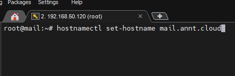
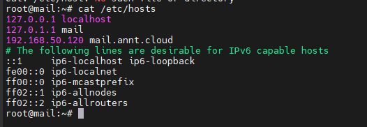
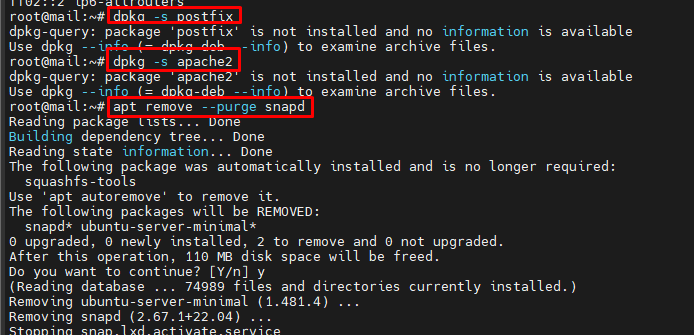
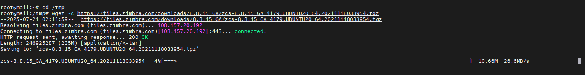

# Zimbra 8.8.15 - Ubuntu 20.04 
- Cài đặt Zimbra Collaboration Suite 8.8.15 trên Ubuntu 20.04 LTS
-----

## Hướng dẫn cài đặt Zimbra Collaboration Suite 8.8.15 trên Ubuntu 20.04 LTS
- Hướng dẫn về cách triển khai Zimbra Collaboration Suite (ZCS) phiên bản 8.8.15 trên một máy ảo VMware cục bộ chạy Ubuntu 20.04 LTS. 
- Địa chỉ IP cục bộ được sử dụng trong hướng dẫn này là `192.168.50.120`.

### Yêu cầu hệ thống

  * **Hệ điều hành:** Ubuntu 20.04 LTS (64-bit)
  * **RAM tối thiểu:** 8GB (khuyến nghị 16GB cho môi trường sản xuất)
  * **CPU:** 2 lõi (khuyến nghị 4 lõi trở lên)
  * **Dung lượng đĩa trống:** Tối thiểu 50GB (khuyến nghị 100GB trở lên)

-----

### Bước 1: Cấu hình Hostname và Hosts File

Trước khi cài đặt bất kỳ phần mềm nào, điều quan trọng là phải cấu hình chính xác hostname và file `/etc/hosts` để đảm bảo hệ thống nhận diện đúng tên miền và địa chỉ IP.

1.  **Đặt Hostname:**
    Sử dụng lệnh `hostnamectl` để đặt hostname cho hệ thống. Hãy thay thế `mail.your-domain.com` bằng **hostname đầy đủ của máy chủ Zimbra của bạn** (ví dụ: `mail.example.com`).

    ```bash
    hostnamectl set-hostname mail.your-domain.com
    ```

    Để xác minh hostname đã được đặt chính xác, bạn có thể kiểm tra nội dung của file `/etc/hostname`:

    ```bash
    cat /etc/hostname
    ```

    Kết quả mong đợi sẽ là `mail.your-domain.com`.
- 
2.  **Chỉnh sửa Hosts File:**
    Mở file `/etc/hosts` bằng trình soạn thảo `nano`:

    ```bash
    sudo nano /etc/hosts
    ```

    Thêm dòng sau vào cuối file, thay thế `192.168.50.120` bằng **địa chỉ IP cục bộ của máy ảo của bạn**, và `mail.your-domain.com`, `mail` bằng **hostname đầy đủ và shortname của bạn**.

    ```
    192.168.50.120    mail.your-domain.com     mail
    ```

    Lưu file bằng cách nhấn `Ctrl+O`, sau đó nhấn `Enter`, và thoát `nano` bằng cách nhấn `Ctrl+X`.
- 

-----

### Bước 2: Cập nhật hệ thống và gỡ bỏ phần mềm xung đột

Đảm bảo hệ thống của bạn được cập nhật và không có các phần mềm có thể xung đột với Zimbra.

1.  **Cập nhật gói hệ thống:**
    Cập nhật danh sách gói và nâng cấp tất cả các gói đã cài đặt lên phiên bản mới nhất:

    ```bash
    sudo apt update && sudo apt upgrade -y
    ```

2.  **Kiểm tra và gỡ bỏ Postfix, Apache2 (nếu có):**
    Zimbra bao gồm máy chủ mail và web server riêng. Do đó, bạn cần đảm bảo không có Postfix hoặc Apache2 đang chạy trên hệ thống để tránh xung đột cổng.

    Kiểm tra sự tồn tại của Postfix:

    ```bash
    dpkg -s postfix
    ```

    Kiểm tra sự tồn tại của Apache2:

    ```bash
    dpkg -s apache2
    ```

    Nếu bất kỳ gói nào trong số này được báo cáo là đã cài đặt, bạn nên gỡ bỏ chúng:

    ```bash
    sudo apt remove --purge postfix -y
    sudo apt remove --purge apache2 -y
    ```

3.  **Gỡ bỏ Snapd:**
    Trên Ubuntu 20.04 LTS, `snapd` thường được cài đặt mặc định và có thể tạo ra các thiết bị loop, dẫn đến các thông báo không cần thiết về việc sử dụng không gian đĩa từ Zimbra. Bạn nên gỡ bỏ nó.

    ```bash
    sudo apt remove --purge snapd -y
    ```
- 

-----

### Bước 3: Cấu hình DNS Server (Dnsmasq)

Zimbra yêu cầu một DNS server hoạt động để phân giải tên miền. Trong môi trường máy ảo cục bộ, bạn có thể cài đặt và cấu hình `dnsmasq` làm DNS server cục bộ đơn giản.

1.  **Vô hiệu hóa và dừng `systemd-resolved`:**
    `systemd-resolved` sử dụng cổng 53, cổng mà `dnsmasq` sẽ cần. Vô hiệu hóa và dừng nó trước khi cài đặt `dnsmasq`.

    ```bash
    sudo systemctl disable systemd-resolved
    sudo systemctl stop systemd-resolved
    ```

2.  **Gỡ bỏ symlink `/etc/resolv.conf`:**
    `/etc/resolv.conf` thường là một symlink đến một file do `systemd-resolved` quản lý. Bạn cần xóa symlink này để tạo một file `resolv.conf` mới thủ công.

    ```bash
    sudo rm /etc/resolv.conf
    ```

3.  **Tạo file `resolv.conf` mới:**
    Tạo file `/etc/resolv.conf` và thêm các máy chủ DNS mong muốn. Địa chỉ `127.0.0.1` sẽ trỏ đến `dnsmasq` cục bộ của bạn, và `8.8.8.8` (Google Public DNS) sẽ được sử dụng làm máy chủ dự phòng.

    ```bash
    sudo sh -c 'echo nameserver 127.0.0.1 >> /etc/resolv.conf'
    sudo sh -c 'echo nameserver 8.8.8.8 >> /etc/resolv.conf'
    ```

4.  **Cài đặt `dnsmasq`:**

    ```bash
    sudo apt install dnsmasq -y
    ```

5.  **Cấu hình `dnsmasq`:**
    Mở file cấu hình `dnsmasq`:

    ```bash
    sudo vi /etc/dnsmasq.conf
    ```

    Thêm các dòng sau vào cuối file. Thay thế `192.168.50.120` bằng **địa chỉ IP của máy ảo của bạn** và `your-domain.com` bằng **tên miền bạn muốn sử dụng cho Zimbra** (ví dụ: `example.com`).

    ```
    server=192.168.50.120
    domain=your-domain.com
    mx-host=your-domain.com, mail.your-domain.com, 5
    mx-host=mail.your-domain.com, mail.your-domain.com, 5
    listen-address=127.0.0.1
    ```

      * `server=192.168.50.120`: Chỉ định máy chủ DNS ngược dòng cho `dnsmasq` là chính nó (để giải quyết các truy vấn cho tên miền cục bộ).
      * `domain=your-domain.com`: Đặt tên miền cục bộ mà `dnsmasq` sẽ phục vụ.
      * `mx-host=your-domain.com, mail.your-domain.com, 5`: Định cấu hình bản ghi MX (Mail Exchanger) cho tên miền của bạn, chỉ ra rằng `mail.your-domain.com` là máy chủ mail với độ ưu tiên 5.
      * `listen-address=127.0.0.1`: Đảm bảo `dnsmasq` chỉ lắng nghe trên giao diện loopback.

    Lưu và thoát file.

6.  **Khởi động lại `dnsmasq`:**

    ```bash
    sudo systemctl restart dnsmasq
    ```

    Kiểm tra trạng thái của `dnsmasq` để đảm bảo nó đang chạy:

    ```bash
    sudo systemctl status dnsmasq
    ```

    Đảm bảo output hiển thị `active (running)`.

-----

### Bước 4: Cài đặt Zimbra 8.8.15

Bây giờ bạn đã sẵn sàng tải xuống và cài đặt Zimbra Collaboration Suite.

1.  **Chuyển đến thư mục `/tmp`:**
    Đây là một thư mục tốt để tải xuống các file tạm thời.

    ```bash
    cd /tmp
    ```

2.  **Tải xuống gói Zimbra 8.8.15:**
    Sử dụng lệnh `wget` để tải xuống gói Zimbra 8.8.15 cho Ubuntu 20.04.

    ```bash
    wget -c https://files.zimbra.com/downloads/8.8.15_GA/zcs-8.8.15_GA_4179.UBUNTU20_64.20211118033954.tgz
    ```

- 

3.  **Giải nén gói Zimbra:**
    Sau khi tải xuống, giải nén file `.tgz` đã tải xuống.

    ```bash
    tar -xzvf zcs-8.8.15_GA_4179.UBUNTU20_64.20211118033954.tgz
    ```

4.  **Chuyển vào thư mục cài đặt Zimbra:**

    ```bash
    cd zcs-8.8.15_GA_4179.UBUNTU20_64.20211118033954
    ```

5.  **Chạy script cài đặt:**
    Bắt đầu quá trình cài đặt Zimbra bằng cách chạy script `install.sh`.

    ```bash
    sudo ./install.sh
    ```

    Trình cài đặt sẽ dẫn bạn qua một loạt các lời nhắc. Dưới đây là các điểm chính cần lưu ý:

      * **Agreement:** Nhấn `Y` để chấp nhận Thỏa thuận Giấy phép.
      * **Packages to install:** Trình cài đặt sẽ hiển thị danh sách các gói Zimbra có sẵn.
          * Khi được hỏi **Install zimbra-dnscache? [Y]**, bạn **phải nhập `N` và nhấn Enter**.
          * Khi được hỏi **Install zimbra-imapd (BETA - for evaluation only)? [Y]**, bạn \*\*phải nhập `N` và nhấn Enter\`.
          * Đối với các gói khác, bạn có thể chấp nhận mặc định bằng cách nhấn `Enter`.
      * **System will be modified:** Nhấn `Y` để xác nhận việc cài đặt.
      * **Enter the domain name for this host:** Nhập **tên miền của bạn** (ví dụ: `your-domain.com`).
      * **Zimbra Admin Password:** Bạn sẽ được nhắc đặt mật khẩu cho tài khoản quản trị Zimbra. Hãy đặt một mật khẩu mạnh và ghi nhớ nó.
      * **Modify system? [Yes]**: Nhấn `Yes` để tiến hành cài đặt.

    Quá trình cài đặt sẽ mất một khoảng thời gian. Sau khi hoàn tất, bạn sẽ được hỏi liệu bạn có muốn thông báo cho Zimbra về việc cài đặt này hay không. Bạn có thể chọn `Yes` hoặc `No`.
```
Select the packages to install
Install zimbra-ldap [Y] y
Install zimbra-logger [Y] y
Install zimbra-mta [Y] y
Install zimbra-dnscache [Y] n
Install zimbra-snmp [Y] y
Install zimbra-store [Y] y
Install zimbra-apache [Y] y
Install zimbra-spell [Y] y
Install zimbra-memcached [Y] y
Install zimbra-proxy [Y] y
Install zimbra-drive [Y] y
Install zimbra-imapd (BETA - for evaluation only) [N] n
Install zimbra-chat [Y] y
Checking required space for zimbra-core
Checking space for zimbra-store
Checking required packages for zimbra-store
zimbra-store package check complete.


```
-----

### Bước 5: Kiểm tra trạng thái Zimbra

Sau khi cài đặt hoàn tất, bạn có thể kiểm tra trạng thái của các dịch vụ Zimbra để đảm bảo mọi thứ đang chạy bình thường.
```
Finished installing common zimlets.
Restarting mailboxd...done.
Creating galsync account for default domain...done.

You have the option of notifying Zimbra of your installation.
This helps us to track the uptake of the Zimbra Collaboration Server.
The only information that will be transmitted is:
        The VERSION of zcs installed (8.8.15_GA_4179_UBUNTU20_64)
        The ADMIN EMAIL ADDRESS created (admin@mail.annt.cloud)

Notify Zimbra of your installation? [Yes] yes
Notifying Zimbra of installation via http://www.zimbra.com/cgi-bin/notify.cgi?VER=8.8.15_GA_4179_UBUNTU20_64&MAIL=admin@mail.annt.cloud

ERROR: Notification failed
Checking if the NG started running...done.
Setting up zimbra crontab...done.


Moving /tmp/zmsetup.20250721-030248.log to /opt/zimbra/log


Configuration complete - press return to exit
```
1.  **Chuyển sang người dùng `zimbra`:**
    Các lệnh quản lý Zimbra được thực thi dưới người dùng `zimbra`.

    ```bash
    su - zimbra
    ```

2.  **Kiểm tra trạng thái dịch vụ Zimbra:**

    ```bash
    zmcontrol status
    ```

    Output sẽ hiển thị trạng thái của tất cả các dịch vụ Zimbra. Đảm bảo rằng tất cả các dịch vụ được liệt kê là `Running`.

-----

### Bước 6: Truy cập giao diện quản trị Zimbra

Bây giờ Zimbra đã được cài đặt và chạy, bạn có thể truy cập giao diện quản trị web để quản lý máy chủ mail của mình.

Mở trình duyệt web và điều hướng đến địa chỉ sau:

  * **Giao diện quản trị Zimbra:** `https://mail.your-domain.com:7071`
  * **Webmail Zimbra (cho người dùng):** `https://mail.your-domain.com`

**Lưu ý:** Thay thế `your-domain.com` bằng **tên miền thực tế mà bạn đã cấu hình** trong các bước trước.

Sử dụng tên người dùng `admin` và mật khẩu bạn đã đặt trong quá trình cài đặt để đăng nhập vào giao diện quản trị.

-----

Chúc mừng\! Bạn đã cài đặt thành công Zimbra Collaboration Suite 8.8.15 trên Ubuntu 20.04 LTS. 

