<!-- TOC --><a name="web-server"></a>
# Web Server 
*** 
<!-- TOC start -->

- [Web Server](#web-server)
   * [1 Khái niệm cơ bản về Web Server](#1-khái-nim-c-bn-v-web-server)
      + [1.1  Định nghĩa Web Server ](#11-nh-ngha-web-server)
      + [1.2  Vai trò của Web Server trong mô hình client-server.](#12-vai-trò-ca-web-server-trong-mô-hình-client-server)
      + [1.3  Cách thức hoạt động (nhận request, xử lý, trả response).](#13-cách-thc-hot-ng-nhn-request-x-lý-tr-response)
   * [2. Các loại Web Server phổ biến](#2-các-loi-web-server-ph-bin)
      + [2.1 Apache HTTP Server (đặc điểm, ưu nhược điểm).](#21-apache-http-server-c-im-u-nhc-im)
      + [2.2 Nginx (kiến trúc event-driven, hiệu suất cao).](#22-nginx-kin-trúc-event-driven-hiu-sut-cao)
      + [2.3 Microsoft IIS (dành cho Windows Server).](#23-microsoft-iis-dành-cho-windows-server)
      + [2.4 Lighttpd, Caddy, LiteSpeed (các lựa chọn khác).](#24-lighttpd-caddy-litespeed-các-la-chn-khác)
         - [2.4.1 Lighttpd](#241-lighttpd)
         - [2.4.2 Caddy ](#242-caddy)
         - [2.4.3 LiteSpeed](#243-litespeed)
      + [2.5 So sánh mã nguồn mở và thương mại](#25-so-sánh-mã-ngun-m-và-thng-mi)
   * [3. Giao thức và Công nghệ liên quan](#3-giao-thc-và-công-ngh-liên-quan)
      + [3.1 Giao thức ](#31-giao-thc)
         - [3.1.1 HTTP/HTTPS (cơ chế request/response, status codes).](#311-httphttps-c-ch-requestresponse-status-codes)
         - [3.1.2 SSL/TLS (bảo mật, chứng chỉ số).](#312-ssltls-bo-mt-chng-ch-s)
         - [3.1.3 WebSocket, HTTP/2, QUIC (giao thức hiện đại).](#313-websocket-http2-quic-giao-thc-hin-i)
         - [3.1.4 CGI, FastCGI, WSGI (giao tiếp giữa server và ứng dụng).](#314-cgi-fastcgi-wsgi-giao-tip-gia-server-và-ng-dng)
      + [3.2 Các công nghệ liên quan ](#32-các-công-ngh-liên-quan)
         - [3.2.1 Các mô hình xử lý yêu cầu: ](#321-các-mô-hình-x-lý-yêu-cu)
         - [3.2.2 Module/Plugin](#322-moduleplugin)
   * [4. Cấu hình và Triển khai Web Server](#4-cu-hình-và-trin-khai-web-server)
      + [4.1  Cấu hình virtual host (host nhiều website trên một server).](#41-cu-hình-virtual-host-host-nhiu-website-trên-mt-server)
      + [4.2   Thiết lập reverse proxy, load balancing (ví dụ: Nginx làm proxy cho Apache).](#42-thit-lp-reverse-proxy-load-balancing-ví-d-nginx-làm-proxy-cho-apache)
         - [4.2.1. Reverse proxy](#421-reverse-proxy)
         - [4.2.2. Load balancing](#422-load-balancing)
      + [4.3   Cấu hình caching (giảm tải server).](#43-cu-hình-caching-gim-ti-server)
      + [4.4   Tối ưu tốc độ (nén dữ liệu, CDN, HTTP/2).](#44-ti-u-tc-nén-d-liu-cdn-http2)
         - [4.4.1. Nén dữ liệu ](#441-nén-d-liu)
         - [4.4.2 CDN](#442-cdn)
         - [4.4.3 HTTP/2 ](#443-http2)
      + [4.5 Tuning thông số: Max connections, keep-alive, worker processes.](#45-tuning-thông-s-max-connections-keep-alive-worker-processes)
         - [4.5.1 Max Connections](#451-max-connections)
         - [4.5.2  Keep-alive](#452-keep-alive)
         - [4.5.3  Worker processes](#453-worker-processes)
   * [5. Bảo mật Web Server](#5-bo-mt-web-server)
      + [5.1 Phòng chống DDoS, brute force.	](#51-phòng-chng-ddos-brute-force)
      + [5.2 Cấu hình firewall (iptables, Cloudflare).](#52-cu-hình-firewall-iptables-cloudflare)
         - [5.2.1 iptables ](#521-iptables)
         - [5.2.2 Cloudflare](#522-cloudflare)
      + [5.3 Hardening server (tắt dịch vụ không cần thiết, cập nhật bảo mật).](#53-hardening-server-tt-dch-v-không-cn-thit-cp-nht-bo-mt)
         - [5.3.1 Apache Hardening](#531-apache-hardening)
         - [5.3.2 Nginx Hardening](#532-nginx-hardening)
         - [5.3.3 IIS Hardening](#533-iis-hardening)
      + [5.4 Xử lý các lỗ hổng (SQL injection, XSS, CSRF).](#54-x-lý-các-l-hng-sql-injection-xss-csrf)
         - [5.4.1 SQL injection](#541-sql-injection)
         - [5.4.2 XSS](#542-xss)
         - [5.4.3 CSRF](#543-csrf)
   * [6. Hiệu suất và Monitoring](#6-hiu-sut-và-monitoring)
      + [6.1  Công cụ đo lường hiệu suất (Apache Benchmark, JMeter).](#61-công-c-o-lng-hiu-sut-apache-benchmark-jmeter)
         - [6.1.1 Apache Benchmark](#611-apache-benchmark)
         - [6.1.2 JMeter](#612-jmeter)
         - [6.1.3 So sánh ](#613-so-sánh)
      + [6.2   Giám sát log (access log, error log).](#62-giám-sát-log-access-log-error-log)
      + [6.3  Công cụ phân tích (Prometheus, Grafana, ELK Stack).](#63-công-c-phân-tích-prometheus-grafana-elk-stack)
         - [6.3.1 Prometheus](#631-prometheus)
         - [6.3.2 Grafana](#632-grafana)
         - [6.3.3 ELK Stack ](#633-elk-stack)
   * [7. So sánh Web Server vs Application Server](#7-so-sánh-web-server-vs-application-server)
   * [8. Xu hướng hiện đại](#8-xu-hng-hin-i)
      + [8.1  Serverless (AWS Lambda, Cloud Functions).](#81-serverless-aws-lambda-cloud-functions)
         - [8.1.1 Serverless ](#811-serverless)
         - [8.1.2 AWS Lambda](#812-aws-lambda)
         - [8.1.2 Cloud Functions ](#812-cloud-functions)
      + [8.2  Container hóa (Docker + Web Server).](#82-container-hóa-docker-web-server)
      + [8.3  Edge Computing (xử lý gần người dùng hơn).](#83-edge-computing-x-lý-gn-ngi-dùng-hn)
   * [9. Thực hành/Tutorials](#9-thc-hànhtutorials)
      + [9.1  Cài đặt Apache/Nginx trên Linux/Windows.](#91-cài-t-apachenginx-trên-linuxwindows)
      + [9.2  Host một website đơn giản (HTML, PHP).](#92-host-mt-website-n-gin-html-php)
      + [9.3  Triển khai HTTPS với Let’s Encrypt.](#93-trin-khai-https-vi-lets-encrypt)
         - [9.3.1 Apache](#931-apache)
         - [9.3.1 Nginx ](#931-nginx)
      + [9.5  Cấu hình nginx làm reverse proxy cho apache ](#95-cu-hình-nginx-làm-reverse-proxy-cho-apache)
      + [9.6  Cấu hình nginx load balancing cho apache ](#96-cu-hình-nginx-load-balancing-cho-apache)
   * [10. Các vấn đề thường gặp](#10-các-vn-thng-gp)
      + [10.1  Lỗi 403, 404, 500 và cách khắc phục.](#101-li-403-404-500-và-cách-khc-phc)
         - [10.1.1 403 Error ](#1011-403-error)
         - [10.1.2 404 Error ](#1012-404-error)
         - [10.1.3 500 Error ](#1013-500-error)
      + [10.2  Tối ưu database kết hợp web server.](#102-ti-u-database-kt-hp-web-server)
      + [10.3  Xử lý tải cao (scaling theo chiều ngang/dọc).](#103-x-lý-ti-cao-scaling-theo-chiu-ngangdc)
         - [10.3.1 Horizontal Scaling ](#1031-horizontal-scaling)
         - [10.3.2 Vertical Scaling ](#1032-vertical-scaling)
         - [10.3.3 Diagonal Scaling ](#1033-diagonal-scaling)
         - [10.3.4 So sánh và usecase ](#1034-so-sánh-và-usecase)
   * [11 Công cụ hỗ trợ](#11-công-c-h-tr)
      + [11.1 Công cụ quản lý web server: ](#111-công-c-qun-lý-web-server)
         - [11.1.1 cPanel ](#1111-cpanel)
         - [11.1.2 DirectAdmin ](#1112-directadmin)
         - [11.1.3 Plesk ](#1113-plesk)
         - [11.1.3 Một số panel miễn phí](#1113-mt-s-panel-min-phí)
      + [11.2 Công cụ kiểm tra hiệu suất: ](#112-công-c-kim-tra-hiu-sut)
         - [11.2.1  ApacheBench (ab), JMeter](#1121-apachebench-ab-jmeter)
         - [11.2.2.Siege ](#1122siege)
      + [11.3 Công cụ bảo mật: ](#113-công-c-bo-mt)
         - [11.3.1 Nmap, OpenVAS để quét lỗ hổng.](#1131-nmap-openvas-quét-l-hng)
         - [11.3.2  ModSecurity cho tường lửa ứng dụng web.](#1132-modsecurity-cho-tng-la-ng-dng-web)
   * [References](#references)

<!-- TOC end -->

<!-- TOC --><a name="1-khái-nim-c-bn-v-web-server"></a>
## 1 Khái niệm cơ bản về Web Server
<!-- TOC --><a name="11-nh-ngha-web-server"></a>
### 1.1  Định nghĩa Web Server 
- Web Server (Máy chủ web) là phần mềm và phần cứng sử dụng HTTP và các giao thức khác để phản hồi các yêu cầu của khách hàng được thực hiện qua World Wide Web.
- Nhiệm vụ chính của nó là hiển thị nội dung trang web, chẳng hạn như văn bản, hình ảnh, video và ứng dụng, cho người dùng bằng cách lưu trữ, xử lý và phân phối các trang web.
- Máy chủ web cũng được sử dụng trong lưu trữ web, tức là lưu trữ dữ liệu cho các trang web và ứng dụng dựa trên web.
- Máy chủ web động so với máy chủ web tĩnh: Máy chủ web có thể được sử dụng để phục vụ nội dung tĩnh hoặc động. 
	* Tĩnh đề cập đến nội dung được hiển thị nguyên trạng, trong khi nội dung động có thể được cập nhật và thay đổi. Máy chủ web tĩnh bao gồm máy tính và phần mềm HTTP. Nó được coi là tĩnh vì máy chủ gửi các tệp được lưu trữ đã viết sẵn nguyên trạng đến trình duyệt. Ngoài ra, mọi người dùng đều thấy cùng một nội dung vì máy chủ chỉ phân phối các tệp đã lưu trữ. Không có xử lý phía máy chủ, tương tác cơ sở dữ liệu hoặc tạo nội dung động, dành riêng cho người dùng theo thời gian thực.
	* Trình duyệt web động bao gồm máy chủ web và phần mềm khác, chẳng hạn như máy chủ ứng dụng và cơ sở dữ liệu. Nó được coi là động vì máy chủ ứng dụng có thể được sử dụng để cập nhật bất kỳ tệp được lưu trữ nào trước khi chúng được gửi đến trình duyệt. Máy chủ web có thể tạo nội dung bằng cách yêu cầu nội dung đó theo thời gian thực từ cơ sở dữ liệu cơ bản. Ngoài ra, nội dung này được phân phối dựa trên thông tin đầu vào cụ thể của người dùng hoặc các biến khác.
	* Điều này giúp có thể phân phối các tính năng tương tác trên trang web, chẳng hạn như biểu mẫu đăng nhập và giỏ hàng. Các tính năng này được tạo động và tức thời, có thể nâng cao trải nghiệm của người dùng. Tuy nhiên, tính linh hoạt tăng lên của quy trình này cũng làm cho việc thiết kế và triển khai trở nên phức tạp hơn.
<!-- TOC --><a name="12-vai-trò-ca-web-server-trong-mô-hình-client-server"></a>
### 1.2  Vai trò của Web Server trong mô hình client-server.
- Web server đóng vai trò là một máy chủ (server) chuyên biệt trong mô hình client-server, chịu trách nhiệm chính trong việc:
	* Lưu trữ các tệp tin của website: Web server là nơi lưu trữ tất cả các thành phần tạo nên một trang web, bao gồm các tệp HTML, CSS, JavaScript, hình ảnh, video và các tài liệu khác.
	* Tiếp nhận yêu cầu từ client (trình duyệt web): Khi người dùng truy cập một trang web thông qua trình duyệt (client), trình duyệt sẽ gửi một yêu cầu (request) đến web server chứa trang web đó. Yêu cầu này thường là một yêu cầu HTTP (Hypertext Transfer Protocol).
	* Xử lý yêu cầu: Web server nhận yêu cầu và xử lý nó. Quá trình xử lý có thể bao gồm việc tìm kiếm tệp tin được yêu cầu, xử lý các đoạn mã phía máy chủ (server-side scripting) nếu có, và chuẩn bị dữ liệu để gửi trả lại cho client.
	* Gửi phản hồi (response) đến client: Sau khi xử lý yêu cầu, web server gửi một phản hồi (response) trở lại trình duyệt. Phản hồi này thường bao gồm các tệp tin của trang web (ví dụ: mã HTML) và các thông tin khác để trình duyệt có thể hiển thị trang web cho người dùng. Giao thức HTTP được sử dụng cho việc giao tiếp này.
	* Đảm bảo khả năng truy cập: Web server hoạt động liên tục và được kết nối với mạng internet để đảm bảo rằng người dùng có thể truy cập vào các trang web mà nó lưu trữ bất kỳ lúc nào.
	* Quản lý kết nối đồng thời: Một web server mạnh mẽ có khả năng xử lý đồng thời nhiều yêu cầu từ nhiều client khác nhau một cách hiệu quả.
	* Cung cấp các dịch vụ khác: Ngoài việc phục vụ các tệp tĩnh, web server hiện đại còn có thể tích hợp với các application server và cơ sở dữ liệu để cung cấp các trang web và ứng dụng web động, phức tạp hơn.
<!-- TOC --><a name="13-cách-thc-hot-ng-nhn-request-x-lý-tr-response"></a>
### 1.3  Cách thức hoạt động (nhận request, xử lý, trả response).
- Cách thức hoạt động của web server (trong việc nhận request, xử lý và trả response) có thể được mô tả theo các bước sau:
1. Nhận Request (Receiving the Request):
	* Người dùng nhập URL: Quá trình bắt đầu khi người dùng nhập một địa chỉ web (URL - Uniform Resource Locator) vào thanh địa chỉ của trình duyệt web (client) hoặc nhấp vào một liên kết.
	* Trình duyệt phân tích URL: Trình duyệt phân tích URL để xác định giao thức (ví dụ: HTTP, HTTPS), tên miền (ví dụ: www.example.org), và đường dẫn tài nguyên cụ thể (ví dụ: /what-is-a-web-server-working-and-architecture/).
	* Trình duyệt tìm kiếm địa chỉ IP: Trình duyệt sử dụng Hệ thống Tên miền (DNS - Domain Name System) để dịch tên miền thành địa chỉ IP tương ứng của web server.
	* Trình duyệt thiết lập kết nối TCP/IP: Sau khi có địa chỉ IP, trình duyệt thiết lập một kết nối TCP/IP (Transmission Control Protocol/Internet Protocol) với web server trên cổng mặc định cho HTTP (thường là cổng 80) hoặc HTTPS (thường là cổng 443).
	* Trình duyệt gửi HTTP Request: Khi kết nối được thiết lập, trình duyệt gửi một yêu cầu HTTP (HTTP request) đến web server. Yêu cầu này bao gồm:
	* Phương thức HTTP: Xác định hành động mà client muốn thực hiện (ví dụ: GET để lấy dữ liệu, POST để gửi dữ liệu, PUT để cập nhật dữ liệu, DELETE để xóa dữ liệu).
	* Đường dẫn tài nguyên: Xác định tài nguyên cụ thể mà client yêu cầu (ví dụ: /index.html, /images/logo.png).
	* Phiên bản HTTP: Xác định phiên bản giao thức HTTP đang được sử dụng (ví dụ: HTTP/1.1, HTTP/2).
	* Tiêu đề (Headers): Cung cấp thông tin bổ sung về yêu cầu, chẳng hạn như loại trình duyệt, ngôn ngữ ưu tiên, cookie, v.v.
2. Xử lý Request (Processing the Request):
	* Web server nhận yêu cầu: Web server lắng nghe các yêu cầu đến trên các cổng được chỉ định. Khi nhận được một yêu cầu HTTP từ client, nó sẽ bắt đầu quá trình xử lý.
	* Web server phân tích yêu cầu: Web server phân tích yêu cầu HTTP để xác định tài nguyên được yêu cầu, phương thức HTTP và các tiêu đề khác.
	* Web server tìm kiếm tài nguyên: Web server tìm kiếm tài nguyên được yêu cầu trong hệ thống tệp tin của nó.
	* Xử lý phía máy chủ (nếu cần): Nếu yêu cầu liên quan đến một tài nguyên động (ví dụ: một trang PHP, Python, Node.js), web server có thể chuyển yêu cầu này đến một application server hoặc một trình thông dịch (interpreter) tương ứng để xử lý logic nghiệp vụ, truy vấn cơ sở dữ liệu, v.v. Application server sau đó sẽ tạo ra nội dung động.
	* Tạo HTTP Response: Sau khi tìm thấy tài nguyên (hoặc sau khi application server xử lý và trả về dữ liệu), web server tạo ra một phản hồi HTTP (HTTP response). Phản hồi này bao gồm:
	* Phiên bản HTTP: Phiên bản giao thức HTTP được sử dụng.
	* Mã trạng thái (Status Code): Một mã số ba chữ số cho biết kết quả của yêu cầu (ví dụ: 200 OK cho thành công, 404 Not Found cho không tìm thấy, 500 Internal Server Error cho lỗi máy chủ).
	* Thông báo trạng thái (Status Message): Một mô tả ngắn gọn về mã trạng thái (ví dụ: OK, Not Found, Internal Server Error).
	* Tiêu đề (Headers): Cung cấp thông tin bổ sung về phản hồi, chẳng hạn như loại nội dung (Content-Type), độ dài nội dung (Content-Length), thông tin về máy chủ, cookie, v.v.
	* Phần thân (Body): Chứa nội dung thực tế của tài nguyên được yêu cầu (ví dụ: mã HTML của trang web, hình ảnh, dữ liệu JSON). Đối với các yêu cầu thành công (ví dụ: GET), phần thân sẽ chứa dữ liệu được yêu cầu. Đối với một số phản hồi lỗi, phần thân có thể chứa thông báo lỗi.
3. Trả Response (Sending the Response):
	* Web server gửi HTTP Response: Web server gửi phản hồi HTTP trở lại trình duyệt (client) thông qua kết nối TCP/IP đã thiết lập.
	* Trình duyệt nhận Response: Trình duyệt nhận phản hồi HTTP từ web server.
	* Trình duyệt xử lý Response: Trình duyệt phân tích phản hồi, bao gồm mã trạng thái, tiêu đề và phần thân.
	* Trình duyệt hiển thị nội dung: Dựa trên nội dung trong phần thân (thường là mã HTML), trình duyệt sẽ hiển thị trang web cho người dùng. Nếu phản hồi bao gồm các tài nguyên khác (ví dụ: CSS, JavaScript, hình ảnh), trình duyệt sẽ gửi các yêu cầu riêng biệt cho các tài nguyên này và hiển thị trang web hoàn chỉnh.
	* Kết nối đóng (thường): Sau khi gửi và nhận hoàn tất phản hồi (đối với HTTP/1.1 trở về trước), kết nối TCP/IP thường sẽ bị đóng. HTTP/2 và các phiên bản mới hơn có thể duy trì kết nối để xử lý nhiều yêu cầu và phản hồi hiệu quả hơn.
<!-- TOC --><a name="2-các-loi-web-server-ph-bin"></a>
## 2. Các loại Web Server phổ biến
<!-- TOC --><a name="21-apache-http-server-c-im-u-nhc-im"></a>
### 2.1 Apache HTTP Server (đặc điểm, ưu nhược điểm).
- Apache HTTP Server là một máy chủ web mã nguồn mở và miễn phí được viết bởi Apache Software Foundation (ASF). Đây là một trong những máy chủ web được sử dụng rộng rãi nhất, phục vụ hàng triệu trang web trên nhiều nền tảng khác nhau như Linux, Windows và macOS, và là một phần không thể thiếu của ngăn xếp LAMP (Linux, Apache, MySQL, PHP), thường được sử dụng để lưu trữ và phát triển web.
- Apache sử dụng mô hình máy khách-máy chủ để xử lý các yêu cầu HTTP và HTTPS khi người dùng nhập địa chỉ trang web:
	* Người dùng nhập địa chỉ trang web vào trình duyệt web của họ.
	* Trình duyệt thực hiện yêu cầu HTTP đến máy chủ web.
	* Apache thực hiện yêu cầu và tìm nạp tài liệu được yêu cầu (HTML, CSS, hình ảnh, v.v.).
	* Apache trả về phản hồi cho trình duyệt web của người dùng.
	* Trình duyệt hiển thị trang web.
- Apache lắng nghe HTTP trên cổng 80 và HTTPS trên cổng 443.
- Các tính năng của máy chủ web Apache: Máy chủ web Apache cung cấp một số tính năng khiến nó trở thành lựa chọn tuyệt vời cho dịch vụ lưu trữ web và quản lý máy chủ.
	* Xử lý các tệp tĩnh
	* Các mô-đun động có thể tải
	* Lập chỉ mục tự động
	* .htaccess
	* Khả năng tương thích IPv6
	* Hỗ trợ hỗ trợ HTTP/2
	* Kết nối FTP
	* Nén và giải nén Gzip
	* Load Balancing 
	* Hỗ trợ các ngôn ngữ tập lệnh Perl, PHP, Lua
	* Bandwidth throttling
	* Theo dõi phiên
	* Rewrite URL
	* Định vị địa lý dựa trên địa chỉ IP
- Ưu điểm 
    * Miễn phí và mã nguồn mở: Apache là phần mềm mã nguồn mở
    * Phổ biến và ổn định: Web server này được sử dụng rộng rãi trên toàn thế giới và đã tồn tại trong nhiều năm.
    * Đa nền tảng: Apache có thể chạy trên nhiều hệ điều hành, bao gồm Linux, Windows, macOS và nhiều hệ điều hành khác.
    * Mở rộng và linh hoạt: Web server này hỗ trợ nhiều module mà bạn có thể bật hoặc tắt để tùy chỉnh chức năng của máy chủ web.
    * Bảo mật: Apache cung cấp nhiều tùy chọn bảo mật và có cộng đồng đông đảo hỗ trợ cho việc cập nhật bảo mật và vá lỗi một cách nhanh chóng.
    * Hỗ trợ cho nhiều ngôn ngữ lập trình: Web server này hỗ trợ nhiều ngôn ngữ lập trình, bao gồm PHP, Python, Ruby và nhiều ngôn ngữ khác, giúp bạn xây dựng ứng dụng web đa dạng.
    * Cộng đồng lớn: Apache có một cộng đồng người dùng và phát triển lớn. Điều này có nghĩa là bạn có thể tìm thấy nhiều tài liệu hướng dẫn, tài liệu tham khảo và hỗ trợ từ cộng đồng khi gặp vấn đề.
- Nhược điểm 
	* Tiêu tốn nhiều tài nguyên: Web server này có thể tiêu tốn nhiều tài nguyên hệ thống, đặc biệt là khi phải xử lý đồng thời nhiều yêu cầu. Điều này có thể dẫn đến tình trạng sử dụng bộ nhớ và CPU cao, đặc biệt trong các trường hợp tải đột ngột.
	* Khả năng mở rộng hạn chế: Web server này không luôn hoạt động tốt khi phải xử lý hàng ngàn yêu cầu đồng thời. Trong các trường hợp cần mở rộng quy mô, cấu hình và tinh chỉnh cần được thực hiện kỹ lưỡng.
	* Không hỗ trợ HTTP/2 mặc định: Trong phiên bản cơ bản, Web server này không hỗ trợ giao thức HTTP/2 mà thay vào đó sử dụng HTTP/1.1. Mặc dù bạn có thể cấu hình để sử dụng HTTP/2, nhưng điều này đòi hỏi thêm công việc cài đặt và cấu hình.
	* Cấu hình phức tạp: Cấu hình Apache có thể phức tạp, đặc biệt đối với người mới bắt đầu. Việc cài đặt và tinh chỉnh máy chủ Apache có thể đòi hỏi kiến thức kỹ thuật sâu và thời gian.
	* Sự cố và lỗi phát triển chậm: Một số lỗi và vấn đề bảo mật có thể phát triển và được vá chậm hơn so với các máy chủ web khác. Điều này đòi hỏi cẩn trọng khi cập nhật và duyệt các bản vá bảo mật.
	* Hiệu năng bị ảnh hưởng bởi mô-đun thứ ba: Web server này sử dụng nhiều mô-đun bên ngoài để cung cấp các tính năng bổ sung. Sự kết hợp của nhiều mô-đun này có thể ảnh hưởng đến hiệu năng và tính ổn định của máy chủ.
	* Yêu cầu kiến thức kỹ thuật: Để cấu hình và quản lý máy chủ Apache hiệu quả, bạn cần có kiến thức kỹ thuật về nền tảng hệ điều hành và mạng, cũng như về cấu hình máy chủ web.
<!-- TOC --><a name="22-nginx-kin-trúc-event-driven-hiu-sut-cao"></a>
### 2.2 Nginx (kiến trúc event-driven, hiệu suất cao).
- nginx ("engine x") là một máy chủ web HTTP, proxy đảo ngược, bộ đệm nội dung, bộ cân bằng tải, máy chủ proxy TCP/UDP và máy chủ proxy thư điện tử. 
- Được viết ban đầu bởi Igor Sysoev và phân phối theo giấy phép BSD 2 điều khoản.
- Nổi tiếng về tính linh hoạt và hiệu suất cao với mức sử dụng tài nguyên thấp, nginx là:
	* Máy chủ web phổ biến nhất trên thế giới
	* Một trong những image Docker phổ biến nhất
	* Là nền tảng cung cấp sức mạnh cho nhiều Ingress Controller cho Kubernetes.
- NGINX dẫn đầu về hiệu suất web và tất cả là nhờ cách phần mềm được thiết kế. Trong khi nhiều máy chủ web và máy chủ ứng dụng sử dụng kiến ​​trúc dựa trên luồng hoặc quy trình đơn giản, NGINX nổi bật với kiến ​​trúc điều khiển sự kiện tinh vi cho phép mở rộng quy mô lên hàng trăm nghìn kết nối đồng thời trên phần cứng hiện đại.
- Kiến trúc Nginx: 
* NGINX sử dụng một mô hình tiến trình có thể dự đoán và được điều chỉnh phù hợp với các tài nguyên phần cứng hiện có:
	* Master process - Hoạt động như bộ điều khiển trung tâm và chịu trách nhiệm khởi động, dừng và khởi chạy các Worker processes.
	* Worker processes - Các quy trình này chạy logic NGINX cốt lõi và chịu trách nhiệm xử lý kết nối, chuyển tiếp yêu cầu, cân bằng tải, v.v.
	* Cache loader - Quy trình này chịu trách nhiệm tải siêu dữ liệu được lưu trong bộ nhớ đệm vào bộ nhớ khi Nginx khởi động.
	* Cache manager - Định kỳ kiểm tra thư mục bộ đệm và giải phóng dung lượng bằng cách xóa các mục đã hết hạn.
	* Shared memory - Giao tiếp giữa các quy trình diễn ra thông qua bộ nhớ dùng chung. Nó cũng được sử dụng để lưu vào bộ đệm và quản lý trạng thái dùng chung như trạng thái cân bằng tải.
- 
- NGINX nổi bật với kiến ​​trúc event-driven cho phép mở rộng tới hàng trăm nghìn kết nối đồng thời trên phần cứng hiện đại.
- Worker Process tuân theo mô hình event-driven, sử dụng cơ chế như epoll (trên Linux) để xử lý nhiều kết nối đồng thời trên một luồng (thread) duy nhất.
	* A. Khởi tạo và chờ sự kiện
		* Khởi tạo: Sau khi được Master Process tạo ra, Worker Process đọc thông tin cấu hình từ tệp cấu hình Nginx và thiết lập vòng lặp sự kiện (event loop) để theo dõi các kết nối mới, các yêu cầu I/O, hoặc các tác vụ cần xử lý.
		* Chờ sự kiện: Worker Process đăng ký các sự kiện cần theo dõi (như kết nối mới, dữ liệu đến, hoặc ghi dữ liệu xong) với hệ thống thông qua cơ chế epoll.
	* B. Xử lý kết nối
		* Nhận sự kiện từ epoll: Khi có sự kiện (như một yêu cầu mới từ client), epoll thông báo cho Worker Process và Worker Process xử lý sự kiện đó ngay lập tức.
		* Không chặn kết nối: Worker Process không chặn khi chờ dữ liệu hoặc tài nguyên. Nếu dữ liệu chưa sẵn sàng (ví dụ: chưa đọc xong body yêu cầu), Worker Process tạm ngừng và tiếp tục xử lý các kết nối khác trong hàng đợi.
		* Xử lý song song: Dù mỗi Worker Process chỉ chạy một luồng nhưng nó có thể xử lý hàng nghìn kết nối đồng thời bằng cách xen kẽ giữa các sự kiện trong vòng lặp.
	* C. Xử lý yêu cầu
		* Phân tích yêu cầu: Phân tích cú pháp HTTP request (headers, method, URL, v.v.), kiểm tra tính hợp lệ và thực hiện các bước được chỉ định trong cấu hình.
		* Thực hiện nhiệm vụ: Phục vụ nội dung tĩnh, proxy request đến backend server, hoặc xử lý SSL/TLS.
	* D. Gửi phản hồi
		* Chuẩn bị phản hồi: Tạo HTTP response với status code, headers, và body.
		* Gửi phản hồi: Ghi dữ liệu qua socket hoặc gửi từng phần nếu dữ liệu lớn (chunked response).
	* E. Kết thúc hoặc giữ kết nối
		* Sau khi xử lý xong, Worker Process sẽ đóng kết nối nếu không có yêu cầu tiếp theo hoặc giữ kết nối mở nếu HTTP keep-alive được bật.
- Đặc điểm của Nginx
	* Kiến trúc tinh vi: Asynchronous, event-driven, xử lý hiệu quả nhiều kết nối đồng thời, phản hồi nhanh.
	* Phân phối nội dung tĩnh hiệu quả: Tốc độ cao, quản lý đồng thời nhiều kết nối, trải nghiệm người dùng nhanh hơn.
	* Sử dụng tài nguyên tối ưu: Tiêu thụ tài nguyên tối thiểu, lý tưởng cho lưu lượng truy cập cao.
	* Phân phối yêu cầu thông minh: Reverse proxy, tối ưu hóa thời gian phản hồi, cân bằng tải, chống quá tải máy chủ.
	* Hiệu suất và khả năng mở rộng vượt trội: Xử lý kết nối và yêu cầu độc đáo, phục vụ nhanh nội dung tĩnh, quản lý tốt lưu lượng truy cập tăng đột biến.- Ưu điểm của Nginx
- Ưu điểm:
	* Hiệu suất cao: Tốc độ vượt trội, phân phối nhanh nội dung tĩnh, cải thiện trải nghiệm người dùng và giảm thời gian tải trang.
	* Sử dụng tài nguyên thấp: Kiến trúc bất đồng bộ, xử lý nhiều kết nối với mức tiêu thụ bộ nhớ tối thiểu, lựa chọn kinh tế cho nhiều mô hình lưu trữ.
	* Khả năng mở rộng: Thích ứng linh hoạt với lưu lượng truy cập tăng, đảm bảo hiệu suất ổn định khi nhu cầu cao. 
	* Cân bằng tải: Phân phối hiệu quả yêu cầu đến giữa các máy chủ, chống quá tải và tối ưu hóa sử dụng tài nguyên, tạo môi trường web ổn định và phản hồi nhanh.
- Nhược điểm: Mặc dù NGINX có nhiều ưu điểm nổi bật, việc cân nhắc các nhược điểm tiềm ẩn cũng rất quan trọng:
	* Cấu hình phức tạp: Một số người dùng nhận thấy cấu hình của NGINX phức tạp hơn so với các máy chủ web khác. Việc cấu hình cho các yêu cầu cụ thể có thể gây khó khăn cho những người chưa quen với thiết lập của nó.
	* Hạn chế xử lý nội dung động gốc: Mặc dù vượt trội trong việc phục vụ nội dung tĩnh, NGINX có thể yêu cầu các cấu hình bổ sung để xử lý nội dung động tối ưu. Thiết lập bổ sung này có thể được coi là một nhược điểm đối với những người dùng tìm kiếm một giải pháp đơn giản hơn.
<!-- TOC --><a name="23-microsoft-iis-dành-cho-windows-server"></a>
### 2.3 Microsoft IIS (dành cho Windows Server).
- Internet Information Services, hay còn gọi là IIS, là một máy chủ web của Microsoft chạy trên hệ điều hành Windows và được sử dụng để trao đổi nội dung web tĩnh và động với người dùng internet. IIS có thể được dùng để lưu trữ, triển khai và quản lý các ứng dụng web sử dụng các công nghệ như ASP.NET và PHP.
- IIS sử dụng nhiều giao thức khác nhau để giao tiếp và trao đổi dữ liệu với các máy khách hoặc máy tính từ xa, chẳng hạn như HTTP, SMTP và FTP. Là một sản phẩm cốt lõi của Windows, IIS được tích hợp sẵn trong Windows Server và chạy trên hệ điều hành Windows.
- Cách IIS hoạt động:  Một máy chủ web IIS hoạt động như một máy chủ web linh hoạt, dạng mô-đun, xử lý các yêu cầu từ máy khách (thường là HTTP và HTTPS) và gửi lại các phản hồi thích hợp. Dưới đây là một quy trình đơn giản hóa về cách nó hoạt động:
	* Xử lý yêu cầu: Máy chủ IIS lắng nghe trên các cổng được chỉ định (80 cho HTTP và 443 cho HTTPS) và chuyển các yêu cầu đến từ máy khách đến đúng website hoặc ứng dụng.
	* Application pools (vùng ứng dụng): Mỗi yêu cầu được quản lý bởi một tiến trình worker bên trong một application pool. Các application pool này cô lập các ứng dụng web khác nhau để tăng cường bảo mật và hiệu suất.
	* Modules (mô-đun): IIS sử dụng các mô-đun cho các tác vụ cụ thể như xác thực, viết lại URL và nén. Các mô-đun này có thể được bật hoặc tắt tùy thuộc vào cấu hình máy chủ của bạn.
	* Phản hồi: Sau khi xử lý, máy chủ IIS gửi nội dung được yêu cầu (ví dụ: HTML, tệp tin hoặc thông báo lỗi) trở lại trình duyệt của máy khách.
-
- Các tính năng chính của IIS:
	* Hỗ trợ gốc .NET/ASP.NET: Tối ưu cho ứng dụng Microsoft.
	* Tích hợp Visual Studio: Phát triển web hiệu quả.
	* Application Pool: Cô lập ứng dụng, tăng bảo mật và ổn định.
	* Khả năng mở rộng: Xử lý lưu lượng lớn với cân bằng tải.
	* Bảo mật: Nhiều phương pháp xác thực, mã hóa SSL, lọc yêu cầu, hạn chế IP.
	* Viết lại URL: Tối ưu SEO và quản lý URL.
	* Nén: Giảm băng thông, tăng tốc tải trang.
	* Quản lý tập trung: Dễ dàng quản lý nhiều máy chủ IIS.
	* Bộ nhớ đệm động: Cải thiện tốc độ phản hồi.
	* Hỗ trợ đa dạng công nghệ: Tương thích PHP và nhiều ngôn ngữ khác.
- Ưu điểm 
	* Tích hợp sâu với Windows, mang lại hiệu suất và tương thích tốt.
	* Giao diện IIS Manager trực quan, giúp quản lý dễ dàng.
	* Hỗ trợ nhiều giao thức và tính năng bảo mật, quản lý quan trọng.
	* Kiến trúc module mở rộng, linh hoạt tùy biến theo nhu cầu.
	* Hiệu suất ổn định, đáng tin cậy cho các ứng dụng .NET.
	* Cộng đồng hỗ trợ lớn và tài liệu phong phú, dễ tìm kiếm giúp đỡ.
- Nhược điểm 
	* Tối ưu nhất cho Windows Server, có chi phí bản quyền.
	* Có thể phức tạp cho người mới làm quen với web server.
	* Là mục tiêu tấn công tiềm năng, cần cập nhật bảo mật thường xuyên.
	* Kém linh hoạt hơn một số web server mã nguồn mở trong tùy chỉnh sâu.
	* Yêu cầu tài nguyên hệ thống đáng kể khi tải lớn hoặc ứng dụng phức tạp.
<!-- TOC --><a name="24-lighttpd-caddy-litespeed-các-la-chn-khác"></a>
### 2.4 Lighttpd, Caddy, LiteSpeed (các lựa chọn khác).
<!-- TOC --><a name="241-lighttpd"></a>
#### 2.4.1 Lighttpd
- Lighttpd là một phần mềm máy chủ web mã nguồn mở. Nó được thiết kế đặc biệt cho các môi trường có tài nguyên hạn chế vì nó tiêu thụ CPU và RAM rất ít. Nó cũng phù hợp cho cả hệ điều hành Windows và Linux (OS)
- Lighttpd là một máy chủ web an toàn, nhanh chóng, tuân thủ các tiêu chuẩn và rất linh hoạt, được tối ưu hóa cho các môi trường hiệu suất cao. Nó có mức tiêu thụ bộ nhớ rất thấp so với các máy chủ web khác và chú trọng đến việc giảm tải cho CPU. Bộ tính năng nâng cao của nó (FastCGI, CGI, xác thực, nén đầu ra, viết lại URL và nhiều hơn nữa) khiến lighttpd trở thành phần mềm máy chủ web hoàn hảo cho mọi máy chủ đang gặp vấn đề về tải trọng.
- Được phát hành lần đầu năm 2003 bởi Jan Kneschke, một nhà phát triển phần mềm người Đức. Kneschke ban đầu viết phần mềm này để chứng minh rằng một máy chủ có thể xử lý 10.000 kết nối đồng thời, hay còn được gọi là vấn đề c10k.
- Lighttpd hỗ trợ FastCGI, CGI và SCGI. Nhờ đó, bạn có thể sử dụng phần mềm máy chủ này với các ứng dụng được viết bằng bất kỳ ngôn ngữ lập trình nào, bao gồm: PHP, Python, Perl, Ruby, Lua.
- Ưu điểm 
	* Sử dụng tối thiểu CPU, RAM và các tài nguyên khác.
	* Hỗ trợ tất cả các ngôn ngữ lập trình.
	* Là mã nguồn mở và miễn phí sử dụng.
- Nhược điểm 
	* Không phổ biến bằng các tùy chọn phần mềm khác, vì vậy bạn sẽ tìm thấy ít hỗ trợ từ cộng đồng và tài liệu hơn.
	* Thiếu các tính năng nâng cao và các mô-đun tùy chỉnh so với các phần mềm máy chủ khác.
	* Lighttpd có những lợi thế về hiệu suất hạn chế đối với các trang web lớn hơn.
<!-- TOC --><a name="242-caddy"></a>
#### 2.4.2 Caddy 
- Caddy là một máy chủ web hiện đại, mã nguồn mở, được thiết kế để đơn giản, hiệu quả và dễ dàng di chuyển. Nó nổi tiếng với khả năng hỗ trợ HTTPS tự động, cấu hình dễ dàng thông qua Caddyfile và khả năng mở rộng thông qua các plugin. Caddy đóng vai trò là một nền tảng để phục vụ các ứng dụng web, API và các dịch vụ khác, và nó được xây dựng tập trung vào việc đơn giản hóa quản lý máy chủ web.
- Caddy về cơ bản là một hệ thống quản lý cấu hình có thể chạy nhiều ứng dụng khác nhau như một máy chủ HTTP, trình quản lý chứng chỉ TLS, các tiện ích PKI và hơn thế nữa. Nó có thể được mở rộng bằng các plugin được gọi là các mô-đun cấu hình.
- Caddy sở hữu một reverse proxy HTTP mạnh mẽ và linh hoạt, API cấu hình trực tuyến và một máy chủ tệp tĩnh mạnh mẽ, sẵn sàng cho môi trường production, đồng thời phục vụ tất cả các trang web qua HTTPS theo mặc định với chứng chỉ TLS tự động.
- Caddy nổi bật với:
	* HTTPS tự động: Tự động quản lý chứng chỉ TLS miễn phí.
	* HTTP/3: Hỗ trợ giao thức web mới nhất cho tốc độ cao.
	* Cấu hình đơn giản: Sử dụng Caddyfile dễ đọc và viết.
	* Mở rộng linh hoạt: Kiến trúc module cho phép thêm tính năng.
	* API mạnh mẽ: Cung cấp khả năng điều khiển server động.
	* Đa nền tảng: Chạy trên nhiều hệ điều hành khác nhau.
	* Nhẹ và độc lập: Một file thực thi duy nhất, không cần phụ thuộc ngoài.
	* Quản lý tài nguyên tự động: Tối ưu hóa hiệu suất server.
	* Hỗ trợ Virtual Hosts: Dễ dàng quản lý nhiều website trên một server.
	* Cân bằng tải: Phân phối lưu lượng truy cập đến nhiều backend.
	* Reverse Proxy: Chuyển tiếp yêu cầu đến các server khác.
	* Phục vụ file tĩnh hiệu quả: Tối ưu cho việc cung cấp nội dung tĩnh.
	* Hiển thị Markdown: Tự động render file Markdown thành trang web.
	* Hỗ trợ WebSockets: Cho phép ứng dụng real-time.
	* Ghi log chi tiết: Theo dõi hoạt động của server.
	* Xuất metrics: Giám sát hiệu suất server dễ dàng.
	* Hỗ trợ gRPC: Cho giao tiếp hiệu suất cao giữa các dịch vụ.
- Ưu điểm:
	* Dễ sử dụng: Cấu hình đơn giản với Caddyfile, tự động quản lý HTTPS.
	* Linh hoạt: Kiến trúc module cho phép mở rộng tính năng.
	* Hiệu suất cao: Hỗ trợ HTTP/3 và quản lý tài nguyên hiệu quả.
	* Tự động HTTPS: Tích hợp sẵn Let's Encrypt, dễ dàng có chứng chỉ TLS miễn phí.
	* Đa năng: Hỗ trợ nhiều giao thức, có thể hoạt động như reverse proxy, load balancer.
	* Nhẹ và độc lập: Một file chạy duy nhất, không cần phụ thuộc ngoài.
	* API mạnh mẽ: Cho phép điều khiển và cấu hình server động.
	* Chạy đa nền tảng: Hoạt động tốt trên Windows, macOS, Linux.
- Nhược điểm:
	* Thiếu tài liệu: Có thể gặp khó khăn khi tìm kiếm thông tin chi tiết hoặc các ví dụ nâng cao.
	* Bộ tính năng hạn chế: So với các web server lâu đời và phổ biến như Nginx hay Apache, số lượng module và tính năng tích hợp sẵn có thể ít hơn.
	* Cộng đồng nhỏ hơn: Cộng đồng người dùng và nhà phát triển có thể nhỏ hơn, dẫn đến ít tài nguyên và hỗ trợ từ cộng đồng hơn.
<!-- TOC --><a name="243-litespeed"></a>
#### 2.4.3 LiteSpeed
- LiteSpeed Web Server (LSWS) là một máy chủ web hiệu suất cao, an toàn, dễ sử dụng và có thể được dùng để thay thế trực tiếp cho máy chủ web Apache. Nó có thể xử lý hàng ngàn kết nối đồng thời với mức tiêu thụ bộ nhớ nhỏ và dễ dàng ngăn chặn các cuộc tấn công.
- LiteSpeed Web Server nổi bật với:
	* Hiệu suất cao: Nhờ kiến trúc hướng sự kiện (event-driven), I/O bất đồng bộ và LSAPI tối ưu.
	* Cache mạnh mẽ (LSCache): Tăng tốc đáng kể cho các ứng dụng động như WordPress.
	* Bảo mật toàn diện (LSWAF): Tường lửa ứng dụng web tích hợp, chống DDoS và brute-force.
	* Hỗ trợ giao thức mới nhất: HTTP/3 và HTTP/2 cho tốc độ truyền tải nhanh hơn.
	* Dễ quản lý: Giao diện WebAdmin trực quan và cài đặt một chạm cho nhiều ứng dụng.
	* Khả năng mở rộng: Phục vụ tốt cho cả lưu lượng truy cập nhỏ và lớn.
	* Tương thích Apache: Hỗ trợ rewrite rules (.htaccess).
- Ưu điểm LiteSpeed :
	* Nhanh hơn Apache.
	* Chịu tải tốt hơn.
	* Cache tích hợp (LSCache) mạnh.
	* Bảo mật tốt hơn.
	* Tiết kiệm tài nguyên.
	* Hỗ trợ HTTP/3.
	* PHP nhanh hơn (LSAPI).
	* Dễ dùng với control panel.
- Nhược điểm LiteSpeed :
	* Tốn phí (cần license).
	* Cộng đồng nhỏ hơn.
	* Tương thích module Apache có thể hạn chế.	
<!-- TOC --><a name="25-so-sánh-mã-ngun-m-và-thng-mi"></a>
### 2.5 So sánh mã nguồn mở và thương mại
| Tính năng                     | Web Server Mã Nguồn Mở (Ví dụ: Apache, Nginx, Lighttpd, Caddy)                                              | Web Server Thương Mại (Ví dụ: Microsoft IIS, LiteSpeed Enterprise)                         |
| ----------------------------- | ----------------------------------------------------------------------------------------------------------- | ------------------------------------------------------------------------------------------ |
| Chi phí                   | Thường miễn phí sử dụng, có thể có chi phí cho module/hỗ trợ nâng cao                                       | Yêu cầu chi phí bản quyền cho phiên bản đầy đủ hoặc tính năng nâng cao                     |
| Cộng đồng & Hỗ trợ        | Cộng đồng lớn, nhiều diễn đàn, tài liệu, đóng góp từ người dùng; hỗ trợ không chính thức, dựa vào cộng đồng | Cộng đồng có thể nhỏ hơn; hỗ trợ thương mại chuyên nghiệp từ nhà cung cấp                  |
| Tính linh hoạt & Tùy biến | Mã nguồn mở, cho phép tùy chỉnh sâu vào lõi; nhiều module/extension từ cộng đồng                            | Ít linh hoạt hơn trong tùy chỉnh lõi; tính năng thường giới hạn trong phạm vi nhà cung cấp |
| Hỗ trợ nền tảng           | Thường đa nền tảng (Linux, Windows, macOS, BSD)                                                             | Có thể tối ưu hóa hoặc ưu tiên một số nền tảng nhất định                                   |
| Dễ sử dụng & Quản lý      | Cấu hình có thể phức tạp (file cấu hình), đòi hỏi kiến thức kỹ thuật                                        | Thường có giao diện đồ họa (GUI) trực quan, dễ quản lý hơn                                 |
| Hiệu suất                 | Hiệu suất tốt, cần tối ưu hóa cấu hình và lựa chọn module; kiến trúc event-driven cho hiệu suất cao         | Hiệu suất thường được tối ưu hóa sẵn, đặc biệt với các tính năng độc quyền                 |
| Bảo mật                   | Dựa vào cộng đồng phát hiện và vá lỗi; cần cấu hình bảo mật cẩn thận                                        | Cập nhật bảo mật thường xuyên từ nhà cung cấp; tích hợp các tính năng bảo mật              |
| Khả năng mở rộng          | Rất tốt thông qua module/plugin từ cộng đồng và khả năng tự phát triển                                      | Khả năng mở rộng phụ thuộc vào kiến trúc và module/plugin do nhà cung cấp cung cấp         |
| Tích hợp hệ sinh thái     | Tích hợp rộng rãi với nhiều phần mềm và công nghệ nhờ cộng đồng lớn                                         | Tích hợp sâu với hệ sinh thái của nhà cung cấp                                             |
| Tính ổn định & Độ tin cậy | Đã được kiểm chứng qua thời gian, rất ổn định                                                               | Thường rất ổn định và được hỗ trợ chuyên nghiệp                                            |

<!-- TOC --><a name="3-giao-thc-và-công-ngh-liên-quan"></a>
## 3. Giao thức và Công nghệ liên quan
<!-- TOC --><a name="31-giao-thc"></a>
### 3.1 Giao thức 
<!-- TOC --><a name="311-httphttps-c-ch-requestresponse-status-codes"></a>
#### 3.1.1 HTTP/HTTPS (cơ chế request/response, status codes).
- HTTP (Hypertext Transfer Protocol) là một giao thức (quy tắc truyền tin) để trao đổi thông tin giữa máy chủ Web và trình duyệt Web. 
- HTTPS là HTTP có thêm mã hóa và xác thực. Sự khác biệt duy nhất giữa hai giao thức này là HTTPS sử dụng TLS (SSL) để mã hóa các yêu cầu và phản hồi HTTP thông thường, cũng như ký điện tử vào các yêu cầu và phản hồi đó. Do đó, HTTPS an toàn hơn nhiều so với HTTP.
-
- Cơ chế request/response
	* Request 
	-  là một thông điệp được gửi bởi một máy khách (client) đến một máy chủ (server), yêu cầu một tài nguyên cụ thể. Nó bao gồm một dòng yêu cầu (request line), các tiêu đề (headers) và tùy chọn là một phần thân (body). Một HTTP client gửi một HTTP request đến server dưới dạng một thông điệp yêu cầu.
	- 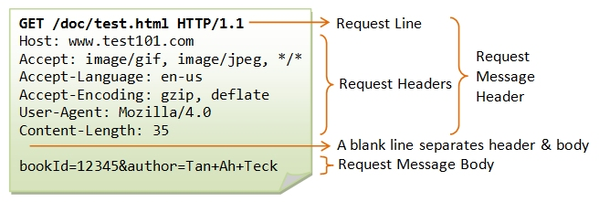
	- Các thành phần của một yêu cầu HTTP gồm:
		* Dòng yêu cầu (Request-line): <Phương thức> <URI yêu cầu> <Phiên bản HTTP>
		* Các trường tiêu đề (header) (General|Request|Entity): Theo sau là dấu CRLF .
		* Một dòng trống: (Tức là một dòng không có gì đứng trước CRLF) báo hiệu kết thúc các trường tiêu đề.
		* Phần thân thông điệp (message-body): Tùy chọn
	- Request-Line bao gồm 3 thông tin đó là:
		* Method: là phương thức mà HTTP Request này sử dụng, chỉ định hành động sẽ được thực hiện trên tài nguyên được xác định bởi URI yêu cầu đã cho. Phương thức này phân biệt chữ hoa chữ thường và luôn phải được viết bằng chữ hoa. Bảng sau liệt kê tất cả các phương thức được hỗ trợ trong HTTP/1.1:
			| Phương thức | Mô tả                                                                                                                                                                                                           |
			| ----------- | --------------------------------------------------------------------------------------------------------------------------------------------------------------------------------------------------------------- |
			| GET         | Phương thức GET được sử dụng để truy xuất thông tin từ máy chủ đã cho bằng cách sử dụng một URI đã cho. Các yêu cầu sử dụng GET chỉ nên truy xuất dữ liệu và không nên có bất kỳ tác động nào khác đến dữ liệu. |
			| HEAD        | Tương tự như GET, nhưng nó chỉ truyền dòng trạng thái và phần tiêu đề.                                                                                                                                          |
			| POST        | Một yêu cầu POST được sử dụng để gửi dữ liệu đến máy chủ, ví dụ: thông tin khách hàng, tải tệp lên, v.v. bằng cách sử dụng các biểu mẫu HTML.                                                                   |
			| PUT         | Thay thế tất cả các biểu diễn hiện tại của tài nguyên đích bằng nội dung đã tải lên.                                                                                                                            |
			| DELETE      | Xóa tất cả các biểu diễn hiện tại của tài nguyên đích được chỉ định bởi URI.                                                                                                                                    |
			| CONNECT     | Thiết lập một đường hầm đến máy chủ được xác định bởi một URI đã cho.                                                                                                                                           |
			| OPTIONS     | Mô tả các tùy chọn giao tiếp cho tài nguyên đích.                                                                                                                                                               |
			| TRACE       | Thực hiện một kiểm tra vòng lặp thông báo dọc theo đường dẫn đến tài nguyên đích.                                                                                                                               |                                                                                                                                                                                       |
		* URI(Uniform Resource Identifier): là địa chỉ định danh của tài nguyên yêu cầu sẽ được áp dụng. 
			| Method            | Description                                                                                                                                                                                                                                                  |
			| --------------------- | ---------------------------------------------------------------------------------------------------------------------------------------------------------------------------------------------------------------------------------------------------------------- |
			| Asterisk (*) form | Được sử dụng khi HTTP request không áp dụng cho một tài nguyên cụ thể mà cho server nói chung. Chỉ dùng với các phương thức như `OPTIONS`.  <br> Ví dụ: `OPTIONS * HTTP/1.1`                                                                                 |
			| Absolute form     | Dùng khi HTTP request được gửi đến một proxy. Proxy sẽ chuyển tiếp request hoặc phản hồi từ cache.  <br> Ví dụ: `GET https://www.example.com/tailwind_css/index.htm HTTP/1.1`                                                                                |
			| Origin form       | Dạng phổ biến nhất, dùng khi client gửi request trực tiếp đến origin server.  <br> Ví dụ:  <br> `GET /tailwind_css/index.htm HTTP/1.1` <br> `Host: www.example.com` <br> Lưu ý: Đường dẫn tuyệt đối không được để trống; nếu không có thì phải dùng `/`. |
			| Authority form    | Chỉ dùng với phương thức `CONNECT`, thường trong kết nối qua proxy đến máy chủ khác.  <br> Ví dụ: `CONNECT www.example.com:443 HTTP/1.1`                                                                                                                     |

		* HTTP version: là phiên bản HTTP đang sử dụng.
	- Tiếp theo là các trường request-header, cho phép client gửi thêm các thông tin bổ sung về thông điệp HTTP request và về chính client. Một số trường thông dụng như:
		* Accept: loại nội dung có thể nhận được từ thông điệp response. Ví dụ: text/plain, text/html…
		* Accept-Encoding: các kiểu nén được chấp nhận. Ví dụ: gzip, deflate, xz, exi…
		* Connection: tùy chọn điều khiển cho kết nối hiện thời. Ví dụ: keep-alive, Upgrade…
		* Cookie: thông tin HTTP Cookie từ server.
		* User-Agent: thông tin về user agent của người dùng.
	- Ví dụ 1 HTTP Request : HTTP Request nhằm lấy trang hello.htm từ máy chủ web đang chạy trên example.com:
		```
		GET /hello.htm HTTP/1.1
		User-Agent: Mozilla/4.0 (compatible; MSIE5.01; Windows NT)
		Host: www.example.com
		Accept-Language: en-us
		Accept-Encoding: gzip, deflate
		Connection: Keep-Alive
		```
			* GET: Đây là phương thức HTTP, chỉ định hành động mà máy khách muốn thực hiện (trong trường hợp này là lấy dữ liệu).
			* /hello.htm: Đây là URI yêu cầu, xác định tài nguyên cụ thể mà máy khách muốn truy cập trên máy chủ.
			* HTTP/1.1: Đây là phiên bản giao thức HTTP mà máy khách đang sử dụng.
			* User-Agent: Mozilla/4.0 (compatible; MSIE5.01; Windows NT): Đây là một tiêu đề yêu cầu, cung cấp thông tin về trình duyệt (tác nhân người dùng) đang gửi yêu cầu.
			* Host: www.example.com: Đây là một tiêu đề yêu cầu quan trọng, chỉ định tên miền của máy chủ mà máy khách đang muốn kết nối. Điều này đặc biệt quan trọng khi một máy chủ duy nhất phục vụ nhiều trang web.
			* Accept-Language: en-us: Đây là một tiêu đề yêu cầu, cho biết ngôn ngữ mà máy khách ưu tiên (trong trường hợp này là tiếng Anh của Mỹ).
			* Accept-Encoding: gzip, deflate: Đây là một tiêu đề yêu cầu, cho biết các phương pháp nén mà máy khách có thể xử lý. Máy chủ có thể sử dụng một trong các phương pháp này để nén phản hồi, giúp giảm kích thước dữ liệu truyền đi.
			* Connection: Keep-Alive: Đây là một tiêu đề yêu cầu, gợi ý cho máy chủ duy trì kết nối TCP sau khi gửi phản hồi đầu tiên, cho phép các yêu cầu tiếp theo có thể được gửi qua cùng một kết nối, giảm độ trễ.
	* Response 
	- là phản hồi mà máy chủ đã xử lý dữ liệu được gửi từ máy khách và trả lại cho máy khách. Khi bạn gửi yêu cầu đến máy chủ, quá trình xử lý theo phương thức được thực hiện trên máy chủ và kết quả xử lý sẽ được trả về.
	- 
	- Các thành phần của 1 HTTP Response: 
		* Dòng trạng thái (Status-line): `<Phiên bản HTTP> <Mã trạng thái> <Mô tả trạng thái>`
		* Không hoặc nhiều trường tiêu đề (header) (General|Response|Entity)
		* Một dòng trống: (Tức là một dòng không có gì đứng trước CRLF) báo hiệu kết thúc các trường tiêu đề.
		* Phần thân thông điệp (message-body): Tùy chọn. 
	- Status-Line: Một dòng trạng thái bao gồm phiên bản giao thức, theo sau là một mã trạng thái số và cụm từ mô tả trạng thái tương ứng. Các thành phần được phân tách bằng ký tự khoảng trắng.
		* Phiên bản HTTP: Máy chủ hỗ trợ phiên bản HTTP 1.1 sẽ trả về thông tin phiên bản sau:`HTTP-Version = HTTP/1.1`
		* Mã trạng thái (Status Code):  Mã trạng thái là một số nguyên có 3 chữ số, trong đó chữ số đầu tiên của Mã trạng thái xác định lớp phản hồi và hai chữ số cuối không có vai trò phân loại. Có 5 giá trị cho chữ số đầu tiên:
			| Mã trạng thái | Mô tả                                                                         |
			| ------------- | ----------------------------------------------------------------------------- |
			| 1xx           | Thông tin: Yêu cầu đã được nhận và quá trình đang tiếp tục.                   |
			| 2xx           | Thành công: Hành động đã được nhận, hiểu và chấp nhận thành công.             |
			| 3xx           | Chuyển hướng: Cần thực hiện hành động tiếp theo để hoàn thành yêu cầu.        |
			| 4xx           | Lỗi máy khách: Yêu cầu chứa cú pháp không chính xác hoặc không thể thực hiện. |
			| 5xx           | Lỗi máy chủ: Máy chủ không thể thực hiện một yêu cầu có vẻ hợp lệ.            |
	- Response Header Fields Các trường tiêu đề phản hồi: Các trường tiêu đề phản hồi cho phép máy chủ truyền thêm thông tin về phản hồi mà không thể đặt trong Dòng trạng thái. Các trường tiêu đề này cung cấp thông tin về máy chủ và về quyền truy cập tiếp theo vào tài nguyên được xác định bởi URI yêu cầu.
		* Accept-Ranges
		* Age
		* ETag
		* Location
		* Proxy-Authenticate
		* Retry-After
		* Server
		* Vary
		* WWW-Authenticate
	- Ví dụ 1 HTTP Respone: HTTP Respone cho yêu cầu lấy trang hello.htm từ máy chủ web đang chạy trên example.com:
		```
		HTTP/1.1 200 OK
		Date: Mon, 27 Jul 2009 12:28:53 GMT
		Server: Apache/2.2.14 (Win32)
		Last-Modified: Wed, 22 Jul 2009 19:15:56 GMT
		Content-Length: 88
		Content-Type: text/html
		Connection: Closed
		```
			* HTTP/1.1: Phiên bản giao thức HTTP mà máy chủ đang sử dụng.
			* 200 OK: Mã trạng thái HTTP cho biết yêu cầu đã thành công. 200 là mã trạng thái thành công và OK là cụm từ mô tả trạng thái tương ứng.
			* Date: Mon, 27 Jul 2009 12:28:53 GMT: Tiêu đề phản hồi Date chỉ ra ngày và giờ (theo giờ GMT) mà phản hồi được tạo ra.
			* Server: Apache/2.2.14 (Win32): Tiêu đề phản hồi Server cung cấp thông tin về phần mềm máy chủ web đang được sử dụng (trong trường hợp này là Apache phiên bản 2.2.14 trên Windows).
			* Last-Modified: Wed, 22 Jul 2009 19:15:56 GMT: Tiêu đề phản hồi Last-Modified chỉ ra ngày và giờ sửa đổi cuối cùng của tài nguyên được yêu cầu.
			* Content-Length: 88: Tiêu đề phản hồi Content-Length chỉ định kích thước (tính bằng byte) của phần thân thông điệp (trong trường hợp này là 88 byte).
			* Content-Type: text/html: Tiêu đề phản hồi Content-Type chỉ định kiểu MIME của dữ liệu trong phần thân thông điệp (trong trường hợp này là văn bản HTML).
			* Connection: Closed: Tiêu đề phản hồi Connection cho biết kết nối TCP sẽ bị đóng sau khi truyền xong phản hồi này.
- Bảng các Status Code 

* 1xx - Informational

| Mã  | Tên                 | Mô tả                                                                        |
| --- | ------------------- | ---------------------------------------------------------------------------- |
| 100 | Continue            | Máy chủ đã nhận được phần đầu yêu cầu, client nên tiếp tục gửi phần còn lại. |
| 101 | Switching Protocols | Máy chủ đồng ý chuyển giao thức như yêu cầu.                                 |
| 102 | Processing          | Máy chủ đã nhận yêu cầu nhưng chưa hoàn thành xử lý.                         |
| 103 | Early Hints         | Cung cấp thông tin trước khi phản hồi chính được gửi.                        |

---

* 2xx - Success

| Mã  | Tên                           | Mô tả                                             |
| --- | ----------------------------- | ------------------------------------------------- |
| 200 | OK                            | Yêu cầu thành công và phản hồi theo yêu cầu.      |
| 201 | Created                       | Yêu cầu thành công và tài nguyên mới đã được tạo. |
| 202 | Accepted                      | Yêu cầu đã được chấp nhận nhưng chưa được xử lý.  |
| 203 | Non-Authoritative Information | Phản hồi không đến từ nguồn gốc.                  |
| 204 | No Content                    | Thành công, không có nội dung trả về.             |
| 205 | Reset Content                 | Yêu cầu client reset view.                        |
| 206 | Partial Content               | Trả về một phần tài nguyên.                       |
| 207 | Multi-Status                  | Trạng thái đa phần (WebDAV).                      |
| 208 | Already Reported              | Đã được báo cáo trước đó.                         |
| 226 | IM Used                       | Thành công sau khi áp dụng các bản sửa đổi.       |
---

* 3xx - Redirection

| Mã  | Tên                | Mô tả                                           |
| --- | ------------------ | ----------------------------------------------- |
| 300 | Multiple Choices   | Nhiều phản hồi khả dĩ.                          |
| 301 | Moved Permanently  | Tài nguyên chuyển vĩnh viễn.                    |
| 302 | Found              | Tạm thời chuyển hướng.                          |
| 303 | See Other          | Chuyển hướng bằng GET.                          |
| 304 | Not Modified       | Không có thay đổi.                              |
| 305 | Use Proxy          | Dùng proxy (deprecated).                        |
| 306 | Switch Proxy       | Không sử dụng nữa.                              |
| 307 | Temporary Redirect | Tạm thời chuyển hướng, giữ nguyên phương thức.  |
| 308 | Permanent Redirect | Chuyển hướng vĩnh viễn, giữ nguyên phương thức. |
---

* 4xx - Client Error

| Mã  | Tên                             | Mô tả                               |
| --- | ------------------------------- | ----------------------------------- |
| 400 | Bad Request                     | Yêu cầu sai cú pháp.                |
| 401 | Unauthorized                    | Cần xác thực.                       |
| 402 | Payment Required                | Dành cho thanh toán (chưa sử dụng). |
| 403 | Forbidden                       | Không có quyền truy cập.            |
| 404 | Not Found                       | Không tìm thấy tài nguyên.          |
| 405 | Method Not Allowed              | Phương thức không được hỗ trợ.      |
| 406 | Not Acceptable                  | Không có định dạng nào phù hợp.     |
| 407 | Proxy Authentication Required   | Cần xác thực proxy.                 |
| 408 | Request Timeout                 | Hết thời gian yêu cầu.              |
| 409 | Conflict                        | Xung đột trạng thái tài nguyên.     |
| 410 | Gone                            | Tài nguyên đã bị xóa.               |
| 411 | Length Required                 | Thiếu trường Content-Length.        |
| 412 | Precondition Failed             | Điều kiện không thỏa mãn.           |
| 413 | Payload Too Large               | Yêu cầu quá lớn.                    |
| 414 | URI Too Long                    | URI quá dài.                        |
| 415 | Unsupported Media Type          | Loại phương tiện không được hỗ trợ. |
| 416 | Range Not Satisfiable           | Phạm vi không thỏa mãn.             |
| 417 | Expectation Failed              | Không đáp ứng được Expect.          |
| 418 | I'm a teapot                    | Mã đùa từ RFC 2324.                 |
| 421 | Misdirected Request             | Gửi sai máy chủ.                    |
| 422 | Unprocessable Entity            | Không xử lý được (WebDAV).          |
| 423 | Locked                          | Tài nguyên bị khóa.                 |
| 424 | Failed Dependency               | Phụ thuộc bị lỗi.                   |
| 425 | Too Early                       | Yêu cầu quá sớm.                    |
| 426 | Upgrade Required                | Cần nâng cấp giao thức.             |
| 428 | Precondition Required           | Yêu cầu cần điều kiện.              |
| 429 | Too Many Requests               | Quá nhiều yêu cầu.                  |
| 431 | Request Header Fields Too Large | Header quá lớn.                     |
| 451 | Unavailable For Legal Reasons   | Bị chặn vì lý do pháp lý.           |
---

* 5xx - Server Error

| Mã  | Tên                             | Mô tả                            |
| --- | ------------------------------- | -------------------------------- |
| 500 | Internal Server Error           | Lỗi không xác định từ máy chủ.   |
| 501 | Not Implemented                 | Chưa được hỗ trợ.                |
| 502 | Bad Gateway                     | Gateway lỗi.                     |
| 503 | Service Unavailable             | Dịch vụ tạm thời không khả dụng. |
| 504 | Gateway Timeout                 | Gateway hết thời gian.           |
| 505 | HTTP Version Not Supported      | Phiên bản HTTP không hỗ trợ.     |
| 506 | Variant Also Negotiates         | Lỗi do server cấu hình sai.      |
| 507 | Insufficient Storage            | Không đủ dung lượng lưu trữ.     |
| 508 | Loop Detected                   | Phát hiện vòng lặp (WebDAV).     |
| 510 | Not Extended                    | Cần mở rộng thêm yêu cầu.        |
| 511 | Network Authentication Required | Yêu cầu xác thực mạng.           |

<!-- TOC --><a name="312-ssltls-bo-mt-chng-ch-s"></a>
#### 3.1.2 SSL/TLS (bảo mật, chứng chỉ số).
- SSL（Secure Sockets Layer）/TLS（Transport Layer Security）là kỹ thuật mã hóa truyền tin trên internet. Sử dụng SSL/TLS , bằng việc mã hóa data truyền tin giữa máy tính và server thì có thể phòng tránh bên thứ ba nghe trộm hoặc giả mạo data.
- SSL/TLS sử dụng các chứng chỉ để thiết lập một liên kết được mã hóa giữa máy chủ và máy khách. Điều này cho phép các thông tin nhạy cảm như chi tiết thẻ tín dụng được truyền một cách an toàn qua internet.
- Chứng chỉ Transport Layer Security (TLS) - thường được biết đến là SSL hoặc chứng chỉ số - là nền tảng của một internet an toàn. Chứng chỉ TLS/SSL bảo vệ các kết nối internet bằng cách mã hóa dữ liệu được gửi giữa trình duyệt của bạn, trang web bạn đang truy cập và máy chủ của trang web. Chúng đảm bảo rằng dữ liệu được truyền riêng tư, không bị sửa đổi, mất mát hoặc đánh cắp.
- Chứng chỉ chứa một khóa công khai để xác thực danh tính của trang web và cho phép truyền dữ liệu đã mã hóa thông qua mật mã bất đối xứng, hay còn gọi là mật mã khóa công khai. Khóa riêng tư tương ứng được giữ bí mật trên máy chủ.
- Cơ chế hoạt động: Chứng chỉ SSL/TLS xác thực danh tính và kích hoạt các kết nối được mã hóa thông qua quá trình SSL/TLS handshake (bắt tay SSL/TLS):
	* Máy khách yêu cầu truy cập vào một tài nguyên được bảo vệ, chẳng hạn như trang đăng nhập.
	* Máy chủ phản hồi bằng cách gửi chứng chỉ SSL của nó, bao gồm cả khóa công khai.
	* Máy khách xác minh rằng chứng chỉ hợp lệ và đáng tin cậy. Điều này đảm bảo máy chủ là xác thực.
	* Máy khách tạo ra một khóa phiên đối xứng và mã hóa nó bằng khóa công khai của máy chủ. Điều này truyền khóa phiên một cách an toàn đến máy chủ.
	* Máy chủ giải mã khóa phiên bằng khóa riêng tư của nó.
	* Cả hai bên sử dụng khóa phiên đối xứng để mã hóa và giải mã tất cả dữ liệu được truyền.
	- Quá trình bắt tay này cho phép hai bên thương lượng một kênh được mã hóa mà không cần chia sẻ thông tin nhạy cảm qua các kênh không an toàn. Phiên được mã hóa bảo vệ dữ liệu trong quá trình truyền giữa máy khách và máy chủ.
- 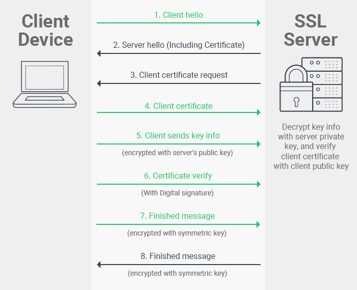
- Các loại chứng chỉ SSL/TLS :
	- Theo mức độ xác thực:
		* EV (Extended Validation): Mức xác thực cao nhất, kiểm tra nghiêm ngặt tổ chức, hiển thị thông tin công ty trên trình duyệt, tin cậy cao cho giao dịch nhạy cảm.
		* OV (Organization Validated): Mức xác thực trung bình, cần chứng minh quyền sở hữu domain và thông tin công ty, phù hợp cho doanh nghiệp xây dựng lòng tin.
		* DV (Domain Validated): Mức xác thực thấp nhất, chỉ cần xác minh quyền sở hữu domain qua email/điện thoại, chi phí thấp, phù hợp cho website thông tin.
	- Theo loại domain hỗ trợ:
		* Single Domain: Chỉ bảo vệ một domain hoặc subdomain duy nhất.
		* Wildcard: Bảo vệ một domain và tất cả các subdomain của nó.
		* Multi-Domain: Bảo vệ nhiều domain khác nhau thuộc cùng một chủ sở hữu.
		
<!-- TOC --><a name="313-websocket-http2-quic-giao-thc-hin-i"></a>
#### 3.1.3 WebSocket, HTTP/2, QUIC (giao thức hiện đại).
- WebSocket 
	- là một giao thức truyền thông máy tính (computer communication protocol), cung cấp các kênh liên lạc dạng full-duplex (song công) qua một kết nối TCP.
	- hỗ trợ giao tiếp hai chiều giữa client và server bằng cách sử dụng một TCP socket để tạo một kết nối hiệu quả và ít tốn kém.
	- WebSocket mới trong HTML5 là một kỹ thuật Ajax ngược. Sockets cho phép các kênh giao tiếp song song hai chiều và hiện được hỗ trợ bởi nhiều trình duyệt (Firefox, Google Chrome và Safari). Các kết nối được mở thông qua các yêu cầu HTTP (HTTP request) được gọi là các ràng buộc Sockets với các tiêu đề đặc biệt. 
	- Kết nối được duy trì để bạn có thể đọc và ghi dữ liệu bằng JavaScript như thể bạn đang sử dụng các socket TCP thuần túy. Dữ liệu được gửi qua giao thức HTTP (thường được sử dụng trong các kỹ thuật Ajax) chứa rất nhiều dữ liệu không cần thiết trong tiêu đề. 
	- 
	- WebSocket hoạt động qua ba bước chính:
		1. Thiết lập kết nối WebSocket
			* Khởi tạo yêu cầu: Máy khách (client) gửi một yêu cầu HTTP đến máy chủ, trong đó có tiêu đề Upgrade để yêu cầu chuyển đổi từ giao thức HTTP sang WebSocket.
			* Phản hồi từ máy chủ: Nếu máy chủ hỗ trợ WebSocket, nó sẽ phản hồi với một thông báo xác nhận việc nâng cấp kết nối, cho phép thiết lập một kết nối WebSocket.
		2. Truyền dữ liệu qua WebSockets
			* Giao tiếp hai chiều: Sau khi kết nối được thiết lập, cả máy khách và máy chủ có thể gửi và nhận dữ liệu bất kỳ lúc nào mà không cần thực hiện yêu cầu HTTP mới.
			* Dữ liệu dạng khung: Dữ liệu được truyền qua WebSocket được đóng gói trong các frames, có thể chứa dữ liệu văn bản hoặc nhị phân.
		3. Đóng kết nối WebSocket: Kết nối WebSocket được duy trì cho đến khi một trong hai bên quyết định đóng nó. Khi kết nối bị đóng, quá trình truyền dữ liệu kết thúc.
	- Ưu điểm
		- WebSockets cung cấp khả năng giao tiếp hai chiều mạnh mẽ, có độ trễ thấp và dễ xử lý lỗi. Không cần phải có nhiều kết nối như phương pháp Comet long-polling và cũng không có những nhược điểm như Comet streaming.
		- API cũng rất dễ sử dụng trực tiếp mà không cần bất kỳ các tầng bổ sung nào, so với Comet, thường đòi hỏi một thư viện tốt để xử lý kết nối lại, thời gian chờ timeout, các Ajax request (yêu cầu Ajax), các tin báo nhận và các dạng truyền tải tùy chọn khác nhau (Ajax long-polling và jsonp polling).
	- Nhược điểm
		- Nó là một đặc tả mới của HTML5, nên nó vẫn chưa được tất cả các trình duyệt hỗ trợ.
		- Không có phạm vi yêu cầu nào. Do WebSocket là một TCP socket chứ không phải là HTTP request, nên không dễ sử dụng các dịch vụ có phạm vi-yêu cầu, như SessionInViewFilter của Hibernate. Hibernate là một framework kinh điển cung cấp một bộ lọc xung quanh một HTTP request. Khi bắt đầu một request, nó sẽ thiết lập một contest (chứa các transaction và liên kết JDBC) được ràng buộc với luồng request. Khi request đó kết thúc, bộ lọc hủy bỏ contest này.
- HTTP/2 
	- HTTP/2 là phiên bản chính thức tiếp theo của giao thức HTTP, nhằm cải thiện tốc độ tải trang và hiệu suất khi duyệt web.
	- 
	- Các đặc điểm của HTTP/2
		- Header compression: HTTP/2 nén các thông tin ở phần đầu của dữ liệu và làm giảm kích thước của chúng, giúp trang web tải nhanh hơn và quá trình trao đổi thông tin giữa máy chủ web và người dùng diễn ra nhanh hơn.
		- 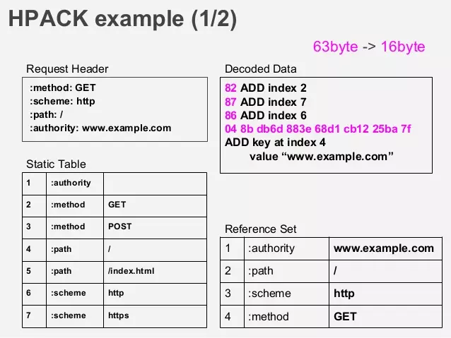 
		- Multiplexing : Nó giảm thời gian chờ bằng cách cho phép gửi và nhận nhiều yêu cầu cùng một lúc.
		- 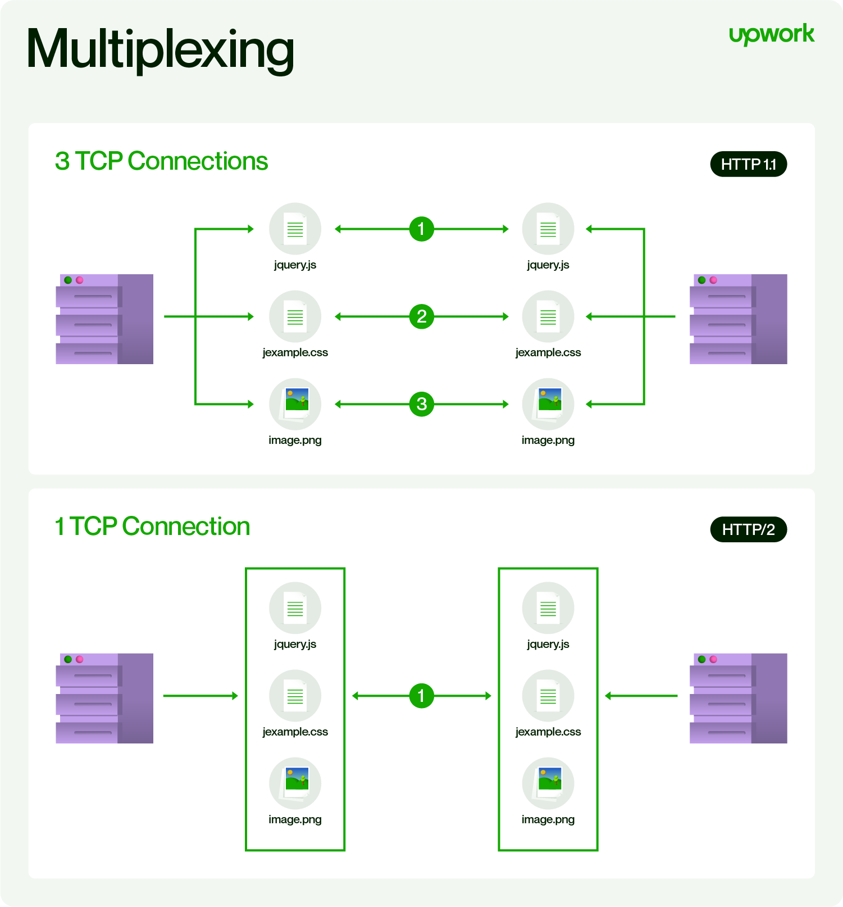 
		- Stream prioritization: HTTP/2 có một đặc điểm giúp máy chủ phân chia tài nguyên mạng dựa trên nhu cầu của người dùng. Quá trình này cải thiện trải nghiệm người dùng bằng cách hiển thị những phần quan trọng nhất của trang web nhanh nhất có thể.
		-  
		- Binary framing layer: Giao thức HTTP/2 sử dụng dữ liệu dạng số (0 và 1) thay vì các lệnh dạng chữ. Một giao thức dùng dữ liệu dạng số thường hiệu quả hơn và ít gây ra lỗi hơn. Nó giúp giảm thời gian chờ và bảo vệ tốt hơn trước các nguy cơ bảo mật so với cách dùng dữ liệu dạng chữ.
		-  
		- Server push: Giao thức HTTP/2 cho phép máy chủ tự động gửi các tài nguyên đến người dùng mà không cần người dùng phải yêu cầu trước. Điều này giúp tăng hiệu quả và giảm thời gian tải trang.
		-  
			* Ví dụ: Ngay khi Client request index.html ngay lập tức, Server sẽ trả về index.html và cả style.css nữa, điều này có thể thực hiện do cơ chế single connection, single origin được nhắc tới ở trên. Và trình duyệt có thể render trang web ngay lập tức thay vì chờ đợi request thứ 2 cho style.css dược phản hồi.
		- Increased security: HTTP/2 được hỗ trợ thông qua các kết nối đã được mã hóa.
	- Ưu điểm: 
		* Tăng tốc độ: Truyền tải song song (multiplexing), nén header, server push giúp tải trang nhanh hơn đáng kể.
		* Bảo mật hơn: Thường đi kèm HTTPS, tăng cường mã hóa.
		* Hiệu quả hơn: Giảm nhu cầu các kỹ thuật tối ưu hóa phức tạp như image sprites, domain sharding.
	- Nhược điểm :
		* Phức tạp hơn: Triển khai và gỡ lỗi khó hơn.
		* Tốn tài nguyên hơn: Máy chủ có thể cần nhiều CPU, RAM hơn.
		* Vấn đề tương thích: Trình duyệt cũ có thể không hỗ trợ.
- QUIC 
	- QUIC (Quick UDP Internet Connections) là một giao thức truyền tải mạng được phát triển bởi Google nhằm cải thiện hiệu suất của các ứng dụng sử dụng kết nối Internet, đặc biệt là các ứng dụng web và truyền phát video. QUIC được thiết kế để thay thế giao thức TCP, cung cấp các lợi ích về tốc độ và hiệu suất mà TCP không thể đáp ứng đầy đủ trong môi trường Internet hiện đại.
	- Các đặc điểm chính của QUIC
		* Sử dụng UDP: QUIC hoạt động trên giao thức UDP (User Datagram Protocol), thay vì TCP (Transmission Control Protocol), giúp giảm độ trễ của các kết nối mạng.
		* Giảm độ trễ kết nối: Với QUIC, quá trình thiết lập kết nối diễn ra nhanh hơn, thường chỉ yêu cầu một bước trao đổi dữ liệu duy nhất, thay vì nhiều bước như TCP + TLS.
			-  
		* Tích hợp bảo mật: QUIC tích hợp các tính năng của TLS 1.3 (Transport Layer Security) để mã hóa dữ liệu trong suốt quá trình truyền, đảm bảo bảo mật mà không cần thêm một bước thiết lập mã hóa riêng biệt.
		* Khả năng khôi phục nhanh chóng: Khi xảy ra mất gói dữ liệu, QUIC chỉ cần yêu cầu truyền lại các gói bị mất thay vì phải thiết lập lại toàn bộ kết nối như TCP.
		* Tối ưu hóa cho đa luồng: QUIC hỗ trợ truyền dữ liệu đồng thời trên nhiều luồng (streams) mà không gây cản trở nhau khi xảy ra lỗi, cải thiện hiệu suất cho các trang web và ứng dụng phức tạp.
	- QUIC và HTTP/3 : 
		* QUIC là một phần của HTTP/3, phiên bản giao thức HTTP mới nhất. HTTP/3 thay thế giao thức TCP của phiên bản trước đó, HTTP/2, bằng QUIC. Sự kết hợp giữa QUIC và HTTP/3 mang lại nhiều lợi ích cho việc truyền tải dữ liệu trên internet.
		* Sự thay thế của HTTP/3: HTTP/3 thay thế giao thức TCP bằng QUIC để tận dụng những ưu điểm của giao thức mới này như tăng tốc độ và tính bảo mật.
		* Ưu điểm khi sử dụng HTTP/3 với QUIC: Khi sử dụng HTTP/3 với QUIC, việc truyền tải dữ liệu trở nên nhanh chóng và hiệu quả hơn bao giờ hết. Sự kết hợp này giúp tối ưu hóa việc tải nội dung của trang web và giảm thiểu thời gian tải trang.
	- Bên cạnh đó QUIC tồn tạn những hạn chế như: 
		* Sự chấp nhận hạn chế: QUIC vẫn còn tương đối mới và không phải tất cả các hệ thống hoặc tường lửa đều hỗ trợ đầy đủ.
		* Dự phòng TCP: Một số triển khai có thể yêu cầu dự phòng về TCP nếu QUIC không được hỗ trợ, làm tăng thêm sự phức tạp.
		* Không kiểm tra gói tin: Việc mã hóa trong QUIC gây khó khăn cho quản trị viên mạng trong việc kiểm tra hoặc giám sát lưu lượng truy cập, có khả năng ảnh hưởng đến bảo mật và nỗ lực khắc phục sự cố.
		* Sử dụng CPU cao hơn: QUIC có thể yêu cầu nhiều tài nguyên CPU hơn so với TCP do cơ chế mã hóa và kiểm soát tắc nghẽn của nó.
		* Phụ thuộc vào UDP: QUIC dựa trên UDP, một giao thức không kết nối, và có thể dễ bị tấn công DDoS dựa trên UDP.
		* Khả năng tương thích hạn chế: QUIC không tương thích với tất cả các thiết bị mạng và tường lửa, có khả năng yêu cầu người dùng định cấu hình thiết bị của họ.
<!-- TOC --><a name="314-cgi-fastcgi-wsgi-giao-tip-gia-server-và-ng-dng"></a>
#### 3.1.4 CGI, FastCGI, WSGI (giao tiếp giữa server và ứng dụng).
- CGI 
	- CGI là viết tắt của Common Gateway Interface, tạm dịch là giao diện cổng chung. CGI cung cấp một phần mềm trung gian giữa các máy chủ với cơ sở dữ liệu và nguồn thông tin bên ngoài. Trong đó máy chủ HTTP và 1 CGI script sẽ chịu trách nhiệm phản hồi yêu cầu từ người dùng.
		* Máy chủ đảm nhận quản lý các kết nối, việc thực hiện truyền dữ liệu đi và các vấn đề liên quan đến yêu cầu từ người dùng.
		* CGI script chịu trách nhiệm xử lý các vấn đề của ứng dụng như truy cập vào dữ liệu và xử lý các tài liệu.
	- Các tính năng của CGI
		* CGI là một tiêu chuẩn được phát triển với định hướng rõ ràng và có rất nhiều sự hỗ trợ.
		* CGI là một công nghệ được kết nối với ngôn ngữ HTML.
		* CGI script thường được viết bằng các ngôn ngữ như C, Perl nhưng cũng có thể là một shell script đơn giản.
		* Nếu tạo một bộ nhớ đệm có tốc độ nhanh, CGI là một trong những phương pháp tối ưu nhất.
		* Cho đến thời điểm hiện tại, CGI vẫn đang rất tương thích với các trình duyệt hiện đại, dù đã phát triển từ những năm 1990.	
	- CGI là một giao thức trao đổi giữa máy chủ web và các ứng dụng cổng (gateway application) như PHP, Python,…
		-  
		- Trong thực tế CGI sẽ hoạt động như sau:
			* Máy trạm gửi yêu cầu đến máy chủ web, máy chủ web nhận yêu cầu và chuyển tiếp cho ứng dụng cổng. CGI sẽ thực thi một câu lệnh tương ứng phù hợp với ứng dụng đó.
			* Các thông tin chi tiết về yêu cầu được ứng dụng truyền qua bằng các biến môi trường, trong khi đó dữ liệu bằng các phương pháp POST hoặc PUT sẽ được truyền qua các cổng nhập tiêu chuẩn. Tức là CGI xử lý dữ liệu của nó song song với dữ liệu chính.
			* Ứng dụng sẽ viết nội dung cần trả lời để máy chủ trả thông tin về cho người yêu cầu.
		- Quá trình này khá đơn giản và hiệu quả. Tuy nhiên, hình thức này dần bộc lộ một số hạn chế như:
			* Một yêu cầu sẽ tạo ra một tiến trình làm việc độc lập. Bộ nhớ và các thông tin không được lưu lại sau mỗi phiên, sẽ được tạo lại sao mỗi phiên.
			* Một tiến trình mới sẽ tiêu tốn rất nhiều tài nguyên của hệ thống. Nếu trong một thời điểm một loạt yêu cầu được sinh ra sẽ làm máy chủ quá tải ngay lập tức.
			* Trong trường hợp máy chủ một nơi, ứng dụng nằm trên một máy tính khác sẽ tạo ra nhiều khó khăn.
	- Ưu điểm
		* Code sẵn có để áp dụng vào phần mềm của bạn mà không phải code lại từ đầu.
		* CGI mạnh mẽ tương thích hầu hết với các ngôn ngữ và bất cứ nền tảng nào, miễn chúng có những đặc điểm kỹ thuật phù hợp.
		* Các tác vụ nâng cao vốn khó trong Java giờ có thể thực hiện dễ dàng hơn với CGI.
	- Nhược điểm
		* CGI rất tốn thời gian để xử lý.
		* Không lưu lại cache sau mỗi lần tải lại trang.
		* Mỗi lần tải lại sẽ tốn thêm thời gian do phải tải lại các chương trình vào bộ nhớ.
- FastCGI
	- là một giao thức nhị phân để kết nối các chương trình tương tác với một máy chủ web. Nó là một biến thể của CGI ra đời trước đó. Mục tiêu chính của FastCGI là giảm phát sinh liên quan đến việc kết nối giữa máy chủ web và các chương trình CGI, cho phép máy chủ xử lý nhiều yêu cầu trang web hơn trong một đơn vị thời gian.
	- Những ưu điểm của FastCGI bao gồm:
		* Hiệu suất: Các tiến trình FastCGI hoạt động liên tục - chúng được tái sử dụng để xử lý nhiều yêu cầu. Điều này giải quyết vấn đề hiệu suất của CGI là phải tạo tiến trình mới cho mỗi yêu cầu.
		* Đơn giản, dễ dàng chuyển đổi từ CGI: Thư viện ứng dụng FastCGI (được mô tả ở trang 9) giúp đơn giản hóa việc chuyển đổi các ứng dụng CGI hiện có. Các ứng dụng được xây dựng bằng thư viện ứng dụng cũng có thể chạy như các chương trình CGI, để tương thích ngược với các máy chủ Web cũ.
		* Độc lập ngôn ngữ: Giống như CGI, các ứng dụng FastCGI có thể được viết bằng bất kỳ ngôn ngữ nào, không chỉ các ngôn ngữ được hỗ trợ bởi API của nhà cung cấp.
		* Cô lập tiến trình: Một ứng dụng FastCGI bị lỗi không thể làm sập hoặc làm hỏng máy chủ chính hoặc các ứng dụng khác. Một ứng dụng FastCGI độc hại không thể đánh cắp bất kỳ bí mật nào (chẳng hạn như khóa phiên cho mã hóa) từ máy chủ Web.
		* Không độc quyền: FastCGI được hỗ trợ trong tất cả các sản phẩm máy chủ của Open Market, và sự hỗ trợ đang được phát triển cho các máy chủ Web khác, bao gồm các máy chủ Apache và NCSA miễn phí, cũng như các máy chủ thương mại từ Microsoft và Netscape.
		* Độc lập kiến trúc: Giao diện FastCGI không bị ràng buộc với một kiến trúc máy chủ cụ thể. Bất kỳ máy chủ Web nào cũng có thể triển khai giao diện FastCGI. Ngoài ra, FastCGI không áp đặt bất kỳ kiến trúc nào lên ứng dụng: các ứng dụng có thể là đơn luồng hoặc đa luồng, bất kể kiến trúc luồng của máy chủ Web.
		* Hỗ trợ điện toán phân tán: FastCGI cung cấp khả năng chạy các ứng dụng từ xa, điều này hữu ích cho việc phân tán tải và quản lý các trang Web bên ngoài.
	- Chức năng FastCGI cung cấp rất giống với chức năng mà CGI cung cấp. 
		- Quá trình xử lý yêu cầu CGI cơ bản diễn ra như sau:
			* Với mỗi yêu cầu, máy chủ tạo một tiến trình mới và tiến trình đó tự khởi tạo.
			* Máy chủ Web truyền thông tin yêu cầu (chẳng hạn như máy chủ từ xa, tên người dùng, tiêu đề HTTP, v.v.) cho chương trình CGI trong các biến môi trường.
			* Máy chủ Web gửi bất kỳ dữ liệu đầu vào nào của máy khách (chẳng hạn như các giá trị trường do người dùng nhập từ biểu mẫu HTML) đến đầu vào chuẩn của chương trình CGI.
			* Chương trình CGI ghi bất kỳ đầu ra nào cần trả về cho máy khách vào đầu ra chuẩn. Thông tin lỗi được ghi vào lỗi chuẩn sẽ được máy chủ Web ghi lại.
			* Khi tiến trình CGI kết thúc, yêu cầu hoàn tất.
		- FastCGI về mặt khái niệm rất giống với CGI, với hai điểm khác biệt chính:
			* Các tiến trình FastCGI hoạt động liên tục: sau khi hoàn thành một yêu cầu, chúng chờ một yêu cầu mới thay vì thoát.
			* Thay vì sử dụng các biến môi trường và pipes của hệ điều hành, FastCGI ghép nhiều thông tin môi trường, đầu vào chuẩn, đầu ra và lỗi qua một kết nối song công toàn phần duy nhất. Điều này cho phép các chương trình FastCGI chạy trên các máy từ xa, sử dụng kết nối TCP giữa máy chủ Web và ứng dụng FastCGI.
		- Quá trình xử lý yêu cầu trong một ứng dụng FastCGI đơn luồng diễn ra như sau:
			* Máy chủ Web tạo các tiến trình ứng dụng FastCGI để xử lý các yêu cầu. Các tiến trình có thể được tạo khi khởi động hoặc tạo theo yêu cầu
			* Chương trình FastCGI tự khởi tạo và chờ một kết nối mới từ máy chủ Web.
			* Khi có yêu cầu từ máy khách, máy chủ Web mở một kết nối đến tiến trình FastCGI. Máy chủ gửi thông tin biến môi trường CGI và đầu vào chuẩn qua kết nối này.
			* Tiến trình FastCGI gửi thông tin đầu ra chuẩn và lỗi trở lại máy chủ qua cùng một kết nối.
			* Khi tiến trình FastCGI đóng kết nối, yêu cầu hoàn tất. Sau đó, tiến trình FastCGI chờ một kết nối khác từ máy chủ Web.
	- Bên cạnh đó FastCGI tồn tại những nhược điểm như :
		* Tăng độ phức tạp trong cấu hình FastCGI có thể phức tạp hơn trong việc cấu hình và quản lý so với CGI, đặc biệt khi thiết lập các nhóm tiến trình và xử lý kết nối.
		* Tiềm ẩn vấn đề về bộ nhớ Mặc dù FastCGI giảm việc tiêu thụ tài nguyên so với CGI, nó vẫn có thể tiêu thụ một lượng bộ nhớ đáng kể nếu không được cấu hình đúng cách hoặc nếu yêu cầu bộ nhớ của ứng dụng cao.
		* Phức tạp trong gỡ lỗi Việc gỡ lỗi các ứng dụng FastCGI có thể khó khăn hơn so với việc gỡ lỗi các ứng dụng CGI do các tiến trình hoạt động liên tục và cần phải hiểu sự tương tác giữa máy chủ web và ứng dụng FastCGI.
- WSGI 
	- WSGI (Web Server Gateway Interface) là một tiêu chuẩn trong Python dùng để định nghĩa giao tiếp giữa máy chủ web và các ứng dụng web.
	- WSGI là một đặc tả kỹ thuật định nghĩa một giao diện tiêu chuẩn giữa các máy chủ web và các ứng dụng hoặc framework web Python (WSGI là một tiêu chuẩn Python được mô tả chi tiết trong [PEP 3333](https://peps.python.org/pep-3333/)). Nó đóng vai trò như một cầu nối, cho phép giao tiếp giữa một máy chủ web (như Nginx hoặc Apache) và các ứng dụng Python, giúp các nhà phát triển xây dựng các ứng dụng web có khả năng mở rộng và hiệu quả.
	- WSGI đóng vai trò then chốt bởi vì nó tiêu chuẩn hóa cách các ứng dụng web giao tiếp với máy chủ, cho phép các nhà phát triển chuyển đổi giữa các máy chủ web và framework khác nhau mà không cần thay đổi mã ứng dụng. Sự linh hoạt này đặc biệt quan trọng trong môi trường sản xuất, nơi các máy chủ khác nhau có thể được sử dụng để xử lý yêu cầu, cân bằng tải và triển khai ứng dụng.
	- Cách WSGI hoạt động:  Hãy hình dung bạn có một ứng dụng web được phát triển bằng Django hoặc Flask và nó được triển khai trên một máy chủ web (ví dụ: Apache, Nginx). Máy chủ web này nhận các yêu cầu từ nhiều người dùng khác nhau. Ngoài việc phục vụ các tệp tĩnh và thực hiện caching, máy chủ web còn có thể được sử dụng như một bộ cân bằng tải để xử lý nhiều ứng dụng khi cần mở rộng.Vấn đề đặt ra là: Làm thế nào máy chủ web có thể tương tác với ứng dụng Python? Để giải quyết vấn đề này, cần có một trung gian để thực hiện giao tiếp giữa máy chủ web và ứng dụng Python. Tiêu chuẩn cho việc giao tiếp này chính là WSGI (Web Server Gateway Interface).
		- Quy trình hoạt động của WSGI:
			-  
			* Máy chủ web nhận yêu cầu: Khi một người dùng gửi yêu cầu đến ứng dụng web, máy chủ web sẽ là nơi đầu tiên tiếp nhận yêu cầu này.
			* Máy chủ web chuyển yêu cầu đến WSGI Container: Thay vì trực tiếp giao tiếp với ứng dụng Python, máy chủ web sẽ gửi yêu cầu (hoặc giao tiếp) với một WSGI container.
			* WSGI Container làm trung gian: WSGI container là một chương trình (ví dụ: Gunicorn, uWSGI) được cài đặt trên máy chủ. Nó đóng vai trò là cầu nối giữa máy chủ web và ứng dụng Python. WSGI container tuân theo tiêu chuẩn PEP 3333, đảm bảo khả năng tương thích.
			* WSGI Container gọi ứng dụng Python: Ứng dụng Python cung cấp một đối tượng "callable" (có thể gọi được), chứa các chức năng để xử lý yêu cầu. WSGI container sẽ gọi đối tượng này, truyền các thông tin cần thiết về yêu cầu (như các biến môi trường).
			* Ứng dụng Python xử lý yêu cầu: Ứng dụng Python nhận thông tin từ WSGI container, thực hiện các xử lý logic cần thiết để đáp ứng yêu cầu.
			* Ứng dụng Python trả về phản hồi cho WSGI Container: Sau khi xử lý, ứng dụng Python trả về một đối tượng chứa dữ liệu phản hồi (ví dụ: nội dung HTML, dữ liệu JSON).
			* WSGI Container chuyển phản hồi đến máy chủ web: WSGI container nhận phản hồi từ ứng dụng Python và định dạng nó theo cách mà máy chủ web có thể hiểu được. Sau đó, nó chuyển phản hồi này trở lại máy chủ web.
			* Máy chủ web gửi phản hồi cho người dùng: Cuối cùng, máy chủ web nhận được phản hồi từ WSGI container và gửi nó trở lại trình duyệt web của người dùng.
	- Ưu điểm
		* WSGI cung cấp tiêu chuẩn thống nhất để giao tiếp giữa máy chủ web và ứng dụng Python
		* Có thể dễ dàng chuyển đổi giữa các máy chủ web mà không cần thay đổi logic ứng dụng
		* Tích hợp middleware để thêm nhiều tính năng mở rộng như logging, caching, xác thực,…mà không cần thay đổi ứng dụng
		* Có tính tương thích rộng với các framework Python như Flask, Django,…
		* Không phụ thuộc vào bất cứ Framework nào
		* Mang lại hiệu suất cao khi kết hợp với các WSGI Server như Gunicorn hoặc uWSGI
		* Cộng đồng hỗ trợ rộng lớn.
	- Hạn chế
		* WSGI không hỗ trợ các yêu cầu bất đồng bộ
		* Cần cấu hình phức tạp để triển khai ứng dụng WSGI với hiệu suất cao
		* Không phù hợp với các ứng dụng yêu cầu xử lý I/O cao
		* Phụ thuộc vào middleware để mở rộng các tính năng
		* Lỗi thời trong các hệ thống hiện đại sử dụng các giao thức như HTTP/2
<!-- TOC --><a name="32-các-công-ngh-liên-quan"></a>
### 3.2 Các công nghệ liên quan 
<!-- TOC --><a name="321-các-mô-hình-x-lý-yêu-cu"></a>
#### 3.2.1 Các mô hình xử lý yêu cầu: 
- Prefork và Worker trong Apache 
	- Trong quá trình xử lý Multitasking thường có hai kỹ thuật chính đó là dựa vào process và thread, hay còn gọi là multiprocessing và multithreading.
		* Multiprocessing : tạo ra nhiều process và cùng xử lý một cách riêng lẽ.
		* Multithreading : tạo ra nhiều thread trong một process để xử lý, dùng chung bộ nhớ với các thread khác.
	- Multi-Processing Modules (MPMs) là module cho phép apache xử lý theo kiểu multitasking, mà mỗi tasking ở đây có thể hiểu là những requests mà apache phải xử lý. 
	- Có hai loại MPM (Multi-Processing Modules) chính mà Apache sử dụng là: 
		* Prefork MPM 
		* Worker MPM 
	- Prefork MPM 
		* Là một trong những MPM lâu đời và ổn định của Apache.
		* Hoạt động bằng cách tạo một tiến trình riêng biệt cho mỗi kết nối.
		* Khởi tạo một số lượng tiến trình ban đầu và tạo thêm khi có yêu cầu mới.
		* Ưu tiên sự ổn định vì lỗi ở một tiến trình không ảnh hưởng đến các tiến trình khác.
		* Mục đích chính là cung cấp bảo mật và ổn định bằng cách xử lý mỗi kết nối trong một môi trường cách ly.
		* Có thể tốn kém hơn về tiêu thụ tài nguyên (CPU, bộ nhớ) so với các MPM khác.
		* Vẫn là một lựa chọn hợp lệ, đặc biệt trong các hệ thống cũ hoặc khi bảo mật là ưu tiên hàng đầu.
			- 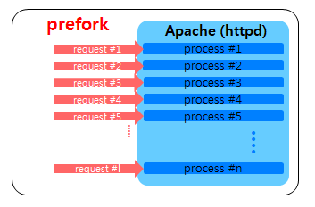
		* Ưu điểm 
			- Bảo mật cao: Tiến trình độc lập, lỗi không lan.
			- Ổn định: Sập tiến trình không ảnh hưởng server.
			- Dễ cấu hình: Thiết lập đơn giản.
			- Tương thích rộng: Hỗ trợ nhiều OS và phần cứng cũ.
			- Dễ gỡ lỗi: Theo dõi lỗi dễ dàng do tiến trình riêng biệt.
		* Nhược điểm lớn nhất chính là việc tạo ra quá nhiều các process sẽ chiếm dụng lượng RAM lớn.
	- Worker MPM 
		* Là một module của Apache sử dụng mô hình đa tiến trình và đa luồng.
		* Có khả năng xử lý nhiều kết nối đồng thời hơn trong khi tiêu thụ ít tài nguyên hơn so với Prefork MPM. Đây là một lợi thế lớn cho các trang web và ứng dụng có lưu lượng truy cập cao.
		* Sử dụng tài nguyên hệ thống hiệu quả hơn bằng cách cho phép mỗi bộ xử lý chạy nhiều luồng.
		* Mục đích chính là cải thiện hiệu suất bằng cách tối ưu hóa tài nguyên máy chủ.
		* Mỗi luồng có thể xử lý một yêu cầu độc lập, cho phép máy chủ phục vụ nhiều người dùng đồng thời hơn.
		* Mô hình này giúp tăng hiệu quả tổng thể của máy chủ, đặc biệt là giảm mức sử dụng bộ nhớ.
		* Là một giải pháp lý tưởng cho các ứng dụng web phục vụ nội dung động và sử dụng kết nối cơ sở dữ liệu.
			- 
		* Ưu điểm 
			- Nhiều kết nối đồng thời: Xử lý nhiều người dùng hơn.
			- Ít tài nguyên: Tiết kiệm RAM.
			- Hiệu suất cao: Phản hồi nhanh hơn.
			- Tối ưu nội dung động: Phù hợp web phức tạp.
			- Khởi động/dừng nhanh: Tiết kiệm thời gian.
		* Nhược điểm 
			- Nếu một thread có vấn đề hoặc là bị crash thì các thread khác trong process cũng có thể bị crash và process sẽ bị crash theo.
			- Các thread có thể sử dụng chung vùng nhớ cho nên có thể gây ảnh hưởng lẫn nhau
	- So sánh Prefork/Worker 
		| Tiêu chí                        | MPM Prefork                                                       | MPM Worker                                                            |
		| ------------------------------- | ----------------------------------------------------------------- | --------------------------------------------------------------------- |
		| Kiểu xử lý                  | Đa tiến trình (mỗi tiến trình xử lý một kết nối)                  | Đa tiến trình và đa luồng (mỗi tiến trình có nhiều luồng xử lý)       |
		| Sử dụng tài nguyên          | Tiêu thụ bộ nhớ cao do mỗi tiến trình độc lập                     | Tiết kiệm bộ nhớ hơn nhờ chia sẻ bộ nhớ giữa các luồng                |
		| Tính ổn định                | Cao, lỗi trong một tiến trình không ảnh hưởng đến tiến trình khác | Thấp hơn, lỗi trong một luồng có thể ảnh hưởng đến tiến trình         |
		| Tương thích mô-đun          | Hỗ trợ tốt cho mô-đun không an toàn với đa luồng như `mod_php`    | Yêu cầu mô-đun phải an toàn với đa luồng                              |
		| Hiệu suất với lưu lượng cao | Kém hơn, vì phải tạo nhiều tiến trình mới cho mỗi kết nối         | Tốt hơn, có thể xử lý nhiều kết nối đồng thời với ít tài nguyên hơn   |
		| Khả năng mở rộng            | Hạn chế, do số lượng tiến trình cố định                           | Cao hơn, có thể tạo thêm luồng khi cần thiết                          |
		| Trường hợp sử dụng          | Trang web có lưu lượng thấp, yêu cầu tính ổn định cao             | Trang web có lưu lượng cao, yêu cầu hiệu suất và khả năng mở rộng tốt |

- Event-driven 
	- Kiến trúc hướng sự kiện (Event-driven architecture - EDA) là một mô hình kiến trúc phần mềm trong đó các thành phần hoặc dịch vụ của hệ thống giao tiếp với nhau chủ yếu thông qua việc sản xuất và tiêu thụ các sự kiện.
	- Các "sự kiện" (event) này có thể là các hành động người dùng, cập nhật dữ liệu, hoặc các thông báo từ các hệ thống khác. EDA giúp tạo ra các hệ thống linh hoạt, mở rộng và dễ tích hợp.
	- EDA dựa trên nguy- Kiến trúc hướng sự kiện bao gồm các nhà sản xuất sự kiện tạo ra luồng sự kiện, các đơn vị tiêu thụ sự kiện lắng nghe các sự kiện này và các kênh sự kiện chuyển sự kiện từ nhà sản xuất đến đơn vị tiêu thụ.ên lý phát hiện và phản hồi các event. Một event có thể là bất cứ điều gì xảy ra trong hệ thống, chẳng hạn như người dùng nhấp chuột, một gói tin đến từ mạng, hoặc một thay đổi trạng thái trong cơ sở dữ liệu. 
	- Các thành phần chính của EDA bao gồm:
		- Event Producers: Các thành phần phát sinh event: Đây là các đối tượng hoặc thành phần trong hệ thống phát sinh ra các event. Ví dụ, một nút bấm trong giao diện người dùng có thể phát sinh event khi người dùng nhấn vào nó.
		- Event Consumers: Các thành phần lắng nghe và xử lý event: Đây là các đối tượng hoặc thành phần lắng nghe các event và thực hiện hành động tương ứng khi event xảy ra. Ví dụ, khi một nút bấm được nhấn, listener có thể thực hiện một hàm xử lý để cập nhật giao diện người dùng.
		- Event Channels: Các kênh truyền event giữa producers và consumers.Đây là trung gian truyền tải event từ producers đến consumers. Nó có thể là một cơ chế đơn giản như một hàm callback hoặc phức tạp hơn như một hệ thống hàng đợi thông điệp.
	- Kiến trúc hướng sự kiện bao gồm các Event Producers tạo ra luồng sự kiện, các Event Consumers lắng nghe các sự kiện này và các Event Channels chuyển sự kiện từ Event Producers đến Event Consumers.
	- EDA có thể sử dụng hai mô hình chính: mô hình publish/subscribe và mô hình event stream.
		* Pub/sub: Một event được đăng ký bởi nhiều Event Consumers. Khi một event được publish, nó gửi event đến từng Event Consumers. Sau khi một event được nhận, nó không thể được publish lại và những Event Consumers mới sẽ không thấy event đó.
			- 
		* Event Stream: Các event được ghi vào log. Các event được sắp xếp theo thứ tự nhất định. Clients không đăng ký vào Event Channels, thay vào đó, một client có thể đọc từ bất kỳ phần nào của channels. Client có trách nhiệm thay đổi vị trí đọc event trong channels. Điều đó có nghĩa là một client có thể tham gia bất cứ lúc nào và có thể phát lại các event.
			- 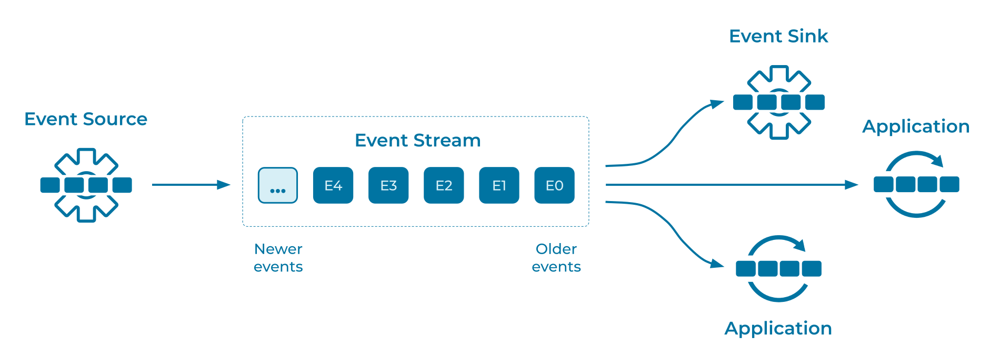
	- Các hình thức xử lí event: Có thể phân ra thành 3 nhóm chính như dưới đây:
		- Xử lí event rời rạc (Discrete event processing): Ví dụ như khi post một bài đăng lên mạng xã hội. Một trong số đặc trưng của việc xử lí event rời rạc đó là sự hiện diện của một event không hề liên quan đến các events khác và hoàn toàn có thể được xử lí độc lập.
		- Event stream processing: Xử lí các event theo luồng, có tính đến thứ tự của các events, khi mà event hiện tại có liên quan đến event trong quá khứ. Một ví dụ tiêu biểu đó là các events thay đổi lên business entity. Các events này sẽ được xử lí theo một thứ tự nhất định, sau đó sẽ lưu business entity data vào trong database. Consumer cũng cần tránh tình trạng đồng thời thay đổi lên cùng một record của database khiến cho dữ liệu không được nhất quán.
		- Complex event processing: Complex event processing (CEP) định danh và đưa ra các event pattern phức tạp dựa trên một chuỗi các event đơn giản. Ta lấy ví dụ về CEP cho việc theo dõi nhiệt độ và khói từ các cảm biến để phát hiện xem có xảy ra hoả hoạn hay không. Dữ liệu về nhiệt độ ở một thời điểm có thể không mang quá nhiều ý nghĩa nhưng với một "cụm nhiệt độ" cũng với tỉ lệ thay đổi nhiệt độ thì ta hoàn toàn có thể phán đoán được rằng liệu có đang xảy ra hoả hoạn hay không.
	-  Phân loại dựa trên cấu trúc liên kết (topology) giữa các component trong hệ thống với nhau, bao gồm 2 mô hình phổ biến:
		- Broker topology: Các thành phần phát ra các sự kiện cho toàn bộ hệ thống (broadcast). Các thành phần khác (Consumer) sẽ tự quyết định hành động dựa trên sự kiện đó hoặc bỏ qua. Không có sự điều phối hoặc quản lý tập trung.
			* Cấu trúc này có độ độc lập rất cao, giúp mang lại khả năng mở rộng, khả năng phản hồi và khả năng chịu lỗi của các thành phần.
			* Không có thành phần nào "sở hữu" hay nhận biết trạng thái của một giao dịch nghiệp vụ nhiều bước, và các hành động được thực hiện không đồng bộ. Do đó, các giao dịch phân tán có rủi ro vì không có cách nào tích hợp để khởi động lại hoặc phát lại.
		- Mediator topology:  Có một trình điều phối sự kiện (event mediator) trung tâm. Trình điều phối này quản lý và kiểm soát luồng sự kiện. Các thành phần chỉ phát ra "lệnh" (commands) đến các kênh được chỉ định (thường là hàng đợi tin nhắn). Trình điều phối sẽ nhận các lệnh này và quyết định xử lý hoặc chuyển tiếp chúng. Trình điều phối duy trì trạng thái, xử lý lỗi và khả năng khởi động lại.
			* Cấu trúc này mang lại khả năng kiểm soát tốt hơn, xử lý lỗi phân tán tốt hơn và tiềm năng đạt được tính nhất quán dữ liệu tốt hơn.
			* Cấu trúc này làm tăng sự phụ thuộc giữa các thành phần, và trình điều phối sự kiện có thể trở thành một nút thắt cổ chai hoặc một vấn đề về độ tin cậy.
	- Lợi ích của EDA
		- Độc lập cao: Producer và Consumer không phụ thuộc lẫn nhau.
		- Dễ mở rộng: Dễ dàng thêm Consumer mới mà không ảnh hưởng hệ thống.
		- Phản hồi nhanh: Xử lý sự kiện tức thì.
		- Linh hoạt & phân tán: Thích nghi tốt với tải thay đổi.
		- Dễ dàng scale: chúng ta có thể dễ dàng phân các events vào các substream khác nhau và xử lí chúng một cách song song cũng như thêm các consumers để có thể kịp thời xử lí số lượng lớn các events.
	- Nhược điểm 
		- Phức tạp trong xử lý luồng sự kiện: Xử lý các luồng sự kiện có thể phức tạp và đòi hỏi kỹ năng cao về quản lý trạng thái, xử lý song song và đồng bộ hóa. Việc đảm bảo tính nhất quán và đúng đắn trong các xử lý sự kiện cũng là một thách thức.
		- Khả năng mở rộng của hệ thống message broker: Việc sử dụng một hệ thống message broker để truyền tải sự kiện có thể tạo ra điểm bottleneck và làm giảm hiệu suất hệ thống nếu hệ thống message broker không được thiết kế để mở rộng tốt.
		- Đảm bảo tính nhất quán dữ liệu: Trong một hệ thống EDA, việc đảm bảo tính nhất quán của dữ liệu giữa các microservices có thể là một vấn đề khó khăn. Điều này đặc biệt đúng khi xảy ra các vấn đề về đồng bộ hóa dữ liệu giữa các bản sao hoặc khi có lỗi xảy ra trong quá trình xử lý sự kiện.
		- Độ trễ (Latency): Xử lý sự kiện trong một hệ thống EDA có thể gây ra độ trễ so với các phương pháp truyền thống, đặc biệt khi sự kiện phải được truyền qua một hệ thống message broker.
- Nginx Approach — Event-Driven
	- Không giống các máy chủ truyền thống tạo một tiến trình hoặc luồng riêng cho mỗi yêu cầu, Nginx hoạt động theo cơ chế khác. Mỗi tiến trình worker (tiến trình làm việc) của Nginx sẽ lắng nghe các sự kiện được tạo ra từ những yêu cầu mới đến.
	- Khi một worker chấp nhận yêu cầu kết nối và bắt đầu xử lý, điểm mấu chốt là: thay vì chặn (blocking) hoặc chờ đợi phản hồi trong quá trình thao tác Mạng (network) và Đĩa (disk) (còn gọi là I/O), worker đó sẽ ngay lập tức chấp nhận một yêu cầu kết nối khác từ hàng chờ, hoặc tiếp tục xử lý các yêu cầu mà quá trình I/O của chúng đã hoàn tất và đang chờ bước thực thi tiếp theo.
	- 

<!-- TOC --><a name="322-moduleplugin"></a>
#### 3.2.2 Module/Plugin
- Các module mở rộng Apache: Chức năng của Server Apache hầu hết được mở rộng nhờ các module. List các [Apache Module](https://httpd.apache.org/docs/2.4/mod/). Một vài module thông dụng của Apache: 
	- mod_rewrite
		- là một module mở rộng của Server Apache HTTP, nếu có nạp và sử dụng module này nó cho phép bạn viết lại Url. Chức năng chính của nó là ánh xạ một địa chỉ URL đến một vị trí file cụ thể của Server, tuy nhiên bạn có thể làm nhiều hơn thế như chuyển hướng, chặn truy cập ... rewrite_module phân tích yêu cầu gửi đến bằng cách sử dụng biểu thức chính quy
		- hoạt động trên toàn bộ đường dẫn URL bao gồm các data được nhập trên URL. Các rewrite rule có thể được định nghĩa trong các file httpd.conf trên hệ thống, file .htaccess trên source. Các rewrite rule có thể dẫn đến truy vấn theo chuỗi, khởi chạy chương trình nội bộ, gửi request ra bên ngoài hệ thống, hoặc gọi các proxy nội bộ.
		- Module này gồm các chỉ thị để bạn sử dụng như RewriteBase, RewriteCond, RewriteRule ... để sử dụng nó trong httpd.conf hoặc trong file .htaccess
		* Nếu chọn viết trong .htaccess, thì các Rewrite có hiệu lực trên thư mục đặt file đó. Khi Apache truy cập đến bất kỳ thư mục con nào thì nó cũng tìm xem trong thư mục đó có file .htaccess không để nạp vào. Viết cách này khá linh hoạt, nhưng đôi khi làm chậm một chút, nếu có thể ở cấu hình VirtualHost tắt hẳn .htaccess bằng chỉ thị AllowOverride None để chỉ viết trong cấu hình Apache httpd.conf
		* Các quy tắc ReWrite viết trong httpd.conf ở các Directory của VirtualHost, kết quả thì cũng tương tự viết trong .htaccess, nó nhanh hơn vì các luật ReWrite Apache không phải tìm vào nạp mỗi khi truy cập, viết xong phải khởi động lại Apache để có hiệu lực
			| Chỉ thị       | Cú pháp                                      | Mô tả                                                                                                                 |
			| ------------- | -------------------------------------------- | --------------------------------------------------------------------------------------------------------------------- |
			| RewriteEngine | `RewriteEngine On` hoặc `Off`                | Bật hoặc tắt chức năng rewrite. Mặc định không bật cho tất cả thư mục, phải khai báo trong từng thư mục muốn sử dụng. |
			|               |                                              | Mỗi thư mục sử dụng Rewrite cần khai báo `RewriteEngine On` ở đầu file `.htaccess`.                                   |
			| RewriteBase   | `RewriteBase URL-path`                       | Thiết lập URL cơ sở (base path) cho các luật rewrite trong thư mục hiện tại.                                          |
			| RewriteRule   | `RewriteRule Pattern Substitution [flags]`   | Định nghĩa luật thay đổi URL. `Pattern` là biểu thức chính quy, `Substitution` là URL thay thế nếu khớp.              |
			|               |                                              | Ví dụ:                                                                                                            |
			|               |                                              | `RewriteRule ^welcome\.html$ /html/index.html [L]`                                                                    |
			|               |                                              | Nếu truy cập `/welcome.html`, Apache sẽ truy cập thực tế `/html/index.html` trên hệ thống.                            |
			|               |                                              | `^welcome\.html$`: Mẫu URL cần khớp (dùng biểu thức chính quy).                                                       |
			|               |                                              | `/html/index.html`: Đường dẫn thay thế nếu khớp.                                                                      |
			|               |                                              | `[L]`: Cờ (flag) báo dừng sau khi áp dụng rule này.                                                                   |
			| RewriteCond   | `RewriteCond TestString CondPattern [flags]` | Áp điều kiện cho `RewriteRule` ngay bên dưới nó. Nếu điều kiện đúng thì `RewriteRule` mới được áp dụng.               |
			|               |                                              | Dùng để kiểm tra URL, phương thức HTTP, biến môi trường, user agent, v.v.                                             |
			|               |                                              | [flags]: Cờ thiết lập cho RewriteCond                                                                             |
			|               |                                              | - `[OR]`: Toán tử “hoặc” để kết nối nhiều điều kiện (mặc định là AND)                                                 |
			|               |                                              | - `[NC]`: Không phân biệt chữ hoa – thường                                                                            |
			|               |                                              | CondPattern: Mẫu là biểu thức chính quy để kiểm tra sự phù hợp với TestString                                     |
			|               |                                              | - `-s`: Kiểm tra TestString là file tồn tại trên đĩa                                                                  |
			|               |                                              | - `-d`: Kiểm tra là thư mục                                                                                           |
			|               |                                              | - `-l`: Kiểm tra là symbolic link                                                                                     |
			|               |                                              | TestString: Chuỗi chứa giá trị cần kiểm tra                                                                       |
			|               |                                              | - Viết dưới dạng `%{TÊN_BIẾN}` như `%{QUERY_STRING}`, `%{REMOTE_ADDR}`, `%{REQUEST_METHOD}`, ...                      |
			|               |                                              | - Biến môi trường: `%{ENV:ten_bien}`                                                                                  |
			|               |                                              | - Header HTTP: `%{HTTP:Header_Name}`                                                                                  |

		- Một số rule rewrite cơ bản
			* Chuyển hướng URL: Sử dụng khi xóa (đổi địa chỉ) một URL trên website, nhưng muốn khi người dùng truy cập vào sẽ tự chuyển sang một trang khác, Chuyển sang một domain mới
				```
				RewriteEngine On
				#Chuyển hướng 1 URL cụ thể
				RewriteEngine  on
				RewriteRule    "^/url-cu\.html$"  "url-moi.html"  [R=301]
				#Chuyển hướng thư mục news sang domain (server mới)
				RewriteRule   "^/docs/(.+)"  "http://new.example.com/docs/$1"  [R,L]
				```
			* Chuyển hướng các yêu cầu không tồn tại về trang chủ
				```
				RewriteCond %{REQUEST_FILENAME} !-f
				RewriteCond %{REQUEST_FILENAME} !-d
				RewriteRule . / [R=301]
				```	
					* RewriteCond %{REQUEST_FILENAME} !-f: Chỉ áp dụng quy tắc nếu yêu cầu không phải là một file tồn tại trên server.
					* RewriteCond %{REQUEST_FILENAME} !-d: Và tiếp tục chỉ áp dụng nếu yêu cầu không phải là một thư mục tồn tại trên server.
					* RewriteRule . / [R=301]: Chuyển hướng vĩnh viễn (301) bất kỳ yêu cầu nào thỏa mãn hai điều kiện trên về trang chủ của website.
- mod_ssl
	- là một module của Apache HTTP Server cung cấp khả năng mã hóa SSL/TLS, cho phép máy chủ Apache hỗ trợ giao thức HTTPS. Module này sử dụng thư viện OpenSSL để thực hiện mã hóa và giải mã dữ liệu, đảm bảo tính bảo mật cho thông tin truyền tải giữa máy chủ và người dùng.
	- Các chỉ thị quan trọng trong mod_ssl
		- SSLENGINE: Bật/Tắt sử dụng module
		- SSLCertificateFile: Định nghĩa đường dẫn đến chứng chỉ SSL.
		- SSLCertificateKeyFile: Định nghĩa đường dẫn đến khóa riêng.
		- SSLCertificateChainFile: Định nghĩa đường dẫn đến chứng chỉ trung gian.
		- SSLCipherSuite: Xác định bộ mã hóa được phép sử dụng.
		- SSLProtocol: Chỉ định các phiên bản giao thức SSL/TLS được hỗ trợ.
		- SSLPassPhraseDialog: Cấu hình cách Apache yêu cầu mật khẩu khi đọc khóa riêng được mã hóa.
	- Module này enable bằng lệnh `sudo a2enmod ssl`
	- Sử dụng Module này để cấu hình SSL/TLS cho apache2 với chứng chỉ được cấp từ các CA như Let's Encrypt
	- Có thể tự sinh chứng chỉ SSL tự ký bằng OpenSSL và sử dụng module này để cấu hình cho Apache (Test)
		* Sinh chứng chỉ 
		```
		sudo openssl req -x509 -nodes -days 365 -newkey rsa:2048 -keyout /etc/ssl/private/apache-selfsigned.key -out /etc/ssl/certs/apache-selfsigned.crt
		```
		* Chỉnh sửa file cấu hình apache 
		```
		sudo nano /etc/apache2/sites-available/default-ssl.conf
		```
		* Thêm các cấu hình SSL 
		```
		SSLEngine on 
		SSLCertificateFile /etc/ssl/certs/apache-selfsigned.crt 
		SSLCertificateKeyFile /etc/ssl/private/apache-selfsigned.key
		```
- mod_security 
	- là module bảo mật của apache2 nó hoạt động bằng cách kiểm tra các yêu cầu được gửi đến máy chủ web theo thời gian thực dựa trên một bộ quy tắc được xác định trước, ngăn chặn các cuộc tấn công ứng dụng web điển hình như XSS và SQL Injection.
	- ban đầu là một mô-đun của Apache và sau đó phát triển thành một tường lửa ứng dụng web hoàn chỉnh.
	- Module này có thể được cài bằng lệnh `sudo apt install libapache2-mod-security2`
	- Enable Module này trong file cấu hình của apache `SecRuleEngine On` 
-  Các module mở rộng Nginx: NGINX được xây dựng từ nhiều mô-đun nhỏ, mỗi mô-đun đảm nhiệm một chức năng riêng. Điều này giúp NGINX nhỏ gọn, nhanh và dễ tùy chỉnh. Một vài module trong nginx: 
	- ngx_http_core_module
		- ngx_http_core_module trong Nginx là mô-đun nền tảng để xử lý HTTP. Nó cung cấp chức năng cốt lõi để xử lý các yêu cầu, bao gồm cấu hình cài đặt máy chủ, định nghĩa các trang lỗi và quản lý dữ liệu yêu cầu và phản hồi. Mô-đun này là cơ bản để Nginx hoạt động như một máy chủ HTTP.
		- Chức năng chính
			* Quản lý Virtual Hosts: Cấu hình nhiều `server` block với các chỉ thị như `listen` và `server_name`.
			* Điều hướng yêu cầu: Xử lý các URI qua `location` và hỗ trợ khớp chính xác, wildcard, và regex.
			* Phục vụ nội dung tĩnh: Dùng `root` và `alias` để chỉ định thư mục chứa tệp tĩnh.
			* Quản lý lỗi và bảo mật: Tùy chỉnh trang lỗi với `error_page`, kiểm soát truy cập và xác thực với `auth_basic`.
			* Cấu hình hiệu suất: Tối ưu hóa hiệu suất với các chỉ thị như `keepalive_timeout`, `sendfile`, và `tcp_nopush`.
			* MIME types và bộ đệm: Xác định loại MIME với `types`, tối ưu bộ đệm với `open_file_cache`.
		- Một vài chỉ thị cấu hình của module 
			* `server { ... }` : Thiết lập cấu hình cho một máy chủ ảo. 
				- Ví dụ 
					```
					server {
					listen      80;
					server_name example.org www.example.org;
					}
					```
			* `listen address:port;`: Đặt địa chỉ và cổng cho IP, hoặc đường dẫn cho một socket UNIX-domain mà máy chủ sẽ chấp nhận các yêu cầu trên đó. Có thể chỉ định cả địa chỉ và cổng, hoặc chỉ địa chỉ hoặc chỉ cổng. Một địa chỉ cũng có thể là một hostname, ví dụ:
				- Ví dụ 
					```
					listen 127.0.0.1:8000;
					listen 127.0.0.1;
					listen 8000;
					listen *:8000;
					listen localhost:8000;
					```
			* `client_max_body_size`: Đặt kích thước tối đa cho phần thân yêu cầu từ client được phép. Nếu kích thước trong một yêu cầu vượt quá giá trị đã cấu hình, lỗi 413 (Request Entity Too Large) sẽ được trả về cho client. 
				- Ví dụ
					```
					client_max_body_size 1m;
					```	
			* `error_page`: Xác định URI (đường dẫn) sẽ hiển thị cho các lỗi được chỉ định. Giá trị URI có thể chứa các biến.
				- Ví dụ 
					```
					error_page 404             /404.html;
					error_page 500 502 503 504 /50x.html;
					error_page 404 =301 http://example.com/notfound.html;
					```
	- ngx_http_access_module
		- là module cho phép giới hạn quyền truy cập đối với các địa chỉ client nhất định. Quyền truy cập cũng có thể được giới hạn theo mật khẩu, kết quả của một subrequest, hoặc theo JWT. Việc giới hạn quyền truy cập đồng thời theo địa chỉ và mật khẩu được kiểm soát bởi chỉ thị satisfy.
		- Module gồm 2 directives cơ bản là `allow`, `deny` để thực hiện cấu hình.
		- Ví dụ: Cấ hình quyền truy cập chỉ được phép cho các mạng IPv4 10.1.1.0/16 và 192.168.1.0/24 (loại trừ địa chỉ 192.168.1.1), và cho mạng IPv6 2001:0db8::/32
			```
			location / {
			deny 192.168.1.1;
			allow 192.168.1.0/24;
			allow 10.1.1.0/16;
			allow 2001:0db8::/32;
			deny all;
			}
			```
	- ngx_http_rewrite_module 
		- Cung cấp các công cụ để thay đổi URL, định tuyến lại yêu cầu (redirect), và điều kiện xử lý dựa trên các biểu thức chính quy (regex).
		- Gồm các chỉ thị break, if, return, rewrite, rewrite_log và set được xử lý theo thứ tự:
			- Các chỉ thị của mô-đun này được chỉ định ở cấp độ máy chủ (server level) được thực thi tuần tự;
			- Lặp đi lặp lại:
				- Một vị trí (location) được tìm kiếm dựa trên URI của yêu cầu;
				- Các chỉ thị của mô-đun này được chỉ định bên trong vị trí tìm thấy sẽ được thực thi tuần tự;
				- Vòng lặp được lặp lại nếu URI của yêu cầu đã được viết lại, nhưng không quá 10 lần.
		- Ví dụ: Sử dụng rewrite để thay đổi đường dẫn và phần mở rộng của tệp, sau đó trả về lỗi 403 cho các yêu cầu không phù hợp
			```
			server {
				...
				rewrite ^(/download/.*)/media/(.*)\..*$ $1/mp3/$2.mp3 last;
				rewrite ^(/download/.*)/audio/(.*)\..*$ $1/mp3/$2.ra last;
				return 403;
				...
			}
			```
	- ngx_http_ssl_module 	
		- Cung cấp sự hỗ trợ cần thiết cho HTTPS. Module này yêu cầu thư viện OpenSSL 
		- Gồm nhiều chỉ thị khác nhau nổi bật cần chú ý:  ssl_certificate, ssl_certificate_key, ssl_protocols phục vụ cấu hình SSL/TLS cơ bản 
		- Ví dụ: Cấu hình Nginx để phục vụ nội dung qua HTTPS, bật mã hóa SSL.
			```
			ssl_protocols TLSv1 TLSv1.1 TLSv1.2 TLSv1.3;
			ssl_ciphers AES128-SHA:AES256-SHA:RC4-SHA:DES-CBC3-SHA:RC4-MD5;
			ssl_certificate /usr/local/nginx/conf/cert.pem;
			ssl_certificate_key /usr/local/nginx/conf/cert.key;
			```
	- ngx_http_proxy_module
		- Cho phép chuyển tiếp các yêu cầu đến một máy chủ khác.
		- Gồm nhiều chỉ thị khác nhau 
			* proxy_pass: Chỉ định URL backend để chuyển tiếp yêu cầu. `proxy_pass http://backend_server;`
			* proxy_set_header: Thiết lập lại các header HTTP khi chuyển tiếp yêu cầu. `proxy_set_header Host $host;`
			* proxy_redirect: Điều chỉnh URL trong header Location và Refresh. `proxy_redirect http://backend/ http://$host/;`
			* proxy_http_version: Xác định phiên bản HTTP khi giao tiếp với backend. `proxy_http_version 1.1;`
			* proxy_cache: Kích hoạt bộ nhớ cache cho các phản hồi từ backend. `proxy_cache my_cache;`
		- Ví dụ cầu hình : Chuyển tiếp các yêu cầu từ client đến một máy chủ backend đang chạy trên localhost:8000. Thiết lập lại các header:
			* Host: Chứa tên miền gốc của yêu cầu.
			* X-Real-IP: Chứa địa chỉ IP thật của client gửi yêu cầu.
			```
			location / {
				proxy_pass http://localhost:8000;
				proxy_set_header Host $host;
				proxy_set_header X-Real-IP $remote_addr;
			}
			```
	- Chi tiết về các module của Nginx tại [Nginx Modules Reference](https://www.f5.com/pdf/reference-guide/nginx-modules-reference.pdf)
<!-- TOC --><a name="4-cu-hình-và-trin-khai-web-server"></a>
## 4. Cấu hình và Triển khai Web Server
<!-- TOC --><a name="41-cu-hình-virtual-host-host-nhiu-website-trên-mt-server"></a>
### 4.1  Cấu hình virtual host (host nhiều website trên một server).
- Virtual Hosts (còn được gọi là Virtual Hosting) là một kỹ thuật trong việc quản lý các trang web trên một máy chủ web duy nhất. Điều này cho phép bạn chạy nhiều trang web khác nhau trên cùng một máy chủ vật lý, mỗi trang web với tên miền riêng, nhưng chúng chia sẻ cùng một địa chỉ IP.
- Phân biệt các loại Virtual Hosts:
	- Name-Based Virtual Host: Đây là phương pháp phổ biến nhất, cho phép nhiều website sử dụng chung một địa chỉ IP. Máy chủ web sẽ dựa vào thông tin trong HTTP Header từ yêu cầu của client để xác định chính xác website cần truy cập. 
	- IP-Based Virtual Host: Đây là phương pháp cơ bản và dễ hiểu nhất trong ba phương pháp quản lý hosting. Mỗi website được gán một địa chỉ IP riêng, giúp máy chủ dễ dàng ánh xạ đúng website tương ứng khi nhận được yêu cầu từ người dùng.
	- Port-Based Virtual Host: Đây là một giải pháp linh hoạt hơn IP-Based, cho phép nhiều website cùng sử dụng một địa chỉ IP hoặc tên miền nhưng được phân biệt thông qua các số Port khác nhau. Mỗi cổng (Port) đại diện cho một website cụ thể. 
- Cách hoạt động cơ bản: Khi một trình duyệt yêu cầu một trang web (ví dụ: www.trangwebcuaban.com), nó sẽ:
	- Phân giải tên miền www.trangwebcuaban.com thành một địa chỉ IP.
	- Gửi yêu cầu HTTP đến địa chỉ IP đó, đồng thời bao gồm tiêu đề Host: www.trangwebcuaban.com.
	- Máy chủ web (Apache, Nginx, v.v.) nhận yêu cầu.
	- Máy chủ kiểm tra tiêu đề Host để xác định trang web nào đang được yêu cầu.
	- Dựa trên cấu hình Virtual Host đã được định nghĩa, máy chủ sẽ phục vụ nội dung từ thư mục gốc (document root) tương ứng với tên miền đó.
- Ưu điểm 
	* Tiết kiệm chi phí: Chia sẻ tài nguyên máy chủ giúp giảm chi phí so với máy chủ riêng.
	* Phù hợp cho cá nhân/SMEs: Lý tưởng cho doanh nghiệp nhỏ hoặc cá nhân không cần đầu tư lớn.
	* Giảm tải traffic: Nếu cấu hình tốt, giúp phân bổ lưu lượng hợp lý, tránh nghẽn tài nguyên.
	* Tận dụng tài nguyên: Tối ưu hiệu quả sử dụng máy chủ, tránh lãng phí.
	* Dễ quản lý: Hỗ trợ các công cụ như cPanel, DirectAdmin để quản lý website thuận tiện.
	* Linh hoạt: Lưu trữ nhiều website, mỗi site có thể dùng tên miền riêng.
	* Khả năng mở rộng: Dễ dàng thêm/xóa website mà không cần thay đổi phần cứng.
	* Quản lý độc lập: Mỗi website có thể có cấu hình riêng, không ảnh hưởng lẫn nhau.
- Nhược điểm 
	* Hiệu năng hạn chế: Tài nguyên chia sẻ nên dễ bị giảm hiệu suất khi một website dùng quá nhiều tài nguyên.
	* Ảnh hưởng lẫn nhau: Nếu một site bị tấn công (như DDoS), các site khác trên cùng server cũng có thể bị ảnh hưởng.
	* Bảo mật thấp hơn: Nhiều website chung môi trường → nguy cơ lây lan khi một site bị xâm nhập.
	* Không phù hợp với ứng dụng nặng: Các hệ thống cần nhiều RAM, CPU hoặc cấu hình đặc biệt thường không hoạt động hiệu quả trên Virtual Hosts.
	* Giới hạn quyền kiểm soát: Không có quyền root, hạn chế khả năng tinh chỉnh hệ thống sâu.
	* Quản lý phức tạp khi mở rộng: Càng nhiều website, việc cập nhật và kiểm tra cấu hình càng rủi ro, dễ sai sót.
	* Ràng buộc tài nguyên: Không tối ưu cho các website có nhu cầu cao về tài nguyên hoặc yêu cầu môi trường độc lập.
- Cấu hình virtual host trên các WebServer phổ biến: Apache2, Nginx, IIS 
- Apache2 : 
	- Các virtual host được quản lý bằng file cấu hình tại `/etc/apache2/sites-available/` mỗi file tương ứng với 1 VirtualHost
	- Apache Virtual Host mặc định sẽ là 000-default.conf và default-ssl.conf tương ứng cho http/https. Cấu hình VirtualHost mới cần dựa vào 2 file này. 
	- Ví dụ: Thực hiện tạo 2 VirtualHost cho 2 domain: domain1.com và domain2.com 
		- Copy file cấu hình mẫu 
		```
		cd /etc/apache2/sites-available/
		cp 000-default.conf domain1.conf
		cp 000-default.conf domain2.conf
		```
		- Thực hiện mở file sửa cấu hình 
		```
		nano /etc/apache2/sites-available/domain1.conf
		nano /etc/apache2/sites-available/domain2.conf
		```
		- Cần chú ý tới các thuộc tính cần chỉnh sửa:
			- ServerName: Tại thuộc tính này bạn chỉ cần sửa lại tên thành Domain mà bạn mong muốn, như ví dụ chúng ta đang thực hiện ở trên là domain1.com
			- ServerAdmin: Ở thuộc tính này bạn nên lựa chọn địa chỉ Email chính của mình để có thể quản lý cho Domain mới tạo này.
			- DocumentRoot: Đây là địa chỉ lưu trữ thư mục trang Web của domain ví dụ  /var/www/domain1.com/public_html.
		- Sau khi đã chỉnh sửa thực hiện enable các site đã cấu hình
		```
		sudo a2ensite domain1.conf
		sudo a2ensite domain2.conf
		```
		- Restart Apache2 để áp dụng cấu hình 
		```
		sudo systemctl restart apache2
		```
- Nginx 
	- Các VirtualHost được quản lý bởi các file Block có đường dẫn `/etc/nginx/sites-available/` mỗi file tương ứng với 1 VirtualHost
	- Mặc định có 1 block file là defautl. Để cấu hình các block mới cần dựa vào file này
	- Ví dụ: Tạo 2 file Block cho 2 domain domain1.com và domain2.com 
		- Copy file cấu hình mẫu 
		```
		sudo cp /etc/nginx/sites-available/default /etc/nginx/sites-available/domain1.com
		sudo cp /etc/nginx/sites-available/default /etc/nginx/sites-available/doamin2.com
		```
		- Thực hiện mở file sửa cấu hình 
		```
		nano /etc/nginx/sites-available/domain1.com
		nano /etc/nginx/sites-available/domain2.com
		```
		- Chú ý các thuộc tính cần chỉnh sửa:
			- server_name: Chỉnh sửa về cho đúng tên miền cần cấu hình. 
			- Trong Location block phần root xác định đường dẫn tới thư mục chứa website và tệp mặc định của web 
		- Sau khi đã chỉnh sửa xong tạo liên kết từ tệp cấu hình trong sites-available đến sites-enabled để kích hoạt Virtual Hostings:
		```
		sudo ln -s /etc/nginx/sites-available/domain1.com /etc/nginx/sites-enabled/
		sudo ln -s /etc/nginx/sites-available/domain2.com /etc/nginx/sites-enabled/
		```
		- Restart Nginx để áp dụng cấu hình 
		```
		systemctl restart nginx 
		```
- IIS 
	- Trên IIS, việc quản lý Virtual Host (hay còn gọi là Website) được thực hiện thông qua giao diện đồ họa của IIS Manager, không giống như Nginx hay Apache dùng các file cấu hình trực tiếp.
	- IIS Manager là công cụ chính để quản lý các Virtual Host (Websites).
	- Ví dụ: Tạo 2 VirtualHost cho 2 domain domain1.com và domain2.com 
		- Thêm website mới trong 
			- Mở IIS Manager: Tìm kiếm "IIS Manager" trong Start Menu.
			- Trong khung Connections bên trái, mở rộng tên máy chủ của bạn.
			- Nhấp chuột phải vào mục "Sites" và chọn "Add Website...".
			- Đối với domain1.com:
				```
				Site name: domain1.com (tên hiển thị trong IIS Manager)
				Physical path: Duyệt đến C:\inetpub\wwwroot\domain1.com
				Binding:
				Type: http
				IP address: Chọn địa chỉ IP của máy chủ (thường là All Unassigned nếu chỉ có một IP).
				Port: 80
				Host name: domain1.com (tên miền chính)
				Nhấp "OK".
				```
			- Đối với domain2.com:	Lặp lại các bước trên.
				```
				Site name: domain2.com
				Physical path: Duyệt đến C:\inetpub\wwwroot\domain2.com
				Binding:
				Type: http
				IP address: Chọn địa chỉ IP của máy chủ.
				Port: 80
				Host name: domain2.com
				Nhấp "OK".
				```
		- IIS tự động áp dụng cấu hình ngay sau khi bạn nhấp "OK" trong IIS Manager; bạn không cần phải "restart" toàn bộ dịch vụ IIS như Nginx.
<!-- TOC --><a name="42-thit-lp-reverse-proxy-load-balancing-ví-d-nginx-làm-proxy-cho-apache"></a>
### 4.2   Thiết lập reverse proxy, load balancing (ví dụ: Nginx làm proxy cho Apache).
<!-- TOC --><a name="421-reverse-proxy"></a>
#### 4.2.1. Reverse proxy
- Reverse Proxy thể hiện đúng như tên gọi của nó về nguyên tắc hoạt động. Đây là một Server trung gian giữa các khách hàng và một hoặc nhiều máy chủ nội bộ. Khi nhận được yêu cầu từ khách hàng, Reverse Proxy sẽ xác định máy chủ nào trong mạng sẽ nhận yêu cầu đó.
- 
- Các lợi ích chính của reverse proxy:
	* Cân bằng tải: Phân phối đều lưu lượng truy cập giữa nhiều máy chủ để tránh quá tải và đảm bảo tính khả dụng.
	* Bảo vệ khỏi tấn công: Giấu địa chỉ IP của máy chủ gốc, làm khó kẻ tấn công thực hiện các cuộc tấn công trực tiếp (như DDoS).
	* Cân bằng tải toàn cầu (GSLB): Điều hướng người dùng đến máy chủ gần nhất về mặt địa lý để giảm thời gian tải.
	* Bộ nhớ đệm (Caching): Lưu trữ tạm thời nội dung để phục vụ các yêu cầu lặp lại nhanh hơn.
	* Mã hóa SSL: Xử lý việc mã hóa/giải mã SSL/TLS, giảm tải cho máy chủ gốc.
- Nginx là một HTTP Server và Reverse Proxy Server. Nó cũng được sử dụng như một TCP/UDP Server.
- Nginx được sử dụng rất phổ biến cho máy chủ HTTP, nó thường được sử dụng để làm Reverse Proxy. Tức là một máy chủ có khả năng điều hướng và che giấu các dịch vụ khác ở bên trong máy chủ.
- Ví dụ cấu hình Nginx làm proxy cho apache2 
	- Sử dụng Nginx làm Reverse proxy chuyển tiếp tới backend apache chạy trên port 8080
	- Chỉnh sửa cấu hình nginx 
	```
	sudo cp /etc/nginx/sites-available/default /etc/nginx/sites-available/apache2-rv
	nano /etc/nginx/sites-available/apache2-rv
	```
	- Trong file cấu hình chỉnh sửa `server_name` về đúng domain cần cấu hình, trong block location thiết lập các option proxy, file cấu hình mẫu cho domain demo1.com
	```
	server {
		listen 80;
		server_name domain1.com www.domain1.com;

		# Serve static files directly with NGINX
		location ~* \.(jpg|jpeg|png|gif|ico|css|js)$ {
			root /var/www/html;
		}

		# Forward other requests to Apache 
		location / {
			proxy_pass http://127.0.0.1:8080;
			proxy_set_header Host $host;
			proxy_set_header X-Real-IP $remote_addr;
			proxy_set_header X-Forwarded-For $proxy_add_x_forwarded_for;
			proxy_set_header X-Forwarded-Proto $scheme;
		}

		error_page 500 502 503 504 /50x.html;
		location = /50x.html {
			root /var/www/html;
		}
	}
	```	
	- Trong đó:
		- proxy_pass http://127.0.0.1:8080;: Chuyển yêu cầu đến Apache đang chạy trên localhost (127.0.0.1) cổng 8080.
		- proxy_set_header Host $host;: Gửi lại tên miền gốc đến Apache.
		- proxy_set_header X-Real-IP $remote_addr;: Chuyển IP thực của người dùng đến Apache.
		- proxy_set_header X-Forwarded-For $proxy_add_x_forwarded_for;: Gửi danh sách các proxy mà yêu cầu đã đi qua.
		- proxy_set_header X-Forwarded-Proto $scheme;: Gửi giao thức ban đầu (http/https) đến Apache.
	- Sau khi đã chỉnh sửa xong tạo liên kết từ tệp cấu hình trong sites-available đến sites-enabled để kích hoạt Virtual Hostings:
	```
	sudo ln -s /etc/nginx/sites-available/apache2-rv /etc/nginx/sites-enabled/
	```
	- Restart Nginx để áp dụng cấu hình 
	```
	systemctl restart nginx 
	```
<!-- TOC --><a name="422-load-balancing"></a>
#### 4.2.2. Load balancing
- Load Balancing (Cân bằng tải) là một thành phần quan trọng của cơ sở hạ tầng mạng, thường được sử dụng để cải thiện hiệu suất và độ tin cậy của các website, ứng dụng, cơ sở dữ liệu và các dịch vụ khác bằng phương pháp phân phối khối lượng công việc cho nhiều máy chủ cùng xử lí.
- 
- Để thể điều phối được request cho server thích hợp, load balancing sử dụng một trong những thuật toán sau:
	- Round Robin: Khi sử dụng thuật toán này, các request sẽ được phân phối tuần tự cho 1 nhóm server.
	- Weighted Round Robin: Dựa trên thuật toán Round Robin, người quản trị mạng sẽ dựa vào khả năng xử lí request của từng server và đánh thứ độ ưu tiên cho các server, request sẽ được gửi tới server theo độ ưu tiên của chúng.
	- Least Connections: Request sẽ được gửi tới server có ít kết nối nhất với client để xử lí.
	- Weighted Least Connections: Request sẽ được gửi tới server có tốc độ phản hồi response cao nhất và ít kết nối nhất.
	- IP Hash: Địa chỉ IP của client sẽ được sử dụng để nhận biết server nào sẽ nhận được request từ người dùng.
- Ví dụ sử dụng Nginx load balancing cho các backend sv1.example.com sv2.example.com sv3.example.com 
	- Chỉnh sửa file cấu hình Nginx 
	```
	sudo nano /etc/nginx/nginx.conf
	```
	- Trong file này cần chú ý cấu hình các block `upstream` và `server`. Ví dụ về cấu hình 
	```
	http {
		upstream myapp1 {
			server sv1.example.com;
			server sv2.example.com;
			server sv3.example.com;
		}

		server {
			listen 80;

			location / {
				proxy_pass http://myapp1;
			}
		}
	}
	```
		- upstream myapp1: Định nghĩa một nhóm các máy chủ backend có thể xử lý các yêu cầu. Trong trường hợp này, đó là sv1.example.com, sv2.example.com, và sv3.example.com.
		- server { listen 80; ... }: Nginx lắng nghe các yêu cầu đến từ client trên cổng 80.
		- location / { proxy_pass http://myapp1; }: Tất cả các yêu cầu đến Nginx sẽ được chuyển tiếp (proxy) đến nhóm máy chủ myapp1. Nginx sẽ tự động chọn một máy chủ từ nhóm đó để xử lý yêu cầu, phân phối tải trọng giữa chúng.
	- Khởi động lại dịch vụ
	```
	systemctl restart nginx
	```
	- Mặc định Nginx sử dụng thuật toán `Round Robin` để sử dụng với các thuật toán khác thực hiện cấu hình trong block `upstream` ví dụ 
	```
	    upstream myapp1 {
        least_conn;
        server sv1.example.com;
        server sv2.example.com;
        server sv3.example.com;
    }
	```
	- Cấu hình weight chỉnh sửa trong block `upstream` ví dụ:
	```
	    upstream myapp1 {
        server sv1.example.com weight=3;
        server sv2.example.com;
        server sv3.example.com;
    }
	```
<!-- TOC --><a name="43-cu-hình-caching-gim-ti-server"></a>
### 4.3   Cấu hình caching (giảm tải server).
- Cache là một bộ nhớ đệm dùng để lưu trữ tạm thời dữ liệu. Khi một trang web được tải lên, nó sẽ lưu trữ các dữ liệu đó vào cache để khi người dùng truy cập lại trang web đó, trang web sẽ được tải nhanh hơn.
- Caching là một phương pháp cho phép lưu trữ các thông tin về trang web trong bộ nhớ tạm thời để tránh phải lấy dữ liệu từ máy chủ quá nhiều lần, giảm tải cho máy chủ và tăng tốc độ tải trang web.
- Nginx là một trong những máy chủ web phổ biến nhất, với khả năng cấu hình cache hiệu quả 
- Ví dụ cấu hình với Nginx 
	- Để cấu hình caching cần tạo thư mục cache trên máy chủ và đảm bảo nginx có quyền ghi vào thư mục này 
	- Chỉnh sửa cấu hình trong `/etc/nginx/nginx.conf` sử dụng cache 
		```
		proxy_cache_path /path/to/cache levels=1:2 keys_zone=my_cache:10m inactive=60m;
		proxy_cache_key "$scheme$request_method$host$request_uri";
		proxy_cache_valid 200 60m;
		```
		- Trong đó:
			- /path/to/cache là đường dẫn đến thư mục cache mà bạn đã tạo ở bước trước đó.
			- my_cache là tên của khu vực cache mà bạn muốn sử dụng. Bạn có thể đặt bất kỳ tên nào tùy ý.
			- levels=1:2 xác định cấu trúc của thư mục cache. Ở đây, chúng ta đang sử dụng một cấu trúc 2 cấp, với cấp đầu tiên là tên khối và cấp thứ hai là các tập tin cache của khối đó.
			- inactive=60m xác định thời gian tối đa mà một bản sao của một tài nguyên được giữ trong cache trước khi bị xóa.
			- proxy_cache_valid xác định thời gian tối đa mà một bản sao của một tài nguyên được giữ trong cache trước khi nó được coi là không còn hợp lệ và bị xóa khỏi cache.
	- Cấu hình chỉ định cho Nginx sử dụng cache cho các truy vấn
		```
		proxy_cache my_cache;
		proxy_cache_bypass $http_pragma;
		proxy_cache_revalidate on;
		```
		- Trong đó:
			- my_cache là tên của khu vực cache mà bạn đã định nghĩa ở bước trước đó.
			- $http_pragma sẽ bỏ qua cache và tải trực tiếp từ máy chủ khi nó bị đặt thành “no-cache”.
	- Khởi động lại dịch vụ
	```
	systemctl restart nginx
	```
<!-- TOC --><a name="44-ti-u-tc-nén-d-liu-cdn-http2"></a>
### 4.4   Tối ưu tốc độ (nén dữ liệu, CDN, HTTP/2).
<!-- TOC --><a name="441-nén-d-liu"></a>
#### 4.4.1. Nén dữ liệu 
- HTTP Compression là một kĩ thuật có thể tích hợp vào web servers và web clients để cải thiện tốc độ truyền và sử dụng băng thông bằng cách nén các file ở server nhằm giảm dung lượng file, giúp quá trình gửi xuống client trở lên nhanh hơn.
- Cách thức hoạt động: Quá trình nén HTTP hoạt động dựa trên cơ chế thỏa thuận giữa trình duyệt (client) và máy chủ (server):
	- Trình duyệt gửi yêu cầu Accept-Encoding: Khi trình duyệt gửi yêu cầu HTTP, nó bao gồm một tiêu đề Accept-Encoding để thông báo cho máy chủ biết những thuật toán nén mà nó hỗ trợ (ví dụ: Accept-Encoding: gzip, deflate, br).
	- Máy chủ nén và gửi phản hồi Content-Encoding: Nếu máy chủ hỗ trợ một trong các thuật toán nén đó và có thể nén tài nguyên, nó sẽ nén dữ liệu và gửi phản hồi kèm theo tiêu đề Content-Encoding (ví dụ: Content-Encoding: gzip) để thông báo cho trình duyệt biết tài nguyên đã được nén bằng thuật toán nào.
	- Trình duyệt giải nén: Trình duyệt nhận phản hồi, giải nén dữ liệu và hiển thị nội dung cho người dùng.
- Các thuật toán nén phổ biến: Có ba thuật toán nén chính thường được sử dụng với HTTP:
	- Gzip (GNU zip):
		- Là thuật toán nén phổ biến nhất và được hỗ trợ rộng rãi nhất.
		- Thường được sử dụng để nén các tệp văn bản như HTML, CSS, JavaScript và các tệp JSON.
		- Hiệu quả trong việc giảm kích thước tệp, giúp giảm đáng kể thời gian tải trang.
	- Deflate:
		- Trong thực tế, Deflate thường được triển khai dưới dạng một luồng dữ liệu zlib được nén bằng thuật toán DEFLATE.
		- Hiệu quả nén thường tương đương hoặc kém hơn một chút so với Gzip.
	- Brotli (br):
		- Một thuật toán nén tương đối mới được phát triển bởi Google.
		- Thường cung cấp tỷ lệ nén tốt hơn đáng kể so với Gzip và Deflate, đặc biệt với các tệp văn bản.
		- Cần hỗ trợ từ cả máy chủ và trình duyệt (hầu hết các trình duyệt hiện đại đều đã hỗ trợ Brotli).
- Nén dữ liệu giúp:
	- Tăng tốc độ tải trang: Dữ liệu nhỏ hơn được truyền nhanh hơn, giúp website hiển thị nhanh chóng.
	- Tiết kiệm băng thông: Giảm lượng dữ liệu phải truyền tải qua mạng, có lợi cho cả người dùng (giảm tiêu thụ dữ liệu) và nhà cung cấp dịch vụ (giảm chi phí băng thông).
	- Cải thiện trải nghiệm người dùng: Người dùng ít phải chờ đợi hơn, dẫn đến sự hài lòng cao hơn.
	- Tăng điểm số SEO: Các công cụ tìm kiếm ưu tiên các trang web có tốc độ tải nhanh.
- Ví dụ 
	- Cấu hình nén gzip trên Nginx chỉnh sửa file cấu hình enable gzip `/etc/nginx/nginx.conf`
		```
		gzip on;
		gzip_types text/plain text/html /text/css text/javascript application/xml application/javascript;    
		gzip_min_length 500;
		```
		- gzip on;: Bật tính năng nén Gzip.
		- gzip_types text/plain text/html /text/css text/javascript application/xml application/javascript;: Chỉ định các loại tệp mà Nginx sẽ nén (thường là tệp văn bản như HTML, CSS, JavaScript). Lưu ý: /text/css có thể là lỗi đánh máy, thường là text/css.
		- gzip_min_length 500;: Chỉ nén các tệp có kích thước từ 500 byte trở lên để tối ưu hiệu suất.
	- Cấu hình bật nén Gzip trong apache2, bạn cần thêm cấu hình sau vào tệp .htaccess hoặc tệp cấu hình máy chủ của mình:
		```
		<IfModule mod_deflate.c>
			# Enable Gzip compression for specific file types
			AddOutputFilterByType DEFLATE text/html text/plain text/xml text/css text/javascript application/javascript
		</IfModule>
		```
			- <IfModule mod_deflate.c>: Đảm bảo rằng cấu hình chỉ hoạt động nếu module mod_deflate được bật.
			- AddOutputFilterByType DEFLATE ...: Chỉ thị chính yêu cầu Apache nén (DEFLATE) các tệp có định dạng như HTML, văn bản thuần túy, XML, CSS và JavaScript trước khi gửi tới trình duyệt.
	- Trong IIS, nén được bật thông qua IIS Manager:
		- Mở IIS Manager.
		- Chọn máy chủ hoặc website, sau đó điều hướng đến Compression (Nén).
		- Bật Static (Tĩnh) và Dynamic Content Compression (Nén nội dung động) bằng cách đánh dấu vào các ô tương ứng.
		
<!-- TOC --><a name="442-cdn"></a>
#### 4.4.2 CDN
- Content Delivery Network là mạng lưới máy chủ lưu trữ bản sao của các nội dung tĩnh bên trong website và phân phối đến các máy chủ PoP (Points of Presence).
- Thông qua CDN, bản sao nội dung trên server gần nhất sẽ được trả về cho người dùng khi họ truy cập website.
- 
- Một mạng phân phối nội dung (CDN) hoạt động dựa trên ba loại máy chủ chính:
	- Máy chủ gốc (Origin servers): Chứa phiên bản gốc của nội dung, là nguồn dữ liệu chính. Mọi thay đổi đều được thực hiện tại đây.
	- Máy chủ biên (Edge servers): Đặt ở nhiều vị trí địa lý (PoPs), lưu trữ bản sao nội dung từ máy chủ gốc. Chúng phục vụ nội dung cho người dùng gần nhất, và yêu cầu cập nhật từ máy chủ gốc khi cần.
	- Máy chủ DNS (DNS servers): Theo dõi và cung cấp địa chỉ IP cho cả máy chủ gốc và máy chủ biên, giúp client được chuyển hướng đến máy chủ biên gần nhất để tải nội dung nhanh hơn.
- CDN thực hiện hai chức năng chính để tối ưu hóa trải nghiệm người dùng: 
	- Giảm độ trễ: CDN giảm khoảng cách vật lý mà nội dung cần di chuyển, phục vụ dữ liệu từ máy chủ gần người dùng nhất để tải trang nhanh hơn.
	- Cân bằng tải: CDN phân phối lưu lượng truy cập giữa nhiều máy chủ, tránh tình trạng quá tải và đảm bảo nội dung luôn sẵn sàng, ổn định ngay cả khi có lượng truy cập cao.
- Các loại CDN
	- CDN Công cộng (Public CDNs): Mạng lưới máy chủ toàn cầu, cung cấp nội dung tĩnh (ảnh, video) cho mọi người dùng trực tuyến. Ví dụ: Cloudflare, Akamai.
	- CDN Riêng tư (Private CDNs): CDN do một công ty/tổ chức sử dụng riêng, phân phối nội dung cho người dùng hoặc khách hàng nội bộ. Ví dụ: Google Cloud CDN (dùng nội bộ), Netflix Open Connect.
	- CDN Ngang hàng (P2P CDNs): Sử dụng công nghệ peer-to-peer để phân phối nội dung trực tiếp giữa các người dùng, giảm phụ thuộc vào máy chủ trung tâm. Ví dụ: BitTorrent.
	- CDN Kết hợp (Hybrid CDNs): Kết hợp giữa CDN công cộng và riêng tư, tối ưu phân phối dựa trên chi phí, hiệu suất, bảo mật. Ví dụ: Microsoft Azure CDN.
	- CDN Đẩy (Push CDNs): Nội dung được tải lên trước các máy chủ CDN. Phù hợp cho tệp lớn, ít cập nhật. Ví dụ: KeyCDN.
	- CDN Kéo (Pull CDNs): Nội dung được yêu cầu (kéo) từ máy chủ CDN khi cần. Hiệu quả cho nội dung cập nhật thường xuyên, động. Ví dụ: Amazon CloudFront, Cloudflare.
- Quy trình từng bước hoạt động của CDN 
- 
	- Người dùng gửi yêu cầu: Một người dùng gửi yêu cầu truy cập nội dung (ví dụ: một hình ảnh) từ một trang web.
	- CDN định vị và định tuyến: CDN xác định vị trí của người dùng và chuyển hướng yêu cầu đến máy chủ biên (edge server) gần nhất.
	- Kiểm tra bộ nhớ đệm (cache):
		- Nếu nội dung đã được lưu trong bộ nhớ đệm tại máy chủ biên, nó sẽ được gửi trực tiếp đến người dùng.
		- Nếu nội dung chưa có trong bộ nhớ đệm, máy chủ biên sẽ truy xuất nội dung đó từ máy chủ gốc (origin server), lưu vào bộ nhớ đệm cục bộ, rồi gửi đến người dùng.
	- Lưu trữ để sử dụng sau: Nội dung đã được lưu vào bộ nhớ đệm tại máy chủ biên sẽ được giữ lại cho các yêu cầu tiếp theo, tối ưu hóa hiệu suất và giảm độ trễ.
- Lợi ích của CDN
	- Giảm thời gian tải trang: Phục vụ nội dung từ máy chủ gần người dùng nhất, giúp tải trang nhanh hơn.
	- Giảm chi phí băng thông: Lưu trữ và phân phối nội dung, giảm tải cho máy chủ gốc và tiết kiệm chi phí.
	- Tăng khả năng cung cấp nội dung: Xử lý lượng truy cập lớn và đảm bảo dịch vụ không gián đoạn ngay cả khi có lỗi máy chủ.
	- Cải thiện bảo mật website: Phân tán lưu lượng tấn công DDoS, bảo vệ máy chủ gốc.
- Thách thức khi dùng CDN
	- Triển khai phức tạp: Khó khăn trong việc xác định nguồn nội dung và phân phối tới nhiều hệ thống lưu trữ, dễ gặp lỗi cấu hình ban đầu.
	- Chênh lệch nội dung khu vực: Đôi khi nội dung không đồng nhất giữa các máy chủ CDN ở các khu vực khác nhau.
	- Quản lý phiên bản và bộ đệm (cache): Việc cập nhật nội dung tĩnh và triển khai phiên bản mới có thể rắc rối.
	- Kiểm thử: Đảm bảo CDN hoạt động đúng như mong đợi đòi hỏi quá trình kiểm thử kỹ lưỡng.
	- Bảo mật: Bảo vệ nội dung khỏi truy cập trái phép hoặc giả mạo khi dùng CDN vẫn là một thách thức.
	- Khả năng phục hồi: Duy trì tính sẵn sàng và ổn định cao khi có sự cố mạng hoặc hạ tầng.
- Các nhà cung cấp CDN:
	- Cloudflare: Phổ biến, có cả gói miễn phí và trả phí, nổi tiếng về bảo mật và hiệu suất.
	- Akamai: Một trong những nhà cung cấp CDN lớn và lâu đời nhất, phục vụ các doanh nghiệp lớn.
	- Amazon CloudFront: Dịch vụ CDN của AWS, tích hợp tốt với các dịch vụ AWS khác.
	- Google Cloud CDN: Tương tự CloudFront, dịch vụ CDN của Google Cloud.
<!-- TOC --><a name="443-http2"></a>
#### 4.4.3 HTTP/2 
- HTTP/2 là phiên bản lớn thứ hai của HTTP – giao thức mạng cấp ứng dụng quy định cách nội dung được truyền tải qua internet.
- Ra mắt vào năm 2015, HTTP/2 thay thế HTTP/1.1 với mục tiêu chính là tăng tốc độ phân phối nội dung.
- Tính năng chính giúp HTTP/2 tăng tốc là Stream Multiplexing: tạo một kết nối duy nhất cho mọi loại dữ liệu và truyền dữ liệu song song.
- Ngoài ra, HTTP/2 còn tăng tốc hơn nữa nhờ:
	- Nén tiêu đề (Header Compression).
	- Ưu tiên luồng (Stream Prioritization).
	- Sử dụng tính năng Server Push.
- Khác với HTTP/1.1, HTTP/2 là giao thức nhị phân, điều này cũng giúp nó hiệu quả hơn.
- Cấu hình enable HTTP/2 trên các webserver phổ biến: Nginx Apache IIS 
- Nginx: 
	- Để bật HTTP/2 trong Nginx, chúng ta cần thêm tham số http2 vào chỉ thị listen trong cấu hình virtual host: Ví dụ file cấu hình mẫu: 
	```
	listen 443 ssl http2;
	```
	```
	server {
	  listen 443 ssl http2;
	  listen [::]:443 ssl http2;

	  server_name example.com;
	  root /path/to/public;

	  ssl_certificate /path/to/certificate.crt;
	  ssl_certificate_key /path/to/private.key;

	  ssl_protocols TLSv1.2;

	}
	```
	- Reload Nginx để apply 
	```
	sudo systemctl reload nginx.service
	```
- Apache2 
	- Disable mpm_prefork và Enable MPM_EVENT trong Apache2 
	```
	sudo a2dismod mpm_prefork
	sudo a2enmod mpm_event
	sudo systemctl restart apache2
	```
	- Enable Module HTTP2
	```
	sudo a2enmod http2
	```
	- Sửa cấu hình virtual host thêm thông số và ngay dưới phần thẻ `<VirtualHost *:443>`
	```
	Protocols h2 http/1.1
	H2Direct on
	```
	```
	  <VirtualHost _default_:443>
		Protocols h2 h2c http/1.1
		H2Direct on
	  </VirtualHost>
	```
	- Reload Apache để apply 
	```
	sudo systemctl restart apache2
	```
- IIS: Mặc định HTTP/2 sẽ được enable khi enable HTTPS và cấu hình chứng chỉ SSL cho website 
	
<!-- TOC --><a name="45-tuning-thông-s-max-connections-keep-alive-worker-processes"></a>
### 4.5 Tuning thông số: Max connections, keep-alive, worker processes.
- Tuning thông số nhằm để tối ưu hóa hiệu suất cho Webserver. Tăng khả năng phục vụ request, giảm độ trễ, tăng tính ổn định, tối ưu sử dụng tài nguyên (CPU, RAM).
- Không có "thông số vàng" áp dụng cho mọi trường hợp. Cần thử nghiệm, theo dõi (monitoring) và điều chỉnh lặp đi lặp lại.

<!-- TOC --><a name="451-max-connections"></a>
#### 4.5.1 Max Connections
- Đây là giới hạn số lượng kết nối đồng thời mà một webserver có thể xử lý tại một thời điểm. Khi đạt đến giới hạn này, các yêu cầu mới có thể bị từ chối hoặc phải xếp hàng chờ, dẫn đến trải nghiệm người dùng kém.
- Tác động:
	- Quá thấp: Khi lưu lượng truy cập cao, server dễ bị từ chối kết nối (Connection refused), người dùng không thể truy cập trang.
	- Quá cao: Có thể gây quá tải RAM (mỗi kết nối/tiến trình/luồng tiêu tốn RAM), dẫn đến việc sử dụng ổ cứng làm RAM ảo (swapping), làm chậm server nghiêm trọng hoặc thậm chí gây sập.
- Cách tối ưu:
	- Ước tính tài nguyên: Tính toán lượng RAM mà mỗi kết nối/tiến trình tiêu thụ và so sánh với tổng RAM khả dụng của server. Luôn để lại một phần RAM trống cho hệ điều hành và các dịch vụ khác.
	- Giám sát: Sử dụng các công cụ giám sát (như htop, free -m trên Linux) để theo dõi mức tiêu thụ RAM và CPU trong giờ cao điểm.
	- Bắt đầu thận trọng: Đặt một giá trị an toàn, sau đó tăng dần và theo dõi phản ứng của server.
- Ví dụ tuning max connections 
	- Apache2 : 
		- Chỉnh sửa file cấu hinh `/etc/apache2/mods-available/mpm-prefolk.conf`
		```
		nano /etc/apache2/mods-available/mpm-prefolk.conf
		```
		- Cấu hình các thông số 
			```
			<IfModule mpm_prefork_module>
					StartServers               5
					MinSpareServers            5
					MaxSpareServers           10
					MaxRequestWorkers        150
					MaxConnectionsPerChild     0
			</IfModule>
			```
			- StartServers 5: Khởi động 5 tiến trình Apache khi server bật.
			- MinSpareServers 5: Duy trì ít nhất 5 tiến trình "rảnh rỗi" để xử lý yêu cầu mới nhanh chóng.
			- MaxSpareServers 10: Giới hạn tối đa 10 tiến trình "rảnh rỗi".
			- MaxRequestWorkers 150: Tổng số tiến trình tối đa mà Apache có thể tạo để xử lý yêu cầu đồng thời (giới hạn quan trọng nhất).
			- MaxConnectionsPerChild 0: Mỗi tiến trình con xử lý không giới hạn số yêu cầu trước khi được khởi tạo lại.
		- Restart để apply cấu hình 
		```
		systemctl restart apache2 
		```
	- Nginx :
		- Chỉnh sửa file cấu hình 
		```
		sudo nano /etc/nginx/nginx.conf
		```
		- Tuning thông số worker_connections đây chính là thông số cấu hình số kết nối đồng thời trong Nginx
		```
		worker_connections 10240;
		```
		- Reload Nginx để apply 
		```
		sudo systemctl reload nginx.service
		```
	- IIS: 
		- Trong IIS tại tab Connections chọn Sites cần cấu hình, Click chọn `Set Web Site Defaults... ` trong tab `Action` bên phải 
		- Tại đây điều chỉnh thông số `maxConnections` thiết lập này chỉ định số lượng kết nối tối đa cho một trang web. 
<!-- TOC --><a name="452-keep-alive"></a>
#### 4.5.2  Keep-alive
- Keep-Alive là một tính năng của máy chủ web cho phép phân nhánh các yêu cầu HTTP thông qua một kết nối TCP duy nhất. Điều này có nghĩa là thay vì mở một luồng mới cho mỗi yêu cầu, máy chủ web sẽ gửi chúng qua một luồng duy nhất, giúp tăng đáng kể thời gian phân phối và cải thiện tốc độ tải của trang web.
- 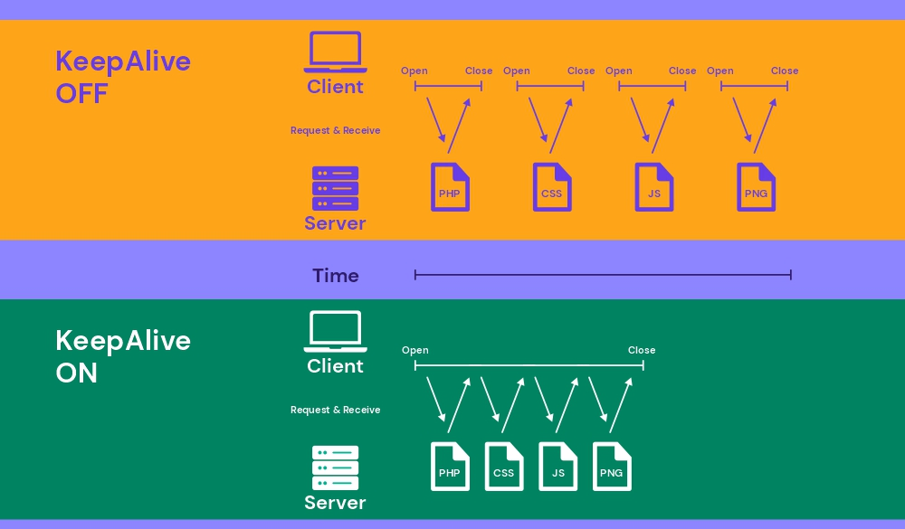
- Theo mặc định, các kết nối HTTP đóng sau mỗi yêu cầu, buộc trình duyệt phải tạo kết nối mới cho từng tệp (ảnh, JS, CSS), làm tăng thời gian tải trang và gây ra trải nghiệm kém.
- Để khắc phục, cần enable Keep-Alive. Khi bật, client có thể tải toàn bộ nội dung (JavaScript, CSS, hình ảnh, video) qua một kết nối TCP duy nhất, thay vì tạo nhiều yêu cầu riêng biệt, giúp tăng tốc độ tải trang đáng kể.
- Các lợi ích của Keep-Alive:
	- Tiết kiệm tài nguyên mạng: Việc sử dụng một kết nối duy nhất cho mỗi client sẽ ít gây tốn kém tài nguyên mạng hơn.
	- Giảm tắc nghẽn mạng: Giảm số lượng kết nối TCP giữa máy chủ và client có thể dẫn đến giảm tắc nghẽn mạng.
	- Giảm độ trễ: Giảm số lần bắt tay ba bước (three-way handshakes) có thể cải thiện độ trễ của trang web. Điều này đặc biệt đúng với các kết nối SSL/TLS, vốn yêu cầu thêm các vòng truyền tải để mã hóa và xác minh kết nối.
- Ví dụ cấu hình keep-alive 
	- Apache 
		- Mở file cấu hình, chỉnh sửa thông số 
		```
		sudo nano /etc/apache2/apache2.conf
		```
		- Cấu hình các thông số Keep-Alive trong Apache như sau:
			- KeepAlive On: Bật tính năng Keep-Alive để cho phép nhiều yêu cầu trên một kết nối duy nhất.
			- MaxKeepAliveRequests: Đặt số lượng yêu cầu tối đa trên một kết nối Keep-Alive. Mặc định là 100, có thể tăng tùy theo số lượng người dùng truy cập web. Tránh đặt 0 (không giới hạn).
			- KeepAliveTimeout: Thời gian để mở một kết nối keepalive. 
		- Reload Apache để apply 
			```
			sudo systemctl restart apache2
			```
	- Nginx 
		- Cấu hình keep-alive trong file 
		```
		sudo nano /etc/nginx/nginx.conf
		```
		- Enable Keepalive Connections cho Client: 
			```
			http {
				  keepalive_timeout 60s;
				  keepalive_requests 1000;
			}
			```
			- keepalive_timeout 60s;: Giữ kết nối mở trong 60 giây nếu không có yêu cầu mới.
			- keepalive_requests 1000;: Cho phép 1000 yêu cầu qua cùng một kết nối trước khi đóng.
		- Enable Keepalive Connections cho Upstream 
			```
			upstream Demo_upstream {
				keepalive 10;
			}
			```
			- keepalive 10; kết nối duy trì trong 10s
		- Reload Nginx để apply 
			```
			sudo systemctl reload nginx.service
			```
	- IIS
		- Trong IIS Manager tại tab Connections chọn sites cần cấu hình. Tại Home pane chọn `HTTP Response Headers`
		- Trong tab Actions chọn Set Common Headers.... Tích chọn enable HTTP keep-alives và chọn OK 
		- Ngoài ra có thể enable bằng lệnh `appcmd set config /section:httpProtocol /allowKeepAlive:true`
<!-- TOC --><a name="453-worker-processes"></a>
####  4.5.3  Worker processes
- NGINX có thể chạy nhiều tiến trình worker, mỗi tiến trình có khả năng xử lý số lượng lớn các kết nối đồng thời. Bạn có thể kiếm soát số lượng tiến trình worker và cách chúng xử lý các kết nối:
	- worker_processes: Số lượng tiến trình worker (mặc định là 1). Trong hấu hết các trường hợp, việc chạy 1 tiến trình trên mỗi lõi CPU đảm bảo hệ thống hoạt động tốt. Nhưng đôi khi bạn muốn tăng số lượng này, chẳng hạn như khi các tiến trình worker phải thực hiện nhiều đĩa I/O.
	- worker_connections: Đây là số lượng kết nối tối đa mà woker có thể đồng thời xử lý. Mặc ddingj là 512, nhưng hầy hết các hệ thống có đủ tài nguyên để hỗ trợ số lượng lớn hơn. Cài đặt tùy thuộc vào kích thước server và lượng truy cập thực tế.
	- Chỉnh sửa các thông số này trong `/etc/nginx/nginx.conf` 
- Với Apache, việc cấu hình worker processes phụ thuộc vào Multi-Processing Module (MPM) mà bạn đang sử dụng.
	- Cấu hình các thông số liên quan của Apache tại `/etc/apache2/mods-available/` `prefork.conf` hoặc `worker.conf`
- Với IIS thực hiện thay đổi `Maximum Worker Processes` tại phần `Advanced settings` trong panel `Application Pools`
	
<!-- TOC --><a name="5-bo-mt-web-server"></a>
## 5. Bảo mật Web Server
<!-- TOC --><a name="51-phòng-chng-ddos-brute-force"></a>
### 5.1 Phòng chống DDoS, brute force.	
- Tấn công DoS nhằm làm ngừng hoạt động trang web hoặc máy chủ bằng cách làm quá tải nó với lưu lượng truy cập rác từ một nguồn duy nhất. Mục tiêu là khiến dịch vụ không thể truy cập được cho người dùng hợp lệ.
- Tấn công DDoS tương tự DoS nhưng sử dụng nhiều nguồn (thiết bị hoặc botnet) để làm quá tải máy chủ. 
- Tấn công brute-force là kiểu đoán mật khẩu hoặc thông tin đăng nhập bằng cách thử mọi kết hợp có thể.
- Một số chiến lược hiệu quả chống lại các cuộc tấn công DDOS:
	+ Cấu hình các bộ lọc block những traffic từ nguồn lạ 
	+ Sử dụng CDN 
	+ Sử dụng các tường lửa ứng dụng web WAF như mod-security
	+ Cấu hình hệ thống loadbalancing
	+ Giám sát hệ thống đặt các alert khi lưu lượng tăng bất thường nhằm kịp thời ứng phó.
- Một số chiến lược hiệu quả chống lại các cuộc tấn công Brute Force: 
	+ Sử dụng tường lửa: Windows Firewall nếu triển khai trên IIS, CSF Firewall, ...
	+ Sử dụng mật khẩu mạnh >8 ký tự và có sự kết hợp giữa chữ, số, ký tự đặc biệt.
	+ Giám sát hệ thống: Ví dụ đặt ngưỡng cảnh  báo khi có sự gia tăng bất thường sự kiện đăng ngập không rõ ràng để phát hiện và xử lý kịp thời. 
	+ Thiết lập xác minh 2 bước: Đối với các webserver có các dịch vụ tài khoản triển khai xác minh 2 bước, bắt buộc cần có mã xác minh lớp thứ 2 mới cho phép đăng nhập.
	+ Sử dụng captcha: Captcha là những câu hỏi bảo mật giúp xác minh yếu tố con người. Captcha giúp chặn được một số lượng các request ảo từ đó giúp ngăn chặn tấn công.
	+ Thiết lập các chính sách giới hạn đăng nhập: Khoá người dùng không cho đăng nhập sau một vài lần đăng nhập không thành công.
<!-- TOC --><a name="52-cu-hình-firewall-iptables-cloudflare"></a>
### 5.2 Cấu hình firewall (iptables, Cloudflare).
<!-- TOC --><a name="521-iptables"></a>
#### 5.2.1 iptables 
- Cấu hình iptables bảo mật cho máy chủ web thường sẽ chặn tất cả lưu lượng truy cập đến ngoại trừ các dịch vụ cần thiết như HTTP, HTTPS và SSH. Cho phép các kết nối đã được thiết lập và giới hạn lưu lượng truy cập đi.
- Các rules và policy iptables 
	- Thiết lập chính sách mặc định DROP INPUT và FORWARD, ACCEPT cho OUTPUT 
	```
	iptables -P INPUT DROP
	iptables -P FORWARD DROP
	iptables -P OUTPUT ACCEPT
	```
	- Chỉ cho phép các kết nối cần thiết SSH, HTTP, HTTPS 
	```
	iptables -A INPUT -i lo -j ACCEPT
	iptables -A INPUT -m conntrack --ctstate ESTABLISHED,RELATED -j ACCEPT
	iptables -A INPUT -p tcp --dport 22 -j ACCEPT
	iptables -A INPUT -p tcp -m multiport --dports 80,443 -j ACCEPT
	```
	- Lưu cấu hình 
	```
	iptables-persistent
	```
<!-- TOC --><a name="522-cloudflare"></a>
#### 5.2.2 Cloudflare
- Enable SSL/TLS : Cloudflare cung cấp miễn phí chứng chỉ SSL/TLS cấu hình tại tab SSL/TLS ở Dashboard quản lý tên miền.
- 
- Under Attack Mode: Chế độ khẩn cấp ngăn chặn DDos. Enable ngay tại Dashboard mặc định của Cloudflare. Ở chế độ này mọi client truy cập qua tên miền đều sẽ được đưa tới trang kiểm tra mất khoảng 5s mới tiếp tục xử lý tới webserver 
- 
- Cloudflare hỗ trợ các rules để lọc truy cập nằm trong phần Security. Tại đây có thể tuỳ chỉnh thêm các rules như: Chặn truy cập theo quốc gia, Bật xác nhận captcha, ...
	- Chặn truy cập theo quốc gia: Giới hạn chỉ cho phép truy cập từ IP VietNam. Cấu hình tại: Security -> Rules.
	- 
	- Bật xác nhận Capcha trong TH bị tấn công từ IP trong nước enable challenge để lọc người dùng/botnet 
	- 

<!-- TOC --><a name="53-hardening-server-tt-dch-v-không-cn-thit-cp-nht-bo-mt"></a>
### 5.3 Hardening server (tắt dịch vụ không cần thiết, cập nhật bảo mật).
- Tăng cường bảo mật máy chủ (Server hardening) là một quá trình gia cố hệ thống nhằm bảo vệ và đảm bảo an toàn cho hạ tầng máy chủ trước các cuộc tấn công mạng bằng cách giảm thiểu tấn công bề mặt.
- Tấn công bề mặt bao gồm tất cả các điểm có thể bị khai thác trong hệ thống mà kẻ tấn công trái phép có thể lợi dụng để xâm nhập.
- Việc giảm thiểu số lượng các điểm dễ bị tấn công này giúp "gia cố" máy chủ, khiến việc khai thác trở nên khó khăn hơn và từ đó nâng cao mức độ an toàn của dữ liệu.
- Để tăng cường bảo mật cho web server cần: 
	- Gỡ bỏ tất cả các mô-đun không cần thiết của web server. Nhiều web server mặc định đi kèm với nhiều mô-đun có thể gây ra rủi ro bảo mật.
	- Chỉnh sửa các thiết lập cấu hình mặc định. Ví dụ: nhiều web server mặc định hỗ trợ các giao thức SSL/TLS cũ, điều này khiến máy chủ dễ bị tấn công.
	- Bật các biện pháp bảo vệ bổ sung cho ứng dụng web. Ví dụ: thiết lập Content Security Policy (CSP) để kiểm soát nguồn nội dung được tải.
	- Cài đặt và chạy tường lửa ứng dụng web (WAF). Hầu hết các web server đều hỗ trợ ModSecurity, một firewall mã nguồn mở.
	- Nếu có thể, hãy cập nhật phần mềm máy chủ lên phiên bản mới nhất một cách tự động, hoặc bật thông báo để thực hiện cập nhật thủ công khi có bản vá bảo mật mới.
<!-- TOC --><a name="531-apache-hardening"></a>
#### 5.3.1 Apache Hardening
- Tắt không hiển thị thông tin phiên bản webserver 
	- Mở file cấu hình apache `/etc/apache2/apache2.conf` thêm các dòng cấu hình. 
	```
	nano /etc/apache2/apache2.conf
	```
	```
	ServerTokens Prod
	ServerSignature Off
	```
	- Restart apache2 để áp dụng. 
	```
	systemctl restart apache2
	```
- Tắt list thư mục ở Apache 
	- Mở file cấu hình apache `/etc/apache2/apache2.conf` tìm tới thuộc tính `Directory` 
	- Thêm `-Indexes` cho parameter `Options`
	```
	<Directory /var/www/>
		Options -Indexes
	</Directory>
	```
	- 
	- Restart apache2 để áp dụng. 
	```
	systemctl restart apache2
	```
- Tắt các module không cần thiết 
	- Xem tất cả các module đã enable trong apache 
	```
	apache2ctl -M
	```
	- 
	- Kiểm tra chỉ giữ lại các module cần thiết, disable các module không liên quan bằng lệnh 
	```
	sudo a2dismod [tên-module]
	```
-  Hạn chế các dịch vụ không cần thiết
	- Vô hiệu hóa một số dịch vụ như liên kết tượng trưng (symbolic links) và thực thi CGI nếu hiện tại không cần thiết sử dụng.
	- Mở file cấu hình apache `/etc/apache2/apache2.conf` tìm tới thuộc tính `Directory` 
	- Thêm thuộc tính `-ExecCGI -FollowSymLinks -Includes` cho parameter `Options` 
	```
	<Directory /var/www/>
		Options -ExecCGI -FollowSymLinks -Includes
	</Directory>
	```
	- Restart apache2 để áp dụng. 
	```
	systemctl restart apache2
	```
- Cập nhật Apache thường xuyên
	- Việc giữ cho tất cả các ứng dụng luôn được cập nhật là điều luôn được khuyến nghị, bởi vì các phiên bản mới thường đi kèm với bản vá lỗi và cập nhật bảo mật, giúp khắc phục các lỗ hổng tiềm ẩn tồn tại trong các phiên bản cũ.
	```
	sudo apt update && sudo apt upgrade -y 
	```
	
<!-- TOC --><a name="532-nginx-hardening"></a>
#### 5.3.2 Nginx Hardening
- Tắt nginx server_tokens
	- Chỉnh sửa trong block http tại file cấu hình chính `/etc/nginx/nginx.conf`
	```
	server_tokens off;
	```
- Vô hiệu hoá các module không cần thiết 
	- Khi cài đặt NGINX, nhiều mô-đun sẽ được tích hợp sẵn theo mặc định. Hiện tại, không thể bật hoặc tắt các mô-đun này khi NGINX đang chạy. Để vô hiệu hóa một số mô-đun cụ thể, cần biên dịch lại NGINX từ mã nguồn.
	- Kiểm tra các module đã được cài 
	```
	nginx -V
	```
	- Để disable bất kỳ module nào có trong danh sách trên, cần phải stop Nginx và tiến hành recompile không bao gồm module đó. Ví dụ vô hiệu hoá `http_autoindex_module`
	```
	# ./configure --without-http_autoindex_module
	# make
	# make install
	```
- Kiểm soát và giới hạn resource: 
	- Để bảo vệ Nginx khỏi các cuộc tấn công DoS (hoặc DDoS), cần phải giới hạn lại các cấu hình buffer size sau cho tất cả client kết nối đến webserver:
		- client_max_body_size: sử dụng tham số này để xác định kích thước tối đa được chấp nhận cho cho một request từ client.
		- client_body_buffer_size: sử dụng tham số này để chỉ định kích thước bộ đệm cho body request từ client. Giá trị mặc định là 8k hoặc 16k, nhưng khuyến nghị nên thiết lập dưới mức 1k.
		- client_header_buffer_size: sử dụng tham số này để chỉ định kích thước bộ đệm cho header của request từ client. client_header_buffer_size 1k là đủ cho hầu hết các request.
		- large_client_header_buffers: tham số này để chỉ định số lượng và kích thước tối đa của bộ đệm dùng để đọc các client request header lớn. Một large_client_header_buffers 2 1k thiết lập số lượng tối đa của buffer là 2, mỗi buffer có kích thước tối đa là 1k. Do đó, cấu hình này sẽ chấp nhận 2 kB data URI.
	- 
	- Các cấu hình trên được cấu hình trong cấu hình chính của Nginx (/etc/nginx/nginx.conf) 
- Cấu hình SSL và Cipher Suites 
	- Theo mặc định, nginx chấp nhận sử dụng các giao thức SSL phiên bản cũ (tính bảo mật yếu) như: TLS 1.0, TLS 1.1. Điều này có thể dẫn đến bị tấn công.
	- Cần điều chỉnh bỏ các giao thức cũ thay bằng các giao thức mới hơn. Chỉnh sửa trong file cấu hình chính của nginx 
	```
	ssl_protocols TLSv1.2 TLSv1.3;
	```
	- Các Cipher Suites yếu có thể dẫn đến lỗ hổng, theo khuyến nghị chúng ta phải đảm bảo chỉ cho phép sử dụng những bộ mã hóa mạnh và mới.
	- Thêm hoặc cập nhật giá trị của dòng sau trong block server của file cấu hình nginx:
	```
	ssl_ciphers "EECDH+ECDSA+AESGCM EECDH+aRSA+AESGCM EECDH+ECDSA+SHA384 EECDH+ECDSA+SHA256 EECDH+aRSA+SHA384 EECDH+aRSA+SHA256 EECDH+aRSA+RC4 EECDH EDH+aRSA HIGH !RC4 !aNULL !eNULL !LOW !3DES !MD5 !EXP !PSK !SRP !DSS !SSLv2 !SSLv3";
	```
- Giới hạn tốc độ yêu cầu (Rate Limiting)
	- Giới hạn số lượng yêu cầu là một biện pháp hiệu quả để giảm thiểu các cuộc tấn công brute-force (tấn công dò mật khẩu) và giảm ảnh hưởng từ các cuộc tấn công DoS/DDoS.
	- Cấu hình `limit_req_zone` và `limit_req` trong file cấu hình nginx block http 
	```
	limit_req_zone $binary_remote_addr zone=mylimit:10m rate=10r/s;
	```
	- Giới hạn 10 request/giây mỗi IP
		- $binary_remote_addr: dùng IP làm khóa.
		- zone=mylimit:10m: tạo vùng nhớ 10MB tên mylimit.
		- rate=10r/s: cho phép tối đa 10 yêu cầu/giây mỗi IP.
- Cập nhật nginx thường xuyên
	```
	sudo apt update && sudo apt upgrade -y 
	```	
	
<!-- TOC --><a name="533-iis-hardening"></a>
#### 5.3.3 IIS Hardening
- IIS gồm nhiều module tích hợp, cấu hình chỉ enable các module cần thiết 
	- Mở IIS Manager.
	- Chọn Server trong cửa sổ bên trái.
	- Vào Modules trong phần Features View.
	- Liệt kê và vô hiệu hóa các mô-đun không cần thiết.
	- 
- Tắt phương thức OPTIONS 
	- Phương thức OPTIONS cung cấp danh sách các phương thức được hỗ trợ bởi máy chủ web. Mặc dù điều này có thể có vẻ hữu ích, nhưng nó cũng cung cấp thông tin quan trọng cho kẻ tấn công trong giai đoạn thu thập thông tin (reconnaissance). Do đó, chúng tôi khuyến nghị tắt hoàn toàn phương thức OPTIONS.
	- Điều này có thể thực hiện bằng cách từ chối phương thức OPTIONS trong các quy tắc lọc yêu cầu HTTP verb trên IIS.
	- Các bước thực hiện:
		- Mở IIS Manager.
		- Chọn tên máy chủ để cấu hình.
		- Nhấn đúp vào Request Filtering.
		- Chuyển sang tab HTTP Verbs.
		- Trong Action pane, chọn Deny Verb.
		- Nhập OPTIONS vào trường Verb và nhấn OK để lưu thay đổi.	
	- 
- Kích hoạt Giới hạn Địa chỉ IP Động
	- Mô-đun Dynamic IP Restrictions giúp chặn truy cập từ các địa chỉ IP vượt quá số lượng yêu cầu nhất định, qua đó giúp ngăn chặn các cuộc tấn công từ chối dịch vụ (DoS). Mô-đun này sẽ kiểm tra địa chỉ IP của mỗi yêu cầu gửi đến máy chủ web và lọc các yêu cầu này, nhằm tạm thời từ chối các địa chỉ IP có hành vi tấn công theo một mẫu cụ thể.
	- Mô-đun Dynamic IP Restrictions có thể được cấu hình để chặn các địa chỉ IP sau khi vượt quá một số yêu cầu đồng thời, hoặc chặn các IP có số lượng yêu cầu vượt mức trong một khoảng thời gian nhất định.
	- Để sử dụng cần enable trong Roles & Features phần Web Server -> Security 
	- 	
	- Cấu hình sử dụng trong IIS 
		- Mở IIS Manager.
		- Chọn máy chủ hoặc trang web cần cấu hình.
		- Trong mục IIS, nhấn đúp vào Dynamic IP Restrictions.
		- Trong cửa sổ cấu hình, bạn có thể thiết lập các giới hạn:
		- Request Thresholds: Số yêu cầu tối đa trong một khoảng thời gian nhất định.
		- IP Blocking: Thời gian chặn đối với các IP bị tấn công.
	- 	

- Kích hoạt và Cấu hình Các Quy Tắc Lọc Yêu Cầu (Request Filtering) 
	- Thiết lập rule ngăn chặn yêu cầu độc hại không được truyền vào máy chủ.
	- Ví dụ lọc các yêu cầu tấn công SQL Injection
		- Mở IIS Manager.
		- Chọn máy chủ để cấu hình điều này toàn cục (hoặc chọn trang web cụ thể nếu bạn muốn áp dụng cho một web).
		- Nhấn đúp vào Request Filtering.
		- Chuyển sang tab Rules.
		- Trong Action pane, chọn Add Filtering Rule.
		- Thiết lập các quy tắc cần thiết và nhấn OK để lưu thay đổi.
	- 	
- Cập nhật IIS và Windows Server thường xuyên 
	-  luôn cập nhật các bản cập nhật mới nhất và các bản vá bảo mật. Phần lớn các cuộc tấn công vào máy chủ web xảy ra trên các máy chủ không được vá. Điều này chứng tỏ tầm quan trọng của việc luôn giữ cho hệ điều hành Microsoft Windows và máy chủ web IIS luôn được cập nhật.

<!-- TOC --><a name="54-x-lý-các-l-hng-sql-injection-xss-csrf"></a>
### 5.4 Xử lý các lỗ hổng (SQL injection, XSS, CSRF).
<!-- TOC --><a name="541-sql-injection"></a>
#### 5.4.1 SQL injection
- SQL Injection (SQLi) là một hình thức tấn công bảo mật trong đó kẻ tấn công chèn các câu lệnh SQL độc hại vào các input (thường là URL, form) để thao túng cơ sở dữ liệu như:
	* Đăng nhập trái phép
	* Truy xuất dữ liệu nhạy cảm
	* Xoá hoặc sửa dữ liệu
- Ví dụ SQL Injection
	Giả sử website có URL:
	```
	http://example.com/login.php?user=admin
	```
	Kẻ tấn công có thể sửa thành:
	```
	http://example.com/login.php?user=admin' OR '1'='1
	```
	Nếu ứng dụng không kiểm soát input, câu lệnh SQL phía sau có thể trở thành:
	```
	SELECT * FROM users WHERE username = 'admin' OR '1'='1';
	```
	→ Điều này trả về toàn bộ bảng `users` vì điều kiện `1=1` luôn đúng.
- Xử lý SQLi ở mức Web Server:
	* Cấu hình tường lửa ứng dụng Web (WAF) để chặn chuỗi SQL độc hại.
	* Giới hạn truy cập các chuỗi nghi vấn qua URL, query string.
	* Giám sát và ghi log để phát hiện dấu hiệu tấn công.
- Cấu hình chi tiết:
	- Apache 
		– Sử dụng ModSecurity + OWASP CRS
		```
		sudo apt update
		sudo apt install libapache2-mod-security2
		sudo a2enmod security2
		sudo systemctl restart apache2
		```
		- Chỉnh sửa file cấu hình: `/etc/modsecurity/modsecurity.conf`
		```
		SecRuleEngine On
		```
		- Tích hợp OWASP CRS:
		```
		cd /etc
		sudo git clone https://github.com/coreruleset/coreruleset.git modsecurity-crs
		cd modsecurity-crs
		sudo cp crs-setup.conf.example crs-setup.conf
		```
		- Trong vhost cấu hình:
		```
		<IfModule security2_module>
			Include /etc/modsecurity-crs/crs-setup.conf
			Include /etc/modsecurity-crs/rules/*.conf
		</IfModule>
		```
	- Nginx sử dụng NAXSI hoặc cấu hình thủ công 
		- Ví dụ dùng NAXSI: Để sử dụng được NAXSI cần compile Nginx với NAXSI. 
			- Thực hiện tải source Nginx, NAXSI, giải nén, thêm module NAXSI `–add-module=/root/naxsi-master/naxsi_src/ –sbin-path=/usr/sbin/nginx` trong khi build NGINX 
			- Sau khi đã buid và cài đặt xong thực hiện cấu hình 
			- Copy file core của NAXSI vào thư mục chứa Nginx
			```
			cp /root/naxsi-master/naxsi_config/naxsi_core.rules /etc/nginx/
			```
			- Tạo file cấu hình 
				```
				nano /etc/nginx/naxsi.rules
				```
				```
				SecRulesEnabled;
				DeniedUrl “/block.html”;
				Check Naxsi rules
				CheckRule “$SQL >= 8” BLOCK;
				CheckRule “$RFI >= 8” BLOCK;
				CheckRule “$TRAVERSAL >= 4” BLOCK;
				CheckRule “$EVADE >= 4” BLOCK;
				CheckRule “$XSS >= 8” BLOCK;
				```
				* SecRulesEnabled : Bật NASXI Rules. Lưu ý : mọi người có thể set “LearningMode” để NASXI vào chế độ learning tự động tạo whitelist cho các traffic sạch, ở chế độ “LearningMode” thì NASXI sẽ không chặn bất cứ truy cập nào.
				* DeniedUrl : Đường link mà NASXI sẽ redirect truy cập tới khi truy cập bị block.
				* CheckRule : NASXI sẽ dựa vào các Rule được khai báo mà tiến hành các hành động cần thiết như BLOCK, DROP, LOG, ALLOW.
			- Thêm module vào config của Nginx trong file “/etc/nginx/nginx.conf” tại bên dưới HTTP block 
			```nginx
			include /etc/nginx/naxsi_core.rules;
			```
			- Trong file vhost thêm dòng sau vào block location 
			```
			include /etc/nginx/naxsi.rules;
			```
			- Khởi động lại Nginx để các cấu hình được áp dụng:
			```
			systemctl restart nginx
			```
		- Tùy chọn thủ công: Thêm bộ lọc trong block location của vhost 
		```nginx
		location / {
			if ($query_string ~* "union.*select|sleep\\([0-9]+\\)|benchmark\\(") {
				return 403;
			}
		}
		```

	- IIS – Sử dụng Request Filtering:
	- Trong “Request Filtering” → “Query Strings”:
		* Add Deny Strings: `select`, `' or '1'='1`, `union select`, `sleep(`, `benchmark(`

<!-- TOC --><a name="542-xss"></a>
#### 5.4.2 XSS
- XSS (Cross-Site Scripting) là tấn công chèn mã JavaScript độc hại vào các input (form, URL…) để:
	* Đánh cắp cookie, session
	* Gài mã độc vào trình duyệt người dùng khác
- Ví dụ XSS
	```
	http://example.com/search?q=<script>alert('Hacked')</script>
	```
	- Khi server không filter, trình duyệt sẽ hiển thị popup từ mã JS đó.
- Xử lý XSS từ Web Server:
* Thêm security header: `X-XSS-Protection`, `Content-Security-Policy`
* Cấu hình WAF (ModSecurity, NAXSI)
* Chặn chuỗi nghi vấn như `<script>`, `javascript:`, `onerror=`
- Cấu hình chi tiết:
	- Apache2 
		- Bổ sung vào VirtualHost hoặc global config /etc/apache2/apache2.conf:
		```apache
		<IfModule mod_headers.c>
			Header always set X-XSS-Protection "1; mode=block"
			Header always set Content-Security-Policy "default-src 'self'; script-src 'self';"
		</IfModule>
		```

	- Nginx:
		- Thêm vào `server` hoặc `location`:

		```nginx
		add_header X-XSS-Protection "1; mode=block" always;
		add_header Content-Security-Policy "default-src 'self'; script-src 'self';" always;
		```
		- Chặn truy vấn chứa XSS:
		```nginx
		location / {
			if ($query_string ~* "<script>|javascript:|onerror=") {
				return 403;
			}
		}
		```
	- IIS:
		- Vào IIS Manager → Site → HTTP Response Headers:
		* Add:
		  * Name: `X-XSS-Protection`, Value: `1; mode=block`
		  * Name: `Content-Security-Policy`, Value: `default-src 'self'; script-src 'self';`

<!-- TOC --><a name="543-csrf"></a>
#### 5.4.3 CSRF
- CSRF (Cross-Site Request Forgery) là tấn công khiến người dùng (đã đăng nhập) thực hiện hành động trái phép như:
	* Gửi lệnh xoá, đổi mật khẩu, chuyển tiền…
- Xử lý CSRF từ Web Server:
	* Dùng header bảo mật để giảm thiểu rủi ro (không xử lý triệt để được nếu không có mã nguồn)
- Cấu hình 
	- Apache : Bổ sung vào VirtualHost hoặc global config /etc/apache2/apache2.conf:
		```apache
		<IfModule mod_headers.c>
			Header always set X-Frame-Options "SAMEORIGIN"
			Header always set Referrer-Policy "strict-origin"
		</IfModule>
		```
	- Nginx : Thêm vào `server` hoặc `location`
		```
		add_header X-Frame-Options "SAMEORIGIN" always;
		add_header Referrer-Policy "strict-origin" always;
		```
	- IIS – cấu hình chi tiết:
		- Vào IIS Manager → HTTP Response Headers:
		* Add:
		  * Name: `X-Frame-Options`, Value: `SAMEORIGIN`
		  * Name: `Referrer-Policy`, Value: `strict-origin`

<!-- TOC --><a name="6-hiu-sut-và-monitoring"></a>
## 6. Hiệu suất và Monitoring
<!-- TOC --><a name="61-công-c-o-lng-hiu-sut-apache-benchmark-jmeter"></a>
### 6.1  Công cụ đo lường hiệu suất (Apache Benchmark, JMeter).
<!-- TOC --><a name="611-apache-benchmark"></a>
#### 6.1.1 Apache Benchmark
- Apache Bench, thường được viết tắt là ab, là một công cụ dòng lệnh đơn luồng thuộc dự án máy chủ Apache HTTP. Nó được thiết kế để thực hiện các phép đo hiệu suất trên máy chủ Hypertext Transfer Protocol (HTTP) của bạn. Bằng cách mô phỏng nhiều yêu cầu đến một máy chủ, Apache Bench đo lường khả năng xử lý tải của máy chủ.
- Apache Benchmark mang lại một số lợi thế đáng kể cho việc kiểm tra tải và hiệu suất:
	* Nhỏ gọn và Nhanh chóng: Apache Benchmark cài đặt nhanh và chiếm ít tài nguyên, giúp việc thiết lập để kiểm tra cấp tốc trở nên dễ dàng.
	* Đơn giản: Với giao diện dòng lệnh cơ bản, AB cho phép thực hiện kiểm tra ngay lập tức và thẳng thắn.
	* Kiểm soát đồng thời: Apache Benchmark cho phép người dùng cấu hình số lượng yêu cầu đồng thời, điều này rất cần thiết để mô phỏng lưu lượng truy cập trong thế giới thực.
	* Xử lý lỗi: Apache Benchmark cung cấp thông tin chi tiết về các yêu cầu không thành công, có thể làm nổi bật các giới hạn cụ thể của máy chủ.
- Cài đặt: AB được cài thông qua lệnh 
	* Ubuntu/Debian
	```
	sudo apt-get install apache2-utils 
	```
	* CentOS/RHEL
	```
	sudo yum install httpd-tools  
	```
	* Kiểm tra version bằng lệnh 
	```
	ab - V 
	```
	- 	
- Cấu trúc lệnh 
	```
	ab [options] <IP hoặc Domain>:<port><path>
	```
	- Trong đó `options`
	
		| Tùy chọn          | Mô tả                                                                                                |
		| ----------------- | ---------------------------------------------------------------------------------------------------- |
		| `-n requests`     | Số lượng yêu cầu cần thực hiện                                                                       |
		| `-c concurrency`  | Số lượng yêu cầu đồng thời                                                                           |
		| `-t timelimit`    | Giới hạn thời gian chạy benchmark (tính bằng giây). Tự động đặt `-n 50000`                           |
		| `-s timeout`      | Thời gian chờ tối đa cho mỗi phản hồi (mặc định: 30 giây)                                            |
		| `-b windowsize`   | Kích thước bộ đệm TCP send/receive (tính bằng byte)                                                  |
		| `-B address`      | Địa chỉ cần ràng buộc khi thực hiện kết nối ra ngoài                                                 |
		| `-p postfile`     | Tệp chứa dữ liệu POST. Nhớ sử dụng kèm `-T`                                                          |
		| `-u putfile`      | Tệp chứa dữ liệu PUT. Nhớ sử dụng kèm `-T`                                                           |
		| `-T content-type` | Kiểu nội dung dùng cho POST/PUT, ví dụ: `application/x-www-form-urlencoded` (mặc định: `text/plain`) |
		| `-v verbosity`    | Mức độ chi tiết của thông tin gỡ lỗi                                                                 |
		| `-w`              | In kết quả dưới dạng bảng HTML                                                                       |
		| `-i`              | Sử dụng phương thức HEAD thay vì GET                                                                 |
		| `-x attributes`   | Chuỗi thuộc tính chèn vào bảng HTML                                                                  |
		| `-y attributes`   | Chuỗi thuộc tính chèn vào thẻ `<tr>`                                                                 |
		| `-z attributes`   | Chuỗi thuộc tính chèn vào thẻ `<td>` hoặc `<th>`                                                     |
		| `-C attribute`    | Thêm cookie, ví dụ: `Apache=1234` (có thể lặp lại)                                                   |
		| `-H attribute`    | Thêm dòng header tùy ý, ví dụ: `Accept-Encoding: gzip` (có thể lặp lại)                              |
		| `-A attribute`    | Thêm xác thực cơ bản WWW, định dạng: `user:password`                                                 |
		| `-P attribute`    | Thêm xác thực cơ bản qua proxy, định dạng: `user:password`                                           |
		| `-X proxy:port`   | Địa chỉ proxy và cổng cần sử dụng                                                                    |
		| `-V`              | Hiển thị số phiên bản và thoát                                                                       |
		| `-k`              | Sử dụng tính năng HTTP KeepAlive                                                                     |
		| `-d`              | Không hiển thị bảng phần trăm phục vụ                                                                |
		| `-S`              | Không hiển thị ước lượng độ tin cậy và cảnh báo                                                      |
		| `-q`              | Không hiển thị tiến trình khi thực hiện trên 150 yêu cầu                                             |
		| `-l`              | Chấp nhận độ dài tài liệu thay đổi (dành cho trang động)                                             |
		| `-g filename`     | Xuất dữ liệu thu thập được sang định dạng dùng cho gnuplot                                           |
		| `-e filename`     | Xuất kết quả sang file CSV với phần trăm phục vụ                                                     |
		| `-r`              | Không thoát khi gặp lỗi nhận socket                                                                  |
		| `-m method`       | Đặt tên phương thức HTTP (GET, POST, PUT, v.v.)                                                      |
		| `-h`              | Hiển thị hướng dẫn sử dụng                                                                           |
		| `-I`              | Vô hiệu hóa phần mở rộng SNI (TLS Server Name Indication)                                            |
		| `-Z ciphersuite`  | Chỉ định bộ mã hóa SSL/TLS (xem `openssl ciphers`)                                                   |
		| `-f protocol`     | Chỉ định giao thức SSL/TLS (`SSL2`, `TLS1`, `TLS1.1`, `TLS1.2` hoặc `ALL`)                           |
		| `-E certfile`     | Chỉ định chuỗi chứng chỉ máy khách và khóa riêng (tuỳ chọn)                                          |

- Các câu lệnh ab cơ bản 
	- Yêu cầu GET đơn giản: Chạy một bài kiểm tra với 100 yêu cầu, mỗi lần 10 yêu cầu.
		```
		ab -n 100 -c 10 http://localhost:8000/api/books
		```
		- 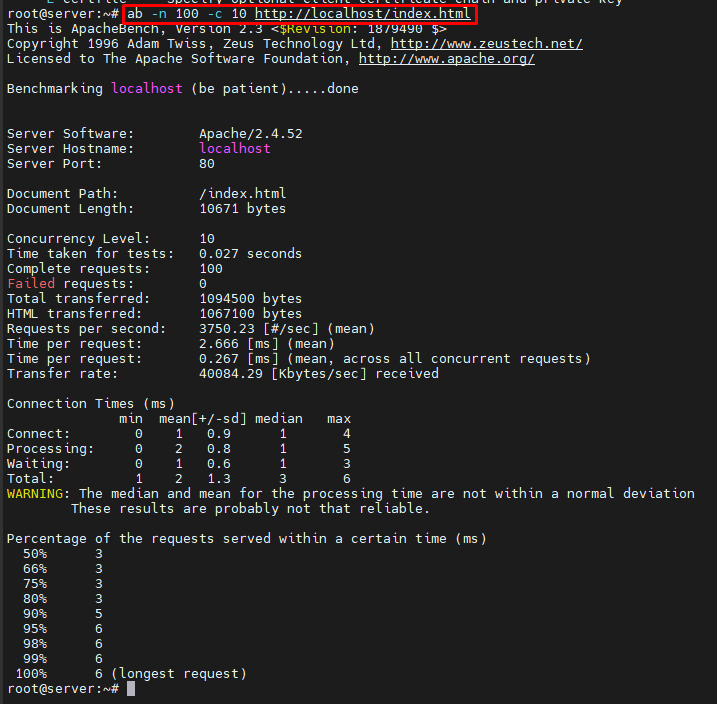
	- Yêu cầu POST với dữ liệu: Nếu kiểm tra một điểm cuối (endpoint) POST, hãy chỉ định một tệp dữ liệu bằng cách sử dụng cờ -p và loại nội dung bằng -T.	
		```
		ab -n 100 -c 10 -p data.json -T application/json http://localhost:8000/api/books
		```
	- Không thoát khi có lỗi: Tùy chọn -r cho phép bài kiểm tra tiếp tục ngay cả khi có lỗi xảy ra.
		```
		ab -n 500 -c 10 -r http://localhost:8000/api/books
		```
- Apache Benchmark cung cấp thêm các cờ (flag) để tùy chỉnh các bài kiểm tra sâu hơn. Dưới đây là một số tùy chọn thường được sử dụng:
	- Header tùy chỉnh: Thêm các header tùy chỉnh, chẳng hạn như mã thông báo ủy quyền (authorization tokens), bằng cách sử dụng -H.
		```
		ab -H "Authorization: Bearer <token>" -n 100 -c 10 http://localhost:8000/api/books
		```
	- Kết nối Keep-Alive: Theo mặc định, Apache Benchmark đóng các kết nối sau mỗi yêu cầu. Bật các kết nối liên tục bằng -k.
		```
		ab -k -n 500 -c 10 http://localhost:8000/api/books
		```
	- Connection Timeout: Điều chỉnh thời gian chờ bằng -s để chỉ định khoảng thời gian AB chờ phản hồi.
		```
		ab -n 100 -c 10 -s 5 http://localhost:8000/api/books
		```
- Phân tích kết quả trả về của ab : Sau một bài kiểm tra, Apache Benchmark cung cấp một bản tóm tắt với các chỉ số quan trọng:
	* Tổng số yêu cầu: Số lượng yêu cầu đã được thực hiện.
	* Yêu cầu thất bại: Số lượng yêu cầu gặp lỗi.
	* Yêu cầu mỗi giây: Thông lượng đạt được trong quá trình kiểm tra.
	* Thời gian cho mỗi yêu cầu: Thời gian trung bình mà mỗi yêu cầu mất.
	* Tốc độ truyền tải: Lượng dữ liệu được truyền tải mỗi giây.
- Hạn chế của AB 
	* Tính thực tế hạn chế: Apache Benchmark gửi các yêu cầu nhanh nhất có thể, điều này có thể không phản ánh đúng các kiểu lưu lượng truy cập của người dùng thực.
	* Tải trọng cao trên máy kiểm thử: Chính máy dùng để kiểm tra có thể trở thành điểm nghẽn, đặc biệt nếu mức độ đồng thời được đặt quá cao.
	* Thiếu các kịch bản phức tạp: AB không hỗ trợ các giao dịch đa bước hoặc các kịch bản kiểm thử phức tạp như JMeter.

<!-- TOC --><a name="612-jmeter"></a>
#### 6.1.2 JMeter
- Jmeter là công cụ để đo độ tải và performance của đối tượng, có thể sử dụng để test performance trên cả nguồn tĩnh và nguồn động, có thể kiểm tra độ tải và hiệu năng trên nhiều loại server khác nhau như: Web – HTTP, HTTPS, SOAP, Database via JDBC, LDAP, JMS, Mail – SMTP(S), POP3(S) và IMAP(S)…
- Jmeter là một phần mềm mã nguồn mở được viết bằng java. Cha đẻ của JMeter là Stefano Mazzocchi. Sau đó Apache đã thiết kế lại để cải tiến hơn giao diện đồ họa cho người dùng và khả năng kiểm thử hướng chức năng.
- Đặc trưng của Jmeter
	* Nguồn mở, miễn phí
	* Giao diện đơn giản, trực quan dễ sử dụng
	* Có thể kiểm thử nhiều kiểu server: Web - HTTP, HTTPS, SOAP, Database - JDBC, LDAP, JMS, Mail - POP3,…
	* Một công cụ độc lập có thể chạy trên nhiều nền tảng hệ điều hành khác nhau, trên Linux chỉ cần chạy bằng một shell scrip, trên Windows thì chỉ cần chạy một file .bat
	* Đa luồng, giúp xử lý tạo nhiều request cùng một khoảng thời gian, xử lý các dữ liệu thu được một cách hiệu quả.
	* Đặc tính mở rộng, có rất nhiều plugin được chia trẻ rộng rãi và miễn phí
- Cách thức hoạt động: Jmeter thực hiện giả lập một nhóm người dùng gửi các yêu cầu tới một máy chủ, nhận và xử lý các phản hồi từ máy chủ và cung cấp các kết quả báo cáo hiệu suất dưới dạng biểu đồ trực quan, dễ hiểu.
- Cài đặt 
	- Windows 
		* Install Java JDK: http://www.oracle.com/technetwork/java/javase/downloads/index.html
		* Set JAVA_HOME: My Computer -> Properties -> Advance System Settings -> Environment variables -> System variables -> New Variable name: JAVA_HOME Variable value: đường dẫn đến folder JDK
		* Set Path: Thêm %JAVA_HOME%\bin; vào System Path
		* Download Jmeter và giải nén ra folder C:\Jmeter: http://jmeter.apache.org/download_jmeter.cgi
		* Chạy Jmeter: Vào trong folder C:\Jmeter\bin Chạy file jmeter.bat
	- Ubuntu  
		* Install Java: `apt-get install openjdk-8-jdk -y`
		* Tải và giải nén JMeter: 
			```	
			wget https://downloads.apache.org//jmeter/binaries/apache-jmeter-5.3.zip
			unzip apache-jmeter-5.3.zip
			```
		* Khởi chạy 
			```
			cd apache-jmeter-5.3/bin
			./jmeter
			```
- Tạo test plan 
- 	
	- Add Thread Group
		* Khởi động JMeter
		* Chọn Test Plan
		* Add Thread Group
		* Click chuột phải "Test Plan" và thêm thread group mới: Add -> Threads (Users) -> Thread Group
		* Trong Thread Group thực hiện cấu hình
			* Number of Threads: 100 (Số lượng người dùng truy cập trang web: 100)
			* Loop Count: 10 (Thời gian để thực hiện test)
			* Ramp-Up Period: 100
		- 	
		- 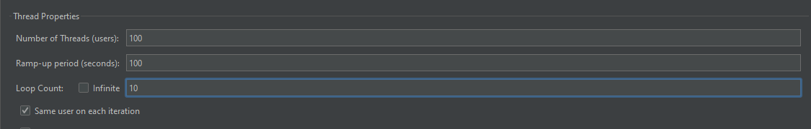	
	- Add JMeter elements
		* HTTP request Default
			- Click chuột phải Thread Group and chọn: Add -> Config Element -> HTTP Request Defaults.
			- Ở ví dụ này thực hiện test trang Google.com (http://www.google.com) nên điền thông tin google.com và phần `server name or IP`
		- 	
		- 
		* HTTP Request
			- Click chuột phải vào Thread Group and select: Add -> Sampler -> HTTP Request.
			- Tại đây trường Path cho biết yêu cầu URL nào bạn muốn gửi đến máy chủ Google. Ví dụ: Nếu bạn nhập "calendar" trong trường Path. JMeter sẽ tạo yêu cầu URL http://www.google.com/calendar đến máy chủ Google
		- 	
		- 			
	- Add Graph result
		- Click chuột phải vào Test Plan: Add -> Listener -> Graph Results
		- 			
	- Run Test và xem kết quả
		- Ấn nút Run (Ctrl + R) trên Toolbar để bắt đầu chạy. Bạn sẽ nhìn thấy kết quả test hiển thị trên Graph.
		- Ở dưới cùng của hình ảnh, thấy có các số liệu thống kê và được thể hiện bằng màu sắc:
			* Đen: Tổng số Sample hiện tại được gửi.
			* Màu xanh dương: Trung bình hiện tại của tất cả các Sample được gửi.
			* Màu đỏ: Độ lệch chuẩn hiện tại.
			* Màu xanh lá cây: Tỷ lệ throughput mà đại diện cho số lượng yêu cầu trên mỗi phút mà máy chủ xử lý. 
		- 			
- Ngoài GUI jmeter có thể chạy bằng dòng lệnh ví dụ trong thư mục `apache-jmeter-5.3/bin`
```
jmeter -n -t testplan.jmx - l log.jtl -H google.com -P 80
```
- 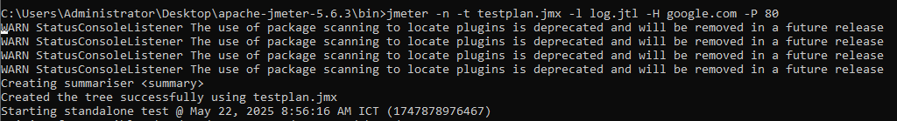			
<!-- TOC --><a name="613-so-sánh"></a>
#### 6.1.3 So sánh 
- Khi kiểm thử hiệu năng của hệ thống web, việc lựa chọn công cụ phù hợp là rất quan trọng. Hai công cụ phổ biến nhất hiện nay là Apache Benchmark (ab) và Apache JMeter. Mỗi công cụ đều có thế mạnh riêng, tùy vào mục tiêu và độ phức tạp của bài kiểm thử mà bạn đang hướng tới.
- Apache Benchmark thường được dùng cho các bài test đơn giản, nhanh chóng và dễ triển khai ngay từ dòng lệnh. Trong khi đó, JMeter lại phù hợp hơn với các kịch bản kiểm thử có nhiều bước, yêu cầu mô phỏng người dùng thực tế, hoặc cần theo dõi chi tiết về hiệu suất.

| Đặc điểm           | Apache Benchmark                | JMeter                                          |
| ------------------ | ------------------------------- | ----------------------------------------------- |
| Mức độ dễ sử dụng  | Dễ dùng, chạy bằng dòng lệnh    | Có giao diện đồ họa và cũng chạy được dòng lệnh |
| Tùy chỉnh nâng cao | Ít tùy chỉnh, cấu hình đơn giản | Có nhiều lựa chọn cấu hình, linh hoạt           |
| Kiểm soát mức tải  | Gửi yêu cầu ồ ạt ngay lập tức   | Có thể điều chỉnh thời gian gửi tải             |
| Báo cáo kết quả    | Chỉ có thông tin cơ bản         | Có báo cáo chi tiết, có biểu đồ thống kê        |

<!-- TOC --><a name="62-giám-sát-log-access-log-error-log"></a>
### 6.2   Giám sát log (access log, error log).
- `Access_log` thu thập dữ liệu liên quan đến các tệp được yêu cầu từ máy chủ. Log này cung cấp thông tin như: có bao nhiêu người dùng truy cập vào hệ thống, họ đến từ đâu (nguồn truy cập), và họ đã làm gì trên trang. Dữ liệu từ access log giúp tổ chức hiểu rõ hơn cách người dùng tương tác với website — từ đó cải thiện trải nghiệm người dùng, điều hướng trang, hoặc nội dung hiển thị.
- `Error log` ghi lại các sự cố, điểm nghẽn, hoặc lỗi mà máy chủ web gặp phải trong quá trình xử lý yêu cầu từ người dùng. Những log này thường chứa thông tin chi tiết như:
	* Tệp bị thiếu
	* Liên kết hỏng
	* Dịch vụ không phản hồi 
	* Thông tin chẩn đoán liên quan đến hoạt động của máy chủ
	* Error logs rất quan trọng trong việc khắc phục sự cố máy chủ, giúp xác định và xử lý các vấn đề có thể ảnh hưởng đến khả năng hoạt động của website.
- Các file log này thường đường lưu trong 
	- Ubuntu 
	```
	/var/log/apache2 
	/var/log/nginx 
	```
	- Windows 
	```
	%SystemDrive%\inetpub\logs\LogFiles
	```
- Giám sát cơ bản 
	- Sử dụng các lệnh `tail, less` kết hợp
		- Monitor log theo real-time 
		```
		tail -f /var/log/apache2/access.log
		less var/log/apache2/access.log
		```
		- Combine với lệnh grep 
		```
		tail -f var/log/apache2/access.log | grep "ERROR"
		grep "ERROR" var/log/apache2/access.log | less
		```
	- Sử dụng công cụ hỗ trợ: ví dụ goaccess
		- Cài đặt 
		```
		apt install goaccess
		```
		- Sử dụng goaccess để giám sát. Chọn Common Log Format  
		```
		goaccess /var/log/apache2/access.log -c 
		```
		- 		
		- 		
		
<!-- TOC --><a name="63-công-c-phân-tích-prometheus-grafana-elk-stack"></a>
### 6.3  Công cụ phân tích (Prometheus, Grafana, ELK Stack).
<!-- TOC --><a name="631-prometheus"></a>
#### 6.3.1 Prometheus
- Prometheus là một dịch vụ theo dõi và cảnh báo về hệ thống. Đây là một dịch vụ mã nguồn mở (Open source) hoàn toàn miễn phí. SoundCloud đã khởi đầu xây dựng Prometheus từ năm 2012. Prometheus đã được rất nhiều hệ thống tin tưởng áp dụng. Dự án có một cộng đồng người đóng góp, phát triển rất tích cực.
- Tính năng quan trọng nhất của Prometheus là thu thập thông số, dữ liệu từ các mục tiêu (dịch vụ) được nhắm đến theo khoảng thời gian nhất định đã được cài đặt trước. Ngoài ra còn các API khác thể hiện được kết quả, đánh giá bằng biểu thức quy tắc và đưa ra cảnh báo. Prometheus còn cung cấp một ngôn ngữ truy vấn rất mạnh PromQL, cực kì hữu ích khi giao tiếp với các dịch vụ monitor khác.
- Một số tính năng của Prometheus
	- Mô hình dữ liệu Time series đặc biệt phù hợp để theo dõi số liệu theo thời gian.
	- Có ngôn ngữ truy vấn riêng PromQL rất mạnh mẽ.
	- Tích hợp tốt với rất nhiềunền tảng ứng dụng.
	- Yêu cầu hạ tầng để triển khai đơn giản.
	- Hỗ trợ Push Gateway (khi làm việc với các dịch vụ tồn tại trong thời gian ngắn và hủy sau khi hoàn thành).
	- Có hỗ trợ Service discovery hoặc cấu hình tĩnh để tìm, nhắm mục tiêu cần theo dõi.
<!-- TOC --><a name="632-grafana"></a>
#### 6.3.2 Grafana
- Grafana là một nền tảng mã nguồn mở giúp bạn truy vấn, hiển thị, và cảnh báo dữ liệu từ nhiều nguồn khác nhau. Bạn có thể sử dụng Grafana để theo dõi thông tin theo thời gian thực từ nhiều loại dữ liệu khác nhau, như cơ sở dữ liệu thời gian thực (Time Series Database), SQL, NoSQL, hoặc các dịch vụ cloud thông qua các bảng điều khiển (dashboard) có thể tùy chỉnh.
- Grafana Lab đã phát triển rất nhiều công cụ cho cộng đồng, chúng được chia thành các nhóm chính như sau:
	- Bộ công cụ cốt lõi (Grafana stack): Bao gồm LGTM (Loki, Grafana, Tempo, Mimir) và Grafana Agent, dùng để quản lý logs, metrics và tracing.
	- Plugin cho doanh nghiệp: Mở rộng khả năng của Grafana cho các tổ chức lớn.
	- Công cụ xử lý sự cố: Giúp quản lý và khắc phục sự cố nhanh chóng.
	- Các công cụ khác: Tăng cường khả năng giám sát và quản lý hệ thống.
- Grafana là một vizualizer hiển thị các metric dưới dạng các biểu đồ (chart) hoặc đồ thị (graph), được tập hợp lại thành dashboard có tính tùy biến cao, giúp dễ dàng theo dõi tình trạng của node. Đơn giản cho các bạn dễ hiểu là sau khi lấy được metric từ các thiết bị, grafana sẽ sử dụng metric đó để phân tích và tạo ra dashboard mô tả trực quan các metric cần thiết cho việc monitoring như CPU, RAM, disks, IO operations...

<!-- TOC --><a name="633-elk-stack"></a>
#### 6.3.3 ELK Stack 
- ELK Stack là viết tắt của ba công cụ mã nguồn mở phổ biến: Elasticsearch, Logstash, và Kibana. Bộ công cụ này thường được gọi chung là Elasticsearch, nhưng thực chất là một hệ sinh thái giúp bạn:
	* Thu thập log từ tất cả các hệ thống và ứng dụng
	* Phân tích log theo thời gian thực
	* Trực quan hóa dữ liệu để theo dõi hệ thống, giám sát ứng dụng và hạ tầng
	* Xử lý sự cố nhanh hơn
	* Phân tích bảo mật và phát hiện bất thường
- ELK Stack thường được sử dụng trong các hệ thống giám sát và logging tập trung, giúp đội ngũ vận hành (Ops), bảo mật (Sec) và phát triển (Dev) dễ dàng theo dõi và phản ứng kịp thời với các sự cố.
- Cụ thể về các thành phần của ELK 
	- `E - Elasticsearch` 
		- là một công cụ mã nguồn mở hiện đại, dùng để tìm kiếm toàn văn (full-text search) và phân tích dữ liệu.
		- Là trái tim của ELK Stack, Elasticsearch có thể được sử dụng để tìm kiếm nhiều loại dữ liệu khác nhau — từ văn bản, số, dữ liệu không gian địa lý (geospatial), đến các dữ liệu có cấu trúc hoặc không có cấu trúc.
		- Đặc điểm kỹ thuật nổi bật:
			* Xây dựng trên thư viện Apache Lucene, một nền tảng tìm kiếm mạnh mẽ
			* Kiến trúc phân tán giúp mở rộng quy mô dễ dàng
			* Giao tiếp qua RESTful API đơn giản
			* Lưu trữ dữ liệu dạng JSON không cần schema cố định
			* Khả năng tìm kiếm với tốc độ cao ngay cả với khối lượng dữ liệu lớn và tăng nhanh
		- Elasticsearch rất phù hợp để triển khai trong các hệ thống tìm kiếm, phân tích log, giám sát thời gian thực, và các ứng dụng đòi hỏi hiệu suất truy vấn cao
	- `L - Logstash`
		- là một công cụ mã nguồn mở, chạy phía máy chủ, hoạt động như một pipeline xử lý dữ liệu. Nó có khả năng thu thập dữ liệu đầu vào (ingest), xử lý (transform), và chuyển tiếp dữ liệu tới bất kỳ điểm đích đã cấu hình.
		- Tính năng chính:
			* Có thể thu thập dữ liệu không cấu trúc từ nhiều nguồn khác nhau cùng lúc — như website, máy chủ ứng dụng, cơ sở dữ liệu, v.v.
			* Lọc và phân tích dữ liệu đầu vào, sau đó chuyển đổi thành định dạng thống nhất
			* Gửi dữ liệu đã xử lý đến nơi bạn mong muốn (phổ biến nhất là gửi vào Elasticsearch) để lập chỉ mục và tìm kiếm
			* Sau khi dữ liệu được đẩy vào Elasticsearch, bạn có thể tiếp tục trực quan hóa và phân tích nó bằng Kibana.
		- Logstash giúp chuẩn hóa dữ liệu từ nhiều hệ thống khác nhau, tạo nền tảng cho việc giám sát, phân tích log, và xử lý dữ liệu thời gian thực một cách hiệu quả.
	- `K - Kibana` 
		- là một công cụ mã nguồn mở dùng để phân tích và trực quan hóa dữ liệu, giúp biến dữ liệu được lưu trữ trong Elasticsearch thành các biểu đồ, đồ thị, biểu đồ tần suất (histogram) và các dạng hiển thị trực quan khác dễ hiểu và dễ sử dụng.
		- Tính năng chính:
			* Giao diện sử dụng trên trình duyệt, dễ thao tác
			* Cung cấp dashboard có sẵn để khám phá và phân tích khối lượng lớn dữ liệu
			* Hỗ trợ tạo biểu đồ, biểu đồ tròn, bản đồ nhiệt, bảng dữ liệu, v.v.
			* Không cần kỹ năng lập trình, người dùng không chuyên kỹ thuật vẫn có thể sử dụng để theo dõi xu hướng, đánh giá các chỉ số hiệu suất (KPI)
		- Kibana là công cụ lý tưởng để chia sẻ thông tin và phân tích dữ liệu nội bộ, giúp các bộ phận khác nhau trong tổ chức có cái nhìn chung về hoạt động hệ thống hoặc kết quả kinh doanh — thông qua các biểu đồ trực quan, dễ hiểu và có thể tùy chỉnh.

		| Thành phần        | Vai trò chính                            |
		| ----------------- | ---------------------------------------- |
		| Elasticsearch     | Lưu trữ, tìm kiếm và phân tích dữ liệu   |
		| Logstash          | Thu thập, xử lý và gửi dữ liệu           |
		| Kibana            | Hiển thị dữ liệu qua giao diện trực quan |

- 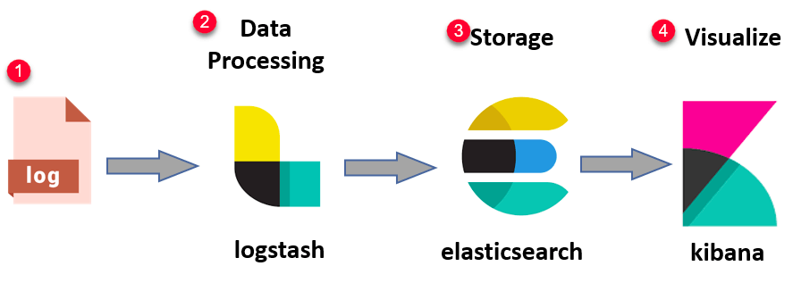

- Chức năng và Lợi ích của ELK Stack
	- Quản lý và phân tích log
		* ELK Stack vượt trội trong việc tập trung lưu trữ log từ nhiều hệ thống khác nhau và hỗ trợ phân tích log toàn diện.
		* Hỗ trợ xử lý log theo thời gian thực
		* Lập chỉ mục dữ liệu hiệu quả, giúp truy xuất và phân tích nhanh chóng
		=> Giúp tìm lỗi, giám sát hoạt động hệ thống và đảm bảo tính minh bạch của dữ liệu log.
	- Trực quan hóa dữ liệu và dashboard
		* Kibana là công cụ mạnh để tạo các biểu đồ tương tác và dashboard tùy chỉnh.
		* Biến dữ liệu log phức tạp thành hình ảnh dễ hiểu
		* Hỗ trợ đưa ra insight có thể hành động được (actionable insights)
		=> Giúp đội ngũ kỹ thuật và không kỹ thuật hiểu rõ hơn về hiệu suất và hành vi hệ thống.
	- Giám sát hệ thống và phân tích hiệu suất
		* ELK Stack cực kỳ hiệu quả cho việc giám sát hoạt động hệ thống và phân tích hiệu suất.
		* Phát hiện bất thường (anomaly detection)
		* Hỗ trợ xử lý sự cố và tối ưu hạ tầng
		* Có thể mở rộng sang phân tích dự đoán và ứng dụng machine learning
		=> Là công cụ linh hoạt, phù hợp với nhiều mục tiêu như DevOps, SecOps, hoặc phân tích kinh doanh.
		
<!-- TOC --><a name="7-so-sánh-web-server-vs-application-server"></a>
## 7. So sánh Web Server vs Application Server
- Web Server: Là một thành phần phần mềm chịu trách nhiệm phục vụ dữ liệu tĩnh như:Hình ảnh, File, Văn bản HTML. Web server nhận yêu cầu HTTP từ client và trả về nội dung tương ứng.
- Application Server: Khác với web server, application server cung cấp logic xử lý nghiệp vụ (business logic). Nó thực hiện các tính toán, xử lý dữ liệu, tương tác với cơ sở dữ liệu... trước khi tạo ra phản hồi gửi lại web server (và sau đó đến trình duyệt).
- Hoạt động của Web/ Application Server
	- Web server là công nghệ dùng để lưu trữ mã nguồn và dữ liệu của một website. Khi bạn nhập một địa chỉ URL trên trình duyệt, thực tế bạn đang truy cập vào địa chỉ của web server.
		- Quy trình hoạt động:
		1. Trình duyệt sử dụng URL để tìm địa chỉ IP của máy chủ
		2. Trình duyệt gửi một yêu cầu HTTP đến máy chủ
		3. Web server có thể truy vấn đến máy chủ cơ sở dữ liệu để lấy dữ liệu cần thiết
		4. Web server trả lại nội dung tĩnh như trang HTML, hình ảnh, video, hoặc file thông qua phản hồi HTTP
		5. Trình duyệt hiển thị nội dung cho người dùng

	- Application server mở rộng khả năng của web server bằng cách hỗ trợ nội dung động, xử lý logic nghiệp vụ, và tích hợp với nhiều hệ thống khác như cơ sở dữ liệu, API, hoặc dịch vụ bên thứ ba.
		- Quy trình hoạt động:
		1. Trình duyệt dùng URL để tìm IP của máy chủ
		2. Trình duyệt gửi yêu cầu HTTP
		3. Web server nhận yêu cầu và chuyển tiếp đến application server
		4. Application server:
		   * Thực thi logic nghiệp vụ
		   * Kết nối với cơ sở dữ liệu và các hệ thống khác
		   * Tạo nội dung mới (HTML hoặc JSON,...)
		5. Application server gửi phản hồi về web server
		6. Web server gửi kết quả cuối cùng về trình duyệt
		7. Trình duyệt hiển thị nội dung cho người dùng
- So sánh 

| Tiêu chí          | Web Server                                         | Application Server                                              |
| ----------------- | -------------------------------------------------- | --------------------------------------------------------------- |
| Nhiệm vụ chính    | Xử lý các yêu cầu đơn giản, phản hồi nội dung tĩnh | Xử lý các yêu cầu phức tạp, tương tác với CSDL và hệ thống khác |
| Giao thức sử dụng | Chủ yếu là HTTP, có thể hỗ trợ FTP và SMTP         | Hỗ trợ nhiều giao thức đa dạng (HTTP, RMI, JMS, SOAP, v.v.)     |
| Loại nội dung     | Nội dung tĩnh: HTML, hình ảnh, video, file         | Nội dung động: thông tin cá nhân hóa, cập nhật thời gian thực   |
| Xử lý đa luồng    | Thường không hỗ trợ đa luồng                       | Có hỗ trợ đa luồng, xử lý đồng thời nhiều yêu cầu               |

- Web server thường được sử dụng để:
	* Lưu trữ website công ty, landing page hoặc blog
	* Phục vụ nội dung tĩnh (HTML, hình ảnh, video, tài liệu) một cách nhanh chóng và an toàn
	* Hỗ trợ chia sẻ tài liệu qua đám mây hoặc cung cấp cổng thông tin cho khách hàng
	* Hoạt động như một reverse proxy để cân bằng tải giữa nhiều máy chủ, tăng hiệu suất và khả năng mở rộng
	* Ví dụ: 
		- Apache HTTP Server hoặc Nginx dùng để host website công ty
		- Một blog doanh nghiệp được chạy trên WordPress (host bởi web server)
		- Trang giới thiệu sản phẩm hoặc landing page cho chiến dịch marketing
		- Cổng truy cập tài liệu cho khách hàng tải file PDF, hướng dẫn sử dụng, chính sách công ty
- Application server thường được sử dụng trong các hệ thống cần xử lý logic phức tạp và tương tác động, bao gồm:
	* Vận hành ứng dụng đám mây và phần mềm doanh nghiệp như CRM, ERP, HRM
	* Thực hiện xử lý dữ liệu theo thời gian thực và hỗ trợ các giao dịch trực tuyến
	* Chạy các nền tảng thương mại điện tử, giải pháp SaaS, và cổng thông tin khách hàng
	* Tích hợp với dịch vụ bên thứ ba thông qua API (ví dụ: thanh toán, xác thực người dùng, vận chuyển)
	* Ví dụ:
		- Java EE Application Server (như WildFly, WebLogic) chạy hệ thống ERP
		- Tomcat triển khai ứng dụng quản lý nhân sự (HRM) nội bộ
		- Node.js cung cấp backend cho nền tảng thương mại điện tử đa kênh
		- .NET Core chạy ứng dụng khách hàng nội bộ có chức năng đặt hàng và theo dõi đơn hàng
		- Spring Boot kết hợp với API thanh toán như Stripe/PayPal trong giải pháp bán hàng SaaS
<!-- TOC --><a name="8-xu-hng-hin-i"></a>
## 8. Xu hướng hiện đại
<!-- TOC --><a name="81-serverless-aws-lambda-cloud-functions"></a>
### 8.1  Serverless (AWS Lambda, Cloud Functions).
<!-- TOC --><a name="811-serverless"></a>
#### 8.1.1 Serverless 
- Serverless là một mô hình phát triển ứng dụng hiện đại, cho phép triển khai mà không cần quản lý hạ tầng máy chủ. Các nhà phát triển chỉ cần tập trung vào viết mã, trong khi tài nguyên như tính toán và lưu trữ được nhà cung cấp dịch vụ đám mây tự động xử lý. Mô hình này giúp tối ưu chi phí, đơn giản hóa quản lý hạ tầng và tăng tốc triển khai ứng dụng, phù hợp với nhiều ứng dụng từ chatbot đến IoT.
- Trên thực tế Server less vẫn có hệ thống máy chủ server nằm ở phía sau, tuy nhiên trách nhiệm quản lý thuộc về nhà cung cấp dịch vụ cloud.
- Serverless là một mô hình điện toán đám mây trong đó nhà phát triển không phải quản lý cơ sở hạ tầng máy chủ vật lý hay máy chủ ảo. Với kiến trúc điện toán phi máy chủ – thay vì phải lo lắng về việc cài đặt, bảo trì hoặc mở rộng máy chủ, nhà phát triển chỉ tập trung vào việc viết mã ứng dụng và triển khai nó.
- Các nhà cung cấp dịch vụ đám mây, như AWS (Amazon Web Services), Google Cloud, Microsoft Azure, sẽ tự động quản lý dịch vụ máy chủ, phân bổ tài nguyên và điều chỉnh quy mô linh hoạt theo nhu cầu sử dụng thực tế.
- Serverless có 2 mô hình dịch vụ chính là BaaS và FaaS: 
	- Mô hình BaaS
		- Đối với BaaS (Back As A Service) được hiểu là Back-end dưới dạng dịch vụ, các Code Logic của doanh nghiệp sẽ được xử lý tại Frontend. Với Backend, doanh nghiệp sử dụng các API do bên thứ ba cung cấp.
		- Ví dụ: Doanh nghiệp cần phát triển một phần mềm dự báo thời tiết, nhưng không có các thiết bị đo đạc, vệ tinh,... để thu thập dữ liệu rồi viết code xử lý chúng. Lúc này, doanh nghiệp có thể lấy dữ liệu có sẵn từ API của các bên thứ ba đã cung cấp công khai, ví dụ như của Google Weather API. Các dữ liệu lấy từ API bên thứ ba này sẽ được doanh nghiệp xử lý để hiển thị tại Frontend.
	- Mô hình FaaS
		- Với FaaS (Function As A Service) được hiểu là chức năng như một dịch vụ, doanh nghiệp không cần phải sử dụng API của bên thứ ba như BaaS trên. Thay vào đó, doanh nghiệp có thể tự xây dựng một API riêng và chạy chúng trên Server. 
		- Với FaaS, các thiết bị phần cứng, Web Server,... đều được xử lý và vận hành tự động bởi Cloud Services được cung cấp. Doanh nghiệp không cần phải thuê Server và Deploy Code lên như với mô hình Client Server. Thay vào đó, với FaaS thì doanh nghiệp có thể Deploy Code dưới dạng Function và không cần quan tâm đến Server hay không gian lưu trữ. Các phần này đều được nhà cung cấp thứ ba quản lý giúp doanh nghiệp.
- Kiến trúc Serverless: Kiến trúc Serverless được cấu tạo từ 5 thành phần chính:
	- Authentication Service (dịch vụ xác thực): được dùng để xác thực người dùng từ xa hoặc kết nối với ứng dụng, dịch vụ.
	- Product Database (cơ sở dữ liệu sản phẩm): tất cả các thông tin dữ liệu đều được gửi đến kho quản lý. Trong kho quản lý lại có chia nhỏ từng phần, tránh việc bị quá tải.
	- Client (máy khách): Các logic như user session sẽ nằm ở phía client.
	- Search Function (chức năng tìm kiếm): doanh nghiệp có thể sử dụng các API Gateway. Các yêu cầu từ máy khách sẽ được HTTP tìm kiếm từ kho dữ liệu và phản hồi kết quả về máy khách.
	- Purchase Function (chức năng đặt hàng): các logic được tách riêng thành những khối khác nhau.
- Ưu điểm 
	- Chi phí thấp hơn
		* Kiến trúc serverless giúp tiết kiệm chi phí đáng kể so với hạ tầng truyền thống.
		* Người dùng chỉ trả tiền cho tài nguyên được sử dụng thực tế
		* Không còn tình trạng lãng phí tài nguyên do CPU chạy không tải hoặc bộ nhớ không dùng đến
	- Khả năng mở rộng tự động
		* Nhà cung cấp dịch vụ serverless tự động xử lý việc mở rộng (scale) theo nhu cầu thực tế
		* Không cần cấu hình thủ công các quy tắc hoặc giới hạn tài nguyên
		=> Giảm đáng kể khối lượng công việc quản trị hệ thống
	- Mã backend đơn giản hơn
		* Với mô hình Function as a Service (FaaS), lập trình viên chỉ cần viết các hàm độc lập thực hiện từng chức năng nhỏ, ví dụ như:
			- Gửi email
			- Gọi API
			- Xử lý dữ liệu đầu vào
		=> Dễ kiểm thử, dễ bảo trì, và tái sử dụng được
	- Rút ngắn thời gian triển khai
		* Việc phát hành tính năng mới hoặc sửa lỗi trở nên nhanh chóng và linh hoạt
		* Không cần quy trình deploy phức tạp — có thể cập nhật từng phần nhỏ của hệ thống mà không ảnh hưởng đến toàn bộ ứng dụng
		=> Giảm thời gian đưa sản phẩm ra thị trường (time to market)
- Nhược điểm
	- Độ trễ: Serverless Computing gây ra độ trễ lớn trong việc sử dụng tài nguyên điện toán đám mây để phản hồi lại yêu cầu từ ứng dụng. 
	- Phụ thuộc vào đơn vị cung cấp: doanh nghiệp không thể chạy phần mềm, ứng dụng trên nền tảng mong muốn nếu dịch vụ từ nhà cung cấp không tương thích
	- Cần có kiến thức và kỹ năng: Để vận hành Serverless Computing hiệu quả, doanh nghiệp cần phải bỏ thời gian nghiên cứu về cách sử dụng IAM policies, cách cấu hình stage, bộ nhớ của các Function,…
- Serverless có thể được ứng dụng trong nhiều trường hợp khác nhau:
	- Website hoặc APIs: Doanh nghiệp có thể xây dựng một trang Web hoặc một API với Serverless. Đa số người dùng thích xây dựng Restful API với Serverless.
	- Xử lý các tập tin đa phương tiện: Với các tập tin hình ảnh, video cần xử lý đơn giản, ví dụ như nén, cắt, đổi định dạng,... thì Serverless là lựa chọn lý tưởng.
	- Xử lý các sự kiện: Serverless đóng vai trò như 1 công tắc để kích hoạt các sự kiện khác nhau, tùy theo các hành động của khách hàng

<!-- TOC --><a name="812-aws-lambda"></a>
#### 8.1.2 AWS Lambda
- AWS Lambda là dịch vụ serverless compute của Amazon Web Services (AWS), hoạt động theo mô hình FaaS (Function-as-a-Service).
- Với AWS Lambda, người dùng — đặc biệt là lập trình viên — không cần quản lý hạ tầng máy chủ, không cần cài đặt, vận hành hay bảo trì hệ thống. Thay vào đó, bạn chỉ cần tập trung vào viết mã và triển khai ứng dụng.
- Cách hoạt động
	- Người dùng tải mã nguồn lên AWS Lambda
	- AWS Lambda sẽ tự động thực thi mã, đồng thời tự động mở rộng quy mô tài nguyên theo nhu cầu
	- Đảm bảo hiệu suất và tính sẵn sàng của ứng dụng mà không cần can thiệp thủ công
- Ngôn ngữ được hỗ trợ: AWS Lambda hiện hỗ trợ các ngôn ngữ lập trình phổ biến sau: Java, Python, C#, Node.js, Go, PowerShell, Ruby.
- Ngoài ra, AWS Lambda còn cung cấp Runtime API, cho phép bạn thực thi hàm được viết bằng ngôn ngữ tự chọn, kể cả những ngôn ngữ không nằm trong danh sách chính thức, bằng cách tạo runtime tùy chỉnh.
- Cách AWS Lambda Hoạt Động Lambda là một dịch vụ tính toán không máy chủ (serverless) và dựa trên sự kiện, sử dụng một mô hình lập trình khác biệt so với các ứng dụng web truyền thống. Mô hình dưới đây mô tả cách thức Lambda hoạt động:
	- Viết và tổ chức mã: Bạn viết và tổ chức mã trong Lambda functions, đây là đơn vị cơ bản để xây dựng ứng dụng Lambda.
	- Quản lý bảo mật và quyền truy cập: Bạn kiểm soát bảo mật và quyền truy cập thông qua Lambda permissions, sử dụng execution roles để xác định các dịch vụ AWS mà function có thể tương tác và các chính sách tài nguyên có thể tương tác với mã của bạn.
	- Kích hoạt từ sự kiện: Các nguồn sự kiện và dịch vụ AWS kích hoạt Lambda functions, truyền dữ liệu sự kiện ở định dạng JSON, mà function sẽ xử lý (bao gồm cả event source mappings).
	- Môi trường thực thi: Lambda chạy mã của bạn với các runtime ngôn ngữ cụ thể (như Node.js và Python) trong các môi trường thực thi bao gồm runtime, layers và extensions.
- Các Tính Năng Chính của AWS Lambda
	- Cấu hình và triển khai ứng dụng an toàn:
		* Biến môi trường: Thay đổi hành vi mà không cần triển khai lại mã.
		* Lambda Layers: Tái sử dụng mã giữa các function.
		* Code Signing: Đảm bảo mã an toàn trước khi triển khai.
	- Khả năng mở rộng và hiệu suất:
		* Lambda SnapStart: Giảm thời gian khởi động xuống dưới 1 giây.
		* Response Streaming: Truyền tải dữ liệu lớn theo thời gian thực.
	- Kết nối và tích hợp:
		* VPC: Kết nối với tài nguyên nội bộ.
		* Function URLs: Tạo API công khai mà không cần API Gateway.
		* Lambda Extensions: Tích hợp công cụ giám sát và bảo mật.
- Ưu điểm Của AWS Lambda
	- Tiết Kiệm Chi Phí: Người dùng chỉ trả tiền cho thời gian tính toán thực tế mà bạn sử dụng, điều này giúp Lambda trở thành một phương thức tiết kiệm chi phí để chạy mã.
	- Mở Rộng Tự Động: Lambda tự động mở rộng ứng dụng của bạn khi có lưu lượng yêu cầu đến, giúp dễ dàng xử lý các đợt tăng trưởng lưu lượng.
	- Linh Hoạt: Có thể sử dụng Lambda với các dịch vụ AWS khác như S3, DynamoDB, và SNS để xây dựng nhiều loại ứng dụng và backend.
	- Quản Lý Dễ Dàng: AWS chịu trách nhiệm triển khai, mở rộng và vá lỗi hạ tầng cơ sở, giúp bạn không phải lo lắng về việc quản lý máy chủ.
	- Không Cần Quản Lý Máy Chủ: Với Lambda, không cần cấp phát hay quản lý máy chủ. Bạn chỉ cần chạy mã của mình mà không cần quan tâm đến cơ sở hạ tầng.
- Nhược Điểm Của AWS Lambda
	- Cold Starts: Nếu một Lambda function không được gọi trong một khoảng thời gian dài, lần gọi đầu tiên sau thời gian không hoạt động có thể mất nhiều thời gian hơn do phải khởi động lại từ đầu.
	- Kết Nối Giới Hạn: Lambda functions là stateless và thường được kích hoạt bởi sự kiện. Do đó, chúng có thể không duy trì được kết nối ổn định với cơ sở dữ liệu hoặc các tài nguyên khác.
	- Hạn Chế Bộ Nhớ: Bạn phải chọn mức bộ nhớ muốn cấp cho function, điều này sẽ quyết định lượng CPU và băng thông mạng có thể sử dụng. Điều này có thể là một hạn chế đối với một số ứng dụng yêu cầu tài nguyên lớn.
	- Hỗ Trợ Ngôn Ngữ Giới Hạn: Lambda hỗ trợ nhiều ngôn ngữ lập trình như Node.js, Python, Java, C#, và Go. Nếu ứng dụng của bạn yêu cầu ngôn ngữ không được hỗ trợ, bạn có thể cần sử dụng dịch vụ khác.
<!-- TOC --><a name="812-cloud-functions"></a>
#### 8.1.2 Cloud Functions 
- Google Cloud Functions là serverless cho phép bạn chạy code tương tác với các sự kiện mà không cần cấp phát hay quản lý máy chủ. Vì Cloud Function là dịch vụ quản lý hoàn toàn, đây là cách hiệu quả để tự động hóa các tác vụ, xây dựng microservices, và kết nối các ứng dụng của bạn với các sản phẩm và dịch vụ đám mây khác, cả trong và ngoài Google Cloud.
- Cloud Functions có thể được xem là nơi kết nối các dịch vụ, giúp bạn mở rộng các khả năng tích hợp sẵn để đạt được các mục tiêu lập trình của mình.
- Cloud Functions thuộc loại Functions as a Service (FaaS), tập trung vào mã nguồn - chỉ cần tập trung vào việc viết mã. Với Google Cloud Functions, bạn có thể chọn sử dụng một trong các môi trường runtime hỗ trợ như: Go, Java, .NET Core, Node.js, PHP, Python hoặc Ruby.	
- Các Tính Năng Chính của Google Cloud Functions
	- ServerLess Không phải quản lý hạ tầng – chỉ cần viết và triển khai mã.
	- Xử lý dựa trên sự kiện (Event-driven) Tự động chạy mã khi có sự kiện xảy ra, như thay đổi dữ liệu, nhận tin nhắn, v.v.
	- Tự động mở rộng (Scalability) Tăng/giảm tài nguyên theo lưu lượng truy cập thực tế, không lo dư thừa hay thiếu hụt.
	- Hỗ trợ nhiều ngôn ngữ Hỗ trợ Node.js, Python, Go, Java, .NET và nhiều ngôn ngữ phổ biến khác.
	- Tích hợp dịch vụ Google Cloud Kết nối dễ dàng với Cloud Storage, Pub/Sub, Firestore,... để xây dựng hệ thống phức tạp.
	- Chi phí tối ưu Chỉ trả tiền cho thời gian thực thi, không phí khởi tạo hay duy trì.
	- Triển khai nhanh chóng Dễ dàng triển khai qua Console, CLI (gcloud), hoặc từ GitHub.
	- Đa dạng trường hợp sử dụng Dùng để xây webhook, chatbot, xử lý dữ liệu, tự động hóa, v.v.
	- Tính sẵn sàng cao Được triển khai trên nhiều vùng khả dụng để tăng độ tin cậy.
	- Bảo mật tích hợp Hỗ trợ kết nối an toàn, phân quyền truy cập, và tích hợp bảo mật tùy chỉnh.
- Ưu điêm Của Google Cloud Functions
	- Không cần quản lý máy chủ: Chạy mã trên đám mây dễ dàng, chỉ cần tập trung vào lập trình – không lo vận hành hạ tầng.
	- Triển khai nhanh chóng: Chỉ với một lệnh, có thể đưa mã lên môi trường production sẵn sàng hoạt động.
	- Tự động mở rộng: Không cần cấu hình thủ công – hệ thống tự mở rộng theo nhu cầu, xử lý các sự kiện song song.
	- Trả tiền theo mức sử dụng: Chỉ bị tính phí khi mã thực thi, tiết kiệm hơn nhiều so với máy chủ ảo được cấp phát sẵn.
- Nhược Điểm Của Google Cloud Functions
	- Kiến trúc phức tạp: Việc sử dụng nhiều Cloud Functions có thể khiến kiến trúc tổng thể trở nên khó nắm bắt và quản lý.
	- Khó gỡ lỗi (Debugging): Dù có công cụ hỗ trợ như trình giả lập và giám sát đám mây, việc debug vẫn có thể khó khăn và phụ thuộc vào công cụ của nhà cung cấp.
	- Phụ thuộc nhà cung cấp (Vendor lock-in): Mỗi nền tảng có cách triển khai và kết nối dịch vụ riêng, nên khó chuyển đổi hoặc mở rộng sang nhà cung cấp khác.
	- Khó kiểm soát toàn cục: Khi có quá nhiều function đang chạy, việc theo dõi, phân tích và đồng bộ triển khai với hệ thống hiện tại có thể trở nên phức tạp.

<!-- TOC --><a name="82-container-hóa-docker-web-server"></a>
### 8.2  Container hóa (Docker + Web Server).
- Container hóa là công nghệ đóng gói ứng dụng cùng với các thư viện, cấu hình, và phụ thuộc môi trường vào một đơn vị nhẹ gọi là container, đảm bảo ứng dụng chạy đồng nhất ở mọi môi trường.
- Bằng cách đóng gói máy chủ web, các nhà phát triển có thể đảm bảo rằng máy chủ hoạt động theo cùng một cách, bất kể môi trường nó được triển khai. Điều này loại bỏ cụm từ phát triển phổ biến, "Nó chạy được trên máy của tôi," và thay thế bằng, "Nó chạy được trên mọi máy."
- Máy chủ web đóng gói trong container mang lại nhiều lợi ích, bao gồm tính cô lập, tính di động và khả năng mở rộng. Chúng có thể chạy ở bất cứ đâu, và chúng được cô lập khỏi các container khác và hệ thống máy chủ chính. Điều này có nghĩa là chúng an toàn theo mặc định, và chúng có thể dễ dàng mở rộng lên hoặc thu nhỏ lại tùy thuộc vào nhu cầu của bạn.
- Docker 
- Docker là một công cụ mã nguồn mở được thiết kế để giúp việc tạo, triển khai và chạy ứng dụng dễ dàng hơn bằng cách sử dụng container. Container cho phép nhà phát triển đóng gói một ứng dụng cùng với tất cả các phần nó cần, như thư viện và các phụ thuộc khác, và gửi đi tất cả trong một gói duy nhất.
- Các Thành phần Chính của Docker
	- Docker Engine: Docker Engine là một phần cốt lõi của Docker, xử lý việc tạo và quản lý các container.
	- Docker Image: Docker Image là một khuôn mẫu chỉ đọc được sử dụng để tạo các container, chứa mã ứng dụng và các phụ thuộc.
	- Docker Hub: Đây là một kho lưu trữ dựa trên đám mây được sử dụng để tìm kiếm và chia sẻ các Docker Image.
	- Dockerfile: Đây là một tệp mô tả các bước để tạo một Docker Image một cách nhanh chóng.
	- Docker Registry: Đây là một hệ thống phân phối lưu trữ cho các Docker Image, nơi bạn có thể lưu trữ các Docker Image ở cả chế độ công khai và riêng tư.
- Dockerfile sử dụng Ngôn ngữ Đặc tả Miền (DSL) và chứa các hướng dẫn để tạo ra một Docker image. 
	- Dockerfile sẽ xác định các quy trình để tạo ra một image một cách nhanh chóng. 
	- Dockerfile là mã nguồn của image.
	- Docker image được tạo bằng cách sử dụng một Dockerfile.
- Docker Image là một file read-only, không thể thay đổi được, nó chứa các thư viện, công cụ, dịch vụ hay packages, những cấu hình để chạy và cần thiết để tạo nên ứng dụng. Chúng ta cũng không thể start hoặc run images giống như container và có thể tạo được image cho chính mình hoặc lấy images đã public trên registry để về và customize thành một image gồm những công cụ cần thiết cho riêng mình.
- Docker container là một phiên bản thực thi (runtime instance) của một image. Nó cho phép các nhà phát triển đóng gói ứng dụng với tất cả các phần cần thiết như thư viện và các phụ thuộc khác. Docker Container là các phiên bản thực thi của Docker image. Container chứa toàn bộ bộ công cụ cần thiết cho một ứng dụng, nhờ đó ứng dụng có thể được chạy một cách cô lập.
- Docker Engine quản lý lưu trữ các container
	- Server: Đây là thành phần chịu trách nhiệm tạo và quản lý Docker image, container, mạng và volume trên Docker. Nó được gọi là một tiến trình daemon (daemon process).
	- REST API: Nó quy định cách các ứng dụng có thể tương tác với Server và hướng dẫn nó phải làm gì.
	- Client: Client là giao diện dòng lệnh (CLI) của Docker, cho phép chúng ta tương tác với Docker bằng các lệnh docker.
- Các Lệnh Docker: Các lệnh Docker thiết yếu giúp đơn giản hóa quản lý container, đảm bảo quy trình phát triển và triển khai mượt mà. Một số lệnh phổ biến bao gồm:
	- `docker run`: Khởi chạy container từ image, kèm tùy chọn và lệnh.
	- `docker pull`: Tải image từ Docker Hub về máy cục bộ.
	- `docker ps`: Hiển thị các container đang chạy với thông tin quan trọng.
	- `docker stop`: Dừng container đang chạy một cách nhẹ nhàng.
	- `docker start`: Khởi động lại container đã dừng.
	- `docker login`: Đăng nhập vào kho lưu trữ docker để truy cập các kho riêng tư.
- Docker mang lại nhiều lợi ích:
	- Tính di động: Tạo container gọn nhẹ, chạy được trên mọi máy bất kể hệ điều hành.
	- Tính cô lập: Các container hoạt động độc lập, không ảnh hưởng lẫn nhau.
	- Tính tái lập: Đóng gói ứng dụng thành image tái sử dụng, đảm bảo tính nhất quán qua các môi trường.
	- Tích hợp DevOps: Thúc đẩy hợp tác và tự động hóa trong vòng đời phát triển phần mềm, quản lý khối lượng công việc hiệu quả.
- Ví dụ pul image và run Nginx container 
	- Pull image nginx từ Docker Hub 
	```
	docker pull nginx
	```
	- Khởi tạo container mới dựa trên image mới pull và expose ra port 80 
	```
	docker run -d -p 80:80 --name my-nginx nginx
	```

<!-- TOC --><a name="83-edge-computing-x-lý-gn-ngi-dùng-hn"></a>
### 8.3  Edge Computing (xử lý gần người dùng hơn).
- Edge Computing hay điện toán biên là một mô hình điện toán phân tán mà trong đó, việc tính toán dữ liệu chủ yếu được thực hiện trên các node thiết bị phân tán, thay vì thực hiện trên môi trường đám mây tập trung. 
- 
- Edge Computing đóng vai trò cung cấp tài nguyên server, đánh giá và phân tích dữ liệu, đưa các ứng dụng của doanh nghiệp đến gần hơn với các nguồn dữ liệu, như thiết bị IoT, máy chủ biên cục bộ (edge server).
- Các thành phần trong Edge Computing: Mô hình Edge Computing bao gồm các thành phần dưới đây:
	- Cloud Server: Máy chủ đám mây có nhiệm vụ lưu trữ và chạy các ứng dụng để điều phối, quản lý các nút biên (Edge Node) khác nhau. 
	- Edge Server: Máy chủ biên được đặt tại các cơ sở hoạt động từ xa (nhà máy, trung tâm phân phối, cửa hàng bán lẻ,...), đảm bảo đường truyền luôn ổn định, không làm gián đoạn hoạt động truy xuất, chia sẻ thông tin.
	- Edge Device: Edge Device, hay thiết bị biên được tích hợp khả năng tính toán dữ liệu và thường chỉ xử lý các tác vụ yêu cầu độ trễ thấp. 
	- Edge Gateway: Edge Gateway còn được gọi là cổng biên. Ngoài việc đánh giá, phân tích và xử lý dữ liệu như máy chủ biên, Edge Gateway còn biên dịch giao thức, bảo vệ tường lửa hoặc kết nối không dây. 
	- Edge Node: Đây là thuật ngữ dùng để chỉ máy chủ biên, cổng biên, hoặc thiết bị biên bất kỳ mà tại đó, tính toán biên có thể được thực hiện.
- Edge computing có thể được tích hợp vào nhiều loại ứng dụng, sản phẩm và dịch vụ khác nhau. Một vài khả năng bao gồm:
	- Giám sát hệ thống an ninh:
	- Thiết bị IoT: Các thiết bị thông minh kết nối Internet có thể hưởng lợi từ việc chạy mã ngay trên thiết bị, thay vì trên đám mây, để tương tác với người dùng hiệu quả hơn.
	- Ô tô tự lái: Các phương tiện tự hành cần phản ứng trong thời gian thực, mà không cần chờ hướng dẫn từ máy chủ.
	- Bộ nhớ đệm hiệu quả hơn: Bằng cách chạy mã trên mạng biên của CDN, một ứng dụng có thể tùy chỉnh cách nội dung được lưu vào bộ nhớ đệm để phục vụ nội dung cho người dùng hiệu quả hơn.
	- Thiết bị giám sát y tế: Việc các thiết bị y tế phản hồi trong thời gian thực mà không cần chờ phản hồi từ máy chủ đám mây là rất quan trọng.
	- Hội nghị truyền hình: Video trực tiếp tương tác đòi hỏi khá nhiều băng thông, vì vậy việc chuyển các quy trình backend đến gần nguồn video hơn có thể giảm độ trễ và thời gian chờ.
- Ưu điểm của Edge Computing:
	- Độ trễ thấp hơn: Bằng cách xử lý dữ liệu gần nơi nó phát sinh, tính toán biên giúp rút ngắn đáng kể thời gian cần thiết để phân tích và phản ứng với thông tin, điều này hoàn hảo cho các ứng dụng yêu cầu phản hồi thời gian thực.
	- Hiệu quả băng thông: Nó giảm lượng dữ liệu gửi đến các máy chủ trung tâm, giúp giảm việc sử dụng băng thông và chi phí. Chúng ta chỉ gửi thông tin quan trọng hoặc tóm tắt.
	- Cải thiện bảo mật: Bằng cách xử lý dữ liệu cục bộ, rủi ro từ các mối đe dọa mạng có thể được giảm thiểu vì thông tin nhạy cảm không phải liên tục được gửi qua Internet.
	- Độ tin cậy nâng cao: Tính toán biên có thể hoạt động độc lập mà không cần dựa vào đám mây trung tâm, đảm bảo rằng các ứng dụng quan trọng vẫn tiếp tục chạy ngay cả khi kết nối bị gián đoạn.
	- Khả năng mở rộng: Các tổ chức có thể dễ dàng thêm các thiết bị biên khi cần mà không gây quá tải cho các máy chủ trung tâm, giúp việc mở rộng các giải pháp IoT trở nên đơn giản.
	- Cải thiện quyền riêng tư dữ liệu: Bằng cách giữ dữ liệu nhạy cảm gần nguồn, các tổ chức có thể tuân thủ tốt hơn các quy định về quyền riêng tư dữ liệu và giảm thiểu việc di chuyển thông tin cá nhân.
	- Hiệu quả năng lượng: Xử lý dữ liệu cục bộ có thể giảm mức sử dụng năng lượng so với việc liên tục gửi lượng lớn dữ liệu đến một địa điểm trung tâm.
	- Hỗ trợ ứng dụng IoT: Tính toán biên đóng vai trò quan trọng trong nhiều ứng dụng IoT khác nhau, cho phép các thiết bị được kết nối xử lý dữ liệu và đưa ra quyết định nhanh hơn.
- Nhược điểm 
	- Một nhược điểm của tính toán biên là nó có thể làm tăng các điểm tấn công. Với việc bổ sung nhiều thiết bị "thông minh" hơn vào hệ thống, như các máy chủ biên và thiết bị IoT có máy tính tích hợp mạnh mẽ, có những cơ hội mới để những kẻ tấn công độc hại xâm nhập các thiết bị này.
	- Một nhược điểm khác của tính toán biên là nó yêu cầu nhiều phần cứng cục bộ hơn. Ví dụ, trong khi một camera IoT cần một máy tính tích hợp để gửi dữ liệu video thô của nó đến một máy chủ web, thì nó sẽ yêu cầu một máy tính tinh vi hơn nhiều với sức mạnh xử lý lớn hơn để chạy các thuật toán phát hiện chuyển động của riêng nó. 

- Có thể nói Edge Computing là phiên bản mới của CDN - Mạng phân phối nội dung - với nhiều tính năng vượt trội hơn. Nếu CDN tập trung vào việc phân phối, truyền tải dữ liệu đã được lưu trữ ở máy chủ gốc thì Edge Computing có thể sử dụng cho việc phát trực tiếp, chơi game hay thậm chí là trí tuệ nhân tạo (AI). Điểm chung của CDN vs Edge Computing là chúng đều giúp cải thiện khả năng truyền tải dữ liệu. 
- Cụ thể hơn các khía cạnh so sánh giữa CDN và Edge Computing như sau: 
| Khía cạnh            | CDN (Mạng phân phối nội dung)                                         | Tính toán biên (Edge Computing)                                                             |
| -------------------- | --------------------------------------------------------------------- | ------------------------------------------------------------------------------------------- |
| Mục tiêu chính       | Tăng tốc phân phối nội dung web bằng cách giảm độ trễ.                | Xử lý dữ liệu gần nguồn hơn để giảm độ trễ.                                                 |
| Kiến trúc            | Mạng lưới các máy chủ được phân tán về mặt địa lý.                    | Xử lý cục bộ trên thiết bị hoặc máy chủ biên gần đó.                                        |
| Trường hợp sử dụng   | Phân phối nội dung web, truyền phát video, tăng tốc ứng dụng web.     | Xử lý thời gian thực cho IoT, thiết bị y tế, xe tự lái, nhà máy thông minh, v.v.            |
| Xử lý dữ liệu        | Lưu trữ bộ nhớ đệm và phân phối nội dung.                             | Xử lý và có thể lưu trữ dữ liệu tại nơi phát sinh.                                          |
| Lợi ích              | Giảm thời gian tải, bảo vệ DDoS, phân phối nội dung toàn cầu.         | Giảm độ trễ xử lý, tiết kiệm băng thông, tăng cường bảo mật với xử lý cục bộ.               |
| Khả năng mở rộng     | Mở rộng bằng cách thêm nhiều nút máy chủ vào mạng.                    | Mở rộng bằng cách triển khai thêm các thiết bị/máy chủ biên có khả năng xử lý.              |
| Bảo mật              | Phân tán lưu lượng, bảo vệ DDoS và mã hóa nội dung.                   | Xử lý dữ liệu nhạy cảm tại chỗ, giảm thiểu rủi ro truyền tải lên đám mây.                   |
| Ví dụ                | Cloudflare, Akamai, Amazon CloudFront.                                | Thiết bị đeo y tế, xe tự lái, cảm biến IoT tại nhà máy.                                     |
| Độ trễ               | Giảm độ trễ trong việc phân phối nội dung.                            | Giảm độ trễ trong xử lý và phản hồi dữ liệu tại chỗ.                                        |
| Tích hợp với Đám mây | Thường kết hợp với dịch vụ đám mây để phân phối và cập nhật nội dung. | Có thể tích hợp với đám mây nhưng xử lý chính diễn ra tại biên, giảm phụ thuộc vào đám mây. |
| Mô hình chi phí      | Dựa trên mức sử dụng băng thông, số lượng yêu cầu.                    | Giảm chi phí truyền dữ liệu đám mây, tối ưu băng thông với xử lý cục bộ.                    |

<!-- TOC --><a name="9-thc-hànhtutorials"></a>
## 9. Thực hành/Tutorials
<!-- TOC --><a name="91-cài-t-apachenginx-trên-linuxwindows"></a>
### 9.1  Cài đặt Apache/Nginx trên Linux/Windows.
- Apache 
	- Trên Linux 
		- Apache có thể được cài đặt trực tiếp từ repo của Ubuntu. Trước tiên hãy cập nhật index gói local để áp dụng các thay đổi mới nhất.
		```
		sudo apt update
		```
		- 
		- Chạy lệnh cài đặt 
		```
		sudo apt install apache2 -y 
		```
		- 
		- Kiểm tra 
		```
		sudo systemctl status apache2
		```
		- 
		- 

	- Trên Windows 
		- Tải file cài đặt 
			- Có thể tải xuống Apache for Windows miễn phí từ trang chủ [ApacheLounge](https://www.apachelounge.com/download/)
			- Trong bài lab này, máy chủ Windows đang chạy hệ điều hành 64-bit, do đó sẽ tải xuống bản Apache 2.4.58 Win64 (httpd-2.4.63-250207-win64-VS17.zip)
			- 
		- Giải nén Apache
			- Tạo thư mục Apache24 sau đó copy file vừa tải xuống vào thư mục này để giải nén ví dụ C:\Apache24.
			- 
		- Cài đặt Apache 
			- Mở Command Prompt dưới quyền Administrator.
			- 
			-  Điều hướng tới thư mục bin của Apache:
			```
			cd C:\Apache24\bin
			```
			- Chạy lệnh sau để cài đặt Apache :
			```
			httpd.exe -k install
			```
			- 
		- Khởi động Apache
			- Vẫn trong Command Prompt, chạy lệnh sau để khởi động Apache:
			```
			httpd.exe -k start
			```
			- Kiểm tra Apache hoạt động bằng cách mở trình duyệt và truy cập http://localhost. Nếu Apache được cài đặt đúng cách, sẽ thấy trang "It work's!".
			- 
			- Có thể theo dõi trạng thái hiện tại của máy chủ Apache cũng như cho phép nhanh chóng khởi động/dừng/khởi động lại máy chủ, Apache đi kèm với một tiện ích nhỏ có tên là "Apache Monitor".
			- Nhấp đúp vào ApacheMonitor.exe từ thư mục bin để chạy tiện ích.
			- 
			- 

- Nginx 
	- Trên Linux 
		- Cập nhật danh sách repository
		```
		sudo apt update
		```
		- 
		- Chạy lệnh cài đặt 
		```
		sudo apt-get install nginx -y 
		```
		- 
		- Kiểm tra 
		```
		sudo systemctl status nginx 
		```
		- 
		- 

- Trên windows 
	- Tải file cài đặt 
		- Truy cập trang tải về chính thức của Nginx tại [nginx.org](https://nginx.org/en/download.html)
		- Chọn phiên bản bạn muốn tải. Nginx cung cấp hai loại phiên bản:
			- Mainline version: Phiên bản cập nhật liên tục với các tính năng mới nhất.
			- Stable version: Phiên bản ổn định, phù hợp nếu bạn không cần các tính năng mới nhất.
			- 
		- Tải xuống file zip tương ứng với hệ điều hành Windows.
	- Giải nén
		- Sau khi tải xuống, hãy giải nén thư mục mới bằng cách nhấp chuột phải vào thư mục đó. Bạn có thể nhấp chuột phải vào file zip và chọn “Extract All”
		- 
		- 
	- Khởi chạy 
		- Nhấp đúp vào file nginx.exe để chạy Nginx
		- 
		- Sau khi chạy nginx.exe, mở trình duyệt web nhập localhost vào thanh địa chỉ và nhấn Enter.
		- Nếu có thấy màn hình “Welcome to Nginx”, điều này có nghĩa là Nginx đã được cài đặt và chạy thành công.
		- 
		- 


<!-- TOC --><a name="92-host-mt-website-n-gin-html-php"></a>
### 9.2  Host một website đơn giản (HTML, PHP).
- HTML 
	- Apache 
		- Trên máy chủ đã cài apache thực hiện tạo HTML demo trong thư mục www mặc định 
		```
		nano /var/www/html/home.html 

		```
		```
		<!DOCTYPE html>
		<html lang="vi">
		<head>
			<meta charset="UTF-8">
			<title>Website Test Apache</title>
			<style>
				body {
					font-family: Arial, sans-serif;
					background-color: #eef;
					text-align: center;
					padding-top: 100px;
				}
				h1 {
					color: #333;
				}
				p {
					color: #555;
				}
			</style>
		</head>
		<body>
			<h1>Website HTML trên Apache!</h1>
			<p>Đây là trang web test</p>
		</body>
		</html>

		```
		- 
		- Kiểm tra cấu hình virtual host mặc định đảm bảo document root trỏ về thư mục HTML
		``` 
		cat /etc/apache2/sites-enabled/000-default.conf | grep DocumentRoot
		```
		- 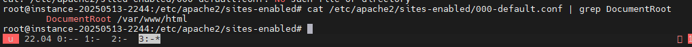
		- Kiểm tra truy cập đã hiển thị trang mới tạo
		- 

	- Nginx
		- Tương tự trên server đã cài nginx tạo file html để test 
		```
		nano /var/www/html/home.html 

		```
		```
		<!DOCTYPE html>
		<html lang="vi">
		<head>
			<meta charset="UTF-8">
			<title>Website Test Nginx</title>
			<style>
				body {
					font-family: Arial, sans-serif;
					background-color: #eef;
					text-align: center;
					padding-top: 100px;
				}
				h1 {
					color: #333;
				}
				p {
					color: #555;
				}
			</style>
		</head>
		<body>
			<h1>Website HTML trên Nginx!</h1>
			<p>Đây là trang web test</p>
		</body>
		</html>

		```
		- 
		- Kiểm tra cấu hình virtual host mặc định đảm bảo root trỏ về thư mục HTML 
		```
		cat /etc/nginx/sites-enabled/default | grep root
		```
		- 
		- Kiểm tra truy cập đã hiển thị trang mới tạo
		- 


- PHP 
	- Apache 
		- Cài đặt package php
		```
		sudo apt install php libapache2-mod-php -y
		```
		- 
		- Sau khi cài đặt chạy lệnh sau để kiểm tra phiên bản php 
		```
		php -v
		```
		- 
		- Tạo file `info.php` trong thư mục web root sử dụng default host và folder web mặc định 
		```
		nano /var/www/html/info.php
		```
		```
		< ?php
		phpinfo () ;
		? >
		```
		- 
		- Kiểm tra 
		- 

	- Nginx
		- Để cài đặt PHP cho Nginx, cần sử dụng thư viện php-fpm. Cài đặt thông qua lệnh: 
		```
		sudo apt-get install php8.1-fpm -y
		```
		- 
		- Kiểm tra sau khi cài 
		```
		sudo systemctl status php8.1-fpm
		```
		- 
		- Cấu hình PHP cho Nginx 
		- Với Nginx và PHP-FPM đã được cài đặt, cần phải chỉnh sửa tệp cấu hình Nginx mặc định. Thao tác này cho phép Trình quản lý tiến trình FastCGI của PHP xử lý các yêu cầu có phần mở rộng .php.
		```
		sudo nano /etc/nginx/sites-available/default
		```
		- Thực hiện 
			- Uncomment dòng `snippets/fastcgi-php.conf`.
			- Uncomment để bật `fastcgi_pass` và `php8.1-fpm.sock`.
			- Uncomment phần cấu hình từ chối tất cả quyền truy cập vào các tệp `.htaccess` của Apache.
		- 

		- Sử dụng lệnh sau để kiểm tra các lỗi cú pháp trong file cấu hình nginx 
		```
		sudo nginx -t
		```
		- Restart nginx để apply cấu hình 
		```
		sudo systemctl restart nginx
		```
		- 

		- Tạo file `info.php` trong thư mục web root sử dụng default host và folder web mặc định 
		```
		nano /var/www/html/info.php
		```
		```
		< ?php
		phpinfo () ;
		? >
		```
		- 
		- Kiểm tra 
		- 

<!-- TOC --><a name="93-trin-khai-https-vi-lets-encrypt"></a>
### 9.3  Triển khai HTTPS với Let’s Encrypt.
<!-- TOC --><a name="931-apache"></a>
#### 9.3.1 Apache
- Trong bài lab này thực hiện với domain `annth.io.vn` trên máy chủ VPS có IP `134.185.100.155`
	- Cấu hình bản ghi A  
	- 
- Tạo folder lưu source web 
	- Source được lưu ở thư mục /var/www/annth/public_html/
	```
	mkdir -p /var/www/annth/public_html/
	chown -R $USER:$USER /var/www/annth/public_html/
	chmod -R 755 /var/www/
	```
	- 
- Tạo Virtual Host mới và thêm nội dung
```
nano /etc/apache2/sites-available/annth.conf
```
```
<VirtualHost *:80>
    ServerAdmin admin@annth.io.vn
    ServerName annth.io.vn
    ServerAlias www.annth.io.vn
    DocumentRoot /var/www/annth/public_html/
    ErrorLog /var/log/apache2/annth.error.log
    CustomLog /var/log/apache2/annth.access.log combined
</VirtualHost>
```
- 
- Trong đó:
	- ServerAdmin là từ khóa khai báo địa chỉ email của admin
	- ServerName là tên miền mà ta muốn chạy website
	- DocumentRoot là từ khóa khai báo đường dẫn của source code khi người dùng truy cập vào domain được cấu hình. Đường dẫn này có thể nằm ở bất kỳ một phân vùng nào.
	- ErrorLog là đường dẫn file log thì có lỗi
	- CustomLog là đường dẫn file log ghi lại tất cả các request và người dùng truy cập.
- Kích hoạt Virtual Host
```
a2ensite annth.conf
```
- 
- Disable host mặc định
``` 
a2dissite 000-default.conf default-ssl.conf
```
- 
- Sau đó khởi động lại dịch vụ apache2
```
systemctl restart apache2 
```
- Tạo một trang web test đơn giản với lệnh
	```
	nano /var/www/annth/public_html/index.html
	```
	- Nội dung như sau:
	```
	<!DOCTYPE html>
	<html lang="vi">
	<head>
		<meta charset="UTF-8">
		<title>Website Test</title>
		<style>
			body {
				font-family: sans-serif;
				text-align: center;
				margin-top: 100px;
			}
		</style>
	</head>
	<body>
		<h1>annth.io.vn</h1>
		<p>Website test đơn giản trên Apache</p>
		<footer>
			© 2025 annth.io.vn
		</footer>
	</body>
	</html>
	```
	- 
- Kiểm tra kết quả bằng cách truy cập tên miền http://annth.io.vn
- 
- Hiện website đang không có SSL 
- 
- Để lấy chứng chỉ SSL với Let's Encrypt, thực hiện cài đặt Certbot. Cần hai gói: certbot và python3-certbot-apache. Gói thứ hai là một plugin tích hợp Certbot với Apache, giúp tự động hóa việc lấy chứng chỉ và cấu hình HTTPS trong máy chủ web chỉ bằng một lệnh duy nhất:
```
sudo apt install certbot python3-certbot-apache -y 
```
- 
- Để lấy chứng chỉ SSL, Certbot cung cấp nhiều cách thông qua các plugin. Plugin Apache sẽ tự động cấu hình lại Apache và tải lại cấu hình khi cần thiết. Để sử dụng plugin này, hãy chạy lệnh sau:
	```
	sudo certbot --apache
	```
	- Cung cấp các thông tin email, chấp nhận điều khoản, chọn domain cần lấy chứng chỉ. 
	- 
	- 
- Kiểm tra sau khi đã thêm SSL 
- 

<!-- TOC --><a name="931-nginx"></a>
#### 9.3.1 Nginx 
- Trong bài lab này thực hiện với domain `annth.io.vn` trên máy chủ VPS có IP `134.185.100.155`
	- Cấu hình bản ghi A  
	- 
- Tạo folder lưu source web 
	- Source được lưu ở thư mục /var/www/annth.io.vn/html
	```
	mkdir -p /var/www/annth.io.vn/html
	chown -R $USER:$USER /var/www/annth.io.vn/html
	chmod -R 755 /var/www/
	```
- 
- Tạo virtual host 
```
sudo nano /etc/nginx/sites-available/annth.io.vn
```
```
server {
        listen 80;
        listen [::]:80;

        root /var/www/annth.io.vn/html;
        index index.html index.htm index.nginx-debian.html;

        server_name annth.io.vn www.annth.io.vn;

        location / {
                try_files $uri $uri/ =404;
        }
}
```
- 
- Enable VirtualHost
```
sudo ln -s /etc/nginx/sites-available/annth.io.vn /etc/nginx/sites-enabled/
```
- 
- Chạy lệnh kiểm tra lỗi
```
sudo nginx -t
```
- Restart Nginx để apply cấu hình 
```
sudo systemctl restart nginx
```
- 
- Tạo một trang web test đơn giản với lệnh
```
nano /var/www/annth.io.vn/html/index.html
```
- Nội dung như sau:
```
<!DOCTYPE html>
<html lang="vi">
<head>
    <meta charset="UTF-8">
    <title>Website Test</title>
    <style>
        body {
            font-family: sans-serif;
            text-align: center;
            margin-top: 100px;
        }
    </style>
</head>
<body>
    <h1>annth.io.vn</h1>
    <p>Website test đơn giản trên Nginx</p>
    <footer>
        © 2025 annth.io.vn
    </footer>
</body>
</html>
```
- 

- Kiểm tra kết quả bằng cách truy cập tên miền http://annth.io.vn
- 
- Để lấy chứng chỉ SSL với Let's Encrypt, thực hiện cài đặt Certbot. Cần hai gói: certbot và python3-certbot-apache. Gói thứ hai là một plugin tích hợp Certbot với Nginx, giúp tự động hóa việc lấy chứng chỉ và cấu hình HTTPS trong máy chủ web chỉ bằng một lệnh duy nhất:
```
sudo apt install certbot python3-certbot-nginx
```
- 
- Plugin Nginx sẽ tự động cấu hình lại Nginx và tải lại cấu hình bất cứ khi nào cần thiết.
```
sudo certbot --nginx -d annth.io.vn -d www.annth.io.vn
```
- 
- Kiểm tra sau khi đã thêm SSL 
- 


<!-- TOC --><a name="95-cu-hình-nginx-làm-reverse-proxy-cho-apache"></a>
### 9.5  Cấu hình nginx làm reverse proxy cho apache 
- Mô hình 
	- 1 ubuntu nginx `192.168.100.50` 
	- 1 ubuntu apache backend  `10.10.10.120` 
	- 
- Cấu hình 
	- Trên ubuntu backend `10.10.10.120` 
		- Cài đặt apache2 
		```
		apt update 
		apt install apache2 -y 
		```
		- Tạo folder source code và webpage đơn giản 
		- Trong bài lab,sử dụng domain labrv-annth.com với source được lưu ở thư mục /var/www/labrv-annth.com/public_html/
		```
		mkdir -p /var/www/labrv-annth.com/public_html/
		chown -R $USER:$USER /var/www/labrv-annth.com/public_html/
		chmod -R 755 /var/www/
		```
		- 
		- Tạo một trang web test đơn giản với lệnh
		```
		nano /var/www/labrv-annth.com/public_html/index.html
		```
		- Nội dung như sau:
		```
		<!DOCTYPE html>
		<html lang="vi">
		<head>
			<meta charset="UTF-8">
			<title>Website Test</title>
			<style>
				body {
					font-family: sans-serif;
					text-align: center;
					margin-top: 100px;
				}
			</style>
		</head>
		<body>
			<h1>Apache BE</h1>
			<p>Lab Nginx Reverse Proxy </p>
			<footer>
				© 2025 annth.io.vn
			</footer>
		</body>
		</html>
		```
		- 
		- Tạo 1 file Virtual Host mới và thêm nội dung
		```
		nano /etc/apache2/sites-available/labrv-annth.com.conf
		```
		```
		<VirtualHost *:80>
			ServerAdmin admin@labrv-annth.com
			ServerName labrv-annth.com
			ServerAlias www.labrv-annth.com
			DocumentRoot /var/www/labrv-annth.com/public_html/
			ErrorLog /var/log/apache2/labrv-annth.com.error.log
			CustomLog /var/log/apache2/labrv-annth.com.access.log combined
		</VirtualHost>
		```
		- 
			- Trong đó:
				- ServerAdmin là từ khóa khai báo địa chỉ email của admin
				- ServerName là tên miền mà ta muốn chạy website
				- DocumentRoot là từ khóa khai báo đường dẫn của source code khi người dùng truy cập vào domain được cấu hình. Đường dẫn này có thể nằm ở bất kỳ một phân vùng nào.
				- ErrorLog là đường dẫn file log thì có lỗi
				- CustomLog là đường dẫn file log ghi lại tất cả các request và người dùng truy cập.
		- Kích hoạt Virtual Host
		```
		a2ensite labrv-annth.com.conf
		```
		- 
		- Disable host mặc định 
		```
		a2dissite 000-default.conf default-ssl.conf
		```
		- 
		- Sau đó khởi động lại dịch vụ apache2
		```
		systemctl restart apache2 
		```
	- Trên máy ubuntu nginx `192.168.100.50` 
		- Cài đặt Nginx
		```
		apt update 
		apt install nginx -y 
		```
		- 
		- Disable virtualhost mặc định 
		```
		sudo rm /etc/nginx/sites-enabled/default
		```
		- Thực hiện sửa cấu hình Nginx. Cấu hình chuyển tiếp đến backend apache2 listen 80
		```
		sudo nano /etc/nginx/sites-available/labrv-annth.com
		```
		```
		server {
			listen 80;
			server_name labrv-annth.com www.labrv-annth.com;

			location / {
				proxy_pass http://10.10.10.120:80;
				proxy_set_header Host $host;
				proxy_set_header X-Real-IP $remote_addr;
				proxy_set_header X-Forwarded-For $proxy_add_x_forwarded_for;
				proxy_set_header X-Forwarded-Proto $scheme;
			}
		}
		```
		- 
		- Enable Virtual Host 
		```
		sudo ln -s /etc/nginx/sites-available/labrv-annth.com /etc/nginx/sites-enabled/labrv-annth.com
		```
		- 
- Kiểm tra 
	- Từ client 192.168.100.128 thực hiện truy cập vào IP 192.168.100.50 chuyển tiếp tới webserver 10.10.10.120 
	- 

<!-- TOC --><a name="96-cu-hình-nginx-load-balancing-cho-apache"></a>
### 9.6  Cấu hình nginx load balancing cho apache 
- Mô hình 
	- 1 ubuntu nginx `192.168.100.50` 
	- 2 ubuntu apache backend  `10.10.10.120` và `10.10.10.130`
	- 
- Cấu hình 
	- Trên 2 ubuntu backend 
		- Cài đặt apache2 
		```
		apt update 
		apt install apache2 -y 
		```
		- Tạo folder source code và webpage đơn giản 
		- Trong bài lab,sử dụng domain lablb-annth.com với source được lưu ở thư mục /var/www/lablb-annth.com/public_html/
		```
		mkdir -p /var/www/lablb-annth.com/public_html/
		chown -R $USER:$USER /var/www/lablb-annth.com/public_html/
		chmod -R 755 /var/www/
		```
		- Tạo một trang web test đơn giản với lệnh
		```
		nano /var/www/lablb-annth.com/public_html/index.html
		```
		- Nội dung như sau: 
		- Với Webserver 1 
		``` 
		<!DOCTYPE html>
		<html lang="vi">
		<head>
			<meta charset="UTF-8">
			<title>Website Test</title>
			<style>
				body {
					font-family: sans-serif;
					text-align: center;
					margin-top: 100px;
				}
			</style>
		</head>
		<body>
			<h1>Apache BE 1</h1>
			<p>Lab Nginx Load Balancing</p>
			<footer>
				© 2025 annth.io.vn
			</footer>
		</body>
		</html>
		```
		- Với Webserver 2
		```
		<!DOCTYPE html>
		<html lang="vi">
		<head>
			<meta charset="UTF-8">
			<title>Website Test</title>
			<style>
				body {
					font-family: sans-serif;
					text-align: center;
					margin-top: 100px;
				}
			</style>
		</head>
		<body>
			<h1>Apache BE 2</h1>
			<p>Lab Nginx Load Balancing</p>
			<footer>
				© 2025 annth.io.vn
			</footer>
		</body>
		</html>
		```
		- 

		- Tạo 1 file Virtual Host mới và thêm nội dung
		```
		nano /etc/apache2/sites-available/lablb-annth.com.conf
		```
		```
		<VirtualHost *:80>
			ServerAdmin admin@lablb-annth.com
			ServerName lablb-annth.com
			ServerAlias www.lablb-annth.com
			DocumentRoot /var/www/lablb-annth.com/public_html/
			ErrorLog /var/log/apache2/lablb-annth.com.error.log
			CustomLog /var/log/apache2/lablb-annth.com.access.log combined
		</VirtualHost>
		```
		- 

		- Trong đó:
			- ServerAdmin là từ khóa khai báo địa chỉ email của admin
			- ServerName là tên miền mà ta muốn chạy website
			- DocumentRoot là từ khóa khai báo đường dẫn của source code khi người dùng truy cập vào domain được cấu hình. Đường dẫn này có thể nằm ở bất kỳ một phân vùng nào.
			- ErrorLog là đường dẫn file log thì có lỗi
			- CustomLog là đường dẫn file log ghi lại tất cả các request và người dùng truy cập.
		- Kích hoạt Virtual Host
		```
		a2ensite lablb-annth.com.conf
		```
		- Disable host mặc định 
		```
		a2dissite 000-default.conf default-ssl.conf
		```
		- Sau đó khởi động lại dịch vụ apache2
		```
		systemctl restart apache2 
		```
		- 

	- Trên máy ubuntu nginx 
		- Cài đặt Nginx 
		``` 
		apt update 
		apt install nginx -y
		``` 
		- 
		- Disable virtualhost mặc định 
		```
		sudo rm /etc/nginx/sites-enabled/default
		```
		- Cấu hình loadbalancing 
			```
			sudo nano /etc/nginx/sites-available/lablb-annth.com
			```
			```
			upstream backend {
					server 10.10.10.120:80;
					server 10.10.10.130:80;
				}
				
			server {
				listen 80;
				server_name labrv-annth.com www.labrv-annth.com;

				location / {
					proxy_pass http://backend;
				}
			}
			```
			- upstream backend: Định nghĩa một nhóm máy chủ phụ trợ gồm hai IP (10.10.10.120:80, 10.10.10.130:80).
			- server { ... }: Máy chủ ảo này lắng nghe cổng 80 cho các tên miền labrv-annth.com và www.labrv-annth.com.
			- proxy_pass http://backend;: Mọi yêu cầu đến sẽ được chuyển tiếp và phân phối (cân bằng tải) tới nhóm máy chủ backend đó.
		- 
		- Enable VirtualHost
		```
		sudo ln -s /etc/nginx/sites-available/lablb-annth.com /etc/nginx/sites-enabled/lablb-annth.com
		```
		- 

- Kiểm tra 
	- Từ client 192.168.100.128 truy cập `lablb-annth.com`
	- Thực hiện refesh vài lần thấy chuyển qua lại giữa webserver 1 và webserver 2 
- 
- 


<!-- TOC --><a name="10-các-vn-thng-gp"></a>
## 10. Các vấn đề thường gặp
<!-- TOC --><a name="101-li-403-404-500-và-cách-khc-phc"></a>
### 10.1  Lỗi 403, 404, 500 và cách khắc phục.
<!-- TOC --><a name="1011-403-error"></a>
#### 10.1.1 403 Error 
	- Đây là một mã trạng thái HTTP (HTTP Status code) cho biết máy chủ đã hiểu yêu cầu của bạn nhưng không thể cấp quyền truy cập, có thể là do website không có dữ liệu hoặc bạn không có đủ quyền truy cập hay bị chặn bởi hosting. Máy chủ web khác nhau sẽ thông báo lỗi HTTP 403 Error theo những cách khác nhau.
	- Ví dụ về một số thông báo lỗi thường gặp:
		- Forbidden: Bạn không có quyền truy cập vào [thư mục] trên server này.
		- 403 – Forbidden Error – Bạn không được phép truy cập vào địa chỉ này.
		- HTTP Error 403 – Forbidden – Bạn không có quyền truy cập vào tài liệu hoặc chương trình được yêu cầu.
		- 403 Forbidden – Quyền truy cập vào tài nguyên này trên máy chủ bị từ chối.
		- You are not authorized to view this page.
		- It appears you don’t have permission to access this page.
		- HTTP Error 403 – Forbidden.
		- 403 Forbidden – nginx.
		- 403 forbidden: Yêu cầu bị cấm bởi các rule quản trị.
		- 403 forbidden.
		- Access Denied: Bạn không có quyền truy cập.
		- HTTP 403.
		- HTTP Error 403.14 – Forbidden.
		- Error 403.
	- Một vài nguyên nhân có thể dẫn đến lỗi 403 
		- Tệp `.htaccess` bị hỏng hoặc cấu hình sai.
		- Phân quyền các tệp và thư mục web bị sai 
		- Xung đột plugins trong WordPress
		- File index mặc định (index.html, index.php) bị thiếu. 
	- Cách khắc phục 
		- Tệp `.htaccess` liên quan tới nhiều cấu hình cài đặt. Thực hiện backup và comment từng dòng và kiểm tra. Nếu đã tìm thấy dòng gây lỗi thực hiện sửa chữa cấu hình. 
		- Phân lại quyền cho thư mục chứa web: 755 cho folder, 644 cho nội dung tĩnh, 700 cho nội dung động 
		- Deactive plugins trong Wordpress: thực hiện disable toàn bộ plugins và kiểm tra nếu không có lỗi 403 thì thực hiện enable lại plugins, disable lần lượt để test và tìm ra plugin gây lỗi từ đó update sửa lỗi hoặc xoá bỏ. 
		- Thực hiện tạo file index mặc định hoặc cấu hình Redirect trong `.htaccess` về file homepage đang sử dụng `Redirect index.html /myhomepagehtml`
<!-- TOC --><a name="1012-404-error"></a>
#### 10.1.2 404 Error 
- Mã trạng thái 404 cho người dùng web biết rằng một trang được yêu cầu không có sẵn. Mã 404 có nghĩa là một máy chủ không thể tìm thấy trang web mà khách hàng yêu cầu. Các biến thể của thông báo lỗi bao gồm "Lỗi 404", "Không tìm thấy trang 404" và "URL được yêu cầu không tìm thấy."		
- Một vài nguyên nhân dẫn đến lỗi 404 và giải pháp khắc phục 
	- File hoặc đường dẫn không tồn tại
		- Nguyên nhân: Tài nguyên (file, hình ảnh, trang HTML...) bị xóa, đổi tên hoặc chưa được tải lên.
		- Giải pháp: Kiểm tra thư mục gốc (`DocumentRoot`) của web server để đảm bảo file tồn tại và đường dẫn chính xác. Chú ý phân biệt chữ hoa – chữ thường trên hệ thống Linux.
	- Cấu hình sai `DocumentRoot` hoặc `server block`
		- Nguyên nhân: Web server trỏ đến sai thư mục chứa nội dung.
		- Giải pháp: Kiểm tra và chỉnh sửa file cấu hình web server (Apache hoặc Nginx). Sau đó khởi động lại dịch vụ để áp dụng thay đổi.
	- Lỗi rewrite URL hoặc file `.htaccess` bị lỗi (Apache)
		- Nguyên nhân: Quy tắc rewrite URL sai hoặc `.htaccess` hỏng khiến máy chủ không tìm thấy tài nguyên.
		- Giải pháp: Kiểm tra và khôi phục file `.htaccess`. Đảm bảo đã bật `mod_rewrite` trên Apache (`sudo a2enmod rewrite`).
	- Phân quyền file hoặc thư mục không đúng
		- Nguyên nhân: Web server không có quyền truy cập vào tài nguyên.
		- Giải pháp: Cấp quyền phù hợp:
		  - `chmod 644 <tên file>`
		  - `chmod 755 <thư mục>`
		  - `chown -R www-data:www-data /var/www/html` (với Apache/Nginx)
	- Người dùng nhập sai URL
		- Nguyên nhân: Gõ sai đường dẫn hoặc tên file.
		- Giải pháp: Kiểm tra lại URL trên trình duyệt, đảm bảo đúng tên file và đúng định dạng. Lưu ý: URL phân biệt chữ hoa và chữ thường trên Linux.
	- Trang bị lỗi hoặc plugin tạo URL không hợp lệ
		- Nguyên nhân: Plugin trong CMS (như WordPress) tạo đường dẫn không hợp lệ hoặc bị lỗi.
		- Giải pháp: Tạm thời vô hiệu hóa plugin, cập nhật lại cấu trúc permalink (đường dẫn tĩnh) trong phần cài đặt CMS.
	- Tài nguyên bị CDN hoặc firewall chặn
		- Nguyên nhân: Các dịch vụ CDN (như Cloudflare) hoặc firewall chặn truy cập tới tài nguyên.
		- Giải pháp: Kiểm tra cấu hình CDN, tạm thời tắt để xác định có phải nguyên nhân gây lỗi. Kiểm tra log của firewall nếu cần.
		
<!-- TOC --><a name="1013-500-error"></a>
#### 10.1.3 500 Error 
- 500 Internal Server Error là một lỗi máy chủ chung chung cho biết máy chủ web gặp sự cố và không thể hoàn thành yêu cầu của trình duyệt.
- Đây là lỗi phía máy chủ, không phải lỗi từ phía người dùng.
- Một vài nguyên nhân phổ biến và giải pháp 
	- Lỗi cú pháp hoặc lỗi logic trong mã nguồn
		- Nguyên nhân: Code PHP, Python, Node.js... có lỗi như gọi hàm sai, biến chưa định nghĩa, hoặc exception không được xử lý.
		- Giải pháp: 
		  - Kiểm tra log lỗi của web server (Apache: `error.log`, Nginx: `error.log`, PHP: `php_error.log`).
		  - Sử dụng try-catch, kiểm tra các file log chi tiết để xác định dòng gây lỗi.
	- Cấu hình sai trong file `.htaccess` (Apache)
		- Nguyên nhân: Sai cú pháp, chỉ thị không được hỗ trợ hoặc rewrite rule sai.
		- Giải pháp:
		  - Tạm đổi tên file `.htaccess` để vô hiệu hóa và kiểm tra lại.
		  - Dùng công cụ kiểm tra cú pháp `.htaccess` hoặc xem log Apache.
	- Quyền truy cập file không phù hợp
		- Nguyên nhân: Web server không thể đọc thực thi file do thiếu quyền truy cập.
		- Giải pháp:
		  - Đảm bảo file có quyền đúng: `chmod 644` cho file, `chmod 755` cho thư mục.
		  - Đảm bảo chủ sở hữu là người dùng web server (`www-data`, `apache`, v.v.).
	- Lỗi kết nối tới Database
		- Nguyên nhân: Kết nối CSDL thất bại (sai username/password, database bị tắt, lỗi cấu hình).
		- Giải pháp:
		  - Kiểm tra cấu hình DB trong file cấu hình ứng dụng.
		  - Đảm bảo dịch vụ CSDL đang chạy và user có quyền truy cập.
	- Hết giới hạn bộ nhớ PHP hoặc timeout
		- Nguyên nhân: Script chạy vượt quá giới hạn bộ nhớ hoặc thời gian thực thi cho phép.
		- Giải pháp:
		  - Tăng giới hạn trong `php.ini`:
			```ini
			memory_limit = 256M
			max_execution_time = 60
			```
		  - Kiểm tra code có vòng lặp vô hạn hoặc truy vấn tốn thời gian.
	- Lỗi do plugin hoặc extension (CMS như WordPress)
		- Nguyên nhân: Plugin bị lỗi hoặc xung đột với theme/phiên bản CMS.
		- Giải pháp:
		  - Tắt tất cả plugin, bật lại từng cái để xác định plugin lỗi.
		  - Cập nhật plugin và CMS lên bản mới nhất.
	- Máy chủ quá tải hoặc lỗi tạm thời từ dịch vụ phụ trợ
		- Nguyên nhân: Server bị quá tải, dịch vụ phụ trợ (Redis, API bên ngoài...) gặp lỗi.
		- Giải pháp:
		  - Kiểm tra tài nguyên máy chủ (CPU, RAM, Disk).
		  - Giảm tải hoặc dùng cache để tránh truy vấn thời gian thực.
	- Cấu hình sai trong file cấu hình server (Apache/Nginx)
		- Nguyên nhân: Lỗi trong file `nginx.conf`, `apache2.conf`, hoặc cấu hình vhost.
		- Giải pháp:
		  - Kiểm tra file cấu hình với lệnh:
			- Apache: `apachectl configtest`
			- Nginx: `nginx -t`
		  - Sửa lỗi theo thông báo và restart lại dịch vụ.

<!-- TOC --><a name="102-ti-u-database-kt-hp-web-server"></a>
### 10.2  Tối ưu database kết hợp web server.
- Hầu hết các ứng dụng web hiện đại xử lý rất nhiều dữ liệu. Có nhiều loại cơ sở dữ liệu khác nhau xử lý dữ liệu theo những cách khác nhau, nhưng chúng có những điểm tương đồng. Đối với các ứng dụng web, hiệu suất cơ sở dữ liệu ảnh hưởng trực tiếp đến trải nghiệm người dùng. Hiệu suất cơ sở dữ liệu kém có thể dẫn đến thời gian phản hồi chậm, người dùng thất vọng và mất cơ hội kinh doanh.
- Tối ưu hóa hiệu suất cơ sở dữ liệu bao gồm việc cải thiện tốc độ và hiệu quả của các truy vấn cơ sở dữ liệu, giảm độ trễ và tăng thông lượng. Bằng cách tối ưu hóa cơ sở dữ liệu, giúp đảm bảo thời gian thực thi truy vấn nhanh hơn và hiệu suất ứng dụng tổng thể tốt hơn.
- Các chỉ số hiệu suất chính cần được tối ưu với database:
	- Thời gian thực thi truy vấn - Query execution time: Thời gian cơ sở dữ liệu xử lý một truy vấn. Nhanh hơn nghĩa là tốt hơn.
	- Thông lượng cơ sở dữ liệu - Throughput : Số giao dịch cơ sở dữ liệu xử lý trong một khoảng thời gian. Cao hơn nghĩa là hiệu quả hơn.
	- Độ trễ - Latency : Thời gian truy vấn đi từ ứng dụng đến cơ sở dữ liệu và trở về. Thấp hơn nghĩa là phản hồi nhanh hơn.
- Tối ưu hóa Database:
	- SQL truy vấn hiệu quả:
		* Kỹ thuật SELECT: Chọn những cột cần thiết, tránh SELECT *.
		* JOIN tối ưu: Sử dụng các JOIN hiệu quả và tránh các JOIN phức tạp.
		* SUBQUERY: Sử dụng subquery một cách hợp lý và tránh những subquery quá phức tạp.
	- Sử dụng chỉ mục (index):
		* Tạo chỉ mục trên các cột thường được truy vấn: Chỉ mục giúp đẩy nhanh quá trình tìm kiếm dữ liệu.
		* Lựa chọn loại chỉ mục phù hợp: Có nhiều loại chỉ mục (B-tree, hash, full-text) và cần chọn loại phù hợp với dữ liệu.
	- Tối ưu hóa schema:
		* Thiết kế schema hợp lý: Schema tốt giúp cải thiện tốc độ truy cập và hiệu suất chung.
		* Sử dụng các kiểu dữ liệu thích hợp: Kiểu dữ liệu không phù hợp có thể làm giảm hiệu suất.
	- Kiểm tra và sửa lỗi:
		* Kiểm tra các truy vấn chậm: Sử dụng các công cụ giám sát để phát hiện truy vấn chậm.
		* Xử lý các lỗi trong database: Lỗi có thể ảnh hưởng đến hiệu suất. 
- Tối ưu hóa Web Server:
	- Caching:
		- Sử dụng caching để giảm tải cho database: Lưu trữ dữ liệu đã truy vấn trong cache để truy xuất nhanh hơn.
		- Sử dụng các loại cache khác nhau: Cache bộ nhớ, cache web server, cache CDN.
	- Điều chỉnh cấu hình web server:
		- Tăng số lượng worker processes: Giúp web server xử lý nhiều yêu cầu cùng lúc.
		- Tối ưu hóa cấu hình web server: Điều chỉnh các tham số cấu hình để tăng hiệu suất.
	- Tải xuống tĩnh:
		- Sử dụng các file tĩnh (CSS, JavaScript, hình ảnh) và tải chúng lên CDN: Giúp giảm tải cho web server và tăng tốc độ tải trang.
- Kết hợp Database và Web Server:
	- Sử dụng các công cụ giám sát:
		- Theo dõi hiệu suất của cả database và web server: Giúp phát hiện các vấn đề và tối ưu hóa hiệu suất. 
		- Sử dụng các công cụ như Nagios, Prometheus, hoặc các công cụ giám sát tích hợp của DBMS
	- Sử dụng các kỹ thuật phân phối tải:
		- Sử dụng các load balancer: Phân phối tải giữa các web server. 
		- Sử dụng các database master-slave: Phân phối tải cho các truy vấn đọc và viết. 
<!-- TOC --><a name="103-x-lý-ti-cao-scaling-theo-chiu-ngangdc"></a>
### 10.3  Xử lý tải cao (scaling theo chiều ngang/dọc).
- Khả năng mở rộng (Scalability) là khả năng của một hệ thống để hỗ trợ sự phát triển hoặc quản lý khối lượng công việc ngày càng tăng.
	- Khi khối lượng công việc hoặc phạm vi của một hệ thống tăng lên, nó phải có khả năng duy trì hoặc thậm chí cải thiện hiệu suất, hiệu quả và độ tin cậy của mình. Đây chính là khả năng mở rộng.
	- Một hệ thống phải có khả năng mở rộng để đáp ứng lượng truy cập người dùng, khối lượng dữ liệu hoặc nhu cầu tính toán ngày càng tăng mà không bị giảm hiệu suất đáng kể hoặc phải thiết kế lại toàn bộ.
- Tầm quan trọng của scaling
	- Quản lý tăng trưởng: Giúp hệ thống xử lý lượng người dùng, dữ liệu và lưu lượng lớn hơn mà không giảm tốc độ hay độ tin cậy.
	- Nâng cao hiệu suất: Phân chia tải giúp tăng tốc độ xử lý và thời gian phản hồi.
	- Đảm bảo tính sẵn sàng: Giúp hệ thống hoạt động liên tục ngay cả khi có sự cố hoặc lưu lượng tăng đột biến.
	- Hiệu quả chi phí: Linh hoạt điều chỉnh tài nguyên theo nhu cầu, tránh lãng phí.
	- Khuyến khích đổi mới: Giảm rào cản hạ tầng, giúp doanh nghiệp dễ dàng phát triển tính năng mới và thích nghi thị trường.
<!-- TOC --><a name="1031-horizontal-scaling"></a>
#### 10.3.1 Horizontal Scaling 
- Scaling theo chiều ngang hay scaling out là việc thêm các nút (node) hoặc máy móc bổ sung vào hạ tầng để đáp ứng các yêu cầu mới. Nếu bạn đang chạy một ứng dụng trên một máy chủ và nhận thấy nó không còn đủ khả năng hoặc dung lượng để xử lý lưu lượng truy cập, việc thêm một máy chủ mới có thể là giải pháp.
- 
- Phương pháp này nhằm gia tăng hiệu suất của dịch vụ bằng cách thêm nhiều phiên bản máy chủ hơn vào nhóm máy chủ hiện có để tải (load) có thể phân bố đồng đều.
- Phương pháp horizontal scaling không thay đổi dung lượng mà thay vào đó là giảm tải cho từng máy chủ. Với sự hỗ trợ đắc lực của hệ thống tệp phân tán (distributed file system), clustering và load balancing, horizontal scaling đã phát huy tối đa vai trò của nó. 
- Giả sử 1 doanh nghiệp nào đó đang vận hành một trang web kinh doanh trên 1 máy chủ. Khi doanh nghiệp phát triển và lưu lượng truy cập vào trang web này tăng lên đáng kể sẽ làm gia tăng tải lên máy chủ và các node. Để giảm tải, doanh nghiệp có thể chọn 1  trong các loại auto scaling phổ biến như mở rộng quy mô theo phương pháp horizontal scaling bằng cách thêm vào 1 máy chủ khác có dung lượng tương đồng với máy chủ hiện có. Cuối cùng, với 2 máy chủ thì lưu lượng truy cập có thể được quản lý dễ dàng và hiệu quả hơn.
- Ưu điểm của mở rộng theo chiều ngang
	- Nâng cấp phần cứng đơn giản hơn: Bạn chỉ cần thêm nhiều máy hơn. Không cần phân tích hoặc nâng cấp thông số kỹ thuật hệ thống.
	- Ít thời gian ngừng hoạt động hơn: Vì bạn đang thêm các máy chủ mới, các máy chủ cũ vẫn tiếp tục chạy. Nếu thực hiện đúng cách, có thể tránh được thời gian ngừng hoạt động.
	- Khả năng phục hồi và chịu lỗi tốt hơn: Phân tán hoạt động trên nhiều nút (node) giúp giảm rủi ro hỏng hóc toàn bộ hệ thống.
	- Hiệu suất được cải thiện: Nhiều máy xử lý lưu lượng truy cập tốt hơn bằng cách cung cấp nhiều điểm kết nối hơn.
- Nhược điểm của mở rộng theo chiều ngang
	- Bảo trì và độ phức tạp cao hơn: Quản lý nhiều máy chủ yêu cầu các công cụ bổ sung cho cân bằng tải, ảo hóa và sao lưu. Bạn cũng cần đảm bảo rằng các nút đồng bộ hóa và giao tiếp đúng cách.
	- Chi phí ban đầu cao hơn: Thêm máy chủ mới thường tốn kém hơn so với việc nâng cấp máy chủ hiện có.
- Ví dụ về mở rộng theo chiều ngang
	- Kiến trúc máy chủ web thường sử dụng mở rộng theo chiều ngang. 
	- Ví dụ, Google phân tán các truy vấn tìm kiếm trên hàng ngàn máy chủ trên toàn thế giới, giúp tăng hiệu suất và cho phép chuyển đổi dự phòng nếu một máy chủ gặp sự cố.
	- Các nền tảng đám mây như AWS và Azure cung cấp tính năng tự động mở rộng (auto-scaling), tự động thêm hoặc xóa các phiên bản (instances) dựa trên nhu cầu. Một trang web thương mại điện tử có thể mở rộng quy mô trong đợt giảm giá, sau đó thu nhỏ lại để tiết kiệm chi phí.
<!-- TOC --><a name="1032-vertical-scaling"></a>
#### 10.3.2 Vertical Scaling 
- Scaling theo chiều dọc hay scaling up là việc thêm tài nguyên bổ sung vào một hệ thống để nó đáp ứng nhu cầu. 
- 
- Trong khi mở rộng theo chiều ngang đề cập đến việc thêm các nút (node) bổ sung, mở rộng theo chiều dọc mô tả việc thêm sức mạnh cho các máy hiện có.
- Giả sử 1 doanh nghiệp nào đó đang vận hành một trang web kinh doanh trên 1 máy chủ. Khi doanh nghiệp phát triển và lưu lượng truy cập vào trang web này tăng lên sẽ làm giảm đáng kể hiệu suất của máy chủ. Để giảm tải, doanh nghiệp có thể mở rộng tài nguyên bằng các loại auto scaling như thêm bộ xử lý CPU, RAM, dung lượng đĩa nhanh hơn, v.v. Đây chính là phương pháp vertical scaling nâng cao khả năng của cùng một máy chủ và node.
- Vertical Scaling là phương pháp gia tăng sức mạnh của từng máy chủ để xử lý tải (load) ngày càng tăng. Nó bị hạn chế bởi công suất của một máy duy nhất. Ngoài ra không có phân vùng dữ liệu cũng như tất cả đều nằm trên 1 node duy nhất. Phương pháp này thường được sử dụng rộng rãi cho các ứng dụng của những doanh nghiệp vừa và nhỏ. 
- Ưu điểm của mở rộng theo chiều dọc
	- Hiệu quả chi phí: Rẻ hơn so với việc mua phần cứng mới; ít cần các công cụ sao lưu hay ảo hóa.
	- Giao tiếp giữa các tiến trình ít phức tạp hơn: Một nút xử lý mọi thứ; không cần đồng bộ hóa.
	- Bảo trì ít phức tạp hơn: Ít nút hơn đồng nghĩa với việc duy trì dễ dàng hơn.
	- Ít cần thay đổi phần mềm: Phần mềm chạy mà không cần sửa đổi.
- Nhược điểm của mở rộng theo chiều dọc
	- Khả năng ngừng hoạt động cao hơn: Nâng cấp có thể làm gián đoạn dịch vụ.
	- Điểm lỗi duy nhất: Lỗi máy chủ duy nhất có nguy cơ mất toàn bộ dữ liệu.
	- Hạn chế nâng cấp: Mỗi máy chủ có giới hạn dung lượng cố định.
- Ví dụ về mở rộng theo chiều dọc
	- Một ví dụ phổ biến về mở rộng theo chiều dọc là nâng cấp một máy chủ cơ sở dữ liệu. Khi dữ liệu và giao dịch tăng lên, các nhóm có thể thêm CPU, tăng RAM hoặc sử dụng các ổ đĩa lưu trữ nhanh hơn. Điều này giúp tăng hiệu suất mà không cần quản lý nhiều phiên bản cơ sở dữ liệu.
	- Mở rộng theo chiều dọc cũng được sử dụng trong ảo hóa. Nếu một máy ảo (VM) đang lưu trữ một ứng dụng quan trọng cần thêm tài nguyên, bạn có thể thêm lõi CPU, bộ nhớ hoặc dung lượng đĩa vào cùng một máy ảo đó. Nó hoạt động tốt cho các khối lượng công việc có thể dự đoán được và cung cấp các nâng cấp nhanh chóng, đơn giản khi tốc độ là yếu tố quan trọng.
<!-- TOC --><a name="1033-diagonal-scaling"></a>
#### 10.3.3 Diagonal Scaling 
- Diagonal scaling là một phương pháp kết hợp những điểm tốt nhất của scaling theo chiều dọc và chiều ngang.
- 
- Thay vì chọn một trong hai, nó bắt đầu bằng cách mở rộng theo chiều dọc — thêm CPU, RAM hoặc bộ nhớ lưu trữ vào một máy chủ duy nhất — cho đến khi hệ thống đạt đến ngưỡng hiệu suất hoặc chi phí. Sau đó, nó chuyển sang mở rộng theo chiều ngang bằng cách sao chép hệ thống đã được tối ưu hóa sang các nút bổ sung.
- Phương pháp này mang lại sự linh hoạt cho các nhóm: bạn mở rộng theo chiều dọc để tối ưu hóa việc sử dụng tài nguyên, sau đó mở rộng theo chiều ngang để phân phối tải khi nhu cầu tăng lên. Nó giảm thiểu các nhược điểm chính của việc chỉ mở rộng theo chiều dọc (giới hạn phần cứng, điểm lỗi duy nhất) trong khi trì hoãn sự phức tạp của việc mở rộng theo chiều ngang (cân bằng tải, điều phối) cho đến khi thực sự cần thiết.
- Ưu điểm
	- Cân bằng hiệu suất và linh hoạt bằng cách kết hợp mở rộng theo chiều dọc và chiều ngang.
	- Cho phép mở rộng nhanh hơn trong ngắn hạn bằng cách nâng cấp theo chiều dọc các máy hiện có.
	- Hỗ trợ tăng trưởng dài hạn thông qua phân phối khối lượng công việc theo chiều ngang.
	- Giúp tối ưu hóa chi phí bằng cách chỉ sử dụng các phiên bản mạnh mẽ cho các dịch vụ quan trọng.
	- Giảm thời gian ngừng hoạt động bằng cách mở rộng quy mô trong thời gian lưu lượng truy cập cao trong khi vẫn giữ các dịch vụ cốt lõi ổn định.
	- Làm dễ dàng hơn việc chuyển đổi từ hệ thống nguyên khối sang microservices bằng cách bắt đầu với các nâng cấp theo chiều dọc.
	- Cải thiện khả năng phục hồi bằng cách phân phối lưu lượng truy cập trên nhiều phiên bản và vùng.
- Nhược điểm 
	- Kết hợp đắt đỏ giữa các phiên bản lớn và nhiều nút.
	- Quản lý hai chiến lược mở rộng làm tăng độ phức tạp kiến trúc.
	- Mở rộng theo chiều dọc có giới hạn vật lý làm giới hạn sự tăng trưởng dài hạn.
	- Trộn lẫn kích thước phiên bản có thể gây ra hiệu suất không đồng đều giữa các dịch vụ.
	- Yêu cầu thử nghiệm nhiều hơn để đảm bảo sự ổn định ở cả cấp độ phiên bản và hệ thống.
<!-- TOC --><a name="1034-so-sánh-và-usecase"></a>
#### 10.3.4 So sánh và usecase 
| Tiêu chí                | Mở rộng ngang (Horizontal Scaling)                          | Mở rộng dọc (Vertical Scaling)                               |
| ----------------------- | ----------------------------------------------------------- | ------------------------------------------------------------ |
| Mô tả                   | Tăng hoặc giảm số lượng nút trong cụm/hệ thống để xử lý tải | Tăng hoặc giảm hiệu năng của hệ thống để xử lý tải           |
| Ví dụ                   | Thêm hoặc giảm số lượng máy ảo trong cụm máy ảo             | Thêm hoặc giảm CPU hoặc RAM của máy ảo hiện tại              |
| Thực thi                | Scale in/out                                                | Scale up/down                                                |
| Phân phối tải           | Tải được phân phối qua nhiều nút khác nhau                  | Một nút xử lý toàn bộ tải                                    |
| Xử lý đồng thời         | Phân phối nhiều tác vụ lên các máy qua mạng để giảm tải     | Dùng đa luồng trên một máy để xử lý nhiều yêu cầu cùng lúc   |
| Kiến trúc yêu cầu       | Phân tán                                                    | Bất kỳ                                                       |
| Triển khai              | Cần nhiều thời gian, chuyên môn và nỗ lực hơn               | Tốn ít thời gian, chuyên môn và nỗ lực                       |
| Độ phức tạp & bảo trì   | Cao                                                         | Thấp                                                         |
| Cấu hình                | Cần thay đổi logic để xử lý tải đồng thời trên nhiều máy    | Không cần thay đổi logic, chỉ chạy trên máy cấu hình cao hơn |
| Thời gian dừng hệ thống | Không                                                       | Có                                                           |
| Cân bằng tải            | Cần thiết để phân phối tải giữa các nút                     | Không cần thiết trong hệ thống đơn                           |
| Khả năng chịu lỗi       | Cao vì các máy khác có thể dự phòng                         | Thấp do chỉ có một điểm lỗi duy nhất                         |
| Chi phí                 | Chi phí đầu tư ban đầu cao; tối ưu về lâu dài               | Chi phí ban đầu thấp; kém hiệu quả về lâu dài                |
| Kết nối mạng            | Giao tiếp giữa các máy nhanh chóng                          | Giao tiếp giữa các máy chậm hơn                              |
| Hiệu suất               | Cao                                                         | Thấp                                                         |
| Giới hạn                | Có thể thêm nhiều máy tùy ý                                 | Bị giới hạn bởi tài nguyên tối đa của một máy                |

- Các usecase khi sử dụng loại mở rộng
	- Sử dụng mở rộng theo chiều dọc (Vertical Scaling) khi:
		* Mới bắt đầu và lượng truy cập còn thấp hoặc không thể đoán trước.
		* Cần một cách nhanh chóng, chi phí thấp để tăng hiệu suất.
		* Ứng dụng chưa được xây dựng cho các hệ thống phân tán.
		* Thời gian ngừng hoạt động để nâng cấp không ảnh hưởng đến người dùng.
		* Đang sử dụng các công cụ nội bộ với nhu cầu ổn định.
	- Sử dụng mở rộng theo chiều ngang (Horizontal Scaling) khi:
		* Cần phục vụ người dùng ở nhiều địa điểm.
		* Thời gian hoạt động liên tục là rất quan trọng và sao lưu là cần thiết.
		* Mong đợi sự tăng trưởng nhanh chóng hoặc ổn định.
		* Chạy các ứng dụng được đóng gói trong container hoặc dựa trên kiến trúc microservice.
		* Yêu cầu tránh thời gian ngừng hoạt động trong quá trình cập nhật.
	- Sử dụng mở rộng theo đường chéo (Diagonal Scaling) khi:
		* Bắt đầu đơn giản và tránh xây dựng quá mức.
		* Ứng dụng đang phát triển nhanh, nhưng chưa sẵn sàng cho việc mở rộng theo chiều ngang hoàn toàn.
		* Cần hiệu suất cao nhưng chưa sẵn sàng cho hạ tầng phức tạp.
		* Muốn kiểm soát chi phí sớm, với không gian để mở rộng sau này.
		* Hiện đang chuyển đổi dần từ hệ thống nguyên khối sang microservice.

<!-- TOC --><a name="11-công-c-h-tr"></a>
## 11 Công cụ hỗ trợ
<!-- TOC --><a name="111-công-c-qun-lý-web-server"></a>
### 11.1 Công cụ quản lý web server: 
<!-- TOC --><a name="1111-cpanel"></a>
#### 11.1.1 cPanel 
- cPanel là hệ thống quản trị web hosting trên nền tảng Linux phổ biến và mạnh mẽ nhất hiện nay. cPanel cung cấp giao diện đồ họa đơn giản, linh hoạt. Kèm theo rất nhiều tính năng giúp quản trị hosting và website của mình một cách dễ dàng.
- Các cấp độ người dùng cPanel: cPanel được quản trị viên máy chủ cài đặt trên hệ thống Linux. Với sự hỗ trợ của Phần mềm máy chủ cPanel, Quản trị viên có thể tạo Máy chủ riêng ảo (Virtual Private Servers) hoặc dành toàn bộ máy chủ cho môi trường shared hosting. Shared hosting của cPanel có ba cấp độ người dùng:
	- Quản trị viên máy chủ (Server Administrator): Đây là người dùng gốc (root user) của máy chủ cPanel Linux và có toàn quyền kiểm soát máy chủ. Quản trị viên máy chủ có thể tạo, sửa đổi hoặc xóa bất kỳ tài khoản nào từ Máy chủ cPanel. Quản trị viên máy chủ có quyền truy cập vào cPanel WHM (Web Host Manager), có thể hiểu là phần backend của cPanel.
	- Tài khoản đại lý (Reseller Accounts): Người dùng này được tạo bởi quản trị viên máy chủ và quản trị viên máy chủ có thể chọn loại quyền nào sẽ cấp cho tài khoản đại lý. Tài khoản đại lý có thể tạo thêm các tài khoản người dùng và có quyền truy cập vào tất cả các tài khoản mà họ đã tạo. Một tài khoản đại lý không có quyền truy cập vào các tài khoản người dùng được tạo bởi các tài khoản đại lý khác. Họ cũng có quyền truy cập vào WHM nhưng với các quyền hạn chế.
	- Tài khoản người dùng (User Account): Đây là các tài khoản người dùng thông thường; mỗi người dùng đăng ký dịch vụ web hosting từ một công ty sẽ được cấp loại tài khoản này. Họ không có quyền truy cập vào Web Host Manager. Tài khoản người dùng có thể lưu trữ một hoặc nhiều website tùy theo gói dịch vụ mà họ đã mua từ nhà cung cấp web hosting.
- cPanel nổi bật với nhiều tính năng mà các bảng điều khiển quản lý web hosting khác không có. Giao diện đồ họa của nó giúp cả người dùng không chuyên về kỹ thuật cũng có thể sử dụng dễ dàng. cPanel cũng có khả năng thích ứng với kích thước màn hình, cho phép sử dụng thuận tiện trên cả điện thoại di động và máy tính bảng.
- cPanel rất dễ sử dụng và cấu hình. Nó tự động điều chỉnh tất cả các cài đặt nâng cao cho web hosting. Người dùng hầu như không cần sử dụng dòng lệnh để cấu hình bất kỳ cài đặt nào vì cPanel đã tích hợp sẵn tất cả các tính năng.
- Các Tính năng Chính:
	- Quản lý Website: Người dùng có thể tải lên và quản lý các tệp website, tạo subdomain (tên miền phụ), và cấu hình chuyển hướng (redirects).
	- Quản lý Email: cPanel cho phép người dùng tạo và quản lý tài khoản email, thiết lập danh sách gửi thư (mail lists), và cấu hình bộ lọc thư rác (spam filters).
	- Quản lý Tên miền: Người dùng có thể thêm và quản lý các tên miền, bao gồm cả tên miền bổ trợ (addon domains), và chỉnh sửa bản ghi DNS (DNS records).
	- Quản lý Cơ sở dữ liệu: cPanel cung cấp các công cụ để quản lý cơ sở dữ liệu, bao gồm các cơ sở dữ liệu SQL.
	- Cài đặt Phần mềm: cPanel cung cấp các công cụ như Softaculous để cài đặt các hệ thống CMS phổ biến như WordPress.
	- Tính năng Bảo mật: cPanel cung cấp các công cụ để quản lý chứng chỉ SSL và các cài đặt liên quan đến bảo mật khác.
	- Sao lưu và Khôi phục: cPanel cho phép người dùng tạo và quản lý các bản sao lưu dữ liệu website của họ.
- Ưu điểm: cPanel mang lại những ưu điểm sau:
	- Dễ dàng lưu trữ website: Rất dễ dàng để lưu trữ một website bằng cPanel.
	- Đa ngôn ngữ: Cung cấp nhiều ngôn ngữ khác nhau.
	- Đáp ứng linh hoạt: Tự động thích nghi với mọi kích thước màn hình, có thể sử dụng hiệu quả trên cả điện thoại di động và máy tính bảng.
	- Trình quản lý tệp tích hợp: Có sẵn File Manager, giúp quản lý tệp dễ dàng mà không gặp rắc rối với FTP.
	- Webmail tích hợp: Có phần mềm webmail tích hợp, hỗ trợ gửi và nhận email thông qua ứng dụng webmail trực tuyến.
	- Sao lưu dễ dàng: Dễ dàng tạo bản sao lưu website chỉ trong vài bước. Điều này giúp bạn khôi phục dữ liệu nếu website gặp lỗi.
	- Quản lý cơ sở dữ liệu thuận tiện: Dễ dàng quản lý cơ sở dữ liệu website vì cPanel đã tích hợp phpMyAdmin, giúp quản lý cơ sở dữ liệu trực tiếp.
- Nhược điểm: cPanel không có nhược điểm đáng kể nào, tuy nhiên đây là một vài nhược điểm đáng chú ý của nó:
	- Phần mềm thương mại: cPanel là phần mềm thương mại và bạn cần phải trả phí để sử dụng.
	- Giới hạn quy mô: cPanel chỉ phù hợp cho các website nhỏ và trung bình. Không khuyến nghị tạo một website lớn bằng cPanel.
<!-- TOC --><a name="1112-directadmin"></a>
#### 11.1.2 DirectAdmin 
- DirectAdmin là một công cụ quản lý web hosting được phát triển bởi JBMC Software, tập trung vào việc cung cấp giao diện quản trị đơn giản và dễ sử dụng. Nó hỗ trợ quản lý tài khoản, tệp tin, cơ sở dữ liệu, và email trên nền tảng Linux. So với các công cụ khác như cPanel, công cụ quản lý này được đánh giá là nhẹ, tiết kiệm tài nguyên và dễ sử dụng.
- Phần mềm này hỗ trợ nhiều ngôn ngữ, bao gồm cả tiếng Việt, giúp người dùng Việt Nam dễ dàng quản lý web hosting. Nó cung cấp nhiều tính năng như quản lý domain, DNS, FTP, MySQL, tạo email theo tên miền, SSH, SSL, và quản lý file thông qua File Manager.
- Công cụ quản lý này hoạt động tốt trên các hệ điều hành Linux như CloudLinux, CentOS, Ubuntu, Debian, Red Hat, nhưng không hỗ trợ trên Windows. Được phát hành lần đầu vào năm 2003, DA được duy trì và phát triển liên tục.
- DirectAdmin hướng đến sự đơn giản, tiện dụng, tốc độ và sự ổn định. Nhưng vẫn có đầy đủ các tính năng cần thiết cho một quản trị hosting server. Đặc biệt khi sử dụng DirectAdmin, các nhiệm vụ đều sẽ được tự động hoá. Việc quản trị máy chủ và chia sẻ trang web sẽ được thực hiện một cách dễ dàng hơn
- Các cấp độ user trong DirectAdmin được phân thành 3 nhóm như sau:
	- Nhóm Admin: Đây là cấp độ user cao nhất của DirectAdmin. Nhóm này có các quyền chỉnh sửa cũng như thay đối cấu hình của toàn bộ hệ thống, xem lịch sử thông tin, tạo ra 2 nhóm còn lại…
	- Nhóm Reseller: Nhóm này có cấp bậc sau nhóm Admin. Với cấp bậc Reseller, nhóm này chỉ có thể quản trị và thay đổi cấu hình của nhóm user do chính Reseller đó tạo ra mà thôi.
	- Nhóm User: Đây là cấp độ có quyền hạn thấp nhất. Mỗi user sẽ do admin hoặc reseller tạo ra. Và mỗi user chỉ có quyền thay đổi thông tin đối với tài khoản của mình.
- Ngoài việc xây dựng 3 cấp độ user với mỗi cấp độ có những chức năng riêng biệt giúp quản trị dễ dàng hơn, DirectAdmin còn có những chức năng nổi bật sau:
	- Ticket Support System: tính năng này giúp cho việc quản lý, hỗ trợ user và khách hàng trở nên đơn giản hơn.
	- Two-Factor Authentication: với chức năng này, tài khoản đăng nhập DirectAdmin vó thể sử dụng trên điện thoại.
	- Completely Customizable: thay đổi giao diện hệ thống.
	- Automatic Recovery From Crashes: với chức năng này, khi xảy ra lỗi, phần mềm sẽ tự khởi động lại hệ thống.
- Các tính năng của DA 
	- Tính năng phục vụ admin 
		* Giúp cho việc tạo và thay đổi các tài khoản quản lý và đại lý trở nên nhanh chóng, dễ dàng hơn.
		* Tạo ra các gói tài nguyên cho tài khoản đại lý và phân phối đến tài khoản user cuối.
		* Xem, sắp xếp và thay đổi thông tin của người dùng.
		* Xây dựng, sửa hoặc xóa các bản ghi DNS trên hệ thống.
		* Cài đặt địa chỉ IP trên máy chủ cho người dùng.
		* Cho phép truy cập thông tin về trạng thái hoạt động của các dịch vụ trên máy chủ.
		* Hỗ trợ thống kê các thông số của hệ thống và các thông tin về tài nguyên đã sử dụng.
	- Tính năng cho đại lý
		* Giúp cài đặt và quy định mục đích sử dụng IP trên máy chủ và quy định mục đích sử dụng IP cho người dùng.
		* Cho phép đại lý thống kê, sắp xếp các thông tin về tài nguyên sử dụng của khách hàng.
		* Hỗ trợ tạo, thay đổi và xóa tài khoản dễ dàng hơn.
		* Tự tạo các gói tài nguyên riêng cho khách hàng.
		* Cho phép thêm và thay đổi giao diện hệ thống.
		* Cho phép truy cập thông tin về trạng thái hoạt động của các dịch vụ trên máy chủ.
		* Tạo ra thông tin máy chủ ảo với khách hàng.
	- Tính năng cho người dùng
		* Tạo email, tự động trả lời hoặc từ chối email, lọc, bản ghi MX, webmail, xác thực SMTP.
		* Tạo, thay đổi và xóa tài khoản FTP, tên miềm phụ, quy định đăng nhập nặc danh, tạo FTP cho tài khoản với tên miền phụ.
		* Thay đổi DNS, bản ghi A, bản ghi CNAME, bản ghi NS, bản ghi MX và bản ghi PTR.
		* Thống kê và kiểm tra tài nguyên đã sử dụng, thông tin về tài khoản, cáclượt truy cập…
		* Tối ưu hóa việc sử dụng các website tạo bởi MS FrontPage.
		* Quản lý, sao chép, di chuyển, đổi tên, xóa và thay đổi quyền truy cập, sửa và tạo file.
		* Tạo và xóa CSDL, tạo tài khoản có quyền truy cập, thay đổi mật khẩu truy cập, sử dụng phpMyAdmin.
		* Tạo bản sao và khôi phục website từ các bản sao.
		* Cho phép người dùng tạo tài khoản và mật khẩu để hạn chế quyền truy cập vào một số thư mục nhất định.
		* Cài đặt xác thực SSL, xem các thông tin về máy chủ, cài đặt các tác vụ định kỳ, liên kết các domain song song…
- Ưu điểm 
	- Phương thức sử dụng đơn giản: Giao diện sử dụng của DirectAdmin mặc dù tương đối đơn giản nhưng vẫn đầy đủ những tính năng cần thiết. Phần mềm này đươc phân cấp thành 3 loại tài khoản, thứ tự từ cấp quyền cao đến thấp là Administrator, Reseller, và User. Đặc biệt hơn cả, chỉ trong một lần đăng nhập với phần mềm này, người dùng có thể dễ dàng chuyển đổi giữa 3 loại tài khoản một cách dễ dàng.
	- Tốc độ xử lý cực nhanh, ít tiêu tốn ít tài nguyên: Ưu điểm của DirectAdmin là tốc độ xử lý cực kỳ nhanh chóng và khả năng thích ứng cao. Bên cạnh đó, giao diện của phần mềm này cũng được thiết kế theo hướng tối giản, dễ sử dụng và ít tiêu tốn tài nguyên hệ thống.
	- Ổn định: Đặc biệt, tính ổn định của DirectAdmin rất cao. Nó có thể hoạt động trong thời gian dài mà không mắc phải lỗi hệ thống như các phần mềm quản trị hosting khác. Thêm vào đó, DirectAdmin còn có khả năng tự phục hồi trong trường hợp xảy ra lỗi bằng cách khởi động lại hệ thống.
	- Giá bản quyền thấp: Dù có nhiều tính năng vượt trội nhưng giá bản quyền của DirectAdmin khá thấp, chỉ với 89$ có thể sử dụng trọn đời.
- Nhược điểm 
	- Các tính năng chưa được hoàn thiện đầy đủ như cPanel hay một số phần mềm quản trị khác.
	- DirectAdmin không tương thích với dòng font unicode nên rất khó để để sửa khi file sử dụng các ngôn ngữ không phải là tiếng Anh.
<!-- TOC --><a name="1113-plesk"></a>
#### 11.1.3 Plesk 
- Plesk là một bảng điều khiển quản trị web hosting (hosting control panel) phổ biến, giúp người dùng quản lý các máy chủ và trang web một cách dễ dàng thông qua giao diện đồ họa thân thiện. Nó hỗ trợ cả hệ điều hành Linux và Windows, cung cấp các công cụ để quản lý tài khoản hosting, tên miền, email, cơ sở dữ liệu, và bảo mật.
- Plesk tự giới thiệu là một nền tảng lưu trữ trang web toàn diện, mang lại tính kỹ thuật, tùy chọn bảo mật và công cụ tự động hóa, tất cả trong một bảng điều khiển. Control Panel này xếp vị trí thứ hai trong danh sách các bảng điều khiển máy chủ phổ biến nhất. Nó được triển khai trên hơn 370.000 máy chủ, hỗ trợ hơn 12 triệu trang web.
- Điểm độc đáo của phần mềm này không chỉ là khả năng thực hiện chức năng thông thường mà còn tích hợp đa dạng chức năng như thiết kế web, giao diện storefront SaaS và cả hệ thống Hóa đơn điện tử và thanh toán (Billing), giúp tiết kiệm chi phí và mang lại sự thuận tiện cho người dùng. Có thể nói Plesk là phần mềm quản lý hosting duy nhất tích hợp mọi yếu tố này.
- Plesk có hai phiên bản là Plesk Onyx và Plesk Obsidian.
	- Plesk Onyx là phiên bản quản lý trang web cơ bản và đầu tiên của Plesk. Phiên bản này của Plesk bao gồm các tính năng cơ bản trong việc quản lý cũng như hiệu chỉnh các ứng dụng cho website như:
		- Quản lý các dữ liệu file tiêu chuẩn.
		- Bảo mật website và dữ liệu.
		- Điều chỉnh hiệu suất hoạt động.
		- Tự động cập nhật những dữ liệu và tính năng mới.
	- Plesk Obsidian: là phiên bản quản lý website mới nhất của Plesk, được ra mắt vào ngày 25/09/2019. Phiên bản mới này của Plesk tập trung giải quyết các vấn đề liên quan đến bảo mật, hiệu suất và sự tiện dụng.
- Các tính năng chính của Plesk : Plesk cung cấp một bộ công cụ toàn diện để quản lý máy chủ và website:
	* Hệ thống Web hiện đại: Bao gồm Composer, tích hợp Docker và hỗ trợ MongoDB để triển khai ứng dụng web nhanh chóng.
	* Bảo mật tích hợp: Cung cấp SSL It!, quản lý tường lửa, công cụ tự sửa chữa và giám sát nâng cao để bảo vệ máy chủ.
	* Vòng đời Dự án Web: Giúp người dùng lập kế hoạch, phát triển, triển khai và bảo trì các dự án web thông qua giao diện dễ dùng.
	* Sao lưu và Khôi phục: Cho phép sao lưu cấu hình tài khoản, dữ liệu website, email, tên miền lên đám mây và tự động hóa quá trình này.
	* Quản lý Tên miền và Email: Dễ dàng thêm, xóa, di chuyển tên miền và tự động cấu hình ứng dụng email.
	* Bộ công cụ WordPress: Đơn giản hóa việc cài đặt, thử nghiệm (staging), bảo mật và cập nhật WordPress, các giao diện và plugin.	
- Ưu điểm 
	- Plesk được đánh giá là một trong những phần mềm quản lý hosting thân thiện hàng đầu hiện nay. Bởi nó sở hữu nhiều ưu điểm sau đây:
	- Dễ dàng sử dụng trên cả hai nền tảng hệ điều hành là Window và Linux.
	- Có độ ổn định và tin cậy cao.
	- Có đầy đủ các tính năng hữu ích từ cơ bản đến nâng cao, hỗ trợ việc quản lý hosting và website.
	- Giao diện đơn giản, thân thiện với người dùng.
	- Tính linh hoạt và tiện dụng cao. Phần mềm Plesk là hệ thống quản lý hosting có tích hợp thiết kế website, thanh toán tự động và giao diện storefront SaaS.
	- Dễ dàng thiết lập nhiều hosting cùng một lúc dễ dàng dựa trên cấu hình định sẵn.
	- Có thể tạo ra nhiều tài khoản FTP kết hợp với cấu trúc web linh hoạt.
- Nhược điểm 
	- Mối lo ngại về bảo mật: Mặc dù Plesk đã làm rất tốt trong việc tiếp nhận và sửa chữa các lỗ hổng bảo mật, nhưng điểm mấu chốt là có một lịch sử lo ngại về bảo mật.
	- Vấn đề sao lưu và khôi phục: Plesk làm tốt hơn nhiều thứ so với các đối thủ cạnh tranh nhưng lại thua ở chức năng quan trọng này. Tùy chọn sao lưu và khôi phục cần nhiều dung lượng đĩa trống và hầu hết các trường hợp thì các tệp lớn phải được chuyển sang máy chủ phụ.
	- Phức tạp: Không giống như cPanel, việc cài đặt các tập lệnh không phải là một việc dễ dàng. Không có cài đặt hoặc trình hướng dẫn bằng một cú nhấp chuột. Do đó, đối với những người mới bắt đầu có thể gặp chút khó khăn và cần phải làm quen.
<!-- TOC --><a name="1113-mt-s-panel-min-phí"></a>
#### 11.1.3 Một số panel miễn phí
- CyberPanel
	- Control panel miễn phí, tối ưu cho Linux.
	- Tích hợp OpenLiteSpeed giúp tăng tốc độ và độ ổn định.
	- Giao diện thân thiện, hỗ trợ tiếng Việt.
	- Quản lý MySQL qua phpMyAdmin, DNS tùy chỉnh.
	- SSL Let’s Encrypt tự động gia hạn miễn phí.
	- Hỗ trợ LSCache, Memcached, Redis.
	- Quản lý email theo domain, hỗ trợ nhiều phiên bản PHP (qua CageFS).
	- Tích hợp GitHub, GitLab.
	- WordPress Manager hỗ trợ cài đặt và đăng nhập tự động.
	- Tính năng backup và Staging Site.

- aaPanel
	- Miễn phí, nhẹ, chỉ chiếm ~200MB RAM.
	- Thiết kế dạng “plug-n-play”.
	- Giao diện đồ họa đơn giản, dễ sử dụng.

- CloudPanel
	- Miễn phí, chuyên dùng cho cloud (AWS, Azure…).
	- Phát triển bởi Cloudpanel.io GmbH (Đức).
	- Hỗ trợ quản lý tài nguyên cloud hiệu quả.

- FastPanel
	- Miễn phí, hỗ trợ quản lý website, DB, email…
	- Giao diện trực quan, dễ thao tác.
	- Hỗ trợ cài đặt WordPress, Joomla…

- Webmin
	- Giao diện web quản trị hệ thống Linux/Unix.
	- Quản lý người dùng, dịch vụ, cấu hình hệ thống.
	- Hỗ trợ cấu hình BIND, Apache, PHP, MySQL…
	- Có nhiều module mở rộng.
	- Dễ sử dụng cho cả người mới bắt đầu.
<!-- TOC --><a name="112-công-c-kim-tra-hiu-sut"></a>
### 11.2 Công cụ kiểm tra hiệu suất: 
<!-- TOC --><a name="1121-apachebench-ab-jmeter"></a>
#### 11.2.1  ApacheBench (ab), JMeter
- Đã trình bày trong 6.1  Công cụ đo lường hiệu suất (Apache Benchmark, JMeter).	
<!-- TOC --><a name="1122siege"></a>
#### 11.2.2.Siege 
- Siege là một tiện ích kiểm tra và đo điểm chuẩn mã nguồn mở. Nó có thể kiểm tra khả năng chịu tải của một URL duy nhất với số lượng người dùng mô phỏng do bạn định nghĩa, hoặc nó có thể đọc nhiều URL vào bộ nhớ và kiểm tra chúng đồng thời. Chương trình báo cáo tổng số lượt truy cập được ghi nhận, số byte đã truyền, thời gian phản hồi, độ đồng thời và trạng thái trả về. Siege hỗ trợ các giao thức HTTP/1.0 và 1.1, các chỉ thị GET và POST, cookie, ghi nhật ký giao dịch và xác thực cơ bản. 	
- Siege thực hiện kiểm tra tải máy chủ web và cung cấp cho bạn thông tin chi tiết về:
	* Số lượng lượt truy cập đã ghi nhận
	* Lượng byte đã truyền tải
	* Thời gian phản hồi
	* Độ đồng thời (Concurrency)
	* Trạng thái trả về (Return status)
- Các tính năng bao gồm cuae Siege :
	* Ba chế độ hoạt động: regression, internet simulation và brute force
	* Hỗ trợ các chỉ thị GET và POST
	* Cookies
	* Transaction logging
	* Basic authentication
	* Các tính năng có thể cấu hình tùy vào mỗi người dùng
	* Hỗ trợ hầu hết các tính năng của giao thức HTTP/1.1
	* Hỗ trợ giao thức HTTPS
- Cài đặt 
```
apt-get install siege -y
```
- 
- Kiểm tra phiên bản 
```
siege --version
```
- 
- Sử dụng 
- Test 1 website 
	```
	siege annth.io.vn
	```
	- Thu kết quả 
	- 
		* transactions: 13290 request đã gửi.
		* availability: 99.65% dịch vụ sẵn sàng.
		* elapsed_time: Chạy trong 109.32 giây.
		* data_transferred: 2.91 MB dữ liệu trao đổi.
		* response_time: Mỗi request phản hồi trong 0.19 giây.
		* transaction_rate: 121.57 request/giây.
		* throughput: 0.03 MB/s.
		* concurrency: Trung bình 23.31 kết nối đồng thời.
		* successful_transactions: 13327 request thành công.
		* failed_transactions: 47 request thất bại.
		* longest_transaction: Request lâu nhất mất 11.49 giây.
		* shortest_transaction: Nhanh nhất = 0 giây .
- Một vài tham số tuỳ biến của Siege
	* -t : Tham số cài đặt giới hạn thời gian mà Siege chạy
	* -c : Thiết đặt số lượng users đồng thời truy cập cùng lúc
	* -d : Thiết đặt thời gian trễ giữa mỗi user
	* -C : Thiết đặt Siege chạy sử dụng file cấu hình riêng của bạn
	* -i : Sử dụng để lựa chọn các URL ngẫu nhiêu
	* -T : Sử dụng để cài đặt Content-Type trong các requests
	* -h : Hiển thị thông tin trợ giúp
	* -l : Tạo và ghi log files

<!-- TOC --><a name="113-công-c-bo-mt"></a>
### 11.3 Công cụ bảo mật: 
<!-- TOC --><a name="1131-nmap-openvas-quét-l-hng"></a>
#### 11.3.1 Nmap, OpenVAS để quét lỗ hổng.
- Nmap 
	- Nmap (Network Mapper) là một tiện ích phát hiện mạng và quét bảo mật miễn phí và mã nguồn mở. Nhiều quản trị viên mạng và hệ thống cũng thấy nó hữu ích cho các tác vụ như kiểm kê mạng, quản lý lịch trình nâng cấp dịch vụ và giám sát tính khả dụng của máy chủ hoặc dịch vụ.
	- Usecase của nmap:
		* Kiểm tra bảo mật của một thiết bị hoặc tường lửa bằng cách xác định các kết nối mạng có thể được thực hiện tới hoặc thông qua nó.
		* Xác định các cổng mở trên một máy chủ mục tiêu để chuẩn bị cho việc kiểm tra.
		* Kiểm kê mạng, lập bản đồ mạng, quản lý tài sản và bảo trì đều là các ví dụ về dịch vụ mạng.
		* Xác định các máy chủ bổ sung để kiểm tra bảo mật mạng.
		* Tạo lưu lượng mạng, phân tích phản hồi và đo thời gian phản hồi.
		* Được sử dụng để tìm và khai thác các lỗ hổng trong mạng.
		* Truy vấn DNS và tìm kiếm tên miền phụ.
	- Cài đặt 
		- Ubuntu 
		```
		sudo apt install nmap -y 
		```
		- 
		- CentOS
		```
		yum install nmap
		```
		- Windows : GUI tải và cài đặt tại [NMap Download](https://nmap.org/download.html)
	- Cấu trúc lệnh
	```
	nmap [<Scan Type>] [<Options>] {<target specification>}
	```
	- Cheatsheet các options của nmap 
	- Scan Techniques 

	| Options | Ví dụ                | Tác dụng                                               |
	| ------- | -------------------- | ------------------------------------------------------ |
	| -sS     | nmap 192.168.1.1 -sS | TCP SYN port scan (Default)                            |
	| -sT     | nmap 192.168.1.1 -sT | TCP connect port scan (Default without root privilege) |
	| -sU     | nmap 192.168.1.1 -sU | UDP port scan                                          |
	| -sA     | nmap 192.168.1.1 -sA | TCP ACK port scan                                      |
	| -sW     | nmap 192.168.1.1 -sW | TCP Window port scan                                   |
	| -sM     | nmap 192.168.1.1 -sM | TCP Maimon port scan                                   |

	- Host discovery


	| Options | Ví dụ                          | Tác dụng                                        |
	| ------- | ------------------------------ | ----------------------------------------------- |
	| -sL     | nmap 192.168.1.1-3 -sL         | No Scan. List targets only                      |
	| -sn     | nmap 192.168.1.1/24 -sn        | Disable port scanning. Host discovery only.     |
	| -Pn     | nmap 192.168.1.1-5 -Pn         | Disable host discovery. Port scan only.         |
	| -PS     | nmap 192.168.1.1-5 -PS22-25,80 | TCP SYN discovery on port x. Port 80 by default |
	| -PA     | nmap 192.168.1.1-5 -PA22-25,80 | TCP ACK discovery on port x. Port 80 by default |
	| -PU     | nmap 192.168.1.1-5 -PU53       | UDP discovery on port x. Port 40125 by default  |
	| -PR     | nmap 192.168.1.1-1/24 -PR      | ARP discovery on local network                  |
	| -n      | nmap 192.168.1.1 -n            | Never do DNS resolution                         |

	- Port 


	| Options    | Ví dụ                               | Tác dụng                                                              |
	| ---------- | ----------------------------------- | --------------------------------------------------------------------- |
	| -p         | nmap 192.168.1.1 -p 21              | Port scan for port x                                                  |
	| -p         | nmap 192.168.1.1 -p 21-100          | Port range                                                            |
	| -p         | nmap 192.168.1.1 -p U:53,T:21-25,80 | Port scan multiple TCP and UDP ports                                  |
	| -p         | nmap 192.168.1.1 -p-                | Port scan all ports                                                   |
	| -p         | nmap 192.168.1.1 -p http,https      | Port scan from service name                                           |
	| -F         | nmap 192.168.1.1 -F                 | Fast port scan (100 ports)                                            |
	| -top-ports | nmap 192.168.1.1 -top-ports 2000    | Port scan the top x ports                                             |
	| -p-65535   | nmap 192.168.1.1 -p-65535           | Leaving off initial port in range makes the scan start at port 1      |
	| -p0-       | nmap 192.168.1.1 -p0-               | Leaving off end port in range makes the scan go through to port 65535 |


	- Service and Version Detection
	| Options                | Ví dụ                                     | Tác dụng                                                                   |
	| ---------------------- | ----------------------------------------- | -------------------------------------------------------------------------- |
	| -sV                    | nmap 192.168.1.1 -sV                      | Attempts to determine the version of the service running on port           |
	| -sV -version-intensity | nmap 192.168.1.1 -sV -version-intensity 8 | Intensity level 0 to 9. Higher number increases possibility of correctness |
	| -sV -version-light     | nmap 192.168.1.1 -sV -version-light       | Enable light mode. Lower possibility of correctness. Faster                |
	| -sV -version-all       | nmap 192.168.1.1 -sV -version-all         | Enable intensity level 9. Higher possibility of correctness. Slower        |
	| -A                     | nmap 192.168.1.1 -A                       | Enables OS detection, version detection, script scanning, and traceroute   |

	OS Detection

	| Options          | Ví dụ                               | Tác dụng                                                                                             |
	| ---------------- | ----------------------------------- | ---------------------------------------------------------------------------------------------------- |
	| -O               | nmap 192.168.1.1 -O                 | Remote OS detection using TCP/IP stack fingerprinting                                                |
	| -O -osscan-limit | nmap 192.168.1.1 -O -osscan-limit   | If at least one open and one closed TCP port are not found it will not try OS detection against host |
	| -O -osscan-guess | nmap 192.168.1.1 -O -osscan-guess   | Makes Nmap guess more aggressively                                                                   |
	| -O -max-os-tries | nmap 192.168.1.1 -O -max-os-tries 1 | Set the maximum number x of OS detection tries against a target                                      |
	| -A               | nmap 192.168.1.1 -A                 | Enables OS detection, version detection, script scanning, and traceroute                             |

	Timing and Performance


	| Options | Ví dụ                | Tác dụng                                                                                   |
	| ------- | -------------------- | ------------------------------------------------------------------------------------------ |
	| -T0     | nmap 192.168.1.1 -T0 | Paranoid (0) Intrusion Detection System evasion                                            |
	| -T1     | nmap 192.168.1.1 -T1 | Sneaky (1) Intrusion Detection System evasion                                              |
	| -T2     | nmap 192.168.1.1 -T2 | Polite (2) slows down the scan to use less bandwidth and use less target machine resources |
	| -T3     | nmap 192.168.1.1 -T3 | Normal (3) which is default speed                                                          |
	| -T4     | nmap 192.168.1.1 -T4 | Aggressive (4) speeds scans; assumes you are on a reasonably fast and reliable network     |
	| -T5     | nmap 192.168.1.1 -T5 | Insane (5) speeds scan; assumes you are on an extraordinarily fast network                 |

	- Output 

	| Options        | Ví dụ                                         | Tác dụng                                                               |
	| -------------- | --------------------------------------------- | ---------------------------------------------------------------------- |
	| -oN            | nmap 192.168.1.1 -oN normal.file              | Normal output to the file normal.file                                  |
	| -oX            | nmap 192.168.1.1 -oX xml.file                 | XML output to the file xml.file                                        |
	| -oG            | nmap 192.168.1.1 -oG grep.file                | Grepable output to the file grep.file                                  |
	| -oA            | nmap 192.168.1.1 -oA results                  | Output in the three major formats at once                              |
	| -oG -          | nmap 192.168.1.1 -oG -                        | Grepable output to screen. -oN -, -oX - also usable                    |
	| -append-output | nmap 192.168.1.1 -oN file.file -append-output | Append a scan to a previous scan file                                  |
	| -v             | nmap 192.168.1.1 -v                           | Increase the verbosity level (use -vv or more for greater effect)      |
	| -d             | nmap 192.168.1.1 -d                           | Increase debugging level (use -dd or more for greater effect)          |
	| -reason        | nmap 192.168.1.1 -reason                      | Display the reason a port is in a particular state, same output as -vv |
	| -open          | nmap 192.168.1.1 -open                        | Only show open (or possibly open) ports                                |
	| -packet-trace  | nmap 192.168.1.1 -T4 -packet-trace            | Show all packets sent and received                                     |
	| -iflist        | nmap -iflist                                  | Shows the host interfaces and routes                                   |
	| -resume        | nmap -resume results.file                     | Resume a scan                                                          |\

	- Ví dụ scan port và OS 
	- 

- Open VAS
- Open Vulnerability Assessment System (OpenVAS) là một công cụ dò quét lỗ hổng có mã nguồn mở được đánh giá cao, nó được duy trì và phát triển bởi Greenbone Network.
- OpenVAS có 3 thành phần chính: Greenbone Vulnerability Manager (GVMd), Greenbone Security Assistant (GSA), OpenVAS Scanner.
	- 
	- GVMd: là trung tâm dịch vụ, hợp nhất các công cụ quét lỗ hổng đơn giản thành một giải pháp quản lý lỗ hổng đầy đủ. GVMd điều khiển OpenVAS Scanner qua một giao thức nội bộ và cung cấp thêm một giao thức chung Open Scanner Protocol (OSP) để có thể tích hợp các máy quét khác. Bản thân GVMd cũng cung cấp một giao thức dựa trên XML khác, Greenbone Management Protocol (GMP) để các thành phần khác có thể gửi những yêu cầu xử lý như tạo người dùng, tạo lịch quét, tạo một mục tiêu quét, tạo một nhiệm vụ để quét mục tiêu, bắt đầu nhiệm vụ quét một mục tiêu,… .GVMd cũng kiểm soát cơ sở dữ liệu SQL ( Postgres ở phiên bản GVM 10 và SQLite 3 cho các phiên bản trước) nơi tất cả dữ liệu kết quả và cấu hình quét được lưu trữ tập trung.
	- GSA: là giao diện web của GVM. Nó kết nối với GVMd để cung cấp giao diện cho người dùng với đầy đủ những tính năng của công cụ quản lý lỗ hổng. GSA bao gồm các thành phần: • GSA - ứng dụng web được viết bằng React. • GSAD – Là HTTP server giao tiếp với GVMd thông qua giao thức GMP.
	- OpenVAS Scanner: là một công cụ quét đầy đủ tính năng để thực thi một mẫu thử NVT nhằm mục đích kiểm tra một mục tiêu quét có vi phạm các lỗ hổng bảo mật, chưa cập nhật các bản vá cho hệ thống và các mục đích khác của một công cụ dò quét lỗ hổng. Và hầu hết Openvas Scanner sẽ thực hiện các nhiệm vụ và trả lại kết quả mà GVMd gọi đến.
- Cài đặt Ubuntu sử dụng docker 
For downloading the Greenbone Community Edition docker compose file, a destination directory should be created.
```
export DOWNLOAD_DIR=$HOME/greenbone-community-container && mkdir -p $DOWNLOAD_DIR
```
Download the file
```
cd $DOWNLOAD_DIR && curl -f -L https://greenbone.github.io/docs/latest/_static/docker-compose-22.4.yml -o docker-compose.yml
```
	- 

Edit docker compose expose out 

	- 


run 
docker compose -f $DOWNLOAD_DIR/docker-compose.yml -p greenbone-community-edition up -d
	- 


<!-- TOC --><a name="1132-modsecurity-cho-tng-la-ng-dng-web"></a>
#### 11.3.2  ModSecurity cho tường lửa ứng dụng web.
- ModSecurity có một tên gọi khác là Modsec, một tường lửa ứng dụng cho web mã nguồn mở (WAF). Ban đầu ModSecurity được thiết kế như một mô đun cho máy chủ Apache HTTP. Sau này Mod Security được phát triển để cung cấp tính năng lọc phản hồi và yêu cầu giao thức truyền văn bản cùng với nhiều tính năng bảo mật khác.
- Mod Security có thể hoạt động trên nhiều nền tảng khác nhau như Máy chủ Apache HTTP, Microsoft IIS và Nginx. Mod Security là một phần mềm hoàn toàn miễn phí và được phát hành ra thị trường căn cứ giấy phép Apache 2.0.
- Mod Security có thể :
	- Request filtering: tất cả các request gửi đến web server đều được phân tích và lọc (filter) trước khi chúng được đưa đến các modules khác để xử lý.
	- Anti-evasion techniques: paths và parameters được chuẩn hóa trước khi phân tích để chống evasion techniques.
	- Understanding of the HTTP protocol: ModSecurity là web application firewall nên nó có khả năng hiểu được HTTP protocol. ModSecurity có khả năng càn lọc dựa trên các thông tin ở HTTP header hay có thể xem xét đến từng parameters hay cookies của các requests…
	- POST payload analysis: ngoài việc lọc dựa trên HTTP header, ModSecurity có thể dựa trên nội dung (payload) của POST request.
	- Audit logging: mọi request đều có thể được ghi lại (bao gồm cả POST) để người quản trị có thể theo dõi nếu cần.
	- HTTPS filtering: ModSecurity có thể phân tích HTTPS.
	- Compressed content filtering: ModSecurity sẽ phân tích sau khi đã decompress các request data.
- Để Modsecurity hoạt động cần có một bộ quy tắc. Bộ quy tắc này được phát triển dựa trên sự hợp tác giữa SpiderLabs và OWASP. Hai đơn vị đã cùng nhau phát triển bộ quy tắc generic được dùng cho các chức năng của Modsecurity. Các quy tắc này là core ruler
- Cấu hình của Rule modsecurity bao gồm các thông tin khác nhau, yêu cầu đặc biệt về nội dung.
	* Cấu trúc chứa các chỉ thị, hàm chuyển đổi, biến và signature, cùng với các action tương ứng cho phép hoặc không cho phép.
	* Thông tin về logic để phát hiện các cuộc tấn công.
	* Thông tin thiết lập chính sách, quyết định hành động xử lý cụ thể khi phát hiện cuộc tấn công.
	* Modsecurity cho phép xử lý từng thành phần tấn công khác nhau. Core rule được xây dựng dựa trên mẫu có sẵn và có thể tự thay đổi, thêm hoặc giảm bớt các core rule.
-  SpiderLabs đã hợp tác với OWASP để phát triển bộ quy tắc “generic”, sử dụng cho các chức năng của mod_security [owasp-modsecurity-crs](https://owasp.org/www-project-modsecurity-core-rule-set/)

- Apache 
	- Cài đặt 
		- Cài đặt Mod security 
		```
		sudo apt install libapache2-mod-security2 -y
		```
		- 
		- Enable module `Headers`
		```
		sudo a2enmod headers
		```
		- Restart apache để apply 
		```
		systemctl restart apache2
		```
		- 
	- Cấu hình 
		- Enable file cấu hình 
		```
		sudo cp /etc/modsecurity/modsecurity.conf-recommended /etc/modsecurity/modsecurity.conf
		```
		- 
		- Đổi chế độ từ `DetectionOnly` sang `on` 
		```
		nano /etc/modsecurity/modsecurity.conf
		```
		-  

		- Restart apache để apply 
		```
		systemctl restart apache2
		```
	- Cài đặt OWASP ModSecurity Core Rule Set (CRS)
		- OWASP ModSecurity Core Rule Set (CRS) là một bộ quy tắc phát hiện tấn công chung để sử dụng với ModSecurity hoặc tường lửa ứng dụng web tương thích. CRS nhằm mục đích bảo vệ các ứng dụng web khỏi nhiều loại tấn công, bao gồm OWASP Top Ten, với tối thiểu các cảnh báo sai. CRS cung cấp khả năng bảo vệ chống lại nhiều loại tấn công phổ biến, bao gồm SQL Injection, Cross Site Scripting và Local File Inclusion.
		- Xoá các rule cũ nếu có 
		```
		sudo rm -rf /usr/share/modsecurity-crs
		```
		- Clone thư mục OWASP-CRS trên github về máy
		```
		sudo git clone https://github.com/coreruleset/coreruleset /usr/share/modsecurity-crs
		```
		- Enable file setup và file rules 
		```
		sudo mv /usr/share/modsecurity-crs/crs-setup.conf.example /usr/share/modsecurity-crs/crs-setup.conf
		sudo mv /usr/share/modsecurity-crs/rules/REQUEST-900-EXCLUSION-RULES-BEFORE-CRS.conf.example /usr/share/modsecurity-crs/rules/REQUEST-900-EXCLUSION-RULES-BEFORE-CRS.conf
		```
		-  
		- Cấu hình tích hợp ModSecurity với Apache: Trong file `security2.conf` phần SecDataDir thêm các dòng sau: 
		```
		nano /etc/apache2/mods-available/security2.conf
		```
		```
				IncludeOptional /etc/modsecurity/*.conf  
				IncludeOptional /usr/share/modsecurity-crs/*.conf  
				IncludeOptional /usr/share/modsecurity-crs/rules/*.conf \
		```		
		-  

		- Enable trong virtualhost: Thêm giá trị `SecRuleEngine On` vào file VirtualHost ở đây cấu hình với VirtualHost mặc định:
		```
		nano /etc/apache2/sites-enabled/000-default.conf 
		```
		-  

		- Restart apache để apply 
		```
		systemctl restart apache2
		```
	- Kiểm tra  ModSecurity
		- Kiểm tra ModSecurity bằng cách thực hiện một cuộc tấn công chèn lệnh đơn giản như sau:
		```
		curl http://localhost/index.html?exec=/bin/bash
		```
		- Nhận thấy request bị chặn 
		- 
		- Enable audit để kiểm tra log: SecAudit thành `on` 
		```
		nano /etc/modsecurity/modsecurity.conf
		```
		-  
		- Kiểm tra log: Nhận thấy có bản ghi ghi lại việc chặn request 
		``` 
		tail -f /var/log/apache2/modsec_audit.log
		```
		-  

- Nginx 
	- Cài Đặt ModSecurity.
		- Cài đặt các gói cần thiết :
		```
		apt-get install -y apt-utils autoconf automake build-essential git libcurl4-openssl-dev libgeoip-dev liblmdb-dev libpcre++-dev libtool libxml2-dev libyajl-dev pkgconf wget zlib1g-dev
		```
		-  
		- Vì ModSecurity là module của bên thứ 3 cho nên khi cài đặt Nginx theo thông thường sẽ không có ModSecurity. Thực tải source code build kèm với Ngnix.
		- Tiến hành download ModSecurity source:
		```
		git clone --depth 1 -b v3/master --single-branch https://github.com/SpiderLabs/ModSecurity
		```
		- Tiến hành biên dịch và cài đặt ModSecurity:
		```
		cd ModSecurity
		git submodule init
		git submodule update
		./build.sh
		```
		-  
		```
		./configure
		```
		-  
		-  
		- Chú ý cách fix nếu gặp lỗi`PCRE2 was explicitly referenced but it was not found`
		-  
		```
		sudo apt install libpcre2-dev
		```
		```
		make -j2 && make install
		```
		-  
	- Cài Đặt Module Modsecurity-nginx
		- Để kết nối được Modsecurity với Nginx thì ta cần module Modsecurity-nginx.
		- Download Module Modsecurity-nginx.
		```
		git clone --depth 1 https://github.com/SpiderLabs/ModSecurity-nginx.git
		```
		Kiểm tra phiên bản Nginx đang được cài đặt trên hệ điều hành.
		```
		nginx -v
		```
		-  
		- Truy cập vào trang chủ download của Nginx để download đúng phiên bản Nginx source về:
		```
		wget https://nginx.org/download/nginx-1.18.0.tar.gz
		```
		- Tiến hành giải nén Nginx  
		```
		tar -zxvf nginx-1.18.0.tar.gz
		```
		-  
	- Cấu hình Nginx build module ModSecurity-nginx
		```
		cd nginx-1.18.0/
		./configure --with-compat --add-dynamic-module=/root/ModSecurity-nginx
		```
		-  
		```
		make modules
		```
		- 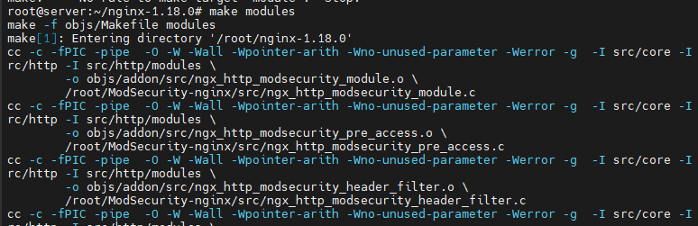 
		- Sau đó copy module vừa được biên dịch vào thư mục của Nginx.
		```
		cp objs/ngx_http_modsecurity_module.so /usr/share/nginx/modules/ngx_http_modsecurity_module.so
		```
	- Cấu Hình Mod Security trên Nginx.
		- Thêm sẽ dòng sau trong file config của nginx. Dòng cấu hình để giúp Nginx load module Modsecurity.
		```
		load_module modules/ngx_http_modsecurity_module.so;
		```
		```
		nano /etc/nginx/nginx.conf
		```
		-  
		- Để ModSecurity hoạt động cần có rules: thực hiện download OWASP CRS từ Github.
		```
		wget https://github.com/SpiderLabs/owasp-modsecurity-crs/archive/v3.2.0.tar.gz
		```
		- Tiến hành giải nén
		```
		tar -zxvf v3.2.0.tar.gz
		```
		-  
		- Tạo thư mục “/etc/nginx/modsec” rồi chuyển thư mục OWSP vừa giải nén vào thư mục modsec.
		```
		mv owasp-modsecurity-crs-3.2.0 /etc/nginx/modsec/owasp-modsecurity-crs
		```
		- Kích hoạt các file cấu hình và Rule của OWSP.
		```
		cd /etc/nginx/modsec/owasp-modsecurity-crs
		mv crs-setup.conf.example crs-setup.conf
		mv rules/REQUEST-900-EXCLUSION-RULES-BEFORE-CRS.conf.example rules/REQUEST-900-EXCLUSION-RULES-BEFORE-CRS.conf
		```
		- Copy các file cấu hình của Modsecurity vào thư mục “/etc/nginx/modsec”.
		```
		cp /root/ModSecurity/unicode.mapping /etc/nginx/modsec/
		cp /root/ModSecurity/modsecurity.conf-recommended /etc/nginx/modsec/modsecurity.conf
		```
		-  
		- Chỉnh sửa lại file cấu hình của modsecurity.
			```
			nano /etc/nginx/modsec/modsecurity.conf
			```
			Trong đó sửa 2 dòng sau:
			```
			SecRuleEngine DetectionOnly
			SecAuditLog /var/log/modsec_audit.log
			```
			Thành
			```
			SecRuleEngine On
			SecAuditLog /var/log/nginx/modsec_audit.log
			```
			-  
			-  
		- Tạo một file main.conf với nội dung như sau:
		```
		nano /etc/nginx/modsec/main.conf
		```
		```
		Include "/etc/nginx/modsec/modsecurity.conf"
		Include "/etc/nginx/modsec/owasp-modsecurity-crs/crs-setup.conf"
		Include "/etc/nginx/modsec/owasp-modsecurity-crs/rules/*.conf"
		```
		-  
		- Chỉnh sửa config của vhost để bật modsecurity cho website ta muốn bảo vệ bằng thêm 2 dòng sau vào block server.
		```
		nano /etc/nginx/sites-enabled/default
		```
		```
		modsecurity on;
		modsecurity_rules_file /etc/nginx/modsec/main.conf;
		```
		-  
		- Restart Nginx để apply cấu hình 
		```
		systemctl restart nginx
		```
	- Kiểm tra 
		- Kiểm tra ModSecurity bằng cách thực hiện một cuộc tấn công chèn lệnh đơn giản như sau:
		```
		curl http://localhost/index.html?exec=/bin/bash
		```
		- Nhận thấy request bị chặn 
		- 
		- Kiểm tra log: Nhận thấy có bản ghi ghi lại việc chặn request 
		``` 
		tail -f /var/log/nginx/modsec_audit.log
		```
		-  


<!-- TOC --><a name="references"></a>
## References
* 1. [What is a Web Server and How Does It Work? | Definition from TechTarget](https://www.techtarget.com/whatis/definition/Web-server)
* 2. [Aalto FITech101 Courses](https://fitech101.aalto.fi/web-software-development/2-internet-and-http/4-architecture-client-server-model/)
* 3. [What is a web server – Working and Architecture | GeeksforGeeks](https://www.geeksforgeeks.org/what-is-a-web-server-working-and-architecture/#working-of-web-browsers)
* 4. [What is apache? in-depth overview of apache web server](https://www.sumologic.com/blog/apache-web-server-introduction)
* 5. [Apache là gì? | Các kiến thức [A-Z] về Apache 2025](https://vinahost.vn/apache-la-gi/)
* 6. [Inside NGINX: How We Designed for Performance & Scale – NGINX Community Blog](https://blog.nginx.org/blog/inside-nginx-how-we-designed-for-performance-scale)
* 7. [nginx](https://nginx.org/en/)
* 8. [How NGINX design handles concurrent million connections ?](https://engineeringatscale.substack.com/p/nginx-millions-connections-event-driven-architecture)
* 9. [What Is Nginx? A Closer Look at Web Server Architecture](https://www.theknowledgeacademy.com/blog/what-is-nginx/)
* 10. [What Is IIS Server?](https://www.solarwinds.com/resources/it-glossary/iis-server)
* 11. [What is IIS? Overview, advantages, and precautions](https://www.winserver.net/blog/about_iis/)
* 12. [What Is an IIS Server?(Internet Information Services Server)](https://www.atlantic.net/vps-hosting/what-is-an-iis-server/)
* 13. [Overview - Lighttpd](https://redmine.lighttpd.net/projects/lighttpd)
* 14. [All features of the Caddy Web Server](https://caddyserver.com/features)
* 15. [What Is Caddy Web Server?](https://www.elegantthemes.com/blog/wordpress/what-is-caddy-web-server)
* 16. [LiteSpeed Enterprise Features - LiteSpeed Technologies](https://www.litespeedtech.com/products/litespeed-web-server/features)
* 17. [Comparing LiteSpeed Server and Apache Server: A Comprehensive Guide](https://www.bigrock.in/blog/products/hosting/vps-dedicated-servers/comparing-litespeed-and-apache-servers)
* 18. [HTTP là gì (series HTTP & HTTPS)](https://viblo.asia/p/http-la-gi-series-http-https-maGK7rv95j2)
* 19. [Why is HTTP not secure? | HTTP vs. HTTPS](https://www.cloudflare.com/en-gb/learning/ssl/why-is-http-not-secure/)
* 20. [HTTP Responses Overview](https://www.tutorialspoint.com/http/http_responses.htm)
* 21. [HTTP Requests](https://www.tutorialspoint.com/http/http_requests.htm)
* 22. [HTTP response status codes - HTTP | MDN](http://developer.mozilla.org/en-US/docs/Web/HTTP/Reference/Status)
* 23. [What is SSL/TLS Certificate? - SSL/TLS Certificates Explained - AWS](https://aws.amazon.com/what-is/ssl-certificate/#seo-faq-pairs#what-are-the-key-principles-in-ssl-cert-technology)
* 24. [What is SSL/TLS: An In-Depth Guide - SSL.com](https://www.ssl.com/article/what-is-ssl-tls-an-in-depth-guide/)
* 25. [RFC 6455 - The WebSocket Protocol](https://datatracker.ietf.org/doc/html/rfc6455)
* 26. [Websocket là gì ?](https://viblo.asia/p/websocket-la-gi-Ljy5VxkbZra)
* 27. [Websocket là gì? Ưu nhược điểm nổi bật của Websocket](https://bizflycloud.vn/tin-tuc/websocket-la-gi-uu-nhuoc-diem-cua-websocket-khi-su-dung-lam-phuong-thuc-giao-tiep-trong-moi-truong-internet-20210122155209401.htm)
* 28. [What is HTTP/2](https://www.upwork.com/resources/what-is-http2)
* 29. [What is HTTP/2 - Site Ground](https://world.siteground.com/kb/what-is-http2/)
* 30. [HTTP/2: the Pros, the Cons, and What You Need to Know — SitePoint](https://www.sitepoint.com/http2-the-pros-the-cons-and-what-you-need-to-know/)
* 31. [Google Edge Network](https://peering.google.com/#/learn-more/quic)
* 32. [Detailed Explanation of the QUIC Protocol: The Next-Generation Internet Transport Layer Protocol](https://medium.com/@threehappyer/detailed-explanation-of-the-quic-protocol-the-next-generation-internet-transport-layer-protocol-b680c0cf294a)
* 33. [Common Gateway Interface : Working and Its Advantages](https://www.elprocus.com/what-is-common-gateway-interface-working-and-its-applications/)
* 34. [FastCGI A High-Performance Web Server Interface](https://fastcgi-archives.github.io/FastCGI_A_High-Performance_Web_Server_Interface_FastCGI.html)
* 35. [Differences and dis/advanages between: Fast-CGI, CGI, Mod-PHP, SuPHP, PHP-FPM](https://serverfault.com/questions/645755/differences-and-dis-advanages-between-fast-cgi-cgi-mod-php-suphp-php-fpm)
* 36. [What is WSGI? Why is this needed for running apps in production?](https://www.linkedin.com/pulse/what-wsgi-why-needed-running-apps-production-kusho-tsmgf)
* 37. [What is WSGI (Web Server Gateway Interface)? | by Positive Stud | Analytics Vidhya | Medium](https://medium.com/analytics-vidhya/what-is-wsgi-web-server-gateway-interface-ed2d290449e)
* 38. [What is Prefork and Worker MPM and How to Choose in Apache? - Hostragons®](https://www.hostragons.com/en/blog/prefork-and-worker-mpm-apache-mpm-selection/)
* 39. [Prefork vs Worker](https://viblo.asia/p/prefork-vs-worker-aWj53jNpl6m)
* 40. [Differences and dis/advanages between: Fast-CGI, CGI, Mod-PHP, SuPHP, PHP-FPM](https://linuxconfig.org/comparing-linux-apache-prefork-vs-worker-mpms)
* 41. [Understanding Apache Workers: An Explanation Using Real-Life Examples | DigitalOcean](https://www.digitalocean.com/community/questions/understanding-apache-workers-an-explanation-using-real-life-examples#prefork-mpm-the-single-tasking-waiter)
* 42. [Event-driven architecture style - Azure Architecture Center | Microsoft Learn](https://learn.microsoft.com/en-us/azure/architecture/guide/architecture-styles/event-driven)
* 43. [Giới thiệu kiến trúc Event-Driven trong hệ thống Microservices](https://viblo.asia/p/gioi-thieu-kien-truc-event-driven-trong-he-thong-microservices-x7Z4DnBoLnX)
* 44. [Kiến trúc hướng sự kiện (Event-Driven Architecture) - Viblo](https://viblo.asia/p/kien-truc-huong-su-kien-event-driven-architecture-zXRJ8n2dVGq)
* 45. [Introduction to Event-Driven Architecture | by Kacey Bui | Microservice Geeks | Medium](https://medium.com/microservicegeeks/introduction-to-event-driven-architecture-e94ef442d824)
* 46. [How Nginx Handles Thousands of Concurrent Requests | Medium](https://medium.com/@_sidharth_m_/how-nginx-handles-thousands-of-concurrent-requests-202ca1a1cc44)
* 47. [mod_rewrite - Apache HTTP Server Version 2.4](https://httpd.apache.org/docs/2.4/mod/mod_rewrite.html)
* 48. [How To Rewrite URLs with mod_rewrite for Apache on Debian 9 | DigitalOcean](https://www.digitalocean.com/community/tutorials/how-to-rewrite-urls-with-mod-rewrite-for-apache-on-debian-9)
* 49. [Apache mod_rewrite and Examples](https://www.hostgator.com/help/article/apache-mod-rewrite-and-examples)
* 50. [Enabling and using Apache modules (eg, `mod_rewrite`, `mod_ssl`) - Linux Bash](https://www.linuxbash.sh/post/ssl)
* 51. [mod_ssl - Apache HTTP Server](https://www.dartmouth.edu/manual/en/mod/mod_ssl.html)
* 52. [How to Secure Apache 2 With ModSecurity | Linode Docs](https://www.linode.com/docs/guides/securing-apache2-with-modsecurity/)
* 53. [Module ngx_http_core_module](https://nginx.org/en/docs/http/ngx_http_core_module.html)
* 54. [Nginx Modules Reference](https://www.f5.com/pdf/reference-guide/nginx-modules-reference.pdf)
* 55. [How To Set Up Apache Virtual Hosts on Ubuntu 20.04 | DigitalOcean](https://www.digitalocean.com/community/tutorials/how-to-set-up-apache-virtual-hosts-on-ubuntu-20-04)
* 56. [IIS Virtualhost - Multiple Websites on the same server](https://techexpert.tips/iis/iis-virtualhost-multiple-websites-same-server/)
* 57. [Hướng dẫn tạo virtualhost trong nginx | BlogCloud365](https://blog.cloud365.vn/linux/huong-dan-tao-virtualhost-trong-nginx/)
* 58. [Reverse Proxy](https://www.cloudflare.com/en-gb/learning/cdn/glossary/reverse-proxy/)
* 59. [xTom - How to Set Up NGINX as a Reverse Proxy for Apache on Debian and Ubuntu](https://xtom.com/blog/how-to-setup-nginx-apache-reverse-proxy-debian-ubuntu/)
* 60. [Using nginx as HTTP load balancer](https://nginx.org/en/docs/http/load_balancing.html)
* 61. [Cách cài đặt và cấu hình cache NGINX - BKHOST](https://bkhost.vn/blog/cai-dat-va-cau-hinh-cache-nginx/)
* 62. [HTTP Compression | GeeksforGeeks](https://www.geeksforgeeks.org/http-compression/)
* 63. [What is a CDN - CloudFlare](https://www.cloudflare.com/en-gb/learning/cdn/what-is-a-cdn/)
* 64. [What is a CDN (Content Delivery Network)? | F5](https://www.f5.com/glossary/content-delivery-network-cdn)
* 65. [How to Enable HTTP/2 in Nginx](https://www.howtoforge.com/how-to-enable-http-2-in-nginx/)
* 66. [HTTP/2 guide - Apache HTTP Server Version 2.4](https://httpd.apache.org/docs/2.4/howto/http2.html)
* 67. [Genero Application Server User Guide 5.01](https://4js.com/online_documentation/fjs-gas-manual-html/index.html#gas-topics/t_gas_config_isapi_HTTP_2.html)
* 68. [Tune apache2 for more concurrent connections - Open-Xchange](https://oxpedia.org/wiki/index.php?title=Tune_apache2_for_more_concurrent_connections)
* 69. [Increase Nginx worker open files and connections](https://www.robert-michalski.com/blog/nginx-raise-connection-limit)
* 70. [Default Limits for Web Sites &lt;limits&gt; | Microsoft Learn](https://learn.microsoft.com/en-us/iis/configuration/system.applicationhost/sites/sitedefaults/limits)
* 71. [How to Configure KeepAlive Settings for Apache running on an Ubuntu 22.04 VPS](https://hostadvice.com/how-to/web-hosting/vps/how-to-configure-keepalive-settings-from-your-apache-server-running-on-ubuntu-22-04-vps/)
* 72. [How to Enable Keepalive Connections in Nginx](https://www.ubuntumint.com/enable-nginx-keepalive-connections/)
* 73. [HTTP Protocol Settings &lt;httpProtocol&gt; | Microsoft Learn](https://learn.microsoft.com/en-us/iis/configuration/system.webserver/httpprotocol/)
* 74. [Tuning NGINX for Better Performance](https://www.cloudbees.com/blog/tuning-nginx)
* 75. [How to change the number of IIS Worker Processes](https://support.abbyy.com/hc/en-us/articles/360020969640-How-to-change-the-number-of-IIS-Worker-Processes-for-Application-Server-of-FlexiCapture-12)
* 76. [worker - Apache HTTP Server Version 2.4](https://httpd.apache.org/docs/2.4/mod/worker.html)
* 77. [How to Protect your Server from Brute Force Attack?](https://www.accuwebhosting.com/blog/how-to-protect-your-server-from-brute-force-attack/)
* 78. [How to Prevent a DDoS Attack](https://sysdig.com/blog/how-to-prevent-ddos-attack-cloud/)
* 79. [Blocking Brute Force Attacks | OWASP Foundation](https://owasp.org/www-community/controls/Blocking_Brute_Force_Attacks)
* 80. [Hướng dẫn chống DDoS với CloudFlare - Nhan Hoa Knowledgebase](https://wiki.nhanhoa.com/kb/huong-dan-chong-ddos-voi-cloudflare/)
* 81. [18 Apache Web Server Security and Hardening Tips](https://www.tecmint.com/apache-security-tips/)
* 82. [Nginx Web Server Hardening | Hackviser](https://hackviser.com/tactics/hardening/nginx)
* 83. [Nginx Security Hardening Guide | SecOps® Solution](https://www.secopsolution.com/blog/nginx-security-hardening-guide)
* 84. [Nginx server security - hardening Nginx configuration](https://www.acunetix.com/blog/web-security-zone/hardening-nginx/)
* 85. [Hướng Dẫn Cài Đặt NAXSI Lên Nginx Trên Ubuntu 20.04 - Tài liệu 123Host](https://123host.vn/tailieu/kb/vps/huong-dan-cai-dat-naxsi-len-nginx-tren-ubuntu-20-04.html)
* 86. [How to Secure Apache 2 With ModSecurity |
* Linode Docs](https://www.linode.com/docs/guides/securing-apache2-with-modsecurity/)
* 87. [Guide to Apache Benchmark for API Load Testing](https://www.devzery.com/post/guide-to-apache-benchmark-for-api-load-testing#:~:text=Apache%20Benchmark%20(AB)%20is%20a,the%20proportion%20of%20failed%20requests.)
* 88. [How to Use JMeter for Performance & Load Testing](https://www.guru99.com/jmeter-performance-testing.html)
* 89. [What is ELK stack? - Elasticsearch, Logstash, Kibana Stack Explained - AWS](https://aws.amazon.com/what-is/elk-stack/)
* 90. [ELK Stack Architecture and How Does It Works](https://medium.com/yavar/elk-stack-architecture-and-how-does-it-works-bda6382b3c83)
* 91. [Web Server vs Application Server - Difference Between Technology Servers - AWS](https://aws.amazon.com/compare/the-difference-between-web-server-and-application-server/)
* 92. [Web Server vs. Application Server: Choosing the Right Solution for Your Business](https://tsplus.net/en_gb/web-server-vs-application-server-guide-for-business/)
* 93. [Web Server vs. Application Server: Key Differences](https://ca.indeed.com/career-advice/career-development/web-server-vs-application-server#)
* 94. [What is Serverless](https://www.cloudflare.com/en-gb/learning/serverless/what-is-serverless/)
* 95. [Serverless Architecture: What It Is & How It Works | Datadog](https://www.datadoghq.com/knowledge-center/serverless-architecture/#serverless-architecture-vs-container-architecture)
* 96. [What is AWS Lambda? - AWS Lambda](https://docs.aws.amazon.com/lambda/latest/dg/welcome.html)
* 97. [Google Cloud Functions | Types, Key Features, Steps & Uses](https://k21academy.com/google-cloud/google-cloud-functions/)
* 98. [What is Docker? | GeeksforGeeks](https://www.geeksforgeeks.org/introduction-to-docker/)
* 99. [Dive into Docker: Containerized Web Servers Explained - Alibaba Cloud](https://www.alibabacloud.com/tech-news/a/web_server/4oh4newe49i-dive-into-docker-containerized-web-servers-explained)
* 100. [What Is Edge Computing? | IBM](https://www.ibm.com/think/topics/edge-computing#:~:text=Edge%20computing%20harnesses%20growing%20in,must%20move%20to%20the%20edge.)
* 101. [What Is Edge Computing? Everything You Need to Know](https://www.techtarget.com/searchdatacenter/definition/edge-computing)
* 102. [CDN vs. Edge Computing: Differences and Use Cases - OTTVerse](https://ottverse.com/cdn-vs-edge-computing-differences-usecases/)
* 103. [403 Forbidden Error: What Is It & How To Fix It | Plesk](https://www.plesk.com/blog/various/403-forbidden-error-what-is-it-how-to-fix-it/)
* 104. [What Is a 403 Forbidden Error and How To Fix It | SiteLock](https://www.sitelock.com/blog/how-to-fix-403-forbidden-error/)
* 105. [What is a 404 Error Code? What It Means and How to Fix It](https://www.techtarget.com/whatis/definition/404-status-code)
* 106. [Internal Server Error 500](https://www.siteground.com/kb/internal_server_error_500/)
* 107. [Làm sao để DEV thuộc TOP trong việc tối ưu database - Viblo](https://viblo.asia/p/lam-sao-de-dev-thuoc-hang-top-trong-viec-toi-uu-database-gwd432r3VX9)
* 108. [Optimizing Database Performance for Web Applications – Keitaro](https://www.keitaro.com/insights/2024/08/19/optimizing-database-performance-for-web-applications/)
* 109. [11 Tips to Optimize Server Performance for Blazing Speeds](https://vinahost.vn/en/optimize-server-performance/)
* 110. [What is Scalability and How to achieve it? | GeeksforGeeks](https://www.geeksforgeeks.org/what-is-scalability/)
* 111. [What is Diagonal Scaling and When is It your Best Option?](https://www.harpersystems.dev/post/what-is-diagonal-scaling-and-when-is-it-your-best-option#strongthe-need-for-diagonal-scalingstrong)
* 112. [Horizontal Vs. Vertical Scaling: Which Should You Choose?](https://www.cloudzero.com/blog/horizontal-vs-vertical-scaling/)
* 113. [DirectAdmin là gì? Tất cả thông tin cần biết về DirectAdmin - Trung tâm hỗ trợ kỹ thuật | MATBAO.NET](https://wiki.matbao.net/directadmin-la-gi-tat-ca-thong-tin-can-biet-ve-directadmin/)
* 114. [About GVM 10 Architecture - Greenbone Community Edition - Greenbone Community Forum](https://forum.greenbone.net/t/about-gvm-10-architecture/1231)
* 115. [24 Nmap Commands for Network Security and Scanning](https://www.tecmint.com/nmap-command-examples/)
* 116. [Chapter 15. Nmap Reference Guide | Nmap Network Scanning](https://nmap.org/book/man.html)
* 117. [How to Secure Apache 2 With ModSecurity | Linode Docs](https://www.linode.com/docs/guides/securing-apache2-with-modsecurity/)
* 118. [What is ModSecurity? Installation Guide for Apache on Ubuntu](https://beaglesecurity.com/blog/article/modsecurity-apache-installation-guide.html)
* 119. [Analyzing the mod security logs](https://www.infosecinstitute.com/resources/application-security/analyzing-mod-security-logs/)
* 120. [Hướng Dẫn Cài Đặt Modsecurity Lên Nginx Trên Ubuntu 20.04 - Tài liệu 123Host](https://123host.vn/tailieu/kb/vps/huong-dan-cai-dat-modsecurity-len-nginx-tren-ubuntu-20-04.html)
* 121. [GitHub - itiligent/Easy-OpenVAS-Installer: 2025 OpenVAS appliance install & upgrade scripts, includes https front end (self signed), authenticated SMB scanning  & email reports](https://github.com/itiligent/Easy-OpenVAS-Installer)
