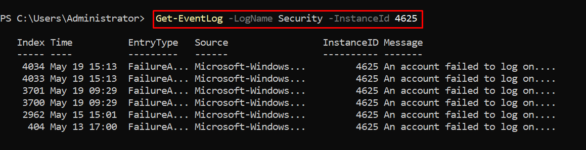

# List event ID trong Windows 
- Security 

| **Event ID** | **Mô tả**                                |
| ------------ | ---------------------------------------- |
| 4624         | Đăng nhập thành công                     |
| 4625         | Đăng nhập thất bại                       |
| 4634         | Đăng xuất                                |
| 4648         | Đăng nhập với thông tin xác thực rõ ràng |
| 4670         | Phân quyền đối tượng thay đổi            |
| 4688         | Một tiến trình mới được tạo              |
| 4720         | Tài khoản người dùng được tạo            |
| 4722         | Tài khoản được kích hoạt                 |
| 4723         | Yêu cầu đổi mật khẩu                     |
| 4725         | Tài khoản bị vô hiệu hóa                 |
| 4726         | Tài khoản bị xóa                         |
| 4768         | Yêu cầu TGT (Kerberos)                   |
| 4771         | Kerberos pre-authentication failed       |
| 4776         | Xác thực Credential                      |

- System 

| **Event ID** | **Mô tả**                                       |
| ------------ | ----------------------------------------------- |
| 41           | Kernel-Power – hệ thống tắt đột ngột            |
| 6005         | Event Log khởi động (giống "System startup")    |
| 6006         | Event Log ngừng (giống "System shutdown")       |
| 6008         | Tắt máy bất thường                              |
| 7000–7099    | Service Control Manager – lỗi khởi động dịch vụ |
| 7036         | Dịch vụ thay đổi trạng thái (bật/tắt)           |
| 1001         | BugCheck – ghi nhận lỗi hệ thống (BSOD)         |
| 10016        | DCOM – lỗi quyền truy cập                       |
| 1058         | GPO không thể áp dụng                           |
| 8193         | VSS lỗi (Volume Shadow Copy)                    |

-  Application 

| **Event ID** | **Mô tả**                                  |
| ------------ | ------------------------------------------ |
| 1000         | Application Error – ứng dụng bị crash      |
| 1026         | .NET Runtime Exception                     |
| 1309         | ASP.NET lỗi (trên IIS)                     |
| 18456        | SQL Server login failed                    |
| 9001         | SQL Server database offline                |
| 3001         | Exchange mailbox issue (nếu dùng Exchange) |

- Lệnh kiểm tra log trên Powershell 
```
Get-WinEvent -LogName <Loại-Log> 
```
- Ví dụ lấy 10 bản ghi gần nhất trong log Security có ID 4625 (Logon Failed)
```
Get-EventLog -LogName Security -InstanceId 4625 -Newest 10
```

