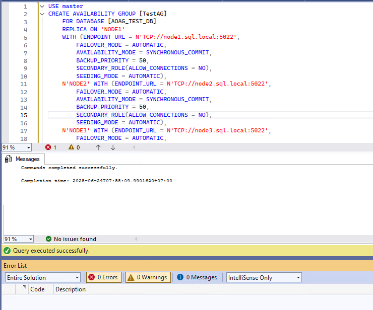
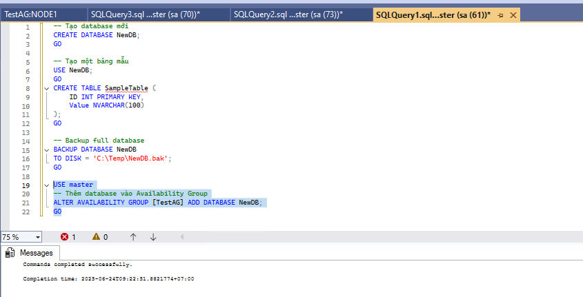

<!-- TOC --><a name="aoag-multi-domain"></a>
# AOAG Multi Domain 

- [AOAG Multi Domain ](#aoag-multi-domain)
   * [I. Tổng quan  ](#i-tng-quan)
      + [1. SQL Server Always On Availability Groups ](#1-sql-server-always-on-availability-groups)
      + [2. Domainless Availability Groups](#2-domainless-availability-groups)
   * [II. Triển khai lab ](#ii-trin-khai-lab)
      + [1. Yêu cầu  ](#1-yêu-cu)
      + [2. Cấu hình mạng](#2-cu-hình-mng)
   * [3. Cấu hình ](#3-cu-hình)
      + [1. **Cấu hình DNS suffix và hostname**](#1-cu-hình-dns-suffix-và-hostname)
      + [2. **Cài đặt và cấu hình WSFC (Failover Cluster)**](#2-cài-t-và-cu-hình-wsfc-failover-cluster)
      + [3. **Cấu hình SQL Server**](#3-cu-hình-sql-server)
      + [4. **Tạo chứng chỉ, endpoint**](#4-to-chng-ch-endpoint)
      + [5. **Tạo các login**](#5-to-các-login)
      + [6. **Triển khai Availability Group**](#6-trin-khai-availability-group)
   * [References ](#references)

<!-- TOC end -->

<!-- TOC --><a name="aoag-multi-domain"></a>
# AOAG Multi Domain 
<!-- TOC --><a name="i-tng-quan"></a>
## I. Tổng quan  
<!-- TOC --><a name="1-sql-server-always-on-availability-groups"></a>
### 1. SQL Server Always On Availability Groups 
- Giải pháp **HA (High Availability)** và **DR (Disaster Recovery)** cấp độ database, giúp đảm bảo dữ liệu sẵn sàng và giảm downtime.
- Cho phép nhiều bản sao của database chạy đồng thời trên các node khác nhau, với khả năng failover tự động hoặc thủ công.
<!-- TOC --><a name="2-domainless-availability-groups"></a>
### 2. Domainless Availability Groups
- Từ SQL Server 2016 trở đi, **Domain-Independent AG** cho phép cấu hình AG giữa các máy không cùng domain hoặc không có domain.
- **Sử dụng chứng chỉ (certificate)** để xác thực giữa các node thay vì tài khoản domain.
- Cấu hình phức tạp hơn nhưng rất phù hợp với các lab cá nhân hoặc môi trường không dùng Active Directory.
<!-- TOC --><a name="ii-trin-khai-lab"></a>
##  II. Triển khai lab 
<!-- TOC --><a name="1-yêu-cu"></a>
### 1. Yêu cầu  
- **Hypervisor**: VMware Workstation
- **Số lượng máy ảo**:
  - `SQL01`: Primary replica
  - `SQL02`: Secondary replica
  - `SQL03`: DR replica, backup 
- **Yêu cầu máy ảo**:
  - Windows Server 2019/2022 Standard hoặc Datacenter
  - SQL Server 2019/2022 Enterprise Edition Standalone 
- 

<!-- TOC --><a name="2-cu-hình-mng"></a>
### 2. Cấu hình mạng
- Tất cả máy ảo cùng **mạng ảo (Virtual Network)** trong VMware
- Cấu hình **static IP** cho từng node (không dùng DHCP)
- Cài DNS suffix thủ công để các máy nhận diện nhau theo FQDN

<!-- TOC --><a name="3-cu-hình"></a>
## 3. Cấu hình 

<!-- TOC --><a name="1-cu-hình-dns-suffix-và-hostname"></a>
### 1. **Cấu hình DNS suffix và hostname**
- Trên cả ba máy, đặt DNS suffix giống nhau:
  - `System Properties` → `Computer Name` → `Change` → `More...` → điền `Primary DNS suffix`
- 
- 
- 
- 
- Chỉnh sửa file hosts trên 3 node 
```
192.168.50.146	node1.sql.local
192.168.50.147	node2.sql.local
192.168.50.148	node3.sql.local
```
- 


<!-- TOC --><a name="2-cài-t-và-cu-hình-wsfc-failover-cluster"></a>
### 2. **Cài đặt và cấu hình WSFC (Failover Cluster)**
- Cài tính năng Failover Clustering trên cả 3 node:
	```powershell
	#- Enable Failover-Clustering
	Install-WindowsFeature -Name Failover-Clustering -IncludeManagementTools
	```
- 
- 
	
- Trên node1 tạo Cluster bằng lệnh sau 
	```powershell
	New-Cluster -Name sql-cluster -Node node1,node2,node3 -StaticAddress 192.168.50.151 -NoStorage -AdministrativeAccessPoint DNS
	```
	- `New-Cluster`: Lệnh tạo cluster mới
	- `-Name sql-cluster`: Tên cụm là "sql-cluster"
	- `-Node node1,node2,node3`: Ba node tham gia vào cụm
	- `-StaticAddress 192.168.50.151`: IP ảo dùng để truy cập cluster
	- `-NoStorage`: Không dùng ổ đĩa chung
	- `-AdministrativeAccessPoint DNS`: Không tạo object trong Active Directory — phù hợp môi trường không domain
- 
- 
- 


---

<!-- TOC --><a name="3-cu-hình-sql-server"></a>
### 3. **Cấu hình SQL Server**
- Bật tính năng AlwaysOn trên instance SQL từng node :
  - SQL Server Configuration Manager → SQL Server Services → Properties → AlwaysOn High Availability → Enable
- 

<!-- TOC --><a name="4-to-chng-ch-endpoint"></a>
### 4. **Tạo chứng chỉ, endpoint**
- Tạo khóa chính (Database Master Key): Khóa chính được tạo trong cơ sở dữ liệu master để mã hóa các chứng chỉ và thông tin bảo mật khác.
```
CREATE MASTER KEY ENCRYPTION BY PASSWORD = 'YourStrongPassword'
```
	- `CREATE MASTER KEY`: Tạo một khóa chính (master key) trong cơ sở dữ liệu hiện tại.
	- `ENCRYPTION BY PASSWORD = 'YourStrongPassword'`: Chỉ định mật khẩu dùng để mã hóa khóa chính. Mật khẩu này sẽ được yêu cầu nếu cần mở khóa thủ công trong tương lai.
- Tạo chứng chỉ bảo mật (Security Certificate): Chứng chỉ được sử dụng để xác thực giữa các instance SQL Server khi thiết lập endpoint.
```
CREATE CERTIFICATE [CertificateName]
WITH SUBJECT = '[CertificateSubject]',
EXPIRY_DATE = '[YYYY-MM-DDTHH:MM:SS]'
```
	- `CREATE CERTIFICATE [CertificateName]`: Tạo một chứng chỉ mới trong cơ sở dữ liệu hiện tại với tên là `CertificateName`.
	- `WITH SUBJECT = '[CertificateSubject],`: Gán mô tả (subject) cho chứng chỉ – thường dùng để nhận diện mục đích hoặc nguồn gốc của chứng chỉ.
	- `EXPIRY_DATE = '[YYYY-MM-DDTHH:MM:SS]'`: Thiết lập ngày hết hạn cho chứng chỉ. Sau thời điểm này, chứng chỉ sẽ không còn hợp lệ để sử dụng.
- Sao lưu khóa công khai của chứng chỉ: Khóa công khai sẽ được sao lưu ra file và chia sẻ với các node khác để họ có thể xác thực node hiện tại.
```
BACKUP CERTIFICATE [CertificateName]
TO FILE = 'C:\Path\To\CertificateFile.cert'

```
	- `BACKUP CERTIFICATE [CertificateName]`: Sao lưu chứng chỉ có tên `CertificateName` từ cơ sở dữ liệu hiện tại.
	- `TO FILE = 'C:\Path\To\CertificateFile.cert'`: Chỉ định đường dẫn và tên file để lưu phần khóa công khai (public key) của chứng chỉ. File này sẽ được dùng để chia sẻ với các node khác nhằm xác thực kết nối.
- Tạo endpoint cho Database Mirroring: Endpoint là điểm giao tiếp giữa các node trong nhóm Always On hoặc Mirroring.
```
CREATE ENDPOINT [EndpointName]
STATE = STARTED
AS TCP (LISTENER_PORT = 5022)
FOR DATABASE_MIRRORING (
	AUTHENTICATION = CERTIFICATE [CertificateName],
	ROLE = ALL,
	ENCRYPTION = REQUIRED ALGORITHM AES
)
```
	- `CREATE ENDPOINT [EndpointName]`: Tạo một endpoint mới với tên `EndpointName` để phục vụ cho giao tiếp giữa các node trong Always On hoặc Database Mirroring.
	- `STATE = STARTED`: Endpoint sẽ được khởi động ngay sau khi tạo, sẵn sàng lắng nghe kết nối.
	- `AS TCP (LISTENER_PORT = 5022)`: Sử dụng giao thức TCP và lắng nghe trên cổng 5022 – đây là cổng mặc định thường dùng cho Database Mirroring.
	- `FOR DATABASE_MIRRORING`: Chỉ định loại payload của endpoint là dành cho Database Mirroring (cũng dùng trong Always On).
	- `AUTHENTICATION = CERTIFICATE [CertificateName]`: Xác thực kết nối bằng chứng chỉ `CertificateName`.
	- `ROLE = ALL`: Endpoint này có thể đóng vai trò principal hoặc mirror – linh hoạt cho cả hai chiều.
	- `ENCRYPTION = REQUIRED ALGORITHM AES`: Bắt buộc mã hóa dữ liệu truyền qua endpoint bằng thuật toán AES để đảm bảo bảo mật.


- Ví dụ trên node 1
```sql
USE master
GO

-- Create a database master key
CREATE MASTER KEY ENCRYPTION BY PASSWORD = 'Qaz@123'
GO

-- Create a new certificate
CREATE CERTIFICATE Node1_Cert_Private
WITH SUBJECT = 'Node1_Cert_Private',
expiry_date = '2027-06-16T17:00:00'
GO

-- Backup the public key of the certificate to the filesystem
BACKUP CERTIFICATE Node1_Cert_Private
TO FILE = 'c:\Temp\Node1_Cert_Public.cert'
GO

-- Create an endpoint for the Availability Group
CREATE ENDPOINT AOAG_Endpoint
STATE = STARTED
AS TCP
(
	LISTENER_PORT = 5022
)
FOR DATABASE_MIRRORING
(
	AUTHENTICATION = CERTIFICATE Node1_Cert_Private,
	ROLE = ALL, 
	ENCRYPTION = REQUIRED ALGORITHM AES
)
GO
```
- 
- Node 2
```sql
USE master
GO

-- Create a database master key
CREATE MASTER KEY ENCRYPTION BY PASSWORD = 'Qaz@123'
GO

-- Create a new certificate
CREATE CERTIFICATE Node2_Cert_Private
WITH SUBJECT = 'Node2_Cert_Private',
expiry_date = '2027-06-16T17:00:00'
GO

-- Backup the public key of the certificate to the filesystem
BACKUP CERTIFICATE Node2_Cert_Private
TO FILE = 'c:\Temp\Node2_Cert_Public.cert'
GO

-- Create an endpoint for the Availability Group
CREATE ENDPOINT AOAG_Endpoint
STATE = STARTED
AS TCP
(
	LISTENER_PORT = 5022
)
FOR DATABASE_MIRRORING
(
	AUTHENTICATION = CERTIFICATE Node2_Cert_Private,
	ROLE = ALL, 
	ENCRYPTION = REQUIRED ALGORITHM AES
)
GO
```
- 

- Node 3
```sql
USE master
GO

-- Create a database master key
CREATE MASTER KEY ENCRYPTION BY PASSWORD = 'Qaz@123'
GO

-- Create a new certificate
CREATE CERTIFICATE Node3_Cert_Private
WITH SUBJECT = 'Node3_Cert_Private',
expiry_date = '2027-06-16T17:00:00'
GO

-- Backup the public key of the certificate to the filesystem
BACKUP CERTIFICATE Node3_Cert_Private
TO FILE = 'c:\Temp\Node3_Cert_Public.cert'
GO

-- Create an endpoint for the Availability Group
CREATE ENDPOINT AOAG_Endpoint
STATE = STARTED
AS TCP
(
	LISTENER_PORT = 5022
)
FOR DATABASE_MIRRORING
(
	AUTHENTICATION = CERTIFICATE Node3_Cert_Private,
	ROLE = ALL, 
	ENCRYPTION = REQUIRED ALGORITHM AES
)
GO
```
- 

<!-- TOC --><a name="5-to-các-login"></a>
### 5. **Tạo các login**
- Tạo login cho các node khác: Mỗi node cần tạo login đại diện cho các node còn lại để xác thực kết nối.
```
CREATE LOGIN [RemoteNode1Login] WITH PASSWORD = 'YourStrongPassword'
CREATE LOGIN [RemoteNode2Login] WITH PASSWORD = 'YourStrongPassword'
```
	- CREATE LOGIN: Tạo login ở cấp độ instance.
	- WITH PASSWORD: Đặt mật khẩu cho login (chỉ áp dụng với SQL Authentication).
- Tạo user trong cơ sở dữ liệu master cho login tương ứng:
```
CREATE USER [RemoteNode1User] FOR LOGIN [RemoteNode1Login]
CREATE USER [RemoteNode2User] FOR LOGIN [RemoteNode2Login]
```
	- CREATE USER: Tạo user trong database master, ánh xạ với login tương ứng.
- Import khóa công khai từ các node khác:
```
CREATE CERTIFICATE [RemoteNode1_Cert_Public]
AUTHORIZATION [RemoteNode1User]
FROM FILE = 'C:\Path\To\RemoteNode1_Cert.cert'

CREATE CERTIFICATE [RemoteNode2_Cert_Public]
AUTHORIZATION [RemoteNode2User]
FROM FILE = 'C:\Path\To\RemoteNode2_Cert.cert'
```
	- CREATE CERTIFICATE ... FROM FILE: Tạo chứng chỉ từ file .cert đã sao lưu từ node khác.
	- AUTHORIZATION: Gán chứng chỉ cho user tương ứng để xác thực.
- Cấp quyền kết nối đến endpoint:
```
GRANT CONNECT ON ENDPOINT::[EndpointName] TO [RemoteNode1Login]
GRANT CONNECT ON ENDPOINT::[EndpointName] TO [RemoteNode2Login]
```
	- GRANT CONNECT ON ENDPOINT: Cho phép login từ node khác kết nối đến endpoint hiện tại.
- Thực hiện tương ứng trên các node
- Node 1 
```
-- Create login for the other node
CREATE LOGIN Node2Login WITH PASSWORD = 'Qaz@123'
CREATE LOGIN Node3Login WITH PASSWORD = 'Qaz@123'
GO

-- Create user for the login
CREATE USER Node2User FOR LOGIN Node2Login
CREATE USER Node3User FOR LOGIN Node3Login
GO

-- Import the public key portion of the certificate from the other node
CREATE CERTIFICATE Node2_Cert_Public
AUTHORIZATION Node2User
FROM FILE = 'c:\Temp\Node2_Cert_Public.cert'
GO

CREATE CERTIFICATE Node3_Cert_Public
AUTHORIZATION Node3User
FROM FILE = 'c:\Temp\Node3_Cert_Public.cert'
GO

-- Grant the CONNECT permission to the login
GRANT CONNECT ON ENDPOINT::AOAG_Endpoint TO Node2Login
GRANT CONNECT ON ENDPOINT::AOAG_Endpoint TO Node3Login
GO
```
- 

- Node 2
```
-- Create login for the other node
CREATE LOGIN Node1Login WITH PASSWORD = 'Qaz@123'
CREATE LOGIN Node3Login WITH PASSWORD = 'Qaz@123'
GO

-- Create user for the login
CREATE USER Node1User FOR LOGIN Node1Login
CREATE USER Node3User FOR LOGIN Node3Login
GO

-- Import the public key portion of the certificate from the other node
CREATE CERTIFICATE Node1_Cert_Public
AUTHORIZATION Node1User
FROM FILE = 'c:\Temp\Node1_Cert_Public.cert'
GO

CREATE CERTIFICATE Node3_Cert_Public
AUTHORIZATION Node3User
FROM FILE = 'c:\Temp\Node3_Cert_Public.cert'
GO
-- Grant the CONNECT permission to the login
GRANT CONNECT ON ENDPOINT::AOAG_Endpoint TO Node1Login
GRANT CONNECT ON ENDPOINT::AOAG_Endpoint TO Node3Login
GO
```
- 

- Node 3
```
-- Create login for the other node
CREATE LOGIN Node1Login WITH PASSWORD = 'Qaz@123'
CREATE LOGIN Node2Login WITH PASSWORD = 'Qaz@123'
GO

-- Create user for the login
CREATE USER Node1User FOR LOGIN Node1Login
CREATE USER Node2User FOR LOGIN Node2Login
GO

-- Import the public key portion of the certificate from the other node
CREATE CERTIFICATE Node1_Cert_Public
AUTHORIZATION Node1User
FROM FILE = 'c:\Temp\Node1_Cert_Public.cert'
GO

CREATE CERTIFICATE Node2_Cert_Public
AUTHORIZATION Node2User
FROM FILE = 'c:\Temp\Node2_Cert_Public.cert'
GO
-- Grant the CONNECT permission to the login
GRANT CONNECT ON ENDPOINT::AOAG_Endpoint TO Node1Login
GRANT CONNECT ON ENDPOINT::AOAG_Endpoint TO Node2Login
GO
```
- 

<!-- TOC --><a name="6-trin-khai-availability-group"></a>
### 6. **Triển khai Availability Group**
- Sau khi hoàn tất cấu hình bảo mật giữa các nút, hệ thống sẵn sàng để khởi tạo Availability Group. Quy trình bao gồm:
	- Tạo cơ sở dữ liệu mẫu: Một cơ sở dữ liệu mới được tạo trên nút chính để minh họa việc đồng bộ hóa dữ liệu.
	- Thực hiện sao lưu toàn bộ (FULL BACKUP): Đây là bước bắt buộc trước khi thêm cơ sở dữ liệu vào Availability Group.
	- Tạo Availability Group: Availability Group mới được khai báo, bao gồm tối thiểu hai bản sao (primary và secondary replica).
	- Trong mô hình này gồm 1 Primary 2 secondary
- Thực hiện trên node 1 
	- Tạo DB mẫu: Tạo DB có tên `AOAG_TEST_DB` gồm bảng `Foo`
	```
	USE master
	GO

	-- Create a new database
	CREATE DATABASE AOAG_TEST_DB
	GO

	-- Use the database
	USE AOAG_TEST_DB
	GO

	-- Create a simple table
	CREATE TABLE Foo
	(
		Bar INT NOT NULL
	)
	GO
	```
		- `USE master`: Chuyển ngữ cảnh làm việc sang cơ sở dữ liệu hệ thống master. Đây là nơi thường dùng để thực hiện các thao tác quản trị như tạo cơ sở dữ liệu mới.
		- `CREATE DATABASE AOAG_TEST_DB`: Tạo một cơ sở dữ liệu mới có tên là AOAG_TEST_DB.
		- `USE AOAG_TEST_DB`: Chuyển ngữ cảnh làm việc sang cơ sở dữ liệu vừa tạo để thực hiện các thao tác tiếp theo.
		- `CREATE TABLE Foo (Bar INT NOT NULL)`: Tạo một bảng có tên Foo trong cơ sở dữ liệu AOAG_TEST_DB, với một cột duy nhất tên là Bar, kiểu dữ liệu INT, và không cho phép giá trị NULL.
	- 

	- Để một DB có thể join vào AOAG cần thực hiện full backup  
	```
	-- Make a Full Backup of the database
	BACKUP DATABASE AOAG_TEST_DB TO DISK = 'C:\Temp\AOAG_TEST_DB.bak'
	GO
	```
		- `BACKUP DATABASE AOAG_TEST_DB`: Thực hiện sao lưu toàn bộ cơ sở dữ liệu có tên AOAG_TEST_DB.
		- `TO DISK = 'c:\Temp\AOAG_TEST_DB.bak'`: Chỉ định đường dẫn và tên file đích để lưu bản sao lưu (backup) dưới dạng file .bak
	- 
	- Khởi tạo Availability Group
	```
	CREATE AVAILABILITY GROUP [TestAG]
		FOR DATABASE [AOAG_TEST_DB]
		REPLICA ON 'NODE1'
		WITH (ENDPOINT_URL = N'TCP://node1.sql.local:5022', 
			FAILOVER_MODE = AUTOMATIC, 
			AVAILABILITY_MODE = SYNCHRONOUS_COMMIT, 
			BACKUP_PRIORITY = 50, 
			SECONDARY_ROLE(ALLOW_CONNECTIONS = NO), 
			SEEDING_MODE = AUTOMATIC),
		N'NODE2' WITH (ENDPOINT_URL = N'TCP://node2.sql.local:5022', 
			FAILOVER_MODE = AUTOMATIC, 
			AVAILABILITY_MODE = SYNCHRONOUS_COMMIT, 
			BACKUP_PRIORITY = 50, 
			SECONDARY_ROLE(ALLOW_CONNECTIONS = NO), 
			SEEDING_MODE = AUTOMATIC),
		N'NODE3' WITH (ENDPOINT_URL = N'TCP://node3.sql.local:5022', 
			FAILOVER_MODE = AUTOMATIC, 
			AVAILABILITY_MODE = SYNCHRONOUS_COMMIT, 
			BACKUP_PRIORITY = 50, 
			SECONDARY_ROLE(ALLOW_CONNECTIONS = NO), 
			SEEDING_MODE = AUTOMATIC);
	GO
	```
		- Tạo một Availability Group tên `TestAG` cho cơ sở dữ liệu `AOAG_TEST_DB`, với ba bản sao (replica) trên các node NODE1, NODE2, và NODE3.
			- `FOR DATABASE [AOAG_TEST_DB]`: Chỉ định cơ sở dữ liệu sẽ được thêm vào Availability Group.
			- `REPLICA ON 'NODE1' WITH (...)`: Định nghĩa cấu hình cho bản sao trên NODE1. Các node khác (NODE2, NODE3) cũng có cấu hình tương tự.
			- `ENDPOINT_URL = N'TCP://<node>.sql.local:5022'`: Địa chỉ endpoint để các node giao tiếp với nhau.
			- `FAILOVER_MODE = AUTOMATIC`: Cho phép tự động chuyển đổi vai trò chính/phụ khi node chính gặp sự cố.
			- `AVAILABILITY_MODE = SYNCHRONOUS_COMMIT`: Ghi dữ liệu đồng bộ giữa các node để đảm bảo không mất dữ liệu.
			- `BACKUP_PRIORITY = 50`: Ưu tiên sao lưu – giá trị càng thấp thì càng ưu tiên cao.
			- `SECONDARY_ROLE(ALLOW_CONNECTIONS = NO)`: Không cho phép kết nối đến bản sao phụ (secondary).
			- `SEEDING_MODE = AUTOMATIC`: Cho phép SQL Server tự động sao chép dữ liệu từ bản chính sang bản phụ.
	- 

- Trên các node còn lại join AOAG và cấp quyền tạo DB vì tính năng seeding auto được bật.
```
ALTER AVAILABILITY GROUP [TestAG] JOIN
GO
ALTER AVAILABILITY GROUP [TestAG] GRANT CREATE ANY DATABASE
GO
```
	- `JOIN:` Thêm replica hiện tại vào Availability Group TestAG (dùng trên node phụ).
	- `GRANT CREATE ANY DATABASE`: Cấp quyền cho AG được phép tạo database tự động (bắt buộc nếu dùng `SEEDING_MODE = AUTOMATIC`).
	- 
	- 

- Kiểm tra quá trình join
	- Dashboard AOAG 
	- 
	- Tại các Instance có AG, DB 
	- 
	- Trong FailoverCluster Manager có Roles mới tạo 
	- 
	
- Test failover
	- Disable `ethernet0` trên node1 để giả lập sự cố 
	- 
	- Kiểm tra quá trình `failover`
	- 
	- 
	- Enable `ethernet0` trên node1 
	- 
	- 
	- Kiểm tra quá trình `failback`. Cài đặt hiện tại `failback immediately` 
	- 
	- 
	- 
	```
	Get-WinEvent -LogName 'Microsoft-Windows-FailoverClustering/Operational' -FilterXPath "*[System[(EventID=1641)]]" | Sort-Object TimeCreated
	```
	- 
	
- Thêm DB vào AOAG 
	- Tạo database mới
	```
	-- Tạo database mới
	CREATE DATABASE NewDB;
	GO
	-- Tạo một bảng mẫu
	USE NewDB;
	GO
	CREATE TABLE SampleTable (
		ID INT PRIMARY KEY,
		Value NVARCHAR(100)
	);
	GO
	```
	- Backup full database
	```
	-- Backup full database
	BACKUP DATABASE NewDB
	TO DISK = 'C:\Temp\NewDB.bak';
	GO
	```
	- Thêm database vào Availability Group
	```
	-- Thêm database vào Availability Group
	ALTER AVAILABILITY GROUP [TestAG] ADD DATABASE NewDB;
	GO
	```
	- 
	- Kiểm tra đồng bộ trên các replica 
	- 
	- 

<!-- TOC --><a name="references"></a>
## References 
- [Create a domain-independent availability group](https://learn.microsoft.com/en-us/sql/database-engine/availability-groups/windows/domain-independent-availability-groups?view=sql-server-2017)
- [Use automatic seeding to initialize an Always On availability group](https://learn.microsoft.com/en-us/sql/database-engine/availability-groups/windows/automatically-initialize-always-on-availability-group?view=sql-server-ver17)
- [How to create a SQL Server Availability Group WITHOUT an Active Directory Domain](https://www.sqlpassion.at/archive/2016/01/11/how-to-create-a-sql-server-availability-group-without-an-active-directory-domain/)
- [Domain-Independent Windows Failover Cluster for SQL Server AlwaysOn Availability Group](https://www.coeo.com/2025/04/domain-independent-windows-failover-cluster-for-sql-server-alwayson-availability-group/)