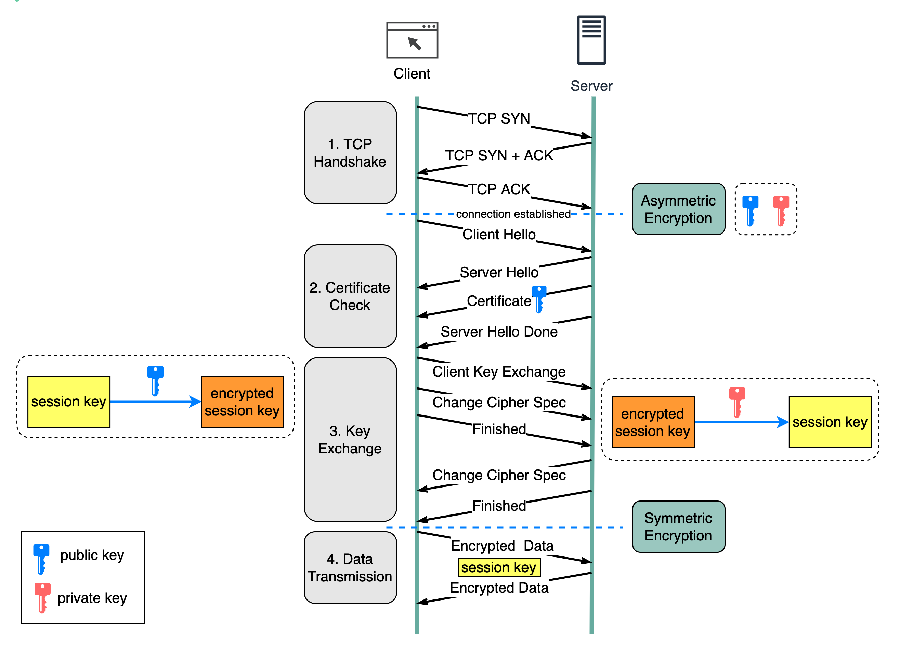
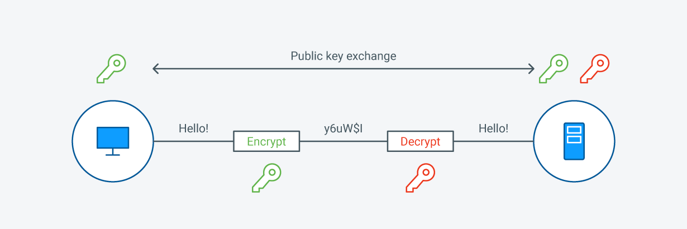

# SSL (Secure Sockets Layer) - TLS (Transport Layer Security)

## 1. Tổng quan SSL/TLS
### 1.1 SSL/TLS  
- SSL, hay Secure Sockets Layer, là một giao thức bảo mật trên Internet dựa trên mã hóa. Nó được phát triển lần đầu tiên bởi Netscape vào năm 1995 nhằm đảm bảo tính riêng tư, xác thực và toàn vẹn dữ liệu trong các giao tiếp qua Internet. SSL là tiền thân của giao thức mã hóa hiện đại TLS được sử dụng ngày nay.
- Transport Layer Security, hay TLS, là một giao thức bảo mật được sử dụng rộng rãi nhằm hỗ trợ quyền riêng tư và bảo mật dữ liệu trong các giao tiếp qua Internet. Một trong những ứng dụng chính của TLS là mã hóa thông tin trao đổi giữa các ứng dụng web và máy chủ, ví dụ như khi trình duyệt tải một trang web. TLS cũng có thể được sử dụng để mã hóa các hình thức giao tiếp khác như email, tin nhắn và thoại qua IP (VoIP).
- Giao thức TLS được đề xuất bởi Internet Engineering Task Force (IETF), một tổ chức tiêu chuẩn quốc tế, và phiên bản đầu tiên được công bố vào năm 1999. Phiên bản mới nhất là TLS 1.3, được phát hành vào năm 2018.
- Sự khác biệt cốt lõi giữa SSL và TLS nằm ở việc TLS giới thiệu một loạt cải tiến quan trọng như thuật toán mã hóa mạnh mẽ hơn, cơ chế xác thực tốt hơn và phương pháp trao đổi khóa an toàn hơn. Những nâng cấp này giúp giảm đáng kể nguy cơ bị tấn công và đảm bảo mức độ bảo mật cao hơn trong truyền tải dữ liệu. Một số điểm nổi bật của TLS bao gồm:
	- Mã hóa mạnh hơn: TLS hỗ trợ các thuật toán mã hóa tiên tiến như AES (Advanced Encryption Standard), mang lại khả năng bảo vệ tốt hơn trước các cuộc tấn công brute-force.
	- Khác biệt về mật mã học: Mặc dù cả hai giao thức đều dựa trên nguyên tắc tương tự, TLS áp dụng các kỹ thuật mật mã mạnh mẽ hơn. Ví dụ, TLS sử dụng HMAC (Mã xác thực thông điệp dựa trên hàm băm) cho tính toàn vẹn của dữ liệu, an toàn hơn so với MAC trong SSL. Ngoài ra, TLS cũng hỗ trợ các bộ mã hóa (cipher suite) an toàn hơn.
	- Xác thực cải tiến: TLS sử dụng phương thức xác thực bảo mật hơn để xác minh danh tính giữa các bên giao tiếp, giảm nguy cơ tấn công giả mạo trung gian. Quy trình bắt tay (handshake) của TLS cũng an toàn hơn với các cơ chế xác thực mạnh mẽ.
	- Hiệu suất cao hơn: TLS được thiết kế tối ưu hơn, giảm tải khi thiết lập kết nối bảo mật, từ đó giúp quy trình bắt tay diễn ra nhanh hơn và độ trễ thấp hơn—phù hợp cho các ứng dụng web hiện đại đòi hỏi tốc độ cao và thời gian phản hồi nhanh.
	- Trao đổi khóa nâng cao: TLS sử dụng các giao thức trao đổi khóa an toàn hơn như Diffie-Hellman và Elliptic Curve Diffie-Hellman để thiết lập kết nối bảo mật.
### 1.2 Lịch sử, phiên bản 
- SSL và TLS là những giao thức dùng để bảo mật các kết nối mạng. SSL, do Netscape phát triển, là giao thức được sử dụng rộng rãi đầu tiên, nhưng sau đó đã được thay thế bởi TLS – một phiên bản nâng cấp với các tính năng bảo mật và hiệu suất cải tiến vượt trội. TLS, được giới thiệu lần đầu vào năm 1999 như bản nâng cấp của SSL 3.0, hiện nay đã trở thành tiêu chuẩn cho việc bảo mật giao tiếp trên Internet.
**SSL (Secure Sockets Layer):**  
- Được phát triển bởi Netscape vào giữa những năm 1990  
- *SSL 1.0* chưa từng được phát hành công khai do có nhiều lỗ hổng bảo mật  
- *SSL 2.0* phát hành vào năm 1995, là phiên bản công khai đầu tiên nhưng cũng tồn tại nhiều điểm yếu  
- *SSL 3.0* ra mắt năm 1996, là một bản thiết kế lại với cải tiến rõ rệt, nhưng theo thời gian vẫn bị phát hiện có lỗ hổng  

**TLS (Transport Layer Security):**  
- TLS 1.0: Đây là phiên bản đầu tiên được phát hành vào năm 1999. Là phiên bản tiếp nối và chứa nhiều đặc điểm tương đồng với SSL 3.0. Phiên bản này đã được cải tiến và cập nhật các giao thức và quy trình để tương thích với các máy tính và kết nối Internet trong giai đoạn đầu của thập kỷ 2000. Phiên bản 1.0 được công bố theo RFC 2246, định nghĩa các yêu cầu và quy định chi tiết cho giao thức này.
- TLS 1.1: Đây là phiên bản thứ hai được ra mắt vào năm 2006, đại diện cho sự tiến bộ đáng kể đầu tiên của giao thức này. Phiên bản này đã mang đến nhiều thay đổi và cải tiến đáng kể, bao gồm việc thay thế Vectơ Khởi tạo bằng một phiên bản rõ ràng hơn để cung cấp khả năng bảo vệ tốt hơn chống lại các cuộc tấn công mạng.
	- Ngoài ra, phiên bản 1.1 cũng đã cải thiện quá trình xử lý lỗi và xác thực để phù hợp với môi trường sử dụng Internet vào năm 2006. Bên cạnh đó, các ghi chú và giải thích liên quan đến các hình thức tấn công mạng mới đã được bổ sung vào phiên bản này. Phiên bản 1.1 đã được công bố theo RFC 4346.
- TLS 1.2: Đây là phiên bản thứ ba và được ra mắt vào năm 2008. Là phiên bản cập nhật quan trọng thứ hai của giao thức và hiện vẫn là phiên bản tiêu chuẩn được sử dụng rộng rãi. Được coi là phiên bản mới nhất, Phiên bản 1.2 mang đến nhiều cải tiến bảo mật đáng kể cùng với việc cải thiện tốc độ và khả năng của cả máy chủ và máy khách trong quá trình thiết lập kết nối và sử dụng tất cả các thuật toán liên quan đến quy trình TLS.
	- Một cải tiến quan trọng của phiên bản 1.2 là việc áp dụng các thuật toán bảo mật mạnh hơn để đảm bảo tính toàn vẹn và bảo mật dữ liệu. Phiên bản này đã được công bố theo RFC 5246.
- TLS 1.3: Đây là phiên bản mới nhất của giao thức này, được công bố vào năm 2016 và đang trong giai đoạn thử nghiệm. Mục tiêu chính của bản cập nhật này là cải thiện đáng kể giao thức bảo mật hiện có, tăng cường tính an toàn trên internet và đảm bảo tính toàn vẹn của việc truyền dữ liệu. Phiên bản 1.3 đã áp dụng các cải tiến để đối phó với các kỹ thuật hack phức tạp, nhằm bảo vệ dữ liệu nhạy cảm và thông tin cá nhân, chẳng hạn như thông tin tài khoản ngân hàng và thanh toán.

| Protocol | Published | Status |
|----------|-----------|--------|
| 🔴 SSL 1.0 | Unpublished | Unpublished |
| 🔴 SSL 2.0 | 1995 | Deprecated in 2011 (RFC 6176) |
| 🔴 SSL 3.0 | 1996 | Deprecated in 2015 (RFC 7568) |
| 🔴 TLS 1.0 | 1999 | Deprecated in 2021 (RFC 8996) |
| 🔴 TLS 1.1 | 2006 | Deprecated in 2021 (RFC 8996) |
| 🟡 TLS 1.2 | 2008 | In use since 2008 |
| 🟢 TLS 1.3 | 2018 | In use since 2018 |

### 1.3 Vai trò của SSL trong bảo mật mạng (HTTPS, email, VPN, v.v.)
- HTTPS (Hypertext Transfer Protocol Secure): SSL/TLS là nền tảng của HTTPS – một phiên bản bảo mật của HTTP. Giao thức này mã hóa dữ liệu truyền giữa trình duyệt và máy chủ, giúp bảo vệ thông tin khỏi bị nghe lén hoặc chỉnh sửa. Nó cũng thực hiện xác thực máy chủ để người dùng biết họ đang kết nối với đúng website.
- Email: Các giao thức email như SMTPS, POP3S và IMAPS sử dụng SSL/TLS để bảo vệ nội dung thư điện tử trong quá trình truyền tải. Điều này ngăn chặn việc rò rỉ hoặc giả mạo email, đồng thời đảm bảo tính toàn vẹn của thông tin.
- VPN (Virtual Private Network): Một số giao thức VPN (ví dụ: OpenVPN) dựa trên SSL/TLS để mã hóa dữ liệu giữa thiết bị của người dùng và máy chủ VPN. Điều này tạo ra một kênh truyền thông an toàn, đặc biệt hữu ích khi sử dụng mạng công cộng.
- Các ứng dụng khác: SSL/TLS được ứng dụng trong bảo mật các dịch vụ như nhắn tin, thoại qua IP (VoIP), truy cập từ xa, và API trong kiến trúc microservices hoặc hệ thống đám mây. Việc sử dụng SSL giúp bảo vệ các tương tác giữa các thành phần phần mềm khác nhau khỏi rò rỉ hoặc can thiệp dữ liệu.
### 1.4 Lợi ích
- Lợi ích của  SSL/TLS:
	- Bảo vệ dữ liệu: Mã hóa thông tin giúp ngăn chặn nghe lén, đánh cắp và chỉnh sửa dữ liệu.
	- Xác thực danh tính: Đảm bảo người dùng đang truy cập đúng website hợp pháp.
	- Tuân thủ tiêu chuẩn: Bắt buộc với các website thanh toán để đáp ứng yêu cầu PCI-DSS.
	- Ngăn chặn tấn công: Bảo vệ khỏi giả mạo, nghe lén và đánh cắp danh tính.
	- Chống lừa đảo: Khó có trang giả mạo nào đạt được chứng chỉ bảo mật cao cấp như EV/OV.
	- Cải thiện thứ hạng tìm kiếm: Google ưu tiên các website sử dụng HTTPS.
	- Tăng niềm tin người dùng: Biểu tượng ổ khóa và HTTPS tạo cảm giác an toàn khi giao dịch.

### 1.5 Các vấn đề khi sử dụng SSL/TLS
- Mặc dù SSL/TLS mang lại nhiều lợi ích, nhưng các nhà phát triển có thể gặp phải một số thách thức khi triển khai:
	- Tác động đến hiệu suất: SSL/TLS tạo ra một mức độ tải bổ sung do quá trình mã hóa và giải mã. Điều này có thể ảnh hưởng đến hiệu suất ứng dụng, đặc biệt khi xử lý lượng lớn dữ liệu hoặc giao tiếp theo thời gian thực.
	- Vấn đề tương thích: Việc triển khai SSL/TLS có thể khác nhau giữa các nền tảng, thư viện và phiên bản. Điều này có thể dẫn đến sự cố tương thích khi thiết lập kết nối bảo mật giữa máy khách và máy chủ.
	- Khả năng mở rộng: Các ứng dụng nhắn tin và chat theo thời gian thực thường phải xử lý nhiều kết nối đồng thời. Việc mở rộng SSL/TLS có thể gặp khó khăn vì cần thêm tài nguyên tính toán để thực hiện mã hóa và giải mã. Cần xem xét triển khai các chiến lược cân bằng tải và bộ đệm (caching) để xử lý lưu lượng tăng cao.
	- Độ phức tạp trong tích hợp: Tích hợp SSL/TLS vào ứng dụng có thể phức tạp, đặc biệt là đối với kiến trúc phân tán hoặc các hệ thống phụ thuộc vào nhiều dịch vụ bên thứ ba.
	- Quản lý chứng chỉ: Việc quản lý và gia hạn chứng chỉ số có thể tốn thời gian và công sức, đặc biệt trong các hệ thống quy mô lớn với nhiều máy chủ và tên miền.
	- Chi phí phát triển và bảo trì bổ sung: Việc triển khai SSL/TLS cho các ứng dụng chat thời gian thực đòi hỏi thêm nỗ lực về mặt phát triển và bảo trì.

### 1.6 So sánh SSL/TLS

| Tiêu chí                  | SSL                                                                      | TLS                                                                      |
| ------------------------- | ------------------------------------------------------------------------ | ------------------------------------------------------------------------ |
| Viết tắt                  | SSL là viết tắt của *Secure Sockets Layer*.                              | TLS là viết tắt của *Transport Layer Security*.                          |
| Lịch sử phiên bản         | SSL hiện đã bị thay thế bởi TLS. Bao gồm các phiên bản 1.0, 2.0 và 3.0.  | TLS là phiên bản nâng cấp từ SSL. Có các phiên bản 1.0, 1.1, 1.2 và 1.3. |
| Tình trạng hoạt động      | Tất cả các phiên bản SSL đều đã bị khai tử (deprecated).                 | TLS 1.2 và 1.3 vẫn đang được sử dụng phổ biến.                           |
| Thông báo cảnh báo        | Chỉ có hai loại thông báo cảnh báo. Các thông báo này không được mã hóa. | Thông báo cảnh báo được mã hóa và đa dạng hơn.                           |
| Xác thực thông điệp       | Sử dụng MAC (Message Authentication Code).                               | Sử dụng HMAC (Hash-based MAC), an toàn hơn.                              |
| Bộ mã hóa (Cipher Suites) | Hỗ trợ các thuật toán cũ, nhiều thuật toán đã có lỗ hổng.                | Sử dụng thuật toán mã hóa tiên tiến, bảo mật cao.                        |
| Bắt tay (Handshake)       | Quá trình bắt tay phức tạp và chậm.                                      | Bắt tay đơn giản hơn, thiết lập kết nối nhanh hơn.                       |


## 2. Cách thức hoạt động của SSL 
### 2.1 Hoạt động của SSL/TLS 
- Giao tiếp an toàn bắt đầu bằng quá trình bắt tay TLS (TLS handshake), trong đó hai bên tham gia sẽ thiết lập kết nối bảo mật và trao đổi khóa công khai.
- Trong quá trình bắt tay, cả hai bên sẽ tạo ra khóa phiên (session key), và các khóa này sẽ được sử dụng để mã hóa và giải mã toàn bộ dữ liệu truyền sau đó.
- Mỗi phiên giao tiếp mới sử dụng một khóa phiên khác nhau, đảm bảo tính riêng tư và bảo mật.
- TLS đảm bảo rằng bên máy chủ (hoặc website mà người dùng đang tương tác) thực sự là đối tượng chính xác như họ tuyên bố.
- TLS cũng đảm bảo rằng dữ liệu không bị thay đổi trong quá trình truyền, nhờ sử dụng mã xác thực thông điệp (MAC – Message Authentication Code).
- Với TLS, tất cả dữ liệu HTTP mà người dùng gửi đến website (như nhấp chuột, điền biểu mẫu…) và dữ liệu mà website gửi lại cho người dùng đều được mã hóa. Dữ liệu này chỉ có thể được giải mã bởi bên nhận bằng khóa thích hợp.

### 2.2 Handshake SSL/TLS: Cách thiết lập kết nối an toàn.
- Các "SSL handshakes" thực chất là TLS handshakes, mặc dù tên “SSL” vẫn được sử dụng phổ biến trong thực tế.
- TLS handshake xảy ra khi người dùng truy cập vào dịch vụ sử dụng SSL/TLS và client liên lạc với server.
- Lưu ý: TLS handshake được thực hiện sau khi kết nối TCP đã được thiết lập thông qua quá trình TCP handshake.
- Trong quá trình TLS handshake, máy khách (client) và máy chủ (server) sẽ thực hiện các bước sau:
	- Xác định phiên bản TLS sẽ sử dụng (ví dụ: TLS 1.0, 1.2, 1.3, v.v.)
	- Thỏa thuận lựa chọn bộ thuật toán mã hóa (cipher suites) được hỗ trợ và sử dụng
	- Xác thực danh tính của máy chủ thông qua khóa công khai (public key) và chữ ký số từ tổ chức phát hành chứng chỉ SSL
	- Tạo khóa phiên (session key) để sử dụng mã hóa đối xứng sau khi handshake hoàn tất
- TLS handshake là một chuỗi các datagram (gói tin) hoặc thông điệp được trao đổi giữa máy khách (client) và máy chủ (server). Quá trình handshake bao gồm nhiều bước, trong đó hai bên trao đổi các thông tin cần thiết để hoàn tất handshake và thiết lập khả năng giao tiếp bảo mật tiếp theo.
- Các bước cụ thể trong một TLS handshake có thể khác nhau tùy thuộc vào thuật toán trao đổi khóa được sử dụng và các bộ mã hóa (cipher suites) mà cả hai bên hỗ trợ. Thuật toán trao đổi khóa RSA – hiện nay không còn được coi là an toàn – từng được sử dụng trong các phiên bản TLS trước 1.3. Quy trình điển hình như sau:
	1. Thiết lập kết nối bảo mật (Quy trình Handshake)
	- Client Hello: Máy khách (trình duyệt của bạn) gửi một thông điệp đến máy chủ để yêu cầu thiết lập kết nối bảo mật. Thông điệp này bao gồm các thuật toán mã hóa được hỗ trợ và một số ngẫu nhiên dùng để khởi tạo mã hóa.
	- Server Hello: Máy chủ phản hồi bằng số ngẫu nhiên của riêng nó, chọn thuật toán mã hóa phù hợp từ danh sách của máy khách và gửi kèm chứng chỉ SSL/TLS (chứa khóa công khai và danh tính của máy chủ).
	2. Xác thực
	- Máy khách kiểm tra tính hợp lệ của chứng chỉ SSL/TLS thông qua tổ chức chứng thực (CA) đã cấp chứng chỉ đó. Việc này đảm bảo máy chủ là đúng đối tượng được khai báo.
	- Nếu chứng chỉ hợp lệ và đáng tin cậy, máy khách sẽ tiếp tục kết nối. Nếu không, sẽ xuất hiện cảnh báo (ví dụ: “kết nối không đáng tin”).
	3. Trao đổi khóa
	- Client Key Exchange: Máy khách tạo một số ngẫu nhiên gọi là "pre-master secret" và mã hóa nó bằng khóa công khai của máy chủ rồi gửi đến máy chủ.
	- Server Decrypts: Máy chủ giải mã pre-master secret bằng khóa bí mật của mình.
	- Cả hai bên sau đó sử dụng pre-master secret cùng với các số ngẫu nhiên từ handshake để tạo ra khóa phiên (session key). Khóa này sẽ được sử dụng để mã hóa và giải mã dữ liệu trong suốt phiên làm việc.
	4. Mã hóa dữ liệu và giao tiếp an toàn
	- Khi cả hai đã có chung một khóa phiên, họ có thể mã hóa và giải mã dữ liệu trao đổi. Nhờ đó, ngay cả khi kẻ tấn công chặn được dữ liệu, họ cũng không thể đọc nội dung nếu không có khóa phiên.
	5. Kết thúc phiên làm việc
	- Sau khi trao đổi xong, máy khách và máy chủ gửi thông báo cho nhau rằng phiên làm việc đã kết thúc. Việc này đảm bảo khóa phiên được hủy bỏ và kết nối bảo mật được đóng lại.
	- 
- Handshake trong TLS 1.3 
	- TLS 1.3 không hỗ trợ RSA hay các bộ mã hóa và tham số dễ bị tấn công. Giao thức này cũng rút gọn quá trình handshake, giúp TLS 1.3 handshake diễn ra nhanh hơn và an toàn hơn.
	- Các bước cơ bản trong TLS 1.3 handshake:
		- Client Hello: Máy khách gửi thông điệp hello chứa phiên bản giao thức, client random và danh sách các cipher suite được hỗ trợ. Do TLS 1.3 đã loại bỏ các thuật toán yếu, danh sách cipher suite đã được rút gọn đáng kể. Thông điệp cũng bao gồm các tham số cần thiết để tính toán "premaster secret". Trên thực tế, máy khách gần như đoán trước được phương pháp trao đổi khóa mà máy chủ ưa dùng — điều này giúp rút ngắn tổng thời gian handshake, là điểm khác biệt chính so với các phiên bản TLS cũ hơn (1.0 – 1.2).
		- Máy chủ tạo master secret: Sau khi nhận được client random và các tham số, máy chủ tự tạo server random và có đủ thông tin để tính master secret.
		- Server Hello + Finished: Server hello bao gồm chứng chỉ số, chữ ký số, server random và cipher suite đã chọn. Vì đã có master secret, máy chủ cũng gửi luôn thông điệp "Finished".
		- Bước cuối – Client Finished: Máy khách xác minh chữ ký và chứng chỉ, tạo master secret và gửi lại thông điệp "Finished".
		→ Mã hóa đối xứng an toàn được thiết lập.
	- 0-RTT (Zero Round Trip Time) cho tái sử dụng phiên: TLS 1.3 còn hỗ trợ chế độ 0-RTT cho các lần kết nối tiếp theo: nếu client và server đã từng kết nối trước đó, họ có thể tạo ra một "resumption main secret" từ phiên đầu tiên. Trong phiên đầu, server gửi cho client một vé phiên (session ticket). Khi client kết nối lại, nó dùng shared secret này và session ticket để mã hóa dữ liệu ngay từ thông điệp đầu tiên, không cần mất thời gian trao đổi thông điệp qua lại.

### 2.3 Vai trò của khóa công khai (public key) và khóa bí mật (private key).
- Trong SSL, khóa công khai (public key) và khóa bí mật (private key) là hai thành phần cốt lõi trong hệ thống mã hóa được sử dụng cho giao tiếp an toàn.
	- Khóa công khai được dùng để mã hóa dữ liệu.
	- Khóa bí mật được dùng để giải mã dữ liệu đã mã hóa.
- Đây là phương pháp mã hóa bất đối xứng, đảm bảo rằng chỉ người nhận dự kiến sở hữu khóa bí mật tương ứng mới có thể giải mã và truy cập thông tin. Nhờ vậy, dữ liệu được bảo vệ ngay cả khi truyền qua các kênh không an toàn.
- Khóa công khai (Public Key):
	- Khả dụng: Khóa công khai được chia sẻ tự do và sẵn sàng cho bất kỳ ai muốn gửi dữ liệu được mã hóa đến người sở hữu khóa.
	- Mã hóa: Khóa này được dùng để mã hóa các thông điệp hoặc dữ liệu mà chỉ người giữ khóa bí mật tương ứng mới có thể giải mã và đọc được.
	- Ví dụ: Nếu Alice muốn gửi một thông điệp an toàn cho Bob, cô ấy sẽ mã hóa thông điệp bằng khóa công khai của Bob. Khi Bob nhận được thông điệp, anh ấy sẽ giải mã nó bằng khóa bí mật của mình.
- Khóa bí mật (Private Key):
	- Bảo mật: Khóa bí mật được giữ kín tuyệt đối và không bao giờ được chia sẻ. Nó được sử dụng để giải mã dữ liệu đã được mã hóa bằng khóa công khai tương ứng.
	- Giải mã: Đây là khóa duy nhất có khả năng giải mã dữ liệu đã được mã hóa bằng khóa công khai của nó.
	- Ví dụ: Chỉ Bob sở hữu khóa bí mật tương ứng với khóa công khai được dùng để mã hóa thông điệp do Alice gửi.
	- 

## 3. Chứng chỉ SSL (SSL Certificate)
### 3.1 Khái niệm và mục đích 
- SSL/TLS Certificate hay Chứng chỉ SSL/TLS là một đối tượng số cho phép các hệ thống xác minh danh tính và thiết lập kết nối mạng được mã hóa với một hệ thống khác thông qua giao thức SSL/TLS (Secure Sockets Layer/Transport Layer Security).
- Các chứng chỉ này hoạt động trong một hệ thống mật mã gọi là cơ sở hạ tầng khóa công khai (PKI – Public Key Infrastructure). PKI cho phép một bên xác minh danh tính của bên kia nếu cả hai cùng tin tưởng vào một bên thứ ba – gọi là tổ chức chứng thực (Certificate Authority – CA).
- Chứng chỉ SSL/TLS đóng vai trò như một thẻ căn cước số, giúp bảo vệ các kết nối mạng, xác thực danh tính của các website trên Internet cũng như các tài nguyên trong mạng nội bộ.
- Lợi ích của chứng chỉ SSL/TLS:
	- Bảo vệ dữ liệu cá nhân: Trình duyệt kiểm tra chứng chỉ SSL/TLS trước khi cho phép kết nối bảo mật. Công nghệ này giúp mã hóa toàn bộ thông tin giữa người dùng và máy chủ web.
	- Tăng độ tin cậy với khách hàng: Người dùng hiểu biết về Internet quan tâm đến quyền riêng tư và tin tưởng hơn vào các website có biểu tượng ổ khóa xanh. SSL/TLS giúp khẳng định rằng dữ liệu của họ đang được bảo vệ.
	- Tuân thủ quy định pháp lý: Một số ngành, như ngành thanh toán, bắt buộc phải tuân thủ các quy định bảo mật như PCI DSS – trong đó yêu cầu cài chứng chỉ SSL/TLS để đảm bảo giao dịch an toàn.
	- Cải thiện thứ hạng SEO: Các công cụ tìm kiếm lớn xem SSL/TLS là yếu tố đánh giá xếp hạng. Website được bảo mật bằng SSL/TLS thường có vị trí cao hơn so với website không có bảo vệ, từ đó thu hút nhiều lượt truy cập hơn.
- Xác thực và thời hạn của chứng chỉ 
	- Cơ quan cấp chứng chỉ (CA – Certificate Authority) là tổ chức chuyên cung cấp các chứng chỉ SSL/TLS cho chủ sở hữu trang web, công ty lưu trữ web hoặc doanh nghiệp. CA sẽ xác minh thông tin tên miền và người sở hữu trước khi cấp chứng chỉ SSL/TLS.
	- Chứng chỉ SSL/TLS hiện có thời hạn tối đa là 13 tháng. Trong những năm qua, thời hạn này đã dần được rút ngắn nhằm giảm thiểu rủi ro bảo mật cho doanh nghiệp và người dùng web. Ví dụ, bên thứ ba không đáng tin có thể tận dụng chứng chỉ vẫn còn hiệu lực của một tên miền đã hết hạn để tạo ra một trang web trái phép.
	- Việc rút ngắn thời gian hiệu lực sẽ giúp hạn chế khả năng bị lạm dụng. Khi chứng chỉ SSL/TLS hết hạn, trình duyệt sẽ cảnh báo người dùng rằng trang web không còn an toàn. Do đó, tổ chức cần thu hồi chứng chỉ cũ và thay thế bằng chứng chỉ mới được gia hạn. Quá trình gia hạn này cần hoàn tất trước khi chứng chỉ hiện tại hết hạn để tránh các sự cố bảo mật.

### 3.2 Các loại chứng chỉ SSL:
#### 3.2.1 Theo cấp độ xác thực 
- Mục đích chính của chứng chỉ SSL là nhằm xác minh danh tính máy chủ trên mạng 
- Để thực hiện điều đó, mỗi chứng chỉ chứa thông tin về thực thể được cấp chứng chỉ. Mức độ chi tiết của thông tin phụ thuộc vào cấp độ xác thực của chứng chỉ. SSL có ba cấp độ xác thực.
	- DV (Domain Validation) 
		- Xác thực tên miền (Domain Validation) là cấp độ xác thực nhẹ nhất trong các loại chứng chỉ SSL. Với chứng chỉ DV, điều duy nhất được xác thực về danh tính của người sở hữu chứng chỉ là họ thực sự có quyền kiểm soát tên miền mà chứng chỉ được cấp cho.
		- Ưu điểm chính của chứng chỉ DV là có thể được cấp trong vài phút. Chứng chỉ DV được khuyến nghị sử dụng trong các trường hợp chỉ cần mã hóa hoặc yêu cầu có chứng chỉ, nhưng không phải mục tiêu của các cuộc tấn công lừa đảo và không đòi hỏi phải tạo dựng sự tin tưởng đặc biệt với người truy cập trang web.
	- OV (Organization Validation)
		- Xác thực tổ chức là cấp độ xác thực trung bình trong các loại chứng chỉ SSL. Chứng chỉ OV đưa ra tuyên bố về danh tính của tổ chức được cấp chứng chỉ và nơi tổ chức đó hoạt động.
		- Việc xác thực OV chủ yếu do từng tổ chức cấp chứng chỉ (CA) quyết định. Mặc dù chứng chỉ này cung cấp thông tin về danh tính tổ chức, nhưng do quy trình xác thực không được thực hiện và kiểm toán ở một tiêu chuẩn chung toàn cầu nên các trình duyệt phổ biến không hiển thị tên công ty trong thanh địa chỉ.
	- EV (Extended Validation)
		- Xác thực mở rộng (Extended Validation – EV) là cấp độ xác thực SSL cao nhất. Danh tính của chủ sở hữu chứng chỉ EV được xác minh theo một bộ giao thức tiêu chuẩn, được đánh giá là có độ tin cậy cao và đã được kiểm chứng qua thực tiễn sử dụng rộng rãi.
		- Vì mức độ tin tưởng cao đối với thông tin trong loại chứng chỉ này, hầu hết các trình duyệt phổ biến đều hiển thị biểu tượng tin cậy màu xanh lá (thanh địa chỉ màu xanh), kèm theo tên của tổ chức ở bên trái đường dẫn URL. Nhiều trình duyệt còn cung cấp thêm thông tin như thành phố nơi tổ chức hoạt động và tên của cơ quan cấp chứng chỉ.
		- Chứng chỉ EV được khuyến nghị sử dụng cho các ứng dụng cần tối đa hóa giao dịch hoặc xây dựng lòng tin với người dùng, các ứng dụng xử lý thông tin giá trị cao như dữ liệu nhận dạng cá nhân (PII) hoặc số thẻ tín dụng, hay các ứng dụng yêu cầu tuân thủ tiêu chuẩn cần EV. EV hiện là chuẩn mặc định cho các doanh nghiệp trực tuyến như ngân hàng, cửa hàng, sàn giao dịch, cổng khai thuế, dịch vụ y tế và các tài khoản mạng xã hội.
#### 3.2.2 Theo phạm vi bảo vệ
- Mặc dù mỗi tên miền cụ thể cần được bảo vệ bằng chứng chỉ SSL để kích hoạt mã hóa và các chỉ báo tin cậy trên trình duyệt, nhưng vẫn có thể sử dụng các loại chứng chỉ có thể bảo vệ nhiều tên miền cùng lúc.
- Xét về phạm vi bảo vệ tên miền, chứng chỉ SSL được chia thành ba loại.
	- Basic SSL certificates
		- Chứng chỉ SSL cơ bản chỉ bảo vệ một tên miền hoặc tên miền phụ. Muốn bảo vệ nhiều tên miền, bạn cần nhiều chứng chỉ tương ứng. Tuy nhiên, phần lớn CA sẽ cấp chứng chỉ cho cả www.domain.com và domain.com trong cùng một chứng chỉ.
		- Chứng chỉ cơ bản có thể áp dụng ở cả 3 mức xác thực: DV, OV, và EV. Dù bảo mật tốt, nhưng sử dụng nhiều chứng chỉ riêng lẻ sẽ tốn công quản lý hơn, đặc biệt trong hệ thống phức tạp.
	- Wildcard SSL certificates 
		- Chứng chỉ SSL Wildcard có thể bảo vệ nhiều tên miền phụ dưới một tên miền gốc chính. 
		- Ví dụ, một chứng chỉ wildcard cho domain.com sẽ bảo vệ được các tên miền như:
			- www.domain.com
			- login.domain.com
			- cart.domain.com
			- ftp.domain.com
		- và bất kỳ tên miền phụ nào khác của domain.com. Trong trường hợp này, tên miền gốc domain.com cũng sẽ được bảo vệ.
		- Wildcard cũng có thể áp dụng cho một tên miền phụ cụ thể, từ đó bảo vệ các tên miền con sâu hơn. Ví dụ, một chứng chỉ wildcard cho shop.domain.com sẽ áp dụng được cho:
			- a.shop.domain.com
			- b.shop.domain.com
		- Tuy nhiên, một wildcard không thể áp dụng cho nhiều tên miền gốc khác nhau. Ví dụ, wildcard của domain.com sẽ không thể bảo vệ example.com hoặc bất kỳ tên miền phụ nào của nó. Tương tự, wildcard cho shop.domain.com sẽ không hoạt động với checkout.domain.com.
		- Wildcard thuận tiện hơn đáng kể trong việc cấp phát và quản lý nếu bạn có nhiều tên miền phụ. Có thể tạo thêm các tên miền phụ mới sau khi chứng chỉ được phát hành mà vẫn sử dụng cùng chứng chỉ đó.
		- Chứng chỉ Wildcard có thể được cấp ở mức DV (Domain Validation) và OV (Organization Validation). Tuy nhiên, theo tiêu chuẩn hiện hành, không được phép cấp chứng chỉ Wildcard ở mức EV (Extended Validation). Vì vậy, với các website hướng tới công chúng yêu cầu độ tin cậy cao (như trang thương mại điện tử có các tên miền phụ như www., shop., checkout.), nên cân nhắc dùng chứng chỉ đa miền EV.
	- Multi-domain or SAN certificates 
		- Chứng chỉ đa miền (Multi-domain) hoặc SAN cho phép một chứng chỉ duy nhất bảo vệ tối đa 100 tên miền cụ thể. Không giống như chứng chỉ wildcard, chứng chỉ đa miền có thể bảo vệ bất kỳ tập hợp tên miền nào bằng cùng một chứng chỉ. Ví dụ, một chứng chỉ đa miền có thể bảo vệ:
			- www.domain.com
			- ftp.domain.net
			- shop.domain.com
			- a.shop.domain.mobi
			- www.example.com
			- login.example.com
		- Chứng chỉ đa miền có thể được cấp ở các mức xác thực DV, OV và EV. Mỗi tên miền bổ sung được bảo vệ trong chứng chỉ đa miền được gọi là SAN (Subject Alternative Name). Các chứng chỉ có SAN đôi khi được gọi là chứng chỉ SAN thay vì chứng chỉ đa miền, nhưng cả hai thuật ngữ đều mang cùng một ý nghĩa.
		- Chứng chỉ đa miền có thể thuận tiện hơn so với chứng chỉ cơ bản trong các môi trường phức tạp. Tuy nhiên, vì nhiều tên miền được bảo vệ bởi một chứng chỉ duy nhất, nên chúng không được khuyến nghị cho các môi trường nhạy cảm đòi hỏi mức độ bảo mật cao nhất. Do chứng chỉ đa miền có thể được phát hành ở mức xác thực mở rộng (EV), chúng là lựa chọn phù hợp cho các trang web doanh nghiệp hướng đến người dùng có nhiều tên miền phụ, chẳng hạn như các trang bán lẻ trực tuyến.
#### 3.2.3 Theo nguồn cấp 
- Ngoài việc phân loại chứng chỉ SSL theo phạm vi bảo vệ tên miền (cơ bản, wildcard, đa miền) và cấp độ xác thực (DV, OV, EV), chứng chỉ SSL còn được phân loại dựa trên nguồn cấp phát
	- Chứng chỉ tự ký (Self-Signed Certificates):
		- Được tạo và ký bởi chính thực thể sử dụng chứng chỉ (ví dụ: chủ sở hữu website).
		- Không được các trình duyệt hoặc hệ thống tin tưởng mặc định.
		- Yêu cầu thiết lập tin cậy thủ công (ví dụ: thêm chứng chỉ vào danh sách tin cậy).
		- Thường được sử dụng cho kiểm thử nội bộ, phát triển hoặc mạng riêng — nơi mức độ tin cậy không quá quan trọng.
		- Không trải qua quy trình xác thực của tổ chức cấp chứng chỉ (CA).
		- Tiềm ẩn rủi ro bảo mật do thiếu xác thực từ bên thứ ba.
	- Chứng chỉ do CA cấp (CA-Signed Certificates):
		- Được tạo và ký bởi một tổ chức cấp chứng chỉ đáng tin cậy (CA).
		- Được hầu hết các trình duyệt và hệ thống tin tưởng tự động.
		- Trải qua quy trình xác thực bởi CA.
		- Được ưu tiên sử dụng cho các website và ứng dụng hướng ra công chúng nhờ mức độ tin cậy cao.
		- Cung cấp sự đảm bảo về danh tính của website.
		- Có thể bị thu hồi bởi CA khi cần thiết.


### 3.3 Mã hóa trong SSL/TLS:
- Mã hóa (Encryption) là quá trình chuyển đổi thông tin từ dạng ban đầu thành dạng không đọc được bằng cách sử dụng thuật toán và khóa mật mã.
`Dữ liệu + Khóa >>> Thuật toán mã hóa >>> Dữ liệu được mã hóa`
- Giải mã (Decryption)là quá trình chuyển dữ liệu đã được mã hóa trở lại dưới dạng thông tin có thể đọc được
`Dữ liệu được mã hóa + Khóa >>> Thuật toán giải mã >>> Dữ liệu`
- Mã hóa SSL/TLS thiết lập một kết nối an toàn và được mã hóa giữa máy khách (như trình duyệt web) và máy chủ (như một trang web) bằng cách sử dụng kết hợp giữa mã hóa bất đối xứng và đối xứng. Điều này ngăn chặn các bên không được phép đọc hoặc can thiệp vào dữ liệu được truyền trong suốt phiên làm việc đó.
	- Bước 1: Mã hóa bất đối xứng (Asymmetric Encryption):	Khi trình duyệt (client) kết nối đến máy chủ (server), máy chủ gửi chứng chỉ số chứa khóa công khai. Trình duyệt xác minh chứng chỉ này thông qua một Tổ chức cấp chứng chỉ (CA) trong hệ thống PKI. Sau đó, trình duyệt sử dụng khóa công khai này để mã hóa một khóa phiên (session key) và gửi lại cho máy chủ.
	- Bước 2: Mã hóa đối xứng (Symmetric Encryption): Máy chủ sử dụng khóa riêng tư để giải mã khóa phiên. Từ thời điểm đó, cả hai bên sử dụng khóa phiên đối xứng này để mã hóa và giải mã dữ liệu truyền đi — vì mã hóa đối xứng nhanh hơn và hiệu quả hơn cho truyền dữ liệu liên tục.
- Ví dụ quy trình giao tiếp giữa client-server 
	- Máy khách liên hệ với máy chủ bằng một URL bảo mật (HTTPS…).
	- Máy chủ gửi cho máy khách chứng chỉ và khóa công khai của mình.
	- Máy khách xác minh chứng chỉ này với một Tổ chức chứng thực gốc đáng tin cậy để đảm bảo tính hợp lệ.
	- Máy khách và máy chủ đàm phán loại mã hóa mạnh nhất mà cả hai bên hỗ trợ.
	- Máy khách mã hóa một khóa phiên (bí mật) bằng khóa công khai của máy chủ và gửi lại cho máy chủ.
	- Máy chủ sử dụng khóa riêng để giải mã thông tin từ máy khách và thiết lập phiên kết nối.
	- Khóa phiên (mã hóa đối xứng) giờ đây được sử dụng để mã hóa và giải mã dữ liệu truyền giữa máy khách và máy chủ.
#### 3.3.1 Mã hóa đối xứng (Symmetric Encryption).
- Mã hóa đối xứng (hay mã hóa bằng khóa chia sẻ trước) sử dụng một khóa duy nhất để mã hóa và giải mã dữ liệu. Cả người gửi và người nhận đều cần có cùng một khóa để giao tiếp.
- Kích thước khóa đối xứng thường là 128 hoặc 256 bit — khóa càng dài thì càng khó bị phá vỡ.
- Việc sử dụng khóa 128 hay 256 bit phụ thuộc vào khả năng mã hóa của cả máy chủ và phần mềm phía máy khách. Chứng chỉ TLS/SSL không quyết định kích thước khóa được sử dụng.
- Phương pháp này có tốc độ xử lý nhanh và thường dùng để mã hóa dữ liệu trong suốt phiên làm việc sau khi khóa được trao đổi an toàn. Tuy nhiên, điểm yếu của nó là việc phân phối khóa — nếu khóa bị lộ, toàn bộ dữ liệu có thể bị giải mã.
- 
#### 3.3.2 Mã hóa bất đối xứng (Asymmetric Encryption).
- Mã hóa bất đối xứng, còn được gọi là Mật mã khóa công khai sử dụng hai khóa riêng biệt để mã hóa và giải mã. Với mã hóa bất đối xứng, bất kỳ ai cũng có thể sử dụng khóa công khai để mã hóa một thông điệp. Tuy nhiên, khóa giải mã được giữ bí mật. Nhờ đó, chỉ người nhận dự kiến mới có thể giải mã thông điệp.
- Thuật toán mã hóa bất đối xứng phổ biến nhất là RSA. RSA là viết tắt của Ron Rivest, Adi Shamir và Leonard Adleman — những người đầu tiên công bố thuật toán này vào năm 1977. Các khóa bất đối xứng thường có độ dài 1024 hoặc 2048 bit. Tuy nhiên, các khóa nhỏ hơn 2048 bit hiện không còn được xem là an toàn. Khóa 2048 bit có hàng loạt mã hóa duy nhất với độ dài lên tới 617 chữ số.
- Dù có thể tạo ra các khóa lớn hơn, nhưng gánh nặng tính toán tăng lên đáng kể khiến các khóa lớn hơn 2048 bit hiếm khi được sử dụng. Để dễ hình dung, một máy tính trung bình sẽ mất hơn 14 tỷ năm để phá vỡ một chứng chỉ 2048 bit.
- 

| Tiêu chí                    | Mã hóa đối xứng                         | Mã hóa bất đối xứng                           |
| --------------------------- | --------------------------------------- | --------------------------------------------- |
| **Số lượng khóa sử dụng**   | 1 khóa (dùng chung để mã hóa & giải mã) | 2 khóa (khóa công khai & khóa riêng tư)       |
| **Tốc độ xử lý**            | Nhanh hơn                               | Chậm hơn do tính toán phức tạp hơn            |
| **Bảo mật khi truyền khóa** | Cần kênh an toàn để chia sẻ khóa        | Không cần chia sẻ khóa riêng tư               |
| **Ứng dụng phổ biến**       | Mã hóa dữ liệu trong phiên làm việc     | Trao đổi khóa an toàn, xác thực danh tính     |
| **Thuật toán tiêu biểu**    | AES, DES, RC4                           | RSA, ECC                                      |
| **Độ dài khóa phổ biến**    | 128 hoặc 256 bit                        | 2048 bit trở lên                              |
| **Rủi ro bảo mật**          | Nếu khóa bị lộ, toàn bộ dữ liệu bị nguy | Khó bị tấn công nếu giữ khóa riêng tư an toàn |


#### 3.3.3 Thuật toán trao đổi khóa (Diffie-Hellman, RSA, ECC).
##### DH (Diffie-Hellman)
- Trao đổi khóa Diffie–Hellman (D-H) là một phương pháp trao đổi khóa được phát minh sớm nhất trong mật mã học. Phương pháp trao đổi khóa Diffie–Hellman cho phép hai bên (người, thực thể giao tiếp) thiết lập một khóa bí mật chung để mã hóa dữ liệu sử dụng trên kênh truyền thông không an toàn mà không cần có sự thỏa thuận trước về khóa bí mật giữa hai bên. Khóa bí mật tạo ra sẽ được sử dụng để mã hóa dữ liệu với phương pháp mã hóa khóa đối xứng.
- Giao thức này được công bố đầu tiên bởi Whitfield Diffie và Martin Hellman vào năm 1976
- Giao thức này tận dụng các đặc tính toán học của logarit rời rạc và số học mô-đun để đảm bảo rằng ngay cả khi kẻ thù chặn được đường truyền, chúng cũng không thể lấy được khóa bí mật chung.
- Tính bảo mật của trao đổi khóa Diffie-Hellman dựa trên độ khó của Bài toán logarit rời rạc (DLP). DLP tuyên bố rằng với một số nguyên tố lớn nhất định p, một gốc nguyên thủy g hình thức p, và một số y như vậy mà y = g^x \mod p, về mặt tính toán không thể xác định được x được y, gvà p. Tính khó điều chỉnh này là nền tảng cho tính bảo mật của giao thức.
- Các bước giao thức
1. Tạo tham số:
– Alice và Bob đồng ý về một số nguyên tố lớn p và một gốc nguyên thủy g hình thức p. Những giá trị này không cần phải giữ bí mật và có thể được chia sẻ một cách công khai. Sự lựa chọn của p và g là rất quan trọng; p phải đủ lớn để chống lại các cuộc tấn công, thường ít nhất là 2048 bit trong các triển khai hiện đại.
2. Lựa chọn khóa riêng tư:
– Alice chọn khóa riêng a, là một số nguyên ngẫu nhiên sao cho 1 < a < p-1.
– Bob chọn khóa riêng b, tương tự như vậy là một số nguyên ngẫu nhiên sao cho 1 < b < p-1.
3. Tính toán khóa công khai:
– Alice tính toán khóa công khai của mình A as A = g^a \mod p.
– Bob tính khóa công khai của mình B as B = g^b \mod p.
4. Trao đổi khóa công khai:
– Alice gửi khóa công khai của mình A gửi Bob.
– Bob gửi khóa công khai của mình B tới Alice.
5. Tính toán bí mật được chia sẻ:
– Alice tính toán bí mật được chia sẻ S as S = B^a \mod p.
– Bob tính toán bí mật được chia sẻ S as S = A^b \mod p.
- Do đặc tính của số học mô-đun, cả hai phép tính đều dẫn đến cùng một bí mật chung S
  \[ S = (g^b \mod p)^a \mod p = g^{ba} \mod p \]
  \[ S = (g^a \mod p)^b \mod p = g^{ab} \mod p \]
- Vì vậy, Alice và Bob bây giờ chia sẻ một bí mật chung S có thể được sử dụng để liên lạc an toàn hơn.
- Ví dụ 
- 
- Ưu điểm:
	- Hỗ trợ trao đổi khóa an toàn: Thuật toán Diffie-Hellman cho phép hai thực thể thiết lập một khóa chung bí mật qua kênh truyền không bảo mật, khóa này sau đó được sử dụng trong các hệ thống mã hóa đối xứng.
	- Perfect Forward Secrecy: Việc lộ khóa riêng không ảnh hưởng đến tính bảo mật của các phiên giao tiếp trước đó, do mỗi phiên sử dụng khóa tạm thời khác nhau.
	- Không yêu cầu dữ liệu tiền chia sẻ: Các bên tham gia không cần có kiến thức hay khóa bảo mật chung trước đó để thiết lập phiên làm việc bảo mật.
- Nhược điểm: 
	- Dễ bị tấn công kiểu Man-in-the-Middle: Nếu không áp dụng biện pháp xác thực bổ sung, kẻ tấn công có thể giả mạo một trong hai bên, chèn vào quá trình trao đổi và kiểm soát phiên giao tiếp.
	- Thiếu cơ chế xác thực tích hợp: Giao thức không bao gồm thành phần xác minh danh tính, làm tăng rủi ro bị giả mạo.
	- Tốn tài nguyên khi sử dụng khóa kích thước lớn: Việc sử dụng khóa có độ dài lớn để tăng tính bảo mật sẽ làm gia tăng chi phí tính toán.
	- Không thích hợp cho chữ ký số: Diffie-Hellman không hỗ trợ việc tạo và xác minh chữ ký điện tử, do mục đích thiết kế chỉ nhằm trao đổi khóa.
	- Không an toàn trước tấn công lượng tử: Thuật toán dựa trên độ khó của bài toán logarit rời rạc, vốn có thể bị giải quyết hiệu quả bằng máy tính lượng tử thông qua thuật toán Shor.

##### RSA (Rivest–Shamir–Adleman)
- RSA là một thuật toán mã hóa khóa công khai, được sử dụng rộng rãi trong nhiều ứng dụng bảo mật, như chữ ký số, xác thực, mã hóa đường truyền, v.v. RSA được đặt theo tên của ba nhà khoa học đã phát minh ra nó: Ron Rivest, Adi Shamir và Leonard Adleman.
- RSA được phát minh vào năm 1977 bởi ba nhà khoa học làm việc tại Viện Công nghệ Massachusetts (MIT). 
- Trao đổi khóa RSA là quá trình hai bên liên lạc chia sẻ khóa công khai của họ để có thể mã hóa và giải mã thông tin một cách an toàn. Điều này cho phép họ trao đổi thông tin mật mà không cần phải chia sẻ khóa riêng tư, vốn là bí mật và chỉ được giữ bởi chủ sở hữu.
- Thuật toán RSA dựa trên việc phân tích số nguyên lớn thành thừa số nguyên tố và sử dụng số học modulo để mã hóa và giải mã dữ liệu. Nó bao gồm ba giai đoạn chính:
- **Sinh khóa**: Tạo ra Khóa công khai và Khóa riêng  
- **Mã hóa**: Người gửi mã hóa dữ liệu bằng Khóa công khai để tạo ra bản mã (cipher text)  
- **Giải mã**: Giải mã bản mã bằng Khóa riêng để khôi phục dữ liệu ban đầu
- 
- Cụ thể các quá trình
	- Sinh khoá 
		- Chọn hai số nguyên tố lớn, gọi là p và q. Hai số nguyên tố này cần được giữ bí mật.
		- Tính tích của hai số nguyên tố: n = p × q. Giá trị n là một phần của cả khóa công khai lẫn khóa riêng.
		- Tính hàm phi Euler Φ(n) theo công thức:
		`Φ(n) = Φ(p × q) = Φ(p) × Φ(q) = (p − 1) × (q − 1)`
		- Chọn số mũ mã hóa e, sao cho:
		`1 < e < Φ(n)` và `gcd(e, Φ(n)) = 1`, nghĩa là e phải nguyên tố cùng nhau với Φ(n).
		- Tính số mũ giải mã d, sao cho:`(d × e) ≡ 1 mod Φ(n)`, tức là d là nghịch đảo modular của e theo modulo Φ(n).
		- Một số phương pháp phổ biến để tính nghịch đảo modular là: Thuật toán Euclid mở rộng, Định lý Fermat nhỏ, v.v.
		- Có thể tồn tại nhiều giá trị d thỏa mãn (d × e) ≡ 1 mod Φ(n), nhưng không quan trọng chọn giá trị nào, vì tất cả đều là khóa hợp lệ và sẽ giải mã ra cùng một thông điệp.
		- Cuối cùng:
			- Khóa công khai = (n, e)
			- Khóa riêng = (n, d)
	- Mã hoá: Sử dụng khóa công khai (n, e) để mã hóa thông điệp và tạo bản mã (cipher text) theo công thức: `C = Mᵉ mod n`, trong đó C là bản mã, còn e và n là các thành phần của khóa công khai.
	- Giải mã: Để giải mã bản mã C, sử dụng khóa riêng (n, d) để khôi phục dữ liệu ban đầu theo công thức: `M = Cᵈ mod n`, trong đó M là thông điệp gốc, còn d và n là các thành phần của khóa riêng.
- Ví dụ 
```
Chọn p = 3 và q = 11  
Tính n = p × q = 3 × 11 = 33  
Tính φ(n) = (p − 1) × (q − 1) = 2 × 10 = 20  
Chọn e sao cho 1 < e < φ(n) và e nguyên tố cùng nhau với φ(n). Chọn e = 7  
Tính d sao cho (d × e) % φ(n) = 1. Một nghiệm là d = 3 [(3 × 7) % 20 = 1]  
Khóa công khai là (e, n) => (7, 33)  
Khóa riêng là (d, n) => (3, 33)  
Mã hóa m = 2 được: c = 2⁷ % 33 = 29  
Giải mã c = 29 được: m = 29³ % 33 = 2
```
- Ưu điểm
	- Bảo mật cao: Thuật toán RSA được xem là rất an toàn và được sử dụng rộng rãi trong việc truyền dữ liệu bảo mật.
	- Mật mã khóa công khai: RSA là thuật toán mật mã bất đối xứng, sử dụng hai khóa khác nhau—khóa công khai để mã hóa và khóa riêng để giải mã.
	- Trao đổi khóa an toàn: Cho phép hai bên thiết lập một khóa bí mật mà không cần truyền trực tiếp khóa này qua mạng.
	- Chữ ký số: Có thể được sử dụng để tạo chữ ký số, trong đó người gửi ký bằng khóa riêng và người nhận xác minh bằng khóa công khai của người gửi.
	- Ứng dụng rộng rãi: Được triển khai trong các lĩnh vực như ngân hàng trực tuyến, thương mại điện tử và truyền thông an toàn.
- Nhược điểm
	- Tốc độ xử lý chậm: Chậm hơn so với nhiều thuật toán mã hóa khác, đặc biệt là khi xử lý dữ liệu có dung lượng lớn.
	- Kích thước khóa lớn: Đòi hỏi khóa có độ dài lớn để đảm bảo an toàn, dẫn đến việc tiêu tốn nhiều tài nguyên tính toán và không gian lưu trữ.
	- Dễ bị tấn công kênh phụ: Có thể bị tấn công thông qua các kênh rò rỉ như tiêu thụ năng lượng, bức xạ điện từ hoặc phân tích thời gian thực thi để lấy khóa riêng.
	- Hạn chế trong một số ứng dụng: Không phù hợp với những ứng dụng yêu cầu mã hóa và giải mã liên tục với lượng lớn dữ liệu do tốc độ thấp.
	- Độ phức tạp cao: Là một thuật toán toán học phức tạp, có thể gây khó khăn trong việc hiểu và triển khai.
	- Quản lý khóa khó khăn: Việc bảo mật khóa riêng là điều bắt buộc, nhưng đôi khi có thể gặp nhiều khó khăn trong quá trình triển khai thực tế.
	- Không an toàn trước máy tính lượng tử: RSA có thể bị phá vỡ bởi máy tính lượng tử, vì các thuật toán như Shor có thể giải được bài toán phân tích thừa số rất nhanh.

##### ECC (Elliptic Curve Cryptography)
- Mã hoá đường cong elliptic (Elliptic Curve Cryptography – ECC) là một phương pháp mạnh mẽ và hiệu quả trong lĩnh vực mật mã khóa công khai, cung cấp mức độ bảo mật cao với kích thước khóa nhỏ hơn so với các phương pháp truyền thống. 
- ECC (Elliptic Curve Cryptography) là một hệ thống mật mã khóa công khai dựa trên cấu trúc đại số của các đường cong elliptic trên trường hữu hạn.  
- Nó cung cấp mức độ bảo mật tương đương với RSA nhưng sử dụng độ dài khóa ngắn hơn nhiều, từ đó giúp tăng tốc độ xử lý và giảm mức tiêu thụ tài nguyên.  
- ECC được ứng dụng rộng rãi trong nhiều lĩnh vực như truyền thông an toàn, chữ ký số và tiền mã hóa.
- Elliptic Curve
	- Đường cong elliptic là một đường cong toán học được xác định bởi phương trình:
	`y² = x³ + ax + b`
	- Trong đó a và b là các hằng số. Trong lĩnh vực mật mã, đường cong elliptic được sử dụng trên các trường hữu hạn, tức là các tọa độ x và y bị giới hạn trong một phạm vi giá trị nguyên nhất định.
	- 
	- Các tính chất chính của đường cong elliptic:
		- Đối xứng qua trục hoành (x-axis)
		- Không kỳ dị (không có điểm nhọn hoặc tự cắt)
		- Mỗi đường thẳng đứng cắt đường cong tại nhiều nhất ba điểm
- ECC tận dụng các tính chất toán học của đường cong elliptic để xây dựng hệ thống mật mã an toàn. Mô tả đơn giản hóa về quy trình:
	- Chọn một đường cong elliptic cùng với một điểm trên đường cong đó làm điểm sinh (G).
	- Chọn một khóa riêng, là một số nguyên ngẫu nhiên.
	- Nhân điểm sinh G với khóa riêng để thu được khóa công khai.
	- Sử dụng khóa công khai để mã hóa hoặc xác minh chữ ký.
- Ví dụ: Giả sử:
	- Chọn một đường cong elliptic công khai và một điểm sinh G trên đường cong.
		- Alice chọn khóa riêng là a = 5, tính khóa công khai A = aG.
		- Bob chọn khóa riêng là b = 7, tính khóa công khai B = bG.
	- Trao đổi khóa:
		- Alice nhận B từ Bob và tính S = aB = a(bG) = abG.
		- Bob nhận A từ Alice và tính S = bA = b(aG) = abG.
	- Cả hai bên đều tính được cùng một điểm S = abG, được dùng làm khóa phiên để mã hóa dữ liệu.
- Ví dụ khác về ECC ứng dụng với Diffie-Hellman -> ECDH: 
	- Các bước để Alice và Bob trao đổi khóa một cách an toàn (trong khi Cathy là kẻ tấn công nghe lén), mà không cần chia sẻ khóa trước:
		- Alice, Bob và Cathy cùng thống nhất về một đường cong elliptic công khai và một điểm cố định trên đường cong đó, gọi là G.
		- Alice chọn một số nguyên ngẫu nhiên α làm khóa riêng của mình.
		- Alice tính khóa công khai: A = αG (nhân vô hướng). Cô công khai A.
		- Bob chọn một số nguyên ngẫu nhiên β làm khóa riêng của mình.
		- Bob tính khóa công khai: B = βG và công khai B.
		- Cathy cũng thực hiện tương tự để tạo khóa riêng và khóa công khai của mình.
	- Giả sử Alice muốn gửi thông điệp cho Bob:
		- Alice tính P = αB = α(βG) và dùng P làm khóa riêng của phiên liên lạc.
		- Bob tính P = βA = β(αG) và cũng dùng P cho phiên liên lạc.
		- Do αB = α(βG) = β(αG) = βA, nên chỉ có Alice và Bob biết khóa phiên P.
	- Còn nếu Cathy muốn đọc cuộc trò chuyện giữa Alice và Bob:
		- Cathy biết đường cong elliptic, điểm G, bậc của G và khóa công khai A và B của Alice và Bob.
		- Tuy nhiên, Cathy không biết α và β (các khóa riêng), và để tính được P, cô ta cần giải được Bài toán logarit rời rạc trên đường cong elliptic—điều này được coi là cực kỳ khó trong thực tế.
	- 
- Tính bảo mật của ECC dựa trên độ khó của Bài toán Logarit rời rạc trên đường cong elliptic (ECDLP)—tức là bài toán tìm giá trị vô hướng (scalar) đã được dùng để nhân một điểm trên đường cong.
- Ưu điểm của ECC
	- Kích thước khóa nhỏ hơn: ECC cung cấp mức độ bảo mật tương đương RSA nhưng với độ dài khóa ngắn hơn đáng kể. Ví dụ: một khóa ECC 256-bit có mức bảo mật tương đương với khóa RSA 3072-bit.
	- Tốc độ tính toán nhanh hơn: Kích thước khóa nhỏ hơn giúp giảm thời gian xử lý, làm cho ECC hiệu quả hơn trên các thiết bị có tài nguyên hạn chế.
	- Tốn ít tài nguyên hơn: ECC yêu cầu ít bộ nhớ và băng thông hơn, lý tưởng cho các thiết bị di động và ứng dụng IoT.
	- Tính thích ứng trong tương lai: Khi năng lực tính toán tăng lên, ECC mở rộng bảo mật hiệu quả hơn so với RSA, chỉ cần tăng nhẹ độ dài khóa để duy trì mức độ an toàn.
- Một số hạn chế của ECC
	- Vấn đề bằng sáng chế: Một số thuật toán ECC từng được cấp bằng sáng chế, điều này ban đầu đã làm chậm quá trình phổ biến. Tuy nhiên, nhiều bằng sáng chế quan trọng hiện nay đã hết hiệu lực.
	- Độ phức tạp khi triển khai: Việc triển khai chính xác ECC có thể phức tạp hơn so với RSA, đòi hỏi sự cẩn trọng trong từng chi tiết kỹ thuật.
	- Mối đe dọa từ máy tính lượng tử: Tương tự như các hệ mật mã khóa công khai khác, ECC cũng có thể bị tấn công bởi các máy tính lượng tử quy mô lớn (mặc dù ít chịu ảnh hưởng hơn so với RSA).
	- Hạn chế trong mức độ triển khai: Dù có nhiều lợi thế, ECC vẫn chưa được áp dụng rộng rãi như RSA trong một số lĩnh vực, điều này có thể dẫn đến các vấn đề về khả năng tương thích.
##### So sánh 

| Tiêu chí                        | Diffie-Hellman (DH)                    | RSA                                            | Elliptic Curve Diffie-Hellman (ECDH)               |
| ------------------------------- | -------------------------------------- | ---------------------------------------------- | -------------------------------------------------- |
| **Loại thuật toán**             | Mật mã khóa công khai (trao đổi khóa)  | Mật mã khóa công khai (mã hóa & trao đổi khóa) | Mật mã khóa công khai dựa trên đường cong elliptic |
| **Cơ sở toán học**              | Logarit rời rạc trong trường số nguyên | Phân tích thừa số nguyên lớn                   | Logarit rời rạc trên đường cong elliptic (ECDLP)   |
| **Kích thước khóa tương đương** | 2048 bit (an toàn hiện tại)            | 3072 bit                                       | 256 bit ECC ≈ 3072 bit RSA                         |
| **Hiệu suất**                   | Trung bình                             | Chậm với khóa lớn                              | Nhanh, hiệu quả trên thiết bị hạn chế tài nguyên   |
| **Tính bảo mật**                | Bảo mật tốt, nhưng không xác thực      | Bảo mật tốt, hỗ trợ xác thực                   | Bảo mật cao, cần xác thực bổ sung                  |
| **Chống tấn công lượng tử**     | Không an toàn                          | Không an toàn                                  | Không an toàn, nhưng tốt hơn RSA                   |

#### 3.3.4 Các thuật toán mã hóa phổ biến (AES, 3DES, ChaCha20).
##### AES
- Chuẩn mã hóa nâng cao (Advanced Encryption Standard – AES) là một thuật toán mã hóa rất đáng tin cậy, được sử dụng để bảo vệ dữ liệu bằng cách chuyển đổi nó thành dạng không thể đọc được nếu không có khóa giải mã phù hợp. Thuật toán này được phát triển bởi Viện Tiêu chuẩn và Công nghệ Quốc gia Hoa Kỳ (NIST) vào năm 2001.
- Hiện nay, AES được sử dụng rộng rãi vì mạnh hơn nhiều so với DES và Triple DES, dù việc triển khai có phần phức tạp hơn. AES hỗ trợ nhiều độ dài khóa khác nhau (128, 192 hoặc 256 bit), mang lại khả năng bảo mật mạnh mẽ chống lại truy cập trái phép. Giải pháp bảo mật này hiệu quả và được áp dụng phổ biến trong việc đảm bảo an toàn truyền thông trên Internet, bảo vệ dữ liệu nhạy cảm và mã hóa tệp tin.
- Đặc điểm của AES
	- AES là một mã khối (Block Cipher).
	- Kích thước khóa có thể là 128, 192 hoặc 256 bit.
	- AES mã hóa dữ liệu theo các khối 128 bit.
- AES là một thuật toán mã hóa khối đối xứng với độ dài khóa là 128 bít (một chữ số nhị phân có giá trị 0 hoặc 1), 192 bít và 256 bít tương ứng dọi là AES-128, AES-192 và AES-256. AES-128 sử dụng 10 vòng (round), AES-192 sử dụng 12 vòng và AES-256 sử dụng 14 vòng.
- Quy trình mã hóa AES: Mã hóa AES bao gồm một chuỗi bước nhằm biến plaintext thành ciphertext, với các giai đoạn chính như sau:
	- Mở rộng khóa (Key Expansion): Khóa mã hóa được mở rộng thành một dãy các khóa vòng (round keys), mỗi vòng sẽ sử dụng một khóa riêng biệt được suy ra từ khóa ban đầu.
	- Vòng khởi đầu – AddRoundKey: Khối plaintext được kết hợp với khóa vòng đầu tiên bằng phép XOR (loại trừ theo bit), bắt đầu quá trình trộn dữ liệu với khóa mã hóa.
	- Các vòng biến đổi (Transformation Rounds)
	- Mỗi vòng (trừ vòng cuối) thực hiện các bước sau:
		- SubBytes (Thay thế): Mỗi byte trong khối được thay bằng một byte khác từ S-box – một bảng tra phi tuyến được xác định trước – để tăng mức độ nhiễu giữa plaintext và ciphertext.
		 - ShiftRows (Hoán vị hàng): Ma trận dữ liệu 4×4 bị dịch theo hàng:
			- Hàng 0: giữ nguyên
			- Hàng 1: dịch trái 1 byte
			- Hàng 2: dịch trái 2 byte
			- Hàng 3: dịch trái 3 byte
			- Việc này làm thay đổi vị trí byte, gia tăng tính phức tạp của dữ liệu.
		- MixColumns (Trộn cột): Mỗi cột được biến đổi bằng toán học trên trường Galois, làm lan tỏa ảnh hưởng của mỗi byte tới toàn bộ khối.
		- AddRoundKey: XOR khối dữ liệu hiện tại với khóa vòng tương ứng, tiếp tục đưa yếu tố khóa vào quá trình mã hóa.
	- Vòng cuối cùng (Final Round): Vòng cuối không thực hiện MixColumns, chỉ bao gồm:
		- SubBytes
		- ShiftRows
		- AddRoundKey
	- Kết quả tạo thành ciphertext hoàn chỉnh sau cùng.
- Quy trình giải mã AES: Giải mã AES thực hiện quá trình ngược lại với mã hóa, sử dụng cùng một khóa. Các thao tác được đảo ngược theo thứ tự ngược lại:
	- Inverse SubBytes: Đảo ngược bước thay thế byte.
	- Inverse ShiftRows: Đảo ngược việc dịch chuyển các hàng.
	- Inverse MixColumns: Đảo ngược quá trình trộn các cột.
	- AddRoundKey: Áp dụng lại phép XOR như trong quá trình mã hóa.
	- Quá trình giải mã được thiết kế để hiệu quả tương đương với mã hóa, đảm bảo tính đối xứng của thuật toán.
- Ưu điểm:
	- Bảo mật mạnh mẽ: AES là một thuật toán mã hóa mạnh mẽ, được chính phủ Hoa Kỳ và nhiều quốc gia khác công nhận. Mã hóa AES 256 bit, đặc biệt, gần như không thể bị phá vỡ, là một trong những tiêu chuẩn mã hóa mạnh nhất hiện nay.
	- Tính linh hoạt: AES có thể được sử dụng trong nhiều ứng dụng khác nhau, từ bảo vệ dữ liệu trên các thiết bị lưu trữ đến bảo mật các kết nối mạng.
	- Hiệu suất tốt: AES có hiệu suất tương đối tốt, đặc biệt là khi được triển khai trên phần cứng.
	- Tiêu chuẩn quốc tế: AES là một tiêu chuẩn mã hóa được công nhận trên toàn cầu, giúp đảm bảo khả năng tương tác và tính bảo mật nhất quán.
	- Được nghiên cứu kỹ lưỡng: AES đã được nghiên cứu và kiểm tra kỹ lưỡng trong nhiều năm, giúp đảm bảo tính bảo mật của nó. 
- Nhược điểm:
	- Độ phức tạp: Việc triển khai và quản lý AES có thể phức tạp, đặc biệt là đối với các hệ thống lớn hoặc phức tạp.
	- Yêu cầu về phần cứng: Để đạt được hiệu suất tối ưu, AES có thể yêu cầu phần cứng chuyên dụng hoặc các bộ xử lý hỗ trợ mã hóa AES.
	- Vấn đề quản lý khóa: Quản lý khóa mã hóa AES là một yếu tố quan trọng và có thể gây ra các vấn đề bảo mật nếu không được thực hiện đúng cách.
	- Tấn công kênh phụ: Mặc dù AES là mạnh mẽ, nó vẫn có thể bị tấn công thông qua các kênh phụ như phân tích thời gian hoặc phân tích năng lượng. 

##### 3DES
- Triple DES là một thuật toán mã hóa được phát triển dựa trên Tiêu chuẩn Mã hóa Dữ liệu (DES) ban đầu. Đây là thuật toán mã hóa đối xứng sử dụng nhiều vòng DES để tăng cường bảo mật. Nó có tên là "Triple DES" vì sử dụng cơ chế DES ba lần để mã hóa dữ liệu. Về bản chất, đây là một thuật toán mã khối, hoạt động với khối dữ liệu 64 bit. Về mặt bảo mật, Triple DES vượt trội hơn so với DES gốc, nhưng hiệu suất thấp hơn và chậm hơn so với Chuẩn Mã hóa Nâng cao (AES).
- Đặc điểm của Triple DES
	- Áp dụng mã hóa ba lớp, nghĩa là sử dụng ba khóa khác nhau để mã hóa plaintext ba lần.
	- Hỗ trợ kích thước khóa linh hoạt, từ 128 bit đến 192 bit.
	- Sử dụng hệ mã hóa đối xứng, tức là cùng một khóa được dùng cho cả mã hóa và giải mã.
	- Là thuật toán mã khối hoạt động với các khối plaintext có kích thước 64 bit.
	- Phù hợp với các hệ thống cũ cần mã hóa bảo mật nhưng chưa thể chuyển sang công nghệ mới hơn.
- Quy trình mã hóa Triple DES
	- Tạo khóa (Key Generation): Đây là bước đầu tiên trong quá trình mã hóa của Triple DES. Trong bước này, ba khóa riêng biệt được tạo ra bằng thuật toán dẫn xuất khóa.
	- Hoán vị ban đầu (Initial Permutation): Sau khi tạo khóa, các bit của plaintext sẽ được sắp xếp lại theo một bảng hoán vị được định nghĩa sẵn.
	- Ba vòng mã hóa (Three Rounds of Encryption): Đây được xem là giai đoạn quan trọng nhất. Toàn bộ quá trình thường gồm 48 vòng biến đổi. Plaintext sẽ được xử lý ba lần, mỗi lần sử dụng một khóa khác nhau, tạo nên ba lớp mã hóa liên tiếp.
	- Hoán vị cuối cùng (Final Permutation): Kết thúc quá trình mã hóa Triple DES. Khối ciphertext cuối cùng được xử lý thông qua bước hoán vị cuối – là phép đảo ngược của hoán vị ban đầu – nhằm trả các bit về đúng trật tự mong muốn.
- 3DES tăng cường bảo mật của DES bằng cách sử dụng không phải một, không phải hai, mà là ba khóa DES có độ dài 56 bit. Thuật toán mã hóa 3DES được mô tả như sau, trong đó K1, K2 và K3 là ba khóa 56-bit:
	- Thuật toán mã hóa 3DES
		- Mã hóa plaintext bằng thuật toán DES với khóa K1.
		- Giải mã kết quả thu được bằng thuật toán DES với khóa K2.
		- Mã hóa lại kết quả bằng thuật toán DES với khóa K3.
		→ Kết quả cuối cùng là ciphertext của 3DES.
	- Thuật toán giải mã 3DES
		- Giải mã ciphertext bằng thuật toán DES với khóa K3.
		- Mã hóa kết quả vừa giải mã bằng DES với khóa K2.
		- Giải mã kết quả đó bằng DES với khóa K1.
		→ Kết quả cuối cùng là phục hồi lại plaintext ban đầu.
- Ưu điểm:
	- Bảo mật nâng cao: 3DES cung cấp mức độ bảo mật tốt hơn so với thuật toán DES gốc bằng cách áp dụng DES ba lần với các khóa khác nhau, giúp chống lại các cuộc tấn công vét cạn (brute-force) hiệu quả hơn.
	- Tương thích với hệ thống cũ: 3DES từng được sử dụng rộng rãi và vẫn tương thích với nhiều hệ thống hoặc giao thức cũ.
	- Chống lại một số hình thức tấn công: Nhờ cấu trúc ba lớp khóa, 3DES có khả năng chống lại các phương pháp phân tích mật mã cổ điển như phân tích sai biệt (differential) và tuyến tính (linear).
- Nhược điểm:
	- Hiệu suất chậm: 3DES thực hiện thuật toán DES ba lần trên mỗi khối dữ liệu, khiến nó chậm hơn đáng kể so với các thuật toán hiện đại như AES.
	- Hạn chế độ dài khóa thực tế: Mặc dù sử dụng tổng cộng 168 bit (3 khóa DES 56 bit), độ dài khóa hiệu dụng bị giảm xuống còn khoảng 112 bit do lỗ hổng meet-in-the-middle.
	- Dễ bị tấn công lượng tử: Cũng giống như DES, 3DES dễ bị tổn thương trước các cuộc tấn công bằng máy tính lượng tử.
	- Bị loại bỏ bởi NIST: Viện Tiêu chuẩn và Công nghệ Quốc gia Hoa Kỳ (NIST) đã chính thức ngừng khuyến nghị sử dụng 3DES và đề xuất chuyển sang các thuật toán mạnh hơn như AES.
	- Không phù hợp cho ứng dụng mới: Do hiệu suất thấp và không đáp ứng được yêu cầu bảo mật hiện đại, 3DES không còn được khuyến nghị cho các hệ thống mới, và đang dần được thay thế bởi các thuật toán mã hóa hiện đại, hiệu quả hơn.

##### ChaCha20
- ChaCha20 là một thuật toán mã hóa dòng (stream cipher) 256-bit được phát triển bởi Daniel J. Bernstein. Nó được sử dụng rộng rãi để mã hóa dữ liệu trực tuyến, như email, tin nhắn, lưu lượng truy cập web và các tệp tải lên đám mây. ChaCha20 được biết đến với hiệu suất cao và khả năng bảo mật mạnh mẽ, đặc biệt là khi kết hợp với Poly1305 để tạo thành ChaCha20-Poly1305, một hệ mã hóa dòng có xác thực. 
- Đặc điểm nổi bật của ChaCha20
	- Là một thuật toán mã hóa đối xứng (symmetric key encryption).
	- Thiết kế đơn giản và dễ triển khai, giúp nhanh hơn AES trong nhiều trường hợp.
	- Nổi tiếng với tính bảo mật cao và tốc độ xử lý nhanh.
	- Tạo ra một chuỗi bit giả ngẫu nhiên gọi là key-stream, sau đó XOR với plaintext để tạo ra ciphertext.
	- Được hỗ trợ rộng rãi trong nhiều nền tảng và giao thức hiện đại.
- ChaCha20 là một mã dòng (stream cipher). Đầu vào của nó bao gồm: một khóa 256 bit, một bộ đếm 32 bit, một nonce 96 bit và plaintext.
	- Trạng thái khởi tạo ban đầu là một ma trận 4×4 gồm các từ 32 bit:
		- Hàng đầu tiên là chuỗi hằng số "expand 32-byte k" được chia thành 4 từ 32 bit.
		- Hàng thứ hai và thứ ba chứa khóa 256 bit (tức là 8 từ 32 bit).
		- Hàng cuối cùng gồm: từ đầu là bộ đếm 32 bit, ba từ còn lại là nonce 96 bit.
	- ChaCha20 tạo ra một keystream dài 512 bit trong mỗi vòng lặp để mã hóa một khối plaintext 512 bit.
	- Khi phần còn lại của plaintext nhỏ hơn 512 bit sau nhiều lần mã hóa, cần đệm thêm các bit 0 vào bên trái (bit có trọng số cao – MSB) trong dữ liệu đầu vào cuối cùng, và loại bỏ số bit tương ứng không cần thiết khỏi dữ liệu đầu ra cuối cùng.
	- Quá trình mã hóa và giải mã là giống nhau, miễn là sử dụng cùng một khóa, bộ đếm và nonce ban đầu.
- Quy trình mã hóa ChaCha20:
	- Tạo khóa (Key Generation): Thuật toán ChaCha20 tạo ra một khóa 256 bit từ khóa do người dùng cung cấp và một nonce 96 bit được tạo ngẫu nhiên.
	- Khởi tạo (Initialization): Thuật toán sử dụng khóa và nonce để khởi tạo trạng thái nội bộ của bộ mã hóa.
	- Mã hóa dữ liệu (Data Encryption): ChaCha20 mã hóa từng khối dữ liệu bằng trạng thái hiện tại của bộ mã, và trạng thái này được cập nhật sau mỗi khối.
	- Xuất kết quả (Output): Ciphertext được tạo ra bằng cách thực hiện phép XOR giữa plaintext và đầu ra của bước mã hóa dữ liệu.

### 3.4 Cấu trúc của chứng chỉ SSL (Common Name, SAN, Issuer, Validity Period).

### 3.5 Các phương pháp xác minh chứng chỉ SSL

🏢 4. Nhà cung cấp chứng chỉ (CA – Certificate Authority)
•Các CA uy tín: Sectigo, DigiCert, Let's Encrypt, GlobalSign,...
•Let’s Encrypt – SSL miễn phí
•Cơ chế xác minh chứng chỉ: DNS, Email, HTTP, CAA record
•So sánh ưu/nhược điểm

🔑 5. Thành phần kỹ thuật cần làm rõ hơn
•Public key – Private key
•CSR (Certificate Signing Request)
•PEM, DER, CRT, CER, PFX, P12 – các định dạng file chứng chỉ
•Chuỗi chứng chỉ (Certificate Chain)
•Intermediate CA và Root CA

⚙️ 6. Cài đặt SSL trên máy chủ
•Apache, NGINX, IIS, Tomcat
•Cài đặt SSL trên cPanel, Plesk, DirectAdmin
•SSL cho tên miền chính và subdomain
•Tự động gia hạn (Auto-renewal) với Let's Encrypt (Certbot, ACME,...)

🌐 7. Cấu hình & kiểm tra SSL
•Cấu hình HTTPS redirect (301)
•Cấu hình HSTS, OCSP Stapling, HTTP/2
•Công cụ kiểm tra SSL:
oSSL Labs
oSSL Checker
•Đánh giá bảo mật (SSL Rating)

⚠️ 8. Lỗi thường gặp
•Mixed content
•ERR_CERT_COMMON_NAME_INVALID
•SSL handshake failure
•Expired certificate
•Không tin cậy do thiếu intermediate cert

🔐 9. Giao thức & chuẩn liên quan
•HTTPS (SSL over HTTP)
•SMTPS, IMAPS, POP3S (ứng dụng SSL trong email)
•TLS versions và security policy (ví dụ tắt TLS 1.0/1.1)

🧰 10. Xu hướng trong tương lai
•  Phát triển của TLS 1.3 và các cải tiến bảo mật. 
•  Tích hợp SSL với các công nghệ mới (HTTP/3, QUIC). 
•  Tự động hóa chứng chỉ SSL
📚 11. SSL và luật pháp – Quy định
•Quy định về bảo mật thông tin (PCI-DSS, GDPR, HIPAA,...)
•Vai trò SSL trong các tiêu chuẩn bảo mật doanh nghiệp