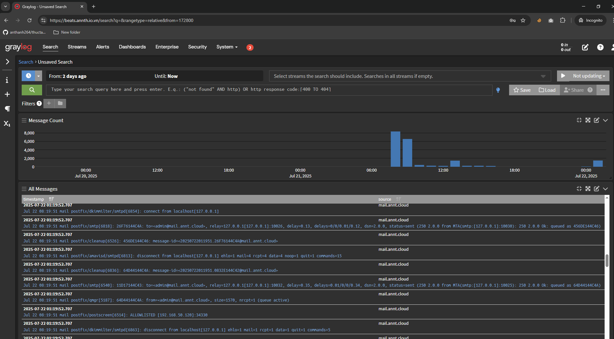
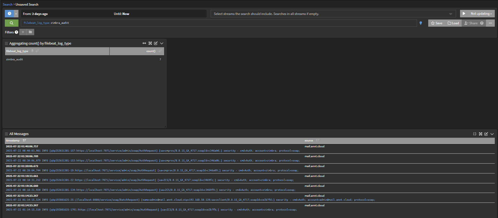

## Hướng dẫn Tích hợp Đẩy Log Zimbra sang Graylog sử dụng Filebeat

Bài hướng dẫn này sẽ trình bày cấu hình Filebeat trên máy chủ Zimbra để thu thập và đẩy các bản ghi (log) đến máy chủ Graylog để giám sát và phân tích tập trung.

### 1\. Chuẩn bị

Trước khi bắt đầu, hãy đảm bảo rằng bạn đã có các hệ thống sau được cấu hình và hoạt động:

  * **Zimbra 8.8.15**: Được cài đặt và hoạt động. Bạn có thể tham khảo hướng dẫn [Zimbra 8.8.15 on Ubuntu 20.04](./Zimbra%208.8.15%20on%20Ubuntu%2020.04.md).
  * **Graylog 5.0 và Elasticsearch 7.17.x**: Được cài đặt và hoạt động. Bạn có thể tham khảo hướng dẫn [Graylog 5.0 on Ubuntu 22.04](./Graylog%205.0%20on%20Ubuntu%2022.04.md).

Trong hướng dẫn này, chúng ta sẽ sử dụng Filebeat để đẩy log đến máy chủ Graylog. Các máy ảo được sử dụng trong ví dụ này có cấu hình như sau:

  * **Máy chủ Zimbra**:
      * Địa chỉ IP: `192.168.50.120`
      * Hostname: `mail.annt.cloud`
  * **Máy chủ Graylog**:
      * Địa chỉ IP: `192.168.50.125`
      * Hostname: `graylog.annt.cloud`

### 2\. Cấu hình Graylog

Bước đầu tiên là cấu hình Graylog để nhận log từ Zimbra. Chúng ta sẽ tạo một "Index Set" và một "Input" mới, sau đó cấu hình các "Extractor" để phân tích cú pháp log.

#### 2.1. Tạo Index Set cho Zimbra

Một Index Set là một nhóm các chỉ mục Elasticsearch được Graylog sử dụng để lưu trữ dữ liệu.

1.  Đăng nhập vào giao diện web của Graylog.

2.  Điều hướng đến **System** -\> **Indices**.

3.  Nhấp vào nút **Create index set**.

4.  Điền các thông số sau cho Index Set của Zimbra:

      * **Title**: `Zimbra`
      * **Descriptive name of the index set.**: `Zimbra`
      * **Description**: `Add a description of this index set.`
      * **Index shards**: `4` (Số lượng Elasticsearch shards được sử dụng cho mỗi chỉ mục trong tập chỉ mục này.)
      * **Index replicas**: `0` (Số lượng Elasticsearch replicas được sử dụng cho mỗi chỉ mục trong tập chỉ mục này.)
      * **Max. number of segments**: `1` (Số lượng phân đoạn tối đa trên mỗi chỉ mục Elasticsearch sau khi tối ưu hóa (force merge).)
      * **Index optimization after rotation**: Chọn **Disable index optimization after rotation** (Tắt tối ưu hóa chỉ mục Elasticsearch (force merge) sau khi xoay vòng.)
      * **Field type refresh interval**: `5` (Tần suất thông tin loại trường cho chỉ mục ghi hoạt động sẽ được cập nhật.)
      * **Select rotation strategy**: `Index Time`
      * **Rotation period (ISO8601 Duration)**: `P1D` (Một ngày. Thời gian một chỉ mục được ghi vào trước khi nó được xoay vòng. (ví dụ: "P1D" cho 1 ngày, "PT6H" cho 6 giờ).)
      * **Empty index set**: Chọn **Rotate empty index set** (Áp dụng chiến lược xoay vòng ngay cả khi tập chỉ mục trống (không khuyến nghị).)
      * **Select retention strategy**: `Delete Index`
      * **Max number of indices**: `20` (Số lượng chỉ mục tối đa được giữ trước khi xóa các chỉ mục cũ nhất.)

5.  Sau khi điền đầy đủ thông tin, nhấp vào nút **Create index set**.

#### 2.2. Tạo Input để nhận Log

Input là nơi Graylog lắng nghe dữ liệu đến. Chúng ta sẽ tạo một Input kiểu Beats để nhận log từ Filebeat.

1.  Điều hướng đến **System** -\> **Inputs**.

2.  Trong menu thả xuống **Select input type**, chọn **Beats** và nhấp vào nút **Launch new input**.

3.  Cấu hình các thông số sau cho Input:

      * **Node**: Chọn node Graylog của bạn (ví dụ: `9042317f / graylog`).
      * **Title**: `Zimbra-Logs`
      * **Bind address**: `0.0.0.0` (Địa chỉ để lắng nghe. Ví dụ: 0.0.0.0 hoặc 127.0.0.1.)
      * **Port**: `5045` (Cổng để lắng nghe.)
      * **Receive Buffer Size (optional)**: `1048576` (Kích thước byte của recvBufferSize cho các kết nối mạng đến input này.)
      * **No. of worker threads (optional)**: `2` (Số lượng luồng worker xử lý các kết nối mạng cho input này.)
      * **TLS cert file (optional)**: (Để trống)
      * **TLS private key file (optional)**: (Để trống)
      * **Enable TLS**: (Bỏ chọn)
      * **TLS key password (optional)**: (Để trống)
      * **TLS client authentication (optional)**: `disabled`
      * **TLS Client Auth Trusted Certs (optional)**: (Để trống)
      * **TCP keepalive**: (Chọn)
      * **Override source (optional)**: (Để trống)
      * **Encoding (optional)**: `UTF-8`
      * **Do not add Beats type as prefix**: (Chọn)

4.  Sau khi cấu hình, nhấp vào nút **Launch**.

#### 2.3. Cấu hình Extractors

Extractors giúp Graylog phân tích cú pháp các bản ghi log và trích xuất các trường thông tin cụ thể, giúp dễ dàng tìm kiếm và phân tích hơn.

1.  Trên giao diện quản lý Inputs, tìm Input `Zimbra-Logs` vừa tạo và nhấp vào **Manage extractors**.
2.  Trong giao diện `Extractors of Zimbra-Logs`, nhấp vào **Actions** -\> **Import Extractors**.
3.  Một hộp văn bản sẽ xuất hiện. Dán toàn bộ nội dung của tệp [Zimbra-Logs-Extractors](./files/Zimbra-Logs-Extractors.json) vào hộp văn bản này.
4.  Nhấp vào nút **Add extractors to input**.

Bạn đã hoàn tất cấu hình trên Graylog.

### 3\. Cấu hình Filebeat trên máy chủ Zimbra

Bây giờ, chúng ta sẽ cài đặt và cấu hình Filebeat trên máy chủ Zimbra để gửi log đến Graylog.

**Lưu ý**: Đảm bảo phiên bản Filebeat tương thích với phiên bản Elasticsearch bạn đang sử dụng. Bạn có thể kiểm tra ma trận tương thích tại [Elastic Matrix](https://www.elastic.co/support/matrix#matrix_compatibility). Trong hướng dẫn này, chúng ta sử dụng Filebeat 7.17.29 để tương thích với Elasticsearch 7.17.x.

#### 3.1. Tải xuống và Cài đặt Filebeat

1.  Truy cập vào máy chủ Zimbra thông qua SSH.

2.  Tải xuống gói cài đặt Filebeat:

    ```bash
    curl -L -O https://artifacts.elastic.co/downloads/beats/filebeat/filebeat-7.17.29-amd64.deb
    ```

3.  Cài đặt Filebeat:

    ```bash
    sudo dpkg -i filebeat-7.17.29-amd64.deb
    ```

#### 3.2. Chỉnh sửa Cấu hình Filebeat

Chúng ta sẽ chỉnh sửa tệp cấu hình chính của Filebeat để chỉ định các tệp log cần giám sát và đích đến là Graylog.

1.  Mở tệp cấu hình Filebeat bằng trình soạn thảo văn bản:

    ```bash
    sudo nano /etc/filebeat/filebeat.yml
    ```

2.  Tìm phần `filebeat.inputs` và thêm các mục nhập sau để giám sát các tệp log của Zimbra và Postfix:

    ```yaml
    - type: log
      enabled: true
      paths:
        - /var/log/mail.log
      fields:
        log_type: postfix
      fields_under_root: true

    - type: log
      enabled: true
      paths:
        - /opt/zimbra/log/audit.log
      fields:
        log_type: zimbra_audit
      fields_under_root: true

    - type: log
      enabled: true
      paths:
        - /opt/zimbra/log/zmmailboxd.out
      fields:
        log_type: zimbra_mailbox
      fields_under_root: true

    - type: log
      enabled: true
      paths:
        - /opt/zimbra/log/nginx.access.log
      fields:
        log_type: nginx
      fields_under_root: true
    ```

      * `type: log`: Chỉ định rằng đây là một input thu thập log.
      * `enabled: true`: Kích hoạt input này.
      * `paths`: Liệt kê các đường dẫn đến các tệp log mà Filebeat sẽ giám sát.
      * `fields`: Thêm các trường tùy chỉnh vào mỗi bản ghi log. `log_type` giúp chúng ta dễ dàng phân loại log trong Graylog.
      * `fields_under_root: true`: Đảm bảo các trường tùy chỉnh được thêm vào gốc của tài liệu JSON.

3.  Tìm phần `# ------------------------------ Logstash Output -------------------------------` và cấu hình đầu ra để gửi log đến Graylog (sử dụng giao thức Beats qua cổng 5045):

    ```yaml
    output.logstash:
      hosts: ["graylog.annt.cloud:5045"]
      bulk_max_size: 2048
    ```

      * `output.logstash`: Filebeat sử dụng giao thức Logstash để gửi dữ liệu đến Graylog qua Beats input.
      * `hosts`: Chỉ định hostname và cổng của máy chủ Graylog. Thay thế `graylog.annt.cloud` bằng hostname hoặc địa chỉ IP của máy chủ Graylog của bạn nếu khác.

4.  Lưu tệp cấu hình và thoát khỏi trình soạn thảo (`Ctrl+X`, sau đó `Y` và `Enter` nếu dùng `nano`).

Bạn có thể tham khảo tệp cấu hình mẫu đầy đủ tại [FileBeatConfig](./files/filebeat.yml).

#### 3.3. Kích hoạt và Khởi động Filebeat

1.  Kích hoạt Filebeat để tự động khởi động cùng hệ thống:

    ```bash
    sudo systemctl enable filebeat
    ```

2.  Khởi động dịch vụ Filebeat:

    ```bash
    sudo systemctl start filebeat
    ```

### 4\. Kiểm tra Log trên Graylog

Sau khi cấu hình xong, Filebeat sẽ bắt đầu đẩy log từ Zimbra đến Graylog.

1.  Đăng nhập vào giao diện web của Graylog.
2.  Điều hướng đến **Streams** hoặc **Search**.
3.  Bạn sẽ bắt đầu thấy các bản ghi log từ máy chủ Zimbra xuất hiện. Bạn có thể sử dụng các bộ lọc (filter) dựa trên trường `log_type` (ví dụ: `log_type:postfix`, `log_type:zimbra_audit`, v.v.) để xem các loại log cụ thể.
- 
- 
Chúc mừng\! Bạn đã tích hợp thành công việc giám sát log Zimbra trên Graylog bằng cách sử dụng Filebeat.

-----

## Integrate Zimbra Log Monitoring on Graylog using Filebeat

This guide will walk you through the step-by-step process of configuring Filebeat on your Zimbra server to collect and push logs to a Graylog server for centralized monitoring and analysis.

### 1\. Preparation

Before you begin, ensure you have the following systems configured and operational:

  * **Zimbra 8.8.15**: Installed and running. You can refer to the guide [Zimbra 8.8.15 on Ubuntu 20.04](./Zimbra%208.8.15%20on%20Ubuntu%2020.04.md).
  * **Graylog 5.0 and Elasticsearch 7.17.x**: Installed and running. You can refer to the guide [Graylog 5.0 on Ubuntu 22.04](./Graylog%205.0%20on%20Ubuntu%2022.04.md).

In this tutorial, we will be using Filebeat to push logs to the Graylog server. The virtual machines used in this example have the following configurations:

  * **Zimbra Server**:
      * IP Address: `192.168.50.120`
      * Hostname: `mail.annt.cloud`
  * **Graylog Server**:
      * IP Address: `192.168.50.125`
      * Hostname: `graylog.annt.cloud`

### 2\. Graylog Configuration

The first step is to configure Graylog to receive logs from Zimbra. We will create an "Index Set" and a new "Input", and then configure "Extractors" to parse the logs.

#### 2.1. Create an Index Set for Zimbra

An Index Set is a group of Elasticsearch indices used by Graylog to store data.

1.  Log in to the Graylog web interface.

2.  Navigate to **System** -\> **Indices**.

3.  Click on the **Create index set** button.

4.  Fill in the following parameters for the Zimbra Index Set:

      * **Title**: `Zimbra`
      * **Descriptive name of the index set.**: `Zimbra`
      * **Description**: `Add a description of this index set.`
      * **Index shards**: `4` (Number of Elasticsearch shards used per index in this index set.)
      * **Index replicas**: `0` (Number of Elasticsearch replicas used per index in this index set.)
      * **Max. number of segments**: `1` (Maximum number of segments per Elasticsearch index after optimization (force merge).)
      * **Index optimization after rotation**: Select **Disable index optimization after rotation** (Disable Elasticsearch index optimization (force merge) after rotation.)
      * **Field type refresh interval**: `5` (How often the field type information for the active write index will be updated.)
      * **Select rotation strategy**: `Index Time`
      * **Rotation period (ISO8601 Duration)**: `P1D` (A day. How long an index gets written to before it is rotated. (i.e., "P1D" for 1 day, "PT6H" for 6 hours).)
      * **Empty index set**: Select **Rotate empty index set** (Apply the rotation strategy even when the index set is empty (not recommended).)
      * **Select retention strategy**: `Delete Index`
      * **Max number of indices**: `20` (Maximum number of indices to keep before deleting the oldest ones.)

5.  After configuring, click the **Create index set** button.

#### 2.2. Create an Input to Receive Logs

An Input is where Graylog listens for incoming data. We will create a Beats type Input to receive logs from Filebeat.

1.  Navigate to **System** -\> **Inputs**.

2.  From the **Select input type** dropdown menu, choose **Beats** and click the **Launch new input** button.

3.  Configure the following parameters for the Input:

      * **Node**: Select your Graylog node (e.g., `9042317f / graylog`).
      * **Title**: `Zimbra-Logs`
      * **Bind address**: `0.0.0.0` (Address to listen on. For example, 0.0.0.0 or 127.0.0.1.)
      * **Port**: `5045` (Port to listen on.)
      * **Receive Buffer Size (optional)**: `1048576` (The size in bytes of the recvBufferSize for network connections to this input.)
      * **No. of worker threads (optional)**: `2` (Number of worker threads processing network connections for this input.)
      * **TLS cert file (optional)**: (Leave blank)
      * **TLS private key file (optional)**: (Leave blank)
      * **Enable TLS**: (Uncheck)
      * **TLS key password (optional)**: (Leave blank)
      * **TLS client authentication (optional)**: `disabled`
      * **TLS Client Auth Trusted Certs (optional)**: (Leave blank)
      * **TCP keepalive**: (Check)
      * **Override source (optional)**: (Leave blank)
      * **Encoding (optional)**: `UTF-8`
      * **Do not add Beats type as prefix**: (Check)

4.  After configuration, click the **Launch** button.

#### 2.3. Configure Extractors

Extractors help Graylog parse log records and extract specific pieces of information, making them easier to search and analyze.

1.  On the Inputs management interface, locate the `Zimbra-Logs` Input you just created and click **Manage extractors**.
2.  In the `Extractors of Zimbra-Logs` interface, click on **Actions** -\> **Import Extractors**.
3.  A text box will appear. Paste the entire content of the [Zimbra-Logs-Extractors](./files/Zimbra-Logs-Extractors.json) file into this text box.
4.  Click the **Add extractors to input** button.

You have now completed the Graylog configuration.

### 3\. Filebeat Configuration on Zimbra Server

Now, we will install and configure Filebeat on the Zimbra server to send logs to Graylog.

**Note**: Ensure that the Filebeat version is compatible with the Elasticsearch version you are using. You can check the compatibility matrix at [Elastic Matrix](https://www.elastic.co/support/matrix#matrix_compatibility). In this guide, we are using Filebeat 7.17.29 for compatibility with Elasticsearch 7.17.x.

#### 3.1. Download and Install Filebeat

1.  Access your Zimbra server via SSH.

2.  Download the Filebeat installation package:

    ```bash
    curl -L -O https://artifacts.elastic.co/downloads/beats/filebeat/filebeat-7.17.29-amd64.deb
    ```

3.  Install Filebeat:

    ```bash
    sudo dpkg -i filebeat-7.17.29-amd64.deb
    ```

#### 3.2. Edit Filebeat Configuration

We will edit the main Filebeat configuration file to specify which log files to monitor and the Graylog destination.

1.  Open the Filebeat configuration file with a text editor:

    ```bash
    sudo nano /etc/filebeat/filebeat.yml
    ```

2.  Locate the `filebeat.inputs` section and add the following entries to monitor Zimbra and Postfix log files:

    ```yaml
    - type: log
      enabled: true
      paths:
        - /var/log/mail.log
      fields:
        log_type: postfix
      fields_under_root: true

    - type: log
      enabled: true
      paths:
        - /opt/zimbra/log/audit.log
      fields:
        log_type: zimbra_audit
      fields_under_root: true

    - type: log
      enabled: true
      paths:
        - /opt/zimbra/log/zmmailboxd.out
      fields:
        log_type: zimbra_mailbox
      fields_under_root: true

    - type: log
      enabled: true
      paths:
        - /opt/zimbra/log/nginx.access.log
      fields:
        log_type: nginx
      fields_under_root: true
    ```

      * `type: log`: Specifies that this is a log input.
      * `enabled: true`: Enables this input.
      * `paths`: Lists the paths to the log files that Filebeat will monitor.
      * `fields`: Adds custom fields to each log record. `log_type` helps us easily categorize logs in Graylog.
      * `fields_under_root: true`: Ensures custom fields are added to the root of the JSON document.

3.  Locate the `# ------------------------------ Logstash Output -------------------------------` section and configure the output to send logs to Graylog (using the Beats protocol on port 5045):

    ```yaml
    output.logstash:
      hosts: ["graylog.annt.cloud:5045"]
      bulk_max_size: 2048
    ```

      * `output.logstash`: Filebeat uses the Logstash protocol to send data to Graylog via the Beats input.
      * `hosts`: Specifies the hostname and port of your Graylog server. Replace `graylog.annt.cloud` with your Graylog server's hostname or IP address if different.

4.  Save the configuration file and exit the editor (`Ctrl+X`, then `Y` and `Enter` if using `nano`).

You can refer to a complete sample configuration file at [FileBeatConfig](./files/filebeat.yml).

#### 3.3. Enable and Start Filebeat

1.  Enable Filebeat to start automatically on system boot:

    ```bash
    sudo systemctl enable filebeat
    ```

2.  Start the Filebeat service:

    ```bash
    sudo systemctl start filebeat
    ```

### 4\. Verify Logs on Graylog

After completing the configuration, Filebeat will start pushing logs from Zimbra to Graylog.

1.  Log in to the Graylog web interface.
2.  Navigate to **Streams** or **Search**.
3.  You should start seeing log records from your Zimbra server appearing. You can use filters based on the `log_type` field (e.g., `filebeat_log_type:postfix`, `filebeat_log_type:zimbra_audit`, etc.) to view specific log types.
- 
- 
Congratulations\! You have successfully integrated Zimbra log monitoring on Graylog using Filebeat.