# Hướng dẫn triển khai Zimbra Collaboration Multi-Server

Zimbra Collaboration là một bộ ứng dụng email và cộng tác mạnh mẽ, cung cấp nhiều tính năng như email, lịch, danh bạ, chia sẻ tài liệu và trò chuyện. Phiên bản đa máy chủ (Multi-Server) cho phép bạn phân tán các dịch vụ Zimbra trên nhiều máy chủ vật lý hoặc máy ảo, giúp tăng khả năng mở rộng, độ tin cậy và hiệu suất.

## 1\. Kiến trúc và Thành phần Zimbra

Trong mô hình triển khai đa máy chủ, Zimbra được chia thành nhiều gói ứng dụng, mỗi gói đảm nhiệm một vai trò cụ thể:

  * **Zimbra Core**: Gói này chứa các thư viện, tiện ích, công cụ giám sát và tệp cấu hình cơ bản. Zimbra Core tự động được cài đặt trên mỗi máy chủ.
  * **Zimbra LDAP**: Cung cấp xác thực người dùng thông qua phần mềm OpenLDAP. Mỗi tài khoản trên máy chủ Zimbra có một ID hộp thư duy nhất. Schema của OpenLDAP đã được tùy chỉnh cho Zimbra Collaboration. **Máy chủ LDAP phải được cấu hình trước bất kỳ máy chủ nào khác.** Bạn có thể thiết lập sao chép LDAP (master-replica) để tăng tính sẵn sàng.
  * **Zimbra Store (Mailbox)**: Gói này bao gồm các thành phần cho máy chủ hộp thư, bao gồm Jetty (môi trường chạy ứng dụng web Zimbra). Máy chủ hộp thư Zimbra bao gồm:
      * **Data store**: Cơ sở dữ liệu MariaDB® lưu trữ thông tin cấu hình và siêu dữ liệu.
      * **Message store**: Nơi lưu trữ tất cả các tin nhắn email và tệp đính kèm.
      * **Index store**: Công nghệ lập chỉ mục và tìm kiếm được cung cấp thông qua Lucene. Các tệp chỉ mục được duy trì cho mỗi hộp thư.
      * **Web application services**: Máy chủ ứng dụng web Jetty chạy các ứng dụng web (webapps) trên bất kỳ máy chủ lưu trữ nào.
  * **Zimbra MTA (Mail Transfer Agent)**: Postfix là tác nhân chuyển thư nguồn mở (MTA) nhận email qua SMTP và định tuyến mỗi tin nhắn đến máy chủ hộp thư Zimbra thích hợp bằng giao thức LMTP (Local Mail Transfer Protocol). Zimbra MTA cũng bao gồm các thành phần chống virus và chống thư rác.
  * **Zimbra Proxy**: Zimbra Proxy là dịch vụ proxy ngược hiệu suất cao (sử dụng Nginx) để chuyển tiếp các yêu cầu của máy khách IMAP[S]/POP[S]/HTTP[S] đến các dịch vụ Zimbra Collaboration nội bộ khác. Gói này thường được cài đặt trên máy chủ MTA hoặc trên máy chủ độc lập. Khi gói `zimbra-proxy` được cài đặt, tính năng proxy được bật theo mặc định.

**Quá trình cài đặt nhiều máy chủ rất đơn giản và dễ thực hiện. Bạn chạy cùng một script cài đặt trên mỗi máy chủ, chọn (các) thành phần để cài đặt và sử dụng menu để cấu hình hệ thống.**

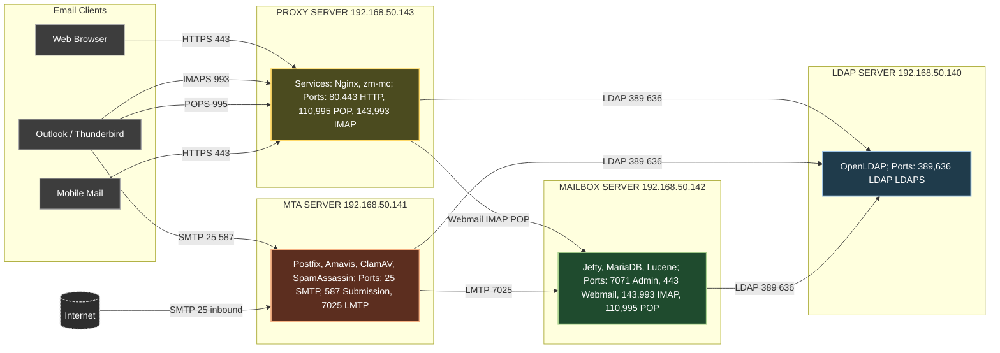
``` mermaid
flowchart LR
    %% Clients
    subgraph Clients["Email Clients"]
        A1[Web Browser]:::client
        A2[Outlook / Thunderbird]:::client
        A3[Mobile Mail]:::client
    end

    %% Internet node
    Internet[(Internet)]:::internet

    %% Proxy Server
    subgraph Proxy["PROXY SERVER 192.168.50.143"]
        P[Services: Nginx, zm-mc; Ports: 80,443 HTTP, 110,995 POP, 143,993 IMAP]:::proxy
    end

    %% MTA Server
    subgraph MTA["MTA SERVER 192.168.50.141"]
        M[Postfix, Amavis, ClamAV, SpamAssassin; Ports: 25 SMTP, 587 Submission, 7025 LMTP]:::mta
    end

    %% Mailbox Server
    subgraph Mailbox["MAILBOX SERVER 192.168.50.142"]
        B[Jetty, MariaDB, Lucene; Ports: 7071 Admin, 443 Webmail, 143,993 IMAP, 110,995 POP]:::mailbox
    end

    %% LDAP Server
    subgraph LDAP["LDAP SERVER 192.168.50.140"]
        L[OpenLDAP; Ports: 389,636 LDAP LDAPS]:::ldap
    end

    %% Client to Proxy (Webmail/IMAP/POP)
    A1 -->|HTTPS 443| P
    A2 -->|IMAPS 993| P
    A2 -->|POPS 995| P
    A3 -->|HTTPS 443| P

    %% SMTP goes directly to MTA (Clients + Internet)
    A2 -->|SMTP 25 587| M
    Internet -->|SMTP 25 inbound| M

    %% Proxy forwards Webmail/IMAP/POP to Mailbox
    P -->|Webmail IMAP POP| B

    %% MTA delivers to Mailbox via LMTP
    M -->|LMTP 7025| B

    %% All servers query LDAP
    P -->|LDAP 389 636| L
    M -->|LDAP 389 636| L
    B -->|LDAP 389 636| L

    %% Dark mode styles
    classDef proxy fill:#4B4B1F,stroke:#FFD966,color:#FFFFFF,stroke-width:2px;
    classDef mta fill:#5C2E1F,stroke:#F4B183,color:#FFFFFF,stroke-width:2px;
    classDef mailbox fill:#1F4B2E,stroke:#A9D18E,color:#FFFFFF,stroke-width:2px;
    classDef ldap fill:#1F3B4B,stroke:#9DC3E6,color:#FFFFFF,stroke-width:2px;
    classDef client fill:#3D3D3D,stroke:#AAAAAA,color:#FFFFFF,stroke-width:1.5px;
    classDef internet fill:#2D2D2D,stroke:#CCCCCC,color:#FFFFFF,stroke-dasharray:4 2,stroke-width:1.5px;


```
-----

## 2\. Bảng phân hoạch IP

Dưới đây là bảng phân hoạch IP cho môi trường lab này:

| Vai trò máy chủ | Địa chỉ IP       | Tên máy chủ (Hostname) |
| :-------------- | :--------------- | :--------------------- |
| LDAP            | `192.168.50.140` | `ldap.annt.cloud`      |
| MTA             | `192.168.50.141` | `mta.annt.cloud`       |
| MAILBOX         | `192.168.50.142` | `mailbox.annt.cloud`   |
| PROXY           | `192.168.50.143` | `proxy.annt.cloud`     |

-----

## 3\. Chuẩn bị hệ thống

Trước khi bắt đầu cài đặt Zimbra, chúng ta cần thực hiện một số bước chuẩn bị quan trọng trên **tất cả các máy chủ**.

### 3.1. Cấu hình DNS Server (Dnsmasq)

Zimbra yêu cầu một DNS server hoạt động để phân giải tên miền. Trong môi trường máy ảo cục bộ, bạn có thể cài đặt và cấu hình `dnsmasq` làm DNS server cục bộ đơn giản. Bạn sẽ thực hiện cấu hình này trên máy chủ **MTA** (`192.168.50.141`).

1.  **Vô hiệu hóa và dừng `systemd-resolved`**: `systemd-resolved` sử dụng cổng 53, cổng mà `dnsmasq` sẽ cần. Vô hiệu hóa và dừng nó trước khi cài đặt `dnsmasq`.

    ```bash
    sudo systemctl disable systemd-resolved
    sudo systemctl stop systemd-resolved
    ```

2.  **Gỡ bỏ symlink `/etc/resolv.conf`**: `/etc/resolv.conf` thường là một symlink đến một tệp do `systemd-resolved` quản lý. Bạn cần xóa symlink này để tạo một tệp `resolv.conf` mới thủ công.

    ```bash
    sudo rm /etc/resolv.conf
    ```

3.  **Tạo tệp `resolv.conf` mới**: Tạo tệp `/etc/resolv.conf` và thêm các máy chủ DNS mong muốn. Địa chỉ `127.0.0.1` sẽ trỏ đến `dnsmasq` cục bộ của bạn, và `8.8.8.8` (Google Public DNS) sẽ được sử dụng làm máy chủ dự phòng.

    ```bash
    sudo sh -c 'echo nameserver 127.0.0.1 >> /etc/resolv.conf'
    sudo sh -c 'echo nameserver 8.8.8.8 >> /etc/resolv.conf'
    ```

4.  **Cài đặt `dnsmasq`**:

    ```bash
    sudo apt update
    sudo apt install dnsmasq -y
    ```
- 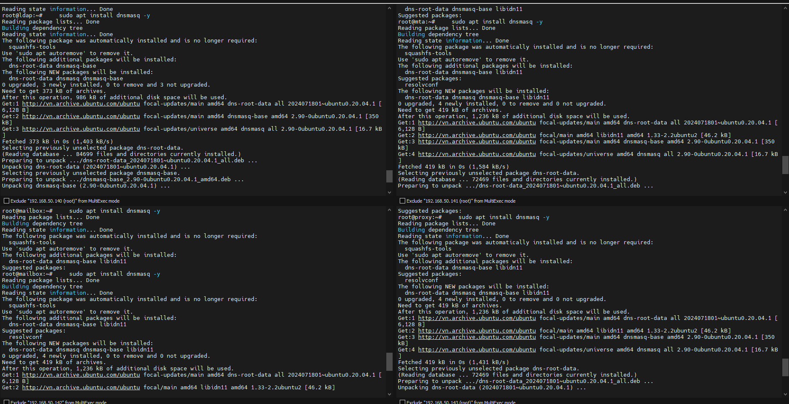

5.  **Cấu hình `dnsmasq`**: Mở tệp cấu hình `dnsmasq`.

    ```bash
    sudo vi /etc/dnsmasq.conf
    ```

    Thêm các dòng sau vào cuối tệp:

    ```
    server=192.168.50.141
    domain=annt.cloud
    mx-host=annt.cloud, mail.annt.cloud, 5
    mx-host=mail.annt.cloud, mail.annt.cloud, 5
    listen-address=127.0.0.1
    ```
- 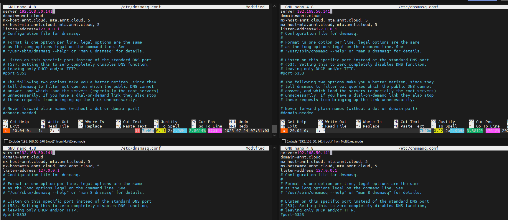

      * `server=192.168.50.141`: Chỉ định máy chủ DNS ngược dòng cho `dnsmasq` là chính nó (để giải quyết các truy vấn cho tên miền cục bộ).
      * `domain=annt.cloud`: Đặt tên miền cục bộ mà `dnsmasq` sẽ phục vụ.
      * `mx-host=annt.cloud, mail.annt.cloud, 5`: Định cấu hình bản ghi MX (Mail Exchanger) cho tên miền của bạn, chỉ ra rằng `mail.annt.cloud` là máy chủ mail với độ ưu tiên `5`.
      * `listen-address=127.0.0.1`: Đảm bảo `dnsmasq` chỉ lắng nghe trên giao diện loopback.

    Lưu và thoát tệp (`:wq` trong `vi`).

6.  **Khởi động lại dịch vụ `dnsmasq`**:

    ```bash
    sudo systemctl restart dnsmasq
    ```
7.	** Kiểm tra**
	```
	dig mx.annt.cloud 
	```
- 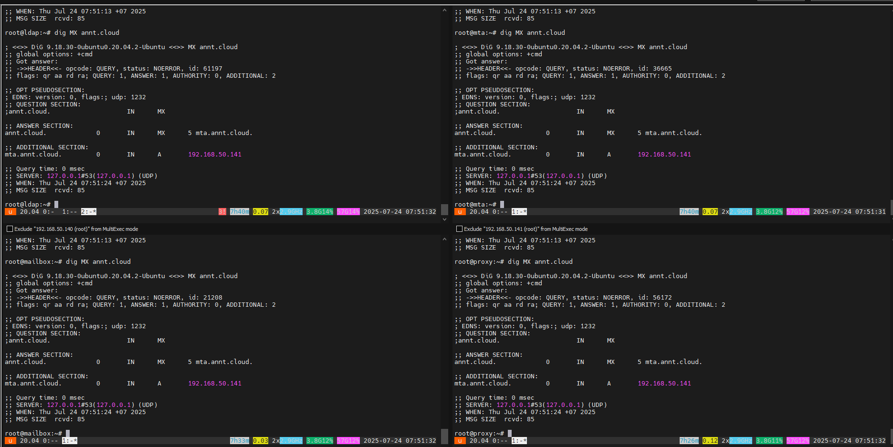
	
### 3.2. Cấu hình Hostname và tệp Hosts trên tất cả các máy chủ

Bạn cần thực hiện các bước sau trên **tất cả 4 máy chủ** (LDAP, MTA, MAILBOX, PROXY).

1.  **Đặt Hostname chính xác**: Đảm bảo mỗi máy chủ có hostname chính xác theo bảng phân hoạch IP.

      * Trên máy chủ LDAP (`192.168.50.140`):
        ```bash
        sudo hostnamectl set-hostname ldap.annt.cloud
        ```
      * Trên máy chủ MTA (`192.168.50.141`):
        ```bash
        sudo hostnamectl set-hostname mta.annt.cloud
        ```
      * Trên máy chủ MAILBOX (`192.168.50.142`):
        ```bash
        sudo hostnamectl set-hostname mailbox.annt.cloud
        ```
      * Trên máy chủ PROXY (`192.168.50.143`):
        ```bash
        sudo hostnamectl set-hostname proxy.annt.cloud
        ```
- 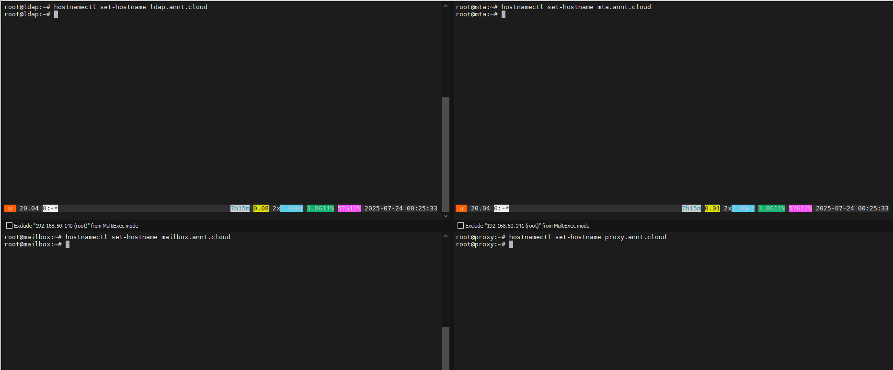
2.  **Chỉnh sửa tệp `/etc/hosts`**: Thêm các dòng sau vào tệp `/etc/hosts` trên **tất cả 4 máy chủ**. Điều này giúp các máy chủ phân giải tên lẫn nhau mà không cần phụ thuộc vào DNS trong quá trình cài đặt ban đầu.

    ```bash
    sudo nano /etc/hosts
    ```

    Thêm các dòng:

    ```
    192.168.50.140	ldap.annt.cloud
    192.168.50.141	mta.annt.cloud
    192.168.50.142	mailbox.annt.cloud
    192.168.50.143	proxy.annt.cloud
    ```

    Lưu và thoát tệp (Ctrl+X, Y, Enter trong `nano`).
- 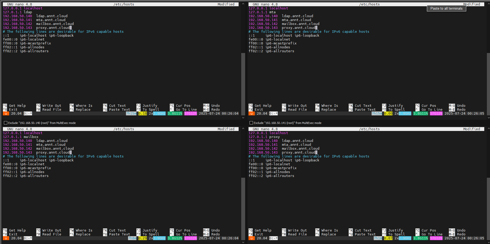

### 3.3. Cài đặt Timezone và gỡ bỏ `snapd` trên tất cả các máy chủ

Thực hiện các lệnh sau trên **tất cả 4 máy chủ**:

1.  **Đặt múi giờ**:

    ```bash
    sudo timedatectl set-timezone Asia/Ho_Chi_Minh
    ```

2.  **Gỡ bỏ `snapd`**: Một số gói phần mềm của Zimbra có thể xung đột với `snapd`. Việc gỡ bỏ nó là cần thiết.

    ```bash
    sudo apt remove --purge snapd -y
    sudo apt autoremove -y
    ```
- 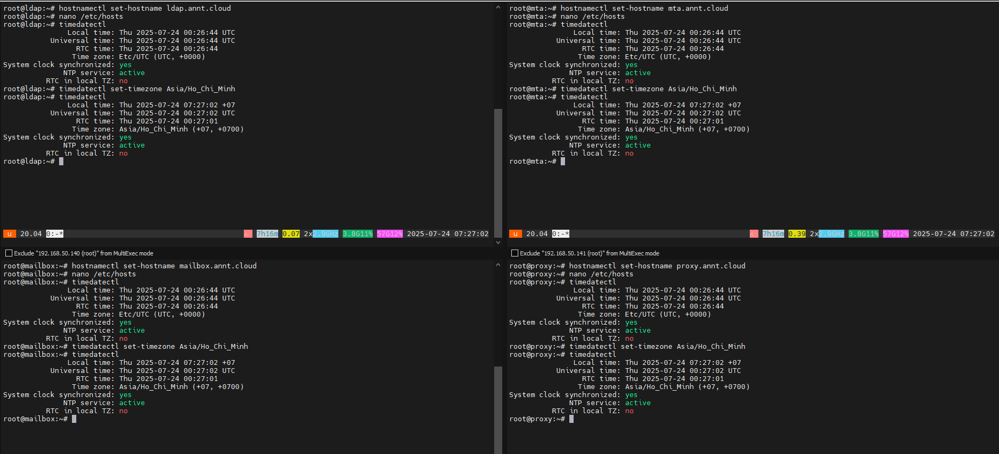
- 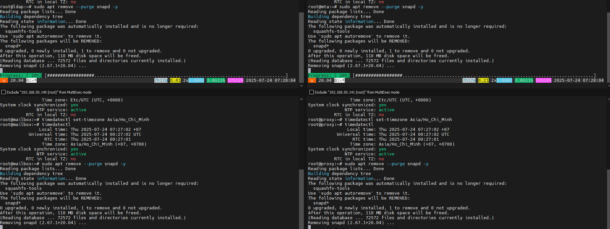

-----

## 4\. Tải và chạy tệp cài đặt Zimbra

Thực hiện các bước sau trên **tất cả 4 máy chủ**:

1.  **Chuyển đến thư mục tạm**:

    ```bash
    cd /tmp
    ```

2.  **Tải tệp cài đặt Zimbra**:

    ```bash
    wget -c https://files.zimbra.com/downloads/8.8.15_GA/zcs-8.8.15_GA_4179.UBUNTU20_64.20211118033954.tgz
    ```

3.  **Giải nén tệp cài đặt**:

    ```bash
    tar -xzvf zcs-8.8.15_GA_4179.UBUNTU20_64.20211118033954.tgz
    ```

4.  **Chuyển vào thư mục giải nén**:

    ```bash
    cd zcs-8.8.15_GA_4179.UBUNTU20_64.20211118033954
    ```

5.  **Chạy script cài đặt**:

    ```bash
    ./install.sh
    ```
- 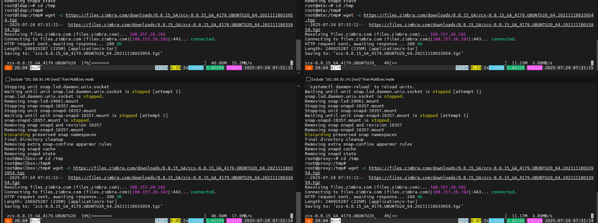
- 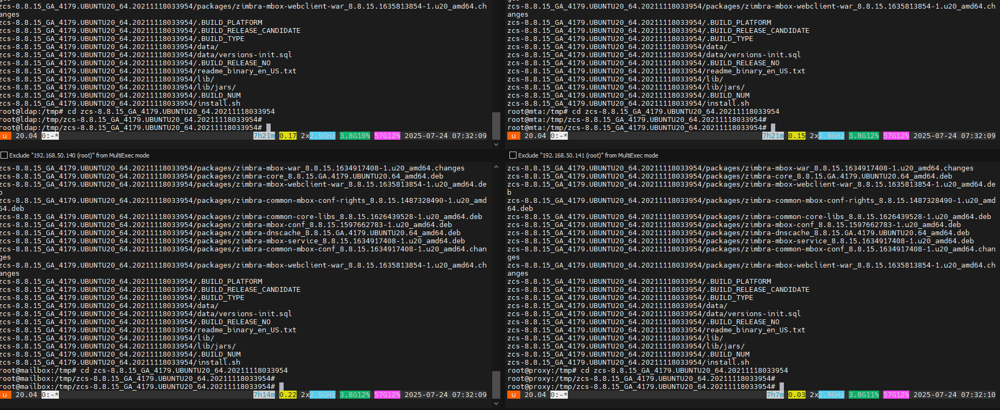
- 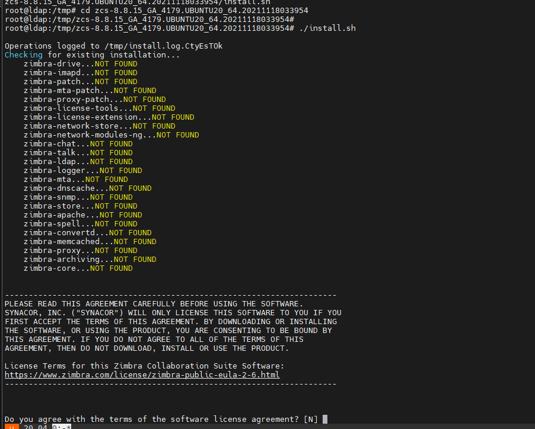

    Khi bạn chạy script này, nó sẽ kiểm tra các điều kiện tiên quyết và hỏi bạn muốn cài đặt các gói nào. Từ đây, quá trình cài đặt sẽ khác nhau tùy thuộc vào vai trò của từng máy chủ.

-----

## 5\. Cài đặt các thành phần Zimbra trên từng máy chủ

Bây giờ, chúng ta sẽ tiến hành cài đặt cụ thể cho từng máy chủ theo vai trò của chúng. **Thứ tự cài đặt rất quan trọng: LDAP -\> MAILBOX -\> MTA -\> PROXY.**

### 5.1. Cài đặt Zimbra LDAP (Máy chủ: `ldap.annt.cloud` - `192.168.50.140`)

Máy chủ LDAP là thành phần **phải được cài đặt đầu tiên**.

1.  Sau khi chạy `./install.sh`, hệ thống sẽ hiển thị danh sách các gói có sẵn. **Chỉ chọn gói `zimbra-ldap` để cài đặt**. Các gói khác giữ nguyên mặc định là `N` (No).

    ```
    Install zimbra-ldap [Y]
    Install zimbra-logger [N]
    Install zimbra-mta [N]
    Install zimbra-dnscache [N]
    Install zimbra-snmp [N]
    Install zimbra-store [N]
    Install zimbra-apache [N]
    Install zimbra-spell [N]
    Install zimbra-proxy [N]
    Install zimbra-drive [N]
    Install zimbra-patch [N]
    Install zimbra-memcached [N]
    Install zimbra-chat [N]
    ```

    Nhập `y` và nhấn Enter để tiếp tục.
    Nhập `Y` và nhấn Enter để xác nhận thay đổi hệ thống. Các gói đã chọn sẽ được cài đặt.
- 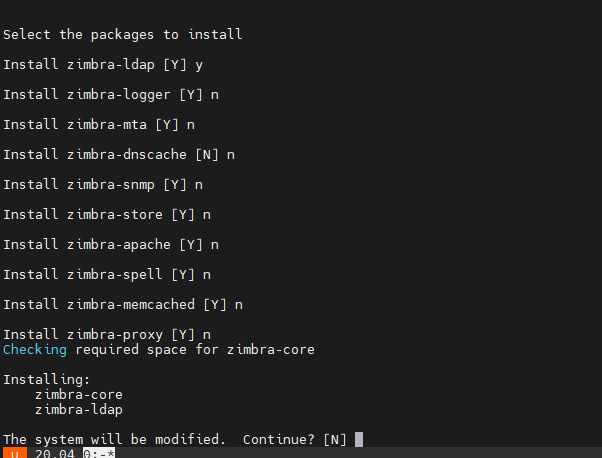
- 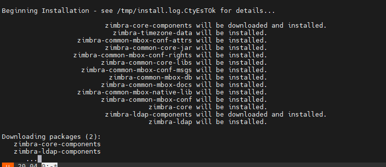
- Cấu hình đổi domain về thành `annt.cloud`  domain hệ thống mail hoạt động 
- 

2.  Menu chính sẽ hiển thị. Các giá trị cần cấu hình thêm được đánh dấu bằng dấu hoa thị (`*`).

      * Nhập `1` để hiển thị menu **Common Configuration (Cấu hình chung)**.

    <!-- end list -->

    ```
    Main menu

       1) Common Configuration:
          2) zimbra-ldap: Enabled
          3) zimbra-logger: Enabled
          4) zimbra-mta: Enabled
          5) zimbra-snmp: Enabled
          6) zimbra-store: Enabled
          7) zimbra-apache: Enabled
          8) zimbra-spell: Enabled
          9) zimbra-proxy: Enabled
          10) zimbra-drive: Enabled
          11) zimbra-patch: Enabled
          12) zimbra-memcached: Enabled
          13) zimbra-chat: Enabled
       *14) Enable auto-start servers at boot [Yes]

       s) Save config to file
       x) Expand menu
       q) Quit

    Type 'r' to return to previous menu
    Select from menu, or press 'a' to apply config (? - help) 1
    ```

      * Trong menu **Common Configuration**:

        ```
        Common configuration

           1) Hostname:                                ldap.annt.cloud
           2) Ldap master host:                        ldap.annt.cloud
           3) Ldap port:                               389
           4) Ldap Admin password:                     set
           5) Store ephemeral attributes outside Ldap: no
           6) Secure interprocess communications:      yes
           7) TimeZone:                                Asia/Ho_Chi_Minh
           8) IP Mode:                                 ipv4
           9) Default SSL digest:                      sha256

        Select, or 'r' for previous menu [r]
        ```

        Nhập `4` và nhấn Enter để đặt mật khẩu cho `Ldap Admin password`. Bạn sẽ được yêu cầu nhập mật khẩu mới. Sử dụng mật khẩu bạn muốn (ví dụ: `046sImD1MBk5`).
- 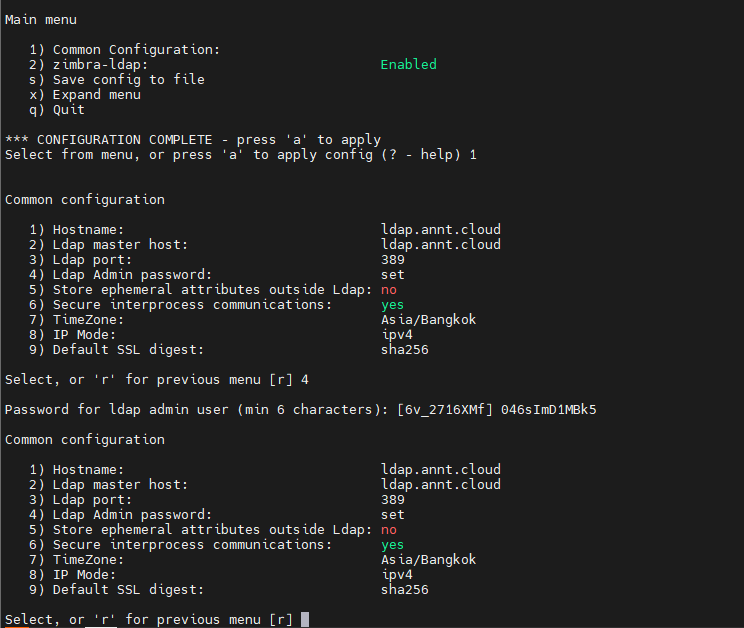

      * Nhập `r` để quay lại Menu chính.

3.  Từ Menu chính, nhập `2` để xem các cài đặt cấu hình **zimbra-ldap (LDAP configuration)**.

    ```
    Ldap configuration

       1) Status:                                 Enabled
       2) Create Domain:                          yes
       3) Domain to create:                       ldap.annt.cloud
       4) Ldap root password:                     set
       5) Ldap replication password:              set
       6) Ldap postfix password:                  set
       7) Ldap amavis password:                   set
       8) Ldap nginx password:                    set
       9) Ldap Bes Searcher password:             set

    Select, or 'r' for previous menu [r]
    ```

      * Nhập `3` để thay đổi tên miền mặc định thành tên miền chính bạn muốn sử dụng cho mạng của mình, ở đây là `annt.cloud`.
- 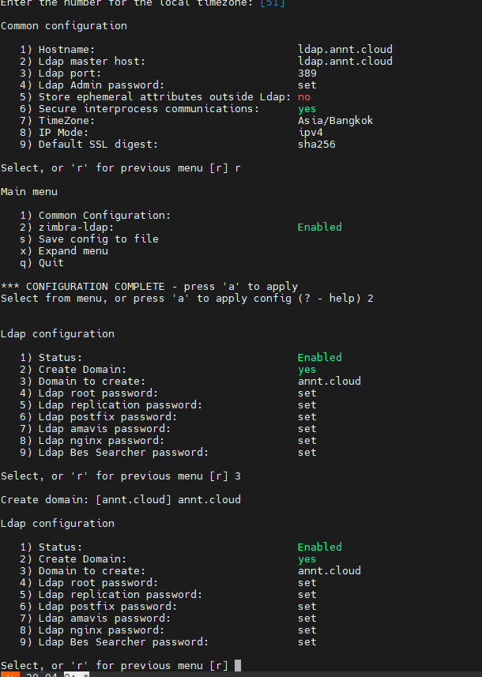
	  
      * Các mật khẩu `Ldap root`, `Ldap replication`, `Ldap postfix`, `Ldap amavis`, và `Ldap nginx` được tạo tự động. Bạn có thể thay đổi chúng bằng cách nhập số tương ứng (`4` đến `8`) và đặt mật khẩu mới (nên đặt mật khẩu mạnh và ghi nhớ).
- 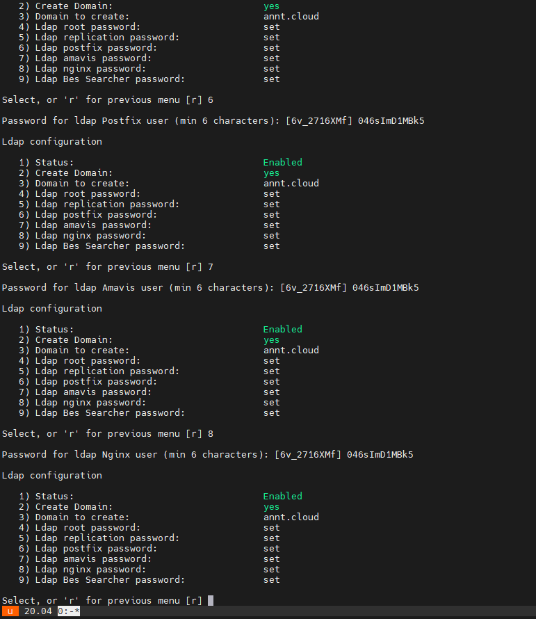

4.  Sau khi hoàn tất thay đổi trong menu cấu hình LDAP:

      * Nhập `r` để quay lại Menu chính.
      * Nhập `a` để áp dụng các thay đổi cấu hình.
      * Khi thông báo `Save configuration data to a file? [Yes]` xuất hiện, nhập `Yes` và nhấn Enter.
      * Khi thông báo yêu cầu nơi lưu tệp cấu hình (ví dụ: `Save config in file: [/opt/zimbra/config.8381]`), nhấn Enter để chấp nhận mặc định.
      * Khi thông báo `The system will be modified - continue? [No]` xuất hiện, nhập `y` và nhấn Enter.
- 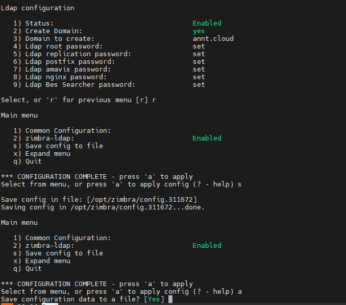
- 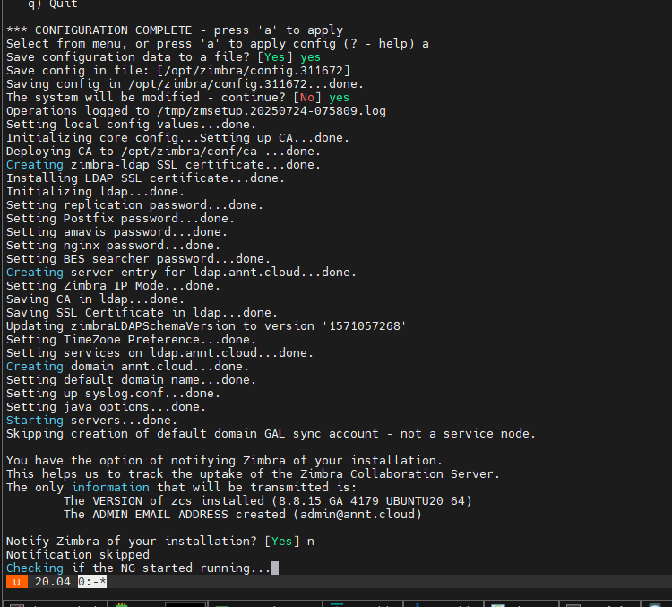

    Quá trình cài đặt và cấu hình sẽ diễn ra trong vài phút. Khi hoàn tất, bạn sẽ thấy thông báo `Configuration complete - press return to exit`. Nhấn Enter để thoát.

    **Chúc mừng, cài đặt máy chủ LDAP đã hoàn tất\!**

-----

### 5.2. Cài đặt Zimbra MAILBOX (Máy chủ: `mailbox.annt.cloud` - `192.168.50.142`)

Máy chủ MAILBOX là thành phần tiếp theo cần cài đặt.

1.  Sau khi chạy `./install.sh` trên máy chủ Mailbox, chọn các gói sau để cài đặt (nhập `y` cho các gói này, `n` cho các gói còn lại):

      * `zimbra-core`
      * `zimbra-logger`
      * `zimbra-snmp`
      * `zimbra-store`
      * `zimbra-apache`
      * `zimbra-spell`
      * `zimbra-drive`
      * `zimbra-patch`
      * `zimbra-chat`

    Nhập `Y` và nhấn Enter để xác nhận thay đổi hệ thống.
- 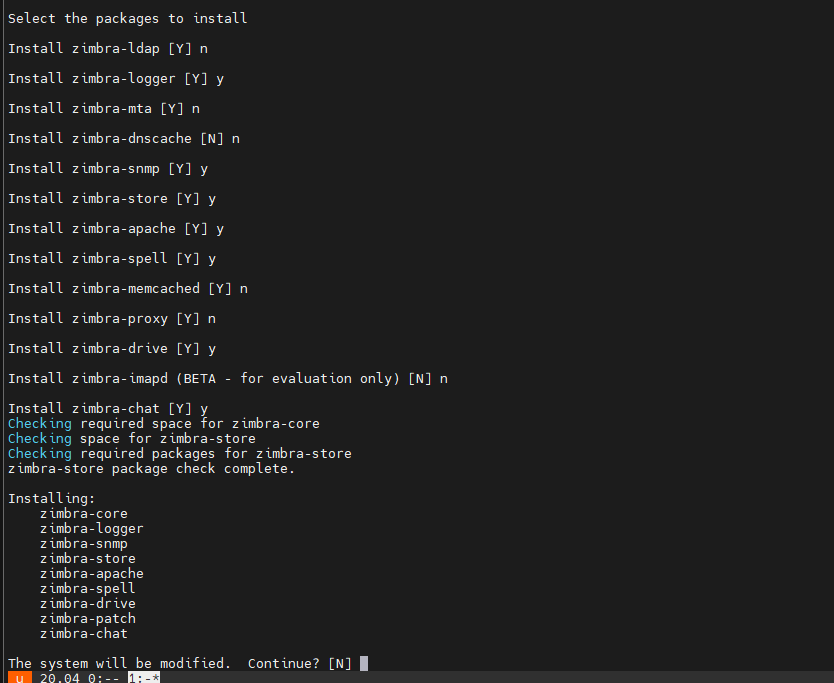

2.  Menu chính sẽ hiển thị. Nhập `x` và nhấn Enter để mở rộng menu, hiển thị chi tiết cấu hình.

3.  Nhập `1` để hiển thị menu **Common Configuration**.

    ```
    Common configuration

       1) Hostname:                                mailbox.annt.cloud
    ** 2) Ldap master host:                         UNSET
       3) Ldap port:                               389
    ** 4) Ldap Admin password:                      UNSET
       5) LDAP Base DN:                            cn=zimbra
       6) Store ephemeral attributes outside Ldap: no
       7) Secure interprocess communications:      yes
       8) TimeZone:                                Asia/Ho_Chi_Minh
       9) IP Mode:                                 ipv4
       10) Default SSL digest:                      sha256

    Select, or 'r' for previous menu [r]
    ```
- 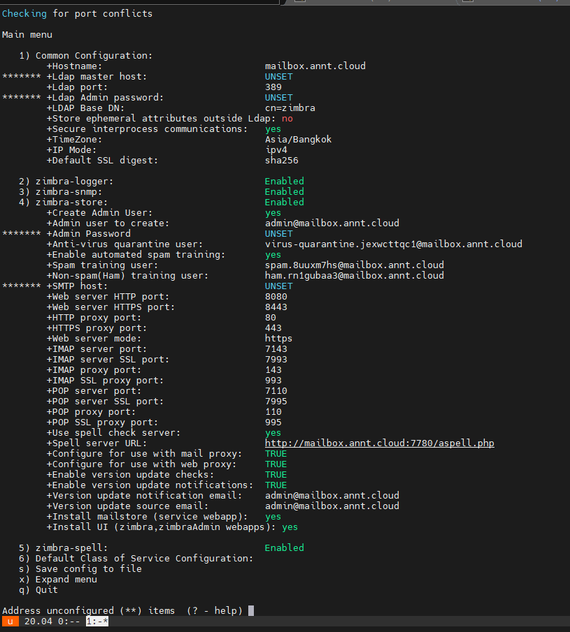

      * Bạn **phải thay đổi hostname LDAP master và mật khẩu** để khớp với các giá trị đã cấu hình trên máy chủ LDAP.
      * Nhập `2`, nhấn Enter, và nhập hostname của máy chủ LDAP: `ldap.annt.cloud`.
      * Nhập `4`, nhấn Enter, và nhập mật khẩu LDAP Admin mà bạn đã đặt trên máy chủ LDAP (ví dụ: `046sImD1MBk5`).
- 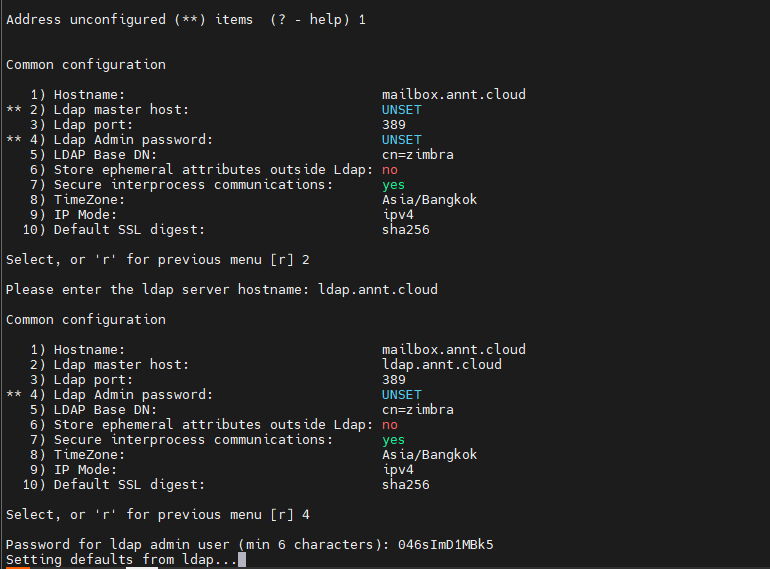
- 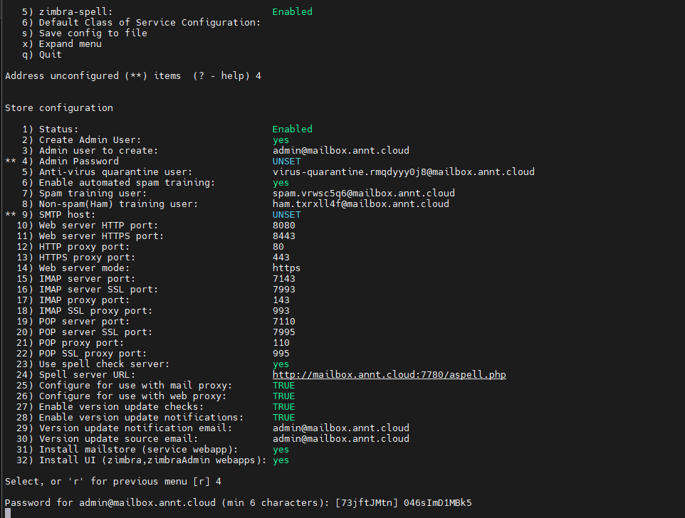

4.  Nhập `r` để quay lại Menu chính.

5.  Từ Menu chính, nhập `4` để xem các cài đặt cấu hình **zimbra-store (Store configuration)**.

    ```
    Store configuration

       1) Status:                          Enabled
       2) Account separation:               no
       3) Administrator user to create:     admin@annt.cloud
    ** 4) Admin password for admin@annt.cloud: UNSET
       5) Anti-virus quarantine user:       virus-quarantine@annt.cloud
       6) Spam training user:               spam.annt.cloud@annt.cloud
       7) Non-spam(Ham) training user:      ham.annt.cloud@annt.cloud
       8) SMTP host:                        ldap.annt.cloud
       9) WebMail Port:                     80
       10) WebMail SSL Port:                443
       11) IMAP Port:                       143
       12) IMAPS Port:                      993
       13) POP Port:                        110
       14) POPS Port:                       995
       15) Spell Check Server:              mailbox.annt.cloud
       16) Spell Check Port:                7780
       17) Change default Class of Service settings: no

    Select, or 'r' for previous menu [r]
    ```

      * Nhập `4` và đặt mật khẩu cho tài khoản `admin@annt.cloud`. Mật khẩu này sẽ được sử dụng để đăng nhập vào bảng điều khiển quản trị Zimbra.
      * Kiểm tra `SMTP host`. Mặc định có thể là `ldap.annt.cloud`. Bạn có thể để nguyên hoặc đổi thành `mta.annt.cloud` (sẽ cài đặt sau), nhưng hiện tại `ldap.annt.cloud` cũng có thể chấp nhận nếu bạn đã cấu hình DNS trên `ldap.annt.cloud` để trỏ đến chính nó. **Để đảm bảo hoạt động đúng, sau khi cài đặt MTA, bạn có thể cần quay lại cấu hình này để đặt `SMTP host` là `mta.annt.cloud` hoặc đảm bảo DNS phân giải `annt.cloud` về `mta.annt.cloud`.**
      * Nhập `r` để quay lại Menu chính.
- 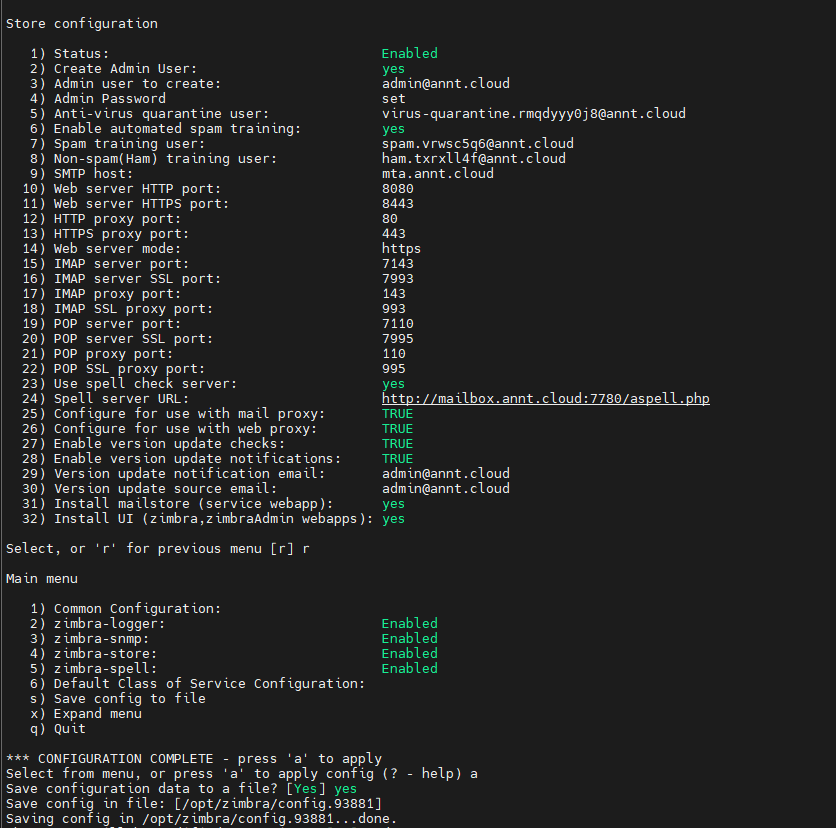

6.  Quay lại Menu chính và nhập `a` để áp dụng các thay đổi cấu hình.

      * Khi `Save configuration data to a file? [Yes]` xuất hiện, nhập `Yes` và nhấn Enter.
      * Nhấn Enter để chấp nhận vị trí lưu tệp mặc định.
      * Khi `The system will be modified - continue? [No]` xuất hiện, nhập `y` và nhấn Enter.

    Quá trình cài đặt và cấu hình sẽ mất vài phút. Khi hoàn tất, bạn sẽ thấy thông báo `Configuration complete - press return to exit`. Nhấn Enter để thoát.

    **Chúc mừng, cài đặt máy chủ Mailbox đã hoàn tất\!**

-----

### 5.3. Cài đặt Zimbra MTA (Máy chủ: `mta.annt.cloud` - `192.168.50.141`)

Máy chủ MTA là nơi xử lý việc gửi và nhận email.

1.  Sau khi chạy `./install.sh` trên máy chủ MTA, **chỉ chọn gói `zimbra-mta` để cài đặt**. Các gói khác giữ nguyên mặc định là `N` (No).
    Nhập `y` và nhấn Enter để tiếp tục.
    Nhập `Y` và nhấn Enter để xác nhận thay đổi hệ thống.

2.  Menu chính sẽ hiển thị. Nhập `x` và nhấn Enter để mở rộng menu.

3.  Nhập `1` để hiển thị menu **Common Configuration**.

    ```
    Common configuration

       1) Hostname:                                mta.annt.cloud
    ** 2) Ldap master host:                         UNSET
       3) Ldap port:                               389
    ** 4) Ldap Admin password:                      UNSET
       5) Store ephemeral attributes outside Ldap: no
       6) Secure interprocess communications:      yes
       7) TimeZone:                                Asia/Ho_Chi_Minh
       8) IP Mode:                                 ipv4
       9) Default SSL digest:                      sha256

    Select, or 'r' for previous menu [r]
    ```
- 

      * Bạn **phải thay đổi hostname LDAP master và mật khẩu** để khớp với các giá trị đã cấu hình trên máy chủ LDAP.
      * Nhập `2`, nhấn Enter, và nhập hostname của máy chủ LDAP: `ldap.annt.cloud`.
      * Nhập `4`, nhấn Enter, và nhập mật khẩu LDAP Admin mà bạn đã đặt trên máy chủ LDAP (ví dụ: `046sImD1MBk5`).
- 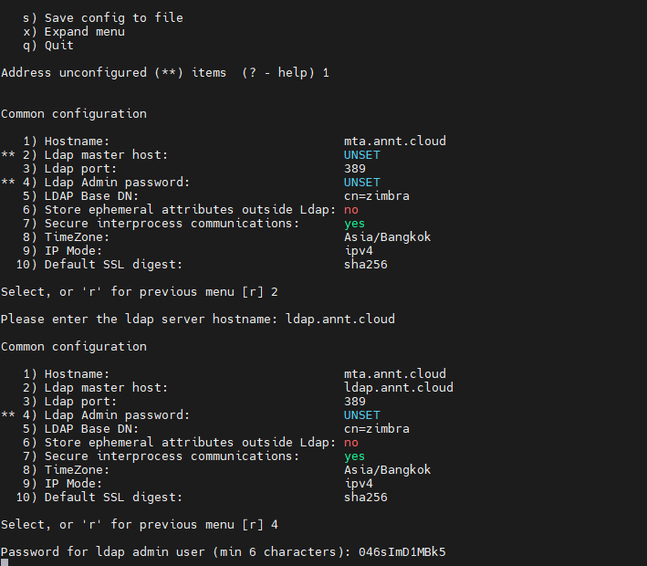
	  
      * Sau khi đặt các giá trị này, máy chủ sẽ cố gắng liên hệ với máy chủ LDAP. Nếu không thể liên hệ được, bạn sẽ không thể tiếp tục.

4.  Nhập `r` để quay lại Menu chính.

5.  Nhập `2` để vào menu **Mta configuration**.

    ```
    Mta configuration

       1) Status:                          Enabled
       4) Notification address for AV alerts: admin@mta.annt.cloud
    ** 6) Bind password for postfix ldap user: UNSET
    ** 7) Bind password for amavis ldap user: UNSET

    Select, or 'r' for previous menu [r]
    ```

      * Bạn có thể thay đổi địa chỉ `Notification address for AV alerts` (ví dụ: `admin@annt.cloud`). Địa chỉ này phải là một tài khoản có trên tên miền của bạn.
      * Chọn số menu cho `Bind password for postfix ldap user` và `Bind password for amavis ldap user`. Bạn **phải sử dụng cùng giá trị** này với mật khẩu Postfix và Amavis LDAP đã cấu hình trên máy chủ LDAP.
      * Nhập `r` để quay lại Menu chính.
- 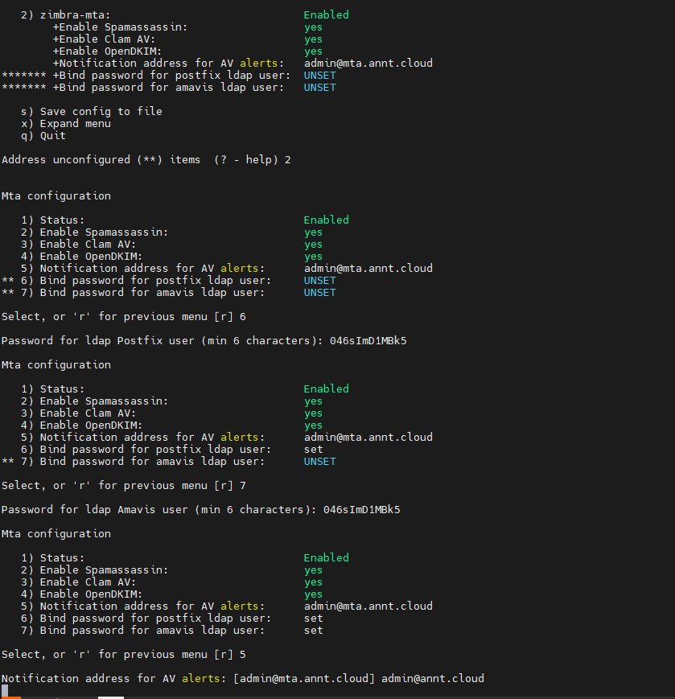

6.  Quay lại Menu chính và nhập `a` để áp dụng các thay đổi cấu hình.
- 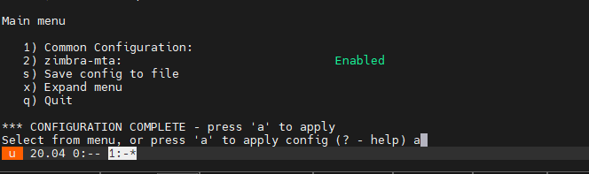

      * Khi `Save configuration data to a file? [Yes]` xuất hiện, nhập `Yes` và nhấn Enter.
      * Nhấn Enter để chấp nhận vị trí lưu tệp mặc định.
      * Khi `The system will be modified - continue? [No]` xuất hiện, nhập `y` và nhấn Enter.

    Quá trình cài đặt và cấu hình sẽ mất vài phút. Khi hoàn tất, bạn sẽ thấy thông báo `Configuration complete - press return to exit`. Nhấn Enter để thoát.
- 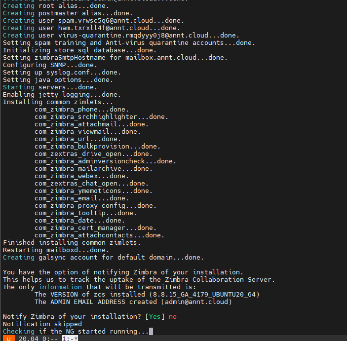

    **Chúc mừng, cài đặt máy chủ MTA đã hoàn tất\!**

-----

### 5.4. Cài đặt Zimbra PROXY (Máy chủ: `proxy.annt.cloud` - `192.168.50.143`)

Máy chủ PROXY là thành phần cuối cùng được cài đặt, chịu trách nhiệm proxy cho các dịch vụ.

1.  Sau khi chạy `./install.sh` trên máy chủ Proxy, chọn các gói sau để cài đặt (nhập `y` cho các gói này, `n` cho các gói còn lại):

      * `zimbra-proxy`
      * `zimbra-memcached`

    Nhập `Y` và nhấn Enter để cài đặt các gói đã chọn.
- 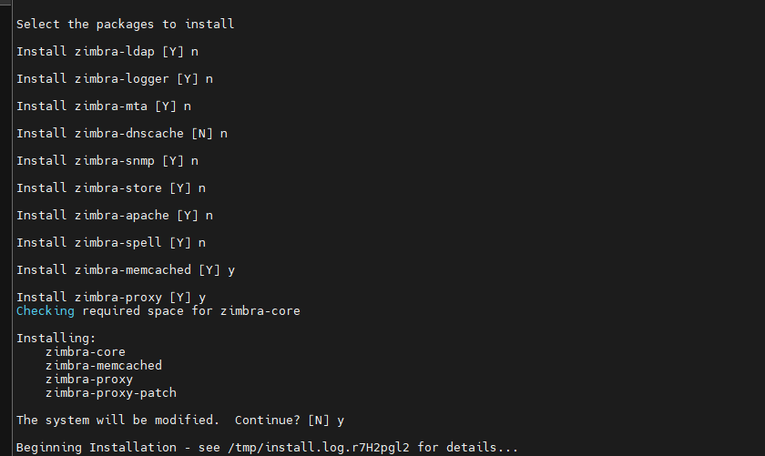

2.  Menu chính sẽ hiển thị. Nhập `1` và nhấn Enter để vào menu **Common Configuration**.
- 

    ```
    Common configuration

       1) Hostname:                                proxy.annt.cloud
    ** 2) Ldap master host:                         UNSET
       3) Ldap port:                               389
    ** 4) Ldap Admin password:                      UNSET
       5) Store ephemeral attributes outside Ldap: no
       6) Secure interprocess communications:      yes
       7) TimeZone:                                Asia/Ho_Chi_Minh
       8) IP Mode:                                 ipv4
       9) Default SSL digest:                      sha256

    Select, or 'r' for previous menu [r]
    ```

      * Bạn **phải thay đổi hostname LDAP master và mật khẩu** để khớp với các giá trị đã cấu hình trên máy chủ LDAP.
      * Nhập `2`, nhấn Enter, và nhập hostname của máy chủ LDAP: `ldap.annt.cloud`.
      * Nhập `4`, nhấn Enter, và nhập mật khẩu LDAP Admin mà bạn đã đặt trên máy chủ LDAP (ví dụ: `046sImD1MBk5`).
      * Sau khi đặt các giá trị này, máy chủ sẽ cố gắng liên hệ với máy chủ LDAP. Nếu không thể liên hệ được, bạn sẽ không thể tiếp tục.
- 

3.  Nhập `r` để quay lại Menu chính.

4.  Nhập `2` để chọn **zimbra-proxy**. Menu cấu hình Proxy sẽ hiển thị.

    ```
    Proxy Configuration

       1) Status:                          Enabled
       2) Proxy host:                       proxy.annt.cloud
       3) Proxy HTTP port:                  80
       4) Proxy HTTPS port:                 443
       5) IMAP proxy port:                  143
       6) IMAPS proxy port:                 993
       7) POP proxy port:                   110
       8) POPS proxy port:                  995
       9) Proxy cache:                      yes
       10) Proxy cache server:              proxy.annt.cloud
       11) Bind password for Nginx ldap user: set
       12) Proxy SSL digest:                sha256

    Select, or 'r' for previous menu [r]
    ```

      * Mật khẩu `Bind password for Nginx ldap user` được cấu hình khi máy chủ LDAP được cài đặt. Mật khẩu này không được sử dụng trừ khi cơ chế xác thực Kerberos5 được bật. Bạn có thể đặt hoặc bỏ qua.
- 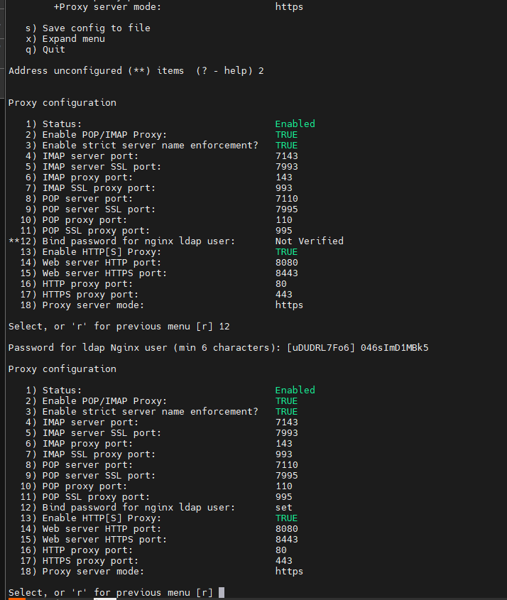

5.  Nhập `r` để quay lại Menu chính.

6.  Khi máy chủ proxy đã được cấu hình, quay lại Menu chính và nhập `a` để áp dụng các thay đổi cấu hình.
- 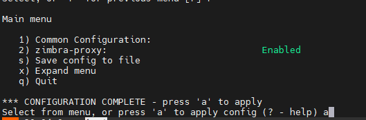

      * Khi `Save configuration data to a file? [Yes]` xuất hiện, nhấn Enter để chấp nhận.
      * Nhấn Enter để chấp nhận vị trí lưu tệp mặc định.
      * Khi `The system will be modified - continue? [No]` xuất hiện, nhập `y` và nhấn Enter.

    Khi hoàn tất, bạn sẽ thấy thông báo `Configuration complete - press return to exit`. Nhấn Enter để thoát.

    **Chúc mừng, cài đặt máy chủ Proxy đã hoàn tất\!**

-----

## 6\. Kiểm tra hệ thống sau cài đặt

Sau khi hoàn tất việc cài đặt tất cả các thành phần trên các máy chủ tương ứng, bạn cần kiểm tra lại để đảm bảo hệ thống hoạt động đúng.

### 6.1. Kiểm tra trạng thái dịch vụ Zimbra

Trên **mỗi máy chủ**, bạn có thể kiểm tra trạng thái của các dịch vụ Zimbra bằng lệnh:

```bash
su - zimbra
zmcontrol status
```

Bạn sẽ thấy danh sách các dịch vụ và trạng thái của chúng (ví dụ: `Running`). Đảm bảo tất cả các dịch vụ quan trọng đều đang chạy.
- 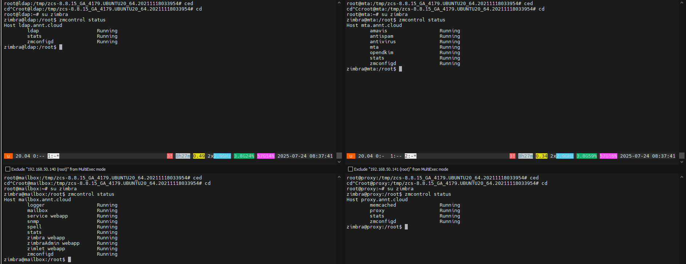

### 6.2. Đăng nhập Zimbra Admin Console

Truy cập trang quản trị Zimbra bằng trình duyệt web:

  * Sử dụng địa chỉ IP hoặc hostname của máy chủ **MAILBOX** và cổng `7071`:
    `https://mailbox.annt.cloud:7071` hoặc `https://192.168.50.142:7071`
  * Đăng nhập bằng tài khoản `admin@annt.cloud` và mật khẩu bạn đã đặt trong quá trình cài đặt Mailbox.

### 6.3. Tạo người dùng mới và kiểm tra gửi/nhận email

1.  **Tạo người dùng**:

      * Trong Zimbra Admin Console, tạo một người dùng mới, ví dụ: `u1@annt.cloud`.
      * Đặt mật khẩu cho người dùng này.
- 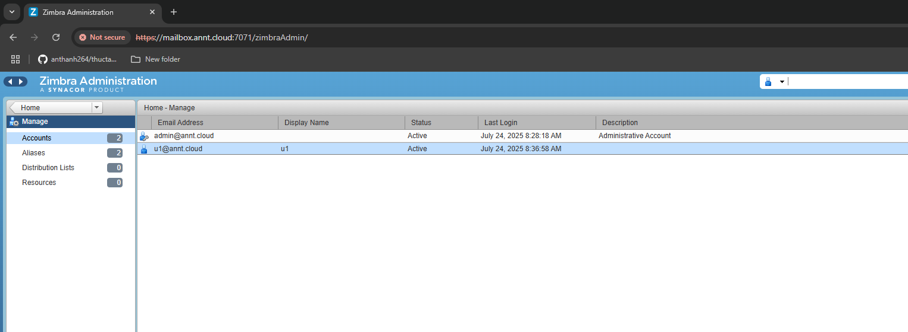

2.  **Đăng nhập Webmail và kiểm tra gửi/nhận**:

      * Truy cập Webmail bằng địa chỉ IP hoặc hostname của máy chủ **PROXY** (vì PROXY là điểm truy cập chính cho người dùng cuối):
        `https://proxy.annt.cloud` hoặc `https://192.168.50.143`
      * Đăng nhập bằng tài khoản `admin@annt.cloud` và `u1@annt.cloud`.
      * Gửi một email từ `u1@annt.cloud` đến `admin@annt.cloud`.
      * Gửi một email từ `admin@annt.cloud` đến `u1@annt.cloud`.
      * Kiểm tra xem email có được nhận thành công hay không.
- 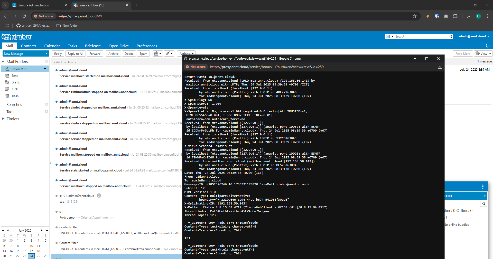

3.  **Kiểm tra nguồn thư (View Source)**:
    Để kiểm tra tuyến đường của email và phản hồi từ mỗi máy chủ, bạn có thể xem nguồn (source) của email đã gửi. Ví dụ, khi `u1@annt.cloud` gửi mail cho `admin@annt.cloud`:

      * Trong hộp thư của `admin@annt.cloud`, mở email từ `u1`.
      * Tìm tùy chọn "Show Original" hoặc "View Source" (tùy thuộc vào giao diện webmail).
      * Phân tích các header `Received` để xem đường đi của email.

    **Ví dụ phân tích nguồn thư từ `u1@annt.cloud` gửi đến `admin@annt.cloud`:**

    ```
    Return-Path: <u1@annt.cloud>
    Received: from mta.annt.cloud (LHLO mta.annt.cloud) (192.168.50.141) by
      mailbox.annt.cloud with LMTP; Thu, 24 Jul 2025 08:39:39 +0700 (ICT)
    # <-- Email được MTA (192.168.50.141) chuyển giao đến Mailbox (192.168.50.142) qua LMTP
    Received: from localhost (localhost [127.0.0.1])
        by mta.annt.cloud (Postfix) with ESMTP id 4BF272630A6
        for <admin@annt.cloud>; Thu, 24 Jul 2025 08:39:39 +0700 (+07)
    X-Spam-Flag: NO
    X-Spam-Score: -1.009
    X-Spam-Level:
    X-Spam-Status: No, score=-1.009 required=6.6 tests=[ALL_TRUSTED=-1,
      HTML_MESSAGE=0.001, T_SCC_BODY_TEXT_LINE=-0.01]
      autolearn=ham autolearn_force=no
    Received: from mta.annt.cloud ([127.0.0.1])
      by localhost (mta.annt.cloud [127.0.0.1]) (amavis, port 10032) with ESMTP
      id IJDkrPr9bsDh for <admin@annt.cloud>; Thu, 24 Jul 2025 08:39:39 +0700 (+07)
    # <-- Mailbox nhận từ Amavis trên cùng máy chủ MTA (kiểm tra chống spam/virus)
    Received: from localhost (localhost [127.0.0.1])
        by mta.annt.cloud (Postfix) with ESMTP id 132CD2630A3
        for <admin@annt.cloud>; Thu, 24 Jul 2025 08:39:39 +0700 (+07)
    X-Virus-Scanned: amavis at
    Received: from mta.annt.cloud ([127.0.0.1])
      by localhost (mta.annt.cloud [127.0.0.1]) (amavis, port 10026) with ESMTP
      id T0WWPmXr9ZdU for <admin@annt.cloud>; Thu, 24 Jul 2025 08:39:38 +0700 (+07)
    # <-- Mailbox nhận từ Amavis trên cùng máy chủ MTA (kiểm tra chống virus)
    Received: from mailbox.annt.cloud (mailbox.annt.cloud [192.168.50.142])
        by mta.annt.cloud (Postfix) with ESMTP id DE52B26309A
        for <admin@annt.cloud>; Thu, 24 Jul 2025 08:39:38 +0700 (+07)
    # <-- Email được gửi từ Mailbox (192.168.50.142) đến MTA (192.168.50.141)
    Date: Thu, 24 Jul 2025 08:39:38 +0700 (ICT)
    From: u1@annt.cloud
    To: admin@annt.cloud
    Message-ID: <1852326746.10.1753321178870.JavaMail.zimbra@annt.cloud>
    Subject: 123
    MIME-Version: 1.0
    Content-Type: multipart/alternative;
        boundary="=_aa10e646-c994-44dc-b674-541935f30ed5"
    X-Originating-IP: [192.168.50.143] # <-- Địa chỉ IP ban đầu của yêu cầu, cho thấy Proxy đã chuyển tiếp
    X-Mailer: Zimbra 8.8.15_GA_4717 (ZimbraWebClient - GC138 (Win)/8.8.15_GA_4717)
    Thread-Index: PoF6AHofbtwkxfhv0A5CVAhCn7GxEg==
    Thread-Topic: 123
    --=_aa10e646-c994-44dc-b674-541935f30ed5
    Content-Type: text/plain; charset=utf-8
    Content-Transfer-Encoding: 7bit
    123
    --=_aa10e646-c994-44dc-b674-541935f30ed5
    Content-Type: text/html; charset=utf-8
    Content-Transfer-Encoding: 7bit
    <html><body><div style="font-family: arial, helvetica, sans-serif; font-size: 12pt; color: #000000"><div>123</div></div></body></html>
    --=_aa10e646-c994-44dc-b674-541935f30ed5--
    ```

    Phân tích này cho thấy luồng email:

    1.  Người dùng `u1` truy cập qua **Proxy** (`X-Originating-IP: [192.168.50.143]`).
    2.  Yêu cầu được chuyển đến **Mailbox** (`192.168.50.142`) để xử lý gửi đi.
    3.  Mailbox chuyển email đến **MTA** (`192.168.50.141`) để gửi.
    4.  MTA xử lý email, bao gồm quét virus/spam bởi **Amavis** (trên cùng máy chủ MTA).
    5.  Cuối cùng, MTA chuyển giao email đến **Mailbox** (`192.168.50.142`) của người nhận `admin@annt.cloud` qua LMTP.

Nếu các bước kiểm tra trên đều thành công, bạn đã triển khai Zimbra Collaboration Multi-Server thành công\!

-----

## References 
- [Zimbra Collaboration Multi-Server Installation Guide](https://zimbra.github.io/installguides/8.7.6/multi.html)