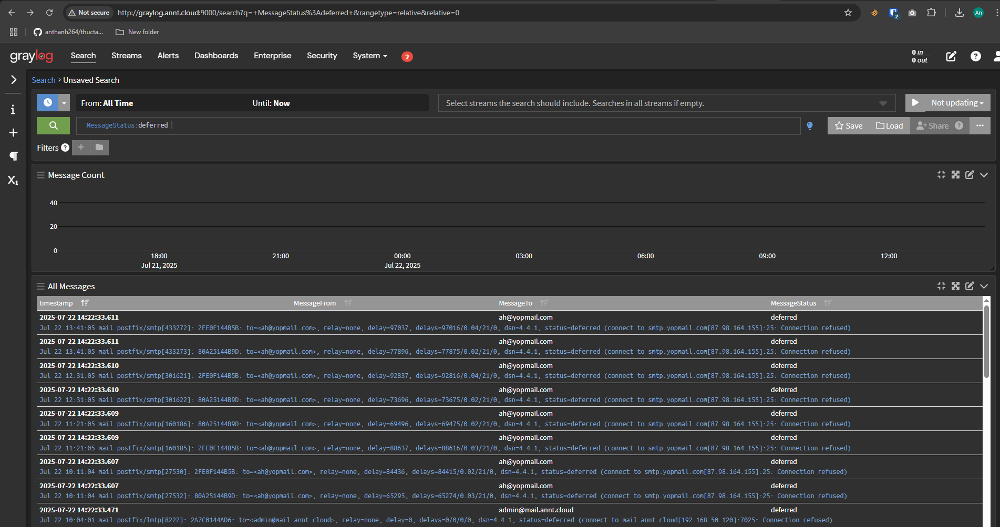
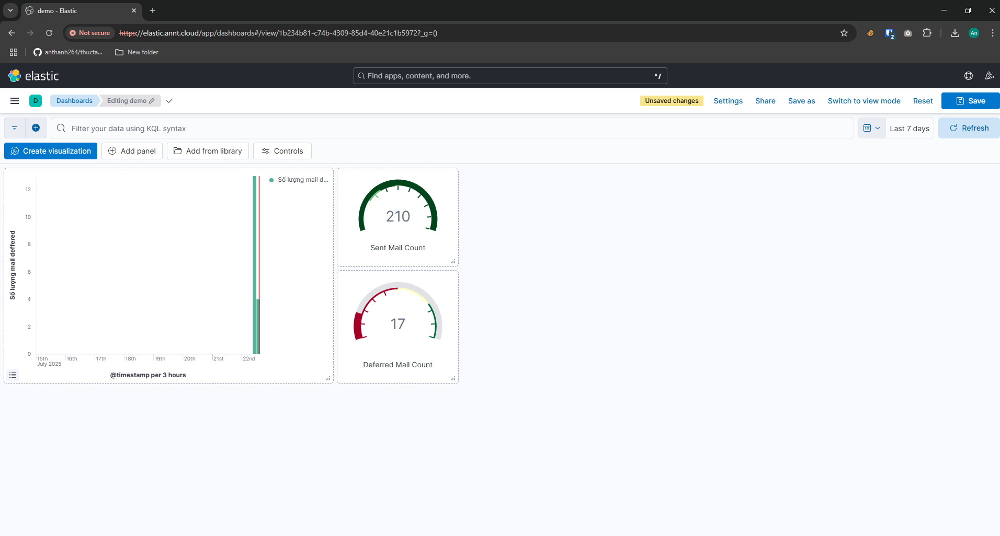
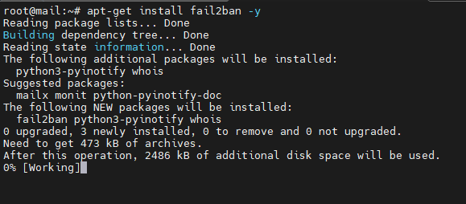
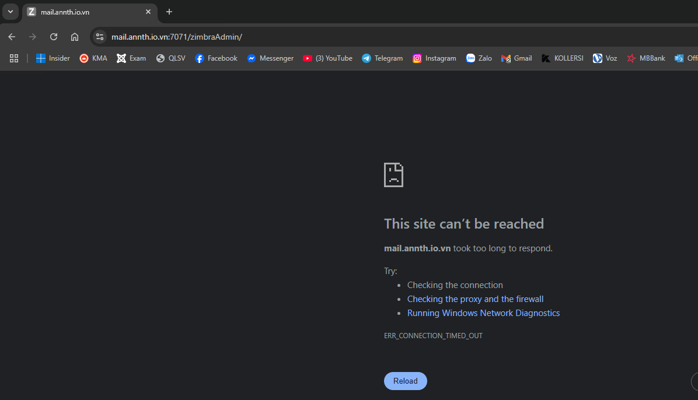
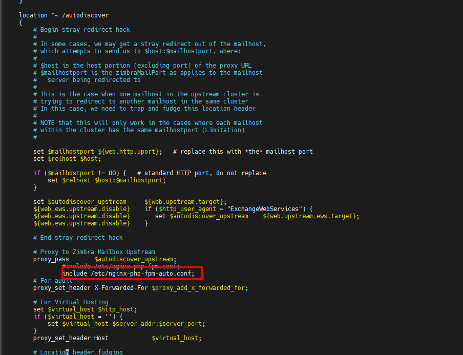

# Email 
## 1.Vận hành & Quản trị
### 1.1 Cấu trúc & thành phần của một email server
#### 1.1.1 Tổng quan 
- Email (Electronic Mail) là một phương tiện giao tiếp trực tuyến, cho phép người dùng gửi và nhận thư điện tử thông qua mạng internet. 
- Cấu trúc cơ bản của Email :
	- Địa chỉ email: Mỗi người dùng email có một địa chỉ email duy nhất, thường bao gồm tên người dùng và tên miền của nhà cung cấp dịch vụ (ví dụ: example@gmail.com). 
	- Mail Server: Là hệ thống máy chủ đảm nhiệm vai trò gửi, nhận và lưu trữ email. 
	- Giao thức: Các giao thức như SMTP, POP3, và IMAP được sử dụng để truyền tải và truy cập email. 
- Quy trình hoạt động:
	- Người gửi soạn email và gửi đi từ thiết bị của họ. 
	- Email được chuyển đến mail server của người gửi. 
	- Mail server của người gửi định tuyến email đến mail server của người nhận. 
	- Mail server của người nhận lưu trữ email cho đến khi người nhận truy cập. 
	- Người nhận truy cập email của họ thông qua ứng dụng hoặc trình duyệt web. 
- Lợi ích của email:
	- Tốc độ: Email cho phép gửi và nhận thư nhanh chóng, gần như ngay lập tức. 
	- Tiện lợi: Người dùng có thể truy cập email từ bất kỳ thiết bị nào có kết nối internet. 
	- Lưu trữ: Email có thể được lưu trữ trên máy chủ hoặc thiết bị cá nhân, giúp người dùng dễ dàng quản lý. 
	- Tính phổ biến: Email là một phương tiện giao tiếp phổ biến và được sử dụng rộng rãi trên toàn cầu. 
	- Tính bảo mật: Mail server có thể được cấu hình để tăng cường bảo mật và bảo vệ thông tin. 
- Mail Server (hay còn gọi là Email Server hay máy chủ thư điện tử) là một hệ thống máy tính hoặc máy chủ được thiết lập để quản lý và xử lý các dịch vụ liên quan đến thư điện tử email. Chức năng chính của Server Mail là quản lý và lưu trữ email số lượng lớn, cho nhân viên dùng gửi và nhận thư điện tử thông qua mạng.
- Các loại mail server:
	- Mail server cá nhân: Dành cho cá nhân hoặc doanh nghiệp nhỏ, thường được cung cấp bởi các nhà cung cấp dịch vụ email miễn phí hoặc trả phí. 
	- Mail server doanh nghiệp: Dành cho các tổ chức, doanh nghiệp lớn, có thể được quản lý nội bộ hoặc thuê ngoài. 
	- Mail server của nhà cung cấp dịch vụ: Các dịch vụ email phổ biến như Gmail, Outlook, Yahoo Mail đều sử dụng hệ thống mail server riêng. 
- Các dịch vụ email phổ biến: Gmail, Outlook, Yahoo Mail, Zoho Mail, iCloud Mail. 
- Cơ chế hoạt động của Mail Server 
	- Outgoing Mail Server và Incoming Mail Server cùng hoạt động để đảm bảo việc gửi và nhận thư điện tử được thực hiện một cách hiệu quả và an toàn.
	- Outgoing Mail Server (SMTP Server) 
		- Là thành phần quan trọng trong cơ chế hoạt động của Server Mail. Nhiệm vụ chính của Outgoing Mail Server là xử lý và gửi đi các email từ người gửi tới người nhận. Quá trình hoạt động của Outgoing Mail Server như sau:
		- Gửi Email: Người gửi viết email thông qua ứng dụng email của họ (MUA – Mail User Agent) và gửi nó tới Outgoing Mail Server thông qua giao thức SMTP (Simple Mail Transfer Protocol).
		- Kiểm Tra Địa Chỉ Người Nhận: Outgoing Mail Server kiểm tra địa chỉ email của người nhận để xác định máy chủ thư điện tử của họ.
		- Chuyển Tiếp Email: Outgoing Mail Server sử dụng giao thức SMTP để chuyển tiếp email tới máy chủ thư điện tử của người nhận thông qua mạng.
	- Incoming Mail Server (IMAP,POP3)
		- Là thành phần quản lý thư điện tử đến của Server Mail. Nhiệm vụ của Incoming Mail Server là lưu trữ và quản lý các email đến và cho phép người nhận truy cập vào chúng. Quá trình hoạt động của Incoming Mail Server như sau:
		- Nhận và Lưu Trữ Email: Khi email được gửi từ Outgoing Server Mail của người gửi, Incoming Mail Server nhận và lưu trữ chúng trong hộp thư đến của người nhận.
		- Truyền Thư tới Máy Khách: Đối với giao thức IMAP, Incoming Mail Server cho phép người nhận truy cập thư điện tử trực tiếp trên máy chủ thông qua giao thức IMAP. Thư điện tử được lưu trữ trên máy chủ và chỉ truyền tới máy khách khi cần.
		- Tải Thư về Máy Khách: Đối với giao thức POP3, Incoming Server Mail cho phép máy khách tải toàn bộ email từ hộp thư đến về máy tính của người nhận. Email sau khi tải về có thể bị xóa khỏi máy chủ server.
#### 1.1.2 Các thành phần của Mail Server System 
- Hệ thống email hiện đại được xây dựng dựa trên một chuỗi các thành phần phần mềm chuyên biệt, mỗi thành phần đảm nhận một vai trò cụ thể trong quá trình gửi, truyền, lưu trữ và truy xuất thư điện tử. Các thành phần chính bao gồm:
##### 1.1.2.1 Message User Agent (MUA)
- MUA là phần mềm mà người dùng cuối sử dụng để soạn, gửi, nhận và quản lý email. Đây là giao diện tương tác trực tiếp giữa người dùng và hệ thống email.
- Ví dụ: Microsoft Outlook, Mozilla Thunderbird, Apple Mail, Gmail (trình duyệt).
- Chức năng chính:
	- Soạn và gửi email đến MSA thông qua SMTP.
	- Nhận email từ MRA thông qua POP3 hoặc IMAP.
	- Quản lý hộp thư, thư mục, gắn nhãn, tìm kiếm, lọc thư.
	- Giao thức sử dụng: SMTP (gửi), POP3/IMAP (nhận).
##### 1.1.2.2 Message Submission Agent (MSA)
- MSA là thành phần trung gian giữa MUA và MTA, chịu trách nhiệm tiếp nhận email từ MUA và chuẩn hóa định dạng trước khi chuyển đến MTA để truyền đi.
- Vai trò:
	- Xác thực người gửi (authentication).
	- Kiểm tra định dạng và tiêu chuẩn RFC của email.
	- Ghi log và áp dụng chính sách gửi thư (rate limit, kiểm tra SPF...).
	- Cổng mặc định: SMTP qua cổng 587 (hoặc 465 với SMTPS).
- Ví dụ: Postfix khi cấu hình chế độ submission, Sendmail, Ex

##### 1.1.2.3 Message Transfer Agent (MTA)
- MTA là thành phần cốt lõi trong hệ thống email, chịu trách nhiệm truyền tải email giữa các máy chủ thông qua giao thức SMTP.
- Chức năng:
	- Nhận email từ MSA hoặc MTA khác.
	- Tra cứu bản ghi MX của tên miền người nhận thông qua DNS.
	- Truyền tiếp email đến MTA đích hoặc MDA nếu nội bộ.
	- Quản lý hàng đợi thư (mail queue) và retry nếu gửi thất bại.
	- Giao thức: SMTP (port 25 giữa các MTA).
- Ví dụ: Postfix, Sendmail, Exim, Qmail.
- Lưu ý: MTA thường hoạt động ở chế độ nền (daemon) và không tương tác trực tiếp với người dùng.

##### 1.1.2.4 Message Delivery Agent (MDA)
- MDA là thành phần phân phối email đến hộp thư người nhận sau khi được MTA chuyển đến.
- Chức năng:
	- Lưu trữ email vào định dạng cụ thể như Maildir hoặc mbox.
	- Áp dụng bộ lọc thư (mail filtering), chuyển tiếp, hoặc phân loại thư.
	- Có thể tích hợp với phần mềm chống spam/virus.
- Ví dụ: Dovecot (LDA), Procmail, maildrop.
- Giao thức nội bộ: Không sử dụng SMTP mà thường là giao tiếp nội bộ giữa MTA và MDA.

##### 1.1.2.5 Mail Retrieval Agent (MRA)
- MRA là thành phần truy xuất email từ máy chủ và chuyển đến MUA. Đây là cầu nối giữa hộp thư lưu trữ và ứng dụng người dùng.
- Chức năng:
	- Kết nối đến máy chủ lưu trữ thư (thường là Dovecot hoặc Courier).
	- Tải thư về máy người dùng (POP3) hoặc đồng bộ thư (IMAP).
	- Hỗ trợ xác thực và mã hóa kết nối (SSL/TLS).
	- Ví dụ: fetchmail, getmail.
- Giao thức: POP3 (port 110), IMAP (port 143), hoặc phiên bản bảo mật (995/993).

##### 1.1.2.6 Luồng xử lý Email 
- Trong kiến trúc hệ thống email, các tác nhân phần mềm (agents) được phân chia theo vai trò chức năng trong quá trình gửi và nhận thư. Truyền thống, hệ thống được chia thành hai phía:
	- Client-side: MUA (Message User Agent)
	- Server-side: MTA (Message Transfer Agent)
- Theo một các đơn giản luồng xử lý gồm: 
`MUA → MTA → … → MTA → MUA`
	- MUA bên gửi đẩy thư đến máy chủ SMTP (MTA).
	- MTA gửi thư qua Internet đến MTA của bên nhận (có thể qua nhiều MTA trung gian).
	- MUA của bên nhận sẽ lấy thư từ hộp thư.

- Luồng xử lý mail hiện đại với các thành phần trung gian cụ thể: 
```
Người dùng
   │
   ▼
[MUA] ──► [MSA] ──► [MTA] ──► … ──► [MTA] ──► [MDA] ──▶▶ [MRA] ──▶▶ [MUA]
 Gửi       Nộp       Chuyển        Trung        Phân phối   Truy xuất
 thư        thư       tiếp         gian           thư         thư
```
	- ──►: bước đẩy (push) – dữ liệu được gửi chủ động từ một tác nhân đến tác nhân kế tiếp.
	- ──▶▶: bước kéo (pull) – dữ liệu được truy xuất chủ động bởi tác nhân tiếp theo.
	- Trong đó:
		- MUA (Message User Agent):	Người dùng soạn và gửi thư qua ứng dụng email (Outlook, Thunderbird...). MUA gửi thư đến MSA.
		- MSA (Message Submission Agent): Tiếp nhận thư từ MUA, xác thực người gửi, chuẩn hóa định dạng và chuyển tiếp đến MTA. Giao tiếp thường qua SMTP cổng 587.
		- MTA (Message Transfer Agent):	Truyền thư giữa các máy chủ email. Có thể có nhiều MTA trung gian. Giao tiếp qua SMTP cổng 25.
		- MDA (Message Delivery Agent):	Nhận thư từ MTA và lưu trữ vào hộp thư người nhận. Có thể áp dụng lọc thư rác, phân loại thư, v.v.
		- MRA (Mail Retrieval Agent): Truy xuất thư từ hộp thư và chuyển đến MUA. Ví dụ: fetchmail, getmail. Một số MUA hiện đại tích hợp luôn chức năng MRA.


#### 1.1.3 Các giao thức 
- Các giao thức email là tập hợp các quy tắc điều khiển cách thư điện tử được gửi đi, nhận về và lưu trữ. Ba giao thức chính bao gồm:
	- SMTP (Simple Mail Transfer Protocol): Giao thức dùng để gửi email giữa các máy chủ.
	- POP3 (Post Office Protocol version 3): Giao thức nhận email bằng cách tải thư về thiết bị người dùng và thường xóa khỏi máy chủ.
	- IMAP (Internet Message Access Protocol): Giao thức nhận email bằng cách đồng bộ thư giữa nhiều thiết bị với máy chủ — người dùng có thể truy cập thư từ mọi nơi mà không mất dữ liệu.
##### 1.1.3.1 SMTP (Simple Mail Transfer Protocol)
- Giao thức Truyền thư Đơn giản (SMTP - Simple Mail Transfer Protocol) được sử dụng để gửi thư điện tử qua Internet. Đây là một giao thức thuộc tầng ứng dụng và có tính kết nối (connection-oriented), hoạt động dựa trên giao thức tầng vận chuyển TCP.
- SMTP đảm bảo tính hiệu quả và độ tin cậy cao trong việc gửi email. Nó xử lý quá trình gửi và nhận thông điệp giữa các máy chủ thư trên mạng TCP/IP. Ngoài chức năng gửi thư, SMTP còn hỗ trợ tính năng thông báo khi có thư đến.
- Khi người gửi gửi email, ứng dụng thư của họ sẽ chuyển tiếp email đến máy chủ thư gửi, sau đó máy chủ này dùng SMTP để gửi thư đến máy chủ thư của người nhận.
- Nếu quá trình gửi không thành công, SMTP sẽ trả về thông báo lỗi, đảm bảo tính tin cậy của giao thức trong việc vận hành hệ thống email.
- Các loại mô hình hoạt động của giao thức SMTP: Giao thức SMTP hỗ trợ hai phương thức chuyển thư chính:
	- End-to-End Delivery
		- Được sử dụng giữa các tổ chức.
		- Thư được gửi trực tiếp từ ứng dụng SMTP của người gửi đến máy chủ SMTP của người nhận, không qua máy chủ trung gian.
		- SMTP client sẽ chờ đến khi thư được sao chép thành công vào máy chủ SMTP của người nhận mới hoàn tất quá trình gửi.
	- Store-and-Forward
		- Áp dụng trong nội bộ tổ chức sử dụng mạng TCP/IP và hệ thống thư dựa trên SMTP.
		- Thư có thể đi qua nhiều máy chủ trung gian (Message Transfer Agents – MTAs) trước khi đến đích.
		- Trong mô hình này, người gửi sẽ nhận thông báo khi thư đến được máy chủ đầu tiên, chứ không cần đợi tới máy chủ đích cuối cùng.
- Mô hình của hệ thống SMTP 

- Các thành phần trong hệ thống SMTP: SMTP không hoạt động đơn lẻ mà phối hợp với nhiều thành phần khác nhau để đảm bảo quá trình gửi thư diễn ra trơn tru. Dưới đây là các thành phần chính:
1. Mail User Agent (MUA):
	- Là ứng dụng người dùng sử dụng để soạn, gửi và nhận email.
	- Ví dụ: Outlook, Thunderbird, Gmail (trình duyệt).
	- MUA tạo nội dung thư và gửi đến MSA để xử lý tiếp.
2. Mail Submission Agent (MSA):
	- Tiếp nhận thư từ MUA và kiểm tra, xác thực, chuẩn hóa định dạng.
	- Sau đó chuyển tiếp thư đến MTA.
	- Giao tiếp qua SMTP cổng 587 hoặc 465 (bảo mật).
3. Mail Transfer Agent (MTA):
	- Là phần mềm chuyển tiếp thư giữa các máy chủ.
	- MTA gửi thư đến MTA đích hoặc qua các relay trung gian.
	- Ví dụ: Postfix, Sendmail, Exim.
4. Mail Delivery Agent (MDA):
	- Nhận thư từ MTA và lưu vào hộp thư người nhận.
	- Có thể áp dụng lọc thư, phân loại, chuyển tiếp nội bộ.
	- Ví dụ: Dovecot, Procmail.
- Cơ chế hoạt động của SMTP
	- Bước 1: Gửi thư
		- Người dùng sử dụng MUA để soạn thư.
		- Thư được gửi đến MSA, sau đó chuyển đến MTA gửi.
	- Bước 2: Giao tiếp giữa SMTP Client và Server
		- Sender-SMTP (Client): MTA của người gửi khởi tạo kết nối đến MTA của người nhận.
		- Receiver-SMTP (Server): MTA đích lắng nghe kết nối đến và nhận thư.
		- Giao tiếp diễn ra qua TCP port 25.
	- Bước 3: Relay và Gateway
		- Relay: Thư có thể đi qua nhiều MTA trung gian trước khi đến đích.
		- Gateway: Nếu hệ thống đích không dùng SMTP, gateway sẽ chuyển đổi định dạng phù hợp.
	- Bước 4: Phân phối thư
		- MTA đích chuyển thư đến MDA.
		- MDA lưu thư vào hộp thư người nhận.
		- MUA của người nhận (qua IMAP/POP3) sẽ truy xuất thư từ máy chủ.
- Các lệnh SMTP: 

| STT | Từ khóa | Cú pháp lệnh               | Chức năng                                                  | Mức độ sử dụng            |
| ---:| ------- | -------------------------- | ---------------------------------------------------------- | ------------------------- |
|   1 | HELO    | `HELO <domain>`            | Xác định tên máy gửi (hostname) với server.                | Bắt buộc                  |
|   2 | MAIL    | `MAIL FROM:<reverse-path>` | Khai báo địa chỉ người gửi.                                | Bắt buộc                  |
|   3 | RCPT    | `RCPT TO:<forward-path>`   | Khai báo địa chỉ người nhận.                               | Bắt buộc                  |
|   4 | DATA    | `DATA`                     | Bắt đầu phần nội dung thư (headers + body).                | Bắt buộc                  |
|   5 | QUIT    | `QUIT`                     | Kết thúc phiên làm việc và đóng kết nối TCP.               | Bắt buộc                  |
|   6 | RSET    | `RSET`                     | Hủy giao dịch thư hiện tại, giữ kết nối TCP.               | Rất nên dùng              |
|   7 | VRFY    | `VRFY <user>`              | Xác minh tên người dùng trên server.                       | Rất nên dùng (nếu hỗ trợ) |
|   8 | NOOP    | `NOOP`                     | Không thực hiện gì, chỉ kiểm tra phản hồi server.          | Rất nên dùng              |
|   9 | TURN    | `TURN`                     | Đảo vai trò client/server (hiếm dùng, không còn phổ biến). | Ít dùng                   |
|  10 | EXPN    | `EXPN <list>`              | Mở rộng danh sách gửi thư (mailing list).                  | Ít dùng                   |
|  11 | HELP    | `HELP [<command>]`         | Yêu cầu server gửi hướng dẫn về lệnh cụ thể.               | Ít dùng                   |
|  12 | SEND    | `SEND FROM:<reverse-path>` | Gửi thư đến terminal (hiếm dùng).                          | Ít dùng                   |
|  13 | SOML    | `SOML FROM:<reverse-path>` | Gửi thư đến terminal nếu có, nếu không thì đến hộp thư.    | Ít dùng                   |
|  14 | SAML    | `SAML FROM:<reverse-path>` | Gửi thư đến cả terminal và hộp thư.                        | Ít dùng                   |

	- Lưu ý:
		- Các lệnh như `HELO`, `MAIL`, `RCPT`, `DATA`, `QUIT` là bắt buộc trong mọi phiên SMTP.
		- Một số lệnh như `VRFY`, `EXPN`, `TURN` có thể bị vô hiệu hóa trên nhiều server vì lý do bảo mật.
		- `EHLO` là phiên bản mở rộng của `HELO` trong ESMTP (Extended SMTP), thường được dùng thay thế.

- Các port mà giao thức SMTP sử dụng 

| Cổng | Mục đích sử dụng                                           | Trạng thái & Ghi chú                                                                      |
| ---- | ---------------------------------------------------------- | ----------------------------------------------------------------------------------------- |
| 587  | Gửi thư từ client đến server (SMTP Submission) qua TLS     | Khuyến nghị sử dụng. Là tiêu chuẩn hiện tại cho giao tiếp bảo mật giữa MUA và MSA.        |
| 465  | SMTPS (SMTP over SSL) – từng được dùng cho gửi thư bảo mật | Không còn là tiêu chuẩn chính thức. Một số nhà cung cấp vẫn hỗ trợ, nhưng nên tránh dùng. |
| 25   | Truyền thư giữa các máy chủ (MTA to MTA)                   | Không dùng cho gửi từ client. Thường bị ISP chặn do bị lạm dụng để gửi spam.              |
| 2525 | Cổng thay thế cho gửi thư khi 587 hoặc 465 bị chặn         | Không chính thức nhưng được nhiều nhà cung cấp hỗ trợ như một lựa chọn linh hoạt.         |

##### 1.1.3.2 POP(Post Office Protocol)
- Giao thức POP (Post Office Protocol) được sử dụng để truy xuất email dành cho một người dùng duy nhất. Phiên bản hiện hành là POP3. Đây là một giao thức tầng ứng dụng.
- POP3 cho phép truy cập email khi không có kết nối Internet, vì thư được tải về thiết bị. Do đó, thời gian trực tuyến cần thiết là tối thiểu. Tuy nhiên, để đọc thư, người dùng bắt buộc phải tải xuống nội dung từ máy chủ.
- POP chỉ cho phép tạo một hộp thư duy nhất trên máy chủ email và không hỗ trợ chức năng tìm kiếm thư từ xa.
- Cách thức hoạt động của POP
	- Cho đến khi người dùng đăng nhập bằng ứng dụng email (email client) và tải thư về máy tính, tất cả thư đến sẽ được lưu trữ trên máy chủ POP. Sau khi thư được tải xuống, nó sẽ bị xóa khỏi máy chủ.
	- Vì SMTP là giao thức dùng để chuyển tiếp email giữa các máy chủ, nên POP chủ yếu đóng vai trò là giao thức truy xuất email từ máy chủ về máy khách — nó không hỗ trợ gửi thư.
	- Khi người dùng kiểm tra email, một kết nối POP3 sẽ được thiết lập từ phía máy chủ. Người dùng gửi tên đăng nhập và mật khẩu để xác thực. Sau khi kết nối thành công, người dùng có thể nhận và lưu trữ toàn bộ email dạng văn bản về thiết bị cục bộ. Sau đó, họ có thể xóa bản sao trên máy chủ và ngắt kết nối.
- Hệ thống POP hoạt động dựa trên 5 thành phần thiết bị chính:
	- Trạm gốc (Base stations): Điểm truy cập trung tâm, quản lý băng thông và đảm bảo phân phối tốc độ kết nối đồng đều cho người dùng.
	- Thiết bị đầu cuối (Client equipment): Thiết bị của người dùng dùng để kết nối đến trạm gốc.
	- Bộ chuyển mạch mạng (Network switches): Phân phối dữ liệu đến đúng thiết bị trong mạng.
	- Bộ định tuyến (Routers): Cung cấp nhiều tuyến đường để dữ liệu được truyền tải trong mạng.
	- Tường lửa (Firewall): Bảo vệ hệ thống khỏi các mối đe dọa từ bên trong và bên ngoài.
- Các lệnh cơ bản trong giao thức POP (Post Office Protocol): Giao thức POP3 sử dụng một tập hợp các lệnh văn bản đơn giản để giao tiếp giữa máy khách và máy chủ email. Một số lệnh phổ biến bao gồm:
    - LOGIN: Dùng để thiết lập kết nối với máy chủ (thường được thực hiện qua cặp lệnh USER và PASS trong POP3).
    - STAT: Hiển thị số lượng thư và tổng dung lượng trong hộp thư.
    - DELE: Xóa một thư cụ thể khỏi máy chủ.
    - RSET: Đặt lại phiên làm việc về trạng thái ban đầu, hủy các lệnh xóa đã thực hiện nhưng chưa xác nhận.
    - QUIT: Kết thúc phiên làm việc hiện tại và áp dụng các thay đổi (như xóa thư).
    - LIST: Hiển thị danh sách các thư trong hộp thư cùng với kích thước của từng thư.
    - RETR: Tải nội dung của một thư cụ thể từ máy chủ về máy khách.
- Các port được giao thức này sử dụng 
	- Cổng 110: Là cổng mặc định của POP3, không mã hóa, thường dùng trong các kết nối nội bộ hoặc không yêu cầu bảo mật cao.
	- Cổng 995: Là cổng POP3 có mã hóa, sử dụng TLS/SSL để bảo vệ dữ liệu trong quá trình truyền tải. Đây là lựa chọn khuyến nghị khi cấu hình email an toàn.
- POP3 là một giao thức truy xuất email đã được sử dụng trong nhiều năm, cho phép tải thư từ máy chủ về máy tính. Tuy nhiên, nó không hỗ trợ đồng bộ đa thiết bị và thường xóa thư khỏi máy chủ sau khi tải, khiến nó ngày càng lỗi thời.
- Giao thức IMAP ra đời để khắc phục các hạn chế đó, cho phép người dùng truy cập email từ nhiều thiết bị và giữ thư trên máy chủ. Dù vậy, POP3 vẫn có ích trong môi trường cần truy cập thư ngoại tuyến đơn giản và nhẹ.

##### 1.1.3.3 IMAP(Internet Message Access Protocol)
- IMAP (Internet Message Access Protocol) là một phần quan trọng trong cách hệ thống email hiện đại hoạt động. Nó cho phép người dùng kiểm tra và quản lý email từ nhiều thiết bị khác nhau như điện thoại, máy tính bảng và máy tính mà không làm mất đồng bộ.
- Không giống như giao thức cũ hơn là POP, vốn chỉ tải thư về một thiết bị duy nhất, IMAP giữ cho hộp thư được đồng bộ hóa trên tất cả thiết bị. Điều này có nghĩa là nếu bạn đọc, xóa hoặc di chuyển một email trên một thiết bị, thay đổi đó sẽ được phản ánh ở mọi nơi.
- IMAP là một giao thức tầng ứng dụng, được thiết kế bởi Mark Crispin vào năm 1986, với phiên bản hiện tại là IMAP4. Nó cho phép truy xuất thư từ máy chủ email đến ứng dụng email của người dùng mà không xóa thư khỏi máy chủ, trừ khi người dùng thực hiện thao tác xóa.
- Nhờ khả năng đồng bộ hóa này, IMAP giúp việc quản lý email trở nên hiện đại, linh hoạt và tiện lợi hơn, đặc biệt khi người dùng truy cập từ nhiều thiết bị khác nhau.
- Kiến trúc của IMAP: IMAP (Internet Message Access Protocol) hoạt động theo mô hình client-server, cho phép người dùng truy cập và xem email được lưu trữ trên máy chủ từ xa.
	- IMAP Client: Là ứng dụng email mà người dùng sử dụng để kết nối với tài khoản email của mình. Ví dụ: Microsoft Outlook, Mozilla Thunderbird, Apple Mail, hoặc ứng dụng email trên điện thoại. Client gửi yêu cầu đến máy chủ để nhận, quản lý và gửi thư.
	- IMAP Server: Quản lý hộp thư và lưu trữ email. Máy chủ phản hồi các yêu cầu từ client, cung cấp quyền truy cập vào các thư mục và nội dung thư. Các phần mềm máy chủ IMAP phổ biến gồm: Dovecot, Courier IMAP, Cyrus IMAP, Microsoft Exchange Server.
	- Giao thức mạng: IMAP hoạt động dựa trên giao thức TCP/IP, cho phép client kết nối với server qua Internet hoặc mạng nội bộ (LAN).
- Các bước hoạt động của IMAP
	- Ứng dụng email (như Microsoft Outlook) kết nối đến máy chủ qua giao thức IMAP khi người dùng đăng nhập.
	- Kết nối sử dụng các cổng mạng cụ thể:
	- Cổng 143: không mã hóa (mặc định).
	- Cổng 993: kết nối bảo mật qua SSL/TLS.
	- Ứng dụng email hiển thị tiêu đề (header) của tất cả thư trong hộp thư.
	- Nội dung và tệp đính kèm không được tải tự động — chỉ được tải khi người dùng nhấn vào thư.
	- So với POP3, IMAP cho phép kiểm tra thư nhanh hơn và linh hoạt hơn.
	- Email vẫn được lưu trên máy chủ cho đến khi người dùng chủ động xóa.
- 
- Các port giao thức này sử dụng
	- Cổng 143: Là cổng mặc định của IMAP, không mã hóa, thường dùng trong môi trường nội bộ hoặc khi sử dụng STARTTLS để nâng cấp kết nối.
	- Cổng 993: Là cổng IMAP bảo mật, sử dụng TLS/SSL để mã hóa toàn bộ phiên làm việc. Đây là lựa chọn khuyến nghị cho kết nối an toàn.

##### 1.1.3.4 MIME (Multipurpose Internet Mail Extensions)
- MIME là một tiêu chuẩn mở rộng định dạng của email, cho phép gửi nhiều loại nội dung hơn ngoài văn bản thuần túy. Nhờ đó, người dùng có thể đính kèm hình ảnh, âm thanh, video, tệp tin và các loại dữ liệu khác trong email.
- MIME được thiết kế để làm cho email linh hoạt hơn, vượt qua giới hạn chỉ hỗ trợ ký tự ASCII của các hệ thống email truyền thống. Nó hoạt động bằng cách mã hóa nội dung thư thành định dạng an toàn để truyền qua các giao thức như SMTP, đồng thời thêm thông tin mô tả (metadata) để giúp máy nhận hiểu loại nội dung đang được gửi.
- Cấu trúc của MIME: Một email sử dụng MIME thường bao gồm các phần tiêu đề sau:
	- MIME-Version: Xác định phiên bản MIME đang được sử dụng (thường là 1.0).
	- Content-Type: Mô tả loại nội dung (ví dụ: text/plain, image/jpeg, audio/mpeg...).
	- Content-Transfer-Encoding: Chỉ định cách mã hóa nội dung để truyền qua SMTP (ví dụ: base64, quoted-printable).
	- Content-Disposition: Xác định nội dung được hiển thị trực tiếp (inline) hay là tệp đính kèm (attachment).
##### 1.1.3.5 Các giao thức khác 
- SMTP Submission (Gửi thư từ client đến server)
	- SMTP Submission là một biến thể của giao thức SMTP, được chuẩn hóa để gửi email từ người dùng (client) đến máy chủ gửi thư (MSA) một cách an toàn và xác thực.
	- Cổng sử dụng: 587 (chuẩn), hỗ trợ mã hóa TLS.
	- Chuẩn hóa bởi: RFC 6409
	- Cơ chế bảo mật: Bắt buộc xác thực người dùng (AUTH) và khuyến nghị sử dụng STARTTLS để mã hóa kết nối.
	- Vai trò: Thay thế việc gửi thư qua cổng 25 (SMTP truyền thống), vốn dễ bị chặn bởi firewall và không yêu cầu xác thực.

- LMTP (Local Mail Transfer Protocol)
	- LMTP là giao thức thay thế cho SMTP trong bước phân phối thư từ MTA đến MDA, thường dùng trong nội bộ hệ thống mail server.
	- Chuẩn hóa bởi: RFC 2033
	- Cổng sử dụng: Không cố định, thường là 24 hoặc UNIX socket.
	- Khác biệt chính với SMTP:
	- Không cần hàng đợi thư (mail queue) ở phía nhận.
	- Phản hồi riêng cho từng người nhận (SMTP chỉ phản hồi một lần cho toàn bộ danh sách).
	- Sử dụng lệnh LHLO thay vì EHLO.

- MAPI (Messaging Application Programming Interface)
	- MAPI là một giao thức độc quyền của Microsoft, cung cấp giao tiếp toàn diện giữa ứng dụng email (như Outlook) và máy chủ Exchange.
	- Phát triển bởi: Microsoft.
	- Ứng dụng: Outlook ↔ Exchange Server.
	- Tính năng nổi bật:
	- Đồng bộ email, lịch, danh bạ, tác vụ.
	- Hỗ trợ truy vấn nâng cao, quản lý thư mục, trạng thái thư.
	- Giao tiếp qua MAPI over HTTP hoặc RPC over HTTP (Outlook Anywhere).

##### 1.1.3.6 So sánh SMTP,IMAP,POP3

| Tiêu chí                  | SMTP (Simple Mail Transfer Protocol) | POP3 (Post Office Protocol v3) | IMAP (Internet Message Access Protocol) |
| ------------------------- | ------------------------------------ | ------------------------------ | --------------------------------------- |
| Chức năng chính           | Gửi email                            | Nhận email                     | Nhận và đồng bộ email                   |
| Loại giao thức            | Push                                 | Pull                           | Pull                                    |
| Vai trò trong hệ thống    | Từ MUA đến MTA / giữa các MTA        | Từ MDA đến MUA                 | Từ MDA đến MUA                          |
| Lưu trữ trên máy chủ      | Không lưu                            | Tải về và thường xóa           | Lưu trên máy chủ                        |
| Đồng bộ nhiều thiết bị    | Không                                | Không                          | Có                                      |
| Cổng mặc định             | 25 / 587 / 465                       | 110 / 995                      | 143 / 993                               |
| Kết nối TCP               | Có                                   | Có                             | Có                                      |
| Trạng thái kết nối        | Stateless                            | Stateful                       | Stateful                                |
| Sử dụng ở phía người nhận | Không                                | Có                             | Có                                      |
 
	- SMTP chỉ dùng để gửi thư.
	- POP3 phù hợp khi chỉ dùng một thiết bị và muốn lưu thư cục bộ.
	- IMAP là lựa chọn hiện đại, hỗ trợ đồng bộ thư trên nhiều thiết bị và giữ thư trên máy chủ.
#### 1.1.4 Kiến trúc 
- Hệ thống mail server hoạt động theo nguyên tắc client-server, bao gồm các bước cơ bản:
	- Gửi thư (sending):
		- Người dùng (client) gửi thư qua ứng dụng email (MUA).
		- Thư được chuyển đến máy chủ gửi thư (Mail Submission Agent – MSA) thông qua giao thức SMTP Submission (port 587).
		- Thư tiếp tục chuyển qua Mail Transfer Agent (MTA) để đến đích.
	- Nhận thư (receiving):
		- MTA nhận thư đến, chuyển qua Mail Delivery Agent (MDA) (thường qua LMTP) để đưa vào hộp thư người dùng.
		- Người nhận dùng ứng dụng email (IMAP/POP3) để truy xuất thư từ Mailbox.
	- Lưu trữ và truy xuất:
		- Email được lưu trữ theo từng user trong cấu trúc hộp thư.
		- Các MUA (Outlook, Thunderbird...) truy cập nội dung hộp thư qua giao thức IMAP (đồng bộ) hoặc POP3 (tải về).
- Hệ thống Mail Queue, Relay và MTA → MDA
	- Mail Queue (Hàng đợi thư):
		- MTA như Postfix duy trì một hàng đợi khi thư không gửi được ngay (ví dụ: host đích không phản hồi).
		- Các lệnh như mailq, postqueue -p được dùng để kiểm tra queue.
		- Các lệnh quản lý hàng đợi email (Mail Queue) cho hai MTA phổ biến nhất: Postfix và Exim.
		
			| Tác vụ                             | Postfix                     | Exim                                |
			| ---------------------------------- | --------------------------- | ----------------------------------- |
			| Liệt kê thư trong hàng đợi         | `postqueue -p`              | `exim -bp`                          |
			| Gửi lại toàn bộ thư trong hàng đợi | `postqueue -f`              | `exim -q -v`                        |
			| Xóa toàn bộ thư trong hàng đợi     | `postsuper -d ALL`          | `exiqgrep -z -i \| xargs exim -Mrm` |
			| Xóa một thư cụ thể theo ID         | `postsuper -d <message-id>` | `exim -Mrm <message-id>`            |

	- Relay Server:
		- Là MTA trung gian, đóng vai trò gửi thư thay mặt domain khác.
		- Thường dùng trong môi trường multi-site hoặc khi dùng SMTP của ISP để relay.
	- MTA → MDA (Mail Transfer → Delivery):
		- MTA chuyển thư sang MDA bằng SMTP hoặc LMTP.
		- MDA (ví dụ: Dovecot) phân phối thư đúng hộp thư tương ứng.
		- Giai đoạn này không còn gửi qua mạng nữa, chỉ lưu nội bộ.

#### 1.1.5 Các phần mềm MailServer 

- Sendmail
    - Là MTA truyền thống lâu đời nhất trong thế giới Unix/Linux.
    - Đặc điểm:
      - Khả năng xử lý thư mạnh mẽ.
      - Nhưng cấu hình phức tạp (cấu hình qua macro `.mc`, `.cf`).
    - Hiện nay thường được thay thế bởi Postfix hoặc Exim trong môi trường hiện đại.

- qmail 
	- Qmail là một hệ thống máy chủ thư điện tử (MTA) do Daniel J. Bernstein phát triển, nổi tiếng về bảo mật và độ tin cậy vượt trội. Mục tiêu chính của nó là khắc phục các lỗ hổng của các MTA khác cùng thời.
	- Đặc điểm chính
		- Thiết kế mô-đun: Chia nhỏ thành các chương trình nhỏ, độc lập để tăng cường bảo mật và cô lập lỗi.
		- Bảo mật hàng đầu: Các thành phần chạy với quyền hạn tối thiểu, thiết kế chống tràn bộ đệm.
		- Độ tin cậy cao: Đảm bảo không làm mất thư ngay cả khi có sự cố hệ thống.
		- Hiệu suất tốt: Xử lý hiệu quả lượng thư lớn.
		- Sử dụng định dạng Maildir: Mỗi email là một tệp riêng biệt, tăng độ tin cậy và hiệu suất truy cập.
	- Hiện không còn được phát triển chính thức từ 2007, dẫn đến thiếu tính năng hiện đại (IPv6, SMTP-AUTH, SSL/TLS tích hợp) và cần các bản vá từ cộng đồng.
	- Mặc dù là di sản quan trọng, Postfix và Exim hiện phổ biến và được phát triển tích cực hơn. Qmail vẫn được đánh giá cao về triết lý bảo mật cốt lõi.
	
- Postfix
    - Là Mail Transfer Agent (MTA) mã nguồn mở, được thiết kế để thay thế Sendmail.
    - Đặc điểm:
      - Dễ cấu hình, tài liệu phong phú.
      - Bảo mật cao, hiệu suất tốt.
      - Tích hợp tốt với Dovecot, SpamAssassin, ClamAV...
    - Phù hợp cho cả hệ thống nhỏ và lớn (doanh nghiệp, ISP...).

- Exim
    - Là MTA mặc định trên nhiều bản phân phối Linux (như Debian).
    - Đặc điểm:
      - Cấu hình linh hoạt, nhiều khả năng tùy biến nâng cao.
      - Hỗ trợ tốt cho việc định tuyến, lọc mail phức tạp.
    - Phù hợp với hệ thống cần quy tắc xử lý thư phức tạp, tuy nhiên yêu cầu cấu hình kỹ hơn Postfix.

- Cyrus IMAP server (Cyrus) 
	- Là một máy chủ hộp thư (Mailbox Server), được phát triển bởi Đại học Carnegie Mellon. Nó chuyên trách lưu trữ và cho phép người dùng truy xuất email qua các giao thức như IMAP và POP3. Cyrus được thiết kế đặc biệt cho các môi trường quy mô lớn với hàng ngàn hộp thư.
	- Đặc điểm chính
		- Kiến trúc "Cyrus Unique Store": Cyrus lưu trữ tất cả email trong một cấu trúc chung tập trung, khác biệt với việc mỗi người dùng có thư mục riêng. Điều này giúp tăng cường bảo mật (người dùng không truy cập trực tiếp tệp thư) và hiệu quả lưu trữ (có thể lưu trữ duy nhất các email trùng lặp).
		- Hỗ trợ IMAP, POP3, JMAP: Cho phép người dùng quản lý và truy cập thư linh hoạt.
		- Khả năng mở rộng cao: Được xây dựng để xử lý số lượng lớn người dùng và email một cách hiệu quả.
		- Bảo mật mạnh mẽ: Do kiến trúc lưu trữ tập trung và kiểm soát chặt chẽ quyền truy cập.
		- Tích hợp với MTA: Cyrus hoạt động như kho lưu trữ và cần một MTA (như Postfix, Exim) để xử lý việc gửi/nhận thư.
		- Hỗ trợ Lọc Sieve: Cho phép người dùng tạo quy tắc lọc thư tự động trên máy chủ.
	- Cyrus vẫn đang được phát triển và duy trì tích cực, là lựa chọn ưa thích cho các tổ chức lớn, trường học và ISP cần một giải pháp lưu trữ thư an toàn, hiệu suất cao và có khả năng mở rộng.
	
- Dovecot
    - Mail Delivery Agent (MDA) và IMAP/POP3 server cực kỳ phổ biến.
    - Đặc điểm:
      - Tốc độ truy xuất nhanh, an toàn, bảo mật tốt.
      - Hỗ trợ lưu trữ mailbox định dạng Maildir, mbox...
      - Là backend phổ biến khi dùng kết hợp với Postfix để lưu và truy xuất thư.

- GNU Mailutils
    - Bộ công cụ dòng lệnh cho xử lý và kiểm tra thư.
    - Gồm: `mail`, `frm`, `readmsg`, `imap4d`, `pop3d`...
    - Thường dùng trong script, quản trị hệ thống hoặc môi trường server tối giản.

- OpenSMTPD
    - SMTP daemon hiện đại, được phát triển bởi nhóm OpenBSD.
    - Đặc điểm:
      - Cấu hình đơn giản, tập trung bảo mật.
      - Dùng khi bạn cần một MTA đơn giản, gọn nhẹ, dễ bảo trì.

#### 1.1.6. Webmail 
##### 1.1.6.1 Tổng quan 
- Webmail là một giao diện dựa trên nền tảng web (web-based interface) cho phép người dùng truy cập, đọc, gửi và quản lý email trực tiếp thông qua một trình duyệt web, mà không cần cài đặt bất kỳ phần mềm email chuyên dụng nào (như Outlook, Thunderbird) trên máy tính của họ.
- Về cơ bản, thay vì sử dụng một ứng dụng độc lập trên máy tính, bạn chỉ cần mở trình duyệt web (Chrome, Firefox, Edge, Safari...) và truy cập vào một địa chỉ URL (ví dụ: mail.google.com, outlook.live.com) để đăng nhập vào hộp thư của mình.
- Đặc điểm 
	- Webmail có thể truy cập được từ bất kỳ thiết bị nào có kết nối internet và trình duyệt web, giúp người dùng di chuyển tiện lợi.
	- Giao diện webmail khác nhau tùy thuộc vào nhà cung cấp nhưng nhìn chung bao gồm các tính năng như hộp thư đến, thư đã gửi, thư nháp và khả năng soạn tin nhắn mới.
	- Các tính năng webmail phổ biến bao gồm khả năng gửi, nhận và quản lý email, sắp xếp email vào các thư mục, tìm kiếm email và quản lý danh bạ.
	- Dữ liệu email thường được lưu trữ trên máy chủ của nhà cung cấp, điều này có nghĩa là người dùng không cần lo lắng về việc sao lưu email của họ.
	- Các nhà cung cấp webmail triển khai các biện pháp bảo mật để bảo vệ dữ liệu người dùng và ngăn chặn truy cập trái phép.
	- Nhiều dịch vụ webmail cho phép người dùng tùy chỉnh trải nghiệm email của họ, chẳng hạn như thay đổi chủ đề, thiết lập chữ ký và tổ chức các thư mục.
	- Webmail thường có thể được tích hợp với các dịch vụ khác, chẳng hạn như lịch, danh bạ và lưu trữ đám mây.
- Lợi ích khi sử dụng webmail:
	- Tiện lợi: Truy cập email từ bất cứ đâu có kết nối internet.
	- Không cần cài đặt phần mềm: Không cần cài đặt và cấu hình phần mềm ứng dụng email.
	- Truy cập tập trung: Quản lý tất cả các tài khoản email của bạn ở một nơi thông qua trình duyệt web.
	- Bảo mật: Dựa vào các biện pháp bảo mật của nhà cung cấp để bảo vệ dữ liệu email của bạn.
- Nhược điểm khi sử dụng webmail:
	- Phụ thuộc vào internet: Yêu cầu kết nối internet để truy cập email.
	- Phụ thuộc vào nhà cung cấp: Email của bạn phụ thuộc vào dịch vụ và tính sẵn có của nhà cung cấp.
	- Truy cập ngoại tuyến hạn chế: Khả năng truy cập ngoại tuyến có thể bị hạn chế so với các ứng dụng email chuyên dụng.
##### 1.1.6.2 Một số Webmail 
- Roundcube 
	- Roundcube là một ứng dụng webmail mã nguồn mở, miễn phí, cho phép người dùng truy cập và quản lý email của họ thông qua trình duyệt web. Nó nổi bật với giao diện thân thiện, giống như một ứng dụng thông thường, cùng các tính năng như kéo và thả, quản lý sổ địa chỉ và hỗ trợ nhiều giao thức email.
	- Các tính năng chính:
		- Giao diện nền web: Truy cập email của bạn từ bất kỳ thiết bị nào có kết nối internet và trình duyệt web.
		- Thân thiện với người dùng: Giao diện giống một ứng dụng email trên máy tính, giúp dễ dàng điều hướng và sử dụng.
		- Chức năng kéo và thả: Di chuyển email và quản lý thư mục chỉ bằng thao tác kéo và thả đơn giản.
		- Sổ địa chỉ: Sắp xếp danh bạ và quản lý nhóm.
		- Quản lý thư mục: Tạo, sắp xếp và quản lý các thư mục email.
		- Chức năng tìm kiếm: Dễ dàng tìm kiếm email và tệp đính kèm.
		- Hỗ trợ MIME và HTML: Hỗ trợ đầy đủ việc xử lý các loại nội dung email khác nhau.
		- Kiểm tra chính tả: Tích hợp kiểm tra chính tả khi soạn email.
		- Hỗ trợ plugin: Mở rộng chức năng với các plugin cho nhiều tính năng khác nhau.
		- Bảo mật: Hỗ trợ kết nối bảo mật (SSL/TLS) để truy cập email an toàn.
		- Đa ngôn ngữ: Có sẵn trong nhiều ngôn ngữ.
	- Các khía cạnh kỹ thuật:
		- Nền tảng PHP: Roundcube được xây dựng bằng ngôn ngữ lập trình PHP.
		- Yêu cầu Máy chủ web: Nó hoạt động với các máy chủ web phổ biến như Apache, Lighttpd, Nginx, v.v.
		- Hỗ trợ cơ sở dữ liệu: Hỗ trợ các cơ sở dữ liệu như MySQL, PostgreSQL và SQLite.
		- Hỗ trợ IMAP và SMTP: Sử dụng IMAP để truy cập email và SMTP để gửi email.
		- Về cơ bản, Roundcube cung cấp một cách mạnh mẽ và tiện lợi để quản lý email của bạn thông qua trình duyệt web, tập trung vào trải nghiệm người dùng và khả năng mở rộng.
- Rainloop 
	- Rainloop là một webmail hiện đại được thiết kế để mang lại trải nghiệm người dùng tốt và hiệu quả về tài nguyên.
	- Các tính năng chính bao gồm:
		- Hỗ trợ giao thức mạnh mẽ: Tương thích hoàn toàn với các giao thức IMAP và SMTP, bao gồm cả SSL và STARTTLS để đảm bảo bảo mật.
		- Không lưu trữ cục bộ: Email được truy cập trực tiếp từ máy chủ thư, không lưu trữ trên máy chủ web, giúp giảm thiểu yêu cầu tài nguyên và tăng cường bảo mật.
		- Quản lý nhiều tài khoản: Cho phép người dùng thêm và quản lý nhiều tài khoản email cùng lúc.
		- Tính năng nâng cao: Hỗ trợ Sieve scripts (cho bộ lọc và thư trả lời tự động), quản lý thư mục, và danh tính bổ sung.
		- Giao diện thân thiện: Có giao diện người dùng hiện đại, hỗ trợ kéo thả, phím tắt và khả năng tùy chỉnh giao diện.
		- Dễ cài đặt và quản trị: Quá trình cài đặt đơn giản và có bảng điều khiển quản trị để cấu hình các tùy chọn chính.
		- Tích hợp đa dạng: Kết nối được với các dịch vụ phổ biến như Facebook, Google, Twitter và Dropbox.
		- Khả năng mở rộng: Cho phép mở rộng chức năng thông qua plugin được cài đặt từ bảng quản trị.
		- Hiệu suất tối ưu: Yêu cầu tài nguyên tối thiểu và hiển thị tốt các email HTML phức tạp.
- Horde 
	- Là một bộ ứng dụng giao tiếp dựa trên nền tảng web, miễn phí và sẵn sàng cho môi trường doanh nghiệp. Nó không chỉ là một ứng dụng webmail đơn thuần mà còn là một bộ công cụ groupware toàn diện.
	- Người dùng có thể thực hiện nhiều tác vụ như:
		- Đọc, gửi và sắp xếp tin nhắn email.
		- Quản lý và chia sẻ lịch, danh bạ, nhiệm vụ, ghi chú, tệp và dấu trang.
	- Horde Groupware Webmail Edition tích hợp các thành phần tiêu chuẩn tuân thủ từ Horde Project, bao gồm các ứng dụng riêng biệt như IMP (webmail), Ingo (lọc thư), Kronolith (lịch), Turba (danh bạ), Nag (nhiệm vụ), Mnemo (ghi chú), Gollem (quản lý tệp), và Trean (quản lý dấu trang).
	- Các tính năng bổ sung của Horde Groupware Webmail Edition:
		- Hỗ trợ đa giao thức: Là một ứng dụng webmail hỗ trợ cả giao thức IMAP và POP3.
		- Tùy chọn bố cục: Cung cấp các bố cục 3 khung và 3 cột linh hoạt.
		- Lọc và tìm kiếm thư: Hỗ trợ lọc tin nhắn và tìm kiếm tin nhắn hiệu quả.
		- Soạn thảo email HTML: Cho phép soạn email HTML với trình soạn thảo WYSIWYG (What You See Is What You Get).
		- Kiểm tra chính tả: Tích hợp tính năng kiểm tra chính tả.
		- Xem tệp đính kèm: Có trình xem tệp đính kèm tích hợp.
		- Mã hóa và ký thư: Hỗ trợ mã hóa và ký tin nhắn bằng S/MIME và PGP.
		- Hỗ trợ hạn ngạch: Quản lý quota cho người dùng.
		- Điều hướng bằng bàn phím: Cung cấp khả năng điều hướng bằng bàn phím.
		- Hỗ trợ bộ ký tự đầy đủ: Hỗ trợ đầy đủ bộ ký tự cho tên thư mục và tin nhắn email.
		- Chế độ xem hội thoại: Hiển thị chế độ xem hội thoại của tất cả các tin nhắn trong một chủ đề.
		- Tải xuống tệp đính kèm: Cho phép tải xuống các tệp đính kèm trong một tệp ZIP.
		- Địa chỉ bí danh linh hoạt: Cung cấp các địa chỉ bí danh cá nhân linh hoạt.
		- Đăng ký và chia sẻ thư mục IMAP: Hỗ trợ đăng ký thư mục IMAP và chia sẻ thư mục IMAP.
		- Biểu tượng cảm xúc đồ họa: Tích hợp các biểu tượng cảm xúc đồ họa.
		- Hỗ trợ tiêu đề danh sách gửi thư: Hỗ trợ xử lý tiêu đề danh sách gửi thư.
		- Chuyển tiếp nhiều tin nhắn: Khả năng chuyển tiếp nhiều tin nhắn cùng lúc.
		- Gửi tệp đính kèm dưới dạng liên kết: Cho phép gửi tệp đính kèm dưới dạng liên kết thay vì tệp trực tiếp.
#### 1.1.7 Anti-Spam
##### 1.1.7.1 Tổng quan 
- Anti-spam
	- Chống thư rác (Anti-spam) là phần mềm nhằm mục đích phát hiện và chặn các email có khả năng gây nguy hiểm khỏi hộp thư đến của người dùng. 
	- Các giao thức chống thư rác xác định đâu là tin nhắn không mong muốn và không được yêu cầu (thư rác); trong nhiều trường hợp, thư rác quảng cáo một sản phẩm, có thể hợp pháp (mặc dù vẫn không mong muốn) hoặc độc hại.
	- Phần mềm chống thư rác sử dụng các bộ lọc chỉ cho phép các địa chỉ email đã biết và được phê duyệt truy cập hộp thư đến của người dùng. Phần mềm chống thư rác thường cho phép xem lại các email được phân loại là thư rác trong trường hợp nó nhận diện sai một email hợp pháp.
	- Các hệ thống chống thư rác sử dụng nhiều kỹ thuật khác nhau để xác định thư rác, bao gồm:
		- Phân tích nội dung: Kiểm tra nội dung email để tìm các mẫu, từ khóa và cụm từ thường thấy trong tin nhắn rác.
		- Danh tiếng người gửi: Kiểm tra danh tiếng của người gửi dựa trên các yếu tố như địa chỉ IP, tên miền và hành vi gửi email trước đây.
		- Danh sách đen và danh sách trắng: So sánh email với danh sách những người gửi thư rác đã biết (danh sách đen) hoặc những người gửi đáng tin cậy (danh sách trắng).
		- Học máy (Machine Learning): Sử dụng các thuật toán để học và thích nghi với các chiến thuật và mẫu thư rác mới.
		- Nhận dạng mẫu: Xác định các đợt bùng phát thư rác dựa trên các mẫu phân phối và các đặc điểm khác.
	- Lợi ích của chống thư rác:
		- Giảm băng thông và tài nguyên: Bằng cách lọc bỏ thư rác, các giải pháp chống thư rác giảm lượng email rác cần được xử lý, tiết kiệm băng thông và tài nguyên.
		- Cải thiện bảo mật: Chống thư rác giúp bảo vệ người dùng khỏi các cuộc tấn công lừa đảo, phần mềm độc hại và các mối đe dọa dựa trên email khác, giảm nguy cơ vi phạm dữ liệu và sự cố bảo mật.
		- Nâng cao năng suất: Bằng cách giảm thời gian người dùng dành cho việc xử lý thư rác, các giải pháp chống thư rác có thể cải thiện năng suất tổng thể.
		- Trải nghiệm người dùng tốt hơn: Ít tin nhắn rác hơn trong hộp thư đến có nghĩa là trải nghiệm email sạch sẽ và hiệu quả hơn cho người dùng.
- Anti-virus 
	- Là một loại phần mềm hoặc tính năng được tích hợp trong các phần mềm diệt virus hoặc hệ thống bảo mật email. Nó có nhiệm vụ quét và bảo vệ email khỏi các mối đe dọa như virus, malware, phishing, và các loại phần mềm độc hại khác. 
	- Chức năng chính của phần mềm diệt virus email:
		- Quét email đến và đi: Kiểm tra các email đến và đi để phát hiện các tệp đính kèm, liên kết và nội dung độc hại. 
		- Phát hiện và loại bỏ malware: Xác định và loại bỏ các loại virus, trojan, ransomware, spyware, và các phần mềm độc hại khác có thể lây nhiễm qua email. 
		- Bảo vệ khỏi phishing: Ngăn chặn các email lừa đảo (phishing) có chứa các liên kết hoặc tệp đính kèm độc hại, giúp người dùng tránh bị đánh cắp thông tin cá nhân. 
	- Phần mềm diệt virus email cần được cập nhật thường xuyên để có thể nhận diện và bảo vệ khỏi các loại phần mềm độc hại mới nhất. 
##### 1.1.7.2 Các anti-spam/anti-virus phổ biến 
- SpamAssassin
	- SpamAssassin là một hệ thống lọc email mã nguồn mở giúp xác định và gắn cờ các tin nhắn rác, sử dụng nhiều kỹ thuật khác nhau để phân tích nội dung và tiêu đề email. Đây là một công cụ được sử dụng rộng rãi, được tích hợp vào nhiều hệ thống email, giúp người dùng quản lý và giảm thiểu email không mong muốn.
	- Chức năng cốt lõi:
		- Phát hiện thư rác: SpamAssassin phân tích nội dung và tiêu đề email để xác định thư rác. Nó sử dụng kết hợp các phương pháp bao gồm:
		- Lọc dựa trên quy tắc: Kiểm tra các mẫu, từ khóa và đặc điểm cụ thể liên quan đến thư rác.
		- Lọc Bayesian: Học hỏi từ các email rác và email hợp lệ trước đây để cải thiện độ chính xác..
		- Danh sách đen dựa trên DNS: Kiểm tra danh sách các nguồn thư rác đã biết.
		- Các chương trình và cơ sở dữ liệu bên ngoài: Sử dụng nhiều tài nguyên khác nhau để xác định thư rác.
	- Hệ thống tính điểm: SpamAssassin gán điểm cho mỗi email, với điểm cao hơn cho thấy khả năng cao là thư rác.
	- Gắn thẻ và lọc: Nó có thể gắn thẻ các tin nhắn rác bằng các tiêu đề cụ thể hoặc chuyển chúng vào các thư mục thư rác được chỉ định, cho phép người dùng quản lý chúng riêng biệt.
	- Các tính năng chính:
		- Kiến trúc mở rộng: Thiết kế mô-đun của SpamAssassin cho phép dễ dàng tích hợp các công nghệ phát hiện thư rác mới và tùy chỉnh.
		- Mã nguồn mở và miễn phí: Nó có sẵn miễn phí và có thể được tích hợp vào các hệ thống email khác nhau.
		- Tùy chỉnh: Người dùng có thể điều chỉnh ngưỡng điểm, thêm các quy tắc tùy chỉnh và quản lý danh sách trắng và danh sách đen để điều chỉnh bộ lọc theo nhu cầu cụ thể của họ theo cPanel.
	- Cách thức hoạt động:
		- Phân tích email: Khi một email đến, SpamAssassin phân tích nội dung, tiêu đề và các đặc điểm khác của nó.
		- Tính toán điểm: Nó áp dụng các thử nghiệm và quy tắc khác nhau để tạo ra điểm thư rác.
		- Hành động: Dựa trên điểm số, SpamAssassin có thể gắn thẻ email, chuyển nó vào thư mục thư rác hoặc thực hiện các hành động được cấu hình khác.
- Amavis 
	- Amavis, thường được gọi là Amavisd-new, là một bộ lọc nội dung mã nguồn mở cho email. 
	- Nó hoạt động như một trung gian giữa máy chủ email (MTA) và các trình kiểm tra nội dung bên ngoài như trình quét vi-rút (ví dụ: ClamAV) và bộ lọc thư rác (ví dụ: SpamAssassin). Amavis nhận email từ MTA, quét chúng để tìm vi-rút và thư rác, sau đó gửi các email đã xử lý trở lại MTA để gửi cuối cùng.
	- Các chức năng chính:
	- Lọc nội dung: Amavis được thiết kế để lọc nội dung email, chủ yếu là thư rác và vi-rút.
	- Giao diện: Nó hoạt động như một cầu nối giữa MTA (như Postfix, Sendmail hoặc Exim) và các công cụ kiểm tra nội dung.
	- Hỗ trợ giao thức: Amavis hỗ trợ nhiều giao thức khác nhau để giao tiếp với MTA, bao gồm (E)SMTP và LMTP, cũng như các socket UNIX.
	- Tích hợp: Nó được thiết kế để hoạt động với các MTA và trình kiểm tra nội dung phổ biến, mang lại sự linh hoạt trong thiết lập.
	- Hiệu suất: Amavisd-new được biết đến với hiệu suất cao và độ tin cậy, tận dụng các công cụ như Net::Server để quản lý quy trình hiệu quả.
	- Cách thức hoạt động:
		- 
		- Tiếp nhận email: MTA nhận một email và chuyển tiếp nó đến Amavis.
		- Quét nội dung: Amavis phân tích nội dung email, tận dụng các công cụ bên ngoài như SpamAssassin và ClamAV.
		- Thực thi chính sách: Dựa trên kết quả quét, Amavis có thể thực hiện các hành động như gắn thẻ thư rác, cách ly các email bị nhiễm hoặc cho phép các email sạch đi qua.
		- Gửi email: Amavis sau đó gửi email đã xử lý trở lại MTA để gửi cuối cùng cho người nhận.
	- Lợi ích:
		- Tăng cường bảo mật: Amavis giúp bảo vệ hệ thống email khỏi thư rác và phần mềm độc hại.
		- Tính linh hoạt: Nó có thể dễ dàng tích hợp với các MTA và trình kiểm tra nội dung khác nhau.
		- Hiệu suất: Nó được thiết kế để xử lý hiệu quả một lượng lớn email.
		- Tùy chỉnh: Amavis cho phép tùy chỉnh các quy tắc và hành động lọc.
		
- Rspamd 
	- Rspamd là một bộ lọc thư rác mã nguồn mở, được thiết kế để giúp người dùng và các hệ thống máy chủ phân loại và loại bỏ thư rác trong email. 
	- Nó sử dụng nhiều phương pháp khác nhau, bao gồm các quy tắc, thống kê, và danh sách đen, để đánh giá từng email và xác định xem nó có phải là thư rác hay không. 
	- Các tính năng chính:
		- Lọc thư rác nâng cao: Rspamd sử dụng nhiều lớp lọc, bao gồm xác thực SPF, DKIM, DMARC, danh sách đen URL, phát hiện mẫu và học máy.
		- Hiệu suất cao: Được viết bằng C với kiến trúc hướng sự kiện, Rspamd được tối ưu hóa về tốc độ và có thể xử lý khối lượng lớn email.
		- Linh hoạt và khả năng mở rộng: API Lua của Rspamd cho phép tùy chỉnh và tích hợp với nhiều dịch vụ và nguồn dữ liệu bên ngoài khác nhau.
		- Giao diện thân thiện với người dùng: Rspamd cung cấp giao diện web để giám sát, cấu hình và kiểm tra trạng thái tin nhắn.
		- Tích hợp với MTA: Rspamd tích hợp liền mạch với các MTA phổ biến như Postfix và Sendmail.
		- Tích hợp AI & LLM: Rspamd có khả năng tận dụng các Mô hình Ngôn ngữ Lớn (LLM) và AI để phát hiện thư rác và phân tích nội dung nâng cao.
		- Phân tích nâng cao: Rspamd cung cấp khả năng phân tích dữ liệu với sự tích hợp với các công cụ như ClickHouse và Elasticsearch.
	- Rspamd thực hiện các hoạt động:  
		- Phân tích nội dung: Rspamd xem xét nội dung của email, bao gồm văn bản, tiêu đề, và các phần khác, để tìm các dấu hiệu của thư rác.
		- Sử dụng các quy tắc: Nó có một tập hợp các quy tắc được xác định trước, có thể được tùy chỉnh, để đánh dấu các email có các đặc điểm nhất định là thư rác.
		- Áp dụng thống kê: Rspamd sử dụng các phương pháp thống kê để xác định tần suất xuất hiện của các từ, cụm từ và các yếu tố khác trong thư rác, từ đó đánh giá khả năng một email là thư rác.
		- Kiểm tra danh sách đen: Rspamd có thể kiểm tra với các danh sách đen (blacklists) để xem liệu địa chỉ email hoặc tên miền của người gửi có nằm trong danh sách đó hay không.
		- Tính điểm và quyết định: Dựa trên kết quả phân tích, Rspamd sẽ đưa ra một điểm số cho mỗi email. Nếu điểm số vượt quá một ngưỡng nhất định, email đó sẽ bị đánh dấu là thư rác.
	- Rspamd được thiết kế để linh hoạt và có thể được tích hợp vào nhiều hệ thống email khác nhau. Nó cũng cung cấp một giao diện web để quản trị viên có thể theo dõi và tùy chỉnh bộ lọc. 

- ClamAV
	- ClamAV là một công cụ chống vi-rút mã nguồn mở phổ biến, chủ yếu được sử dụng để quét lưu lượng email và các tệp trên máy chủ thư nhằm phát hiện và chặn phần mềm độc hại. Đây là một bộ công cụ linh hoạt có thể được tích hợp vào nhiều thiết lập máy chủ thư khác nhau để tăng cường bảo mật và ngăn chặn sự lây lan của phần mềm độc hại.
	- Chức năng cốt lõi:
		- Quét email: ClamAV nổi bật trong việc quét các tệp đính kèm email và nội dung email để tìm vi-rút, sâu máy tính (worms), trojan và các phần mềm độc hại khác.
		- Bảo vệ thời gian thực (Linux): Trên các hệ thống Linux, ClamAV có thể được cấu hình với ClamOnAcc để cung cấp tính năng quét truy cập, nghĩa là các tệp được quét ngay khi chúng được truy cập, với tùy chọn chặn truy cập cho đến khi quá trình quét hoàn tất.
		- Triển khai linh hoạt: ClamAV có thể được triển khai trong nhiều cấu hình khác nhau, bao gồm như một milter của Sendmail, giúp nó thích ứng với các môi trường máy chủ thư khác nhau.
		- Cập nhật tự động: Cơ sở dữ liệu vi-rút của ClamAV được cập nhật thường xuyên, thường là trong vòng vài giờ sau khi phần mềm độc hại mới được xác định, và có thể được cấu hình để cập nhật tự động.
		- Giao diện dòng lệnh: ClamAV cung cấp giao diện dòng lệnh (clamscan) để quét các tệp và thư mục.
	- Các tính năng và lợi ích chính:
		- Miễn phí và mã nguồn mở: ClamAV được cung cấp miễn phí để sử dụng, sửa đổi và phân phối theo Giấy phép Công cộng GNU.
		- Đa nền tảng: Mặc dù ban đầu được thiết kế cho các hệ thống giống Unix, ClamAV hiện hỗ trợ nhiều nền tảng, bao gồm cả Windows.
		- Khả năng mở rộng: ClamAV được thiết kế để có khả năng mở rộng và có thể xử lý khối lượng lớn lưu lượng email.
		- Hỗ trợ cộng đồng: ClamAV được hưởng lợi từ một cộng đồng lớn và tích cực, cung cấp hỗ trợ, công cụ và tài nguyên.
		- Tích hợp với các công cụ khác: ClamAV thường được tích hợp với các công cụ khác như Amavisd và SpamAssassin để lọc email toàn diện.
		
#### 1.1.8 Các bản ghi DNS 
- Các loại bản ghi DNS phổ biến trong hệ thống email và tên miền:

| Loại bản ghi | Tên (Host)                  | Giá trị (Value)                                                            | Ghi chú                                   |
| ------------ | --------------------------- | -------------------------------------------------------------------------- | ----------------------------------------- |
| A            | `mail.example.com`          | `192.0.2.10`                                                               | Trỏ subdomain mail đến địa chỉ IPv4       |
| AAAA         | `mail.example.com`          | `2001:db8::10`                                                             | Trỏ tới địa chỉ IPv6                      |
| MX           | `example.com`               | `10 mail.example.com.`                                                     | Xác định máy chủ nhận email (ưu tiên 10)  |
| TXT (SPF)    | `example.com`               | `"v=spf1 include:_spf.mailersend.net ~all"`                                | Máy chủ được phép gửi thư                 |
| TXT (DKIM)   | `ms._domainkey.example.com` | `"v=DKIM1; k=rsa; p=MIGfMA0GCSqG...IDAQAB"`                                | Khóa công khai xác thực chữ ký DKIM       |
| TXT (DMARC)  | `_dmarc.example.com`        | `"v=DMARC1; p=quarantine; rua=mailto:dmarc-report@example.com"`            | Chính sách xử lý khi SPF/DKIM thất bại    |
| TXT (BIMI)   | `default._bimi.example.com` | `"v=BIMI1; l=https://example.com/logo.svg; a=https://example.com/vmc.pem"` | Hiển thị logo thương hiệu                 |
| CNAME        | `track.example.com`         | `track.mailersend.net`                                                     | Cấu hình tracking hoặc Return-Path        |
| PTR          | `10.2.0.192.in-addr.arpa`   | `mail.example.com.`                                                        | Reverse DNS – ánh xạ IP về domain         |

	- SPF, DKIM, DMARC, BIMI đều là bản ghi TXT nhưng có cú pháp và tên host khác nhau.
	- Bản ghi PTR cần được cấu hình bởi nhà cung cấp IP (ISP), không phải trên DNS thông thường.
	- BIMI yêu cầu domain đã có SPF, DKIM, và DMARC hợp lệ mới có hiệu lực.

### 1.2. Logs & giám sát hệ thống
### 1.2. Logs & giám sát hệ thống
#### 1.2.1 Logs gửi/nhận mail: 
- /var/log/maillog, /var/log/mail.log, hoặc riêng của Postfix/Exim/qmail.
- Log gửi/nhận email là một bản ghi chi tiết về lịch sử gửi và nhận email, bao gồm thông tin về người gửi, người nhận, thời gian, trạng thái, và các sự kiện liên quan đến email đó. Nó giúp người dùng theo dõi và phân tích quá trình gửi và nhận email, xác định các vấn đề tiềm ẩn như email bị trả lại (bounce), email không đến được người nhận, hoặc các lỗi khác. 
- Log gửi (Outbound logs): Ghi lại các email được gửi đi từ hệ thống, bao gồm thông tin về người gửi, người nhận, thời gian gửi, tiêu đề email, nội dung email (có thể được mã hóa), và trạng thái gửi (ví dụ: đã gửi thành công, đang gửi, lỗi gửi).
- Log nhận (Inbound logs): Ghi lại các email được nhận bởi hệ thống, bao gồm thông tin về người gửi, người nhận, thời gian nhận, tiêu đề email, và các thông tin liên quan khá
- Thông thường sẽ nằm tại `/var/log/maillog`, `/var/log/mail.log`
- Cụ thể với các MTA 
##### 1.2.1.1 Postfix 
- Postfix là một máy chủ thư phổ biến, được biết đến với tính bảo mật và hiệu suất cao. Hoạt động của Postfix được ghi lại chi tiết trong các tệp nhật ký hệ thống.
- Vị Trí Tệp Nhật Ký
	- Theo mặc định, nhật ký của máy chủ SMTP Postfix được tạo trong tệp /var/log/mail.log hoặc /var/log/maillog.
	- Các tệp này thường được quản lý bởi dịch vụ syslog của hệ thống. Nếu Postfix sử dụng hệ thống ghi nhật ký riêng, vị trí của tệp nhật ký được cấu hình bằng tham số maillog_file
- Cấu Trúc Nhật Ký
	- Các mục nhật ký của Postfix thường tuân theo định dạng syslog tiêu chuẩn, bao gồm dấu thời gian, tên máy chủ, thành phần Postfix (ví dụ: smtpd, cleanup, qmgr) cùng với ID tiến trình (PID) của nó, và thông điệp nhật ký chi tiết.
	- Một đặc điểm quan trọng trong nhật ký Postfix là việc sử dụng các ID hàng đợi (queue ID) duy nhất cho mỗi thư. Các ID này xuất hiện xuyên suốt các mục nhật ký được tạo bởi các thành phần Postfix khác nhau khi xử lý cùng một thư, cho phép theo dõi toàn diện hành trình của một email từ khi được nhận cho đến khi được gửi đi hoặc bị từ chối.9 Khả năng theo dõi chi tiết này rất hữu ích cho việc chẩn đoán chính xác, giúp quản trị viên theo dõi một email từ lúc nhận ban đầu đến khi gửi hoặc từ chối cuối cùng.
- Ví Dụ Thực Tế: Dưới đây là một số ví dụ về các mục nhật ký Postfix cho các trường hợp khác nhau

	| Loại Nhật Ký                 | Ví Dụ Mục Nhật Ký                                                                                                                                                                                                                                                                                                              | Giải Thích Các Trường Chính                                                                                                                                                                  |
	| ---------------------------- | ------------------------------------------------------------------------------------------------------------------------------------------------------------------------------------------------------------------------------------------------------------------------------------------------------------------------------ | -------------------------------------------------------------------------------------------------------------------------------------------------------------------------------------------- |
	| Gửi Thành Công               | `Oct 25 07:39:09 postfix01 postfix/smtp: 69119903DA8: to=<recipient@domain1.com>, relay=recipient_mailserver.domain1.com[192.168.22.25]:25, delay=0.31, delays=0.01/0/0.16/0.14, dsn=2.0.0, status=sent (250 ok 1477395549)`                                                                                                   | `status=sent`: Thư đã được gửi thành công.<br>`to`: Địa chỉ người nhận.<br>`relay`: Máy chủ tiếp sức đã xử lý thư.<br>`dsn=2.0.0`: Trạng thái gửi thành công (Delivery Status Notification). |
	| Bị Trì Hoãn (Deferred)       | `2024-03-04T23:05:16.534105+00:00 mail postfix/smtp: EAAD656207: to=<anuragrana@gmail.com>, relay=alt1.gmail-smtp-in.l.google.com[173.194.202.26]:25, delay=228744, delays=228732/8.7/2.2/0.47, dsn=4.2.2, status=deferred (host alt1.gmail-smtp-in.l.google.com[173.194.202.26] said: 452-4.2.2 The recipient's inbox is...)` | `status=deferred`: Thư bị tạm thời trì hoãn.<br>`dsn=4.2.2`: Lỗi tạm thời (ví dụ: hộp thư người nhận đầy).<br>Thông báo chi tiết từ máy chủ nhận được cung cấp trong ngoặc đơn.              |
	| Bị Từ Chối (Rejected)        | `Sep 4 01:14:35 vector postfix/smtpd: NOQUEUE: reject: MAIL from 89.pool85-60-78.dynamic.orange.es[85.60.78.89]: 452 4.3.1 Insufficient system storage; proto=ESMTP helo=<89.pool85-60-78.dynamic.orange.es>`                                                                                                                  | `NOQUEUE: reject`: Thư bị từ chối trước khi vào hàng đợi.<br>`452 4.3.1 Insufficient system storage`: Mã lỗi và lý do từ chối (không đủ dung lượng hệ thống).                                |
	| Từ Chối (Nguồn bị Blacklist) | `postfix/smtpd: NOQUEUE: reject: RCPT from unknown[200.71.50.65]: 554 Service unavailable; Client host [200.71.50.65] blocked using sbl-xbl.spamhaus.org;...`                                                                                                                                                                  | `554 Service unavailable`: Mã lỗi SMTP.<br>`Client host blocked using sbl-xbl.spamhaus.org`: Lý do từ chối cụ thể (địa chỉ IP của người gửi bị liệt kê trong danh sách đen).                 |

- Postfix thường cung cấp các thông điệp nhật ký với mã lỗi cụ thể và mô tả rõ ràng về lý do từ chối hoặc trì hoãn (ví dụ: "554 Service unavailable; Client host blocked", "452 Insufficient system storage").
- Mức độ chi tiết này trong việc báo cáo lỗi rất hữu ích cho việc khắc phục sự cố, vì nó cung cấp ngữ cảnh tức thì cho các lỗi gửi thư và hướng dẫn các hành động khắc phục, cho dù đó là giải quyết vấn đề bị đưa vào danh sách đen, hạn chế tài nguyên hay vi phạm chính sách.
##### 1.2.1.2 Exim 
- Exim là một MTA linh hoạt, đặc biệt phổ biến trong môi trường Linux và các máy chủ web. Nhật ký của Exim cung cấp cái nhìn sâu sắc về các giao dịch thư.
- Vị Trí Tệp Nhật Ký: Exim ghi bốn tệp nhật ký khác nhau vào một thư mục con của thư mục spool của nó, thường là log, trừ khi có tùy chọn cấu hình khác.
	- Các tệp nhật ký chính bao gồm:
		- /var/log/exim_mainlog (hoặc /var/log/exim4/mainlog): Nhật ký chính, ghi lại sự đến và đi của mỗi thư.
		- /var/log/exim_rejectlog: Ghi lại thông tin từ các thư bị từ chối do chính sách.
		- /var/log/exim_paniclog: Ghi lại khi Exim gặp sự cố nghiêm trọng.
		- processlog: Ghi lại hoạt động hiện tại của mỗi tiến trình Exim.
	- Các nhật ký này thường được xoay vòng hàng tuần.
- Cấu Trúc Nhật Ký
	- Tệp mainlog của Exim ghi lại sự đến và mỗi lần gửi thư trong một dòng duy nhất, với định dạng nhỏ gọn nhất có thể. Các chuỗi cờ hai ký tự giúp dễ dàng nhận biết các dòng này. Các trường quan trọng bao gồm dấu thời gian, ID Exim duy nhất, địa chỉ người gửi/người nhận, kích thước thư, giao thức và chủ đề.
	- Việc sử dụng các chỉ báo trạng thái rõ ràng của Exim trong mainlog (ví dụ: <= cho thư đến, => cho thư đã gửi, == cho thư bị trì hoãn, ** cho thư gửi thất bại) cung cấp một tín hiệu trực quan tức thì về trạng thái của một email. Hệ thống gắn cờ tiêu chuẩn này hợp lý hóa đáng kể quá trình đánh giá nhanh chóng luồng thư và xác định các thư có vấn đề, cải thiện hiệu quả chẩn đoán.
- Ví Dụ Thực Tế
	- Dưới đây là các ví dụ về các mục nhật ký Exim:

	| Loại Nhật Ký           | Ví Dụ Mục Nhật Ký                                                                                                                                                                                                                                                                              | Giải Thích Các Trường Chính                                                                                                                                                                                                          |
	| ---------------------- | ---------------------------------------------------------------------------------------------------------------------------------------------------------------------------------------------------------------------------------------------------------------------------------------------- | ------------------------------------------------------------------------------------------------------------------------------------------------------------------------------------------------------------------------------------ |
	| Gửi Thành Công         | `2020-02-09 10:31:43 1j0jsN-0002hA-Li <= service@paypal.co.uk T="Notification of Payment Received" for sales@example.net`<br>`2020-02-09 10:31:43 1j0jsN-0002hA-Li => sales <sales@example.net> R=virtual_user T=dovecot_virtual_delivery`<br>`2020-02-09 10:31:43 1j0jsN-0002hA-Li Completed` | `1j0jsN-0002hA-Li`: ID Exim duy nhất.<br>`T=`: Chủ đề thư.<br>`<=`: Thư đến.<br>`=>`: Thư đã gửi.<br>`R=virtual_user`: Router được sử dụng.<br>`T=dovecot_virtual_delivery`: Transport được sử dụng.<br>`Completed`: Hoàn tất xử lý. |
	| Bị Trì Hoãn (Deferred) | `2020-02-09 11:00:56 1j0kKd-002txk-OI == sales@example.net R=virtual_user T=dovecot_virtual_delivery defer (-44): LMTP error after RCPT TO:<sales@example.net>: 452 4.2.2 <sales@example.net> Mailbox is full / Blocks limit exceeded / Inode limit exceeded`                                  | `==`: Thư bị trì hoãn.<br>`defer (-44)`: Trì hoãn với mã lỗi.<br>`Mailbox is full`: Lý do trì hoãn (hộp thư đầy).                                                                                                                    |
	| Bị Từ Chối (Rejected)  | `2020-02-11 17:07:30 1j1Z0U-00Fab5-62 ** me@example.net R=virtual_aliases: No Such User Here`<br>`2020-02-11 17:07:30 1j1Z0U-00Fab5-62 Frozen (delivery error message)`                                                                                                                        | `**`: Gửi thất bại.<br>`No Such User Here`: Lý do thất bại (người dùng không tồn tại).<br>`Frozen`: Thư bị đóng băng trong hàng đợi.                                                                                                 |

	- Exim phân tách nhật ký của mình thành mainlog, rejectlog và paniclog, mỗi tệp phục vụ một mục đích cụ thể.
	- Việc phân loại này cho phép quản trị viên tập trung vào các loại vấn đề cụ thể—luồng thư thông thường, từ chối dựa trên chính sách hoặc lỗi hệ thống nghiêm trọng—mà không phải sàng lọc các mục không liên quan. Cách tiếp cận ghi nhật ký có cấu trúc này tạo điều kiện thuận lợi cho việc khắc phục sự cố một cách có mục tiêu và hiệu quả hơn.

##### 1.2.1.3 Qmail 
- Qmail là một hệ thống máy chủ thư có kiến trúc độc đáo, tập trung vào tính mô-đun và bảo mật. Nhật ký của Qmail phản ánh kiến trúc này.
- Vị Trí Tệp Nhật Ký: Qmail ghi lại hoạt động thông qua qmail-send, thường được quản lý bởi multilog hoặc syslog. Các tệp nhật ký thường nằm trong các thư mục ứng dụng cụ thể hoặc trong /var/log.
- Cấu Trúc Nhật Ký
	- qmail-send in ra một loạt các dòng mô tả hoạt động của nó, bao gồm: status (trạng thái hàng đợi cục bộ/từ xa), new msg (thư mới), info msg (thông tin thư), starting delivery (bắt đầu gửi), delivery d: success/failure/deferral (trạng thái gửi), bounce msg (thư trả lại) và end msg (kết thúc thư).
	- Các thông điệp nhật ký bao gồm các số thư (m) duy nhất, ID tiến trình hàng đợi (qp) và số gửi (d).
	- Các mục status: local l/L remote r/R trong nhật ký Qmail hiển thị rõ ràng trạng thái hàng đợi nội bộ và giới hạn đồng thời của hệ thống thư. 
	- Thông tin trạng thái chi tiết này rất có giá trị cho việc giám sát hiệu suất và lập kế hoạch dung lượng, cho phép quản trị viên nhanh chóng xác định xem máy chủ có đang bị quá tải hay không hoặc liệu việc gửi thư có đang bị tồn đọng trong hàng đợi hay không.
- Ví Dụ Thực Tế
- Dưới đây là các ví dụ về các mục nhật ký Qmail:

	| Loại Nhật Ký           | Ví Dụ Mục Nhật Ký                                                                                                                                                                                                                                                                                                                                   | Giải Thích Các Trường Chính                                                                                                                                                                                |
	| ---------------------- | --------------------------------------------------------------------------------------------------------------------------------------------------------------------------------------------------------------------------------------------------------------------------------------------------------------------------------------------------- | ---------------------------------------------------------------------------------------------------------------------------------------------------------------------------------------------------------- |
	| Gửi Thành Công         | `new msg 163974 info msg 163974: bytes 1384 from <> qp 11242 uid 111 starting delivery 365: msg 163974 to remote C4E7F1C@frontiersnow.com status: local 0/10 remote 1/20 delivery 365: success: 70.87.187.178_accepted_message./Remote_host_said:_250_OK_id=1TfrNM-000857-AN/ status: local 0/10 remote 0/20 end msg 163974`                        | `new msg`, `info msg`: Thông tin thư mới.<br>`starting delivery`: Bắt đầu quá trình gửi.<br>`delivery d: success`: Thư gửi thành công.<br>`Remote_host_said:_250_OK`: Phản hồi thành công từ máy chủ nhận. |
	| Bị Trì Hoãn (Deferred) | `new msg 312429 info msg 312429: bytes 224 from <root@dolphin.example.com> qp 1477 uid 0 starting delivery 13: msg 312429 to local dave-test@dolphin.example.com status: local 1/10 remote 0/20 delivery 13: deferral: please_try_again_later/ status: local 0/10 remote 0/20`                                                                      | `delivery d: deferral`: Thư bị trì hoãn tạm thời.<br>`please_try_again_later`: Lý do trì hoãn (máy chủ yêu cầu thử lại sau).                                                                               |
	| Gửi Thất Bại (Failure) | `new msg 163610 info msg 163610: bytes 834 from <C4E7F1C@frontiersnow.com> qp 11239 uid 110 starting delivery 364: msg 163610 to local jermayne-velasquez@operand.ca status: local 1/10 remote 0/20 delivery 364: failure: Sorry,_no_mailbox_here_by_that_name._(#5.1.1)/ status: local 0/10 remote 0/20 bounce msg 163610 qp 11242 end msg 163610` | `delivery d: failure`: Thư gửi thất bại vĩnh viễn.<br>`Sorry,_no_mailbox_here_by_that_name._(#5.1.1)`: Lý do thất bại (hộp thư không tồn tại).<br>`bounce msg`: Hệ thống tạo thư trả lại cho người gửi.    |

- Việc ghi nhật ký chi tiết của Qmail về việc tạo và gửi các thư trả lại (bounce messages) là rất quan trọng để hiểu đầy đủ vòng đời của các lỗi gửi email. Mức độ chi tiết này là cần thiết để chẩn đoán lý do tại sao email không đến được người nhận dự kiến và để xác định các mẫu liên quan đến thư rác hoặc địa chỉ người gửi giả mạo lợi dụng cơ chế thư trả lại.

#### 1.2.2 Logs authentication: 
- /var/log/secure, /var/log/auth.log.
- Vị trí của Nhật ký xác thực: Nhật ký xác thực trên các hệ thống Linux chủ yếu được tìm thấy trong thư mục /var/log/. 
- Tên tệp nhật ký cụ thể khác nhau tùy thuộc vào bản phân phối Linux:
	- Trên các hệ thống Debian/Ubuntu: Nhật ký xác thực được lưu trữ trong tệp /var/log/auth.log .
	- Trên các hệ thống Red Hat/CentOS: Nhật ký tương đương được lưu trữ trong tệp /var/log/secure .
- Tác dụng của Nhật ký xác thực
	- Nhật ký xác thực Linux đóng vai trò là "camera an ninh" của hệ thống , ghi lại liên tục các sự kiện liên quan đến bảo mật. Chúng rất quan trọng cho nhiều mục đích:   
	- Giám sát an ninh: Chúng là công cụ thiết yếu để chủ động xác định các nỗ lực truy cập trái phép và phát hiện các vi phạm bảo mật tiềm ẩn. Chúng cung cấp thông tin về "ai đã truy cập hệ thống và khi nào", tạo ra một dấu vết kiểm toán rõ ràng về hoạt động của người dùng .
	- Phát hiện truy cập trái phép và tấn công Brute-Force: Các mục nhập mật khẩu thất bại là chỉ số chính của các cuộc tấn công brute-force tiềm ẩn . Phân tích các mẫu đăng nhập thất bại, đặc biệt là các nỗ lực lặp đi lặp lại từ cùng một IP, các nỗ lực đối với người dùng không tồn tại hoặc các nỗ lực ngoài giờ làm việc bình thường, giúp phát hiện hoạt động đáng ngờ.   
	- Phản ứng sự cố và phân tích sau vi phạm: Nhật ký xác thực rất quan trọng để hiểu các mẫu tấn công và xác định phạm vi của các vi phạm. Khi được tập trung hóa, chúng tạo điều kiện thuận lợi cho việc truy tìm nguyên nhân gốc rễ của các vấn đề.   
	- Khắc phục sự cố liên quan đến xác thực: Chúng vô giá để khắc phục sự cố vận hành, nhanh chóng tiết lộ liệu các nỗ lực đăng nhập của người dùng có bị lỗi do thông tin đăng nhập không chính xác, tài khoản bị khóa hoặc các vấn đề xác thực khác hay không. Bất kỳ thay đổi nào không mong muốn trong đặc quyền người dùng có thể được truy ngược về thời gian và người dùng đã khởi tạo chúng.   
	- Các loại sự kiện xác thực chính được ghi lại bao gồm:
	- Đăng nhập thành công: Xác nhận quyền truy cập hợp pháp, ghi lại người dùng, IP nguồn và thời gian .
	- Đăng nhập thất bại: Cho thấy các nỗ lực xác thực không thành công, thường do thông tin đăng nhập không chính xác .
	- Nỗ lực của người dùng không hợp lệ: Ghi lại các nỗ lực đăng nhập bằng tên người dùng không tồn tại .
	- Leo thang đặc quyền root: Theo dõi các trường hợp người dùng giành được đặc quyền nâng cao, thường thông qua các lệnh sudo hoặc su .
	- Tạo/sửa đổi người dùng và nhóm: Ghi lại các thay đổi đối với tài khoản người dùng và nhóm .
	- Ngắt kết nối phiên: Cho biết khi một phiên người dùng đã kết thúc .
	- Đầu ra PAM (Mô-đun Xác thực Có thể cắm): Bao gồm các thông báo chi tiết từ khung PAM, cung cấp thông tin chi tiết về quá trình xác thực.   
- Cấu trúc bản ghi nhật ký
	- Mỗi mục nhật ký xác thực thường tuân theo định dạng Syslog tiêu chuẩn và được cấu trúc để cung cấp ngữ cảnh tối đa . Cấu trúc cơ bản thường là:
		- `<Dấu thời gian> <Tên máy chủ> <Dịch vụ>: <Thông báo>`
	- Dưới đây là phân tích các thành phần chính:
		- Dấu thời gian (Timestamp): Cho biết thời điểm sự kiện xảy ra (ví dụ: Feb 10 15:45:14) .
		- Tên máy chủ (Hostname): Tên của hệ thống đã tạo ra sự kiện (ví dụ: ubuntu-lts) .
		- Tên dịch vụ/ứng dụng (Service/Application Name): Tên của chương trình hoặc dịch vụ đã tạo ra thông báo nhật ký (ví dụ: sshd cho daemon SSH) .
		- ID tiến trình (Process ID - PID): ID của tiến trình liên quan đến dịch vụ (ví dụ: ``) .
		- Thông báo (Message): Chi tiết thực tế của sự kiện. Phần này có thể thay đổi đáng kể tùy thuộc vào chương trình đang ghi nhật ký và loại sự kiện .
	- Ví dụ, một mục nhật ký SSH từ /var/log/auth.log có thể trông như sau:
		- `May 5 08:57:27 ubuntu-bionic sshd: pam_unix(sshd:session): session opened for user vagrant by (uid=0)`
		- Thông báo nhật ký thường chứa các chi tiết như:
			- Ai (Who): Người dùng liên quan (ví dụ: root, vagrant) .
			- Cái gì (What): Loại sự kiện (ví dụ: Failed password, session opened) .
			- Khi nào (When): Dấu thời gian chính xác .
			- Ở đâu (Where): Địa chỉ IP nguồn (ví dụ: 103.106.189.143) .
			- Làm thế nào (How): Giao thức hoặc phương pháp xác thực được sử dụng (ví dụ: ssh2, PLAIN) .
- Ví dụ thực tế về bản ghi nhật ký
	- Đăng nhập thất bại (Failed Login Attempt):
		- `Feb 10 15:45:14 ubuntu-lts sshd: Failed password for root from 103.106.189.143 port 33990 ssh2`
		- Mục này cho thấy một nỗ lực đăng nhập không thành công vào hệ thống ubuntu-lts vào ngày 10 tháng 2 lúc 15:45:14. Người dùng root đã cố gắng đăng nhập từ địa chỉ IP 103.106.189.143 qua cổng 33990 bằng giao thức ssh2, nhưng mật khẩu không chính xác. Đây là một dấu hiệu phổ biến của các cuộc tấn công brute-force.   
	- Nỗ lực của người dùng không hợp lệ (Invalid User Attempt):
		- `Apr 28 17:06:20 ip-172-31-11-241 sshd: Invalid user admin from 216.19.2.8.`
		- Giải thích: Mục này ghi lại một nỗ lực đăng nhập bằng tên người dùng admin không tồn tại trên hệ thống ip-172-31-11-241, đến từ địa chỉ IP 216.19.2.8. Điều này thường là tiền thân của các cuộc tấn công brute-force, khi kẻ tấn công cố gắng liệt kê các tài khoản hợp lệ.   
	- Đăng nhập thành công (Successful Login):
		- `May 5 08:57:27 ubuntu-bionic sshd: pam_unix(sshd:session): session opened for user vagrant by (uid=0)`
		- Giải thích: Mục này xác nhận rằng một phiên SSH đã được mở thành công cho người dùng vagrant trên hệ thống ubuntu-bionic vào ngày 5 tháng 5 lúc 08:57:27. pam_unix cho biết mô-đun PAM đã xử lý xác thực.
	- Thực thi lệnh Sudo (Sudo Command Execution):
		- `Feb 10 15:45:09 ubuntu-lts sudo: pam_unix(sudo:session): session opened for user root by (uid=0)`
		- Giải thích: Mục này cho thấy một phiên sudo đã được mở cho người dùng root trên hệ thống ubuntu-lts. Điều này ghi lại việc leo thang đặc quyền, rất quan trọng để kiểm toán các hành động quản trị và phát hiện các nỗ lực leo thang đặc quyền trái phép.   
	- Các nhật ký này, khi được phân tích đúng cách, cung cấp một cái nhìn sâu sắc về các tương tác của người dùng và hệ thống, giúp duy trì tính bảo mật và ổn định của môi trường Linux.
#### 1.2.3 Logs truy cập IMAP/POP: 
- Dovecot log.
- Dovecot là một máy chủ IMAP và POP3 mã nguồn mở, được sử dụng rộng rãi để cung cấp quyền truy cập vào hộp thư cho người dùng cuối.
- Vị Trí Tệp Nhật Ký
	- Theo mặc định, Dovecot sử dụng dịch vụ syslog với tiện ích mail. Do đó, các tệp nhật ký thường được tìm thấy trong `/var/log/mail.log` hoặc `/var/log/maillog`. 
	- Dovecot cũng có thể được cấu hình để ghi nhật ký trực tiếp vào các tệp riêng biệt, chẳng hạn như log_path = /var/log/dovecot.log, info_log_path = /var/log/dovecot-info.log và debug_log_path = /var/log/dovecot-debug.log.
	- Vị trí chính xác của các tệp nhật ký có thể được tìm thấy bằng cách chạy lệnh
	```
	doveadm log find
	```
- Cấu Trúc Nhật Ký
	- Nhật ký Dovecot tuân theo định dạng syslog tiêu chuẩn, bao gồm dấu thời gian, tên máy chủ, dịch vụ (ví dụ: dovecot, imap-login, pop3-login, auth) và thông điệp chi tiết.
	- Các trường quan trọng thường bao gồm
	- user (người dùng), method (phương thức xác thực), rip (địa chỉ IP từ xa), lip (địa chỉ IP cục bộ) và trạng thái TLS.
	- Ngoài ra, Dovecot sử dụng các tệp nhật ký giao dịch (dovecot-index.log) để ghi lại các thay đổi đối với hộp thư.	Các bản ghi giao dịch này bắt đầu bằng một tiêu đề và chứa nội dung cụ thể theo loại giao dịch, mô tả các thay đổi như thêm thư (MAIL_TRANSACTION_APPEND), cập nhật cờ (MAIL_TRANSACTION_FLAG_UPDATE) hoặc cập nhật từ khóa (MAIL_TRANSACTION_KEYWORD_UPDATE).34
	- Dovecot có chủ ý không tiết lộ chi tiết lỗi chính xác cho máy khách, thay vào đó hướng dẫn người dùng "Tham khảo nhật ký máy chủ để biết thêm thông tin".
	- Thực hành này là một biện pháp bảo mật mạnh mẽ, giảm thiểu rò rỉ thông tin cho những kẻ tấn công tiềm năng có thể khai thác các chi tiết đó. Nó củng cố nguyên tắc rằng thông tin chẩn đoán chi tiết chỉ nên được giới hạn trong nhật ký phía máy chủ mà chỉ quản trị viên được ủy quyền mới có thể truy cập.
- Ví Dụ Thực Tế
	- Dưới đây là các ví dụ về các mục nhật ký Dovecot:

	| Loại Nhật Ký              | Ví Dụ Mục Nhật Ký                                                                                                                                 | Giải Thích Các Trường Chính                                                                                                                                                                  |
	| ------------------------- | ------------------------------------------------------------------------------------------------------------------------------------------------- | -------------------------------------------------------------------------------------------------------------------------------------------------------------------------------------------- |
	| Đăng Nhập IMAP Thành Công | `Oct 18 14:23:37 host dovecot: imap-login: Login: user=<uuuuu>, method=PLAIN, rip=y.y.y.y, lip=x.x.x.x, TLS.`                                     | Dấu thời gian, máy chủ, dịch vụ (IMAP), trạng thái đăng nhập thành công, tên người dùng, phương thức xác thực, địa chỉ IP từ xa, địa chỉ IP cục bộ, trạng thái kết nối TLS.                  |
	| Đăng Nhập POP3 Thất Bại   | `Oct 19 14:16:55 host dovecot: pop3-login: Aborted login (1 authentication attempts): user=<uuuuu>, method=PLAIN, rip=y.y.y.y, lip=x.x.x.x, TLS.` | Dấu thời gian, máy chủ, dịch vụ (POP3), trạng thái đăng nhập bị hủy, số lần thử xác thực, tên người dùng, phương thức xác thực, địa chỉ IP từ xa, địa chỉ IP cục bộ, trạng thái kết nối TLS. |
	| Lỗi Nội Bộ (Xác Thực)     | `Oct 19 14:37:40 host dovecot: auth(default): LDAP: Can't connect to server: ldap://127.0.0.1`                                                    | Dấu thời gian, máy chủ, dịch vụ xác thực (auth), lỗi LDAP (không thể kết nối tới máy chủ LDAP).                                                                                              |

	- Việc Dovecot sử dụng nhật ký giao dịch (dovecot-index.log) để ghi lại mọi thay đổi đối với hộp thư, bao gồm cập nhật cờ và sửa đổi từ khóa 34, là nền tảng để đảm bảo tính toàn vẹn dữ liệu và tạo điều kiện thuận lợi cho các hoạt động khôi phục. Dấu vết kiểm toán tỉ mỉ này về các thay đổi trạng thái hộp thư là rất quan trọng để duy trì tính nhất quán và để phân tích pháp y trong trường hợp dữ liệu bị hỏng hoặc sửa đổi trái phép.
#### 1.2.4 Logs chống spam/virus: 
- /var/log/clamav, /var/log/spamassassin.
- Các giải pháp chống thư rác và chống virus là các thành phần quan trọng của bất kỳ hệ thống thư điện tử nào, và nhật ký của chúng cung cấp thông tin chi tiết về việc phát hiện và xử lý các mối đe dọa.
- SpamAssassin
	- SpamAssassin là một khung lọc thư phổ biến được sử dụng để xác định thư rác bằng nhiều cơ chế khác nhau, bao gồm phân tích tiêu đề và nội dung, lọc Bayesian, danh sách chặn DNS và cơ sở dữ liệu lọc cộng tác.35
	- Vị Trí Tệp Nhật Ký
		- SpamAssassin có thể ghi nhật ký vào /var/log/spamassassin.
		- Nó cũng có thể ghi nhật ký vào syslog (thường là tiện ích mail) hoặc stderr.
		- Phiên bản "SpamAssassin in a Box" dành cho Windows sử dụng nhật ký riêng trong Windows Event Viewer.
	- Cấu Trúc Nhật Ký và Kết Quả Quét
	- SpamAssassin phân tích một email và gán cho nó một "điểm thư rác" dựa trên hàng trăm bài kiểm tra. Điểm càng thấp càng tốt, với bất kỳ điểm nào trên 5.0 được coi là thư rác theo mặc định.
	- Kết quả thường được thêm vào tiêu đề email dưới dạng X-Spam-Level (hiển thị mức độ thư rác bằng dấu hoa thị) và X-Spam-Status (hiển thị YES/NO, điểm số bằng số và các bài kiểm tra đã chạy).
	- Định dạng syslog truyền thống của spamd như sau: `Aug 15 06:47:37 dogma spamd: identified spam (21.6/5.0) for jm:1012 in 3.1 seconds, 1098 bytes..`
		- Dòng này bao gồm thời gian, tên máy chủ, ID tiến trình, trạng thái thư rác/không thư rác, điểm số/ngưỡng, tên người dùng, thời gian quét và kích thước thư.
	- Kể từ SpamAssassin 3.0.0 trở đi, spamd cũng tạo ra các dòng syslog cho mỗi thư được quét được thiết kế để có thể phân tích bằng máy và mở rộng. Định dạng này bao gồm "result:", tiếp theo là định dạng tương tự như công cụ MassCheck, chi tiết các bài kiểm tra đã bị ảnh hưởng và các cặp tên=giá trị (scantime, size, mid, bayes, autolearn).
	- Việc SpamAssassin nhúng kết quả phân loại trực tiếp vào tiêu đề email đồng thời gửi các báo cáo chi tiết đến syslog cung cấp một cách tiếp cận hai lớp hiệu quả cao. Thông tin tiêu đề cho phép các máy chủ thư lọc hoặc gắn thẻ email ngay lập tức dựa trên kiểm tra nhanh, cung cấp kiểm soát hoạt động theo thời gian thực.
	- Đồng thời, các mục syslog, spamd chi tiết, trong đó nêu rõ các bài kiểm tra cụ thể đã được kích hoạt, cung cấp dữ liệu cần thiết để quản trị viên hiểu các quyết định phân loại, tạo điều kiện tinh chỉnh các quy tắc và điều tra các mối đe dọa cụ thể.
	- Ví Dụ về các mục nhật ký SpamAssassin:

		| Loại Nhật Ký                           | Ví Dụ Mục Nhật Ký                                                                                 | Giải Thích Các Trường Chính                                                                                                                                                               |
		| -------------------------------------- | ------------------------------------------------------------------------------------------------- | ----------------------------------------------------------------------------------------------------------------------------------------------------------------------------------------- |
		| Thư Rác Được Phát Hiện (Tiêu Đề Email) | `X-Spam-Status: Yes, hits=1000.0, required=5.0`                                                   | `X-Spam-Status: Yes`: Thư được đánh dấu là thư rác.<br>`hits=1000.0`: Điểm thư rác đạt được.<br>`required=5.0`: Ngưỡng điểm để bị coi là thư rác.                                         |
		| Thư Rác Được Phát Hiện (Syslog)        | `Aug 15 06:47:37 dogma spamd: identified spam (21.6/5.0) for jm:1012 in 3.1 seconds, 1098 bytes.` | Dấu thời gian, máy chủ, dịch vụ `spamd`, trạng thái xác định thư rác, điểm số thư rác (21.6) so với ngưỡng (5.0), người dùng (jm), thời gian quét (3.1 giây), kích thước thư (1098 byte). |
		| Thư Sạch (Syslog)                      | `Aug 15 07:17:57 dogma spamd: clean message (-1.1/5.0) for jm:1007 in 0.4 seconds, 1800 bytes.`   | Dấu thời gian, máy chủ, dịch vụ `spamd`, trạng thái thư sạch, điểm số (-1.1) so với ngưỡng (5.0), người dùng (jm), thời gian quét (0.4 giây), kích thước thư (1800 byte).                 |

- ClamAV
	- ClamAV là một bộ công cụ chống virus mã nguồn mở cho UNIX, chủ yếu được sử dụng trên các máy chủ tệp/thư để phát hiện phần mềm độc hại bằng các chữ ký tích hợp.
	- Vị Trí Tệp Nhật Ký
	- Nhật ký ClamAV có thể được lưu vào một tệp nhật ký được chỉ định bởi tùy chọn LogFile trong clamd.conf (ví dụ: /var/log/clamav/clamd.log).
	- Nó cũng có thể sử dụng bộ ghi nhật ký hệ thống (syslog).
	- Đối với
		- clamonacc (trình quét truy cập), nhật ký có thể được ghi vào /var/log/clamav/clamonacc.log.
		- freshclam (công cụ cập nhật cơ sở dữ liệu virus) ghi nhật ký vào /var/log/clamav/freshclam.log.
	- Cấu Trúc Nhật Ký và Báo Cáo Tệp Bị Nhiễm
		- Nhật ký ClamAV thường bao gồm dấu thời gian (nếu LogTime được bật).
		- Khi phát hiện virus, ClamAV có thể thực thi một lệnh và cung cấp các biến môi trường như `$CLAM_VIRUSEVENT_FILENAME` và `$CLAM_VIRUSEVENT_VIRUSNAME` để xác định tệp và tên virus.
		- Các báo cáo quét (từ clamscan hoặc clamdscan) bao gồm tóm tắt: số thư mục/tệp đã quét, số tệp bị nhiễm, tên virus, dữ liệu đã quét, thời gian thực hiện, ngày bắt đầu/kết thúc.
	- Ví Dụ về các mục nhật ký ClamAV:

		| Loại Nhật Ký                           | Ví Dụ Mục Nhật Ký                                                                                                                                                                                                                                                                                                                 | Giải Thích Các Trường Chính                                                                                                                                                                                                                   |
		| -------------------------------------- | --------------------------------------------------------------------------------------------------------------------------------------------------------------------------------------------------------------------------------------------------------------------------------------------------------------------------------- | --------------------------------------------------------------------------------------------------------------------------------------------------------------------------------------------------------------------------------------------- |
		| Kết Quả Quét Tệp Bị Nhiễm              | `/tmp/eicar.com.txt: Eicar-Signature FOUND : ----------- SCAN SUMMARY ----------- Known viruses: 8617628 Engine version: 0.103.6 Scanned directories: 29 Scanned files: 13 Infected files: 1 Data scanned: 0.91 MB Data read: 0.30 MB (ratio 3.07:1) Time: 22.154 sec (0 m 22 s) Start Date: 2022:06:09 14:40:18 End Date: 2022:` | Đường dẫn tệp bị phát hiện, tên chữ ký virus (Eicar-Signature FOUND), tóm tắt kết quả quét: tổng số virus đã biết, phiên bản engine, số thư mục/tệp đã quét, số tệp bị nhiễm, dữ liệu đã quét, thời gian quét, thời điểm bắt đầu và kết thúc. |
		| Sự Kiện Cách Ly Tệp                    | `High Host Intrusion Malware file quarantined 2022-06-09T20:40:40.722Z`                                                                                                                                                                                                                                                           | Mức độ cảnh báo (High), loại sự kiện (tệp chứa mã độc bị cách ly), dấu thời gian xảy ra sự kiện.                                                                                                                                              |
		| Phát Hiện Nhiễm Trùng Đơn Giản (Clamd) | `May 15 11:00:00 server clamd: /var/mail/user/inbox/virus_email.eml: Eicar-Test-Signature FOUND`                                                                                                                                                                                                                                  | Dấu thời gian, tên máy chủ, dịch vụ `clamd`, đường dẫn tệp bị nhiễm, tên chữ ký virus được phát hiện (Eicar-Test-Signature FOUND).                                                                                                            |

#### 1.2.5 Tra cứu logs: 
- Việc phân tích nhật ký trực tiếp trên máy chủ là một kỹ năng thiết yếu đối với quản trị viên hệ thống. 
- Các công cụ dòng lệnh như grep, awk, và zgrep cung cấp khả năng mạnh mẽ để tìm kiếm, trích xuất và xử lý dữ liệu nhật ký.
##### 1.2.5.1 grep 
- grep là một công cụ mạnh mẽ được sử dụng để tìm kiếm các mẫu (patterns) trong các tệp và in ra các dòng khớp với mẫu đó Theo mặc định,
- grep phân biệt chữ hoa/thường
- Các tùy chọn phổ biến:
	- `-w`: Chỉ khớp với toàn bộ từ
	- `-i`: Bỏ qua phân biệt chữ hoa/thường.46
	- `-E`: Mở rộng biểu thức chính quy (regex) cho nhiều mẫu (ví dụ: grep -E "mẫu1|mẫu2")
	- `-c`: Hiển thị số lượng dòng khớp.46
	- `-n`: Hiển thị số dòng.46
	- `-v`: Đảo ngược tìm kiếm (hiển thị các dòng không khớp).46
	- `-o`: Chỉ hiển thị phần khớp của dòng.46
	- `-l`: Hiển thị tên các tệp chứa biểu thức.46
	- `-h`: Ngăn chặn hiển thị tên tệp.46
	- `-r`: Tìm kiếm đệ quy trong các thư mục
- grep là công cụ đầu tiên và không thể thiếu cho các cuộc điều tra nhật ký nhanh chóng.
##### 1.2.5.2 awk 
- awk là một công cụ xử lý văn bản mạnh mẽ đọc đầu vào từng dòng một, chia nó thành các trường (mặc định là khoảng trắng) và áp dụng các hành động dựa trên các mẫu
- Các biến chính:
	- $0: Toàn bộ dòng đầu vào
	- $1, $2, v.v.: Các trường riêng lẻ
	- NF: Số trường trong dòng hiện tại
	- NR: Số dòng hiện tại
- Khả năng và Trường hợp sử dụng:
	- Trích xuất các trường cụ thể: `awk '{print $3}' file.txt`
	- Lọc dựa trên điều kiện: `awk '$1 == "2024-01-10" {print $1","$2","$3","$4}' server.log.`
	- Thực hiện tính toán và tóm tắt: `awk '{sum += $2 + $3} END {print "Total:", sum}' file.txt`
	- Mảng kết hợp (Associative arrays): `awk '{count[$9]++}; END { for (i in count) print i, count[i] }' access.log` - hữu ích để đếm số lần xuất hiện (ví dụ: mã trạng thái HTTP, tác nhân người dùng).
	- Khớp mẫu phức tạp bằng regex: `awk '/error/' file.txt hoặc awk '($9 ~ /404/)' access.log`
	- Sửa đổi trường có điều kiện: `awk -F, '$1 == "A" {$2 *= 2} {print}' report.csv`
	- Xử lý các bản ghi nhiều dòng:` awk '/Start/ {start = $2} /Info/ {info = $2} /End/ {print "Record from " start " to " $2 ": " info}' multi-line.log`
	- Phân tích nhật ký thư bằng ID thư: Có thể được sử dụng để trích xuất các trường cụ thể liên quan đến ID thư
- awk có thể được sử dụng kết hợp với grep thông qua các pipeline (|)
- awk hoạt động như một công cụ chuyển đổi dữ liệu mạnh mẽ, biến dữ liệu nhật ký thô thành thông tin có cấu trúc và có thể hành động được. 
- Khả năng của nó trong việc trích xuất và thao tác các trường trong các dòng nhật ký, thực hiện tính toán và tổng hợp dữ liệu (ví dụ: đếm số lần xuất hiện duy nhất, định dạng lại dữ liệu) là rất quan trọng để tạo báo cáo, xác định xu hướng và chuẩn bị dữ liệu cho phân tích sâu hơn, biến các thông điệp nhật ký không có cấu trúc thành một tập dữ liệu có cấu trúc.
##### 1.2.5.3 zgrep 
- zgrep được sử dụng để tìm kiếm các biểu thức trong các tệp nén (ví dụ: tệp .gz) mà không cần giải nén chúng.
- Tất cả các tùy chọn áp dụng cho grep cũng áp dụng cho zgrep. 
- Nó hoạt động bằng cách kết hợp zcat (hoặc zless) để giải nén tệp và grep để tìm kiếm đầu ra đã giải nén.
- zgrep là một công cụ không thể thiếu để phân tích nhật ký lịch sử một cách hiệu quả, đặc biệt khi các tệp nhật ký được xoay vòng và nén để tiết kiệm dung lượng đĩa. Khả năng tìm kiếm trực tiếp các tệp nén, mà không yêu cầu giải nén trước, giảm đáng kể thời gian và chi phí tài nguyên liên quan đến các cuộc điều tra hồi cứu, giúp việc thực hiện các phân tích chuyên sâu về các sự kiện trong quá khứ trở nên thực tế hơn cho việc khắc phục sự cố, kiểm toán bảo mật hoặc kiểm tra tuân thủ.46
##### 1.2.5.4 Các Ví Dụ Thực Hành và Trường Hợp Sử Dụng
- Dưới đây là bảng các lệnh phân tích nhật ký phổ biến:
	
| Lệnh                            | Mô Tả                                                                                   | Ví Dụ                                                                                                                                                   | Mục Đích/Đầu Ra Dự Kiến                                                                                         |
| ------------------------------- | --------------------------------------------------------------------------------------- | ------------------------------------------------------------------------------------------------------------------------------------------------------- | --------------------------------------------------------------------------------------------------------------- |
| Tìm kiếm lỗi/cảnh báo           | Tìm tất cả các thông điệp chứa "error" hoặc "warning" trong nhật ký thư.                | `grep -E "error|warning" /var/log/maillog`                                                                                                              | Hiển thị tất cả dòng có chứa từ "error" hoặc "warning" trong tệp `/var/log/maillog`.                            |
| Theo dõi ID thư Postfix         | Theo dõi toàn bộ hành trình của một thư cụ thể bằng ID thư.                             | `grep "AE4271627DB" /var/log/maillog`                                                                                                                   | Hiển thị tất cả các mục nhật ký liên quan đến ID thư, cung cấp cái nhìn toàn diện về quá trình xử lý thư.       |
| Đếm đăng nhập thành công Exim   | Đếm số lượng đăng nhập thành công theo người dùng trong nhật ký Exim của ngày hiện tại. | `sudo grep "A=login" /var/log/exim/mainlog | grep "$(date +'%Y-%m-%d')" | awk -F"A=login:" '{print $2}' | awk '{print $1}' | sort | uniq -c | sort -nr` | Liệt kê số lượng đăng nhập thành công cho mỗi người dùng trong ngày hiện tại, giúp giám sát hoạt động xác thực. |
| Trích xuất người gửi/người nhận | Trích xuất địa chỉ người gửi và người nhận từ nhật ký thư.                              | `awk '/from=</ && /to=</ {print "From:", $NF, "To:", $(NF-1)}' /var/log/maillog`                                                                        | Hiển thị các cặp người gửi và người nhận, hữu ích để theo dõi luồng thư cụ thể.                                 |
| Tìm kiếm trong nhật ký nén      | Tìm kiếm một mẫu trong tệp nhật ký đã nén mà không cần giải nén.                        | `zgrep "sample" sample.txt.gz`                                                                                                                          | Hiển thị các dòng chứa "sample" từ tệp `sample.txt.gz` đã nén.                                                  |
| Kết hợp zcat và grep            | Giải nén một tệp và tìm kiếm một mẫu trong đầu ra đã giải nén.                          | `zcat another.txt.gz | grep "sample"`                                                                                                                   | Hiển thị các dòng chứa "sample" từ tệp `another.txt.gz` sau khi giải nén.                                       |
| Phân tích lỗi Apache 404        | Tìm và đếm các URL trả về mã lỗi 404 trong nhật ký truy cập Apache.                     | `awk '($9 ~ /404/)' access.log | awk '{print $7}' | sort | uniq -c | sort -rn`                                                                          | Liệt kê các URL gây ra lỗi 404 và số lần xuất hiện, giúp phát hiện liên kết hỏng hoặc tài nguyên bị thiếu.      |
| Trích xuất dấu thời gian        | Lấy dấu thời gian từ dòng đầu tiên và dòng cuối cùng trong tệp nhật ký.                 | `{ head -n 1 my_log_file; tail -n 1 my_log_file; } | awk '{print $4}' | tr -d ','`                                                                      | Hiển thị dấu thời gian bắt đầu và kết thúc của nhật ký, hỗ trợ phân tích khoảng thời gian mà log bao phủ.       |

##### 1.2.5.5  Sử dụng phân tích với các công cụ khác 
- Graylog
	- Graylog là một nền tảng mã nguồn mở mạnh mẽ, chuyên dùng để thu thập, lập chỉ mục, lưu trữ và phân tích log từ nhiều nguồn khác nhau. Nền tảng này cung cấp giao diện web trực quan, giúp người dùng dễ dàng tìm kiếm, lọc và trực quan hóa dữ liệu log theo thời gian thực. Với Graylog, dữ liệu log thô có thể được biến thành thông tin chi tiết có giá trị, hỗ trợ đắc lực cho các hoạt động vận hành, giám sát và xử lý sự cố.
	- Việc tra cứu log bằng Graylog mang lại nhiều lợi ích vượt trội so với các phương pháp truyền thống:
		- Tập trung hóa log: Graylog giúp thu thập log từ tất cả các máy chủ, ứng dụng, thiết bị mạng và dịch vụ vào một kho lưu trữ tập trung duy nhất. Điều này loại bỏ nhu cầu phải SSH vào từng máy để kiểm tra log, tiết kiệm đáng kể thời gian và công sức.
		- Tìm kiếm mạnh mẽ và linh hoạt: Với Graylog Query Language (GQL) và các tính năng lọc nâng cao, người dùng có thể thực hiện các truy vấn phức tạp để nhanh chóng tìm thấy thông tin cần thiết. Graylog có thể đáp ứng mọi nhu cầu tìm kiếm, dù là theo từ khóa, trường dữ liệu cụ thể, khoảng thời gian hay kết hợp nhiều tiêu chí.
		- Phân tích và trực quan hóa dữ liệu: Graylog không chỉ dừng lại ở việc tìm kiếm. Nền tảng này cho phép tạo ra các biểu đồ, đồ thị và dashboard tùy chỉnh để trực quan hóa xu hướng log, phát hiện các mẫu bất thường và đánh giá hiệu suất hệ thống một cách dễ dàng.
		- Cảnh báo theo thời gian thực: Người dùng có thể cấu hình các cảnh báo (alerts) dựa trên các điều kiện log cụ thể. Khi một sự kiện quan trọng xảy ra (ví dụ: lỗi đăng nhập liên tục, tài nguyên cạn kiệt), Graylog sẽ tự động thông báo qua email, Slack, PagerDuty hoặc các kênh khác, giúp phản ứng kịp thời.
		- Quản lý log hiệu quả: Graylog hỗ trợ quản lý vòng đời của log, từ việc thu thập, lập chỉ mục, lưu trữ theo chính sách (ví dụ: nén hoặc xóa log cũ) đến việc lưu trữ dài hạn cho mục đích kiểm toán hoặc tuân thủ.
		- Mở rộng và linh hoạt: Là một giải pháp mã nguồn mở, Graylog có khả năng mở rộng tốt để phù hợp với mọi quy mô hệ thống. Nền tảng này cũng có cộng đồng lớn và nhiều plugin hỗ trợ, giúp tùy biến và tích hợp với các công cụ khác.
	- Graylog được ứng dụng rộng rãi trong nhiều tình huống, bao gồm:
		- Khắc phục sự cố và gỡ lỗi: Nhanh chóng xác định nguyên nhân gốc rễ của các lỗi ứng dụng, sự cố hệ thống hoặc vấn đề về hiệu suất.
		- Giám sát bảo mật: Phát hiện các hoạt động đáng ngờ, cố gắng truy cập trái phép, tấn công mạng hoặc vi phạm chính sách bảo mật.
		- Giám sát hiệu suất: Theo dõi tài nguyên hệ thống, hiệu suất ứng dụng và các chỉ số quan trọng khác để đảm bảo mọi thứ hoạt động trơn tru.
		- Kiểm toán và tuân thủ: Lưu trữ log an toàn và dễ dàng truy xuất để phục vụ mục đích kiểm toán và đáp ứng các yêu cầu tuân thủ quy định.
		- Phân tích nghiệp vụ: Trích xuất thông tin có giá trị từ log để hiểu rõ hơn về hành vi người dùng, xu hướng sử dụng hoặc các chỉ số kinh doanh.
		- Việc cấu hình chuyển hướng log về Graylog giúp xem, trích xuất và tra cứu log một cách tổng quan. Người dùng có thể xây dựng các dashboard trực quan và thiết lập cảnh báo để giám sát và phản ứng kịp thời với mọi sự kiện.- Ví dụ
	- Ví dụ
		- Cấu hình Graylog xử lý log từ zimbra 
		- Các bước cấu hình tại đây [Zimbra Graylog](./Zimbra%20Graylog.md)
		- Sử dụng Graylog
			- Tra cứu
			- 
			- Dashboard cơ bản 
			- 
			
- ELK Stack
	- ELK Stack là bộ công cụ mã nguồn mở được thiết kế để thu thập, xử lý, lưu trữ, tìm kiếm và trực quan hóa dữ liệu log cùng các loại dữ liệu khác như metrics hay traces. Bộ công cụ này bao gồm:
		- Elasticsearch (E): Đây là công cụ tìm kiếm và phân tích phân tán mạnh mẽ, dựa trên Apache Lucene. Elasticsearch hoạt động như một kho lưu trữ trung tâm cho tất cả dữ liệu log đã được xử lý, cung cấp khả năng tìm kiếm cực nhanh và phân tích dữ liệu theo thời gian thực.
		- Logstash (L): Đây là một pipeline xử lý dữ liệu động mã nguồn mở. Logstash có khả năng thu thập dữ liệu từ nhiều nguồn khác nhau, xử lý (parse, transform, filter) dữ liệu theo các quy tắc định nghĩa trước và đẩy chúng đến Elasticsearch hoặc các đích khác.
		- Kibana (K): Đây là công cụ trực quan hóa và dashboarding mạnh mẽ. Kibana cung cấp giao diện web trực quan để khám phá dữ liệu được lưu trữ trong Elasticsearch, tạo các biểu đồ, đồ thị và dashboard tùy chỉnh để phân tích và giám sát.
	- Ngoài ba thành phần cốt lõi này, Elastic Stack còn có các Beats (như Filebeat, Metricbeat, Winlogbeat, Packetbeat, Heartbeat, Auditbeat, Functionbeat, Journalbeat) là các lightweight data shipper (công cụ gửi dữ liệu nhẹ) giúp thu thập dữ liệu từ các máy chủ và dịch vụ, sau đó gửi đến Logstash hoặc trực tiếp đến Elasticsearch.
	- Lợi ích khi sử dụng ELK Stack để tra cứu log
		- Linh hoạt và khả năng mở rộng: ELK Stack có kiến trúc mô-đun, cho phép xây dựng một hệ thống quản lý log phù hợp với nhu cầu cụ thể. Mỗi thành phần có thể được mở rộng độc lập, giúp xử lý lượng dữ liệu khổng lồ.
		- Xử lý dữ liệu đa dạng: Với Logstash và Beats, ELK có thể thu thập và xử lý log từ hầu hết mọi nguồn và định dạng (Syslog, file log, API, cơ sở dữ liệu, v.v.). Khả năng tùy chỉnh pipeline xử lý dữ liệu của Logstash rất mạnh mẽ.
		- Tìm kiếm mạnh mẽ và tốc độ cao: Elasticsearch được thiết kế để tìm kiếm và phân tích dữ liệu hiệu quả trên quy mô lớn. Người dùng có thể thực hiện các truy vấn phức tạp, lọc theo nhiều tiêu chí và nhận kết quả gần như ngay lập tức.
		- Trực quan hóa và phân tích chuyên sâu: Kibana là một công cụ trực quan hóa tuyệt vời, cho phép biến dữ liệu log thô thành các biểu đồ, đồ thị và dashboard tương tác, giúp dễ dàng nhận diện xu hướng, phát hiện bất thường và đưa ra quyết định nhanh chóng.
		- Hệ sinh thái phong phú: Elastic cung cấp một hệ sinh thái rộng lớn với nhiều tính năng nâng cao (Alerting, Machine Learning, Security, APM, v.v.) thông qua các gói trả phí X-Pack hoặc các giải pháp mã nguồn mở khác. Cộng đồng người dùng lớn cũng là một lợi thế, với nhiều tài liệu và plugin hỗ trợ.
		- Phù hợp với nhiều loại dữ liệu: Mặc dù nổi tiếng với log, ELK Stack còn có khả năng quản lý và phân tích các loại dữ liệu khác như metrics, traces, dữ liệu kinh doanh, v.v., biến nó thành một giải pháp phân tích dữ liệu tổng thể.
	- ELK Stack được sử dụng rộng rãi trong nhiều lĩnh vực:
		- Khắc phục sự cố và gỡ lỗi: Tìm kiếm và phân tích log để nhanh chóng xác định nguyên nhân gốc rễ của các lỗi ứng dụng, sự cố hệ thống hoặc vấn đề về hiệu suất.
		- Giám sát và cảnh báo: Theo dõi tình trạng hoạt động của hệ thống, ứng dụng và hạ tầng. Thiết lập các cảnh báo tự động khi phát hiện các sự kiện quan trọng hoặc ngưỡng vi phạm.
		- Phân tích bảo mật (SIEM): Thu thập và phân tích log bảo mật từ tường lửa, IDS/IPS, hệ thống phát hiện mối đe dọa, v.v., để phát hiện các cuộc tấn công, truy cập trái phép hoặc hành vi đáng ngờ.
		- Kiểm toán và tuân thủ: Lưu trữ log an toàn, có khả năng tìm kiếm để đáp ứng các yêu cầu kiểm toán và tuân thủ các quy định ngành.
		- Phân tích nghiệp vụ: Trích xuất thông tin chi tiết từ log để hiểu hành vi người dùng, xu hướng sử dụng sản phẩm hoặc các chỉ số kinh doanh quan trọng.
	- Cấu hình chuyển hướng log về ELK giúp xem, trích xuất và tra cứu log một cách tổng quan. Người dùng có thể xây dựng các dashboard trực quan và thiết lập cảnh báo để giám sát và phản ứng kịp thời với mọi sự kiện.	- Ví dụ Cấu hình xử lý log zimbra bằng ELK tại đây 
			- Tra cứu log sử dụng ELK 
			- 
			- Dashboard cơ bản
			- 
			
### 1.3. Quản lý queue mail
- Queue mail (hay hàng đợi thư) là một hệ thống hoặc cơ chế được dùng trong các máy chủ email hoặc ứng dụng gửi thư để quản lý và sắp xếp việc gửi thư một cách hiệu quả và đáng tin cậy.
- Khi một thư được gửi đi, thay vì cố gắng gửi ngay lập tức, thư đó thường được đưa vào một "hàng đợi". Từ hàng đợi này, máy chủ sẽ xử lý và gửi từng thư một theo thứ tự nhất định.
- Queue mail rất quan trọng vì:
	- Đáng tin cậy: Nếu máy chủ nhận thư đang bận, hoặc có sự cố mạng tạm thời, thư sẽ không bị mất. Nó sẽ nằm trong hàng đợi cho đến khi có thể gửi thành công.
	- Hiệu suất: Giúp tránh quá tải cho máy chủ gửi thư. Thay vì cố gắng gửi cùng lúc hàng trăm thư, queue mail cho phép máy chủ gửi chúng theo một tốc độ kiểm soát được, tối ưu hóa hiệu suất.
	- Quản lý lỗi: Khi một thư không thể gửi được ngay lập tức (ví dụ: địa chỉ email không tồn tại), hệ thống queue mail có thể thử gửi lại sau một khoảng thời gian nhất định (retry mechanism).
	- Xử lý hàng loạt: Đặc biệt hữu ích khi gửi thư số lượng lớn (ví dụ: email marketing, thông báo hàng loạt). Nó đảm bảo rằng tất cả các thư đều được xử lý và gửi đi một cách có hệ thống.
	- Ưu tiên gửi: Một số hệ thống queue mail tiên tiến hơn có thể cho phép thiết lập ưu tiên cho các thư khác nhau, đảm bảo các thư quan trọng được gửi trước.

#### 1.3.1 Kiểm tra Queue 
- Việc kiểm tra hàng đợi thư là một tác vụ quan trọng trong quản trị hệ thống email, giúp giám sát trạng thái của các thư đang chờ được xử lý hoặc gửi đi. Các công cụ và lệnh dưới đây thường được sử dụng để thực hiện việc này trên các hệ thống email phổ biến.
- Kiểm tra Queue với Postfix: postqueue -p
	- Lệnh postqueue -p được sử dụng để hiển thị nội dung của hàng đợi thư Postfix. Nó cung cấp thông tin chi tiết về từng thư đang có trong hàng đợi.
	- Cú pháp:`postqueue -p`
	- Mô tả các cột hiển thị:
		- ID thư (Queue ID): Mã định danh duy nhất của thư trong hàng đợi.
		- Kích thước (Size): Kích thước của thư tính bằng byte.
		- Thời gian đến (Arrival Time): Thời điểm thư được đưa vào hàng đợi.
		- Người gửi (Sender): Địa chỉ email của người gửi.
		- Người nhận (Recipient): Địa chỉ email của người nhận.
		- Lý do (Status/Reason): Trạng thái hiện tại của thư và lý do (nếu có) khiến thư chưa được gửi đi (ví dụ: host unknown, connection refused, deferred).
	- Ví dụ:
		- 
		- Trong ví dụ trên:
		- Email thứ nhất (ID 2FE0F144B5B): Có kích thước 2399 byte, gửi từ admin@mail.annt.cloud đến ah@yopmail.com. Trạng thái cho thấy kết nối bị từ chối khi cố gắng gửi.
		- Email thứ hai (ID 80A25144B9D): Có kích thước 1895 byte, gửi từ admin@mail.annt.cloud đến ah@yopmail.com. Trạng thái cũng cho thấy kết nối bị từ chối khi cố gắng gửi.
- Kiểm tra Queue với Exim: exim -bp
	- Lệnh exim -bp được dùng để hiển thị nội dung của hàng đợi thư Exim. Lệnh này cung cấp cái nhìn tổng quan về các thư đang chờ xử lý, bao gồm cả số lượng thư và tổng kích thước hàng đợi.
	- Cú pháp: `exim -bp`
	- Mô tả các cột hiển thị:
		- Thời gian tồn tại (Age): Thời gian thư đã nằm trong hàng đợi.
		- Kích thước (Size): Kích thước của thư.
		- ID thư (Queue ID): Mã định danh duy nhất của thư.
		- Người gửi (Sender): Địa chỉ email của người gửi.
		- Người nhận (Recipient): Địa chỉ email của người nhận.
		- Lý do (Frozen/Error): Trạng thái "đóng băng" (frozen) nếu thư đang bị tạm dừng, hoặc thông báo lỗi nếu có.
	- Ví dụ: 
		- Kết quả 
		```
		2h 1.2K 1fG2hI-0000Xy-Zz <sender@domain.com>
				  recipient@otherdomain.com

		30m 5.6K 1gH3iJ-0001Ab-Cd <another_sender@example.net>
				  *** Frozen ***
				  failed to connect to mx.target.org [1.2.3.4]: Connection refused
				  target_recipient@anothersite.com

		2 entries in queue.
		```
		- Trong ví dụ trên:
			- Thư có ID 1fG2hI-0000Xy-Zz đã tồn tại 2 giờ, có kích thước 1.2KB, gửi từ sender@domain.com đến recipient@otherdomain.com.
			- Thư có ID 1gH3iJ-0001Ab-Cd đã tồn tại 30 phút, có kích thước 5.6KB, gửi từ another_sender@example.net đến target_recipient@anothersite.com. Thư này đang ở trạng thái "Frozen" (đóng băng) do lỗi kết nối bị từ chối.
- Kiểm tra Queue với Qmail: qmail-qstat
	- Lệnh qmail-qstat là một công cụ đơn giản để kiểm tra trạng thái hàng đợi thư của Qmail. Nó cung cấp thông tin tổng quát về số lượng thư đang chờ xử lý và số lượng thư đang được gửi.
	- Cú pháp: `qmail-qstat`
	- Mô tả các thông tin hiển thị:
		- messages in queue: Tổng số thư hiện có trong hàng đợi.
		- messages in queue but not yet preprocessed: Số lượng thư vừa nhận và chưa được xử lý ban đầu.
		- messages in queue for remote delivery: Số lượng thư đang chờ gửi đến các máy chủ bên ngoài.
		- messages in queue for local delivery: Số lượng thư đang chờ gửi đến các tài khoản cục bộ trên cùng máy chủ.
	- Ví dụ:
		- Kết quả: 
		```
		messages in queue: 10
		messages in queue but not yet preprocessed: 2
		messages in queue for remote delivery: 8
		messages in queue for local delivery: 0
		```
		- Trong ví dụ trên:
			- Có tổng cộng 10 thư trong hàng đợi.
			- Trong đó, 2 thư chưa được tiền xử lý.
			- 8 thư đang chờ gửi đi các máy chủ bên ngoài.
			- Không có thư nào đang chờ gửi đến các tài khoản cục bộ.

#### 1.3.2 Xử lý mail stuck 
- Xử lý Mail Bị Kẹt (Stuck Mail)
- Khi email bị kẹt trong hàng đợi (mail queue), việc xử lý chúng là cần thiết để giải phóng tài nguyên hệ thống và đảm bảo hoạt động email thông suốt. Dưới đây là các lệnh thường dùng để xóa email bị kẹt trên Postfix và Exim.
- Xử lý Mail Kẹt với Postfix: postsuper -d
	- Lệnh postsuper -d được dùng để xóa các thư khỏi hàng đợi Postfix. Lệnh này rất hữu ích khi cần loại bỏ các thư không thể gửi được hoặc thư rác đang làm tắc nghẽn hàng đợi.
	- Cú pháp: `postsuper -d [ID_thư]`
		- [ID_thư]: Mã định danh duy nhất của thư muốn xóa. Mã này được hiển thị khi kiểm tra hàng đợi bằng lệnh postqueue -p.
	- Ví dụ:Giả sử email với ID 2FE0F144B5B đang bị kẹt. Để xóa thư này, sử dùng lệnh:
	```
	postsuper -d 2FE0F144B5B
	```
	- Xóa tất cả thư trong hàng đợi (cẩn trọng):
	- Để xóa tất cả thư trong hàng đợi Postfix, sử dụng dùng ALL thay cho ID cụ thể:
	```
	postsuper -d ALL
	```
	- Hoặc xóa tất cả thư bị trì hoãn (deferred):
	```
	postsuper -d ALL deferred
	```
- Xử lý Mail Kẹt với Exim: exim -Mrm
	- Lệnh exim -Mrm (Mail Remove) được sử dụng để xóa một hoặc nhiều thư khỏi hàng đợi của Exim. Lệnh này rất hữu ích khi quản trị viên muốn loại bỏ các thư bị lỗi hoặc không mong muốn.
	- Cú pháp: `exim -Mrm [ID_thư]`
		- [ID_thư]: Mã định danh duy nhất của email muốn xóa. Mã này được hiển thị khi kiểm tra hàng đợi bằng lệnh exim -bp.
	- Ví dụ:
	- Enail với với ID `1gH3iJ-0001Ab-Cd` đang bị kẹt sử dụng lệnh:
	```
	exim -Mrm 1gH3iJ-0001Ab-Cd
	```
	- Xóa nhiều thư:
	- Có thể liệt kê nhiều ID thư để xóa cùng lúc:
	```
	exim -Mrm ID_thu_1 ID_thu_2 ID_thu_3
	```
	- Xóa tất cả thư trong hàng đợi :
	- Để xóa tất cả thư trong hàng đợi Exim, sử dụng dùng lệnh:
	```
	- exim -bpr | awk {'print $3'} | xargs exim -Mrm
	```
#### 1.3.3 Giám sát bằng công cụ/WebUI
- Giám sát bằng công cụ
	- pflogsumm
		- pflogsumm là một trình phân tích log Postfix mạnh mẽ, giúp tạo ra các báo cáo tóm tắt hoạt động của máy chủ thư. 
		- Nó không chỉ hiển thị trạng thái hàng đợi mà còn cung cấp nhiều thông tin giá trị khác từ file log Postfix.
		- Cài đặt 
		```
		apt-get install pflogsumm
		```
		- 
		- Các báo cáo chính của pflogsumm:
			- Tổng quan về lưu lượng mail: Số lượng email đã nhận, đã gửi, bị từ chối, bị hoãn, bị trả lại.
			- Thống kê người gửi/người nhận hàng đầu: Cho biết ai gửi/nhận nhiều email nhất.
			- Thống kê lỗi (deferrals, bounces): Chi tiết về các email không gửi được, lý do và số lần thử lại.
			- Kích thước thư trung bình: Cung cấp thông tin về dung lượng trung bình của các email được xử lý.
			- Thống kê hàng đợi: Mặc dù pflogsumm phân tích log, nó sẽ gián tiếp cho biết về các vấn đề liên quan đến hàng đợi qua số lượng email bị hoãn hoặc không gửi được.
		- Ví dụ sử dụng xem log ngày hôm nay
			```
			pflogsumm -d today /var/log/mail.log
			```
			- 
	- mailq 		
		- Lệnh mailq thực chất là một bí danh (alias) của postqueue -p trên các hệ thống sử dụng Postfix. Chức năng và kết quả của nó hoàn toàn giống như postqueue -p đã đề cập ở phần trước.
		- Cú pháp: `mailq`
		- Hiển thị tất cả các thư hiện đang có trong hàng đợi thư Postfix.
		- Cung cấp thông tin chi tiết cho từng thư: ID, kích thước, thời gian vào hàng đợi, người gửi, người nhận và trạng thái/lý do bị kẹt (nếu có).
- Giám sát bằng Giao diện Web (UI)
	- Sử dụng các giao diện người dùng web mang lại cái nhìn trực quan, dễ dàng quản lý và theo dõi hệ thống email mà không cần phải dùng lệnh dòng lệnh phức tạp.
	- MailWatch for Postfix
		- MailWatch là một giao diện web mạnh mẽ và miễn phí được thiết kế để theo dõi và quản lý Postfix, MailScanner, ClamAV và SpamAssassin.
		- Tính năng chính:
			- Giám sát hàng đợi trực quan: Hiển thị trạng thái hàng đợi thư, cho phép tìm kiếm, xem chi tiết và xóa thư trực tiếp từ giao diện web.
			- Báo cáo thống kê: Cung cấp các biểu đồ và báo cáo chi tiết về lưu lượng email (incoming/outgoing), thư rác (spam), virus, và các sự kiện khác.
			- Tìm kiếm log: Cho phép tìm kiếm và phân tích log mail một cách dễ dàng.
			- Quản lý blacklist/whitelist: Cung cấp công cụ để quản lý các danh sách chặn/cho phép.
		- Lợi ích:
			- Dễ sử dụng: Giao diện trực quan, không yêu cầu kiến thức chuyên sâu về dòng lệnh.
			- Tổng quan toàn diện: Cung cấp cái nhìn đầy đủ về sức khỏe và hiệu suất của máy chủ email.
		- Quản lý từ xa: Có thể truy cập và quản lý hệ thống email từ bất kỳ đâu có kết nối internet.
	- Postfix Admin
		- Postfix Admin là một giao diện quản trị dựa trên web dành cho việc quản lý các tài khoản, bí danh (aliases), miền (domains) và các thiết lập khác của Postfix. Mặc dù không tập trung chính vào việc giám sát hàng đợi theo thời gian thực như MailWatch, nó vẫn là công cụ quản lý thiết yếu.
		- Tính năng liên quan đến giám sát (gián tiếp):
			- Quản lý miền và tài khoản: Cho phép xem và quản lý các tài khoản email, giúp xác định các tài khoản có thể gây ra vấn đề.
			- Cấu hình Postfix: Giúp kiểm tra và điều chỉnh các cấu hình Postfix có thể ảnh hưởng đến việc xử lý thư.
			- Xem các thư chờ: Một số phiên bản hoặc module bổ sung có thể cung cấp khả năng xem các thư đang chờ xử lý trong hàng đợi, mặc dù đây không phải là chức năng cốt lõi của nó.
		- Lợi ích:
			- Quản lý tập trung: Đơn giản hóa việc quản lý các khía cạnh khác nhau của máy chủ Postfix.
			- Kiểm soát cấu hình: Đảm bảo cấu hình hệ thống chính xác, giảm thiểu lỗi gửi/nhận thư.
			- Sử dụng kết hợp các công cụ dòng lệnh như mailq/postqueue -p để kiểm tra nhanh và các công cụ UI như MailWatch hoặc Postfix Admin để giám sát và quản lý tổng thể sẽ giúp bạn duy trì một hệ thống email mạnh mẽ và ổn định.	


## 2. Bảo mật & Audit
### 2.1 Xác thực & chống giả mạo
#### 2.1.1 SPF 
- Bản ghi SPF (Sender Policy Framework) thực chất là loại bản ghi TXT, được sử dụng để xác định các máy chủ email được ủy quyền để gửi email từ tên miền cụ thể. SPF là một phần quan trọng của quá trình xác minh email và giúp ngăn chặn việc gửi email giả mạo từ tên miền của bạn.
- Bản ghi SPF chứa thông tin về các máy chủ email được phép gửi email từ tên miền bằng cách chỉ định các địa chỉ IP hoặc tên miền của những máy chủ này. Khi một máy chủ email nhận một email từ tên miền, nó có thể truy vấn DNS để kiểm tra xem máy chủ gửi email có phải là một máy chủ được ủy quyền theo SPF hay không.
- Cấu trúc cơ bản của bản ghi SPF
	- Mỗi bản ghi SPF bắt đầu bằng một phiên bản và tiếp theo là các cơ chế (mechanisms) cùng các bộ định tính (qualifiers) để xác định các máy chủ gửi hợp lệ và cách thức xử lý email không khớp.
	- Cấu trúc tổng quát: v=spf1 [cơ chế] [bộ định tính]
	- Phiên bản SPF (Version): Mỗi bản ghi SPF bắt buộc phải bắt đầu bằng v=spf1. Thẻ này chỉ định bản ghi là SPF và cho biết phiên bản SPF đang được sử dụng (hiện tại là phiên bản 1).
	- Các Cơ chế (Mechanisms): Các cơ chế xác định những máy chủ nào được phép gửi email. Khi một máy chủ nhận email kiểm tra bản ghi SPF, quá trình kiểm tra diễn ra theo thứ tự từ trái sang phải cho đến khi một cơ chế khớp được tìm thấy.
		- a: Cho phép địa chỉ IP của máy chủ gửi email nếu nó khớp với bản ghi A (hoặc AAAA) của tên miền.
			- Ví dụ: a (cho phép các địa chỉ IP của bản ghi A của chính tên miền)
			- Ví dụ: a:sub.example.com (cho phép các địa chỉ IP của bản ghi A của sub.example.com)
		- mx: Cho phép địa chỉ IP của máy chủ gửi email nếu nó khớp với bất kỳ bản ghi MX nào của tên miền.
			- Ví dụ: mx (cho phép các địa chỉ IP của bản ghi MX của chính tên miền)
			- Ví dụ: mx:mail.example.com (cho phép các địa chỉ IP của bản ghi MX của mail.example.com)
		- ip4: Cho phép một địa chỉ IPv4 hoặc một dải địa chỉ IPv4 cụ thể.
			- Ví dụ: ip4:192.0.2.1
			- Ví dụ: ip4:192.0.2.0/24
		- ip6: Cho phép một địa chỉ IPv6 hoặc một dải địa chỉ IPv6 cụ thể.
			- Ví dụ: ip6:2001:db8::1
			- Ví dụ: ip6:2001:db8::/32
		- include: Bao gồm bản ghi SPF của một tên miền khác. Cơ chế này hữu ích khi sử dụng các dịch vụ gửi email bên thứ ba (ví dụ: Google Workspace, SendGrid, Mailchimp).
			- Ví dụ: include:_spf.google.com
			- Lưu ý: Không nên có quá 10 lần tra cứu (lookups) include trong một bản ghi SPF để tránh lỗi "PermError".
		- exists: Cơ chế này kiểm tra sự tồn tại của bản ghi DNS cho một tên miền cụ thể, nhưng ít phổ biến và thường không được khuyến khích cho các trường hợp thông thường.
		- redirect: Chuyển hướng quá trình kiểm tra SPF sang bản ghi SPF của một tên miền khác. Nếu sử dụng redirect, không nên có các cơ chế hoặc bộ định tính all khác trong cùng một bản ghi.
			- Ví dụ: redirect=anotherdomain.com
		- all: Cơ chế này luôn khớp và phải là cơ chế cuối cùng trong bản ghi SPF. Nó xác định chính sách mặc định cho tất cả các email không khớp với bất kỳ cơ chế nào trước đó.
	- Bộ lọc (Qualifiers)
		- Mỗi cơ chế có thể được thêm tiền tố bằng một bộ định tính tùy chọn, chỉ dẫn máy chủ nhận biết cách xử lý email nếu cơ chế đó khớp:
			- `+` (Pass): Mặc định nếu không có bộ định tính nào được chỉ định. Cho phép email (hợp lệ).
				- Ví dụ: +a hoặc a (có cùng ý nghĩa)
			- `-` (Fail): Email KHÔNG hợp lệ. Máy chủ nhận nên từ chối email này.
				- Ví dụ: -all (từ chối tất cả email không khớp)
			- `~` (SoftFail): Email có thể KHÔNG hợp lệ. Máy chủ nhận nên chấp nhận email nhưng đánh dấu là đáng ngờ hoặc spam. Thường được sử dụng trong giai đoạn thử nghiệm.
				- Ví dụ: ~all (đánh dấu spam tất cả email không khớp)
			- `?` (Neutral): Không có tuyên bố rõ ràng về tính hợp lệ của email. Máy chủ nhận nên chấp nhận email.
				- Ví dụ: ?all
- Ví dụ về bản ghi SPF
	- Bản ghi SPF cơ bản (chỉ cho phép các máy chủ theo bản ghi MX và bản ghi A của tên miền):
		- `v=spf1 a mx ~all`
		- Giải thích: Cho phép các địa chỉ IP trong bản ghi A và MX của tên miền này gửi email. Bất kỳ email nào khác sẽ được đánh dấu là SoftFail.
	- Bản ghi SPF cho phép Google Workspace gửi email:
		- `v=spf1 include:_spf.google.com ~all`
		- Giải thích: Cho phép các máy chủ của Google gửi email và đánh dấu SoftFail cho các email từ các nguồn khác.
	- Bản ghi SPF cho nhiều nguồn gửi email (ví dụ: máy chủ riêng và dịch vụ bên thứ ba):
		- `v=spf1 ip4:192.168.1.100 ip4:192.168.1.101 include:_spf.google.com include:spf.mailservice.com -all`
		- Giải thích: Cho phép các IP cụ thể, các máy chủ của Google, và các máy chủ từ mailservice.com gửi email. Bất kỳ email nào từ các nguồn khác sẽ bị từ chối (Fail).
	- Bản ghi SPF cho tên miền không gửi email:
	- `=spf1 -all`
		- Giải thích: Tuyên bố rằng không có máy chủ nào được phép gửi email từ tên miền này. Bất kỳ email nào xuất hiện từ tên miền này sẽ bị từ chối. Điều này thường được sử dụng cho các tên miền chỉ dùng cho trang web và không dùng để gửi email.
	- Lưu ý quan trọng khi cấu hình SPF
- Ví dụ
	- Cấu hình SPF cho mail.annth.io.vn chỉ allow IP 35.201.201.220 
	```
	Name: @
	Type: TXT
	Value: v=spf1 ip4:35.201.201.220 ~all
	```
	- 
	- Kiểm tra bằng công cụ MXToolbox 
	- 
	- Kiểm tra bằng lệnh dig 
	```
	dig TXT annth.io.vn
	```
	- 
	
#### 2.1.2 DKIM 
- DomainKeys Identified Mail (DKIM) là một phương pháp xác thực email giúp ngăn chặn những kẻ gửi thư rác và các bên độc hại khác giả mạo một tên miền hợp pháp.
- Tất cả các địa chỉ email đều có một tên miền — phần địa chỉ sau ký hiệu "@". Những kẻ gửi thư rác và kẻ tấn công có thể cố gắng giả mạo một tên miền khi gửi email để thực hiện các cuộc tấn công lừa đảo (phishing) hoặc các mục đích lừa đảo.
- DKIM, cùng với Sender Policy Framework (SPF) và Domain-based Message Authentication Reporting and Conformance (DMARC), khiến kẻ tấn công khó giả mạo tên miền theo cách này hơn nhiều. Các email không vượt qua kiểm tra DKIM và SPF sẽ bị đánh dấu là "thư rác" hoặc không được máy chủ email gửi đi. 
- DKIM gồm 2 thành phần 
	- Bản ghi DKIM (DKIM Record), được lưu trữ trong các bản ghi Hệ thống tên miền (DNS) cho tên miền
	- Tiêu đề DKIM (DKIM Header), được đính kèm vào tất cả các thư điện tử từ tên miền.
- DKIM sử dụng các lược đồ chữ ký số dựa trên mật mã khóa công khai để xác thực nơi một thư điện tử đến từ, rằng nó thực sự đến từ một máy chủ gửi thư điện tử từ tên miền đó. Một cặp khóa mật mã được sử dụng: một khóa riêng tư để người gửi ký tin nhắn, và một khóa công khai để người nhận xác minh chữ ký. Người nhận không thể sử dụng khóa công khai để ký tin nhắn, và ngược lại.
- Nhà cung cấp email tạo khóa công khai và khóa riêng tư. Họ đưa khóa công khai cho chủ sở hữu tên miền, người lưu trữ khóa công khai trong một bản ghi DNS có sẵn công khai — bản ghi DKIM.
- Tất cả các thư điện tử được gửi từ tên miền đó đều bao gồm một tiêu đề DKIM, chứa một phần dữ liệu được ký bằng khóa riêng tư: đây được gọi là "chữ ký số". Một máy chủ email có thể kiểm tra bản ghi DNS DKIM, lấy khóa công khai, và sử dụng khóa công khai để xác minh chữ ký số.
- Quá trình này cũng đảm bảo rằng thư điện tử chưa bị thay đổi trong quá trình vận chuyển. Chữ ký số sẽ không được xác minh nếu tiêu đề email hoặc nội dung email đã bị thay đổi — giống như một con dấu chống giả mạo trên một hộp thuốc.
- 
- DKIM Record
	- Bản ghi DKIM lưu trữ khóa công khai DKIM — một chuỗi ký tự ngẫu nhiên được sử dụng để xác minh bất cứ thứ gì được ký bằng khóa riêng tư. Các máy chủ email truy vấn các bản ghi DNS của tên miền để xem bản ghi DKIM và xem khóa công khai.
	- Là bản ghi kiểu TXT 
	- Ví dụ
	```
	Name: big-email._domainkey.example.com
	Type: TXT
	Value: v=DKIM1; p=76E629F05F709EF665853333EEC3F5ADE69A2362BECE40658267AB2FC3CB6CBE
	```
	- Một bản ghi DKIM gồm các thành phần 
		- NAME: 
			- Không giống như hầu hết các DNS TXT record, DKIM record được lưu trữ dưới một tên chuyên biệt, không chỉ là tên của domain. Tên DKIM record tuân theo định dạng này:
			- `[selector]._domainkey.[domain]`
			- Selector là một giá trị chuyên biệt do email service provider được domain sử dụng cấp. Nó được bao gồm trong DKIM header để cho phép một email server thực hiện tra cứu DKIM lookup cần thiết trong DNS. Domain là tên email domain. ._domainkey. được bao gồm trong tất cả các tên DKIM record.
			- Để tra cứu DKIM record, các email server sử dụng DKIM selector được cung cấp bởi email service provider, không chỉ sử dụng mỗi tên domain. 
		- Value: Phần này cung cấp khoá công khai, `v=DKIM1;` xác định phiên bản, khoá công khai là phần sau tham số `p=`
		- Record type & TTL: Loại của bản ghi này là TXT, TTL thường là vài phút. 
	
- DKIM Header 
	- Máy chủ gửi mail thực hiện ký số email bằng khoá bí mật và thêm vào header đây chính là DKIM Header 
	- Ví dụ về header DKIM được thêm 
	```
	v=1;a=rsa-sha256; 
		d=example.com; s=big-email;
		h=from:to:subject;
		bh=uMixy0BsCqhbru4fqPZQdeZY5Pq865sNAnOAxNgUS0s=;
		b=LiIvJeRyqMo0gngiCygwpiKphJjYezb5kXBKCNj8DqRVcCk7obK6OUg4o+EufEbB
		  tRYQfQhgIkx5m70IqA6dP+DBZUcsJyS9C+vm2xRK7qyHi2hUFpYS5pkeiNVoQk/Wk4w
		  ZG4tu/g+OA49mS7VX+64FXr79MPwOMRRmJ3lNwJU=
	```
		- `v=1`: Phiên bản DKIM 
		- `a=`: Thuật toán ký số 
		- `d=`: Tên miền gửi email 
		- `s=`: Selector
		- `h=`: Liệt kê các thành phần email được sử dụng để ký số
		- `bh`: Hash của phần nội dung mail (BodyHash)
		- `b=`: chữ ký số tạo từ h và bh và được ký bằng khóa riêng
	- Quá trình xác thực: Máy chủ nhận làm điều này bằng cách lấy cùng nội dung được liệt kê trong h= cộng với hash nội dung (bh=) và sử dụng khóa công khai từ bản ghi DKIM để kiểm tra xem chữ ký số có hợp lệ hay không. Nếu khóa riêng chính xác đã được sử dụng và nếu nội dung (tiêu đề và nội dung) chưa bị thay đổi, email sẽ vượt qua kiểm tra DKIM.
	- Ví dụ cấu hình DKIM cho máy chủ email Zimbra 
		- Từ zimbra8.0 việc cấu hình DKIM thực hiện dễ dàng nhờ `zmdkimkeyutil`
		- Qúa trình thực hiện gồm 2 phần 
			- Sử dụng `zmdkimkeyutil` để sinh key và selector DKIM. Các thành phần này sẽ được lưu trong LDAP \
			- Cập nhật bản ghi DNS DKIM record tương ứng với các key selector đã sinh 
		- `zmdkimkeyutil` hỗ trợ các thao tác 
			- Thêm DKIM `-a`
			- Cập nhật DKIM `-u`
			- Truy vấn thông tin DKIM  `-q`
			- Xoá bỏ DKIM `-r`
		- Thêm DKIM cho domain `annth.io.vn` trên zimbra 8.8.15
		```
		su - zimbra
		/opt/zimbra/libexec/zmdkimkeyutil -a -d annth.io.vn
		```
		- 
		- DKIM được sinh với selector `3E67FC12-6765-11F0-905A-452221668BAB` 
		- `zmdkimkeyutil` trả về dữ liệu bản ghi DKIM Record cần thêm vào DNS của tên miền. 
		```
		Name: 3E67FC12-6765-11F0-905A-452221668BAB._domainkey
		Type: TXT
		Value: "v=DKIM1; k=rsa; "
			   "p=MIIBIjANBgkqhkiG9w0BAQEFAAOCAQ8AMIIBCgKCAQEAvzHdHdh2ppCKojkku/CRRxcKu4AUbTfSsHVK13pM8FmPv+YkjCt5uX9La2HGH5iJUilaEwn/RZ8wyMKLzcHzzLv+laTVmNfmkf6OxiVatdkpIV4xkJ/wm8HMEGeTz1zl5oO9Ug5mVdyP8mtgXGeD9PThWs/FZTl6H7VcqBcXDZh3HC+5Dgw+flQXICaD+1kKq7M6jcuN4O4GQS"
			   "ChutAmrXqFWaiHCdZWcoN/rV3Z7NCMzntecUIwjB1ykHWr7uyiLOQ6ukzxXV8RTOkesQ4NNsjqNNZ66WbtnOrBZ4QQsCpvZ2KhhMn/qUXrsNbPJcYeNmt5lU+NT+6cIGaOpiNzowIDAQAB" )  ; ----- DKIM key 3E67FC12-6765-11F0-905A-452221668BAB for annth.io.vn
		```	   
		- Sử dụng thông tin `zmdkimkeyutil` cung cấp thêm vào DNS của tên miền cần cấu hình 
		- 
		- Kiểm tra
			- Gửi mail: lúc này kiểm tra source mail header DKIM được thêm 
			- 
			- Kiểm tra log nhận thấy có log thêm header DKIM 
			- 
			- 
			
	- Ví dụ cấu hình với MTA Postfix 
		- Sử dụng Postfix + OpenDKIM 
		- Hướng dẫn cài đặt, cấu hình, kiểm tra tại đây [Cấu hình DKIM cho MTA Postfix sử dụng OpenDKIM](./Postfix%20OpenDKIM.md)
	

#### 2.1.3 DMARC 
- DMARC (Domain-based Message Authentication, Reporting, and Conformance) là một phương pháp xác thực tin nhắn email. 
- Chính sách DMARC cho máy chủ nhận email biết phải làm gì sau khi kiểm tra các bản ghi SPF, DKIM, đây là các phương pháp xác thực email bổ sung.
- DMARC và các phương pháp xác thực email khác là cần thiết để ngăn chặn giả mạo email. Mỗi địa chỉ email đều có một tên miền, là phần của địa chỉ nằm sau ký hiệu "@". 
- Các bên tấn công và kẻ gửi thư rác đôi khi cố gắng gửi email từ một tên miền mà họ không được phép sử dụng — giống như ai đó ghi sai địa chỉ người gửi trên một email. 
- Một bản ghi DMARC được công bố về cơ bản phục vụ hai mục đích chính:
	- Chỉ thị cho máy chủ nhận email cách xử lý tin nhắn: Cách ly (Quarantine) tin nhắn, Từ chối (Reject) tin nhắn, hoặc Cho phép (Allow) tin nhắn tiếp tục được gửi đến.
	- Gửi báo cáo đến một hoặc nhiều địa chỉ email chứa dữ liệu về tất cả các tin nhắn được nhìn thấy từ tên miền đó.
- Cùng với DKIM và SPF, DMARC có chức năng giống như kiểm tra lý lịch về người gửi email, để đảm bảo rằng email thực sự là đúng người gửi.
- Cấu trúc bản ghi DMARC 
``` 
v=DMARC1; p=quarantine; adkim=s; aspf=s; rua=mailto:report@example.com;
```
- Trong đó 
	- v=DMARC1 chỉ ra rằng bản ghi TXT này chứa chính sách DMARC 
	- p=quarantine chỉ ra rằng các máy chủ email cần cách ly các email không đạt DKIM và SPF – coi chúng có khả năng là spam. Các cài đặt có thể có khác cho điều này bao gồm p=none cho phép các email không thành công vẫn được chuyển qua và p=reject hướng dẫn các máy chủ email chặn các email không thành công.
	- adkim=s có nghĩa là kiểm tra DKIM là nghiêm ngặt (strict). Cấu hình này này cũng có thể được đặt thành thư giãn (relaxed) bằng cách thay đổi adkim=r.
	- aspf=s tương tự như adkim=s, nhưng đối với bản ghi SPF.
	- rua=mailto:report@example.com gửi báo cáo DMARC đến dịch vụ bên thứ ba.
		- Thông thường, quản trị viên thiết lập báo cáo để gửi đến một dịch vụ của bên thứ ba, dịch vụ này sẽ tổng hợp thông tin thành một dạng dễ hiểu hơn, giúp quản trị viên không bị choáng ngợp bởi thông tin. Báo cáo DMARC cực kỳ quan trọng vì chúng cung cấp cho quản trị viên thông tin cần thiết để quyết định cách điều chỉnh chính sách DMARC của họ — ví dụ, nếu các email hợp lệ của họ không vượt qua SPF và DKIM, hoặc nếu một kẻ gửi thư rác đang cố gắng gửi các email bất hợp pháp.

- Ví dụ về bản ghi DMARC cho miền annth.io.vn nếu miền này không gửi email:
	```
	Name: _dmarc
	Type: TXT
	Value: v=DMARC1; p=reject; rua=mailto:dmarc-reports@annth.io.vn; ruf=mailto:dmarc-forensics@annth.io.vn; adkim=s; aspf=s; fo=1;
	```
	- 
	- v=DMARC1: Cho biết phiên bản DMARC đang được sử dụng là DMARC1. Đây là giá trị bắt buộc và luôn là DMARC1.
	- p=reject: Đây là chính sách DMARC. Giá trị reject có nghĩa là bất kỳ email nào được gửi từ miền annth.io.vn mà không vượt qua kiểm tra SPF hoặc DKIM (hoặc cả hai) sẽ bị máy chủ nhận từ chối hoàn toàn. Đây là chính sách khuyến nghị cho các miền không gửi email.
	- rua=mailto:dmarc-reports@annth.io.vn: Địa chỉ email này sẽ nhận các báo cáo tổng hợp DMARC hàng ngày. Các báo cáo này chứa thông tin về tất cả các email được gửi từ miền của bạn, bao gồm cả những email vượt qua hoặc không vượt qua DMARC. Điều này giúp bạn theo dõi hoạt động gửi email và phát hiện các nỗ lực lừa đảo.
	- ruf=mailto:dmarc-forensics@annth.io.vn: Địa chỉ email này sẽ nhận các báo cáo forensic (hoặc báo cáo lỗi) DMARC. Các báo cáo này được tạo ra khi có email không vượt qua DMARC, cung cấp thông tin chi tiết hơn về email đó.
	- adkim=s: Chính sách căn chỉnh DKIM. s (strict) yêu cầu căn chỉnh nghiêm ngặt, nghĩa là miền trong tiêu đề "From" phải khớp chính xác với miền đã ký DKIM.
	- aspf=s: Chính sách căn chỉnh SPF. s (strict) yêu cầu căn chỉnh nghiêm ngặt, nghĩa là miền trong tiêu đề "From" phải khớp chính xác với miền được SPF ủy quyền.
	- fo=1: Tùy chọn báo cáo lỗi. 1 có nghĩa là báo cáo forensic sẽ được gửi nếu bất kỳ kiểm tra nào (SPF hoặc DKIM) không thành công.
- Kiểm tra sử dụng công cụ MXToolbox
	- 

#### 2.1.4 SMTP AUTH & SASL 
##### 2.1.4.1 SMTP AUTH
- Xác thực SMTP là một quy trình xác minh danh tính của người gửi email trước khi cho phép họ sử dụng máy chủ SMTP để gửi email. 
- Đây là một phần mở rộng của giao thức SMTP (ESMTP) nhằm đảm bảo chỉ những người dùng được ủy quyền mới có thể gửi email qua máy chủ, ngăn chặn thư rác và việc sử dụng trái phép.
- Chức năng:
	- Xác minh danh tính người gửi: Xác thực SMTP yêu cầu ứng dụng email chứng minh được danh tính của nó trước khi gửi email qua máy chủ.
	- Bảo mật việc gửi email:  Bằng cách xác thực người dùng, nó ngăn chặn truy cập trái phép vào máy chủ SMTP và giúp giảm thiểu thư rác cũng như các hoạt động độc hại khác.
	- Kiểm soát chuyển tiếp: Nó cho phép các máy chủ kiểm soát những ứng dụng nào có thể chuyển tiếp email qua chúng, đảm bảo rằng chỉ những người dùng hợp pháp mới có thể gửi email thay mặt người khác.
- Cách thức hoạt động:
	- Ứng dụng khách khởi tạo xác thực: Khi một ứng dụng email (như Outlook hoặc Thunderbird) kết nối với máy chủ SMTP để gửi email, nó sẽ khởi tạo quá trình xác thực trước.
	- Cơ chế xác thực:
		- Máy chủ và ứng dụng khách đàm phán một phương pháp xác thực (ví dụ: PLAIN, LOGIN, CRAM-MD5, NTLM).
		- Trao đổi thông tin đăng nhập: Ứng dụng khách cung cấp tên người dùng và mật khẩu (hoặc các thông tin đăng nhập khác, tùy thuộc vào phương pháp đã chọn) cho máy chủ.
		- Xác minh: Máy chủ xác minh thông tin đăng nhập so với cơ sở dữ liệu người dùng của nó.
		- Ủy quyền: Nếu xác thực thành công, máy chủ sẽ cấp quyền cho ứng dụng khách gửi email.
- SMTP AUTH có vai trò 
	- Bảo mật: Ngăn chặn truy cập trái phép và lạm dụng máy chủ email.
	- Kiểm soát thư rác: Giúp xác định và chặn những kẻ gửi thư rác cố gắng gửi email qua máy chủ mà không được xác thực đúng cách.
	- Gửi email: Đảm bảo rằng chỉ những email hợp pháp mới được chấp nhận và gửi đi, cải thiện hệ sinh thái email tổng thể.
- Các cơ chế xác thực phổ biến:
	- PLAIN: Gửi tên người dùng và mật khẩu dưới dạng văn bản thuần túy (không được khuyến nghị nếu không có mã hóa TLS).
	- LOGIN: Tương tự như PLAIN, nhưng thông tin đăng nhập được gửi theo các bước riêng biệt.
	- CRAM-MD5: Sử dụng cơ chế thử thách-phản hồi để xác thực an toàn hơn.
	- NTLM: Thường được sử dụng trong môi trường Microsoft.
- Về bản chất, xác thực SMTP là một biện pháp bảo mật quan trọng giúp bảo vệ máy chủ email và người dùng khỏi các hoạt động độc hại, đồng thời đảm bảo việc gửi email hợp pháp được thực hiện đúng cách

##### 2.1.4.2 SASL
- SASL (Simple Authentication and Security Layer) là một framework dùng để xác thực và bảo mật trong các giao thức truyền thông, đặc biệt là trong các ứng dụng email và các giao thức mạng khác. Nó tách biệt quá trình xác thực người dùng khỏi giao thức ứng dụng, cho phép sử dụng nhiều cơ chế xác thực khác nhau mà không cần thay đổi giao thức. 
- Hoạt động của SASL 
	- 1. Xác thực:
		- SASL cung cấp một lớp xác thực, cho phép người dùng chứng minh danh tính của họ với máy chủ. Các cơ chế xác thực phổ biến bao gồm:
		- PLAIN: Gửi thông tin đăng nhập (tên người dùng, mật khẩu) dưới dạng văn bản thuần túy.
		- DIGEST-MD5: Sử dụng băm mật khẩu để tăng cường bảo mật.
		- GSSAPI: Tích hợp với các hệ thống xác thực như Kerberos.
		- SCRAM-SHA-256/512: Sử dụng thuật toán băm an toàn.
		- OAUTHBEARER: Cho phép xác thực giữa các máy. 
	- 2. Bảo mật dữ liệu: Ngoài xác thực, SASL còn có thể cung cấp lớp bảo mật dữ liệu, bao gồm mã hóa và toàn vẹn dữ liệu, thường được kết hợp với TLS (Transport Layer Security). 
	- 3. Tách biệt xác thực: SASL tách rời cơ chế xác thực khỏi giao thức, cho phép các ứng dụng hỗ trợ nhiều phương thức xác thực khác nhau mà không cần sửa đổi mã nguồn của giao thức. 

##### 2.1.4.3 Ví dụ 
- Kiểm tra cấu hình sử dụng SMTP SASL AUTH trong Zimbra 8.8.15
	- Kiểm tra trạng thái 
	```
	su zimbra 
	zmprov gs `zmhostname` | grep Auth
	```
	- 
	- `zimbraMtaSmtpSaslAuthEnable` hiện đang không được bật 
		- Kiểm tra dùng lệnh báo error 503
		- 

	- Các bước cấu hình SMTP AUTH trên Zimbra
		- Bật SASL AUTH:
		```
		zmprov ms `zmhostname` zimbraMtaSmtpSaslAuthEnable yes
		```
		- Bật TLS (khuyến nghị):
		```
		zmprov ms `zmhostname` zimbraMtaSmtpTlsSecurityLevel may
		```
		- Cho phép Plain/LOGIN:
		```
		zmprov ms `zmhostname` zimbraMtaSmtpSaslSecurityOptions noanonymous
		```
		- Khởi động lại dịch vụ:
		```
		zmmtactl restart
		```
		- 

	- Kiểm tra: Sử dụng lệnh telnet với port 587: Đăng nhập thử auth 
		- User/password tài khoản mail phải ở dạng base64 
		```
		telnet mail.annth.io.vn 587
		ehlo mail.annth.io.vn
		AUTH LOGIN
		YWRtaW5AYW5udGguaW8udm4=
		UWF6QDExxxxxxx=
		```
		- 
		- Sau khi cấu hình nhận thấy đã có 
		```
		250-AUTH LOGIN PLAIN
		250-AUTH=LOGIN PLAIN
		```
		- Thử đăng nhập được thành công. 

### 2.2 Mã hóa
- Để đảm bảo an toàn cho quá trình truyền tải dữ liệu email, các dịch vụ SMTP, IMAP và POP cần được cấu hình hỗ trợ mã hóa bằng TLS/SSL. Điều này giúp bảo vệ thông tin đăng nhập (username/password) và nội dung thư khỏi bị nghe lén hoặc giả mạo trong quá trình truyền qua mạng.
#### 2.2.1 TLS/SSL cho SMTP
- STARTTLS: Giao thức cho phép nâng cấp kết nối không mã hóa (port 25/587) thành mã hóa thông qua lệnh STARTTLS.
- SMTPS: Sử dụng cổng 465 để thiết lập kết nối SSL/TLS ngay từ đầu.
- Trên Postfix (ví dụ cấu hình cơ bản trong /etc/postfix/main.cf):
```
# Bật TLS cho SMTP
smtpd_tls_cert_file=/etc/ssl/certs/mail.crt
smtpd_tls_key_file=/etc/ssl/private/mail.key
smtpd_use_tls=yes
smtpd_tls_security_level=may
smtp_tls_security_level=may
smtpd_tls_auth_only=yes
```
#### 2.2.2 TLS/SSL cho IMAP & POP
- Các dịch vụ Dovecot hoặc Courier IMAP/POP thường hỗ trợ SSL trên các cổng: IMAPS (993), POP3S (995)
- Ví dụ cấu hình Dovecot (/etc/dovecot/conf.d/10-ssl.conf):
```
ssl = required
ssl_cert = </etc/ssl/certs/mail.crt
ssl_key = </etc/ssl/private/mail.key
ssl_min_protocol = TLSv1.2
ssl_cipher_list = HIGH:!aNULL:!MD5
```
#### 2.2.3 Cấu hình SSL/TLS cho Postfix, Dovecot 
- Qúa trình cài từ lấy chứng chỉ, cấu hình, kiểm tra tại [Cấu hình SSL/TLS cho Postfix và Dovecot](./Postfix%20Dovecot%20SSL%20TLS.md)
#### 2.2.4 Cấu hình SSL/TLS cho Zimbra 
- Lấy chứng chỉ 
	- Chứng chỉ mua từ bên thứ 3
	- Sử dụng Let's Encrypt 
		- Cập nhật hệ thống:
			```
			sudo apt-get update
			```
		- Cài đặt Certbot:
			```
			sudo apt-get install certbot -y
			```
			- 
		- Lấy chứng chỉ SSL cho tên miền:
			- Đảm bảo cổng 80 đã mở và không có dịch vụ nào khác đang chạy trên cổng này.
			```
			sudo certbot certonly --standalone --preferred-challenges http -d mail.annth.io.vn
			```
			- Nhập email và đồng ý với điều khoản dịch vụ.
			- 
		- Vị trí chứng chỉ:
			- Nếu thành công, chứng chỉ sẽ được lưu tại:
			- Chứng chỉ đầy đủ: /etc/letsencrypt/live/mail.annth.io.vn/fullchain.pem
			- Khóa riêng tư: /etc/letsencrypt/live/mail.annth.io.vn/privkey.pem
- Sử dụng CLI 
	- Để cài đặt chứng chỉ SSL cho Zimbra yêu cầu một chuỗi chứng chỉ đầy đủ, bao gồm cả **Root CA** và **Intermediate CA**. 
	- Bước 1: Kiểm tra Intermediate CA và tải về các chứng chỉ cần thiết
		- Cần xác định Intermediate CA đã ký chứng chỉ hiện tại và tải về các chứng chỉ tương ứng.
		- Kiểm tra Intermediate CA:
		- Sử dụng lệnh `openssl` để kiểm tra thông tin nhà phát hành (Issuer) của chứng chỉ hiện tại.
		```bash
		openssl x509 -in /etc/letsencrypt/live/mail.annth.io.vn/cert.pem -text -noout | grep Issuer
		```
		- Kết quả trả về là **R11**, điều này có nghĩa là Intermediate CA là Let's Encrypt R11.
		- 
		- Tải về chứng chỉ Intermediate CA (R11): Tải chứng chỉ R11 từ trang chủ của Let's Encrypt.
		```bash
		cd /tmp
		wget -O /tmp/r11.pem https://letsencrypt.org/certs/2024/r11.pem
		```
		- Tải về chứng chỉ Root CA (ISRG Root X1): Chứng chỉ R11 được ký bởi Root CA ISRG Root X1. Cần tải chứng chỉ này về.
		```bash
		wget -O /tmp/ISRG_Root_X1.pem https://letsencrypt.org/certs/isrgrootx1.pem
		```
	- Bước 2: Nối các chứng chỉ để tạo chuỗi đầy đủ (full chain)
		- Sau khi có chứng chỉ Intermediate CA và Root CA, cần nối chúng lại với nhau để tạo thành một chuỗi chứng chỉ hoàn chỉnh.
		```bash
		cat r11.pem ISRG_Root_X1.pem > commercial-ca.pem
		```
		- Lệnh này sẽ tạo ra một tệp tin `commercial-ca.pem` chứa cả chứng chỉ R11 và ISRG Root X1.
		- 
	- Bước 3: Sao chép các tệp chứng chỉ vào thư mục của Zimbra
		- Sao chép khóa riêng (private key), chứng chỉ của máy chủ (server certificate) và chuỗi chứng chỉ vừa tạo vào thư mục SSL của Zimbra.
		```bash
		cp /etc/letsencrypt/live/mail.annth.io.vn/privkey.pem /opt/zimbra/ssl/zimbra/commercial/commercial.key
		cp /etc/letsencrypt/live/mail.annth.io.vn/cert.pem /opt/zimbra/ssl/zimbra/commercial/commercial.pem
		cp /tmp/commercial-ca.pem /opt/zimbra/ssl/zimbra/commercial/commercial-ca.pem
		```
	- Bước 4: Cấp quyền cho các tệp chứng chỉ
		- Đặt quyền truy cập phù hợp cho các tệp chứng chỉ để đảm bảo bảo mật.
		```bash
		sudo chmod 600 /opt/zimbra/ssl/zimbra/commercial/commercial.key
		sudo chmod 644 /opt/zimbra/ssl/zimbra/commercial/commercial.pem
		sudo chmod 644 /opt/zimbra/ssl/zimbra/commercial/commercial-ca.pem
		```
		- 
	- Bước 5: Kiểm tra và triển khai chứng chỉ
		- Cần chuyển sang người dùng `zimbra` và sử dụng công cụ `zmcertmgr` để kiểm tra và triển khai chứng chỉ.
			- Chuyển sang người dùng zimbra:
			```bash
			su zimbra
			```
			- Chuyển đến thư mục chứng chỉ của Zimbra:
			```bash
			cd /opt/zimbra/ssl/zimbra/commercial
			```
			- Kiểm tra chứng chỉ: Kiểm tra xem các tệp chứng chỉ có hợp lệ và khớp với nhau không.
			```bash
			/opt/zimbra/bin/zmcertmgr verifycrt comm commercial.key commercial.pem commercial-ca.pem
			```
			- Kiểm tra thành công trả về kết quả như sau
			- 
		-  Triển khai chứng chỉ: Triển khai chứng chỉ đã kiểm tra vào hệ thống Zimbra.
		```bash
		/opt/zimbra/bin/zmcertmgr deploycrt comm commercial.pem commercial-ca.pem
		```
		- 
		- Xác minh chứng chỉ đã triển khai: Kiểm tra lại xem chứng chỉ đã được triển khai thành công chưa.
		```bash
		/opt/zimbra/bin/zmcertmgr viewdeployedcrt
		```
		- 
		
	- Bước 6: Khởi động lại dịch vụ Zimbra, Kiểm tra: Khởi động lại tất cả các dịch vụ của Zimbra để chứng chỉ mới có hiệu lực.
		```bash
		zmcontrol restart
		```
		- Sau khi hoàn thành các bước này, chứng chỉ SSL với đầy đủ chuỗi sẽ được cài đặt và hoạt động trên Zimbra.
		- Kiểm tra webmail đã nhận chứng chỉ 
		- 
		- Kiểm tra đăng nhập sử dụng client thunderbird đã nhận imap và smtp SSL/TLS 
		- 
		


#### 2.2.5 Kiểm tra kết nối bằng OpenSSL/ testssl.sh
- OpenSSL
	- Sử dụng openssl s_client để kiểm tra chứng chỉ và trạng thái TLS:
		- Kiểm tra SMTP với STARTTLS (port 587):
		````
		openssl s_client -connect mail.example.com:587 -starttls smtp
		```
		- 
		
		- Kiểm tra IMAPS (port 993):
		```
		openssl s_client -connect mail.example.com:993
		```
		- 
		
	- Kết quả sẽ hiển thị thông tin chứng chỉ, chuỗi CA, giao thức và cipher đang sử dụng.
- Kiểm tra bảo mật nâng cao bằng testssl.sh
	- `testssl.sh` là script mã nguồn mở giúp kiểm tra bảo mật SSL/TLS của server, bao gồm các giao thức, cipher, chứng chỉ, lỗ hổng (Heartbleed, POODLE, v.v.) và các cấu hình yếu.
	```
	git clone https://github.com/drwetter/testssl.sh.git
	cd testssl.sh
	```
	- Kiểm tra SSL/TLS
		- Kiểm tra domain mail.annth.io.vn:`./testssl.sh mail.annth.io.vn`
		- Muốn chỉ định port (ví dụ cổng SMTP STARTTLS: 587):`./testssl.sh -p -t smtp mail.annth.io.vn:587`
	- Các tùy chọn khác: 
		- Kiểm tra nhanh (chỉ các mục chính): `./testssl.sh -U --fast mail.annth.io.vn`
		- Xuất báo cáo HTML:`./testssl.sh --html --outfile report.html mail.annth.io.vn`
		- Kiểm tra tất cả các lỗ hổng:`./testssl.sh --vulnerabilities mail.annth.io.vn`
	- Kết quả sẽ cho biết
		- Chứng chỉ hợp lệ, CA, ngày hết hạn.
		- Giao thức hỗ trợ (SSL 2.0/3.0, TLS 1.0/1.1/1.2/1.3).
		- Cipher Suites (mạnh/yếu).
		- Lỗ hổng như Heartbleed, ROBOT, POODLE…
		- Các khuyến nghị cấu hình.
	- Ví dụ kiểm tra với port 465  
	```
	./testssl.sh mail.example.com:465
	```
	- 
	
### 2.3 Audit & theo dõi hoạt động
#### 2.3.1 Login Audit
- Theo dõi đăng nhập/đăng xuất qua các log như:
	- `/var/log/maillog`, `/var/log/mail.log` (Postfix, Dovecot).
	- `/opt/zimbra/log/mailbox.log` (Zimbra).
- Thông tin cần thu thập:
	- Địa chỉ IP, username, thời gian.
	- Loại dịch vụ: SMTP, IMAP, POP3.
- Kiểm tra nhật ký đăng nhập trong zimbra 
	- Sử dụng lệnh 
		```
		grep -i 'authentication' /opt/zimbra/log/mailbox.log | tail -n 50
		```
		- 
		- Bằng câu lệnh trên có thể kiểm tra hoạt động đăng nhập của các user kèm các thông tin thời gian, IP, ...
	- Graylog : Có thể filter lọc từ các file log audit, mailbox thấy log hoạt động auth, endsession của user chi tiết 
		- 
		- 

#### 2.3.2 Mail Sending Audit 
- Việc theo dõi email bất thường chủ yếu dựa vào log của Mail Transfer Agent (MTA) (ví dụ: Postfix, Sendmail, Exim )
- Giám sát và truy vết toàn bộ hoạt động gửi email (nội bộ và ra ngoài) nhằm:
	- Đảm bảo tuân thủ chính sách về an toàn thông tin và pháp lý.
	- Phát hiện và cảnh báo hành vi bất thường như spam, lạm dụng tài khoản, hoặc rò rỉ dữ liệu.
	- Cung cấp dữ liệu phục vụ điều tra sự cố bảo mật và truy vết khi cần.
- Việc audit hoạt động gửi mail thường dựa trên các loại log sau:
	- Mail Transaction Log (SMTP Log):
		- Ghi nhận toàn bộ giao dịch gửi/nhận qua SMTP.
		- Thông tin chính: thời gian, địa chỉ IP nguồn, tài khoản gửi, địa chỉ người nhận, trạng thái (delivered, deferred, rejected), mã phản hồi (250, 550, 554).
	- Authentication Log:
		- Ghi nhận quá trình đăng nhập, xác thực của người dùng hoặc dịch vụ gửi mail.
		- Dùng để kiểm tra xem email được gửi từ tài khoản nào và có đăng nhập hợp lệ không.
	- Relay/Queue Log (nếu có):
		- Theo dõi quá trình mail đi qua các relay hoặc bị giữ trong hàng đợi.
		- Giúp phát hiện tắc nghẽn hoặc các mail chưa gửi đi.
	- Security/Anti-Spam Log: Thể hiện các email bị chặn hoặc đánh dấu spam, lý do chặn.
- Phương pháp audit:
	- Thu thập log định kỳ (qua syslog, agent, hoặc API).
	- Đưa log vào hệ thống phân tích tập trung (SIEM, ELK, Graylog).
	- Thiết lập ngưỡng cảnh báo:
		- Ví dụ: một tài khoản gửi >100 email trong 5 phút.
		- Phát hiện gửi mail từ IP hoặc vùng địa lý bất thường.
		- Lập báo cáo định kỳ theo tài khoản, IP, và kết quả giao dịch.
- Zimbra hỗ trợ các lệnh thống kê gửi mail 
	- Xem toàn bộ Log gửi/nhận:
	`/opt/zimbra/libexec/zmmsgtrace`
	- Lọc Log theo người gửi (Sender): 
	`/opt/zimbra/libexec/zmmsgtrace -s user@yourdomain.com`
- Ví dụ 
	- Thiết lập trong Graylog một Event Definition để cảnh báo khi hệ thống có dấu hiệu gửi mail bất thường:
	- Chi tiết 
		- Điều kiện: source:"mail.annth.io.vn" AND message:"postfix/qmgr"
		- Ngưỡng:    Số log > 250 trong 2 phút
		- Hành động: Gửi cảnh báo Slack
	- Mục đích: Phát hiện tài khoản hoặc hệ thống có hành vi gửi mai nghi vấn spam
	- Thực hiện trên mô hình zimbra đã đẩy log sang graylog hướng dẫn tại đây [Zimbra Graylog](./Zimbra%20Graylog.md)
	- Trên Graylog thực hiện tạo `Event Definitions`:
		- Graylog -> Alerts-> Event Definitions 
		- Cấu hình thông số tên Event, Mô tả, Độ ưu tiên 
		- 
		- Cấu hình `Event Condition`
			- Field : 
				- Query sử dụng `source:"mail.annth.io.vn" AND message:"postfix/qmgr" `
					- Lọc các log từ nguồn `mail.annth.io.vn`
					- Log về `postfix/qmgr` queue postfix 
				- Search within the last: Thời gian mà Graylog sẽ tìm kiếm các log. Ví dụ: "trong 5 phút gần nhất", "trong 1 giờ gần nhất", v.v. 
				- Execute search every: Tần suất Graylog sẽ chạy truy vấn này. Ví dụ: "mỗi 1 phút", "mỗi 5 phút", v.v.
				- Create Events for Definition if...: Đây là phần xác định khi nào một sự kiện sẽ được tạo ra.
					- Filter has results: Một sự kiện sẽ được tạo nếu truy vấn lọc (source:"mail.annth.io.vn" AND message:"postfix/qmgr") tìm thấy bất kỳ kết quả nào (tức là có log khớp với tiêu chí).
				- Aggregation of results reaches a threshold: Một sự kiện sẽ được tạo nếu tổng hợp các kết quả đạt đến một ngưỡng nhất định. 
					- Aggregation: Phần này cho phép tổng hơp (summarize) các log khớp với bộ lọc đã định nghĩa. Sử dụng các hàm tổng hợp (như count(), sum(), avg(), v.v.) và tùy chọn nhóm các kết quả dựa trên giá trị của một trường nào đó.
						- Group by Field(s): MessageFrom – string Trong trường hợp này, MessageFrom có thể là trường chứa địa chỉ email người gửi trong các log email. Nhóm theo MessageFrom, có thể theo dõi số lượng log "postfix/qmgr" cho từng người gửi cụ thể. 
				- Create Events for Definition Đây là nơi xác định các quy tắc cụ thể để tạo sự kiện dựa trên Aggregation.
					- Messages must meet all of the following rules: Cấu hình thoả tất cả các quy tắc đặt ra hoặc không để kích hoạt event, 
					- Trong trường hợp này, cấu hình trường count() > ngưỡng 250
					- Điều kiện này có nghĩa là: Nếu số lượng log entries khớp với bộ lọc (source:"mail.annth.io.vn" AND message:"postfix/qmgr") trong khoảng thời gian đã định (ví dụ: "Search within the last X") vượt quá 250, thì một sự kiện sẽ được tạo.
				- Condition summary
					- Condition is valid: Cho biết rằng cú pháp và cấu hình của điều kiện là hợp lệ.
					- Preview: count() > 250
					- Đây là bản tóm tắt của điều kiện tổng hợp: sự kiện sẽ được kích hoạt nếu tổng số lượng log entries khớp với bộ lọc vượt quá 250.
		- 
	- Sau khi đã cấu hình xong chọn Next tới phần Notifications
		- Chọn cấu hình thông báo sang Slash 
			- 
		- Trường hợp chưa có Notification click `Add Notification` để tạo mới 
			- 
			- Cấu hình tiêu đề, loại thông báo. Ở đây chọn Slash 
			- Để có thể gửi thông báo sang slash cần các tham số webhook và channel 
			- Trên slash tại channel muốn gửi thông báo tới
				- Chỉnh sửa cài đặt channel cấu hình tích hợp thêm app 
				- 
				- 
				- Chọn thêm `Incoming WebHooks`
				- 
				- Chọn Channel cần gửi tới 
				- 
				- 
				- Lúc nào slash sẽ trả về webhook url để thực hiện cấu hình. 
			- Cấu hình các thông số vừa thu được 	
				- 
				- Có thể cấu hình tuỳ biến tin nhắn gửi tại `Custom Message (optional)`
			- Sau khi cấu hình xong. Sử dụng Execute Test để kiểm tra, Done để tạo Notification
				- 
	- Chuyển tới tab Summary đây là nơi thông tin chi tiết về Alert cấu hình.
		- 
		- Kiểm tra và click `Create` để tạo 
	- Lúc nào khi có user gửi quá 250 mail trong 2 phút thì cảnh báo sẽ được gửi tới slash 
		- 
		- 
	
#### 2.3.3 Fail2ban Integration
- Fail2Ban là công cụ bảo mật giúp bảo vệ máy chủ Linux khỏi các cuộc tấn công brute-force. Nó theo dõi các tệp nhật ký để phát hiện những lần đăng nhập thất bại liên tục từ cùng một IP, sau đó tự động chặn IP đó qua tường lửa.
- Tích hợp Fail2Ban với Zimbra giúp 
	- Chống tấn công Brute-Force: Ngăn chặn kẻ xấu đoán mật khẩu để truy cập trái phép vào các dịch vụ như SSH, email (Zimbra), FTP.
	- Giảm tải máy chủ: Các cuộc tấn công liên tục gây quá tải. Chặn IP độc hại giúp máy chủ hoạt động ổn định hơn.
	- Tăng cường bảo mật: Thêm một lớp bảo vệ chủ động, giúp hệ thống an toàn hơn trước các mối đe dọa.
	- Tự động hóa: Giúp quản trị viên không cần theo dõi nhật ký thủ công, tiết kiệm thời gian.
- Về cơ bản, Fail2Ban sẽ giám sát các tệp nhật ký (log files) của Zimbra. Các tệp nhật ký này ghi lại mọi hoạt động, bao gồm cả những lần đăng nhập thành công hay thất bại vào các dịch vụ như:
	- SMTP (gửi email): Kẻ tấn công có thể cố gắng truy cập tài khoản để gửi spam.
	- POP3/IMAP (nhận email): Mục tiêu là đăng nhập để đọc trộm email hoặc lấy danh bạ.
	- Webmail (giao diện web): Cố gắng đăng nhập qua trình duyệt web của Zimbra.
	- Admin Console (bảng điều khiển quản trị): Nỗ lực truy cập vào quyền quản trị hệ thống
- Tích hợp Fail2ban với Zimbra 
	- Trước khi cấu hình dịch vụ Fail2Ban, cần thực hiện cấu hình OIP (Original IP) cho Zimbra.
		- Đối với thiết lập máy chủ đơn (Single-Server Setup):
			- Nếu đang chạy Nginx trên cùng một node với mailstore, cần thêm cả `127.0.0.1` và địa chỉ IP thực của node đó. Chạy các lệnh sau với quyền `zimbra`:
			```bash
			sudo -u zimbra 
			zmprov mcf +zimbraMailTrustedIP 127.0.0.1 +zimbraMailTrustedIP {IP của Máy chủ}
			zmcontrol restart
			```
			- Ví dụ: `zmprov mcf +zimbraMailTrustedIP 127.0.0.1 +zimbraMailTrustedIP 10.140.0.2 +zimbraMailTrustedIP 35.201.201.220`
			- 
		- Đối với thiết lập nhiều máy chủ (Multi-Server Setup):
			- Chạy các lệnh sau với quyền `zimbra` để thêm các địa chỉ IP của các máy chủ Mailbox và Proxy vào danh sách tin cậy:
			```bash
			sudo -u zimbra - zmprov mcf +zimbraHttpThrottleSafeIPs {IP của Mailbox-1}
			zmprov mcf +zimbraHttpThrottleSafeIPs {IP của Mailbox-2}
			zmprov mcf +zimbraMailTrustedIP {IP của Proxy-1}
			zmprov mcf +zimbraMailTrustedIP {IP của Proxy-2}
			zmcontrol restart
			```
	- Cài đặt và Cấu hình Fail2Ban
		- Cài đặt Fail2Ban bằng lệnh sau:
			```bash
			apt-get install fail2ban -y
			```
			- 
			
		- Tạo một tệp cấu hình cục bộ cho Fail2Ban để ghi đè các cài đặt mặc định. Tệp này sẽ là `/etc/fail2ban/jail.local`.
			```bash
			nano /etc/fail2ban/jail.local
			```
			- Thêm nội dung sau vào tệp, thay thế các địa chỉ IP trong `ignoreip` bằng địa chỉ IP cục bộ của máy chủ Zimbra và bất kỳ địa chỉ IP nào khác muốn bỏ qua khỏi việc kiểm tra của Fail2Ban. `banaction` được đặt là `route` để sử dụng quy tắc định tuyến cho việc chặn IP.
			```ini
			[DEFAULT]
			ignoreip = 127.0.0.1/8 10.140.0.2/32 35.201.201.220/32
			banaction = route
			```
			- 
			
		- Tạo một tệp jail cho các dịch vụ Zimbra. Tệp này sẽ là `/etc/fail2ban/jail.d/zimbra.local`.
			```bash
			nano /etc/fail2ban/jail.d/zimbra.local
			```
			- Thêm các phần cấu hình sau cho từng dịch vụ Zimbra (SMTP, Webmail, Web Admin) vào tệp. Mỗi phần định nghĩa một "jail" riêng biệt với các thông số như cổng dịch vụ, đường dẫn log, số lần thử lại tối đa trước khi bị cấm, thời gian tìm kiếm lỗi và thời gian cấm.
			```ini
			[zimbra-smtp]
			enabled = true
			filter = zimbra-smtp
			port = 25,465,587
			logpath = /var/log/zimbra.log
			maxretry = 3
			findtime = 86400
			bantime = 86400
			action = route

			[zimbra-web]
			enabled = true
			filter = zimbra-web
			port = 80,443
			logpath = /opt/zimbra/log/mailbox.log
			maxretry = 5
			findtime = 86400
			bantime = 86400
			action = route

			[zimbra-web-admin]
			enabled = true
			filter = zimbra-web
			port = 7071,9071
			logpath = /opt/zimbra/log/mailbox.log
			maxretry = 5
			findtime = 86400
			bantime = 86400
			action = route
			```
			- 
			- `ignoreip`: Xác định các địa chỉ IP mà hệ thống cấm sẽ bỏ qua. Mặc định là lưu lượng truy cập từ chính máy chủ.
			- `banaction`: Đặt hành động sẽ được sử dụng khi đạt đến ngưỡng. Đây là tên của một tệp nằm trong `/etc/fail2ban/action.d/` để thực hiện hành động đã cấu hình. Ở đây, `route` sẽ gọi `route.conf` để xử lý việc thao tác bảng định tuyến để cấm địa chỉ IP.
			- `findtime`: Đặt khoảng thời gian mà Fail2Ban sẽ chú ý khi tìm kiếm các lần thử xác thực thất bại lặp lại (theo giây).
			- `bantime`: Đặt độ dài của lệnh cấm, tính bằng giây.
			- `maxretry`: Đặt số lần thử thất bại được cho phép trong cửa sổ `findtime` trước khi lệnh cấm được thực hiện.
		- Tạo các bộ lọc cho các dịch vụ Zimbra. Các bộ lọc này sẽ định nghĩa các mẫu regex để khớp với các dòng log biểu thị các lần thử xác thực thất bại.
			- Tạo tệp `/etc/fail2ban/filter.d/zimbra-web.conf`:
				```bash
				nano /etc/fail2ban/filter.d/zimbra-web.conf
				```
				- Thêm nội dung sau:
				```ini
				[Definition]
				failregex = .*oip=<HOST>;.*authentication failed for .*$
				ignoreregex =
				```
			- 
				
			- Tạo tệp `/etc/fail2ban/filter.d/zimbra-web-admin.conf`:
				```bash
				nano /etc/fail2ban/filter.d/zimbra-web-admin.conf
				```
				- Thêm nội dung sau:
				```ini
				[Definition]
				failregex = .*ip=<HOST>;.*authentication failed for .*$
				ignoreregex =
				```
			- 
				
			- Tạo tệp `/etc/fail2ban/filter.d/zimbra-smtp.conf`:
				```bash
				nano /etc/fail2ban/filter.d/zimbra-smtp.conf
				```
				- Thêm nội dung sau:
				```ini
				[Definition]
				failregex = postfix\/submission\/smtpd\[\d+\]: warning: .*\[<HOST>\]: SASL \w+ authentication failed: authentication failure$
				postfix\/smtps\/smtpd\[\d+\]: warning: .*\[<HOST>\]: SASL \w+ authentication failed: authentication failure$
				ignoreregex =
				```
			- 
				
		- Khởi động lại dịch vụ Fail2Ban:
			```bash
			systemctl restart fail2ban
			systemctl status fail2ban
			```
			- 
			
	- Kiểm tra trạng thái của các jail Fail2Ban đã cấu hình:
		```bash
		fail2ban-client status
		```
		- Lệnh này sẽ hiển thị danh sách các jail đang hoạt động và số lượng IP bị cấm cho mỗi jail.
		- 

	- Quản lý IP
		- Ban một địa chỉ IP thủ công:
			```bash
			fail2ban-client set "Tên-Jail" banip "Địa-chỉ-IP"
			```
			- Ví dụ: `fail2ban-client set sshd banip 10.137.26.29`
		- Bỏ Ban một địa chỉ IP thủ công:
			```bash
			fail2ban-client set "Tên-Jail" unbanip "Địa-chỉ-IP-đã-bị-Ban"
			```
			- Ví dụ: `fail2ban-client set sshd unbanip 10.137.26.29`
		- Bỏ Ban tất cả các IP:
			```bash
			fail2ban-client unban --all
			```
	- Gỡ lỗi Fail2Ban
		- Mức độ ghi log và đích ghi log được cấu hình trong `/etc/fail2ban/fail2ban.conf`. 
		- Bằng các lệnh sau thông tin về level log, vị trí tệp log được hiển thị 
		```bash
		fail2ban-client get loglevel
		fail2ban-client get logtarget
		```
		- 

	- Kiểm tra cấu hình
		- Để xác minh rằng Fail2Ban đang hoạt động đúng cách:
		- Thử đăng nhập vào webmail Zimbra với mật khẩu sai nhiều lần.
			- 
		- Thử đăng nhập vào bảng điều khiển quản trị Zimbra (Admin Console) với mật khẩu sai nhiều lần.
			- 
		- Kiểm tra log của Graylog (nếu có) để xem các thông báo về "invalid pass".
			- webmail 
			- 
			- webadmin
			- 
			
		- Kiểm tra log của Fail2Ban để xem thông báo về việc cấm địa chỉ IP.
			- webmail 
			- 
			- webadmin 
			- 
			
		- Sau khi bị cấm, sẽ không thể truy cập các dịch vụ Zimbra từ địa chỉ IP đó.
			- 
			- 
		
## 3. Tích hợp & Hướng dẫn người dùng
### 3.1 Cài đặt email trên ứng dụng 3rd-party 
- Hệ thống email hỗ trợ kết nối với các ứng dụng và thiết bị phổ biến. Tùy trường hợp, có thể sử dụng cấu hình tự động (Autodiscover/autoconfig) hoặc cấu hình thủ công. Dưới đây là các hướng dẫn chi tiết cho từng nền tảng.
#### 3.1.1 Cài đặt trên Microsoft Outlook (Windows/Mac)
- Bước 1. Mở Outlook, chọn File → Add Account (Thêm tài khoản).
- Bước 2. Nhập địa chỉ email (ví dụ: nhanvien@congty.com) và chọn Connect (Kết nối).
- Bước 3. Nhập mật khẩu khi được yêu cầu.
- Nếu Autodiscover hoạt động, quá trình sẽ hoàn tất tự động.
- Nếu không, chọn Advanced options → Let me set up my account manually (Thiết lập thủ công).
- Thiết lập thủ công :
	- Incoming mail (IMAP): mail.congty.com, Port 993, SSL/TLS.
	- Outgoing mail (SMTP): mail.congty.com, Port 465 (SSL/TLS) hoặc 587 (STARTTLS).
	- Username: địa chỉ email đầy đủ.
	- Password: mật khẩu email.
#### 3.1.2 Cài đặt trên Mozilla Thunderbird
- Bước 1. Mở Thunderbird, vào menu Application Menu → Account Settings → Add Mail Account.
- Bước 2. Nhập:
	- Tên hiển thị (Display Name)
	- Địa chỉ email (vd: nhanvien@congty.com)
	- Mật khẩu
	- Chọn Continue.
- Bước 3. Thunderbird sẽ thử tự động tìm cấu hình:
	- Nếu thành công, chọn Done.
	- Nếu không, chọn Manual config và nhập:
	- Incoming (IMAP): mail.congty.com, Port 993, SSL/TLS.
	- Outgoing (SMTP): mail.congty.com, Port 465 (SSL/TLS) hoặc 587 (STARTTLS).
	- Username: địa chỉ email đầy đủ.
#### 3.1.3 Cài đặt trên Apple Mail (iPhone/iPad)
- Bước 1. Vào Settings (Cài đặt) → Mail → Accounts → Add Account.
- Bước 2. Chọn Other → Add Mail Account.
- Bước 3. Nhập:
	- Name: Tên hiển thị
	- Email: nhanvien@congty.com
	- Password: Mật khẩu email
	- Description: Tùy chọn (ví dụ: “Email Công ty”)
- Bước 4. Chọn loại tài khoản IMAP (khuyến nghị) và nhập:
	- Incoming mail server: mail.congty.com, Port 993, SSL.
	- Outgoing mail server (SMTP): mail.congty.com, Port 465 (SSL) hoặc 587 (STARTTLS).
	- Username: địa chỉ email đầy đủ.
	- Lưu lại, thiết bị sẽ kiểm tra và lưu cấu hình.
#### 3.1.4 Cài đặt trên thiết bị Android (ứng dụng Email mặc định)
- Bước 1. Mở ứng dụng Email, chọn Thêm tài khoản (Add account).
- Bước 2. Nhập địa chỉ email và mật khẩu. Nếu ứng dụng không tự nhận cấu hình, chọn Cấu hình thủ công (Manual setup).
- Bước 3. Chọn loại tài khoản IMAP và nhập:
	- Incoming server: mail.congty.com, Port 993, SSL/TLS.
	- Outgoing server (SMTP): mail.congty.com, Port 465 (SSL) hoặc 587 (STARTTLS).
	- Username: địa chỉ email đầy đủ.
- Bước 4. Hoàn tất và lưu cấu hình. Hộp thư sẽ được đồng bộ.
#### 3.1.5 Tự động cấu hình 
- Các ứng dụng thư điện tử hiện đại (Microsoft Outlook, Thunderbird, Apple Mail, thiết bị di động) hỗ trợ cơ chế tự động cấu hình nhằm giảm thao tác thủ công khi thiết lập tài khoản. Hai cơ chế phổ biến:
	- Autodiscover: do Microsoft phát triển, hỗ trợ Outlook và các thiết bị di động thông qua ActiveSync hoặc IMAP/SMTP.
	- Autoconfig: do Mozilla phát triển, sử dụng bởi Thunderbird và nhiều ứng dụng mã nguồn mở.
- Cả hai cơ chế đều dựa trên việc truy xuất tệp XML từ máy chủ hoặc qua dịch vụ HTTP/HTTPS, cung cấp thông tin cấu hình như tên máy chủ, cổng, phương thức mã hóa, và cơ chế xác thực.
- Thay vì người dùng phải nhập thủ công các thông tin như địa chỉ máy chủ IMAP/POP3, SMTP, số cổng, phương thức mã hóa, v.v., Outlook (hoặc các ứng dụng hỗ trợ Autodiscover khác) chỉ cần địa chỉ email và mật khẩu. Autodiscover sẽ tự động tìm kiếm và lấy tất cả các cài đặt cần thiết từ máy chủ.
- Cần tạo các bản ghi cho tính năng này
	- Tạo bản ghi CNAME cho Autodiscover
		- Bản ghi CNAME (Canonical Name) sẽ ánh xạ tên máy chủ autodiscover.example.com tới tên máy chủ của Mail Server (ví dụ: mail.example.com).
		- Cấu trúc bản ghi CNAME:
			- Tên (Host/Name): autodiscover
			- Loại (Type): CNAME
			- Giá trị (Value/Target): mail.example.com
		- Ví dụ cấu hình DNS trên mail server mail.annth.io.vn 
		- 
	- Tạo bản ghi SRV cho Autodiscover
		- Bản ghi SRV (Service Record) giúp các ứng dụng email (như Outlook) tìm ra dịch vụ Autodiscover một cách tự động mà không cần phải đoán các URL.
		- Cấu trúc bản ghi SRV:
			- Dịch vụ (Service): _autodiscover
			- Giao thức (Protocol): _tcp
			- Tên (Name): @ hoặc yourdomain.com 
			- Loại (Type): SRV
			- Ưu tiên (Priority): 0 (số thấp hơn có ưu tiên cao hơn)
			- Trọng số (Weight): 0 (dùng để cân bằng tải giữa các máy chủ có cùng mức ưu tiên)
			- Cổng (Port): 443 (cổng mặc định cho HTTPS)
			- Mục tiêu (Target/Host): mail.example.com 
		- Ví dụ bản ghi SRV trên server mail.annth.io.vn 
		- 

- Autodiscover
	- Autodiscover là một dịch vụ được sử dụng phổ biến trong các môi trường Microsoft Exchange và Outlook, nhưng khái niệm tương tự cũng được áp dụng cho các hệ thống email khác. Mục đích chính của Autodiscover là đơn giản hóa quá trình cấu hình tài khoản email cho người dùng.
	- Cách thức hoạt động cơ bản của Autodiscover:
		- Người dùng nhập địa chỉ email và mật khẩu: Khi người dùng cố gắng thêm tài khoản email vào Outlook, họ chỉ cần cung cấp thông tin này.
			- Outlook cố gắng tìm tệp Autodiscover: Outlook sẽ thực hiện một loạt các kiểm tra và truy vấn DNS để tìm tệp cấu hình Autodiscover. Các vị trí tìm kiếm phổ biến bao gồm:
			- https://<domain>/Autodiscover/Autodiscover.xml
			- https://autodiscover.<domain>/Autodiscover/Autodiscover.xml
			- Truy vấn bản ghi SRV DNS cho _autodiscover._tcp.<domain>.
		- Máy chủ phản hồi: Khi tìm thấy tệp Autodiscover.xml hợp lệ, máy chủ sẽ trả về một tệp XML chứa tất cả các thông tin cấu hình cần thiết, bao gồm:
			- Cài đặt máy chủ POP3, IMAP, SMTP.
			- Cài đặt máy chủ Exchange (OAB, EWS, v.v.).
			- URL cho Outlook Anywhere.
			- Các thông tin chứng chỉ và bảo mật.
		- Outlook cấu hình tài khoản: Với thông tin nhận được từ tệp Autodiscover.xml, Outlook tự động cấu hình tài khoản email cho người dùng, giúp họ có thể sử dụng ngay lập tức mà không cần biết các chi tiết kỹ thuật phức tạp.

- Autoconfig 
	- là một cơ chế tương tự như Autodiscover nhưng thường được liên kết với các ứng dụng email nguồn mở như Mozilla Thunderbird và SeaMonkey. 
	- Nó cũng có cùng mục tiêu là tự động cấu hình tài khoản email cho người dùng.
	- Cách thức hoạt động cơ bản của autoconfig.xml:
		- Người dùng nhập địa chỉ email: Tương tự như Autodiscover, người dùng chỉ cần nhập địa chỉ email của họ.
		- Thunderbird cố gắng tìm tệp autoconfig.xml: Thunderbird sẽ thực hiện một loạt các tìm kiếm theo thứ tự ưu tiên để tìm tệp autoconfig.xml:
			- https://<domain>/mail/config-v1.1.xml (hoặc autoconfig.xml)
			- https://autoconfig.<domain>/mail/config-v1.1.xml (hoặc autoconfig.xml)
			- Truy vấn bản ghi SRV DNS cho _autodiscover._tcp.<domain> (để tương thích với Exchange/Autodiscover) hoặc các bản ghi SRV dành riêng cho Thunderbird.
		- Máy chủ phản hồi: Nếu tìm thấy tệp autoconfig.xml hợp lệ, máy chủ sẽ trả về một tệp XML chứa các cài đặt cấu hình cho tài khoản email, bao gồm:
			- Cài đặt máy chủ IMAP/POP3.
			- Cài đặt máy chủ SMTP.
			- Các thông tin về cổng, mã hóa (SSL/TLS), xác thực.
			- Các thông tin khác như tên người dùng, tên hiển thị, v.v.
		- Thunderbird cấu hình tài khoản: Với thông tin nhận được, Thunderbird tự động hoàn tất quá trình cấu hình tài khoản email.
		

- Ví dụ cấu hình Autodiscover cho Zimbra OpenSource 
	- Zimbra Collaboration Suite (ZCS) chỉ cung cấp Exchange ActiveSync (EAS) và Autodiscover trong phiên bản Network Edition (trả phí).
	- Đối với phiên bản FOSS (Open Source), các tính năng này có thể được bổ sung bằng cách triển khai Z-Push – một máy chủ ActiveSync mã nguồn mở – kết hợp với Zimbra backend để đồng bộ email, danh bạ, lịch và tự động cấu hình (Autodiscover) cho các client như Outlook, iOS Mail, Android Mail.
	- Trong hướng dẫn này thực hiện sử dụng z-push và zimbra backend để cấu hình tính năng autodiscover và active sync cho Zimbra FOSS 
		- Z-Push là máy chủ ActiveSync mã nguồn mở, cho phép thiết bị di động và client đồng bộ email, danh bạ, lịch với máy chủ không hỗ trợ EAS gốc.
		- Zimbra Backend (một module của Z-Push) được sử dụng làm lớp trung gian giữa Z-Push và các dịch vụ Zimbra (IMAP/LMTP/CalDAV/CardDAV).
			- Backend này chuyển đổi các lệnh ActiveSync thành các thao tác IMAP (email), CalDAV (lịch), CardDAV (danh bạ) mà Zimbra hỗ trợ sẵn.
	- Cấu hình ActiveSync
		- Cài đặt PHP và các thành phần bổ trợ
			```bash
			sudo apt -y install php php-cli php-soap php-mbstring php-curl php-fpm php-intl git
			```
			- Cấu hình PHP-FPM cho ActiveSync: Chỉnh sửa tệp cấu hình PHP-FPM để tạo một pool dịch vụ riêng cho ActiveSync:
				- Mở tệp `www.conf`:
				```bash
				nano /etc/php/7.4/fpm/pool.d/www.conf
				```
				- Điều chỉnh dòng `listen` như sau:
				```
				listen = 127.0.0.1:9000
				```
				- 
			- Khởi động lại dịch vụ `php7.4-fpm`:
			```bash
			systemctl restart php7.4-fpm.service
			```
		- Cài đặt và cấu hình Z-Push
			- Tải và giải nén Z-Push
			```bash
			wget -O z-push.tar.gz https://github.com/Z-Hub/Z-Push/archive/refs/tags/2.7.5.tar.gz
			```
			```bash
			mkdir -p /var/www/z-push
			tar -xf z-push.tar.gz --strip-components=1 -C /var/www/z-push
			```
			- Tải và giải nén Zimbra Backend
			```bash
			wget -O zpushzimbra.tar.gz https://sourceforge.net/projects/zimbrabackend/files/latest/download
			```
			```bash
			mkdir -p /var/www/z-push/backend/zimbra
			tar -xf zpushzimbra.tar.gz --strip-components=1 -C /var/www/z-push/backend/zimbra
			```
			- Tạo thư mục nhật ký và trạng thái: Tạo các thư mục cần thiết cho nhật ký và trạng thái của Z-Push, sau đó gán quyền sở hữu cho người dùng `www-data`:
			```bash
			mkdir -p /var/log/z-push /var/lib/z-push
			chown www-data: /var/log/z-push /var/lib/z-push
			```
			- Cấu hình Z-Push
				- Mở tệp cấu hình chính của Z-Push:
				```bash
				nano /var/www/z-push/src/config.php
				```
				- Thay đổi các thiết lập sau:
					- Tìm dòng: `define('USE_X_FORWARDED_FOR_HEADER', false);`
					- Thay đổi thành: `define('USE_X_FORWARDED_FOR_HEADER', true);`
					- Tìm dòng: `define('BACKEND_PROVIDER', '');`
					- Thay đổi thành: `define('BACKEND_PROVIDER', 'BackendZimbra');`
				- Mở tệp cấu hình Zimbra Backend:
				```bash
				nano /var/www/z-push/src/backend/zimbra/config.php
				```
				- Thêm dòng sau, thay thế `mail.annth.io.vn` bằng URL của máy chủ Zimbra của bạn:
				```php
				define('ZIMBRA_URL', 'https://mail.annth.io.vn');
				```
				- 

		- Cấu hình Nginx Proxy của Zimbra
			- Để Nginx Proxy của Zimbra sử dụng Z-Push cho ActiveSync, hãy chỉnh sửa tệp template Nginx:
			- Mở tệp cấu hình Nginx của Zimbra:
			```bash
			nano /opt/zimbra/conf/nginx/templates/nginx.conf.web.https.default.template
			```
			- Tìm khối `location ^~ /Microsoft-Server-ActiveSync` và thực hiện các thay đổi sau:
				- Thêm `include /etc/nginx-php-fpm.conf;` vào trước phần `# For audit`
			```nginx
			 location ^~ /Microsoft-Server-ActiveSync
			 {
			+# Z-PUSH start
			+include /etc/nginx-php-fpm.conf;
			+# Z-PUSH end
			# For audit
			# ... (giữ nguyên các dòng hiện có) ...
			 }
			```
			- 
			- Tạo tệp `/etc/nginx-php-fpm.conf` với nội dung sau:
			```
			nano /etc/nginx-php-fpm.conf
			```
			```nginx
			fastcgi_param   QUERY_STRING   $query_string;
			fastcgi_param   REQUEST_METHOD $request_method;
			fastcgi_param   CONTENT_TYPE   $content_type;
			fastcgi_param   CONTENT_LENGTH $content_length;
			fastcgi_param   SCRIPT_NAME$fastcgi_script_name;
			fastcgi_param   PATH_INFO  $fastcgi_path_info;
			fastcgi_param   PATH_TRANSLATED$document_root$fastcgi_path_info;
			fastcgi_param   REQUEST_URI$request_uri;
			fastcgi_param   DOCUMENT_URI   $document_uri;
			fastcgi_param   DOCUMENT_ROOT  $document_root;
			fastcgi_param   SERVER_PROTOCOL$server_protocol;
			fastcgi_param   GATEWAY_INTERFACE   CGI/1.1;
			fastcgi_param   SERVER_SOFTWAREnginx/$nginx_version;
			fastcgi_param   REMOTE_ADDR$remote_addr;
			fastcgi_param   REMOTE_PORT$remote_port;
			fastcgi_param   SERVER_ADDR$server_addr;
			fastcgi_param   SERVER_PORT$server_port;
			fastcgi_param   SERVER_NAME$server_name;
			fastcgi_param   HTTPS $https;
			# PHP only, required if PHP was built with --enable-force-cgi-redirect
			fastcgi_param   REDIRECT_STATUS200;
			fastcgi_param HTTP_PROXY "";
			fastcgi_pass 127.0.0.1:9000;
			fastcgi_param SCRIPT_FILENAME /var/www/z-push/index.php;
			client_max_body_size 20m;
			client_body_buffer_size 128k;
			keepalive_timeout  65;
			# max_execution_time is 900
			proxy_read_timeout 910;
			fastcgi_read_timeout 910;
			sendfile  on;
			```
			- 
			
		- Khởi động lại dịch vụ `php7.4-fpm` và proxy của Zimbra:
		```bash
		systemctl restart php7.4-fpm.service
		sudo -u zimbra /opt/zimbra/bin/zmproxyctl restart
		```
		- Lúc này, tính năng ActiveSync đã được cấu hình hoàn tất sử dụng tại `https://mail.annth.io.vn/Microsoft-Server-ActiveSync`.
		- 

	- Cấu hình Autodiscover
		- Cấu hình PHP-FPM cho Autodiscover
			- Tạo một pool dịch vụ PHP-FPM riêng cho Autodiscover:
			- Sao chép tệp cấu hình `www.conf`:
			```bash
			cp /etc/php/7.4/fpm/pool.d/www.conf /etc/php/7.4/fpm/pool.d/autodiscover.conf
			```
			- Mở tệp `autodiscover.conf` mới:
			```bash
			nano /etc/php/7.4/fpm/pool.d/autodiscover.conf
			```
			- Điều chỉnh tên pool và dòng `listen` như sau:
			```
			[autodiscover]
			listen = 127.0.0.1:9001
			```
			- 
			
		- Cấu hình Z-Autodiscover
			- Mở tệp cấu hình Autodiscover của Z-Push:
			```bash
			nano /var/www/z-push/src/autodiscover/config.php
			```
			- Thay đổi các thiết lập sau:
			  * Tìm dòng: `define('ZPUSH_HOST', '');`
			  * Thay đổi thành: `define('ZPUSH_HOST', 'mail.annth.io.vn');` (thay bằng tên miền của bạn)
			  * Tìm dòng: `define('BACKEND_PROVIDER', '');`
			  * Thay đổi thành: `define('BACKEND_PROVIDER', 'BackendZimbra');`
			- 
			- 
			  
			- Cập nhật Autodiscover.php cho Outlook
				- Mặc định Z-Push chỉ hỗ trợ Autodiscover cho MobileSync để mở rộng tính năng Autodiscover cần chỉnh sửa tệp `autodiscover.php` mặc định của Z-Push.
				- Đổi tên tệp `autodiscover.php` gốc:
				```bash
				mv /var/www/z-push/src/autodiscover/autodiscover.php /var/www/z-push/src/autodiscover/autodiscover.php.org
				```
				- Tạo tệp `autodiscover.php` mới tại `/var/www/z-push/src/autodiscover/autodiscover.php` với nội dung tại [đây](./files/autodiscover.php) 
				- 
		- Cấu hình Nginx Proxy của Zimbra cho Autodiscover
			- Để Nginx Proxy của Zimbra xử lý các yêu cầu Autodiscover thông qua Z-Push:
			- Mở lại tệp cấu hình Nginx của Zimbra:
			```bash
			nano /opt/zimbra/conf/nginx/templates/nginx.conf.web.https.default.template
			```
			- Tìm khối `location ^~ /autodiscover` và thêm dòng sau vào bên trong khối:
				`include /etc/nginx-php-fpm-auto.conf;` trước phần `# For audit`
			```nginx
			location ^~ /autodiscover
			{
			....
			#Autodiscover
			include /etc/nginx-php-fpm-auto.conf;
			# For audit
			proxy_set_header X-Forwarded-For $proxy_add_x_forwarded_for;
			...
			}
			```
			- 
			- Tạo tệp `/etc/nginx-php-fpm-auto.conf` với nội dung sau:
			```
			nano /etc/nginx-php-fpm-auto.conf
			```
			```nginx
			fastcgi_param   QUERY_STRING   $query_string;
			fastcgi_param   REQUEST_METHOD $request_method;
			fastcgi_param   CONTENT_TYPE   $content_type;
			fastcgi_param   CONTENT_LENGTH $content_length;
			fastcgi_param   SCRIPT_NAME$fastcgi_script_name;
			fastcgi_param   PATH_INFO  $fastcgi_path_info;
			fastcgi_param   PATH_TRANSLATED$document_root$fastcgi_path_info;
			fastcgi_param   REQUEST_URI$request_uri;
			fastcgi_param   DOCUMENT_URI   $document_uri;
			fastcgi_param   DOCUMENT_ROOT  $document_root;
			fastcgi_param   SERVER_PROTOCOL$server_protocol;
			fastcgi_param   GATEWAY_INTERFACE   CGI/1.1;
			fastcgi_param   SERVER_SOFTWAREnginx/$nginx_version;
			fastcgi_param   REMOTE_ADDR$remote_addr;
			fastcgi_param   REMOTE_PORT$remote_port;
			fastcgi_param   SERVER_ADDR$server_addr;
			fastcgi_param   SERVER_PORT$server_port;
			fastcgi_param   SERVER_NAME$server_name;
			fastcgi_param   HTTPS $https;
			# PHP only, required if PHP was built with --enable-force-cgi-redirect
			fastcgi_param   REDIRECT_STATUS200;
			fastcgi_param HTTP_PROXY "";
			fastcgi_pass 127.0.0.1:9001;
			fastcgi_param SCRIPT_FILENAME /var/www/z-push/src/autodiscover/autodiscover.php;
			client_max_body_size 20m;
			client_body_buffer_size 128k;
			keepalive_timeout  65;
			# max_execution_time is 900
			#proxy_read_timeout 910;
			fastcgi_read_timeout 910;
			sendfile  on;
			```
			- 
			
		- Khởi động lại dịch vụ `php7.4-fpm` và proxy của Zimbra:
		```bash
		systemctl restart php7.4-fpm.service
		sudo -u zimbra /opt/zimbra/bin/zmproxyctl restart
		```
		- Sau khi hoàn tất các bước trên, tính năng Autodiscover được cấu hình tại `https://mail.annth.io.vn/autodiscover`.
		- Các thiết bị và ứng dụng email có thể sử dụng ActiveSync và Autodiscover để đồng bộ hóa với Zimbra FOSS.
		- 
		
	- Kiểm tra sử dụng công cụ test của Outlook 
		- 
		- 
	- Kiểm tra bằng Microsoft Remote Connectivity Analyzer
		- 

### 3.2 Hướng dẫn sử dụng
- Tạo chữ ký điện tử
	- Chữ ký điện tử giúp tự động thêm thông tin cá nhân hoặc công ty vào cuối mỗi email gửi đi.
	- Ví dụ với zimbra 
		- Tại giao diện web mail chọn PREFERENCES -> Signature
		- 
		- Tại đây cấu hình tên, chữ ký và lưu.
		- 
- Lọc thư
	- Lọc thư giúp tự động sắp xếp email đến vào các thư mục cụ thể, đánh dấu quan trọng hoặc xóa bỏ thư rác dựa trên các tiêu chí nhất định.
	- Ví dụ với zimbra 
	- Nhấn vào tab Preferences (Tùy chọn).
	- Chọn mục Filters (Bộ lọc) trong menu bên trái.
	- Nhấn vào nút Create Filter (Bộ lọc mới).
	- 
	-  tên cho bộ lọc
	- Trong phần "of the following conditions are met" (Cấu hình met điều kiện):
		- Any (bất kỳ điều kiện nào) 	
		- All (tất cả các điều kiện).
	- 
	- Thêm các điều kiện lọc: Nhấn + để thêm dòng điều kiện.
		- Trong phần "Perform the following actions" (Thực hiện các hành động sau):
		- Nhấn + để thêm hành động.
		- 
		- Các actions 
			- File into (Di chuyển vào): Chọn một thư mục (Folder) có sẵn hoặc tạo thư mục mới.
			- Discard (Bỏ qua): Xóa thư.
			- Mark as Read (Đánh dấu đã đọc): Tự động đánh dấu thư là đã đọc.
			- Tag with (Gắn thẻ với): Gắn một thẻ (Tag) cụ thể.
- Forward
	- Thiết lập forward email trong Zimbra giúp người dùng tự động chuyển tiếp thư đến một địa chỉ email khác. 
	- Tính năng này giúp
		- Tiết kiệm thời gian: người dùng không cần đăng nhập vào nhiều tài khoản để kiểm tra thư, chỉ cần một hộp thư trung tâm là đủ.
		- Chia sẻ thông tin nhanh chóng: Email có thể được chuyển tiếp đến đồng nghiệp hoặc nhóm làm việc mà không cần soạn lại nội dung.
		- Giữ liên lạc khi thay đổi địa chỉ email: Nếu đổi tên miền hoặc nhân viên nghỉ việc, forward email giúp đảm bảo không bỏ lỡ thư quan trọng.
		- Lưu trữ và theo dõi: Forward email đến một địa chỉ khác để lưu trữ hoặc theo dõi sau này.
	- Ví dụ với zimbra 
		- CLI 
		`zmprov ma tenuser@yourdomain.com zimbraMailForwardingAddress emailkhac@example.com`
		- GUI : Webmail->Preferences->Mail->Receiving Messages 
		- 
- Thiết lập out-of-office reply.
	- Tính năng này giúp bạn tự động gửi email trả lời cho người gửi khi bạn không có mặt để trả lời thư.
	- Ví dụ trong zimbra
		- Zimbra Webmail.-> Nhấn vào tab Preferences (Tùy chọn).
		- Chọn mục Out of Office (Vắng mặt) trong menu bên trái.
		- 
		- Đánh dấu chọn "Send auto-reply messages" (Gửi tin nhắn trả lời tự động).
		- Nhập nội dung tin nhắn trả lời tự động vào ô soạn thảo.
		- Cấu hình thời gian (tùy chọn):
		- "Start Date" và "End Date": Đặt ngày bắt đầu và ngày kết thúc cho chế độ trả lời tự động. Sau ngày kết thúc, tính năng sẽ tự động tắt.
		- Cấu hình tần suất (tùy chọn):
		- "Send a reply message every": Đặt số ngày để gửi lại tin nhắn cho cùng một người gửi (ví dụ: mỗi 7 ngày). Điều này giúp tránh gửi quá nhiều tin nhắn tự động đến cùng một người nếu họ gửi nhiều email cho bạn.
		- Nhấn Save (Lưu).
		- 
- Giải thích quota mailbox.
	- Giới hạn dung lượng lưu trữ tối đa được cấp cho một hộp thư email. Giới hạn này do nhà cung cấp dịch vụ email (ví dụ: Google, Microsoft) hoặc quản trị viên hệ thống email nội bộ của công ty đặt ra nhằm quản lý tài nguyên máy chủ.
	- Đơn vị đo: Dung lượng hộp thư thường được đo bằng Megabyte (MB) hoặc Gigabyte (GB).
	- Mục đích:
			- Quản lý tài nguyên: Ngăn chặn một người dùng chiếm quá nhiều không gian lưu trữ trên máy chủ, ảnh hưởng đến hiệu suất và dung lượng trống cho những người dùng khác.
			- Kiểm soát chi phí: Đối với các nhà cung cấp dịch vụ, việc đặt quota giúp kiểm soát chi phí lưu trữ và cung cấp các gói dịch vụ khác nhau dựa trên dung lượng.
	- Điều gì xảy ra khi hộp thư đầy:
		- Sẽ không thể nhận thêm email mới. Người gửi sẽ nhận được thông báo lỗi rằng thư không thể gửi được vì hộp thư đã đầy.
		- Có thể gặp khó khăn khi gửi email do không gian trống để lưu trữ các bản nháp hoặc thư đã gửi.
		- Hiệu suất của hộp thư có thể bị chậm lại.
	- Cách kiểm tra và quản lý: Kiểm tra dung lượng: Hầu hết các dịch vụ email đều có mục hiển thị dung lượng đã sử dụng trong phần Cài đặt (Settings) hoặc Quản lý tài khoản (Account Management). 
		- Ví dụ, để kiểm tra dung lượng Zimbra, có thể xem thông qua giao diện webmail Zimbra.
			- Di chuột vào thanh phía dưới username sẽ hiển thị quota 
			- 
	- Giải phóng dung lượng:
		- Xóa các email cũ, không cần thiết, đặc biệt là những email có tệp đính kèm lớn.
		- Xóa email trong thùng rác (Trash/Bin) và thư mục thư rác (Spam/Junk).
		- Tải xuống các tệp đính kèm quan trọng và lưu trữ chúng ở nơi khác, sau đó xóa email gốc.
		- Nâng cấp gói dịch vụ email (nếu có thể) để có thêm dung lượng lưu trữ.

### 3.3  Các dịch vụ bổ trợ
- Webmail
	- Webmail là một ứng dụng dựa trên nền tảng web, cho phép người dùng truy cập và quản lý hộp thư email của mình thông qua trình duyệt web mà không cần cài đặt phần mềm email chuyên dụng (như Outlook, Thunderbird). Điều này mang lại sự linh hoạt cao, cho phép người dùng kiểm tra email mọi lúc mọi nơi, chỉ cần có kết nối internet.
	- Các Webmail phổ biến 
	- Roundcube:
		- Điểm nổi bật: Roundcube nổi tiếng với giao diện trực quan, sạch sẽ và dễ sử dụng, mang lại trải nghiệm tương tự như các ứng dụng email truyền thống. Nó hỗ trợ đầy đủ các tính năng cơ bản và nâng cao của một trình quản lý email.
		- Tính năng chính:
			- Quản lý email: Gửi, nhận, soạn thảo, trả lời, chuyển tiếp, xóa, đánh dấu email.
			- Hệ thống thư mục: Sắp xếp email vào các thư mục tùy chỉnh (Inbox, Sent, Drafts, Junk, Trash, Archive).
			- Sổ địa chỉ: Quản lý danh bạ cá nhân và nhóm.
			- Chữ ký email: Tạo và sử dụng chữ ký tự động cho email gửi đi.
			- Bộ lọc thư: Thiết lập quy tắc để tự động sắp xếp email đến.
			- Đa ngôn ngữ: Hỗ trợ nhiều ngôn ngữ khác nhau, phù hợp với người dùng trên toàn thế giới.
		- Ưu điểm: Miễn phí, mã nguồn mở, cộng đồng lớn hỗ trợ, khả năng tùy biến cao thông qua các plugin.
		- Phù hợp với: Các doanh nghiệp vừa và nhỏ, cá nhân, hoặc nhà cung cấp dịch vụ hosting muốn cung cấp một giải pháp webmail ổn định và dễ quản lý.
	- RainLoop:
		- Điểm nổi bật: RainLoop tập trung vào tốc độ, giao diện hiện đại và trải nghiệm người dùng tối ưu. Nó được thiết kế để hoạt động nhanh chóng và mượt mà ngay cả trên các thiết bị di động.
		- Tính năng chính:
			- Giao diện đáp ứng (Responsive UI): Tự động điều chỉnh để phù hợp với mọi kích thước màn hình (máy tính, máy tính bảng, điện thoại).
			- Hỗ trợ nhiều tài khoản: Cho phép người dùng quản lý nhiều tài khoản email từ các nhà cung cấp khác nhau trong cùng một giao diện.
			- Tích hợp dịch vụ đám mây: Hỗ trợ tích hợp với các dịch vụ lưu trữ đám mây như Dropbox, Google Drive, OneDrive để dễ dàng đính kèm tệp.
			- Mã hóa đầu cuối (End-to-end encryption): Hỗ trợ các tiêu chuẩn mã hóa để tăng cường bảo mật email.
			- Khả năng mở rộng: Có thể mở rộng chức năng thông qua các plugin.
		- Ưu điểm: Nhanh, nhẹ, bảo mật cao, giao diện đẹp mắt, thân thiện với người dùng di động.
		- Phù hợp với: Người dùng cá nhân, doanh nghiệp nhỏ và những ai ưu tiên tốc độ, thiết kế hiện đại và khả năng truy cập di động.

- Lịch và Danh bạ
	- Đây là những thành phần quan trọng giúp tăng cường khả năng tổ chức và cộng tác của hệ thống email, vượt ra ngoài chức năng gửi nhận thư thông thường.
	- Lịch (Calendar):
		- Chức năng: Cung cấp một nền tảng để người dùng quản lý thời gian biểu cá nhân và nhóm. Các tính năng bao gồm:
		- Tạo và quản lý sự kiện: Đặt lịch hẹn, cuộc họp, lời nhắc.
		- Xem lịch theo nhiều chế độ: Xem theo ngày, tuần, tháng, hoặc chế độ xem lịch trình.
		- Mời người tham dự: Mời người khác tham gia sự kiện và theo dõi phản hồi.
		- Đồng bộ hóa: Đồng bộ lịch giữa các thiết bị và ứng dụng khác nhau.
		- Lợi ích: Giúp cá nhân và nhóm làm việc hiệu quả hơn, tránh trùng lịch và luôn nắm bắt được các sự kiện quan trọng.
	- Danh bạ (CardDAV):
		- Chức năng: CardDAV (Card Distributed Authoring and Versioning) là một giao thức mạng cho phép người dùng truy cập và quản lý danh bạ (danh sách liên hệ) trên máy chủ từ xa. Điều này có nghĩa là danh bạ của một người sẽ được lưu trữ tập trung trên máy chủ email và có thể được truy cập, chỉnh sửa từ nhiều thiết bị (điện thoại, máy tính bảng, máy tính) hoặc ứng dụng khác nhau.
		- Lợi ích: Đảm bảo danh bạ luôn được cập nhật và đồng bộ trên tất cả các thiết bị. Khi một liên hệ được thêm hoặc chỉnh sửa trên một thiết bị, thay đổi đó sẽ tự động xuất hiện trên tất cả các thiết bị khác được đồng bộ với CardDAV. Điều này loại bỏ nhu cầu nhập lại thông tin liên hệ và giảm thiểu lỗi dữ liệu.
	- Lịch (CalDAV):
		- Chức năng: Tương tự như CardDAV, CalDAV (Calendar Distributed Authoring and Versioning) là một giao thức cho phép truy cập, quản lý và chia sẻ dữ liệu lịch trên máy chủ từ xa. Người dùng có thể xem, tạo, sửa đổi và xóa các sự kiện lịch của mình thông qua bất kỳ ứng dụng hoặc thiết bị nào hỗ trợ CalDAV.
		- Lợi ích: Giúp đồng bộ hóa lịch trình cá nhân và nhóm một cách liền mạch. Ví dụ, một cuộc họp được tạo trên máy tính sẽ ngay lập tức xuất hiện trên điện thoại di động và máy tính bảng được kết nối CalDAV. Nó cũng hỗ trợ chia sẻ lịch giữa các đồng nghiệp hoặc thành viên gia đình, cải thiện khả năng cộng tác và tổ chức.
- Anti-spam 
	- Thư rác (spam) và các mối đe dọa email độc hại là những vấn đề lớn, gây lãng phí thời gian, tài nguyên và tiềm ẩn rủi ro bảo mật. Các giải pháp Anti-spam nâng cao đóng vai trò then chốt trong việc bảo vệ hộp thư.
- Rspamd: Một hệ thống chống spam và chống lừa đảo tiên tiến, sử dụng nhiều kỹ thuật như phân tích nội dung, bộ lọc Bayes và danh sách đen/trắng để phát hiện và ngăn chặn thư rác hiệu quả.

MailScanner: Một giải pháp bảo mật email toàn diện, tích hợp nhiều bộ quét virus và công cụ chống spam để bảo vệ hộp thư khỏi các mối đe dọa.
## 4.Khác (nâng cao)
Cluster mail server.
High availability (HA).
Backup & restore mailbox.
Migration (chuyển mail server hoặc domain).

