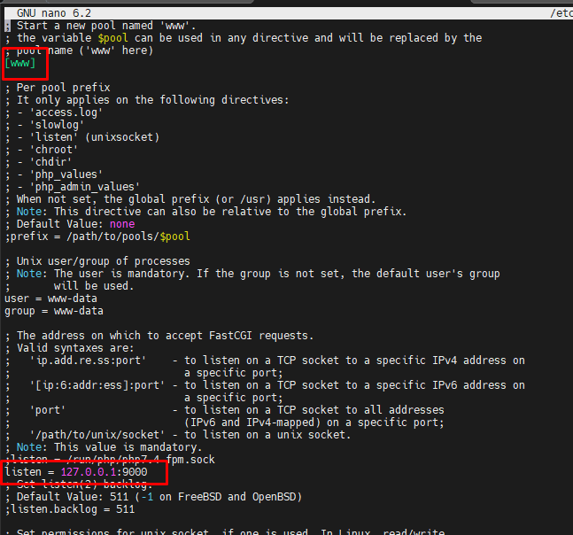
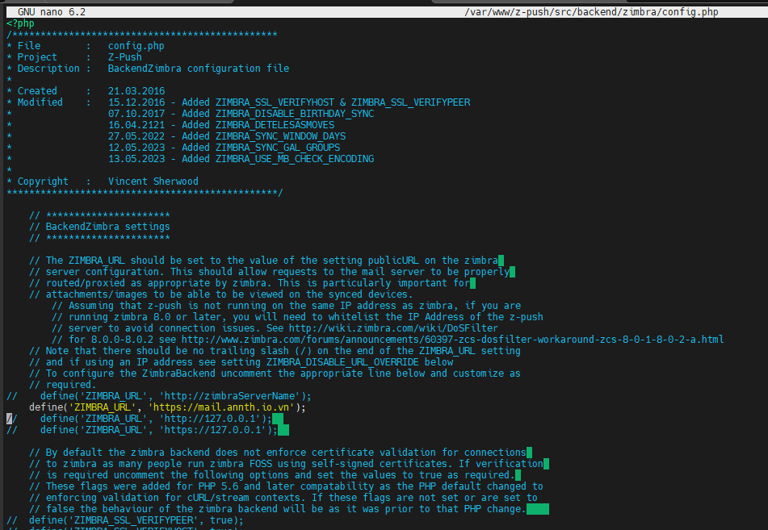
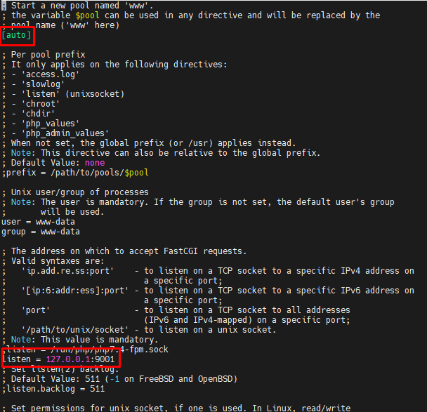
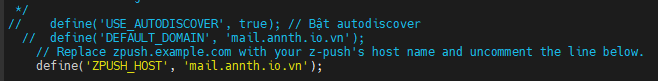
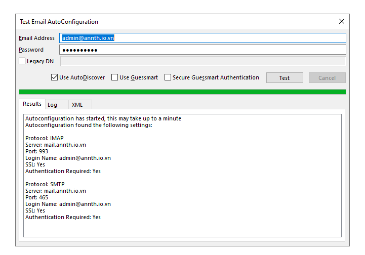
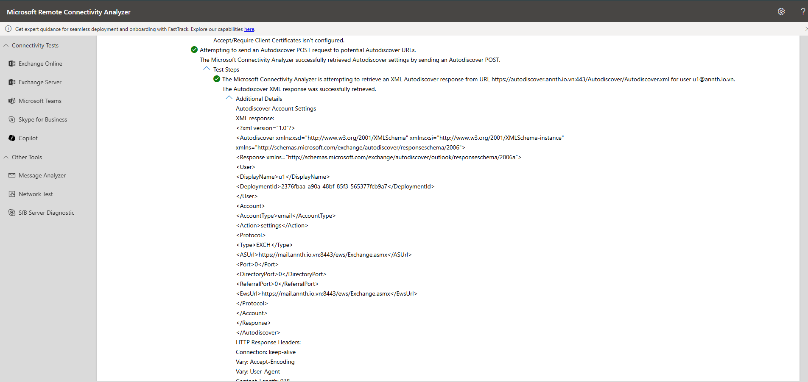

# ActiveSync Autodiscover Zimbra using Z-Push Zimbrabackend 
- Zimbra Collaboration Suite (ZCS) chỉ cung cấp Exchange ActiveSync (EAS) và Autodiscover trong phiên bản Network Edition (trả phí).
- Đối với phiên bản FOSS (Open Source), các tính năng này có thể được bổ sung bằng cách triển khai Z-Push – một máy chủ ActiveSync mã nguồn mở – kết hợp với Zimbra backend để đồng bộ email, danh bạ, lịch và tự động cấu hình (Autodiscover) cho các client như Outlook, iOS Mail, Android Mail.
- Trong hướng dẫn này thực hiện sử dụng z-push và zimbra backend để cấu hình tính năng autodiscover và active sync cho Zimbra FOSS 
	- Z-Push là máy chủ ActiveSync mã nguồn mở, cho phép thiết bị di động và client đồng bộ email, danh bạ, lịch với máy chủ không hỗ trợ EAS gốc.
	- Zimbra Backend (một module của Z-Push) được sử dụng làm lớp trung gian giữa Z-Push và các dịch vụ Zimbra (IMAP/LMTP/CalDAV/CardDAV).
		- Backend này chuyển đổi các lệnh ActiveSync thành các thao tác IMAP (email), CalDAV (lịch), CardDAV (danh bạ) mà Zimbra hỗ trợ sẵn.
- Cấu hình ActiveSync
	- Cài đặt PHP và các thành phần bổ trợ
		```bash
		sudo apt -y install php php-cli php-soap php-mbstring php-curl php-fpm php-intl git
		```
		- Cấu hình PHP-FPM cho ActiveSync: Chỉnh sửa tệp cấu hình PHP-FPM để tạo một pool dịch vụ riêng cho ActiveSync:
			- Mở tệp `www.conf`:
			```bash
			nano /etc/php/7.4/fpm/pool.d/www.conf
			```
			- Điều chỉnh dòng `listen` như sau:
			```
			listen = 127.0.0.1:9000
			```
			- 
		- Khởi động lại dịch vụ `php7.4-fpm`:
		```bash
		systemctl restart php7.4-fpm.service
		```
	- Cài đặt và cấu hình Z-Push
		- Tải và giải nén Z-Push
		```bash
		wget -O z-push.tar.gz https://github.com/Z-Hub/Z-Push/archive/refs/tags/2.7.5.tar.gz
		```
		```bash
		mkdir -p /var/www/z-push
		tar -xf z-push.tar.gz --strip-components=1 -C /var/www/z-push
		```
		- Tải và giải nén Zimbra Backend
		```bash
		wget -O zpushzimbra.tar.gz https://sourceforge.net/projects/zimbrabackend/files/latest/download
		```
		```bash
		mkdir -p /var/www/z-push/backend/zimbra
		tar -xf zpushzimbra.tar.gz --strip-components=1 -C /var/www/z-push/backend/zimbra
		```
		- Tạo thư mục nhật ký và trạng thái: Tạo các thư mục cần thiết cho nhật ký và trạng thái của Z-Push, sau đó gán quyền sở hữu cho người dùng `www-data`:
		```bash
		mkdir -p /var/log/z-push /var/lib/z-push
		chown www-data: /var/log/z-push /var/lib/z-push
		```
		- Cấu hình Z-Push
			- Mở tệp cấu hình chính của Z-Push:
			```bash
			nano /var/www/z-push/src/config.php
			```
			- Thay đổi các thiết lập sau:
				- Tìm dòng: `define('USE_X_FORWARDED_FOR_HEADER', false);`
				- Thay đổi thành: `define('USE_X_FORWARDED_FOR_HEADER', true);`
				- Tìm dòng: `define('BACKEND_PROVIDER', '');`
				- Thay đổi thành: `define('BACKEND_PROVIDER', 'BackendZimbra');`
			- Mở tệp cấu hình Zimbra Backend:
			```bash
			nano /var/www/z-push/src/backend/zimbra/config.php
			```
			- Thêm dòng sau, thay thế `mail.annth.io.vn` bằng URL của máy chủ Zimbra của bạn:
			```php
			define('ZIMBRA_URL', 'https://mail.annth.io.vn');
			```
			- 

	- Cấu hình Nginx Proxy của Zimbra
		- Để Nginx Proxy của Zimbra sử dụng Z-Push cho ActiveSync, hãy chỉnh sửa tệp template Nginx:
		- Mở tệp cấu hình Nginx của Zimbra:
		```bash
		nano /opt/zimbra/conf/nginx/templates/nginx.conf.web.https.default.template
		```
		- Tìm khối `location ^~ /Microsoft-Server-ActiveSync` và thực hiện các thay đổi sau:
			- Thêm `include /etc/nginx-php-fpm.conf;` vào trước phần `# For audit`
		```nginx
		 location ^~ /Microsoft-Server-ActiveSync
		 {
		+# Z-PUSH start
		+include /etc/nginx-php-fpm.conf;
		+# Z-PUSH end
		# For audit
		# ... (giữ nguyên các dòng hiện có) ...
		 }
		```
		- 
		- Tạo tệp `/etc/nginx-php-fpm.conf` với nội dung sau:
		```
		nano /etc/nginx-php-fpm.conf
		```
		```nginx
		fastcgi_param   QUERY_STRING   $query_string;
		fastcgi_param   REQUEST_METHOD $request_method;
		fastcgi_param   CONTENT_TYPE   $content_type;
		fastcgi_param   CONTENT_LENGTH $content_length;
		fastcgi_param   SCRIPT_NAME$fastcgi_script_name;
		fastcgi_param   PATH_INFO  $fastcgi_path_info;
		fastcgi_param   PATH_TRANSLATED$document_root$fastcgi_path_info;
		fastcgi_param   REQUEST_URI$request_uri;
		fastcgi_param   DOCUMENT_URI   $document_uri;
		fastcgi_param   DOCUMENT_ROOT  $document_root;
		fastcgi_param   SERVER_PROTOCOL$server_protocol;
		fastcgi_param   GATEWAY_INTERFACE   CGI/1.1;
		fastcgi_param   SERVER_SOFTWAREnginx/$nginx_version;
		fastcgi_param   REMOTE_ADDR$remote_addr;
		fastcgi_param   REMOTE_PORT$remote_port;
		fastcgi_param   SERVER_ADDR$server_addr;
		fastcgi_param   SERVER_PORT$server_port;
		fastcgi_param   SERVER_NAME$server_name;
		fastcgi_param   HTTPS $https;
		# PHP only, required if PHP was built with --enable-force-cgi-redirect
		fastcgi_param   REDIRECT_STATUS200;
		fastcgi_param HTTP_PROXY "";
		fastcgi_pass 127.0.0.1:9000;
		fastcgi_param SCRIPT_FILENAME /var/www/z-push/index.php;
		client_max_body_size 20m;
		client_body_buffer_size 128k;
		keepalive_timeout  65;
		# max_execution_time is 900
		proxy_read_timeout 910;
		fastcgi_read_timeout 910;
		sendfile  on;
		```
		- 
		
	- Khởi động lại dịch vụ `php7.4-fpm` và proxy của Zimbra:
	```bash
	systemctl restart php7.4-fpm.service
	sudo -u zimbra /opt/zimbra/bin/zmproxyctl restart
	```
	- Lúc này, tính năng ActiveSync đã được cấu hình hoàn tất sử dụng tại `https://mail.annth.io.vn/Microsoft-Server-ActiveSync`.
	- 

- Cấu hình Autodiscover
	- Cấu hình PHP-FPM cho Autodiscover
		- Tạo một pool dịch vụ PHP-FPM riêng cho Autodiscover:
		- Sao chép tệp cấu hình `www.conf`:
		```bash
		cp /etc/php/7.4/fpm/pool.d/www.conf /etc/php/7.4/fpm/pool.d/autodiscover.conf
		```
		- Mở tệp `autodiscover.conf` mới:
		```bash
		nano /etc/php/7.4/fpm/pool.d/autodiscover.conf
		```
		- Điều chỉnh tên pool và dòng `listen` như sau:
		```
		[autodiscover]
		listen = 127.0.0.1:9001
		```
		- 
		
	- Cấu hình Z-Autodiscover
		- Mở tệp cấu hình Autodiscover của Z-Push:
		```bash
		nano /var/www/z-push/src/autodiscover/config.php
		```
		- Thay đổi các thiết lập sau:
		  * Tìm dòng: `define('ZPUSH_HOST', '');`
		  * Thay đổi thành: `define('ZPUSH_HOST', 'mail.annth.io.vn');` (thay bằng tên miền của bạn)
		  * Tìm dòng: `define('BACKEND_PROVIDER', '');`
		  * Thay đổi thành: `define('BACKEND_PROVIDER', 'BackendZimbra');`
		- 
		- 
		  
		- Cập nhật Autodiscover.php cho Outlook
			- Mặc định Z-Push chỉ hỗ trợ Autodiscover cho MobileSync để mở rộng tính năng Autodiscover cần chỉnh sửa tệp `autodiscover.php` mặc định của Z-Push.
			- Đổi tên tệp `autodiscover.php` gốc:
			```bash
			mv /var/www/z-push/src/autodiscover/autodiscover.php /var/www/z-push/src/autodiscover/autodiscover.php.org
			```
			- Tạo tệp `autodiscover.php` mới tại `/var/www/z-push/src/autodiscover/autodiscover.php` với nội dung tại [đây](./files/autodiscover.php) 
			- 
	- Cấu hình Nginx Proxy của Zimbra cho Autodiscover
		- Để Nginx Proxy của Zimbra xử lý các yêu cầu Autodiscover thông qua Z-Push:
		- Mở lại tệp cấu hình Nginx của Zimbra:
		```bash
		nano /opt/zimbra/conf/nginx/templates/nginx.conf.web.https.default.template
		```
		- Tìm khối `location ^~ /autodiscover` và thêm dòng sau vào bên trong khối:
			`include /etc/nginx-php-fpm-auto.conf;` trước phần `# For audit`
		```nginx
		location ^~ /autodiscover
		{
		....
		#Autodiscover
		include /etc/nginx-php-fpm-auto.conf;
		# For audit
		proxy_set_header X-Forwarded-For $proxy_add_x_forwarded_for;
		...
		}
		```
		- 
		- Tạo tệp `/etc/nginx-php-fpm-auto.conf` với nội dung sau:
		```
		nano /etc/nginx-php-fpm-auto.conf
		```
		```nginx
		fastcgi_param   QUERY_STRING   $query_string;
		fastcgi_param   REQUEST_METHOD $request_method;
		fastcgi_param   CONTENT_TYPE   $content_type;
		fastcgi_param   CONTENT_LENGTH $content_length;
		fastcgi_param   SCRIPT_NAME$fastcgi_script_name;
		fastcgi_param   PATH_INFO  $fastcgi_path_info;
		fastcgi_param   PATH_TRANSLATED$document_root$fastcgi_path_info;
		fastcgi_param   REQUEST_URI$request_uri;
		fastcgi_param   DOCUMENT_URI   $document_uri;
		fastcgi_param   DOCUMENT_ROOT  $document_root;
		fastcgi_param   SERVER_PROTOCOL$server_protocol;
		fastcgi_param   GATEWAY_INTERFACE   CGI/1.1;
		fastcgi_param   SERVER_SOFTWAREnginx/$nginx_version;
		fastcgi_param   REMOTE_ADDR$remote_addr;
		fastcgi_param   REMOTE_PORT$remote_port;
		fastcgi_param   SERVER_ADDR$server_addr;
		fastcgi_param   SERVER_PORT$server_port;
		fastcgi_param   SERVER_NAME$server_name;
		fastcgi_param   HTTPS $https;
		# PHP only, required if PHP was built with --enable-force-cgi-redirect
		fastcgi_param   REDIRECT_STATUS200;
		fastcgi_param HTTP_PROXY "";
		fastcgi_pass 127.0.0.1:9001;
		fastcgi_param SCRIPT_FILENAME /var/www/z-push/src/autodiscover/autodiscover.php;
		client_max_body_size 20m;
		client_body_buffer_size 128k;
		keepalive_timeout  65;
		# max_execution_time is 900
		#proxy_read_timeout 910;
		fastcgi_read_timeout 910;
		sendfile  on;
		```
		- 
		
	- Khởi động lại dịch vụ `php7.4-fpm` và proxy của Zimbra:
	```bash
	systemctl restart php7.4-fpm.service
	sudo -u zimbra /opt/zimbra/bin/zmproxyctl restart
	```
	- Sau khi hoàn tất các bước trên, tính năng Autodiscover được cấu hình tại `https://mail.annth.io.vn/autodiscover`.
	- Các thiết bị và ứng dụng email có thể sử dụng ActiveSync và Autodiscover để đồng bộ hóa với Zimbra FOSS.
	- 
	
- Kiểm tra sử dụng công cụ test của Outlook 
	- 
	- 
- Kiểm tra bằng Microsoft Remote Connectivity Analyzer
	- 
