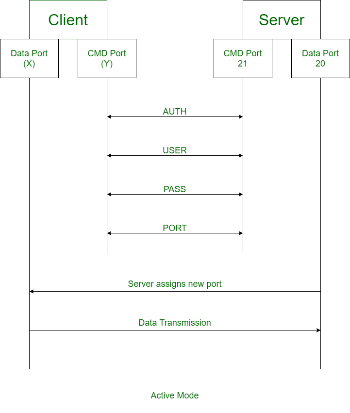

# FTP 
## 1. Tổng quan về FTP Server
- FTP hay File Tranfer Protocol là một giao thức truyền tải tệp tin được sử dụng để chia sẻ và truyền tải dữ liệu giữa các máy tính trên mạng Internet. Nó cho phép người dùng truy cập và truyền tải các tệp tin từ một máy tính (máy gửi) đến một máy tính khác (máy nhận) thông qua kết nối mạng. 
- FTP hoạt động dựa trên mô hình máy khách-máy chủ (client-server). Máy khách FTP (FTP client) là một chương trình chạy trên máy tính của người dùng, cho phép họ giao tiếp và lấy tệp từ các máy tính từ xa. Nó bao gồm một bộ các lệnh thiết lập kết nối giữa hai máy chủ, hỗ trợ truyền tệp và sau đó đóng kết nối.
- FTP hoạt động theo mô hình hai hướng là nhận và truyền dữ liệu giữa máy chủ Server và máy khách Client. Control Connection và Data Connection là hai tiến trình TCP tạo ra quy trình nhận cũng như truyền dữ liệu của Server và Client. 
	- Control Connection kiểm soát kết nối trong suốt quá trình truyền và nhận dữ liệu. 
	- Data Connection thực hiện kết nối các dữ liệu qua lại giữa server và client.
- Hoạt động dựa trên mô hình client-server. FTP gồm các thành phần chính: FTP server, FTP client, và kết nối mạng.
	- FTP server Là nơi lưu trữ file và cung cấp dịch vụ truyền tải dữ liệu cho các client, quản lý người dùng, phân quyền truy cập, theo dõi và ghi nhật ký hoạt động....
	- FTP client Là thiết bị (máy tính, laptop, thiết bị IoT...) dùng để kết nối đến FTP Server và thao tác với file.
	- Kết nối mạng Là phương tiện trung gian giúp client và server giao tiếp qua giao thức FTP trên mạng TCP/IP. (Port 20/21)
- Vai trò của FTP server trong việc truyền tải dữ liệu. 
	- Lưu trữ và Quản lý Tệp: Máy chủ FTP cung cấp một vị trí tập trung để lưu trữ và quản lý các tệp. Điều này giúp các tổ chức dễ dàng duy trì và sắp xếp dữ liệu của họ.
	- Chia sẻ và Phân phối Tệp: Máy chủ FTP cho phép chia sẻ và phân phối tệp hiệu quả giữa những người dùng. Điều này đặc biệt hữu ích cho các tổ chức cần phân phối các bản cập nhật phần mềm, bản vá lỗi hoặc các bộ dữ liệu lớn.
	- Truy cập Tệp Từ xa: Người dùng có thể truy cập các tệp trên máy chủ FTP từ bất kỳ vị trí nào có kết nối internet. Khả năng truy cập từ xa này là vô giá đối với các doanh nghiệp có đội ngũ phân tán về mặt địa lý.
	- Sao lưu và Phục hồi: Máy chủ FTP thường được sử dụng làm giải pháp sao lưu. Các tệp quan trọng có thể được tải lên máy chủ thường xuyên, đảm bảo rằng dữ liệu được bảo toàn và có thể được phục hồi trong trường hợp phần cứng cục bộ bị lỗi.
	- Quy trình Tự động: Nhiều tổ chức sử dụng máy chủ FTP để tự động hóa các quy trình truyền tệp. Các tập lệnh và ứng dụng có thể tương tác với máy chủ FTP để tải lên hoặc tải xuống tệp mà không cần sự can thiệp của con người, giúp tinh giản quy trình làm việc.
- So sánh FTP với các giao thức khác (SFTP, FTPS, HTTP, SCP). 

| Tiêu chí            | FTP                                   | SFTP                                     | SCP                              | HTTPS                                        |
| ------------------- | ------------------------------------- | ---------------------------------------- | -------------------------------- | -------------------------------------------- |
| Bảo mật             | Không mã hóa                          | Mã hóa toàn bộ bằng SSH                  | Mã hóa bằng SSH                  | Mã hóa bằng SSL/TLS                          |
| Giao thức nền       | TCP (Port 21), không bảo mật          | SSH (Port 22)                            | SSH (Port 22)                    | HTTP + SSL/TLS (Port 443)                    |
| Quản lý file        | Có (upload, download, rename, delete) | Đầy đủ (upload, download, chmod, rename) | Không (chỉ copy file)            | Hạn chế (thường chỉ download/upload qua web) |
| Tốc độ              | Nhanh                                 | Trung bình (do mã hóa)                   | Thường nhanh hơn SFTP            | Phụ thuộc vào trình duyệt/web server         |
| Xác thực            | Username/password đơn giản            | SSH Key hoặc username/password           | SSH Key hoặc username/password   | Chứng chỉ số (SSL/TLS), cookie, token        |
| Ứng dụng phổ biến   | Web hosting, truyền file nội bộ cũ    | Quản lý file an toàn giữa máy chủ        | Sao chép file nhanh giữa máy chủ | Truy cập website, tải tài liệu an toàn       |

- FTP Commands

| No. | Lệnh            | Ý nghĩa                                                      |
| --- | --------------- | ------------------------------------------------------------ |
| 1   | `cd`            | Thay đổi thư mục làm việc trên máy chủ từ xa                 |
| 2   | `close`         | Đóng kết nối FTP hiện tại                                    |
| 3   | `quit`          | Thoát khỏi chương trình FTP                                  |
| 4   | `pwd`           | Hiển thị thư mục làm việc hiện tại trên máy chủ từ xa        |
| 5   | `dir` hoặc `ls` | Liệt kê danh sách thư mục tại thư mục làm việc hiện tại      |
| 6   | `help`          | Hiển thị danh sách các lệnh FTP của phía client (người dùng) |
| 7   | `remotehelp`    | Hiển thị danh sách các lệnh FTP của phía server (máy chủ)    |
| 8   | `type`          | Thiết lập kiểu tệp khi truyền (ví dụ: ASCII hoặc nhị phân)   |
| 9   | `struct`        | Xác định cấu trúc tệp khi truyền (ví dụ: file, record, page) |

- Ưu điểm của FTP
	- Chuyển giao nhiều tệp: FTP hỗ trợ chuyển giao nhiều tệp lớn giữa các hệ thống.
	- Hiệu quả: FTP giúp sắp xếp và chuyển giao các tệp một cách hiệu quả qua mạng.
	- Bảo mật: FTP chỉ cấp quyền truy cập cho người dùng thông qua ID và mật khẩu. Hơn nữa, máy chủ có thể tạo nhiều cấp độ truy cập.
	- Chuyển giao liên tục: Nếu quá trình chuyển giao tệp bị gián đoạn, người dùng có thể tiếp tục chuyển tệp bất cứ khi nào kết nối được thiết lập lại.
	- Đơn giản: FTP rất đơn giản để triển khai và sử dụng, do đó nó là một kết nối được sử dụng rộng rãi.
	- Tốc độ: Đây là cách nhanh nhất để chuyển tệp từ máy tính này sang máy tính khác.
- Nhược điểm của FTP
	- Bảo mật thấp: FTP không cung cấp tính năng mã hóa khi chuyển tệp. Hơn nữa, tên người dùng và mật khẩu ở dạng văn bản thuần túy, không phải là sự kết hợp của ký hiệu, chữ số và chữ cái, điều này khiến chúng dễ bị tin tặc tấn công.
	- Công nghệ cũ: FTP là một trong những giao thức lâu đời nhất và do đó nó sử dụng nhiều kết nối TCP/IP để chuyển tệp. Các kết nối này thường bị cản trở bởi tường lửa.
	- Virus: Kết nối FTP rất khó quét virus, điều này làm tăng nguy cơ dễ bị tấn công.
	- Hạn chế: FTP cung cấp quyền truy cập người dùng và truy cập thiết bị di động rất hạn chế.
	- Bộ nhớ và lập trình: FTP yêu cầu nhiều bộ nhớ và nỗ lực lập trình hơn, vì rất khó tìm lỗi nếu không có các lệnh.

2. Nguyên lý hoạt động của FTP
- Mô hình client-server trong FTP.
	- 
	- FTP là một giao thức máy khách-máy chủ có hai kênh liên lạc: kênh lệnh dùng để điều khiển cuộc trò chuyện và kênh dữ liệu dùng cho nội dung tệp.
	- Các bước FTP hoạt động như sau:
		- Người dùng phải đăng nhập vào Máy chủ FTP trước tiên. Có một số máy chủ cho phép truy cập nội dung mà không cần đăng nhập, được gọi là FTP ẩn danh.
		- Máy khách có thể bắt đầu cuộc trò chuyện với máy chủ khi yêu cầu tải xuống một tệp.
		- Người dùng có thể thực hiện các chức năng khác nhau trên máy chủ như tải lên, xóa, đổi tên, sao chép tệp, v.v.
- Cơ chế kết nối:
	- FTP sử dụng hai loại kết nối chính: Kết nối điều khiển (Control Connection) và Kết nối dữ liệu (Data Connection).
		- Kết nối điều khiển được FTP sử dụng để gửi các thông tin điều khiển như định danh người dùng, mật khẩu, lệnh thay đổi thư mục từ xa, lệnh truy xuất và lưu trữ tệp, v.v. Kết nối điều khiển được khởi tạo trên cổng số 21.
		- Kết nối dữ liệu được FTP sử dụng để gửi các tệp thực tế. Một kết nối dữ liệu được khởi tạo trên cổng số 20.
		- FTP gửi thông tin điều khiển out-of-band (ngoài dải) vì nó sử dụng một kết nối điều khiển riêng biệt. Một số giao thức khác gửi các dòng tiêu đề yêu cầu và phản hồi cùng với dữ liệu trong cùng một kết nối TCP. Vì lý do này, chúng được cho là gửi thông tin điều khiển in-band (trong dải). HTTP và SMTP là những ví dụ điển hình cho việc này.
	- FTP hoạt động trên 2 mode là Active và Passive:
		- Active FTP là một chế độ của FTP, trong đó máy khách khởi tạo kết nối trên một cổng và chờ máy chủ thiết lập kết nối với nó. Ở chế độ hoạt động này, máy khách mở kênh lệnh và máy chủ mở kênh dữ liệu. Ở một mức độ nào đó, điều này có thể dẫn đến các thách thức bảo mật vì máy khách phải mở các cổng cho các kết nối đến.
			- 
			- Ưu điểm của Active FTP:
				- Cấu hình máy chủ đơn giản hơn: Vì máy chủ là bên mở kết nối dữ liệu, điều này giảm thiểu độ phức tạp của máy chủ.
				- Hiệu quả cho các mạng đáng tin cậy: Nó đặc biệt hiệu quả khi máy khách và máy chủ nằm trong cùng một mạng đáng tin cậy.
			- Nhược điểm của Active FTP
				- Vấn đề tường lửa: Hầu hết các tường lửa giới hạn các kết nối đến và điều đó khiến Active FTP trở thành một giải pháp khó khăn.
				- Không lý tưởng cho bảo mật máy khách: Ảnh hưởng đến khả năng truy cập của máy khách bằng cách yêu cầu họ mở các cổng, nghĩa là các bên không xác định có thể dễ dàng truy cập vào mạng.
		- Passive FTP 
			- 
			- Passive FTP cho phép máy khách mở cả kết nối lệnh và kết nối dữ liệu, điều này làm cho nó phù hợp hơn khi làm việc với tường lửa hoặc NAT (Network Address Translation). Máy chủ sẽ thông báo cho máy khách về cổng cần thiết lập cho kênh dữ liệu.
			- Ưu điểm của Passive FTP
				- Thân thiện với tường lửa: Ưu điểm này xuất phát từ việc tất cả các kết nối trong mô hình máy khách-máy chủ đều do máy khách thực hiện, giúp dễ dàng tương thích với tường lửa và NAT.
				- Bảo mật nâng cao:	Giảm thiểu rủi ro bảo mật vì các kết nối đến mặc định của máy khách được giảm thiểu và kiểm soát.
			- Nhược điểm của Passive FTP
				- Phức tạp trong cấu hình máy chủ: Yêu cầu máy chủ phải xử lý nhiều cổng cũng như kết nối, điều này gây ra mức độ khó khăn cao hơn.
				- Sử dụng tài nguyên cao hơn: Khi cấu hình phía máy chủ phức tạp hơn có thể dẫn tới nhiều tài nguyên hơn đang được sử dụng.
- Quy trình xác thực (anonymous vs. authenticated users).
	- Anonymous Users (Người dùng ẩn danh)
		- Mục đích: Cho phép người dùng truy cập vào một số tài nguyên FTP công khai mà không cần tài khoản cá nhân.
		- Cách hoạt động:
			- Người dùng kết nối đến máy chủ FTP.
			- Khi được yêu cầu tên đăng nhập (username), người dùng nhập anonymous hoặc ftp.
			- Máy chủ sẽ yêu cầu nhập mật khẩu, lúc này người dùng thường nhập địa chỉ email của mình (hoặc một chuỗi bất kỳ).
			- Máy chủ chấp nhận đăng nhập mà không kiểm tra mật khẩu thật sự.
		- Quyền truy cập bị giới hạn, chỉ có thể tải file từ các thư mục công khai. Không có quyền ghi, xóa hoặc thay đổi file trên máy chủ.
		- Ví dụ đăng nhập vào một máy chủ cho phéo anonymous user 
		- 
	- Authenticated Users (Người dùng xác thực)
		- Mục đích: Cung cấp quyền truy cập bảo mật hơn cho người dùng đã được cấp tài khoản.
		- Cách hoạt động:
			- Người dùng kết nối đến máy chủ FTP.
			- Khi được yêu cầu tên đăng nhập, người dùng nhập tên tài khoản của mình.
			- Máy chủ yêu cầu mật khẩu.
			- Người dùng nhập mật khẩu tương ứng với tài khoản.
			- Máy chủ kiểm tra thông tin đăng nhập:
				- Nếu chính xác, người dùng được phép truy cập và thao tác theo quyền được cấp (đọc, ghi, sửa, xóa).
				- Nếu sai, kết nối bị từ chối hoặc yêu cầu đăng nhập lại.
		- Cần có tài khoản và mật khẩu hợp lệ. An toàn, cho phép quản lý quyền truy cập cụ thể cho từng người dùng.
		- Ví dụ đăng nhập vào máy chủ có user/pass
		- 

3. Các loại FTP Server
- Anonymous FTP: 
	- Cho phép người dùng truy cập mà không cần tài khoản cá nhân (chỉ cần dùng anonymous làm tên đăng nhập).
	- Thường dùng để phân phối phần mềm mã nguồn mở, tài liệu công khai.
	- Ưu điểm: Dễ truy cập, không yêu cầu xác thực.
	- Nhược điểm: Thiếu bảo mật, không kiểm soát được ai đang truy cập.
- Authenticated FTP: 
	- Người dùng phải đăng nhập bằng tên tài khoản và mật khẩu hợp lệ để truy cập.
	- Ứng dụng: Dùng trong các hệ thống nội bộ, doanh nghiệp.
	- Ưu điểm: Bảo mật hơn, dễ kiểm soát quyền truy cập.
	- Nhược điểm: Yêu cầu quản lý người dùng và mật khẩu.
- FTPS (FTP Secure):  
	- Mở rộng từ FTP chuẩn, sử dụng SSL/TLS để mã hóa dữ liệu truyền tải.
	- FTPS hoạt động giống FTP nhưng được tăng cường an toàn bằng mã hóa SSL/TLS.
	- Ưu điểm của Giao thức FTPS:
		- Bảo mật tốt: Mã hóa SSL/TLS đảm bảo an toàn cho dữ liệu.
		- Tương thích với giao thức FTP truyền thống: Phù hợp với những hệ thống đã sử dụng FTP.
		- Hỗ trợ chứng chỉ số: Tăng cường xác thực danh tính.
	- Nhược điểm của FTPS:
		- Cấu hình phức tạp: Cần cài đặt và quản lý chứng chỉ SSL/TLS.
		- Khó quản lý tường lửa: Sử dụng nhiều cổng (một cho kênh điều khiển và nhiều cổng cho kênh dữ liệu).
		- Chậm hơn FTP: Quá trình mã hóa khiến tốc độ truyền tải chậm hơn so với FTP truyền thống.
- SFTP (SSH File Transfer Protocol): 
	- Giao thức truyền tệp được tích hợp bảo mật nhờ việc sử dụng giao thức SSH (Secure Shell). Toàn bộ dữ liệu truyền qua SFTP đều được mã hóa.
	- SFTP hoạt động trên một kênh duy nhất (thường là cổng 22), và sử dụng cơ chế mã hóa SSH để đảm bảo an toàn. Điều này giúp giảm thiểu các lỗ hổng bảo mật và đơn giản hóa việc quản lý kết nối so với các giao thức khác như FTP hoặc FTPS.
	- SFTP dựa vào cơ chế mã hóa của SSH để bảo vệ dữ liệu. Toàn bộ thông tin truyền đi, bao gồm dữ liệu tệp, thông tin đăng nhập, và lệnh, đều được mã hóa nhằm ngăn chặn các hành vi nghe lén hoặc tấn công đánh cắp dữ liệu.
	- SFTP hỗ trợ quản lý quyền truy cập và phân quyền chặt chẽ, giúp tăng cường tính an toàn trong việc chia sẻ dữ liệu giữa các người dùng hoặc hệ thống.
	- Ưu điểm của SFTP:
		- Bảo mật cao: SFTP mã hóa các dữ liệu truyền tải, bảo vệ chống tấn công và đánh cắp dữ liệu.
		- Hoạt động trên một cổng: Giúp dễ cấu hình tường lửa và giảm nguy cơ xung đột.
		- Hỗ trợ xác thực khóa SSH: Tăng cường bảo mật bằng cách sử dụng xác thực không chỉ dựa vào mật khẩu.
	- Nhược điểm của SFTP:
		- Cài đặt phức tạp hơn: Yêu cầu hiểu biết về giao thức SSH.
		- Tốc độ chậm hơn FTP: Do cơ chế mã hóa, SFTP thường chậm hơn một chút so với FTP.
- So sánh FTPS, SFTP 

| Tiêu chí                  | SFTP (Secure Shell File Transfer Protocol)                            | FTPS (File Transfer Protocol Secure)                                      |
| ------------------------- | --------------------------------------------------------------------- | ------------------------------------------------------------------------- |
| Cơ chế giao tiếp mạng     | Xây dựng dựa trên SSH, bổ sung khả năng truyền tệp.                   | Xây dựng dựa trên FTP, thêm lớp mã hóa SSL/TLS.                           |
| Hỗ trợ tường lửa          | Dễ dàng cấu hình vì chỉ dùng một cổng duy nhất.                       | Cần nhiều cổng (control + data) → khó cấu hình tường lửa.                 |
| Tốc độ truyền tải         | Chậm hơn do mã hóa toàn bộ và overhead cao.                           | Nhanh hơn, hoạt động gọn nhẹ hơn SFTP.                                    |
| Chế độ truyền dữ liệu     | Chỉ hỗ trợ binary (nhị phân), không chọn được ASCII.                  | Hỗ trợ cả binary và ASCII, tiện cho xử lý văn bản/logs.                   |
| Khả năng tương thích .NET | Không được hỗ trợ tốt trong môi trường .NET.                          | Tích hợp tốt với .NET và có nhiều API hỗ trợ FTPS.                        |
| Cơ chế xác thực           | Xác thực thông qua SSH keys, không cần chứng chỉ số.                  | Cần chứng chỉ số (SSL/TLS certificate) để xác thực máy chủ.               |
| Câu lệnh hỗ trợ           | Hỗ trợ nhiều lệnh nâng cao, ví dụ phân quyền, đổi tên file, v.v.      | Hỗ trợ ít lệnh hơn, ít quyền kiểm soát hơn với thư mục và tệp tin từ xa.  |
| Mức độ phổ biến           | Phổ biến rộng rãi, được hầu hết các hệ thống và dịch vụ cloud hỗ trợ. | Ít phổ biến hơn; FTP nói chung đang dần bị thay thế bởi HTTPS, SFTP, v.v. |

4. Phần mềm FTP Server phổ biến
•  FileZilla Server (miễn phí, mã nguồn mở). 
•  vsftpd (Very Secure FTP Daemon, phổ biến trên Linux). 
•  ProFTPD (cấu hình linh hoạt, mã nguồn mở). 
•  Microsoft IIS FTP (tích hợp trên Windows Server). 
•  Pure-FTPd, Cerberus FTP, và các phần mềm thương mại khác.
5. Cài đặt và cấu hình FTP Server
•        •  Yêu cầu hệ thống: Phần cứng, hệ điều hành (Windows, Linux, macOS). 
•        •  Hướng dẫn cài đặt từng loại phần mềm FTP server. 
•        •  Cấu hình cơ bản: Thiết lập người dùng, thư mục, quyền truy cập. 
•        •  Tùy chỉnh cổng, giới hạn băng thông, và nhật ký (log).
6. Bảo mật FTP Server 
•        Các rủi ro bảo mật: Truyền dữ liệu không mã hóa, tấn công brute force.
•        Cách bảo vệ: Sử dụng FTPS hoặc SFTP, giới hạn IP truy cập.
•        Quản lý tài khoản: Chính sách mật khẩu mạnh, vô hiệu hóa anonymous access.
•        Cập nhật phần mềm thường xuyên để vá lỗ hổng.
7.  Ứng dụng thực tế của FTP Server 
•        Chia sẻ file trong nội bộ doanh nghiệp.
•        Lưu trữ và truyền tải dữ liệu lớn (backup, media, v.v.).
•        Tích hợp với các hệ thống web hosting.
•        Sử dụng trong phát triển phần mềm (triển khai mã nguồn).
8. Hiệu suất và tối ưu hóa 
•        Tối ưu băng thông và tốc độ truyền tải.
•        Quản lý số lượng kết nối đồng thời.
•        Sử dụng nén file trước khi truyền.
•        Giám sát hiệu suất và khắc phục sự cố (timeout, kết nối bị gián đoạn).
9.  Các công cụ và giao thức liên quan 
•        FTP client phổ biến: FileZilla, WinSCP, Cyberduck.
•        Tích hợp với các công cụ quản lý file (Windows Explorer, Total Commander).
•        So sánh với các dịch vụ lưu trữ đám mây (Google Drive, Dropbox).
10. Khắc phục sự cố thường gặp 
•        Lỗi kết nối: Kiểm tra firewall, NAT, và cấu hình cổng.
•        Lỗi quyền truy cập: Xem lại quyền thư mục và tài khoản người dùng.
•        Vấn đề hiệu suất: Kiểm tra băng thông, cấu hình Active/Passive.
11. Thực hành
11.1   Cài đặt FTP Server trên Ubuntu vsftpd.
•  Kết nối từ client bằng FileZilla/WinSCP.
•  Thiết lập chế độ passive mode.
11.2  Cài đặt FTP Server trên Windows.
•  Kết nối từ client bằng FileZilla/WinSCP.
•  Thiết lập chế độ passive mode.