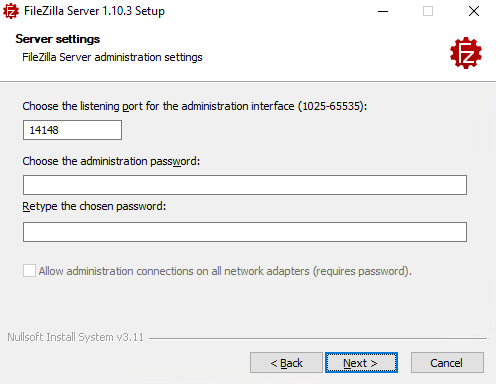
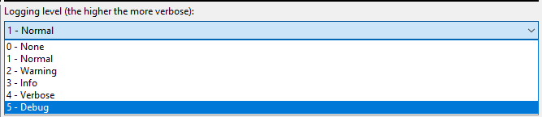
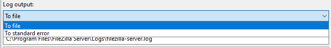
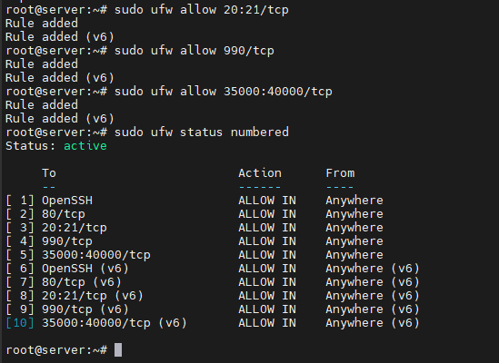
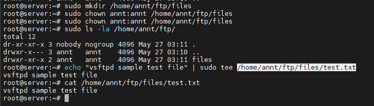
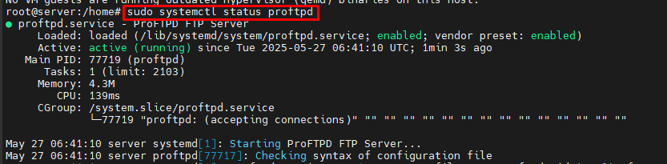

# FTP 
## 1. Tổng quan về FTP Server
- FTP hay File Tranfer Protocol là một giao thức truyền tải tệp tin được sử dụng để chia sẻ và truyền tải dữ liệu giữa các máy tính trên mạng Internet. Nó cho phép người dùng truy cập và truyền tải các tệp tin từ một máy tính (máy gửi) đến một máy tính khác (máy nhận) thông qua kết nối mạng. 
- FTP hoạt động dựa trên mô hình máy khách-máy chủ (client-server). Máy khách FTP (FTP client) là một chương trình chạy trên máy tính của người dùng, cho phép họ giao tiếp và lấy tệp từ các máy tính từ xa. Nó bao gồm một bộ các lệnh thiết lập kết nối giữa hai máy chủ, hỗ trợ truyền tệp và sau đó đóng kết nối.
- FTP hoạt động theo mô hình hai hướng là nhận và truyền dữ liệu giữa máy chủ Server và máy khách Client. Control Connection và Data Connection là hai tiến trình TCP tạo ra quy trình nhận cũng như truyền dữ liệu của Server và Client. 
	- Control Connection kiểm soát kết nối trong suốt quá trình truyền và nhận dữ liệu. 
	- Data Connection thực hiện kết nối các dữ liệu qua lại giữa server và client.
- Hoạt động dựa trên mô hình client-server. FTP gồm các thành phần chính: FTP server, FTP client, và kết nối mạng.
	- FTP server Là nơi lưu trữ file và cung cấp dịch vụ truyền tải dữ liệu cho các client, quản lý người dùng, phân quyền truy cập, theo dõi và ghi nhật ký hoạt động....
	- FTP client Là thiết bị (máy tính, laptop, thiết bị IoT...) dùng để kết nối đến FTP Server và thao tác với file.
	- Kết nối mạng Là phương tiện trung gian giúp client và server giao tiếp qua giao thức FTP trên mạng TCP/IP. (Port 20/21)
- Vai trò của FTP server trong việc truyền tải dữ liệu. 
	- Lưu trữ và Quản lý Tệp: Máy chủ FTP cung cấp một vị trí tập trung để lưu trữ và quản lý các tệp. Điều này giúp các tổ chức dễ dàng duy trì và sắp xếp dữ liệu của họ.
	- Chia sẻ và Phân phối Tệp: Máy chủ FTP cho phép chia sẻ và phân phối tệp hiệu quả giữa những người dùng. Điều này đặc biệt hữu ích cho các tổ chức cần phân phối các bản cập nhật phần mềm, bản vá lỗi hoặc các bộ dữ liệu lớn.
	- Truy cập Tệp Từ xa: Người dùng có thể truy cập các tệp trên máy chủ FTP từ bất kỳ vị trí nào có kết nối internet. Khả năng truy cập từ xa này là vô giá đối với các doanh nghiệp có đội ngũ phân tán về mặt địa lý.
	- Sao lưu và Phục hồi: Máy chủ FTP thường được sử dụng làm giải pháp sao lưu. Các tệp quan trọng có thể được tải lên máy chủ thường xuyên, đảm bảo rằng dữ liệu được bảo toàn và có thể được phục hồi trong trường hợp phần cứng cục bộ bị lỗi.
	- Quy trình Tự động: Nhiều tổ chức sử dụng máy chủ FTP để tự động hóa các quy trình truyền tệp. Các tập lệnh và ứng dụng có thể tương tác với máy chủ FTP để tải lên hoặc tải xuống tệp mà không cần sự can thiệp của con người, giúp tinh giản quy trình làm việc.
- So sánh FTP với các giao thức khác (SFTP, FTPS, HTTP, SCP). 

| Tiêu chí            | FTP                                   | SFTP                                     | SCP                              | HTTPS                                        |
| ------------------- | ------------------------------------- | ---------------------------------------- | -------------------------------- | -------------------------------------------- |
| Bảo mật             | Không mã hóa                          | Mã hóa toàn bộ bằng SSH                  | Mã hóa bằng SSH                  | Mã hóa bằng SSL/TLS                          |
| Giao thức nền       | TCP (Port 21), không bảo mật          | SSH (Port 22)                            | SSH (Port 22)                    | HTTP + SSL/TLS (Port 443)                    |
| Quản lý file        | Có (upload, download, rename, delete) | Đầy đủ (upload, download, chmod, rename) | Không (chỉ copy file)            | Hạn chế (thường chỉ download/upload qua web) |
| Tốc độ              | Nhanh                                 | Trung bình (do mã hóa)                   | Thường nhanh hơn SFTP            | Phụ thuộc vào trình duyệt/web server         |
| Xác thực            | Username/password đơn giản            | SSH Key hoặc username/password           | SSH Key hoặc username/password   | Chứng chỉ số (SSL/TLS), cookie, token        |
| Ứng dụng phổ biến   | Web hosting, truyền file nội bộ cũ    | Quản lý file an toàn giữa máy chủ        | Sao chép file nhanh giữa máy chủ | Truy cập website, tải tài liệu an toàn       |

- FTP Commands

| No. | Lệnh            | Ý nghĩa                                                      |
| --- | --------------- | ------------------------------------------------------------ |
| 1   | `cd`            | Thay đổi thư mục làm việc trên máy chủ từ xa                 |
| 2   | `close`         | Đóng kết nối FTP hiện tại                                    |
| 3   | `quit`          | Thoát khỏi chương trình FTP                                  |
| 4   | `pwd`           | Hiển thị thư mục làm việc hiện tại trên máy chủ từ xa        |
| 5   | `dir` hoặc `ls` | Liệt kê danh sách thư mục tại thư mục làm việc hiện tại      |
| 6   | `help`          | Hiển thị danh sách các lệnh FTP của phía client (người dùng) |
| 7   | `remotehelp`    | Hiển thị danh sách các lệnh FTP của phía server (máy chủ)    |
| 8   | `type`          | Thiết lập kiểu tệp khi truyền (ví dụ: ASCII hoặc nhị phân)   |
| 9   | `struct`        | Xác định cấu trúc tệp khi truyền (ví dụ: file, record, page) |

- Ưu điểm của FTP
	- Chuyển giao nhiều tệp: FTP hỗ trợ chuyển giao nhiều tệp lớn giữa các hệ thống.
	- Hiệu quả: FTP giúp sắp xếp và chuyển giao các tệp một cách hiệu quả qua mạng.
	- Bảo mật: FTP chỉ cấp quyền truy cập cho người dùng thông qua ID và mật khẩu. Hơn nữa, máy chủ có thể tạo nhiều cấp độ truy cập.
	- Chuyển giao liên tục: Nếu quá trình chuyển giao tệp bị gián đoạn, người dùng có thể tiếp tục chuyển tệp bất cứ khi nào kết nối được thiết lập lại.
	- Đơn giản: FTP rất đơn giản để triển khai và sử dụng, do đó nó là một kết nối được sử dụng rộng rãi.
	- Tốc độ: Đây là cách nhanh nhất để chuyển tệp từ máy tính này sang máy tính khác.
- Nhược điểm của FTP
	- Bảo mật thấp: FTP không cung cấp tính năng mã hóa khi chuyển tệp. Hơn nữa, tên người dùng và mật khẩu ở dạng văn bản thuần túy, không phải là sự kết hợp của ký hiệu, chữ số và chữ cái, điều này khiến chúng dễ bị tin tặc tấn công.
	- Công nghệ cũ: FTP là một trong những giao thức lâu đời nhất và do đó nó sử dụng nhiều kết nối TCP/IP để chuyển tệp. Các kết nối này thường bị cản trở bởi tường lửa.
	- Virus: Kết nối FTP rất khó quét virus, điều này làm tăng nguy cơ dễ bị tấn công.
	- Hạn chế: FTP cung cấp quyền truy cập người dùng và truy cập thiết bị di động rất hạn chế.
	- Bộ nhớ và lập trình: FTP yêu cầu nhiều bộ nhớ và nỗ lực lập trình hơn, vì rất khó tìm lỗi nếu không có các lệnh.

## 2. Nguyên lý hoạt động của FTP
- Mô hình client-server trong FTP.
	- 
	- FTP là một giao thức máy khách-máy chủ có hai kênh liên lạc: kênh lệnh dùng để điều khiển cuộc trò chuyện và kênh dữ liệu dùng cho nội dung tệp.
	- Các bước FTP hoạt động như sau:
		- Người dùng phải đăng nhập vào Máy chủ FTP trước tiên. Có một số máy chủ cho phép truy cập nội dung mà không cần đăng nhập, được gọi là FTP ẩn danh.
		- Máy khách có thể bắt đầu cuộc trò chuyện với máy chủ khi yêu cầu tải xuống một tệp.
		- Người dùng có thể thực hiện các chức năng khác nhau trên máy chủ như tải lên, xóa, đổi tên, sao chép tệp, v.v.
- Cơ chế kết nối:
	- FTP sử dụng hai loại kết nối chính: Kết nối điều khiển (Control Connection) và Kết nối dữ liệu (Data Connection).
		- Kết nối điều khiển được FTP sử dụng để gửi các thông tin điều khiển như định danh người dùng, mật khẩu, lệnh thay đổi thư mục từ xa, lệnh truy xuất và lưu trữ tệp, v.v. Kết nối điều khiển được khởi tạo trên cổng số 21.
		- Kết nối dữ liệu được FTP sử dụng để gửi các tệp thực tế. Một kết nối dữ liệu được khởi tạo trên cổng số 20.
		- FTP gửi thông tin điều khiển out-of-band (ngoài dải) vì nó sử dụng một kết nối điều khiển riêng biệt. Một số giao thức khác gửi các dòng tiêu đề yêu cầu và phản hồi cùng với dữ liệu trong cùng một kết nối TCP. Vì lý do này, chúng được cho là gửi thông tin điều khiển in-band (trong dải). HTTP và SMTP là những ví dụ điển hình cho việc này.
	- FTP hoạt động trên 2 mode là Active và Passive:
		- Active FTP là một chế độ của FTP, trong đó máy khách khởi tạo kết nối trên một cổng và chờ máy chủ thiết lập kết nối với nó. Ở chế độ hoạt động này, máy khách mở kênh lệnh và máy chủ mở kênh dữ liệu. Ở một mức độ nào đó, điều này có thể dẫn đến các thách thức bảo mật vì máy khách phải mở các cổng cho các kết nối đến.
			- 
			- Ưu điểm của Active FTP:
				- Cấu hình máy chủ đơn giản hơn: Vì máy chủ là bên mở kết nối dữ liệu, điều này giảm thiểu độ phức tạp của máy chủ.
				- Hiệu quả cho các mạng đáng tin cậy: Nó đặc biệt hiệu quả khi máy khách và máy chủ nằm trong cùng một mạng đáng tin cậy.
			- Nhược điểm của Active FTP
				- Vấn đề tường lửa: Hầu hết các tường lửa giới hạn các kết nối đến và điều đó khiến Active FTP trở thành một giải pháp khó khăn.
				- Không lý tưởng cho bảo mật máy khách: Ảnh hưởng đến khả năng truy cập của máy khách bằng cách yêu cầu họ mở các cổng, nghĩa là các bên không xác định có thể dễ dàng truy cập vào mạng.
		- Passive FTP 
			- 
			- Passive FTP cho phép máy khách mở cả kết nối lệnh và kết nối dữ liệu, điều này làm cho nó phù hợp hơn khi làm việc với tường lửa hoặc NAT (Network Address Translation). Máy chủ sẽ thông báo cho máy khách về cổng cần thiết lập cho kênh dữ liệu.
			- Ưu điểm của Passive FTP
				- Thân thiện với tường lửa: Ưu điểm này xuất phát từ việc tất cả các kết nối trong mô hình máy khách-máy chủ đều do máy khách thực hiện, giúp dễ dàng tương thích với tường lửa và NAT.
				- Bảo mật nâng cao:	Giảm thiểu rủi ro bảo mật vì các kết nối đến mặc định của máy khách được giảm thiểu và kiểm soát.
			- Nhược điểm của Passive FTP
				- Phức tạp trong cấu hình máy chủ: Yêu cầu máy chủ phải xử lý nhiều cổng cũng như kết nối, điều này gây ra mức độ khó khăn cao hơn.
				- Sử dụng tài nguyên cao hơn: Khi cấu hình phía máy chủ phức tạp hơn có thể dẫn tới nhiều tài nguyên hơn đang được sử dụng.
- Quy trình xác thực (anonymous vs. authenticated users).
	- Anonymous Users (Người dùng ẩn danh)
		- Mục đích: Cho phép người dùng truy cập vào một số tài nguyên FTP công khai mà không cần tài khoản cá nhân.
		- Cách hoạt động:
			- Người dùng kết nối đến máy chủ FTP.
			- Khi được yêu cầu tên đăng nhập (username), người dùng nhập anonymous hoặc ftp.
			- Máy chủ sẽ yêu cầu nhập mật khẩu, lúc này người dùng thường nhập địa chỉ email của mình (hoặc một chuỗi bất kỳ).
			- Máy chủ chấp nhận đăng nhập mà không kiểm tra mật khẩu thật sự.
		- Quyền truy cập bị giới hạn, chỉ có thể tải file từ các thư mục công khai. Không có quyền ghi, xóa hoặc thay đổi file trên máy chủ.
		- Ví dụ đăng nhập vào một máy chủ cho phéo anonymous user 
		- 
	- Authenticated Users (Người dùng xác thực)
		- Mục đích: Cung cấp quyền truy cập bảo mật hơn cho người dùng đã được cấp tài khoản.
		- Cách hoạt động:
			- Người dùng kết nối đến máy chủ FTP.
			- Khi được yêu cầu tên đăng nhập, người dùng nhập tên tài khoản của mình.
			- Máy chủ yêu cầu mật khẩu.
			- Người dùng nhập mật khẩu tương ứng với tài khoản.
			- Máy chủ kiểm tra thông tin đăng nhập:
				- Nếu chính xác, người dùng được phép truy cập và thao tác theo quyền được cấp (đọc, ghi, sửa, xóa).
				- Nếu sai, kết nối bị từ chối hoặc yêu cầu đăng nhập lại.
		- Cần có tài khoản và mật khẩu hợp lệ. An toàn, cho phép quản lý quyền truy cập cụ thể cho từng người dùng.
		- Ví dụ đăng nhập vào máy chủ có user/pass
		- 

## 3. Các loại FTP Server
- Anonymous FTP: 
	- Cho phép người dùng truy cập mà không cần tài khoản cá nhân (chỉ cần dùng anonymous làm tên đăng nhập).
	- Thường dùng để phân phối phần mềm mã nguồn mở, tài liệu công khai.
	- Ưu điểm: Dễ truy cập, không yêu cầu xác thực.
	- Nhược điểm: Thiếu bảo mật, không kiểm soát được ai đang truy cập.
- Authenticated FTP: 
	- Người dùng phải đăng nhập bằng tên tài khoản và mật khẩu hợp lệ để truy cập.
	- Ứng dụng: Dùng trong các hệ thống nội bộ, doanh nghiệp.
	- Ưu điểm: Bảo mật hơn, dễ kiểm soát quyền truy cập.
	- Nhược điểm: Yêu cầu quản lý người dùng và mật khẩu.
- FTPS (FTP Secure):  
	- Mở rộng từ FTP chuẩn, sử dụng SSL/TLS để mã hóa dữ liệu truyền tải.
	- FTPS hoạt động giống FTP nhưng được tăng cường an toàn bằng mã hóa SSL/TLS.
	- Ưu điểm của Giao thức FTPS:
		- Bảo mật tốt: Mã hóa SSL/TLS đảm bảo an toàn cho dữ liệu.
		- Tương thích với giao thức FTP truyền thống: Phù hợp với những hệ thống đã sử dụng FTP.
		- Hỗ trợ chứng chỉ số: Tăng cường xác thực danh tính.
	- Nhược điểm của FTPS:
		- Cấu hình phức tạp: Cần cài đặt và quản lý chứng chỉ SSL/TLS.
		- Khó quản lý tường lửa: Sử dụng nhiều cổng (một cho kênh điều khiển và nhiều cổng cho kênh dữ liệu).
		- Chậm hơn FTP: Quá trình mã hóa khiến tốc độ truyền tải chậm hơn so với FTP truyền thống.
- SFTP (SSH File Transfer Protocol): 
	- Giao thức truyền tệp được tích hợp bảo mật nhờ việc sử dụng giao thức SSH (Secure Shell). Toàn bộ dữ liệu truyền qua SFTP đều được mã hóa.
	- SFTP hoạt động trên một kênh duy nhất (thường là cổng 22), và sử dụng cơ chế mã hóa SSH để đảm bảo an toàn. Điều này giúp giảm thiểu các lỗ hổng bảo mật và đơn giản hóa việc quản lý kết nối so với các giao thức khác như FTP hoặc FTPS.
	- SFTP dựa vào cơ chế mã hóa của SSH để bảo vệ dữ liệu. Toàn bộ thông tin truyền đi, bao gồm dữ liệu tệp, thông tin đăng nhập, và lệnh, đều được mã hóa nhằm ngăn chặn các hành vi nghe lén hoặc tấn công đánh cắp dữ liệu.
	- SFTP hỗ trợ quản lý quyền truy cập và phân quyền chặt chẽ, giúp tăng cường tính an toàn trong việc chia sẻ dữ liệu giữa các người dùng hoặc hệ thống.
	- Ưu điểm của SFTP:
		- Bảo mật cao: SFTP mã hóa các dữ liệu truyền tải, bảo vệ chống tấn công và đánh cắp dữ liệu.
		- Hoạt động trên một cổng: Giúp dễ cấu hình tường lửa và giảm nguy cơ xung đột.
		- Hỗ trợ xác thực khóa SSH: Tăng cường bảo mật bằng cách sử dụng xác thực không chỉ dựa vào mật khẩu.
	- Nhược điểm của SFTP:
		- Cài đặt phức tạp hơn: Yêu cầu hiểu biết về giao thức SSH.
		- Tốc độ chậm hơn FTP: Do cơ chế mã hóa, SFTP thường chậm hơn một chút so với FTP.
- So sánh FTPS, SFTP 

| Tiêu chí                  | SFTP (Secure Shell File Transfer Protocol)                            | FTPS (File Transfer Protocol Secure)                                      |
| ------------------------- | --------------------------------------------------------------------- | ------------------------------------------------------------------------- |
| Cơ chế giao tiếp mạng     | Xây dựng dựa trên SSH, bổ sung khả năng truyền tệp.                   | Xây dựng dựa trên FTP, thêm lớp mã hóa SSL/TLS.                           |
| Hỗ trợ tường lửa          | Dễ dàng cấu hình vì chỉ dùng một cổng duy nhất.                       | Cần nhiều cổng (control + data) → khó cấu hình tường lửa.                 |
| Tốc độ truyền tải         | Chậm hơn do mã hóa toàn bộ và overhead cao.                           | Nhanh hơn, hoạt động gọn nhẹ hơn SFTP.                                    |
| Chế độ truyền dữ liệu     | Chỉ hỗ trợ binary (nhị phân), không chọn được ASCII.                  | Hỗ trợ cả binary và ASCII, tiện cho xử lý văn bản/logs.                   |
| Khả năng tương thích .NET | Không được hỗ trợ tốt trong môi trường .NET.                          | Tích hợp tốt với .NET và có nhiều API hỗ trợ FTPS.                        |
| Cơ chế xác thực           | Xác thực thông qua SSH keys, không cần chứng chỉ số.                  | Cần chứng chỉ số (SSL/TLS certificate) để xác thực máy chủ.               |
| Câu lệnh hỗ trợ           | Hỗ trợ nhiều lệnh nâng cao, ví dụ phân quyền, đổi tên file, v.v.      | Hỗ trợ ít lệnh hơn, ít quyền kiểm soát hơn với thư mục và tệp tin từ xa.  |
| Mức độ phổ biến           | Phổ biến rộng rãi, được hầu hết các hệ thống và dịch vụ cloud hỗ trợ. | Ít phổ biến hơn; FTP nói chung đang dần bị thay thế bởi HTTPS, SFTP, v.v. |


## 4. Phần mềm FTP Server phổ biến
-  FileZilla Server (miễn phí, mã nguồn mở).
	- FileZilla Server là một máy chủ truyền tệp đa nền tảng, hỗ trợ FTP và FTPS. Phần mềm có thể chạy trên các máy tính Windows, macOS và Debian Linux. 
	- Các tính năng của FileZilla Server bao gồm:
		* Hỗ trợ một số giao thức truyền tệp nhất định, bao gồm FTPS. (Lưu ý: SFTP chỉ được cung cấp trên FileZilla Pro Enterprise Server.)
		* Quản lý người dùng, với khả năng kiểm soát quyền truy cập của họ dựa trên thông tin xác thực toàn hệ thống, nếu muốn.
		* Tạo, quản lý và cập nhật chứng chỉ X.509.
		* Tích hợp quy trình tạo chứng chỉ Let's Encrypt®.
		* Ghi nhật ký có thể cấu hình.
		* Giới hạn tốc độ truyền cho cả tải lên và tải xuống.
		* Chặn (cấm) tạm thời những người dùng cụ thể dựa trên các tiêu chí được xác định trước.
		* Lọc các kết nối dựa trên địa chỉ IP.
	- Ưu điểm của FileZilla Server bản miễn phí:
		* Miễn phí sử dụng: FileZilla Server bản miễn phí hoàn toàn miễn phí cho cả mục đích cá nhân và thương mại.
		* Chức năng cơ bản: Nó cung cấp các tính năng thiết yếu để truyền tệp, bao gồm quyền truy cập người dùng, cài đặt bảo mật và giới hạn tốc độ.
		* Mã nguồn mở: FileZilla Server là mã nguồn mở, nghĩa là mã của nó công khai và người dùng có thể sửa đổi.
		* Tương thích đa nền tảng: Các phiên bản máy khách và máy chủ miễn phí có sẵn cho Windows, Mac OS và Linux.
	- Nhược điểm của FileZilla Server bản miễn phí:
		* Tính năng hạn chế: Phiên bản miễn phí có thể thiếu một số tính năng nâng cao hơn có trong bản Pro, chẳng hạn như quản lý tệp từ đám mây này sang đám mây khác.
		* Lo ngại về bảo mật: Mặc dù phiên bản miễn phí có thể được bảo mật, nhưng nó có thể không cung cấp mức độ bảo mật tương tự như các tính năng nâng cao của bản Pro.
-  vsftpd (Very Secure FTP Daemon, phổ biến trên Linux).
	- VSFTPD là viết tắt của "Very Secure FTP Daemon" (Chương trình FTP rất bảo mật) là một máy chủ FTP được cấp phép GPL cho các hệ thống UNIX. Nó được cấp phép theo Giấy phép Công cộng GNU. VSFTPD là máy chủ FTP mặc định trong các bản phân phối Linux Ubuntu, CentOS, Fedora, NimbleX, Slackware và RHEL. Nó bảo mật, nhanh và ổn định. 
	- VSFTPD là một giải pháp hiệu quả và đáng tin cậy, hỗ trợ người dùng ảo với PAM. Người dùng ảo là một tài khoản đăng nhập không tồn tại dưới dạng tài khoản đăng nhập thực trên hệ thống trong các tệp /etc/passwd và /etc/shadow. Do đó, người dùng ảo có thể an toàn hơn người dùng thực, vì một tài khoản bị xâm phạm chỉ có thể sử dụng máy chủ FTP mà không thể đăng nhập vào hệ thống để sử dụng các dịch vụ khác như SSH hoặc SMTP.
	- Các tính năng: Mặc dù được thiết kế nhỏ gọn để đạt tốc độ và bảo mật, VSFTPD vẫn có thể thiết lập nhiều cấu hình FTP phức tạp hơn. VSFTPD có thể xử lý:
		* Cấu hình IP ảo
		* Người dùng ảo
		* Hoạt động độc lập hoặc thông qua inetd
		* Khả năng cấu hình mạnh mẽ cho từng người dùng
		* Điều tiết băng thông
		* Khả năng cấu hình theo từng IP nguồn
		* Giới hạn theo từng IP nguồn
		* IPv6
		* Hỗ trợ mã hóa thông qua tích hợp SSL...
	- Ưu điểm:
		* Bảo mật mạnh mẽ: VSFTPD được thiết kế với mục tiêu bảo mật hàng đầu, tích hợp các tính năng như chroot, nguyên tắc đặc quyền tối thiểu và nguyên tắc không tin cậy.
		* Hiệu quả tài nguyên: Nó nổi tiếng với việc sử dụng ít tài nguyên hơn so với các máy chủ FTP khác.
		* Hạn chế cấp độ người dùng: Cho phép cấu hình quyền truy cập và quyền hạn dựa trên tài khoản người dùng và địa chỉ IP.
		* Giao tiếp mã hóa: Hỗ trợ giao tiếp an toàn bằng SSL/TLS, cung cấp mã hóa cho truyền dữ liệu và xác thực.
		* Dễ sử dụng: Tương đối dễ thiết lập và cấu hình.
		* Máy chủ FTP mặc định: Thường là máy chủ FTP mặc định trong nhiều bản phân phối Linux.
	- Nhược điểm:
		* Thiếu các tính năng nâng cao: Không bao gồm các tính năng như đồng bộ hóa tệp, nén hoặc khả năng tiếp tục các lần truyền bị gián đoạn.
		* Tiềm ẩn các vấn đề cấu hình: Mặc dù tương đối đơn giản, cấu hình có thể phức tạp, đặc biệt đối với các thiết lập nâng cao.
		* Tương thích tường lửa: Có thể gặp sự cố với tường lửa do việc sử dụng nhiều kết nối TCP/IP.
-  ProFTPD (cấu hình linh hoạt, mã nguồn mở). 
	- ProFTPD là một phần mềm máy chủ FTP miễn phí và mã nguồn mở. Nó nổi tiếng nhờ tính linh hoạt trong cấu hình, các tính năng bảo mật và hiệu suất cao, biến nó thành lựa chọn phổ biến để lưu trữ các dịch vụ FTP trên các hệ thống giống Unix. Nó thường được sử dụng để truyền tệp giữa các máy tính, thường là để lưu trữ web hoặc phân phối phần mềm.
	- ProFTPD cung cấp các tính năng sau:
		* Tệp cấu hình chính duy nhất: Với các chỉ thị và nhóm chỉ thị trực quan đối với bất kỳ quản trị viên nào đã từng sử dụng máy chủ web Apache.
		* Cấu hình ".ftpaccess" cho từng thư mục: Tương tự như ".htaccess" của Apache.
		* Dễ dàng cấu hình nhiều máy chủ FTP ảo và dịch vụ FTP ẩn danh.
		* Được thiết kế để chạy dưới dạng máy chủ độc lập hoặc từ inetd/xinetd, tùy thuộc vào tải hệ thống.
		* Thư mục gốc FTP ẩn danh không yêu cầu bất kỳ cấu trúc thư mục cụ thể, tệp nhị phân hệ thống hoặc các tệp hệ thống khác.
		* Không có lệnh SITE EXEC. Trong môi trường Internet hiện đại, các lệnh như vậy là một cơn ác mộng về bảo mật.
		* Mã nguồn có sẵn (và phải luôn có sẵn) để quản trị viên và nhà phát triển kiểm tra.
		* Thư mục và tệp ẩn, dựa trên quyền kiểu Unix hoặc quyền sở hữu người dùng/nhóm.
		* Chạy dưới dạng người dùng không có đặc quyền có thể cấu hình ở chế độ độc lập để giảm thiểu cơ hội tấn công có thể khai thác khả năng "root" của nó. Lưu ý: Tính năng này phụ thuộc vào khả năng của hệ thống Unix chủ.
		* Hỗ trợ ghi nhật ký và utmp/wtmp. Ghi nhật ký tương thích với tiêu chuẩn wu-ftpd, với khả năng ghi nhật ký mở rộng.
		* Hỗ trợ bộ mật khẩu shadow, bao gồm hỗ trợ cho các tài khoản đã hết hạn.
		* Thiết kế mô-đun, cho phép mở rộng máy chủ dễ dàng bằng các mô-đun. Các mô-đun đã được viết cho cơ sở dữ liệu SQL, máy chủ LDAP, mã hóa SSL/TLS, hỗ trợ RADIUS, v.v.
		* Hỗ trợ IPv6.
	- Ưu điểm:
		* Tính năng nâng cao: ProFTPD được thiết kế với nhiều tính năng nâng cao, cung cấp vô số tùy chọn cấu hình cho người dùng.
		* Cập nhật thường xuyên: Nhóm phát triển ProFTPD thường xuyên phát hành các bản cập nhật, đảm bảo các cải tiến về bảo mật và tính năng, theo Azdigi.
		* Khả năng mở rộng: ProFTPD có thể xử lý lưu lượng truy cập cao và số lượng kết nối lớn, làm cho nó phù hợp với các trang web có lượng sử dụng FTP lớn.
		* Tính năng bảo mật: ProFTPD cung cấp nhiều tính năng bảo mật khác nhau, bao gồm các cơ chế xác thực và kiểm soát truy cập.
		* Cấu hình linh hoạt: ProFTPD cung cấp một loạt các tùy chọn cấu hình, cho phép người dùng điều chỉnh máy chủ theo nhu cầu cụ thể của họ.
		* Mã hóa SSL/TLS: ProFTPD hỗ trợ mã hóa SSL/TLS để truyền dữ liệu an toàn.
	- Nhược điểm:
		* Độ phức tạp: ProFTPD có thể phức tạp hơn trong việc cấu hình và quản lý so với các máy chủ FTP đơn giản hơn.
		* Tiêu thụ tài nguyên: ProFTPD có thể tốn nhiều tài nguyên, đặc biệt với lưu lượng truy cập cao hoặc cấu hình phức tạp.
		* Hạn chế quota (với cPanel): Một số nền tảng như cPanel không cho phép ProFTPD sử dụng quota người dùng ảo, đây có thể là một hạn chế đối với một số người dùng.
-  Microsoft IIS FTP (tích hợp trên Windows Server). 
	- Máy chủ FTP của Microsoft IIS là một mô-đun nằm trong máy chủ web Internet Information Services (IIS), chuyên xử lý các yêu cầu Giao thức truyền tệp (FTP). Nó cho phép người dùng truyền tệp an toàn đến và đi từ máy chủ bằng giao thức FTP. Máy chủ FTP của IIS cung cấp các tính năng như tên máy chủ ảo cho nhiều trang FTP và các cải tiến bảo mật như xác thực dựa trên SSL và truyền dữ liệu.
	- Các tính năng chính của Máy chủ FTP Microsoft IIS:
		- Bảo mật:
			- FTP qua SSL/TLS: Hỗ trợ kết nối an toàn bằng mã hóa SSL/TLS để truyền tệp bảo mật.
			- Hỗ trợ tên máy chủ ảo: Cho phép nhiều trang FTP được lưu trữ trên cùng một địa chỉ IP bằng cách sử dụng các tiêu đề máy chủ khác nhau.
			- Cách ly người dùng: Cho phép tạo thư mục ảo riêng cho từng người dùng, giúp tăng cường bảo mật và kiểm soát quyền truy cập tệp.
		- Tích hợp:
			- Tích hợp IIS: Tích hợp hoàn toàn với IIS, cho phép dễ dàng quản lý nội dung FTP và web từ cùng một trang.
			- Trình quản lý IIS: Hỗ trợ cấu hình và quản lý thông qua Trình quản lý IIS.
		- Tính linh hoạt:
			- Nội dung web và FTP trên cùng một trang: Cho phép lưu trữ cả nội dung web và FTP trên cùng một trang.
			- Hỗ trợ UTF8 và IPv6: Hỗ trợ mã hóa UTF8 cho tên tệp và IPv6 cho giao tiếp mạng.
		- Ưu điểm:
			* Tích hợp với hệ sinh thái Windows: IIS FTP tích hợp liền mạch với các sản phẩm và dịch vụ khác của Microsoft, trở thành lựa chọn tự nhiên cho các môi trường phụ thuộc nhiều vào công nghệ Windows.
			* Tính năng bảo mật: IIS cung cấp các tính năng bảo mật mạnh mẽ như mã hóa SSL/TLS, cách ly người dùng (chia sẻ thư mục gốc hoặc thư mục riêng lẻ) và các kiểm soát bảo mật khác.
			* Khả năng mở rộng và độ tin cậy: IIS có thể được mở rộng thông qua các farm web và cân bằng tải, nâng cao hiệu suất và độ tin cậy cho các trang web có lượng truy cập cao.
			* Application Pools (Nhóm ứng dụng): IIS sử dụng các nhóm ứng dụng để tách biệt các ứng dụng web, cải thiện tính sẵn có và ngăn chặn sự cố trong một ứng dụng ảnh hưởng đến các ứng dụng khác.
			* Quản lý dựa trên GUI: IIS cung cấp giao diện đồ họa thân thiện với người dùng để cấu hình và quản lý, đơn giản hóa các tác vụ quản trị.
		- Nhược điểm:
			* Giới hạn nền tảng: IIS chỉ tương thích với Windows, hạn chế các tùy chọn triển khai và khả năng tương thích với các ứng dụng và framework của bên thứ ba có thể không được thiết kế cho Windows.
			* Chi phí: IIS yêu cầu giấy phép Windows Server, đây có thể là một yếu tố chi phí, đặc biệt khi so sánh với các lựa chọn thay thế mã nguồn mở.
			* Tiêu thụ tài nguyên: IIS có thể tiêu thụ tài nguyên máy chủ tỷ lệ thuận với lưu lượng truy cập, có khả năng dẫn đến chi phí không mong muốn hoặc thời gian ngừng hoạt động nếu không được cấu hình đúng cách.
			* Độ phức tạp cấu hình: Tối ưu hóa IIS để đạt hiệu suất cao yêu cầu cấu hình cẩn thận, và các công cụ chẩn đoán có thể không phải lúc nào cũng thân thiện với người dùng để khắc phục sự cố.
			* Hỗ trợ cộng đồng hạn chế: So với các máy chủ web được sử dụng rộng rãi như Apache, IIS có cơ sở người dùng nhỏ hơn và có thể có ít hỗ trợ cộng đồng sẵn có hơn.
			* Lo ngại về bảo mật: Mặc dù IIS cung cấp các tính năng bảo mật, điều quan trọng là phải đảm bảo cấu hình và vá lỗi đúng cách để giảm thiểu các lỗ hổng tiềm ẩn.
			* Tiềm ẩn không ổn định: Một số người dùng đã báo cáo rằng IIS có thể dễ bị treo hoặc đóng băng, yêu cầu khởi động lại máy chủ.
-  Pure-FTPd, Cerberus FTP, và các phần mềm thương mại khác.
	- Pure-FTPd 
		- Pure-FTPd là một máy chủ FTP nhanh, chất lượng sản xuất, tuân thủ các tiêu chuẩn, được phát triển dựa trên Troll-FTPd.
		- Máy chủ này được thiết kế để an toàn ngay từ cấu hình mặc định, không có lỗ hổng bảo mật nào được biết đến. Việc cài đặt nó thực sự đơn giản và nó đặc biệt được thiết kế cho các nhân hệ điều hành hiện đại. Pure-FTPd đã được chuyển đổi thành công sang Linux, FreeBSD, Dragonfly BSD, NetBSD, OpenBSD, OSX, AIX và nhiều hệ điều hành khác.
		- Các tính năng chính của Pure-FTPd bao gồm:
			* Hỗ trợ thư mục chính chroot() và ảo.
			* Virtual Domain và lệnh 'ls' tích hợp.
			* Hệ thống chống warez.
			* Cổng cấu hình cho tải xuống thụ động và giao thức FXP.
			* Điều tiết băng thông và tỷ lệ.
			* Xác thực qua LDAP / MySQL / PostgreSQL.
			* Tệp fortune và nhật ký giống Apache.
			* Chế độ độc lập nhanh và báo cáo trạng thái thời gian thực.
			* Người dùng ảo, quota ảo, phân tách đặc quyền và hỗ trợ TLS.
	- Cerberus FTP 
		- Cerberus FTP Server là một giải pháp truyền tệp an toàn chạy trên nền tảng Windows, cung cấp khả năng truyền tệp được quản lý. Nó hỗ trợ nhiều giao thức khác nhau bao gồm FTP, SFTP, FTPS, HTTP/S và SCP, đồng thời cung cấp ứng dụng khách web để chia sẻ tệp an toàn. Cerberus nổi tiếng về tính dễ sử dụng, các tính năng tuân thủ và các biện pháp bảo mật mạnh mẽ, làm cho nó phù hợp với các doanh nghiệp cần truyền tệp an toàn và hiệu quả, đặc biệt trong các ngành công nghiệp được quản lý chặt chẽ.
		- Các tính năng của Cerberus FTP Server:
			* Giao thức: FTP, FTP/S, SFTP, SCP, HTTP/S
			* Bảo mật nâng cao: SSH, SSL, FIPS 140-2
			* Tự động hóa MFT (Managed File Transfer): Các công cụ sự kiện, cảnh báo & đồng bộ hóa
			* Môi trường: Windows Server, Đám mây & Máy ảo
			* Bảo vệ truy cập: Các công cụ hạn chế IP, người dùng & giao thức
			* Quản lý tài khoản: AD, LDAP, 2FA, SSO & nhiều hơn nữa
			* Kiểm toán và báo cáo: Nhật ký truy cập tệp, người dùng và quản trị viên
			* Công cụ quản trị: API, Trình quản lý đồng bộ hóa & các công cụ khác
			* Cổng Web HTTPS: Chuyển tệp dựa trên trình duyệt từ mọi thiết bị
			* Giám sát & kiểm tra: Kiểm tra mạng, tải và truy cập tự động
			* Tuân thủ quy định: Các công cụ kiểm toán, lưu giữ & mã hóa
	- SolarWinds Serv-U MFT
		- SolarWinds Serv-U MFT là một máy chủ FTP an toàn, đáng tin cậy được thiết kế để hỗ trợ truyền tệp FTP cùng với FTPS và SFTP, cộng thêm các giao thức HTTP/S (HTTP qua SSL) trên mạng IPv4 và IPv6. Điều này làm cho Serv-U MFT trở thành một lựa chọn tuyệt vời cho các tệp thuộc mọi kích thước và mục đích, cũng như cho nhiều hệ điều hành khác nhau. Serv-U MFT cũng được xây dựng để chia sẻ tệp ngang hàng (peer-to-peer), cho phép bạn gửi, nhận và yêu cầu tệp tức thời để truyền tệp đơn giản nhưng an toàn giữa người dùng cuối. Serv-U MFT hỗ trợ một bảng điều khiển tập trung trên trình duyệt web, giúp việc chia sẻ tệp nhanh chóng.
		- Các tính năng: 
			* Hỗ trợ đa giao thức: FTP, FTP/S, SFTP, SCP, HTTP/S.
			* Bảo mật nâng cao với SSH, SSL, FIPS 140-2.
			* Tự động hóa sự kiện, cảnh báo và đồng bộ hóa tệp.
			* Chạy trên Windows Server, Cloud và môi trường ảo.
			* Công cụ bảo vệ truy cập dựa trên IP, người dùng và giao thức.
			* Quản lý tài khoản: AD, LDAP, 2FA, SSO.
			* Kiểm toán và báo cáo chi tiết về truy cập tệp, người dùng và quản trị viên.
			* Công cụ quản trị mạnh mẽ: API, Trình quản lý đồng bộ hóa.
			* Cổng Web HTTPS cho phép truy cập qua trình duyệt.
			* Giám sát và kiểm tra mạng, tải và truy cập tự động.
			
- So sánh 

| Tiêu chí                     | **FileZilla Server**           | **vsftpd**                             | **ProFTPD**                   | **Microsoft IIS FTP**           | **Pure-FTPd**                         | **Cerberus FTP Server**       | **SolarWinds Serv-U MFT**                                      |
| ---------------------------- | ------------------------------ | -------------------------------------- | ----------------------------- | ------------------------------- | ------------------------------------- | ----------------------------- | -------------------------------------------------------------- |
| **Mã nguồn**                 | Mã nguồn mở                    | Mã nguồn mở                            | Mã nguồn mở                   | Đóng (thuộc Windows)            | Mã nguồn mở                           | Thương mại                    | Thương mại                                                     |
| **Chi phí**                  | Miễn phí                       | Miễn phí                               | Miễn phí                      | Yêu cầu Windows Server có phí   | Miễn phí                              | Trả phí (dùng thử 25 ngày)    | Trả phí                                                        |
| **HĐH hỗ trợ**               | Windows, macOS, Linux          | Linux/Unix                             | Linux/Unix                    | Windows Server                  | Linux, BSD, OSX, AIX                  | Windows                       | Windows                                                        |
| **Hỗ trợ giao thức**         | FTP, FTPS *(SFTP: bản Pro)*    | FTP, FTPS                              | FTP, FTPS                     | FTP, FTPS                       | FTP, FTPS, TLS                        | FTP, FTPS, SFTP, SCP, HTTPS   | FTP, FTPS, SFTP, HTTPS                                         |
| **Bảo mật**                  | Tốt (Let's Encrypt, IP filter) | Rất cao (chroot, không lệnh nguy hiểm) | Tốt (chroot, quyền Unix, SSL) | SSL/TLS, cách ly user           | Rất cao (TLS, người dùng ảo, sandbox) | FIPS 140-2, 2FA, IP filtering | Rất cao (mã hóa, cảnh báo, kiểm soát truy cập)                 |
| **Người dùng ảo**            | Có                             | Có (PAM)                               | Có                            | Có (qua IIS)                    | Có                                    | Có (LDAP, AD)                 | Có (LDAP, AD, SSO)                                             |
| **Giao diện cấu hình**       | GUI hiện đại                   | Cấu hình file                          | Cấu hình file                 | GUI (IIS Manager)               | Cấu hình file                         | GUI hiện đại + web            | GUI + Web + API                                                |
| **Nhật ký & Audit**          | Có, cấu hình được              | Cơ bản                                 | Rất chi tiết                  | Có                              | Giống Apache                          | Toàn diện                     | Toàn diện, hỗ trợ tuân thủ (HIPAA, PCI-DSS)                    |
| **Mã hóa SSL/TLS**           | Có                             | Có                                     | Có                            | Có                              | Có                                    | Có                            | Có                                                             |
| **Độ thân thiện người dùng** | Dễ dùng                        | Trung bình                             | Phức tạp                      | Dễ dùng nếu quen IIS            | Trung bình                            | Dễ dùng                       | Dễ dùng                                                        |
| **Khả năng mở rộng**         | Vừa phải                       | Tốt                                    | Cao                           | Tốt trong hạ tầng Windows       | Tốt                                   | Cao                           | Rất cao                                                        |
| **Chức năng nâng cao**       | Có giới hạn                    | Hạn chế                                | Mạnh mẽ (modular)             | Tích hợp IIS                    | Có quota, chia quyền tốt              | Tự động hóa, API, Web client  | MFT, cảnh báo, giám sát, quản trị tập trung                    |
| **Thích hợp cho**            | Cá nhân, doanh nghiệp nhỏ      | Server Linux đơn giản, bảo mật cao     | Web hosting, cấu hình sâu     | Môi trường doanh nghiệp Windows | Hosting Linux, đơn giản, an toàn      | Doanh nghiệp vừa và lớn       | Doanh nghiệp cần **quản lý tập trung và tuân thủ nghiêm ngặt** |

## 5. Cài đặt và cấu hình FTP Server
- Với các phần mềm FTP server phổ biến FileZilla, vsftpd, ProFTPD, Microsoft IIS FTP
### 5.1 FileZilla
- Yêu cầu hệ thống: 
	- Cần có ít nhất 25 MB dung lượng trống trên ổ đĩa và quyền quản trị trên máy tính.
	- Hệ điều hành: Windows (chính thức)
- Hướng dẫn cài đặt  
	- Cài đặt 
		- Truy cập trang chính thức của FileZilla để tải phiên bản mới nhất: [FileZilla Server](https://filezilla-project.org/download.php?type=server).
		- 
		- Chạy tệp cài đặt vừa tải xuống và làm theo các bước sau:
		- 
		- License Agreement: Chọn I agree.
		- 
		- Chọn Next
		- 
		- Chọn nơi lưu và next 
		- 
		- Chọn loại cài đặt để mặc định as a service 
		- 
		- Tùy chỉnh cổng mặc định (thường là 14148) để quản trị FileZilla Server. Cấu hình admin password
		- 
		- Quá trình cài đặt diễn ra 
		- 
		- Cài đặt hoàn tất 
		- 

	- Khởi chạy và kết nối đến FileZilla Server
		- Mở FileZilla Server Interface.
		- 
		- Trong cửa sổ Connect to FileZilla Server, nhập:
			- 
			- Host: 127.0.0.1 (hoặc địa chỉ IP của máy chủ).
			- Port: 14148 (hoặc cổng bạn đã cấu hình khi cài đặt).
			- Nhấn OK để kết nối.
			- 
		- Kết nối thành công 
		- 

- Cấu hình cơ bản: Thiết lập người dùng, thư mục, quyền truy cập. 
	- Trên giao diện chính, nhấp vào Server → Configurations.
	- 
	- Trong tab Users:
		- Nhấn Add để tạo một người dùng mới.
		- Nhập tên người dùng và nhấn OK.
	- 
	- Trong mục Shared folders:
		- Nhấn Add để chọn thư mục chia sẻ.
		- Thiết lập quyền truy cập:
			- Read: Cho phép chỉ đọc file.
			- Write: Cho phép chỉnh sửa hoặc thêm file.
			- Delete: Cho phép xóa file.
			- Append: Cho phép thêm dữ liệu vào file hiện có.
	- Ví dụ virtual path /username Native path C:\Users\Administrators\Documents\ftp\username 
	- 
	- Thử kết nối vào với thông tin user vừa tạo 
	- 
- Tùy chỉnh cổng, giới hạn băng thông, và nhật ký (log).
	- Cấu hình cổng kết nối (Port Settings)
		- Trên giao diện chính, nhấp vào Server → Configurations.
		- 
		- Trong mục Protocols settings -> FTP and FTP over TLS (FTPS) -> Passive Mode Settings:
			- 
			- Chọn Use the following range of ports và nhập dải cổng (ví dụ: 49152-65534).
			- Đảm bảo mở các cổng này trên firewall/router.

	- Giới hạn băng thông
		- Trên giao diện chính, nhấp vào Server → Configurations.
		- 
		- Trong mục Users chọn user cần cấu hình => Limit 
		- 
		- Tại đây có thể cấu hình giới hạn up/down 1 hoặc nhiều sessions, giới hạn file, thư mục hệ thống mỗi session, giới hạn số session đồng thời.
	- Nhật ký (log)
		- Trên giao diện chính, nhấp vào Server → Configurations.
		- 
		- Chọn mục Logging 
		- 
		- Tại đây gồm các cấu hình: 
			- Log level 
			- 
			- Kiểu log và nơi lưu log 
			- 
			- Rotate log và các thiết lập liên quan 
			- 


### 5.2 vsftpd
- Yêu cầu hệ thống: 
	- User có quyền root 
	- Hệ điều hành Linux
- Hướng dẫn cài đặt: Hướng dẫn cài đặt vsftpd trên Ubuntu 22.04
	- Update
	```
	sudo apt update
	```
	- 
	- Cài đặt 
	```
	sudo apt install vsftpd -y
	```
	- 
	- Kiểm tra hoạt động 
		```
	sudo apt status vsftpd
	```
	- 
	- 
	
- Cấu hình cơ bản: Thiết lập người dùng, thư mục, quyền truy cập. 
Cấu hình tưởng lửa cho vsftpd
Thực hiện mở các port 20 (FTP command port), 21 (FTP data port), 990 (TLS FTP data port) và dải port 35000-40000:
Ví dụ thực hiện với ufw 
```
sudo ufw allow 20:21/tcp
sudo ufw allow 990/tcp
sudo ufw allow 35000:40000/tcp
sudo ufw status
```
- 

- Thiết lập người dùng, thư mục, quyền truy cập 
	- Tạo người dùng 
	```
	sudo adduser annt
	```
	- 
	- Tạo thư mục 
	```
	sudo mkdir /home/annt/ftp
	```
	- Set ownership 
	```
	sudo chown nobody:nogroup /home/annt/ftp
	``` 
	- Xoá quyền ghi 
	```
	sudo chmod a-w /home/annt
	```
	- Kiểm tra lại 
	```
	sudo ls -la /home/annt/ftp
	```
	- 
	- Tạo folder cho file upload lên 
	```
	sudo mkdir /home/annt/ftp/files
	```
	- Set owner 
	```
	sudo chown annt:annt /home/annt/ftp/files
	```
	- Kiểm tra quyền 
	```
	sudo ls -la /home/annt/ftp/
	```
	- Tạo file test 
	```
	echo "vsftpd sample test file" | sudo tee /home/annt/ftp/files/test.txt
	```
	- 
	- Mục đích phân quyền: đảm bảo an toàn và tuân thủ yêu cầu của vsftpd khi sử dụng chroot.
		- Thư mục gốc FTP (/home/annt/ftp)
			- Được gán quyền sở hữu nobody:nogroup và xóa quyền ghi (chmod a-w) nhằm ngăn người dùng annt ghi trực tiếp vào thư mục này.
			- Đây là yêu cầu bắt buộc khi chroot_local_user=YES được bật trong cấu hình vsftpd để tránh lỗi bảo mật.
		- Thư mục con để upload (/home/annt/ftp/files)
			- Được tạo riêng và gán lại quyền sở hữu cho annt:annt.
			- Cho phép người dùng có toàn quyền ghi, đọc và sửa file trong khu vực này mà không ảnh hưởng đến thư mục gốc.
			
- Tùy chỉnh cổng, giới hạn băng thông, và nhật ký (log).
	- File cấu hình của vsftpd nằm tại `/etc/vsftpd.conf`
	- Chỉnh sửa 
	```
	nano /etc/vsftpd.conf`
	```
	- Bỏ comment dòng sau để kích hoạt chroot: Ngăn không cho user đã kết nối FTP truy cập bất kỳ file hay lệnh này ngoài thư mục gốc của user
	```
	chroot_local_user=YES
	```
	- 
	- Thêm dòng để cấu hinh cổng 
	```
	pasv_min_port=40000
	pasv_max_port=50000	
	```
	- Cấu hình chỉ cho phép user trong danh sách được auth login 
	```
	userlist_enable=YES
	userlist_file=/etc/vsftpd.userlist
	userlist_deny=NO
	```
	- Giới hạn tốc độ truyền tải file: đơn vị tính bytes/s, giá trị mặc định 0 = không giới hạn 
	```
	 local_max_rate=0
	```
	 - Giới hạn số lượng client kết nối. Nếu đạt tới limit các client khác kết nối sẽ nhận thông báo lỗi, giá trị mặc định 0 = không giới hạn 
	```
	max_clients=20 
	```
	- 
	- Cấu hình log: Enable các giá trị log và nơi lưu log  
	```
	xferlog_enable=YES
	xferlog_file=/var/log/vsftpd.log
	```
	- 
	- Thêm user vào userlist cho phép đăng nhập `/etc/vsftpd.userlist`, sử dụng cờ `-a` để chỉnh sửa tệp:
	```
	echo "annt" | sudo tee -a /etc/vsftpd.userlist
	cat /etc/vsftpd.userlist
	```
	- 
	- Restart apply 
	```
	sudo systemctl restart vsftpd
	```
- Test cài đặt và các cấu hình 
	- Login và tải file
	```
	ftp 192.168.100.133
	annt
	ls
	cd ftp/files
	ls
	get test.txt test_down.txt
	pwd
	bye
	```
	- 
	- Kiểm tra log 
	```
	sudo tail -f /var/log/vsftpd.log
	```
	- 

### 5.3 ProFTPD
- Yêu cầu hệ thống: 
	- User có quyền root 
	- Hệ điều hành Linux
- Hướng dẫn cài đặt  
	- Cập nhật Ubuntu thông qua dòng lệnh với lệnh sau:
	```
	sudo apt-get update -y
	```
	- 
	- Cài đặt 
	```
	sudo apt install proftpd -y
	```
	- 
	- Kiểm tra hoạt động
	```
	sudo systemctl status proftpd 
	```
	- 
	
- Cấu hình cơ bản: Thiết lập người dùng, thư mục, quyền truy cập. 
- Tùy chỉnh cổng, giới hạn băng thông, và nhật ký (log).

### 5.4 Microsoft IIS FTP
- Yêu cầu hệ thống: 
- Hướng dẫn cài đặt  
- Cấu hình cơ bản: Thiết lập người dùng, thư mục, quyền truy cập. 
- Tùy chỉnh cổng, giới hạn băng thông, và nhật ký (log).

6. Bảo mật FTP Server 
- Các rủi ro bảo mật: Truyền dữ liệu không mã hóa, tấn công brute force.
- Cách bảo vệ: Sử dụng FTPS hoặc SFTP, giới hạn IP truy cập.
- Quản lý tài khoản: Chính sách mật khẩu mạnh, vô hiệu hóa anonymous access.
- Cập nhật phần mềm thường xuyên để vá lỗ hổng.
7.  Ứng dụng thực tế của FTP Server 
- Chia sẻ file trong nội bộ doanh nghiệp.
- Lưu trữ và truyền tải dữ liệu lớn (backup, media, v.v.).
- Tích hợp với các hệ thống web hosting.
- Sử dụng trong phát triển phần mềm (triển khai mã nguồn).
8. Hiệu suất và tối ưu hóa 
- Tối ưu băng thông và tốc độ truyền tải.
- Quản lý số lượng kết nối đồng thời.
- Sử dụng nén file trước khi truyền.
- Giám sát hiệu suất và khắc phục sự cố (timeout, kết nối bị gián đoạn).
9.  Các công cụ và giao thức liên quan 
- FTP client phổ biến: FileZilla, WinSCP, Cyberduck.
- Tích hợp với các công cụ quản lý file (Windows Explorer, Total Commander).
- So sánh với các dịch vụ lưu trữ đám mây (Google Drive, Dropbox).
10. Khắc phục sự cố thường gặp 
- Lỗi kết nối: Kiểm tra firewall, NAT, và cấu hình cổng.
- Lỗi quyền truy cập: Xem lại quyền thư mục và tài khoản người dùng.
- Vấn đề hiệu suất: Kiểm tra băng thông, cấu hình Active/Passive.
11. Thực hành
11.1   Cài đặt FTP Server trên Ubuntu vsftpd.
•  Kết nối từ client bằng FileZilla/WinSCP.
•  Thiết lập chế độ passive mode.
11.2  Cài đặt FTP Server trên Windows.
•  Kết nối từ client bằng FileZilla/WinSCP.
•  Thiết lập chế độ passive mode.