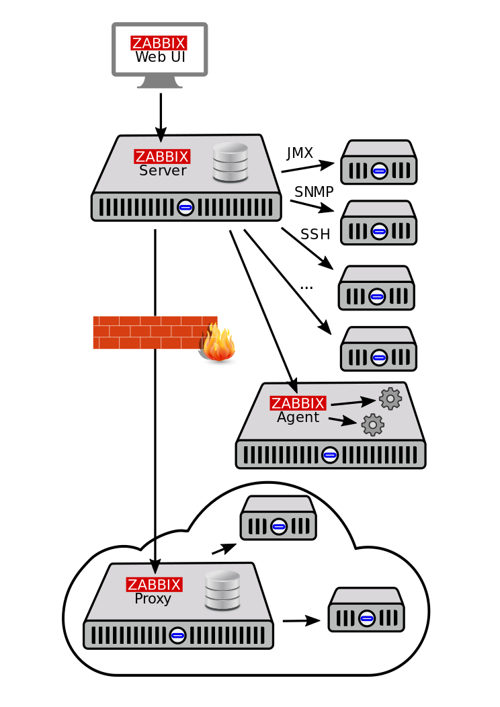
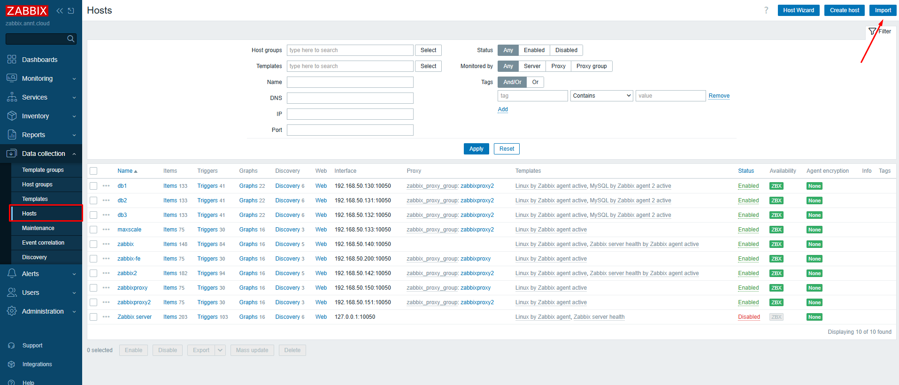

# Zabbix 
## 1. Zabbix 
### 1.1 Tổng quan 
- Zabbix có tác giả là Alexei Vladishev và hiện đang được Zabbix SIA tích cực phát triển và hỗ trợ.
- Zabbix là một giải pháp giám sát phân tán mã nguồn mở, đẳng cấp doanh nghiệp.
- Đây là một phần mềm giám sát nhiều thông số của mạng cũng như tình trạng và tính toàn vẹn của máy chủ, máy ảo, ứng dụng, dịch vụ, cơ sở dữ liệu, trang web, điện toán đám mây và nhiều hơn nữa. Zabbix sử dụng cơ chế thông báo linh hoạt, cho phép người dùng cấu hình cảnh báo qua email cho hầu hết mọi sự kiện. Điều này cho phép phản ứng nhanh chóng với các sự cố máy chủ. Zabbix cung cấp các tính năng báo cáo và trực quan hóa dữ liệu xuất sắc dựa trên dữ liệu đã lưu trữ. Điều này làm cho Zabbix trở nên lý tưởng cho việc lập kế hoạch dung lượng.
- Zabbix hỗ trợ cả hai phương pháp polling và trapping . Tất cả các báo cáo, thống kê cũng như các thông số cấu hình của Zabbix đều được truy cập thông qua giao diện web. Giao diện web này đảm bảo rằng tình trạng mạng và tình trạng máy chủ có thể được đánh giá từ bất kỳ vị trí nào. Khi được cấu hình đúng cách, Zabbix có thể đóng vai trò quan trọng trong việc giám sát cơ sở hạ tầng CNTT. Điều này đúng với cả các tổ chức nhỏ chỉ với một vài máy chủ và các công ty lớn với vô số máy chủ.
- Zabbix là miễn phí. Zabbix được viết và phân phối theo giấy phép AGPL-3.0. Điều này có nghĩa là mã nguồn của nó được phân phối tự do và sẵn có cho công chúng.
### 1.2 Tính năng nổi bật của Zabbix
- Zabbix là một giải pháp giám sát mạng tích hợp cao. Zabbix có thể: 
	- Thu thập dữ liệu:
		- Kiểm tra tình trạng sẵn sàng và hiệu suất.
		- Hỗ trợ SNMP (cả trapping và polling), IPMI, JMX, giám sát VMware.
		- Các kiểm tra tùy chỉnh.
		- Thu thập dữ liệu mong muốn theo các khoảng thời gian tùy chỉnh, được thực hiện bởi máy chủ/proxy và các tác nhân (agents).
	- Định nghĩa ngưỡng linh hoạt: Có thể xác định các ngưỡng sự cố rất linh hoạt, được gọi là trigger, tham chiếu các giá trị từ cơ sở dữ liệu backend.
	- Cảnh báo có thể cấu hình cao:
		- Việc gửi thông báo có thể được tùy chỉnh theo lịch trình leo thang, người nhận và loại phương tiện.
		- Thông báo có thể trở nên ý nghĩa và hữu ích bằng cách sử dụng các biến macro.
		- Các hành động tự động bao gồm các lệnh từ xa.
	- Vẽ đồ thị thời gian thực: Các mục được giám sát được vẽ đồ thị ngay lập tức bằng chức năng vẽ đồ thị tích hợp.
	- Khả năng giám sát web: Zabbix có thể theo dõi một lộ trình các cú nhấp chuột mô phỏng trên một trang web và kiểm tra chức năng cũng như thời gian phản hồi.
	- Tùy chọn trực quan hóa mở rộng:
		- Khả năng tạo đồ thị tùy chỉnh có thể kết hợp nhiều mục vào một chế độ xem duy nhất.
		- Bản đồ mạng.
		- Trình chiếu (slideshows) trong tổng quan kiểu bảng điều khiển (dashboard).
		- Báo cáo.
		- Chế độ xem cấp cao (kinh doanh) của các tài nguyên được giám sát.
	- Lưu trữ dữ liệu lịch sử: Dữ liệu được lưu trữ trong cơ sở dữ liệu với lịch sử có thể cấu hình và quy trình dọn dẹp (housekeeping) tích hợp.
	- Cấu hình dễ dàng:
		- Thêm các thiết bị được giám sát dưới dạng máy chủ (hosts).
		- Các máy chủ được tự động giám sát ngay khi có trong cơ sở dữ liệu.
		- Áp dụng các mẫu (templates) cho các thiết bị được giám sát.
	- Sử dụng mẫu (Templates):
		- Nhóm các kiểm tra trong các mẫu.
		- Các mẫu có thể kế thừa các mẫu khác.
	- Phát hiện mạng:
		- Tự động phát hiện các thiết bị mạng.
		- Tự động đăng ký tác nhân (agent autoregistration).
		- Phát hiện hệ thống tệp, giao diện mạng và SNMP OID.
	- Giao diện web nhanh: Một giao diện web dựa trên PHP, có thể truy cập từ bất kỳ đâu, cho phép điều hướng dễ dàng. Giao diện này cũng bao gồm nhật ký kiểm tra (audit log).
	- Zabbix API: Cung cấp giao diện lập trình cho Zabbix để thao tác hàng loạt, tích hợp phần mềm bên thứ ba và các mục đích khác.
	- Hệ thống quyền hạn:
		- Xác thực người dùng an toàn.
		- Một số người dùng nhất định có thể bị giới hạn quyền truy cập vào các chế độ xem cụ thể.
	- Tác nhân (Agent) đầy đủ tính năng và dễ mở rộng: Được triển khai trên các mục tiêu giám sát, có thể triển khai trên cả Linux và Windows.
	- Các tiến trình nhị phân (Binary daemons): Được viết bằng C, nhằm mang lại hiệu suất cao và mức tiêu thụ bộ nhớ thấp, dễ dàng chuyển đổi.
	- Sẵn sàng cho các môi trường phức tạp: Giám sát từ xa được thực hiện dễ dàng bằng cách sử dụng Zabbix proxy.

### 1.3 Các định nghĩa, thuật ngữ liên quan 
- Phần này sẽ giải thích ý nghĩa của một số thuật ngữ thường được sử dụng trong Zabbix.
	- Host (Máy chủ): Bất kỳ thiết bị vật lý hoặc ảo, ứng dụng, dịch vụ, hoặc bất kỳ tập hợp logic nào khác của các tham số được giám sát.
	- Host group (Nhóm máy chủ): Một nhóm logic của các host. Nhóm host được dùng khi gán quyền truy cập host cho các nhóm người dùng khác nhau.
	- Item (Mục dữ liệu): Một phần dữ liệu cụ thể mà hệ thống muốn nhận từ một host; một chỉ số dữ liệu.
	- Value preprocessing (Tiền xử lý giá trị): Quá trình chuyển đổi giá trị chỉ số nhận được trước khi lưu vào cơ sở dữ liệu.
	- Trigger (Ngưỡng kích hoạt): Một biểu thức logic định nghĩa ngưỡng sự cố và được sử dụng để "đánh giá" dữ liệu nhận được trong các item.
		- Khi dữ liệu nhận được vượt quá ngưỡng, trigger chuyển từ trạng thái 'Ok' sang trạng thái 'Problem'.
		- Khi dữ liệu nhận được thấp hơn ngưỡng, trigger duy trì hoặc trở về trạng thái 'Ok'.
	- Template (Mẫu): Một tập hợp các thực thể (item, trigger, đồ thị, quy tắc khám phá cấp thấp, kịch bản web) sẵn sàng để áp dụng cho một hoặc nhiều host.
		* Mục đích của template là tăng tốc độ triển khai các tác vụ giám sát trên host, đồng thời giúp việc áp dụng các thay đổi hàng loạt cho các tác vụ giám sát trở nên dễ dàng hơn. Template được liên kết trực tiếp với từng host.
	- Template group (Nhóm mẫu): Một nhóm logic của các template. Nhóm template được dùng khi gán quyền truy cập template cho các nhóm người dùng khác nhau.
	- Event (Sự kiện): Một lần xảy ra duy nhất của một điều gì đó đáng chú ý, chẳng hạn như trigger thay đổi trạng thái hoặc một quá trình khám phá/tự động đăng ký agent diễn ra.
	- Event tag (Thẻ sự kiện): Một thẻ được định nghĩa trước cho sự kiện. Nó có thể được sử dụng trong tương quan sự kiện, phân quyền chi tiết, v.v.
	- Event correlation (Tương quan sự kiện): Một phương pháp tương quan các vấn đề với giải pháp của chúng một cách linh hoạt và chính xác.
		- Ví dụ, có thể định nghĩa rằng một vấn đề được báo cáo bởi một trigger có thể được giải quyết bởi một trigger khác, thậm chí có thể sử dụng một phương pháp thu thập dữ liệu khác.
	- Problem (Sự cố): Một trigger đang ở trạng thái "Problem".
	- Problem update (Cập nhật sự cố): Các tùy chọn quản lý sự cố do Zabbix cung cấp, chẳng hạn như thêm nhận xét, xác nhận, thay đổi mức độ nghiêm trọng hoặc đóng thủ công.
	- Action (Hành động): Một phương tiện được định nghĩa trước để phản ứng với một sự kiện.
		- Một action bao gồm các operations (thao tác, ví dụ: gửi thông báo) và conditions (điều kiện để thao tác được thực hiện).
	- Escalation (Leo thang): Một kịch bản tùy chỉnh để thực hiện các thao tác trong một action; một chuỗi các thao tác gửi thông báo/thực hiện các lệnh từ xa.
	- Media (Phương tiện): Một phương tiện để gửi thông báo; kênh gửi.
	- Notification (Thông báo): Một tin nhắn về một sự kiện nào đó được gửi đến người dùng thông qua kênh phương tiện đã chọn.
	- Remote command (Lệnh từ xa): Một lệnh được định nghĩa trước, tự động thực thi trên một host được giám sát theo một điều kiện nào đó.
	- Web scenario (Kịch bản web): Một hoặc nhiều yêu cầu HTTP để kiểm tra tình trạng sẵn sàng của một trang web.
	- Frontend (Giao diện người dùng): Giao diện web được cung cấp cùng với Zabbix.
	- Dashboard (Bảng điều khiển): Phần có thể tùy chỉnh của giao diện web, hiển thị các bản tóm tắt và trực quan hóa thông tin quan trọng trong các đơn vị trực quan được gọi là widget.
	- Widget (Tiện ích): Đơn vị trực quan hiển thị thông tin thuộc một loại và nguồn nhất định (một bản tóm tắt, bản đồ, đồ thị, đồng hồ, v.v.), được sử dụng trong dashboard.
	- Zabbix API: Zabbix API cho phép sử dụng giao thức JSON RPC để tạo, cập nhật và lấy các đối tượng Zabbix (như host, item, đồ thị và các đối tượng khác) hoặc thực hiện bất kỳ tác vụ tùy chỉnh nào khác.
	- Zabbix server: Tiến trình trung tâm của phần mềm Zabbix thực hiện giám sát, tương tác với Zabbix proxy và agent, tính toán trigger, gửi thông báo; một kho lưu trữ dữ liệu trung tâm.
	- Zabbix proxy: Một tiến trình có thể thu thập dữ liệu thay mặt cho Zabbix server, giúp giảm tải xử lý cho máy chủ.
	- Zabbix agent: Một tiến trình được triển khai trên các mục tiêu giám sát để chủ động giám sát tài nguyên và ứng dụng cục bộ.
	- Zabbix agent 2: Thế hệ Zabbix agent mới để chủ động giám sát tài nguyên và ứng dụng cục bộ, cho phép sử dụng các plugin tùy chỉnh để giám sát.
		- Vì Zabbix agent 2 có nhiều chức năng tương tự như Zabbix agent, thuật ngữ "Zabbix agent" trong tài liệu dùng để chỉ cả hai – Zabbix agent và Zabbix agent 2, nếu hành vi chức năng giống nhau. Zabbix agent 2 chỉ được đặt tên cụ thể khi chức năng của nó khác biệt.
	- Encryption (Mã hóa): Hỗ trợ truyền thông mã hóa giữa các thành phần Zabbix (server, proxy, agent, các tiện ích zabbix_sender và zabbix_get) sử dụng giao thức TLS (Transport Layer Security).
	- Agent autoregistration (Tự động đăng ký agent): Quá trình tự động để một Zabbix agent tự đăng ký làm host và bắt đầu giám sát.
	- Network discovery (Khám phá mạng): Tự động khám phá các thiết bị mạng.
	- Low-level discovery (Khám phá cấp thấp): Tự động khám phá các thực thể cấp thấp trên một thiết bị cụ thể (ví dụ: hệ thống tệp, giao diện mạng, v.v.).
	- Low-level discovery rule (Quy tắc khám phá cấp thấp): Tập hợp các định nghĩa để tự động khám phá các thực thể cấp thấp trên một thiết bị.
	- Item prototype (Mẫu item): Một chỉ số với các tham số nhất định dưới dạng biến, sẵn sàng cho khám phá cấp thấp. Sau khám phá cấp thấp, các biến sẽ tự động được thay thế bằng các tham số thực tế đã khám phá và chỉ số tự động bắt đầu thu thập dữ liệu.
	- Trigger prototype (Mẫu trigger): Một trigger với các tham số nhất định dưới dạng biến, sẵn sàng cho khám phá cấp thấp. Sau khám phá cấp thấp, các biến sẽ tự động được thay thế bằng các tham số thực tế đã khám phá và trigger tự động bắt đầu đánh giá dữ liệu.
		- Các mẫu của một số thực thể Zabbix khác cũng được sử dụng trong khám phá cấp thấp – mẫu đồ thị, mẫu host, mẫu nhóm host.
		
## 2. Kiến trúc Zabbix
- Zabbix bao gồm một số thành phần chính: 
	- Zabbix Server 
	- Zabbix Proxy
	- Zabbix Agent
	- Zabbix Web front-end 
- 
- Luồng dữ liệu
	- Để tạo một item (mục) thu thập dữ liệu, trước tiên cần tạo một host (máy chủ). Ở phía còn lại của hệ thống Zabbix, phải có một item trước khi có thể tạo một trigger (ngưỡng kích hoạt). Và phải có một trigger mới có thể tạo một action (hành động).
	- Ví dụ, nếu muốn nhận cảnh báo rằng tải CPU của máy chủ X quá cao, trước tiên phải tạo một mục nhập host cho máy chủ X, sau đó là một item để giám sát CPU của nó, rồi một trigger sẽ kích hoạt nếu CPU quá cao, tiếp theo là một action gửi email thông báo.
	
### 2.1 Zabbix Server 
#### 2.1.1 Tổng quan
- Đây là thành phần trung tâm của phần mềm Zabbix. Server có thể kiểm tra các dịch vụ mạng từ xa. Agent sẽ báo cáo toàn bộ thông tin và số lượng thống kê cho server. Server sẽ lưu trữ tất cả cấu hình và dữ liệu thống kê.
- Máy chủ Zabbix là tiến trình trung tâm của phần mềm Zabbix.
- Máy chủ thực hiện việc polling và trapping  dữ liệu, tính toán các trigger (ngưỡng kích hoạt), và gửi thông báo đến người dùng. Đây là thành phần trung tâm mà các Zabbix agent và proxy báo cáo dữ liệu về tình trạng sẵn sàng và tính toàn vẹn của các hệ thống. Máy chủ cũng có thể tự kiểm tra từ xa các dịch vụ mạng (như máy chủ web và máy chủ thư điện tử) bằng cách sử dụng các kiểm tra dịch vụ đơn giản.
- Máy chủ là kho lưu trữ trung tâm nơi tất cả dữ liệu cấu hình, thống kê và hoạt động được lưu trữ. Nó cũng là thực thể trong Zabbix sẽ chủ động cảnh báo cho quản trị viên khi có sự cố phát sinh trong bất kỳ hệ thống được giám sát nào.
- Hoạt động của một máy chủ Zabbix cơ bản được chia thành ba thành phần riêng biệt: máy chủ Zabbix, giao diện web (web frontend) và lưu trữ cơ sở dữ liệu.
- Tất cả thông tin cấu hình cho Zabbix đều được lưu trữ trong cơ sở dữ liệu, nơi cả máy chủ và giao diện web đều tương tác. Ví dụ, khi một item (mục dữ liệu) mới được tạo bằng giao diện web (hoặc API), nó sẽ được thêm vào bảng item trong cơ sở dữ liệu. Sau đó, khoảng mỗi phút một lần, máy chủ Zabbix sẽ truy vấn bảng item để lấy danh sách các item đang hoạt động, sau đó được lưu trữ trong một bộ nhớ đệm bên trong máy chủ Zabbix. Đây là lý do tại sao có thể mất đến hai phút để bất kỳ thay đổi nào được thực hiện trong giao diện Zabbix hiển thị trong phần dữ liệu mới nhất.
- Zabbix Server hỗ trợ trên nhiều nền tảng:
	- Linux
	- Solaris
	- AIX
	- HP-UX
	- Mac OS X
	- FreeBSD
	- OpenBSD
	- NetBSD
	- SCO Open Server
- Máy chủ Zabbix hoạt động như một tiến trình daemon. 
	- Được cài đặt dễ dàng bằng lệnh 
	```bash
	apt install zabbix-server
	```
	- Các lệnh điều khiển: Tương tự các daemon khác, để dừng, khởi động lại hoặc xem trạng thái của máy chủ, sử dụng các lệnh sau:
	```bash
	systemctl stop zabbix-server
	systemctl restart zabbix-server
	systemctl status zabbix-server
	```
	- Có thể sử dụng các tham số dòng lệnh sau với máy chủ Zabbix:
		- `-c --config <file>`: Đường dẫn đến tệp cấu hình (mặc định là `/usr/local/etc/zabbix_server.conf`).
		- `-f --foreground`: Chạy máy chủ Zabbix ở chế độ nền trước.
		- `-R --runtime-control <option>`: Thực hiện các chức năng quản trị.
		- `-T --test-config`: Xác thực tệp cấu hình và thoát.
		- `-h --help`: Hiển thị trợ giúp.
		- `-V --version`: Hiển thị số phiên bản.
	- Ví dụ về việc chạy máy chủ Zabbix với các tham số dòng lệnh:
	```bash
	zabbix_server -c /usr/local/etc/zabbix_server.conf
	zabbix_server --help
	zabbix_server -V
	```
- Bên cạnh đó Zabbix cung cấp các tùy chọn điều khiển để thực hiện các chức năng quản trị mà không cần dừng và khởi động lại máy chủ. Điều này giúp quản lý hệ thống một cách linh hoạt và hiệu quả hơn.

| Tùy chọn                                 | Mô tả                                                                                                                                                                                                                                                                                                                                                   | Đối tượng (Target)                                                                                                                                                       |
|------------------------------------------|-----------------------------------------------------------------------------------------------------------------------------------------------------------------------------------------------------------------------------------------------------------------------------------------------------------------------------------------------------------|--------------------------------------------------------------------------------------------------------------------------------------------------------------------------|
| `config_cache_reload`                    | Tải lại bộ nhớ đệm cấu hình. Bị bỏ qua nếu bộ nhớ đệm đang được tải.                                                                                                                                                                                                                                                                                     | -                                                                                                                                                                        |
| `diaginfo[=<section>]`                   | Thu thập thông tin chẩn đoán vào tệp nhật ký máy chủ.                                                                                                                                                                                                                                                                                                    | `historycache` – Thống kê bộ nhớ đệm lịch sử<br>`valuecache` – Thống kê bộ nhớ đệm giá trị<br>`preprocessing` – Thống kê bộ quản lý tiền xử lý<br>`alerting` – Thống kê bộ quản lý cảnh báo<br>`lld` – Thống kê bộ quản lý LLD<br>`locks` – Danh sách mutex (trống trên hệ BSD)<br>`connector` – Thống kê các kết nối có hàng đợi lớn nhất |
| `ha_status`                              | Ghi trạng thái cụm (cluster) High Availability (HA) vào nhật ký.                                                                                                                                                                                                                                                                                         | -                                                                                                                                                                        |
| `ha_remove_node=target`                  | Gỡ bỏ nút trong cụm HA theo tên hoặc ID. Không thể gỡ bỏ các nút active/standby.                                                                                                                                                                                                                                                                          | `target` – Tên hoặc ID của nút (lấy bằng lệnh `ha_status`)                                                                                                                |
| `ha_set_failover_delay=delay`            | Thiết lập độ trễ chuyển đổi dự phòng (failover) trong cụm HA. Hỗ trợ hậu tố thời gian, ví dụ: `10s`, `1m`.                                                                                                                                                                                                                                                | -                                                                                                                                                                        |
| `proxy_config_cache_reload[=<target>]`   | Tải lại bộ nhớ đệm cấu hình proxy. Nếu không chỉ định, tải lại cho tất cả proxy.                                                                                                                                                                                                                                                                          | `target` – Danh sách tên proxy, phân tách bằng dấu phẩy.                                                                                                                  |
| `secrets_reload`                         | Tải lại thông tin bí mật từ Vault.                                                                                                                                                                                                                                                                                                                       | -                                                                                                                                                                        |
| `service_cache_reload`                   | Tải lại bộ nhớ đệm của bộ quản lý dịch vụ.                                                                                                                                                                                                                                                                                                                | -                                                                                                                                                                        |
| `snmp_cache_reload`                      | Tải lại bộ nhớ đệm SNMP, xóa các thuộc tính SNMP (engine time, engine boots, engine id, thông tin xác thực) cho tất cả các máy chủ.                                                                                                                                                                                                                       | -                                                                                                                                                                        |
| `housekeeper_execute`                    | Khởi chạy quy trình dọn dẹp (housekeeping). Bị bỏ qua nếu quy trình đang chạy.                                                                                                                                                                                                                                                                           | -                                                                                                                                                                        |
| `trigger_housekeeper_execute`            | Khởi chạy quy trình dọn dẹp cho các dịch vụ để xóa sự cố do các trigger đã bị xóa, bao gồm các sự cố dịch vụ được tạo bởi các trigger này (coi như đã xử lý khi dọn dẹp). Đề xuất tăng tần suất bằng cách điều chỉnh tham số `ProblemHousekeepingFrequency` nếu có nhiều trigger được phát hiện/thay đổi thường xuyên. Bị bỏ qua nếu quy trình đang chạy. | -                                                                                                                                                                        |
| `log_level_increase[=<target>]`          | Tăng mức ghi log. Ảnh hưởng đến tất cả các tiến trình nếu không chỉ định đối tượng. Không hỗ trợ trên hệ BSD.                                                                                                                                                                                                                                             | `process type` – Tất cả tiến trình của loại chỉ định (vd: `poller`)<br>`process type,N` – Loại và số tiến trình (vd: `poller,3`)<br>`pid` – PID (1–65535)                |
| `log_level_decrease[=<target>]`          | Giảm mức ghi log. Ảnh hưởng đến tất cả các tiến trình nếu không chỉ định đối tượng. Không hỗ trợ trên hệ BSD.                                                                                                                                                                                                                                             | Như `log_level_increase`.                                                                                                                                                 |
| `prof_enable[=<target>]`                 | Bật chế độ profiling. Nếu không chỉ định đối tượng, ảnh hưởng đến tất cả tiến trình. Hiển thị chi tiết về tất cả rwlock/mutex theo tên hàm.                                                                                                                                                                                                                | `process type` – Tất cả tiến trình của loại chỉ định (vd: `history syncer`)<br>`process type,N` – Loại và số tiến trình (vd: `history syncer,1`)<br>`pid` – PID (1–65535)<br>`scope` – `rwlock`, `mutex`, `processing` (có thể kết hợp với loại và số tiến trình)                                                               |
| `prof_disable[=<target>]`                | Tắt chế độ profiling. Nếu không chỉ định đối tượng, ảnh hưởng đến tất cả tiến trình.                                                                                                                                                                                                                                                                      | Như `prof_enable`.                                                                                                                                                        |

#### 2.1.2 High Availability
- Tính sẵn sàng cao (HA) thường là yêu cầu bắt buộc đối với các cơ sở hạ tầng quan trọng, nơi gần như không thể chấp nhận thời gian ngừng hoạt động. Do đó, đối với bất kỳ dịch vụ nào có thể gặp sự cố, phải có một tùy chọn chuyển đổi dự phòng (failover) sẵn sàng để đảm nhận nếu dịch vụ hiện tại gặp trục trặc.
- Zabbix cung cấp một giải pháp HA nguyên bản (native), dễ cài đặt và không đòi hỏi kinh nghiệm về HA trước đó. Zabbix HA nguyên bản có thể hữu ích để tăng cường thêm một lớp bảo vệ chống lại các lỗi phần mềm/phần cứng của máy chủ Zabbix hoặc để giảm thiểu thời gian ngừng hoạt động do bảo trì.
- Trong chế độ sẵn sàng cao của Zabbix, nhiều máy chủ Zabbix được chạy như các nút trong một cụm. Trong khi một máy chủ Zabbix trong cụm đang hoạt động, các máy chủ khác sẽ ở chế độ chờ (standby), sẵn sàng tiếp quản khi cần thiết.
- Để khởi động máy chủ Zabbix dưới dạng một nút cụm (cluster node), cần hai tham số trong cấu hình máy chủ:
	- Tham số `HANodeName`** phải được chỉ định cho mỗi máy chủ Zabbix sẽ là một nút cụm HA.
		- Đây là một định danh nút duy nhất (ví dụ: `zabbix-node-01`) mà máy chủ sẽ được tham chiếu trong cấu hình của agent và proxy. Nếu không chỉ định `HANodeName`, máy chủ sẽ được khởi động ở chế độ độc lập (standalone mode).
	- Tham số `NodeAddress`** phải được chỉ định cho mỗi nút.
		- Tham số `NodeAddress` (địa chỉ:cổng) sẽ được giao diện Zabbix (frontend) sử dụng để kết nối với nút máy chủ đang hoạt động. `NodeAddress` phải khớp với địa chỉ IP hoặc tên FQDN của máy chủ Zabbix tương ứng.
- Sau khi thực hiện các thay đổi đối với tệp cấu hình, **khởi động lại tất cả các máy chủ Zabbix**. Chúng sẽ được khởi động dưới dạng các nút cụm. Trạng thái mới của các máy chủ có thể được xem trong mục **Reports → System information** (Báo cáo → Thông tin hệ thống) và cũng bằng cách chạy lệnh:
```bash
zabbix_server -R ha_status
```
- Cấu hình các node trong cluster HA Zabbix-server tại các thành phần Proxy và Agent 
	- Proxy 
		- Đối với proxy thụ động, tên nút phải được liệt kê trong tham số `Server` của proxy, cách nhau bằng dấu phẩy:
		```
		Server=zabbix-node-01,zabbix-node-02
		```
		- Đối với proxy chủ động, tên nút phải được liệt kê trong tham số `Server` của proxy, cách nhau bằng dấu chấm phẩy:
		```
		Server=zabbix-node-01;zabbix-node-02
		```
	- Agent
		- Để bật các kiểm tra thụ động, tên nút phải được liệt kê trong tham số `Server`, cách nhau bằng dấu phẩy:
		```
		Server=zabbix-node-01,zabbix-node-02
		```
		- Để bật các kiểm tra chủ động, tên nút phải được liệt kê trong tham số `ServerActive`. Lưu ý rằng đối với các kiểm tra chủ động, các nút phải được phân tách bằng dấu phẩy với bất kỳ máy chủ nào khác, trong khi bản thân các nút phải được phân tách bằng dấu chấm phẩy, ví dụ:
		```
		ServerActive=zabbix-node-01;zabbix-node-02
		```
- Các lệnh cấu hình HA 
	- Zabbix sẽ tự động chuyển đổi dự phòng sang một nút khác nếu nút đang hoạt động dừng. Phải có ít nhất một nút ở trạng thái chờ để quá trình chuyển đổi dự phòng diễn ra.
	- Tốc độ chuyển đổi dự phòng sẽ như thế nào? Tất cả các nút cập nhật thời gian truy cập cuối cùng của chúng (và trạng thái, nếu có thay đổi) cứ sau 5 giây. Vì vậy:
		- Nếu nút đang hoạt động tắt và kịp báo cáo trạng thái của nó là "stopped", một nút khác sẽ tiếp quản trong vòng **5 giây**.
		- Nếu nút đang hoạt động tắt/trở nên không khả dụng mà không thể cập nhật trạng thái của nó, các nút chờ sẽ đợi **thời gian trễ chuyển đổi dự phòng** + 5 giây để tiếp quản.
	- Thời gian trễ chuyển đổi dự phòng có thể cấu hình, với phạm vi hỗ trợ từ 10 giây đến 15 phút (mặc định là một phút). Để thay đổi thời gian trễ chuyển đổi dự phòng, có thể chạy:
	```bash
	zabbix_server -R ha_set_failover_delay=5m
	```
	- Quản lý cụm HA: Trạng thái hiện tại của cụm HA có thể được quản lý bằng các tùy chọn:
		- `ha_status`: Ghi nhật ký trạng thái cụm HA vào tệp nhật ký máy chủ Zabbix (và ra stdout).
		- `ha_remove_node=target`: Xóa một nút HA được xác định bằng `<target>` của nó - tên hoặc ID của nút (tên/ID có thể lấy từ đầu ra của lệnh `ha_status`), ví dụ:
			- Ví dụ 
			```bash
			zabbix_server -R ha_remove_node=zabbix-node-02
			```
			- Lưu ý rằng các nút đang hoạt động/chờ không thể bị xóa.

### 2.2 Zabbix Agent 
#### 2.2.1 Zabbix Agent
- Zabbix agent được triển khai trên mục tiêu giám sát để chủ động theo dõi các tài nguyên và ứng dụng cục bộ (ổ cứng, bộ nhớ, thống kê bộ xử lý, v.v.).
- Agent thu thập thông tin hoạt động cục bộ và báo cáo dữ liệu về máy chủ Zabbix để xử lý tiếp. Trong trường hợp xảy ra sự cố (chẳng hạn như ổ cứng đầy hoặc tiến trình dịch vụ bị lỗi), máy chủ Zabbix có thể chủ động cảnh báo cho các quản trị viên của máy cụ thể đã báo cáo lỗi đó.
- Zabbix agent có hiệu suất cao nhờ việc sử dụng các lời gọi hệ thống gốc (native system calls) để thu thập thông tin thống kê.
- Active/Passive Checks: Zabbix agent có thể thực hiện kiểm tra thụ động và chủ động:
	- Kiểm tra thụ động (Passive checks): Zabbix agent phản hồi yêu cầu từ máy chủ Zabbix (hoặc proxy). Ví dụ, máy chủ yêu cầu dữ liệu (ví dụ: tải CPU), và agent trả về kết quả.
	- Kiểm tra chủ động (Active checks): Zabbix agent thu thập và gửi dữ liệu mà không cần chờ yêu cầu từ máy chủ Zabbix (hoặc proxy). Đầu tiên, nó truy xuất danh sách các mục giám sát từ máy chủ (tải CPU, bộ nhớ khả dụng, v.v.), sau đó thu thập dữ liệu cần thiết và định kỳ gửi các giá trị mới trở lại máy chủ.
- Zabbix Agent được cài thông qua lệnh 
```
apt install zabbix-agent 
```

- Zabbix Agent có thể chạy nhiều phiên bản (instance) trên cùng một máy chủ.  Các tham số kèm theo lệnh chạy: 
	- Tham số (Áp dụng cho cả UNIX và Windows)

	| Tham số                              | Mô tả                                                                                                                                                                                                                     |
	|--------------------------------------|-----------------------------------------------------------------------------------------------------------------------------------------------------------------------------------------------------------------------------|
	| `-c`, `--config <config-file>`       | Đường dẫn tới tệp cấu hình. Dùng để chỉ định tệp cấu hình khác tệp mặc định.<br>**Mặc định:**<br>• UNIX: `/usr/local/etc/zabbix_agentd.conf` (hoặc theo `--sysconfdir`, `--prefix` khi biên dịch)<br>• Windows: `C:\Program Files\Zabbix Agent\zabbix_agentd.conf` |
	| `-f`, `--foreground`                 | Chạy Zabbix Agent ở chế độ foreground (mặc định: `true`).                                                                                                                                                                  |
	| `-p`, `--print`                      | In tất cả các item đã biết và thoát.<br>Lưu ý: Cần chỉ định tệp cấu hình nếu không nằm ở vị trí mặc định để trả về các kết quả từ `UserParameter`.                                                                          |
	| `-t`, `--test <item key>`            | Kiểm tra item theo khóa chỉ định và thoát.<br>Lưu ý: Cần chỉ định tệp cấu hình nếu không nằm ở vị trí mặc định để trả về các kết quả từ `UserParameter`.                                                                     |
	| `-T`, `--test-config`                | Kiểm tra và xác thực tệp cấu hình, sau đó thoát.                                                                                                                                                                            |
	| `-h`, `--help`                       | Hiển thị thông tin trợ giúp.                                                                                                                                                                                               |
	| `-V`, `--version`                    | Hiển thị phiên bản của Zabbix Agent.                                                                                                                                                                                        |

	- Tham số chỉ dành cho UNIX Agent

	| Tham số                                | Mô tả                                                                                                    |
	|----------------------------------------|----------------------------------------------------------------------------------------------------------|
	| `-R`, `--runtime-control <option>`     | Thực hiện các chức năng quản trị khi Agent đang chạy.   |

	- Tham số chỉ dành cho Windows Agent

	| Tham số                                | Mô tả                                                                                                                                                                                                                                   |
	|----------------------------------------|-------------------------------------------------------------------------------------------------------------------------------------------------------------------------------------------------------------------------------------------|
	| `-m`, `--multiple-agents`              | Cho phép chạy nhiều instance Agent (dùng kèm các tùy chọn `-i`, `-d`, `-s`, `-x`). Tên dịch vụ mỗi instance sẽ được bổ sung giá trị `Hostname` từ tệp cấu hình để phân biệt.                                                              |
	| `-S`, `--startup-type <value>`         | Thiết lập kiểu khởi động dịch vụ Agent trong Windows. Giá trị hợp lệ:<br>`automatic` (mặc định) – Tự động khởi động khi Windows khởi động.<br>`delayed` – Khởi động trễ (Windows Vista/Server 2008+).<br>`manual` – Khởi động thủ công.<br>`disabled` – Vô hiệu hóa dịch vụ. Có thể dùng cùng với `-i` hoặc độc lập để thay đổi dịch vụ đã cài đặt. |
	| `-i`, `--install`                      | Cài đặt Zabbix Agent làm dịch vụ Windows.                                                                                                                                                                                                 |
	| `-d`, `--uninstall`                    | Gỡ cài đặt dịch vụ Zabbix Agent khỏi Windows.                                                                                                                                                                                              |
	| `-s`, `--start`                        | Khởi động dịch vụ Zabbix Agent trong Windows.                                                                                                                                                                                              |
	| `-x`, `--stop`                         | Dừng dịch vụ Zabbix Agent trong Windows.                                                                                                                                                                                                   |

- Các tham số sử dụng khi chạy không cần khởi động lại 

| Tùy chọn                                   | Mô tả                                                                                                                                                                            | Đối tượng (Target)                                                                                                                                                                  |
|-------------------------------------------|----------------------------------------------------------------------------------------------------------------------------------------------------------------------------------|--------------------------------------------------------------------------------------------------------------------------------------------------------------------------------------|
| `log_level_increase[=<target>]`           | Tăng mức ghi log. Nếu không chỉ định đối tượng, tất cả tiến trình sẽ bị ảnh hưởng.                                                                                               | `process type` – Tất cả tiến trình của loại chỉ định (vd: `listener`)<br>`process type,N` – Loại và số thứ tự của tiến trình (vd: `listener,3`)<br>`pid` – PID (1–65535). Với PID lớn, sử dụng dạng `process type,N`. |
| `log_level_decrease[=<target>]`           | Giảm mức ghi log. Nếu không chỉ định đối tượng, tất cả tiến trình sẽ bị ảnh hưởng.                                                                                               | Như `log_level_increase`.                                                                                                                                                             |
| `userparameter_reload`                    | Tải lại các giá trị từ tùy chọn `UserParameter` và `Include` trong tệp cấu hình hiện tại mà không cần khởi động lại Agent.                                                      | -                                                                                                                                                                                    |

- Các loại tiến trình Agent
	- Zabbix agent hoạt động với các loại tiến trình chính sau:
		- active checks: Tiến trình thực hiện các kiểm tra chủ động.
		- collector: Tiến trình thu thập dữ liệu.
		- listener: Tiến trình lắng nghe các kiểm tra thụ động.

#### 2.2.2 Zabbix Agent 2
- Zabbix Agent 2 là thế hệ Zabbix agent mới, được viết bằng ngôn ngữ Go (với một số mã C được tái sử dụng từ Zabbix agent). Nó được thiết kế để:
- Giảm số lượng kết nối TCP.
- Cung cấp khả năng kiểm tra đồng thời (concurrency of checks) được cải thiện.
- Dễ dàng mở rộng bằng các plugin, cung cấp các kiểm tra đơn giản với mã tối thiểu và hỗ trợ các kiểm tra phức tạp bao gồm các tập lệnh chạy dài và thu thập dữ liệu độc lập với báo cáo định kỳ.
- Hoạt động như một sự thay thế cho Zabbix agent, hỗ trợ tất cả các tính năng trước đây.
- Active/Passive Checks: Zabbix Agent 2 hỗ trợ kiểm tra thụ động và chủ động, tương tự như Zabbix agent. 
	- Các kiểm tra chủ động của Zabbix Agent 2 còn hỗ trợ khoảng thời gian linh hoạt/lên lịch và kiểm tra đồng thời trong một máy chủ chủ động.
	- Theo mặc định, sau khi khởi động lại, Zabbix Agent 2 sẽ lên lịch thu thập dữ liệu lần đầu tiên cho các kiểm tra chủ động tại một thời điểm ngẫu nhiên có điều kiện trong khoảng thời gian cập nhật của mục để ngăn chặn sự tăng đột biến trong việc sử dụng tài nguyên. Để thực hiện các kiểm tra chủ động không có khoảng thời gian cập nhật Scheduling ngay sau khi agent khởi động lại, hãy đặt tham số ForceActiveChecksOnStart (cấp độ toàn cục) hoặc Plugins.<Plugin name>.System.ForceActiveChecksOnStart (chỉ ảnh hưởng đến các kiểm tra plugin cụ thể) trong tệp cấu hình. Tham số cấp plugin, nếu được đặt, sẽ ghi đè tham số toàn cục.
- Kiểm tra đồng thời (Check Concurrency): Các kiểm tra từ các plugin khác nhau có thể được thực thi đồng thời. Số lượng kiểm tra đồng thời trong một plugin bị giới hạn bởi cài đặt dung lượng của plugin. Mỗi plugin có thể có một cài đặt dung lượng được mã hóa cứng (mặc định là 1000) có thể được giảm bằng cách sử dụng cài đặt Plugins.<PluginName>.System.Capacity=N trong tham số cấu hình Plugins.\
- Zabbix Agent 2 có thể chạy nhiều phiên bản (instance) trên cùng một máy chủ.  Các tham số kèm theo lệnh chạy: 
	- Tham số (Áp dụng cho cả UNIX và Windows)
	
	| Tham số                              | Mô tả                                                                                                                                                                                                                                   |
	|--------------------------------------|-------------------------------------------------------------------------------------------------------------------------------------------------------------------------------------------------------------------------------------------|
	| `-c`, `--config <config-file>`       | Đường dẫn tới tệp cấu hình. Cho phép chỉ định tệp cấu hình khác với mặc định.<br>**Mặc định:**<br>• UNIX: `/usr/local/etc/zabbix_agent2.conf` (hoặc theo biến biên dịch `--sysconfdir`, `--prefix`)<br>• Windows: `C:\Program Files\Zabbix Agent 2\zabbix_agent2.conf` |
	| `-f`, `--foreground`                 | Chạy Agent ở chế độ foreground (mặc định: `true`).                                                                                                                                                                                        |
	| `-p`, `--print`                      | In tất cả các item tích hợp sẵn và thoát.<br>Lưu ý: Cần chỉ định tệp cấu hình nếu không nằm ở vị trí mặc định để trả về các kết quả từ `UserParameter`.                                                                                   |
	| `-t`, `--test <item key>`            | Kiểm tra item theo khóa chỉ định và thoát.<br>Lưu ý: Cần chỉ định tệp cấu hình nếu không nằm ở vị trí mặc định để trả về các kết quả từ `UserParameter`.                                                                                    |
	| `-T`, `--test-config`                | Xác thực tệp cấu hình và thoát.                                                                                                                                                                                                           |
	| `-h`, `--help`                       | Hiển thị thông tin trợ giúp và thoát.                                                                                                                                                                                                     |
	| `-v`, `--verbose`                    | In thông tin gỡ lỗi (debug). Thường dùng kết hợp với `-p` hoặc `-t`.                                                                                                                                                                      |
	| `-V`, `--version`                    | Hiển thị phiên bản và thông tin giấy phép của Agent.                                                                                                                                                                                       |
	| `-R`, `--runtime-control <option>`   | Thực hiện các chức năng quản trị (xem phần **Runtime Control**).                                                                                                                                                                          |

	### Chỉ dành cho Windows

	| Tham số                                | Mô tả                                                                                                                                                                                                                                   |
	|----------------------------------------|-------------------------------------------------------------------------------------------------------------------------------------------------------------------------------------------------------------------------------------------|
	| `-m`, `--multiple-agents`              | Cho phép chạy nhiều instance Agent (dùng với `-i`, `-d`, `-s`, `-x`). Tên dịch vụ mỗi instance sẽ kèm giá trị `Hostname` từ tệp cấu hình để phân biệt.                                                                                     |
	| `-S`, `--startup-type <value>`         | Thiết lập kiểu khởi động dịch vụ Agent. Giá trị hợp lệ:<br>`automatic` (mặc định) – Tự động khởi động khi Windows khởi động.<br>`delayed` – Khởi động trễ (Windows Vista/Server 2008+).<br>`manual` – Khởi động thủ công.<br>`disabled` – Vô hiệu hóa dịch vụ. Có thể dùng cùng với `-i` hoặc độc lập để thay đổi dịch vụ đã cài đặt. |
	| `-i`, `--install`                      | Cài đặt Zabbix Agent 2 làm dịch vụ Windows.                                                                                                                                                                                                 |
	| `-d`, `--uninstall`                    | Gỡ cài đặt dịch vụ Zabbix Agent 2.                                                                                                                                                                                                          |
	| `-s`, `--start`                        | Khởi động dịch vụ Zabbix Agent 2.                                                                                                                                                                                                           |
	| `-x`, `--stop`                         | Dừng dịch vụ Zabbix Agent 2.                                                                                                                                                                                                                |

- Các tham số sử dụng khi chạy không cần khởi động lại 

| Tùy chọn                 | Mô tả                                                                                                   |
|--------------------------|---------------------------------------------------------------------------------------------------------|
| `log_level_increase`     | Tăng mức ghi log.                                                                                       |
| `log_level_decrease`     | Giảm mức ghi log.                                                                                       |
| `metrics`                | Liệt kê các metric khả dụng.                                                                            |
| `version`                | Hiển thị phiên bản của Agent.                                                                            |
| `userparameter_reload`   | Tải lại các giá trị từ `UserParameter` và `Include` trong tệp cấu hình mà không cần khởi động lại Agent. |
| `help`                   | Hiển thị thông tin trợ giúp về các tùy chọn runtime control.                                             |

### 2.3 Zabbix Proxy  
- Zabbix proxy là một tiến trình có thể thu thập dữ liệu giám sát từ một hoặc nhiều thiết bị được giám sát và gửi thông tin đó đến máy chủ Zabbix, về cơ bản hoạt động thay mặt cho máy chủ. Tất cả dữ liệu đã thu thập sẽ được đệm cục bộ và sau đó được chuyển đến máy chủ Zabbix mà proxy thuộc về.
- Việc triển khai một proxy là tùy chọn, nhưng có thể rất hữu ích khi dùng để phân tán tải của một máy chủ Zabbix duy nhất. Nếu chỉ các proxy thu thập dữ liệu, quá trình xử lý trên máy chủ sẽ ít tiêu tốn CPU và I/O đĩa hơn.
- Zabbix proxy là giải pháp lý tưởng để giám sát tập trung các địa điểm từ xa, chi nhánh và mạng không có quản trị viên cục bộ.
- Zabbix proxy yêu cầu một cơ sở dữ liệu riêng.

- Zabbix Proxy hoạt động như một tiến trình daemon. 
	- Được cài đặt dễ dàng bằng lệnh 
	```bash
	apt install zabbix-proxy
	```
	- Các lệnh điều khiển: Tương tự các daemon khác, để dừng, khởi động lại hoặc xem trạng thái của máy chủ, sử dụng các lệnh sau:
	```bash
	systemctl stop zabbix-proxy
	systemctl restart zabbix-proxy
	systemctl status zabbix-proxy
	```
	- Có thể sử dụng các tham số dòng lệnh sau với Zabbix Proxy:
	
	| Tham số                            | Mô tả                                                                                     |
	| ---------------------------------- | ----------------------------------------------------------------------------------------- |
	| `-c`, `--config <file>`            | Đường dẫn đến tệp cấu hình Proxy.                                                         |
	| `-f`, `--foreground`               | Chạy Proxy ở chế độ foreground.                                                           |
	| `-R`, `--runtime-control <option>` | Thực hiện chức năng quản trị khi Proxy đang chạy (xem chi tiết phần **Runtime Control**). |
	| `-T`, `--test-config`              | Kiểm tra và xác thực tệp cấu hình, sau đó thoát.                                          |
	| `-h`, `--help`                     | Hiển thị thông tin trợ giúp.                                                              |
	| `-V`, `--version`                  | Hiển thị phiên bản của Zabbix Proxy.                                                      |

	- Ví dụ về việc chạy máy chủ Zabbix với các tham số dòng lệnh:
	```bash
	- Khởi động Proxy với tệp cấu hình cụ thể
	zabbix_proxy -c /usr/local/etc/zabbix_proxy.conf
	- Hiển thị trợ giúp
	zabbix_proxy --help
	- Hiển thị phiên bản Proxy
	zabbix_proxy -V
	```
- Bên cạnh đó Zabbix cung cấp các tùy chọn điều khiển để thực hiện các chức năng quản trị mà không cần dừng và khởi động lại. Điều này giúp quản lý hệ thống một cách linh hoạt và hiệu quả hơn.

| Tùy chọn                                   | Mô tả                                                                                                                                                                                                                           | Đối tượng (Target)                                                                                                                                                                |
|-------------------------------------------|-----------------------------------------------------------------------------------------------------------------------------------------------------------------------------------------------------------------------------------|------------------------------------------------------------------------------------------------------------------------------------------------------------------------------------|
| `config_cache_reload`                     | Tải lại (reload) bộ nhớ đệm cấu hình. Bỏ qua nếu cache đang được nạp.<br>• **Proxy Active** sẽ kết nối với Zabbix Server để yêu cầu dữ liệu cấu hình.<br>• **Proxy Passive** sẽ yêu cầu dữ liệu khi Server kết nối lần tiếp theo. | -                                                                                                                                                                                  |
| `diaginfo[=<section>]`                    | Thu thập thông tin chẩn đoán trong file log của Proxy.                                                                                                                                                                            | `historycache` – thống kê bộ nhớ đệm lịch sử<br>`preprocessing` – thống kê bộ xử lý dữ liệu<br>`locks` – danh sách mutex (rỗng trên BSD)                                          |
| `snmp_cache_reload`                       | Tải lại cache SNMP, xóa các thuộc tính SNMP (engine time, engine boots, engine id, credentials) cho toàn bộ host.                                                                                                               | -                                                                                                                                                                                  |
| `housekeeper_execute`                     | Khởi chạy tiến trình housekeeping ngay lập tức. Bỏ qua nếu housekeeping đang chạy.                                                                                                                                                | -                                                                                                                                                                                  |
| `log_level_increase[=<target>]`           | Tăng mức ghi log. Nếu không chỉ định, áp dụng cho tất cả tiến trình. Không hỗ trợ trên BSD.                                                                                                                                       | `process type` – tất cả tiến trình theo loại (vd: `poller`)<br>`process type,N` – loại và số thứ tự tiến trình (vd: `poller,3`)<br>`pid` – PID (1–65535, với PID lớn cần dùng dạng `process type,N`). |
| `log_level_decrease[=<target>]`           | Giảm mức ghi log. Nếu không chỉ định, áp dụng cho tất cả tiến trình. Không hỗ trợ trên BSD.                                                                                                                                       | Như `log_level_increase`.                                                                                                                                                          |
| `prof_enable[=<target>]`                  | Bật chế độ profiling (ghi chi tiết hoạt động rwlocks/mutexes theo tên hàm). Nếu không chỉ định target, áp dụng cho tất cả tiến trình.                                                                                            | `process type` – tất cả tiến trình theo loại (vd: `history syncer`)<br>`process type,N` – loại và số thứ tự (vd: `history syncer,1`)<br>`pid` – PID (1–65535)<br>`scope` – `rwlock`, `mutex`, `processing` có thể kết hợp với loại tiến trình (vd: `history syncer,1,processing` hoặc `history syncer,rwlock`). |
| `prof_disable[=<target>]`                 | Tắt chế độ profiling. Nếu không chỉ định target, áp dụng cho tất cả tiến trình.                 

### 2.4 Zabbix Web 
- Là một giao diện web được viết bằng ngôn ngữ lập trình PHP, cho phép người quản trị hệ thống có thể cấu hình, giám sát, xem các dữ liệu thu thập được trên một giao diện web duy nhất
- 

### 2.5 Zabbix Sender, Zabbix Get & Zabbix Js 
#### 2.5.1 Zabbix Sender
- Zabbix sender là một tiện ích dòng lệnh dùng để gửi dữ liệu hiệu năng đến Zabbix server để xử lý.
- Tiện ích này thường được sử dụng trong các script chạy dài để định kỳ gửi dữ liệu khả dụng và hiệu năng.
- Để gửi dữ liệu trực tiếp tới Zabbix server hoặc proxy, cần cấu hình một item loại trapper.
- Chạy Zabbix sender:
	- Ví dụ chạy Zabbix sender trên UNIX:
	```
	cd bin
	./zabbix_sender -z zabbix -s "Linux DB3" -k db.connections -o 43
	```
	- Trong đó:
		- z: máy chủ Zabbix (có thể sử dụng địa chỉ IP)
		- s: tên kỹ thuật của host được giám sát (được đăng ký trong Zabbix frontend)
		- k: khóa (item key)
		- o: giá trị cần gửi
- Zabbix sender có thể được sử dụng để gửi nhiều giá trị từ một tệp đầu vào (xem thêm trong tài liệu manpage của zabbix_sender).
- Zabbix sender chấp nhận chuỗi UTF-8 (trên cả UNIX và Windows) mà không có BOM ở đầu tệp.
- Trên Windows, Zabbix sender có thể chạy tương tự:
	- zabbix_sender.exe [options]
- Chạy Zabbix sender với low-level discovery:
	- Ví dụ gửi giá trị JSON cho low-level discovery:
	- ./zabbix_sender -z 192.168.1.113 -s "Zabbix server" -k trapper.discovery.item -o '[{"{#FSNAME}":"/","{#FSTYPE}":"rootfs"},{"{#FSNAME}":"/sys","{#FSTYPE}":"sysfs"}]'
	- Để hoạt động, rule low-level discovery phải có item loại Zabbix trapper (trong ví dụ này là key trapper.discovery.item).

#### 2.5.2 Zabbix Get 
- Zabbix get là một tiện ích dòng lệnh dùng để giao tiếp với Zabbix agent và lấy thông tin từ agent.
- Tiện ích này thường được sử dụng để xử lý sự cố (troubleshooting) của các Zabbix agent.
- Chạy Zabbix get:
	- Ví dụ chạy Zabbix get trên UNIX để lấy giá trị tải CPU từ agent:
	```
	cd bin
	./zabbix\_get -s 127.0.0.1 -p 10050 -k system.cpu.load\[all,avg1]
	```
	- Ví dụ khác chạy Zabbix get để lấy chuỗi từ một website:
	```
	cd bin
	./zabbix\_get -s 192.168.1.1 -p 10050 -k "web.page.regexp\[[www.example.com,,,"USA](http://www.example.com,,,%22USA): (\[a-zA-Z0-9.-]+)",,\1]"
	```
	- Chú ý: Item key trong ví dụ trên có chứa dấu cách, vì vậy cần đặt trong dấu ngoặc kép `" "` để shell nhận diện chính xác. Các dấu ngoặc kép này không phải là một phần của item key – shell sẽ loại bỏ chúng trước khi gửi tới Zabbix agent.
	- Nếu item key không được hỗ trợ, Zabbix get sẽ trả về mã thoát (exit code) là 1.
- Các tham số dòng lệnh của Zabbix get:
	- `-s`, `--host <host/IP>`: Chỉ định tên host hoặc địa chỉ IP.
	- `-p`, `--port <port>`: Cổng mà agent đang chạy trên host (mặc định: 10050).
	- `-I`, `--source-address <IP>`: Chỉ định địa chỉ IP nguồn.
	- `-t`, `--timeout <giây>`: Thời gian chờ (1–30 giây, mặc định: 30 giây).
	- `-k`, `--key <item key>`: Khóa của item cần lấy dữ liệu.
	- `-P`, `--protocol <giá trị>`: Giao thức để kết nối agent. Giá trị:
	- `auto`: Kết nối qua JSON, nếu thất bại thì thử plaintext (mặc định).
	- `json`: Kết nối qua JSON protocol.
	- `plaintext`: Gửi trực tiếp item key theo kiểu plaintext (chỉ dùng cho phiên bản 6.4.x và cũ hơn).
	- `-h`, `--help`: Hiển thị trợ giúp.
	- `-V`, `--version`: Hiển thị số phiên bản.
	- `--tls-connect <giá trị>`: Cách kết nối với agent:
	- `unencrypted`: Không mã hóa (mặc định).
	- `psk`: Kết nối bằng TLS với pre-shared key.
	- `cert`: Kết nối bằng TLS với chứng chỉ.
	- `--tls-ca-file <file>`: Đường dẫn đầy đủ đến file chứa chứng chỉ CA để xác minh chứng chỉ peer.
	- `--tls-crl-file <file>`: Đường dẫn đầy đủ đến file chứa danh sách chứng chỉ bị thu hồi (CRL).
	- `--tls-agent-cert-issuer <issuer>`: Chỉ cho phép issuer cụ thể của chứng chỉ agent.
	- `--tls-agent-cert-subject <subject>`: Chỉ cho phép subject cụ thể của chứng chỉ agent.
	- `--tls-cert-file <file>`: Đường dẫn đầy đủ đến file chứa chứng chỉ hoặc chuỗi chứng chỉ.
	- `--tls-key-file <file>`: Đường dẫn đầy đủ đến file chứa khóa riêng (private key).
	- `--tls-psk-identity <PSK>`: Chuỗi định danh duy nhất, phân biệt chữ hoa/thường cho PSK.
	- `--tls-psk-file <file>`: Đường dẫn đầy đủ đến file chứa pre-shared key.
	- `--tls-cipher13 <cipher>`: Cấu hình bộ mã hóa (cipher) cho OpenSSL 1.1.1 trở lên (TLS 1.3). Không khả dụng nếu OpenSSL < 1.1.1.
	- `--tls-cipher <cipher>`: Chuỗi ưu tiên GnuTLS (cho TLS 1.2 trở lên) hoặc chuỗi cipher OpenSSL (chỉ cho TLS 1.2).
- Zabbix get trên Windows có thể chạy tương tự:
	- zabbix\_get.exe \[options]
#### 2.5.3 Zabbix Js 
- `zabbix_js` là một tiện ích dòng lệnh được sử dụng để kiểm thử các script nhúng (embedded script).
- Tiện ích này thực thi một script do người dùng cung cấp với một tham số dạng chuỗi và in ra kết quả. Các script được thực thi bằng công cụ scripting nhúng của Zabbix.
- Nếu xảy ra lỗi biên dịch hoặc thực thi, `zabbix_js` sẽ in lỗi ra stderr và thoát với mã lỗi (exit code) 1.
- Cách sử dụng:
```
zabbix_js -s script-file -p input-param [-l log-level] [-t timeout]
zabbix_js -s script-file -i input-file [-l log-level] [-t timeout]
zabbix_js -h
zabbix_js -V
```
- Các tham số dòng lệnh:
	- `-s, --script script-file`: Chỉ định tên tệp script cần thực thi. Nếu dùng `-` thay cho tên tệp, script sẽ được đọc từ stdin.
	- `-i, --input input-file`: Chỉ định tên tệp chứa tham số đầu vào. Nếu dùng `-`, dữ liệu sẽ được đọc từ stdin.
	- `-p, --param input-param`: Chỉ định tham số đầu vào (chuỗi).
	- `-l, --loglevel log-level`: Chỉ định mức log.
	- `-t, --timeout timeout`: Chỉ định thời gian chờ (giây). Giá trị hợp lệ: 1–60 giây (mặc định: 10 giây).
	- `-h, --help`: Hiển thị thông tin trợ giúp.
	- `-V, --version`: Hiển thị phiên bản.
	- `-w <webdriver url>`: Kích hoạt tính năng giám sát trình duyệt.
- Ví dụ:
```
zabbix_js -s script-file.js -p example
```

## 3. Các cấu hình 
- Phần này trình bày các thành phần cấu hình cốt lõi trong Zabbix, bao gồm cách quản lý host, thiết lập item và trigger, xử lý sự kiện, tạo báo cáo định kỳ, và cấu hình người dùng.
### 3.1 Host and Host groups 
- Trong Zabbix, host là bất kỳ thiết bị vật lý hoặc ảo, ứng dụng, dịch vụ, hoặc tập hợp các thông số được giám sát có liên quan một cách logic.
- Việc tạo host là một trong những tác vụ giám sát đầu tiên trong Zabbix. Ví dụ, nếu bạn muốn giám sát một số thông số trên máy chủ "x", trước tiên bạn phải tạo một host có tên, chẳng hạn như "Server X", sau đó mới có thể thêm các mục giám sát (monitoring items) vào đó.
- Các host được tổ chức thành host groups (nhóm host).
- Cấu hình một Host
	- Để cấu hình một host trong giao diện Zabbix (Zabbix frontend), thực hiện các bước: 
	- Truy cập: Thu thập dữ liệu > Hosts (Data collection > Hosts) hoặc Giám sát > Hosts (Monitoring > Hosts).
	- Nhấp vào nút Tạo host (Create host) ở góc trên bên phải màn hình (hoặc nhấp vào tên host để chỉnh sửa một host hiện có).
	- 
	
	- Nhập các tham số của host vào biểu mẫu.
- Các tab cấu hình 
	- Tab Host chứa các thuộc tính chung của host:

	| Tham số                     | Mô tả                                                                                                                                                                                                                                                                                                                                                                                                                                                                                                                                                                                                                                            |
	|-----------------------------|---------------------------------------------------------------------------------------------------------------------------------------------------------------------------------------------------------------------------------------------------------------------------------------------------------------------------------------------------------------------------------------------------------------------------------------------------------------------------------------------------------------------------------------------------------------------------------------------------------------------------------------------------|
	| **Host name (Tên host)**    | Nhập tên host duy nhất. Được phép sử dụng chữ và số, dấu cách, dấu chấm, dấu gạch ngang và dấu gạch dưới. Không được phép có dấu cách ở đầu hoặc cuối. **Lưu ý**: Nếu Zabbix agent đang chạy trên host này, tham số `Hostname` trong tệp cấu hình agent phải trùng với giá trị tên host nhập vào. Tham số này cần thiết cho việc xử lý các kiểm tra chủ động (active checks).                                                                                                                              |
	| **Visible name (Tên hiển thị)** | Nhập tên hiển thị duy nhất cho host. Nếu được thiết lập, tên này sẽ hiển thị trong danh sách, bản đồ, v.v., thay vì tên kỹ thuật của host. Thuộc tính này hỗ trợ UTF-8.                                                                                                                                                                                                                                                                                                                                                                                                                                      |
	| **Templates (Mẫu giám sát)**    | Liên kết template với host. Tất cả các đối tượng (item, trigger, v.v.) sẽ được kế thừa từ template. Để liên kết template mới, nhập tên template trong ô tìm kiếm, danh sách gợi ý sẽ hiện ra để lựa chọn. Hoặc, nhấn **Select** để chọn từ danh sách popup. Có thể gỡ liên kết template bằng 2 cách: **Unlink** (giữ lại các đối tượng đã kế thừa) hoặc **Unlink and clear** (xóa toàn bộ đối tượng đã kế thừa). Tên template là liên kết có thể nhấp vào để mở trang cấu hình của template. |
	| **Host groups (Nhóm host)** | Chọn nhóm host mà host thuộc về. Host phải thuộc ít nhất một nhóm. Có thể tạo nhóm mới bằng cách nhập tên nhóm chưa tồn tại.                                                                                                                                                                                                                                                                                                                                                                                                                                                                                                                   |
	| **Interfaces (Giao diện)**  | Hỗ trợ các loại giao diện: Agent, SNMP, JMX, IPMI. Mặc định không có giao diện nào. Để thêm, nhấn **Add**, chọn loại giao diện, nhập IP/DNS, Connect to và Port. **Lưu ý**: Giao diện đang được sử dụng bởi các item sẽ không thể xóa (nút Remove bị khóa). Giá trị “IP” hoặc “DNS” trong giao diện SNMP cũng được sử dụng cho SNMP trap. Chỉ giá trị được chọn (IP hoặc DNS) được dùng khi khớp dữ liệu. Tham khảo thêm tài liệu cấu hình SNMP monitoring (v1/v2/v3).                                                                                                         |
	| **IP address (Địa chỉ IP)** | Địa chỉ IP của host (tùy chọn).                                                                                                                                                                                                                                                                                                                                                                                                                                                                                                                                                                                                                  |
	| **DNS name (Tên DNS)**      | Tên DNS của host (tùy chọn).                                                                                                                                                                                                                                                                                                                                                                                                                                                                                                                                                                                                                      |
	| **Connect to (Kết nối tới)**| Chọn phương thức Zabbix server sẽ dùng để truy xuất dữ liệu từ agent: **IP** (khuyến nghị) hoặc **DNS**.                                                                                                                                                                                                                                                                                                                                                                                                                                                                                                                                          |
	| **Port (Cổng)**              | Cổng TCP/UDP để kết nối. Giá trị mặc định: **10050** (Zabbix agent), **161** (SNMP), **12345** (JMX), **623** (IPMI).                                                                                                                                                                                                                                                                                                                                                                                                                                                                                                                            |
	| **Default (Mặc định)**       | Đặt giao diện làm giao diện mặc định bằng cách chọn nút radio.                                                                                                                                                                                                                                                                                                                                                                                                                                                                                                                                                                                                                          |
	| **Description (Mô tả)**      | Nhập mô tả cho host.                                                                                                                                                                                                                                                                                                                                                                                                                                                                                                                                                                                                                                                                    |
	| **Monitored by (Giám sát bởi)** | Chọn phương thức giám sát host: **Server** (Zabbix server), **Proxy** (proxy độc lập) hoặc **Proxy group** (nhóm proxy).                                                                                                                                                                                                                                                                                                                                                                                                                                                                                                                     |
	| **Proxy (Proxy được gán)**   | Tên proxy được gán (chỉ hiển thị nếu Zabbix server đã chỉ định một proxy từ nhóm proxy đã chọn).                                                                                                                                                                                                                                                                                                                                                                                                                                                                                                                                                                                      |
	| **Enabled (Bật giám sát)**   | Khi bật, host được giám sát. Khi tắt, host không được giám sát: <br> - Với các yêu cầu dữ liệu thụ động (Zabbix agent, SNMP, simple check), việc giám sát dừng sau khi đồng bộ cấu hình. Trigger và action liên quan cũng bị vô hiệu hóa sau khi cấu hình được tải lại. <br> - Với kiểm tra chủ động (active checks), agent sẽ ngừng trong khoảng 5 giây kể từ khi nhận thông tin host bị vô hiệu. Trong khoảng thời gian này, agent vẫn thu thập dữ liệu cục bộ và gửi đến server/proxy, nhưng dữ liệu sẽ bị từ chối vì host đã bị vô hiệu hóa.                                           |

	- Tab IPMI chứa các thuộc tính quản lý IPMI 

	| **Authentication algorithm (Thuật toán xác thực)** | Chọn thuật toán xác thực cho IPMI.                                                                                                                                                                                                                                                                                                                                                                                                                                                                                                                                                                                                      |
	| **Privilege level (Mức đặc quyền)**                | Chọn mức đặc quyền cho IPMI.                                                                                                                                                                                                                                                                                                                                                                                                                                                                                                                                                                                                                                                    |
	| **Username (Tên người dùng)**                      | Tên người dùng để xác thực. Có thể sử dụng macro người dùng.                                                                                                                                                                                                                                                                                                                                                                                                                                                                                                                                                                                                                      |
	| **Password (Mật khẩu)**                             | Mật khẩu để xác thực. Có thể sử dụng macro người dùng.                                                                                                                                                                                                                                                                                                                                                                                                                                                                                                                                                                                                                           |

	- Tab Tags cho phép định nghĩa các thẻ ở cấp độ host. Tất cả các sự cố của host này sẽ được gắn thẻ với các giá trị đã nhập tại đây.
		- Các macro người dùng, macro {INVENTORY.*}, {HOST.HOST}, {HOST.NAME}, {HOST.CONN}, {HOST.DNS}, {HOST.IP}, {HOST.PORT} và {HOST.ID} được hỗ trợ trong các thẻ.
	- Tab Macros
		- Tab Macros cho phép định nghĩa các macro người dùng ở cấp độ host dưới dạng cặp tên-giá trị. Lưu ý rằng giá trị macro có thể được giữ dưới dạng văn bản thuần túy, văn bản bí mật hoặc bí mật Vault. Việc thêm mô tả cũng được hỗ trợ.
		- Có thể xem các macro người dùng cấp template và cấp global tại đây nếu chọn tùy chọn Inherited and host macros (Macro kế thừa và host). Đây là nơi tất cả các macro người dùng được định nghĩa cho host được hiển thị cùng với giá trị mà chúng giải quyết và nguồn gốc của chúng.
		- Để thuận tiện, các liên kết đến cấu hình template và macro global tương ứng cũng được cung cấp. Cũng có thể chỉnh sửa một macro template/global ở cấp độ host, từ đó tạo một bản sao của macro đó trên host.
	- Tab Inventory
		- Tab Inventory cho phép nhập thông tin inventory cho host một cách thủ công. Có thể chọn bật tính năng Automatic (Tự động) điền thông tin inventory, hoặc tắt tính năng điền thông tin inventory cho host này.
		- Nếu inventory được bật (thủ công hoặc tự động), một dấu chấm màu xanh lá cây sẽ hiển thị cùng với tên tab.

	- Mã hóa (Encryption): Tab Encryption cho phép yêu cầu các kết nối được mã hóa với host.'

	| Tham số            | Mô tả                                                                                                                                                                                                                                                                                                                                                                                                                                                                                                                                                                                                |
	|---------------------|-----------------------------------------------------------------------------------------------------------------------------------------------------------------------------------------------------------------------------------------------------------------------------------------------------------------------------------------------------------------------------------------------------------------------------------------------------------------------------------------------------------------------------------------------------------------------------------------------------|
	| Connections to host | Cách Zabbix server hoặc proxy kết nối đến Zabbix agent trên host: **không mã hóa (mặc định)**, sử dụng **PSK (pre-shared key)** hoặc **chứng chỉ (certificate)**.                                                                                                                                                                                                                                                                                                                                                                                                                                    |
	| Connections from host | Loại kết nối được phép từ host (ví dụ: từ Zabbix agent và Zabbix sender). Có thể chọn nhiều loại kết nối cùng lúc (hữu ích cho thử nghiệm hoặc chuyển đổi phương thức). Mặc định: **No encryption (không mã hóa)**.                                                                                                                                                                                                                                                                                                                                                                                 |
	| Issuer              | Nhà phát hành chứng chỉ được phép. Chứng chỉ trước tiên sẽ được xác thực bởi **CA (Certificate Authority)**. Nếu hợp lệ và được CA ký, trường Issuer có thể được dùng để giới hạn CA cụ thể (khi sử dụng nhiều CA trong hệ thống Zabbix). Nếu để trống, mọi CA hợp lệ đều được chấp nhận.                                                                                                                                                                                                                                                                                                             |
	| Subject             | Chủ thể (Subject) của chứng chỉ được phép. Chứng chỉ phải được xác thực bởi CA. Nếu hợp lệ và được CA ký, trường Subject có thể giới hạn chỉ một giá trị Subject cụ thể. Nếu để trống, mọi chứng chỉ hợp lệ được CA cấu hình ký sẽ được chấp nhận.                                                                                                                                                                                                                                                                                                                                                     |
	| PSK identity        | Chuỗi định danh của **Pre-shared key (PSK)**. **Không nên đặt thông tin nhạy cảm trong định danh này**, vì nó sẽ được truyền **không mã hóa qua mạng** để thông báo cho bên nhận biết cần sử dụng PSK nào.                                                                                                                                                                                                                                                                                                                                                                                           |
	| PSK                 | **Pre-shared key** dạng chuỗi hex. Độ dài tối đa: **512 hex-digits (256 byte)** nếu Zabbix sử dụng thư viện **GnuTLS hoặc OpenSSL**, hoặc **64 hex-digits (32 byte)** nếu Zabbix sử dụng **mbed TLS (PolarSSL)**. Ví dụ: `1f87b595725ac58dd977beef14b97461a7c1045b9a1c963065002c5473194952`.                                                                                                                                                                                                                                                                                                           |

	- Ánh xạ giá trị (Value mapping)
		- Tab Value mapping cho phép cấu hình cách biểu diễn thân thiện với người dùng của dữ liệu item trong các ánh xạ giá trị.
### 3.2 Items 
### 3.3 Triggers  
### 3.4 Events 
### 3.5 Tag 
### 3.6 Visualization
### 3.7 Templates and template groups
### 3.8 Alerts 
### 3.9 Users and user groups
### 3.10 Scheduled reports
## 4. Monitor 
### 4.1 Service 
### 4.2 Web 
### 4.3 Virtual Machine 

## 5. Discovery
### 5.1 Network 
### 5.2 Active Agent Autoregistration
### 5.3 Low Level discovery

## 6. Backup & Restore 
### 6.1 Backup
### 6.2 Restore


## 7. Bảo mật 
No encryption: This is the default setting.
### 7.1
RSA certificate-based encryption: Utilizes Public Key Infrastructure (PKI) with certificates for secure communication.
### 7.2 
PSK-based encryption (Pre-Shared Key): Employs a secret key shared between communicating components for encryption.


## 8. Tunning & HA 

## 9. Labs
- HA with Proxy Groups 


