- [Zabbix ](#zabbix)
   * [1. Zabbix ](#1-zabbix)
      + [1.1 Tổng quan ](#11-tng-quan)
      + [1.2 Tính năng nổi bật của Zabbix](#12-tính-nng-ni-bt-ca-zabbix)
      + [1.3 Các định nghĩa, thuật ngữ liên quan ](#13-các-nh-ngha-thut-ng-liên-quan)
   * [2. Kiến trúc Zabbix](#2-kin-trúc-zabbix)
      + [2.1 Zabbix Server ](#21-zabbix-server)
         - [2.1.1 Tổng quan](#211-tng-quan)
         - [2.1.2 High Availability](#212-high-availability)
      + [2.2 Zabbix Agent ](#22-zabbix-agent)
         - [2.2.1 Zabbix Agent](#221-zabbix-agent)
         - [2.2.2 Zabbix Agent 2](#222-zabbix-agent-2)
      + [2.3 Zabbix Proxy  ](#23-zabbix-proxy)
      + [2.4 Zabbix Web ](#24-zabbix-web)
      + [2.5 Zabbix Sender, Zabbix Get & Zabbix Js ](#25-zabbix-sender-zabbix-get-zabbix-js)
         - [2.5.1 Zabbix Sender](#251-zabbix-sender)
         - [2.5.2 Zabbix Get ](#252-zabbix-get)
         - [2.5.3 Zabbix Js ](#253-zabbix-js)
   * [3. Các cấu hình ](#3-các-cu-hình)
      + [3.1 Host and Host groups ](#31-host-and-host-groups)
         - [3.1.1 Host](#311-host)
         - [3.1.1 Host Group ](#311-host-group)
      + [3.2 Items ](#32-items)
         - [3.2.1 Tạo Items ](#321-to-items)
         - [3.2.2 Các loại Items ](#322-các-loi-items)
         - [3.2.3 History & Trends ](#323-history-trends)
         - [3.2.4 Ánh xạ giá trị (Value Mapping)](#324-ánh-x-giá-tr-value-mapping)
         - [3.2.5 Hàng đợi (Queue)](#325-hàng-i-queue)
      + [3.3 Triggers  ](#33-triggers)
         - [3.3.1 Tạo Trigger](#331-to-trigger)
         - [3.3.2 Trigger expression](#332-trigger-expression)
      + [3.4 Events ](#34-events)
         - [3.4.1 Tạo sự kiện Trigger](#341-to-s-kin-trigger)
         - [3.4.2 Các nguồn sự kiện khác](#342-các-ngun-s-kin-khác)
         - [3.4.3 Manual Closing of Problems](#343-manual-closing-of-problems)
      + [3.5 Tag ](#35-tag)
      + [3.6 Visualization](#36-visualization)
         - [3.6.1 Biểu đồ (Graphs)](#361-biu-graphs)
            * [3.6.1.1 Biểu đồ đơn giản](#3611-biu-n-gin)
            * [3.6.1.2 Biểu đồ tùy chỉnh](#3612-biu-tùy-chnh)
            * [3.6.1.2 Biểu đồ tùy biến nhanh (Ad-hoc Graphs)](#3612-biu-tùy-bin-nhanh-ad-hoc-graphs)
            * [3.6.1.3 Aggregation functions](#3613-aggregation-functions)
         - [3.6.2 Sơ đồ mạng (Network Maps)](#362-s-mng-network-maps)
         - [3.6.3 Bảng điều khiển (Dashboards)](#363-bng-iu-khin-dashboards)
      + [3.7 Templates and template groups](#37-templates-and-template-groups)
         - [3.7.1 Cấu hình Template](#371-cu-hình-template)
         - [3.7.2 Nhóm Template (Template Groups)](#372-nhóm-template-template-groups)
      + [3.8 Alerts ](#38-alerts)
      + [3.8 Alerts ](#38-alerts-1)
         - [3.8.1 Các loại Phương tiện (Media Types)](#381-các-loi-phng-tin-media-types)
         - [3.8.2 Hành động (Actions)](#382-hành-ng-actions)
      + [3.9 Users and user groups](#39-users-and-user-groups)
         - [3.9.1 User ](#391-user)
         - [3.9.2 Quyền hạn (Permissions)](#392-quyn-hn-permissions)
         - [3.9.3 Nhóm người dùng (User Groups)](#393-nhóm-ngi-dùng-user-groups)
      + [3.10 Scheduled reports](#310-scheduled-reports)
   * [4. Monitor ](#4-monitor)
      + [4.1 Service ](#41-service)
      + [4.1 Web ](#41-web)
      + [4.3 VMware](#43-vmware)
   * [5. Discovery](#5-discovery)
      + [5.1 Network Discovery](#51-network-discovery)
         - [5.1.1 Discovery](#511-discovery)
         - [5.1.2 Actions](#512-actions)
         - [5.1.3 Configuring a Network Discovery Rule](#513-configuring-a-network-discovery-rule)
      + [5.2. Active Agent Autoregistration](#52-active-agent-autoregistration)
      + [5.3 Low-Level Discovery - LLD](#53-low-level-discovery-lld)
   * [6. Backup & Restore ](#6-backup-restore)
      + [6.1 Sao lưu Cơ sở dữ liệu (Database Backups)](#61-sao-lu-c-s-d-liu-database-backups)
      + [6.2 Sao lưu Tệp cấu hình (Configuration Files)](#62-sao-lu-tp-cu-hình-configuration-files)
      + [6.3 Sao lưu/Xuất Cấu hình thông qua Frontend/API (Import/Export Files)](#63-sao-luxut-cu-hình-thông-qua-frontendapi-importexport-files)
   * [7. Bảo mật ](#7-bo-mt)
      + [7.1 Use Certificate ](#71-use-certificate)
      + [7.2 Pre-shared keys - PSK](#72-pre-shared-keys-psk)
   * [8. Tunning ](#8-tunning)
      + [8.1 Tối Ưu Hóa MySQL/MariaDB cho Zabbix](#81-ti-u-hóa-mysqlmariadb-cho-zabbix)
         - [8.1.1 Kết Nối và Luồng (Connections and Threads)](#811-kt-ni-và-lung-connections-and-threads)
         - [8.1.2 Cấu Hình InnoDB (InnoDB Configuration)](#812-cu-hình-innodb-innodb-configuration)
         - [8.1.3 Hiệu Suất và Tối Ưu Hóa (Performance and Optimization)](#813-hiu-sut-và-ti-u-hóa-performance-and-optimization)
         - [8.1.4 Thời Gian Chờ (Timeouts)](#814-thi-gian-ch-timeouts)
         - [8.1.5 Bộ Đệm và Giới Hạn (Caches and Limits)](#815-b-m-và-gii-hn-caches-and-limits)
      + [8.2 Proxy Zabbix](#82-proxy-zabbix)
         - [8.2.1 Disk Mode](#821-disk-mode)
         - [8.2.2 Memory Mode ](#822-memory-mode)
         - [8.2.2 Hybrid Mode 	](#822-hybrid-mode)
   * [9. High Availability](#9-high-availability)
      + [9.1 Proxy Group](#91-proxy-group)
         - [9.1.1. Tổng quan về Proxy Load Balancing](#911-tng-quan-v-proxy-load-balancing)
         - [9.1.2. Cấu hình một nhóm Proxy](#912-cu-hình-mt-nhóm-proxy)
      + [9.2 Zabbix Server High Availability ](#92-zabbix-server-high-availability)
         - [9.2.1 Tổng quan](#921-tng-quan)
         - [9.2.2 Cấu hình thiết lập Zabbix Server HA](#922-cu-hình-thit-lp-zabbix-server-ha)
         - [9.2.3 Quản lý Node HA](#923-qun-lý-node-ha)
         - [9.2.3 Các tiến trình HA và Chuyển đổi dự phòng (Failover)](#923-các-tin-trình-ha-và-chuyn-i-d-phòng-failover)
         - [9.2.4 Cấu hình Agent và Proxy cho HA](#924-cu-hình-agent-và-proxy-cho-ha)
   * [10. Labs](#10-labs)
   
# Zabbix 
## 1. Zabbix
### 1.1 Tổng quan 
- Zabbix có tác giả là Alexei Vladishev và hiện đang được Zabbix SIA tích cực phát triển và hỗ trợ.
- Zabbix là một giải pháp giám sát phân tán mã nguồn mở, đẳng cấp doanh nghiệp.
- Đây là một phần mềm giám sát nhiều thông số của mạng cũng như tình trạng và tính toàn vẹn của máy chủ, máy ảo, ứng dụng, dịch vụ, cơ sở dữ liệu, trang web, điện toán đám mây và nhiều hơn nữa. Zabbix sử dụng cơ chế thông báo linh hoạt, cho phép người dùng cấu hình cảnh báo qua email cho hầu hết mọi sự kiện. Điều này cho phép phản ứng nhanh chóng với các sự cố máy chủ. Zabbix cung cấp các tính năng báo cáo và trực quan hóa dữ liệu xuất sắc dựa trên dữ liệu đã lưu trữ. Điều này làm cho Zabbix trở nên lý tưởng cho việc lập kế hoạch dung lượng.
- Zabbix hỗ trợ cả hai phương pháp polling và trapping . Tất cả các báo cáo, thống kê cũng như các thông số cấu hình của Zabbix đều được truy cập thông qua giao diện web. Giao diện web này đảm bảo rằng tình trạng mạng và tình trạng máy chủ có thể được đánh giá từ bất kỳ vị trí nào. Khi được cấu hình đúng cách, Zabbix có thể đóng vai trò quan trọng trong việc giám sát cơ sở hạ tầng CNTT. Điều này đúng với cả các tổ chức nhỏ chỉ với một vài máy chủ và các công ty lớn với vô số máy chủ.
- Zabbix là miễn phí. Zabbix được viết và phân phối theo giấy phép AGPL-3.0. Điều này có nghĩa là mã nguồn của nó được phân phối tự do và sẵn có cho công chúng.
### 1.2 Tính năng nổi bật của Zabbix
- Zabbix là một giải pháp giám sát mạng tích hợp cao. Zabbix có thể: 
	- Thu thập dữ liệu:
		- Kiểm tra tình trạng sẵn sàng và hiệu suất.
		- Hỗ trợ SNMP (cả trapping và polling), IPMI, JMX, giám sát VMware.
		- Các kiểm tra tùy chỉnh.
		- Thu thập dữ liệu mong muốn theo các khoảng thời gian tùy chỉnh, được thực hiện bởi máy chủ/proxy và các tác nhân (agents).
	- Định nghĩa ngưỡng linh hoạt: Có thể xác định các ngưỡng sự cố rất linh hoạt, được gọi là trigger, tham chiếu các giá trị từ cơ sở dữ liệu backend.
	- Cảnh báo có thể cấu hình cao:
		- Việc gửi thông báo có thể được tùy chỉnh theo lịch trình leo thang, người nhận và loại phương tiện.
		- Thông báo có thể trở nên ý nghĩa và hữu ích bằng cách sử dụng các biến macro.
		- Các hành động tự động bao gồm các lệnh từ xa.
	- Vẽ đồ thị thời gian thực: Các mục được giám sát được vẽ đồ thị ngay lập tức bằng chức năng vẽ đồ thị tích hợp.
	- Khả năng giám sát web: Zabbix có thể theo dõi một lộ trình các cú nhấp chuột mô phỏng trên một trang web và kiểm tra chức năng cũng như thời gian phản hồi.
	- Tùy chọn trực quan hóa mở rộng:
		- Khả năng tạo đồ thị tùy chỉnh có thể kết hợp nhiều mục vào một chế độ xem duy nhất.
		- Bản đồ mạng.
		- Trình chiếu (slideshows) trong tổng quan kiểu bảng điều khiển (dashboard).
		- Báo cáo.
		- Chế độ xem cấp cao (kinh doanh) của các tài nguyên được giám sát.
	- Lưu trữ dữ liệu lịch sử: Dữ liệu được lưu trữ trong cơ sở dữ liệu với lịch sử có thể cấu hình và quy trình dọn dẹp (housekeeping) tích hợp.
	- Cấu hình dễ dàng:
		- Thêm các thiết bị được giám sát dưới dạng máy chủ (hosts).
		- Các máy chủ được tự động giám sát ngay khi có trong cơ sở dữ liệu.
		- Áp dụng các mẫu (templates) cho các thiết bị được giám sát.
	- Sử dụng mẫu (Templates):
		- Nhóm các kiểm tra trong các mẫu.
		- Các mẫu có thể kế thừa các mẫu khác.
	- Phát hiện mạng:
		- Tự động phát hiện các thiết bị mạng.
		- Tự động đăng ký tác nhân (agent autoregistration).
		- Phát hiện hệ thống tệp, giao diện mạng và SNMP OID.
	- Giao diện web nhanh: Một giao diện web dựa trên PHP, có thể truy cập từ bất kỳ đâu, cho phép điều hướng dễ dàng. Giao diện này cũng bao gồm nhật ký kiểm tra (audit log).
	- Zabbix API: Cung cấp giao diện lập trình cho Zabbix để thao tác hàng loạt, tích hợp phần mềm bên thứ ba và các mục đích khác.
	- Hệ thống quyền hạn:
		- Xác thực người dùng an toàn.
		- Một số người dùng nhất định có thể bị giới hạn quyền truy cập vào các chế độ xem cụ thể.
	- Tác nhân (Agent) đầy đủ tính năng và dễ mở rộng: Được triển khai trên các mục tiêu giám sát, có thể triển khai trên cả Linux và Windows.
	- Các tiến trình nhị phân (Binary daemons): Được viết bằng C, nhằm mang lại hiệu suất cao và mức tiêu thụ bộ nhớ thấp, dễ dàng chuyển đổi.
	- Sẵn sàng cho các môi trường phức tạp: Giám sát từ xa được thực hiện dễ dàng bằng cách sử dụng Zabbix proxy.

### 1.3 Các định nghĩa, thuật ngữ liên quan 
- Phần này sẽ giải thích ý nghĩa của một số thuật ngữ thường được sử dụng trong Zabbix.
	- Host (Máy chủ): Bất kỳ thiết bị vật lý hoặc ảo, ứng dụng, dịch vụ, hoặc bất kỳ tập hợp logic nào khác của các tham số được giám sát.
	- Host group (Nhóm máy chủ): Một nhóm logic của các host. Nhóm host được dùng khi gán quyền truy cập host cho các nhóm người dùng khác nhau.
	- Item (Mục dữ liệu): Một phần dữ liệu cụ thể mà hệ thống muốn nhận từ một host; một chỉ số dữ liệu.
	- Value preprocessing (Tiền xử lý giá trị): Quá trình chuyển đổi giá trị chỉ số nhận được trước khi lưu vào cơ sở dữ liệu.
	- Trigger (Ngưỡng kích hoạt): Một biểu thức logic định nghĩa ngưỡng sự cố và được sử dụng để "đánh giá" dữ liệu nhận được trong các item.
		- Khi dữ liệu nhận được vượt quá ngưỡng, trigger chuyển từ trạng thái 'Ok' sang trạng thái 'Problem'.
		- Khi dữ liệu nhận được thấp hơn ngưỡng, trigger duy trì hoặc trở về trạng thái 'Ok'.
	- Template (Mẫu): Một tập hợp các thực thể (item, trigger, đồ thị, quy tắc khám phá cấp thấp, kịch bản web) sẵn sàng để áp dụng cho một hoặc nhiều host.
		* Mục đích của template là tăng tốc độ triển khai các tác vụ giám sát trên host, đồng thời giúp việc áp dụng các thay đổi hàng loạt cho các tác vụ giám sát trở nên dễ dàng hơn. Template được liên kết trực tiếp với từng host.
	- Template group (Nhóm mẫu): Một nhóm logic của các template. Nhóm template được dùng khi gán quyền truy cập template cho các nhóm người dùng khác nhau.
	- Event (Sự kiện): Một lần xảy ra duy nhất của một điều gì đó đáng chú ý, chẳng hạn như trigger thay đổi trạng thái hoặc một quá trình khám phá/tự động đăng ký agent diễn ra.
	- Event tag (Thẻ sự kiện): Một thẻ được định nghĩa trước cho sự kiện. Nó có thể được sử dụng trong tương quan sự kiện, phân quyền chi tiết, v.v.
	- Event correlation (Tương quan sự kiện): Một phương pháp tương quan các vấn đề với giải pháp của chúng một cách linh hoạt và chính xác.
		- Ví dụ, có thể định nghĩa rằng một vấn đề được báo cáo bởi một trigger có thể được giải quyết bởi một trigger khác, thậm chí có thể sử dụng một phương pháp thu thập dữ liệu khác.
	- Problem (Sự cố): Một trigger đang ở trạng thái "Problem".
	- Problem update (Cập nhật sự cố): Các tùy chọn quản lý sự cố do Zabbix cung cấp, chẳng hạn như thêm nhận xét, xác nhận, thay đổi mức độ nghiêm trọng hoặc đóng thủ công.
	- Action (Hành động): Một phương tiện được định nghĩa trước để phản ứng với một sự kiện.
		- Một action bao gồm các operations (thao tác, ví dụ: gửi thông báo) và conditions (điều kiện để thao tác được thực hiện).
	- Escalation (Leo thang): Một kịch bản tùy chỉnh để thực hiện các thao tác trong một action; một chuỗi các thao tác gửi thông báo/thực hiện các lệnh từ xa.
	- Media (Phương tiện): Một phương tiện để gửi thông báo; kênh gửi.
	- Notification (Thông báo): Một tin nhắn về một sự kiện nào đó được gửi đến người dùng thông qua kênh phương tiện đã chọn.
	- Remote command (Lệnh từ xa): Một lệnh được định nghĩa trước, tự động thực thi trên một host được giám sát theo một điều kiện nào đó.
	- Web scenario (Kịch bản web): Một hoặc nhiều yêu cầu HTTP để kiểm tra tình trạng sẵn sàng của một trang web.
	- Frontend (Giao diện người dùng): Giao diện web được cung cấp cùng với Zabbix.
	- Dashboard (Bảng điều khiển): Phần có thể tùy chỉnh của giao diện web, hiển thị các bản tóm tắt và trực quan hóa thông tin quan trọng trong các đơn vị trực quan được gọi là widget.
	- Widget (Tiện ích): Đơn vị trực quan hiển thị thông tin thuộc một loại và nguồn nhất định (một bản tóm tắt, bản đồ, đồ thị, đồng hồ, v.v.), được sử dụng trong dashboard.
	- Zabbix API: Zabbix API cho phép sử dụng giao thức JSON RPC để tạo, cập nhật và lấy các đối tượng Zabbix (như host, item, đồ thị và các đối tượng khác) hoặc thực hiện bất kỳ tác vụ tùy chỉnh nào khác.
	- Zabbix server: Tiến trình trung tâm của phần mềm Zabbix thực hiện giám sát, tương tác với Zabbix proxy và agent, tính toán trigger, gửi thông báo; một kho lưu trữ dữ liệu trung tâm.
	- Zabbix proxy: Một tiến trình có thể thu thập dữ liệu thay mặt cho Zabbix server, giúp giảm tải xử lý cho máy chủ.
	- Zabbix agent: Một tiến trình được triển khai trên các mục tiêu giám sát để chủ động giám sát tài nguyên và ứng dụng cục bộ.
	- Zabbix agent 2: Thế hệ Zabbix agent mới để chủ động giám sát tài nguyên và ứng dụng cục bộ, cho phép sử dụng các plugin tùy chỉnh để giám sát.
		- Vì Zabbix agent 2 có nhiều chức năng tương tự như Zabbix agent, thuật ngữ "Zabbix agent" trong tài liệu dùng để chỉ cả hai – Zabbix agent và Zabbix agent 2, nếu hành vi chức năng giống nhau. Zabbix agent 2 chỉ được đặt tên cụ thể khi chức năng của nó khác biệt.
	- Encryption (Mã hóa): Hỗ trợ truyền thông mã hóa giữa các thành phần Zabbix (server, proxy, agent, các tiện ích zabbix_sender và zabbix_get) sử dụng giao thức TLS (Transport Layer Security).
	- Agent autoregistration (Tự động đăng ký agent): Quá trình tự động để một Zabbix agent tự đăng ký làm host và bắt đầu giám sát.
	- Network discovery (Khám phá mạng): Tự động khám phá các thiết bị mạng.
	- Low-level discovery (Khám phá cấp thấp): Tự động khám phá các thực thể cấp thấp trên một thiết bị cụ thể (ví dụ: hệ thống tệp, giao diện mạng, v.v.).
	- Low-level discovery rule (Quy tắc khám phá cấp thấp): Tập hợp các định nghĩa để tự động khám phá các thực thể cấp thấp trên một thiết bị.
	- Item prototype (Mẫu item): Một chỉ số với các tham số nhất định dưới dạng biến, sẵn sàng cho khám phá cấp thấp. Sau khám phá cấp thấp, các biến sẽ tự động được thay thế bằng các tham số thực tế đã khám phá và chỉ số tự động bắt đầu thu thập dữ liệu.
	- Trigger prototype (Mẫu trigger): Một trigger với các tham số nhất định dưới dạng biến, sẵn sàng cho khám phá cấp thấp. Sau khám phá cấp thấp, các biến sẽ tự động được thay thế bằng các tham số thực tế đã khám phá và trigger tự động bắt đầu đánh giá dữ liệu.
		- Các mẫu của một số thực thể Zabbix khác cũng được sử dụng trong khám phá cấp thấp – mẫu đồ thị, mẫu host, mẫu nhóm host.
		
## 2. Kiến trúc Zabbix
- Zabbix bao gồm một số thành phần chính: 
	- Zabbix Server 
	- Zabbix Proxy
	- Zabbix Agent
	- Zabbix Web front-end 
- 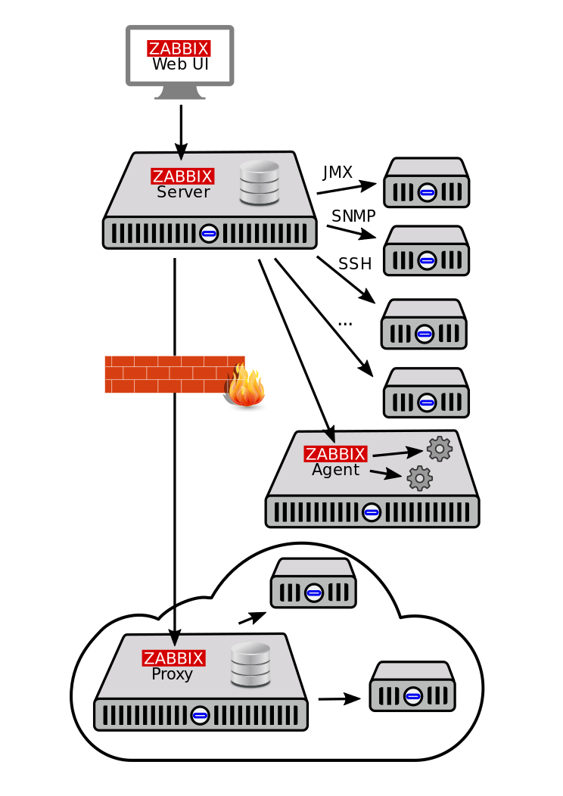
- Luồng dữ liệu
	- Để tạo một item (mục) thu thập dữ liệu, trước tiên cần tạo một host (máy chủ). Ở phía còn lại của hệ thống Zabbix, phải có một item trước khi có thể tạo một trigger (ngưỡng kích hoạt). Và phải có một trigger mới có thể tạo một action (hành động).
	- Ví dụ, nếu muốn nhận cảnh báo rằng tải CPU của máy chủ X quá cao, trước tiên phải tạo một mục nhập host cho máy chủ X, sau đó là một item để giám sát CPU của nó, rồi một trigger sẽ kích hoạt nếu CPU quá cao, tiếp theo là một action gửi email thông báo.
	
### 2.1 Zabbix Server 
#### 2.1.1 Tổng quan
- Đây là thành phần trung tâm của phần mềm Zabbix. Server có thể kiểm tra các dịch vụ mạng từ xa. Agent sẽ báo cáo toàn bộ thông tin và số lượng thống kê cho server. Server sẽ lưu trữ tất cả cấu hình và dữ liệu thống kê.
- Máy chủ Zabbix là tiến trình trung tâm của phần mềm Zabbix.
- Máy chủ thực hiện việc polling và trapping  dữ liệu, tính toán các trigger (ngưỡng kích hoạt), và gửi thông báo đến người dùng. Đây là thành phần trung tâm mà các Zabbix agent và proxy báo cáo dữ liệu về tình trạng sẵn sàng và tính toàn vẹn của các hệ thống. Máy chủ cũng có thể tự kiểm tra từ xa các dịch vụ mạng (như máy chủ web và máy chủ thư điện tử) bằng cách sử dụng các kiểm tra dịch vụ đơn giản.
- Máy chủ là kho lưu trữ trung tâm nơi tất cả dữ liệu cấu hình, thống kê và hoạt động được lưu trữ. Nó cũng là thực thể trong Zabbix sẽ chủ động cảnh báo cho quản trị viên khi có sự cố phát sinh trong bất kỳ hệ thống được giám sát nào.
- Hoạt động của một máy chủ Zabbix cơ bản được chia thành ba thành phần riêng biệt: máy chủ Zabbix, giao diện web (web frontend) và lưu trữ cơ sở dữ liệu.
- Tất cả thông tin cấu hình cho Zabbix đều được lưu trữ trong cơ sở dữ liệu, nơi cả máy chủ và giao diện web đều tương tác. Ví dụ, khi một item (mục dữ liệu) mới được tạo bằng giao diện web (hoặc API), nó sẽ được thêm vào bảng item trong cơ sở dữ liệu. Sau đó, khoảng mỗi phút một lần, máy chủ Zabbix sẽ truy vấn bảng item để lấy danh sách các item đang hoạt động, sau đó được lưu trữ trong một bộ nhớ đệm bên trong máy chủ Zabbix. Đây là lý do tại sao có thể mất đến hai phút để bất kỳ thay đổi nào được thực hiện trong giao diện Zabbix hiển thị trong phần dữ liệu mới nhất.
- Zabbix Server hỗ trợ trên nhiều nền tảng:
	- Linux
	- Solaris
	- AIX
	- HP-UX
	- Mac OS X
	- FreeBSD
	- OpenBSD
	- NetBSD
	- SCO Open Server
- Máy chủ Zabbix hoạt động như một tiến trình daemon. 
	- Được cài đặt dễ dàng bằng lệnh 
	```bash
	apt install zabbix-server
	```
	- Các lệnh điều khiển: Tương tự các daemon khác, để dừng, khởi động lại hoặc xem trạng thái của máy chủ, sử dụng các lệnh sau:
	```bash
	systemctl stop zabbix-server
	systemctl restart zabbix-server
	systemctl status zabbix-server
	```
	- Có thể sử dụng các tham số dòng lệnh sau với máy chủ Zabbix:
		- `-c --config <file>`: Đường dẫn đến tệp cấu hình (mặc định là `/usr/local/etc/zabbix_server.conf`).
		- `-f --foreground`: Chạy máy chủ Zabbix ở chế độ nền trước.
		- `-R --runtime-control <option>`: Thực hiện các chức năng quản trị.
		- `-T --test-config`: Xác thực tệp cấu hình và thoát.
		- `-h --help`: Hiển thị trợ giúp.
		- `-V --version`: Hiển thị số phiên bản.
	- Ví dụ về việc chạy máy chủ Zabbix với các tham số dòng lệnh:
	```bash
	zabbix_server -c /usr/local/etc/zabbix_server.conf
	zabbix_server --help
	zabbix_server -V
	```
- Bên cạnh đó Zabbix cung cấp các tùy chọn điều khiển để thực hiện các chức năng quản trị mà không cần dừng và khởi động lại máy chủ. Điều này giúp quản lý hệ thống một cách linh hoạt và hiệu quả hơn.

| Tùy chọn                                 | Mô tả                                                                                                                                                                                                                                                                                                                                                   | Đối tượng (Target)                                                                                                                                                       |
|------------------------------------------|-----------------------------------------------------------------------------------------------------------------------------------------------------------------------------------------------------------------------------------------------------------------------------------------------------------------------------------------------------------|--------------------------------------------------------------------------------------------------------------------------------------------------------------------------|
| `config_cache_reload`                    | Tải lại bộ nhớ đệm cấu hình. Bị bỏ qua nếu bộ nhớ đệm đang được tải.                                                                                                                                                                                                                                                                                     | -                                                                                                                                                                        |
| `diaginfo[=<section>]`                   | Thu thập thông tin chẩn đoán vào tệp nhật ký máy chủ.                                                                                                                                                                                                                                                                                                    | `historycache` – Thống kê bộ nhớ đệm lịch sử<br>`valuecache` – Thống kê bộ nhớ đệm giá trị<br>`preprocessing` – Thống kê bộ quản lý tiền xử lý<br>`alerting` – Thống kê bộ quản lý cảnh báo<br>`lld` – Thống kê bộ quản lý LLD<br>`locks` – Danh sách mutex (trống trên hệ BSD)<br>`connector` – Thống kê các kết nối có hàng đợi lớn nhất |
| `ha_status`                              | Ghi trạng thái cụm (cluster) High Availability (HA) vào nhật ký.                                                                                                                                                                                                                                                                                         | -                                                                                                                                                                        |
| `ha_remove_node=target`                  | Gỡ bỏ nút trong cụm HA theo tên hoặc ID. Không thể gỡ bỏ các nút active/standby.                                                                                                                                                                                                                                                                          | `target` – Tên hoặc ID của nút (lấy bằng lệnh `ha_status`)                                                                                                                |
| `ha_set_failover_delay=delay`            | Thiết lập độ trễ chuyển đổi dự phòng (failover) trong cụm HA. Hỗ trợ hậu tố thời gian, ví dụ: `10s`, `1m`.                                                                                                                                                                                                                                                | -                                                                                                                                                                        |
| `proxy_config_cache_reload[=<target>]`   | Tải lại bộ nhớ đệm cấu hình proxy. Nếu không chỉ định, tải lại cho tất cả proxy.                                                                                                                                                                                                                                                                          | `target` – Danh sách tên proxy, phân tách bằng dấu phẩy.                                                                                                                  |
| `secrets_reload`                         | Tải lại thông tin bí mật từ Vault.                                                                                                                                                                                                                                                                                                                       | -                                                                                                                                                                        |
| `service_cache_reload`                   | Tải lại bộ nhớ đệm của bộ quản lý dịch vụ.                                                                                                                                                                                                                                                                                                                | -                                                                                                                                                                        |
| `snmp_cache_reload`                      | Tải lại bộ nhớ đệm SNMP, xóa các thuộc tính SNMP (engine time, engine boots, engine id, thông tin xác thực) cho tất cả các máy chủ.                                                                                                                                                                                                                       | -                                                                                                                                                                        |
| `housekeeper_execute`                    | Khởi chạy quy trình dọn dẹp (housekeeping). Bị bỏ qua nếu quy trình đang chạy.                                                                                                                                                                                                                                                                           | -                                                                                                                                                                        |
| `trigger_housekeeper_execute`            | Khởi chạy quy trình dọn dẹp cho các dịch vụ để xóa sự cố do các trigger đã bị xóa, bao gồm các sự cố dịch vụ được tạo bởi các trigger này (coi như đã xử lý khi dọn dẹp). Đề xuất tăng tần suất bằng cách điều chỉnh tham số `ProblemHousekeepingFrequency` nếu có nhiều trigger được phát hiện/thay đổi thường xuyên. Bị bỏ qua nếu quy trình đang chạy. | -                                                                                                                                                                        |
| `log_level_increase[=<target>]`          | Tăng mức ghi log. Ảnh hưởng đến tất cả các tiến trình nếu không chỉ định đối tượng. Không hỗ trợ trên hệ BSD.                                                                                                                                                                                                                                             | `process type` – Tất cả tiến trình của loại chỉ định (vd: `poller`)<br>`process type,N` – Loại và số tiến trình (vd: `poller,3`)<br>`pid` – PID (1–65535)                |
| `log_level_decrease[=<target>]`          | Giảm mức ghi log. Ảnh hưởng đến tất cả các tiến trình nếu không chỉ định đối tượng. Không hỗ trợ trên hệ BSD.                                                                                                                                                                                                                                             | Như `log_level_increase`.                                                                                                                                                 |
| `prof_enable[=<target>]`                 | Bật chế độ profiling. Nếu không chỉ định đối tượng, ảnh hưởng đến tất cả tiến trình. Hiển thị chi tiết về tất cả rwlock/mutex theo tên hàm.                                                                                                                                                                                                                | `process type` – Tất cả tiến trình của loại chỉ định (vd: `history syncer`)<br>`process type,N` – Loại và số tiến trình (vd: `history syncer,1`)<br>`pid` – PID (1–65535)<br>`scope` – `rwlock`, `mutex`, `processing` (có thể kết hợp với loại và số tiến trình)                                                               |
| `prof_disable[=<target>]`                | Tắt chế độ profiling. Nếu không chỉ định đối tượng, ảnh hưởng đến tất cả tiến trình.                                                                                                                                                                                                                                                                      | Như `prof_enable`.                                                                                                                                                        |

#### 2.1.2 High Availability
- Tính sẵn sàng cao (HA) thường là yêu cầu bắt buộc đối với các cơ sở hạ tầng quan trọng, nơi gần như không thể chấp nhận thời gian ngừng hoạt động. Do đó, đối với bất kỳ dịch vụ nào có thể gặp sự cố, phải có một tùy chọn chuyển đổi dự phòng (failover) sẵn sàng để đảm nhận nếu dịch vụ hiện tại gặp trục trặc.
- Zabbix cung cấp một giải pháp HA nguyên bản (native), dễ cài đặt và không đòi hỏi kinh nghiệm về HA trước đó. Zabbix HA nguyên bản có thể hữu ích để tăng cường thêm một lớp bảo vệ chống lại các lỗi phần mềm/phần cứng của máy chủ Zabbix hoặc để giảm thiểu thời gian ngừng hoạt động do bảo trì.
- Trong chế độ sẵn sàng cao của Zabbix, nhiều máy chủ Zabbix được chạy như các nút trong một cụm. Trong khi một máy chủ Zabbix trong cụm đang hoạt động, các máy chủ khác sẽ ở chế độ chờ (standby), sẵn sàng tiếp quản khi cần thiết.
- Để khởi động máy chủ Zabbix dưới dạng một nút cụm (cluster node), cần hai tham số trong cấu hình máy chủ:
	- Tham số `HANodeName`** phải được chỉ định cho mỗi máy chủ Zabbix sẽ là một nút cụm HA.
		- Đây là một định danh nút duy nhất (ví dụ: `zabbix-node-01`) mà máy chủ sẽ được tham chiếu trong cấu hình của agent và proxy. Nếu không chỉ định `HANodeName`, máy chủ sẽ được khởi động ở chế độ độc lập (standalone mode).
	- Tham số `NodeAddress`** phải được chỉ định cho mỗi nút.
		- Tham số `NodeAddress` (địa chỉ:cổng) sẽ được giao diện Zabbix (frontend) sử dụng để kết nối với nút máy chủ đang hoạt động. `NodeAddress` phải khớp với địa chỉ IP hoặc tên FQDN của máy chủ Zabbix tương ứng.
- Sau khi thực hiện các thay đổi đối với tệp cấu hình, **khởi động lại tất cả các máy chủ Zabbix**. Chúng sẽ được khởi động dưới dạng các nút cụm. Trạng thái mới của các máy chủ có thể được xem trong mục **Reports → System information** (Báo cáo → Thông tin hệ thống) và cũng bằng cách chạy lệnh:
```bash
zabbix_server -R ha_status
```
- Cấu hình các node trong cluster HA Zabbix-server tại các thành phần Proxy và Agent 
	- Proxy 
		- Đối với proxy thụ động, tên nút phải được liệt kê trong tham số `Server` của proxy, cách nhau bằng dấu phẩy:
		```
		Server=zabbix-node-01,zabbix-node-02
		```
		- Đối với proxy chủ động, tên nút phải được liệt kê trong tham số `Server` của proxy, cách nhau bằng dấu chấm phẩy:
		```
		Server=zabbix-node-01;zabbix-node-02
		```
	- Agent
		- Để bật các kiểm tra thụ động, tên nút phải được liệt kê trong tham số `Server`, cách nhau bằng dấu phẩy:
		```
		Server=zabbix-node-01,zabbix-node-02
		```
		- Để bật các kiểm tra chủ động, tên nút phải được liệt kê trong tham số `ServerActive`. Lưu ý rằng đối với các kiểm tra chủ động, các nút phải được phân tách bằng dấu phẩy với bất kỳ máy chủ nào khác, trong khi bản thân các nút phải được phân tách bằng dấu chấm phẩy, ví dụ:
		```
		ServerActive=zabbix-node-01;zabbix-node-02
		```
- Các lệnh cấu hình HA 
	- Zabbix sẽ tự động chuyển đổi dự phòng sang một nút khác nếu nút đang hoạt động dừng. Phải có ít nhất một nút ở trạng thái chờ để quá trình chuyển đổi dự phòng diễn ra.
	- Tốc độ chuyển đổi dự phòng sẽ như thế nào? Tất cả các nút cập nhật thời gian truy cập cuối cùng của chúng (và trạng thái, nếu có thay đổi) cứ sau 5 giây. Vì vậy:
		- Nếu nút đang hoạt động tắt và kịp báo cáo trạng thái của nó là "stopped", một nút khác sẽ tiếp quản trong vòng **5 giây**.
		- Nếu nút đang hoạt động tắt/trở nên không khả dụng mà không thể cập nhật trạng thái của nó, các nút chờ sẽ đợi **thời gian trễ chuyển đổi dự phòng** + 5 giây để tiếp quản.
	- Thời gian trễ chuyển đổi dự phòng có thể cấu hình, với phạm vi hỗ trợ từ 10 giây đến 15 phút (mặc định là một phút). Để thay đổi thời gian trễ chuyển đổi dự phòng, có thể chạy:
	```bash
	zabbix_server -R ha_set_failover_delay=5m
	```
	- Quản lý cụm HA: Trạng thái hiện tại của cụm HA có thể được quản lý bằng các tùy chọn:
		- `ha_status`: Ghi nhật ký trạng thái cụm HA vào tệp nhật ký máy chủ Zabbix (và ra stdout).
		- `ha_remove_node=target`: Xóa một nút HA được xác định bằng `<target>` của nó - tên hoặc ID của nút (tên/ID có thể lấy từ đầu ra của lệnh `ha_status`), ví dụ:
			- Ví dụ 
			```bash
			zabbix_server -R ha_remove_node=zabbix-node-02
			```
			- Lưu ý rằng các nút đang hoạt động/chờ không thể bị xóa.

### 2.2 Zabbix Agent 
#### 2.2.1 Zabbix Agent
- Zabbix agent được triển khai trên mục tiêu giám sát để chủ động theo dõi các tài nguyên và ứng dụng cục bộ (ổ cứng, bộ nhớ, thống kê bộ xử lý, v.v.).
- Agent thu thập thông tin hoạt động cục bộ và báo cáo dữ liệu về máy chủ Zabbix để xử lý tiếp. Trong trường hợp xảy ra sự cố (chẳng hạn như ổ cứng đầy hoặc tiến trình dịch vụ bị lỗi), máy chủ Zabbix có thể chủ động cảnh báo cho các quản trị viên của máy cụ thể đã báo cáo lỗi đó.
- Zabbix agent có hiệu suất cao nhờ việc sử dụng các lời gọi hệ thống gốc (native system calls) để thu thập thông tin thống kê.
- Active/Passive Checks: Zabbix agent có thể thực hiện kiểm tra thụ động và chủ động:
	- Kiểm tra thụ động (Passive checks): Zabbix agent phản hồi yêu cầu từ máy chủ Zabbix (hoặc proxy). Ví dụ, máy chủ yêu cầu dữ liệu (ví dụ: tải CPU), và agent trả về kết quả.
	- Kiểm tra chủ động (Active checks): Zabbix agent thu thập và gửi dữ liệu mà không cần chờ yêu cầu từ máy chủ Zabbix (hoặc proxy). Đầu tiên, nó truy xuất danh sách các mục giám sát từ máy chủ (tải CPU, bộ nhớ khả dụng, v.v.), sau đó thu thập dữ liệu cần thiết và định kỳ gửi các giá trị mới trở lại máy chủ.
- Zabbix Agent được cài thông qua lệnh 
```
apt install zabbix-agent 
```

- Zabbix Agent có thể chạy nhiều phiên bản (instance) trên cùng một máy chủ.  Các tham số kèm theo lệnh chạy: 
	- Tham số (Áp dụng cho cả UNIX và Windows)

	| Tham số                              | Mô tả                                                                                                                                                                                                                     |
	|--------------------------------------|-----------------------------------------------------------------------------------------------------------------------------------------------------------------------------------------------------------------------------|
	| `-c`, `--config <config-file>`       | Đường dẫn tới tệp cấu hình. Dùng để chỉ định tệp cấu hình khác tệp mặc định.<br>**Mặc định:**<br>• UNIX: `/usr/local/etc/zabbix_agentd.conf` (hoặc theo `--sysconfdir`, `--prefix` khi biên dịch)<br>• Windows: `C:\Program Files\Zabbix Agent\zabbix_agentd.conf` |
	| `-f`, `--foreground`                 | Chạy Zabbix Agent ở chế độ foreground (mặc định: `true`).                                                                                                                                                                  |
	| `-p`, `--print`                      | In tất cả các item đã biết và thoát.<br>Lưu ý: Cần chỉ định tệp cấu hình nếu không nằm ở vị trí mặc định để trả về các kết quả từ `UserParameter`.                                                                          |
	| `-t`, `--test <item key>`            | Kiểm tra item theo khóa chỉ định và thoát.<br>Lưu ý: Cần chỉ định tệp cấu hình nếu không nằm ở vị trí mặc định để trả về các kết quả từ `UserParameter`.                                                                     |
	| `-T`, `--test-config`                | Kiểm tra và xác thực tệp cấu hình, sau đó thoát.                                                                                                                                                                            |
	| `-h`, `--help`                       | Hiển thị thông tin trợ giúp.                                                                                                                                                                                               |
	| `-V`, `--version`                    | Hiển thị phiên bản của Zabbix Agent.                                                                                                                                                                                        |

	- Tham số chỉ dành cho UNIX Agent

	| Tham số                                | Mô tả                                                                                                    |
	|----------------------------------------|----------------------------------------------------------------------------------------------------------|
	| `-R`, `--runtime-control <option>`     | Thực hiện các chức năng quản trị khi Agent đang chạy.   |

	- Tham số chỉ dành cho Windows Agent

	| Tham số                                | Mô tả                                                                                                                                                                                                                                   |
	|----------------------------------------|-------------------------------------------------------------------------------------------------------------------------------------------------------------------------------------------------------------------------------------------|
	| `-m`, `--multiple-agents`              | Cho phép chạy nhiều instance Agent (dùng kèm các tùy chọn `-i`, `-d`, `-s`, `-x`). Tên dịch vụ mỗi instance sẽ được bổ sung giá trị `Hostname` từ tệp cấu hình để phân biệt.                                                              |
	| `-S`, `--startup-type <value>`         | Thiết lập kiểu khởi động dịch vụ Agent trong Windows. Giá trị hợp lệ:<br>`automatic` (mặc định) – Tự động khởi động khi Windows khởi động.<br>`delayed` – Khởi động trễ (Windows Vista/Server 2008+).<br>`manual` – Khởi động thủ công.<br>`disabled` – Vô hiệu hóa dịch vụ. Có thể dùng cùng với `-i` hoặc độc lập để thay đổi dịch vụ đã cài đặt. |
	| `-i`, `--install`                      | Cài đặt Zabbix Agent làm dịch vụ Windows.                                                                                                                                                                                                 |
	| `-d`, `--uninstall`                    | Gỡ cài đặt dịch vụ Zabbix Agent khỏi Windows.                                                                                                                                                                                              |
	| `-s`, `--start`                        | Khởi động dịch vụ Zabbix Agent trong Windows.                                                                                                                                                                                              |
	| `-x`, `--stop`                         | Dừng dịch vụ Zabbix Agent trong Windows.                                                                                                                                                                                                   |

- Các tham số sử dụng khi chạy không cần khởi động lại 

| Tùy chọn                                   | Mô tả                                                                                                                                                                            | Đối tượng (Target)                                                                                                                                                                  |
|-------------------------------------------|----------------------------------------------------------------------------------------------------------------------------------------------------------------------------------|--------------------------------------------------------------------------------------------------------------------------------------------------------------------------------------|
| `log_level_increase[=<target>]`           | Tăng mức ghi log. Nếu không chỉ định đối tượng, tất cả tiến trình sẽ bị ảnh hưởng.                                                                                               | `process type` – Tất cả tiến trình của loại chỉ định (vd: `listener`)<br>`process type,N` – Loại và số thứ tự của tiến trình (vd: `listener,3`)<br>`pid` – PID (1–65535). Với PID lớn, sử dụng dạng `process type,N`. |
| `log_level_decrease[=<target>]`           | Giảm mức ghi log. Nếu không chỉ định đối tượng, tất cả tiến trình sẽ bị ảnh hưởng.                                                                                               | Như `log_level_increase`.                                                                                                                                                             |
| `userparameter_reload`                    | Tải lại các giá trị từ tùy chọn `UserParameter` và `Include` trong tệp cấu hình hiện tại mà không cần khởi động lại Agent.                                                      | -                                                                                                                                                                                    |

- Các loại tiến trình Agent
	- Zabbix agent hoạt động với các loại tiến trình chính sau:
		- active checks: Tiến trình thực hiện các kiểm tra chủ động.
		- collector: Tiến trình thu thập dữ liệu.
		- listener: Tiến trình lắng nghe các kiểm tra thụ động.

#### 2.2.2 Zabbix Agent 2
- Zabbix Agent 2 là thế hệ Zabbix agent mới, được viết bằng ngôn ngữ Go (với một số mã C được tái sử dụng từ Zabbix agent). Nó được thiết kế để:
- Giảm số lượng kết nối TCP.
- Cung cấp khả năng kiểm tra đồng thời (concurrency of checks) được cải thiện.
- Dễ dàng mở rộng bằng các plugin, cung cấp các kiểm tra đơn giản với mã tối thiểu và hỗ trợ các kiểm tra phức tạp bao gồm các tập lệnh chạy dài và thu thập dữ liệu độc lập với báo cáo định kỳ.
- Hoạt động như một sự thay thế cho Zabbix agent, hỗ trợ tất cả các tính năng trước đây.
- Active/Passive Checks: Zabbix Agent 2 hỗ trợ kiểm tra thụ động và chủ động, tương tự như Zabbix agent. 
	- Các kiểm tra chủ động của Zabbix Agent 2 còn hỗ trợ khoảng thời gian linh hoạt/lên lịch và kiểm tra đồng thời trong một máy chủ chủ động.
	- Theo mặc định, sau khi khởi động lại, Zabbix Agent 2 sẽ lên lịch thu thập dữ liệu lần đầu tiên cho các kiểm tra chủ động tại một thời điểm ngẫu nhiên có điều kiện trong khoảng thời gian cập nhật của mục để ngăn chặn sự tăng đột biến trong việc sử dụng tài nguyên. Để thực hiện các kiểm tra chủ động không có khoảng thời gian cập nhật Scheduling ngay sau khi agent khởi động lại, hãy đặt tham số ForceActiveChecksOnStart (cấp độ toàn cục) hoặc Plugins.<Plugin name>.System.ForceActiveChecksOnStart (chỉ ảnh hưởng đến các kiểm tra plugin cụ thể) trong tệp cấu hình. Tham số cấp plugin, nếu được đặt, sẽ ghi đè tham số toàn cục.
- Kiểm tra đồng thời (Check Concurrency): Các kiểm tra từ các plugin khác nhau có thể được thực thi đồng thời. Số lượng kiểm tra đồng thời trong một plugin bị giới hạn bởi cài đặt dung lượng của plugin. Mỗi plugin có thể có một cài đặt dung lượng được mã hóa cứng (mặc định là 1000) có thể được giảm bằng cách sử dụng cài đặt Plugins.<PluginName>.System.Capacity=N trong tham số cấu hình Plugins.\
- Zabbix Agent 2 có thể chạy nhiều phiên bản (instance) trên cùng một máy chủ.  Các tham số kèm theo lệnh chạy: 
	- Tham số (Áp dụng cho cả UNIX và Windows)
	
	| Tham số                              | Mô tả                                                                                                                                                                                                                                   |
	|--------------------------------------|-------------------------------------------------------------------------------------------------------------------------------------------------------------------------------------------------------------------------------------------|
	| `-c`, `--config <config-file>`       | Đường dẫn tới tệp cấu hình. Cho phép chỉ định tệp cấu hình khác với mặc định.<br>**Mặc định:**<br>• UNIX: `/usr/local/etc/zabbix_agent2.conf` (hoặc theo biến biên dịch `--sysconfdir`, `--prefix`)<br>• Windows: `C:\Program Files\Zabbix Agent 2\zabbix_agent2.conf` |
	| `-f`, `--foreground`                 | Chạy Agent ở chế độ foreground (mặc định: `true`).                                                                                                                                                                                        |
	| `-p`, `--print`                      | In tất cả các item tích hợp sẵn và thoát.<br>Lưu ý: Cần chỉ định tệp cấu hình nếu không nằm ở vị trí mặc định để trả về các kết quả từ `UserParameter`.                                                                                   |
	| `-t`, `--test <item key>`            | Kiểm tra item theo khóa chỉ định và thoát.<br>Lưu ý: Cần chỉ định tệp cấu hình nếu không nằm ở vị trí mặc định để trả về các kết quả từ `UserParameter`.                                                                                    |
	| `-T`, `--test-config`                | Xác thực tệp cấu hình và thoát.                                                                                                                                                                                                           |
	| `-h`, `--help`                       | Hiển thị thông tin trợ giúp và thoát.                                                                                                                                                                                                     |
	| `-v`, `--verbose`                    | In thông tin gỡ lỗi (debug). Thường dùng kết hợp với `-p` hoặc `-t`.                                                                                                                                                                      |
	| `-V`, `--version`                    | Hiển thị phiên bản và thông tin giấy phép của Agent.                                                                                                                                                                                       |
	| `-R`, `--runtime-control <option>`   | Thực hiện các chức năng quản trị (xem phần **Runtime Control**).                                                                                                                                                                          |

	### Chỉ dành cho Windows

	| Tham số                                | Mô tả                                                                                                                                                                                                                                   |
	|----------------------------------------|-------------------------------------------------------------------------------------------------------------------------------------------------------------------------------------------------------------------------------------------|
	| `-m`, `--multiple-agents`              | Cho phép chạy nhiều instance Agent (dùng với `-i`, `-d`, `-s`, `-x`). Tên dịch vụ mỗi instance sẽ kèm giá trị `Hostname` từ tệp cấu hình để phân biệt.                                                                                     |
	| `-S`, `--startup-type <value>`         | Thiết lập kiểu khởi động dịch vụ Agent. Giá trị hợp lệ:<br>`automatic` (mặc định) – Tự động khởi động khi Windows khởi động.<br>`delayed` – Khởi động trễ (Windows Vista/Server 2008+).<br>`manual` – Khởi động thủ công.<br>`disabled` – Vô hiệu hóa dịch vụ. Có thể dùng cùng với `-i` hoặc độc lập để thay đổi dịch vụ đã cài đặt. |
	| `-i`, `--install`                      | Cài đặt Zabbix Agent 2 làm dịch vụ Windows.                                                                                                                                                                                                 |
	| `-d`, `--uninstall`                    | Gỡ cài đặt dịch vụ Zabbix Agent 2.                                                                                                                                                                                                          |
	| `-s`, `--start`                        | Khởi động dịch vụ Zabbix Agent 2.                                                                                                                                                                                                           |
	| `-x`, `--stop`                         | Dừng dịch vụ Zabbix Agent 2.                                                                                                                                                                                                                |

- Các tham số sử dụng khi chạy không cần khởi động lại 

| Tùy chọn                 | Mô tả                                                                                                   |
|--------------------------|---------------------------------------------------------------------------------------------------------|
| `log_level_increase`     | Tăng mức ghi log.                                                                                       |
| `log_level_decrease`     | Giảm mức ghi log.                                                                                       |
| `metrics`                | Liệt kê các metric khả dụng.                                                                            |
| `version`                | Hiển thị phiên bản của Agent.                                                                            |
| `userparameter_reload`   | Tải lại các giá trị từ `UserParameter` và `Include` trong tệp cấu hình mà không cần khởi động lại Agent. |
| `help`                   | Hiển thị thông tin trợ giúp về các tùy chọn runtime control.                                             |

### 2.3 Zabbix Proxy  
- Zabbix proxy là một tiến trình có thể thu thập dữ liệu giám sát từ một hoặc nhiều thiết bị được giám sát và gửi thông tin đó đến máy chủ Zabbix, về cơ bản hoạt động thay mặt cho máy chủ. Tất cả dữ liệu đã thu thập sẽ được đệm cục bộ và sau đó được chuyển đến máy chủ Zabbix mà proxy thuộc về.
- Việc triển khai một proxy là tùy chọn, nhưng có thể rất hữu ích khi dùng để phân tán tải của một máy chủ Zabbix duy nhất. Nếu chỉ các proxy thu thập dữ liệu, quá trình xử lý trên máy chủ sẽ ít tiêu tốn CPU và I/O đĩa hơn.
- Zabbix proxy là giải pháp lý tưởng để giám sát tập trung các địa điểm từ xa, chi nhánh và mạng không có quản trị viên cục bộ.
- Zabbix proxy yêu cầu một cơ sở dữ liệu riêng.

- Zabbix Proxy hoạt động như một tiến trình daemon. 
	- Được cài đặt dễ dàng bằng lệnh 
	```bash
	apt install zabbix-proxy
	```
	- Các lệnh điều khiển: Tương tự các daemon khác, để dừng, khởi động lại hoặc xem trạng thái của máy chủ, sử dụng các lệnh sau:
	```bash
	systemctl stop zabbix-proxy
	systemctl restart zabbix-proxy
	systemctl status zabbix-proxy
	```
	- Có thể sử dụng các tham số dòng lệnh sau với Zabbix Proxy:
	
	| Tham số                            | Mô tả                                                                                     |
	| ---------------------------------- | ----------------------------------------------------------------------------------------- |
	| `-c`, `--config <file>`            | Đường dẫn đến tệp cấu hình Proxy.                                                         |
	| `-f`, `--foreground`               | Chạy Proxy ở chế độ foreground.                                                           |
	| `-R`, `--runtime-control <option>` | Thực hiện chức năng quản trị khi Proxy đang chạy (xem chi tiết phần **Runtime Control**). |
	| `-T`, `--test-config`              | Kiểm tra và xác thực tệp cấu hình, sau đó thoát.                                          |
	| `-h`, `--help`                     | Hiển thị thông tin trợ giúp.                                                              |
	| `-V`, `--version`                  | Hiển thị phiên bản của Zabbix Proxy.                                                      |

	- Ví dụ về việc chạy máy chủ Zabbix với các tham số dòng lệnh:
	```bash
	- Khởi động Proxy với tệp cấu hình cụ thể
	zabbix_proxy -c /usr/local/etc/zabbix_proxy.conf
	- Hiển thị trợ giúp
	zabbix_proxy --help
	- Hiển thị phiên bản Proxy
	zabbix_proxy -V
	```
- Bên cạnh đó Zabbix cung cấp các tùy chọn điều khiển để thực hiện các chức năng quản trị mà không cần dừng và khởi động lại. Điều này giúp quản lý hệ thống một cách linh hoạt và hiệu quả hơn.

| Tùy chọn                                   | Mô tả                                                                                                                                                                                                                           | Đối tượng (Target)                                                                                                                                                                |
|-------------------------------------------|-----------------------------------------------------------------------------------------------------------------------------------------------------------------------------------------------------------------------------------|------------------------------------------------------------------------------------------------------------------------------------------------------------------------------------|
| `config_cache_reload`                     | Tải lại (reload) bộ nhớ đệm cấu hình. Bỏ qua nếu cache đang được nạp.<br>• **Proxy Active** sẽ kết nối với Zabbix Server để yêu cầu dữ liệu cấu hình.<br>• **Proxy Passive** sẽ yêu cầu dữ liệu khi Server kết nối lần tiếp theo. | -                                                                                                                                                                                  |
| `diaginfo[=<section>]`                    | Thu thập thông tin chẩn đoán trong file log của Proxy.                                                                                                                                                                            | `historycache` – thống kê bộ nhớ đệm lịch sử<br>`preprocessing` – thống kê bộ xử lý dữ liệu<br>`locks` – danh sách mutex (rỗng trên BSD)                                          |
| `snmp_cache_reload`                       | Tải lại cache SNMP, xóa các thuộc tính SNMP (engine time, engine boots, engine id, credentials) cho toàn bộ host.                                                                                                               | -                                                                                                                                                                                  |
| `housekeeper_execute`                     | Khởi chạy tiến trình housekeeping ngay lập tức. Bỏ qua nếu housekeeping đang chạy.                                                                                                                                                | -                                                                                                                                                                                  |
| `log_level_increase[=<target>]`           | Tăng mức ghi log. Nếu không chỉ định, áp dụng cho tất cả tiến trình. Không hỗ trợ trên BSD.                                                                                                                                       | `process type` – tất cả tiến trình theo loại (vd: `poller`)<br>`process type,N` – loại và số thứ tự tiến trình (vd: `poller,3`)<br>`pid` – PID (1–65535, với PID lớn cần dùng dạng `process type,N`). |
| `log_level_decrease[=<target>]`           | Giảm mức ghi log. Nếu không chỉ định, áp dụng cho tất cả tiến trình. Không hỗ trợ trên BSD.                                                                                                                                       | Như `log_level_increase`.                                                                                                                                                          |
| `prof_enable[=<target>]`                  | Bật chế độ profiling (ghi chi tiết hoạt động rwlocks/mutexes theo tên hàm). Nếu không chỉ định target, áp dụng cho tất cả tiến trình.                                                                                            | `process type` – tất cả tiến trình theo loại (vd: `history syncer`)<br>`process type,N` – loại và số thứ tự (vd: `history syncer,1`)<br>`pid` – PID (1–65535)<br>`scope` – `rwlock`, `mutex`, `processing` có thể kết hợp với loại tiến trình (vd: `history syncer,1,processing` hoặc `history syncer,rwlock`). |
| `prof_disable[=<target>]`                 | Tắt chế độ profiling. Nếu không chỉ định target, áp dụng cho tất cả tiến trình.                 

### 2.4 Zabbix Web 
- Là một giao diện web được viết bằng ngôn ngữ lập trình PHP, cho phép người quản trị hệ thống có thể cấu hình, giám sát, xem các dữ liệu thu thập được trên một giao diện web duy nhất
- 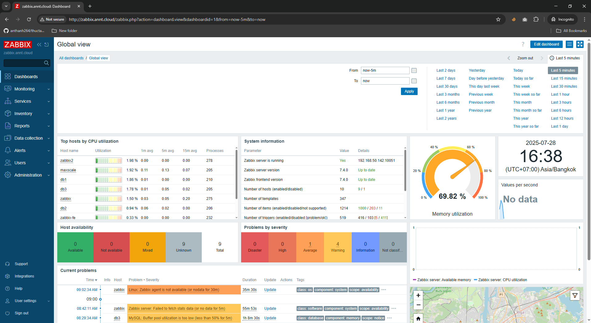

### 2.5 Zabbix Sender, Zabbix Get & Zabbix Js 
#### 2.5.1 Zabbix Sender
- Zabbix sender là một tiện ích dòng lệnh dùng để gửi dữ liệu hiệu năng đến Zabbix server để xử lý.
- Tiện ích này thường được sử dụng trong các script chạy dài để định kỳ gửi dữ liệu khả dụng và hiệu năng.
- Để gửi dữ liệu trực tiếp tới Zabbix server hoặc proxy, cần cấu hình một item loại trapper.
- Chạy Zabbix sender:
	- Ví dụ chạy Zabbix sender trên UNIX:
	```
	cd bin
	./zabbix_sender -z zabbix -s "Linux DB3" -k db.connections -o 43
	```
	- Trong đó:
		- z: máy chủ Zabbix (có thể sử dụng địa chỉ IP)
		- s: tên kỹ thuật của host được giám sát (được đăng ký trong Zabbix frontend)
		- k: khóa (item key)
		- o: giá trị cần gửi
- Zabbix sender có thể được sử dụng để gửi nhiều giá trị từ một tệp đầu vào (xem thêm trong tài liệu manpage của zabbix_sender).
- Zabbix sender chấp nhận chuỗi UTF-8 (trên cả UNIX và Windows) mà không có BOM ở đầu tệp.
- Trên Windows, Zabbix sender có thể chạy tương tự:
	- zabbix_sender.exe [options]
- Chạy Zabbix sender với low-level discovery:
	- Ví dụ gửi giá trị JSON cho low-level discovery:
	- ./zabbix_sender -z 192.168.1.113 -s "Zabbix server" -k trapper.discovery.item -o '[{"{#FSNAME}":"/","{#FSTYPE}":"rootfs"},{"{#FSNAME}":"/sys","{#FSTYPE}":"sysfs"}]'
	- Để hoạt động, rule low-level discovery phải có item loại Zabbix trapper (trong ví dụ này là key trapper.discovery.item).

#### 2.5.2 Zabbix Get 
- Zabbix get là một tiện ích dòng lệnh dùng để giao tiếp với Zabbix agent và lấy thông tin từ agent.
- Tiện ích này thường được sử dụng để xử lý sự cố (troubleshooting) của các Zabbix agent.
- Chạy Zabbix get:
	- Ví dụ chạy Zabbix get trên UNIX để lấy giá trị tải CPU từ agent:
	```
	cd bin
	./zabbix\_get -s 127.0.0.1 -p 10050 -k system.cpu.load\[all,avg1]
	```
	- Ví dụ khác chạy Zabbix get để lấy chuỗi từ một website:
	```
	cd bin
	./zabbix\_get -s 192.168.1.1 -p 10050 -k "web.page.regexp\[[www.example.com,,,"USA](http://www.example.com,,,%22USA): (\[a-zA-Z0-9.-]+)",,\1]"
	```
	- Chú ý: Item key trong ví dụ trên có chứa dấu cách, vì vậy cần đặt trong dấu ngoặc kép `" "` để shell nhận diện chính xác. Các dấu ngoặc kép này không phải là một phần của item key – shell sẽ loại bỏ chúng trước khi gửi tới Zabbix agent.
	- Nếu item key không được hỗ trợ, Zabbix get sẽ trả về mã thoát (exit code) là 1.
- Các tham số dòng lệnh của Zabbix get:
	- `-s`, `--host <host/IP>`: Chỉ định tên host hoặc địa chỉ IP.
	- `-p`, `--port <port>`: Cổng mà agent đang chạy trên host (mặc định: 10050).
	- `-I`, `--source-address <IP>`: Chỉ định địa chỉ IP nguồn.
	- `-t`, `--timeout <giây>`: Thời gian chờ (1–30 giây, mặc định: 30 giây).
	- `-k`, `--key <item key>`: Khóa của item cần lấy dữ liệu.
	- `-P`, `--protocol <giá trị>`: Giao thức để kết nối agent. Giá trị:
	- `auto`: Kết nối qua JSON, nếu thất bại thì thử plaintext (mặc định).
	- `json`: Kết nối qua JSON protocol.
	- `plaintext`: Gửi trực tiếp item key theo kiểu plaintext (chỉ dùng cho phiên bản 6.4.x và cũ hơn).
	- `-h`, `--help`: Hiển thị trợ giúp.
	- `-V`, `--version`: Hiển thị số phiên bản.
	- `--tls-connect <giá trị>`: Cách kết nối với agent:
	- `unencrypted`: Không mã hóa (mặc định).
	- `psk`: Kết nối bằng TLS với pre-shared key.
	- `cert`: Kết nối bằng TLS với chứng chỉ.
	- `--tls-ca-file <file>`: Đường dẫn đầy đủ đến file chứa chứng chỉ CA để xác minh chứng chỉ peer.
	- `--tls-crl-file <file>`: Đường dẫn đầy đủ đến file chứa danh sách chứng chỉ bị thu hồi (CRL).
	- `--tls-agent-cert-issuer <issuer>`: Chỉ cho phép issuer cụ thể của chứng chỉ agent.
	- `--tls-agent-cert-subject <subject>`: Chỉ cho phép subject cụ thể của chứng chỉ agent.
	- `--tls-cert-file <file>`: Đường dẫn đầy đủ đến file chứa chứng chỉ hoặc chuỗi chứng chỉ.
	- `--tls-key-file <file>`: Đường dẫn đầy đủ đến file chứa khóa riêng (private key).
	- `--tls-psk-identity <PSK>`: Chuỗi định danh duy nhất, phân biệt chữ hoa/thường cho PSK.
	- `--tls-psk-file <file>`: Đường dẫn đầy đủ đến file chứa pre-shared key.
	- `--tls-cipher13 <cipher>`: Cấu hình bộ mã hóa (cipher) cho OpenSSL 1.1.1 trở lên (TLS 1.3). Không khả dụng nếu OpenSSL < 1.1.1.
	- `--tls-cipher <cipher>`: Chuỗi ưu tiên GnuTLS (cho TLS 1.2 trở lên) hoặc chuỗi cipher OpenSSL (chỉ cho TLS 1.2).
- Zabbix get trên Windows có thể chạy tương tự:
	- zabbix\_get.exe \[options]
#### 2.5.3 Zabbix Js 
- `zabbix_js` là một tiện ích dòng lệnh được sử dụng để kiểm thử các script nhúng (embedded script).
- Tiện ích này thực thi một script do người dùng cung cấp với một tham số dạng chuỗi và in ra kết quả. Các script được thực thi bằng công cụ scripting nhúng của Zabbix.
- Nếu xảy ra lỗi biên dịch hoặc thực thi, `zabbix_js` sẽ in lỗi ra stderr và thoát với mã lỗi (exit code) 1.
- Cách sử dụng:
```
zabbix_js -s script-file -p input-param [-l log-level] [-t timeout]
zabbix_js -s script-file -i input-file [-l log-level] [-t timeout]
zabbix_js -h
zabbix_js -V
```
- Các tham số dòng lệnh:
	- `-s, --script script-file`: Chỉ định tên tệp script cần thực thi. Nếu dùng `-` thay cho tên tệp, script sẽ được đọc từ stdin.
	- `-i, --input input-file`: Chỉ định tên tệp chứa tham số đầu vào. Nếu dùng `-`, dữ liệu sẽ được đọc từ stdin.
	- `-p, --param input-param`: Chỉ định tham số đầu vào (chuỗi).
	- `-l, --loglevel log-level`: Chỉ định mức log.
	- `-t, --timeout timeout`: Chỉ định thời gian chờ (giây). Giá trị hợp lệ: 1–60 giây (mặc định: 10 giây).
	- `-h, --help`: Hiển thị thông tin trợ giúp.
	- `-V, --version`: Hiển thị phiên bản.
	- `-w <webdriver url>`: Kích hoạt tính năng giám sát trình duyệt.
- Ví dụ:
```
zabbix_js -s script-file.js -p example
```

## 3. Các cấu hình 
- Phần này trình bày các thành phần cấu hình cốt lõi trong Zabbix, bao gồm cách quản lý host, thiết lập item và trigger, xử lý sự kiện, tạo báo cáo định kỳ, và cấu hình người dùng.
### 3.1 Host and Host groups 
#### 3.1.1 Host
- Trong Zabbix, host là bất kỳ thiết bị vật lý hoặc ảo, ứng dụng, dịch vụ, hoặc tập hợp các thông số được giám sát có liên quan một cách logic.
- Việc tạo host là một trong những tác vụ giám sát đầu tiên trong Zabbix. Ví dụ, nếu bạn muốn giám sát một số thông số trên máy chủ "x", trước tiên bạn phải tạo một host có tên, chẳng hạn như "Server X", sau đó mới có thể thêm các mục giám sát (monitoring items) vào đó.
- Các host được tổ chức thành host groups (nhóm host).
- Cấu hình một Host
	- Để cấu hình một host trong giao diện Zabbix (Zabbix frontend), thực hiện các bước: 
	- Truy cập: Thu thập dữ liệu > Hosts (Data collection > Hosts) hoặc Giám sát > Hosts (Monitoring > Hosts).
	- Nhấp vào nút Tạo host (Create host) ở góc trên bên phải màn hình (hoặc nhấp vào tên host để chỉnh sửa một host hiện có).
	- 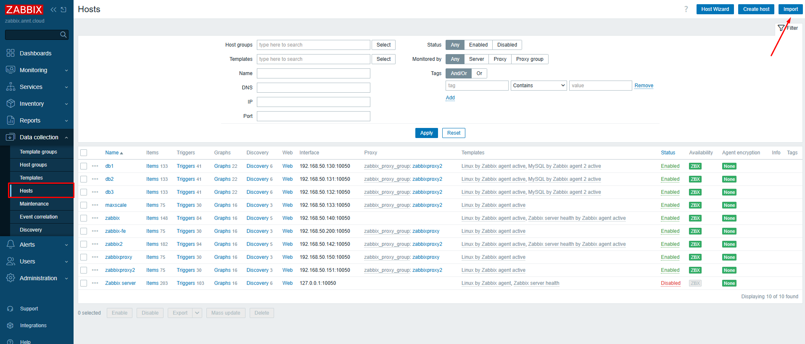
	- Nhập các tham số của host vào biểu mẫu.
- Các tab cấu hình 
	- Tab Host chứa các thuộc tính chung của host:

	| Tham số                     | Mô tả                                                                                                                                                                                                                                                                                                                                                                                                                                                                                                                                                                                                                                            |
	|-----------------------------|---------------------------------------------------------------------------------------------------------------------------------------------------------------------------------------------------------------------------------------------------------------------------------------------------------------------------------------------------------------------------------------------------------------------------------------------------------------------------------------------------------------------------------------------------------------------------------------------------------------------------------------------------|
	| **Host name (Tên host)**    | Nhập tên host duy nhất. Được phép sử dụng chữ và số, dấu cách, dấu chấm, dấu gạch ngang và dấu gạch dưới. Không được phép có dấu cách ở đầu hoặc cuối. **Lưu ý**: Nếu Zabbix agent đang chạy trên host này, tham số `Hostname` trong tệp cấu hình agent phải trùng với giá trị tên host nhập vào. Tham số này cần thiết cho việc xử lý các kiểm tra chủ động (active checks).                                                                                                                              |
	| **Visible name (Tên hiển thị)** | Nhập tên hiển thị duy nhất cho host. Nếu được thiết lập, tên này sẽ hiển thị trong danh sách, bản đồ, v.v., thay vì tên kỹ thuật của host. Thuộc tính này hỗ trợ UTF-8.                                                                                                                                                                                                                                                                                                                                                                                                                                      |
	| **Templates (Mẫu giám sát)**    | Liên kết template với host. Tất cả các đối tượng (item, trigger, v.v.) sẽ được kế thừa từ template. Để liên kết template mới, nhập tên template trong ô tìm kiếm, danh sách gợi ý sẽ hiện ra để lựa chọn. Hoặc, nhấn **Select** để chọn từ danh sách popup. Có thể gỡ liên kết template bằng 2 cách: **Unlink** (giữ lại các đối tượng đã kế thừa) hoặc **Unlink and clear** (xóa toàn bộ đối tượng đã kế thừa). Tên template là liên kết có thể nhấp vào để mở trang cấu hình của template. |
	| **Host groups (Nhóm host)** | Chọn nhóm host mà host thuộc về. Host phải thuộc ít nhất một nhóm. Có thể tạo nhóm mới bằng cách nhập tên nhóm chưa tồn tại.                                                                                                                                                                                                                                                                                                                                                                                                                                                                                                                   |
	| **Interfaces (Giao diện)**  | Hỗ trợ các loại giao diện: Agent, SNMP, JMX, IPMI. Mặc định không có giao diện nào. Để thêm, nhấn **Add**, chọn loại giao diện, nhập IP/DNS, Connect to và Port. **Lưu ý**: Giao diện đang được sử dụng bởi các item sẽ không thể xóa (nút Remove bị khóa). Giá trị “IP” hoặc “DNS” trong giao diện SNMP cũng được sử dụng cho SNMP trap. Chỉ giá trị được chọn (IP hoặc DNS) được dùng khi khớp dữ liệu. Tham khảo thêm tài liệu cấu hình SNMP monitoring (v1/v2/v3).                                                                                                         |
	| **IP address (Địa chỉ IP)** | Địa chỉ IP của host (tùy chọn).                                                                                                                                                                                                                                                                                                                                                                                                                                                                                                                                                                                                                  |
	| **DNS name (Tên DNS)**      | Tên DNS của host (tùy chọn).                                                                                                                                                                                                                                                                                                                                                                                                                                                                                                                                                                                                                      |
	| **Connect to (Kết nối tới)**| Chọn phương thức Zabbix server sẽ dùng để truy xuất dữ liệu từ agent: **IP** (khuyến nghị) hoặc **DNS**.                                                                                                                                                                                                                                                                                                                                                                                                                                                                                                                                          |
	| **Port (Cổng)**              | Cổng TCP/UDP để kết nối. Giá trị mặc định: **10050** (Zabbix agent), **161** (SNMP), **12345** (JMX), **623** (IPMI).                                                                                                                                                                                                                                                                                                                                                                                                                                                                                                                            |
	| **Default (Mặc định)**       | Đặt giao diện làm giao diện mặc định bằng cách chọn nút radio.                                                                                                                                                                                                                                                                                                                                                                                                                                                                                                                                                                                                                          |
	| **Description (Mô tả)**      | Nhập mô tả cho host.                                                                                                                                                                                                                                                                                                                                                                                                                                                                                                                                                                                                                                                                    |
	| **Monitored by (Giám sát bởi)** | Chọn phương thức giám sát host: **Server** (Zabbix server), **Proxy** (proxy độc lập) hoặc **Proxy group** (nhóm proxy).                                                                                                                                                                                                                                                                                                                                                                                                                                                                                                                     |
	| **Proxy (Proxy được gán)**   | Tên proxy được gán (chỉ hiển thị nếu Zabbix server đã chỉ định một proxy từ nhóm proxy đã chọn).                                                                                                                                                                                                                                                                                                                                                                                                                                                                                                                                                                                      |
	| **Enabled (Bật giám sát)**   | Khi bật, host được giám sát. Khi tắt, host không được giám sát: <br> - Với các yêu cầu dữ liệu thụ động (Zabbix agent, SNMP, simple check), việc giám sát dừng sau khi đồng bộ cấu hình. Trigger và action liên quan cũng bị vô hiệu hóa sau khi cấu hình được tải lại. <br> - Với kiểm tra chủ động (active checks), agent sẽ ngừng trong khoảng 5 giây kể từ khi nhận thông tin host bị vô hiệu. Trong khoảng thời gian này, agent vẫn thu thập dữ liệu cục bộ và gửi đến server/proxy, nhưng dữ liệu sẽ bị từ chối vì host đã bị vô hiệu hóa.                                           |

	- Tab IPMI chứa các thuộc tính quản lý IPMI 
	
	| Tham số            | Mô tả                                                                                   |                                                                                                                                                                                                                                                                                                                                                                                                                                                                                                             |
	|---------------------|----------------------------------------------------------------------------------------|
	| **Authentication algorithm (Thuật toán xác thực)** | Chọn thuật toán xác thực cho IPMI.   |                                                                                                                                                                                                                                                                                                                                                                                                                                                                                                                                                                                                   |
	| **Privilege level (Mức đặc quyền)**                | Chọn mức đặc quyền cho IPMI.                                 |                                                                                                                                                                                                                                                                                                                                                                                                                                                                                                                                                                                                                   |
	| **Username (Tên người dùng)**                      | Tên người dùng để xác thực. Có thể sử dụng macro người dùng.    |                                                                                                                                                                                                                                                                                                                                                                                                                                                                                                                                                                                                                  |
	| **Password (Mật khẩu)**                             | Mật khẩu để xác thực. Có thể sử dụng macro người dùng.      |                                                                                                                                                                                                                                                                                                                                                                                                                                                                                                                                                                                                                     |

	- Tab Tags cho phép định nghĩa các thẻ ở cấp độ host. Tất cả các sự cố của host này sẽ được gắn thẻ với các giá trị đã nhập tại đây.
		- Các macro người dùng, macro {INVENTORY.*}, {HOST.HOST}, {HOST.NAME}, {HOST.CONN}, {HOST.DNS}, {HOST.IP}, {HOST.PORT} và {HOST.ID} được hỗ trợ trong các thẻ.
	- Tab Macros
		- Tab Macros cho phép định nghĩa các macro người dùng ở cấp độ host dưới dạng cặp tên-giá trị. Lưu ý rằng giá trị macro có thể được giữ dưới dạng văn bản thuần túy, văn bản bí mật hoặc bí mật Vault. Việc thêm mô tả cũng được hỗ trợ.
		- Có thể xem các macro người dùng cấp template và cấp global tại đây nếu chọn tùy chọn Inherited and host macros (Macro kế thừa và host). Đây là nơi tất cả các macro người dùng được định nghĩa cho host được hiển thị cùng với giá trị mà chúng giải quyết và nguồn gốc của chúng.
		- Để thuận tiện, các liên kết đến cấu hình template và macro global tương ứng cũng được cung cấp. Cũng có thể chỉnh sửa một macro template/global ở cấp độ host, từ đó tạo một bản sao của macro đó trên host.
	- Tab Inventory
		- Tab Inventory cho phép nhập thông tin inventory cho host một cách thủ công. Có thể chọn bật tính năng Automatic (Tự động) điền thông tin inventory, hoặc tắt tính năng điền thông tin inventory cho host này.
		- Nếu inventory được bật (thủ công hoặc tự động), một dấu chấm màu xanh lá cây sẽ hiển thị cùng với tên tab.

	- Mã hóa (Encryption): Tab Encryption cho phép yêu cầu các kết nối được mã hóa với host.'

	| Tham số            | Mô tả                                                                                                                                                                                                                                                                                                                                                                                                                                                                                                                                                                                                |
	|---------------------|-----------------------------------------------------------------------------------------------------------------------------------------------------------------------------------------------------------------------------------------------------------------------------------------------------------------------------------------------------------------------------------------------------------------------------------------------------------------------------------------------------------------------------------------------------------------------------------------------------|
	| Connections to host | Cách Zabbix server hoặc proxy kết nối đến Zabbix agent trên host: **không mã hóa (mặc định)**, sử dụng **PSK (pre-shared key)** hoặc **chứng chỉ (certificate)**.                                                                                                                                                                                                                                                                                                                                                                                                                                    |
	| Connections from host | Loại kết nối được phép từ host (ví dụ: từ Zabbix agent và Zabbix sender). Có thể chọn nhiều loại kết nối cùng lúc (hữu ích cho thử nghiệm hoặc chuyển đổi phương thức). Mặc định: **No encryption (không mã hóa)**.                                                                                                                                                                                                                                                                                                                                                                                 |
	| Issuer              | Nhà phát hành chứng chỉ được phép. Chứng chỉ trước tiên sẽ được xác thực bởi **CA (Certificate Authority)**. Nếu hợp lệ và được CA ký, trường Issuer có thể được dùng để giới hạn CA cụ thể (khi sử dụng nhiều CA trong hệ thống Zabbix). Nếu để trống, mọi CA hợp lệ đều được chấp nhận.                                                                                                                                                                                                                                                                                                             |
	| Subject             | Chủ thể (Subject) của chứng chỉ được phép. Chứng chỉ phải được xác thực bởi CA. Nếu hợp lệ và được CA ký, trường Subject có thể giới hạn chỉ một giá trị Subject cụ thể. Nếu để trống, mọi chứng chỉ hợp lệ được CA cấu hình ký sẽ được chấp nhận.                                                                                                                                                                                                                                                                                                                                                     |
	| PSK identity        | Chuỗi định danh của **Pre-shared key (PSK)**. **Không nên đặt thông tin nhạy cảm trong định danh này**, vì nó sẽ được truyền **không mã hóa qua mạng** để thông báo cho bên nhận biết cần sử dụng PSK nào.                                                                                                                                                                                                                                                                                                                                                                                           |
	| PSK                 | **Pre-shared key** dạng chuỗi hex. Độ dài tối đa: **512 hex-digits (256 byte)** nếu Zabbix sử dụng thư viện **GnuTLS hoặc OpenSSL**, hoặc **64 hex-digits (32 byte)** nếu Zabbix sử dụng **mbed TLS (PolarSSL)**. Ví dụ: `1f87b595725ac58dd977beef14b97461a7c1045b9a1c963065002c5473194952`.                                                                                                                                                                                                                                                                                                           |

	- Ánh xạ giá trị (Value mapping)
		- Tab Value mapping cho phép cấu hình cách biểu diễn thân thiện với người dùng của dữ liệu item trong các ánh xạ giá trị.
#### 3.1.1 Host Group 
- Nhóm host được sử dụng để nhóm các host một cách logic và gán quyền người dùng cho chúng.
- Mỗi host phải được gán ít nhất một nhóm host. Một host có thể thuộc về nhiều nhóm host, và mỗi nhóm host có thể chứa nhiều host.
- Trong Zabbix, tất cả các quyền đều dựa trên nhóm: nhóm người dùng, nhóm host, và nhóm template. Vì vậy, ngay cả khi một người dùng duy nhất cần quyền truy cập vào một host duy nhất, quyền này vẫn được cấp bằng cách thêm người dùng vào một nhóm người dùng có quyền truy cập vào nhóm host chứa host đó.
- Cấu hình
	- Chỉ người dùng Super admin mới có thể tạo nhóm host.
	- Có hai cách để tạo một nhóm host trong giao diện Zabbix:
		- Cách thứ nhất:
			- Truy cập: Thu thập dữ liệu → Nhóm host (Data collection → Host groups).
			- Nhấp vào nút Tạo nhóm host (Create host group) ở góc trên bên phải màn hình.
			- 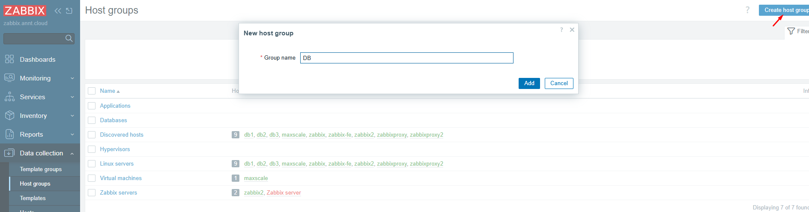
			- Nhập tên nhóm vào biểu mẫu.
		- Cách thứ hai: Khi cấu hình một host, nhập tên nhóm chưa tồn tại vào trường nhập Host groups (Nhóm host).
			- 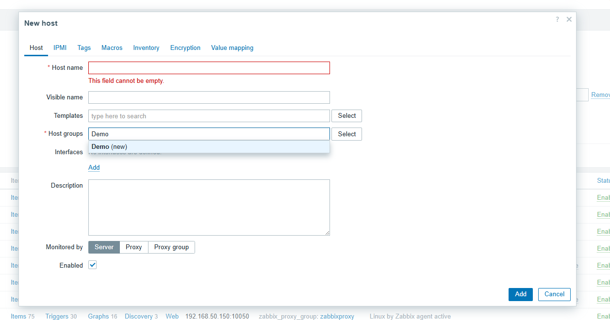
	- Sau khi nhóm host được tạo, có thể nhấp vào tên nhóm trong danh sách dưới Thu thập dữ liệu → Nhóm host để chỉnh sửa tên nhóm, sao chép nhóm hoặc xóa nhóm.
	- Việc xóa một nhóm host chỉ xóa nhóm logic, không xóa các host trong nhóm. Không thể xóa một nhóm host là nhóm duy nhất của bất kỳ host hiện có nào.
- Tạo nhóm host con (Subgroups)
	- Một nhóm host con (hoặc nhóm host lồng nhau) là một nhóm con của nhóm host cha chứa nó.
	- Một nhóm con được tạo bằng cách sử dụng dấu gạch chéo / trong trường nhập tên nhóm để biểu thị mối quan hệ của nó với (các) nhóm cha. 
	- Ví dụ:
		- Nhập Europe/Latvia sẽ tạo nhóm con Europe/Latvia của nhóm cha Europe.
		- Nhập Europe/Latvia/Riga/Zabbix servers sẽ tạo nhóm con tương ứng trong các nhóm cha lồng nhau Europe, Europe/Latvia, Europe/Latvia/Riga.
	- Khi tạo một nhóm con, không được phép sử dụng dấu gạch chéo ở đầu hoặc cuối, hoặc nhiều dấu gạch chéo liên tiếp. 
	- Không bắt buộc phải tạo bất kỳ nhóm host cha nào trước khi tạo một nhóm con. có thể chọn bắt đầu bằng cách tạo một nhóm con (ví dụ: Europe/Latvia) hoặc bất kỳ nhóm host cha nào (trong ví dụ của chúng tôi, Europe). Nếu bắt đầu bằng cách tạo một nhóm con, các nhóm host cha sẽ không được tạo tự động.
- Quyền đối với nhóm host
	- Khi tạo một nhóm con cho một nhóm host cha hiện có (ví dụ: tạo Europe/Latvia khi Europe đã tồn tại), quyền của nhóm người dùng đối với nhóm con sẽ được kế thừa từ nhóm cha.
	- Khi tạo một nhóm host cha cho một nhóm con hiện có (ví dụ: tạo Europe khi Europe/Latvia đã tồn tại), không có quyền nào được đặt cho nhóm cha.
	- Khi chỉnh sửa bất kỳ nhóm host nào, có thể đặt một tùy chọn bổ sung: Apply permissions and tag filters to all subgroups (Áp dụng quyền và bộ lọc thẻ cho tất cả các nhóm con).
### 3.2 Items 
- Items là các mục số liệu phục vụ giám sát 
- Các item được sử dụng để thu thập dữ liệu. Một khi đã cấu hình một host, cần thêm các item để có được dữ liệu thực tế. Một cách để nhanh chóng thêm nhiều item là gắn một trong các template được định nghĩa trước vào một host. Tuy nhiên, để tối ưu hóa hiệu suất hệ thống, có thể cần điều chỉnh các template để có càng nhiều item và tần suất giám sát càng thường xuyên khi cần thiết.
- Để chỉ định loại dữ liệu cần thu thập từ một host, hãy sử dụng item key. 
	- Ví dụ: một item với key name system.cpu.load sẽ thu thập dữ liệu processor load, trong khi một item với key name net.if.in sẽ thu thập thông tin incoming traffic.
- Các parameter bổ sung có thể được chỉ định trong dấu ngoặc vuông sau key name. 
	- Ví dụ: system.cpu.load[avg5] sẽ trả về processor load average trong 5 phút gần nhất, trong khi net.if.in[eth0] sẽ hiển thị incoming traffic trong interface "eth0".
#### 3.2.1 Tạo Items 
- Để tạo item mới tại Zabbix FE 
	- Truy cập Data collection → Hosts.
	- Nhấp vào Items trong hàng của host muốn cấu hình.
	- Nhấp vào Create item ở góc trên bên phải màn hình.
	- Nhập các parameter của item vào biểu mẫu.
	- 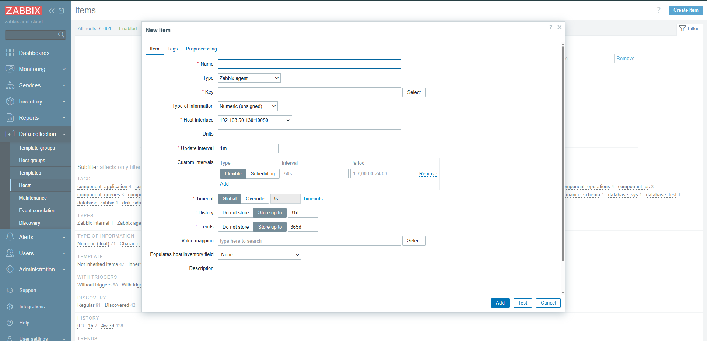
- Các trường cấu hình 
	- Tất cả các trường nhập bắt buộc được đánh dấu bằng dấu hoa thị màu đỏ.

| Tham số                     | Mô tả                                                                                                                                                                                                                                                                                                                                                                                                                                                                                                                                                                                                                                                                                                                                                                                                                                                                                                      |
|-----------------------------|-------------------------------------------------------------------------------------------------------------------------------------------------------------------------------------------------------------------------------------------------------------------------------------------------------------------------------------------------------------------------------------------------------------------------------------------------------------------------------------------------------------------------------------------------------------------------------------------------------------------------------------------------------------------------------------------------------------------------------------------------------------------------------------------------------------------------------------------------------------------------------------------------------------|
| **Name**                    | Tên của item. Hỗ trợ macro người dùng.                                                                                                                                                                                                                                                                                                                                                                                                                                                                                                                                                                                                                                                                                                                                                                                                                                                                  |
| **Type**                    | Loại item. Tham khảo các mục riêng cho từng loại.                                                                                                                                                                                                                                                                                                                                                                                                                                                                                                                                                                                                                                                                                                                                                                                                                                                       |
| **Key**                     | Khóa item (tối đa 2048 ký tự). <br> - Danh sách khóa được hỗ trợ có thể tìm trong phần riêng theo loại item. <br> - Khóa phải là duy nhất trên mỗi host. <br> - Nếu loại khóa là `Zabbix agent`, `Zabbix agent (active)` hoặc `Simple check`, giá trị khóa phải được Zabbix agent hoặc server hỗ trợ. <br> - Xem thêm: định dạng khóa chính xác.                                                                                                                                                                                                                                                                                                                                                                                                                                                                                                       |
| **Type of information**     | Kiểu dữ liệu được lưu trong cơ sở dữ liệu sau khi chuyển đổi (nếu có): <br> - **Numeric (unsigned)**: Số nguyên không dấu 64-bit. Nếu nhận giá trị float, phần thập phân sẽ bị cắt. <br> - **Numeric (float)**: Số thực 64-bit, chính xác khoảng 15 chữ số, dải từ -1.79E+308 đến 1.79E+308 (trừ PostgreSQL 11 trở xuống). Hỗ trợ ký hiệu khoa học (ví dụ: `1.23E+7`). <br> - **Character**: Dữ liệu văn bản ngắn. <br> - **Log**: Dữ liệu văn bản dài, kèm thuộc tính log (timestamp, source, severity, logeventid). <br> - **Text**: Dữ liệu văn bản dài (xem giới hạn riêng). <br> - **Binary**: Dữ liệu nhị phân (chỉ hỗ trợ cho dependent item). Hiển thị dạng chuỗi “binary value” trong Latest data. |
| **Host interface**          | Chọn interface của host. Trường này chỉ khả dụng khi chỉnh sửa item ở cấp host.                                                                                                                                                                                                                                                                                                                                                                                                                                                                                                                                                                                                                                                                                                                                                                                                                        |
| **Units**                   | Nếu thiết lập ký hiệu đơn vị, Zabbix sẽ xử lý và hiển thị giá trị kèm hậu tố đơn vị. Hỗ trợ các ký hiệu đơn vị đặc biệt (ví dụ): <br> - `B`: byte (1024 → 1 KB) <br> - `Bps`: byte/giây (1024 → 1 KBps) <br> - `s`: giây, hiển thị theo đơn vị lớn nhất (881764 → 10d 4h 56m) <br> - `uptime`: thời gian hoạt động (hh:mm:ss hoặc N ngày) <br> - `unixtime`: UNIX timestamp (định dạng `yyyy.mm.dd hh:mm:ss`, yêu cầu dữ liệu dạng Numeric unsigned) <br> - Đơn vị khác (Hz, W…) sẽ tự động chia 1000 nếu giá trị >1000 (5000 → 5 KHz). <br> - Thêm tiền tố `!` để tắt chuyển đổi (ví dụ: `1024 !B → 1024 B`).                                                                                                                                                                                                                                      |
| **Update interval**         | Khoảng thời gian lấy dữ liệu (giây). Tối đa 86400 giây (1 ngày). <br> - Hỗ trợ hậu tố thời gian (`30s`, `1m`, `2h`, `1d`). <br> - Hỗ trợ macro người dùng (chỉ một macro cho toàn bộ trường). <br> - Nếu giá trị là `0`, item chỉ được kiểm tra theo custom interval (flexible hoặc scheduled) nếu tồn tại. <br> - Các item mới sẽ được kiểm tra trong 60 giây đầu, trừ khi có custom interval. <br> - Có thể kiểm tra ngay bằng nút **Execute now** (với passive item).                                                                                                                                                                                                                                                                                                                                             |
| **Custom intervals**        | Tạo quy tắc kiểm tra riêng cho item: <br> - **Flexible**: khoảng kiểm tra đặc biệt khác với Update interval. <br> - **Scheduling**: lập lịch kiểm tra tùy chỉnh. <br> - Hỗ trợ hậu tố thời gian và macro người dùng (chỉ một macro cho mỗi trường).                                                                                                                                                                                                                                                                                                                                                                                                                                                                                                                                                                                                                                                    |
| **Timeout**                 | Thời gian chờ kiểm tra (chỉ với loại item được hỗ trợ): <br> - **Global**: dùng giá trị timeout toàn cục hoặc proxy. <br> - **Override**: đặt timeout tùy chỉnh (1–600 giây, hỗ trợ hậu tố thời gian và macro). <br> - Liên kết **Timeouts** chỉ khả dụng với Super admin có quyền truy cập Administration → General/Proxies.                                                                                                                                                                                                                                                                                                                                                                                                                                                                                                                                                                     |
| **History**                 | Lưu lịch sử chi tiết: <br> - **Do not store**: không lưu (thường dùng cho master item). <br> - **Store up to**: thời gian lưu (1 giờ–25 năm). Dữ liệu cũ bị xóa bởi housekeeper. Hỗ trợ hậu tố thời gian và macro. <br> - Có thể bị ghi đè bởi thiết lập toàn cục trong Administration → Housekeeping (hiển thị biểu tượng cảnh báo màu cam nếu bị ghi đè). <br> - Khuyến nghị lưu thời gian ngắn để giảm kích thước cơ sở dữ liệu.                                                                                                                                                                                                                                                                                                                                                                      |
| **Trends**                  | Lưu dữ liệu tổng hợp (giá trị min, max, avg, count theo giờ): <br> - **Do not store**: không lưu. <br> - **Store up to**: thời gian lưu (1 ngày–25 năm). Dữ liệu cũ bị xóa bởi housekeeper. Hỗ trợ hậu tố thời gian và macro. <br> - Có thể bị ghi đè bởi thiết lập toàn cục (hiển thị biểu tượng cảnh báo màu cam nếu bị ghi đè). <br> - Không áp dụng cho dữ liệu phi số (Character, Log, Text).                                                                                                                                                                                                                                                                                                                                                                                                                  |
| **Value mapping**            | Áp dụng ánh xạ giá trị để hiển thị (không thay đổi giá trị thực tế). Hoạt động với Numeric (unsigned), Numeric (float) và Character. Ví dụ: “Windows service states”.                                                                                                                                                                                                                                                                                                                                                                                                                                                                                                                                                                                                                                                                                                                                   |
| **Log time format**          | Chỉ khả dụng cho item loại Log. Hỗ trợ các ký tự đại diện: `y`, `M`, `d`, `h`, `m`, `s`. <br> - Nếu để trống, timestamp sẽ đặt thành 0 (01/01/1970). <br> - Ví dụ log: `"23480:20100328:154718.045 Zabbix agent started..."` có định dạng `pppppp:yyyyMMdd:hhmmss` (`p` và `:` có thể là ký tự bất kỳ, trừ `yMdhms`).                                                                                                                                                                                                                                                                                                                                                                                                                                                                                                                                                     |
| **Populates host inventory field** | Chọn trường inventory của host mà giá trị item sẽ tự động điền (khi inventory tự động được bật). Không khả dụng với loại dữ liệu Log.                                                                                                                                                                                                                                                                                                                                                                                                                                                                                                                                                                                                                                                                                                                                                                                                  |
| **Description**              | Mô tả cho item. Hỗ trợ macro người dùng.                                                                                                                                                                                                                                                                                                                                                                                                                                                                                                                                                                                                                                                                                                                                                                                                                                                               |
| **Enabled**                  | Đánh dấu để kích hoạt item. Nếu tắt, item bị xóa khỏi bộ nhớ lịch sử (trừ giá trị cuối cùng cho log).                                                                                                                                                                                                                                                                                                                                                                                                                                                                                                                                                                                                                                                                                                                                                                                                  |
| **Latest data**              | Liên kết xem dữ liệu mới nhất cho item. Chỉ khả dụng khi chỉnh sửa item đã tồn tại.                                                                                                                                                                                                                                                                                                                                                                                                                                                                                                                                                                                                                                                                                                                                                                                                                   |

- Tab Tags dùng cấu hình tag ở mức độ items 
- Tab Preprocessing cho phép áp dụng các biến đổi (transformations) cho các giá trị item nhận được trước khi lưu chúng vào cơ sở dữ liệu. Các bước biến đổi/xử lý sơ bộ này được thực hiện bởi Zabbix server hoặc proxy (nếu các item được giám sát bởi proxy).
	- Tính năng này hỗ trợ nhiều trường hợp sử dụng khác nhau, chẳng hạn như:
		- Chuyển đổi bytes sang bits (ví dụ: nhân các giá trị lưu lượng mạng với "8").
		- Tính toán thống kê trên mỗi giây cho các giá trị tăng dần.
		- Áp dụng biểu thức chính quy (regular expressions) để trích xuất hoặc sửa đổi giá trị.
		- Thực thi các script tùy chỉnh trên các giá trị.
		- Loại bỏ các giá trị không thay đổi để tối ưu hóa lưu trữ cơ sở dữ liệu.
	- Các phép biến đổi được hỗ trợ
		- Zabbix hỗ trợ một loạt các phép biến đổi tiền xử lý, bao gồm:
		- Biểu thức chính quy (Regular expression): Khớp và thay thế giá trị dựa trên biểu thức chính quy.
		- Thay thế (Replace), Cắt (Trim), Cắt phải (Right trim), Cắt trái (Left trim): Các thao tác xử lý chuỗi cơ bản.
		- XML XPath, JSON Path: Trích xuất giá trị hoặc đoạn từ dữ liệu XML/JSON.
		- CSV to JSON, XML to JSON: Chuyển đổi định dạng dữ liệu.
		- SNMP walk value, SNMP walk to JSON, SNMP get value: Xử lý và định dạng giá trị SNMP.
		- Hệ số nhân tùy chỉnh (Custom multiplier): Nhân giá trị với một số nguyên hoặc số thực, hữu ích cho việc chuyển đổi đơn vị (ví dụ: KB sang B).
		- Thay đổi đơn giản (Simple change), Thay đổi mỗi giây (Change per second): Tính toán sự khác biệt hoặc tốc độ thay đổi giữa giá trị hiện tại và giá trị trước đó, hữu ích cho các giá trị tăng liên tục.
		- Boolean sang thập phân (Boolean to decimal), Octal sang thập phân (Octal to decimal), Hexadecimal sang thập phân (Hexadecimal to decimal): Chuyển đổi giữa các hệ cơ số.
		- JavaScript: Thực thi mã JavaScript tùy chỉnh để xử lý giá trị.
		- Trong phạm vi (In range), Khớp biểu thức chính quy (Matches regular expression), Không khớp biểu thức chính quy (Does not match regular expression): Các bước xác thực giá trị.
		- Kiểm tra lỗi trong JSON/XML/biểu thức chính quy (Check for error in JSON/XML/regular expression): Kiểm tra các thông báo lỗi cấp ứng dụng.
		- Kiểm tra giá trị không được hỗ trợ (Check for not supported value): Điều chỉnh hành vi khi giá trị item không thể truy xuất được.
		- Loại bỏ không thay đổi (Discard unchanged), Loại bỏ không thay đổi với nhịp tim (Discard unchanged with heartbeat): Loại bỏ các giá trị không thay đổi để tối ưu hóa lưu trữ, giúp giảm tải cơ sở dữ liệu và cải thiện hiệu suất.
		- Mẫu Prometheus (Prometheus pattern), Prometheus sang JSON (Prometheus to JSON): Trích xuất và chuyển đổi dữ liệu từ các số liệu Prometheus.
		
#### 3.2.2 Các loại Items 
- Zabbix cung cấp một loạt các loại mục dữ liệu để thu thập thông tin từ các hệ thống khác nhau, mỗi loại có bộ khóa mục và tham số riêng.
	- Zabbix Agent: Zabbix Agent là một trong những phương pháp thu thập dữ liệu chính, hỗ trợ cả kiểm tra thụ động (Zabbix agent) và chủ động (Zabbix agent (active)). Các khóa mục phổ biến bao gồm system.cpu.load, net.if.in, log, logrt, vfs.fs.size, v.v.. Các khóa này cho phép giám sát các chỉ số hệ thống như tải CPU, lưu lượng mạng, nội dung tệp nhật ký, kích thước hệ thống tệp, cũng như thông tin về quy trình, bộ nhớ ảo và trạng thái web.
	- Zabbix Agent 2: Zabbix Agent 2 mở rộng khả năng của Zabbix Agent truyền thống bằng cách hỗ trợ tất cả các khóa mục của Zabbix Agent trên Unix và Windows, đồng thời bổ sung các khóa mục thông qua các plugin chuyên biệt. Các plugin này cung cấp khả năng giám sát sâu rộng cho các công nghệ cụ thể như Ceph, Docker, MongoDB, MSSQL, MySQL, NVIDIA GPU, Oracle, PostgreSQL, Redis, S.M.A.R.T., Systemd, và Web certificates. Ví dụ, ceph.status cung cấp trạng thái tổng thể của cluster Ceph, trong khi docker.container_stats cung cấp số liệu thống kê sử dụng tài nguyên của container Docker.
	- Windows Zabbix Agent: Windows Zabbix Agent hỗ trợ cả các khóa mục dùng chung với Unix Zabbix Agent và các khóa mục dành riêng cho môi trường Windows. Các khóa Windows-specific bao gồm eventlog để giám sát nhật ký sự kiện Windows, perf_counter để truy xuất giá trị của bộ đếm hiệu suất Windows, proc_info để lấy thông tin về các tiến trình, registry.data để đọc dữ liệu từ khóa Registry, và service.info để lấy thông tin về các dịch vụ Windows. Việc sử dụng các khóa này là thiết yếu để giám sát chi tiết hiệu suất và trạng thái của các hệ thống dựa trên Windows.
	- SNMP Agent
		- Giám sát SNMP cho phép Zabbix thu thập dữ liệu từ các thiết bị hỗ trợ SNMP như bộ chuyển mạch, bộ định tuyến, máy in hoặc UPS mà không cần cài đặt tác nhân Zabbix. Zabbix server phải được cấu hình với hỗ trợ SNMP (--with-net-snmp). Để cấu hình giám sát SNMP, người dùng cần tìm OID (Object Identifier) của mục muốn giám sát (sử dụng snmpwalk), tạo một host với giao diện SNMP và thêm mục dữ liệu. Zabbix hỗ trợ SNMPv1, v2 và v3, với các tùy chọn xác thực và bảo mật khác nhau.
		- Một tính năng quan trọng là khả năng sử dụng các chỉ mục động (Dynamic indexes) trong OID, cho phép Zabbix tự động điều chỉnh nếu số chỉ mục thay đổi trên thiết bị. Zabbix cũng sử dụng các yêu cầu SNMP bulk gốc (GetBulkRequest-PDUs) và xử lý kết hợp các yêu cầu SNMP để tối ưu hóa hiệu suất, giảm số lần truyền mạng.
	- SNMP Traps: - Ngược lại với việc truy vấn SNMP, SNMP traps là thông tin được gửi chủ động từ thiết bị hỗ trợ SNMP đến snmptrapd, sau đó được Zabbix server hoặc proxy thu thập từ một tệp. Quy trình này cho phép phát hiện các vấn đề ngắn hạn có thể bị bỏ lỡ bởi các kiểm tra định kỳ. Để thiết lập, Zabbix server/proxy cần được cấu hình để khởi động tiến trình SNMP trapper và trỏ đến tệp bẫy (SNMPTrapperFile). Các trình nhận bẫy Bash hoặc Perl hoặc SNMPTT có thể được sử dụng để phân tích cú pháp và ghi bẫy vào tệp.
	- Kiểm tra IPMI (IPMI Checks): Kiểm tra IPMI cho phép giám sát tình trạng và khả dụng của các thiết bị Intelligent Platform Management Interface (IPMI) trực tiếp từ các thẻ quản lý "out-of-band", độc lập với hệ điều hành. Zabbix server cần được cấu hình với hỗ trợ IPMI và khởi động các IPMI poller. Các mục IPMI được cấu hình với giao diện IPMI và chỉ định cảm biến IPMI cần truy xuất. Các cảm biến rời rạc và ngưỡng được hỗ trợ, và có thể được giải mã bằng cách tham khảo thông số kỹ thuật IPMI.
	- Kiểm tra đơn giản (Simple Checks): Các kiểm tra đơn giản được sử dụng cho các kiểm tra dịch vụ từ xa không cần tác nhân, với Zabbix server/proxy chịu trách nhiệm xử lý các kết nối bên ngoài. Các khóa mục phổ biến bao gồm icmpping (kiểm tra khả năng truy cập host bằng ICMP ping), icmppingloss (tỷ lệ phần trăm gói bị mất), icmppingsec (thời gian phản hồi ICMP ping), và net.tcp.service / net.udp.service (kiểm tra trạng thái và hiệu suất dịch vụ TCP/UDP). Zabbix sử dụng tiện ích fping để xử lý các ping ICMP.
	- Giám sát tệp nhật ký (Log File Monitoring)
		- Zabbix có thể giám sát và phân tích tập trung các tệp nhật ký, hỗ trợ cả tệp nhật ký xoay vòng. Các thông báo có thể được cấu hình để cảnh báo người dùng khi một tệp nhật ký chứa các chuỗi hoặc mẫu chuỗi cụ thể. Các khóa mục log và logrt được sử dụng để giám sát nội dung, trong khi log.count và logrt.count trả về số lượng dòng khớp. Các mục này phải được cấu hình làm kiểm tra chủ động (Zabbix agent (active)) và yêu cầu quyền đọc cho người dùng zabbix.
		- Zabbix agent duy trì trạng thái của các tệp nhật ký được giám sát, bao gồm kích thước đã xử lý và thời gian sửa đổi cuối cùng, được lưu trữ trong cơ sở dữ liệu Zabbix. Các tệp bền vững (persistent files) có thể được sử dụng để duy trì trạng thái này ngay cả khi agent khởi động lại, đặc biệt hữu ích cho các hệ thống tệp được nhân bản. Tham số maxdelay cho phép bỏ qua các dòng nhật ký cũ hơn để tập trung vào các bản ghi gần đây nhất, hữu ích khi các ứng dụng tạo ra một lượng lớn thông báo.
	- Các mục tính toán (Calculated Items)
		- Mục tính toán cho phép tạo các phép tính dựa trên giá trị của các mục hiện có, bao gồm cả các giá trị đơn lẻ và tổng hợp từ nhiều mục. Tất cả các phép tính được thực hiện bởi Zabbix server và dữ liệu kết quả được lưu trữ trong cơ sở dữ liệu như bất kỳ mục nào khác. Công thức tính toán sử dụng cú pháp tương tự như biểu thức kích hoạt, hỗ trợ các hàm như last, min, max, avg, sum.
		- Các phép tính tổng hợp (Aggregate calculations) là một loại mục tính toán cho phép thu thập thông tin từ nhiều mục và tính toán một giá trị tổng hợp (ví dụ: trung bình, tổng). Điều này không yêu cầu tác nhân chạy trên host được giám sát. Các hàm foreach được sử dụng để chọn các mục dựa trên bộ lọc (ví dụ: nhóm host).
	- Kiểm tra nội bộ (Internal Checks): Kiểm tra nội bộ cho phép giám sát các quy trình nội bộ của Zabbix server hoặc proxy. Các kiểm tra này được xử lý bởi các poller của Zabbix và không bị ảnh hưởng bởi trạng thái bảo trì của host. Các khóa mục như zabbix[boottime], zabbix[hosts], zabbix[items], zabbix[queue,,] cung cấp thông tin quan trọng về hiệu suất và trạng thái của chính hệ thống Zabbix.
	- Kiểm tra SSH (SSH Checks): Kiểm tra SSH được thực hiện dưới dạng giám sát không cần agent, không yêu cầu Zabbix agent. Zabbix server cần được cấu hình với hỗ trợ SSH2 (libssh hoặc libssh2). Xác thực có thể được thực hiện bằng cặp tên người dùng/mật khẩu hoặc dựa trên tệp khóa. Đối với xác thực bằng tệp khóa, đường dẫn đến thư mục chứa khóa cần được chỉ định trong tham số SSHKeyLocation của tệp cấu hình Zabbix server. Các lệnh thực tế được đặt trong trường Executed script trong cấu hình mục.
	- Kiểm tra Telnet (Telnet Checks): Kiểm tra Telnet cũng là một hình thức giám sát không cần agent. Các lệnh được thực thi thông qua phiên Telnet từ xa và được đặt trong trường Executed script. Zabbix hỗ trợ các ký tự dấu nhắc shell như $, #, >, %.
	- Kiểm tra bên ngoài (External Checks): Kiểm tra bên ngoài được thực thi bởi Zabbix server (hoặc proxy nếu host được giám sát bởi proxy) bằng cách chạy một script shell hoặc một tệp nhị phân. Các script này được tìm kiếm trong thư mục được chỉ định bởi tham số ExternalScripts. Giá trị trả về là đầu ra tiêu chuẩn cùng với lỗi tiêu chuẩn của lệnh, bị giới hạn ở 16MB.
	- Mục Trapper (Trapper Items): Mục trapper chấp nhận dữ liệu đến thay vì truy vấn nó, hữu ích cho bất kỳ dữ liệu nào người dùng muốn gửi đến Zabbix. Dữ liệu có thể được gửi bằng tiện ích Zabbix sender hoặc giao thức Zabbix sender, hoặc sử dụng phương thức API history.push. Các mục trapper được cấu hình với một khóa duy nhất và xác định loại thông tin dữ liệu sẽ được gửi.
	- Giám sát JMX (JMX Monitoring): Giám sát JMX được sử dụng để theo dõi các bộ đếm JMX của các ứng dụng Java thông qua Zabbix Java gateway. Zabbix server truy vấn Java gateway, sau đó gateway sử dụng API quản lý JMX để truy vấn ứng dụng từ xa. Ứng dụng Java cần được khởi động với các tùy chọn dòng lệnh phù hợp để bật giám sát JMX từ xa. Các mục JMX được cấu hình với tên đối tượng MBean và tên thuộc tính, có thể bao gồm các trường dữ liệu tổng hợp lồng nhau.
	- Giám sát ODBC (ODBC Monitoring): Giám sát ODBC cho phép Zabbix truy vấn bất kỳ cơ sở dữ liệu nào được hỗ trợ bởi ODBC thông qua giao diện và trình điều khiển ODBC đã được thiết lập. Zabbix hỗ trợ unixODBC. Để cấu hình, cần cài đặt unixODBC và các trình điều khiển cơ sở dữ liệu phù hợp, sau đó chỉnh sửa các tệp odbcinst.ini và odbc.ini. Các khóa mục db.odbc.select trả về một giá trị, db.odbc.get trả về nhiều hàng/cột ở định dạng JSON, và db.odbc.discovery được sử dụng cho khám phá cấp thấp.
	- Mục phụ thuộc (Dependent Items): Mục phụ thuộc cho phép thu thập nhiều số liệu cùng một lúc bằng cách phụ thuộc vào một mục chính (master item). Khi mục chính thu thập dữ liệu, các mục phụ thuộc sẽ tự động được điền giá trị. Các tùy chọn tiền xử lý Zabbix có thể được sử dụng để trích xuất phần dữ liệu cần thiết cho mục phụ thuộc từ dữ liệu của mục chính.
	- HTTP Agent (HTTP Agent): Loại mục này cho phép thăm dò dữ liệu bằng giao thức HTTP/HTTPS. Các kiểm tra HTTP được thực thi bởi Zabbix server (hoặc proxy). HTTP agent hỗ trợ cả HTTP và HTTPS, có thể theo dõi các chuyển hướng, và cấu hình các loại yêu cầu (GET, POST, PUT, HEAD), phần thân yêu cầu, tiêu đề, mã trạng thái yêu cầu, và các tùy chọn SSL/TLS. Việc bẫy (trapping) cũng có thể thực hiện được bằng cách sử dụng Zabbix sender hoặc API history.push.
	- Kiểm tra Prometheus (Prometheus Checks): Zabbix có khả năng truy vấn các số liệu được hiển thị theo định dạng dòng của Prometheus. Để thu thập dữ liệu Prometheus, một mục HTTP chính trỏ đến điểm cuối dữ liệu thích hợp, và các mục phụ thuộc sử dụng tùy chọn tiền xử lý Prometheus (Prometheus pattern hoặc Prometheus to JSON) để truy vấn dữ liệu cần thiết. Xử lý hàng loạt được hỗ trợ cho các mục phụ thuộc để tối ưu hóa hiệu suất.
	- Mục Script (Script Items): Mục Script cho phép thu thập dữ liệu bằng cách thực thi mã JavaScript do người dùng định nghĩa, với khả năng truy xuất dữ liệu qua HTTP/HTTPS. Loại mục này hữu ích cho các kịch bản thu thập dữ liệu yêu cầu nhiều bước hoặc logic phức tạp, nơi script có thể thực hiện nhiều cuộc gọi HTTP và xử lý dữ liệu giữa các bước.
	- Mục Trình duyệt (Browser Items): Mục Trình duyệt (hiện đang ở giai đoạn thử nghiệm) cho phép giám sát các trang web và ứng dụng web phức tạp bằng cách sử dụng trình duyệt. Mục này thực thi mã JavaScript do người dùng định nghĩa để mô phỏng các hành động liên quan đến trình duyệt như nhấp chuột, nhập văn bản, điều hướng qua các trang web, và các tương tác khác của người dùng.- 
#### 3.2.3 History & Trends 
- Zabbix lưu trữ dữ liệu đã thu thập bằng hai phương pháp: lịch sử (history) và xu hướng (trends). Lịch sử lưu giữ mọi giá trị được thu thập, trong khi xu hướng lưu giữ thông tin trung bình theo giờ (min, max, avg, count) và ít tốn tài nguyên hơn.
- Người dùng có thể đặt thời gian lưu giữ cho cả lịch sử và xu hướng trong biểu mẫu thuộc tính mục, khi cập nhật hàng loạt các mục, hoặc khi thiết lập các tác vụ dọn dẹp (housekeeper tasks). Việc giữ lịch sử trong thời gian ngắn nhất có thể và xu hướng trong thời gian dài hơn là một khuyến nghị chung để tối ưu hóa không gian cơ sở dữ liệu.
#### 3.2.4 Ánh xạ giá trị (Value Mapping)
- Ánh xạ giá trị cho phép cấu hình một cách biểu diễn thân thiện hơn với người dùng đối với các giá trị nhận được, bằng cách thiết lập các ánh xạ giữa giá trị số/chuỗi và các biểu diễn chuỗi tương ứng (ví dụ: 0 → Không khả dụng, 1 → Khả dụng). Ánh xạ giá trị được sử dụng trong giao diện người dùng Zabbix và trong các thông báo được gửi bởi các loại phương tiện. Chúng được thiết lập trên các mẫu (templates) hoặc máy chủ và có thể được sử dụng với các mục có kiểu thông tin là "Numeric (unsigned)", "Numeric (float)" và "Character".
- 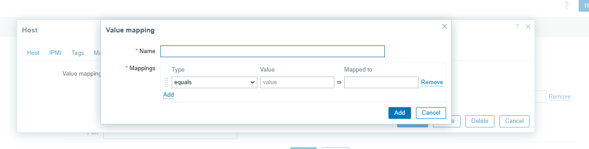

#### 3.2.5 Hàng đợi (Queue)
- Hàng đợi trong Zabbix hiển thị các mục đang chờ được làm mới, đóng vai trò là một chỉ số quan trọng về hiệu suất của Zabbix server.
- Hàng đợi chỉ là một biểu diễn logic của dữ liệu và không bao gồm các mục Zabbix agent hoạt động của log, logrt, event log, SNMP trap, trapper, giám sát web và các mục phụ thuộc.
- Việc theo dõi hàng đợi giúp xác định các vấn đề về hiệu suất khi nhiều mục bị trì hoãn quá lâu.
- 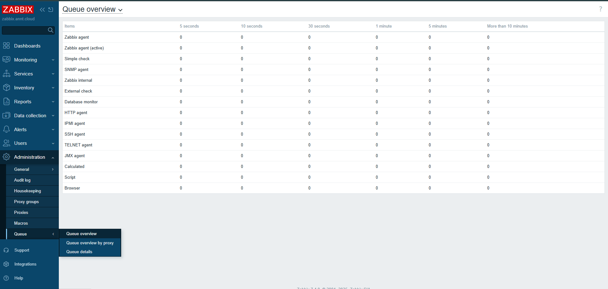

### 3.3 Triggers  
- Trigger là các biểu thức logic đánh giá dữ liệu được thu thập bởi các item và thể hiện trạng thái hiện tại của hệ thống.
- Trong khi các item được dùng để thu thập dữ liệu hệ thống, việc theo dõi dữ liệu này liên tục để chờ một điều kiện đáng báo động hoặc cần chú ý là rất không thực tế. Nhiệm vụ đánh giá dữ liệu có thể được giao cho các biểu thức trigger.
- Các biểu thức trigger cho phép định nghĩa một ngưỡng (threshold) cho trạng thái dữ liệu được coi là "chấp nhận được". Do đó, nếu dữ liệu đến vượt quá trạng thái chấp nhận được, một trigger sẽ được "kích hoạt" (fired) — hoặc thay đổi trạng thái của nó thành PROBLEM.
- Một trigger có thể có các trạng thái sau:
	| Trạng thái | Mô tả |
	| :--------- | :---- |
	| OK | Trạng thái trigger bình thường. |
	| Problem | Có sự cố xảy ra. Ví dụ: tải bộ xử lý quá cao. |
	| Unknown | Không thể tính toán giá trị trigger. Xem Unknown status. |
- Trong một trigger đơn giản, chúng ta có thể muốn đặt một ngưỡng cho giá trị trung bình năm phút của một số dữ liệu, ví dụ như tải CPU. Điều này được thực hiện bằng cách định nghĩa một biểu thức trigger trong đó:
	- * Hàm `avg` được áp dụng cho giá trị nhận được trong item key.
	- * Khoảng thời gian năm phút được sử dụng để đánh giá.
	- * Một ngưỡng là '2' được thiết lập.
	- Ví dụ: `avg(/host/key,5m)>2`
	- Trigger này sẽ "kích hoạt" (trở thành PROBLEM) nếu giá trị trung bình năm phút lớn hơn 2.
- Trong một trigger phức tạp hơn, biểu thức có thể bao gồm sự kết hợp của nhiều hàm và nhiều ngưỡng. 
- Trigger không thể tạo cho các item có giá trị nhị phân.
- Thời gian tính toán Trigger
	- Một trigger được tính toán lại mỗi khi Zabbix server nhận một giá trị mới là một phần của biểu thức. Khi một giá trị mới được nhận, mỗi hàm có trong biểu thức đều được tính toán lại (không chỉ hàm nhận giá trị mới).
	- Ngoài ra, một trigger được tính toán lại mỗi khi có giá trị mới được nhận và cứ sau 30 giây nếu các hàm date and time và/hoặc nodata() được sử dụng trong biểu thức.
	- Các hàm date and time và/hoặc nodata() được tính toán lại sau mỗi 30 giây bởi quá trình Zabbix history syncer.
	- Các trigger chỉ tham chiếu đến các trend function được đánh giá một lần trong khoảng thời gian nhỏ nhất trong biểu thức. Xem thêm: trend functions.
- Chu kỳ đánh giá
	- Một chu kỳ đánh giá (evaluation period) được sử dụng trong các hàm tham chiếu đến lịch sử item. Nó cho phép chỉ định khoảng thời gian mà chúng ta quan tâm. Nó có thể được chỉ định dưới dạng khoảng thời gian (30s, 10m, 1h) hoặc dưới dạng phạm vi giá trị (#5 – cho năm giá trị mới nhất).
	- Chu kỳ đánh giá được đo đến "hiện tại" – trong đó "hiện tại" là thời gian tính toán lại gần nhất của trigger (xem Calculation time ở trên); "hiện tại" không phải là thời gian "hiện tại" của máy chủ.
	- Chu kỳ đánh giá chỉ định một trong hai điều sau:
	- Xem xét tất cả các giá trị giữa "hiện tại - khoảng thời gian" và "hiện tại" (hoặc, với time shift, giữa "hiện tại - time shift - khoảng thời gian" và "hiện tại - time shift").
	- Xem xét không quá số lượng giá trị từ quá khứ, tính đến "hiện tại". Nếu có 0 giá trị khả dụng cho khoảng thời gian hoặc số lượng được chỉ định – thì trigger hoặc calculated item sử dụng hàm này sẽ trở thành unsupported.
	- Lưu ý :
		- Nếu chỉ một hàm (tham chiếu lịch sử dữ liệu) được sử dụng trong trigger, "hiện tại" luôn là giá trị nhận được gần nhất. Ví dụ, nếu giá trị cuối cùng được nhận cách đây một giờ, chu kỳ đánh giá sẽ được tính đến giá trị gần nhất cách đây một giờ.
		- Một trigger mới được tính toán ngay sau khi giá trị đầu tiên được nhận (các hàm lịch sử); nó sẽ được tính toán trong vòng 30 giây đối với các hàm date and time và nodata(). Do đó, trigger sẽ được tính toán ngay cả khi khoảng thời gian đánh giá đã đặt (ví dụ: một giờ) có thể chưa trôi qua kể từ khi trigger được tạo. Trigger cũng sẽ được tính toán sau giá trị đầu tiên, ngay cả khi phạm vi đánh giá được đặt, ví dụ, là mười giá trị gần nhất.
- Trạng thái Unknown
	- Có thể một operand không xác định xuất hiện trong một biểu thức trigger nếu:
		- Một item không được hỗ trợ được sử dụng.
		- Việc đánh giá hàm cho một item được hỗ trợ dẫn đến lỗi.
	- Trong trường hợp này, một trigger thường đánh giá thành "unknown" (mặc dù có một số trường hợp ngoại lệ). Để biết thêm chi tiết, xem Expressions with unknown operands.
	- Có thể nhận thông báo về các trigger ở trạng thái "unknown".
#### 3.3.1 Tạo Trigger
- Để cấu hình một trigger, thực hiện các bước sau:
	- Truy cập Data collection → Hosts.
	- Nhấp vào Triggers trong hàng của host.
	- Nhấp vào Create trigger ở bên phải (hoặc vào tên của trigger để chỉnh sửa một trigger hiện có).
	- Nhập các parameter của trigger vào biểu mẫu.
	- 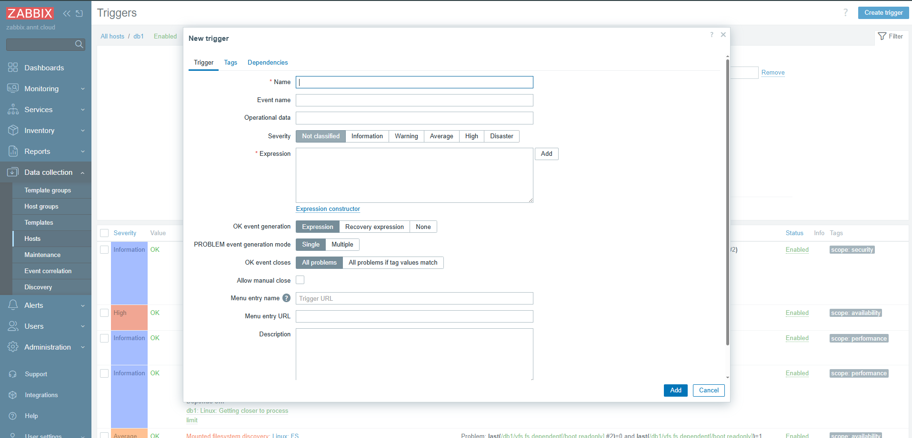
	
- Các trường cấu hình 

| Tham số                          | Mô tả                                                                                                                                                                                                                                                                                                                                                                                                                                                                                                                                                                                                                                                                                                                                                       |
|----------------------------------|--------------------------------------------------------------------------------------------------------------------------------------------------------------------------------------------------------------------------------------------------------------------------------------------------------------------------------------------------------------------------------------------------------------------------------------------------------------------------------------------------------------------------------------------------------------------------------------------------------------------------------------------------------------------------------------------------------------------------------------------------------------|
| **Name**                         | Tên của trigger. Hỗ trợ macro: `{HOST.HOST}`, `{HOST.NAME}`, `{HOST.PORT}`, `{HOST.CONN}`, `{HOST.DNS}`, `{HOST.IP}`, `{ITEM.VALUE}`, `{ITEM.VALUE.AGE}`, `{ITEM.VALUE.DATE}`, `{ITEM.VALUE.TIME}`, `{ITEM.VALUE.TIMESTAMP}`, `{ITEM.LASTVALUE}`, `{ITEM.LASTVALUE.AGE}`, `{ITEM.LASTVALUE.DATE}`, `{ITEM.LASTVALUE.TIME}`, `{ITEM.LASTVALUE.TIMESTAMP}`, `{ITEM.LOG.*}`, `{$MACRO}`. <br> Hỗ trợ macro `$1`–`$9` để tham chiếu các hằng số trong biểu thức. Ví dụ: tên "Processor load above $1 on {HOST.NAME}" sẽ tự động chuyển thành "Processor load above 5 on New host" nếu biểu thức là `last(/New host/system.cpu.load[percpu,avg1])>5`. |
| **Event name**                   | Nếu được định nghĩa, tên này sẽ dùng để tạo tên sự kiện problem thay vì tên trigger. Có thể sử dụng để tạo cảnh báo chứa dữ liệu chi tiết. Hỗ trợ cùng bộ macro như trong tên trigger, cộng thêm `{TIME}`, `{TIMESTAMP}`, và `{?EXPRESSION}`.                                                                                                                                                                                                                                                                                                                                                                                                                                                                                                                     |
| **Operational data**             | Dữ liệu vận hành cho phép định nghĩa chuỗi tùy ý kèm macro, hiển thị động trong **Monitoring → Problems**. Macro trong dữ liệu vận hành hiển thị thông tin mới nhất theo thời gian thực, khác với macro trong tên trigger (tĩnh tại thời điểm xảy ra sự cố). Nếu không định nghĩa, giá trị mới nhất của các item trong biểu thức sẽ hiển thị. Hỗ trợ cùng bộ macro như trong tên trigger.                                                                                                                                                                                                                                                                                                                                                                                       |
| **Severity**                     | Mức độ nghiêm trọng của trigger (chọn qua các nút).                                                                                                                                                                                                                                                                                                                                                                                                                                                                                                                                                                                                                                                                                                        |
| **Expression**                   | Biểu thức logic định nghĩa điều kiện sinh sự cố (problem). Hỗ trợ hậu tố thời gian và kích thước bộ nhớ. <br> - Sự cố được tạo khi biểu thức trả về **TRUE**. <br> - Sự cố tự động đóng khi biểu thức trả về **FALSE**, trừ khi có điều kiện khôi phục trong **Recovery expression**.                                                                                                                                                                                                                                                                                                                                                                                                                                                                                       |
| **OK event generation**          | Chế độ tạo sự kiện OK: <br> - **Expression**: dựa trên cùng biểu thức với problem. <br> - **Recovery expression**: dựa vào việc problem expression = FALSE và recovery expression = TRUE. <br> - **None**: trigger sẽ không tự chuyển sang trạng thái OK.                                                                                                                                                                                                                                                                                                                                                                                                                                                                                                                                        |
| **Recovery expression**           | Biểu thức logic (tùy chọn) định nghĩa điều kiện bổ sung để giải quyết sự cố, sau khi problem expression đã trở về FALSE. Không thể tự đóng sự cố chỉ bằng recovery expression nếu problem expression vẫn TRUE. Trường này chỉ khả dụng nếu chọn "Recovery expression" trong OK event generation.                                                                                                                                                                                                                                                                                                                                                                                                                                                                                                      |
| **PROBLEM event generation mode** | Chế độ tạo sự kiện problem: <br> - **Single**: chỉ tạo một sự kiện khi trigger lần đầu vào trạng thái Problem. <br> - **Multiple**: tạo sự kiện mỗi lần trigger được đánh giá là Problem.                                                                                                                                                                                                                                                                                                                                                                                                                                                                                                                                                                                                      |
| **OK event closes**              | Xác định cách sự kiện OK đóng problem: <br> - **All problems**: đóng tất cả problem của trigger. <br> - **All problems if tag values match**: chỉ đóng problem có giá trị tag khớp.                                                                                                                                                                                                                                                                                                                                                                                                                                                                                                                                                                                                                 |
| **Tag for matching**             | Tên tag sự kiện dùng để so khớp sự kiện khi chọn "All problems if tag values match". Bắt buộc khi sử dụng tùy chọn này.                                                                                                                                                                                                                                                                                                                                                                                                                                                                                                                                                                                                                                                                           |
| **Allow manual close**           | Cho phép đóng thủ công các sự kiện problem do trigger này tạo. Đóng thủ công khả dụng khi xác nhận sự kiện problem.                                                                                                                                                                                                                                                                                                                                                                                                                                                                                                                                                                                                                                                                               |
| **Menu entry name**              | Tên hiển thị (tối đa 64 ký tự) cho liên kết URL của trigger trong giao diện. Nếu để trống, sử dụng mặc định "Trigger URL". Hỗ trợ cùng bộ macro như trong trigger URL.                                                                                                                                                                                                                                                                                                                                                                                                                                                                                                                                                                                                                            |
| **Menu entry URL**               | URL (tối đa 2048 ký tự) hiển thị dưới dạng liên kết trong menu sự kiện (ví dụ khi nhấn vào tên problem trong **Monitoring → Problems**). Hỗ trợ macro như trong tên trigger, cộng thêm `{EVENT.ID}`, `{HOST.ID}`, `{TRIGGER.ID}`. **Lưu ý:** macro bí mật sẽ không được giải quyết trong URL.                                                                                                                                                                                                                                                                                                                                                                                                                                                                                                     |
| **Description**                  | Mô tả chi tiết về trigger. Có thể bao gồm hướng dẫn xử lý, thông tin liên hệ, hoặc chi tiết khác. Hỗ trợ cùng bộ macro như trong tên trigger.                                                                                                                                                                                                                                                                                                                                                                                                                                                                                                                                                                                                                                                       |
| **Enabled**                      | Nếu bỏ chọn, trigger bị vô hiệu hóa. Các problem liên quan sẽ không hiển thị trong giao diện nhưng không bị xóa.                                                                                                                                                                                                                                                                                                                                                                                                                                                                                                                                                                                                                                                                                  |

#### 3.3.2 Trigger expression
- Các biểu thức được sử dụng trong trigger rất linh hoạt, cho phép tạo các bài kiểm tra logic phức tạp liên quan đến các số liệu giám sát.
- Một biểu thức đơn giản sử dụng một hàm được áp dụng cho item với một số tham số (parameters). Hàm này trả về một kết quả được so sánh với ngưỡng (threshold), sử dụng một toán tử (operator) và một hằng số (constant).
- Cú pháp của một biểu thức đơn giản là: 
`function(/host/key,parameter)<operator><constant>`
- Ví dụ:
	`min(/Zabbix server/net.if.in[eth0,bytes],5m)>100K`
	- Trigger này sẽ kích hoạt nếu số lượng byte nhận được trong năm phút gần nhất luôn lớn hơn 100 kilobyte.
- Mặc dù có cùng cú pháp, nhưng từ góc độ chức năng, có hai loại biểu thức trigger:
	- Biểu thức sự cố (problem expression) – định nghĩa các điều kiện của sự cố.
	- Biểu thức phục hồi (recovery expression) (tùy chọn) – định nghĩa các điều kiện bổ sung để giải quyết sự cố.
- Khi chỉ định nghĩa một mình biểu thức sự cố, biểu thức này sẽ được sử dụng làm cả ngưỡng sự cố và ngưỡng phục hồi sự cố. Ngay khi biểu thức sự cố đánh giá thành TRUE, có một sự cố. Ngay khi biểu thức sự cố đánh giá thành FALSE, sự cố được giải quyết.
- Khi định nghĩa cả biểu thức sự cố và biểu thức phục hồi bổ sung, việc giải quyết sự cố trở nên phức tạp hơn: không chỉ biểu thức sự cố phải là FALSE, mà biểu thức phục hồi cũng phải là TRUE. Điều này hữu ích để tạo độ trễ (hysteresis) và tránh hiện tượng trigger flapping.

### 3.4 Events 
- Có một số loại **sự kiện** được tạo ra trong Zabbix:
	- **Sự kiện trigger** – bất cứ khi nào một **trigger** thay đổi trạng thái (**OK** → **PROBLEM** → **OK**).
	- **Sự kiện dịch vụ** – bất cứ khi nào một **dịch vụ** thay đổi trạng thái (**OK** → **PROBLEM** → **OK**).
	- **Sự kiện khám phá** – khi các **host** hoặc **dịch vụ** được phát hiện.
	- **Sự kiện tự động đăng ký** – khi các **agent chủ động** tự động đăng ký bởi máy chủ.
	- **Sự kiện nội bộ** – khi một **item**/**quy tắc khám phá cấp thấp** trở thành **unsupported** hoặc một **trigger** chuyển sang trạng thái **unknown**.
- Các **sự kiện** được gắn thời gian và có thể là cơ sở của các **hành động** như gửi email thông báo, v.v.
#### 3.4.1 Tạo sự kiện Trigger
- Sự thay đổi trạng thái của **trigger** là nguồn **sự kiện** thường xuyên nhất và quan trọng nhất. Mỗi khi **trigger** thay đổi trạng thái, một **sự kiện** sẽ được tạo ra. **Sự kiện** chứa chi tiết về sự thay đổi trạng thái của **trigger** – khi nào nó xảy ra và trạng thái mới là gì.
- Hai loại **sự kiện** được tạo bởi **trigger** – **Problem** và **OK**.
	- Sự kiện Problem
		- Một **sự kiện problem** được tạo:
		- * Khi một **biểu thức trigger** đánh giá thành **TRUE** nếu **trigger** ở trạng thái **OK**;
		- * Mỗi khi một **biểu thức trigger** đánh giá thành **TRUE** nếu bật **tạo nhiều sự kiện problem** cho **trigger**.
	- Sự kiện OK
		- Một **sự kiện OK** đóng (các) **sự kiện problem** liên quan và có thể được tạo bởi 3 thành phần:
		- **Trigger** – dựa trên cài đặt **'OK event generation'** và **'OK event closes'**;
		- **Tương quan sự kiện** (event correlation);
		- **Trình quản lý tác vụ** (task manager) – khi một **sự kiện** được đóng thủ công.
- Trigger
	- Các **trigger** có cài đặt **'OK event generation'** kiểm soát cách các **sự kiện OK** được tạo:
	- **Expression** - một **sự kiện OK** được tạo cho một **trigger** ở trạng thái **problem** khi biểu thức của nó đánh giá thành **FALSE**. Đây là cài đặt đơn giản nhất, được bật theo mặc định.
	- **Recovery expression** - một **sự kiện OK** được tạo cho một **trigger** ở trạng thái **problem** khi biểu thức của nó đánh giá thành **FALSE** và **biểu thức phục hồi** đánh giá thành **TRUE**. Điều này có thể được sử dụng nếu tiêu chí phục hồi **trigger** khác với tiêu chí sự cố.
	- **None** - một **sự kiện OK** không bao giờ được tạo. Điều này có thể được sử dụng kết hợp với **tạo nhiều sự kiện problem** để chỉ đơn giản là gửi thông báo khi có điều gì đó xảy ra.
	- Ngoài ra, các **trigger** có cài đặt **'OK event closes'** kiểm soát **sự kiện problem** nào được đóng:
		- **All problems** - một **sự kiện OK** sẽ đóng tất cả các sự cố đang mở được tạo bởi **trigger**.
		- **All problems if tag values match** - một **sự kiện OK** sẽ đóng các sự cố đang mở được tạo bởi **trigger** và có ít nhất một giá trị **tag** khớp. **Tag** được định nghĩa bởi cài đặt **'Tag for matching' trigger**. Nếu không có **sự kiện problem** nào để đóng thì **sự kiện OK** không được tạo. Điều này thường được gọi là **tương quan sự kiện cấp trigger** (trigger level event correlation).
#### 3.4.2 Các nguồn sự kiện khác
- Sự kiện dịch vụ (Service Events)
	- Các **sự kiện dịch vụ** chỉ được tạo nếu các **hành động dịch vụ** cho các **sự kiện** này được bật. Trong trường hợp này, mỗi thay đổi trạng thái **dịch vụ** sẽ tạo một **sự kiện** mới:
	- - **Sự kiện Problem** – khi trạng thái **dịch vụ** thay đổi từ **OK** sang **PROBLEM**.
	- - **Sự kiện OK** – khi trạng thái **dịch vụ** thay đổi từ **PROBLEM** sang **OK**.
	- **Sự kiện** chứa chi tiết về sự thay đổi trạng thái **dịch vụ** – khi nào nó xảy ra và trạng thái mới là gì.
- Discovery Events
	- Zabbix định kỳ quét các **dải IP** được định nghĩa trong các **quy tắc khám phá mạng**. Tần suất kiểm tra có thể cấu hình cho mỗi quy tắc riêng lẻ. Sau khi một **host** hoặc một **dịch vụ** được khám phá, một **sự kiện khám phá** (hoặc một số **sự kiện**) sẽ được tạo ra.
	- Zabbix tạo ra các **sự kiện** sau:

		| Sự kiện | Khi nào được tạo |
		| :-----| :--------------|
		| **Service Up** | Mỗi khi Zabbix phát hiện dịch vụ đang hoạt động. |
		| **Service Down** | Mỗi khi Zabbix không thể phát hiện dịch vụ. |
		| **Host Up** | Nếu ít nhất một trong các dịch vụ đang **UP** cho **IP**. |
		| **Host Down** | Nếu tất cả các dịch vụ không phản hồi. |
		| **Service Discovered** | Nếu dịch vụ trở lại sau thời gian ngừng hoạt động hoặc được khám phá lần đầu tiên. |
		| **Service Lost** | Nếu dịch vụ bị mất sau khi hoạt động. |
		| **Host Discovered** | Nếu **host** trở lại sau thời gian ngừng hoạt động hoặc được khám phá lần đầu tiên. |
		| **Host Lost** | Nếu **host** bị mất sau khi hoạt động. |
		
- Sự kiện tự động đăng ký Agent chủ động (Active Agent Autoregistration Events)
	- **Tự động đăng ký agent chủ động** tạo ra các **sự kiện** trong Zabbix.
	- Nếu được cấu hình, **sự kiện tự động đăng ký agent chủ động** được tạo khi một **agent chủ động** chưa từng biết trước đây yêu cầu kiểm tra hoặc nếu **metadata host** đã thay đổi. Máy chủ thêm một **host** tự động đăng ký mới, sử dụng địa chỉ **IP** và cổng của **agent** đã nhận được.
- Sự kiện nội bộ (Internal Events)
	- Các **sự kiện nội bộ** xảy ra khi:
	- * Một **item** thay đổi trạng thái từ 'normal' sang 'unsupported'.
	- * Một **item** thay đổi trạng thái từ 'unsupported' sang 'normal'.
	- * Một **quy tắc khám phá cấp thấp** thay đổi trạng thái từ 'normal' sang 'unsupported'.
	- * Một **quy tắc khám phá cấp thấp** thay đổi trạng thái từ 'unsupported' sang 'normal'.
	- * Một **trigger** thay đổi trạng thái từ 'normal' sang 'unknown'.
	- * Một **trigger** thay đổi trạng thái từ 'unknown' sang 'normal'.
	- Mục đích của việc giới thiệu các **sự kiện nội bộ** là cho phép người dùng được thông báo khi bất kỳ **sự kiện nội bộ** nào diễn ra, ví dụ, một **item** trở nên **unsupported** và ngừng thu thập dữ liệu.
	- Các **sự kiện nội bộ** chỉ được tạo khi các **hành động nội bộ** cho các **sự kiện** này được bật. Để ngừng tạo các **sự kiện nội bộ** (ví dụ, đối với các **item** trở nên **unsupported**), hãy tắt tất cả các **hành động** cho các **sự kiện nội bộ** trong **Alerts** → **Actions** → **Internal actions**.

#### 3.4.3 Manual Closing of Problems
- Mặc dù các **sự kiện problem** thường được giải quyết tự động khi trạng thái **trigger** chuyển từ 'Problem' sang 'OK', có thể có những trường hợp khó xác định liệu một sự cố đã được giải quyết bằng cách sử dụng một **biểu thức trigger** hay không. Trong những trường hợp như vậy, sự cố cần được giải quyết thủ công.
- Ví dụ, syslog có thể báo cáo rằng một số **tham số kernel** cần được điều chỉnh để có hiệu suất tối ưu. Trong trường hợp này, vấn đề được báo cáo cho các quản trị viên Linux, họ khắc phục nó và sau đó đóng sự cố thủ công.
- Các sự cố chỉ có thể được đóng thủ công đối với các **trigger** đã bật tùy chọn **Allow manual close**.
- Khi một sự cố được "đóng thủ công", Zabbix tạo một **tác vụ nội bộ** mới cho **Zabbix server**. Sau đó, **quá trình quản lý tác vụ** thực thi tác vụ này và tạo một **sự kiện OK**, do đó đóng **sự kiện problem**.
- Một sự cố được đóng thủ công không có nghĩa là **trigger** cơ bản sẽ không bao giờ chuyển sang trạng thái 'Problem' nữa. **Biểu thức trigger** được đánh giá lại và có thể dẫn đến một sự cố:
- * Khi dữ liệu mới đến cho bất kỳ **item** nào được bao gồm trong **biểu thức trigger** (lưu ý rằng các giá trị bị loại bỏ bởi bước **preprocessing throttling** không được coi là đã nhận và sẽ không khiến **biểu thức trigger** được đánh giá lại);
- * Khi các hàm **date and time** và/hoặc **nodata()** được sử dụng trong biểu thức.
- Cấu hình: Cần hai bước để đóng một sự cố thủ công.
	- Cấu hình Trigger: Trong cấu hình **trigger**, bật tùy chọn **Allow manual close**.
	- Cửa sổ cập nhật sự cố (Problem Update Window)
		- Nếu một sự cố phát sinh cho một **trigger** có cờ **Manual close**, có thể mở cửa sổ bật lên cập nhật sự cố của sự cố đó và đóng sự cố thủ công.
		- Để đóng sự cố, chọn tùy chọn **Close problem** trong biểu mẫu và nhấp vào **Update**.
		- Tất cả các trường nhập bắt buộc được đánh dấu bằng dấu hoa thị màu đỏ.
		- Yêu cầu được xử lý bởi **Zabbix server**. Thông thường sẽ mất vài giây để đóng sự cố. Trong quá trình đó, **CLOSING** được hiển thị trong **Monitoring** → **Problems** làm trạng thái của sự cố.
- Xác minh (Verification)
	- Có thể xác minh rằng một sự cố đã được đóng thủ công:
	- * Trong chi tiết **sự kiện**, có sẵn thông qua **Monitoring** → **Problems**;
	- * Bằng cách sử dụng **macro {EVENT.UPDATE.HISTORY}** trong các tin nhắn thông báo sẽ cung cấp thông tin này.

### 3.5 Tag 
- Các thẻ (tags) bao gồm một tên thẻ và một giá trị thẻ. Khi gắn thẻ cho các thực thể, có thể chỉ dùng tên hoặc kết hợp với một giá trị (ví dụ: mysql, jira, target:mysql, service:jira, v.v.).
- Các thẻ có thể được định nghĩa cho nhiều thực thể khác nhau:
	- Template
	- Host
	- Item
	- Web scenario
	- Trigger
	- Service
	- Template item và trigger
	- Host, item, và trigger prototype
- Các thẻ có nhiều mục đích, đáng chú ý nhất là để đánh dấu sự kiện (events). Khi các thực thể được gắn thẻ, bất kỳ sự kiện mới nào liên quan đến thực thể được gắn thẻ sẽ kế thừa các thẻ của nó. Ví dụ:
	- Với template được gắn thẻ – bất kỳ sự cố host nào (được tạo bởi trigger từ template) sẽ kế thừa các thẻ template đó;
	- Với host được gắn thẻ – bất kỳ sự cố host nào cũng sẽ kế thừa các thẻ host đó;
	- Với item/web scenario được gắn thẻ – bất kỳ sự cố item/web scenario nào cũng sẽ kế thừa các thẻ item/web scenario đó;
	- Với trigger được gắn thẻ – bất kỳ sự cố nào được tạo bởi trigger sẽ kế thừa các thẻ trigger đó.
- Một sự kiện sự cố kế thừa tất cả các thẻ từ toàn bộ chuỗi thực thể – template, host, item/web scenario, trigger. Các kết hợp tag:value giống hệt nhau (sau khi các macro được giải quyết) sẽ được hợp nhất thành một, tránh trùng lặp.
- Các thẻ sự kiện tùy chỉnh (Custom event tags) mang lại sự linh hoạt hơn. Ví dụ:
	- Tương quan sự kiện (event correlation) có thể được cấu hình dựa trên các thẻ sự kiện;
	- Điều kiện hành động (action conditions) có thể được cấu hình dựa trên các thẻ sự kiện;
	- Các sự cố item có thể được nhóm dựa trên các thẻ sự kiện;
	- Các thẻ sự cố có thể được sử dụng để ánh xạ các sự cố với service.
	- Các thực thể có thể được gắn cùng tên thẻ nhưng giá trị thẻ khác nhau (ví dụ: component:memory và component:storage). Tương tự, một thực thể có thể có một thẻ không có giá trị và cùng một thẻ có giá trị (ví dụ: database và database:postgresql). Những thẻ như vậy không được coi là trùng lặp.
- Các trường hợp sử dụng thẻ: Một số trường hợp sử dụng phổ biến cho việc gắn thẻ như sau:
	- Đánh dấu các sự kiện trigger:
		- Định nghĩa một thẻ trigger (ví dụ: scope:performance).
		- Các sự cố được tạo bởi trigger này sẽ có thẻ trigger đó.
	- Đánh dấu các sự cố kế thừa từ template:
		- Định nghĩa một thẻ template (ví dụ: target:mysql).
		- Các sự cố được tạo bởi trigger từ template này sẽ có thẻ template đó.
	- Đánh dấu các sự cố host:
		- Định nghĩa một thẻ host (ví dụ: service:jira).
		- Các sự cố được tạo bởi trigger từ host này sẽ có thẻ host đó.
	- Lọc các item liên quan:
		- Định nghĩa một thẻ item (ví dụ: component:cpu).
		- Trong Monitoring → Latest data, các item có thể được lọc theo thẻ component:cpu.
- Hỗ trợ Macro trong Tag
	- Các macro tích hợp (built-in) và macro người dùng (user macros) trong các tag sẽ được giải quyết tại thời điểm xảy ra sự kiện. Cho đến khi sự kiện xảy ra, các macro này sẽ hiển thị ở giao diện Zabbix dưới dạng chưa được giải quyết.
	- Các macro low-level discovery sẽ được giải quyết trong quá trình discovery.
	- Các macro sau có thể được sử dụng trong tên và giá trị của tag trigger:
		- Các macro built-in: {ITEM.VALUE}, {ITEM.VALUE.AGE}, {ITEM.VALUE.DATE}, {ITEM.VALUE.TIME}, {ITEM.VALUE.TIMESTAMP}, {ITEM.LASTVALUE}, {ITEM.LASTVALUE.AGE}, {ITEM.LASTVALUE.DATE}, {ITEM.LASTVALUE.TIME}, {ITEM.LASTVALUE.TIMESTAMP}, {HOST.HOST}, {HOST.NAME}, {HOST.CONN}, {HOST.DNS}, {HOST.IP}, {HOST.PORT}, và {HOST.ID}.
		- Các macro built-in {INVENTORY.*} (để tham chiếu các giá trị host inventory từ một hoặc nhiều host trong một biểu thức trigger).
		- Macro người dùng và macro người dùng có ngữ cảnh (ngữ cảnh có thể bao gồm các macro low-level discovery).
		- Macro low-level discovery (chỉ trong các tag trigger prototype).
	- Các macro sau có thể được sử dụng trong tên và giá trị của tag template, host, và item/web scenario:
		- Các macro built-in: {HOST.HOST}, {HOST.NAME}, {HOST.CONN}, {HOST.DNS}, {HOST.IP}, {HOST.PORT} và {HOST.ID}.
		- Các macro built-in {INVENTORY.*}.
		- Macro người dùng.
		- Macro low-level discovery (chỉ trong các tag host và item prototype).
	- Các macro sau có thể được sử dụng trong các thông báo dựa trên trigger:
		- Các macro built-in {EVENT.TAGS} và {EVENT.RECOVERY.TAGS} (các macro này sẽ giải quyết thành một danh sách các tag sự kiện hoặc tag sự kiện phục hồi được phân tách bằng dấu phẩy).
		- Các macro built-in {EVENT.TAGSJSON} và {EVENT.RECOVERY.TAGSJSON} (các macro này sẽ giải quyết thành một mảng JSON chứa các object tag sự kiện hoặc object tag sự kiện phục hồi).
	- Trích xuất chuỗi con trong Trigger Tag
		- Trích xuất chuỗi con được hỗ trợ để điền tên hoặc giá trị tag, sử dụng một hàm macro. Hàm này áp dụng một biểu thức chính quy (regular expression) vào giá trị thu được bởi macro được hỗ trợ. Ví dụ:
		- {{ITEM.VALUE}.regsub(pattern, output)}
		- {{ITEM.VALUE}.iregsub(pattern, output)}
		- {{#LLDMACRO}.regsub(pattern, output)}
		- {{#LLDMACRO}.iregsub(pattern, output)}
		- Nếu tên hoặc giá trị tag vượt quá 255 ký tự sau khi giải quyết macro, nó sẽ bị cắt ngắn thành 255 ký tự.
### 3.6 Visualization
#### 3.6.1 Biểu đồ (Graphs)
- Với lượng lớn dữ liệu đổ vào Zabbix, việc biểu diễn trực quan những gì đang diễn ra sẽ giúp người dùng dễ dàng hơn rất nhiều so với việc chỉ nhìn vào các con số.
- Đây là lúc các **biểu đồ** phát huy tác dụng. **Biểu đồ** cho phép nắm bắt dòng dữ liệu trong nháy mắt, tương quan các sự cố, khám phá khi nào điều gì đó bắt đầu hoặc trình bày khi nào điều gì đó có thể trở thành sự cố.
- Zabbix cung cấp cho người dùng:
	- Các **biểu đồ đơn giản** tích hợp sẵn của dữ liệu một **item**.
	- Khả năng tạo các **biểu đồ tùy chỉnh** phức tạp hơn.
	- Truy cập nhanh chóng vào việc so sánh nhiều **item** trong các **biểu đồ tùy biến nhanh** (ad-hoc graphs).
	- Các **biểu đồ vector** và **biểu đồ hình tròn** hiện đại có thể tùy chỉnh.

##### 3.6.1.1 Biểu đồ đơn giản
- **Biểu đồ đơn giản** được cung cấp để trực quan hóa dữ liệu được thu thập bởi các **item**.
- Không yêu cầu nỗ lực cấu hình từ phía người dùng để xem **biểu đồ đơn giản**. Chúng được Zabbix cung cấp miễn phí.
- Chỉ cần truy cập **Monitoring** → **Latest data** và nhấp vào liên kết **Graph** cho **item** tương ứng, một **biểu đồ** sẽ được hiển thị.
##### 3.6.1.2 Biểu đồ tùy chỉnh
- **Biểu đồ tùy chỉnh**, cung cấp khả năng tùy chỉnh.
- Trong khi các **biểu đồ đơn giản** tốt để xem dữ liệu của một **item** duy nhất, chúng không cung cấp khả năng cấu hình.
- Do đó, nếu muốn thay đổi kiểu **biểu đồ** hoặc cách hiển thị đường kẻ hoặc so sánh một số **item**, ví dụ: lưu lượng truy cập đến và đi trong một **biểu đồ** duy nhất, cần một **biểu đồ tùy chỉnh**.
- **Biểu đồ tùy chỉnh** được cấu hình thủ công.
- Chúng có thể được tạo cho một **host** hoặc nhiều **host** hoặc cho một **template** duy nhất.
- Cấu hình biểu đồ tùy chỉnh
	- Để tạo một **biểu đồ tùy chỉnh**, thực hiện như sau:
	- 1.  Truy cập **Data collection** → **Hosts** (hoặc **Templates**).
	- 2.  Nhấp vào **Graphs** trong hàng bên cạnh **host** hoặc **template** mong muốn.
	- 3.  Trong màn hình **Graphs**, nhấp vào **Create graph**.
	- 4.  Chỉnh sửa các thuộc tính **biểu đồ**.
- Thuộc tính biểu đồ:

| Tham số | Mô tả |
| :-----| :---- |
| **Name** | Tên **biểu đồ** duy nhất. **Macro biểu thức** được hỗ trợ trong trường này, nhưng chỉ với các hàm `avg`, `last`, `min` và `max`, với `time` làm tham số (ví dụ: `{?avg(/host/key,1h)}`). Các **macro {HOST.HOST\<1-9\>}** được hỗ trợ để sử dụng trong **macro** này, tham chiếu đến **host** thứ nhất, thứ hai, thứ ba, v.v. trong **biểu đồ**, ví dụ `{?avg(/{HOST.HOST2}/key,1h)}`. Lưu ý rằng việc tham chiếu **host** đầu tiên bằng **macro** này là dư thừa, vì **host** đầu tiên có thể được tham chiếu một cách ngầm định, ví dụ `{?avg(//key,1h)}`. |
| **Width** | Chiều rộng **biểu đồ** theo pixel (chỉ dành cho xem trước và **biểu đồ hình tròn**/**biểu đồ hình tròn tách rời**). |
| **Height** | Chiều cao **biểu đồ** theo pixel. |
| **Graph type** | Loại **biểu đồ**: \<br\> **Normal** - **biểu đồ** bình thường, các giá trị hiển thị dưới dạng đường. \<br\> **Stacked** - **biểu đồ chồng** (stacked graph), các khu vực được tô đầy hiển thị. \<br\> **Pie** - **biểu đồ hình tròn**. \<br\> **Exploded** - **biểu đồ hình tròn tách rời**, các phần hiển thị dưới dạng "tách rời" khỏi hình tròn. |
| **Show legend** | Chọn hộp này sẽ hiển thị **chú giải biểu đồ**. |
| **Show working time** | Nếu được chọn, giờ không làm việc sẽ được hiển thị với nền màu xám. Tham số này không khả dụng cho **biểu đồ hình tròn** và **biểu đồ hình tròn tách rời**. |
| **Show triggers** | Nếu được chọn, các **trigger đơn giản** sẽ được hiển thị dưới dạng các đường nét đứt màu đen trên màu sắc mức độ nghiêm trọng của **trigger**. Tham số này không khả dụng cho **biểu đồ hình tròn** và **biểu đồ hình tròn tách rời**. |
| **Percentile line (left)** | Hiển thị **percentile** cho trục Y bên trái. Ví dụ, nếu **percentile 95%** được đặt, đường **percentile** sẽ ở mức mà 95 phần trăm giá trị nằm dưới. Hiển thị dưới dạng đường màu xanh lá cây sáng. Chỉ khả dụng cho **biểu đồ Normal**. |
| **Percentile line (right)** | Hiển thị **percentile** cho trục Y bên phải. Ví dụ, nếu **percentile 95%** được đặt, đường **percentile** sẽ ở mức mà 95 phần trăm giá trị nằm dưới. Hiển thị dưới dạng đường màu đỏ tươi. Chỉ khả dụng cho **biểu đồ Normal**. |
| **Y axis MIN value** | Giá trị tối thiểu của trục Y: \<br\> **Calculated** - giá trị tối thiểu của trục Y sẽ được tự động tính toán. \<br\> **Fixed** - giá trị tối thiểu cố định cho trục Y. \<br\> **Item** - giá trị cuối cùng của **item** được chọn sẽ là giá trị tối thiểu. \<br\> Tham số này không khả dụng cho **biểu đồ hình tròn** và **biểu đồ hình tròn tách rời**. |
| **Y axis MAX value** | Giá trị tối đa của trục Y: \<br\> **Calculated** - giá trị tối đa của trục Y sẽ được tự động tính toán. \<br\> **Fixed** - giá trị tối đa cố định cho trục Y. \<br\> **Item** - giá trị cuối cùng của **item** được chọn sẽ là giá trị tối đa. \<br\> Tham số này không khả dụng cho **biểu đồ hình tròn** và **biểu đồ hình tròn tách rời**. |
| **3D view** | Bật kiểu 3D. Chỉ dành cho **biểu đồ hình tròn** và **biểu đồ hình tròn tách rời**. |
| **Items** | Các **item** mà dữ liệu của chúng sẽ được hiển thị trong **biểu đồ** này. Nhấp vào **Add** để chọn **item**. Có thể chọn các tùy chọn hiển thị khác nhau (**function**, **draw style**, hiển thị trục trái/phải, **color**). |
| **Sort order (0→100)** | Thứ tự vẽ. 0 sẽ được xử lý trước. Có thể được sử dụng để vẽ các đường hoặc vùng phía sau (hoặc phía trước) một đường khác. Có thể kéo và thả các **item** bằng cách sử dụng biểu tượng ở đầu một dòng để đặt thứ tự sắp xếp hoặc **item** nào được hiển thị ở phía trước **item** khác. |
| **Name** | Tên của **item** được chọn hiển thị dưới dạng liên kết. Nhấp vào liên kết sẽ mở danh sách các **item** khác có sẵn. |
| **Type** | Loại (chỉ khả dụng cho **biểu đồ hình tròn** và **biểu đồ hình tròn tách rời**): \<br\> **Simple** - giá trị của **item** được biểu diễn theo tỷ lệ trên biểu đồ hình tròn. \<br\> **Graph sum** - giá trị của **item** biểu thị toàn bộ biểu đồ hình tròn. \<br\> Lưu ý rằng màu sắc của **item** "graph sum" sẽ chỉ hiển thị trong phạm vi mà nó không bị chiếm bởi các **item** "proportional". |
| **Function** | Chọn giá trị sẽ được hiển thị khi có nhiều hơn một giá trị trên mỗi pixel **biểu đồ** dọc cho một **item**: \<br\> **all** - hiển thị tất cả các giá trị có thể (tối thiểu, tối đa, trung bình) trong **biểu đồ**. Lưu ý rằng đối với các khoảng thời gian ngắn hơn, cài đặt này không có hiệu lực; chỉ đối với các khoảng thời gian dài hơn, khi sự tắc nghẽn dữ liệu trong một pixel **biểu đồ** dọc tăng lên, 'all' bắt đầu hiển thị các giá trị tối thiểu, tối đa và trung bình. Hàm này chỉ khả dụng cho loại **biểu đồ Normal**. Xem thêm: Generating graphs from history/trends. \<br\> **avg** - hiển thị các giá trị trung bình. \<br\> **last** - hiển thị các giá trị gần nhất. Hàm này chỉ khả dụng nếu **Pie**/**Exploded pie** được chọn làm loại **biểu đồ**. \<br\> **max** - hiển thị các giá trị tối đa. \<br\> **min** - hiển thị các giá trị tối thiểu. |
| **Draw style** | Chọn **kiểu vẽ** (chỉ khả dụng cho **biểu đồ normal**; đối với **biểu đồ stacked** luôn sử dụng vùng tô đầy) để áp dụng cho dữ liệu **item** – **Line**, **Bold line**, **Filled region**, **Dot**, **Dashed line**, **Gradient line**. |
| **Y axis side** | Chọn phía trục Y để hiển thị dữ liệu **item** – **Left**, **Right**. |
| **Color** | Chọn **màu** để áp dụng cho dữ liệu **item**. |

##### 3.6.1.2 Biểu đồ tùy biến nhanh (Ad-hoc Graphs)
- Trong khi một **biểu đồ đơn giản** dùng để truy cập dữ liệu nhanh của một **item** và các **biểu đồ tùy chỉnh** cung cấp các tùy chọn tùy chỉnh, không có loại nào trong hai loại này cho phép nhanh chóng tạo một **biểu đồ so sánh** cho nhiều **item** với ít nỗ lực và không cần bảo trì.
- Để giải quyết vấn đề này, có thể tạo các **biểu đồ tùy biến nhanh** cho một số **item** một cách rất nhanh chóng.
- Cấu hình
	- Để tạo một **biểu đồ tùy biến nhanh**, thực hiện như sau:
	- 1.  Truy cập **Monitoring** → **Latest data**.
	- 2.  Sử dụng bộ lọc để hiển thị các **item** muốn lập **biểu đồ**.
	- 3.  Đánh dấu các ô kiểm của các **item** muốn lập **biểu đồ**.
	- 4.  Nhấp vào các nút **Display stacked graph** hoặc **Display graph**.
##### 3.6.1.3 Aggregation functions
- Các **hàm tổng hợp** (aggregation functions), có sẵn trong các **widget biểu đồ** và **biểu đồ hình tròn** của **dashboard**, cho phép hiển thị giá trị tổng hợp cho khoảng thời gian đã chọn (5 phút, một giờ, một ngày), thay vì tất cả các giá trị.
- Phần này cung cấp chi tiết hơn về các tùy chọn tổng hợp trong **widget biểu đồ**.
- Các tùy chọn tổng hợp như sau:
	- `min`
	- `max`
	- `avg`
	- `count`
	- `sum`
	- `first` (giá trị đầu tiên hiển thị)
	- `last` (giá trị cuối cùng hiển thị)
#### 3.6.2 Sơ đồ mạng (Network Maps)
- Sơ đồ cung cấp góc nhìn tổng quan hệ thống 
- Tất cả người dùng đều có thể tạo **sơ đồ mạng**. Các **sơ đồ** có thể là **công khai** (có sẵn cho tất cả người dùng) hoặc **riêng tư** (chỉ có sẵn cho những người dùng được chọn).
- Cấu hình sơ đồ mạng
	- Cấu hình một **sơ đồ** trong Zabbix yêu cầu trước tiên tạo một **sơ đồ** bằng cách định nghĩa các **tham số** chung của nó và sau đó bắt đầu điền **sơ đồ** thực tế với các **phần tử** và liên kết của chúng.
	- Có thể điền **sơ đồ** với các **phần tử** là một **host**, một **nhóm host**, một **trigger**, một **hình ảnh** hoặc một **sơ đồ** khác.
	- Các **biểu tượng** được sử dụng để đại diện cho các **phần tử sơ đồ**. Có thể định nghĩa thông tin sẽ được hiển thị cùng với các **biểu tượng** và đặt rằng các sự cố gần đây được hiển thị theo một cách đặc biệt. Có thể liên kết các **biểu tượng** và định nghĩa thông tin để hiển thị trên các liên kết.
	- Có thể thêm các **URL tùy chỉnh** để có thể truy cập bằng cách nhấp vào các **biểu tượng**. Do đó có thể liên kết một **biểu tượng host** với các thuộc tính **host** hoặc một **biểu tượng sơ đồ** với một **sơ đồ** khác.
	- Số lượng sự cố trong các **sơ đồ** chỉ hiển thị cho các sự cố gốc (cause problems).
	- Các **sơ đồ** được quản lý trong **Monitoring** → **Maps**, nơi chúng có thể được cấu hình, quản lý và xem. Trong chế độ xem giám sát, có thể nhấp vào các **biểu tượng** và tận dụng các liên kết đến một số **script** và **URL**.
	- Các **sơ đồ mạng** dựa trên **đồ họa vector** (SVG).
- Sơ đồ công khai và riêng tư
	- Tất cả người dùng trong Zabbix (bao gồm cả người dùng không phải **admin**) đều có thể tạo **sơ đồ mạng**. Các **sơ đồ** có một **chủ sở hữu** – người dùng đã tạo chúng. Các **sơ đồ** có thể được đặt làm **công khai** hoặc **riêng tư**.
	- **Sơ đồ công khai** hiển thị cho tất cả người dùng, mặc dù để xem nó, người dùng phải có quyền truy cập đọc vào ít nhất một **phần tử sơ đồ**. Các **sơ đồ công khai** có thể được chỉnh sửa trong trường hợp người dùng/nhóm người dùng có quyền đọc-ghi cho **sơ đồ** này và ít nhất quyền đọc đối với tất cả các **phần tử** của **sơ đồ** tương ứng, bao gồm các **trigger** trong các liên kết.
	- **Sơ đồ riêng tư** chỉ hiển thị cho chủ sở hữu của chúng và những người dùng/nhóm người dùng mà **sơ đồ** được chia sẻ bởi chủ sở hữu. Người dùng thông thường (không phải **Super admin**) chỉ có thể chia sẻ với các nhóm và người dùng mà họ là thành viên. Người dùng cấp **Admin** có thể xem các **sơ đồ riêng tư** bất kể là chủ sở hữu hay thuộc danh sách người dùng được chia sẻ. Các **sơ đồ riêng tư** có thể được chỉnh sửa bởi chủ sở hữu của **sơ đồ** và trong trường hợp người dùng/nhóm người dùng có quyền đọc-ghi cho **sơ đồ** này và ít nhất quyền đọc đối với tất cả các **phần tử** của **sơ đồ** tương ứng, bao gồm các **trigger** trong các liên kết.
	- Các **phần tử sơ đồ** mà người dùng không có quyền đọc được hiển thị với một **biểu tượng** bị làm mờ và tất cả thông tin văn bản trên **phần tử** đều bị ẩn. Tuy nhiên, **nhãn trigger** vẫn hiển thị ngay cả khi người dùng không có quyền đối với **trigger**.
	- Để thêm một **phần tử** vào **sơ đồ**, người dùng cũng phải có ít nhất quyền đọc đối với **phần tử** đó.
- Tạo một sơ đồ
	- Để tạo một **sơ đồ**, thực hiện như sau:
	- 1.  Truy cập **Monitoring** → **Maps**.
	- 2.  Truy cập chế độ xem với tất cả các **sơ đồ**.
	- 3.  Nhấp vào **Create map**.
- Thuộc tính chung của sơ đồ:

| Tham số | Mô tả |
| :-----| :---- |
| **Owner** | Tên **chủ sở hữu sơ đồ**. |
| **Name** | Tên **sơ đồ** duy nhất. |
| **Width** | Chiều rộng **sơ đồ** theo pixel. |
| **Height** | Chiều cao **sơ đồ** theo pixel. |
| **Background image** | Sử dụng **hình nền**: \<br\> **No image** - không có **hình nền** (nền trắng). \<br\> **Image** - **hình ảnh** được chọn để sử dụng làm **hình nền**. Có thể sử dụng **bản đồ địa lý** hoặc bất kỳ **hình ảnh** nào khác để nâng cao **sơ đồ**. |
| **Background scale** | Sử dụng **tỷ lệ nền**: \<br\> **None** - không tỷ lệ; \<br\> **Proportionally** - che phủ toàn bộ nền **sơ đồ**, nhưng giữ nguyên tỷ lệ **hình ảnh** (mặc định). |
| **Automatic icon mapping** | Có thể thiết lập để sử dụng **ánh xạ biểu tượng tự động**, được cấu hình trong **Administration** → **General** → **Icon mapping**. **Ánh xạ biểu tượng** cho phép ánh xạ các **biểu tượng** nhất định với các trường **host inventory** nhất định. |
| **Icon highlight** | Nếu đánh dấu ô này, các **phần tử sơ đồ** sẽ được **đánh dấu**. \<br\> Các **phần tử** có **trigger** hoạt động sẽ nhận được một nền tròn, cùng màu với **trigger** có mức độ nghiêm trọng cao nhất. Hơn nữa, một đường màu xanh lá cây đậm sẽ được hiển thị xung quanh vòng tròn, nếu tất cả các sự cố đã được xác nhận. \<br\> Các **phần tử** có trạng thái "disabled" hoặc "in maintenance" sẽ có nền vuông, màu xám và cam tương ứng. \<br\> Xem thêm: Viewing maps |
| **Mark elements on trigger status change** | Một thay đổi gần đây về trạng thái **trigger** (sự cố hoặc giải quyết gần đây) sẽ được **đánh dấu** bằng các **dấu hiệu** (các tam giác đỏ hướng vào trong) trên ba cạnh của **biểu tượng phần tử** không bị che bởi nhãn. Các **dấu hiệu** được hiển thị trong 30 phút. |
| **Display problems** | Chọn cách hiển thị các sự cố với một **phần tử sơ đồ**: \<br\> **Expand single problem** - nếu chỉ có một sự cố, tên sự cố sẽ được hiển thị. Ngược lại, tổng số sự cố sẽ được hiển thị. \<br\> **Number of problems** - tổng số sự cố được hiển thị. \<br\> **Number of problems and expand most critical one** - tên của sự cố nghiêm trọng nhất và tổng số sự cố được hiển thị. \<br\> 'Nghiêm trọng nhất' được xác định dựa trên mức độ nghiêm trọng của sự cố và, nếu bằng nhau, **ID sự kiện sự cố** (ID cao hơn hoặc sự cố sau được hiển thị trước). Đối với một **phần tử sơ đồ trigger**, nó dựa trên mức độ nghiêm trọng của sự cố và nếu bằng nhau, vị trí của **trigger** trong danh sách **trigger**. Trong trường hợp nhiều sự cố của cùng một **trigger**, sự cố gần đây nhất sẽ được hiển thị. |
| **Advanced labels** | Nếu đánh dấu ô này, bạn sẽ có thể định nghĩa các loại **nhãn** riêng biệt cho các loại **phần tử** riêng biệt. |
| **Map element label type** | Loại **nhãn** được sử dụng cho các **phần tử sơ đồ**: \<br\> **Label** - **nhãn phần tử sơ đồ**. \<br\> **IP address** - **địa chỉ IP**. \<br\> **Element name** - **tên phần tử** (ví dụ: tên **host**). \<br\> **Status only** - chỉ trạng thái (**OK** hoặc **PROBLEM**). \<br\> **Nothing** - không hiển thị **nhãn** nào. |
| **Map element label location** | Vị trí **nhãn** liên quan đến **phần tử sơ đồ**: \<br\> **Bottom** - bên dưới **phần tử sơ đồ**. \<br\> **Left** - bên trái. \<br\> **Right** - bên phải. \<br\> **Top** - bên trên **phần tử sơ đồ**. |
| **Show map element labels** | Chọn cách hiển thị các **nhãn phần tử sơ đồ**: \<br\> **Always** - luôn hiển thị (mặc định); \<br\> **Auto hide** - ẩn **nhãn** nếu không được di chuột qua hoặc chọn. |
| **Show link labels** | Chọn cách hiển thị các **nhãn liên kết**: \<br\> **Always** - luôn hiển thị (mặc định); \<br\> **Auto hide** - ẩn **nhãn** nếu không được di chuột qua hoặc chọn. |
| **Problem display** | Hiển thị số lượng sự cố dưới dạng: \<br\> **All** - tổng số sự cố sẽ được hiển thị. \<br\> **Separated** - số lượng sự cố chưa được xác nhận sẽ được hiển thị tách biệt dưới dạng một số của tổng số sự cố. \<br\> **Unacknowledged only** - chỉ số lượng sự cố chưa được xác nhận sẽ được hiển thị. |
| **Minimum trigger severity** | Các sự cố dưới mức độ nghiêm trọng **trigger** tối thiểu đã chọn sẽ không được hiển thị trên **sơ đồ**. Ví dụ, với **Warning** được chọn, các thay đổi với các **trigger** cấp **Information** và **Not classified** sẽ không được phản ánh trong **sơ đồ**. |
| **Show suppressed problems** | Đánh dấu ô kiểm để hiển thị các sự cố mà lẽ ra sẽ bị ẩn (không hiển thị) do **host** đang trong chế độ bảo trì. |
| **URLs** | Các **URL** (tối đa 2048 ký tự) cho mỗi loại **phần tử** có thể được định nghĩa. Một **nhãn** cho **URL** cũng có thể được định nghĩa. Chúng sẽ được hiển thị dưới dạng liên kết khi người dùng nhấp vào **phần tử** trong chế độ xem **sơ đồ**. \<br\> Các **macro** có thể được sử dụng trong tên và giá trị **URL sơ đồ**. |

#### 3.6.3 Bảng điều khiển (Dashboards)
- **Dashboard** – cả **dashboard global** và **dashboard host** 
– Cung cấp một nền tảng trực quan hóa mạnh mẽ với các **widget** và công cụ như **biểu đồ hiện đại**, **sơ đồ**, **trình chiếu** và nhiều hơn nữa.\


### 3.7 Templates and template groups
- Một **template** là một tập hợp các thực thể có thể được áp dụng thuận tiện cho nhiều **host**.
- Các thực thể có thể là:
	- **Item**
	- **Trigger**
	- **Graph**
	- **Dashboard**
	- **Low-level discovery rules**
	- **Web scenario**
- Vì nhiều **host** trong thực tế giống hệt hoặc khá tương đồng, nên đương nhiên là tập hợp các thực thể (**item**, **trigger**, **graph**,...) đã tạo cho một **host** có thể hữu ích cho nhiều **host** khác. Tất nhiên, có thể sao chép chúng vào từng **host** mới, nhưng đó sẽ là rất nhiều công việc thủ công. Thay vào đó, với **template**, có thể sao chép chúng vào một **template** và sau đó áp dụng **template** đó cho nhiều **host** khi cần.
- Khi một **template** được liên kết với một **host**, tất cả các thực thể (**item**, **trigger**, **graph**,...) của **template** sẽ được thêm vào **host**. Các **template** được gán trực tiếp cho từng **host** riêng lẻ (chứ không phải cho một **nhóm host**).
- Các **template** thường được sử dụng để nhóm các thực thể cho các **service** hoặc **ứng dụng** cụ thể (như Apache, MySQL, PostgreSQL, Postfix...) và sau đó được áp dụng cho các **host** đang chạy các **service** đó.
- Một lợi ích khác của việc sử dụng **template** là khi có điều gì đó cần thay đổi cho tất cả các **host**. Thay đổi một lần ở cấp độ **template** sẽ truyền thay đổi đó đến tất cả các **host** được liên kết.
- Các **template** được tổ chức trong các **nhóm template** (template groups).
#### 3.7.1 Cấu hình Template
- Cấu hình một **template** yêu cầu trước tiên phải tạo một **template** bằng cách định nghĩa các **tham số** chung của nó và sau đó thêm các thực thể (**item**, **trigger**, **graph**, v.v.) vào đó.
- Tạo Template
	- Để tạo một **template**, thực hiện như sau:
	- 1.  Truy cập **Data collection** → **Templates**.
	- 2.  Nhấp vào **Create template**.
	- 3.  Chỉnh sửa các thuộc tính **template**.
- Tab **Template** chứa các thuộc tính chung của **template**.

| Tham số | Mô tả |
| :-----| :---- |
| **Template name** | Tên **template** duy nhất. Cho phép ký tự chữ và số, khoảng trắng, dấu chấm, dấu gạch ngang và dấu gạch dưới. Không cho phép khoảng trắng ở đầu và cuối. |
| **Visible name** | Nếu đặt tên này, đây sẽ là tên hiển thị trong danh sách, sơ đồ, v.v. |
| **Templates** | Liên kết một hoặc nhiều **template** với **template** này. Tất cả các thực thể (**item**, **trigger**, v.v.) sẽ được kế thừa từ các **template** đã liên kết. \<br\> Để liên kết một **template** mới, nhập tên của nó vào trường **Templates** – thao tác này sẽ hiển thị danh sách thả xuống các **template** phù hợp. Hoặc, nhấp vào **Select** để mở cửa sổ bật lên **Templates**, ban đầu không hiển thị **template** nào. Để điền danh sách, nhập tên **nhóm template** vào trường **Template group** (và chọn một từ danh sách gợi ý) hoặc nhấn nút **Select** bên cạnh trường **Template group** để mở cửa sổ bật lên **Template groups**. Khi chọn một **nhóm template**, cửa sổ bật lên **Templates** sẽ được cập nhật để hiển thị các **template** thuộc nhóm đó. Các **template** đã chọn sẽ được liên kết khi cấu hình được lưu hoặc cập nhật. \<br\> Để hủy liên kết một **template**, sử dụng một trong hai tùy chọn trong khối **Templates**: \<br\> **Unlink** - hủy liên kết **template**, nhưng giữ lại các thực thể của nó (**item**, **trigger**, v.v.); \<br\> **Unlink and clear** - hủy liên kết **template** và xóa tất cả các thực thể của nó (**item**, **trigger**, v.v.). |
| **Template groups** | Các **nhóm template** mà **template** thuộc về. |
| **Description** | Mô tả **template**. |
| **Vendor and version** | **Nhà cung cấp** và **phiên bản template**; chỉ hiển thị khi cập nhật các **template** hiện có (**template** được cung cấp sẵn bởi Zabbix, **template** được nhập, hoặc **template** được sửa đổi thông qua **Template API**) nếu cấu hình **template** chứa thông tin đó. \<br\> Không thể sửa đổi trong giao diện Zabbix. \<br\> Đối với các **template** có sẵn, phiên bản được hiển thị như sau: phiên bản chính của Zabbix, dấu phân cách ("-"), số sửa đổi (tăng lên với mỗi phiên bản **template** mới và đặt lại với mỗi phiên bản chính của Zabbix). Ví dụ: 7.0-0, 7.0-5, 7.4-0, 7.4-3. |

- Thêm Item, Trigger, Graph
	- Các **item** phải được thêm vào một **template** trước. **Trigger** và **graph** không thể được thêm nếu không có **item** tương ứng.
	- Có hai cách để thêm **item** vào **template**:
	- Để tạo **item** mới, làm theo hướng dẫn tại **Creating an item**.
	- Để thêm các **item** hiện có vào **template**:
		- Truy cập **Data collection** → **Hosts** (hoặc **Templates**).
		- Nhấp vào **Items** trong hàng của **host**/**template** yêu cầu.
		- Đánh dấu các ô kiểm của các **item** muốn thêm vào **template**.
		- Nhấp vào **Copy** bên dưới danh sách **item**.
		- Chọn **template** (hoặc nhóm **template**) mà các **item** nên được sao chép vào và nhấp vào **Copy**.
	- Tất cả các **item** đã chọn sẽ được sao chép vào **template**.
	- Việc thêm **trigger** và **graph** được thực hiện tương tự (từ danh sách **trigger** và **graph** tương ứng), luôn ghi nhớ rằng chúng chỉ có thể được thêm nếu các **item** cần thiết đã được thêm trước.
- Thêm Dashboard
	- Để thêm **dashboard** vào một **template** trong **Data collection** → **Templates**, thực hiện như sau:
	- 1.  Nhấp vào **Dashboards** trong hàng của **template**.
	- 2.  Cấu hình một **dashboard** theo hướng dẫn cấu hình **dashboard**.
	- Khi cấu hình các **widget** trên một **dashboard template** (thay vì **dashboard toàn cục**), các **tham số** liên quan đến **host** không khả dụng, và một số **tham số** có nhãn khác. Điều này là do các **dashboard template** chỉ hiển thị dữ liệu từ **host** mà **template** được liên kết. Ví dụ, các **tham số Host groups**, **Exclude host groups** và **Hosts** trong **widget Problems** không khả dụng, **tham số Host groups** trong **widget Host availability** không khả dụng, và **tham số Show hosts in maintenance** được đổi tên thành **Show data in maintenance**, v.v. Để biết thêm thông tin về tính khả dụng của các **tham số** trong các **widget dashboard template**, xem các **tham số** cụ thể cho từng **widget dashboard**.

#### 3.7.2 Nhóm Template (Template Groups)
- **Nhóm template** được sử dụng để nhóm logic các **template** và gán quyền người dùng cho chúng.
- Mỗi **template** phải có ít nhất một **nhóm template** được gán. Một **template** có thể thuộc về nhiều **nhóm template**, và mỗi **nhóm template** có thể chứa nhiều **template**.
- Lưu ý rằng trong Zabbix, tất cả các quyền đều dựa trên các nhóm: **nhóm người dùng**, **nhóm host** và **nhóm template**. Vì vậy, ngay cả khi một người dùng cần truy cập vào một **template** duy nhất, quyền đó được cấp bằng cách thêm người dùng vào một **nhóm người dùng** có quyền truy cập vào **nhóm template** chứa **template** đó.
- Cấu hình
	- Chỉ người dùng **Super admin** mới có thể tạo **nhóm template**.
	- Có hai tùy chọn để tạo một **nhóm template** trong giao diện Zabbix.
	- **Tùy chọn một:**
		- Truy cập **Data collection** → **Template groups**.
		- Nhấp vào **Create template group** ở góc trên bên phải màn hình.
		- Nhập tên nhóm vào biểu mẫu.
	- Tùy chọn hai để tạo một nhóm template:
		- Khi cấu hình một template, nhập tên nhóm không tồn tại vào trường nhập liệu Template groups.
		- Sau khi nhóm template được tạo, có thể nhấp vào tên template trong danh sách dưới Data collection → Template groups để chỉnh sửa tên nhóm, sao chép nhóm hoặc xóa nhóm.
		- Việc xóa một nhóm template chỉ xóa nhóm logic, không xóa các template trong nhóm. Không thể xóa một nhóm template là nhóm duy nhất cho bất kỳ template hiện có nào.
		
### 3.8 Alerts 
### 3.8 Alerts 
- Để có thể gửi và nhận **thông báo** từ Zabbix, phải:
	- Định nghĩa một số **phương tiện** (media).
	- Cấu hình một **hành động** gửi tin nhắn đến một trong các **phương tiện** đã định nghĩa.
	- Các **hành động** bao gồm **điều kiện** (conditions) và **hoạt động** (operations). Về cơ bản, khi các **điều kiện** được đáp ứng, các **hoạt động** sẽ được thực hiện. Hai **hoạt động** chính là gửi **tin nhắn** (**thông báo**) và thực thi **lệnh từ xa** (remote command).
	- Đối với các **sự kiện** được tạo ra bởi **discovery** và **autoregistration**, một số **hoạt động** bổ sung có sẵn. Chúng bao gồm thêm hoặc xóa **host**, liên kết **template** v.v.
#### 3.8.1 Các loại Phương tiện (Media Types)
- **Phương tiện** là các kênh phân phối được sử dụng để gửi **thông báo** và **cảnh báo** từ Zabbix.
- Có thể cấu hình một số **loại phương tiện**:
	- **Email**
	- **SMS**
	- **Custom alertscripts**
	- **Webhook**
- Lưu ý rằng cần hai bước để cấu hình các kênh phân phối cho **thông báo**:
	- 1.  Cấu hình **loại phương tiện**.
	- 2.  Cấu hình **phương tiện người dùng** (**media user**) – chi tiết **phương tiện** (chẳng hạn như địa chỉ e-mail) cho người dùng cụ thể.
- Cấu hình loại phương tiện
	- Các **loại phương tiện** được cấu hình trong **Alerts** → **Media types**.
	- Một số **loại phương tiện** được định nghĩa sẵn trong bộ dữ liệu mặc định. Chỉ cần tinh chỉnh các **tham số** của chúng để chúng hoạt động.
	- Để kiểm tra xem một **loại phương tiện** đã cấu hình có hoạt động không, nhấp vào liên kết **Test** trong cột cuối cùng (xem **media type testing** cho Email, Webhook, hoặc Script để biết thêm chi tiết).
	- Để tạo một **loại phương tiện** mới, nhấp vào nút **Create media type**. Một biểu mẫu cấu hình **loại phương tiện** sẽ mở ra.
- Tab **Message templates** cho phép thiết lập các **tin nhắn thông báo** mặc định cho tất cả hoặc một số **loại sự kiện** sau:
	- **Problem**
	- **Problem recovery**
	- **Problem update**
	- **Service**
	- **Service recovery**
	- **Service update**
	- **Discovery**
	- **Autoregistration**
	- **Internal problem**
	- **Internal problem recovery**
	- Để tùy chỉnh các **mẫu tin nhắn**:
	- Trong tab **Message templates**, nhấp vào: một cửa sổ bật lên **Message template** sẽ mở ra.
	- Chọn **Message type** yêu cầu và chỉnh sửa các văn bản **Subject** và **Message**.
	- Nhấp vào **Add** để lưu **mẫu tin nhắn**.

#### 3.8.2 Hành động (Actions)
- Nếu muốn một số **hoạt động** diễn ra do các **sự kiện** (ví dụ: gửi **thông báo**), cần cấu hình các **hành động**.
- Các **hành động** có thể được định nghĩa để phản hồi các **sự kiện** của tất cả các **loại** được hỗ trợ:
	- **Trigger actions** - cho các **sự kiện** khi trạng thái **trigger** thay đổi từ **OK** sang **PROBLEM** và ngược lại.
	- **Service actions** - cho các **sự kiện** khi trạng thái **service** thay đổi từ **OK** sang **PROBLEM** và ngược lại.
	- **Discovery actions** - cho các **sự kiện** khi **discovery mạng** diễn ra.
	- **Autoregistration actions** - cho các **sự kiện** khi các **agent chủ động** mới tự động đăng ký (hoặc **metadata host** thay đổi đối với các **agent** đã đăng ký).
	- **Internal actions** - cho các **sự kiện** khi **item** trở thành **unsupported** hoặc **trigger** chuyển sang trạng thái **unknown**.
- Sự khác biệt chính của **service actions** là:
- Quyền truy cập người dùng vào **service actions** phụ thuộc vào quyền truy cập vào **service** được cấp bởi vai trò người dùng.
- **Service actions** hỗ trợ một bộ **điều kiện** khác.
- Cấu hình Hành động
- Để cấu hình một **hành động**, thực hiện như sau:
	- 1.  Truy cập **Alerts** → **Actions** và chọn **loại hành động** yêu cầu từ menu phụ (có thể chuyển sang loại khác sau, sử dụng trình đơn thả xuống tiêu đề).
	- 2.  Nhấp vào **Create action**.
	- 3.  Đặt tên cho **hành động**.
	- 4.  Chọn các **điều kiện** mà các **hoạt động** sẽ được thực hiện.
	- 5.  Chọn các **hoạt động** sẽ thực hiện.
- Các tham số cấu hình 

| Tham số | Mô tả |
| :-----| :---|
| **Name** | Tên **hành động** duy nhất. |
| **Type of calculation** | Chọn tùy chọn đánh giá cho các **điều kiện hành động** (với nhiều hơn một **điều kiện**): \<br\> **And** - tất cả các **điều kiện** phải được đáp ứng. \<br\> **Or** - đủ nếu một **điều kiện** được đáp ứng. \<br\> **And/Or** - kết hợp cả hai: **AND** với các **loại điều kiện** khác nhau và **OR** với cùng một **loại điều kiện**. \<br\> **Custom expression** - một **công thức tính toán** do người dùng định nghĩa để đánh giá các **điều kiện hành động**. |
| **Conditions** | Danh sách các **điều kiện hành động**. Nhấp vào **Add** để thêm một **điều kiện** mới. Nếu không có **điều kiện** nào được cấu hình, **hành động** sẽ chạy cho mọi **sự kiện** tương ứng với **loại hành động** đang được cấu hình. |
| **Enabled** | Đánh dấu ô kiểm để bật **hành động**. Nếu không, nó sẽ bị tắt. |

### 3.9 Users and user groups
- Tất cả người dùng trong Zabbix truy cập ứng dụng Zabbix thông qua giao diện web. Mỗi người dùng được gán một tên đăng nhập và mật khẩu duy nhất.
- Tất cả mật khẩu người dùng đều được mã hóa và lưu trữ trong cơ sở dữ liệu Zabbix. Người dùng không thể sử dụng ID người dùng và mật khẩu của mình để đăng nhập trực tiếp vào máy chủ UNIX trừ khi họ cũng đã được thiết lập tương ứng với UNIX. Giao tiếp giữa máy chủ web và trình duyệt người dùng có thể được bảo vệ bằng SSL.
- Với một sơ đồ quyền người dùng linh hoạt, có thể hạn chế và phân biệt quyền truy cập vào:
	- Các chức năng quản trị giao diện Zabbix.
	- Thực hiện các hành động nhất định trong giao diện.
	- Truy cập các host được giám sát trong các nhóm host.
	- Sử dụng các phương thức API cụ thể.
#### 3.9.1 User 
- Zabbix cài đặt ban đầu có hai người dùng được định nghĩa trước:
- **Admin** - một superuser Zabbix với đầy đủ quyền.
- **guest** - một người dùng Zabbix đặc biệt. Người dùng 'guest' bị vô hiệu hóa theo mặc định. Nếu thêm người dùng này vào nhóm người dùng Guests, có thể đăng nhập bằng người dùng này và truy cập các trang giám sát trong Zabbix. Lưu ý rằng theo mặc định, 'guest' không có quyền trên các đối tượng Zabbix.
- Để cấu hình một người dùng:
	- Truy cập **Users** → **Users**.
	- Nhấp vào **Create user** (hoặc vào tên người dùng để chỉnh sửa một người dùng hiện có).
	- Chỉnh sửa các thuộc tính người dùng trong biểu mẫu.
- Các trường cấu hình 

|Tham số | Mô tả |
|:-----|:---- |
|**Username** | Tên người dùng duy nhất, được sử dụng làm tên đăng nhập. |
|**Name** | Tên riêng của người dùng (tùy chọn). Nếu không trống, hiển thị trong thông tin xác nhận và thông tin người nhận thông báo. |
|**Last name** | Họ của người dùng (tùy chọn). Nếu không trống, hiển thị trong thông tin xác nhận và thông tin người nhận thông báo. |
|**Groups** | Chọn các nhóm người dùng mà người dùng thuộc về. Trường này có tính năng tự động hoàn thành, vì vậy khi bắt đầu gõ tên một nhóm người dùng, một danh sách thả xuống các nhóm khớp sẽ hiển thị. Cuộn xuống để chọn. Hoặc, nhấp vào **Select** để thêm nhóm. Nhấp vào 'x' để xóa lựa chọn. Việc tuân thủ các nhóm người dùng xác định những nhóm host và host mà người dùng sẽ có quyền truy cập. |
|**Password** | Hai trường để nhập mật khẩu người dùng, hoặc nút **Change password** nếu người dùng đã tồn tại. \<br\> Nhấp vào nút **Change password** sẽ mở hai trường để nhập mật khẩu mới. \<br\> Đối với người dùng có vai trò **Super admin** thay đổi mật khẩu của chính mình, nhấp vào nút **Change password** sẽ mở thêm một trường để nhập mật khẩu hiện tại (cũ). \<br\> Khi thay đổi mật khẩu thành công, người dùng mà mật khẩu đã được thay đổi sẽ bị đăng xuất khỏi tất cả các phiên hoạt động. \<br\> Lưu ý rằng mật khẩu chỉ có thể được thay đổi đối với những người dùng sử dụng xác thực nội bộ của Zabbix. |
|**Language** | Ngôn ngữ của giao diện Zabbix. \<br\> Yêu cầu tiện ích mở rộng php gettext để bản dịch hoạt động. |
|**Time zone** | Chọn múi giờ để ghi đè múi giờ toàn cầu ở cấp người dùng hoặc chọn **System default** để sử dụng cài đặt múi giờ toàn cầu. |
|**Theme** | Định nghĩa giao diện của frontend trông như thế nào: \<br\> **System default** - sử dụng cài đặt hệ thống mặc định. \<br\> **Blue** - chủ đề màu xanh lam tiêu chuẩn. \<br\> **Dark** - chủ đề tối thay thế. \<br\> **High-contrast light** - chủ đề sáng độ tương phản cao. \<br\> **High-contrast dark** - chủ đề tối độ tương phản cao. |
|**Auto-login** | Đánh dấu vào ô này để Zabbix ghi nhớ người dùng và tự động đăng nhập người dùng trong 30 ngày. \<br\> Khi đăng nhập với **Remember for 30 days**: \<br\> - **Auto-logout** được đặt lại (phiên duy trì trong 30 ngày). \<br\> - **Auto-login** được bật để xác thực lại liền mạch. \<br\> Khi đăng nhập mà không có **Remember for 30 days**: \<br\> - **Auto-login** được bật để xác thực lại liền mạch. \<br\> - **Auto-logout** vẫn được điều chỉnh bởi cài đặt thời gian chờ tiêu chuẩn. \<br\> **Cookie trình duyệt** được sử dụng cho việc này. |
|**Auto-logout** | Với ô này được đánh dấu, người dùng sẽ tự động đăng xuất sau khoảng thời gian được đặt (tối thiểu 90 giây, tối đa 1 ngày). \<br\> Lưu ý, cài đặt này bị ghi đè nếu **Remember for 30 days** được bật, vì phiên được mở rộng trong toàn bộ thời gian. \<br\> Hỗ trợ các hậu tố thời gian, ví dụ: 90s, 5m, 2h, 1d. \<br\> Lưu ý rằng tùy chọn này sẽ không hoạt động: \<br\> \* Nếu tùy chọn cấu hình toàn cục "Show warning if Zabbix server is down" được bật và giao diện Zabbix được giữ mở. \<br\> \* Khi các trang menu **Monitoring** thực hiện làm mới thông tin nền. \<br\> \* Nếu đăng nhập với tùy chọn **Remember me for 30 days** được chọn. |
|**Refresh** | Đặt tốc độ làm mới được sử dụng cho **graph**, dữ liệu văn bản thuần túy, v.v. Có thể đặt thành 0 để tắt. \<br\> Hỗ trợ các hậu tố thời gian, ví dụ: 90s, 5m, 1h. |
|**Rows per page** | Có thể xác định số hàng trên mỗi trang sẽ được hiển thị trong danh sách. |
|**URL (after login)** | Có thể yêu cầu Zabbix chuyển người dùng đến một **URL** cụ thể sau khi đăng nhập thành công, ví dụ: đến trang **Problems**. |

#### 3.9.2 Quyền hạn (Permissions)
- Quyền hạn trong Zabbix phụ thuộc vào **loại người dùng**, các **vai trò người dùng** tùy chỉnh và quyền truy cập vào các **host**, được chỉ định dựa trên **nhóm người dùng**.
- Loại người dùng
	- Quyền hạn trong Zabbix phụ thuộc, chủ yếu, vào **loại người dùng**:
	- **User** - có quyền truy cập hạn chế vào các mục menu (xem bên dưới) và không có quyền truy cập vào bất kỳ tài nguyên nào theo mặc định. Bất kỳ quyền truy cập nào vào các nhóm host hoặc template phải được gán rõ ràng;
	- **Admin** - có quyền truy cập không đầy đủ vào các mục menu (xem bên dưới). Người dùng không có quyền truy cập vào bất kỳ nhóm host nào theo mặc định. Bất kỳ quyền truy cập nào vào các nhóm host hoặc template phải được cấp rõ ràng;
	- **Super admin** - có quyền truy cập vào tất cả các mục menu. Người dùng có quyền đọc-ghi vào tất cả các nhóm host và template. Quyền hạn không thể bị thu hồi bằng cách từ chối truy cập vào các nhóm cụ thể.
- Vai trò người dùng (User Roles)
	- Các **vai trò người dùng** cho phép thực hiện các điều chỉnh tùy chỉnh đối với các quyền được định nghĩa bởi **loại người dùng**. Mặc dù không thể thêm quyền (vượt quá quyền của **loại người dùng**), một số quyền có thể bị thu hồi.
	- Hơn nữa, một **vai trò người dùng** xác định quyền truy cập không chỉ vào các mục menu, mà còn vào các **service**, **module**, các phương thức **API** và các hành động khác nhau trong giao diện.
	- Các **vai trò người dùng** được cấu hình trong phần **Users** → **User roles** bởi người dùng **Super admin**.
	- Các **vai trò người dùng** được gán cho người dùng trong biểu mẫu cấu hình người dùng, tab **Permissions**, bởi người dùng **Super admin**.
#### 3.9.3 Nhóm người dùng (User Groups)
- **Nhóm người dùng** cho phép nhóm người dùng cả cho mục đích tổ chức và để gán quyền truy cập vào dữ liệu. Quyền truy cập để xem và cấu hình dữ liệu của các **nhóm host** và **nhóm template** được gán cho **nhóm người dùng**, không phải từng người dùng riêng lẻ.
- Thông thường, việc tách biệt thông tin nào có sẵn cho một nhóm người dùng này và thông tin nào cho nhóm người dùng khác có thể có ý nghĩa. Điều này có thể được thực hiện bằng cách nhóm người dùng và sau đó gán các quyền khác nhau cho các **nhóm host** và **nhóm template**.
- Một người dùng có thể thuộc bất kỳ số lượng nhóm nào.
- Cấu hình: Để cấu hình một **nhóm người dùng**:
	- Truy cập **Users** → **User groups**.
	- Nhấp vào **Create user group** (hoặc vào tên nhóm để chỉnh sửa một nhóm hiện có).
	- Chỉnh sửa các thuộc tính nhóm trong biểu mẫu.
- Tab **User group** chứa các thuộc tính nhóm chung:

|Tham số | Mô tả |
|:-----|:---- |
|**Group name** | Tên nhóm duy nhất. |
|**Users** | Để thêm người dùng vào nhóm, bắt đầu gõ tên của một người dùng hiện có. Khi danh sách thả xuống với các tên người dùng phù hợp xuất hiện, cuộn xuống để chọn. Hoặc có thể nhấp vào nút **Select** để chọn người dùng trong một cửa sổ bật lên. |
|**Frontend access** | Cách người dùng của nhóm được xác thực. \<br\> **System default** - sử dụng phương thức xác thực mặc định (được đặt toàn cục). \<br\> **Internal** - sử dụng xác thực nội bộ của Zabbix (ngay cả khi xác thực LDAP được sử dụng toàn cục). Bị bỏ qua nếu xác thực HTTP là mặc định toàn cục. \<br\> **LDAP** - sử dụng xác thực LDAP (ngay cả khi xác thực nội bộ được sử dụng toàn cục). Bị bỏ qua nếu xác thực HTTP là mặc định toàn cục. \<br\> **Disabled** - quyền truy cập vào giao diện Zabbix bị cấm đối với nhóm này. |
|**LDAP server** | Chọn máy chủ LDAP sẽ được sử dụng để xác thực người dùng. \<br\> Trường này chỉ được bật nếu **Frontend access** được đặt thành **LDAP** hoặc **System default**. |
|**Multi-factor authentication** | Chọn phương thức xác thực đa yếu tố sẽ được sử dụng để xác thực người dùng: \<br\> **Default** - sử dụng phương thức được đặt làm mặc định trong cấu hình MFA; tùy chọn này được chọn theo mặc định cho các nhóm người dùng mới nếu MFA được bật; \<br\> \<Tên phương thức\> - sử dụng phương thức đã chọn (ví dụ: "Zabbix TOTP"); \<br\> **Disabled** - MFA bị tắt cho nhóm này; tùy chọn này được chọn theo mặc định cho các nhóm người dùng mới nếu MFA bị tắt. \<br\> Lưu ý rằng nếu một người dùng thuộc nhiều nhóm người dùng có MFA được bật (hoặc ít nhất một nhóm có MFA được bật), các quy tắc xác thực sau sẽ được áp dụng: nếu bất kỳ nhóm nào sử dụng phương thức MFA "Default", nó sẽ xác thực người dùng; nếu không, phương thức đầu tiên (được sắp xếp theo thứ tự bảng chữ cái) sẽ được sử dụng để xác thực. |
|**Enabled** | Trạng thái của nhóm người dùng và các thành viên nhóm. \<br\> Đã chọn - nhóm người dùng và người dùng được bật. \<br\> Chưa chọn - nhóm người dùng và người dùng bị tắt. |
|**Debug mode** | Đánh dấu vào ô này để kích hoạt chế độ gỡ lỗi cho người dùng. |

### 3.10 Scheduled reports
- Tính năng **báo cáo theo lịch** cho phép thiết lập phiên bản **PDF** của một **dashboard** cụ thể để gửi đến những người nhận được chỉ định theo các khoảng thời gian định kỳ.
- Điều kiện tiên quyết:
	- **Zabbix web service** phải được cài đặt và cấu hình chính xác để cho phép tạo **báo cáo theo lịch** – xem **Setting up scheduled reports** để biết hướng dẫn.
	- Người dùng phải có **vai trò người dùng** thuộc loại **Admin** hoặc **Super admin** với các quyền sau:
		- **Scheduled reports** trong khối **Access to UI elements** (để xem báo cáo).
		- **Manage scheduled reports** trong khối **Access to actions** (để tạo/chỉnh sửa báo cáo).
- Để tạo một **báo cáo theo lịch** trong giao diện Zabbix, thực hiện như sau:
	- Truy cập **Reports** → **Scheduled reports**.
	- Nhấp vào **Create report** ở góc trên bên phải màn hình.
	- Nhập các **tham số** của báo cáo vào biểu mẫu.
- Các trường cấu hình 
| Tham số | Mô tả |
| :------ | :---- |
| **Owner** | Người dùng tạo báo cáo. Người dùng cấp **Super admin** được phép thay đổi **owner**. Đối với người dùng cấp **Admin**, trường này là chỉ đọc. |
| **Name** | Tên của báo cáo; phải là duy nhất. |
| **Dashboard** | **Dashboard** mà báo cáo dựa trên; chỉ có thể chọn một **dashboard** tại một thời điểm. Để chọn một **dashboard**, bắt đầu gõ tên – một danh sách các **dashboard** phù hợp sẽ xuất hiện; cuộn xuống để chọn. Hoặc, có thể nhấp vào **Select** bên cạnh trường và chọn một **dashboard** từ danh sách hiển thị. |
| **Period** | Khoảng thời gian mà báo cáo sẽ được chuẩn bị. Chọn ngày, tuần, tháng hoặc năm trước đó. |
| **Cycle** | Tần suất tạo báo cáo. Các báo cáo có thể được gửi hàng ngày, hàng tuần, hàng tháng hoặc hàng năm. Chế độ "Weekly" cho phép chọn các ngày trong tuần mà báo cáo sẽ được gửi. |
| **Start time** | Thời gian trong ngày theo định dạng hh:mm khi báo cáo sẽ được chuẩn bị. Lưu ý rằng múi giờ của **Zabbix server** sẽ được sử dụng. |
| **Repeat on** | Các ngày trong tuần mà báo cáo sẽ được gửi. Trường này chỉ khả dụng nếu **Cycle** được đặt thành "Weekly". |
| **Start date** | Ngày mà việc tạo báo cáo định kỳ nên bắt đầu. |
| **End date** | Ngày mà việc tạo báo cáo định kỳ nên dừng. |
| **Subject** | Tiêu đề email báo cáo. Các **macro** được hỗ trợ: **{TIME}**, **{TIMESTAMP}**. |
| **Message** | Nội dung email báo cáo. Các **macro** được hỗ trợ: **{TIME}**, **{TIMESTAMP}**. |
| **Subscriptions** | Danh sách người nhận báo cáo. Theo mặc định, chỉ bao gồm **owner** báo cáo. Bất kỳ người dùng Zabbix nào có **email media** đã cấu hình đều có thể được chỉ định làm người nhận báo cáo. \<br\> Nhấp vào **Add user** hoặc **Add user group** để thêm người nhận. \<br\> Nhấp vào tên người dùng để chỉnh sửa cài đặt: \<br\> **Generate report by** - liệu dữ liệu báo cáo có nên được tạo dựa trên quyền **dashboard** của người dùng hiện tại hay người nhận. \<br\> **Status** - chọn "Include" để gửi báo cáo cho người dùng hoặc "Exclude" để ngăn không gửi báo cáo cho người dùng này. Ít nhất một người dùng phải có trạng thái "Include". Trạng thái "Exclude" có thể được sử dụng để loại trừ người dùng cụ thể khỏi một nhóm người dùng được bao gồm. \<br\> Lưu ý rằng người dùng có quyền không đủ (tức là, người dùng có vai trò dựa trên loại người dùng **Admin** không phải là thành viên của cùng nhóm người dùng với người nhận hoặc **owner** báo cáo) sẽ thấy "Inaccessible user" hoặc "Inaccessible user group" thay vì tên thực tế trong các trường **Recipient** và **Generate report by**; các trường **Status** và **Action** sẽ được hiển thị là chỉ đọc. |
| **Enabled** | Trạng thái báo cáo. Bỏ chọn ô này sẽ vô hiệu hóa báo cáo. |
| **Description** | Mô tả tùy chọn của báo cáo. Mô tả này chỉ dành cho mục đích nội bộ và sẽ không được gửi cho người nhận báo cáo. |

## 4. Monitor 
- Zabbix là một nền tảng giám sát mã nguồn mở mạnh mẽ, cung cấp khả năng thu thập, lưu trữ, quản lý và phân tích dữ liệu từ một loạt các nguồn. 
- Nền tảng này nổi bật với khả năng giám sát linh hoạt, từ các thành phần hạ tầng cấp thấp đến các dịch vụ kinh doanh phức tạp, hỗ trợ cảnh báo tùy chỉnh và báo cáo Thỏa thuận mức dịch vụ (SLA).
### 4.1 Service 
- Chức năng giám sát dịch vụ cũng cung cấp khả năng tìm nguyên nhân gốc rễ của sự cố khi một dịch vụ không hoạt động như mong đợi. Bằng cách cung cấp cái nhìn tổng thể về toàn bộ cây dịch vụ và khả năng xác định các điểm yếu, Zabbix giúp các nhà quản lý và kỹ sư hiểu được tác động của các vấn đề kỹ thuật lên các dịch vụ kinh doanh, từ đó ưu tiên khắc phục và duy trì SLA một cách hiệu quả.
- Giám sát dịch vụ cho phép tạo một biểu diễn phân cấp của dữ liệu được giám sát. Mỗi nút trong cấu trúc này có thuộc tính trạng thái, được tính toán và truyền lên các cấp cao hơn theo thuật toán đã chọn. Ngoài ra, Zabbix có thể gửi thông báo hoặc tự động thực thi tập lệnh trên máy chủ Zabbix khi phát hiện thay đổi trạng thái dịch vụ.
- Cấu trúc Cây Dịch vụ
	- Cấu trúc cây dịch vụ được cấu hình trong phần Services -> Services của menu. Một cấu trúc dịch vụ đơn giản có thể bao gồm các thành phần như Dịch vụ, Workstations (Workstation1, Workstation2) và Servers. Việc giám sát dịch vụ cho phép tạo ra một biểu diễn phân cấp của dữ liệu được giám sát, trong đó mỗi nút có một thuộc tính trạng thái được tính toán và lan truyền lên các cấp cao hơn theo thuật toán đã chọn.
	- Cấu trúc cây dịch vụ phân cấp này tạo nên nền tảng cho khả năng giám sát cấp độ kinh doanh của Zabbix. Nó cho phép tổng hợp trạng thái từ các thành phần cấp thấp lên các dịch vụ cấp cao hơn, cung cấp một cái nhìn tổng thể và đơn giản hóa việc xác định tác động của sự cố lên hoạt động kinh doanh
- Cấu hình Dịch vụ
	- Cấu hình dịch vụ được thực hiện trong tab Service sau khi nhấp vào Create service hoặc biểu tượng dấu cộng bên cạnh dịch vụ cha.
	- Các tham số chính để cấu hình một dịch vụ bao gồm:
		- Name (Tên): Tên dịch vụ.
		- Parent services (Dịch vụ cha): Các dịch vụ cha mà dịch vụ này thuộc về. Một dịch vụ có thể có nhiều dịch vụ cha, trong trường hợp này, nó sẽ được hiển thị trong cây dịch vụ dưới mỗi dịch vụ cha.
		- Problem tags (Thẻ vấn đề): Chỉ định các thẻ để ánh xạ dữ liệu vấn đề vào dịch vụ. Chức năng này hỗ trợ Equals (khớp chính xác, phân biệt chữ hoa/thường) và Contains (khớp chuỗi con, không phân biệt chữ hoa/thường). Việc khớp tên thẻ luôn phân biệt chữ hoa/thường.
		- Sort order (Thứ tự sắp xếp): Thứ tự hiển thị (từ 0 đến 999), với giá trị thấp nhất hiển thị trước.
		- Status calculation rule (Quy tắc tính toán trạng thái): Quy tắc để tính toán trạng thái dịch vụ. Có ba tùy chọn chính:
			- Most critical if all children have problems: Vấn đề nghiêm trọng nhất của dịch vụ con được sử dụng để tô màu trạng thái dịch vụ, nhưng chỉ khi tất cả dịch vụ con đều có vấn đề.
			- Most critical of child services: Vấn đề nghiêm trọng nhất của dịch vụ con được sử dụng để tô màu trạng thái dịch vụ.
			- Set status to OK do not calculate service status: Đặt trạng thái thành OK và không tính toán trạng thái dựa trên các dịch vụ con.
		- Description (Mô tả): Mô tả dịch vụ.
		- Created at (Thời gian tạo): Thời gian dịch vụ được tạo; thông tin này hiển thị khi chỉnh sửa một dịch vụ hiện có.
		- Advanced configuration (Cấu hình nâng cao): Nhấp vào nhãn này để hiển thị các tùy chọn cấu hình nâng cao, nơi có thể cấu hình các quy tắc tính toán trạng thái bổ sung và quy tắc lan truyền trạng thái.
			- As is: Trạng thái được lan truyền nguyên trạng.
			- Increase by: Tăng trạng thái lan truyền từ 1 đến 5 mức độ nghiêm trọng.
			- Decrease by: Giảm trạng thái lan truyền từ 1 đến 5 mức độ nghiêm trọng.
			- Ignore this service: Trạng thái không lan truyền lên dịch vụ cha.
			- Fixed status: Trạng thái lan truyền tĩnh (luôn giống nhau).
			- Ngoài ra, có thể gán một trọng số (Weight) cho dịch vụ, là một số nguyên từ 0 (mặc định) đến 1000000.
	- Tab Tags chứa các thẻ cấp dịch vụ, được sử dụng để xác định một dịch vụ. Các thẻ này không được sử dụng để ánh xạ vấn đề vào dịch vụ; thay vào đó, Problem tags từ tab đầu tiên được sử dụng cho mục đích đó. Tab Child services cho phép chỉ định các dịch vụ phụ thuộc. Có thể thêm một dịch vụ từ danh sách hiện có, hoặc tạo dịch vụ con mới sau khi lưu dịch vụ cha.
		- Có hai loại thẻ khác nhau trong dịch vụ:
		- Service tags (Thẻ cấp dịch vụ): Được sử dụng để khớp các dịch vụ với các hành động dịch vụ và SLA. Các thẻ này được chỉ định trong tab Tags của cấu hình dịch vụ. Đối với việc ánh xạ SLA, logic OR được sử dụng: một dịch vụ sẽ được ánh xạ tới một SLA nếu nó có ít nhất một thẻ khớp. Trong các hành động dịch vụ, các quy tắc ánh xạ có thể cấu hình và có thể sử dụng logic AND, OR hoặc AND/OR.
		- Problem tags (Thẻ vấn đề): Được sử dụng để khớp các vấn đề với các dịch vụ. Các thẻ này được chỉ định trong tab cấu hình dịch vụ chính. Chỉ các dịch vụ con ở cấp phân cấp thấp nhất mới có thể định nghĩa thẻ vấn đề và được tương quan trực tiếp với các vấn đề. Nếu các thẻ vấn đề khớp, trạng thái dịch vụ sẽ thay đổi thành cùng trạng thái với vấn đề. Trong trường hợp có nhiều vấn đề, một dịch vụ sẽ có trạng thái của vấn đề nghiêm trọng nhất. Trạng thái của dịch vụ cha sau đó được tính toán dựa trên trạng thái của các dịch vụ con theo các quy tắc tính toán trạng thái. Nếu nhiều thẻ được chỉ định, logic AND được sử dụng: một vấn đề phải có tất cả các thẻ được chỉ định trong cấu hình dịch vụ để được ánh xạ tới dịch vụ. Một vấn đề trong Zabbix kế thừa các thẻ từ toàn bộ chuỗi các template, host, item, web scenario và trigger. Bất kỳ thẻ nào trong số này đều có thể được sử dụng để khớp các vấn đề với dịch vụ.
- SLA
	- Sau khi dịch vụ được tạo, có thể bắt đầu giám sát hiệu suất theo SLA. Phần Services -> SLA cho phép cấu hình SLA. Một SLA trong Zabbix định nghĩa mục tiêu mức dịch vụ (SLO), lịch trình thời gian hoạt động dự kiến và thời gian ngừng hoạt động đã lên kế hoạch.
	- SLA và dịch vụ được khớp bằng thẻ dịch vụ. Một SLA có thể áp dụng cho nhiều dịch vụ, và một dịch vụ có thể có nhiều SLA. Zabbix cung cấp dữ liệu Chỉ số mức dịch vụ (SLI) trong báo cáo SLA, đo lường tính khả dụng thực tế của dịch vụ.
	- Các tham số cấu hình SLA bao gồm:
		- Name (Tên): Tên SLA.
		- SLO: Mục tiêu mức dịch vụ theo phần trăm.
		- Reporting period (Kỳ báo cáo): Hàng ngày, hàng tuần, hàng tháng, hàng quý, hàng năm.
		- Time zone (Múi giờ): Múi giờ SLA.
		- Schedule (Lịch trình): 24x7 hoặc tùy chỉnh.
		- Effective date (Ngày hiệu lực): Ngày bắt đầu tính toán SLA.
		- Service tags (Thẻ dịch vụ): Thêm thẻ dịch vụ để xác định dịch vụ áp dụng SLA. Logic OR được sử dụng.
		- Description (Mô tả): Mô tả SLA.
		- Enabled (Đã bật): Bật tính toán SLA.
	- Khả năng định nghĩa SLO, lịch trình và loại trừ thời gian ngừng hoạt động cho thấy Zabbix hỗ trợ mạnh mẽ việc quản lý hiệu suất dịch vụ theo hợp đồng. Điều này giúp các nhóm vận hành dễ dàng báo cáo và chứng minh việc tuân thủ các cam kết SLA, đồng thời cung cấp dữ liệu chính xác cho việc đánh giá hiệu suất dịch vụ theo thời gian. Việc loại trừ thời gian ngừng hoạt động đã lên kế hoạch khỏi tính toán SLA là một tính năng cực kỳ quan trọng, vì nó đảm bảo rằng các báo cáo SLA phản ánh chính xác tính khả dụng ngoài thời gian bảo trì dự kiến. Điều này cho phép các tổ chức duy trì sự minh bạch với khách hàng hoặc các bên liên quan nội bộ về hiệu suất dịch vụ, tránh bị phạt hoặc hiểu lầm do các sự kiện đã được lên kế hoạch trước.
	- Ngoài ra, có thể chỉ định thời gian ngừng hoạt động được loại trừ khỏi tính toán SLA trong tab Excluded downtimes. Báo cáo SLA có thể xem từ phần SLA, phần Dịch vụ hoặc tiện ích Dashboard.

### 4.1 Web 
- Zabbix có thể kiểm tra nhiều khía cạnh về tính khả dụng của trang web. Để thực hiện giám sát web, máy chủ Zabbix phải được cấu hình ban đầu với hỗ trợ cURL (libcurl). Giám sát web được kích hoạt bằng cách định nghĩa các kịch bản web, mỗi kịch bản gồm một hoặc nhiều yêu cầu HTTP hoặc "bước". Các bước này được máy chủ Zabbix hoặc proxy thực hiện định kỳ theo một thứ tự xác định trước. Các kịch bản web được gắn vào host/template tương tự như item, trigger, v.v., có nghĩa là chúng có thể được tạo ở cấp template và áp dụng cho nhiều host cùng lúc.
- Thông tin được thu thập trong bất kỳ kịch bản web nào bao gồm tốc độ tải xuống trung bình cho toàn kịch bản, số bước bị lỗi và thông báo lỗi cuối cùng. Đối với mỗi bước kịch bản web, thông tin được thu thập bao gồm tốc độ tải xuống, thời gian phản hồi và mã phản hồi. Dữ liệu thu thập được lưu trữ trong cơ sở dữ liệu và tự động sử dụng cho biểu đồ, trigger và thông báo.
- Cấu hình Kịch bản Web
- Để cấu hình một kịch bản web, người dùng cần truy cập Data collection → Hosts (hoặc Templates), chọn host/template, nhấp vào Web, sau đó Create web scenario.
- Tab Scenario (Kịch bản):
	- Tab Scenario cho phép cấu hình các tham số chung của một kịch bản web. Tất cả các trường nhập bắt buộc được đánh dấu bằng dấu hoa thị màu đỏ.
	- Các tham số chính bao gồm:
	- Name (Tên): Tên kịch bản duy nhất. Hỗ trợ macro người dùng.
	- Update interval (Khoảng thời gian cập nhật): Tần suất kịch bản sẽ được thực hiện (ví dụ: 30s, 1m, 2h, 1d). Hỗ trợ macro người dùng. Các kịch bản web mới sẽ được kiểm tra trong vòng 60 giây kể từ khi tạo.
	- Attempts (Số lần thử): Số lần thử để thực hiện các bước của kịch bản web trong trường hợp có vấn đề về mạng (hết thời gian chờ, không có kết nối, v.v.). Có thể chỉ định tối đa 10 lần thử, giá trị mặc định là 1. Zabbix sẽ không lặp lại một bước do mã phản hồi sai hoặc không khớp chuỗi yêu cầu.
	- Agent (Tác nhân): Chọn một tác nhân máy khách (ví dụ: trình duyệt). Điều này hữu ích khi một trang web trả về nội dung khác nhau cho các trình duyệt khác nhau. Hỗ trợ macro người dùng.
	- HTTP proxy (Proxy HTTP): Có thể chỉ định một proxy HTTP để sử dụng. Hỗ trợ xác thực đơn giản với proxy HTTP. Hỗ trợ macro người dùng.
	- Variables (Biến): Các biến có thể được sử dụng trong các bước của kịch bản (URL, biến post). Chúng có thể có định dạng {macro}=value, {macro}=regex:<regular expression>, {macro}=jsonpath:<jsonpath>, {macro}=xmlxpath:<xmlxpath>, hoặc {macro}={{macro}.function()}. Các biến regex: cần một bước để lấy giá trị. Các biến được tự động mã hóa URL khi được sử dụng trong trường truy vấn hoặc dữ liệu biểu mẫu cho các biến post, nhưng phải được mã hóa URL thủ công khi được sử dụng trong post thô hoặc trực tiếp trong URL. Hỗ trợ macro người dùng và macro {HOST.*}. Khả năng sử dụng các biến với regex:, jsonpath:, xmlxpath: là một tính năng nâng cao đáng kể, cho phép kịch bản web tương tác với nội dung động của trang web. Điều này vượt xa việc kiểm tra tĩnh, cho phép Zabbix trích xuất dữ liệu từ phản hồi HTTP và sử dụng nó trong các bước tiếp theo, mô phỏng hành vi người dùng thực tế một cách chính xác hơn.
	- Headers (Tiêu đề HTTP): Tiêu đề HTTP được sử dụng khi thực hiện yêu cầu. Có thể sử dụng tiêu đề mặc định và tùy chỉnh. Tiêu đề cấp bước ghi đè tiêu đề cấp kịch bản. Hỗ trợ macro người dùng và macro {HOST.*}.
	- Enabled (Đã bật): Kịch bản hoạt động nếu hộp này được chọn, nếu không - bị tắt.
- Tab Steps (Các bước):
	- Tab Steps cho phép cấu hình các bước của kịch bản web. Để thêm một bước kịch bản web, người dùng nhấp vào Add trong khối Steps.
	- Các tham số của bước bao gồm:
	- Name (Tên): Tên bước duy nhất. Hỗ trợ macro người dùng.
	- URL: URL để kết nối và truy xuất dữ liệu. Tên miền có thể được chỉ định bằng ký tự Unicode, tự động chuyển đổi sang punycode ASCII. Nút Parse có thể được sử dụng để tách các trường truy vấn tùy chọn khỏi URL. Hỗ trợ biến và macro. Giới hạn 2048 ký tự.
	- Query fields (Trường truy vấn): Các biến HTTP GET cho URL, được chỉ định dưới dạng cặp thuộc tính và giá trị. Các giá trị được tự động mã hóa URL. Hỗ trợ macro người dùng và macro {HOST.*}.
	- Post (Biến POST HTTP): Các biến POST HTTP. Ở chế độ Form data, được chỉ định dưới dạng cặp thuộc tính và giá trị, với giá trị tự động mã hóa URL. Ở chế độ Raw data, các thuộc tính/giá trị được hiển thị trên một dòng và nối với nhau bằng ký hiệu &. Các giá trị thô có thể được mã hóa/giải mã URL thủ công. Hỗ trợ macro người dùng và macro {HOST.*}.
	- Variables (Biến cấp bước): Các biến cấp bước có thể được sử dụng cho các hàm GET và POST. Các biến cấp bước ghi đè các biến cấp kịch bản hoặc các biến từ bước trước đó. Tuy nhiên, giá trị của một biến cấp bước chỉ ảnh hưởng đến bước sau (chứ không phải bước hiện tại). Các biến được tự động mã hóa URL khi được sử dụng trong các trường truy vấn hoặc dữ liệu biểu mẫu cho các biến post, nhưng phải được mã hóa URL thủ công khi được sử dụng trong post thô hoặc trực tiếp trong URL.
	- Headers (Tiêu đề HTTP tùy chỉnh): Tiêu đề HTTP tùy chỉnh sẽ được gửi khi thực hiện yêu cầu. Một tiêu đề được định nghĩa ở cấp độ bước sẽ được sử dụng cho bước cụ thể đó và tự động loại bỏ tất cả các tiêu đề đã được định nghĩa trước đó (trừ User-Agent mặc định). Hỗ trợ macro người dùng và macro {HOST.*}.
	- Follow redirects (Theo dõi chuyển hướng): Đánh dấu hộp kiểm để theo dõi chuyển hướng HTTP.
	- Retrieve mode (Chế độ truy xuất): Chọn chế độ truy xuất: Body (chỉ truy xuất phần thân), Headers (chỉ truy xuất tiêu đề), hoặc Body and headers (truy xuất cả phần thân và tiêu đề) từ phản hồi HTTP.
	- Timeout (Thời gian chờ): Zabbix sẽ không dành quá thời gian đã đặt để xử lý URL (từ một giây đến tối đa 1 giờ). Thời gian này định nghĩa thời gian tối đa để tạo kết nối đến URL và thời gian tối đa để thực hiện yêu cầu HTTP. Hỗ trợ các hậu tố thời gian (ví dụ: 30s, 1m, 1h) và macro người dùng.
	- Required string (Chuỗi yêu cầu): Mẫu biểu thức chính quy bắt buộc. Trừ khi nội dung được truy xuất (HTML) khớp với mẫu yêu cầu, bước sẽ thất bại. Nếu để trống, không có kiểm tra chuỗi yêu cầu nào được thực hiện. Hỗ trợ macro người dùng và macro {HOST.*}.
	- Required status codes (Mã trạng thái yêu cầu): Danh sách các mã trạng thái HTTP dự kiến. Nếu Zabbix nhận được một mã không có trong danh sách, bước sẽ thất bại. Nếu để trống, không có kiểm tra mã trạng thái nào được thực hiện. Hỗ trợ macro người dùng.
- Tab Tags (Thẻ):
	- Tab Tags cho phép định nghĩa thẻ cấp kịch bản để lọc kịch bản web và item giám sát web. Các item giám sát web tự động kế thừa thẻ từ kịch bản. Việc sử dụng thẻ cấp kịch bản để lọc và tổ chức dữ liệu giám sát web là một tính năng quản lý quan trọng. Điều này giúp các nhóm vận hành dễ dàng tìm kiếm, phân loại và báo cáo về các kịch bản giám sát web, đặc biệt trong các môi trường có số lượng lớn ứng dụng và dịch vụ web. Các thẻ có thể được sử dụng để nhóm các kịch bản web theo ứng dụng, môi trường (dev, staging, prod), hoặc mức độ quan trọng, giúp tạo ra các báo cáo tập trung, cấu hình các hành động cảnh báo cụ thể cho các nhóm kịch bản nhất định, và cải thiện khả năng tìm kiếm trong giao diện người dùng Zabbix.
	- Tab Authentication (Xác thực):
	- Tab Authentication cho phép cấu hình tùy chọn xác thực kịch bản. Một dấu chấm màu xanh lá cây bên cạnh tên tab cho biết xác thực HTTP đã bật.
	- Các tham số xác thực bao gồm:
	- HTTP authentication: Chọn tùy chọn xác thực: None, Basic, NTLM, Kerberos, Digest.
	- User (Người dùng) & Password (Mật khẩu): Tên người dùng và mật khẩu (tối đa 255 ký tự). Hỗ trợ macro người dùng.
	- SSL verify peer (Xác minh ngang hàng SSL): Xác minh chứng chỉ SSL của máy chủ web.
	- SSL verify host (Xác minh máy chủ SSL): Xác minh trường Common Name hoặc Subject Alternate Name của chứng chỉ.
	- SSL certificate file (Tệp chứng chỉ SSL) & SSL key file (Tệp khóa SSL): Tệp chứng chỉ và khóa riêng PEM cho xác thực máy khách.
	- SSL key password (Mật khẩu khóa SSL): Mật khẩu tệp khóa riêng SSL. Hỗ trợ macro người dùng.
- Hiển thị và Kết quả Giám sát Web
	- Để xem các kịch bản web đã cấu hình, người dùng truy cập Monitoring → Hosts, chọn host, sau đó nhấp vào Web.
	- Tổng quan kịch bản web cũng có thể hiển thị trong Dashboards bằng tiện ích Web monitoring. Các kết quả thực hiện kịch bản gần đây có sẵn trong Monitoring → Latest data. 
	- Khả năng hiển thị dữ liệu giám sát web trên nhiều giao diện (Hosts, Dashboards, Latest data) đảm bảo rằng thông tin về hiệu suất và tính khả dụng của ứng dụng web luôn dễ dàng truy cập và có thể được trình bày theo các cách phù hợp với các vai trò khác nhau trong tổ chức. Việc có nhiều điểm truy cập để xem dữ liệu là một tính năng thiết kế giao diện người dùng tốt, giúp các nhóm khác nhau trong tổ chức (từ kỹ sư vận hành đến quản lý sản phẩm) có thể truy cập thông tin phù hợp với nhu cầu của họ, cải thiện khả năng cộng tác và ra quyết định.

### 4.3 VMware
- Zabbix sử dụng các quy tắc khám phá cấp thấp để tự động khám phá hypervisor và máy ảo VMware. Hệ thống có thể tạo host để giám sát chúng dựa trên các nguyên mẫu host được định nghĩa trước. Zabbix cũng bao gồm các template sẵn có cho VMware vCenter hoặc ESXi hypervisor, với phiên bản VMware vCenter hoặc vSphere tối thiểu được hỗ trợ là 5.1. Khả năng tự động khám phá và tạo host dựa trên nguyên mẫu là một lợi thế lớn trong các môi trường ảo hóa động. Điều này giảm đáng kể gánh nặng quản trị thủ công và đảm bảo rằng các máy ảo mới được triển khai sẽ tự động được đưa vào giám sát, duy trì tính toàn vẹn của hệ thống giám sát. Trong môi trường ảo hóa, máy ảo có thể được tạo, di chuyển, hoặc xóa thường xuyên. Việc tự động hóa quá trình thêm/xóa các đối tượng giám sát này là cực kỳ quan trọng để đảm bảo rằng hệ thống giám sát luôn phản ánh chính xác trạng thái hiện tại của cơ sở hạ tầng mà không cần sự can thiệp thủ công liên tục, giúp tránh các lỗ hổng giám sát. 
- Thu thập Dữ liệu Máy ảo
	- Việc thu thập dữ liệu máy ảo trong Zabbix bao gồm hai bước chính:
	- Các tiến trình Zabbix vmware collector thu thập dữ liệu máy ảo. Các tiến trình này lấy thông tin cần thiết từ dịch vụ web VMware qua giao thức SOAP, tiền xử lý và lưu trữ trong bộ nhớ chia sẻ của Zabbix server.
	- Các tiến trình Zabbix poller truy xuất dữ liệu bằng khóa item giám sát VMware kiểm tra đơn giản.
	- Dữ liệu được chia thành dữ liệu cấu hình VMware và dữ liệu bộ đếm hiệu suất VMware, được thu thập độc lập bởi các tiến trình vmware collector. Việc phân tách thu thập dữ liệu cấu hình và dữ liệu hiệu suất, cùng với việc sử dụng các tiến trình vmware collector chuyên biệt, cho thấy Zabbix được tối ưu hóa để xử lý khối lượng lớn dữ liệu VMware một cách hiệu quả. Điều này đảm bảo rằng cả thông tin cấu hình tĩnh và các số liệu hiệu suất động đều được thu thập một cách đáng tin cậy. Dữ liệu cấu hình (ví dụ: tên VM, cấu hình CPU) thay đổi ít hơn nhiều so với dữ liệu hiệu suất (ví dụ: mức sử dụng CPU, IOPS). Việc thu thập độc lập giúp tối ưu hóa tài nguyên và đảm bảo rằng các số liệu hiệu suất quan trọng được cập nhật thường xuyên mà không bị trì hoãn bởi việc thu thập dữ liệu cấu hình lớn, đặc biệt trong các môi trường VMware quy mô lớn.
	- Các số liệu thống kê sau đây có sẵn dựa trên thông tin bộ đếm hiệu suất VMware: Datastore, thiết bị đĩa, CPU, nguồn điện, giao diện mạng và item bộ đếm hiệu suất tùy chỉnh. Tần suất truy xuất sự kiện VMware phụ thuộc vào khoảng thời gian thăm dò của vmware.eventlog, nhưng không dưới 5 giây.
- Cấu hình Giám sát Máy ảo
	- Để cấu hình giám sát máy ảo trong Zabbix, người dùng cần đảm bảo các yêu cầu sau:
	- Yêu cầu Zabbix Server: Nếu Zabbix server được biên dịch từ mã nguồn, nó phải được biên dịch với các tùy chọn cấu hình --with-libcurl và --with-libxml2 để bật tính năng giám sát máy ảo. Các gói Zabbix đã được biên dịch sẵn với các tùy chọn này.
	- Tham số cấu hình Zabbix Server: Các tham số sau trong tệp cấu hình Zabbix server có thể được sửa đổi cho việc giám sát máy ảo:
	- StartVMwareCollectors: Số lượng trình thu thập VMware. Nên bật nhiều trình thu thập hơn số lượng dịch vụ VMware được giám sát để tránh việc thu thập số liệu hiệu suất bị trì hoãn. Giá trị này không nên dưới 2 và không vượt quá hai lần số lượng dịch vụ VMware được giám sát (ví dụ: 2 cho 1 dịch vụ, 5 cho 3 dịch vụ).
	- VMwareCacheSize.
	- VMwareFrequency.
	- VMwarePerfFrequency.
	- VMwareTimeout.
	- Để hỗ trợ các số liệu dung lượng datastore, cần đảm bảo rằng giá trị của khóa VMware vpxd.stats.maxQueryMetrics được đặt ít nhất là 64.
	- Quy trình thiết lập giám sát máy ảo theo ví dụ được mô tả chi tiết:
		- Tạo host đại diện cho môi trường VMware:
		- Truy cập Data collection → Hosts.
		- Tạo một host mới với tên host (ví dụ: "VMware VMs") và nhóm host (ví dụ: "Virtual machines").
		- Trong tab Macros, đặt các macro host: {$VMWARE.URL} (URL SDK của dịch vụ VMware), {$VMWARE.USERNAME}, và {$VMWARE.PASSWORD}.
		- Tạo quy tắc khám phá cấp thấp (LLD) để khám phá máy ảo:
		- Nhấp vào Discovery cho host đã tạo.
		- Tạo một quy tắc LLD mới với tên (ví dụ: "Discover VMware VMs"), Loại Simple check.
		- Khóa: vmware.vm.discovery.
		- Tên người dùng và mật khẩu từ macro host.
		- Tạo nguyên mẫu host:
		- Truy cập Host prototypes cho quy tắc LLD.
		- Tên host: {#VM.UUID}, Tên hiển thị: {#VM.NAME}.
		- Template: "VMware Guest" (chứa item và LLD rule).
		- Nhóm host (ví dụ: "Discovered hosts").
		- Giao diện host tùy chỉnh: {#VM.DNS} hoặc {#VM.IP}.
		- Macro host: {$VMWARE.VM.UUID} với giá trị {#VM.UUID} (cần cho template VMware Guest).
		- Việc sử dụng macro {$VMWARE.VM.UUID} trong cấu hình host prototype và item là một kỹ thuật mạnh mẽ. Điều này cho phép các item giám sát VMware sử dụng định danh duy nhất của máy ảo, đảm bảo tính chính xác và nhất quán của dữ liệu ngay cả khi tên máy ảo thay đổi hoặc trong các môi trường có nhiều máy ảo tương tự. UUID là một định danh duy nhất và bất biến cho mỗi máy ảo. Việc sử dụng UUID thay vì tên (có thể thay đổi) đảm bảo rằng các item giám sát luôn liên kết với đúng đối tượng, ngay cả khi các máy ảo được di chuyển, đổi tên, hoặc có sự cố về DNS. Điều này cực kỳ quan trọng cho việc duy trì tính toàn vẹn của dữ liệu lịch sử và trigger trong môi trường ảo hóa năng động.
		- Sau khi tạo nguyên mẫu host, quy tắc LLD sẽ tạo host cho máy ảo được khám phá. Có thể xem các host và số liệu trong Data collection → Hosts và Monitoring → Latest data. Cấu hình giao diện host nâng cao cho phép sử dụng macro LLD với JSONPath để trích xuất địa chỉ IP từ trường net_if của vmware.vm.discovery.
- Khám phá Máy ảo
	- Zabbix tự động khám phá hypervisor và máy ảo VMware bằng các quy tắc khám phá cấp thấp. Hệ thống sử dụng nguyên mẫu host để tự động tạo host thực cho các thực thể được khám phá.
	- Các khóa khám phá và các trường dữ liệu mà chúng trả về bao gồm:
		- vmware.cluster.discovery: Trả về {#CLUSTER.ID}, {#CLUSTER.NAME}, resource_pool, tags.
		- vmware.datastore.discovery: Trả về {#DATASTORE}, {#DATASTORE.EXTENT}, {#DATASTORE.TYPE}, {#DATASTORE.UUID}, tags.
		- vmware.dc.discovery: Trả về {#DATACENTER}, {#DATACENTERID}, tags.
		- vmware.dvswitch.discovery: Trả về {#DVS.NAME}, {#DVS.UUID}.
		- vmware.hv.discovery: Trả về {#HV.UUID}, {#HV.ID}, {#HV.NAME}, {#HV.NETNAME}, {#HV.IP}, {#CLUSTER.NAME}, {#DATACENTER.NAME}, {#PARENT.NAME}, {#PARENT.TYPE}, resource_pool, tags.
		- vmware.hv.datastore.discovery: Trả về {#DATASTORE}, {#DATASTORE.TYPE}, {#DATASTORE.UUID}, {#MULTIPATH.COUNT}, {#MULTIPATH.PARTITION.COUNT}, datastore_extent, tags.
		- vmware.hv.net.if.discovery: Trả về {#IFNAME}, {#IFDRIVER}, {#IFDUPLEX}, {#IFSPEED}, {#IFMAC}.
		- vmware.vm.discovery: Trả về {#VM.UUID}, {#VM.ID}, {#VM.NAME}, {#HV.NAME}, {#HV.UUID}, {#HV.ID}, {#CLUSTER.NAME}, {#DATACENTER.NAME}, {#DATASTORE.NAME}, {#DATASTORE.UUID}, {#VM.IP}, {#VM.DNS}, {#VM.GUESTFAMILY}, {#VM.GUESTFULLNAME}, {#VM.FOLDER}, {#VM.TOOLS.STATUS}, {#VM.POWERSTATE}, {#VM.RPOOL.ID}, {#VM.RPOOL.PATH}, {#VM.SNAPSHOT.COUNT}, tags, vm_customattribute, net_if.
		- vmware.vm.net.if.discovery: Trả về {#IFNAME}, {#IFDESC}, {#IFMAC}, {#IFCONNECTED}, {#IFTYPE}, {#IFBACKINGDEVICE}, {#IFDVSWITCH.UUID}, {#IFDVSWITCH.PORTGROUP}, {#IFDVSWITCH.PORT}, ifip.
		- vmware.vm.vfs.dev.discovery: Trả về {#DISKNAME}.
		- vmware.vm.vfs.fs.discovery: Trả về {#FSNAME}.

## 5. Discovery
### 5.1 Network Discovery
- Network Discovery của Zabbix là một tính năng tự động và linh hoạt, cho phép tự động tìm kiếm các thiết bị trong mạng của mình.
- Cấu hình Network Discovery giúp 
	- **Tăng tốc triển khai Zabbix:** Nhanh chóng thêm các thiết bị mới vào giám sát.
	- **Đơn giản hóa quản trị:** Giảm bớt công việc thủ công.
	- **Sử dụng Zabbix trong môi trường thay đổi nhanh chóng:** Tự động phản ứng với sự thay đổi của mạng mà không cần cấu hình quá nhiều.
- **Zabbix network discovery dựa trên các thông tin sau:**
	- **Dải IP:** Quét một dải địa chỉ IP cụ thể.
	- **Sự khả dụng của các dịch vụ bên ngoài:** Kiểm tra xem các dịch vụ như FTP, SSH, WEB, POP3, IMAP, TCP, v.v., có hoạt động trên các IP đó không.
	- **Thông tin nhận được từ Zabbix agent:** (Chỉ hỗ trợ chế độ không mã hóa)
	- **Thông tin nhận được từ SNMP agent:**
- Về cơ bản, khám phá mạng bao gồm hai giai đoạn: **discover** và **actions**.
#### 5.1.1 Discovery
- Zabbix định kỳ quét các dải IP được định nghĩa trong **Discovery rules**. Tần suất kiểm tra có thể cấu hình cho từng quy tắc riêng lẻ.
- Mỗi quy tắc có một tập hợp các kiểm tra dịch vụ được định nghĩa để thực hiện trên dải IP đó.
- Các quy tắc khám phá được xử lý bởi **discovery manager**. Discovery manager tạo ra một công việc cho mỗi quy tắc với một danh sách các tác vụ (kiểm tra mạng). 
- Các kiểm tra mạng được thực hiện song song bởi các **discovery worker** có sẵn (số lượng có thể cấu hình trong giao diện cho mỗi quy tắc). 
- Chỉ các kiểm tra có cùng IP và cổng được lên lịch tuần tự vì một số thiết bị sẽ không chấp nhận các kết nối song song trên cùng một cổng.

| Sự kiện | Kết quả kiểm tra dịch vụ |
| :-----| :---------------------- |
| **Service Discovered** | Dịch vụ 'up' sau khi 'down' hoặc khi được khám phá lần đầu tiên. |
| **Service Up** | Dịch vụ 'up', sau khi đã 'up'. |
| **Service Lost** | Dịch vụ 'down' sau khi 'up'. |
| **Service Down** | Dịch vụ 'down', sau khi đã 'down'. |
| **Host Discovered** | Ít nhất một dịch vụ của host 'up' sau khi tất cả các dịch vụ của host đó 'down' hoặc một dịch vụ được khám phá thuộc về một host chưa đăng ký. |
| **Host Up** | Ít nhất một dịch vụ của host 'up', sau khi ít nhất một dịch vụ đã 'up'. |
| **Host Lost** | Tất cả các dịch vụ của host 'down' sau khi ít nhất một dịch vụ 'up'. |
| **Host Down** | Tất cả các dịch vụ của host 'down', sau khi đã 'down'. |

#### 5.1.2 Actions
- Các hành động thực hiện 
	- Gửi thông báo.
	- Thêm/xóa host.
	- Bật/tắt host.
	- Thêm host vào một nhóm.
	- Xóa host khỏi một nhóm.
	- Thêm tag vào host.
	- Xóa tag khỏi host.
	- Liên kết một template với host/hủy liên kết template khỏi host.
	- Thực thi các script từ xa.
- Những hành động này có thể được cấu hình dựa trên loại thiết bị, IP, trạng thái, thời gian hoạt động/ngừng hoạt động, v.v. 

#### 5.1.3 Configuring a Network Discovery Rule
- Để cấu hình một quy tắc khám phá mạng được Zabbix sử dụng để khám phá host và dịch vụ:
	- 1.  Truy cập **Data collection** → **Discovery**.
	- 2.  Nhấp vào **Create discovery rule** (hoặc vào tên quy tắc để chỉnh sửa một quy tắc hiện có).
	- 3.  Chỉnh sửa các thuộc tính của quy tắc khám phá.
- Thuộc tính Quy tắc (Rule attributes)

| Tham số | Mô tả |
| :-----| :---- |
| **Name** | Tên duy nhất của quy tắc. Ví dụ: "Local network". |
| **Discovery by** | Khám phá được thực hiện bởi: \<br\> **Server** - bởi Zabbix server \<br\> **Proxy** - bởi Zabbix proxy (được chọn trong trường tên proxy) |
| **IP range** | Dải địa chỉ IP để khám phá. Nó có thể có các định dạng sau: \<br\> **IP đơn lẻ:** `192.168.1.33` \<br\> **Dải địa chỉ IP:** `192.168.1-10.1-255`. Dải này bị giới hạn bởi tổng số địa chỉ được bao phủ (dưới 64K). \<br\> **Mặt nạ IP:** `192.168.4.0/24` \<br\> Các mặt nạ IP được hỗ trợ: `/16` - `/30` cho địa chỉ IPv4, `/112` - `/128` cho địa chỉ IPv6. \<br\> **Danh sách:** `192.168.1.1-255, 192.168.2.1-100, 192.168.2.200, 192.168.4.0/24` \<br\> Trường này hỗ trợ dấu cách, tab và nhiều dòng. |
| **Update interval** | Tham số này định nghĩa tần suất Zabbix sẽ thực thi quy tắc. \<br\> Khoảng thời gian được đo sau khi việc thực thi phiên bản khám phá trước đó kết thúc để không có sự trùng lặp. \<br\> Hỗ trợ các hậu tố thời gian, ví dụ: 30s, 1m, 2h, 1d. Hỗ trợ user macro. \<br\> Lưu ý rằng nếu một user macro được sử dụng và giá trị của nó thay đổi (ví dụ: 1w → 1h), lần kiểm tra tiếp theo sẽ được thực thi theo giá trị trước đó (xa trong tương lai với các giá trị ví dụ). |
| **Maximum concurrent checks per type** | Đặt số lượng luồng khám phá tối đa (worker) cho mỗi kiểm tra dịch vụ để xử lý song song các kiểm tra khám phá: \<br\> **One** - một luồng \<br\> **Unlimited** - số lượng luồng không giới hạn (nhưng không quá tham số `StartDiscoverers`) \<br\> **Custom** - đặt số lượng luồng tùy chỉnh (0-999) \<br\> Lưu ý rằng tất cả các quy tắc khám phá với kiểm tra dịch vụ không đồng bộ SNMPv3 được xử lý bởi một worker do những đặc thù của việc triển khai libsnmp, tức là tăng số lượng worker sẽ không làm tăng tốc độ khám phá. |
| **Checks** | Zabbix sẽ sử dụng danh sách kiểm tra này để khám phá. Nhấp vào để cấu hình một kiểm tra mới trong cửa sổ bật lên. \<br\> Các kiểm tra được hỗ trợ: SSH, LDAP, SMTP, FTP, HTTP, HTTPS, POP, NNTP, IMAP, TCP, Telnet, Zabbix agent, SNMPv1 agent, SNMPv2 agent, SNMPv3 agent, ICMP ping. \<br\> Khám phá dựa trên giao thức sử dụng chức năng `net.tcp.service[]` để kiểm tra từng host, ngoại trừ SNMP truy vấn một OID SNMP. Zabbix agent được kiểm tra bằng cách truy vấn một item ở chế độ không mã hóa. \<br\> Tham số 'Ports' có thể là một trong các giá trị sau: \<br\> **Cổng đơn:** `22` \<br\> **Dải cổng:** `22-45` \<br\> **Danh sách:** `22-45,55,60-70` \<br\> Kể từ Zabbix 7.0, tất cả các kiểm tra dịch vụ được thực hiện không đồng bộ, ngoại trừ kiểm tra LDAP. \<br\> Kể từ Zabbix 7.0, kiểm tra HTTP/HTTPS được thực hiện thông qua libcurl. Nếu Zabbix server/proxy được biên dịch mà không có libcurl, thì kiểm tra HTTP sẽ hoạt động như các phiên bản trước (tức là như kiểm tra TCP), nhưng kiểm tra HTTPS sẽ không hoạt động. |
| **Device uniqueness criteria** | Tiêu chí duy nhất có thể là: \<br\> **IP address** - không xử lý nhiều thiết bị IP đơn lẻ. Nếu một thiết bị có cùng IP đã tồn tại, nó sẽ được coi là đã được khám phá và một host mới sẽ không được thêm vào. \<br\> **\<discovery check\>** - kiểm tra Zabbix agent hoặc SNMP agent. \<br\> Lưu ý rằng tiêu chí duy nhất được sử dụng trong quá trình khám phá không giống với định danh host trong hệ thống khi thực hiện các hành động. Tiêu chí duy nhất trong quá trình khám phá định nghĩa liệu hai hoặc nhiều thiết bị được khám phá có giống nhau (hoặc khác nhau) hay không, trong khi chỉ địa chỉ IP là tiêu chí để định danh host trong Zabbix (xem **Host creation**). |
| **Host name** | Đặt tên host kỹ thuật của một host được tạo bằng cách sử dụng: \<br\> **DNS name** - tên DNS (mặc định) \<br\> **IP address** - địa chỉ IP \<br\> **\<discovery check\>** - giá trị chuỗi nhận được của kiểm tra khám phá (ví dụ: Zabbix agent, SNMP agent check) \<br\> Xem thêm: **Host naming**. |
| **Visible name** | Đặt tên hiển thị của một host được tạo bằng cách sử dụng: \<br\> **Host name** - tên host kỹ thuật (mặc định) \<br\> **DNS name** - tên DNS \<br\> **IP address** - địa chỉ IP \<br\> **\<discovery check\>** - giá trị chuỗi nhận được của kiểm tra khám phá (ví dụ: Zabbix agent, SNMP agent check) \<br\> Xem thêm: **Host naming**. |
| **Enabled** | Với ô kiểm được đánh dấu, quy tắc đang hoạt động và sẽ được Zabbix server thực thi. Nếu không đánh dấu, quy tắc không hoạt động. Nó sẽ không được thực thi. |

### 5.2. Active Agent Autoregistration
- Zabbix cho phép các agent tự động đăng ký, sau đó server có thể bắt đầu giám sát chúng. Bằng cách này, các host mới có thể được thêm vào để giám sát mà không cần cấu hình thủ công trên server.
- Tự động đăng ký có thể xảy ra khi một active agent chưa từng biết trước đây yêu cầu kiểm tra.
- Tính năng này rất tiện lợi cho việc giám sát tự động các node Cloud mới. Ngay sau khi có một node mới trong Cloud, Zabbix sẽ tự động bắt đầu thu thập dữ liệu hiệu suất và khả dụng của host.
- Tự động đăng ký active agent cũng hỗ trợ giám sát các host được thêm vào bằng **passive checks**. Khi active agent yêu cầu kiểm tra, nếu nó có các tham số cấu hình 'ListenIP' hoặc 'ListenPort' được định nghĩa trong tệp cấu hình, chúng sẽ được gửi đến server. (Nếu nhiều địa chỉ IP được chỉ định, địa chỉ đầu tiên sẽ được gửi đến server.)
- Server, khi thêm host tự động đăng ký mới, sử dụng địa chỉ IP và cổng đã nhận được để cấu hình agent. Nếu không nhận được giá trị địa chỉ IP, giá trị được sử dụng cho kết nối đến sẽ được sử dụng. Nếu không nhận được giá trị cổng, 10050 sẽ được sử dụng.
- Có thể chỉ định rằng host nên được tự động đăng ký với tên DNS làm giao diện agent mặc định.
- Tự động đăng ký được chạy lại:
- Nếu thông tin **metadata host** thay đổi:
	- Do **HostMetadata** thay đổi và agent được khởi động lại.
	- Do giá trị trả về bởi **HostMetadataItem** thay đổi.
	- Đối với các host được tạo thủ công thiếu metadata.
- Nếu một host được thay đổi thủ công để được giám sát bởi một Zabbix proxy khác.
- Nếu việc tự động đăng ký cho cùng một host đến từ một Zabbix proxy mới.
- Thời gian heartbeat tự động đăng ký active agent cho Zabbix server và Zabbix proxy là 120 giây. Vì vậy, trong trường hợp một host được khám phá bị xóa, việc tự động đăng ký sẽ được chạy lại trong 120 giây.
- Cấu hình
	- Chỉ định Server (Specify server)
	- Đảm bảo đã xác định Zabbix server trong tệp cấu hình agent - **`zabbix_agentd.conf`**:
	```
	ServerActive=10.0.0.1
	```
	- Trừ khi xác định rõ ràng một **Hostname** trong `zabbix_agentd.agentd.conf`, tên host hệ thống của vị trí agent sẽ được server sử dụng để đặt tên host. Tên host hệ thống trong Linux có thể được lấy bằng cách chạy lệnh `hostname`.
	- Nếu **Hostname** được định nghĩa trong cấu hình Zabbix agent dưới dạng danh sách host được phân tách bằng dấu phẩy, các host sẽ được tạo cho tất cả các tên host được liệt kê.
	- Khởi động lại agent sau khi thực hiện bất kỳ thay đổi nào đối với tệp cấu hình.
- Action for active agent autoregistration
	- Khi server nhận được yêu cầu tự động đăng ký từ một agent, nó sẽ gọi một hành động. Một hành động có nguồn sự kiện **"Autoregistration"** phải được cấu hình cho việc tự động đăng ký agent.
	- Trong giao diện Zabbix, truy cập **Alerts** → **Actions**, chọn **Autoregistration actions** và nhấp vào **Create action**:
	- Trong tab **Action**, đặt tên cho hành động.
	- Tùy chọn chỉ định **conditions** (điều kiện). có thể khớp chuỗi con hoặc khớp biểu thức chính quy trong các điều kiện cho **host name/host metadata**. Nếu định sử dụng điều kiện "Host metadata", xem phần tiếp theo.
	- Trong tab **Operations**, thêm các hoạt động liên quan, chẳng hạn như - **'Add host'**, **'Add to host group'** (ví dụ: Discovered hosts), **'Link templates'**, v.v.
	- Nếu các host sẽ tự động đăng ký có khả năng chỉ được hỗ trợ cho giám sát chủ động (chẳng hạn như các host bị tường lửa từ Zabbix server của) thì có thể muốn tạo một template cụ thể như `Template_Linux-active` để liên kết.
	- Các host được tạo sẽ được thêm vào nhóm **Discovered hosts** (mặc định, có thể cấu hình trong **Administration** → **General** → **Other**). Nếu muốn host được thêm vào một nhóm khác, hãy thêm tùy chọn **Remove from host group** (chỉ định "Discovered hosts") và cũng thêm tùy chọn **Add to host group** (chỉ định một nhóm host khác), vì một host phải thuộc về một nhóm host.
- Secure autoregistration
	- Có thể tự động đăng ký một cách an toàn bằng cách cấu hình xác thực dựa trên **PSK** với các kết nối được mã hóa.
	- Mức độ mã hóa được cấu hình toàn cục trong **Administration** → **General** → **Autoregistration**. Có thể chọn không mã hóa, mã hóa TLS với xác thực PSK hoặc cả hai (để một số host có thể đăng ký mà không mã hóa trong khi những host khác thông qua mã hóa).
	- Xác thực bằng PSK được Zabbix server xác minh trước khi thêm host. Nếu thành công, host được thêm vào và **Connections from/to host** được đặt thành 'PSK' chỉ với identity/pre-shared key giống như trong cài đặt tự động đăng ký toàn cục.
	- Để đảm bảo an ninh của việc tự động đăng ký trên các cài đặt sử dụng proxy, mã hóa giữa Zabbix server và proxy nên được bật.
- Using DNS as default interface
	- Các tham số cấu hình **HostInterface** và **HostInterfaceItem** cho phép chỉ định một giá trị tùy chỉnh cho giao diện host trong quá trình tự động đăng ký.
	- Cụ thể hơn, chúng hữu ích nếu host nên được tự động đăng ký với tên DNS làm giao diện agent mặc định thay vì địa chỉ IP của nó. Trong trường hợp đó, tên DNS nên được chỉ định hoặc trả về làm giá trị của một trong hai tham số **HostInterface** hoặc **HostInterfaceItem**. Lưu ý rằng nếu giá trị của một trong hai tham số thay đổi, giao diện host tự động đăng ký sẽ được cập nhật. Vì vậy, có thể cập nhật giao diện mặc định thành một tên DNS khác hoặc cập nhật nó thành một địa chỉ IP. Tuy nhiên, để các thay đổi có hiệu lực, agent phải được khởi động lại.
	- Nếu các tham số **HostInterface** hoặc **HostInterfaceItem** không được cấu hình, tham số `listen_dns` sẽ được phân giải từ địa chỉ IP. Nếu việc phân giải đó được cấu hình không chính xác, nó có thể phá vỡ việc tự động đăng ký do tên host không hợp lệ.
- Using host metadata
	- Khi agent gửi yêu cầu tự động đăng ký đến server, nó sẽ gửi tên host của nó. Trong một số trường hợp (ví dụ: các node Amazon Cloud), tên host không đủ để Zabbix server phân biệt các host được khám phá. **Metadata host** có thể được tùy chọn sử dụng để gửi thông tin khác từ agent đến server.
	- **Metadata host** được cấu hình trong tệp cấu hình agent - **`zabbix_agentd.conf`**. Có 2 cách để chỉ định metadata host trong tệp cấu hình:
	- **HostMetadata**
	- **HostMetadataItem**
	- Tham số **HostMetadataItem** có thể trả về tối đa 65535 điểm mã UTF-8. Giá trị dài hơn sẽ bị cắt bớt.
	- Lưu ý rằng trên MySQL, độ dài tối đa hiệu quả theo ký tự sẽ ít hơn nếu giá trị trả về chứa các ký tự đa byte.

### 5.3 Low-Level Discovery - LLD
- **Khám phá cấp thấp (LLD)** cung cấp một cách để tự động tạo **item, trigger và graph** cho các thực thể khác nhau trên một máy tính. Ví dụ, Zabbix có thể tự động bắt đầu giám sát các hệ thống tệp hoặc giao diện mạng trên máy của, mà không cần phải tạo thủ công các item cho từng hệ thống tệp hoặc giao diện mạng. Ngoài ra, có thể cấu hình Zabbix để tự động xóa các thực thể không cần thiết dựa trên kết quả thực tế của việc khám phá được thực hiện định kỳ.
- Người dùng có thể định nghĩa các loại khám phá của riêng mình, miễn là chúng tuân thủ một giao thức JSON cụ thể.
- Kiến trúc chung của quá trình khám phá như sau:
	- Đầu tiên, người dùng tạo một **quy tắc khám phá** trong **Data collection** → **Templates**, trong cột **Discovery**. Một quy tắc khám phá bao gồm (1) một **item** khám phá các thực thể cần thiết (ví dụ: hệ thống tệp hoặc giao diện mạng) và (2) các **prototype** của item, trigger và graph mà nên được tạo dựa trên giá trị của item đó.
	- Một item khám phá các thực thể cần thiết giống như một item thông thường: server yêu cầu một Zabbix agent (hoặc bất kỳ loại item nào được đặt) để lấy giá trị của item đó, agent phản hồi bằng một giá trị văn bản. Điểm khác biệt là giá trị mà agent phản hồi phải chứa một danh sách các thực thể được khám phá ở **định dạng JSON**. Mặc dù chi tiết của định dạng này chỉ quan trọng đối với những người triển khai các kiểm tra khám phá tùy chỉnh, nhưng cần biết rằng giá trị trả về chứa một danh sách các cặp **macro → giá trị**. Ví dụ, item "net.if.discovery" có thể trả về hai cặp: `"{#IFNAME}" → "lo"` và `"{#IFNAME}" → "eth0"`.
	- Các macro này được sử dụng trong tên, khóa và các trường prototype khác, nơi chúng sau đó được thay thế bằng các giá trị nhận được để tạo ra các item, trigger, graph thực tế hoặc thậm chí host cho mỗi thực thể được khám phá. Xem danh sách đầy đủ các tùy chọn để sử dụng **LLD macros**.
	- Khi server nhận được giá trị cho một item khám phá, nó sẽ xem xét các cặp macro → giá trị và cho mỗi cặp, tạo ra các item, trigger và graph thực tế, dựa trên các prototype của chúng. Trong ví dụ với "net.if.discovery" ở trên, server sẽ tạo một tập hợp các item, trigger và graph cho giao diện loopback "lo", và một tập hợp khác cho giao diện "eth0".
	- Lưu ý rằng kể từ Zabbix 4.2, định dạng JSON được trả về bởi các quy tắc khám phá cấp thấp đã được thay đổi. Nó không còn mong đợi JSON sẽ chứa đối tượng "data". Khám phá cấp thấp giờ đây sẽ chấp nhận một JSON thông thường chứa một mảng, để hỗ trợ các tính năng mới như tiền xử lý giá trị item và các đường dẫn tùy chỉnh đến các giá trị macro khám phá cấp thấp trong một tài liệu JSON.
- Configuring Low-Level Discovery
	- Để cấu hình khám phá, thực hiện như sau:
		- 1.  Truy cập **Data collection** → **Templates** hoặc **Hosts**.
		- 2.  Nhấp vào **Discovery** trong hàng của template/host thích hợp.
	- Quy tắc Khám phá (Discovery rule)
		- Biểu mẫu quy tắc khám phá chứa năm tab, thể hiện, từ trái sang phải, luồng dữ liệu trong quá trình khám phá:
		- **Discovery rule** - chỉ định, quan trọng nhất, item tích hợp hoặc script tùy chỉnh để lấy dữ liệu khám phá.
		- **Preprocessing** - áp dụng một số tiền xử lý cho dữ liệu được khám phá.
		- **LLD macros** - cho phép trích xuất một số giá trị macro để sử dụng trong các item, trigger, v.v., đã được khám phá.
		- **Filters** - cho phép lọc các giá trị được khám phá.
		- **Overrides** - cho phép sửa đổi các item, trigger, graph hoặc prototype host khi áp dụng cho các đối tượng được khám phá cụ thể.
		- Tab **Discovery rule** chứa khóa item để sử dụng cho khám phá (cũng như một số thuộc tính quy tắc khám phá chung):

	| Tham số | Mô tả |
	| :-----| :---- |
	| **Name** | Tên của quy tắc khám phá. |
	| **Type** | Loại kiểm tra để thực hiện khám phá. \<br\> Trong ví dụ này, chúng ta đang sử dụng loại item Zabbix agent. \<br\> Quy tắc khám phá cũng có thể là một **item phụ thuộc (dependent item)**, phụ thuộc vào một item thông thường. Nó không thể phụ thuộc vào một quy tắc khám phá khác. Đối với một item phụ thuộc, chọn loại tương ứng (Dependent item) và chỉ định item chính trong trường 'Master item'. Item chính phải tồn tại. |
	| **Key** | Nhập khóa item khám phá (tối đa 2048 ký tự). \<br\> Ví dụ, có thể sử dụng khóa item tích hợp **"vfs.fs.discovery"** để trả về một chuỗi JSON với danh sách các hệ thống tệp có trên máy tính, loại và tùy chọn mount của chúng. \<br\> Lưu ý rằng một tùy chọn khác để khám phá hệ thống tệp là sử dụng kết quả khám phá bằng khóa agent **"vfs.fs.get"** (xem ví dụ). |
	| **Update interval** | Trường này chỉ định tần suất Zabbix thực hiện khám phá. Ban đầu, khi mới thiết lập khám phá hệ thống tệp, có thể muốn đặt nó thành một khoảng thời gian nhỏ, nhưng khi biết nó hoạt động, có thể đặt nó thành 30 phút hoặc hơn, vì các hệ thống tệp thường không thay đổi quá thường xuyên. \<br\> Hỗ trợ các hậu tố thời gian, ví dụ: 30s, 1m, 2h, 1d. Hỗ trợ user macro. \<br\> Lưu ý: Khoảng thời gian cập nhật chỉ có thể được đặt thành '0' nếu các khoảng thời gian tùy chỉnh tồn tại với giá trị khác không. Nếu đặt thành '0' và một khoảng thời gian tùy chỉnh (linh hoạt hoặc theo lịch trình) tồn tại với giá trị khác không, item sẽ được thăm dò trong khoảng thời gian tùy chỉnh. \<br\> Các quy tắc khám phá mới sẽ được kiểm tra trong vòng 60 giây kể từ khi tạo, trừ khi chúng có **Scheduling** hoặc **Flexible update interval** và **Update interval** được đặt thành 0. \<br\> Lưu ý rằng đối với một quy tắc khám phá hiện có, việc khám phá có thể được thực hiện ngay lập tức bằng cách nhấn nút **Execute now**. |
	| **Custom intervals** | có thể tạo các quy tắc tùy chỉnh để kiểm tra item: \<br\> **Flexible** - tạo một ngoại lệ cho khoảng thời gian cập nhật (khoảng thời gian có tần suất khác). \<br\> **Scheduling** - tạo một lịch thăm dò tùy chỉnh. \<br\> Để biết thông tin chi tiết, xem **Custom intervals**. |
	| **Timeout** | Đặt thời gian chờ kiểm tra khám phá. Chọn tùy chọn thời gian chờ: \<br\> **Global** - thời gian chờ proxy/toàn cục được sử dụng (hiển thị trong trường Timeout bị xám); \<br\> **Override** - thời gian chờ tùy chỉnh được sử dụng (được đặt trong trường Timeout; phạm vi cho phép: 1 - 600s). Hỗ trợ các hậu tố thời gian, ví dụ: 30s, 1m và user macro. \<br\> Nhấp vào liên kết **Timeouts** cho phép cấu hình thời gian chờ proxy hoặc thời gian chờ toàn cục (nếu không sử dụng proxy). Lưu ý rằng liên kết **Timeouts** chỉ hiển thị cho người dùng loại **Super admin** có quyền truy cập vào các phần frontend **Administration** → **General** hoặc **Administration** → **Proxies**. |
	| **Delete lost resources** | Chỉ định thời gian thực thể được khám phá sẽ bị xóa sau khi trạng thái khám phá của nó trở thành "Not discovered anymore": \<br\> **Never** - sẽ không bị xóa; \<br\> **Immediately** - sẽ bị xóa ngay lập tức; \<br\> **After** - sẽ bị xóa sau khoảng thời gian đã chỉ định. Giá trị phải lớn hơn giá trị **Disable lost resources**. \<br\> Hỗ trợ các hậu tố thời gian, ví dụ: 2h, 1d. Hỗ trợ user macro. \<br\> Lưu ý: Không nên sử dụng "Immediately", vì việc sửa đổi bộ lọc sai có thể dẫn đến việc thực thể bị xóa cùng với tất cả dữ liệu lịch sử. \<br\> Lưu ý rằng các tài nguyên bị tắt thủ công sẽ không bị xóa bởi khám phá cấp thấp. |
	| **Disable lost resources** | Chỉ định thời gian thực thể được khám phá sẽ bị tắt sau khi trạng thái khám phá của nó trở thành "Not discovered anymore": \<br\> **Never** - sẽ không bị tắt; \<br\> **Immediately** - sẽ bị tắt ngay lập tức; \<br\> **After** - sẽ bị tắt sau khoảng thời gian đã chỉ định. Giá trị phải lớn hơn khoảng thời gian cập nhật của quy tắc khám phá. \<br\> Lưu ý rằng các tài nguyên tự động bị tắt sẽ được bật lại, nếu được khám phá lại bởi khám phá cấp thấp. Các tài nguyên bị tắt thủ công sẽ không được bật lại nếu được khám phá lại. \<br\> Trường này không hiển thị nếu **Delete lost resources** được đặt thành "Immediately". \<br\> Hỗ trợ các hậu tố thời gian, ví dụ: 2h, 1d. Hỗ trợ user macro. |
	| **Description** | Nhập một mô tả. |
	| **Enabled** | Nếu được chọn, quy tắc sẽ được xử lý. |


## 6. Backup & Restore 
- Việc sao lưu môi trường Zabbix là một phần quan trọng để vận hành trong môi trường sản xuất, nhằm chuẩn bị cho các sự cố có thể làm hỏng hoặc mất dữ liệu.
- Có nhiều tùy chọn khác nhau để sao lưu môi trường Zabbix.
- Cả Zabbix frontend và Zabbix server đều ghi dữ liệu vào cơ sở dữ liệu Zabbix. Điều này có nghĩa là cả cấu hình và tất cả các giá trị thu thập được đều có trong cùng một cơ sở dữ liệu Zabbix. Vì vậy, việc sao lưu cơ sở dữ liệu rất quan trọng.
### 6.1 Sao lưu Cơ sở dữ liệu (Database Backups)
- Đây là điểm khởi đầu cho việc sao lưu Zabbix vì hầu hết dữ liệu (cấu hình và giá trị thu thập) đều nằm trong database.
- Các bảng cần lưu ý:
	- Hầu hết các bảng chứa dữ liệu cấu hình và đều quan trọng để sao lưu.
	- Các bảng History, Trends, và Events có thể chứa hàng Giga hoặc thậm chí Terabyte dữ liệu.
	- Có thể bỏ qua các bảng này khỏi bản sao lưu để tạo các bản sao lưu nhỏ hơn, dễ quản lý hơn.
- Đối với MySQL và các fork (MariaDB, Percona):
	- Sao lưu: Sử dụng công cụ tích hợp như MySQL Dump. Ngoài ra, có thể tạo sao lưu bằng các công cụ như  xtrabackup và mariadbbackup.
	- Khôi phục: 
		- Sử dụng `mysqlimport (ví dụ: mysqlimport -p --use-threads=4 zabbix/mnt/backup/*.sql)`
		- Hoặc sử dụng `cat /mnt/backup/*.sql | mysql -p zabbix`
	- Lưu ý: Việc tạo và nhập các bản sao lưu lớn có thể mất nhiều thời gian, phụ thuộc vào cài đặt hiệu suất MySQL cũng như tài nguyên cơ bản như CPU, Memory và Disk I/O.
- Đối với PostgreSQL:
	- Sao lưu:
		- Sử dụng công cụ tích hợp như 
		`pg_dump (ví dụ: pg_dump zabbix > zabbix_db)`
	- Khôi phục:
		- Bằng cách tải tệp vào PostgreSQL (ví dụ: 
		`psql zabbix < zabbix_db)`
### 6.2 Sao lưu Tệp cấu hình (Configuration Files)
- Ngoài cơ sở dữ liệu, có rất nhiều tệp cấu hình và có thể cả các script tùy chỉnh cần được tính đến.
- Các thành phần cần xem xét: Zabbix server, Zabbix frontend và các thành phần bổ sung của Zabbix (Zabbix proxy, Zabbix Java gateway, Zabbix web service).
- Vị trí tệp cấu hình chung:
	- Zabbix frontend: Tùy thuộc vào môi trường (Apache/Nginx, bản phân phối Linux), các vị trí có thể là /etc/nginx/, /etc/httpd/, /etc/apache2.
	- Zabbix server và Zabbix proxy: /usr/lib/zabbix/ và /etc/zabbix/.
	- Zabbix Java gateway và Zabbix web service: Tương tự Zabbix server/proxy nhưng có thể bỏ qua thư mục  /usr/lib/zabbix/.
- Phương pháp sao lưu:
	- Sử dụng công cụ tích hợp như Crontab để sao chép định kỳ (ví dụ: cp -r /usr/lib/zabbix/*, cp -r /etc/zabbix/*, cp -r /etc/nginx/*).
	- Thêm lệnh find để quản lý việc xóa các tệp cũ hơn một số ngày nhất định (ví dụ: find /mnt/backup/config_files/ -mtime +180 -type f -delete).
	- Đảm bảo lưu trữ các tệp này ở một thư mục (mạng) an toàn.
### 6.3 Sao lưu/Xuất Cấu hình thông qua Frontend/API (Import/Export Files)
- Việc khôi phục toàn bộ cơ sở dữ liệu có thể chậm và không cần thiết nếu chỉ có lỗi trên một template. 
- 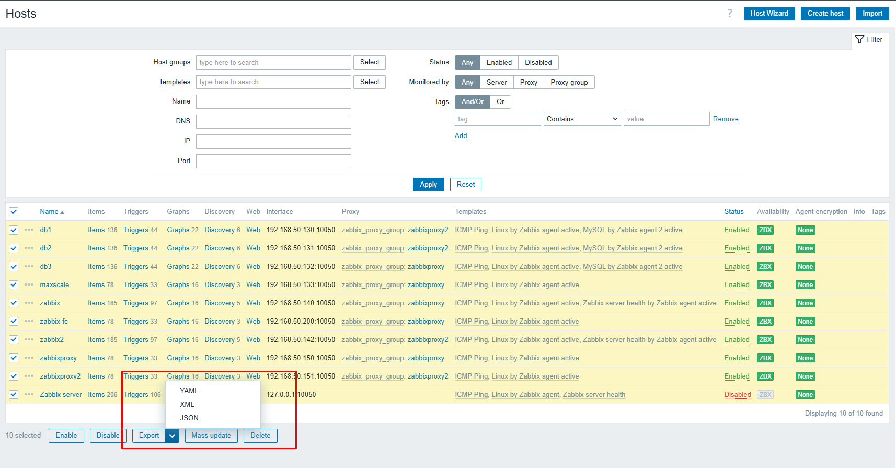
- Zabbix cung cấp chức năng xuất/nhập tích hợp.
- Các thành phần 
	- Hosts 
	- Templates 
	- Media types 
	- Maps 
	- Images 
	- Host groups (chỉ qua API) 
	- Template groups (chỉ qua API) 
- Định dạng: YAML, XML, JSON.
- Cách thực hiện:
	- Frontend backups: Truy cập các phần được hỗ trợ như Configuration | Templates chọn các thực thể và định dạng xuất.
	- API backups: Tất cả các đối tượng trên đều có sẵn thông qua Zabbix API, cho phép tự động hóa. Có thể quản lý và cập nhật cấu hình Zabbix hoàn toàn từ GIT nếu viết đúng script.
	- Nhập (Import): Có thể chọn các quy tắc khi nhập như "Update existing", "Create new", "Delete missing" cho các thành phần như Template groups, Host groups, Templates, Items, Discovery rules, Triggers, Graphs, v.v.. Đối với Templates, việc nhập thậm chí sẽ hiển thị cửa sổ bật lên "diff" chi tiết các thay đổi, xóa và bổ sung.
- Lưu ý:
	- Các thực thể của host và template (item, trigger, graph, discovery rule) được kế thừa từ các template đã liên kết 
	- Bất kỳ thay đổi nào được thực hiện cho các thực thể đó ở cấp host sẽ bị mất khi xuất; khi nhập, tất cả các thực thể từ các template đã liên kết được tạo lại như trên template liên kết gốc.

## 7. Bảo mật 
- Zabbix hỗ trợ mã hóa giao tiếp giữa các thành phần bằng giao thức **Transport Layer Security (TLS)*- phiên bản 1.2 và 1.3 (tùy thuộc vào thư viện mật mã). Zabbix hỗ trợ mã hóa dựa trên chứng chỉ (Certificate-based) và mã hóa dựa trên khóa chia sẻ trước (Pre-shared key - PSK).
- Mã hóa có thể được cấu hình cho các kết nối sau:
	- Giữa Zabbix server, Zabbix proxy, Zabbix agent, Zabbix web service, và các tiện ích `zabbix_sender` và `zabbix_get`.
	- Đến cơ sở dữ liệu Zabbix từ Zabbix frontend và server/proxy.
	- Giữa Zabbix frontend và Zabbix server.
- Mã hóa là tùy chọn và có thể cấu hình cho từng thành phần riêng lẻ.
	- Một số proxy và agent có thể được cấu hình để sử dụng mã hóa dựa trên chứng chỉ với server, trong khi những thành phần khác có thể sử dụng mã hóa dựa trên PSK, và một số khác tiếp tục với giao tiếp không mã hóa.
	- Server (proxy) có thể sử dụng các cấu hình mã hóa khác nhau cho các host khác nhau.
	- Các chương trình daemon của Zabbix sử dụng một cổng nghe cho cả kết nối đến đã mã hóa và chưa mã hóa. Việc thêm mã hóa không yêu cầu mở các cổng mới trên tường lửa.
- Hạn chế 
	- Khóa riêng được lưu trữ dưới dạng văn bản thuần túy trong các tệp có thể đọc được bởi các thành phần Zabbix trong quá trình khởi động.
	- Khóa chia sẻ trước (PSK) được nhập vào Zabbix frontend và lưu trữ trong cơ sở dữ liệu Zabbix dưới dạng văn bản thuần túy.
	- Mã hóa tích hợp không bảo vệ giao tiếp giữa máy chủ web chạy Zabbix frontend và trình duyệt web của người dùng.
	- Hiện tại, mỗi kết nối được mã hóa mở bằng một bắt tay TLS đầy đủ, không có bộ nhớ đệm phiên và vé phiên được triển khai.
	- Việc thêm mã hóa làm tăng thời gian kiểm tra item và hành động, tùy thuộc vào độ trễ mạng. Ví dụ, nếu độ trễ gói là 100ms, thì việc mở kết nối TCP và gửi yêu cầu không mã hóa mất khoảng 200ms. Với mã hóa, khoảng 1000ms được thêm vào để thiết lập kết nối TLS.
	- Thời gian chờ (Timeouts) có thể cần phải được tăng lên, nếu không, một số item và hành động chạy script từ xa trên agent có thể hoạt động với các kết nối không mã hóa, nhưng thất bại do thời gian chờ với các kết nối đã mã hóa.
	- Mã hóa không được hỗ trợ bởi tính năng khám phá mạng (network discovery). Các kiểm tra Zabbix agent được thực hiện bởi khám phá mạng sẽ không được mã hóa và nếu Zabbix agent được cấu hình để từ chối các kết nối không mã hóa thì các kiểm tra đó sẽ không thành công.
- Quản lý mã hóa kết nối: Các kết nối trong Zabbix có thể sử dụng:
	- Không mã hóa (mặc định)
	- Mã hóa dựa trên chứng chỉ RSA
	- Mã hóa dựa trên PSK
- Có hai tham số quan trọng được sử dụng để chỉ định mã hóa giữa các thành phần Zabbix:
- `TLSConnect`: Chỉ định loại mã hóa sẽ sử dụng cho các kết nối đi (unencrypted, PSK hoặc certificate).
	- `TLSConnect` được sử dụng trong các tệp cấu hình cho Zabbix proxy (ở chế độ active, chỉ định các kết nối đến server) và Zabbix agent (cho các kiểm tra active). Trong Zabbix frontend, tương đương với `TLSConnect` là trường **Connections to host*- trong **Data collection*- → **Hosts*- → `<some host>` → **Encryption tab*- và trường **Connections to proxy*- trong **Administration*- → **Proxies*- → `<some proxy>` → **Encryption tab**. Nếu loại mã hóa được cấu hình cho kết nối thất bại, không có loại mã hóa nào khác sẽ được thử. 
- `TLSAccept`: Chỉ định các loại kết nối được phép cho các kết nối đến (unencrypted, PSK hoặc certificate). Có thể chỉ định một hoặc nhiều giá trị.
	- `TLSAccept` được sử dụng trong các tệp cấu hình cho Zabbix proxy (ở chế độ passive, chỉ định các kết nối từ server) và Zabbix agent (cho các kiểm tra passive). Trong Zabbix frontend, tương đương với `TLSAccept` là trường **Connections from host*- trong **Data collection*- → **Hosts*- → `<some host>` → **Encryption tab*- và trường **Connections from proxy*- trong **Administration*- → **Proxies*- → `<some proxy>` → **Encryption tab**. 
- Thông thường, chỉ cấu hình một loại mã hóa cho các kết nối đến. Tuy nhiên, có thể muốn chuyển đổi loại mã hóa, ví dụ từ không mã hóa sang dựa trên chứng chỉ với thời gian ngừng hoạt động tối thiểu và khả năng quay lại. Để đạt được điều này: 
1. Đặt `TLSAccept=unencrypted,cert` trong tệp cấu hình agent và khởi động lại Zabbix agent. 
2. Kiểm tra kết nối với `zabbix_get` đến agent bằng chứng chỉ. Nếu hoạt động, có thể cấu hình lại mã hóa cho agent đó trong Zabbix frontend trong tab **Data collection*- → **Hosts*- → `<some host>` → **Encryption*- bằng cách đặt **Connections to host*- thành "Certificate". 
3. Khi bộ nhớ đệm cấu hình server được cập nhật (và cấu hình proxy được cập nhật nếu host được giám sát bởi proxy) thì các kết nối đến agent đó sẽ được mã hóa. 
4. Nếu mọi thứ hoạt động như mong đợi, có thể đặt `TLSAccept=cert` trong tệp cấu hình agent và khởi động lại Zabbix agent. Lúc này agent sẽ chỉ chấp nhận các kết nối được mã hóa dựa trên chứng chỉ. Các kết nối không mã hóa và dựa trên PSK sẽ bị từ chối. 
- Tương tự, nó hoạt động trên server và proxy. Nếu trong Zabbix frontend trong cấu hình host, **Connections from host*- được đặt thành "Certificate" thì chỉ các kết nối được mã hóa dựa trên chứng chỉ sẽ được chấp nhận từ agent (active checks) và `zabbix_sender` (trapper items). 
- Cấu hình mã hóa cho mỗi host được hiển thị trong Zabbix frontend, trong **Data collection*- → **Hosts*- trong cột **Agent encryption**. 

| Ví dụ | Connections to host | Allowed connections from host | Rejected connections from host |
| :---- | :------------------ | :---------------------------- | :----------------------------- |
| `none_none.png` | Unencrypted | Unencrypted | Encrypted, certificate and PSK-based encrypted |
| `cert_cert.png` | Encrypted, certificate-based | Encrypted, certificate-based | Unencrypted and PSK-based encrypted |
| `psk_psk.png` | Encrypted, PSK-based | Encrypted, PSK-based | Unencrypted and certificate-based encrypted |
| `psk_none_psk.png` | Encrypted, PSK-based | Unencrypted and PSK-based encrypted | Certificate-based encrypted |
| `cert_all.png` | Encrypted, certificate-based | Unencrypted, PSK or certificate-based encrypted | - |

### 7.1 Use Certificate 
- Zabbix có thể sử dụng chứng chỉ RSA ở định dạng PEM, được ký bởi một CA công khai hoặc nội bộ.
- Xác minh chứng chỉ được thực hiện dựa trên chứng chỉ CA đã được cấu hình trước. Tùy chọn, có thể sử dụng Danh sách thu hồi chứng chỉ (CRL).
- Mỗi thành phần Zabbix chỉ có thể cấu hình một chứng chỉ.
- Tham số cấu hình chứng chỉ: Các tham số cấu hình sau được hỗ trợ để thiết lập chứng chỉ trên các thành phần Zabbix:

| Tham số | Bắt buộc | Mô tả |
| :------ | :-------- | :------ |
| `TLSCAFile` | Yes | Đường dẫn đầy đủ của tệp chứa chứng chỉ CA cấp cao nhất cho việc xác minh chứng chỉ ngang hàng. Nếu sử dụng chuỗi chứng chỉ với nhiều thành phần, hãy sắp xếp các chứng chỉ CA cấp thấp hơn trước, sau đó là các chứng chỉ CA cấp cao hơn. Chứng chỉ từ nhiều CA có thể được bao gồm trong một tệp duy nhất. |
| `TLSCRLFile` | No | Đường dẫn đầy đủ của tệp chứa Danh sách thu hồi chứng chỉ (CRL). |
| `TLSCertFile` | Yes | Đường dẫn đầy đủ của tệp chứa chứng chỉ. Nếu sử dụng chuỗi chứng chỉ với nhiều thành phần, hãy sắp xếp chứng chỉ của server, proxy hoặc agent trước, sau đó là chứng chỉ CA cấp thấp hơn, và kết thúc bằng chứng chỉ CA cấp cao hơn. |
| `TLSKeyFile` | Yes | Đường dẫn đầy đủ của tệp chứa khóa riêng. Đảm bảo rằng tệp này chỉ có thể đọc được bởi người dùng Zabbix bằng cách đặt quyền truy cập thích hợp. |
| `TLSServerCertIssuer` | No | Tổ chức phát hành chứng chỉ server được phép. |
| `TLSServerCertSubject` | No | Chủ đề chứng chỉ server được phép. |

- Ví dụ cấu hình: Sau khi thiết lập các chứng chỉ cần thiết, cấu hình các thành phần Zabbix để sử dụng mã hóa dựa trên chứng chỉ.

**Zabbix server:**
1. Chuẩn bị tệp chứng chỉ CA (ví dụ: `/home/zabbix/zabbix_ca_file.crt`).
2. Đặt chứng chỉ/chuỗi chứng chỉ Zabbix server vào một tệp (ví dụ: `/home/zabbix/zabbix_server.crt`).
3. Đặt khóa riêng của Zabbix server vào một tệp (ví dụ: `/home/zabbix/zabbix_server.key`).
4. Chỉnh sửa các tham số cấu hình TLS trong tệp cấu hình Zabbix server (`TLSCAFile`, `TLSCertFile`, `TLSKeyFile`).

**Zabbix proxy:**
1. Chuẩn bị các tệp chứng chỉ CA cấp cao nhất, chứng chỉ/chuỗi chứng chỉ Zabbix proxy và khóa riêng như mô tả trong phần Zabbix server. Sau đó, chỉnh sửa các tham số `TLSCAFile`, `TLSCertFile` và `TLSKeyFile` trong tệp cấu hình Zabbix proxy.
2. Chỉnh sửa các tham số TLS bổ sung trong tệp cấu hình Zabbix proxy: 
    - Đối với proxy active: `TLSConnect=cert`.
    - Đối với proxy passive: `TLSAccept=cert`.
    - Có thể đặt `TLSServerCertIssuer` và `TLSServerCertSubject` để tăng cường bảo mật proxy.
3. Cấu hình mã hóa cho proxy này trong Zabbix frontend tại **Administration*- → **Proxies**, chọn proxy và nhấp vào tab **Encryption**.

**Zabbix agent:**
1. Chuẩn bị các tệp chứng chỉ CA cấp cao nhất, chứng chỉ/chuỗi chứng chỉ Zabbix agent và khóa riêng như mô tả trong phần Zabbix server. Sau đó, chỉnh sửa các tham số `TLSCAFile`, `TLSCertFile` và `TLSKeyFile` trong tệp cấu hình Zabbix agent.
2. Chỉnh sửa các tham số TLS bổ sung trong tệp cấu hình Zabbix agent: 
    - Đối với agent active: `TLSConnect=cert`.
    - Đối với agent passive: `TLSAccept=cert`.
    - Có thể đặt `TLSServerCertIssuer` và `TLSServerCertSubject` để tăng cường bảo mật agent.
3. Cấu hình mã hóa trong Zabbix frontend cho host được giám sát bởi agent này tại **Data collection*- → **Hosts**, chọn host và nhấp vào tab **Encryption**.

**Zabbix web service:**
1. Chuẩn bị các tệp chứng chỉ CA cấp cao nhất, chứng chỉ/chuỗi chứng chỉ Zabbix web service và khóa riêng như mô tả trong phần Zabbix server. Sau đó, chỉnh sửa các tham số `TLSCAFile`, `TLSCertFile` và `TLSKeyFile` trong tệp cấu hình Zabbix web service.
2. Chỉnh sửa tham số TLS bổ sung trong tệp cấu hình Zabbix web service: `TLSAccept=cert`.
3. Cấu hình Zabbix server để kết nối với Zabbix web service đã cấu hình TLS bằng cách chỉnh sửa tham số `WebServiceURL` trong tệp cấu hình Zabbix server (ví dụ: `WebServiceURL=https://example.com`).

### 7.2 Pre-shared keys - PSK
- Mỗi PSK trong Zabbix thực chất là một cặp gồm:
	- Chuỗi định danh PSK không bí mật (non-secret PSK identity string).
	- Giá trị chuỗi PSK bí mật (secret PSK string value).
- Chuỗi định danh PSK là một chuỗi UTF-8 không trống. Ví dụ: "PSK ID 001 Zabbix agentd". Đây là một tên duy nhất mà PSK cụ thể này được các thành phần Zabbix tham chiếu đến. Không đặt thông tin nhạy cảm vào chuỗi định danh PSK - nó được truyền qua mạng không mã hóa. 
- Giá trị PSK là một chuỗi khó đoán gồm các chữ số thập lục phân. Ví dụ: "e560cb0d918d26d31b4f642181f5f570ad89a390931102e5391d08327ba434e9". 
- Giới hạn kích thước: Có giới hạn kích thước cho PSK identity và value trong Zabbix, trong một số trường hợp thư viện mật mã có thể có giới hạn thấp hơn.

| Thành phần | Kích thước tối đa PSK identity | Kích thước tối thiểu PSK value | Kích thước tối đa PSK value |
| :--------- | :----------------------------- | :---------------------------- | :-------------------------- |
| Zabbix | 128 ký tự UTF-8 | 128-bit (PSK 16-byte, nhập dưới dạng 32 chữ số thập lục phân) | 2048-bit (PSK 256-byte, nhập dưới dạng 512 chữ số thập lục phân) |
| GnuTLS | 128 bytes (có thể bao gồm ký tự UTF-8) | - | 2048-bit (PSK 256-byte, nhập dưới dạng 512 chữ số thập lục phân) |
| OpenSSL 1.0.x, 1.1.0 | 127 bytes (có thể bao gồm ký tự UTF-8) | - | 2048-bit (PSK 256-byte, nhập dưới dạng 512 chữ số thập lục phân) |
| OpenSSL 1.1.1 | 127 bytes (có thể bao gồm ký tự UTF-8) | - | 512-bit (PSK 64-byte, nhập dưới dạng 128 chữ số thập lục phân) |
| OpenSSL 1.1.1a trở lên | 127 bytes (có thể bao gồm ký tự UTF-8) | - | 2048-bit (PSK 256-byte, nhập dưới dạng 512 chữ số thập lục phân) |

- Tạo PSK 
- Ví dụ, một PSK 256-bit (32 byte) có thể được tạo bằng các lệnh sau:
	- Với OpenSSL: `$ openssl rand -hex 32`.
	- Với GnuTLS: `$ psktool -u psk_identity -p database.psk -s 32`. Lưu ý rằng `psktool` tạo một tệp cơ sở dữ liệu với định danh PSK và PSK liên quan. Zabbix chỉ mong đợi một PSK trong tệp PSK, vì vậy chuỗi định danh và dấu hai chấm (':') nên được xóa khỏi tệp. 

- Cấu hình PSK cho giao tiếp server-agent (ví dụ) 
1. Trên host agent, ghi giá trị PSK vào một tệp (ví dụ: `/home/zabbix/zabbix_agentd.psk`). Tệp phải chứa PSK trong chuỗi văn bản đầu tiên. 
2. Đặt quyền truy cập vào tệp PSK - tệp phải chỉ đọc được bởi người dùng Zabbix. 
3. Chỉnh sửa các tham số TLS trong tệp cấu hình agent `zabbix_agentd.conf` (ví dụ: đặt `TLSConnect=psk`, `TLSAccept=psk`, `TLSPSKFile=/home/zabbix/zabbix_agentd.psk`, `TLSPSKIdentity=PSK 001`). 
4. Khởi động lại agent. 
5. Kiểm tra kết nối bằng `zabbix_get` (ví dụ: `zabbix_get -s 127.0.0.1 -k "system.cpu.load[all,avg1]" --tls-connect=psk --tls-psk-identity="PSK 001" --tls-psk-file=/home/zabbix/zabbix_agentd.psk`). 
6. Cấu hình mã hóa PSK cho agent này trong Zabbix frontend tại **Data collection*- → **Hosts**, chọn host và nhấp vào tab **Encryption**. 

- Cấu hình PSK cho giao tiếp server - active proxy (ví dụ) 
1. Trên proxy, ghi giá trị PSK vào một tệp (ví dụ: `/home/zabbix/zabbix_proxy.psk`). Tệp phải chứa PSK trong chuỗi văn bản đầu tiên. 
2. Đặt quyền truy cập vào tệp PSK - tệp phải chỉ đọc được bởi người dùng Zabbix. 
3. Chỉnh sửa các tham số TLS trong tệp cấu hình proxy `zabbix_proxy.conf` (ví dụ: đặt `TLSConnect=psk`, `TLSPSKFile=/home/zabbix/zabbix_proxy.psk`, `TLSPSKIdentity=PSK 002`). 
4. Cấu hình PSK cho proxy này trong Zabbix frontend. Truy cập **Administration*- → **Proxies**, chọn proxy, vào tab "Encryption". Trong "Connections from proxy", đánh dấu PSK. Dán "PSK 002" vào trường "PSK identity" và giá trị PSK vào trường "PSK". Nhấp vào "Update". 
5. Khởi động lại proxy.  
- Đối với một proxy passive, quy trình rất giống nhau. Sự khác biệt duy nhất là đặt `TLSAccept=psk` trong tệp cấu hình proxy và đặt "Connections to proxy" trong Zabbix frontend thành PSK. 

## 8. Tunning 
### 8.1 Tối Ưu Hóa MySQL/MariaDB cho Zabbix
- Hiệu suất của hệ thống giám sát Zabbix phụ thuộc đáng kể vào cấu hình cơ sở dữ liệu. MySQL và MariaDB, khi không được tinh chỉnh đúng cách, có thể trở thành điểm nghẽn nghiêm trọng, ảnh hưởng đến khả năng thu thập và xử lý dữ liệu của Zabbix. Tài liệu này trình bày các tham số cấu hình quan trọng và khuyến nghị để tối ưu hóa MySQL/MariaDB nhằm đạt được hiệu suất tối ưu cho môi trường Zabbix.
- Các Tham Số Cấu Hình Quan Trọng việc điều chỉnh các tham số cấu hình dưới đây là cần thiết để cải thiện hiệu suất của MySQL/MariaDB khi hoạt động với Zabbix.
#### 8.1.1 Kết Nối và Luồng (Connections and Threads)
- `max_connections`: Tham số này xác định số lượng kết nối đồng thời tối đa mà máy chủ MySQL/MariaDB có thể chấp nhận.
	- Mục đích: Ngăn chặn quá tải máy chủ do quá nhiều kết nối cùng lúc.
	- Khuyến nghị: Giá trị của `max_connections` cần lớn hơn tổng số tiến trình của Zabbix server cộng thêm một vùng đệm.
- `thread_cache_size`: Số lượng luồng mà MySQL có thể giữ trong bộ đệm để tái sử dụng cho các kết nối client.
	- Mục đích: Giảm chi phí tạo và hủy luồng cho mỗi kết nối mới.
	- Phạm vi: Tối thiểu: 0, Mặc định: 9, Tối đa: 100000.
- `max_allowed_packet`: Kích thước gói tin tối đa hoặc trường BLOB/TEXT có thể gửi hoặc nhận từ máy chủ.
	- Mục đích: Đảm bảo Zabbix có thể gửi và nhận các gói dữ liệu lớn mà không gặp lỗi.
	- Phạm vi: Tối thiểu: 1024, Mặc định: 16M, Tối đa: 1073741824 (1GB).
#### 8.1.2 Cấu Hình InnoDB (InnoDB Configuration)
- `innodb_buffer_pool_size`: Kích thước của vùng nhớ đệm (buffer pool) của InnoDB, nơi chứa dữ liệu và chỉ mục của các bảng InnoDB. Đây là tham số quan trọng nhất để cải thiện hiệu suất.
	- Mục đích: Giảm số lượng thao tác đọc/ghi đĩa bằng cách lưu trữ dữ liệu thường xuyên truy cập trong bộ nhớ.
	- Khuyến nghị: Nếu máy chủ cơ sở dữ liệu được dành riêng, nên đặt tham số này bằng khoảng $70%$ tổng dung lượng RAM của hệ thống.
	- Trong trường hợp hệ thống gặp lỗi do thiếu bộ nhớ sau khi điều chỉnh, cần giảm giá trị `innodb_buffer_pool_size` và khởi động lại máy chủ MySQL.
	- Phạm vi: Tối thiểu: 128M, Mặc định: 128M, Tối đa: Không giới hạn (giới hạn bởi bộ nhớ khả dụng).
- `innodb_log_file_size`: Kích thước của mỗi tệp nhật ký InnoDB.
	- Mục đích: Ảnh hưởng đến hiệu suất ghi và quá trình phục hồi. Giá trị lớn hơn có thể giảm số lần flush nhật ký nhưng cũng có thể kéo dài thời gian phục hồi.
	- Phạm vi: Tối thiểu: 5M, Mặc định: 48M, Tối đa: Không giới hạn (giới hạn bởi hệ thống tệp).
- `innodb_log_buffer_size`: Kích thước của bộ đệm dùng cho các mục nhật ký redo của InnoDB.
	- Mục đích: Bộ đệm lớn hơn giúp giảm số lần ghi nhật ký ra đĩa, cải thiện hiệu suất ghi.
	- Phạm vi: Tối thiểu: 1M, Mặc định: 16M, Tối đa: Không giới hạn (giới hạn bởi bộ nhớ khả dụng).
- `innodb_file_per_table`: Cho phép hoặc vô hiệu hóa việc sử dụng một tệp tablespace riêng cho mỗi bảng InnoDB.
	- Mục đích: Quản lý không gian đĩa tốt hơn và cho phép thu hồi không gian sau khi xóa bảng.
	- Phạm vi: Boolean (true/false).
- `innodb_buffer_pool_instances`: Số lượng thể hiện (instance) của buffer pool InnoDB được chia ra cho hiệu suất đa luồng.
	- Mục đích: Cải thiện khả năng mở rộng trên các hệ thống có nhiều lõi CPU bằng cách giảm contention trên các khóa của buffer pool.
	- Phạm vi: Tối thiểu: 1, Mặc định: 8, Tối đa: 64.
- `innodb_old_blocks_time`: Khoảng thời gian (tính bằng mili giây) mà một khối InnoDB vẫn nằm trong danh sách "old" trước khi được chuyển sang danh sách "new" trong cơ chế LRU của buffer pool.
	- Mục đích: Ngăn chặn việc các khối được quét một lần chiếm giữ không gian trong buffer pool quá lâu.
	- Phạm vi: Tối thiểu: 1000, Mặc định: 1000, Tối đa: Không giới hạn.
- `innodb_stats_on_metadata`: Cho phép hoặc vô hiệu hóa việc tự động thu thập thống kê InnoDB trong các câu lệnh siêu dữ liệu.
	- Mục đích: Ảnh hưởng đến hiệu suất của các truy vấn liên quan đến siêu dữ liệu bảng.
	- Phạm vi: Boolean (on/off).
- `innodb_flush_method`: Phương pháp được sử dụng để flush dữ liệu ra các tệp dữ liệu InnoDB.
	- Mục đích: Tối ưu hóa hiệu suất I/O.
	- Phạm vi: Tùy thuộc vào các phương pháp flush khả dụng trên hệ điều hành (ví dụ: `O_DIRECT`).
- `innodb_flush_log_at_trx_commit`: Kiểm soát cách InnoDB flush bộ đệm nhật ký ra tệp nhật ký sau mỗi commit giao dịch.
	- Mục đích: Ảnh hưởng đến độ bền dữ liệu và hiệu suất ghi.
	-  `0`: Log buffer được ghi và flush ra log file mỗi giây.
	-  `1`: Log buffer được ghi và flush ra log file sau mỗi commit giao dịch (mặc định, an toàn nhất).
	-  `2`: Log buffer được ghi ra log file sau mỗi commit, nhưng file log chỉ được flush ra đĩa mỗi giây.
	- Phạm vi: Tối thiểu: 0, Mặc định: 1, Tối đa: 2.
- `innodb_read_io_threads`: Số lượng luồng I/O nền của InnoDB cho các thao tác đọc.
	- Mục đích: Cải thiện hiệu suất đọc trên các hệ thống đa lõi.
	- Phạm vi: Tối thiểu: 1, Mặc định: 4, Tối đa: 64.
- `innodb_write_io_threads`: Số lượng luồng I/O nền của InnoDB cho các thao tác ghi.
	- Mục đích: Cải thiện hiệu suất ghi trên các hệ thống đa lõi.
	- Phạm vi: Tối thiểu: 1, Mặc định: 4, Tối đa: 64.
- `innodb_io_capacity`: Số lượng hoạt động I/O mỗi giây mà luồng I/O nền của InnoDB có thể thực hiện.
	- Mục đích: Thông báo cho InnoDB về khả năng I/O của thiết bị lưu trữ, giúp tối ưu hóa việc flushing dữ liệu.
	- Phạm vi: Tối thiểu: 100, Mặc định: 200, Tối đa: $2^{64}-1$.
- `innodb_io_capacity_max`: Số lượng hoạt động I/O tối đa mỗi giây mà luồng I/O nền của InnoDB có thể thực hiện.
	- Mục đích: Đặt giới hạn trên cho khả năng I/O của InnoDB.
	- Phạm vi: Tối thiểu: 2000, Mặc định: 2000, Tối đa: $2^{64}-1$.
#### 8.1.3 Hiệu Suất và Tối Ưu Hóa (Performance and Optimization)
- `skip_name_resolve`: Vô hiệu hóa việc phân giải tên DNS trong quá trình kết nối client.
	- Mục đích: Cải thiện hiệu suất khi sử dụng địa chỉ IP cho các kết nối.
	- Phạm vi: Boolean (true/false).
- `skip-performance-schema`: Vô hiệu hóa Performance Schema.
	- Mục đích: Giảm tài nguyên tiêu thụ nếu không cần thu thập thống kê hiệu suất chi tiết.
	- Phạm vi: Boolean (true/false).
- `optimizer_switch`: Cho phép hoặc vô hiệu hóa các công tắc tối ưu hóa truy vấn cụ thể.
	- Mục đích: Kiểm soát hành vi của bộ tối ưu hóa truy vấn.
	- Lưu ý: Cần hiểu rõ tác động của từng công tắc trước khi thay đổi.
- `tmp-table-size`: Đặt kích thước tối đa của các bảng tạm thời trong bộ nhớ cho mỗi phiên.
	- Mục đích: Tránh việc ghi các bảng tạm thời lớn ra đĩa, giúp cải thiện hiệu suất của các truy vấn phức tạp.
	- Phạm vi: Tối thiểu: 0, Mặc định: 16M, Tối đa: Không giới hạn (bộ nhớ khả dụng).
- `max-heap-table-size`: Đặt kích thước tối đa của bảng engine lưu trữ MEMORY (HEAP) cho mỗi phiên.
	- Mục đích: Tương tự `tmp-table-size`, nhưng áp dụng cho bảng MEMORY.
	- Phạm vi: Tối thiểu: 0, Mặc định: 16M, Tối đa: Không giới hạn (bộ nhớ khả dụng).
- `key_buffer_size`: Đặt kích thước của bộ đệm khóa được sử dụng cho các khối chỉ mục của bảng MyISAM.
	- Mục đích: Tăng tốc độ truy cập chỉ mục cho bảng MyISAM (ít quan trọng hơn với InnoDB).
	- Phạm vi: Tối thiểu: 8M, Mặc định: 128M, Tối đa: Không giới hạn (bộ nhớ khả dụng).
#### 8.1.4 Thời Gian Chờ (Timeouts)
- `connect_timeout`: Số giây máy chủ chờ client thiết lập kết nối trước khi ngắt.
	- Mục đích: Ngăn chặn các kết nối chờ đợi quá lâu.
	- Phạm vi: Tối thiểu: 2, Mặc định: 10, Tối đa: 31536000 (1 năm).
- `wait_timeout`: Số giây máy chủ chờ hoạt động trên một kết nối tương tác trước khi đóng.
	- Mục đích: Giải phóng tài nguyên từ các kết nối không hoạt động.
	- Phạm vi: Tối thiểu: 2, Mặc định: 28800, Tối đa: 31536000 (1 năm).
#### 8.1.5 Bộ Đệm và Giới Hạn (Caches and Limits)
- `table_open_cache_instances`: Số lượng thể hiện của bộ đệm bảng được chia ra cho hiệu suất đa luồng.
	- Mục đích: Cải thiện khả năng mở rộng khi có nhiều luồng truy cập các bảng khác nhau.
	- Phạm vi: Tối thiểu: 1, Mặc định: 1, Tối đa: 64.
- `table_open_cache`: Tổng số bảng đang mở cho tất cả các luồng.
	- Mục đích: Giảm chi phí mở và đóng bảng bằng cách giữ các bảng thường xuyên truy cập trong bộ đệm.
	- Phạm vi: Tối thiểu: 1, Mặc định: 4000, Tối đa: 524288.
- `open_files_limit`: Giới hạn số lượng tệp tối đa mà MySQL có thể giữ mở.
	- Mục đích: Đảm bảo MySQL có đủ handle tệp cho tất cả các bảng và tệp nhật ký.
	- Phạm vi: Tối thiểu: 1024, Mặc định: 65535, Tối đa: Không giới hạn.
- `max_connect_errors`: Giới hạn số lần thử kết nối bị gián đoạn mà một host có thể thực hiện đến máy chủ.
	- Mục đích: Bảo vệ máy chủ khỏi các cuộc tấn công brute-force hoặc client cấu hình sai.
	- Phạm vi: Tối thiểu: 1, Mặc định: 100, Tối đa: 18446744073709551615 (không giới hạn).
- Việc tinh chỉnh MySQL/MariaDB là một bước quan trọng để đảm bảo Zabbix hoạt động hiệu quả và ổn định. Tập trung vào các tham số như `innodb_buffer_pool_size` và `max_connections` sẽ mang lại cải thiện đáng kể về hiệu suất. Luôn theo dõi tài nguyên hệ thống sau khi thực hiện thay đổi để đảm bảo các điều chỉnh không gây ra các vấn đề về bộ nhớ hoặc CPU.

### 8.2 Proxy Zabbix
- Proxy Zabbix đóng vai trò quan trọng trong việc thu thập dữ liệu từ các môi trường phân tán. Việc điều chỉnh proxy giúp tối ưu hóa luồng dữ liệu và giảm tải cho Zabbix server.
- Các Chế Độ ProxyBufferMode: Zabbix 7.0 cung cấp ba tùy chọn ProxyBufferMode khác nhau để quản lý bộ đệm proxy, mỗi chế độ có ưu và nhược điểm riêng:
	- disk: Trong chế độ này, tất cả dữ liệu được lưu trữ trong cơ sở dữ liệu. Đây là cài đặt mặc định cho các môi trường cũ sau khi nâng cấp Zabbix. Chế độ này đảm bảo an toàn dữ liệu nhưng có thể chậm hơn do phụ thuộc vào hiệu suất I/O của đĩa.
	- memory: Ở chế độ này, tất cả dữ liệu được lưu trữ trong bộ nhớ (RAM). Chế độ này cung cấp hiệu suất cao nhất nhưng không có khả năng bảo vệ chống mất dữ liệu nếu proxy gặp sự cố.
	- hybrid: Đây là chế độ được khuyến nghị và là cài đặt mặc định cho các cài đặt mới của Zabbix 7.0. Chế độ hybrid sử dụng bộ nhớ trong hầu hết các trường hợp để đạt được hiệu suất cao, nhưng cũng cung cấp khả năng bảo vệ chống mất dữ liệu bằng cách sử dụng cơ sở dữ liệu như một cơ chế dự phòng. Việc lựa chọn giữa các chế độ này liên quan đến sự đánh đổi rõ ràng giữa hiệu suất (memory) và độ bền dữ liệu (disk/hybrid). Mặc dù hybrid được khuyến nghị cho các cài đặt mới, việc hiểu các chế độ disk (mặc định cho các bản nâng cấp cũ) và memory giúp chẩn đoán các vấn đề trong môi trường đã nâng cấp hoặc các trường hợp sử dụng cụ thể khi việc mất dữ liệu là chấp nhận được để đạt tốc độ tối đa.

| **Chế độ** | **Lưu trữ dữ liệu**           | **Bảo vệ chống mất dữ liệu** | **Mặc định cho**               | **Ghi chú**                                               |
| ---------- | ----------------------------- | ---------------------------- | ------------------------------ | --------------------------------------------------------- |
| **Disk**   | Cơ sở dữ liệu (DB)            | Có                           | Môi trường cũ sau khi nâng cấp | Chậm hơn do ghi DB, nhưng **an toàn dữ liệu**.            |
| **Memory** | Bộ nhớ (RAM)                  | Không                        | Không                          | Nhanh nhất, nhưng **dễ mất dữ liệu khi proxy lỗi**.       |
| **Hybrid** | Bộ nhớ (chủ yếu), DB dự phòng | Có (sử dụng DB)              | Cài đặt mới                    | **Khuyến nghị**: Cân bằng giữa tốc độ và an toàn dữ liệu. |

```
### Option: ProxyBufferMode
# Specifies history, discovery and auto registration data storage
mechanism:
# disk - data are stored in database and uploaded from database
# memory - data are stored in memory and uploaded from memory.
# hybrid - the proxy buffer normally works like in memory mode until it
# runs out of memory or the oldest record exceeds the configured
age
# Default:
# ProxyBufferMode=disk
ProxyBufferMode=hybrid
```
#### 8.2.1 Disk Mode
- Khi Zabbix Proxy thu thập dữ liệu từ các thiết bị được giám sát, quy trình diễn ra như sau:
	- Thu thập dữ liệu: Proxy nhận giá trị từ các Zabbix Agent, SNMP devices, hoặc các nguồn dữ liệu khác.
	- Ghi vào cơ sở dữ liệu: Ngay lập tức, proxy sẽ kết nối với cơ sở dữ liệu cục bộ (MySQL, PostgreSQL, hoặc SQLite) và ghi các giá trị này vào các bảng liên quan.
	- Đọc từ cơ sở dữ liệu: Định kỳ, proxy sẽ đọc lại dữ liệu từ cơ sở dữ liệu cục bộ để chuẩn bị gửi về Zabbix Server.
	- Truyền tải đến Server: Dữ liệu sau đó được gửi từ proxy đến Zabbix Server.
- 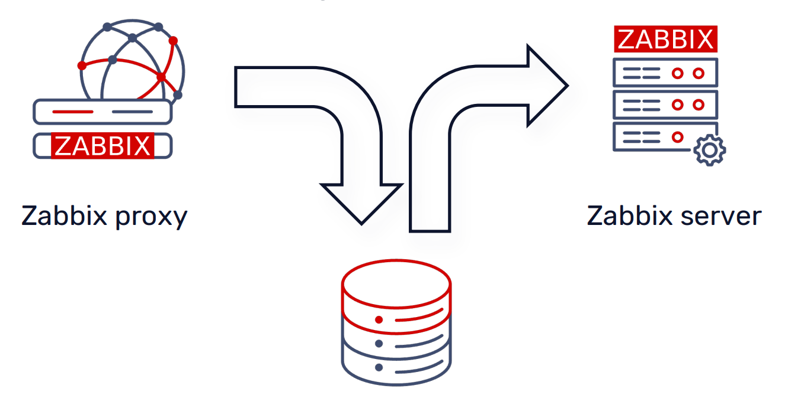
- Điểm Nghẽn Tiềm Năng DiskMode
	- Việc mỗi giá trị dữ liệu phải trải qua một chu trình ghi/đọc cơ sở dữ liệu cục bộ có thể tạo ra một điểm nghẽn hiệu suất đáng kể, đặc biệt trên các Zabbix Proxy lớn hoặc trong các môi trường có lượng dữ liệu giám sát rất cao.
	- Các vấn đề chính bao gồm:
		- Tải I/O cao: Mỗi thao tác ghi dữ liệu nhỏ vào cơ sở dữ liệu đều tạo ra hoạt động I/O trên đĩa. Với hàng ngàn item/giây, tổng số hoạt động I/O có thể trở nên khổng lồ, làm quá tải hệ thống lưu trữ của proxy.
		- Độ trễ: Thời gian cần thiết để ghi và đọc dữ liệu từ đĩa có thể làm tăng độ trễ trong quá trình xử lý dữ liệu của proxy, ảnh hưởng đến thời gian hiển thị dữ liệu trên Zabbix Server.
		- Yêu cầu tài nguyên cơ sở dữ liệu: Proxy cần một cơ sở dữ liệu hoạt động hiệu quả, điều này đòi hỏi tài nguyên CPU, RAM và I/O, cũng như việc tinh chỉnh cơ sở dữ liệu đúng cách, tương tự như Zabbix Server.
		- Hạn chế khả năng mở rộng: Khi quy mô giám sát tăng lên, hiệu suất của proxy trong "Disk Mode" có thể không đáp ứng kịp, dẫn đến tình trạng hàng đợi (queue) dữ liệu tăng cao và mất dữ liệu tiềm ẩn.
#### 8.2.2 Memory Mode 
- Một tùy chọn được thiết kế để mang lại hiệu suất truyền dữ liệu cao nhất bằng cách ưu tiên sử dụng bộ nhớ RAM thay vì truy cập đĩa. 
- Tuy nhiên, hiệu suất này đi kèm với một sự đánh đổi đáng kể về độ bền dữ liệu.
- Cơ Chế Hoạt Động của "Memory Mode"
	- Khi Zabbix Proxy hoạt động ở "Memory Mode":
	- Dữ liệu được lưu trực tiếp vào bộ nhớ chia sẻ: Các giá trị lịch sử (history data) và các loại dữ liệu thu thập khác sẽ được lưu trữ ngay lập tức vào một vùng bộ nhớ RAM chuyên dụng (shared memory) của proxy.
	- Truyền trực tiếp đến Zabbix Server: Dữ liệu sau đó sẽ được đọc và tải lên Zabbix Server trực tiếp từ bộ nhớ này. Quá trình này hoàn toàn bỏ qua việc ghi dữ liệu vào cơ sở dữ liệu cục bộ trên đĩa của proxy.
- 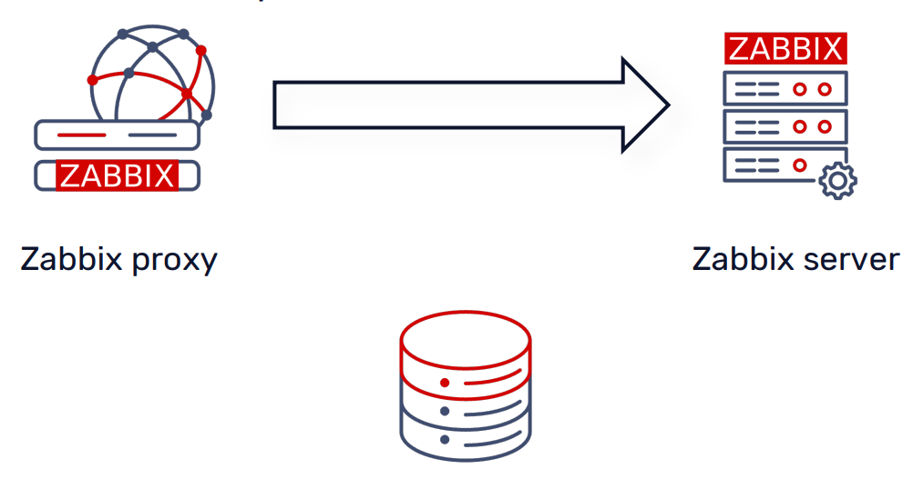	
- Ưu Điểm Chính: Hiệu Suất Tối Đa
	- Giảm tải I/O đáng kể: Vì dữ liệu không bao giờ được ghi vào đĩa cục bộ, Zabbix Proxy sẽ không tạo ra bất kỳ thao tác ghi I/O nào lên cơ sở dữ liệu của nó cho các dữ liệu lịch sử. Điều này loại bỏ hoàn toàn điểm nghẽn hiệu suất do I/O đĩa gây ra.
	- Thông lượng dữ liệu cao hơn: Proxy có thể xử lý và truyền tải dữ liệu với tốc độ nhanh nhất có thể, tận dụng tối đa băng thông bộ nhớ và mạng.
	- Giảm yêu cầu tài nguyên cơ sở dữ liệu: Proxy không cần một cơ sở dữ liệu cục bộ hiệu suất cao để xử lý dữ liệu lịch sử, giảm chi phí vận hành và quản lý.
- Nhược Điểm Quan Trọng: Nguy Cơ Mất Dữ Liệu
	- Mặc dù "Memory Mode" mang lại hiệu suất vượt trội, nhược điểm chính của nó là không có cơ chế bảo vệ dữ liệu khỏi mất mát:
	- Mất dữ liệu khi proxy dừng hoặc khởi động lại: Nếu Zabbix Proxy bị dừng đột ngột (do lỗi, tắt máy không đúng cách, hoặc khởi động lại), toàn bộ dữ liệu chưa được gửi đến Zabbix Server đang nằm trong bộ đệm RAM sẽ bị mất vĩnh viễn.
	- Mất dữ liệu khi bộ đệm đầy: Nếu lượng dữ liệu thu thập vượt quá kích thước được cấu hình cho ProxyMemoryBufferSize, dữ liệu cũ nhất trong bộ đệm sẽ bị loại bỏ (discarded) để nhường chỗ cho dữ liệu mới. Điều này có thể xảy ra trong các đợt cao điểm hoặc khi ProxyMemoryBufferSize không được cấu hình đủ lớn.

#### 8.2.2 Hybrid Mode 	
- Giải pháp tối ưu, kết hợp lợi ích hiệu suất của bộ đệm bộ nhớ với cơ chế bảo vệ dữ liệu, giúp giảm thiểu rủi ro mất mát dữ liệu. Đây là chế độ khuyến nghị cho hầu hết các triển khai Zabbix.
- Cơ Chế Hoạt Động của Chế Độ "Hybrid": Chế độ "hybrid" được thiết kế để hoạt động chủ yếu như "Memory Mode" nhưng với một lớp bảo vệ dữ liệu bổ sung:
	- Hoạt động như "Memory Mode" trong điều kiện bình thường:
		- Giống như "Memory Mode", dữ liệu mới (giá trị item, dữ liệu phát hiện, v.v.) được lưu trữ trực tiếp vào bộ đệm bộ nhớ chia sẻ (shared memory) của proxy.
		- Dữ liệu sau đó được tải lên Zabbix Server trực tiếp từ bộ nhớ này, bỏ qua việc ghi dữ liệu vào cơ sở dữ liệu cục bộ trên đĩa trong quá trình hoạt động bình thường. Điều này mang lại hiệu suất cao và giảm tải I/O đáng kể.
	- Cơ chế "flush" dữ liệu vào cơ sở dữ liệu để bảo vệ:
		- Điểm khác biệt và cũng là ưu điểm chính của chế độ "hybrid" là khả năng tự động ghi (flush) dữ liệu từ bộ đệm bộ nhớ vào cơ sở dữ liệu cục bộ của proxy trong các tình huống quan trọng, nhằm ngăn chặn mất mát dữ liệu:
			- Khi bộ đệm không đủ không gian: Nếu bộ đệm bộ nhớ đầy (tức là lượng dữ liệu mới vượt quá ProxyMemoryBufferSize trước khi chúng có thể được gửi đi), Zabbix Proxy sẽ flush dữ liệu cũ nhất vào cơ sở dữ liệu. Điều này giúp giải phóng không gian trong bộ đệm mà không làm mất dữ liệu.
			- Khi proxy bị dừng: Trước khi Zabbix Proxy tắt (được dừng một cách an toàn), tất cả dữ liệu còn lại trong bộ đệm bộ nhớ sẽ được flush vào cơ sở dữ liệu cục bộ. Điều này đảm bảo rằng không có dữ liệu nào bị mất khi proxy khởi động lại.
			- Khi dữ liệu quá cũ: Nếu dữ liệu trong bộ đệm vượt quá tuổi tối đa được cấu hình bởi ProxyMemoryBufferAge, chúng cũng sẽ được flush vào cơ sở dữ liệu.
	- Quay trở lại bộ đệm bộ nhớ: Sau khi dữ liệu đã được flush thành công vào cơ sở dữ liệu, proxy sẽ tự động quay trở lại hoạt động sử dụng bộ đệm bộ nhớ cho dữ liệu mới.
- 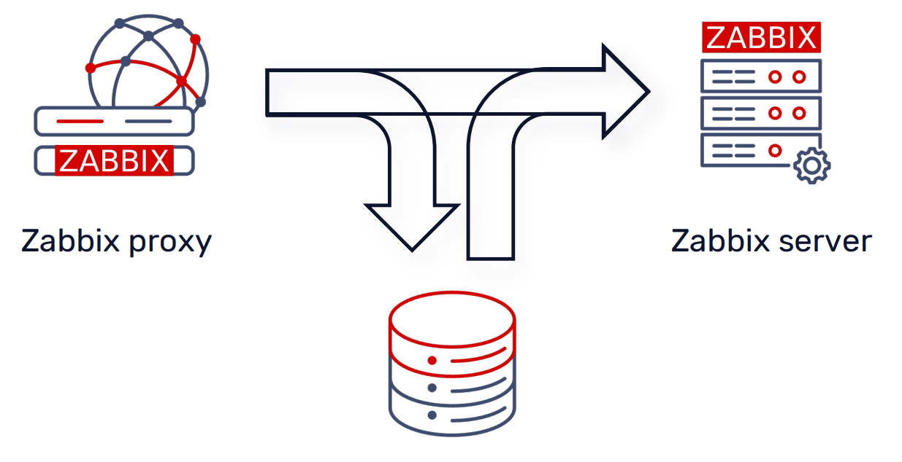	
- Lợi ích Chính của Chế Độ "Hybrid"
	- Hiệu suất tối ưu: Tận dụng tốc độ của RAM để xử lý và truyền tải dữ liệu, giảm đáng kể gánh nặng I/O lên cơ sở dữ liệu cục bộ của proxy.
	- Giảm thiểu rủi ro mất dữ liệu: Cung cấp một lớp bảo vệ quan trọng bằng cách tự động flush dữ liệu vào đĩa trong các trường hợp cần thiết, đặc biệt là khi bộ đệm đầy hoặc proxy tắt.
	- Cân bằng tối ưu: Đạt được sự cân bằng lý tưởng giữa hiệu suất cao và độ tin cậy dữ liệu, làm cho nó trở thành lựa chọn phù hợp nhất cho hầu hết các môi trường giám sát Zabbix.	

## 9. High Availability
### 9.1 Proxy Group
#### 9.1.1. Tổng quan về Proxy Load Balancing
- Proxy load balancing cho phép giám sát host bằng một nhóm proxy, với khả năng tự động phân phối host giữa các proxy và đảm bảo tính sẵn sàng cao của proxy.
- Nếu một proxy trong nhóm proxy ngừng hoạt động (offline), các host mà nó đang giám sát sẽ được phân phối ngay lập tức cho các proxy khác trong nhóm có ít host được gán nhất. Hoặc, nếu một proxy có quá nhiều/quá ít host so với mức trung bình của nhóm,một quá trình cân bằng lại nhóm sẽ được kích hoạt để phân phối host một cách đồng đều.
- Việc phân phối lại host chỉ xảy ra trong các nhóm proxy trực tuyến (online). Một nhóm proxy được coi là "online" nếu số lượng proxy online tối thiểu đã cấu hình của nó đang hoạt động (không offline hoặc không rõ trạng thái).
- Số lượng proxy online tối thiểu phải nhỏ hơn tổng số proxy trong nhóm. Ví dụ, trong một nhóm có 10 proxy, việc đặt số lượng proxy online tối thiểu là 10 sẽ tạo ra tình huống mà toàn bộ nhóm sẽ ngừng hoạt động nếu chỉ một proxy bị lỗi. Tốt hơn là nên yêu cầu 6 proxy online. Điều này sẽ hỗ trợ 4 proxy không hoạt động.
- Các trạng thái của proxy là:
	- online: Nếu có giao tiếp với nó trong khoảng thời gian failover delay (proxy thụ động đã phản hồi yêu cầu của server và proxy chủ động đã gửi yêu cầu đến server).
	- offline: Nếu không có giao tiếp với nó trong khoảng thời gian failover delay.
	- unknown: Sau khi tạo proxy hoặc khởi động server.
- Giám sát trạng thái nhóm proxy bằng các internal item `zabbix[proxy group,<name>,state] và zabbix[proxy group,discovery]`
- Chỉ Zabbix agent phiên bản 7.0 trở lên mới được hỗ trợ để làm việc với các nhóm proxy ở chế độ active. Các proxy Zabbix phiên bản trước 7.0 và các host được giám sát bởi các proxy này sẽ bị loại trừ khỏi các hoạt động cân bằng lại cho đến khi chúng được nâng cấp.
- Reassign Host 
	- Zabbix server kiểm tra sự cân bằng trong việc gán host cho các proxy. Nhóm được coi là "mất cân bằng" nếu có:
		- host excess: một proxy có nhiều host hơn mức trung bình của nhóm.
		- host deficit: một proxy có ít host hơn mức trung bình của nhóm.
	- Nhóm được coi là "mất cân bằng" nếu số lượng host được gán cho proxy vượt quá/thấp hơn mức trung bình của nhóm ít nhất 10 host và gấp 2 lần (factor of 2). Trong trường hợp này, nhóm được đánh dấu bởi server để gán lại host sau một khoảng thời gian chờ (10 x `failover delay`), nếu sự cân bằng không được khôi phục.
	- Bảng sau minh họa bằng các ví dụ khi việc gán lại host được (hoặc không) kích hoạt:

	| Số lượng host trên proxy | Trung bình nhóm | Gán lại host |
	| :---------------------- | :-------------- | :----------- |
	| 100                     | 50              | Có           |
	| 60                      | 50              | Không         |
	| 40                      | 50              | Không         |
	| 25                      | 50              | Có           |
	| 15                      | 5               | Có           |
	| 10                      | 5               | Không         |

- Proxy group manager sẽ phân phối lại host trong các nhóm proxy theo cách sau:
	- Tính toán số lượng host trung bình trên mỗi proxy.
	- Đối với các proxy có host excess: di chuyển các host dư thừa sang các host chưa được gán.
	- Đối với các proxy có host deficit: tính toán số lượng host cần thiết để cân bằng các proxy.
	- Loại bỏ số lượng host bị thiếu từ các proxy có nhiều host nhất.
	- Phân phối các host chưa được gán giữa các proxy có ít host nhất.

#### 9.1.2. Cấu hình một nhóm Proxy
- Để cấu hình một nhóm proxy trong giao diện người dùng Zabbix:
	- Đi tới: Administration → Proxy groups
	- Nhấp vào Create proxy group
- 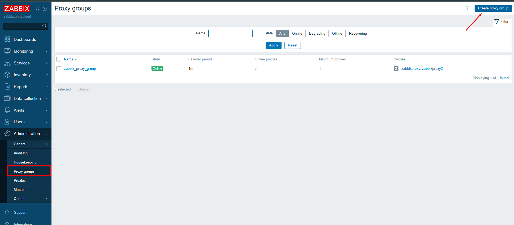	
- Các trường cấu hình 
- 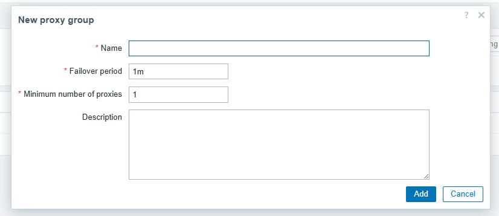	

| Tham số                 | Mô tả                                                                                                                                                                                                                                                                                                                                                                                                                                                                                  |
| :---------------------- | :------------------------------------------------------------------------------------------------------------------------------------------------------------------------------------------------------------------------------------------------------------------------------------------------------------------------------------------------------------------------------------------------------------------------------------------------------------------------------------- |
| Name | Nhập tên nhóm proxy.                                                                                                                                                                                                                                                                                                                                                                                                                                                                 |
| Failover period | Nhập khoảng thời gian tính bằng giây trước khi failover được thực hiện (mặc định 1m; phạm vi cho phép 10s-15m). Hỗ trợ các hậu tố thời gian (ví dụ: 30s, 1m). Hỗ trợ user macros.                                                                                                                                                                                                                                                                                            |
| Minimum number of proxies | Nhập số lượng proxy online tối thiểu cần thiết để nhóm online (mặc định 1; phạm vi cho phép 1-1000). Hỗ trợ user macros.                                                                                                                                                                                                                                                                                                                                                           |
| Description | Nhập mô tả nhóm proxy.                                                                                                                                                                                                                                                                                                                                                                                                                                                               |
| Proxies | Danh sách các proxy trong nhóm. Có thể hiển thị tối đa năm proxy (dưới dạng liên kết hoặc văn bản thuần túy, tùy thuộc vào quyền đối với proxy). Danh sách này được hiển thị khi chỉnh sửa một nhóm proxy hiện có, nếu có ít nhất một proxy trong nhóm.                                                                                                                                                                                                                          |

 
### 9.2 Zabbix Server High Availability 
#### 9.2.1 Tổng quan
- Zabbix cung cấp một giải pháp HA tích hợp cho thành phần máy chủ của mình, đảm bảo việc giám sát liên tục ngay cả khi máy chủ gặp sự cố. Chức năng HA tích hợp này không yêu cầu phần mềm clustering bên ngoài.
- Các khía cạnh chính của Zabbix Server HA bao gồm:
	- Cụm Active-Standby: Zabbix HA hoạt động với nhiều node Zabbix server trong một cụm. Trong đó, một node sẽ ở trạng thái active (hoạt động) và chịu trách nhiệm chính về thu thập dữ liệu, phát hiện sự cố và ghi vào cơ sở dữ liệu. Các node còn lại sẽ ở chế độ standby (dự phòng), liên tục theo dõi trạng thái của node active.
	- Tự động chuyển đổi dự phòng (Automatic Failover): Nếu node active gặp sự cố, một trong các node standby sẽ tự động tiếp quản vai trò active, giúp giảm thiểu thời gian ngừng hoạt động của hệ thống giám sát.
	- Cơ chế Heartbeat: Tất cả các node Zabbix server trong cụm HA đều kết nối với cùng một cơ sở dữ liệu và gửi các tín hiệu heartbeat (nhịp tim) để thông báo trạng thái của chúng. Cơ chế này cho phép các node standby phát hiện khi node active không còn khả dụng, từ đó kích hoạt quá trình chuyển đổi dự phòng.
- Trạng thái Node HA của Zabbix:Zabbix định nghĩa bốn trạng thái cho một node HA 
	- Active (3):Chỉ một node có thể ở trạng thái active tại một thời điểm.
	- Standby (0):Nhiều node có thể ở chế độ dự phòng.
	- Stopped (1):Một node đã được phát hiện trước đó nhưng hiện đã tắt.
	- Unavailable (2):Một node đã được phát hiện trước đó nhưng bị mất kết nối mà không tắt máy.
- Ưu điểm:
	- Dễ cài đặt:Thiết lập đơn giản theo tài liệu của Zabbix.
	- Không yêu cầu kiến thức chuyên sâu về HA:Bạn không cần phải là chuyên gia về kiến trúc HA.
	- Được Zabbix chính thức hỗ trợ:Đây là giải pháp được Zabbix xác nhận và hỗ trợ đầy đủ.
	- Sử dụng cơ sở dữ liệu Zabbix để kiểm tra trạng thái node:Trạng thái của các máy chủ được kiểm tra thông qua cơ sở dữ liệu.
- Nhược điểm:
	- Chỉ hỗ trợ chế độ "Active – Passive":Chỉ có một máy chủ hoạt động (active) tại một thời điểm, các máy chủ khác ở chế độ dự phòng (passive).
	- Chức năng cốt lõi:
		- Tất cả các máy chủ Zabbix đều kết nối với cơ sở dữ liệu để gửi tín hiệu nhịp tim (heartbeat).
		- Node Active:Chỉ node active mới thu thập giá trị, phát hiện sự cố và ghi dữ liệu vào cơ sở dữ liệu.
		- Node Standby:Các node dự phòng liên tục theo dõi trạng thái của node active.
- Kết nối của Frontend Server Node
	- Cơ sở dữ liệu:Tất cả các node frontend server đều kết nối với cùng một máy chủ cơ sở dữ liệu.
	- Máy chủ Zabbix:Các node frontend chỉ kết nối với node Zabbix server đang hoạt động (active).
#### 9.2.2 Cấu hình thiết lập Zabbix Server HA
- Các trường cấu hình trên Zabbix Server trong file `/etc/zabbix/zabbix_server.conf`
	- `HANodeName`:
		- Chỉ định tên của node HA.
		- Phải là duy nhấtcho mỗi node.
		- Nếu không được chỉ định, Zabbix server sẽ khởi động ở chế độ độc lập (standalone).
		- Ví dụ: `HANodeName=zbxha01`
	- `NodeAddress`:
		- Phải khớp với địa chỉ IP hoặc FQDN (Tên miền đủ điều kiện) của node Zabbix server.
		- Tham số này được Zabbix frontend sử dụng để kết nối với node active.
		- Nếu không có tham số này, frontend sẽ không thể hiển thị trạng thái, hàng đợi, v.v.
		- Ví dụ: `NodeAddress=10.1.1.31`
- Cấu hình Frontend (Tự động phát hiện node active):
	- Các cài đặt `$ZBX_SERVER` và `$ZBX_SERVER_PORT` trong cấu hình frontend nên được để trốngđể bật tính năng tự động phát hiện.
	- File `/etc/zabbix/web/zabbix.conf.php`
	```
	// Uncomment and set to desired values to override Zabbix hostname/IP and port.
	// $ZBX_SERVER = '';
	// $ZBX_SERVER_PORT = '';
	```
#### 9.2.3 Quản lý Node HA
- Thêm Node mới:
	- Cấu hình `/etc/zabbix/zabbix_server.conf` với `HANodeName` và `NodeAddress`.
	- Khởi động tiến trình `zabbix_server` trên node mới.
- Xóa Node (Lệnh Runtime - chỉ chạy trên node active):
	- Ví dụ: `root@zbxha01:~# zabbix_server -R ha_remove_node=zbxha02`
- Trạng thái HA (Lệnh Runtime - chỉ chạy trên node active):
	- Ví dụ: `root@zbxha01:~# zabbix_server -R ha_status`
	- Hiển thị độ trễ chuyển đổi dự phòng (failover delay) và trạng thái cụm, bao gồm ID node, tên, địa chỉ và trạng thái hiện tại.
- 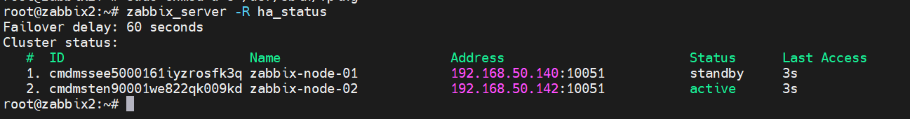	

#### 9.2.3 Các tiến trình HA và Chuyển đổi dự phòng (Failover)
- Tiến trình `ha_manager`:Có mặt trên cả node active và standby, chịu trách nhiệm quản lý HA.
- Chuyển đổi dự phòng tự động: Zabbix HA hỗ trợ chuyển đổi dự phòng tự động
- Việc khởi động lại Zabbix server trên node active sẽ kích hoạt chuyển đổi dự phòng tự động sang một node khác.
	- Tất cả các node báo cáo trạng thái và kiểm tra trạng thái của node active cứ sau 5 giây.
	- Nếu node active tắt một cách bình thường, trạng thái của nó sẽ chuyển thành "stopped" (1).
	- Node standby nào phát hiện node bị dừng hoặc mất đầu tiên sẽ tiếp quản.
	- Mất Node Active:Nếu node active bị mất (ví dụ: bị treo) và không cập nhật tín hiệu nhịp tim trong bảng `ha_status`:
	- Các node khác tiếp tục báo cáo trạng thái và kiểm tra node active cứ sau 5 giây.
	- Sau một "Failover delay" có thể cấu hình được (mặc định là 60 giây), node standby nào phát hiện node bị mất đầu tiên sẽ tiếp quản.
- Có thể cấu hình delay thời gian Failover bằng lệnh: Lệnh này chỉ có thể chạy trên node Active 
```
zabbix_server -R ha_set_failover_delay=2m
```

#### 9.2.4 Cấu hình Agent và Proxy cho HA
- Cấu hình Zabbix Agent:
	- Agent thụ động (Passive Agent):Tham số `Server` phải liệt kê tất cả các node trong cụm dưới dạng danh sách được phân tách bằng dấu phẩy.
		- Ví dụ: `Server=10.1.1.31,10.1.1.32,10.1.1.165`
	- Agent chủ động (Active Agent):Tham số `ServerActive` phải liệt kê tất cả các node trong cụm được phân tách bằng dấu chấm phẩy.
		- Ví dụ: `ServerActive=10.1.1.31;10.1.1.32,10.1.1.165`
- Cấu hình Zabbix Proxy:
	- Proxy thụ động (Passive Proxy):Tham số `Server` phải liệt kê tất cả các node trong cụm dưới dạng danh sách được phân tách bằng dấu phẩy.
		- Ví dụ: `Server=10.1.1.31,10.1.1.32`
	- Proxy chủ động (Active Proxy):Tham số `Server` phải liệt kê tất cả các node trong cụm được phân tách bằng dấu chấm phẩy.
		- Ví dụ: `Server=10.1.1.31;10.1.1.32`
## 10. Labs
### 10.1 


