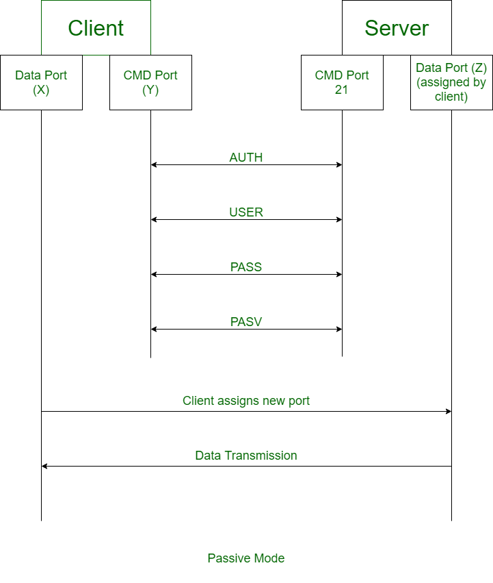
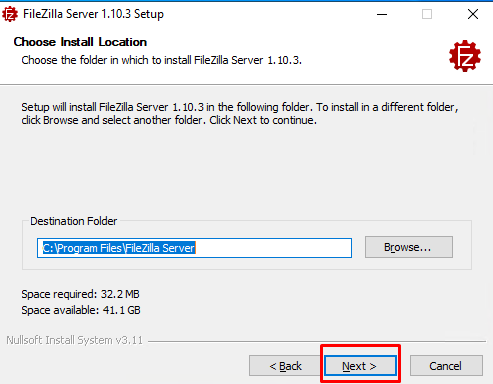
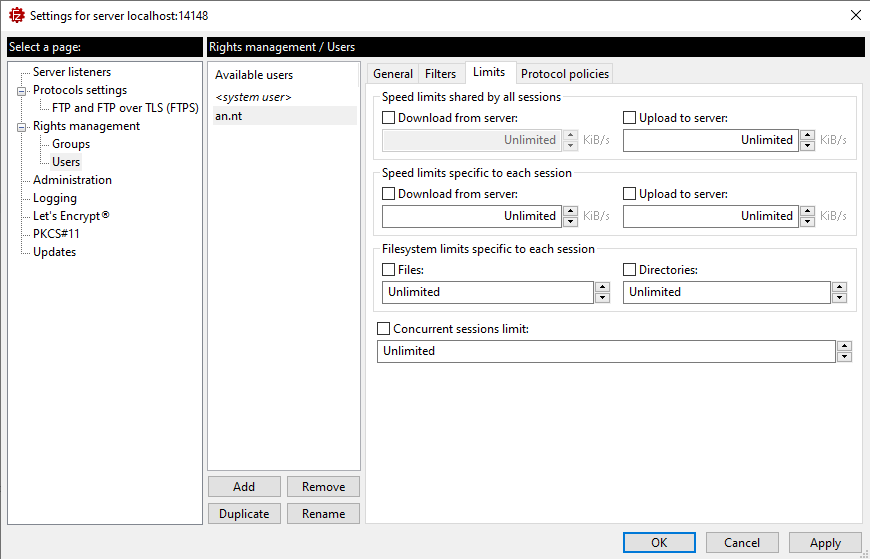
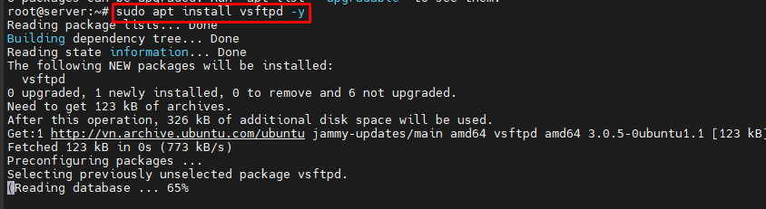
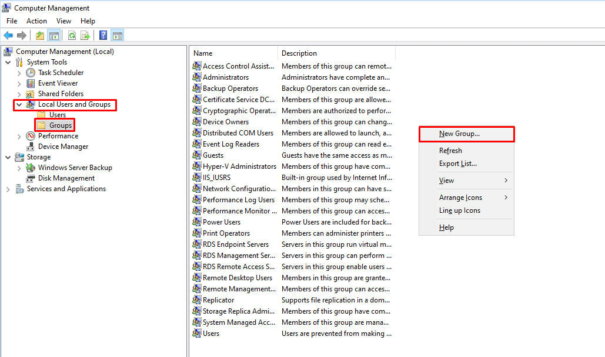
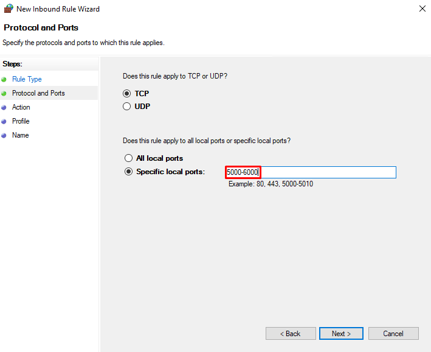
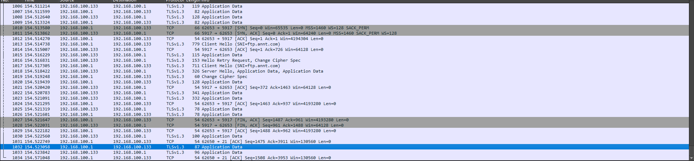
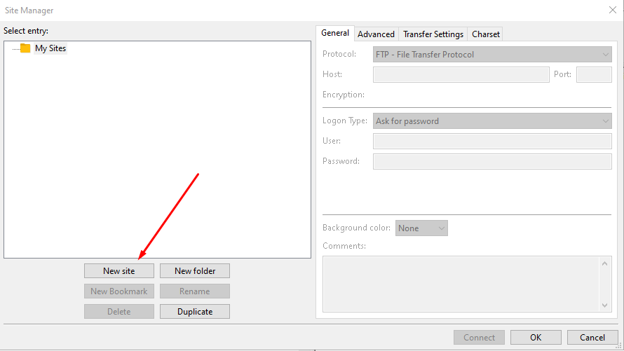
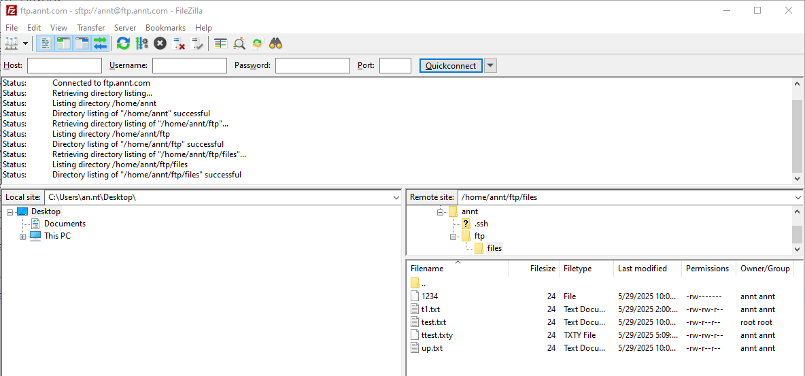

<!-- TOC --><a name="ftp"></a>
# FTP Server
*** 
<!-- TOC start -->

- [FTP Server](#ftp-server)
   * [1. Tổng quan về FTP Server](#1-tng-quan-v-ftp-server)
   * [2. Nguyên lý hoạt động của FTP](#2-nguyên-lý-hot-ng-ca-ftp)
   * [3. Các loại FTP Server](#3-các-loi-ftp-server)
   * [4. Phần mềm FTP Server phổ biến](#4-phn-mm-ftp-server-ph-bin)
   * [5. Cài đặt và cấu hình FTP Server](#5-cài-t-và-cu-hình-ftp-server)
      + [5.1 FileZilla](#51-filezilla)
         - [5.1.1 Trên Windows ](#511-trên-windows)
         - [5.1.1 Trên Linux](#511-trên-linux)
      + [5.2 vsftpd](#52-vsftpd)
      + [5.3 ProFTPD](#53-proftpd)
      + [5.4 Microsoft IIS FTP](#54-microsoft-iis-ftp)
   * [6. Bảo mật FTP Server ](#6-bo-mt-ftp-server)
      + [6.1 Các rủi ro bảo mật:](#61-các-ri-ro-bo-mt)
      + [6.2 Cách bảo vệ:](#62-cách-bo-v)
      + [6.3 Quản lý tài khoản:](#63-qun-lý-tài-khon)
      + [6.4 Cách ly người dùng (chroot):](#64-cách-ly-ngi-dùng-chroot)
      + [6.5 Cập nhật phần mềm thường xuyên để vá lỗ hổng:](#65-cp-nht-phn-mm-thng-xuyên-vá-l-hng)
   * [7.  Ứng dụng thực tế của FTP Server ](#7-ng-dng-thc-t-ca-ftp-server)
      + [7.1 Chia sẻ file trong nội bộ doanh nghiệp:](#71-chia-s-file-trong-ni-b-doanh-nghip)
      + [7.2 Lưu trữ và truyền tải dữ liệu lớn:](#72-lu-tr-và-truyn-ti-d-liu-ln)
      + [7.3 Tích hợp với các hệ thống web hosting:](#73-tích-hp-vi-các-h-thng-web-hosting)
      + [7.4 Sử dụng trong phát triển phần mềm:](#74-s-dng-trong-phát-trin-phn-mm)
   * [8. Hiệu suất và tối ưu hóa ](#8-hiu-sut-và-ti-u-hóa)
      + [8.1 Tối ưu băng thông và tốc độ truyền tải.](#81-ti-u-bng-thông-và-tc-truyn-ti)
      + [8.2 Quản lý số lượng kết nối đồng thời](#82-qun-lý-s-lng-kt-ni-ng-thi)
      + [8.3 Sử dụng nén file trước khi truyền.](#83-s-dng-nén-file-trc-khi-truyn)
      + [8.4 Giám sát hiệu suất và khắc phục sự cố (timeout, kết nối bị gián đoạn).](#84-giám-sát-hiu-sut-và-khc-phc-s-c-timeout-kt-ni-b-gián-on)
   * [9.  Các công cụ và giao thức liên quan ](#9-các-công-c-và-giao-thc-liên-quan)
      + [9.1 FTP Clients](#91-ftp-clients)
      + [9.2  Tích hợp với các công cụ quản lý file (Windows Explorer, Total Commander).](#92-tích-hp-vi-các-công-c-qun-lý-file-windows-explorer-total-commander)
      + [9.3 So sánh](#93-so-sánh)
   * [10. Khắc phục sự cố thường gặp ](#10-khc-phc-s-c-thng-gp)
      + [10.1 Lỗi kết nối: Kiểm tra firewall, NAT, và cấu hình cổng.](#101-li-kt-ni-kim-tra-firewall-nat-và-cu-hình-cng)
      + [10.2 Lỗi quyền truy cập: Xem lại quyền thư mục và tài khoản người dùng. ](#102-li-quyn-truy-cp-xem-li-quyn-th-mc-và-tài-khon-ngi-dùng)
      + [10.3 Vấn đề hiệu suất: Kiểm tra băng thông, cấu hình Active/Passive.](#103-vn-hiu-sut-kim-tra-bng-thông-cu-hình-activepassive)
   * [11. Thực hành](#11-thc-hành)
	  + [11.1  Cài đặt FTP Server trên Ubuntu vsftpd](#111-cài-t-ftp-server-trên-ubuntu-vsftpd)
	  + [11.2  Cài đặt FTP Server trên Windows](#112-cài-t-ftp-server-trên-windows)
	  + [11.3 Cấu hình FTPS](#113-cu-hình-ftps)
		 - [11.3.1 Trên Windows](#1131-trên-windows)
		 - [11.3.2 Trên Linux ](#1132-trên-linux)
		 - [11.3.2 Trên Linux ](#1132-trên-linux)
			 - [a. vsftpd ](#a-vsftpd)
			 - [b. ProFTPD](#b-proftpd)
			 - [c. Let's Encrypt certificate](#c-lets-encrypt-certificate)
	  + [11.4 Cấu hình SFTP trên Linux ](#114-cu-hình-sftp-trên-linux)
   * [References ](#references)

<!-- TOC end -->


<!-- TOC --><a name="1-tng-quan-v-ftp-server"></a>
## 1. Tổng quan về FTP Server
- FTP hay File Tranfer Protocol là một giao thức truyền tải tệp tin được sử dụng để chia sẻ và truyền tải dữ liệu giữa các máy tính trên mạng Internet. Nó cho phép người dùng truy cập và truyền tải các tệp tin từ một máy tính (máy gửi) đến một máy tính khác (máy nhận) thông qua kết nối mạng. 
- FTP hoạt động dựa trên mô hình máy khách-máy chủ (client-server). Máy khách FTP (FTP client) là một chương trình chạy trên máy tính của người dùng, cho phép họ giao tiếp và lấy tệp từ các máy tính từ xa. Nó bao gồm một bộ các lệnh thiết lập kết nối giữa hai máy chủ, hỗ trợ truyền tệp và sau đó đóng kết nối.
- FTP hoạt động theo mô hình hai hướng là nhận và truyền dữ liệu giữa máy chủ Server và máy khách Client. Control Connection và Data Connection là hai tiến trình TCP tạo ra quy trình nhận cũng như truyền dữ liệu của Server và Client. 
	- Control Connection kiểm soát kết nối trong suốt quá trình truyền và nhận dữ liệu. 
	- Data Connection thực hiện kết nối các dữ liệu qua lại giữa server và client.
- Hoạt động dựa trên mô hình client-server. FTP gồm các thành phần chính: FTP server, FTP client, và kết nối mạng.
	- FTP server Là nơi lưu trữ file và cung cấp dịch vụ truyền tải dữ liệu cho các client, quản lý người dùng, phân quyền truy cập, theo dõi và ghi nhật ký hoạt động....
	- FTP client Là thiết bị (máy tính, laptop, thiết bị IoT...) dùng để kết nối đến FTP Server và thao tác với file.
	- Kết nối mạng Là phương tiện trung gian giúp client và server giao tiếp qua giao thức FTP trên mạng TCP/IP. (Port 20/21)
- Vai trò của FTP server trong việc truyền tải dữ liệu. 
	- Lưu trữ và Quản lý Tệp: Máy chủ FTP cung cấp một vị trí tập trung để lưu trữ và quản lý các tệp. Điều này giúp các tổ chức dễ dàng duy trì và sắp xếp dữ liệu của họ.
	- Chia sẻ và Phân phối Tệp: Máy chủ FTP cho phép chia sẻ và phân phối tệp hiệu quả giữa những người dùng. Điều này đặc biệt hữu ích cho các tổ chức cần phân phối các bản cập nhật phần mềm, bản vá lỗi hoặc các bộ dữ liệu lớn.
	- Truy cập Tệp Từ xa: Người dùng có thể truy cập các tệp trên máy chủ FTP từ bất kỳ vị trí nào có kết nối internet. Khả năng truy cập từ xa này là vô giá đối với các doanh nghiệp có đội ngũ phân tán về mặt địa lý.
	- Sao lưu và Phục hồi: Máy chủ FTP thường được sử dụng làm giải pháp sao lưu. Các tệp quan trọng có thể được tải lên máy chủ thường xuyên, đảm bảo rằng dữ liệu được bảo toàn và có thể được phục hồi trong trường hợp phần cứng cục bộ bị lỗi.
	- Quy trình Tự động: Nhiều tổ chức sử dụng máy chủ FTP để tự động hóa các quy trình truyền tệp. Các tập lệnh và ứng dụng có thể tương tác với máy chủ FTP để tải lên hoặc tải xuống tệp mà không cần sự can thiệp của con người, giúp tinh giản quy trình làm việc.
- So sánh FTP với các giao thức khác (SFTP, FTPS, HTTP, SCP). 

| Tiêu chí            | FTP                                   | SFTP                                     | SCP                              | HTTPS                                        |
| ------------------- | ------------------------------------- | ---------------------------------------- | -------------------------------- | -------------------------------------------- |
| Bảo mật             | Không mã hóa                          | Mã hóa toàn bộ bằng SSH                  | Mã hóa bằng SSH                  | Mã hóa bằng SSL/TLS                          |
| Giao thức nền       | TCP (Port 21), không bảo mật          | SSH (Port 22)                            | SSH (Port 22)                    | HTTP + SSL/TLS (Port 443)                    |
| Quản lý file        | Có (upload, download, rename, delete) | Đầy đủ (upload, download, chmod, rename) | Không (chỉ copy file)            | Hạn chế (thường chỉ download/upload qua web) |
| Tốc độ              | Nhanh                                 | Trung bình (do mã hóa)                   | Thường nhanh hơn SFTP            | Phụ thuộc vào trình duyệt/web server         |
| Xác thực            | Username/password đơn giản            | SSH Key hoặc username/password           | SSH Key hoặc username/password   | Chứng chỉ số (SSL/TLS), cookie, token        |
| Ứng dụng phổ biến   | Web hosting, truyền file nội bộ cũ    | Quản lý file an toàn giữa máy chủ        | Sao chép file nhanh giữa máy chủ | Truy cập website, tải tài liệu an toàn       |

- FTP Commands

| No. | Lệnh            | Ý nghĩa                                                      |
| --- | --------------- | ------------------------------------------------------------ |
| 1   | `cd`            | Thay đổi thư mục làm việc trên máy chủ từ xa                 |
| 2   | `close`         | Đóng kết nối FTP hiện tại                                    |
| 3   | `quit`          | Thoát khỏi chương trình FTP                                  |
| 4   | `pwd`           | Hiển thị thư mục làm việc hiện tại trên máy chủ từ xa        |
| 5   | `dir` hoặc `ls` | Liệt kê danh sách thư mục tại thư mục làm việc hiện tại      |
| 6   | `help`          | Hiển thị danh sách các lệnh FTP của phía client (người dùng) |
| 7   | `remotehelp`    | Hiển thị danh sách các lệnh FTP của phía server (máy chủ)    |
| 8   | `type`          | Thiết lập kiểu tệp khi truyền (ví dụ: ASCII hoặc nhị phân)   |
| 9   | `struct`        | Xác định cấu trúc tệp khi truyền (ví dụ: file, record, page) |

- Ưu điểm của FTP
	- Chuyển giao nhiều tệp: FTP hỗ trợ chuyển giao nhiều tệp lớn giữa các hệ thống.
	- Hiệu quả: FTP giúp sắp xếp và chuyển giao các tệp một cách hiệu quả qua mạng.
	- Bảo mật: FTP chỉ cấp quyền truy cập cho người dùng thông qua ID và mật khẩu. Hơn nữa, máy chủ có thể tạo nhiều cấp độ truy cập.
	- Chuyển giao liên tục: Nếu quá trình chuyển giao tệp bị gián đoạn, người dùng có thể tiếp tục chuyển tệp bất cứ khi nào kết nối được thiết lập lại.
	- Đơn giản: FTP rất đơn giản để triển khai và sử dụng, do đó nó là một kết nối được sử dụng rộng rãi.
	- Tốc độ: Đây là cách nhanh nhất để chuyển tệp từ máy tính này sang máy tính khác.
- Nhược điểm của FTP
	- Bảo mật thấp: FTP không cung cấp tính năng mã hóa khi chuyển tệp. Hơn nữa, tên người dùng và mật khẩu ở dạng văn bản thuần túy, không phải là sự kết hợp của ký hiệu, chữ số và chữ cái, điều này khiến chúng dễ bị tin tặc tấn công.
	- Công nghệ cũ: FTP là một trong những giao thức lâu đời nhất và do đó nó sử dụng nhiều kết nối TCP/IP để chuyển tệp. Các kết nối này thường bị cản trở bởi tường lửa.
	- Virus: Kết nối FTP rất khó quét virus, điều này làm tăng nguy cơ dễ bị tấn công.
	- Hạn chế: FTP cung cấp quyền truy cập người dùng và truy cập thiết bị di động rất hạn chế.
	- Bộ nhớ và lập trình: FTP yêu cầu nhiều bộ nhớ và nỗ lực lập trình hơn, vì rất khó tìm lỗi nếu không có các lệnh.

<!-- TOC --><a name="2-nguyên-lý-hot-ng-ca-ftp"></a>
## 2. Nguyên lý hoạt động của FTP
- Mô hình client-server trong FTP.
	- 
	- FTP là một giao thức máy khách-máy chủ có hai kênh liên lạc: kênh lệnh dùng để điều khiển cuộc trò chuyện và kênh dữ liệu dùng cho nội dung tệp.
	- Các bước FTP hoạt động như sau:
		- Người dùng phải đăng nhập vào Máy chủ FTP trước tiên. Có một số máy chủ cho phép truy cập nội dung mà không cần đăng nhập, được gọi là FTP ẩn danh.
		- Máy khách có thể bắt đầu cuộc trò chuyện với máy chủ khi yêu cầu tải xuống một tệp.
		- Người dùng có thể thực hiện các chức năng khác nhau trên máy chủ như tải lên, xóa, đổi tên, sao chép tệp, v.v.
- Cơ chế kết nối:
	- FTP sử dụng hai loại kết nối chính: Kết nối điều khiển (Control Connection) và Kết nối dữ liệu (Data Connection).
		- Kết nối điều khiển được FTP sử dụng để gửi các thông tin điều khiển như định danh người dùng, mật khẩu, lệnh thay đổi thư mục từ xa, lệnh truy xuất và lưu trữ tệp, v.v. Kết nối điều khiển được khởi tạo trên cổng số 21.
		- Kết nối dữ liệu được FTP sử dụng để gửi các tệp thực tế. Một kết nối dữ liệu được khởi tạo trên cổng số 20.
		- FTP gửi thông tin điều khiển out-of-band (ngoài dải) vì nó sử dụng một kết nối điều khiển riêng biệt. Một số giao thức khác gửi các dòng tiêu đề yêu cầu và phản hồi cùng với dữ liệu trong cùng một kết nối TCP. Vì lý do này, chúng được cho là gửi thông tin điều khiển in-band (trong dải). HTTP và SMTP là những ví dụ điển hình cho việc này.
	- FTP hoạt động trên 2 mode là Active và Passive:
		- Active FTP là một chế độ của FTP, trong đó máy khách khởi tạo kết nối trên một cổng và chờ máy chủ thiết lập kết nối với nó. Ở chế độ hoạt động này, máy khách mở kênh lệnh và máy chủ mở kênh dữ liệu. Ở một mức độ nào đó, điều này có thể dẫn đến các thách thức bảo mật vì máy khách phải mở các cổng cho các kết nối đến.
			- 
			- Ưu điểm của Active FTP:
				- Cấu hình máy chủ đơn giản hơn: Vì máy chủ là bên mở kết nối dữ liệu, điều này giảm thiểu độ phức tạp của máy chủ.
				- Hiệu quả cho các mạng đáng tin cậy: Nó đặc biệt hiệu quả khi máy khách và máy chủ nằm trong cùng một mạng đáng tin cậy.
			- Nhược điểm của Active FTP
				- Vấn đề tường lửa: Hầu hết các tường lửa giới hạn các kết nối đến và điều đó khiến Active FTP trở thành một giải pháp khó khăn.
				- Không lý tưởng cho bảo mật máy khách: Ảnh hưởng đến khả năng truy cập của máy khách bằng cách yêu cầu họ mở các cổng, nghĩa là các bên không xác định có thể dễ dàng truy cập vào mạng.
		- Passive FTP 
			- 
			- Passive FTP cho phép máy khách mở cả kết nối lệnh và kết nối dữ liệu, điều này làm cho nó phù hợp hơn khi làm việc với tường lửa hoặc NAT (Network Address Translation). Máy chủ sẽ thông báo cho máy khách về cổng cần thiết lập cho kênh dữ liệu.
			- Ưu điểm của Passive FTP
				- Thân thiện với tường lửa: Ưu điểm này xuất phát từ việc tất cả các kết nối trong mô hình máy khách-máy chủ đều do máy khách thực hiện, giúp dễ dàng tương thích với tường lửa và NAT.
				- Bảo mật nâng cao:	Giảm thiểu rủi ro bảo mật vì các kết nối đến mặc định của máy khách được giảm thiểu và kiểm soát.
			- Nhược điểm của Passive FTP
				- Phức tạp trong cấu hình máy chủ: Yêu cầu máy chủ phải xử lý nhiều cổng cũng như kết nối, điều này gây ra mức độ khó khăn cao hơn.
				- Sử dụng tài nguyên cao hơn: Khi cấu hình phía máy chủ phức tạp hơn có thể dẫn tới nhiều tài nguyên hơn đang được sử dụng.
- Các phương thức truyền dữ liệu trong FTP: Quá trình truyền dữ liệu được thiết lập, dữ liệu sẽ được truyền từ máy Client đến máy Server và ngược lại. FTP có 3 phương thức truyền tải dữ liệu là stream mode, block mode và compressed mode.
	- Stream mode: Phương thức này hoạt động dựa vào tính tin cậy trong việc truyền dữ liệu trên giao thức TCP. Dữ liệu được truyền đi dưới dạng các byte có cấu trúc không liên tiếp.
	- Block mode: Là phương thức truyền dữ liệu mang tính quy chuẩn. Dữ liệu được chia thành nhiều block nhỏ và đóng gói thành các FTP blocks.
	- Compressed mode: Là phương thức truyền dữ liệu kỹ thuật nén dữ liệu khá đơn giản run-length encoding. Các đoạn dữ liệu bị lặp sẽ được phát hiện và loại bỏ.
- Quy trình xác thực (anonymous vs. authenticated users).
	- Anonymous Users (Người dùng ẩn danh)
		- Mục đích: Cho phép người dùng truy cập vào một số tài nguyên FTP công khai mà không cần tài khoản cá nhân.
		- Cách hoạt động:
			- Người dùng kết nối đến máy chủ FTP.
			- Khi được yêu cầu tên đăng nhập (username), người dùng nhập anonymous hoặc ftp.
			- Máy chủ sẽ yêu cầu nhập mật khẩu, lúc này người dùng thường nhập địa chỉ email của mình (hoặc một chuỗi bất kỳ).
			- Máy chủ chấp nhận đăng nhập mà không kiểm tra mật khẩu thật sự.
		- Quyền truy cập bị giới hạn, chỉ có thể tải file từ các thư mục công khai. Không có quyền ghi, xóa hoặc thay đổi file trên máy chủ.
		- Ví dụ đăng nhập vào một máy chủ cho phép anonymous user 
		- 
	- Authenticated Users (Người dùng xác thực)
		- Mục đích: Cung cấp quyền truy cập bảo mật hơn cho người dùng đã được cấp tài khoản.
		- Cách hoạt động:
			- Người dùng kết nối đến máy chủ FTP.
			- Khi được yêu cầu tên đăng nhập, người dùng nhập tên tài khoản của mình.
			- Máy chủ yêu cầu mật khẩu.
			- Người dùng nhập mật khẩu tương ứng với tài khoản.
			- Máy chủ kiểm tra thông tin đăng nhập:
				- Nếu chính xác, người dùng được phép truy cập và thao tác theo quyền được cấp (đọc, ghi, sửa, xóa).
				- Nếu sai, kết nối bị từ chối hoặc yêu cầu đăng nhập lại.
		- Cần có tài khoản và mật khẩu hợp lệ. An toàn, cho phép quản lý quyền truy cập cụ thể cho từng người dùng.
		- Ví dụ đăng nhập vào máy chủ có user/pass
		- 

<!-- TOC --><a name="3-các-loi-ftp-server"></a>
## 3. Các loại FTP Server
- Anonymous FTP: 
	- Cho phép người dùng truy cập mà không cần tài khoản cá nhân (chỉ cần dùng anonymous làm tên đăng nhập).
	- Thường dùng để phân phối phần mềm mã nguồn mở, tài liệu công khai.
	- Ưu điểm: Dễ truy cập, không yêu cầu xác thực.
	- Nhược điểm: Thiếu bảo mật, không kiểm soát được ai đang truy cập.
- Authenticated FTP: 
	- Người dùng phải đăng nhập bằng tên tài khoản và mật khẩu hợp lệ để truy cập.
	- Ứng dụng: Dùng trong các hệ thống nội bộ, doanh nghiệp.
	- Ưu điểm: Bảo mật hơn, dễ kiểm soát quyền truy cập.
	- Nhược điểm: Yêu cầu quản lý người dùng và mật khẩu.
- FTPS (FTP Secure):  
	- Mở rộng từ FTP chuẩn, sử dụng SSL/TLS để mã hóa dữ liệu truyền tải.
	- FTPS hoạt động giống FTP nhưng được tăng cường an toàn bằng mã hóa SSL/TLS.
	- Ưu điểm của Giao thức FTPS:
		- Bảo mật tốt: Mã hóa SSL/TLS đảm bảo an toàn cho dữ liệu.
		- Tương thích với giao thức FTP truyền thống: Phù hợp với những hệ thống đã sử dụng FTP.
		- Hỗ trợ chứng chỉ số: Tăng cường xác thực danh tính.
	- Nhược điểm của FTPS:
		- Cấu hình phức tạp: Cần cài đặt và quản lý chứng chỉ SSL/TLS.
		- Khó quản lý tường lửa: Sử dụng nhiều cổng (một cho kênh điều khiển và nhiều cổng cho kênh dữ liệu).
		- Chậm hơn FTP: Quá trình mã hóa khiến tốc độ truyền tải chậm hơn so với FTP truyền thống.
- SFTP (SSH File Transfer Protocol): 
	- Giao thức truyền tệp được tích hợp bảo mật nhờ việc sử dụng giao thức SSH (Secure Shell). Toàn bộ dữ liệu truyền qua SFTP đều được mã hóa.
	- SFTP hoạt động trên một kênh duy nhất (thường là cổng 22), và sử dụng cơ chế mã hóa SSH để đảm bảo an toàn. Điều này giúp giảm thiểu các lỗ hổng bảo mật và đơn giản hóa việc quản lý kết nối so với các giao thức khác như FTP hoặc FTPS.
	- SFTP dựa vào cơ chế mã hóa của SSH để bảo vệ dữ liệu. Toàn bộ thông tin truyền đi, bao gồm dữ liệu tệp, thông tin đăng nhập, và lệnh, đều được mã hóa nhằm ngăn chặn các hành vi nghe lén hoặc tấn công đánh cắp dữ liệu.
	- SFTP hỗ trợ quản lý quyền truy cập và phân quyền chặt chẽ, giúp tăng cường tính an toàn trong việc chia sẻ dữ liệu giữa các người dùng hoặc hệ thống.
	- Ưu điểm của SFTP:
		- Bảo mật cao: SFTP mã hóa các dữ liệu truyền tải, bảo vệ chống tấn công và đánh cắp dữ liệu.
		- Hoạt động trên một cổng: Giúp dễ cấu hình tường lửa và giảm nguy cơ xung đột.
		- Hỗ trợ xác thực khóa SSH: Tăng cường bảo mật bằng cách sử dụng xác thực không chỉ dựa vào mật khẩu.
	- Nhược điểm của SFTP:
		- Cài đặt phức tạp hơn: Yêu cầu hiểu biết về giao thức SSH.
		- Tốc độ chậm hơn FTP: Do cơ chế mã hóa, SFTP thường chậm hơn một chút so với FTP.
- So sánh FTPS, SFTP 

| Tiêu chí                  | SFTP (Secure Shell File Transfer Protocol)                            | FTPS (File Transfer Protocol Secure)                                      |
| ------------------------- | --------------------------------------------------------------------- | ------------------------------------------------------------------------- |
| Cơ chế giao tiếp mạng     | Xây dựng dựa trên SSH, bổ sung khả năng truyền tệp.                   | Xây dựng dựa trên FTP, thêm lớp mã hóa SSL/TLS.                           |
| Hỗ trợ tường lửa          | Dễ dàng cấu hình vì chỉ dùng một cổng duy nhất.                       | Cần nhiều cổng (control + data) → khó cấu hình tường lửa.                 |
| Tốc độ truyền tải         | Chậm hơn do mã hóa toàn bộ và overhead cao.                           | Nhanh hơn, hoạt động gọn nhẹ hơn SFTP.                                    |
| Chế độ truyền dữ liệu     | Chỉ hỗ trợ binary (nhị phân), không chọn được ASCII.                  | Hỗ trợ cả binary và ASCII, tiện cho xử lý văn bản/logs.                   |
| Khả năng tương thích .NET | Không được hỗ trợ tốt trong môi trường .NET.                          | Tích hợp tốt với .NET và có nhiều API hỗ trợ FTPS.                        |
| Cơ chế xác thực           | Xác thực thông qua SSH keys, không cần chứng chỉ số.                  | Cần chứng chỉ số (SSL/TLS certificate) để xác thực máy chủ.               |
| Câu lệnh hỗ trợ           | Hỗ trợ nhiều lệnh nâng cao, ví dụ phân quyền, đổi tên file, v.v.      | Hỗ trợ ít lệnh hơn, ít quyền kiểm soát hơn với thư mục và tệp tin từ xa.  |
| Mức độ phổ biến           | Phổ biến rộng rãi, được hầu hết các hệ thống và dịch vụ cloud hỗ trợ. | Ít phổ biến hơn; FTP nói chung đang dần bị thay thế bởi HTTPS, SFTP, v.v. |


<!-- TOC --><a name="4-phn-mm-ftp-server-ph-bin"></a>
## 4. Phần mềm FTP Server phổ biến
-  FileZilla Server (miễn phí, mã nguồn mở).
	- FileZilla Server là một máy chủ truyền tệp đa nền tảng, hỗ trợ FTP và FTPS. Phần mềm có thể chạy trên các máy tính Windows, macOS và Debian Linux. 
	- Các tính năng của FileZilla Server bao gồm:
		* Hỗ trợ một số giao thức truyền tệp nhất định, bao gồm FTPS. (Lưu ý: SFTP chỉ được cung cấp trên FileZilla Pro Enterprise Server.)
		* Quản lý người dùng, với khả năng kiểm soát quyền truy cập của họ dựa trên thông tin xác thực toàn hệ thống, nếu muốn.
		* Tạo, quản lý và cập nhật chứng chỉ X.509.
		* Tích hợp quy trình tạo chứng chỉ Let's Encrypt®.
		* Ghi nhật ký có thể cấu hình.
		* Giới hạn tốc độ truyền cho cả tải lên và tải xuống.
		* Chặn (cấm) tạm thời những người dùng cụ thể dựa trên các tiêu chí được xác định trước.
		* Lọc các kết nối dựa trên địa chỉ IP.
	- Ưu điểm của FileZilla Server bản miễn phí:
		* Miễn phí sử dụng: FileZilla Server bản miễn phí hoàn toàn miễn phí cho cả mục đích cá nhân và thương mại.
		* Chức năng cơ bản: Nó cung cấp các tính năng thiết yếu để truyền tệp, bao gồm quyền truy cập người dùng, cài đặt bảo mật và giới hạn tốc độ.
		* Mã nguồn mở: FileZilla Server là mã nguồn mở, nghĩa là mã của nó công khai và người dùng có thể sửa đổi.
		* Tương thích đa nền tảng: Các phiên bản máy khách và máy chủ miễn phí có sẵn cho Windows, Mac OS và Linux.
	- Nhược điểm của FileZilla Server bản miễn phí:
		* Tính năng hạn chế: Phiên bản miễn phí có thể thiếu một số tính năng nâng cao hơn có trong bản Pro, chẳng hạn như quản lý tệp từ đám mây này sang đám mây khác.
		* Lo ngại về bảo mật: Mặc dù phiên bản miễn phí có thể được bảo mật, nhưng nó có thể không cung cấp mức độ bảo mật tương tự như các tính năng nâng cao của bản Pro.
-  vsftpd (Very Secure FTP Daemon, phổ biến trên Linux).
	- VSFTPD là viết tắt của "Very Secure FTP Daemon" (Chương trình FTP rất bảo mật) là một máy chủ FTP được cấp phép GPL cho các hệ thống UNIX. Nó được cấp phép theo Giấy phép Công cộng GNU. VSFTPD là máy chủ FTP mặc định trong các bản phân phối Linux Ubuntu, CentOS, Fedora, NimbleX, Slackware và RHEL. Nó bảo mật, nhanh và ổn định. 
	- VSFTPD là một giải pháp hiệu quả và đáng tin cậy, hỗ trợ người dùng ảo với PAM. Người dùng ảo là một tài khoản đăng nhập không tồn tại dưới dạng tài khoản đăng nhập thực trên hệ thống trong các tệp /etc/passwd và /etc/shadow. Do đó, người dùng ảo có thể an toàn hơn người dùng thực, vì một tài khoản bị xâm phạm chỉ có thể sử dụng máy chủ FTP mà không thể đăng nhập vào hệ thống để sử dụng các dịch vụ khác như SSH hoặc SMTP.
	- Các tính năng: Mặc dù được thiết kế nhỏ gọn để đạt tốc độ và bảo mật, VSFTPD vẫn có thể thiết lập nhiều cấu hình FTP phức tạp hơn. VSFTPD có thể xử lý:
		* Cấu hình IP ảo
		* Người dùng ảo
		* Hoạt động độc lập hoặc thông qua inetd
		* Khả năng cấu hình mạnh mẽ cho từng người dùng
		* Điều tiết băng thông
		* Khả năng cấu hình theo từng IP nguồn
		* Giới hạn theo từng IP nguồn
		* IPv6
		* Hỗ trợ mã hóa thông qua tích hợp SSL...
	- Ưu điểm:
		* Bảo mật mạnh mẽ: VSFTPD được thiết kế với mục tiêu bảo mật hàng đầu, tích hợp các tính năng như chroot, nguyên tắc đặc quyền tối thiểu và nguyên tắc không tin cậy.
		* Hiệu quả tài nguyên: Nó nổi tiếng với việc sử dụng ít tài nguyên hơn so với các máy chủ FTP khác.
		* Hạn chế cấp độ người dùng: Cho phép cấu hình quyền truy cập và quyền hạn dựa trên tài khoản người dùng và địa chỉ IP.
		* Giao tiếp mã hóa: Hỗ trợ giao tiếp an toàn bằng SSL/TLS, cung cấp mã hóa cho truyền dữ liệu và xác thực.
		* Dễ sử dụng: Tương đối dễ thiết lập và cấu hình.
		* Máy chủ FTP mặc định: Thường là máy chủ FTP mặc định trong nhiều bản phân phối Linux.
	- Nhược điểm:
		* Thiếu các tính năng nâng cao: Không bao gồm các tính năng như đồng bộ hóa tệp, nén hoặc khả năng tiếp tục các lần truyền bị gián đoạn.
		* Tiềm ẩn các vấn đề cấu hình: Mặc dù tương đối đơn giản, cấu hình có thể phức tạp, đặc biệt đối với các thiết lập nâng cao.
		* Tương thích tường lửa: Có thể gặp sự cố với tường lửa do việc sử dụng nhiều kết nối TCP/IP.
-  ProFTPD (cấu hình linh hoạt, mã nguồn mở). 
	- ProFTPD là một phần mềm máy chủ FTP miễn phí và mã nguồn mở. Nó nổi tiếng nhờ tính linh hoạt trong cấu hình, các tính năng bảo mật và hiệu suất cao, biến nó thành lựa chọn phổ biến để lưu trữ các dịch vụ FTP trên các hệ thống giống Unix. Nó thường được sử dụng để truyền tệp giữa các máy tính, thường là để lưu trữ web hoặc phân phối phần mềm.
	- ProFTPD cung cấp các tính năng sau:
		* Tệp cấu hình chính duy nhất: Với các chỉ thị và nhóm chỉ thị trực quan đối với bất kỳ quản trị viên nào đã từng sử dụng máy chủ web Apache.
		* Cấu hình ".ftpaccess" cho từng thư mục: Tương tự như ".htaccess" của Apache.
		* Dễ dàng cấu hình nhiều máy chủ FTP ảo và dịch vụ FTP ẩn danh.
		* Được thiết kế để chạy dưới dạng máy chủ độc lập hoặc từ inetd/xinetd, tùy thuộc vào tải hệ thống.
		* Thư mục gốc FTP ẩn danh không yêu cầu bất kỳ cấu trúc thư mục cụ thể, tệp nhị phân hệ thống hoặc các tệp hệ thống khác.
		* Không có lệnh SITE EXEC. Trong môi trường Internet hiện đại, các lệnh như vậy là một cơn ác mộng về bảo mật.
		* Mã nguồn có sẵn (và phải luôn có sẵn) để quản trị viên và nhà phát triển kiểm tra.
		* Thư mục và tệp ẩn, dựa trên quyền kiểu Unix hoặc quyền sở hữu người dùng/nhóm.
		* Chạy dưới dạng người dùng không có đặc quyền có thể cấu hình ở chế độ độc lập để giảm thiểu cơ hội tấn công có thể khai thác khả năng "root" của nó. Lưu ý: Tính năng này phụ thuộc vào khả năng của hệ thống Unix chủ.
		* Hỗ trợ ghi nhật ký và utmp/wtmp. Ghi nhật ký tương thích với tiêu chuẩn wu-ftpd, với khả năng ghi nhật ký mở rộng.
		* Hỗ trợ bộ mật khẩu shadow, bao gồm hỗ trợ cho các tài khoản đã hết hạn.
		* Thiết kế mô-đun, cho phép mở rộng máy chủ dễ dàng bằng các mô-đun. Các mô-đun đã được viết cho cơ sở dữ liệu SQL, máy chủ LDAP, mã hóa SSL/TLS, hỗ trợ RADIUS, v.v.
		* Hỗ trợ IPv6.
	- Ưu điểm:
		* Tính năng nâng cao: ProFTPD được thiết kế với nhiều tính năng nâng cao, cung cấp vô số tùy chọn cấu hình cho người dùng.
		* Cập nhật thường xuyên: Nhóm phát triển ProFTPD thường xuyên phát hành các bản cập nhật, đảm bảo các cải tiến về bảo mật và tính năng, theo Azdigi.
		* Khả năng mở rộng: ProFTPD có thể xử lý lưu lượng truy cập cao và số lượng kết nối lớn, làm cho nó phù hợp với các trang web có lượng sử dụng FTP lớn.
		* Tính năng bảo mật: ProFTPD cung cấp nhiều tính năng bảo mật khác nhau, bao gồm các cơ chế xác thực và kiểm soát truy cập.
		* Cấu hình linh hoạt: ProFTPD cung cấp một loạt các tùy chọn cấu hình, cho phép người dùng điều chỉnh máy chủ theo nhu cầu cụ thể của họ.
		* Mã hóa SSL/TLS: ProFTPD hỗ trợ mã hóa SSL/TLS để truyền dữ liệu an toàn.
	- Nhược điểm:
		* Độ phức tạp: ProFTPD có thể phức tạp hơn trong việc cấu hình và quản lý so với các máy chủ FTP đơn giản hơn.
		* Tiêu thụ tài nguyên: ProFTPD có thể tốn nhiều tài nguyên, đặc biệt với lưu lượng truy cập cao hoặc cấu hình phức tạp.
		* Hạn chế quota (với cPanel): Một số nền tảng như cPanel không cho phép ProFTPD sử dụng quota người dùng ảo, đây có thể là một hạn chế đối với một số người dùng.
-  Microsoft IIS FTP (tích hợp trên Windows Server). 
	- Máy chủ FTP của Microsoft IIS là một mô-đun nằm trong máy chủ web Internet Information Services (IIS), chuyên xử lý các yêu cầu Giao thức truyền tệp (FTP). Nó cho phép người dùng truyền tệp an toàn đến và đi từ máy chủ bằng giao thức FTP. Máy chủ FTP của IIS cung cấp các tính năng như tên máy chủ ảo cho nhiều trang FTP và các cải tiến bảo mật như xác thực dựa trên SSL và truyền dữ liệu.
	- Các tính năng chính của Máy chủ FTP Microsoft IIS:
		- Bảo mật:
			- FTP qua SSL/TLS: Hỗ trợ kết nối an toàn bằng mã hóa SSL/TLS để truyền tệp bảo mật.
			- Hỗ trợ tên máy chủ ảo: Cho phép nhiều trang FTP được lưu trữ trên cùng một địa chỉ IP bằng cách sử dụng các tiêu đề máy chủ khác nhau.
			- Cách ly người dùng: Cho phép tạo thư mục ảo riêng cho từng người dùng, giúp tăng cường bảo mật và kiểm soát quyền truy cập tệp.
		- Tích hợp:
			- Tích hợp IIS: Tích hợp hoàn toàn với IIS, cho phép dễ dàng quản lý nội dung FTP và web từ cùng một trang.
			- Trình quản lý IIS: Hỗ trợ cấu hình và quản lý thông qua Trình quản lý IIS.
		- Tính linh hoạt:
			- Nội dung web và FTP trên cùng một trang: Cho phép lưu trữ cả nội dung web và FTP trên cùng một trang.
			- Hỗ trợ UTF8 và IPv6: Hỗ trợ mã hóa UTF8 cho tên tệp và IPv6 cho giao tiếp mạng.
		- Ưu điểm:
			* Tích hợp với hệ sinh thái Windows: IIS FTP tích hợp liền mạch với các sản phẩm và dịch vụ khác của Microsoft, trở thành lựa chọn tự nhiên cho các môi trường phụ thuộc nhiều vào công nghệ Windows.
			* Tính năng bảo mật: IIS cung cấp các tính năng bảo mật mạnh mẽ như mã hóa SSL/TLS, cách ly người dùng (chia sẻ thư mục gốc hoặc thư mục riêng lẻ) và các kiểm soát bảo mật khác.
			* Khả năng mở rộng và độ tin cậy: IIS có thể được mở rộng thông qua các farm web và cân bằng tải, nâng cao hiệu suất và độ tin cậy cho các trang web có lượng truy cập cao.
			* Application Pools (Nhóm ứng dụng): IIS sử dụng các nhóm ứng dụng để tách biệt các ứng dụng web, cải thiện tính sẵn có và ngăn chặn sự cố trong một ứng dụng ảnh hưởng đến các ứng dụng khác.
			* Quản lý dựa trên GUI: IIS cung cấp giao diện đồ họa thân thiện với người dùng để cấu hình và quản lý, đơn giản hóa các tác vụ quản trị.
		- Nhược điểm:
			* Giới hạn nền tảng: IIS chỉ tương thích với Windows, hạn chế các tùy chọn triển khai và khả năng tương thích với các ứng dụng và framework của bên thứ ba có thể không được thiết kế cho Windows.
			* Chi phí: IIS yêu cầu giấy phép Windows Server, đây có thể là một yếu tố chi phí, đặc biệt khi so sánh với các lựa chọn thay thế mã nguồn mở.
			* Tiêu thụ tài nguyên: IIS có thể tiêu thụ tài nguyên máy chủ tỷ lệ thuận với lưu lượng truy cập, có khả năng dẫn đến chi phí không mong muốn hoặc thời gian ngừng hoạt động nếu không được cấu hình đúng cách.
			* Độ phức tạp cấu hình: Tối ưu hóa IIS để đạt hiệu suất cao yêu cầu cấu hình cẩn thận, và các công cụ chẩn đoán có thể không phải lúc nào cũng thân thiện với người dùng để khắc phục sự cố.
			* Hỗ trợ cộng đồng hạn chế: So với các máy chủ web được sử dụng rộng rãi như Apache, IIS có cơ sở người dùng nhỏ hơn và có thể có ít hỗ trợ cộng đồng sẵn có hơn.
			* Lo ngại về bảo mật: Mặc dù IIS cung cấp các tính năng bảo mật, điều quan trọng là phải đảm bảo cấu hình và vá lỗi đúng cách để giảm thiểu các lỗ hổng tiềm ẩn.
			* Tiềm ẩn không ổn định: Một số người dùng đã báo cáo rằng IIS có thể dễ bị treo hoặc đóng băng, yêu cầu khởi động lại máy chủ.
-  Pure-FTPd, Cerberus FTP, và các phần mềm thương mại khác.
	- Pure-FTPd 
		- Pure-FTPd là một máy chủ FTP nhanh, chất lượng sản xuất, tuân thủ các tiêu chuẩn, được phát triển dựa trên Troll-FTPd.
		- Máy chủ này được thiết kế để an toàn ngay từ cấu hình mặc định, không có lỗ hổng bảo mật nào được biết đến. Việc cài đặt nó thực sự đơn giản và nó đặc biệt được thiết kế cho các nhân hệ điều hành hiện đại. Pure-FTPd đã được chuyển đổi thành công sang Linux, FreeBSD, Dragonfly BSD, NetBSD, OpenBSD, OSX, AIX và nhiều hệ điều hành khác.
		- Các tính năng chính của Pure-FTPd bao gồm:
			* Hỗ trợ thư mục chính chroot() và ảo.
			* Virtual Domain và lệnh 'ls' tích hợp.
			* Hệ thống chống warez.
			* Cổng cấu hình cho tải xuống thụ động và giao thức FXP.
			* Điều tiết băng thông và tỷ lệ.
			* Xác thực qua LDAP / MySQL / PostgreSQL.
			* Tệp fortune và nhật ký giống Apache.
			* Chế độ độc lập nhanh và báo cáo trạng thái thời gian thực.
			* Người dùng ảo, quota ảo, phân tách đặc quyền và hỗ trợ TLS.
	- Cerberus FTP 
		- Cerberus FTP Server là một giải pháp truyền tệp an toàn chạy trên nền tảng Windows, cung cấp khả năng truyền tệp được quản lý. Nó hỗ trợ nhiều giao thức khác nhau bao gồm FTP, SFTP, FTPS, HTTP/S và SCP, đồng thời cung cấp ứng dụng khách web để chia sẻ tệp an toàn. Cerberus nổi tiếng về tính dễ sử dụng, các tính năng tuân thủ và các biện pháp bảo mật mạnh mẽ, làm cho nó phù hợp với các doanh nghiệp cần truyền tệp an toàn và hiệu quả, đặc biệt trong các ngành công nghiệp được quản lý chặt chẽ.
		- Các tính năng của Cerberus FTP Server:
			* Giao thức: FTP, FTP/S, SFTP, SCP, HTTP/S
			* Bảo mật nâng cao: SSH, SSL, FIPS 140-2
			* Tự động hóa MFT (Managed File Transfer): Các công cụ sự kiện, cảnh báo & đồng bộ hóa
			* Môi trường: Windows Server, Đám mây & Máy ảo
			* Bảo vệ truy cập: Các công cụ hạn chế IP, người dùng & giao thức
			* Quản lý tài khoản: AD, LDAP, 2FA, SSO & nhiều hơn nữa
			* Kiểm toán và báo cáo: Nhật ký truy cập tệp, người dùng và quản trị viên
			* Công cụ quản trị: API, Trình quản lý đồng bộ hóa & các công cụ khác
			* Cổng Web HTTPS: Chuyển tệp dựa trên trình duyệt từ mọi thiết bị
			* Giám sát & kiểm tra: Kiểm tra mạng, tải và truy cập tự động
			* Tuân thủ quy định: Các công cụ kiểm toán, lưu giữ & mã hóa
	- SolarWinds Serv-U MFT
		- SolarWinds Serv-U MFT là một máy chủ FTP an toàn, đáng tin cậy được thiết kế để hỗ trợ truyền tệp FTP cùng với FTPS và SFTP, cộng thêm các giao thức HTTP/S (HTTP qua SSL) trên mạng IPv4 và IPv6. Điều này làm cho Serv-U MFT trở thành một lựa chọn tuyệt vời cho các tệp thuộc mọi kích thước và mục đích, cũng như cho nhiều hệ điều hành khác nhau. Serv-U MFT cũng được xây dựng để chia sẻ tệp ngang hàng (peer-to-peer), cho phép bạn gửi, nhận và yêu cầu tệp tức thời để truyền tệp đơn giản nhưng an toàn giữa người dùng cuối. Serv-U MFT hỗ trợ một bảng điều khiển tập trung trên trình duyệt web, giúp việc chia sẻ tệp nhanh chóng.
		- Các tính năng: 
			* Hỗ trợ đa giao thức: FTP, FTP/S, SFTP, SCP, HTTP/S.
			* Bảo mật nâng cao với SSH, SSL, FIPS 140-2.
			* Tự động hóa sự kiện, cảnh báo và đồng bộ hóa tệp.
			* Chạy trên Windows Server, Cloud và môi trường ảo.
			* Công cụ bảo vệ truy cập dựa trên IP, người dùng và giao thức.
			* Quản lý tài khoản: AD, LDAP, 2FA, SSO.
			* Kiểm toán và báo cáo chi tiết về truy cập tệp, người dùng và quản trị viên.
			* Công cụ quản trị mạnh mẽ: API, Trình quản lý đồng bộ hóa.
			* Cổng Web HTTPS cho phép truy cập qua trình duyệt.
			* Giám sát và kiểm tra mạng, tải và truy cập tự động.
			
- So sánh 

| Tiêu chí                     | FileZilla Server           | vsftpd                             | ProFTPD                   | Microsoft IIS FTP           | Pure-FTPd                         | Cerberus FTP Server       | SolarWinds Serv-U MFT                                      |
| ---------------------------- | ------------------------------ | -------------------------------------- | ----------------------------- | ------------------------------- | ------------------------------------- | ----------------------------- | -------------------------------------------------------------- |
| Mã nguồn                 | Mã nguồn mở                    | Mã nguồn mở                            | Mã nguồn mở                   | Đóng (thuộc Windows)            | Mã nguồn mở                           | Thương mại                    | Thương mại                                                     |
| Chi phí                  | Miễn phí                       | Miễn phí                               | Miễn phí                      | Yêu cầu Windows Server có phí   | Miễn phí                              | Trả phí (dùng thử 25 ngày)    | Trả phí                                                        |
| HĐH hỗ trợ               | Windows, macOS, Linux          | Linux/Unix                             | Linux/Unix                    | Windows Server                  | Linux, BSD, OSX, AIX                  | Windows                       | Windows                                                        |
| Hỗ trợ giao thức         | FTP, FTPS *(SFTP: bản Pro)*    | FTP, FTPS                              | FTP, FTPS                     | FTP, FTPS                       | FTP, FTPS, TLS                        | FTP, FTPS, SFTP, SCP, HTTPS   | FTP, FTPS, SFTP, HTTPS                                         |
| Bảo mật                  | Tốt (Let's Encrypt, IP filter) | Rất cao (chroot, không lệnh nguy hiểm) | Tốt (chroot, quyền Unix, SSL) | SSL/TLS, cách ly user           | Rất cao (TLS, người dùng ảo, sandbox) | FIPS 140-2, 2FA, IP filtering | Rất cao (mã hóa, cảnh báo, kiểm soát truy cập)                 |
| Người dùng ảo            | Có                             | Có (PAM)                               | Có                            | Có (qua IIS)                    | Có                                    | Có (LDAP, AD)                 | Có (LDAP, AD, SSO)                                             |
| Giao diện cấu hình       | GUI hiện đại                   | Cấu hình file                          | Cấu hình file                 | GUI (IIS Manager)               | Cấu hình file                         | GUI hiện đại + web            | GUI + Web + API                                                |
| Nhật ký & Audit          | Có, cấu hình được              | Cơ bản                                 | Rất chi tiết                  | Có                              | Giống Apache                          | Toàn diện                     | Toàn diện, hỗ trợ tuân thủ (HIPAA, PCI-DSS)                    |
| Mã hóa SSL/TLS           | Có                             | Có                                     | Có                            | Có                              | Có                                    | Có                            | Có                                                             |
| Độ thân thiện người dùng | Dễ dùng                        | Trung bình                             | Phức tạp                      | Dễ dùng nếu quen IIS            | Trung bình                            | Dễ dùng                       | Dễ dùng                                                        |
| Khả năng mở rộng         | Vừa phải                       | Tốt                                    | Cao                           | Tốt trong hạ tầng Windows       | Tốt                                   | Cao                           | Rất cao                                                        |
| Chức năng nâng cao       | Có giới hạn                    | Hạn chế                                | Mạnh mẽ (modular)             | Tích hợp IIS                    | Có quota, chia quyền tốt              | Tự động hóa, API, Web client  | MFT, cảnh báo, giám sát, quản trị tập trung                    |
| Thích hợp cho            | Cá nhân, doanh nghiệp nhỏ      | Server Linux đơn giản, bảo mật cao     | Web hosting, cấu hình sâu     | Môi trường doanh nghiệp Windows | Hosting Linux, đơn giản, an toàn      | Doanh nghiệp vừa và lớn       | Doanh nghiệp cần quản lý tập trung và tuân thủ nghiêm ngặt |

<!-- TOC --><a name="5-cài-t-và-cu-hình-ftp-server"></a>
## 5. Cài đặt và cấu hình FTP Server
- Với các phần mềm FTP server phổ biến FileZilla, vsftpd, ProFTPD, Microsoft IIS FTP
<!-- TOC --><a name="51-filezilla"></a>
### 5.1 FileZilla
<!-- TOC --><a name="511-trên-windows"></a>
#### 5.1.1 Trên Windows 
- Yêu cầu hệ thống: 
	- Cần có ít nhất 25 MB dung lượng trống trên ổ đĩa và quyền quản trị trên máy tính.
	- Hệ điều hành: Windows (chính thức)
- Hướng dẫn cài đặt  
	- Cài đặt 
		- Truy cập trang chính thức của FileZilla để tải phiên bản mới nhất: [FileZilla Server](https://filezilla-project.org/download.php?type=server).
		- 
		- Chạy tệp cài đặt vừa tải xuống và làm theo các bước sau:
		- 
		- License Agreement: Chọn I agree.
		- 
		- Chọn Next
		- 
		- Chọn nơi lưu và next 
		- 
		- Chọn loại cài đặt để mặc định as a service 
		- 
		- Tùy chỉnh cổng mặc định (thường là 14148) để quản trị FileZilla Server. Cấu hình admin password
		- 
		- Quá trình cài đặt diễn ra 
		- 
		- Cài đặt hoàn tất 
		- 

	- Khởi chạy và kết nối đến FileZilla Server
		- Mở FileZilla Server Interface.
		- 
		- Trong cửa sổ Connect to FileZilla Server, nhập:
			- 
			- Host: 127.0.0.1 (hoặc địa chỉ IP của máy chủ).
			- Port: 14148 (hoặc cổng bạn đã cấu hình khi cài đặt).
			- Nhấn OK để kết nối.
			- 
		- Kết nối thành công 
		- 

- Cấu hình cơ bản: Thiết lập người dùng, thư mục, quyền truy cập. 
	- Trên giao diện chính, nhấp vào Server → Configurations.
	- 
	- Trong tab Users:
		- Nhấn Add để tạo một người dùng mới.
		- Nhập tên người dùng và nhấn OK.
	- 
	- Trong mục Shared folders:
		- Nhấn Add để chọn thư mục chia sẻ.
		- Thiết lập quyền truy cập:
			- Read: Cho phép chỉ đọc file.
			- Write: Cho phép chỉnh sửa hoặc thêm file.
			- Delete: Cho phép xóa file.
			- Append: Cho phép thêm dữ liệu vào file hiện có.
	- Ví dụ virtual path`/username` Native path `C:\Users\Administrators\Documents\ftp\username` 
	- 
	- Thử kết nối vào với thông tin user vừa tạo 
	- 
- Tùy chỉnh cổng, giới hạn băng thông, và nhật ký (log).
	- Cấu hình cổng kết nối (Port Settings)
		- Trên giao diện chính, nhấp vào Server → Configurations.
		- 
		- Trong mục Protocols settings -> FTP and FTP over TLS (FTPS) -> Passive Mode Settings:
			- 
			- Chọn Use the following range of ports và nhập dải cổng (ví dụ: 49152-65534).
			- Đảm bảo mở các cổng này trên firewall/router.

	- Giới hạn băng thông
		- Trên giao diện chính, nhấp vào Server → Configurations.
		- 
		- Trong mục Users chọn user cần cấu hình => Limit 
		- 
		- Tại đây có thể cấu hình giới hạn up/down 1 hoặc nhiều sessions, giới hạn file, thư mục hệ thống mỗi session, giới hạn số session đồng thời.
	- Nhật ký (log)
		- Trên giao diện chính, nhấp vào Server → Configurations.
		- 
		- Chọn mục Logging 
		- 
		- Tại đây gồm các cấu hình: 
			- Log level 
			- 
			- Kiểu log và nơi lưu log 
			- 
			- Rotate log và các thiết lập liên quan 
			- 

<!-- TOC --><a name="511-trên-linux"></a>
#### 5.1.1 Trên Linux
- Yêu cầu hệ thống: 
	- Cần có ít nhất 25 MB dung lượng trống trên ổ đĩa và quyền quản trị trên máy tính.
	- Hệ điều hành: Linux
- Hướng dẫn cài đặt : Trên Ubuntu 22.04 
	- Truy cập tới trang [Download](https://filezilla-project.org/download.php?platform=linux64&type=server) của Filezilla để tải xuống file cài đặt 
	- 
	- Cài đặt các gói bổ trợ 
	```
	sudo apt install libcairo2 libgdk-pixbuf-2.0-0 libgtk2.0-0 libpango-1.0-0 libpangocairo-1.0-0 libpangoft2-1.0-0 libsm6 -y
	```
	- 
	- Cài đặt 
	```
	dpkg -i FileZilla_Server_1.10.3_x86_64-linux-gnu.deb
	```
	- 
	- Cấu hình admin password 
	- 
	- Kiểm tra 
	```
	systemctl status filezilla-server.service
	```
	- 
	
- Thiết lập người dùng, thư mục, quyền truy cập 
	- Tạo người dùng 
	```
	sudo adduser annt
	```
	- 
	- Tạo thư mục 
	```
	sudo mkdir /home/annt/ftp
	```
	- Set ownership 
	```
	sudo chown nobody:nogroup /home/annt/ftp
	``` 
	- Xoá quyền ghi 
	```
	sudo chmod a-w /home/annt
	```
	- Kiểm tra lại 
	```
	sudo ls -la /home/annt/ftp
	```
	- 
	- Tạo folder cho file upload lên 
	```
	sudo mkdir /home/annt/ftp/files
	```
	- Set owner 
	```
	sudo chown annt:annt /home/annt/ftp/files
	```
	- Kiểm tra quyền 
	```
	sudo ls -la /home/annt/ftp/
	```
	- Tạo file test 
	```
	echo "vsftpd sample test file" | sudo tee /home/annt/ftp/files/test.txt
	```
	- 
- Tùy chỉnh cổng, giới hạn băng thông, và nhật ký (log).
	- File cấu hình của `FileZilla` nằm tại `/opt/filezilla-server/etc/settings.xml`
	```
	nano /opt/filezilla-server/etc/settings.xml
	```
	- Cấu hình các port tại đây 
	- 
	- Để giới hạn băng thông chỉnh sửa các cấu hình tại `/opt/filezilla-server/etc/users.xml` 
	- Chuyển 
	```
	<user name="&lt;system user>" enabled="false">
	```
	- Thành 
	```
	<user name="&lt;system user>" enabled="true">
	```
	- 
	- Các cấu hình liên quan tới log, rotate log tại phần logger `/opt/filezilla-server/etc/settings.xml`
	```
	nano /opt/filezilla-server/etc/settings.xml
	```
	- 
	- Sau khi cấu hình xong restart để apply cấu hình 
	```
	systemctl restart filezilla-server
	```
- Test cài đặt và các cấu hình 
	- Login bằng Client 
	- 
	- 
	- Kiểm tra log 
	```
	sudo tail -f /var/log/filezilla.log
	```
	- 
	
<!-- TOC --><a name="52-vsftpd"></a>
### 5.2 vsftpd
- Yêu cầu hệ thống: 
	- User có quyền root 
	- Hệ điều hành Linux
- Hướng dẫn cài đặt: Hướng dẫn cài đặt vsftpd trên Ubuntu 22.04
	- Update
	```
	sudo apt update
	```
	- 
	- Cài đặt 
	```
	sudo apt install vsftpd -y
	```
	- 
	- Kiểm tra hoạt động 
	```
	sudo systemctl status vsftpd
	```
	- 
	- 
	
- Cấu hình cơ bản: Thiết lập người dùng, thư mục, quyền truy cập. 
	- Cấu hình tưởng lửa cho vsftpd
		- Thực hiện mở các port 20 (FTP command port), 21 (FTP data port), 990 (TLS FTP data port) và dải port 35000-40000:
		- Ví dụ thực hiện với ufw 
		```
		sudo ufw allow 20:21/tcp
		sudo ufw allow 990/tcp
		sudo ufw allow 35000:40000/tcp
		sudo ufw status
		```
		- 
	- Thiết lập người dùng, thư mục, quyền truy cập 
		- Tạo người dùng 
		```
		sudo adduser annt
		```
		- 
		- Tạo thư mục 
		```
		sudo mkdir /home/annt/ftp
		```
		- Set ownership 
		```
		sudo chown nobody:nogroup /home/annt/ftp
		``` 
		- Xoá quyền ghi 
		```
		sudo chmod a-w /home/annt
		```
		- Kiểm tra lại 
		```
		sudo ls -la /home/annt/ftp
		```
		- 
		- Tạo folder cho file upload lên 
		```
		sudo mkdir /home/annt/ftp/files
		```
		- Set owner 
		```
		sudo chown annt:annt /home/annt/ftp/files
		```
		- Kiểm tra quyền 
		```
		sudo ls -la /home/annt/ftp/
		```
		- Tạo file test 
		```
		echo "vsftpd sample test file" | sudo tee /home/annt/ftp/files/test.txt
		```
		- 
		- File cấu hình của vsftpd nằm tại `/etc/vsftpd.conf` Thực hiện chỉnh sửa 
		```
		nano /etc/vsftpd.conf
		```
		- Bỏ comment dòng sau để kích hoạt chroot: Ngăn không cho user đã kết nối FTP truy cập bất kỳ file hay lệnh này ngoài thư mục gốc của user
		```
		chroot_local_user=YES
		```
		- 
		- Mục đích phân quyền: đảm bảo an toàn và tuân thủ yêu cầu của vsftpd khi sử dụng chroot.
			- Thư mục gốc FTP (/home/annt/ftp)
				- Được gán quyền sở hữu nobody:nogroup và xóa quyền ghi (chmod a-w) nhằm ngăn người dùng annt ghi trực tiếp vào thư mục này.
				- Đây là yêu cầu bắt buộc khi chroot_local_user=YES được bật trong cấu hình vsftpd để tránh lỗi bảo mật.
			- Thư mục con để upload (/home/annt/ftp/files)
				- Được tạo riêng và gán lại quyền sở hữu cho annt:annt.
				- Cho phép người dùng có toàn quyền ghi, đọc và sửa file trong khu vực này mà không ảnh hưởng đến thư mục gốc.
			
- Tùy chỉnh cổng, giới hạn băng thông, và nhật ký (log).
	- File cấu hình của vsftpd nằm tại `/etc/vsftpd.conf`
	- Chỉnh sửa 
	```
	nano /etc/vsftpd.conf
	```
	- Thêm dòng để cấu hình cổng 
	```
	pasv_min_port=40000
	pasv_max_port=50000	
	```
	- Cấu hình chỉ cho phép user trong danh sách được auth login 
	```
	userlist_enable=YES
	userlist_file=/etc/vsftpd.userlist
	userlist_deny=NO
	```
	- Giới hạn tốc độ truyền tải file: đơn vị tính bytes/s, giá trị mặc định 0 = không giới hạn 
	```
	 local_max_rate=0
	```
	 - Giới hạn số lượng client kết nối. Nếu đạt tới limit các client khác kết nối sẽ nhận thông báo lỗi, giá trị mặc định 0 = không giới hạn 
	```
	max_clients=20 
	```
	- 
	- Cấu hình log: Enable các giá trị log và nơi lưu log  
	```
	xferlog_enable=YES
	xferlog_file=/var/log/vsftpd.log
	```
	- 
	- Thêm user vào userlist cho phép đăng nhập `/etc/vsftpd.userlist`, sử dụng cờ `-a` để chỉnh sửa tệp:
	```
	echo "annt" | sudo tee -a /etc/vsftpd.userlist
	cat /etc/vsftpd.userlist
	```
	- 
	- Restart apply 
	```
	sudo systemctl restart vsftpd
	```
- Test cài đặt và các cấu hình 
	- Login và tải file
	```
	ftp 192.168.100.133
	annt
	ls
	cd ftp/files
	ls
	get test.txt test_down.txt
	pwd
	bye
	```
	- 
	- Kiểm tra log 
	```
	sudo tail -f /var/log/vsftpd.log
	```
	- 

<!-- TOC --><a name="53-proftpd"></a>
### 5.3 ProFTPD
- Yêu cầu hệ thống: 
	- User có quyền root 
	- Hệ điều hành Linux
- Hướng dẫn cài đặt  
	- Cập nhật Ubuntu thông qua dòng lệnh với lệnh sau:
	```
	sudo apt-get update -y
	```
	- 
	- Cài đặt 
	```
	sudo apt install proftpd proftpd-mod-crypto -y
	```
	- 
	- Kiểm tra hoạt động
	```
	sudo systemctl status proftpd 
	```
	- 
	
- Cấu hình cơ bản: Thiết lập người dùng, thư mục, quyền truy cập. 
	- Thêm user và cấu hình giới hạn quyền thư mục giống với vsftpd. 
	- Chỉnh sửa file cấu hình proftpd để kích hoạt chế độ ngăn không cho user đã kết nối FTP truy cập bất kỳ file hay lệnh này ngoài thư mục gốc của user
	```
	nano /etc/proftpd/proftpd.conf
	```
	- Bỏ comment và sửa dòng cấu hình thành 
	```
	Default ~
	```
	- 
- Tùy chỉnh cổng, giới hạn băng thông, và nhật ký (log).
	- File cấu hình proftpd `/etc/proftpd/proftpd.conf`
	```
	nano /etc/proftpd/proftpd.conf
	```
	- Giới hạn số kết nối 
	```
	MaxInstances 30
	```	
	- 
	- Chỉnh sửa cấu hình custom port 
	```
	PassivePorts 40000 50000
	```
	- 
	- Giới hạn băng thông
		- Mô-đun mod_shaper được thiết kế để phân chia tốc độ tổng thể (cả tải xuống và tải lên) cho proftpd giữa tất cả các máy khách FTP đang kết nối. Nó định hình mỗi phiên để chỉ sử dụng một phần của tốc độ tổng thể. mod_shaper định hình cả lưu lượng truyền đi và lưu lượng nhận được.
		- Mô-đun mod_shaper của ProFTPD điều tiết băng thông cho các phiên FTP thông qua các cấu hình sau:
			* ShaperAll: Đặt tốc độ và số "chia sẻ" băng thông tổng thể cho toàn bộ máy chủ (cả tải xuống và tải lên, hoặc riêng biệt).
			* ShaperControlsACLs: Quản lý quyền của người dùng/nhóm đối với các hành động điều khiển mod_shaper.
			* ShaperEngine on|off: Bật hoặc tắt chức năng điều tiết băng thông của mô-đun.
			* ShaperLog: Chỉ định tệp để ghi nhật ký hoạt động của mod_shaper.
			* ShaperSession: Điều chỉnh "chia sẻ" băng thông và ưu tiên cho từng phiên FTP cụ thể, thường dùng trong các điều kiện.
			* ShaperTable: Xác định tệp lưu trữ dữ liệu điều tiết của mod_shaper (chỉ thị bắt buộc).
		- Ví dụ cấu hình: Thêm đoạn vào file cấu hình proftpd
		```
		<IfModule mod_shaper.c>
		  ShaperEngine on
		  ShaperLog /var/log/proftpd/shaper.log
		  ShaperTable /var/log/proftpd/shaper.tab
		  # An overall rate (in KB/s) must be set.  This line explicitly
		  # sets both the download and upload rates to be the same.
		  ShaperAll downrate 100 uprate 100

		  # Allow all system users to see shaper info
		  ShaperControlsACLs info allow user *

		  # Allow FTP admins to alter settings both overall and per-session
		  ShaperControlsACLs all,sess allow group ftpadm
		</IfModule>
		```
		* ShaperEngine on: Bật chức năng giới hạn băng thông.
		* ShaperLog, ShaperTable: Đường dẫn file log và bảng dữ liệu shaper.
		* ShaperAll downrate 100 uprate 100: Giới hạn tốc độ tải xuống và tải lên là 100 KB/s.
		* ShaperControlsACLs info allow user *: Cho phép mọi user xem thông tin giới hạn.
		* ShaperControlsACLs all,sess allow group ftpadm: Cho nhóm ftpadm quyền thay đổi cấu hình giới hạn.
		- 
		
	- Cấu hình log tranfer, log chung tại dòng 
	```
	TransferLog /var/log/proftpd/xferlog
	SystemLog /var/log/proftpd/proftpd.log
	```
	- 
- Test cài đặt và cấu hình 
	- Login và tải file
	```
	ftp 192.168.100.133
	annt
	ls
	cd ftp/files
	ls
	get test.txt test1.txt
	put test1.txt up.txt
	pwd
	bye
	```
	- 
	- Kiểm tra log 
	```
	sudo tail -f /var/log/proftpd/proftpd.log
	sudo tail -f /var/log/proftpd/xferlog
	sudo tail -f /var/log/proftpd/shaper.log
	```
	- 
	- 
	- 
	
<!-- TOC --><a name="54-microsoft-iis-ftp"></a>
### 5.4 Microsoft IIS FTP
- Yêu cầu hệ thống:
	- Phần cứng chạy Windows 
		- CPU: Tối thiểu 1.4 GHz (64-bit)
		- RAM: Tối thiểu 512 MB (khuyến nghị 2 GB+)
		- Ổ cứng: Tối thiểu 32 GB
	- Hệ điều hành:
		- Windows Server: 2012 trở lên
		- Windows Desktop: Windows 10/11 Pro, Enterprise, Education (không hỗ trợ bản Home)
- Hướng dẫn cài đặt  
	- Mở “Windows Server Control Panel” và chọn “Add roles and features”.
	- 
	- Sau đó nhấn chọn “Role-based or feature-based installation“
	- 
	- Tích chọn Web Server (IIS) -> tích chọn FTP Server -> Next -> Install
	- 
	- 
	- Tạo FTP site trên FTP server
		- Mở Internet Information Services (IIS) Manager
		- 
		- Nhấp chuột phải vào “Sites” và chọn “Add FTP Site”
		- 
		- Đặt tên cho FTP site và trỏ đường dẫn đến thư mục chỉ định làm FTP site đó
		- 
		- Gán tên miền nếu có, bằng cách tích chọn Enable Virtual Host name. Nếu tổ chức có Certificate riêng thì import vào FTP server, còn ở bài lab này chọn No SSL
		- 
		- Đến mục Authentication and Authorization Information. Chọn Specified roles or user groups và đặt tên nhóm người dùng được phép sử dụng FTP server, gán quyền cho nhóm người dùng này, ví dụ cho phép cả đọc và ghi thì tích vào Read + W
		- 
- Cấu hình cơ bản: Thiết lập người dùng, thư mục, quyền truy cập. 
	- Tạo nhóm người dùng
		- Mở Computer Management. 
		- 
		- Tại phần Local Users and Group từ menu bên trái, chọn Groups. Click chuột phải vào vùng trống bên phải, chọn New Group…
		- 
		- Đặt tên group, nhấn Create rồi Close
		- 
	- Tạo người dùng 
		- Chọn Users, chuột phải vào vùng trống bên phải, chọn New User…
		- 
		- Đặt tên, đặt mật khẩu cho User, Sau đó nhấn Create -> Close
		- 
		- 
		- Sau khi tạo được user, tiến hành thêm user vào group.
		- Chọn group cần thêm user, nhấn chuột phải chọn Properties
		- 
		- Nhấn vào Add…
		- 
		- Nhập vào tên user rồi chọn Check Names, có thể thêm cùng lúc nhiều user.
		- 
		- Sau đó chọn OK
		- 
	- Cách ly, phân vùng người dùng
		- Để mỗi người dùng có được thư mục riêng của mình và không có quyền truy cập vào các tệp khác sau khi kết nối với máy chủ, cần phải thiết lập Isolation.
		- Chọn FTP site cần cấu hình trong IIS, chọn FTP User Isolation
		- 
		- Tích chọn User name physical và Apply
		- 
		- Tiến hành phân quyền cho nhóm người dùng chung vào FTP site chính
		- 
		- Chuyển sang tab Security, chọn Edit
		- 
		- Chọn Add để thêm nhóm người dùng chung FTP site. Nhập vào tên nhóm người dùng chung FTP site mà ta đã tạo, ví dụ ở bài lab này là FTP group. Sau khi nhập vào tên nhóm người dùng, nhấn vào Check Names rồi nhấn OK
		- 
		- Sau đó chọn Apply để áp dụng thay đổi. Chọn OK để hoàn tất
		- 
		- Tại thư mục root FTP. Tạo thư mục `LocalUser` 
		- 
		- Bên trong thư mục trên tạo các thư mục `user1` , `user2`
		- 
		- Click chọn Properties -> tab Security, chọn Advanced
		- 
		- Ở bảng Advanced Security Setting, chọn Disable Inheritance để vô hiệu tính kế thừa phân quyền từ thư mục mẹ bên ngoài
		- 
		- Trở lại tab Security, chọn Edit
		- 
		- Xóa những Users, Group không liên quan, để đảm bảo chỉ chủ sở hữu thư mục này mới có quyền truy cập và chỉnh sửa.
		- Sau đó lại tiến hành thêm người dùng được sở hữu thư mục này
		- Ví dụ, thêm user01 cho phép sở hữu, truy cập folder user01
		- 
		- Tùy vào quy hoạch phân quyền của tổ chức, gán quyền cho user sử dụng thư mục. Ví dụ, cấp toàn quyền cho user01 sử dụng folder tên user01. Xong chọn Apply -> OK
		- 
		- Thao tác tương tự để phân quyền trên những thư mục còn lại cho những user khác theo quy hoạch của tổ chức.
- Tùy chỉnh cổng, giới hạn băng thông, và nhật ký (log).
	- Thiết lập Rule trong Firewall cho phép dịch vụ FTP đi qua: Thiết lập cấu hình Firewall cho phép dịch vụ FTP đi qua, thì các kết nối từ bên ngoài mới truy cập vào được FTP site.
		- Mở Windows Firewall with Advanced Security.
			- Tại cửa sổ RUN  (Windows + R), `wf.msc` -> OK . 
			- 
			- Chọn Inbound Rules, rồi chọn New Rule ở menu bên phải
			- 
			- Tích vào Predefined, chọn FTP Server và nhấn Next
			- 
			- 
			- Cho phép kết nối, rồi chọn Finish
			- 
			- 
	- Cấu hình cổng (port) cho máy chủ FTP trong IIS
		- Mở IIS Manager: Truy cập công cụ Internet Information Services (IIS) Manager trên máy chủ.
			- 
		- Điều hướng đến FTP Firewall Support: Trong khung Connections (Kết nối), nhấp vào nút máy chủ, sau đó nhấp đúp vào "FTP Firewall Support" (Hỗ trợ Tường lửa FTP).
			- 
		- Xác định phạm vi cổng kênh dữ liệu: Trong trường "Data Channel Port Range" (Phạm vi cổng kênh dữ liệu), nhập phạm vi cổng mong muốn cho các kết nối chế độ thụ động (passive mode). Ví dụ, 41000-41099 sẽ cho phép 100 kết nối dữ liệu chế độ thụ động đồng thời. Có thể chỉ định một cổng duy nhất bằng cách sử dụng định dạng 6001-6001.
			- 
		- Cần thực hiện mở các port trong Windows Firewall tương ứng đã cấu hình. 
			- Tại cửa sổ RUN  (Windows + R), `wf.msc` -> OK . 
			- 
			- Chọn Inbound Rules, rồi chọn New Rule ở menu bên phải
			- 
			- Tích chọn `Port` -> Next
			- 
			- Điền port range cần mở
			- 
			- Chọn `Allow`
			- 
			- Chọn trên 3 vùng 
			- 
			- Đặt tên Rule 
			- 
			- Rule đã được tạo 
			- 
		- Sau khi cấu hình thực hiện restart service `Microsft FTP Server` để apply
			- Chạy lệnh sau trong Powershell
			```
			Restart-Service -Name FTPSVC
			```
			- Hoặc restart sử dụng giao diện Services: Windows + R -> `services.msc`
			- 
	- Cấu hình giới hạn số kết nối tới ftp server 
		- Mở IIS Manager: Truy cập công cụ Internet Information Services (IIS) Manager trên máy chủ.
			- 
		- Phần sites chọn site cần cấu hình -> Advanced -> Phần Connections -> Max Connections 
			- 
	- Các cấu hình liên quan đến bản ghi nhật ký  
		- Mở IIS Manager: Truy cập công cụ Internet Information Services (IIS) Manager trên máy chủ.
		- 
		- Điều hướng đến FTP Firewall Support: Trong khung Connections (Kết nối), nhấp vào site cần cấu hình, sau đó nhấp đúp vào "FTP Logging".
		- 
		- Cấu hình nơi lưu, log rollover 	
		- 

- Test cài đặt và cấu hình 
	- Login và tải file
	```
	ftp ftp.annt.com
	User (ftp.annt.com:(none)): user1
	ftp> ls
	ftp> put test1.txt text.txt
	ftp> pwd
	ftp> cd ..
	ftp> ls
	ftp> cd user2
	ftp> bye
	```
	- 
	- Kiểm tra log 
	```
	C:\inetpub\logs\LogFiles\FTPSVC
	```
	- 

	
<!-- TOC --><a name="6-bo-mt-ftp-server"></a>
## 6. Bảo mật FTP Server 
<!-- TOC --><a name="61-các-ri-ro-bo-mt"></a>
### 6.1 Các rủi ro bảo mật:
- Truyền dữ liệu không mã hóa: Giao thức FTP truyền tên đăng nhập và dữ liệu dưới dạng văn bản thuần, dễ bị sniffing (nghe lén mạng).
- Tấn công brute force: Kẻ tấn công thử hàng loạt mật khẩu để truy cập trái phép vào server.
- Truy cập ẩn danh (anonymous): Nếu không được kiểm soát, anonymous login có thể bị lợi dụng để tải dữ liệu trái phép hoặc tấn công hệ thống.
- Lỗ hổng phần mềm: FTP Server cũ dễ bị khai thác nếu không cập nhật.
<!-- TOC --><a name="62-cách-bo-v"></a>
### 6.2 Cách bảo vệ:
- Sử dụng FTPS hoặc SFTP:
	- Ví dụ cấu hình với một vài FTP Server phổ biến
	- FileZilla (Windows):
		- Server > Configurations > Server Listener -> Require Explicit FTP over TLS 
		- 
		- Tab cấu hình chứng chỉ SSL tại Protocols Settings -> FTP and FTP over TLS (FTPS)
		- 
		
	- vsftpd (Ubuntu):
		- Trong `/etc/vsftpd.conf`:
		```ini
		ssl_enable=YES
		rsa_cert_file=/etc/ssl/certs/vsftpd.pem
		rsa_private_key_file=/etc/ssl/private/vsftpd.key
		```
		- 

	- ProFTPD (Ubuntu):
		- Bật SFTP (qua SSH) trong `proftpd.conf`:
		```
		nano /etc/proftpd/proftpd.conf
		```
		- Bỏ comment dòng `Include /etc/proftpd/tls.conf`
		- 
		- Chỉnh sửa file cấu hình tls `/etc/proftpd/tls.conf`
		```
		nano /etc/proftpd/tls.conf
		```
		```
		<IfModule mod_tls.c>
		TLSEngine                               on
		TLSLog                                  /var/log/proftpd/tls.log
		TLSProtocol                             TLSv1.3
		TLSRSACertificateFile                   /etc/ssl/certs/proftpd.crt
		TLSRSACertificateKeyFile                /etc/ssl/private/proftpd.key
		</IfModule>
		```	
		- 

	- FTP IIS (Windows Server):
		- Chọn sites ftp cần cấu hình -> FTP SSL Settings  → Chọn chứng chỉ số và bật Require SSL connections.
		- 
		- 

- Giới hạn IP truy cập:
	- FileZilla:
		- Server > Configurations > Protocol Settings -> Filters → Chặn hoặc cho phép dải IP cụ thể.
		- 
	- vsftpd:
		- Dùng firewall:
		  ```bash
		  sudo ufw allow from 192.168.1.100 to any port 21
		  ```

	- ProFTPD:
		- Chỉnh sửa file cấu hình 
		```
		nano /etc/proftpd/proftpd.conf
		```
		- Thêm cấu hình limit ví dụ chỉ cho phép từ dải `192.168.1.0/24`
		```
		<Limit LOGIN>
			Allow from 192.168.1.0/24
			Deny from all
		</Limit>
		```
		- 
		- Kết quả 
		- 
		
	- FTP IIS:
		- Vào FTP Site cần cấu hình > FTP IP Address and Domain Restrictions → Thêm Allow/Deny IP.
		- 
		- 
		- 
		
<!-- TOC --><a name="63-qun-lý-tài-khon"></a>
### 6.3 Quản lý tài khoản:
- Chính sách mật khẩu mạnh: Tất cả hệ thống cần bắt buộc mật khẩu dài, có số, chữ hoa, ký tự đặc biệt.
- Vô hiệu hóa anonymous access:
	- FileZilla: Không tạo user "anonymous", hoặc xóa nếu đã có.
	- vsftpd:
		- Chỉnh sửa file cấu hình `/etc/vsftpd.conf`
		```ini
		anonymous_enable=NO
		```
		- 
	- ProFTPD:
		- Xoá hoặc comment block `<Anonymous>` trong `proftpd.conf`.
		```
		nano /etc/proftpd/proftpd.conf
		```
		- 
	- FTP IIS:
		- Tắt Anonymous Authentication, chỉ bật *Basic Authentication*.
		- Vào FTP Site cần cấu hình > FTP Authentication : Đảm bảo Anonymous đã được Disable
		- 
		- 
	
<!-- TOC --><a name="64-cách-ly-ngi-dùng-chroot"></a>
### 6.4 Cách ly người dùng (chroot):
- vsftpd:
	- Chỉnh sửa trong `/etc/vsftpd.conf`:
	```
	nano /etc/vsftpd.conf
	```
	- Cấu hình enable Chroot 
	```ini
	chroot_local_user=YES
	```
	- 

- ProFTPD:
	- Dùng `DefaultRoot ~` để giới hạn user trong thư mục home.
	- Chỉnh sửa trong `/etc/proftpd/proftpd.conf`:
	```
	nano /etc/proftpd/proftpd.conf
	```
	```
	DefaultRoot ~`
	```
	- 
- FTP IIS:
	- Dùng tính năng User Isolation.
	- Vào FTP Site cần cấu hình > FTP User Isolation: 
	- 
	- 

<!-- TOC --><a name="65-cp-nht-phn-mm-thng-xuyên-vá-l-hng"></a>
### 6.5 Cập nhật phần mềm thường xuyên để vá lỗ hổng:
- Linux (vsftpd, proftpd):
	```bash
	sudo apt update && sudo apt upgrade
	```
- Windows:
	- Đảm bảo FileZilla/IIS cập nhật bản mới nhất.
	- Kiểm tra bản vá bảo mật qua Windows Update.

<!-- TOC --><a name="7-ng-dng-thc-t-ca-ftp-server"></a>
## 7.  Ứng dụng thực tế của FTP Server 
<!-- TOC --><a name="71-chia-s-file-trong-ni-b-doanh-nghip"></a>
### 7.1 Chia sẻ file trong nội bộ doanh nghiệp:
- Trong các doanh nghiệp, đặc biệt là những tổ chức có nhiều bộ phận và quy trình làm việc phức tạp, việc chia sẻ tài liệu giữa các phòng ban là nhu cầu thường xuyên.
- FTP Server giúp thiết lập một hệ thống chia sẻ tài liệu tập trung, trong đó người dùng có thể truy cập nhanh chóng từ bất kỳ máy tính nào trong mạng nội bộ.
- Có thể thiết lập phân quyền truy cập cho từng thư mục theo vai trò (role-based access control) để đảm bảo tính bảo mật và phân chia trách nhiệm rõ ràng.
- Ví dụ: Phòng Kế toán có thư mục riêng, chỉ cấp quyền truy cập cho nhân sự trong nhóm đó, đồng thời giới hạn quyền ghi hoặc chỉnh sửa.
<!-- TOC --><a name="72-lu-tr-và-truyn-ti-d-liu-ln"></a>
### 7.2 Lưu trữ và truyền tải dữ liệu lớn:
- FTP Server rất phù hợp để lưu trữ và truyền các tập tin có dung lượng lớn như:
	- File sao lưu hệ thống định kỳ (daily/weekly backup).
	- Tập tin đa phương tiện: hình ảnh độ phân giải cao, video, bản ghi âm, tài liệu CAD hoặc GIS.
	- Dữ liệu log và báo cáo phân tích từ các hệ thống sản xuất hoặc giám sát.
- Nhiều phần mềm backup có thể tự động gửi dữ liệu lên FTP Server vào các khung giờ định sẵn.
- Do sử dụng giao thức truyền file chuyên biệt, FTP xử lý các file lớn tốt hơn so với HTTP thông thường trong mạng nội bộ.
<!-- TOC --><a name="73-tích-hp-vi-các-h-thng-web-hosting"></a>
### 7.3 Tích hợp với các hệ thống web hosting:
- Trong lĩnh vực lưu trữ web (web hosting), FTP được dùng phổ biến để:
	- Upload mã nguồn, hình ảnh, tệp cấu hình từ máy cá nhân của lập trình viên lên server.
	- Quản lý nội dung và dữ liệu website mà không cần truy cập trực tiếp bằng trình duyệt.
  - Tải xuống các bản sao lưu của website hoặc log truy cập để xử lý lỗi.
- Ví dụ: Khi sử dụng cPanel hoặc DirectAdmin, người quản trị thường truy cập FTP để cấu hình file `.htaccess`, sửa lỗi hiển thị, hoặc cập nhật nội dung website.
<!-- TOC --><a name="74-s-dng-trong-phát-trin-phn-mm"></a>
### 7.4 Sử dụng trong phát triển phần mềm:
- FTP là công cụ truyền thống và vẫn được dùng trong nhiều pipeline triển khai phần mềm:
	- Sau khi lập trình viên hoàn tất build, mã nguồn được upload trực tiếp lên server thử nghiệm (staging) hoặc server sản phẩm (production) qua FTP.
	- Dễ tích hợp vào công cụ tự động hóa như Jenkins, GitLab CI/CD, hoặc script tự viết.
- Dù ngày nay nhiều tổ chức chuyển sang các phương pháp hiện đại hơn (SCP, rsync, Git deploy), FTP vẫn là giải pháp đơn giản, hiệu quả và phổ biến cho các nhóm nhỏ, các công ty vừa và nhỏ.
- Ngoài ra, một số IDE như FileZilla, WinSCP, hoặc Notepad++ còn hỗ trợ tích hợp FTP để upload file chỉ với một cú nhấp chuột.

<!-- TOC --><a name="8-hiu-sut-và-ti-u-hóa"></a>
## 8. Hiệu suất và tối ưu hóa 
<!-- TOC --><a name="81-ti-u-bng-thông-và-tc-truyn-ti"></a>
### 8.1 Tối ưu băng thông và tốc độ truyền tải.
- Mục tiêu 
	- Tránh tình trạng FTP chiếm quá nhiều băng thông gây ảnh hưởng đến các dịch vụ khác.
	- Đảm bảo tốc độ ổn định cho nhiều người dùng cùng lúc.
- Cần thực hiện giới hạn tốc độ tối đa (bandwidth throttling) giúp đảm bảo FTP không chiếm toàn bộ băng thông mạng.
- Ví dụ cấu hình với các FTP Server phổ biến: 
[5. Cài đặt và cấu hình FTP Server](#5-cài-t-và-cu-hình-ftp-server)
<!-- TOC --><a name="82-qun-lý-s-lng-kt-ni-ng-thi"></a>
### 8.2 Quản lý số lượng kết nối đồng thời
- Mục tiêu:
	- Hạn chế tình trạng server quá tải, tránh tấn công từ chối dịch vụ (DoS).
	- Kiểm soát số phiên làm việc để phân phối tài nguyên hợp lý.
- Thực hiện cấu hình giới hạn số phiên làm việc đồng thời 
- Ví dụ cấu hình với các FTP Server phổ biến: 
[5. Cài đặt và cấu hình FTP Server](#5-cài-t-và-cu-hình-ftp-server)
<!-- TOC --><a name="83-s-dng-nén-file-trc-khi-truyn"></a>
### 8.3 Sử dụng nén file trước khi truyền.
- Mục tiêu: 
	- Giảm dung lượng tệp → Truyền nhanh hơn, tiết kiệm băng thông.
	- Đặc biệt hữu ích khi truyền hàng loạt file nhỏ.

	
- Ví dụ : Một thư mục chứa 10.000 file .txt, mỗi file vài KB → Upload tốn thời gian. Giải pháp: nén thành 1 file .zip trước khi truyền.
- Công cụ gợi ý:
	- Windows: WinRAR, 7-Zip
	- Linux:
		```
		zip -r backup.zip /var/www/html/
		tar -czvf backup.tar.gz /etc/nginx/
		```
- Cấu hình nén file trong truyền 
- Proftpd trên Ubuntu 
	- proftpd hỗ trợ mod_deflate, cho phép nén dữ liệu khi truyền tải
	- Enable bằng cách chỉnh sửa file cấu hình 
	```
	nano /etc/proftpd/proftpd.conf
	```
	- Thêm các dòng sau
	```
	<IfModule mod_deflate.c>
		DeflateEngine on
		DeflateLog /var/log/proftpd/deflate.log
	</IfModule>
	```
	- Khởi động lại proftpd:
	```
	systemctl restart proftpd
	```
	- 
	- Kiểm tra `quote MODE Z` trong ftp command trả về giá trị hỗ trợ 
	- 
<!-- TOC --><a name="84-giám-sát-hiu-sut-và-khc-phc-s-c-timeout-kt-ni-b-gián-on"></a>
### 8.4 Giám sát hiệu suất và khắc phục sự cố (timeout, kết nối bị gián đoạn).
- Mục tiêu:
	- Phát hiện sớm lỗi kết nối, gián đoạn truyền tải.
	- Theo dõi tình trạng sử dụng tài nguyên của FTP Server.

- Ví dụ: User báo lỗi “connection timeout”. Admin kiểm tra log và phát hiện user vượt quá số kết nối cho phép.
- Công cụ và kỹ thuật:
	- FileZilla Server:
		- Mở log ở tab Logs hoặc đọc FileZilla Server.log `C:\Program Files\FileZilla Server\Logs\filezilla-server.log`
		- Kiểm tra lý do kết nối bị từ chối, timeout...
		- 
		- 
	- vsftpd / ProFTPD (Ubuntu):
		- Log mặc định:
		```
		tail -f /var/log/vsftpd.log
		tail -f /var/log/proftpd/proftpd.log
		```
		- Kiểm tra bằng các lệnh như `tail -f`
		- 
	- FTP IIS (Windows):
		- Log tại: `C:\inetpub\logs\LogFiles\FTPSVC2`
		- 
- Công cụ giám sát mạng:
	- nload: theo dõi realtime băng thông
	```
	apt install nload -y 
	```
	- 
	
	- netstat: kiểm tra số lượng kết nối
	```
	sudo netstat -an | grep :21 | wc -l
	```

<!-- TOC --><a name="9-các-công-c-và-giao-thc-liên-quan"></a>
## 9.  Các công cụ và giao thức liên quan 
<!-- TOC --><a name="91-ftp-clients"></a>
### 9.1 FTP Clients
- FTP client phổ biến: FileZilla, WinSCP, Cyberduck.
	- FileZilla Client 
		- Filezilla có tên gọi đầy đủ là Filezilla Client, là một phần mềm mã nguồn mở đa tính năng dùng để kết nối với tài khoản FTP. Phần mềm này được sử dụng trên các hệ điều hành Windows, Linux và Mac OS X. Nó hỗ trợ các giao thức truyền tin FTP, SFTP, FTPS.
		- Các tính năng của FileZilla:
			* Dễ dùng, giao diện thân thiện.
			* Hỗ trợ các giao thức FTP, FTPS, SFTP.
			* Đa nền tảng (Windows, Linux, Mac OS, v.v.).
			* Hỗ trợ IPv6 và đa ngôn ngữ.
			* Chuyển và phục hồi tệp lớn hơn 4GB.
			* Giao diện tab, hỗ trợ kéo & thả.
			* Giới hạn tốc độ tải lên/xuống.
			* Có bộ lọc tên tệp.
			* Site Manager quản lý tài khoản FTP.
			* Message log hiển thị thông tin kết nối.
			* So sánh thư mục, chỉnh sửa tệp từ xa.
			* Hỗ trợ HTTP/1.1, SOCKS5, FTP Proxy.
			* Tạo mật khẩu cho tệp quan trọng.
			* Duyệt thư mục đồng bộ giữa máy chủ và máy tính.
		- Ưu điểm của FileZilla:
			* Miễn phí và tốt nhất: Hiện được xem là FTP Client miễn phí tốt nhất.
			* Hỗ trợ đa hệ điều hành: Tương thích với hầu hết các hệ điều hành hiện nay như Windows, Linux và Mac OS X (khuyến cáo không dùng bản crack CuteFTP).
			* Mã nguồn mở: An toàn hơn các phần mềm bẻ khóa (crack) vốn tiềm ẩn rủi ro bị đánh cắp thông tin host.
			* Thân thiện và dễ dùng: Giao diện gần giống với File Explorer thông thường, giúp việc sử dụng dễ dàng.
			* Đa ngôn ngữ: Hỗ trợ nhiều ngôn ngữ và các tính năng như Site Manager, transfer queries, bookmark.
		- Nhược điểm của FileZilla:
			* Hạn chế tương thích với hệ điều hành cũ: Phiên bản mới nhất sử dụng bộ mã Unicode, dẫn đến không thể sử dụng trên các hệ điều hành Windows 9x/ME và Mac OS X v10.4 trở xuống.
		- Ví dụ cài đặt trên Windows và kết nối 
			- Tải filezilla client tại [FileZilla Client for Windows ](https://filezilla-project.org/download.php?type=client)
			- 
			- Chạy file vừa tải xuống và làm theo hướng dẫn. Phần mềm Filezilla Client có giao diện 
			- 
			- Thực hiện điền các thông số để kết nối
			- 
			- 
	- WinSCP 
		- WinSCP (Windows Secure Copy) là phần mềm mã nguồn mở miễn phí cho Windows, giúp truyền tải và quản lý tập tin an toàn giữa máy tính cá nhân và máy chủ từ xa.
		- Tính năng nổi bật của WinSCP
			* Tải dữ liệu nhanh: Tối ưu giao thức (đặc biệt SFTP), hỗ trợ nén, khả năng tiếp tục tải gián đoạn, và giao diện trực quan hai cửa sổ.
			* Quản lý máy chủ hiệu quả: Duyệt, quản lý, chỉnh sửa tệp trực tiếp từ xa; quản lý quyền truy cập và đồng bộ thư mục.
			* Hỗ trợ đa giao thức an toàn: Tương thích với SFTP (ưu tiên bảo mật cao), FTP, WebDAV.
			* Bảo mật cao: Mã hóa dữ liệu (SSH, SSL/TLS), xác thực mạnh mẽ (khóa công khai được khuyến nghị), bảo vệ thông tin đăng nhập và cập nhật bảo mật thường xuyên.
		- Ưu điểm của WinSCP
			* Dễ sử dụng: Giao diện đồ họa (GUI) trực quan giúp thực hiện các thao tác tệp và tập lệnh hàng loạt dễ dàng. Phần mềm cũng có giao diện dòng lệnh, giúp cấu hình đơn giản.
			* Truyền dữ liệu mã hóa: WinSCP được viết bằng C++, hỗ trợ truyền dữ liệu an toàn bằng các giao thức SSH, SFTP và SCP qua mạng không an toàn.
			* Miễn phí sử dụng: Được cấp phép theo GNU General Public License (GPL), WinSCP là phần mềm miễn phí, cho phép người dùng tự do sử dụng, sửa đổi hoặc phân phối lại.
			* Hoạt động thân thiện với người dùng: Giao diện đồ họa có hai phiên bản (Commander và Explorer), hỗ trợ các tính năng quen thuộc của Windows như kéo và thả để truyền tệp.
			* Chức năng đồng bộ hóa tự động: Cho phép quản lý và đồng bộ hóa dữ liệu trên máy tính cá nhân. Chương trình có thể giám sát thư mục, tải lên, sửa đổi và xóa các tệp cũ theo yêu cầu của máy chủ.
			* Trình soạn thảo văn bản tích hợp: Có trình soạn thảo nội bộ cho phép mở, chỉnh sửa các tệp HTML, PHP, CSS trực tiếp trên thư mục từ xa của máy chủ. Phần mềm cũng tạo bản sao của tệp đã chỉnh sửa trong bộ nhớ cache và dễ dàng tích hợp với các trình soạn thảo bên ngoài như Notepad++ hoặc Eclipse.
		- Nhược điểm của WinSCP
			* Hiệu suất tốc độ chậm: Tốc độ truyền dữ liệu của WinSCP chậm hơn so với một số phần mềm tương tự khác như FTP.
			* Không hỗ trợ đường dẫn UNC: WinSCP sẽ gặp sự cố nếu người dùng cố gắng nhập một hệ thống yêu cầu đường dẫn UNC vì chương trình không hỗ trợ loại đường dẫn này.
		- Ví dụ cài đặt trên Windows và kết nối 
			- Tải WinSCP tại [WinSCP :: Official Site :: Download](https://winscp.net/eng/download.php)
			- 
			- Chạy file vừa tải xuống và làm theo hướng dẫn. 
			- Phần mềm Filezilla Client có giao diện 
			- 
			- Thực hiện điền các thông số để kết nối
			- 
			- 
	- Cyberduck 
		- Cyberduck là một ứng dụng client FTP đơn giản, hiệu quả, phù hợp nhất cho nhu cầu truyền tệp không thường xuyên. Nó có thể là công cụ hữu ích cho người dùng thành thạo, nhưng giao diện của nó được đơn giản hóa. Chuyển tập tin nặng và thường xuyên có thể dễ dàng hơn với một giao diện đầy đủ hơn.
		- Cyberduck có mã nguồn mở và miễn phí. Nó hỗ trợ nhiều giao thức trên FTP, bao gồm SFTP và WebDAV, và các kết nối dễ dàng tới Dropbox, Google Drive, Amazon S3, Backblaze B2 và Microsoft Azure, bên cạnh những giao thức khác.
		- Ngoài Cyberduck, nhà phát triển cũng cung cấp một phiên bản dành cho giao diện dòng lệnh (CLI) có tên là duck. Công cụ này tương thích với Windows, macOS và Linux, có trang web riêng tại duck.sh. duck có thể được sử dụng như một máy khách FTP và SFTP, đồng thời hỗ trợ các thao tác với nhiều dịch vụ đám mây khác nhau.
		- Tính năng chính của Cyberduck:
			* Đa giao thức: Hỗ trợ FTP, SFTP, WebDAV, S3, Google Drive, Dropbox, Azure, v.v.
			* Quản lý tệp: Tải lên/xuống, di chuyển, sửa tên tệp dễ dàng qua kéo thả.
			* Đồng bộ hóa và tích hợp trình soạn thảo ngoài.
			* Kết nối an toàn (FTP/S, SFTP, mã hóa client-side Cryptomator).
			* CLI và tích hợp đám mây mạnh mẽ.
			* Mã nguồn mở, đa ngôn ngữ và hỗ trợ liên kết danh tính web.
		- Ưu điểm của Cyberduck
			* Dễ cài đặt và sử dụng: Quá trình thiết lập đơn giản, giao diện trực quan, dễ tạo kết nối và chỉnh sửa tệp trực tiếp.
			* Hỗ trợ đa nền tảng: Tương thích với cả Mac và Windows, mang lại sự linh hoạt.
			* Tích hợp lưu trữ đám mây: Hỗ trợ nhiều dịch vụ đám mây phổ biến như Amazon S3, Google Drive, Dropbox, v.v., giúp chia sẻ tệp dễ dàng.
			* Quản lý kết nối tiện lợi: Cho phép tạo bookmark lưu trữ thông tin kết nối FTP, dễ dàng kéo thả và nhập từ phần mềm khác.
			* Tính năng xem trước nhanh (Quick Look): Cho phép xem trước tệp mà không cần tải xuống, chỉ bằng cách nhấn phím cách.
			* Hỗ trợ CLI: Cung cấp giao diện dòng lệnh, tích hợp với các công cụ như Keychain và Bonjour.
		- Nhược điểm của Cyberduck
			* Hạn chế nền tảng: Không hỗ trợ hệ điều hành Linux.
			* Giao diện tối giản: Một số người dùng có thể thấy giao diện quá đơn giản, thiếu các bảng điều khiển song song, gây kém hiệu quả khi truyền tệp.
			* Yêu cầu đóng góp: Là phần mềm miễn phí nhưng hiển thị cửa sổ yêu cầu đóng góp; cần đóng góp để loại bỏ.
			* Tốc độ truyền chậm: Các biện pháp bảo mật cao cấp có thể làm chậm quá trình truyền tệp, có thể không phù hợp nếu ưu tiên tốc độ.
		- Ví dụ cài đặt trên Windows và kết nối 
			- Tải Cyberduck tại [Cyberduck Download](https://cyberduck.io/download/)
			- 
			- Chạy file vừa tải xuống và làm theo hướng dẫn. 
			- Phần mềm Filezilla Client có giao diện 
			- 
			- Thực hiện điền các thông số để kết nối
			- 
			- 
<!-- TOC --><a name="92-tích-hp-vi-các-công-c-qun-lý-file-windows-explorer-total-commander"></a>
### 9.2  Tích hợp với các công cụ quản lý file (Windows Explorer, Total Commander).
- Window Explorer
	- Tại giao diện Explorer (Windows+E) chọn `Add a network location`
	- 
	- Chọn Next
	- 
    - Chọn FTP Server -> Next
    - 
    - Điền địa chỉ FTP server 
    - 
    - Điền user 
    - 
    - Đặt tên cho kết nối 
    - 
    - Finish 
    - 
    - Nhập password 
    - 
    - Kết nối thành công
    - 
- Total Commander
    - Tại giao diện Total Commander chọn `Net` -> `FTP New Connection...` (CTRL +N)
    - 
    - Điền địa chỉ server ftp 
    - 
    - Điền user 
    - 
    - Điền password 
    - 
    - Kết nối thành công 
    - 

<!-- TOC --><a name="93-so-sánh"></a>
### 9.3 So sánh		
- So sánh với các dịch vụ lưu trữ đám mây (Google Drive, Dropbox).

| Tiêu chí                   | FTP Server                                                       | Google Drive                                                      | Dropbox                                                  |
| -------------------------- | ---------------------------------------------------------------- | ----------------------------------------------------------------- | -------------------------------------------------------- |
| Mục tiêu sử dụng           | Truyền/lưu trữ dữ liệu giữa client và server (nội bộ hoặc từ xa) | Lưu trữ cá nhân, cộng tác trong môi trường Google Workspace       | Chia sẻ, đồng bộ file cho nhóm làm việc, lưu trữ đám mây |
| Cách truy cập              | FTP client (FileZilla, WinSCP) hoặc tích hợp với hệ thống        | Trình duyệt, ứng dụng Google Drive hoặc tích hợp trên Android/iOS | Trình duyệt, ứng dụng Dropbox hoặc đồng bộ hệ điều hành  |
| Bảo mật                    | Phụ thuộc cấu hình (cần FTPS hoặc SFTP để mã hóa)                | Mã hóa dữ liệu khi truyền và lưu trữ, xác thực 2 bước             | Mã hóa AES, xác thực 2 bước, kiểm soát phiên đăng nhập   |
| Tốc độ truyền tải          | Phụ thuộc băng thông của server/client và cấu hình mạng          | Tối ưu qua hạ tầng Google Cloud, phụ thuộc tốc độ Internet        | Ổn định nhờ hạ tầng cloud, có hỗ trợ truyền nền          |
| Khả năng đồng bộ           | Không tự đồng bộ, cần thao tác thủ công                          | Tự động đồng bộ trên tất cả thiết bị đăng nhập cùng tài khoản     | Tự động đồng bộ theo thư mục được chỉ định               |
| Hỗ trợ chia sẻ file        | Phải gửi thông tin truy cập hoặc link FTP                        | Chia sẻ qua link, cấp quyền xem/sửa tùy đối tượng                 | Chia sẻ qua link, nhóm hoặc thư mục riêng                |
| Quản lý người dùng         | Toàn quyền cấu hình và giới hạn tài khoản, IP, thư mục           | Dựa trên tài khoản Google, quản lý qua admin Workspace            | Dựa trên tài khoản Dropbox, có quản lý nhóm              |
| Giao diện người dùng       | Cơ bản, thiên về kỹ thuật                                        | Giao diện thân thiện, hiện đại                                    | Giao diện đơn giản, dễ thao tác                          |
| Chi phí sử dụng            | Miễn phí phần mềm, nhưng cần tự vận hành và duy trì máy chủ      | Miễn phí 15 GB, nâng cấp trả phí (Google One)                     | Miễn phí 2 GB, các gói Plus/Professional tính phí        |
| Khả năng tích hợp hệ thống | Cao, tích hợp tốt với web server, backup system, CI/CD pipelines | Tốt trong môi trường Google Docs, Gmail                           | Tốt trong môi trường làm việc nhóm, Slack, Zoom, v.v.    |
| Phù hợp cho 	             | Admin hệ thống, doanh nghiệp cần lưu trữ nội bộ                  | Người dùng cá nhân, nhóm nhỏ làm việc trên tài liệu               | Nhóm làm việc cần đồng bộ file liên tục, chia sẻ nhanh   |

<!-- TOC --><a name="10-khc-phc-s-c-thng-gp"></a>
## 10. Khắc phục sự cố thường gặp 
<!-- TOC --><a name="101-li-kt-ni-kim-tra-firewall-nat-và-cu-hình-cng"></a>
### 10.1 Lỗi kết nối: Kiểm tra firewall, NAT, và cấu hình cổng.
- Nguyên Nhân Gây Lỗi Kết Nối
	- Cấu Hình Firewall Không Đúng
		- Firewall có thể chặn các cổng cần thiết cho FTP hoạt động, dẫn đến lỗi kết nối. Cụ thể:
			- Cổng 21 (Control Connection): Được sử dụng để thiết lập kết nối điều khiển giữa client và server.
			- Cổng 20 (Data Connection trong chế độ Active): Được sử dụng để truyền dữ liệu từ server đến client.
			- Dải cổng Passive (ví dụ: 50000–51000): Được sử dụng trong chế độ Passive để truyền dữ liệu từ client đến server.
			- Nếu firewall không được cấu hình để cho phép các cổng này, kết nối FTP sẽ bị gián đoạn.
	- Cấu Hình NAT Không Chính Xác
		- Khi FTP server nằm sau NAT, việc ánh xạ cổng không đúng có thể gây ra lỗi kết nối. Ví dụ:
			- Không ánh xạ cổng 21 từ IP công khai đến IP nội bộ của server.
			- Không ánh xạ dải cổng Passive từ IP công khai đến IP nội bộ của server.
			- Điều này khiến client không thể thiết lập kết nối dữ liệu với server.
	- Sử Dụng Chế Độ Active Khi Client Nằm Sau NAT
		- Trong chế độ Active, server chủ động kết nối lại với client để truyền dữ liệu. Nếu client nằm sau NAT hoặc firewall, kết nối từ server đến client có thể bị chặn, gây ra lỗi kết nối.
- Giải Pháp Khắc Phục
	- Cấu Hình Firewall Đúng Cách
		- Đảm bảo rằng firewall được cấu hình để cho phép các cổng cần thiết cho FTP hoạt động:
			- Cổng 21: Cho phép kết nối điều khiển.
			- Cổng 20: Cho phép kết nối dữ liệu trong chế độ Active.
			- Dải cổng Passive: Cho phép kết nối dữ liệu trong chế độ Passive.
		- Ví dụ, cấu hình chế độ Passive sử dụng dải cổng từ 5000 đến 6000 thì cần thực hiện mở port tương ứng trên Windows Firewall (Windows) hoặc ufw, iptables,... (Linux)
			- Windows Firewall
				- Tại cửa sổ RUN  (Windows + R), `wf.msc` -> OK . 
				- 
				- Chọn Inbound Rules, rồi chọn New Rule ở menu bên phải
				- 
				- Tích chọn `Port` -> Next
				- 
				- Điền port range cần mở
				- 
				- Chọn `Allow`
				- 
				- Chọn trên 3 vùng 
				- 
				- Đặt tên Rule 
				- 
				- Rule đã được tạo 
				- 	
			- ufw 
				- Chạy lệnh 
				```
				ufw allow 5000:6000/tcp
				```
				- 	

	- Cấu Hình NAT
		- Vấn đề với NAT: Khi FTP server nằm sau NAT, cần đảm bảo rằng NAT không chặn các kết nối dữ liệu, đặc biệt trong chế độ Active, nơi server cần kết nối ngược lại với client.
		- Sử dụng chế độ Passive: Chế độ Passive giúp giảm thiểu vấn đề với NAT bằng cách cho phép client khởi tạo cả kết nối điều khiển và dữ liệu. 
		- Cách cấu hình chế độ passive đã trình bày tại ## 5. Cài đặt và cấu hình FTP Server

	- Cần cấu hình firewall chính xác: Kiểm tra và cấu hình firewall để cho phép lưu lượng FTP qua các cổng đã mở. Chú ý với từng chế độ cụ thể của FTP 

	| Chế độ      | Đặc điểm                                                                      | Ưu điểm              | Nhược điểm                         |
	| ----------- | ----------------------------------------------------------------------------- | -------------------- | ---------------------------------- |
	| **Active**  | Client kết nối port 21 → Server → Server mở port 20 → kết nối ngược về client | Đơn giản             | NAT/Firewall phía client dễ chặn   |
	| **Passive** | Server mở dải port dữ liệu → Client kết nối chủ động                          | Phù hợp NAT/Firewall | Cần mở thêm nhiều port trên server |

<!-- TOC --><a name="102-li-quyn-truy-cp-xem-li-quyn-th-mc-và-tài-khon-ngi-dùng"></a>
### 10.2 Lỗi quyền truy cập: Xem lại quyền thư mục và tài khoản người dùng. 
- Nguyên Nhân Gây Lỗi Quyền Truy Cập
	- Quyền Truy Cập Thư Mục Không Đúng: Một trong những nguyên nhân phổ biến gây ra lỗi "550 Permission Denied" là do quyền truy cập thư mục không được thiết lập đúng. Ví dụ, nếu thư mục không có quyền ghi (write) cho người dùng FTP, họ sẽ không thể tải lên hoặc chỉnh sửa tệp tin. Để kiểm tra và thiết lập quyền, có thể sử dụng lệnh chmod trên hệ thống Unix/Linux. Tuy nhiên, cần lưu ý rằng việc đặt quyền 777 (toàn quyền) chỉ nên được sử dụng tạm thời cho mục đích kiểm tra, vì nó có thể gây rủi ro bảo mật. 
	- Cấu Hình Tài Khoản Người Dùng Không Phù Hợp: Ngay cả khi thư mục có quyền truy cập đúng, nếu tài khoản người dùng FTP không được cấu hình chính xác, họ vẫn có thể gặp lỗi quyền truy cập. Ví dụ, trong vsftpd, cần đảm bảo rằng tùy chọn write_enable=YES được bật trong tệp cấu hình /etc/vsftpd.conf để cho phép người dùng ghi dữ liệu. Sau khi chỉnh sửa, cần khởi động lại dịch vụ vsftpd để áp dụng thay đổi. 
	- Vấn Đề Với Quyền Truy Cập Trên Hệ Thống Windows: Trên hệ thống Windows, việc thiết lập quyền NTFS không đúng có thể dẫn đến lỗi "Access is denied" khi người dùng cố gắng truy cập thư mục qua FTP. Điều này có thể xảy ra nếu thư mục chỉ có quyền ghi (write-only) mà không có quyền đọc (read). Để khắc phục, cần đảm bảo rằng tài khoản người dùng FTP có cả quyền đọc và ghi trên thư mục đó. 
- Giải Pháp Khắc Phục
	- Kiểm Tra và Thiết Lập Quyền Thư Mục
		- Trên Unix/Linux: Sử dụng lệnh ls -l để kiểm tra quyền thư mục và chmod để thiết lập quyền phù hợp. Ví dụ, để thiết lập quyền đọc, ghi và thực thi cho chủ sở hữu, và quyền đọc và thực thi cho nhóm và người dùng khác, sử dụng:
			```
			chmod 755 /path/to/directory
			```
		- Trên Windows: Sử dụng tab "Security" trong thuộc tính thư mục để kiểm tra và thiết lập quyền NTFS cho tài khoản người dùng FTP.
	- Cấu Hình Đúng Tài Khoản Người Dùng
		- Trong vsftpd: Mở tệp cấu hình /etc/vsftpd.conf và đảm bảo rằng dòng write_enable=YES không bị chú thích (không có dấu # ở đầu dòng). 
		- Trong IIS (Windows): Đảm bảo rằng tài khoản người dùng được phép truy cập thư mục gốc của FTP. Điều này có thể được thiết lập trong phần "FTP User Isolation" của IIS. 

<!-- TOC --><a name="103-vn-hiu-sut-kim-tra-bng-thông-cu-hình-activepassive"></a>
### 10.3 Vấn đề hiệu suất: Kiểm tra băng thông, cấu hình Active/Passive.
- Nguyên Nhân Gây Suy Giảm Hiệu Suất FTP
	- Giới Hạn Băng Thông và Tốc Độ Kết Nối: Giới hạn từ ISP hoặc thiết bị mạng: Một số nhà cung cấp dịch vụ internet (ISP) hoặc thiết bị mạng có thể áp dụng giới hạn băng thông, ảnh hưởng đến tốc độ truyền tải dữ liệu qua FTP.
	- Giới hạn từ phần mềm FTP: Một số phần mềm FTP có thể áp dụng giới hạn tốc độ tải lên hoặc tải xuống. Ví dụ, trong FileZilla, nếu tùy chọn "Enable speed limits" được bật, tốc độ truyền tải sẽ bị giới hạn. 
- Cấu Hình Active và Passive
	- Chế độ Active: Trong chế độ này, server chủ động kết nối lại với client để truyền dữ liệu. Điều này có thể gây ra vấn đề nếu client nằm sau NAT hoặc firewall, dẫn đến kết nối bị chặn hoặc hiệu suất kém.
	- Chế độ Passive: Trong chế độ này, client chủ động kết nối đến server để truyền dữ liệu. Chế độ này thường được khuyến nghị khi client nằm sau NAT hoặc firewall, giúp cải thiện hiệu suất và giảm thiểu lỗi kết nối.
- Biện Pháp Cải Thiện Hiệu Suất FTP
	- Tối Ưu Hóa Cấu Hình Phần Mềm FTP
		- Tăng số lượng kết nối đồng thời: ví dụ trong FileZilla, có thể tăng số lượng kết nối đồng thời để cải thiện hiệu suất truyền tải. Tuy nhiên, cần lưu ý không đặt số lượng quá cao để tránh quá tải server. 
		- Tắt giới hạn tốc độ: Đảm bảo rằng tùy chọn giới hạn tốc độ trong phần mềm FTP đã được tắt để tận dụng tối đa băng thông có sẵn.
	- Cấu Hình Đúng Chế Độ Kết Nối: Sử dụng chế độ Passive: Khi client nằm sau NAT hoặc firewall, nên sử dụng chế độ Passive để cải thiện hiệu suất và giảm thiểu lỗi kết nối.
	- Mở dải cổng phù hợp: Đảm bảo rằng dải cổng được sử dụng trong chế độ Passive đã được mở trên firewall để cho phép kết nối dữ liệu.
- Giám Sát và Phân Tích Hiệu Suất: Sử dụng công cụ giám sát hệ thống, đọc, phân tích log của các FTP server. Ví dụ:
	- Windows:
		- Kiểm tra log của IIS FTP Server tại `%SystemDrive%\inetpub\logs\LogFiles`
		- 
		- Sử dụng Performance Monitor (perfmon) để giám sát sử dụng tài nguyên 
	- Linux	
		- Kiểm tra phân tích log ví dụ với vsftpd 
		```
		grep "FAIL" /var/log/vsftpd.log  # Tìm các lần đăng nhập thất bại
		```
		- Giám sát tài nguyên hệ thống có thể sử dụng 
		```
		top
		htop
		```
		- Sử dụng `auditd` để theo dõi truy cập tệp
			- Cài đặt 
			```
			sudo apt-get install auditd -y
			```
			- 
			- Thiết lập giám sát thư mục FTP:
			```
			auditctl -w /home/ftp -p rwxa -k ftp_monitor
			```
			- Xem nhật ký:
			```
			ausearch -k ftp_monitor
			```
			- 
			
<!-- TOC --><a name="11-thc-hành"></a>
## 11. Thực hành
<!-- TOC --><a name="111-cài-t-ftp-server-trên-ubuntu-vsftpd"></a>
### 11.1  Cài đặt FTP Server trên Ubuntu vsftpd
- Cài đặt, cấu hình cơ bản vsftpd theo hướng dẫn tại 
	- [5.2 vsftpd](#52-vsftpd) 
- Active Mode 
	- Cấu hình chế độ active mode
		- Chỉnh sửa cấu hình vsftpd 
		```
		nano /etc/vsftp.conf
		```
		- Comment các dòng cấu hình port của passive mode 
		```
		#pasv_min_port=5000
		#pasv_max_port=6000
		```
		- Thêm dòng 
		```
		port_enable=YES
		```
		- 
		- Restart vsftpd để apply.
		```
		systemctl restart vsftpd 
		```
	- Test kết nối từ client và FileZilla/ WinSCP 
		- FileZilla
			- Cài đặt kết nối Active mode: Edit -> Settings 
			- 
			- Phần FTP chọn Active --> OK 
			- 
			- Điền các thông tin và kết nối
			- 
			- Kiểm tra gói tin bắt được từ Wireshark nhận thấy phiên giao tiếp FTP này sử dụng Active Mode cụ thể phiên này đã thực hiện :
				1. Xác thực và thiết lập kết nối
				- Máy khách (192.168.100.1) kết nối với máy chủ FTP (192.168.100.133) trên cổng 21 thông qua bắt tay TCP 3-way handshake.
				- Sau khi xác thực bằng USER annt và PASS 12345, máy khách đăng nhập thành công (230 Login successful).
				2. Xác định phương thức truyền dữ liệu
				- Máy khách gửi lệnh `PORT 192,168,100,1,214,228`, chỉ định địa chỉ IP và cổng mà nó sẽ lắng nghe (ở đây là `192.168.100.1:55012`). (214*256+228)
				- Máy chủ FTP phản hồi `200 PORT command successful. Consider using PASV`, xác nhận việc sử dụng Active Mode nhưng gợi ý sử dụng Passive Mode.
				- Máy khách gửi lệnh LIST để lấy danh sách thư mục.
				3. Thiết lập kênh dữ liệu
				- Máy chủ FTP (192.168.100.133) chủ động mở kết nối từ cổng 20 (FTP-DATA) đến máy khách tại cổng 55012.
				- Thực hiện bắt tay TCP 3-way handshake trên kênh dữ liệu này:
				- SYN từ máy chủ FTP (cổng 20) đến máy khách (cổng 55012).
				- SYN-ACK từ máy khách phản hồi.
				- ACK từ máy chủ để hoàn tất kết nối.
				4. Truyền dữ liệu và đóng kết nối
				- Máy chủ gửi phản hồi `150 Here comes the directory listing`., sau đó truyền dữ liệu thư mục.
				- Sau khi hoàn thành, máy chủ gửi `226 Directory send OK`. và đóng kênh dữ liệu bằng FIN, ACK.
			- 
		- WinSCP
			- Cấu hình các thông số kết nối 
			- 
			- Chọn `Advanced` phần `Connect` bỏ tích `Passive Mode`
			- 
			- 
			- Kiểm tra gói tin bắt được từ Wireshark nhận thấy phiên giao tiếp FTP này sử dụng Active Mode cụ thể tương tự như với FileZilla
			- 
- Passive Mode 
	- Cấu hình 
		- Chỉnh sửa cấu hình vsftpd 
		```
		nano /etc/vsftpd.conf
		```
		- Uncomment các dòng cấu hình port của passive mode 
		```
		pasv_min_port=5000
		pasv_max_port=6000
		```
		- Comment dòng 
		```
		port_enable=YES
		```
		- 
		- Allow range port đã cấu hình với ufw 
		```
		ufw allow 5000:6000/tcp
		```
		- 	
		- Restart vsftpd để apply.
		```
		systemctl restart vsftpd 
		```
	- Test kết nối từ client và FileZilla/ WinSCP 
		- Filezilla
			- Điền các thông tin và kết nối
			- 
			- Kiểm tra gói tin bắt được từ Wireshark nhận thấy phiên sử dụng ở mode Passive cụ thể trong phiên đã thực hiện 
				- Xác thực và thiết lập kết nối
					- Máy khách (192.168.100.1) gửi gói tin SYN từ cổng 55709 đến máy chủ FTP (192.168.100.133) trên cổng 21 (Frame 451).
					- Máy chủ phản hồi bằng SYN-ACK, xác nhận yêu cầu kết nối (Frame 452).
					- Máy khách gửi ACK, hoàn tất quá trình bắt tay TCP (Frame 453).
					- Máy chủ chào đón phiên FTP với phản hồi 220 Welcome to an.nt FTP service (Frame 454).
					- Máy khách đăng nhập bằng USER annt (Frame 460) và PASS 12345 (Frame 462).
					- Máy chủ xác nhận đăng nhập thành công với phản hồi 230 Login successful (Frame 464).
				- Chọn phương thức truyền dữ liệu
					- Máy khách gửi lệnh PASV, yêu cầu máy chủ chọn cổng dữ liệu (Frame 477).
					- Máy chủ phản hồi 227 Entering Passive Mode (192,168,100,133,23,58), cung cấp địa chỉ IP 192.168.100.133 và cổng (23*256 + 58 = 5946) (Frame 478).
					- Máy khách gửi LIST để yêu cầu danh sách thư mục (Frame 480).
				- Thiết lập kết nối dữ liệu
					- Máy khách chủ động mở kết nối đến cổng 5946 mà máy chủ đã chỉ định:
					- Frame 481: Máy khách gửi SYN từ cổng 55710 đến cổng 5946 của máy chủ.
					- Frame 482: Máy chủ phản hồi SYN-ACK.
					- Frame 483: Máy khách gửi ACK, hoàn tất bắt tay TCP.
				- Truyền dữ liệu và đóng kết nối
					- Máy chủ gửi phản hồi 150 Here comes the directory listing (Frame 484).
					- Danh sách thư mục được truyền qua kênh dữ liệu (Frame 485).
					- Máy chủ kết thúc phiên bằng FIN, ACK (Frame 486).
					- Máy khách phản hồi ACK và gửi FIN, ACK để đóng kết nối (Frames 487-488).
					- Máy chủ xác nhận với ACK, hoàn tất phiên (Frame 489).
					- Máy chủ gửi 226 Directory send OK, xác nhận dữ liệu đã được truyền thành công (Frame 490).
			- 
		- WinSCP 
			- Điền các thông tin và kết nối
			- 
			- 
			- Kiểm tra gói tin bắt được từ Wireshark nhận thấy phiên giao tiếp FTP này sử dụng Passive Mode cụ thể tương tự như với FileZilla
			- 
			
<!-- TOC --><a name="112-cài-t-ftp-server-trên-windows"></a>
### 11.2  Cài đặt FTP Server trên Windows
- Thực hiện với IIS FTP Server 
- Cài đặt, cấu hình cơ bản IIS FTP Server theo hướng dẫn tại 
	- [5.4 Microsoft IIS FTP](#54-microsoft-iis-ftp)
- Active Mode 
	-  Kết nối từ client bằng FileZilla/WinSCP.
		- Filezilla  
			- Điền các thông tin và kết nối (Cấu hình active mode tại client như phần 11.1)
			- 
			- Kiểm tra gói tin bắt được từ Wireshark nhận thấy phiên giao tiếp FTP này sử dụng Active Mode cụ thể phiên đã thực hiện:
				- Xác thực và thiết lập kết nối
					- Máy khách (192.168.100.1) khởi tạo kết nối với máy chủ FTP (192.168.100.129) trên cổng 21.
					- Frame 6: Máy khách gửi SYN, bắt đầu bắt tay TCP 3 bước.
					- Frame 7: Máy chủ phản hồi bằng SYN-ACK, xác nhận yêu cầu kết nối.
					- Frame 8: Máy khách gửi ACK, hoàn tất thiết lập phiên FTP.
					- Frame 9: Máy chủ gửi phản hồi 220 Microsoft FTP Service, chào mừng kết nối FTP.
					- Máy khách gửi lệnh USER user1 (Frame 15) và PASS Qaz@123 (Frame 17).
					- Frame 20: Máy chủ phản hồi 230 User logged in, xác nhận đăng nhập thành công.
				- Xác định phương thức truyền dữ liệu
					- Máy khách chọn Active Mode bằng cách gửi lệnh PORT:
					- Frame 37: Máy khách gửi PORT 192,168,100,1,218,171, chỉ định cổng 55979 để nhận dữ liệu.
					- Frame 39: Máy chủ phản hồi 200 PORT command successful, xác nhận phương thức Active Mode.
					- Máy khách gửi lệnh LIST để yêu cầu danh sách thư mục (Frame 41).
				- Thiết lập kênh dữ liệu
					- Máy chủ chủ động kết nối từ cổng 20 đến máy khách trên cổng 55979:
					- Frame 38: Máy chủ gửi SYN từ cổng 20 đến 55979 của máy khách.
					- Frame 40: Máy khách phản hồi bằng SYN-ACK.
					- Frame 42: Máy chủ gửi ACK, hoàn tất bắt tay TCP.
				- Truyền dữ liệu và đóng kết nối
					- Frame 43: Máy chủ phản hồi 125 Data connection already open; Transfer starting.
					- Frame 44: Dữ liệu thư mục được truyền từ máy chủ đến máy khách.
					- Frame 45: Máy chủ gửi FIN, ACK, đóng kênh dữ liệu.
					- Frames 47-49: Máy khách xác nhận bằng ACK, gửi FIN, ACK để kết thúc kết nối.
					- Frame 50: Máy chủ phản hồi ACK, hoàn tất phiên giao tiếp.
					- Frame 46: Máy chủ gửi 226 Transfer complete, xác nhận danh sách thư mục đã được truyền.
			- 
		- WinSCP 
			- Điền các thông tin và kết nối(Cấu hình active mode tại client như phần 11.1)
			- 
			- 
			- Kiểm tra gói tin bắt được từ Wireshark nhận thấy phiên giao tiếp FTP này sử dụng Active Mode cụ thể tương tự như với FileZilla
			- 
- Passive Mode 
	- Thiết lập chế độ passive mode.
	- Mở IIS Manager: Truy cập công cụ Internet Information Services (IIS) Manager trên máy chủ.
	- 
	- Điều hướng đến FTP Firewall Support: Trong khung Connections (Kết nối), nhấp vào nút máy chủ, sau đó nhấp đúp vào "FTP Firewall Support" (Hỗ trợ Tường lửa FTP).
	- 
	- Xác định phạm vi cổng kênh dữ liệu: Trong trường "Data Channel Port Range" (Phạm vi cổng kênh dữ liệu), nhập phạm vi cổng mong muốn cho các kết nối chế độ thụ động (passive mode). Ví dụ, 41000-41099 sẽ cho phép 100 kết nối dữ liệu chế độ thụ động đồng thời. Có thể chỉ định một cổng duy nhất bằng cách sử dụng định dạng 6001-6001.
	- 
	- Cần thực hiện mở các port trong Windows Firewall tương ứng đã cấu hình. 
		- Tại cửa sổ RUN  (Windows + R), `wf.msc` -> OK . 
		- 
		- Chọn Inbound Rules, rồi chọn New Rule ở menu bên phải
		- 
		- Tích chọn `Port` -> Next
		- 
		- Điền port range cần mở
		- 
		- Chọn `Allow`
		- 
		- Chọn trên 3 vùng 
		- 
		- Đặt tên Rule 
		- 
		- Rule đã được tạo 
		- 
	- Sau khi cấu hình thực hiện restart service `Microsft FTP Server` để apply
		- Chạy lệnh sau trong Powershell
		```
		Restart-Service -Name FTPSVC
		```
		- Hoặc restart sử dụng giao diện Services: Windows + R -> `services.msc`
		- 
	-  Kết nối từ client bằng FileZilla/WinSCP.
		- Filezilla  
			- Điền các thông tin và kết nối 
			- 
			- 
			- Kiểm tra gói tin bắt được từ Wireshark nhận thấy phiên giao tiếp FTP này sử dụng Passive Mode cụ thể phiên đã thực hiện:
				- Thiết lập kết nối và xác thực
					- Máy khách (192.168.100.1) khởi tạo kết nối đến máy chủ FTP (192.168.100.129) trên cổng 21 bằng bắt tay TCP 3 bước. 
					- Máy khách gửi yêu cầu đăng nhập với USER user1, sau đó nhập mật khẩu bằng PASS Qaz@123. 
					- Máy chủ phản hồi 230 User logged in, xác nhận đăng nhập thành công.
				- Chọn chế độ truyền dữ liệu
					- Sau khi đăng nhập, máy khách gửi lệnh PASV, yêu cầu máy chủ mở cổng dữ liệu để thực hiện truyền tải trong Passive Mode. 
					- Máy chủ phản hồi 227 Entering Passive Mode (192,168,100,129,19,136), cung cấp địa chỉ 192.168.100.129 và cổng 5000 (tính từ 19*256 + 136).
					- Máy khách sau đó gửi lệnh LIST để lấy danh sách thư mục.
				- Thiết lập kênh dữ liệu
					- Máy khách chủ động kết nối tới cổng 5000 do máy chủ chỉ định. 
					- Quá trình bắt tay TCP diễn ra, trong đó máy khách gửi SYN, máy chủ phản hồi SYN-ACK, và máy khách hoàn tất với ACK. 
					- Điều này xác nhận rằng dữ liệu sẽ được truyền trên kênh dữ liệu riêng biệt, thay vì để máy chủ tự kết nối lại như trong Active Mode.
				- Truyền dữ liệu và đóng kết nối
					- Máy chủ phản hồi 150 Opening BINARY mode data connection, báo hiệu phiên truyền dữ liệu bắt đầu. 
					- Danh sách thư mục được gửi thông qua FTP-DATA. Sau khi hoàn tất, máy chủ đóng kết nối bằng FIN, ACK, rồi gửi phản hồi 226 Transfer complete, xác nhận rằng dữ liệu đã được truyền thành công. 
					- Máy khách sau đó cũng gửi FIN, ACK để đóng phiên giao tiếp.
			- 
		- WinSCP 
			- Điền các thông tin và kết nối
			- 
			- 
			- Kiểm tra gói tin bắt được từ Wireshark nhận thấy phiên giao tiếp FTP này sử dụng Passive Mode cụ thể tương tự như với FileZilla
			- 
<!-- TOC --><a name="113-cu-hình-ftps"></a>
### 11.3 Cấu hình FTPS  
<!-- TOC --><a name="1131-trên-windows"></a>
#### 11.3.1 Trên Windows
- FileZilla Server 
	- Mặc định Filezilla đã có chứng chỉ self-signed đính kèm.
	- Cấu hình bắt buộc sử dụng FTP
		- Mở FileZilla Server Interface.
		- 
		- Trong cửa sổ Connect to FileZilla Server, nhập:
			- 
			- Host: 127.0.0.1 (hoặc địa chỉ IP của máy chủ).
			- Port: 14148 (hoặc cổng bạn đã cấu hình khi cài đặt).
			- Nhấn OK để kết nối.
			- 
		- Kết nối thành công 
		- 
		- Trên giao diện chính, nhấp vào Server → Configurations.
		- 
		- Phần Server Listener chọn Require Explicit FTP over TLS 
		- 
	- Cấu hình chứng chỉ nằm trong phần protocol -> FTP FTPS. Tại đây có thể cấu hình các loại cert sử dụng 
	- 
	
- Thực hiện với IIS FTP Server 
	- Self Signed SSL Certificate.
		- Mở Powershell 
		```
		Get-PSDrive | Format-Table -AutoSize -Wrap 
		```
		```
		New-SelfSignedCertificate `
		>> -DnsName "ftp.annt.com" `
		>> -KeyAlgorithm RSA `
		>> -KeyLength 2048 `
		>> -CertStoreLocation "Cert:\LocalMachine\My" `
		>> -NotAfter (Get-Date).AddYears(10)
		```
		- 
		- Chứng chỉ được tạo. Windows + R -> `certlm.msc`
		- 
		- 
	- Cấu hình SSL cho FTP server
		- Mở IIS tại menu Connections -> tới site cần cấu hình -> FTP SSL Settings 
		- 
		- Chọn chứng chỉ và chọn Require SSL -> Apply 
		- 
		- Sau khi cấu hình thực hiện restart service `Microsft FTP Server` để apply
			- Chạy lệnh sau trong Powershell
			```
			Restart-Service -Name FTPSVC
			```
			- Hoặc restart sử dụng giao diện Services: Windows + R -> `services.msc`
			- 
	- Kiểm tra kết nối bằng FileZilla Client 
		- Điền các thông tin và kết nối 
		- 
		- Accept chứng chỉ 
		- 
		- 
		- Kiểm tra gói tin bắt được từ Wireshark nhận thấy phiên giao tiếp FTP này được mã hoá:
		- 
		
<!-- TOC --><a name="1132-trên-linux"></a>
#### 11.3.2 Trên Linux 
<!-- TOC --><a name="a-vsftpd"></a>
##### a. vsftpd 
- Sinh seft-signed certificates 
```
cd /etc/ssl/private
openssl req -x509 -nodes -newkey rsa:2048 -keyout vsftpd.pem -out vsftpd.pem -days 365
chmod 600 vsftpd.pem
```
- Điền các thông tin, thu được file chứng chỉ 
- 
- Chỉnh sửa cấu hình vsftpd 
```
nano /etc/vsftpd.conf
```
- Thêm các dòng sau vào cuối File
```
#SSL_CONFIG
rsa_cert_file=/etc/ssl/private/vsftpd.pem
rsa_private_key_file=/etc/ssl/private/vsftpd.pem
ssl_enable=YES
ssl_ciphers=HIGH
ssl_tlsv1=YES
ssl_sslv2=NO
ssl_sslv3=NO
force_local_data_ssl=YES
force_local_logins_ssl=YES
```
- `rsa_cert_file=/etc/ssl/private/vsftpd.pem` – Chỉ định tệp chứng chỉ RSA dùng để mã hóa SSL/TLS.
- `rsa_private_key_file=/etc/ssl/private/vsftpd.pem` – Chỉ định tệp khóa riêng RSA tương ứng với chứng chỉ.
- `ssl_enable=YES – Bật chế độ SSL/TLS cho vsftpd.
- `ssl_ciphers=HIGH` – Chỉ sử dụng các bộ mã hóa mạnh để tăng cường bảo mật.
- `ssl_tlsv1=YES` – Cho phép sử dụng TLS 1.0 (có thể cần nâng cấp lên TLS 1.2 hoặc 1.3 để bảo mật tốt hơn).
- `ssl_sslv2=NO & ssl_sslv3=NO` – Tắt các phiên bản SSL cũ vì chúng không an toàn.
- `force_local_data_ssl=YES`– Ép buộc mã hóa SSL/TLS cho dữ liệu truyền đi.
- `force_local_logins_ssl=YES` – Ép buộc mã hóa SSL/TLS khi người dùng đăng nhập.
- 
- Restart vsftpd để apply 
```
systemctl restart vsftpd
```
- Kiểm tra kết nối 
- FTP command yêu cầu kết nối bảo mật
- 
- FileZilla
- Điền các thông tin kết nối 
- 
- 
- Accept chứng chỉ
- 
- Các gói tin được mã hoá 
- 

<!-- TOC --><a name="b-proftpd"></a>
##### b. ProFTPD
- Sinh seft-signed certificates 
```
sudo mkdir /etc/proftpd/ssl
sudo chmod 700 /etc/proftpd/ssl
openssl req -new -x509 -days 365 -nodes -out /etc/proftpd/ssl/proftpd.cert.pem -keyout /etc/proftpd/ssl/proftpd.key.pem
```
- Điền các thông tin, thu được file chứng chỉ 
- 
- Chỉnh sửa cấu hình proftpd 
```
nano /etc/proftpd/proftpd.conf
```
- Bỏ comment dòng sau 
```
Include /etc/proftpd/tls.conf
```
- Chỉnh sửa file cấu hình tls 
```
mv /etc/proftpd/tls.conf /etc/proftpd/tls.conf.bak
nano /etc/proftpd/tls.conf
```
```
<IfModule mod_dso.c>
LoadModule mod_tls.c
</IfModule>

<IfModule mod_tls.c>
  TLSEngine                  on
  TLSLog                     /var/log/proftpd/tls.log
  TLSProtocol                TLSv1.2
  TLSRSACertificateFile      /etc/proftpd/ssl/proftpd.cert.pem
  TLSRSACertificateKeyFile   /etc/proftpd/ssl/proftpd.key.pem
  TLSVerifyClient            off
  TLSRequired                on
</IfModule>
```
-`<IfModule mod_tls.c>` – Chỉ thực thi cấu hình nếu mô-đun mod_tls.c được tải.
- `TLSEngine on` – Bật mô-đun TLS để mã hóa dữ liệu FTP.
- `TLSLog /var/log/proftpd/tls.log` – Ghi nhật ký hoạt động TLS vào /var/log/proftpd/tls.log, giúp theo dõi và khắc phục sự cố.
- `TLSProtocol TLSv1.2` – Chỉ cho phép kết nối qua TLS 1.2 để tăng cường bảo mật. Có thể xem xét TLS 1.3 nếu hệ thống hỗ trợ.
- `TLSRSACertificateFile /etc/proftpd/ssl/proftpd.cert.pem` – Chỉ định tệp chứng chỉ RSA cho TLS.
- `TLSRSACertificateKeyFile /etc/proftpd/ssl/proftpd.key.pem` – Định nghĩa tệp khóa riêng RSA tương ứng với chứng chỉ.
- `TLSVerifyClient off` – Không yêu cầu máy khách gửi chứng chỉ, chỉ máy chủ phải chứng minh danh tính.
- `TLSRequired on` – Buộc mọi kết nối FTP phải sử dụng TLS, không cho phép FTP không mã hóa.
- 
- Restart proftpd để apply 
```
systemctl restart proftpd
```
- Kiểm tra kết nối 
- FTP command yêu cầu kết nối bảo mật
- 
- FileZilla
- Điền các thông tin kết nối 
- 
- 
- Accept chứng chỉ
- 
- Các gói tin được mã hoá 
- 

<!-- TOC --><a name="c-lets-encrypt-certificate"></a>
##### c. Let's Encrypt certificate
- Có thể cấu hình với chứng chỉ SSL từ Let's Encrypt 
```
apt install certbot
```
- 
- Đảm bảo đã có domain, bản ghi A trỏ về máy chủ đang cấu hình 
- Ví dụ: ftp.annth.io.vn - A - 34.87.28.17
- 
- Cấu hình tường lửa cho phép port 80 
```
ufw allow 80/tcp
```
- 
- Get chứng chỉ từ let's encrypt 
```
sudo certbot certonly --standalone --preferred-challenges http -d ftp.annth.io.vn
```
- 
- Thêm vào thay thế các chứng chỉ self-signed của vsftpd hoặc proftpd ở trên 
	- vsftpd (`/etc/vsftpd.conf`)
	```
	rsa_cert_file=/etc/letsencrypt/live/ftp.annth.io.vn-0001/fullchain.pem
	rsa_private_key_file=/etc/letsencrypt/live/ftp.annth.io.vn-0001/privkey.pem
	```
	- proftpd (`/etc/proftpd/tls.conf`)
	```
    TLSRSACertificateFile      /etc/letsencrypt/live/ftp.annth.io.vn/fullchain.pem
    TLSRSACertificateKeyFile   /etc/letsencrypt/live/ftp.annth.io.vn/privkey.pem

	```
- Sau khi thêm restart vsftpd, proftpd để apply 
- Kiểm tra bằng Filezilla Client đã nhận chứng chỉ từ Let's Encrypt
- 

<!-- TOC --><a name="114-cu-hình-sftp-trên-linux"></a>
### 11.4 Cấu hình SFTP trên Linux 

<!-- TOC --><a name="1141-s-dng-internal-sftp-openssh"></a>
#### 11.4.1 Sử dụng Internal SFTP (OpenSSH)
- Cấu hình SFTP và bật Chroot() trên Ubuntu: Đã cài OpenSSH 
	- Tạo group chỉ dành cho sftp 
	```
	groupadd sftp_users
	```
	- Thêm user vào group 
	```
	usermod -aG sftp_users annt
	```
	- Chỉnh sửa file cấu hình ssh.service 
	```
	nano /etc/ssh/sshd_config
	```
	- Comment dòng 
	```
	Subsystem      sftp    /usr/lib/openssh/sftp-server
	```
	- Thêm các dòng sau vào cuối file 
		```
		Subsystem sftp internal-sftp
		Match Group sftp_users
		X11Forwarding no
		AllowTcpForwarding no
		ChrootDirectory /home
		ForceCommand internal-sftp
		```
		- `Subsystem sftp internal-sftp` – Chỉ định rằng SFTP sẽ sử dụng trình xử lý nội bộ của OpenSSH thay vì một chương trình SFTP bên ngoài.
		- `Match Group sftp_users` – Áp dụng các quy tắc bên dưới cho nhóm người dùng sftp_users.
		- `X11Forwarding no` – Ngăn không cho chuyển tiếp giao diện đồ họa X11 qua SSH để tăng cường bảo mật.
		- `AllowTcpForwarding no` – Không cho phép người dùng chuyển tiếp cổng hoặc tạo đường hầm TCP qua SSH.
		- `ChrootDirectory /home` – Giới hạn quyền truy cập của người dùng vào thư mục /home, ngăn họ truy cập các phần khác của hệ thống.
		- `ForceCommand internal-sftp` – Bắt buộc người dùng chỉ sử dụng SFTP, ngăn họ thực thi các lệnh SSH khác.
	- Restart ssh_service để apply 
	```
	systemctl restart ssh
	```
	- 
	- 

- Sinh cặp khoá 
	- Sinh khoá 
	```
	ssh-keygen -t rsa -b 4096 -C "" -f ~/.ssh/annt_user
	```
	- Copy khoá công khai 
	```
	mkdir -p /home/annt/.ssh
	cat /root/.ssh/annt_user.pub >> /home/annt/.ssh/authorized_keys
	chmod 700 /home/annt/.ssh
	chmod 600 /home/annt/.ssh/authorized_keys
	chown -R annt:annt /home/annt/.ssh
	```
	- 
	- Server cấp cho client private key mới tạo để sử dụng kết nối
- Test thử cấu hình 
	- Kết nối qua ftp command
		- Thử kết nối ssh nhận thấy bị chặn do cấu hình chỉ cho phép sftp 
		```
		ssh -i annt_user annt@192.168.100.133
		```	
		- Kết nối sftp, thử truy cập vào thư mục của user khác -> bị cấm, thực hiện get,put file
		```
		sftp -i annt_user annt@192.168.100.133
		ls
		cd ubuntu
		ls
		cd ..
		cd annt/ftp/files
		ls
		get t1.txt
		put t1.txt ttest.txty
		ls
		pwd
		bye
		```
		- 
		- Các gói tin đều được mã hoá. 
		- 
	- Kết nối qua phần mềm client WinSCP
		- Chọn kiểu kết nối SFTP và điền các cấu hình, import private key 
		- 
		- 
		- 

<!-- TOC --><a name="1142-s-dng-module-sftp-proftpd"></a>
#### 11.4.2 Sử dụng module SFTP (Proftpd)
- Chỉnh sửa cấu hình proftpd 
	```
	nano /etc/proftpd/proftpd.conf
	```
	- Bỏ comment dòng sau 
	```
	Include /etc/proftpd/tls.conf
	```
	- 
	- Chỉnh sửa file cấu hình sftp 
		```
		mv /etc/proftpd/sftp.conf /etc/proftpd/sftp.conf.bak
		nano /etc/proftpd/sftp.conf
		```
		```
		<IfModule mod_sftp.c>
			SFTPEngine on
			Port 2222
			SFTPLog /var/log/proftpd/sftp.log
			SFTPHostKey /etc/ssh/ssh_host_rsa_key
			SFTPAuthMethods publickey
			SFTPAuthorizedUserKeys file:/etc/proftpd/authorized_keys/%u
			SFTPCompression delayed
		</IfModule>
		```
		- `<IfModule mod_sftp.c>` – Chỉ thực thi cấu hình nếu mô-đun mod_sftp.c được tải.
		- `SFTPEngine on` – Bật mô-đun SFTP để sử dụng giao thức truyền tệp bảo mật.
		- `Port 2222` – Đặt cổng mặc định cho SFTP thành 2222 thay vì cổng mặc định 22 của SSH.
		- `SFTPLog /var/log/proftpd/sftp.log` – Ghi nhật ký hoạt động SFTP vào /var/log/proftpd/sftp.log, giúp theo dõi sự cố.
		- `SFTPHostKey /etc/ssh/ssh_host_rsa_key` – Sử dụng khóa máy chủ RSA để xác thực SFTP.
		- `SFTPAuthMethods publickey` – Chỉ cho phép đăng nhập bằng khóa công khai, không dùng mật khẩu để tăng cường bảo mật.
		- `SFTPAuthorizedUserKeys file:/etc/proftpd/authorized_keys/%u` – Xác thực người dùng bằng tệp chứa khóa công khai, giống như OpenSSH.
		- `SFTPCompression delayed` – Bật nén dữ liệu nhưng chỉ kích hoạt sau khi xác thực thành công, giúp cải thiện hiệu suất truyền tệp.
		- 
	- Restart proftpd để apply 
	```
	systemctl restart proftpd
	```
- Disable SFTP Access on the SSH Port: 
	- Chỉnh sửa file cấu hình 
	```
	nano /etc/ssh/sshd_config
	```
	- Comment những dòng cấu hình liên quan tới sftp 
	```
	#Subsystem      sftp    /usr/lib/openssh/sftp-server
	#Subsystem sftp internal-sftp
	#Match Group sftp_users
	#    X11Forwarding no
	#    AllowTcpForwarding no
	#    ChrootDirectory /home
	#    ForceCommand internal-sftp
	```
	- Restart để apply 
	```
	systemctl restart ssh
	```
- Sinh cặp khoá 
	- Sinh khoá 
	```
	ssh-keygen -t rsa -b 4096 -C "" -f ~/.ssh/annt_user
	```
	- Copy khoá công khai tới user 
	```
	mkdir -p /home/annt/.ssh
	cat /root/.ssh/annt_user.pub >> /home/annt/.ssh/authorized_keys
	chmod 700 /home/annt/.ssh
	chmod 600 /home/annt/.ssh/authorized_keys
	chown -R annt:annt /home/annt/.ssh
	```
	- 
	- Tạo thư mục chứa khoá công khai user của ProFTPD
	```
	mkdir /etc/proftpd/authorized_keys/
	```
	- Copy khoá tới thư mục ProFTPD
	```
	sudo ssh-keygen -e -f /home/annt/.ssh/authorized_keys | sudo tee /etc/proftpd/authorized_keys/annt
	```
	- Server cấp cho client private key mới tạo để sử dụng kết nối
	
- Kiểm tra kết nối bằng FileZilla 
	- Cấu hình site manager 
	- 
	- Chọn New Site 
	- 
	- Cấu hình các thông số: SFTP, Host, Username, Keyfile 
	- 
	- Chọn Connect để kết nối 
	- 
	- Kết nối hoàn tất 
	- 
	- Kiểm tra các gói tin đều được mã hoá 
	- 
- Log `sftp.log`
	- 

<!-- TOC --><a name="references"></a>
## References 
1. [File Transfer Protocol (FTP) | GeeksforGeeks](https://www.geeksforgeeks.org/file-transfer-protocol-ftp/)
2. [Understanding FTP Servers: An In-Depth Guide | by Aditya Bhuyan | Medium](https://aditya-sunjava.medium.com/understanding-ftp-servers-an-in-depth-guide-1cb8ec5d29ad)
3. [Difference between Active and Passive FTP | GeeksforGeeks](https://www.geeksforgeeks.org/difference-between-active-and-passive-ftp/)
4. [What is SFTP and how are FTP, SFTP, SCP, and Rsync different?](https://www.couchdrop.io/blog/what-is-sftp-and-how-are-ftp-sftp-scp-and-rsync-different#:~:text=The%20secure%20protocols%20(SFTP%20and%20SCP)%20are,while%20FTP%20and%20FTPs%20are%20separate%20ones.&text=For%20the%20end%20user%2C%20the%20main%20difference,using%20SSH%20for%20authentication%20and%20data%20transfer.)
5. [The Complete Guide to FTP, FTPS, SFTP, and SCP | Integrate.io](https://www.integrate.io/blog/the-complete-guide-to-ftp-ftps-sftp-and-scp/)
6. [What is anonymous FTP (File Transfer Protocol) and how does it work? – TechTarget Definition](https://www.techtarget.com/whatis/definition/anonymous-FTP-File-Transfer-Protocol)
7. [SFTP amnd FTPS](https://www.spiceworks.com/tech/networking/articles/sftp-vs-ftps/)
8. [3 GIAO THỨC FTP, SFTP VÀ FTPS LÀ GÌ?](https://zhost.vn/giao-thuc-ftp-sftp-va-ftps-la-gi/)
9. [FileZilla Server Features - FileZilla Pro](https://filezillapro.com/docs/server/features/filezilla-server-features/#:~:text=FileZilla%20Server%20is%20a%20cross,connections%20based%20on%20IP%20addresses.)
10. [vsftpd - Community Help Wiki](https://help.ubuntu.com/community/vsftpd)
11. [Introduction to ProFTPD](http://www.proftpd.org/docs/faq/linked/faq-ch1.html#:~:text=Copyright%20Issues-,1.,native%20use%20under%20Microsoft%20Windows.&text=http://www.proftpd.org,including%20documentation%20and%20security%20alerts.)
12. [IIS FTP service overview page](https://businessemail.rediff.com/hosting/popups/windows_help/siteadmin/Services/WebHosting/4.0.0/wvh_iis_ftp_service_overview_page.htm)
13. [Pure-FTPd :: Pure-FTPd](https://www.pureftpd.org/project/pure-ftpd/)
14. [Ceberusftp - Supported Protocols](http://cerberusftp.com/features/supported-protocols/)
15. [The Pitfalls of Using IIS as an Internet Facing FTP Service](https://pro2col.com/pitfalls-using-iis-internet-facing-ftp-service)
16. [FileZilla_FTP_Server](https://wiki.filezilla-project.org/FileZilla_FTP_Server)
17. [How To Set Up vsftpd for a User's Directory on Ubuntu 20.04 | DigitalOcean](https://www.digitalocean.com/community/tutorials/how-to-set-up-vsftpd-for-a-user-s-directory-on-ubuntu-20-04#step-3-preparing-the-user-directory)
18. [vsftpd.conf(5) — vsftpd — Debian unstable — Debian Manpages](https://manpages.debian.org/unstable/vsftpd/vsftpd.conf.5.en.html)
19. [VSFTPD Bandwidth Limiting on vsftpd - YouTube](https://www.youtube.com/watch?v=596e05QdFEA)
20. [ProFTPD module mod_shaper](http://www.proftpd.org/docs/contrib/mod_shaper.html#ShaperAll)
21. [How to Install ProFTPD on Ubuntu 22.04 Server (Step by Step)](https://cloudinfrastructureservices.co.uk/how-to-install-proftpd-on-ubuntu-22-04-server/)
22. [Installing a secure FTP server on Windows using IIS :: WinSCP](https://winscp.net/eng/docs/guide_windows_ftps_server)
23. [Thiết lập FTP Server sử dụng IIS trên Window](https://kb.pavietnam.vn/thiet-lap-ftp-server-su-dung-iis-tren-window.html)
24. [How to configure the FileZilla FTP server on Linux](https://www.ucartz.com/blog/how-configure-filezilla-ftp-server-linux/)
25. [WinSCP vs FileZilla – What’s the Difference? (Pros and Cons)](https://cloudinfrastructureservices.co.uk/winscp-vs-filezilla/)
26. [Cyberduck vs FileZilla: Which Is the Better FTP Client? - DreamHost](https://www.dreamhost.com/blog/cyberduck-vs-filezilla/)
27. [Windows Server 2019 FTP](https://www.server-world.info/en/note?os=Windows_Server_2019&p=ftp
28. [Configure ProFTPd for SFTP](https://linuxadmin.io/configure-proftpd-sftp-centos/)