# Cpanel 
## 1. Tổng Quan
### 1.1 Cpanel
- cPanel là một nền tảng quản lý web hosting phổ biến, yêu cầu cấu hình hệ thống phù hợp để đảm bảo hoạt động ổn định và hiệu suất cao. Bản hướng dẫn này mô tả các yêu cầu hệ thống cần thiết để triển khai cPanel trên hệ điều hành Ubuntu 22.04 LTS, phiên bản được hỗ trợ chính thức.
### 1.2 Yêu cầu phần cứng

| Thành phần     | Tối thiểu     | Khuyến nghị                      |
| -------------- | ------------- | -------------------------------- |
| CPU            | 2 core        | 4 core trở lên                   |
| RAM            | 1GB           | 2GB trở lên                      |
| Dung lượng đĩa | 20GB          | 40GB trở lên                     |
| Kết nối mạng   | IPv4 bắt buộc | IPv6 không được hỗ trợ hoàn toàn |

Ghi chú: Máy chủ phải có địa chỉ IP tĩnh để hoạt động ổn định.

### 1.3 Yêu cầu phần mềm
- Trước khi tiến hành cài đặt, hệ thống cần được cấu hình với các gói phần mềm và công cụ sau:
- Cấu hình hệ điều hành: Cài đặt hệ điều hành Ubuntu 22.04 LTS sạch.
- Gói cần thiết:
	```
	apt update && apt install perl screen curl
	```
	- Perl: Cần thiết để chạy cPanel.
	- Screen: Cho phép chạy quá trình cài đặt mà không bị gián đoạn.
	- Curl: Hỗ trợ tải xuống và thực thi tập lệnh cPanel.

### 1.4 Cấu hình mạng
- Máy chủ phải có IPv4 hợp lệ.
- Nếu sử dụng NAT, cần đảm bảo:
- Cấu hình 1:1 NAT (ánh xạ IP nội bộ với IP công khai).
- Hỗ trợ NAT Loopback để đảm bảo các dịch vụ hoạt động đúng.

### 1.5 Yêu cầu về tên miền & DNS
- Hostname phải là FQDN hợp lệ (Ví dụ: server.example.com).
- Hostname không được trùng với các tên miền đang hoạt động trên hệ thống.
- Cấu hình DNS chính xác để đảm bảo khả năng phân giải đúng.

### 1.6 Yêu cầu bản quyền
- Mỗi máy chủ cPanel cần có license hợp lệ.
- Không thể chuyển một license giữa nhiều máy chủ.
- Kiểm tra license bằng lệnh:
```
curl -L https://verify.cpanel.net/

```
## 2. Cài đặt  
- Thực hiện cài đặt trên máy chủ Ubuntu 22.04 có IP `34.87.28.17`
- Cài đặt gói cần thiết 
```
apt -y install perl perl-base
```

- Run script cài đặt 
```
cd /home && curl -o latest -L https://securedownloads.cpanel.net/latest && sh latest
```

- Cài đặt hoàn tất
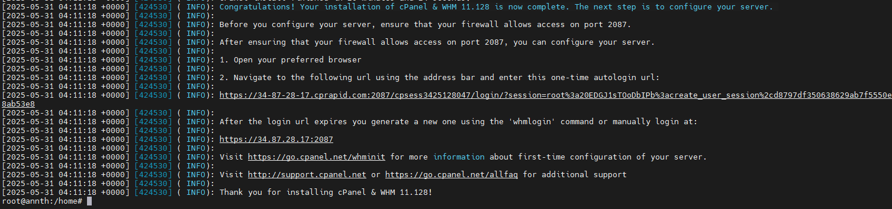
- Truy cập link kích hoạt dùng thử theo hướng dẫn, xác nhận mã từ mail:
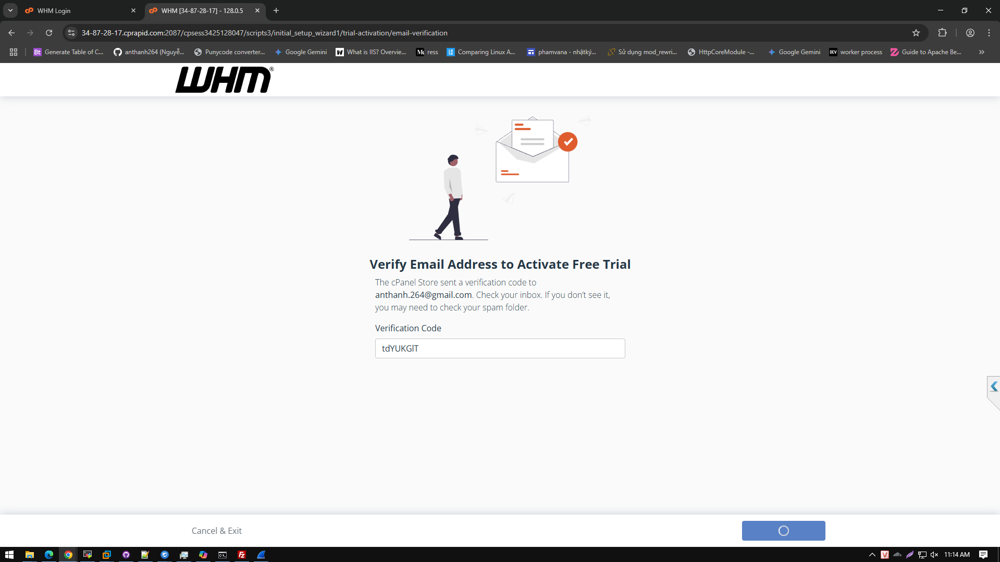
- Đăng ký gói dùng thử tại [cPanel - WHM Hosting Panel Free Trial License](https://cpanel.net/products/trial/)
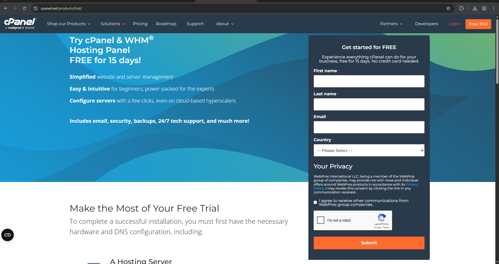
- Gói dùng thử 15 được kích hoạt 
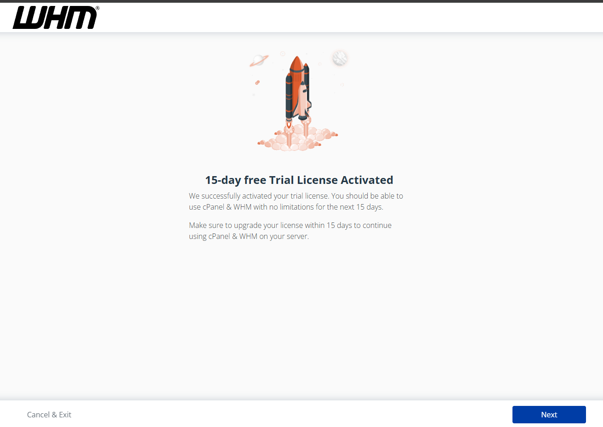
- Update cấu hình
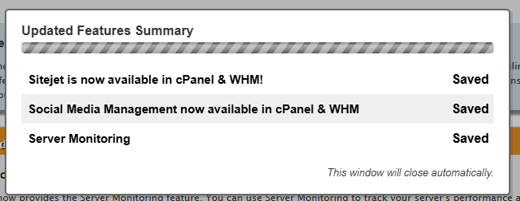
- Giao diện trang quản trị admin WHM
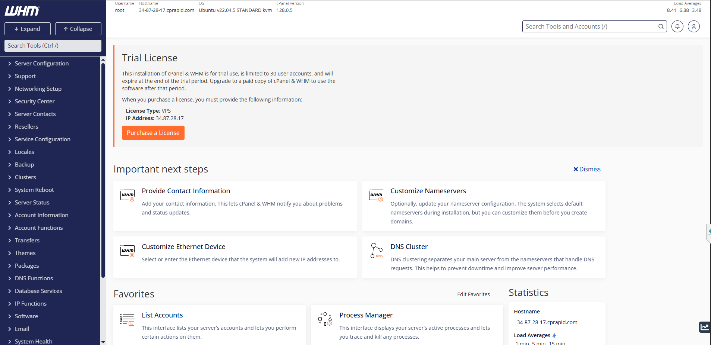
- Thay đổi mật khẩu tài khoản root: Server Configuration -> Change Root Password 
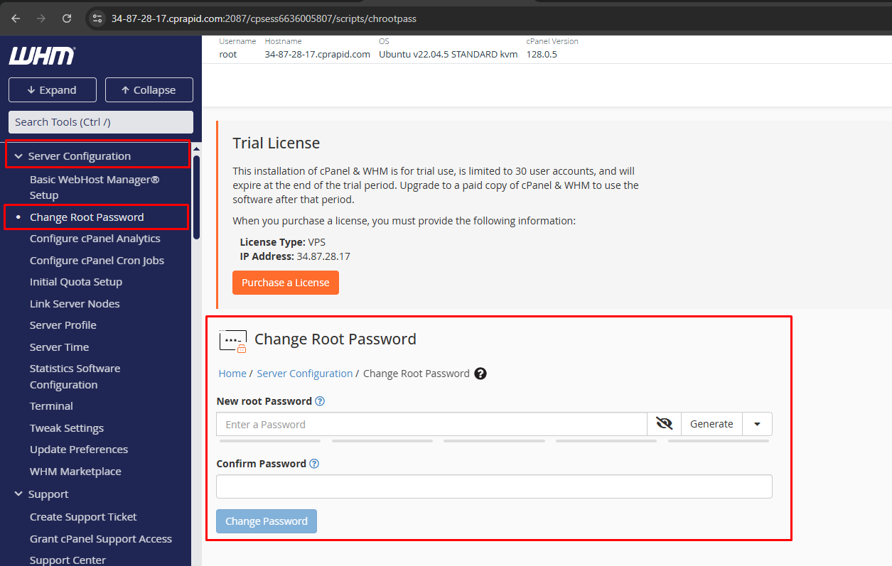

## 3. Cấu hình thử nghiệm cơ bản 

- Tạo gói hosting : Tại web quản trị WHM, tìm kiếm `package`, tại mục `Packages` -> `Add a package`
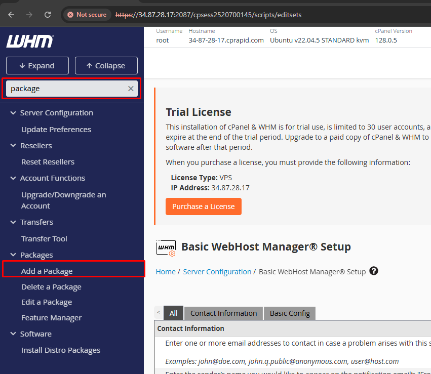
- Tại đây thực hiện đặt tên gói, các cấu hình liên quan 
	- 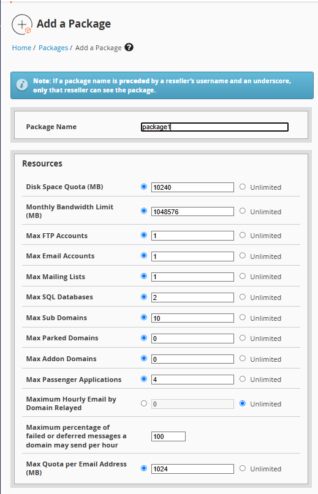
	- Dung lượng ổ đĩa: 10GB – Giới hạn không gian lưu trữ.
	- Băng thông: 1TB – Tổng dữ liệu có thể truyền tải mỗi tháng.
	- FTP & Email: 1 tài khoản – Giới hạn số lượng tài khoản FTP & Email.
	- Database: 2 MySQL – Số lượng cơ sở dữ liệu có thể tạo.
	- Subdomains: 10 – Số lượng subdomain được phép.
	- Parked & Addon Domains: 0 – Không thể chạy nhiều website trên cùng hosting.
	- Passenger Apps: 4 – Hỗ trợ ứng dụng web như Node.js, Ruby.
	- Giới hạn email: 1GB/tài khoản – Dung lượng lưu trữ email.
	- 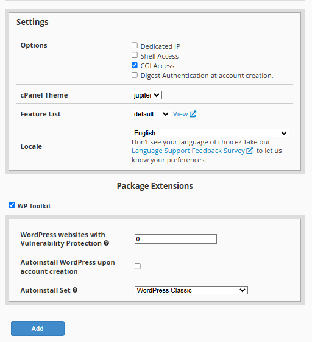
	- Dedicated IP: Không có IP riêng, dùng IP chung.
	- Shell Access: Không có SSH truy cập.
	- CGI Access: Cho phép chạy tập lệnh CGI.
	- Auto WordPress Install: Không tự cài WP khi tạo tài khoản.
	- WP Toolkit: Hỗ trợ quản lý WordPress.
	- Chọn ADD để thêm gói 

- Tạo account cho client sử dụng hosting ví dụ client username: test,password :`55bkRs0O'lPC^I~` domain: ngocdiep.site, gói sử dụng là package1
	- Tại web quản trị WHM, tìm kiếm `create new `, tại mục `Account Funtions` -> `Create New Account`
		- 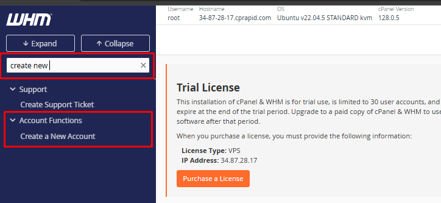
		- 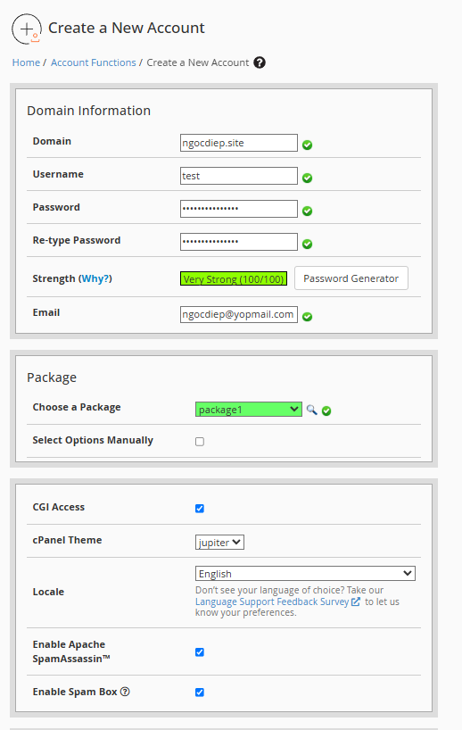
		- Tên miền: ngocdiep.site (Đã kiểm tra).
		- Tên người dùng: ngocdiep (Hợp lệ).
		- Mật khẩu: Độ mạnh 100/100 (Bảo mật cao).
		- Gói hosting: package1 (Dùng cấu hình có sẵn).
		- CGI Access: Bật (Hỗ trợ tập lệnh CGI).
		- SpamAssassin & Spam Box: Bật (Lọc thư rác).
		- Chọn `Create` để tạo tài khoản 
	- Tạo Account thành công 
	- 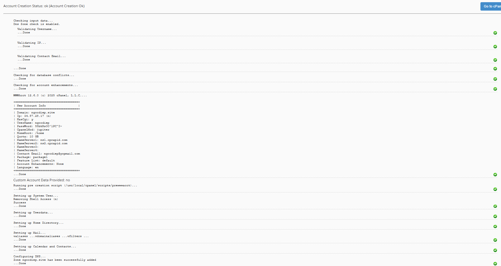
- Trỏ bản ghi A về IP hosting 
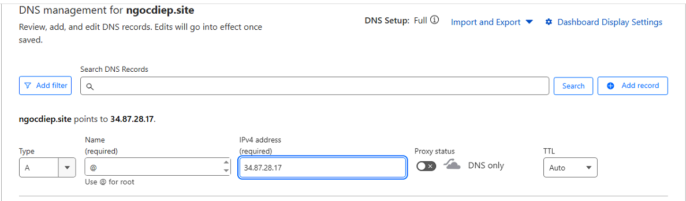
- Sử dụng tài khoản vừa tạo đăng nhập vào Cpanel quản trị website `https://34.87.28.17:2083/`
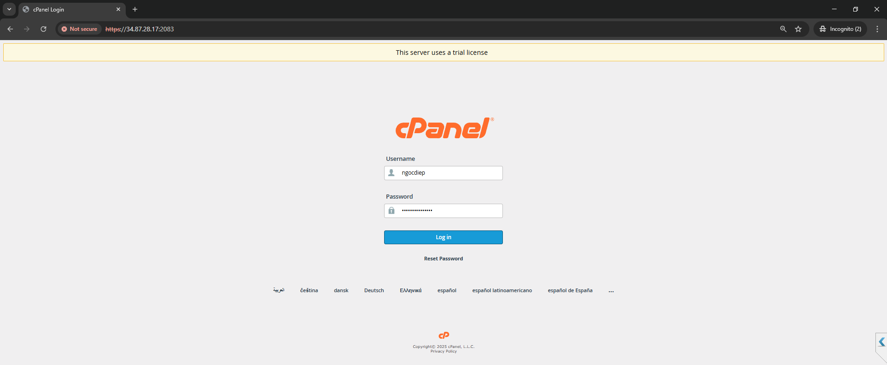
- Giao diện Cpanel quản trị website của client 
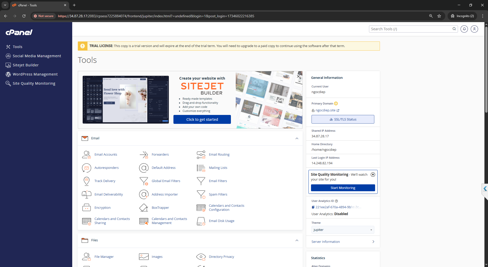
<!-- - Chọn mục `WordPress Management` -> `Install Wordpress` để triển khai thử:
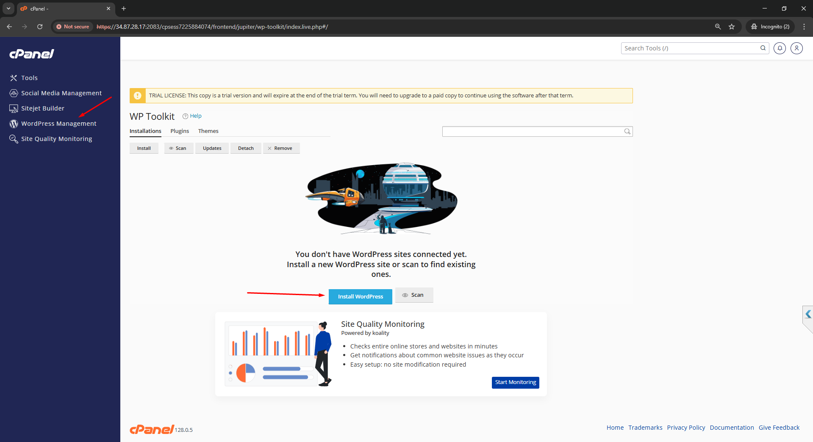
- Cấu hình các thông số cơ bản -> `Install`
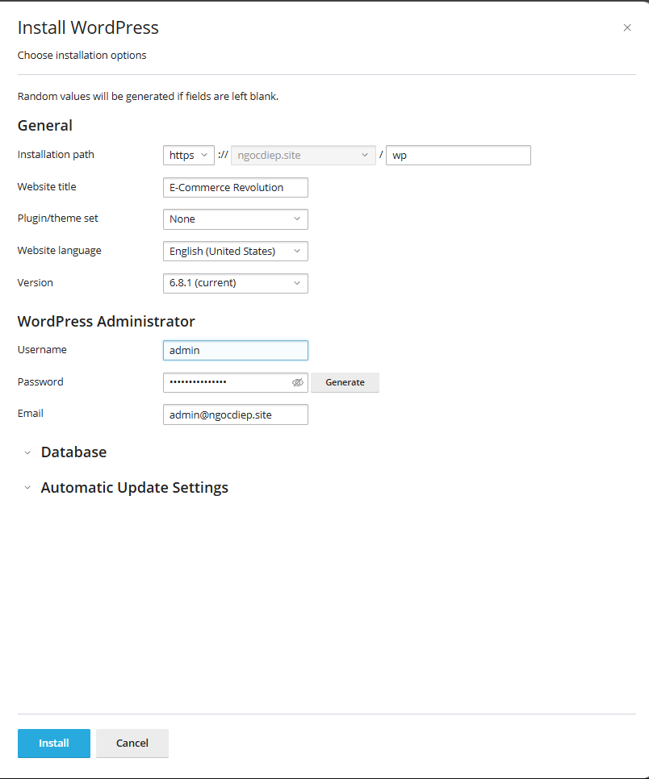
- Qúa trình cài đặt diễn ra
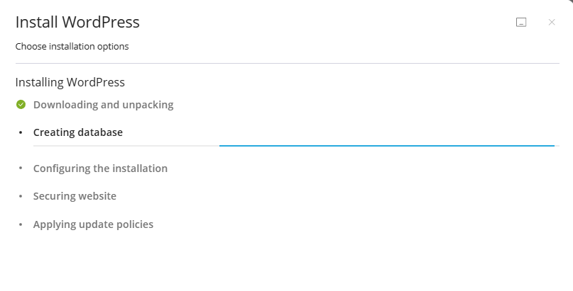
- Cài đặt xong 
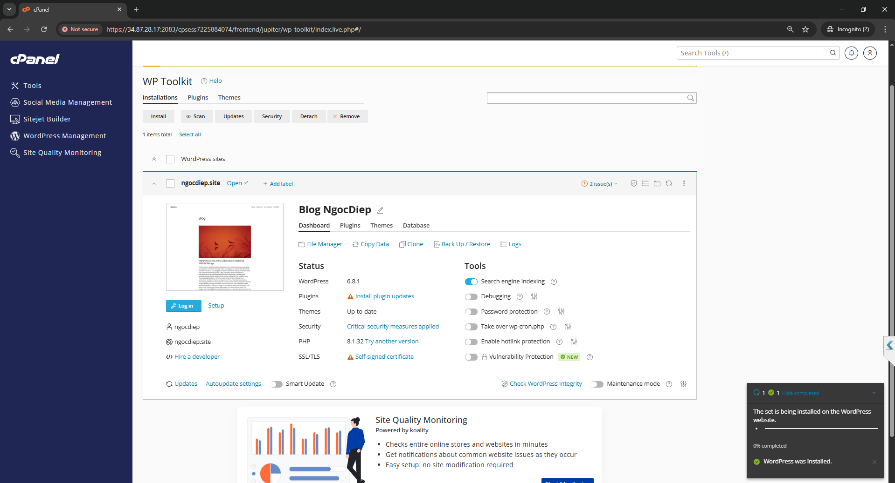
 -->
- Đăng nhập thử webmail 
https://webmail.ngocdiep.site/
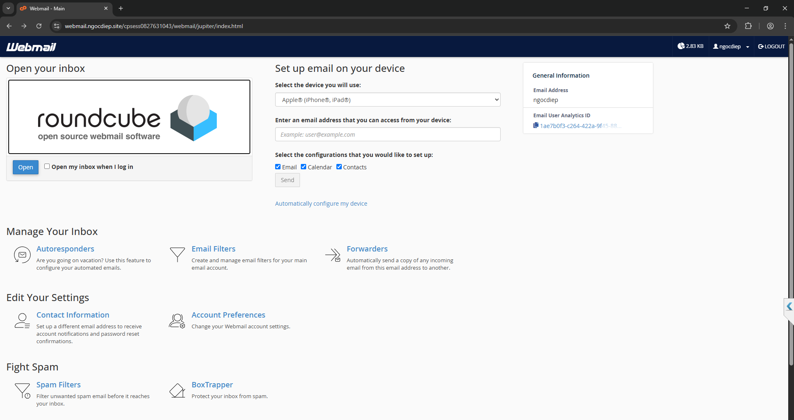
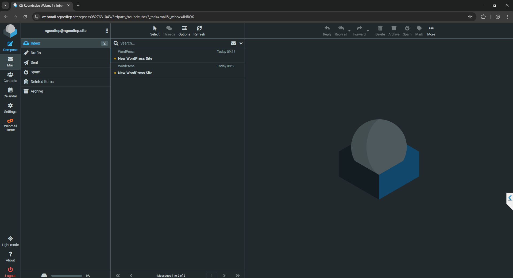

