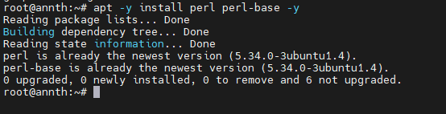
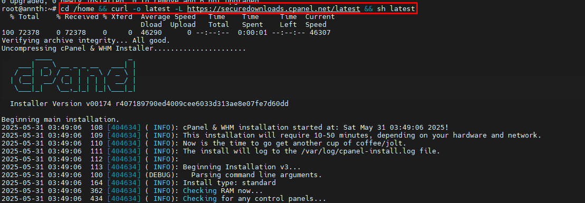

# Cpanel 
## 1. Tổng Quan
### 1.1 Cpanel
- cPanel là một nền tảng quản lý web hosting phổ biến, yêu cầu cấu hình hệ thống phù hợp để đảm bảo hoạt động ổn định và hiệu suất cao. Bản hướng dẫn này mô tả các yêu cầu hệ thống cần thiết để triển khai cPanel trên hệ điều hành Ubuntu 22.04 LTS, phiên bản được hỗ trợ chính thức.
### 1.2 Yêu cầu phần cứng

| Thành phần     | Tối thiểu     | Khuyến nghị                      |
| -------------- | ------------- | -------------------------------- |
| CPU            | 2 core        | 4 core trở lên                   |
| RAM            | 1GB           | 2GB trở lên                      |
| Dung lượng đĩa | 20GB          | 40GB trở lên                     |
| Kết nối mạng   | IPv4 bắt buộc | IPv6 không được hỗ trợ hoàn toàn |

Ghi chú: Máy chủ phải có địa chỉ IP tĩnh để hoạt động ổn định.

### 1.3 Yêu cầu phần mềm
- Trước khi tiến hành cài đặt, hệ thống cần được cấu hình với các gói phần mềm và công cụ sau:
- Cấu hình hệ điều hành: Cài đặt hệ điều hành Ubuntu 22.04 LTS sạch.
- Gói cần thiết:
	```
	apt update && apt install perl screen curl
	```
	- Perl: Cần thiết để chạy cPanel.
	- Screen: Cho phép chạy quá trình cài đặt mà không bị gián đoạn.
	- Curl: Hỗ trợ tải xuống và thực thi tập lệnh cPanel.

### 1.4 Cấu hình mạng
- Máy chủ phải có IPv4 hợp lệ.
- Nếu sử dụng NAT, cần đảm bảo:
- Cấu hình 1:1 NAT (ánh xạ IP nội bộ với IP công khai).
- Hỗ trợ NAT Loopback để đảm bảo các dịch vụ hoạt động đúng.

### 1.5 Yêu cầu về tên miền & DNS
- Hostname phải là FQDN hợp lệ (Ví dụ: server.example.com).
- Hostname không được trùng với các tên miền đang hoạt động trên hệ thống.
- Cấu hình DNS chính xác để đảm bảo khả năng phân giải đúng.

### 1.6 Yêu cầu bản quyền
- Mỗi máy chủ cPanel cần có license hợp lệ.
- Không thể chuyển một license giữa nhiều máy chủ.
- Kiểm tra license bằng lệnh:
```
curl -L https://verify.cpanel.net/

```
## Cài đặt  
- Cài đặt gói cần thiết 
```
apt -y install perl perl-base
```

- Run script cài đặt 
```
cd /home && curl -o latest -L https://securedownloads.cpanel.net/latest && sh latest
```
