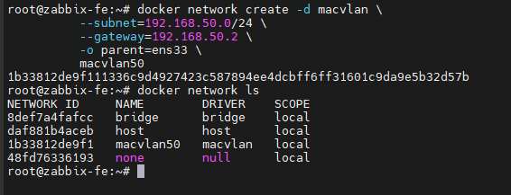
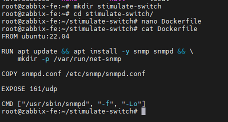
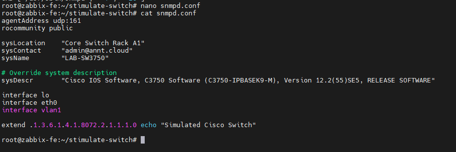
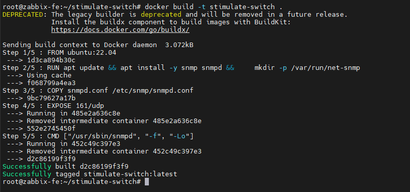
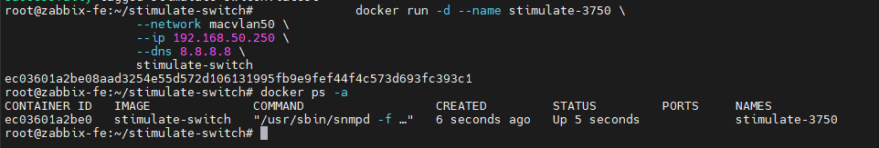

# Thiết lập Switch Cisco ảo bằng Docker
- Hướng dẫn này triển khai một container Docker mô phỏng switch Cisco trên mạng LAN, giúp các thiết bị khác trong mạng có thể truy cập được.
## Chuẩn bị
	- Một máy vật lý chạy hệ điều hành Linux.
	- Docker đã được cài đặt trên máy Linux. Nếu chưa cài đặt, có thể dùng lệnh sau:
	```Bash
	sudo apt install docker.io -y
	```
## Cấu hình mạng Docker với Macvlan
	- Để container Docker có thể truy cập trực tiếp trên mạng LAN, ta sẽ sử dụng mạng macvlan. Điều này cho phép container có địa chỉ IP riêng trên cùng một subnet với máy chủ.
		- Xác định giao diện mạng của máy chủ:
		- Đầu tiên, hãy tìm tên giao diện mạng của máy chủ đang kết nối vào mạng LAN. Thường có thể tìm thấy bằng lệnh ip addr hoặc ip link. Tìm một giao diện có địa chỉ IP trong mạng LAN. Các tên phổ biến bao gồm eth0, ens33, enp0s3, v.v.
	- Tạo mạng Macvlan: Chạy lệnh sau, điều chỉnh subnet, gateway và parent (giao diện máy chủ) để phù hợp với cấu hình mạng LAN:
	```Bash
	docker network create -d macvlan \
	  --subnet=192.168.50.0/24 \
	  --gateway=192.168.50.2 \
	  -o parent=ens33 \
	  macvlan50
	```
		-`--subnet=192.168.50.0/24`: Thay thế bằng dải IP subnet của mạng LAN.
		-`--gateway=192.168.50.2`: Thay thế bằng địa chỉ IP gateway của mạng LAN.
		-`-o parent=ens33`: Thay thế ens33 bằng tên giao diện mạng thực tế của máy chủ.
		-`macvlan50`: Tên của mạng macvlan sẽ tạo.
	- Để kiểm tra xem mạng đã được tạo thành công chưa, có thể dùng:
	```Bash
	docker network ls
	```
	- 
## Chuẩn bị Dockerfile và cấu hình SNMP
	- Tiếp theo, ta sẽ tạo một Dockerfile để xây dựng image cho container, cùng với một file cấu hình SNMP để container hoạt động như một switch Cisco.
		- Tạo Dockerfile: Tạo một file có tên Dockerfile (không có phần mở rộng) và dán nội dung sau vào:
		```
		mkdir stimulate-switch
		cd stimulate-switch
		nano Dockerfile
		```
		- Nội dung 
		```Dockerfile
		FROM ubuntu:22.04
		RUN apt update && \
			apt install -y snmp snmpd && \
			mkdir -p /var/run/net-snmp
		COPY snmpd.conf /etc/snmp/snmpd.conf
		EXPOSE 161/udp
		CMD ["/usr/sbin/snmpd", "-f", "-Lo"]
		```
		- 
		- Dockerfile này sẽ tạo một image dựa trên Ubuntu 22.04.
			- Nó cài đặt snmp và snmpd (daemon SNMP).
			- Tạo thư mục /var/run/net-snmp cần thiết cho snmpd.
			- Sao chép file cấu hình snmpd.conf (sẽ tạo ở bước tiếp theo) vào đúng vị trí.
			- Mở cổng UDP 161, là cổng mặc định cho SNMP.
			- CMD chạy daemon snmpd khi container khởi động.
	- Tạo file cấu hình SNMP (snmpd.conf):
		- Tạo một file có tên snmpd.conf trong cùng thư mục với Dockerfile và dán nội dung sau vào:
		```
		nano snmpd.conf
		```
		```Bash
		cat > snmpd.conf << 'EOF'
		agentAddress udp:161
		rocommunity public
		sysLocation     "Core Switch Rack A1"
		sysContact      "admin@annt.cloud"
		sysName         "LAB-SW3750"
		# Override system description
		sysDescr        "Cisco IOS Software, C3750 Software (C3750-IPBASEK9-M), Version 12.2(55)SE5, RELEASE SOFTWARE"

		interface lo
		interface eth0
		interface vlan1
		extend .1.3.6.1.4.1.8072.2.1.1.1.0 echo "Simulated Cisco Switch"
		EOF
		```
		- 
		- File này cấu hình daemon SNMP để mô phỏng một switch Cisco:
		- `rocommunity public`: Thiết lập community string chỉ đọc là "public".
		- `sysLocation, sysContact, sysName, sysDescr`: Cung cấp thông tin mô tả về thiết bị. sysDescr đặc biệt quan trọng để mô phỏng phiên bản Cisco IOS.
		- `interface lo, interface eth0, interface vlan1:` Giả lập các giao diện mạng.
		- `extend`: Cho phép thêm các OID tùy chỉnh, ở đây để thêm một thông điệp "Simulated Cisco Switch".

## Build và chạy Container
	- Build Image:
		- Trong cùng thư mục chứa Dockerfile và snmpd.conf, chạy lệnh sau để xây dựng image:
		```Bash
		docker build -t stimulate-switch .
		```
		- 
		- `docker build`: Lệnh để xây dựng image Docker.
		- `-t stimulate-switch`: Gán tag (tên) là fake-cisco-switch cho image.
		- `.`: Chỉ định rằng Dockerfile nằm trong thư mục hiện tại.
		- Quá trình này có thể mất vài phút tùy thuộc vào tốc độ mạng.
	- Chạy Container:
		- Sau khi image được xây dựng, chạy container bằng lệnh sau:
		```Bash
		docker run -d --name stimulate-3750 \
		  --network macvlan50 \
		  --ip 192.168.50.250 \
		  --dns 8.8.8.8 \
		  stimulate-switch
		```
		- 
		- `-d`: Chạy container ở chế độ nền (detached mode).
		- `--name stimulate-3750`: Đặt tên cho container là stimulate-3750.
		- `--network macvlan50`: Kết nối container vào mạng macvlan50 đã tạo ở Bước 1.
		- `--ip 192.168.50.250`: Gán địa chỉ IP tĩnh 192.168.50.250 cho container. Hãy chắc chắn rằng địa chỉ IP này chưa được sử dụng trong mạng LAN của quý vị và nằm trong dải subnet đã khai báo.
		- `--dns 8.8.8.8`: Cấu hình DNS cho container (có thể thay đổi nếu cần).
		- `stimulate-switch`: Tên của image đã build.
- Kiểm tra 
```
docker ps -a 
```


Here's the English translation of your guide:

-----

# Setting Up a Virtual Cisco Switch with Docker

This guide explains how to deploy a Docker container that simulates a Cisco switch on your local area network (LAN), making it accessible to other devices on the network.

## Prerequisites

  * A physical machine running the **Linux** operating system.
  * **Docker** installed on your Linux machine. If it's not installed, you can use the following command:
    ```bash
    sudo apt install docker.io -y
    ```

-----

## Configure Docker Network with Macvlan

To enable direct access to your Docker container on the LAN, we'll use a **macvlan** network. This allows the container to have its own IP address within the same subnet as your host machine.

  * **Identify Your Host Machine's Network Interface:**
    First, find the name of your host machine's network interface connected to the LAN. You can usually find this using the `ip addr` or `ip link` command. Look for an interface with an IP address on your LAN. Common names include `eth0`, `ens33`, `enp0s3`, etc.

  * **Create the Macvlan Network:**
    Run the following command, adjusting the **subnet**, **gateway**, and **parent** (your host interface) to match your LAN configuration:

    ```bash
    docker network create -d macvlan \
      --subnet=192.168.50.0/24 \
      --gateway=192.168.50.2 \
      -o parent=ens33 \
      macvlan50
    ```

      * `--subnet=192.168.50.0/24`: Replace this with your LAN's IP subnet range.
      * `--gateway=192.168.50.2`: Replace this with your LAN's gateway IP address.
      * `-o parent=ens33`: Replace `ens33` with the actual name of your host's network interface.
      * `macvlan50`: This is the name of the macvlan network that will be created.

  * To check if the network was successfully created, you can use:

    ```bash
    docker network ls
    ```

-----

## Prepare Dockerfile and SNMP Configuration

Next, we'll create a Dockerfile to build the container image, along with an SNMP configuration file to make the container function as a Cisco switch.

  * **Create Dockerfile:**
    Create a directory named `stimulate-switch`, navigate into it, and then create a file named `Dockerfile` (without any extension). Paste the following content into it:

    ```bash
    mkdir stimulate-switch
    cd stimulate-switch
    nano Dockerfile
    ```

    *Dockerfile Content:*

    ```dockerfile
    FROM ubuntu:22.04
    RUN apt update && \
        apt install -y snmp snmpd && \
        mkdir -p /var/run/net-snmp
    COPY snmpd.conf /etc/snmp/snmpd.conf
    EXPOSE 161/udp
    CMD ["/usr/sbin/snmpd", "-f", "-Lo"]
    ```

      * This Dockerfile will create an image based on **Ubuntu 22.04**.
      * It installs `snmp` and `snmpd` (the SNMP daemon).
      * It creates the `/var/run/net-snmp` directory, which `snmpd` requires.
      * It copies the `snmpd.conf` configuration file (which you'll create in the next step) to the correct location.
      * It exposes **UDP port 161**, which is the default port for SNMP.
      * The `CMD` command runs the `snmpd` daemon when the container starts.

  * **Create SNMP Configuration File (`snmpd.conf`):**
    Create a file named `snmpd.conf` in the same directory as your Dockerfile and paste the following content into it:

    ```bash
    nano snmpd.conf
    ```

    ```bash
    cat > snmpd.conf << 'EOF'
    agentAddress udp:161
    rocommunity public
    sysLocation     "Core Switch Rack A1"
    sysContact      "admin@annt.cloud"
    sysName         "LAB-SW3750"
    # Override system description
    sysDescr        "Cisco IOS Software, C3750 Software (C3750-IPBASEK9-M), Version 12.2(55)SE5, RELEASE SOFTWARE"

    interface lo
    interface eth0
    interface vlan1
    extend .1.3.6.1.4.1.8072.2.1.1.1.0 echo "Simulated Cisco Switch"
    EOF
    ```

    This file configures the SNMP daemon to simulate a Cisco switch:

      * `rocommunity public`: Sets the read-only community string to "public".
      * `sysLocation`, `sysContact`, `sysName`, `sysDescr`: Provide descriptive information about the device. `sysDescr` is particularly important for simulating a Cisco IOS version.
      * `interface lo`, `interface eth0`, `interface vlan1`: Simulate network interfaces.
      * `extend`: Allows adding custom OIDs; here, it adds a "Simulated Cisco Switch" message.

-----

## Build and Run the Container

Now, we'll build the Docker image from your Dockerfile and run the container, assigning it an IP address on the macvlan network you created.

  * **Build the Image:**
    In the same directory containing your `Dockerfile` and `snmpd.conf`, run the following command to build the image:

    ```bash
    docker build -t stimulate-switch .
    ```

      * `docker build`: The command to build a Docker image.
      * `-t stimulate-switch`: Assigns the tag (name) `stimulate-switch` to the image.
      * `.`: Specifies that the Dockerfile is in the current directory.
        This process might take a few minutes, depending on your network speed.

  * **Run the Container:**
    After the image is built, run the container using the following command:

    ```bash
    docker run -d --name stimulate-3750 \
      --network macvlan50 \
      --ip 192.168.50.250 \
      --dns 8.8.8.8 \
      stimulate-switch
    ```

      * `-d`: Runs the container in detached mode (in the background).
      * `--name stimulate-3750`: Assigns the name `stimulate-3750` to the container.
      * `--network macvlan50`: Connects the container to the `macvlan50` network created in Step 1.
      * `--ip 192.168.50.250`: Assigns the static IP address `192.168.50.250` to the container. **Ensure this IP address is not already in use on your LAN and is within the declared subnet range.**
      * `--dns 8.8.8.8`: Configures DNS for the container (you can change this if needed).
      * `stimulate-switch`: The name of the image you built.